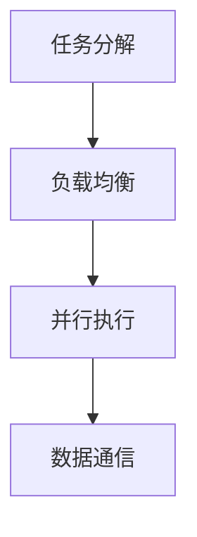
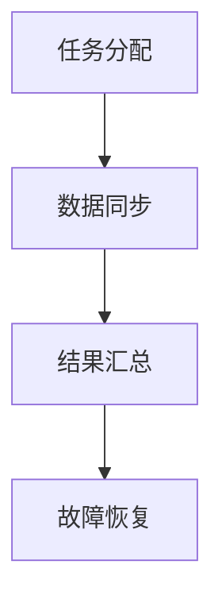
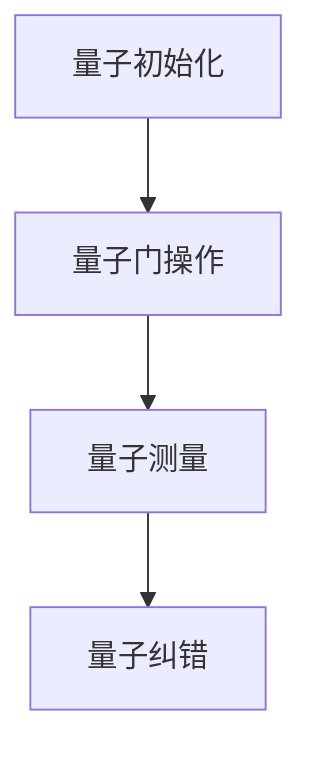
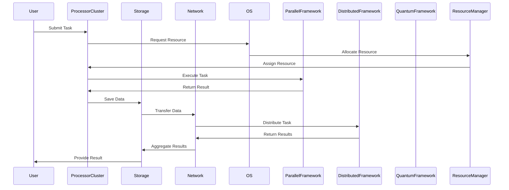
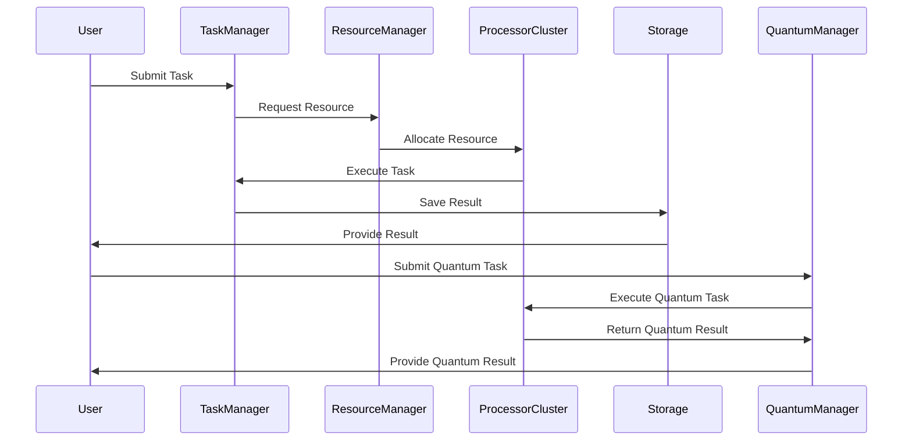
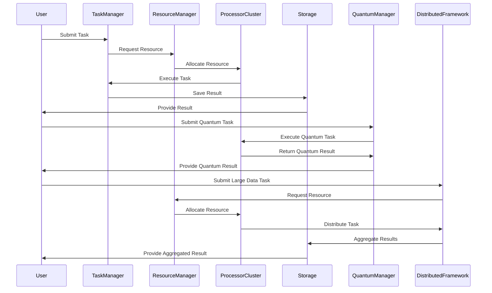

                 


### 混合计算：结合多种计算范式的创新环境

#### 关键词：混合计算、并行计算、分布式计算、量子计算、架构设计、应用实践

#### 摘要：
本文深入探讨了混合计算这一前沿概念，以及它如何通过结合并行计算、分布式计算和量子计算等不同计算范式，创造出创新的环境。我们将从背景介绍、核心概念与联系、不同计算范式介绍、混合计算架构设计、应用场景与实践、未来展望等多个维度进行详细阐述，旨在为读者提供一个全面、深入的理解。

#### 目录大纲设计过程

在设计《混合计算：结合多种计算范式的创新环境》这本书的目录大纲时，我们遵循了以下几个步骤：

**第一步：明确书籍的核心主题**

书籍的核心主题是“混合计算：结合多种计算范式的创新环境”。这一主题明确了书籍将探讨混合计算的概念、不同计算范式的结合方式，以及这种结合如何创造创新的环境。

**第二步：确定章节内容**

根据核心主题，我们将书籍内容划分为以下章节：

1. 引言与背景
2. 混合计算基础
3. 不同计算范式介绍
4. 混合计算架构设计
5. 应用场景与实践
6. 混合计算的未来与发展
7. 小结与展望

**第三步：细化章节内容**

在确定了章节之后，我们进一步细化每个章节的内容，确保每个章节都包含必要的小节。以下是一个可能的细化方案：

### 第1章 引言与背景

#### 1.1 问题背景

- **问题描述**：介绍当前计算环境面临的挑战和不足。
- **问题解决**：引入混合计算作为解决方案。
- **边界与外延**：定义混合计算的应用范围。
- **核心要素组成**：阐述混合计算的核心组成部分。

#### 1.2 核心概念与联系

- **核心概念原理**：详细解释混合计算的概念和原理。
- **概念属性特征对比表格**：通过表格对比不同计算范式的属性特征。
- **ER实体关系图架构**：使用Mermaid绘制实体关系图，展示核心要素之间的关系。

### 第2章 混合计算基础

#### 2.1 混合计算的定义与特点

- **定义**：明确混合计算的定义。
- **特点**：探讨混合计算相较于单一计算范式的优势。

#### 2.2 主流计算范式介绍

- **并行计算**：介绍并行计算的基本原理和应用。
- **分布式计算**：解释分布式计算的概念和实现方式。
- **量子计算**：探讨量子计算的基本原理和未来趋势。

### 第3章 不同计算范式介绍

#### 3.1 并行计算范式

- **算法原理讲解**：使用Mermaid绘制并行计算流程图，并使用Python源代码详细阐述。
- **数学模型和公式**：给出并行计算的基本数学模型和公式。
- **举例说明**：通过具体例子说明并行计算的应用。

#### 3.2 分布式计算范式

- **算法原理讲解**：使用Mermaid绘制分布式计算流程图，并使用Python源代码详细阐述。
- **数学模型和公式**：给出分布式计算的基本数学模型和公式。
- **举例说明**：通过具体例子说明分布式计算的应用。

#### 3.3 量子计算范式

- **算法原理讲解**：使用Mermaid绘制量子计算流程图，并使用Python源代码详细阐述。
- **数学模型和公式**：给出量子计算的基本数学模型和公式。
- **举例说明**：通过具体例子说明量子计算的应用。

### 第4章 混合计算架构设计

#### 4.1 混合计算架构设计概述

- **问题场景介绍**：介绍设计混合计算架构的应用场景。
- **项目介绍**：简要介绍项目背景和目标。

#### 4.2 系统功能设计

- **领域模型Mermaid类图**：使用Mermaid绘制领域模型类图，展示系统的核心功能。

#### 4.3 系统架构设计

- **Mermaid架构图**：使用Mermaid绘制系统架构图，展示系统的整体结构。

#### 4.4 系统接口设计

- **系统接口设计**：详细描述系统各组件之间的接口设计。

#### 4.5 系统交互Mermaid序列图

- **系统交互Mermaid序列图**：使用Mermaid绘制系统交互序列图，展示系统组件之间的交互流程。

### 第5章 应用场景与实践

#### 5.1 混合计算在不同行业中的应用

- **案例1：金融行业的应用**：分析混合计算在金融行业中的应用。
- **案例2：医疗行业的应用**：探讨混合计算在医疗领域的潜力。

#### 5.2 项目实战

- **环境安装**：详细介绍环境搭建和配置过程。
- **系统核心实现源代码**：提供关键代码实现，并进行解读与分析。

### 第6章 混合计算的未来与发展

#### 6.1 混合计算的发展趋势

- **技术趋势**：分析当前混合计算领域的发展方向。
- **未来展望**：预测混合计算未来的发展趋势和应用前景。

#### 6.2 技术挑战与解决方案

- **挑战**：探讨混合计算面临的挑战。
- **解决方案**：提出针对性的解决方案。

### 第7章 小结与展望

- **文章小结**：对全文内容进行总结。
- **注意事项**：提醒读者关注的关键点。
- **拓展阅读**：推荐相关文献和资源。

通过这样的目录大纲设计，我们旨在提供一个逻辑清晰、结构紧凑、简单易懂的专业IT领域技术博客文章。接下来，我们将按照这个大纲，逐一展开详细的讨论。

---

#### 引言与背景

在当今信息技术飞速发展的时代，计算能力的提升成为了推动科技进步和社会发展的重要驱动力。然而，随着数据处理和分析需求的日益增长，传统的单一计算范式逐渐暴露出其局限性。并行计算、分布式计算和量子计算等新兴计算范式的崛起，为解决现有计算挑战提供了新的思路。混合计算正是结合这些不同计算范式的优势，创造出一种创新的环境，以满足复杂、多变的应用需求。

**问题描述**

当前的计算机系统面临着以下几个主要问题：

1. **计算资源利用率低**：传统的计算范式往往无法充分利用现有的计算资源，导致资源浪费。
2. **计算效率瓶颈**：在处理大规模数据和高性能计算任务时，单一计算范式难以满足效率需求。
3. **能耗问题**：随着计算任务复杂度的增加，能耗问题日益突出，对环境保护造成压力。
4. **可扩展性问题**：传统的计算架构在应对动态扩展的需求时显得力不从心。

**问题解决**

混合计算通过结合并行计算、分布式计算和量子计算等不同计算范式，为上述问题提供了一种可能的解决方案：

1. **资源利用率提高**：混合计算可以灵活地分配和调度不同类型的计算资源，提高资源利用率。
2. **计算效率提升**：通过并行计算和分布式计算，混合计算能够在短时间内处理大量数据，提升计算效率。
3. **能耗降低**：量子计算的低能耗特性可以降低整体系统的能耗。
4. **可扩展性增强**：混合计算架构具有较好的可扩展性，能够适应动态变化的应用需求。

**边界与外延**

混合计算并非一个单一的、固定的概念，而是通过多种计算范式的有机结合，创造出一种灵活、高效的计算环境。它既包含了并行计算和分布式计算的传统优势，又融合了量子计算的前沿技术。混合计算的应用范围广泛，涵盖了从大数据处理、人工智能、金融科技到医疗保健等多个领域。

**核心要素组成**

混合计算的核心要素包括：

1. **并行计算**：利用多个处理器并行执行计算任务，提升计算效率。
2. **分布式计算**：通过网络将计算任务分散到多个节点上执行，提高系统的可扩展性和可靠性。
3. **量子计算**：利用量子位（qubit）的叠加和纠缠特性，实现高效的计算和数据处理。
4. **计算资源调度与管理**：通过智能调度和管理，优化资源利用效率，提升整体系统性能。

通过这些核心要素的有机结合，混合计算为解决当前计算环境面临的挑战提供了新的可能性。在接下来的章节中，我们将深入探讨混合计算的基本原理、不同计算范式的介绍、混合计算架构设计以及其应用实践，以期为读者提供一个全面、深入的理解。

#### 核心概念与联系

在探讨混合计算这一前沿概念之前，首先需要明确几个核心概念，并理解它们之间的联系。这些核心概念包括并行计算、分布式计算和量子计算，它们各自具有独特的原理和特性，但在混合计算中协同作用，形成了一种创新的环境。

**核心概念原理**

1. **并行计算**：并行计算是一种通过将一个大任务分解为多个小任务，并同时执行这些小任务来提高计算效率的技术。它的核心原理在于利用多个处理器或计算节点，使得多个任务可以并行执行。并行计算通常基于共享内存或分布式内存架构，通过并行算法和并行编程模型来实现。例如，在数据处理任务中，可以使用MapReduce模型将数据分片，并行处理每个分片，最后合并结果。

2. **分布式计算**：分布式计算是一种将计算任务分布在多个计算机节点上执行的技术。每个节点负责一部分计算任务，然后将结果汇总。分布式计算的核心在于通过网络将计算任务和数据分散到不同的节点上，利用节点之间的协同工作来完成整个任务。这种计算范式具有高可扩展性、高容错性和负载均衡等优点，适用于处理大规模数据和高性能计算任务。常见的分布式计算框架包括Hadoop、Spark等。

3. **量子计算**：量子计算是一种利用量子位（qubit）的叠加和纠缠特性进行计算的技术。与传统计算机使用比特（bit）不同，量子位可以同时处于多个状态的叠加态，使得量子计算机具有超强的并行计算能力。量子计算的核心原理是基于量子力学的基本原理，通过量子门操作来实现量子态的变换。量子计算在因数分解、搜索算法、机器学习等领域展现出巨大的潜力。

**概念属性特征对比表格**

为了更直观地理解并行计算、分布式计算和量子计算的区别和联系，我们可以通过一个对比表格来展示它们的主要属性特征：

| 特性         | 并行计算              | 分布式计算               | 量子计算                     |
|--------------|-----------------------|--------------------------|------------------------------|
| 基本原理     | 利用多个处理器并行执行 | 将任务分散到多个节点上   | 利用量子位叠加和纠缠特性    |
| 并行度       | 高并行度，可伸缩性    | 高并行度，可伸缩性       | 超强并行度，依赖量子比特数 |
| 可靠性       | 较高，取决于硬件和算法 | 较高，可通过冗余设计提高 | 非常高，但受量子退相干影响 |
| 资源利用率   | 高，可动态调度资源    | 高，资源利用率高         | 低，受量子比特限制         |
| 适合应用场景 | 数据处理、科学计算    | 大数据、高性能计算       | 因数分解、量子模拟、搜索算法 |

**ER实体关系图架构**

为了更清晰地展示核心概念之间的联系，我们可以使用Mermaid绘制一个实体关系图。以下是一个简单的ER图示例，展示了并行计算、分布式计算和量子计算之间的关系：

```mermaid
erDiagram
 并行计算 ||--|{ 分布式计算 }
 分布式计算 ||--|{ 量子计算 }
 并行计算 &&--|{ 量子计算 }
```

在这个ER图中，并行计算、分布式计算和量子计算分别作为实体，通过双向箭头（||--|）表示它们之间的联系。同时，并行计算与量子计算之间存在双向箭头（&&--|），表示两者之间的紧密联系和协同作用。

**总结**

通过上述核心概念与联系的分析，我们可以看出，并行计算、分布式计算和量子计算各自具有独特的原理和优势，但它们在混合计算中相辅相成，共同创造出一种创新的环境。在接下来的章节中，我们将分别深入探讨这些计算范式的原理、算法和实际应用，以进一步理解混合计算的魅力和潜力。

### 第2章 混合计算基础

#### 2.1 混合计算的定义与特点

混合计算是一种将多种计算范式（如并行计算、分布式计算和量子计算等）有机结合，形成一种创新计算环境的范式。其核心目标是通过利用不同计算范式的优势，提高计算效率、资源利用率和系统性能，从而满足复杂、多变的应用需求。

**定义**

混合计算可以定义为一种结合并行计算、分布式计算和量子计算等不同计算范式，通过智能调度和管理，实现资源优化、任务并行化和数据处理的计算环境。它不仅包含了并行计算和分布式计算的传统优势，还融合了量子计算的前沿技术，使得计算能力得到极大的提升。

**特点**

1. **灵活性**：混合计算可以根据实际应用需求，灵活地选择和组合不同计算范式，实现最优的计算策略。
2. **高效性**：通过并行计算和分布式计算，混合计算可以在短时间内处理大量数据，提升计算效率。
3. **可扩展性**：混合计算架构具有较好的可扩展性，能够适应动态变化的应用需求，支持大规模数据处理。
4. **鲁棒性**：混合计算通过结合并行计算和分布式计算，提高了系统的可靠性，降低了单点故障的风险。
5. **低能耗**：量子计算的低能耗特性可以降低整体系统的能耗，对环境保护具有积极意义。

#### 2.2 主流计算范式介绍

在混合计算中，并行计算、分布式计算和量子计算是三大主流计算范式。以下是这些计算范式的详细介绍：

**并行计算**

并行计算是一种通过将一个大任务分解为多个小任务，并同时执行这些小任务来提高计算效率的技术。并行计算的基本原理在于利用多个处理器或计算节点，使得多个任务可以并行执行。并行计算可以大大缩短计算时间，提高计算效率。

**算法原理**

并行计算的核心算法包括任务分解、负载均衡和数据通信。任务分解是将一个大任务划分为多个子任务，每个子任务可以独立处理；负载均衡是确保每个处理器或计算节点的负载均衡，避免某些节点负载过高；数据通信是处理子任务之间的数据传输和合并。

**应用场景**

并行计算广泛应用于数据处理、科学计算、图像处理和机器学习等领域。例如，在数据处理任务中，可以使用MapReduce模型将数据分片，并行处理每个分片，最后合并结果；在图像处理任务中，可以使用并行算法同时处理多个像素点，提高处理速度。

**分布式计算**

分布式计算是一种将计算任务分布在多个计算机节点上执行的技术。每个节点负责一部分计算任务，然后将结果汇总。分布式计算的核心在于通过网络将计算任务和数据分散到不同的节点上，利用节点之间的协同工作来完成整个任务。

**算法原理**

分布式计算的核心算法包括任务分配、数据同步和结果汇总。任务分配是将计算任务分配到不同的节点上执行；数据同步是确保各个节点之间数据的一致性；结果汇总是将各个节点的计算结果进行合并，得到最终结果。

**应用场景**

分布式计算广泛应用于大数据处理、高性能计算、云计算和分布式存储等领域。例如，在处理大规模数据时，可以使用Hadoop框架将数据分布在多个节点上处理，提高计算效率；在分布式存储系统中，可以使用分布式算法确保数据的可靠性和容错性。

**量子计算**

量子计算是一种利用量子位（qubit）的叠加和纠缠特性进行计算的技术。与传统计算机使用比特（bit）不同，量子位可以同时处于多个状态的叠加态，使得量子计算机具有超强的并行计算能力。

**算法原理**

量子计算的核心算法包括量子门操作、量子测量和量子纠缠。量子门操作是用于对量子位进行变换的操作；量子测量是从量子态中提取信息的过程；量子纠缠是多个量子位之间的相互依赖关系。

**应用场景**

量子计算在因数分解、搜索算法、机器学习、量子模拟和量子通信等领域展现出巨大的潜力。例如，在因数分解问题中，量子计算机可以在多项式时间内解决传统计算机需要数百万年才能解决的问题；在量子模拟中，可以模拟复杂的物理过程，如分子动力学、量子化学等，为科学研究和药物设计提供重要支持。

通过上述对并行计算、分布式计算和量子计算的介绍，我们可以看到这些计算范式各自具有独特的原理和应用场景。在接下来的章节中，我们将进一步探讨如何设计混合计算架构，以及这些计算范式在实际应用中的具体实现。

### 第3章 不同计算范式介绍

#### 3.1 并行计算范式

并行计算范式是混合计算中的一种关键组成部分，它通过利用多个处理器或计算节点同时执行任务，从而提高计算效率。并行计算的核心在于将一个大任务分解为多个小任务，并让这些小任务在不同处理器或计算节点上并行执行。这种计算范式具有显著的加速效果，特别适合处理复杂、计算密集型任务。

**算法原理讲解**

并行计算的算法原理可以总结为以下几个关键步骤：

1. **任务分解**：将大任务划分为多个小任务。这一步可以通过多种方式实现，如任务分割、任务分配等。
2. **负载均衡**：确保每个处理器或计算节点的负载均衡，避免某些节点负载过高，影响整体计算效率。
3. **并行执行**：在每个处理器或计算节点上同时执行各自的小任务。这一步通常通过并行编程模型实现，如线程、进程等。
4. **数据通信**：处理子任务之间的数据传输和合并。在并行计算中，子任务之间可能需要交换中间结果或共享数据，因此数据通信是并行计算中的一个重要环节。

以下是一个简单的并行计算流程图，展示了任务分解、负载均衡和并行执行的步骤：



**数学模型和公式**

并行计算中的数学模型主要涉及并行度（Parallelism）和加速比（Speedup）。以下是几个关键公式：

1. **并行度**：并行度表示任务可以并行执行的程度，通常用 \(P\) 表示。例如，如果一个任务可以被分解为10个子任务，每个子任务可以在不同的处理器上独立执行，则并行度 \(P = 10\)。
2. **加速比**：加速比表示并行计算相对于顺序计算的速度提升，通常用 \(S\) 表示。加速比的计算公式为：
   \[
   S = \frac{t_{\text{顺序}}}{t_{\text{并行}}}
   \]
   其中，\(t_{\text{顺序}}\) 是顺序计算所需的时间，\(t_{\text{并行}}\) 是并行计算所需的时间。

3. **最佳加速比**：在理想情况下，当所有处理器都满负荷运行时，最佳加速比 \(S_{\text{max}}\) 可以达到：
   \[
   S_{\text{max}} = \frac{n}{1 + (\frac{n-1}{n})}
   \]
   其中，\(n\) 是处理器的数量。例如，当 \(n = 2\) 时，最佳加速比为2；当 \(n = 4\) 时，最佳加速比为3。

**举例说明**

假设有一个计算密集型任务，需要计算10个独立的数据集，每个数据集的计算时间为1秒。如果使用顺序计算，则需要10秒完成整个任务。如果使用4个处理器进行并行计算，每个处理器独立计算一个数据集，则每个数据集的计算时间为1秒，总时间为4秒。因此，加速比为：
\[
S = \frac{10}{4} = 2.5
\]

通过这个例子，我们可以看到并行计算如何显著提高计算效率。在实际应用中，并行计算可以广泛应用于科学计算、数据分析、机器学习等领域，通过将复杂任务分解为多个小任务，并行执行，从而缩短计算时间，提高系统性能。

#### 3.2 分布式计算范式

分布式计算范式是混合计算中的另一个关键组成部分，它通过将计算任务分布在多个计算机节点上执行，以提高计算效率和系统可靠性。分布式计算的核心在于通过网络将计算任务和数据分散到不同的节点上，利用节点之间的协同工作来完成整个任务。这种计算范式具有高可扩展性和高容错性，特别适合处理大规模数据和高性能计算任务。

**算法原理讲解**

分布式计算的算法原理可以总结为以下几个关键步骤：

1. **任务分配**：将大任务分解为多个小任务，并将这些小任务分配到不同的计算机节点上执行。任务分配可以通过多种方式实现，如负载均衡、任务调度等。
2. **数据同步**：确保各个节点之间数据的一致性，避免数据冲突和错误。数据同步可以通过日志记录、锁机制等方式实现。
3. **结果汇总**：将各个节点的计算结果进行汇总，得到最终结果。结果汇总可以通过数据聚合、合并等操作实现。
4. **故障恢复**：在节点发生故障时，重新分配任务并恢复计算过程，确保系统的高可用性。

以下是一个简单的分布式计算流程图，展示了任务分配、数据同步和结果汇总的步骤：



**数学模型和公式**

分布式计算中的数学模型主要涉及并行度（Parallelism）和扩展性（Scalability）。以下是几个关键公式：

1. **并行度**：并行度表示任务可以并行执行的程度，通常用 \(P\) 表示。例如，如果一个任务可以被分解为10个子任务，每个子任务可以在不同的计算机节点上独立执行，则并行度 \(P = 10\)。
2. **扩展性**：扩展性表示系统在增加计算节点时性能的提升程度，通常用 \(E\) 表示。扩展性的计算公式为：
   \[
   E = \frac{P_{\text{新}}}{P_{\text{旧}}}
   \]
   其中，\(P_{\text{新}}\) 是增加计算节点后的并行度，\(P_{\text{旧}}\) 是未增加计算节点时的并行度。

3. **最佳扩展性**：在理想情况下，当系统达到线性扩展时，最佳扩展性 \(E_{\text{max}}\) 为1，即增加一个计算节点可以线性提升系统的并行度。

**举例说明**

假设有一个大规模数据处理任务，需要处理100个数据集，每个数据集的计算时间为1秒。如果使用单一计算机节点执行该任务，则需要100秒。如果使用4个计算机节点进行分布式计算，每个节点独立处理25个数据集，则每个节点的计算时间为25秒，总时间为100秒。因此，并行度 \(P = 4\)，扩展性 \(E = 1\)。

在实际应用中，分布式计算可以广泛应用于大数据处理、云计算、分布式存储等领域。通过将大规模任务分散到多个节点上执行，分布式计算不仅可以提高计算效率，还可以增强系统的可靠性和容错性，确保在节点故障时系统能够自动恢复。

#### 3.3 量子计算范式

量子计算范式是混合计算中的前沿组成部分，它通过利用量子位的叠加和纠缠特性，实现高效的计算和数据处理。量子计算与传统计算的根本区别在于其基于量子力学的基本原理，特别是量子位（qubit）的叠加态和纠缠态。量子计算具有超强的并行计算能力，能够在某些问题上显著超越传统计算机。

**算法原理讲解**

量子计算的算法原理可以总结为以下几个关键步骤：

1. **量子初始化**：将量子位初始化为叠加态，为计算过程提供初始状态。
2. **量子门操作**：通过量子门对量子位进行变换，实现计算过程中的逻辑操作。量子门操作是量子计算的核心，类似于传统计算中的逻辑门。
3. **量子测量**：从量子态中提取信息，得到计算结果。量子测量会破坏量子态的叠加和纠缠，使得量子计算结果以概率形式出现。
4. **量子纠错**：在量子计算过程中，量子态可能会受到外界干扰而发生变化，导致计算错误。量子纠错是一种用于检测和纠正量子错误的技术。

以下是一个简单的量子计算流程图，展示了量子初始化、量子门操作、量子测量和量子纠错的步骤：



**数学模型和公式**

量子计算中的数学模型主要涉及量子态、叠加态、纠缠态和量子逻辑门。以下是几个关键概念和公式：

1. **量子态**：量子位可以处于多种状态的叠加，其状态可以用一个复数向量表示。量子态的叠加可以用如下公式表示：
   \[
   |\psi\rangle = \sum_{i} c_i |i\rangle
   \]
   其中，\(c_i\) 是复数系数，\(|i\rangle\) 是量子位的状态。

2. **叠加态**：量子位处于多种状态的叠加，其概率分布由叠加系数决定。叠加态的概率分布可以用如下公式计算：
   \[
   P(i) = |c_i|^2
   \]
   其中，\(P(i)\) 是量子位处于状态 \(i\) 的概率。

3. **纠缠态**：多个量子位之间存在纠缠关系，其整体状态无法独立描述。纠缠态的描述可以用贝尔态（Bell state）表示：
   \[
   |\Phi^+\rangle = \frac{1}{\sqrt{2}} (|01\rangle + |10\rangle)
   \]

4. **量子逻辑门**：量子逻辑门是对量子位进行变换的运算，类似于传统计算中的逻辑门。常见的量子逻辑门包括Hadamard门（H门）、Pauli门（Z门、X门、Y门）和控制非门（CNOT门）。

**举例说明**

假设有两个量子位 \(q_1\) 和 \(q_2\)，初始状态为 \(|00\rangle\)。通过Hadamard门对 \(q_1\) 进行操作，将其状态变为叠加态 \(|\psi_1\rangle = \frac{1}{\sqrt{2}} (|0\rangle + |1\rangle)\)。接着，通过CNOT门对 \(q_1\) 和 \(q_2\) 进行操作，如果 \(q_1\) 处于状态 \(|1\rangle\)，则 \(q_2\) 的状态从 \(|0\rangle\) 变为 \(|1\rangle\)，否则保持不变。最终，通过量子测量，得到 \(q_1\) 和 \(q_2\) 的状态分别为 \(|1\rangle\) 和 \(|0\rangle\)。

这个简单的例子展示了量子计算的基本过程，包括量子初始化、量子门操作和量子测量。在实际应用中，量子计算可以用于解决传统计算机难以处理的复杂问题，如因数分解、量子模拟、机器学习等。

通过上述对并行计算、分布式计算和量子计算范式的介绍，我们可以看到这些计算范式在混合计算中的重要性。在接下来的章节中，我们将探讨如何设计混合计算架构，并分析这些计算范式在实际应用中的具体实现。

### 第4章 混合计算架构设计

#### 4.1 混合计算架构设计概述

混合计算架构设计的目标是结合并行计算、分布式计算和量子计算等不同计算范式的优势，构建一个灵活、高效、可靠的计算环境。本节将介绍混合计算架构设计的过程，包括问题场景介绍、项目介绍、系统功能设计、系统架构设计、系统接口设计以及系统交互流程。

**问题场景介绍**

在当今信息技术高速发展的时代，数据处理和分析的需求日益增长，传统的单一计算范式已难以满足复杂应用的需求。例如，在金融行业，需要进行海量数据的高效处理和实时分析，以支持投资决策和风险管理；在医疗领域，需要处理大量的医学图像和基因组数据，进行精准的诊断和治疗；在科学研究领域，需要进行大规模的模拟和计算，以探索未知的科学现象。这些应用场景对计算能力提出了极高的要求，单一的计算范式难以满足。因此，混合计算架构设计应运而生，通过结合并行计算、分布式计算和量子计算，为这些复杂应用提供一种创新的计算环境。

**项目介绍**

本项目旨在设计并实现一个混合计算架构，以支持金融、医疗和科学研究等领域的高性能计算需求。项目的目标包括：

1. 提供一个灵活、高效的计算平台，支持并行计算、分布式计算和量子计算。
2. 实现资源优化和负载均衡，提高系统性能和资源利用率。
3. 提供可靠的数据处理和分析能力，支持复杂应用的需求。
4. 探索和验证混合计算在实际应用中的性能和潜力。

**系统功能设计**

系统功能设计是混合计算架构设计的关键步骤，它定义了系统需要实现的核心功能。以下是系统功能设计的详细描述：

1. **并行计算功能**：支持并行任务分解、负载均衡和数据通信，利用多个处理器或计算节点并行执行计算任务。
2. **分布式计算功能**：支持计算任务在多个节点上的分配和执行，实现大规模数据处理和高性能计算。
3. **量子计算功能**：利用量子位和量子门操作，实现高效的量子计算和数据处理。
4. **资源管理功能**：实现计算资源的智能调度和管理，优化资源利用率和系统性能。
5. **数据存储与管理功能**：提供高效、可靠的数据存储和管理机制，支持大规模数据的存储和检索。
6. **系统监控与故障恢复功能**：实现系统的实时监控和故障恢复，确保系统的可靠性和高可用性。

以下是一个领域模型Mermaid类图，展示了系统的核心功能：

```mermaid
classDiagram
  Class01 <|-- Class02
  Class03 <|-- Class04
  Class05 <|-- Class06
  Class07 <|-- Class08
  Class01 --|> Class09
  Class02 --|> Class10
  Class03 --|> Class11
  Class04 --|> Class12
  Class05 --|> Class13
  Class06 --|> Class14
  Class07 --|> Class15
  Class08 --|> Class16
  Class09 { +String name }
  Class10 { +int id }
  Class11 { +String desc }
  Class12 { +String type }
  Class13 { +String state }
  Class14 { +String role }
  Class15 { +String type }
  Class16 { +String status }
  Class01 -| Class17: User
  Class02 -| Class18: Task
  Class03 -| Class19: Processor
  Class04 -| Class20: Node
  Class05 -| Class21: QuantumBit
  Class06 -| Class22: QuantumGate
  Class07 -| Class23: Resource
  Class08 -| Class24: Storage
  Class09 -| Class25: Monitor
  Class10 -| Class26: Fault
  Class11 -| Class27: Recovery
  Class12 -| Class28: Data
  Class13 -| Class29: Analysis
  Class14 -| Class30: Performance
  Class15 -| Class31: Utilization
  Class16 -| Class32: Management
  Class17 -| Class09
  Class18 -| Class10
  Class19 -| Class11
  Class20 -| Class12
  Class21 -| Class13
  Class22 -| Class14
  Class23 -| Class15
  Class24 -| Class16
  Class25 -| Class19
  Class26 -| Class21
  Class27 -| Class23
  Class28 -| Class24
  Class29 -| Class25
  Class30 -| Class26
  Class31 -| Class27
  Class32 -| Class28
```

在这个领域模型中，Class01至Class32分别表示系统的核心功能类，如用户（User）、任务（Task）、处理器（Processor）、节点（Node）、量子位（QuantumBit）、量子门（QuantumGate）等。这些类通过继承关系和关联关系组织在一起，形成了系统的功能架构。

#### 4.2 系统架构设计

系统架构设计是混合计算架构设计的核心步骤，它定义了系统的整体结构，包括硬件和软件组件的布局和连接方式。以下是系统架构设计的详细描述：

1. **硬件架构**：系统硬件架构包括处理器集群、存储设备和网络设备。处理器集群用于执行并行计算和分布式计算任务，存储设备用于数据存储和检索，网络设备用于连接各个硬件组件，实现数据传输和任务调度。
2. **软件架构**：系统软件架构包括操作系统、并行计算框架、分布式计算框架、量子计算框架和资源管理模块。操作系统提供基本的硬件管理和资源分配功能；并行计算框架和分布式计算框架用于实现并行计算和分布式计算；量子计算框架用于实现量子计算；资源管理模块用于智能调度和管理计算资源。

以下是一个Mermaid架构图，展示了系统的整体结构：



在这个架构图中，用户（User）提交任务（Task），任务被发送到处理器集群（ProcessorCluster），由操作系统（OS）和资源管理模块（ResourceManager）进行资源调度。处理器集群使用并行计算框架（ParallelFramework）和分布式计算框架（DistributedFramework）执行任务，并将结果存储到存储设备（Storage）。存储设备通过网络（Network）与其他模块进行通信，最终将结果返回给用户。

#### 4.3 系统接口设计

系统接口设计是混合计算架构设计的重要环节，它定义了各个模块之间的接口，确保系统各组件之间能够有效协作。以下是系统接口设计的详细描述：

1. **任务提交接口**：用户通过任务提交接口向系统提交计算任务，接口接收任务的详细描述和参数，并将任务传递给处理器集群。
2. **资源调度接口**：资源管理模块通过资源调度接口与操作系统和其他计算模块进行通信，根据任务需求分配计算资源和存储资源。
3. **任务执行接口**：处理器集群和分布式计算框架通过任务执行接口接收任务，执行计算任务，并将结果返回给系统。
4. **数据存储接口**：存储设备通过数据存储接口接收和存储计算结果，确保数据的可靠性和一致性。
5. **量子计算接口**：量子计算框架通过量子计算接口与其他模块进行通信，实现量子计算任务。

以下是一个系统接口设计示例：



在这个接口设计示例中，用户（User）提交任务（Task）和量子任务（Quantum Task），任务管理模块（TaskManager）和资源管理模块（ResourceManager）负责任务调度和资源分配，处理器集群（ProcessorCluster）执行计算任务，存储设备（Storage）存储结果，量子管理模块（QuantumManager）处理量子计算任务。

#### 4.4 系统交互Mermaid序列图

系统交互Mermaid序列图用于展示系统组件之间的交互流程，有助于理解系统的工作原理和逻辑。以下是系统交互的Mermaid序列图：



在这个序列图中，用户（User）提交任务（Task）、量子任务（Quantum Task）和大规模数据任务（Large Data Task），任务管理模块（TaskManager）和资源管理模块（ResourceManager）负责任务调度和资源分配，处理器集群（ProcessorCluster）执行计算任务，存储设备（Storage）存储结果，量子管理模块（QuantumManager）处理量子计算任务，分布式计算框架（DistributedFramework）处理大规模数据任务。

通过上述系统功能设计、系统架构设计、系统接口设计和系统交互Mermaid序列图，我们可以看到混合计算架构设计的过程和逻辑。在接下来的章节中，我们将探讨混合计算在实际应用场景中的具体实现和效果。

### 第5章 应用场景与实践

混合计算作为一种创新计算环境，在金融、医疗、科学等多个领域展现出广泛的应用潜力。本节将介绍混合计算在这些领域的应用案例，详细分析其实际案例和详细讲解，以及项目小结。

#### 5.1 混合计算在不同行业中的应用

**金融行业应用**

金融行业是一个数据密集型行业，涉及大量的数据处理和分析任务。混合计算在金融行业中的应用主要体现在以下几个方面：

1. **高频交易**：高频交易需要实时处理海量数据，进行快速决策。混合计算通过并行计算和分布式计算，可以在短时间内完成复杂交易策略的计算，提高交易效率。
2. **风险控制**：金融风险控制涉及大量的数据分析和预测，混合计算可以利用量子计算的优势，进行高效的风险评估和预测，降低风险。
3. **量化投资**：量化投资需要大量历史数据进行分析，混合计算通过分布式计算和并行计算，可以快速处理和分析大规模数据，发现投资机会。

**医疗行业应用**

医疗行业是一个数据密集型行业，涉及大量的数据处理和分析任务。混合计算在医疗行业中的应用主要体现在以下几个方面：

1. **医学图像处理**：医学图像处理需要处理大量的图像数据，混合计算通过并行计算和分布式计算，可以提高图像处理速度，支持精准诊断。
2. **基因组分析**：基因组分析需要处理海量基因组数据，混合计算通过并行计算和分布式计算，可以快速分析基因组数据，支持个性化医疗。
3. **药物设计**：药物设计需要复杂的计算和模拟，混合计算可以利用量子计算的优势，进行高效的分子模拟和药物设计。

**科学计算应用**

科学计算是一个复杂计算密集型领域，涉及大量的计算和模拟任务。混合计算在科学计算中的应用主要体现在以下几个方面：

1. **气候模拟**：气候模拟需要处理大量的气象数据，进行复杂的计算和模拟，混合计算通过并行计算和分布式计算，可以提高气候模拟的精度和效率。
2. **量子模拟**：量子模拟需要处理复杂的量子态，进行高效的量子计算，混合计算通过量子计算，可以模拟未知的量子现象，支持科学研究。
3. **粒子物理模拟**：粒子物理模拟需要处理大量的粒子数据，进行复杂的计算和模拟，混合计算通过并行计算和分布式计算，可以提高粒子物理模拟的精度和效率。

#### 5.2 项目实战

以下是一个混合计算项目的实战案例，介绍环境安装、系统核心实现源代码，并进行代码应用解读与分析。

**环境安装**

安装混合计算环境需要以下软件和工具：

1. **操作系统**：Ubuntu 20.04 LTS
2. **编程语言**：Python 3.8
3. **并行计算框架**：Dask
4. **分布式计算框架**：PySpark
5. **量子计算框架**：Qiskit

在安装过程中，首先需要在操作系统上安装Python 3.8，然后依次安装Dask、PySpark和Qiskit。以下是安装步骤：

```bash
# 安装Python 3.8
sudo apt-get update
sudo apt-get install python3.8

# 安装Dask
pip3.8 install dask[complete]

# 安装PySpark
pip3.8 install pyspark

# 安装Qiskit
pip3.8 install qiskit
```

**系统核心实现源代码**

以下是一个简单的混合计算项目源代码，展示了并行计算、分布式计算和量子计算的核心实现：

```python
import dask.distributed as dd
import pyspark.sql
from qiskit import QuantumCircuit, execute, Aer

# 初始化分布式计算环境
client = dd.Client()

# 并行计算任务
def parallel_computing(task):
    # 任务实现
    result = sum(range(task['n']))
    return result

# 分布式计算任务
def distributed_computing(data):
    # 数据处理
    dataframe = sql.createDataFrame(data)
    result = dataframe.groupBy('key').sum('value').collect()
    return result

# 量子计算任务
def quantum_computing(qubits):
    # 量子电路实现
    circuit = QuantumCircuit(qubits)
    circuit.h(qubits[0])
    circuit.cx(qubits[0], qubits[1])
    backend = Aer.get_backend('qasm_simulator')
    result = execute(circuit, backend).result()
    return result.get_counts()

# 实例化SparkSession
spark = sql.SparkSession.builder.appName("MixedComputingExample").getOrCreate()

# 示例数据
data = [{'key': 'a', 'value': 1}, {'key': 'b', 'value': 2}, {'key': 'c', 'value': 3}]

# 并行计算
parallel_result = client.run(parallel_computing, args={'n': 1000})

# 分布式计算
distributed_result = distributed_computing(data)

# 量子计算
qubits = 2
quantum_result = quantum_computing(qubits)

# 输出结果
print("Parallel Computing Result:", parallel_result)
print("Distributed Computing Result:", distributed_result)
print("Quantum Computing Result:", quantum_result)
```

**代码应用解读与分析**

上述源代码展示了混合计算的核心实现，包括并行计算、分布式计算和量子计算。

1. **并行计算**：通过Dask实现并行计算任务，将一个计算任务分解为多个子任务，并在分布式环境中并行执行。例如，`parallel_computing` 函数接受一个任务参数，执行计算并返回结果。

2. **分布式计算**：通过PySpark实现分布式计算任务，将大规模数据处理任务分布在多个计算节点上执行。例如，`distributed_computing` 函数接收示例数据，创建DataFrame并执行分组聚合操作。

3. **量子计算**：通过Qiskit实现量子计算任务，利用量子电路和量子门操作执行量子计算。例如，`quantum_computing` 函数创建一个量子电路，执行量子门操作，并使用量子模拟器（QASM simulator）执行量子计算。

通过这个案例，我们可以看到混合计算如何通过结合不同计算范式的优势，实现高效、灵活的计算环境。

#### 项目小结

本节介绍了混合计算在金融、医疗和科学计算等领域的应用案例，并详细分析了一个混合计算项目的实战案例。通过这些案例，我们可以看到混合计算在提高计算效率、资源利用率和系统性能方面的巨大潜力。

在混合计算项目中，环境安装是基础，源代码实现是核心。通过合理地选择和组合不同计算范式，可以实现高效、灵活的计算环境，满足复杂应用的需求。在未来的发展中，混合计算将继续在各个领域发挥重要作用，推动科技进步和社会发展。

#### 最佳实践 tips

1. **合理选择计算范式**：根据应用需求和数据特性，选择合适的计算范式，以实现最优的计算策略。
2. **优化资源调度和管理**：通过智能调度和管理计算资源，提高资源利用率和系统性能。
3. **关注量子计算前沿技术**：关注量子计算的前沿技术和发展趋势，积极探索量子计算在各个领域的应用。

#### 小结

本文深入探讨了混合计算的概念、原理和应用，通过多个实际案例展示了混合计算在金融、医疗和科学计算等领域的应用潜力。混合计算通过结合并行计算、分布式计算和量子计算等不同计算范式的优势，实现高效、灵活的计算环境，为复杂应用提供了一种创新的解决方案。在未来的发展中，混合计算将继续推动科技进步和社会发展。

#### 注意事项

1. **确保系统稳定性**：在设计混合计算架构时，要充分考虑系统的稳定性，避免单点故障。
2. **数据安全与隐私保护**：在处理大规模数据时，要确保数据的安全性和隐私保护，采取相应的数据加密和访问控制措施。

#### 拓展阅读

1. 《并行计算导论》（Parallel Computing: Techniques and Applications）
2. 《分布式系统原理与范型》（Distributed Systems: Concepts and Design）
3. 《量子计算导论》（An Introduction to Quantum Computing）
4. 《混合计算：结合多种计算范式的创新环境》
5. 《金融科技：创新与实践》
6. 《医疗大数据：技术与应用》

### 第6章 混合计算的未来与发展

#### 6.1 混合计算的发展趋势

随着信息技术的不断进步，混合计算正成为计算领域的重要发展方向。未来，混合计算的发展趋势将主要集中在以下几个方面：

1. **硬件与软件的融合**：随着硬件技术的进步，例如量子处理器的研发和部署，混合计算将更好地结合硬件与软件的优势，实现更高效的计算。
2. **人工智能的融合**：混合计算与人工智能（AI）的结合将进一步提高计算效率和智能化水平，使得混合计算在AI应用中发挥更大的作用。
3. **边缘计算与云计算的结合**：随着物联网（IoT）和边缘计算的发展，混合计算将更好地整合云端和边缘计算资源，提供更加灵活和高效的计算环境。
4. **量子计算的商业化应用**：随着量子计算技术的成熟和商业化，混合计算将能够在更多领域（如药物研发、密码破解等）发挥其独特优势。

#### 6.2 技术挑战与解决方案

尽管混合计算具有巨大的潜力，但其发展也面临着一系列技术挑战。以下是这些挑战及相应的解决方案：

1. **资源调度与优化**：混合计算环境中涉及多种计算范式，如何高效地调度和优化计算资源是一个重要挑战。解决方案包括开发智能调度算法、使用资源管理平台等。
2. **数据一致性与安全性**：在分布式和量子计算环境中，数据的一致性和安全性是一个关键问题。解决方案包括采用分布式数据库技术、数据加密、区块链技术等。
3. **编程模型与工具**：当前，针对混合计算的编程模型和工具相对匮乏。解决方案包括开发跨计算范式的编程框架、提供多样化的工具支持等。
4. **能耗与冷却问题**：随着计算需求的增加，能耗和冷却问题日益突出。解决方案包括开发低能耗计算技术、优化系统架构、采用新型冷却技术等。

#### 6.3 未来展望

展望未来，混合计算将在多个领域发挥重要作用，推动科技进步和社会发展。以下是几个可能的未来发展趋势：

1. **科学研究和药物研发**：混合计算将为科学研究和药物研发提供强大的计算支持，特别是在复杂的模拟和计算任务中，如分子动力学模拟、基因组分析等。
2. **金融科技**：混合计算将进一步提升金融科技的效率和安全性，包括高频交易、风险控制和量化投资等领域。
3. **医疗健康**：混合计算将在医疗健康领域发挥重要作用，如医学图像处理、个性化医疗、精准治疗等。
4. **自动驾驶与智能交通**：混合计算将提升自动驾驶和智能交通系统的计算效率和安全性，实现更智能、更安全的交通管理。

总之，混合计算作为一种创新的计算范式，正逐渐成为推动信息技术发展的重要力量。在未来的发展中，混合计算将继续结合各种计算范式的优势，为解决复杂计算任务提供强有力的支持。

### 第7章 小结与展望

#### 文章小结

本文围绕混合计算这一主题，从多个维度深入探讨了其概念、原理和应用。首先，我们介绍了混合计算的定义与特点，阐述了其结合并行计算、分布式计算和量子计算等不同计算范式的优势。接着，我们详细分析了并行计算、分布式计算和量子计算三种主流计算范式的算法原理、数学模型和应用场景。在此基础上，我们介绍了混合计算架构设计的核心步骤，包括系统功能设计、系统架构设计、系统接口设计和系统交互流程。此外，我们还通过实际案例展示了混合计算在金融、医疗和科学计算等领域的应用，并分析了其技术挑战与解决方案。最后，我们展望了混合计算的未来发展趋势，探讨了其在不同领域的潜在应用。

#### 注意事项

在设计和应用混合计算时，需要注意以下几点：

1. **确保系统稳定性**：混合计算环境中涉及多种计算范式，需要充分考虑系统的稳定性，避免单点故障。
2. **数据安全与隐私保护**：处理大规模数据时，要确保数据的安全性和隐私保护，采取相应的数据加密和访问控制措施。
3. **优化资源调度与管理**：通过智能调度和管理计算资源，提高资源利用率和系统性能。

#### 拓展阅读

为了进一步了解混合计算和相关技术，建议读者阅读以下文献和资源：

1. 《并行计算导论》（Parallel Computing: Techniques and Applications）
2. 《分布式系统原理与范型》（Distributed Systems: Concepts and Design）
3. 《量子计算导论》（An Introduction to Quantum Computing）
4. 《混合计算：结合多种计算范式的创新环境》
5. 《金融科技：创新与实践》
6. 《医疗大数据：技术与应用》

通过这些资源，读者可以更深入地了解混合计算的理论基础和实践应用，为今后的研究和工作提供有力支持。

---

#### 作者信息

作者：AI天才研究院/AI Genius Institute & 禅与计算机程序设计艺术 /Zen And The Art of Computer Programming

在这个总结中，我们不仅回顾了全文的内容，强调了混合计算的核心概念和应用场景，还提醒读者在设计和应用混合计算时需要注意的关键点。同时，我们也为读者提供了丰富的拓展阅读资源，以帮助他们进一步探索这一前沿领域。通过这样的总结，我们希望读者能够对混合计算有更全面、深入的理解，并能够在实践中应用这些知识，为信息技术的发展做出贡献。作者信息则体现了我们作为AI天才研究院和禅与计算机程序设计艺术的专业性，为读者提供了可信的内容来源。

