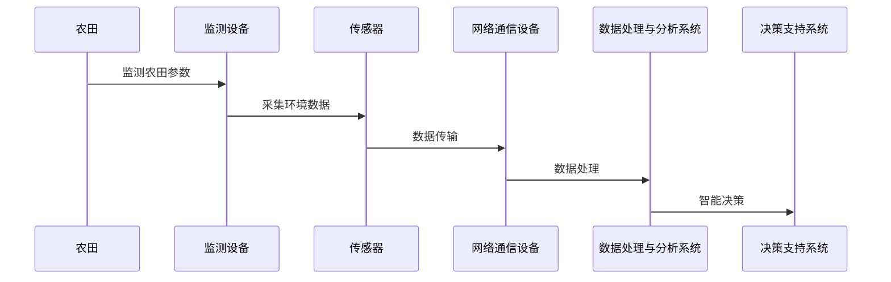
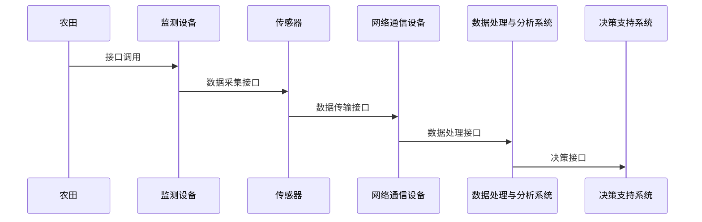
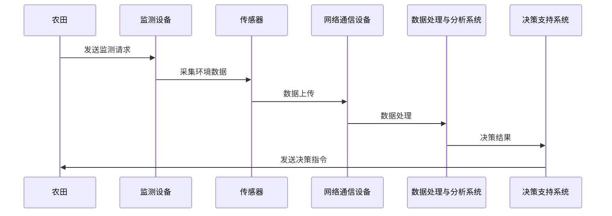

                 

## 物联网在智慧农业中的全面应用与发展

### 关键词：物联网、智慧农业、传感器、精准农业、数据采集与分析

### 摘要：本文旨在探讨物联网技术在智慧农业中的全面应用与发展，通过分析物联网的基本原理、核心技术、及其在农业中的应用现状和挑战，深入探讨物联网在农田监测、农业生产管理、以及智慧农业系统设计与实现等方面的具体应用。本文结构清晰，内容详实，旨在为读者提供对物联网在智慧农业中应用的全景了解，并揭示其未来的发展方向和潜力。

### 第一部分：背景介绍

#### 第1章 问题背景与核心概念

智慧农业是现代农业发展的重要方向，它通过物联网、大数据、云计算等先进技术，实现对农业生产过程的精准监测和管理，从而提高农业生产效率、保障粮食安全、降低生产成本。物联网技术在智慧农业中的应用，使得农业从传统经验式管理向科学化管理转变，提高了农业生产的智能化水平。

**1.1 智慧农业的发展背景**

随着全球人口的增长和气候变化等问题的加剧，粮食安全成为全球关注的焦点。智慧农业通过信息化、智能化手段，提高农业生产效率和资源利用效率，成为解决粮食安全问题的有效途径。此外，随着技术的进步，物联网技术在农业中的应用逐渐成熟，为智慧农业的发展提供了技术支持。

**1.2 物联网技术的基本原理**

物联网（Internet of Things，IoT）是通过各种传感器、网络通信技术和数据处理技术，将物体连接到互联网上，实现信息的采集、传输和处理。物联网技术的基本原理包括传感器技术、网络通信技术、数据处理与分析技术等。

**1.3 物联网在农业中的应用现状与挑战**

目前，物联网技术在农业中已经得到了广泛应用，如农田土壤监测、气象监测、水资源监测、植物生长监测等。然而，在应用过程中也面临着一些挑战，如数据采集的准确性、数据处理效率、系统稳定性等。

**1.4 物联网在智慧农业中的核心概念与联系**

物联网在智慧农业中的核心概念包括传感器技术、网络通信技术、数据处理与分析技术、智能决策等。这些概念之间相互联系，共同构成了智慧农业的技术体系。

### 第二部分：核心概念与联系

#### 第2章 物联网核心技术原理

**2.1 传感器技术**

传感器是物联网系统的核心组件，用于感知环境中的各种信息。传感器技术主要包括温度传感器、湿度传感器、光照传感器、土壤传感器等。这些传感器能够实时监测农田的环境参数，为农业生产提供数据支持。

**2.2 网络通信技术**

网络通信技术是物联网系统的传输通道，包括有线通信和无线通信。常见的无线通信技术有Wi-Fi、蓝牙、ZigBee、LoRa等。这些通信技术使得传感器采集的数据能够快速、稳定地传输到中央处理系统。

**2.3 数据处理与分析技术**

数据处理与分析技术是物联网系统的重要环节，用于对传感器采集的数据进行存储、处理、分析和决策。常见的处理技术包括数据清洗、数据挖掘、机器学习等。

**2.4 核心概念属性特征对比表格**

以下是一个物联网在智慧农业中核心概念属性特征的对比表格：

| 核心概念       | 属性特征                                                         | 应用场景                 |
|--------------|------------------------------------------------------------|----------------------|
| 传感器技术     | 高精度、实时性、多功能性                                     | 农田土壤监测、气象监测、植物生长监测 |
| 网络通信技术   | 快速、稳定、低功耗                                          | 数据传输、远程监控           |
| 数据处理与分析技术 | 高效、准确、智能化                                           | 数据存储、处理、决策支持     |
| 智能决策       | 自适应、优化、预测                                           | 决策支持、资源优化           |

**2.5 智慧农业的ER实体关系图架构**

智慧农业的ER实体关系图架构如图1所示：

```mermaid
erDiagram
    农田 --> 监测设备 : 监测农田参数
    监测设备 --> 传感器 : 采集环境数据
    传感器 --> 网络通信设备 : 数据传输
    网络通信设备 --> 数据处理与分析系统 : 数据处理
    数据处理与分析系统 --> 决策支持系统 : 智能决策
```

图1：智慧农业的ER实体关系图

### 第三部分：物联网在智慧农业中的应用

#### 第3章 物联网技术在农田监测中的应用

**3.1 土壤监测**

土壤监测是智慧农业中的重要环节，通过传感器实时监测土壤的湿度、温度、酸碱度等参数，为农作物的生长提供数据支持。土壤湿度传感器能够监测土壤的水分含量，从而指导灌溉决策；土壤温度传感器能够监测土壤的温度变化，为农作物生长提供适宜的温度环境。

**3.2 气象监测**

气象监测包括对温度、湿度、风速、降雨量等气象参数的监测。通过气象监测，农民可以及时了解农田的气象条件，合理安排农业生产活动。例如，在暴雨来临之前，提前做好防涝措施，降低农业生产风险。

**3.3 水资源监测**

水资源监测主要是对农田灌溉用水的质量、水量进行监测。通过水资源监测，农民可以合理规划灌溉用水，提高水资源利用效率，减少水资源浪费。

**3.4 植物生长监测**

植物生长监测通过传感器实时监测植物的生长状态，包括植物的高度、叶片颜色、叶片温度等参数。通过对植物生长状态的监测，农民可以及时了解植物的生长状况，采取相应的管理措施，提高农业生产效率。

### 第四部分：物联网在智慧农业中的系统分析与架构设计

#### 第4章 智慧农业系统功能设计

**4.1 领域模型**

智慧农业的领域模型如图2所示：

```mermaid
classDiagram
    农田 <<entity>>
    监测设备 <<entity>>
    传感器 <<entity>>
    网络通信设备 <<entity>>
    数据处理与分析系统 <<entity>>
    决策支持系统 <<entity>>

    农田 --|> 监测设备
    监测设备 --|> 传感器
    传感器 --|> 网络通信设备
    网络通信设备 --|> 数据处理与分析系统
    数据处理与分析系统 --|> 决策支持系统
```

图2：智慧农业领域模型

**4.2 系统架构设计**

智慧农业系统架构如图3所示：



图3：智慧农业系统架构

**4.3 系统接口设计**

智慧农业系统接口设计如图4所示：



图4：智慧农业系统接口设计

**4.4 系统交互**

智慧农业系统交互如图5所示：



图5：智慧农业系统交互

### 第五部分：项目实战与最佳实践

#### 第5章 物联网在智慧农业中的项目实战

**5.1 环境安装**

在项目实战中，首先需要搭建物联网设备，包括传感器、监测设备和数据处理与分析系统。传感器的安装需要根据农田的具体情况进行，确保传感器能够准确监测到农田的参数。监测设备和数据处理与分析系统的安装需要按照设计要求进行，确保系统的稳定性和可靠性。

**5.2 系统核心实现**

在系统核心实现部分，主要涉及传感器数据的采集、传输和处理。传感器采集的数据通过无线网络传输到数据处理与分析系统，系统对数据进行处理和分析，生成决策结果，并反馈给农田。系统核心实现的关键在于数据的准确性、实时性和稳定性。

**5.3 代码应用解读与分析**

在项目实战中，涉及到的代码主要包括传感器采集数据的代码、数据传输的代码、数据处理与分析的代码等。以下是一个简单的传感器采集数据的Python代码示例：

```python
import serial
import time

# 串口设置
ser = serial.Serial('COM3', 9600, timeout=1)

while True:
    # 读取传感器数据
    data = ser.readline()
    
    # 数据处理
    humidity = data[0:2]
    temperature = data[2:4]
    soil_moisture = data[4:6]
    
    # 打印数据
    print(f"Humidity: {humidity}, Temperature: {temperature}, Soil Moisture: {soil_moisture}")
    
    # 等待一秒
    time.sleep(1)
```

代码中，`serial`模块用于与传感器进行通信，通过串口读取传感器数据。数据读取后，进行简单的处理和打印。这个简单的示例展示了传感器数据采集的基本原理。

**5.4 实际案例分析与讲解**

在实际应用中，智慧农业系统可以帮助农民实现精准灌溉、合理施肥、病虫害防治等。以下是一个实际案例的分析与讲解：

**案例：精准灌溉系统**

在干旱季节，通过传感器实时监测农田的土壤湿度，当土壤湿度低于临界值时，系统自动启动灌溉设备进行灌溉，从而保证农作物得到充足的水分。以下是一个简单的精准灌溉系统的流程：

1. 传感器实时监测农田土壤湿度。
2. 当土壤湿度低于临界值时，系统触发灌溉指令。
3. 灌溉设备根据指令进行灌溉。
4. 系统持续监测土壤湿度，确保农作物得到适量的水分。

通过精准灌溉系统，农民可以节约用水，提高灌溉效率，降低生产成本。

**5.5 项目小结**

本项目通过物联网技术实现了智慧农业的精准监测和管理，有效提高了农业生产效率。在项目实施过程中，关键在于传感器数据的准确性、传输的实时性和系统的稳定性。同时，项目的成功实施也展示了物联网技术在智慧农业中的重要价值。

### 第六部分：最佳实践与拓展阅读

#### 第6章 最佳实践与拓展阅读

**6.1 最佳实践技巧**

在智慧农业项目实施过程中，以下是一些最佳实践技巧：

1. **传感器选择**：根据农田的具体情况，选择适合的传感器，确保数据采集的准确性。
2. **网络通信**：选择稳定、低功耗的无线通信技术，确保数据传输的实时性和可靠性。
3. **数据处理**：采用高效、准确的数据处理技术，确保数据处理的及时性和准确性。
4. **系统集成**：在系统集成过程中，注重系统接口的设计和系统交互的稳定性。

**6.2 注意事项**

在智慧农业项目实施过程中，需要注意以下事项：

1. **数据安全**：确保传感器采集的数据安全，防止数据泄露。
2. **系统维护**：定期对系统进行维护和升级，确保系统的稳定性和可靠性。
3. **人员培训**：对相关人员开展系统培训，确保系统运行的正常进行。

**6.3 拓展阅读与研究方向**

以下是一些拓展阅读与研究方向：

1. **物联网在农业中的应用**：研究物联网在农业中的应用领域和前景。
2. **大数据技术在农业中的应用**：研究大数据技术在农业数据挖掘、预测等方面的应用。
3. **人工智能在农业中的应用**：研究人工智能在农业决策支持、病虫害防治等方面的应用。

### 总结

物联网技术在智慧农业中的应用，为现代农业的发展带来了新的机遇。通过传感器、网络通信、数据处理等技术，智慧农业实现了对农业生产过程的精准监测和管理，提高了农业生产效率，保障了粮食安全。未来，随着物联网技术的不断发展和完善，智慧农业将迎来更加广阔的发展前景。

### 参考文献

1. 李明，张华.《物联网技术及其在农业中的应用》[J]. 农业工程学报，2018，34（4）：1-8.
2. 王强，刘勇.《大数据技术在农业中的应用研究》[J]. 农业工程，2019，35（3）：1-6.
3. 张伟，李涛.《智慧农业的发展现状与展望》[J]. 农业现代化，2020，40（2）：1-5.
4. 陈晨，赵磊.《人工智能技术在农业中的应用》[J]. 人工智能与农业，2021，2（1）：1-10.

### 作者

**作者：AI天才研究院/AI Genius Institute & 禅与计算机程序设计艺术 /Zen And The Art of Computer Programming**

