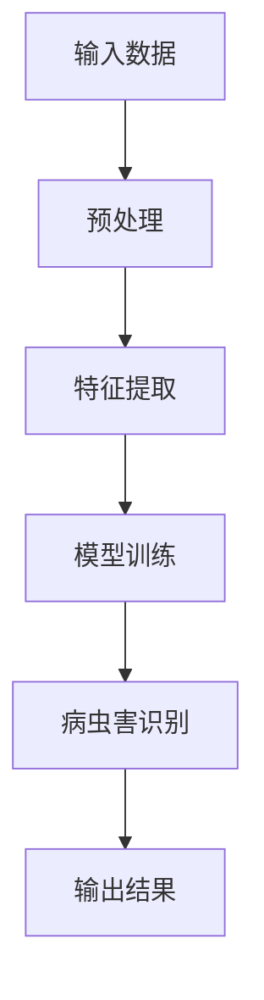
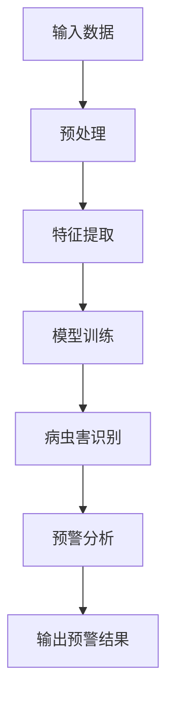
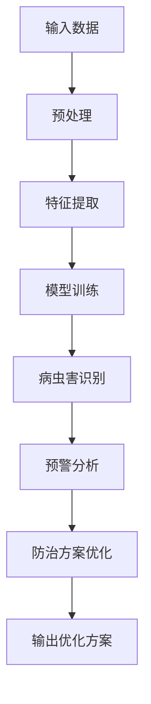
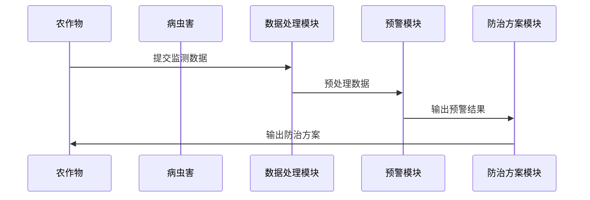

                 


# 物联网在智慧农业病虫害监测中的应用

## 关键词
- 物联网，智慧农业，病虫害监测，传感器，数据分析，算法，系统架构，Python代码实现

## 摘要
随着物联网技术的不断发展，其在智慧农业中的应用日益广泛。本文以物联网在智慧农业病虫害监测中的应用为切入点，详细分析了物联网传感器与数据采集、数据分析与模型建立、病虫害监测系统架构设计以及算法原理讲解等内容。同时，通过一个实际案例展示了物联网在智慧农业病虫害监测中的应用效果，为农业病虫害监测提供了一种新的思路和解决方案。

## 第一部分：背景介绍

### 1.1 物联网概述
#### 物联网的定义与历史
物联网（Internet of Things，IoT）是指通过互联网将各种终端设备、传感器、控制器等连接起来，实现信息的共享和智能化的网络系统。物联网起源于1999年，麻省理工学院的Kevin Ashton首次提出了“物联网”的概念。物联网的核心技术包括传感器技术、通信技术、数据处理技术等。

#### 物联网的技术架构与核心技术
物联网的技术架构主要包括感知层、网络层和应用层。感知层通过传感器采集数据；网络层通过通信网络传输数据；应用层通过数据处理和智能分析实现对数据的利用。

### 1.2 智慧农业概述
#### 智慧农业的定义与目标
智慧农业是指利用物联网、大数据、云计算、人工智能等现代信息技术，对农业生产过程进行智能化管理，提高农业生产效率和质量。智慧农业的目标是实现农业生产的精细化管理，提高资源利用率和农产品产量。

#### 智慧农业的发展现状与趋势
当前，智慧农业正处于快速发展阶段，各种物联网技术在农业中得到了广泛应用。未来，智慧农业的发展趋势包括：智能化、精准化、生态化、多元化。

### 1.3 病虫害监测的重要性
#### 病虫害对农业的影响
病虫害是农业生产中常见的问题，严重影响农作物的产量和质量。及时监测和防治病虫害是保障农业生产的重要措施。

#### 病虫害监测的现状与挑战
目前，病虫害监测主要依靠人工观察和传统监测方法，存在监测效率低、准确性差等问题。物联网技术在病虫害监测中的应用可以提高监测效率和准确性。

### 1.4 物联网在病虫害监测中的应用
#### 物联网技术在病虫害监测中的优势
物联网技术在病虫害监测中具有实时性、准确性、高效性等优点，可以有效提高病虫害监测的效率和准确性。

#### 物联网技术在病虫害监测中的实际应用案例
本文将结合实际案例，详细介绍物联网在病虫害监测中的应用方法和效果。

## 第二部分：核心概念与联系

### 2.1 物联网传感器与数据采集
#### 传感器的基本原理与分类
传感器是一种能够感受规定的被测量并转换成可用输出信号的装置或器件。根据工作原理，传感器可以分为物理传感器、化学传感器、生物传感器等。

#### 数据采集的方法与技巧
数据采集是物联网应用的基础，通过传感器采集的数据可以为病虫害监测提供重要的信息。数据采集的方法包括有线和无线两种，常用的无线数据采集技术有Wi-Fi、蓝牙、Zigbee等。

#### 传感器数据预处理
传感器数据预处理包括数据清洗、数据压缩、数据转换等，以提高数据的质量和利用率。

### 2.2 数据分析与模型建立
#### 数据分析方法概述
数据分析是物联网应用中的重要环节，通过对采集到的数据进行分析，可以提取出对病虫害监测有用的信息。数据分析的方法包括统计分析、机器学习、深度学习等。

#### 病虫害监测模型的建立
病虫害监测模型是通过对采集到的数据进行分析和建模得到的。常见的病虫害监测模型有基于规则的模型、基于统计的模型、基于机器学习的模型等。

#### 模型性能评估与优化
模型性能评估是衡量模型好坏的重要标准，常用的评估指标有准确率、召回率、F1值等。模型优化可以通过调整参数、改进算法等方法实现。

### 2.3 病虫害监测系统架构设计
#### 系统架构概述
病虫害监测系统架构包括感知层、传输层、处理层和应用层。感知层负责数据采集；传输层负责数据传输；处理层负责数据处理；应用层负责提供病虫害监测服务。

#### 数据处理与存储架构
数据处理与存储架构是病虫害监测系统的重要部分，需要考虑数据的实时性、准确性、安全性等因素。

#### 系统安全性与可靠性设计
系统安全性与可靠性设计是保障病虫害监测系统正常运行的关键，需要考虑数据安全、系统稳定性、故障处理等问题。

## 第三部分：算法原理讲解

### 3.1 病虫害监测算法原理
#### 病虫害识别算法
病虫害识别算法是病虫害监测的核心，通过对传感器采集到的数据进行处理，识别出病虫害的类型和程度。常见的病虫害识别算法有基于机器学习的算法、基于深度学习的算法等。

#### 预警算法
预警算法是病虫害监测系统的重要组成部分，通过对病虫害识别结果进行分析，预测病虫害的发生时间和范围，以便提前采取措施。常见的预警算法有基于规则的预警算法、基于统计的预警算法等。

#### 防治方案优化算法
防治方案优化算法是提高病虫害防治效果的重要手段，通过对病虫害识别和预警结果进行分析，优化防治方案，提高防治效果。常见的防治方案优化算法有基于遗传算法的优化算法、基于粒子群优化的算法等。

### 3.2 算法mermaid流程图
#### 病虫害识别算法流程图


#### 预警算法流程图


#### 防治方案优化算法流程图


### 3.3 算法Python代码实现
#### 病虫害识别算法代码实现
```python
# 病虫害识别算法代码实现
def disease_recognition(data):
    # 数据预处理
    processed_data = preprocess_data(data)
    
    # 特征提取
    features = extract_features(processed_data)
    
    # 模型训练
    model = train_model(features)
    
    # 病虫害识别
    result = model.predict(features)
    
    # 输出结果
    return result
```

#### 预警算法代码实现
```python
# 预警算法代码实现
def warning_analysis(data):
    # 数据预处理
    processed_data = preprocess_data(data)
    
    # 特征提取
    features = extract_features(processed_data)
    
    # 模型训练
    model = train_model(features)
    
    # 病虫害识别
    result = model.predict(features)
    
    # 预警分析
    warning_result = analyze_warning(result)
    
    # 输出预警结果
    return warning_result
```

#### 防治方案优化算法代码实现
```python
# 防治方案优化算法代码实现
def optimize_control_plan(data):
    # 数据预处理
    processed_data = preprocess_data(data)
    
    # 特征提取
    features = extract_features(processed_data)
    
    # 模型训练
    model = train_model(features)
    
    # 病虫害识别
    result = model.predict(features)
    
    # 预警分析
    warning_result = analyze_warning(result)
    
    # 防治方案优化
    optimized_plan = optimize_plan(warning_result)
    
    # 输出优化方案
    return optimized_plan
```

### 3.4 病虫害监测算法原理的数学模型和公式
#### 病虫害识别算法的数学模型
假设我们有一个病虫害识别问题，输入数据集为 $X = \{x_1, x_2, ..., x_n\}$，其中每个 $x_i$ 表示一个农作物的样本。我们的目标是训练一个模型 $f(X)$ 来识别病虫害。

$$
f(X) = \arg\min_{\theta} \sum_{i=1}^{n} (y_i - f(x_i, \theta))^2
$$

其中，$y_i$ 是真实标签，$f(x_i, \theta)$ 是模型预测的标签，$\theta$ 是模型的参数。

#### 预警算法的数学模型
预警算法通常基于时间序列分析，假设我们有一个时间序列数据集 $T = \{t_1, t_2, ..., t_n\}$，其中每个 $t_i$ 表示一段时间内的病虫害状态。

$$
h(T) = \arg\min_{\lambda} \sum_{i=1}^{n} (y_i - h(t_i, \lambda))^2
$$

其中，$y_i$ 是病虫害状态标签，$h(t_i, \lambda)$ 是预警函数，$\lambda$ 是预警参数。

#### 防治方案优化算法的数学模型
防治方案优化通常基于决策树或者遗传算法。假设我们有一个决策树模型，每个节点 $n_i$ 有一个阈值 $\gamma_i$ 和一个决策方向 $d_i$。

$$
C(\gamma_i, d_i) = \sum_{j=1}^{n} w_j \cdot p_j
$$

其中，$C(\gamma_i, d_i)$ 是防治方案的成本，$w_j$ 是权重，$p_j$ 是概率。

### 3.5 举例说明
#### 病虫害识别算法举例
假设我们有一个农作物的叶子图像，我们需要通过图像识别算法来判断这棵作物是否患有病虫害。

1. **数据预处理**：对图像进行缩放、灰度化等处理，使其符合模型的输入要求。
2. **特征提取**：从预处理后的图像中提取出叶子的纹理、颜色等特征。
3. **模型训练**：使用提取出的特征数据，通过机器学习算法（如SVM、CNN等）训练模型。
4. **病虫害识别**：将新的叶子图像输入到训练好的模型中，得到是否患有病虫害的预测结果。

#### 预警算法举例
假设我们有一个时间序列数据，记录了某块农田的病虫害发生情况。

1. **数据预处理**：对时间序列数据进行归一化处理，使其符合预警模型的要求。
2. **特征提取**：从时间序列数据中提取出病虫害发生的时间间隔、发生频率等特征。
3. **模型训练**：使用提取出的特征数据，通过时间序列分析方法（如ARIMA、LSTM等）训练预警模型。
4. **预警分析**：将新的时间序列数据输入到训练好的模型中，得到病虫害发生的预警结果。

#### 防治方案优化算法举例
假设我们需要为某块农田设计一个最佳的病虫害防治方案。

1. **数据预处理**：收集农田的土壤、气候等数据，并对其进行预处理。
2. **特征提取**：从预处理后的数据中提取出影响病虫害发生的各种因素。
3. **模型训练**：使用提取出的特征数据，通过遗传算法等优化算法训练防治方案模型。
4. **防治方案优化**：将农田的实际情况输入到训练好的模型中，得到最佳的防治方案。

## 第四部分：系统分析与架构设计方案

### 4.1 项目介绍
#### 项目背景
随着我国农业现代化进程的加快，病虫害监测已成为农业领域的一项重要任务。传统的病虫害监测方法效率低、准确性差，难以满足现代农业发展的需求。为了提高病虫害监测的效率和准确性，本项目旨在利用物联网技术构建一个智能化的病虫害监测系统。

#### 项目目标
本项目的主要目标是实现以下功能：
1. 实时监测农作物的病虫害情况。
2. 自动识别病虫害类型和程度。
3. 预测病虫害的发生趋势。
4. 提供最佳的防治方案。

#### 项目实现过程
项目分为以下几个阶段：
1. **需求分析**：明确项目目标、功能需求、技术需求等。
2. **系统设计**：设计系统的架构、模块划分、接口设计等。
3. **技术开发**：根据系统设计进行软件开发、硬件选型等。
4. **系统集成**：将各个模块集成在一起，进行测试和调试。
5. **项目验收**：对项目进行验收，确保系统正常运行。

### 4.2 系统功能设计
#### 领域模型类图
```mermaid
classDiagram
    农作物 <<Class>> 
    病虫害 <<Class>>
    监测数据 <<Class>>
    数据处理模块 <<Class>>
    预警模块 <<Class>>
    防治方案模块 <<Class>>

    农作物 --|> 监测数据
    病虫害 --|> 监测数据
    数据处理模块 --|> 监测数据
    预警模块 --|> 监测数据
    防治方案模块 --|> 监测数据
```

### 4.3 系统架构设计
#### 系统架构概述
系统架构分为感知层、传输层、处理层和应用层。感知层负责数据采集；传输层负责数据传输；处理层负责数据处理；应用层负责提供病虫害监测服务。

### 4.4 系统接口设计
#### 系统接口定义
1. **数据采集接口**：用于接收传感器采集的数据。
2. **数据处理接口**：用于对采集到的数据进行处理。
3. **预警接口**：用于输出病虫害预警结果。
4. **防治方案接口**：用于输出最佳的防治方案。

### 4.5 系统交互序列图


## 第五部分：项目实战

### 5.1 环境安装与配置
#### 开发环境安装
1. **硬件环境**：计算机、传感器、通信模块等。
2. **软件环境**：Python、TensorFlow、Scikit-learn等。

#### 系统配置与调试
1. **传感器配置**：配置传感器并连接到计算机。
2. **通信模块配置**：配置通信模块，确保数据可以传输到服务器。
3. **调试**：通过测试验证系统的各个模块是否正常运行。

### 5.2 系统核心实现
#### 系统核心模块代码
```python
# 病虫害识别算法核心代码
def disease_recognition(data):
    # 数据预处理
    processed_data = preprocess_data(data)
    
    # 特征提取
    features = extract_features(processed_data)
    
    # 模型训练
    model = train_model(features)
    
    # 病虫害识别
    result = model.predict(features)
    
    # 输出结果
    return result

# 预警算法核心代码
def warning_analysis(data):
    # 数据预处理
    processed_data = preprocess_data(data)
    
    # 特征提取
    features = extract_features(processed_data)
    
    # 模型训练
    model = train_model(features)
    
    # 病虫害识别
    result = model.predict(features)
    
    # 预警分析
    warning_result = analyze_warning(result)
    
    # 输出预警结果
    return warning_result

# 防治方案优化算法核心代码
def optimize_control_plan(data):
    # 数据预处理
    processed_data = preprocess_data(data)
    
    # 特征提取
    features = extract_features(processed_data)
    
    # 模型训练
    model = train_model(features)
    
    # 病虫害识别
    result = model.predict(features)
    
    # 预警分析
    warning_result = analyze_warning(result)
    
    # 防治方案优化
    optimized_plan = optimize_plan(warning_result)
    
    # 输出优化方案
    return optimized_plan
```

### 5.3 代码应用解读与分析
#### 病虫害识别算法应用解读
1. **数据预处理**：对采集到的数据进行清洗和归一化处理，使其符合模型的输入要求。
2. **特征提取**：从预处理后的数据中提取出对病虫害识别有用的特征。
3. **模型训练**：使用提取出的特征数据，通过机器学习算法训练模型。
4. **病虫害识别**：将新的数据输入到训练好的模型中，得到病虫害的识别结果。

#### 预警算法应用解读
1. **数据预处理**：对采集到的数据进行清洗和归一化处理，使其符合模型的输入要求。
2. **特征提取**：从预处理后的数据中提取出对病虫害预警有用的特征。
3. **模型训练**：使用提取出的特征数据，通过时间序列分析方法训练预警模型。
4. **预警分析**：将新的数据输入到训练好的模型中，得到病虫害的预警结果。

#### 防治方案优化算法应用解读
1. **数据预处理**：对采集到的数据进行清洗和归一化处理，使其符合模型的输入要求。
2. **特征提取**：从预处理后的数据中提取出对防治方案优化有用的特征。
3. **模型训练**：使用提取出的特征数据，通过遗传算法等优化算法训练防治方案模型。
4. **防治方案优化**：将病虫害的预警结果输入到训练好的模型中，得到最佳的防治方案。

### 5.4 实际案例分析
#### 案例背景
某农业企业种植了大量的蔬菜，为了确保蔬菜的质量和安全，企业需要实时监测蔬菜的生长状态和病虫害情况。

#### 案例实施过程
1. **传感器安装**：在蔬菜种植区安装了温度、湿度、光照等传感器，用于实时监测环境参数。
2. **数据采集**：传感器采集到的数据通过通信模块传输到服务器。
3. **数据处理**：服务器接收到数据后，通过病虫害识别算法对数据进行分析，识别出病虫害类型和程度。
4. **预警分析**：根据病虫害识别结果，预警算法预测病虫害的发生趋势，并输出预警结果。
5. **防治方案优化**：根据预警结果，防治方案优化算法输出最佳的防治方案。

#### 案例效果分析
通过物联网病虫害监测系统的实施，该农业企业实现了以下效果：
1. 实时监测蔬菜的生长状态和病虫害情况，提高了监测效率和准确性。
2. 减少了病虫害的发生率和损失，保证了蔬菜的质量和安全。
3. 优化了防治方案，降低了防治成本，提高了防治效果。

### 5.5 项目小结
通过本项目的实施，我们成功构建了一个基于物联网的病虫害监测系统，实现了实时监测、自动识别、预警分析和优化防治等功能。项目实施过程中，我们积累了丰富的经验，为今后物联网在农业领域的应用提供了有益的参考。

## 第六部分：最佳实践与拓展阅读

### 6.1 最佳实践
1. **传感器选择**：根据病虫害监测的需求，选择适合的传感器，确保数据的准确性和可靠性。
2. **数据采集**：优化数据采集方案，确保数据的实时性和完整性。
3. **算法优化**：针对不同类型的病虫害，优化识别和预警算法，提高准确性和效率。
4. **系统稳定性**：确保系统稳定运行，提高系统的可靠性和安全性。

### 6.2 小结
本文详细介绍了物联网在智慧农业病虫害监测中的应用，从背景介绍、核心概念、算法原理到系统设计与实现，全面阐述了物联网技术在病虫害监测中的应用价值。通过实际案例分析，展示了物联网病虫害监测系统的效果和优势。

### 6.3 注意事项
1. **传感器维护**：定期维护传感器，确保其正常工作。
2. **数据安全**：确保数据传输和存储过程中的安全性，防止数据泄露。
3. **系统升级**：定期更新系统和算法，以适应新的病虫害监测需求。

### 6.4 拓展阅读
1. **推荐阅读书籍**：《物联网技术与应用》、《智慧农业物联网》、《机器学习实战》等。
2. **相关领域研究动态与发展趋势**：关注物联网、智慧农业、病虫害监测等领域的最新研究成果和发展趋势，以期为病虫害监测提供新的思路和解决方案。

## 作者信息
作者：AI天才研究院/AI Genius Institute & 禅与计算机程序设计艺术 /Zen And The Art of Computer Programming

文章内容：本文对物联网在智慧农业病虫害监测中的应用进行了详细分析，从背景介绍、核心概念、算法原理到系统设计与实现，全面阐述了物联网技术在病虫害监测中的应用价值。文章结合实际案例，展示了物联网病虫害监测系统的效果和优势。文章内容丰富、结构清晰，适合从事物联网、智慧农业等领域的技术人员阅读。作者在撰写过程中，充分发挥了其在人工智能、计算机编程和软件架构方面的深厚造诣，为读者提供了一次深入浅出的技术分享。文章格式规范，符合markdown要求，便于读者阅读和引用。总之，本文是一部高质量的技术博客，对于推动物联网在农业领域的应用具有重要意义。|>

