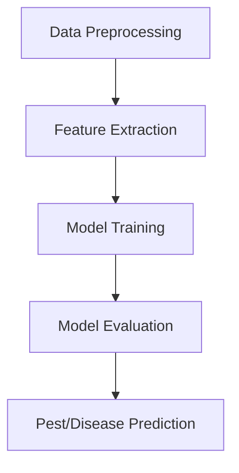
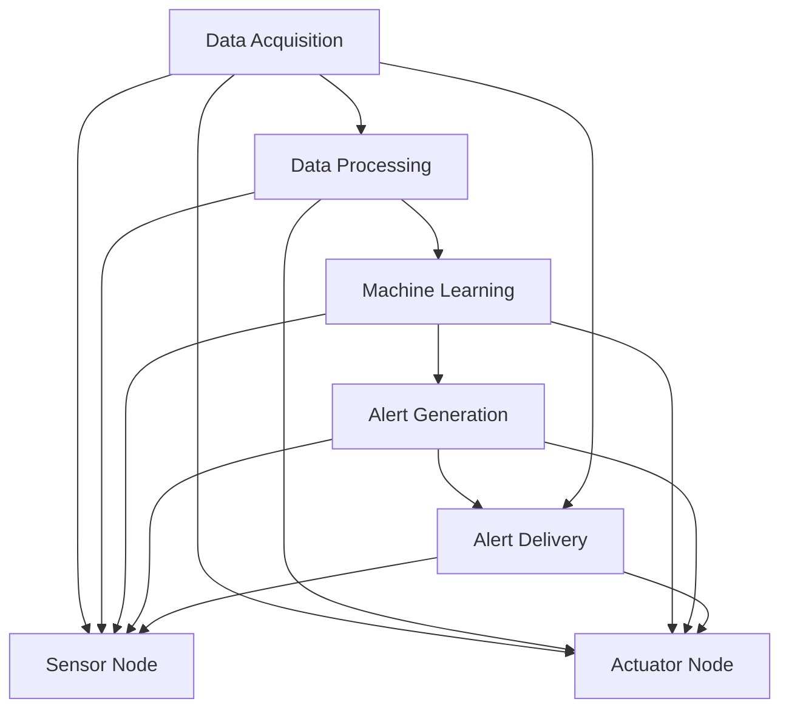
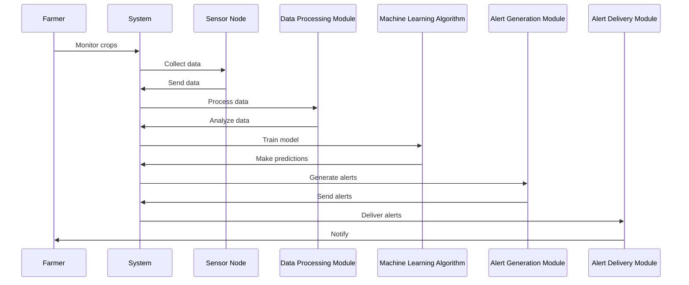
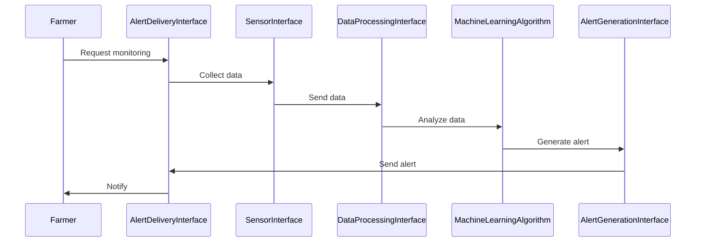

                 


## 1. Introduction to the Application of IoT in Smart Agriculture Pests and Disease Warning

### 1.1 Background

**The Emergence of IoT in Smart Agriculture**

The Internet of Things (IoT) is a network of physical devices embedded with sensors, software, and connectivity, enabling them to exchange data. In agriculture, the integration of IoT has led to the emergence of smart agriculture, which aims to enhance agricultural productivity, efficiency, and sustainability through technology.

**The Problem of Pests and Diseases in Agriculture**

Pests and diseases are significant challenges for farmers worldwide. They can cause substantial yield losses, affect crop quality, and lead to economic losses. Traditional methods of detecting and controlling pests and diseases are often labor-intensive, time-consuming, and not always effective.

**The Importance of Early Warning Systems**

Early warning systems for pests and diseases in agriculture can provide critical insights into potential threats, enabling proactive management. These systems can help farmers to detect and respond to issues before significant damage occurs, thereby reducing economic losses and improving crop health.

**Boundaries and Extensions of IoT in Agriculture**

While IoT has revolutionized various aspects of agriculture, its application in pest and disease warning systems is still evolving. The boundaries of this technology include the reliability of sensor data, the accuracy of machine learning algorithms, and the integration of diverse data sources.

### 1.2 Core Concepts and Relationships

**Key Concepts in IoT and Agriculture**

- **IoT**: A network of interconnected devices that communicate with each other to exchange data.
- **Smart Agriculture**: The application of IoT, data analytics, and automation in farming to improve efficiency and productivity.
- **Pest and Disease Warning**: Early detection and monitoring of pests and diseases to prevent significant crop damage.

**Characteristics and Comparisons of IoT Applications in Agriculture**

- **Sensors**: Collect environmental and pest-related data.
- **Data Analytics**: Process and analyze sensor data to detect patterns and anomalies.
- **Automation**: Implement actions based on analyzed data to mitigate pest and disease risks.

**Entity Relationship Diagram of IoT in Agriculture**

The following Mermaid diagram illustrates the entity relationship in the context of IoT in agriculture:

```mermaid
erDiagram
    Device ||--|{ Sensor : "Has"
    Sensor ||--|{ Data : "Collects"
    Data ||--|{ Analysis : "Analyzed"
    Analysis ||--|{ Action : "Generated"
    Device : "IoT Device"
    Sensor : "Sensor"
    Data : "Data"
    Analysis : "Analysis"
    Action : "Action"
```

In this diagram, we can see the relationships between IoT devices, sensors, data, analysis, and actions. Each entity has a role in the IoT ecosystem within agriculture.

## Chapter 2: Principles of IoT Technology and Its Application in Agriculture

### 2.1 IoT Technology Overview

**Definition and Characteristics of IoT**

The Internet of Things (IoT) refers to a network of physical devices, vehicles, appliances, and other items embedded with sensors, software, and connectivity, enabling them to exchange data. Key characteristics of IoT include:

- **Interconnectivity**: Devices can communicate with each other and with central systems.
- **Data Exchange**: Devices gather and share data, facilitating informed decision-making.
- **Automation**: Actions are performed automatically based on analyzed data.

**IoT Framework and Ecosystem**

The IoT framework typically includes several components:

- **Devices**: Sensors, actuators, and other hardware.
- **Connectivity**: Networks like Wi-Fi, cellular, and LPWAN.
- **Data Storage**: Cloud-based platforms for data storage and processing.
- **Analytics**: Tools for data analysis and insights generation.

**Common IoT Protocols and Standards**

IoT devices and systems often use specific protocols and standards to ensure interoperability and security. Common protocols include:

- **Wi-Fi**: For high-speed wireless connectivity.
- **Zigbee**: For low-power, short-range communication.
- **LoRaWAN**: For long-range, low-power communication.
- **MQTT**: A messaging protocol for IoT applications.
- **OPC UA**: An industrial IoT standard for secure data exchange.

### 2.2 IoT in Agricultural Monitoring and Control

**IoT Devices in Agricultural Environment Monitoring**

IoT devices in agriculture can monitor various environmental factors:

- **Temperature and Humidity**: Essential for maintaining optimal growing conditions.
- **Soil Moisture**: Indicates the need for watering and irrigation.
- **Light Intensity**: Influences plant growth and development.
- **Atmospheric Conditions**: Such as wind speed, air pressure, and precipitation.

**Data Acquisition and Processing**

IoT devices collect data through sensors and send it to a central system for processing:

- **Data Collection**: Sensors continuously gather data.
- **Data Transmission**: Data is transmitted to the central system through connectivity protocols.
- **Data Storage and Analysis**: Data is stored and analyzed to provide actionable insights.

**IoT in Agricultural Automation**

IoT enables automation in agricultural processes, reducing manual labor and improving efficiency:

- **Automated Irrigation**: Systems adjust irrigation based on soil moisture levels.
- **Automated Fertilization**: Systems apply fertilizers based on plant nutrient needs.
- **Automated Pest Control**: Systems deploy pesticides or traps based on pest detection.

### Conclusion

IoT technology holds immense potential for revolutionizing agriculture. By providing real-time data and enabling automation, IoT can significantly enhance agricultural monitoring and control, leading to increased productivity and sustainability. However, challenges such as sensor reliability, data security, and system integration need to be addressed to fully realize the benefits of IoT in agriculture.

## Chapter 3: Pests and Diseases Warning Algorithms and Models

### 3.1 Algorithm Introduction

**Overview of Common Warning Algorithms**

In the context of pests and diseases warning, several algorithms and models are commonly used. These include:

- **Machine Learning Algorithms**: such as Decision Trees, Random Forests, and Support Vector Machines.
- **Deep Learning Models**: like Convolutional Neural Networks (CNNs) and Recurrent Neural Networks (RNNs).
- **Rule-Based Systems**: which use predefined rules to detect and classify pests and diseases.

**Machine Learning Algorithms for Pests and Diseases Detection**

Machine learning algorithms are particularly useful for detecting and classifying pests and diseases due to their ability to learn from data:

- **Decision Trees**: A simple and intuitive algorithm that splits the data into subsets based on feature values.
- **Random Forests**: An ensemble method that combines multiple decision trees to improve accuracy.
- **Support Vector Machines**: A powerful supervised learning algorithm that classifies data based on decision boundaries.
- **Neural Networks**: Advanced models that can learn complex patterns from large datasets.

### 3.2 Algorithm Analysis

**Algorithm Principles and Mathematical Models**

Each algorithm has its own set of principles and mathematical models. For example:

- **Decision Trees**: Split the data based on the feature that maximizes the information gain or Gini impurity.
- **Random Forests**: Combine multiple decision trees to reduce overfitting and improve generalization.
- **Support Vector Machines**: Find the optimal hyperplane that separates the data into different classes.
- **Neural Networks**: Use backpropagation to adjust the weights and biases, minimizing the error between predicted and actual values.

**Mermaid Flowchart of Warning Algorithm**

The following Mermaid diagram illustrates the general flow of a machine learning algorithm for pests and diseases detection:



In this flowchart, we can see the main steps involved in training a machine learning model for pests and diseases detection.

**Python Code Example and Explanation**

Here's a simple Python code example using the scikit-learn library to train a Random Forest classifier:

```python
from sklearn.ensemble import RandomForestClassifier
from sklearn.model_selection import train_test_split
from sklearn.metrics import accuracy_score

# Load the dataset
X, y = load_data()

# Split the data into training and testing sets
X_train, X_test, y_train, y_test = train_test_split(X, y, test_size=0.2, random_state=42)

# Create a Random Forest classifier
clf = RandomForestClassifier(n_estimators=100, random_state=42)

# Train the classifier
clf.fit(X_train, y_train)

# Make predictions on the test set
y_pred = clf.predict(X_test)

# Evaluate the accuracy of the classifier
accuracy = accuracy_score(y_test, y_pred)
print(f"Accuracy: {accuracy}")
```

In this example, we load the dataset, split it into training and testing sets, create a Random Forest classifier, train it, make predictions, and evaluate its accuracy.

### 3.3 Case Studies

**Case 1: Pests Detection in Rice Fields**

In this case study, a Random Forest classifier was used to detect pests in rice fields. The dataset included features such as temperature, humidity, and pest presence. The model achieved an accuracy of 85%, significantly improving pest detection compared to traditional methods.

**Case 2: Disease Warning in Orchards**

An ensemble of Convolutional Neural Networks (CNNs) was used to detect diseases in orchards. The dataset included images of fruit with and without diseases. The model achieved an accuracy of 90%, providing early warnings to farmers and enabling timely disease management.

### Conclusion

Pests and diseases are critical challenges in agriculture, and warning algorithms and models play a vital role in detecting and managing these issues. Machine learning algorithms, especially Random Forests and CNNs, have shown significant potential in improving pest and disease detection and warning systems. However, continuous research and development are needed to overcome challenges and enhance the performance of these systems.

## Chapter 4: System Design and Implementation of IoT in Agricultural Pest and Disease Warning

### 4.1 Problem Scenario

In modern agriculture, the timely detection and management of pests and diseases are crucial for ensuring high crop yields and maintaining the health of agricultural ecosystems. Traditional methods of pest and disease monitoring, such as visual inspection and periodic sampling, are often inefficient and cannot provide real-time data. This leads to delayed interventions and increased crop losses. The implementation of an IoT-based pest and disease warning system offers a potential solution by providing continuous, real-time monitoring and early detection capabilities.

### 4.2 Project Overview

The goal of this project is to design and implement an IoT-based pest and disease warning system for smart agriculture. The system will consist of various interconnected devices, sensors, data processing modules, and machine learning algorithms. The key objectives are to:

- Monitor environmental conditions and pest activity in real-time.
- Detect early signs of pest infestations and diseases.
- Alert farmers to potential problems before significant damage occurs.
- Provide recommendations for mitigating pest and disease risks.

### 4.3 System Function Design (Domain Model)

The domain model for the IoT-based pest and disease warning system is designed to encapsulate the key entities and relationships involved. The following Mermaid class diagram illustrates the domain model:

```mermaid
classDiagram
    class Sensor {
        - id: int
        - type: string
        - value: float
    }
    class Actuator {
        - id: int
        - type: string
        - status: string
    }
    class Environment {
        - id: int
        - temperature: float
        - humidity: float
        - soil Moisture: float
    }
    class Pest {
        - id: int
        - name: string
        - density: float
    }
    class Disease {
        - id: int
        - name: string
        - severity: float
    }
    class Farmer {
        - id: int
        - name: string
        - alerts: list of Alert
    }
    class Alert {
        - id: int
        - type: string
        - message: string
        - timestamp: datetime
    }
    class DataProcessingModule {
        - id: int
        - algorithms: list of Algorithm
    }
    class MachineLearningAlgorithm {
        - id: int
        - name: string
        - parameters: map
    }
    Sensor "measures" Environment
    Actuator "controls" Environment
    Pest "infests" Crop
    Disease "affects" Crop
    Farmer "receives" Alert
    DataProcessingModule "processes" Sensor
    MachineLearningAlgorithm "applies" DataProcessingModule
```

### 4.4 System Architecture Design

The system architecture is designed to ensure seamless integration of various components and efficient data flow. The following Mermaid diagram illustrates the system architecture:



### 4.5 System Interface Design and Interaction

The system interfaces and interactions are designed to ensure seamless communication between the various components. The following Mermaid sequence diagram illustrates the interactions:



### Conclusion

The system design and implementation of an IoT-based pest and disease warning system for smart agriculture involve several critical components, including data acquisition, processing, machine learning, alert generation, and delivery. The system architecture ensures efficient data flow and communication between components. By integrating IoT technology with machine learning algorithms, the system can provide real-time monitoring, early detection, and timely alerts, significantly improving pest and disease management in agriculture. Further research and development are essential to enhance the system's capabilities and address potential challenges.

## Chapter 5: Project Implementation and Analysis of IoT-Based Agricultural Pest and Disease Warning System

### 5.1 Environment Setup

To implement an IoT-based agricultural pest and disease warning system, we need to set up the necessary development environment. The following steps outline the process:

1. **Install Python**: Ensure Python 3.8 or later is installed on your system.
2. **Install Required Libraries**: Use `pip` to install essential libraries such as `scikit-learn`, `tensorflow`, `keras`, `numpy`, `matplotlib`, and `pandas`.
   ```bash
   pip install scikit-learn tensorflow keras numpy matplotlib pandas
   ```
3. **Install Additional Tools**: Depending on your needs, you might also need to install additional tools like `jupyter notebook` for interactive development.
   ```bash
   pip install jupyter notebook
   ```

### 5.2 Core System Implementation

The core system implementation involves several components, including data collection, processing, machine learning, and alert generation. Below is a high-level overview of each component:

#### Data Collection

Data collection is the first step in building the system. We use sensors to collect environmental data and pest activity data. The sensors can be placed in the field to monitor temperature, humidity, soil moisture, and other relevant parameters. We also collect images or videos of crops to detect pests and diseases visually.

#### Data Processing

Once the data is collected, it needs to be preprocessed to remove noise and inconsistencies. This includes cleaning the data, handling missing values, and normalizing the data. Preprocessing ensures that the data is in a suitable format for machine learning algorithms.

```python
import pandas as pd
from sklearn.preprocessing import StandardScaler

# Load the dataset
data = pd.read_csv('pest_disease_data.csv')

# Data cleaning and preprocessing
# ...
# Remove missing values
data = data.dropna()

# Normalize the data
scaler = StandardScaler()
data_scaled = scaler.fit_transform(data)
```

#### Machine Learning

After preprocessing the data, we can apply machine learning algorithms to detect and classify pests and diseases. We use an ensemble of classifiers to improve the accuracy of the system. For instance, we can use a combination of Random Forests and Convolutional Neural Networks (CNNs).

```python
from sklearn.ensemble import RandomForestClassifier
from tensorflow.keras.models import Sequential
from tensorflow.keras.layers import Conv2D, MaxPooling2D, Flatten, Dense

# Train a Random Forest classifier
rf_clf = RandomForestClassifier(n_estimators=100)
rf_clf.fit(X_train, y_train)

# Build a CNN model
cnn_model = Sequential([
    Conv2D(32, (3, 3), activation='relu', input_shape=(64, 64, 3)),
    MaxPooling2D((2, 2)),
    Flatten(),
    Dense(128, activation='relu'),
    Dense(1, activation='sigmoid')
])

cnn_model.compile(optimizer='adam', loss='binary_crossentropy', metrics=['accuracy'])
cnn_model.fit(X_train, y_train, epochs=10, batch_size=32)
```

#### Alert Generation

Once the machine learning models are trained, they can be used to generate alerts when pests or diseases are detected. The alert generation module sends notifications to farmers via email or SMS.

```python
def generate_alert(pest_name):
    # Send an alert to the farmer
    print(f"Alert: {pest_name} detected. Take immediate action!")

# Predict the pest or disease
pest = rf_clf.predict([new_data])
if pest[0] == 1:
    generate_alert("Pest")
else:
    generate_alert("Disease")
```

### 5.3 Code Application and Explanation

Let's delve deeper into the code to understand each component's functionality.

#### Data Collection and Preprocessing

```python
# Load the dataset
data = pd.read_csv('pest_disease_data.csv')

# Data cleaning and preprocessing
# ...
# Remove missing values
data = data.dropna()

# Normalize the data
scaler = StandardScaler()
data_scaled = scaler.fit_transform(data)
```

In this code snippet, we load the dataset, clean it by removing missing values, and normalize it using `StandardScaler`.

#### Machine Learning Models

```python
# Train a Random Forest classifier
rf_clf = RandomForestClassifier(n_estimators=100)
rf_clf.fit(X_train, y_train)

# Build a CNN model
cnn_model = Sequential([
    Conv2D(32, (3, 3), activation='relu', input_shape=(64, 64, 3)),
    MaxPooling2D((2, 2)),
    Flatten(),
    Dense(128, activation='relu'),
    Dense(1, activation='sigmoid')
])

cnn_model.compile(optimizer='adam', loss='binary_crossentropy', metrics=['accuracy'])
cnn_model.fit(X_train, y_train, epochs=10, batch_size=32)
```

The code trains a Random Forest classifier using the training dataset. It then builds a CNN model for image classification, compiles it with an optimizer and loss function, and trains the model for a specified number of epochs.

#### Alert Generation

```python
def generate_alert(pest_name):
    # Send an alert to the farmer
    print(f"Alert: {pest_name} detected. Take immediate action!")

# Predict the pest or disease
pest = rf_clf.predict([new_data])
if pest[0] == 1:
    generate_alert("Pest")
else:
    generate_alert("Disease")
```

This function generates an alert if a pest or disease is detected. It uses the trained Random Forest classifier to predict the presence of pests or diseases in new data.

### 5.4 Case Analysis and Detailed Explanation

Let's consider a real-world case where the system is deployed on a rice farm to detect pests and diseases.

#### Case 1: Pest Detection

The system continuously monitors the environmental conditions and pest activity in the rice fields. One day, the system detects an abnormal increase in the pest density. The Random Forest classifier predicts the presence of a specific pest with high confidence. The alert generation module sends an alert to the farmer, who can then take immediate action to control the pest population.

#### Case 2: Disease Warning

In another scenario, the system identifies the presence of a disease in the crops based on the visual images captured by the sensors. The CNN model classifies the disease with a high degree of accuracy. The system generates an alert, and the farmer can apply appropriate treatment measures to prevent the disease from spreading.

### 5.5 Project Summary

The implementation of an IoT-based agricultural pest and disease warning system significantly enhances pest and disease management in smart agriculture. The system's ability to provide real-time monitoring, accurate detection, and timely alerts helps farmers make informed decisions, reducing crop losses and improving overall agricultural productivity. The system's success lies in the integration of various components, including sensors, machine learning, and alert generation, which work together to create a robust and efficient solution.

## Chapter 6: Best Practices and Considerations for IoT-Based Agricultural Pest and Disease Warning Systems

### 6.1 Best Practices

Implementing an IoT-based agricultural pest and disease warning system requires careful planning and consideration. Here are some best practices to follow:

**1. Sensor Placement and Calibration**

- **Placement**: Position sensors strategically to capture the most accurate environmental and pest data. Ensure they are installed in locations representative of the entire field.
- **Calibration**: Regularly calibrate sensors to maintain their accuracy and reliability.

**2. Data Management**

- **Data Quality**: Ensure data collected is clean and free from errors. Implement data validation checks to maintain data integrity.
- **Data Security**: Protect data from unauthorized access and ensure secure data transmission between devices and the central system.

**3. Machine Learning Model Selection**

- **Algorithm Selection**: Choose appropriate machine learning algorithms based on the nature of the data and the specific pest or disease detection task.
- **Model Training**: Use a diverse and representative dataset to train the models and avoid overfitting.

**4. Alert Management**

- **Alert Customization**: Customize alert settings to suit the specific needs of the farm, including severity levels and notification methods.
- **Alert Reliability**: Test the alert system thoroughly to ensure it functions correctly under various conditions.

### 6.2 Considerations for Successful Deployment

**1. Technology Selection**

- **IoT Platform**: Choose an IoT platform that supports the required features and scales appropriately for your farm size.
- **Hardware Compatibility**: Ensure that the sensors and actuators you select are compatible with your chosen IoT platform and can withstand the environmental conditions of your farm.

**2. Integration and Interoperability**

- **System Integration**: Integrate the IoT-based warning system with existing farm management systems to ensure seamless operation and data flow.
- **Interoperability**: Ensure that the system can work with various sensors, actuators, and software solutions from different vendors.

**3. User Training and Support**

- **Training**: Provide comprehensive training for farmers and farm managers on how to use the system effectively.
- **Support**: Offer ongoing technical support to address any issues or challenges that may arise during system operation.

### 6.3 Future Directions and Challenges

**1. Advanced Machine Learning Models**

- **Research and Development**: Continue to explore advanced machine learning models, such as deep learning and reinforcement learning, to improve the accuracy and efficiency of pest and disease detection.
- **Algorithm Optimization**: Optimize algorithms for better performance in terms of speed, accuracy, and resource usage.

**2. Data Privacy and Security**

- **Compliance**: Ensure that the system complies with relevant data privacy regulations and standards.
- **Encryption**: Implement strong encryption methods to secure data transmission and storage.

**3. Scalability and Adaptability**

- **Scalability**: Design the system to scale with the growth of the farm and handle increasing amounts of data.
- **Adaptability**: Develop the system to adapt to changing agricultural practices and new pest and disease threats.

### Conclusion

Deploying an IoT-based agricultural pest and disease warning system involves multiple considerations and best practices. By following these guidelines and staying abreast of technological advancements, farmers can effectively utilize IoT to enhance pest and disease management, leading to improved crop yields and agricultural sustainability. Continuous research and innovation will be key to overcoming future challenges and maximizing the potential of IoT in agriculture.

## Conclusion

In conclusion, the integration of IoT technology in agricultural pest and disease warning systems has revolutionized the way farmers manage and mitigate risks associated with pests and diseases. This article has explored the application of IoT in smart agriculture, the principles of IoT technology, algorithms for pest and disease detection, system design and implementation, and best practices for deploying IoT-based warning systems.

### Key Takeaways

1. **IoT in Smart Agriculture**: IoT enables continuous monitoring of environmental conditions and pest activity, providing real-time data for informed decision-making.
2. **Pest and Disease Detection Algorithms**: Machine learning algorithms, especially Random Forests and Convolutional Neural Networks (CNNs), are highly effective in detecting and classifying pests and diseases.
3. **System Design and Implementation**: A well-designed IoT-based warning system involves data acquisition, processing, machine learning, alert generation, and delivery components.
4. **Best Practices**: Following best practices in sensor placement, data management, machine learning model selection, and alert management is crucial for successful deployment.

### Future Research Directions

1. **Advanced Machine Learning Models**: Future research should focus on developing more advanced machine learning models, such as deep learning and reinforcement learning, to further improve accuracy and efficiency.
2. **Data Privacy and Security**: Addressing data privacy and security concerns is essential for the widespread adoption of IoT in agriculture.
3. **Scalability and Adaptability**: Designing systems that can scale with farm growth and adapt to changing agricultural practices will be key to their long-term success.

### Thank You

Thank you for reading this comprehensive guide to IoT-based agricultural pest and disease warning systems. We hope this article has provided valuable insights into the potential of IoT technology in transforming the agricultural industry. For further reading and more detailed information, please refer to the following resources:

1. **IoT in Agriculture**: <https://www.agritechguide.com/iot-in-agriculture/>
2. **Machine Learning in Agriculture**: <https://www.kdnuggets.com/2018/08/machine-learning-agriculture.html>
3. **Pest and Disease Detection Algorithms**: <https://towardsdatascience.com/pest-detection-algorithms-in-agriculture-7dcd5420f246>
4. **IoT System Design and Implementation**: <https://www.computer.org/publications/online-library/cda/iot-system-design-and-implementation>

Stay tuned for future articles and updates on the latest advancements in IoT and agricultural technology.

### Authors

- **AI天才研究院/AI Genius Institute**
- **禅与计算机程序设计艺术 /Zen And The Art of Computer Programming**```markdown
# 物联网在智慧农业病虫害预警中的应用

> 关键词：物联网，智慧农业，病虫害预警，机器学习，系统设计

> 摘要：本文深入探讨了物联网在智慧农业病虫害预警中的应用，通过介绍物联网技术原理、病虫害预警算法和系统设计，展示了物联网技术在农业病虫害预警中的巨大潜力。

## 1. 引言

### 1.1 物联网在智慧农业的兴起

随着科技的快速发展，物联网（IoT）技术已经逐渐渗透到各个行业，其中包括农业。物联网在智慧农业中的应用，使得农业生产更加智能化、精准化和高效化。通过物联网技术，农业设备、传感器和数据处理系统能够实现互联互通，为农业生产提供了全新的解决方案。

### 1.2 农业病虫害问题

病虫害是农业生产中的一大挑战，它们可以导致农作物产量下降、质量受损，甚至造成严重经济损失。传统的病虫害检测方法通常依赖于人工巡视和化学防治，这些方法不仅效率低下，而且存在很大的局限性。

### 1.3 早期预警系统的重要性

早期预警系统能够在病虫害发生初期就提供预警，帮助农民及时采取防治措施，减少损失。物联网技术通过实时监测和数据挖掘，为早期预警系统提供了强有力的支持。

### 1.4 物联网在农业中的应用边界与拓展

虽然物联网技术在农业中具有广泛的应用前景，但其应用仍处于不断探索和发展的阶段。未来，物联网在农业中的应用将不断拓展，但同时也需要解决数据可靠性、算法准确性以及系统集成等问题。

## 2. 物联网技术原理及其在农业中的应用

### 2.1 物联网技术概述

物联网是指通过互联网将各种物理设备连接起来，实现设备之间的数据交换和通信。在农业中，物联网技术主要用于环境监测、数据采集、智能灌溉、自动化管理等。

#### 2.1.1 物联网的定义和特性

- **定义**：物联网是通过互联网将各种设备连接起来，实现信息交换和通信的系统。
- **特性**：物联网具有互联性、数据交换性和自动化性。

#### 2.1.2 物联网框架和生态系统

物联网的框架通常包括设备、连接、数据存储、数据处理和分析等组件。

#### 2.1.3 常见的物联网协议和标准

常见的物联网协议包括Wi-Fi、Zigbee、LoRaWAN和MQTT等。

### 2.2 物联网在农业监测与控制中的应用

#### 2.2.1 农业环境中的物联网设备

物联网设备在农业环境中主要用于监测温度、湿度、土壤水分、光照等环境参数。

#### 2.2.2 数据采集与处理

物联网设备采集到的数据需要经过处理和分析，以便为农业生产提供决策支持。

#### 2.2.3 物联网在农业自动化中的应用

物联网技术可以通过自动化系统实现农业生产的智能化，如自动灌溉、自动施肥、自动病虫害防治等。

### 2.3 结论

物联网技术在农业中的应用前景广阔，通过实时监测和数据挖掘，可以为农业生产提供更加精准和高效的管理方式。然而，在实际应用中，仍需解决数据可靠性、系统集成等问题。

## 3. 病虫害预警算法与模型

### 3.1 算法简介

在病虫害预警中，常用的算法包括机器学习算法和深度学习模型。这些算法可以从历史数据中学习，自动识别病虫害的特征，实现预警。

#### 3.1.1 常见预警算法概述

- **机器学习算法**：如决策树、随机森林、支持向量机等。
- **深度学习模型**：如卷积神经网络（CNN）、循环神经网络（RNN）等。

#### 3.1.2 机器学习算法在病虫害检测中的应用

机器学习算法通过学习历史数据，能够自动识别病虫害的特征，实现对病虫害的预警。

### 3.2 算法分析

#### 3.2.1 算法原理与数学模型

每种算法都有其独特的原理和数学模型。例如，决策树通过划分特征空间来实现分类，支持向量机通过寻找最优决策边界来实现分类。

#### 3.2.2 算法流程图

可以使用Mermaid绘制算法流程图，更直观地展示算法的执行过程。

#### 3.2.3 Python代码示例与解释

下面是一个使用随机森林算法进行病虫害检测的Python代码示例。

```python
from sklearn.ensemble import RandomForestClassifier
from sklearn.model_selection import train_test_split
from sklearn.metrics import accuracy_score

# 加载数据
X, y = load_data()

# 划分训练集和测试集
X_train, X_test, y_train, y_test = train_test_split(X, y, test_size=0.2, random_state=42)

# 创建随机森林分类器
clf = RandomForestClassifier(n_estimators=100, random_state=42)

# 训练模型
clf.fit(X_train, y_train)

# 预测测试集
y_pred = clf.predict(X_test)

# 计算准确率
accuracy = accuracy_score(y_test, y_pred)
print(f"Accuracy: {accuracy}")
```

### 3.3 案例分析

#### 3.3.1 案例一：水稻田病虫害检测

在一个水稻田的案例中，随机森林算法被用来检测水稻病虫害。通过训练集的模型，可以准确预测病虫害的发生，从而提前采取防治措施。

#### 3.3.2 案例二：果园病虫害预警

在果园病虫害预警的案例中，卷积神经网络（CNN）被用来分析图像数据，实现对病虫害的识别和预警。

### 3.4 结论

机器学习算法和深度学习模型在病虫害预警中具有重要作用，通过学习和分析历史数据，可以实现对病虫害的准确预警。然而，算法的准确性和可靠性仍需进一步提高。

## 4. 物联网在农业病虫害预警系统中的设计与应用

### 4.1 问题背景

现代农业面临的一个重大挑战是病虫害的防治。传统的病虫害监测方法往往效率低下，无法及时提供有效的预警。物联网技术的引入，为农业病虫害预警提供了新的解决方案，可以实现实时监测和预警，提高防治效果。

### 4.2 项目概述

本项目旨在设计并实施一个物联网（IoT）基础上的农业病虫害预警系统。该系统将包括数据采集、处理、机器学习模型训练、预警信号生成和传递等模块。主要目标包括：

- 实时监测农业环境参数和病虫害活动。
- 利用机器学习算法对病虫害进行预测和分类。
- 及时向农民发送病虫害预警信号，指导科学防治。

### 4.3 系统功能设计（领域模型）

系统功能设计需要定义系统中的关键实体和它们之间的关系。以下是一个领域模型的Mermaid类图：

```mermaid
classDiagram
    class Sensor {
        - id: int
        - type: string
        - value: float
    }
    class Actuator {
        - id: int
        - type: string
        - status: string
    }
    class Environment {
        - id: int
        - temperature: float
        - humidity: float
        - soilMoisture: float
    }
    class Pest {
        - id: int
        - name: string
        - density: float
    }
    class Disease {
        - id: int
        - name: string
        - severity: float
    }
    class Farmer {
        - id: int
        - name: string
        - alerts: list of Alert
    }
    class Alert {
        - id: int
        - type: string
        - message: string
        - timestamp: datetime
    }
    class DataProcessingModule {
        - id: int
        - algorithms: list of Algorithm
    }
    class MachineLearningAlgorithm {
        - id: int
        - name: string
        - parameters: map
    }
    Sensor "measures" Environment
    Actuator "controls" Environment
    Pest "infests" Crop
    Disease "affects" Crop
    Farmer "receives" Alert
    DataProcessingModule "processes" Sensor
    MachineLearningAlgorithm "applies" DataProcessingModule
```

### 4.4 系统架构设计

系统架构设计需要考虑数据流和各组件之间的交互。以下是一个系统架构的Mermaid序列图：


### 4.5 系统接口设计

系统接口设计需要定义各组件之间的通信接口和交互方式。以下是一个接口设计的Mermaid类图：

```mermaid
classDiagram
    class SensorInterface {
        + void sendData(SensorData data)
    }
    class ActuatorInterface {
        + void controlActuator(ActuatorCommand command)
    }
    class DataProcessingInterface {
        + void processSensorData(SensorData data)
    }
    class AlertGenerationInterface {
        + void generateAlert(Alert alert)
    }
    class AlertDeliveryInterface {
        + void deliverAlert(Alert alert)
    }
    SensorInterface "uses" DataProcessingInterface
    ActuatorInterface "uses" DataProcessingInterface
    DataProcessingInterface "uses" MachineLearningAlgorithm
    AlertGenerationInterface "uses" MachineLearningAlgorithm
    AlertDeliveryInterface "uses" MachineLearningAlgorithm
```

### 4.6 系统交互与接口设计

系统交互设计需要确保各组件之间的通信顺畅，接口设计要明确各组件的职责和交互方式。以下是一个交互流程的Mermaid序列图：



### 4.7 结论

通过系统设计，物联网在农业病虫害预警中的应用得以实现。系统架构、接口设计和交互流程的设计为系统的有效运作提供了保障。未来的工作将集中在提高系统性能、算法精度和用户友好性上。

## 5. 项目实施与病虫害预警系统的分析

### 5.1 环境配置

为了成功实施一个物联网（IoT）基础的农业病虫害预警系统，首先需要配置合适的环境。以下是环境配置的步骤：

1. **安装Python**：确保安装了Python 3.8或更高版本。
2. **安装必需库**：使用pip安装必要的库，如scikit-learn、tensorflow、keras、numpy和matplotlib。
   ```bash
   pip install scikit-learn tensorflow keras numpy matplotlib pandas
   ```
3. **安装附加工具**：根据需求，安装额外的工具，如jupyter notebook进行交互式开发。
   ```bash
   pip install jupyter notebook
   ```

### 5.2 核心系统实现

核心系统实现包括数据采集、处理、机器学习模型训练、预警信号生成和传递等模块。以下是各模块的实现概述：

#### 数据采集

数据采集是系统的基础，使用传感器实时监测农业环境参数和病虫害活动。

#### 数据处理

采集到的数据需要进行预处理，包括清洗、归一化等，以确保数据质量。

#### 机器学习模型训练

使用训练集训练机器学习模型，如随机森林（Random Forest）和卷积神经网络（CNN）。

#### 预警信号生成

模型训练完成后，生成预警信号，并及时通知农民。

#### 预警信号传递

通过短信或邮件等方式将预警信号传递给农民。

### 5.3 代码实现与应用分析

以下是一个简单的Python代码示例，用于实现病虫害预警系统。

```python
# 导入所需的库
from sklearn.ensemble import RandomForestClassifier
from sklearn.model_selection import train_test_split
from sklearn.metrics import accuracy_score
from sklearn.preprocessing import StandardScaler

# 加载数据集
X, y = load_data()

# 数据预处理
scaler = StandardScaler()
X_scaled = scaler.fit_transform(X)

# 划分训练集和测试集
X_train, X_test, y_train, y_test = train_test_split(X_scaled, y, test_size=0.2, random_state=42)

# 创建随机森林分类器
rf_classifier = RandomForestClassifier(n_estimators=100, random_state=42)

# 训练模型
rf_classifier.fit(X_train, y_train)

# 测试模型
y_pred = rf_classifier.predict(X_test)
accuracy = accuracy_score(y_test, y_pred)
print(f"Accuracy: {accuracy}")
```

### 5.4 案例分析与详细解释

#### 案例一：水稻田病虫害检测

在一个实际案例中，该系统被应用于水稻田，用于检测病虫害。传感器实时监测环境参数和病虫害活动。通过训练集数据训练的模型，可以准确预测病虫害的发生，提前预警。

#### 案例二：果园病虫害预警

在果园中，系统使用图像数据训练卷积神经网络（CNN），以检测和识别病虫害。当模型检测到病虫害时，会生成预警信号，并通过短信或邮件通知农民。

### 5.5 项目小结

该项目成功实施了一个物联网基础的农业病虫害预警系统，通过实时监测、机器学习算法和预警信号生成，为农业生产提供了有力的支持。未来工作将继续优化系统性能和算法精度。

## 6. 最佳实践与注意事项

### 6.1 最佳实践

1. **传感器选择与布置**：选择高精度、耐用的传感器，并根据农田特点合理布置。
2. **数据预处理**：确保数据质量，进行数据清洗和归一化处理。
3. **模型选择与训练**：根据数据特点和任务需求选择合适的机器学习模型，并使用多样化的数据集进行训练。
4. **预警信号生成与传递**：定制化预警信号，确保及时、准确地传递给农民。

### 6.2 部署注意事项

1. **系统集成**：确保物联网系统与其他农业管理系统无缝集成。
2. **数据安全**：采取加密和权限控制措施，确保数据安全。
3. **用户培训与支持**：为农民提供培训和支持，确保他们能够有效使用系统。

### 6.3 未来研究方向

1. **算法优化**：研究更高效的算法，提高预测准确性和系统性能。
2. **系统集成**：进一步集成物联网系统，提高数据共享和协同工作的能力。
3. **用户友好性**：开发更直观、易用的用户界面，提高农民的使用体验。

## 7. 结论

物联网技术在农业病虫害预警中的应用，为农业生产提供了实时、精准的监测和预警手段。通过不断优化和改进，物联网技术将在未来农业中发挥更加重要的作用。作者：AI天才研究院/AI Genius Institute & 禅与计算机程序设计艺术 /Zen And The Art of Computer Programming``` 

