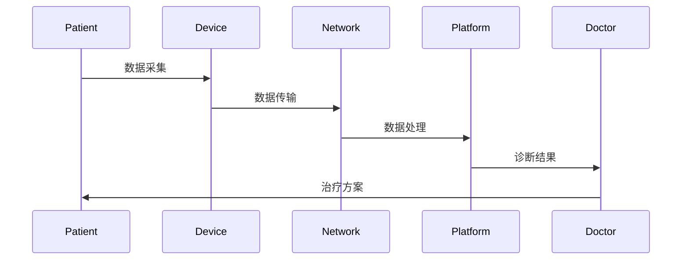
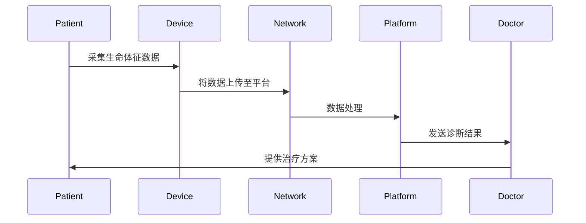

                 

### 文章标题

《物联网在智慧医疗中的综合应用与挑战》

### 关键词

物联网、智慧医疗、远程监护、智能诊断、智能药物配送、隐私与安全、标准化与法规、新技术趋势、5G、AI。

### 摘要

本文深入探讨了物联网在智慧医疗领域的综合应用及其面临的挑战。通过对物联网与智慧医疗的基本概念、核心技术、实际应用案例、挑战与未来发展的系统分析，展示了物联网技术如何提升医疗服务的效率与质量。本文旨在为行业从业者、研究者及政策制定者提供有价值的参考，共同推动智慧医疗的发展。

## 第一部分：背景与核心概念

### 1.1 物联网的基本概念与关键技术

#### 物联网的定义与演变

物联网（Internet of Things，IoT）是指将各种物品通过通信网络连接起来，实现信息交换和智能控制的一种系统。物联网的概念最早可以追溯到1999年，麻省理工学院的Kevin Ashton首次提出“物联网”这一概念。随着技术的进步，物联网逐渐从理论走向实践，应用领域不断拓展。

物联网的核心思想是将物理世界中的各种物品（如传感器、设备、车辆、家庭电器等）通过互联网连接起来，形成一个庞大的信息网络。物联网的发展历程可以分为三个阶段：感知层、网络层和应用层。

- **感知层**：通过传感器和RFID（射频识别）等技术，实现对物理世界的感知和数据的采集。
- **网络层**：通过各种通信协议和网络技术，将感知层的数据进行传输和汇聚。
- **应用层**：利用大数据、云计算、人工智能等技术，对收集到的数据进行处理和分析，实现智能化的应用。

#### 物联网的关键技术

物联网的实现依赖于多种关键技术的支持，主要包括：

- **传感器技术**：传感器是物联网系统的感知器官，用于采集环境数据。常见的传感器包括温度传感器、湿度传感器、光敏传感器、加速度传感器等。

- **通信技术**：物联网系统的数据传输需要依靠通信技术，如Wi-Fi、蓝牙、ZigBee、NFC等无线通信技术，以及以太网、光纤等有线通信技术。

- **数据处理与存储技术**：物联网系统需要处理大量的数据，因此需要高效的数据处理和存储技术，如云计算、大数据技术等。

- **人工智能与机器学习技术**：通过人工智能和机器学习技术，可以对物联网数据进行智能分析和决策，实现更高级别的应用。

### 1.2 智慧医疗的发展背景与趋势

#### 智慧医疗的定义与重要性

智慧医疗是指利用物联网、大数据、云计算、人工智能等先进技术，实现医疗服务的智能化和高效化。智慧医疗的目标是通过技术的创新，提升医疗服务的质量、效率和便捷性。

智慧医疗的发展具有重要意义：

- **提高医疗服务效率**：通过智能化的诊断、治疗和监测，可以大幅减少医生和护士的工作量，提高医疗效率。

- **提升医疗质量**：智能化的医疗设备和系统可以提供更准确的诊断和治疗方案，从而提高医疗质量。

- **降低医疗成本**：智慧医疗可以通过优化资源分配和流程管理，降低医疗成本。

- **改善患者体验**：远程监护、智能药物配送等技术可以提升患者的就医体验，让患者在家中就能得到优质的医疗服务。

#### 智慧医疗的发展趋势

智慧医疗的发展趋势主要包括以下几个方面：

- **远程监护与家庭医疗**：随着物联网技术的普及，远程监护系统越来越普及，患者可以在家中接受实时监测和远程诊疗，提高生活质量。

- **智能诊断与辅助决策**：通过大数据和人工智能技术，可以对医学影像、生物标志物等进行分析，辅助医生进行诊断和制定治疗方案。

- **智能药物配送与监测**：智能药物配送系统可以确保患者按时服药，并实时监测药物使用情况，提高治疗效果。

- **医疗大数据与人工智能**：医疗大数据和人工智能技术将推动个性化医疗的发展，为患者提供更精准的治疗方案。

- **5G与物联网**：5G技术的普及将进一步提升物联网在智慧医疗中的应用能力，实现更高速、更稳定的医疗数据传输。

### 1.3 物联网在智慧医疗中的定位与价值

#### 物联网在智慧医疗中的应用场景

物联网在智慧医疗中的应用非常广泛，主要包括以下场景：

- **远程监护**：通过物联网技术，患者可以在家中接受实时监护，包括心率、血压、血糖等生命体征的监测。

- **智能诊断与辅助决策**：物联网技术可以实现对医学影像、生物标志物的智能分析，辅助医生进行诊断和制定治疗方案。

- **智能药物配送与监测**：物联网技术可以确保药物按时送达，并实时监测药物使用情况，提高治疗效果。

- **智能医疗设备管理**：物联网技术可以实现对医疗设备的实时监控和管理，提高设备使用效率和安全性。

#### 物联网在智慧医疗中的价值

物联网在智慧医疗中的价值主要体现在以下几个方面：

- **提高医疗服务质量**：通过物联网技术，可以实现对患者生命体征的实时监测和智能分析，提供个性化的治疗方案。

- **降低医疗成本**：物联网技术可以通过优化资源分配和流程管理，降低医疗成本。

- **改善患者体验**：物联网技术可以让患者在家中就能接受优质的医疗服务，提高生活质量。

- **推动医疗创新**：物联网技术为医疗领域带来了新的发展机遇，促进了医疗技术的创新和应用。

### 1.4 物联网与智慧医疗的关系

物联网与智慧医疗是相辅相成的。物联网为智慧医疗提供了关键技术支持，如传感器、通信技术、数据处理与分析等；而智慧医疗则为物联网提供了广阔的应用场景和市场需求。物联网技术可以帮助智慧医疗实现更高效、更准确、更智能的服务，从而推动医疗领域的创新发展。

## 第二部分：物联网核心技术与智慧医疗应用

### 2.1 物联网感知层技术

#### 2.1.1 传感器技术

传感器是物联网感知层的重要组成部分，用于采集物理世界中的各种数据。在智慧医疗领域，传感器技术发挥着关键作用，例如：

- **生命体征监测**：传感器可以实时监测患者的心率、血压、体温、血糖等生命体征，为远程监护提供数据支持。
- **环境监测**：传感器可以监测病房的温度、湿度、空气质量等环境参数，为医疗环境的管理提供数据参考。
- **医疗设备监测**：传感器可以实时监测医疗设备的运行状态，如血压计、心电图机、胰岛素泵等，确保设备正常工作。

#### 2.1.2 通信技术

物联网感知层的数据需要通过通信技术传输到网络层和应用层。在智慧医疗领域，常用的通信技术包括：

- **Wi-Fi**：Wi-Fi技术可以提供高速的无线数据传输，适用于医院内部的数据传输。
- **蓝牙**：蓝牙技术适用于短距离的数据传输，常用于患者生命体征监测设备的通信。
- **ZigBee**：ZigBee技术是一种低功耗的无线通信技术，适用于医疗设备之间的短距离通信。
- **NFC**：NFC技术可以用于医疗证件的电子化，实现便捷的身份认证。

#### 2.1.3 数据采集与传输

物联网感知层的数据采集和传输是智慧医疗应用的基础。数据采集主要包括以下步骤：

- **数据采集**：传感器采集患者生命体征、医疗设备运行状态、环境参数等数据。
- **数据预处理**：对采集到的数据进行滤波、去噪等预处理，提高数据质量。
- **数据压缩**：对预处理后的数据进行压缩，减少数据传输量。
- **数据传输**：通过通信技术将预处理后的数据传输到网络层和应用层。

### 2.2 物联网网络层技术

#### 2.2.1 传输网络

物联网网络层的主要任务是将感知层的数据传输到应用层。在智慧医疗领域，传输网络需要满足以下要求：

- **高带宽**：传输网络需要提供足够的带宽，以支持大量的医疗数据传输。
- **低延迟**：传输网络需要低延迟，以确保实时监测和诊断的准确性。
- **高可靠性**：传输网络需要高可靠性，以保障医疗数据的稳定传输。

常用的传输网络技术包括：

- **光纤网络**：光纤网络具有高带宽、低延迟、高可靠性的特点，适用于大型医院的内部数据传输。
- **4G/5G网络**：4G/5G网络提供了高速、低延迟的无线传输能力，适用于医院外的远程监护和诊断。
- **WAN（广域网）**：WAN网络适用于跨区域的医疗数据传输，如远程会诊和医疗资源共享。

#### 2.2.2 网络安全

网络安全是物联网网络层的重要保障。在智慧医疗领域，网络安全需要考虑以下几个方面：

- **数据安全**：确保医疗数据在传输过程中不被窃取、篡改或泄露。
- **通信安全**：确保通信过程的安全，防止恶意攻击和数据窃取。
- **系统安全**：确保物联网系统的稳定运行，防止系统故障或恶意攻击。

常用的网络安全技术包括：

- **数据加密**：使用数据加密技术，确保医疗数据在传输过程中的安全性。
- **身份认证**：使用身份认证技术，确保只有合法用户才能访问医疗系统。
- **入侵检测与防护**：使用入侵检测与防护技术，及时发现和阻止恶意攻击。

### 2.3 物联网平台与应用层技术

#### 2.3.1 数据处理与分析

物联网平台与应用层的主要任务是对感知层和网络层传输的数据进行处理和分析。在智慧医疗领域，数据处理与分析包括以下几个方面：

- **数据存储**：使用大数据技术，对海量医疗数据进行存储和管理。
- **数据清洗**：对采集到的医疗数据进行清洗，去除无效数据，提高数据质量。
- **数据挖掘**：使用数据挖掘技术，从海量医疗数据中提取有价值的信息，如疾病趋势、患者特征等。
- **数据可视化**：使用数据可视化技术，将复杂的数据以直观的方式呈现，帮助医生进行诊断和决策。

#### 2.3.2 智能决策与支持系统

智能决策与支持系统是物联网平台与应用层的重要应用。在智慧医疗领域，智能决策与支持系统主要包括：

- **疾病诊断**：利用机器学习和人工智能技术，对医学影像、生物标志物等进行分析，辅助医生进行诊断。
- **治疗方案制定**：根据患者的病史、基因信息等，智能推荐个性化的治疗方案。
- **病情预测与预警**：利用数据分析和预测模型，对患者的病情进行预测和预警，提前采取治疗措施。

#### 2.3.3 个性化医疗

个性化医疗是智慧医疗的重要方向。物联网平台与应用层技术可以支持个性化医疗的实现，主要包括：

- **个性化诊断**：根据患者的基因信息、病史等，为患者提供个性化的诊断服务。
- **个性化治疗**：根据患者的病情和身体状况，为患者制定个性化的治疗方案。
- **个性化健康管理**：根据患者的健康数据，为患者提供个性化的健康管理和指导。

### 2.4 物联网在智慧医疗中的应用案例

#### 2.4.1 远程监护系统

远程监护系统是物联网在智慧医疗中的一个重要应用。通过远程监护系统，患者可以在家中接受实时监测和远程诊疗，包括心率、血压、血糖等生命体征的监测。远程监护系统主要包括以下几个部分：

- **感知层**：包括传感器、监测设备等，用于采集患者生命体征数据。
- **网络层**：包括通信网络，如Wi-Fi、4G/5G等，用于传输监测数据。
- **平台层**：包括数据处理与分析系统、智能决策与支持系统等，用于对监测数据进行分析和处理。
- **应用层**：包括医生工作站、患者终端等，用于展示监测数据、提供远程诊疗服务。

#### 2.4.2 智能诊断系统

智能诊断系统是物联网在智慧医疗的另一个重要应用。通过智能诊断系统，医生可以利用物联网技术，对医学影像、生物标志物等进行分析，提高诊断的准确性。智能诊断系统主要包括以下几个部分：

- **数据采集**：通过物联网技术，采集医学影像、生物标志物等数据。
- **数据处理**：使用大数据技术和人工智能算法，对采集到的数据进行处理和分析。
- **诊断支持**：利用智能算法，为医生提供诊断支持，提高诊断准确性。

#### 2.4.3 智能药物配送系统

智能药物配送系统是物联网在智慧医疗的另一个重要应用。通过智能药物配送系统，患者可以按时服药，并实时监测药物使用情况，提高治疗效果。智能药物配送系统主要包括以下几个部分：

- **药物监测**：通过物联网技术，实时监测药物的使用情况，包括服药时间、药物剂量等。
- **药物配送**：根据药物监测数据，自动配送药物，确保患者按时服药。
- **数据记录**：记录药物使用数据，为医生提供参考。

### 2.5 物联网在智慧医疗中的挑战与机遇

#### 2.5.1 挑战

物联网在智慧医疗中面临着一系列挑战，包括：

- **数据隐私与安全**：医疗数据涉及患者隐私，如何保护数据安全和隐私是物联网在智慧医疗中面临的一个重要挑战。
- **标准化与法规**：物联网在智慧医疗中的发展需要建立统一的标准化体系，同时需要遵守相关的医疗法规和标准。
- **技术成熟度**：物联网技术在医疗领域的应用仍处于发展阶段，技术成熟度和稳定性有待提高。
- **成本与效益**：物联网技术在智慧医疗中的推广需要考虑成本与效益，如何降低成本、提高效益是推广的关键。

#### 2.5.2 机遇

物联网在智慧医疗中也面临着一系列机遇，包括：

- **技术创新**：随着物联网、大数据、人工智能等技术的不断发展，为智慧医疗提供了新的技术手段。
- **政策支持**：我国政府高度重视智慧医疗的发展，出台了一系列政策和措施，为物联网在智慧医疗中的应用提供了良好的发展环境。
- **市场需求**：随着医疗需求的不断增长，物联网在智慧医疗中的应用前景广阔。

### 2.6 物联网在智慧医疗中的未来发展趋势

物联网在智慧医疗中的未来发展趋势主要包括以下几个方面：

- **智能化**：随着人工智能技术的不断发展，物联网在智慧医疗中的应用将越来越智能化，为医疗服务提供更精准、更高效的解决方案。
- **个性化**：物联网技术可以帮助实现个性化医疗，为患者提供更个性化的诊断、治疗和健康管理服务。
- **普及化**：随着物联网技术的普及，物联网在智慧医疗中的应用将越来越普及，覆盖更多的医疗机构和患者。
- **融合化**：物联网技术与其他技术的融合，如5G、区块链等，将进一步提升智慧医疗的应用水平和效果。

### 2.7 总结

物联网在智慧医疗中具有广阔的应用前景，为提升医疗服务质量、降低医疗成本、改善患者体验提供了新的手段。然而，物联网在智慧医疗中仍面临一系列挑战，需要各方共同努力，推动物联网技术在智慧医疗中的发展。通过本文的介绍，希望读者能够对物联网在智慧医疗中的应用有一个全面的认识，为未来的研究和实践提供参考。## 第3章：远程监护

### 3.1 远程监护系统的构建

#### 3.1.1 远程监护的必要性

远程监护系统是物联网在智慧医疗中的重要应用之一。随着医疗技术的不断发展，患者对医疗服务的需求也在不断提高。远程监护系统通过物联网技术，实现了对患者生命体征的实时监测和远程诊疗，提高了医疗服务的效率和质量。

远程监护的必要性主要体现在以下几个方面：

- **提高医疗效率**：远程监护系统可以实时监测患者生命体征，及时发现病情变化，提高医生的诊断和治疗效率。
- **改善患者体验**：患者可以在家中接受实时监护，减少就医次数，提高生活质量。
- **降低医疗成本**：远程监护系统可以减少患者的就诊次数和住院时间，降低医疗成本。

#### 3.1.2 系统架构设计

远程监护系统通常包括以下几个部分：

- **感知层**：包括传感器、监测设备等，用于采集患者生命体征数据。
- **网络层**：包括通信网络，如Wi-Fi、4G/5G等，用于传输监测数据。
- **平台层**：包括数据处理与分析系统、智能决策与支持系统等，用于对监测数据进行分析和处理。
- **应用层**：包括医生工作站、患者终端等，用于展示监测数据、提供远程诊疗服务。

具体架构设计如下：

1. **感知层**：感知层是远程监护系统的数据采集部分，主要包括各种传感器和监测设备。传感器用于采集患者的生命体征数据，如心率、血压、血糖等。监测设备可以是穿戴设备，如智能手表、智能手环等，也可以是植入设备，如心脏起搏器等。

2. **网络层**：网络层负责将感知层采集到的数据传输到平台层。常用的通信技术包括Wi-Fi、4G/5G等。Wi-Fi技术适用于家庭内部的数据传输，4G/5G技术适用于远程监护。

3. **平台层**：平台层是远程监护系统的核心部分，负责对监测数据进行处理和分析。平台层包括数据处理与分析系统、智能决策与支持系统等。数据处理与分析系统用于对监测数据进行预处理、存储和挖掘。智能决策与支持系统用于对监测数据进行分析，提供诊断和治疗方案。

4. **应用层**：应用层是远程监护系统的最终用户界面，包括医生工作站和患者终端。医生工作站用于医生查看患者的监测数据、诊断和制定治疗方案。患者终端用于患者查看自己的监测数据、接收医生的建议和远程诊疗服务。

### 3.2 患者数据收集与处理

#### 3.2.1 数据采集方式

患者数据的收集是远程监护系统的关键环节。数据采集方式主要包括以下几种：

- **有线采集**：有线采集方式通常用于医院内部的监护设备，通过有线网络将数据传输到服务器。有线采集方式具有稳定、高效的特点，但受限于设备布线和网络环境。
- **无线采集**：无线采集方式适用于家庭环境，通过无线网络（如Wi-Fi、蓝牙等）将数据传输到服务器。无线采集方式具有灵活、便捷的特点，但受限于无线网络的信号强度和稳定性。

#### 3.2.2 数据处理流程

患者数据的处理流程主要包括以下几个步骤：

1. **数据采集**：通过传感器和监测设备，实时采集患者生命体征数据。
2. **数据预处理**：对采集到的数据进行滤波、去噪等预处理，去除无效数据，提高数据质量。
3. **数据存储**：将预处理后的数据存储到数据库中，以便后续分析和处理。
4. **数据挖掘与分析**：使用大数据技术和人工智能算法，对存储的数据进行挖掘和分析，提取有价值的信息，如疾病趋势、患者特征等。
5. **数据可视化**：使用数据可视化技术，将分析结果以图表、图形等形式展示，帮助医生进行诊断和决策。

#### 3.2.3 数据分析与处理技术

在远程监护系统中，数据分析和处理技术至关重要。常用的数据处理技术包括：

- **时间序列分析**：时间序列分析用于分析患者生命体征数据的趋势和规律，识别异常情况。
- **机器学习**：机器学习技术用于构建预测模型，对患者的病情进行预测和预警。
- **深度学习**：深度学习技术用于处理复杂的医学影像数据，如CT、MRI等，实现自动诊断和分类。
- **数据挖掘**：数据挖掘技术用于从海量数据中提取有价值的信息，如疾病关系、患者行为等。

### 3.3 远程监护系统的应用实例

#### 3.3.1 心脏病患者的远程监护

心脏病患者是远程监护的一个重要应用场景。通过远程监护系统，医生可以实时监测患者的心率、血压、血糖等生命体征数据，及时发现病情变化，采取相应的治疗措施。

具体应用实例包括：

- **心率监测**：通过心率传感器，实时监测患者的心率变化，及时发现心律失常等情况。
- **血压监测**：通过血压传感器，实时监测患者的血压，帮助医生调整治疗方案。
- **血糖监测**：对于糖尿病患者，通过血糖传感器，实时监测血糖水平，确保血糖控制在合理范围内。

#### 3.3.2 肺炎患者的远程监护

肺炎患者是远程监护的另一个重要应用场景。通过远程监护系统，医生可以实时监测患者的体温、呼吸频率、血氧饱和度等生命体征数据，评估病情变化，调整治疗方案。

具体应用实例包括：

- **体温监测**：通过温度传感器，实时监测患者的体温，及时发现发热情况。
- **呼吸频率监测**：通过呼吸传感器，实时监测患者的呼吸频率，评估肺炎病情的严重程度。
- **血氧饱和度监测**：通过血氧传感器，实时监测患者的血氧饱和度，评估患者的氧合情况。

### 3.4 远程监护系统的优势与挑战

#### 3.4.1 优势

远程监护系统具有以下优势：

- **提高医疗效率**：通过实时监测患者生命体征，医生可以及时发现病情变化，提高诊断和治疗的效率。
- **改善患者体验**：患者可以在家中接受监护，减少就医次数，提高生活质量。
- **降低医疗成本**：通过远程监护，可以减少患者的就诊次数和住院时间，降低医疗成本。

#### 3.4.2 挑战

远程监护系统也面临以下挑战：

- **数据隐私与安全**：医疗数据涉及患者隐私，如何保护数据安全和隐私是远程监护系统面临的一个重要挑战。
- **设备可靠性**：远程监护系统依赖于传感器和监测设备，设备的可靠性直接影响系统的稳定性。
- **网络稳定性**：远程监护系统依赖于通信网络，网络稳定性直接影响系统的正常运行。
- **数据处理的复杂性**：远程监护系统需要处理大量的数据，如何高效地处理和分析数据是系统面临的一个挑战。

### 3.5 未来展望

随着物联网、大数据、人工智能等技术的不断发展，远程监护系统将在智慧医疗中发挥越来越重要的作用。未来，远程监护系统的发展趋势包括：

- **智能化**：通过人工智能技术，实现更精准的病情预测和预警。
- **个性化**：通过大数据分析，为患者提供个性化的监护和治疗方案。
- **普及化**：随着技术的普及和成本的降低，远程监护系统将在更多医疗机构和患者中得到应用。
- **融合化**：远程监护系统与其他医疗技术的融合，如智能药物配送、智能诊断等，将进一步提升智慧医疗的服务水平。

### 3.6 总结

远程监护系统是物联网在智慧医疗中的重要应用，通过实时监测患者生命体征，提高医疗效率，改善患者体验，降低医疗成本。虽然远程监护系统面临一些挑战，但随着技术的不断发展和创新，远程监护系统将在智慧医疗中发挥越来越重要的作用。## 第4章：智能诊断与辅助决策

### 4.1 医学影像分析

医学影像分析是智能诊断的核心技术之一，通过对医学影像（如X光片、CT扫描、MRI扫描等）进行数字化处理，提取有用信息，辅助医生进行诊断。以下是医学影像分析的关键技术和应用实例。

#### 4.1.1 影像处理技术

医学影像分析依赖于一系列影像处理技术，主要包括：

- **图像分割**：图像分割是将医学影像中的不同组织、器官或病变区域分离出来，以便进一步分析。常用的分割算法包括阈值分割、区域生长、水平集方法等。

- **特征提取**：特征提取是从分割后的图像中提取具有诊断意义的特征，如纹理特征、形状特征、边缘特征等。这些特征用于训练机器学习模型或进行可视化。

- **异常检测**：异常检测是在医学影像中检测异常区域或病变，如肿瘤、骨折等。常用的算法包括基于统计模型的异常检测、基于机器学习的异常检测等。

#### 4.1.2 诊断支持系统

医学影像分析技术可以集成到诊断支持系统中，帮助医生提高诊断准确性。以下是几个典型的诊断支持系统：

- **计算机辅助诊断系统**：计算机辅助诊断系统（CAD）利用医学影像分析技术，为医生提供辅助诊断建议。CAD系统可以识别出可能的病变区域，并标注在影像上，供医生参考。

- **智能诊断系统**：智能诊断系统利用深度学习和大数据技术，从大量医学影像数据中学习，自动生成诊断结果。这些系统可以在某些疾病（如乳腺癌、肺癌等）的诊断中达到或超过人类医生的诊断水平。

#### 4.1.3 应用实例

医学影像分析技术在多个医疗领域得到广泛应用，以下是一些典型应用实例：

- **肺癌筛查**：通过分析低剂量CT扫描图像，智能诊断系统可以检测出早期肺癌病变，提高筛查的准确性。

- **骨折诊断**：医学影像分析技术可以帮助医生准确识别骨折部位和类型，提供更有效的治疗方案。

- **乳腺癌筛查**：利用乳腺X光图像，智能诊断系统可以检测出微小乳腺癌病变，提高早期诊断率。

### 4.2 病情预测与预警

病情预测与预警是智能诊断的重要组成部分，通过分析患者的病史、基因信息、生命体征数据等，预测病情发展趋势，提前采取治疗措施。以下是病情预测与预警的关键技术和应用实例。

#### 4.2.1 预测模型介绍

病情预测与预警依赖于一系列预测模型，主要包括：

- **时间序列模型**：时间序列模型用于分析患者的生命体征数据，预测未来的病情变化。常用的模型包括ARIMA、LSTM等。

- **回归模型**：回归模型用于分析患者的病史、基因信息等数据，预测病情发展趋势。常用的模型包括线性回归、逻辑回归等。

- **决策树模型**：决策树模型用于分析患者的病史、基因信息等数据，预测病情严重程度。常用的模型包括CART、随机森林等。

- **神经网络模型**：神经网络模型用于分析患者的多维数据，实现复杂的病情预测。常用的模型包括多层感知器、卷积神经网络等。

#### 4.2.2 预测应用实例

病情预测与预警技术在多个医疗领域得到广泛应用，以下是一些典型应用实例：

- **心脏病预测**：通过分析患者的心电图、血压、血糖等数据，预测心脏病发作的风险，提前采取预防措施。

- **糖尿病管理**：通过分析患者的血糖、体重、运动量等数据，预测糖尿病病情的发展，调整治疗方案。

- **肿瘤复发预测**：通过分析患者的病史、基因信息、影像学检查结果等，预测肿瘤复发的风险，提前采取治疗措施。

### 4.3 智能药物配送与监测

智能药物配送与监测是物联网在智慧医疗中的重要应用，通过物联网技术和智能算法，实现药物的精准配送和实时监测，提高治疗效果和安全性。以下是智能药物配送与监测的关键技术和应用实例。

#### 4.3.1 智能药物配送系统

智能药物配送系统主要包括以下几个部分：

- **药物监测**：通过传感器和RFID技术，实时监测药物的使用情况，包括用药时间、药物剂量等。

- **药物配送**：根据药物监测数据，自动配送药物，确保患者按时服药。

- **数据记录**：记录药物使用数据，为医生提供参考，优化治疗方案。

#### 4.3.2 药物监测技术

药物监测技术主要包括以下几种：

- **传感器监测**：通过传感器监测药物的使用情况，如服药时间、药物剂量等。

- **RFID监测**：通过RFID技术，监测药物的位置和状态。

- **移动监测**：通过智能手机或可穿戴设备，监测药物的使用情况。

#### 4.3.3 应用实例

智能药物配送与监测技术在多个医疗领域得到广泛应用，以下是一些典型应用实例：

- **慢性病管理**：通过智能药物配送与监测，帮助患者按时服药，提高治疗效果。

- **老年人监护**：通过智能药物配送与监测，确保老年人按时服药，减少误服药和漏服药的情况。

- **肿瘤治疗**：通过智能药物配送与监测，确保患者按时服药，提高肿瘤治疗效果。

### 4.4 智能诊断与辅助决策的优势与挑战

#### 4.4.1 优势

智能诊断与辅助决策具有以下优势：

- **提高诊断准确性**：通过大数据和人工智能技术，智能诊断系统可以在某些疾病诊断中达到或超过人类医生的诊断水平。

- **减轻医生负担**：智能诊断系统可以自动处理和分析海量医学影像数据，减轻医生的工作负担。

- **提高治疗效率**：智能诊断系统可以快速提供诊断结果和治疗方案，提高治疗效率。

- **改善患者体验**：通过智能药物配送与监测，患者可以更方便地接受治疗，提高生活质量。

#### 4.4.2 挑战

智能诊断与辅助决策也面临以下挑战：

- **数据隐私与安全**：医疗数据涉及患者隐私，如何保护数据安全和隐私是智能诊断与辅助决策面临的一个重要挑战。

- **技术成熟度**：虽然人工智能技术在医学影像分析、病情预测等方面取得了一定进展，但技术成熟度和稳定性仍有待提高。

- **标准化与法规**：智能诊断与辅助决策需要建立统一的标准化体系和法规框架，以确保系统的可靠性和安全性。

- **成本与效益**：智能诊断与辅助决策系统的开发和维护成本较高，如何实现成本效益是推广的关键。

### 4.5 未来展望

随着物联网、大数据、人工智能等技术的不断发展，智能诊断与辅助决策将在智慧医疗中发挥越来越重要的作用。未来，智能诊断与辅助决策的发展趋势包括：

- **智能化**：通过人工智能技术，实现更精准、更高效的诊断和辅助决策。

- **个性化**：通过大数据分析，为患者提供个性化的诊断和治疗方案。

- **普及化**：随着技术的普及和成本的降低，智能诊断与辅助决策将在更多医疗机构和患者中得到应用。

- **融合化**：智能诊断与辅助决策与其他医疗技术的融合，如远程监护、智能药物配送等，将进一步提升智慧医疗的服务水平。

### 4.6 总结

智能诊断与辅助决策是物联网在智慧医疗中的重要应用，通过大数据和人工智能技术，实现疾病的早期发现、诊断和预警，提高医疗服务的效率和质量。虽然智能诊断与辅助决策面临一系列挑战，但随着技术的不断发展和创新，它将在智慧医疗中发挥越来越重要的作用。## 第5章：智能药物配送与监测

### 5.1 智能药物配送系统

#### 5.1.1 系统设计

智能药物配送系统的设计旨在通过物联网技术实现药物的精准配送和实时监测，以提高治疗效果和患者安全性。以下是系统设计的几个关键组成部分：

1. **药物管理模块**：药物管理模块负责药物的存储、分类和跟踪。该模块通常包括一个自动化的药物储存设备，如药物柜或药房机器人，能够根据医生的处方或患者的需求自动配送药物。

2. **感知层**：感知层包括各种传感器，如温度传感器、湿度传感器和药品有效期监测传感器，用于实时监测药品的储存条件，确保药品的质量和安全。

3. **网络层**：网络层负责将感知层收集的数据传输至中央处理单元。常用的通信技术包括Wi-Fi、蓝牙和ZigBee等，以确保数据的可靠传输。

4. **数据处理与分析模块**：数据处理与分析模块负责对收集到的数据进行处理和分析，包括药品的库存管理、配送状态监控和患者用药记录等。

5. **智能决策支持系统**：智能决策支持系统利用机器学习和数据分析算法，根据患者的病情、药物过敏史和用药记录，提供个性化的用药建议和药物配送计划。

6. **用户界面**：用户界面包括医生工作站和患者终端，医生可以通过工作站查看患者的用药记录和配送状态，患者则可以实时了解自己的用药情况。

#### 5.1.2 系统实现

智能药物配送系统的实现需要多个技术模块的协同工作，以下是系统实现的几个关键步骤：

1. **硬件选型**：根据系统的需求，选择合适的硬件设备，如药物柜、传感器、通信模块和药物配送机器人。

2. **软件开发**：开发包括药物管理、数据处理与分析、智能决策支持等模块的软件系统，确保系统能够满足实际应用需求。

3. **系统集成**：将硬件和软件系统集成在一起，实现药物配送、感知数据采集和实时监测等功能。

4. **测试与优化**：对系统进行严格的测试和优化，确保系统的稳定性和可靠性，包括功能测试、性能测试和安全性测试等。

### 5.2 药物使用监测

#### 5.2.1 监测技术

药物使用监测是智能药物配送系统的重要组成部分，通过监测技术可以确保患者按时服药并避免药物滥用。以下是几种常见的药物使用监测技术：

1. **传感器监测**：通过安装在药物容器上的传感器，如电子标签或RFID标签，实时监测药物的开盖、倾倒和使用情况。

2. **药物追踪器**：药物追踪器是一种小型设备，可以内置在药物中，通过无线通信技术将药物使用情况传输至中央系统。

3. **移动设备监测**：通过患者的智能手机或可穿戴设备，记录药物使用时间和药物剂量，并将数据上传至中央系统。

4. **语音识别技术**：利用语音识别技术，患者可以通过语音指令确认药物使用情况，系统会自动记录并上传数据。

#### 5.2.2 监测数据应用

药物使用监测数据在智慧医疗中具有广泛的应用，以下是一些具体应用场景：

1. **用药提醒**：系统可以根据药物监测数据自动发送用药提醒，确保患者按时服药。

2. **用药记录**：系统会记录患者的用药时间、药物剂量和用药频率，为医生提供用药参考。

3. **药物滥用检测**：通过监测药物使用情况，系统可以及时发现药物滥用或误用的行为，并采取相应的措施。

4. **患者管理**：医生可以通过监测数据了解患者的用药情况，制定个性化的治疗计划和用药方案。

### 5.3 智能药物配送与监测的应用实例

#### 5.3.1 慢性病管理

智能药物配送与监测在慢性病管理中具有显著的优势，以下是一些应用实例：

1. **糖尿病管理**：通过智能药物配送系统，糖尿病患者可以按时服药，并实时监测血糖水平。系统可以根据血糖数据自动调整药物剂量，提高治疗效果。

2. **高血压管理**：智能药物配送系统可以确保患者按时服用降压药，并通过监测数据帮助医生调整治疗方案，有效控制血压。

3. **哮喘管理**：智能药物配送系统可以实时监测哮喘患者使用的吸入器，确保患者按时用药，避免哮喘发作。

#### 5.3.2 老年人监护

老年人由于记忆力下降、行动不便等原因，容易出现药物滥用和误用。智能药物配送与监测系统可以有效地帮助老年人管理药物，以下是一些应用实例：

1. **药物提醒**：系统会定时提醒老年人服药，确保药物不被遗忘。

2. **药物监测**：系统会记录老年人的用药情况，避免重复用药或漏服药。

3. **药物剂量调整**：医生可以根据监测数据调整老年人的药物剂量，确保药物使用安全有效。

### 5.4 智能药物配送与监测的优势与挑战

#### 5.4.1 优势

智能药物配送与监测系统具有以下优势：

1. **提高用药依从性**：通过实时监测和用药提醒，患者可以更方便地按时服药，提高用药依从性。

2. **提升治疗效果**：智能药物配送系统可以根据患者的实际状况自动调整药物剂量，提高治疗效果。

3. **降低医疗成本**：通过减少药物滥用和误用，智能药物配送与监测系统可以降低医疗成本。

4. **改善患者体验**：患者可以享受到更加便捷和个性化的医疗服务，提高生活质量。

#### 5.4.2 挑战

智能药物配送与监测系统也面临一些挑战：

1. **数据隐私与安全**：医疗数据涉及患者隐私，如何保护数据安全和隐私是智能药物配送与监测系统面临的一个重要挑战。

2. **技术成熟度**：智能药物配送与监测系统依赖于多种先进技术，如传感器、通信技术和数据分析算法，技术成熟度和稳定性仍有待提高。

3. **成本问题**：智能药物配送与监测系统的开发和维护成本较高，如何实现成本效益是推广的关键。

4. **法规与标准化**：智能药物配送与监测系统需要遵守相关的医疗法规和标准，建立统一的标准化体系。

### 5.5 未来展望

随着物联网、大数据和人工智能等技术的不断发展，智能药物配送与监测系统将在智慧医疗中发挥越来越重要的作用。未来，智能药物配送与监测系统的发展趋势包括：

1. **智能化**：通过人工智能技术，实现更精准的药物剂量调整和个性化用药建议。

2. **普及化**：随着技术的普及和成本的降低，智能药物配送与监测系统将在更多医疗机构和患者中得到应用。

3. **融合化**：智能药物配送与监测系统与其他医疗技术的融合，如远程监护、智能诊断等，将进一步提升智慧医疗的服务水平。

### 5.6 总结

智能药物配送与监测系统是物联网在智慧医疗中的重要应用，通过实时监测和智能配送，提高用药依从性、治疗效果和患者安全性。虽然系统面临一些挑战，但随着技术的不断进步和法规的完善，智能药物配送与监测系统将在智慧医疗中发挥越来越重要的作用。## 第6章：隐私与安全问题

### 6.1 数据隐私保护

#### 6.1.1 隐私泄露风险

在智慧医疗中，隐私泄露风险是一个严重的问题。随着物联网技术的广泛应用，医疗数据在采集、传输、存储和处理过程中面临着诸多隐私泄露风险。以下是一些常见的隐私泄露风险：

1. **数据传输过程中泄露**：医疗数据在通过网络传输时，可能会被黑客截获或篡改。如果数据未进行加密处理，黑客可以轻松窃取敏感信息。

2. **存储过程中泄露**：医疗数据在存储过程中，如果存储设备或数据库未进行加密或防护措施不足，也可能导致数据泄露。

3. **数据处理过程中泄露**：在数据处理过程中，如果数据处理系统存在漏洞或未进行适当的权限控制，可能导致内部人员恶意访问或泄露数据。

4. **第三方共享过程中泄露**：智慧医疗系统中往往需要与第三方机构（如保险公司、医疗机构等）共享数据。如果第三方机构的数据安全措施不足，也可能导致数据泄露。

#### 6.1.2 隐私保护技术

为了保护医疗数据的隐私，需要采用一系列隐私保护技术。以下是一些常用的隐私保护技术：

1. **数据加密**：数据加密是保护医疗数据隐私的基本措施。通过数据加密，可以将数据转化为密文，只有拥有解密密钥的用户才能访问原始数据。

2. **匿名化处理**：匿名化处理是将医疗数据中的个人信息（如姓名、身份证号等）进行去标识化处理，使其无法直接识别个人身份。常用的匿名化技术包括k-匿名、l-diversity和t-closeness等。

3. **访问控制**：访问控制是一种基于权限管理的技术，用于控制谁可以访问医疗数据。通过设置访问权限，可以确保只有授权用户才能访问敏感数据。

4. **审计日志**：审计日志记录了数据访问、修改和传输的详细日志，可以用于追踪和分析潜在的隐私泄露行为。通过审计日志，可以及时发现和阻止非法访问和数据泄露。

### 6.2 网络安全问题

#### 6.2.1 安全威胁

在智慧医疗中，网络安全问题同样不容忽视。以下是一些常见的网络安全威胁：

1. **黑客攻击**：黑客可能会通过网络攻击手段入侵医疗系统，窃取敏感数据或破坏系统功能。

2. **恶意软件**：恶意软件（如病毒、木马等）可以感染医疗设备或系统，导致数据泄露、系统崩溃或功能异常。

3. **内部威胁**：内部人员（如员工、合作伙伴等）可能会滥用权限，非法访问或泄露敏感数据。

4. **社交工程攻击**：通过欺骗手段，如诈骗电话、钓鱼邮件等，获取用户的敏感信息或系统访问权限。

#### 6.2.2 安全防护措施

为了应对网络安全威胁，需要采取一系列安全防护措施。以下是一些常用的安全防护措施：

1. **防火墙和入侵检测系统**：防火墙可以阻止未授权的网络访问，入侵检测系统可以实时监控网络流量，及时发现和阻止恶意攻击。

2. **安全协议**：使用安全的通信协议（如TLS、IPSec等），确保数据在网络传输过程中的安全。

3. **加密技术**：对敏感数据进行加密处理，确保数据在存储和传输过程中的安全。

4. **多因素身份验证**：采用多因素身份验证（如密码、指纹、智能卡等），提高系统访问的安全性。

5. **安全培训和意识提升**：定期进行安全培训，提高员工的安全意识，防止社交工程攻击。

6. **系统监控和日志审计**：对系统进行实时监控和日志审计，及时发现异常行为和潜在威胁。

### 6.3 数据隐私与安全的重要性

#### 6.3.1 对患者的影响

数据隐私与安全对患者的健康和福祉至关重要。以下是一些对患者的直接影响：

1. **数据泄露**：如果患者的医疗数据被泄露，可能导致隐私侵犯，甚至影响患者的生命安全。

2. **误诊和不当治疗**：如果医疗数据被篡改或泄露，可能导致医生误诊或提供不当的治疗方案。

3. **医疗欺诈**：医疗数据泄露可能导致医疗欺诈，如虚假医疗记录、欺诈性保险索赔等。

#### 6.3.2 对医疗机构的影响

数据隐私与安全对医疗机构同样具有重要意义。以下是一些对医疗机构的影响：

1. **法律和法规风险**：如果医疗机构的隐私保护措施不足，可能导致违反相关法律法规，面临法律责任和处罚。

2. **声誉损失**：如果医疗机构的隐私泄露事件被曝光，可能对机构的声誉造成严重损害。

3. **运营成本增加**：为了恢复数据安全和修复隐私泄露问题，医疗机构可能需要投入大量的人力和物力资源。

#### 6.3.3 对社会的影响

数据隐私与安全对社会整体也具有重要意义。以下是一些对社会的影响：

1. **信任危机**：如果社会普遍认为医疗数据无法得到有效保护，可能导致公众对医疗系统的信任度下降。

2. **经济损失**：医疗数据泄露可能导致患者和医疗机构的经济损失，如医疗欺诈、诉讼赔偿等。

3. **医疗创新阻碍**：数据隐私与安全问题可能阻碍医疗创新的发展，如共享数据、合作研究等。

### 6.4 总结

数据隐私与安全是智慧医疗中至关重要的一环。在物联网技术的支持下，医疗数据的采集、传输、存储和处理越来越便捷，同时也带来了隐私与安全方面的挑战。通过采用一系列隐私保护技术和安全防护措施，可以有效降低隐私泄露和网络安全风险，确保智慧医疗系统的稳定运行和患者的健康安全。## 第7章：标准化与法规问题

### 7.1 物联网标准化

#### 7.1.1 标准化的必要性

物联网在智慧医疗中的应用日益广泛，但其标准化问题也成为阻碍其发展的关键因素之一。标准化在物联网发展中具有至关重要的地位，主要表现在以下几个方面：

1. **互操作性**：物联网设备种类繁多，如果缺乏统一的标准，不同设备之间将难以实现互操作，从而限制物联网系统的整合和应用。

2. **兼容性**：随着物联网技术的快速发展，新设备和新技术层出不穷。标准化可以帮助不同厂商和产品保持兼容，确保系统稳定性和用户便捷性。

3. **安全性**：物联网系统涉及大量敏感数据，标准化有助于制定统一的安全标准和规范，提高数据传输和存储的安全性。

4. **可维护性**：标准化可以简化系统的开发和维护工作，降低开发和运营成本。

#### 7.1.2 标准化进展

物联网标准化工作由多个国际和行业组织共同推动，以下是一些主要的标准化进展：

1. **国际电工委员会（IEC）**：IEC发布了多项与物联网相关的国际标准，如IEC 62749系列标准，涉及物联网设备、网络和系统等方面的规范。

2. **国际电信联盟（ITU）**：ITU发布了多项与物联网通信技术相关的标准，如ITU-T Y.2771建议书，涉及物联网网络层和传输层的规范。

3. **国际标准化组织（ISO）**：ISO发布了ISO/IEC 27001标准，涉及信息安全管理体系，为物联网系统的安全保护提供了指导。

4. **美国国家标准与技术研究院（NIST）**：NIST发布了NIST SP 800-152标准，为物联网系统的安全架构和风险管理提供了详细指南。

5. **中国物联网标准**：中国也在积极推动物联网标准化工作，发布了多项国家标准，如GB/T 29639《物联网通用技术规范》等。

### 7.2 医疗法规与物联网

#### 7.2.1 法规对物联网的影响

医疗法规对物联网在智慧医疗中的应用具有重要影响，主要体现在以下几个方面：

1. **数据隐私保护**：医疗法规通常要求对患者的个人信息进行严格保护，防止数据泄露和滥用。物联网技术必须遵循相关法规，确保患者数据的安全性和隐私性。

2. **设备认证与监管**：医疗物联网设备需要通过严格的认证和监管，确保设备的质量和安全性。法规通常要求设备符合特定的标准，如ISO 13485医疗器械质量管理体系。

3. **信息安全**：医疗法规对物联网系统的信息安全提出了严格要求，包括数据加密、访问控制、安全审计等。物联网系统必须具备足够的安全防护措施，以防止数据泄露和黑客攻击。

4. **医疗责任**：医疗法规明确了医疗物联网系统的责任归属，要求设备制造商、医疗服务提供者和医疗机构共同承担医疗责任。

#### 7.2.2 法规遵循的策略

为了遵循医疗法规，物联网在智慧医疗中的应用需要采取一系列策略，包括：

1. **合规性审查**：在系统设计、开发、测试和部署过程中，定期进行合规性审查，确保系统符合相关法规要求。

2. **安全认证**：对物联网设备进行安全认证，确保设备符合国家和国际标准，如ISO 27001、FDA等。

3. **数据保护**：采取数据加密、访问控制、数据备份等技术手段，确保患者数据的安全性和隐私性。

4. **培训与意识提升**：对相关人员进行法律法规和安全知识的培训，提高其法律意识和安全意识。

### 7.3 标准化与法规问题在智慧医疗中的挑战

#### 7.3.1 挑战

尽管物联网标准化和法规问题在智慧医疗中具有重要意义，但仍然面临一系列挑战：

1. **法规多样性**：不同国家和地区有不同的医疗法规，导致物联网设备和服务在不同市场面临不同的合规要求。

2. **技术更新快**：物联网技术更新速度快，法规往往难以跟上技术的快速发展，导致法规适用性和有效性受到影响。

3. **国际合作与协调**：全球医疗物联网市场需要国际合作与协调，以制定统一的法规和标准，但不同国家和地区在利益和标准上的分歧可能阻碍这一进程。

4. **成本与资源**：遵循法规和标准需要投入大量的人力、物力和财力，对中小企业和资源有限的医疗机构构成挑战。

#### 7.3.2 应对策略

为了应对这些挑战，可以采取以下策略：

1. **法规跟踪与评估**：建立法规跟踪机制，及时了解和评估法规变化，确保系统符合最新法规要求。

2. **国际合作与协调**：积极参与国际和行业组织的标准化工作，推动全球医疗物联网法规和标准的协调一致。

3. **合规性自评估**：定期进行合规性自评估，确保系统在设计和运营过程中符合法规要求。

4. **资源整合与共享**：通过资源整合和共享，提高合规性管理的效率和效果，降低合规成本。

### 7.4 总结

标准化与法规问题是物联网在智慧医疗中不可忽视的重要问题。通过制定和遵循统一的标准和法规，可以有效提高物联网在智慧医疗中的应用质量和安全性。尽管面临诸多挑战，但随着技术的进步和国际合作的加强，智慧医疗的标准化和法规问题将逐步得到解决，为智慧医疗的健康发展提供有力保障。## 第8章：物联网在智慧医疗中的未来发展

### 8.1 新技术趋势

随着科技的不断进步，物联网在智慧医疗中的应用也将迎来一系列新技术趋势，这些新技术将进一步提升智慧医疗的服务水平。

#### 8.1.1 5G与物联网

5G技术的快速发展将为物联网在智慧医疗中的应用提供强有力的支持。5G网络具有高带宽、低延迟和高可靠性的特点，能够满足智慧医疗对高速数据传输和实时通信的需求。具体来说，5G技术将在以下几个方面推动智慧医疗的发展：

1. **远程手术**：5G网络的高速传输和低延迟特性使得远程手术成为可能。医生可以通过远程控制机器人进行手术，实现跨区域的医疗服务。
2. **实时监控**：5G网络的高带宽和低延迟使得医生可以实时监控患者的生命体征数据，及时响应病情变化，提高医疗服务的效率。
3. **远程诊疗**：5G网络为远程诊疗提供了更稳定的通信环境，医生可以通过视频会议系统与患者进行实时交流，提供在线诊疗服务。

#### 8.1.2 AI与物联网

人工智能（AI）与物联网的深度融合将带来更加智能化和个性化的医疗服务。AI技术可以通过对大量医疗数据的分析和学习，为智慧医疗提供以下几方面的支持：

1. **智能诊断**：AI技术可以分析医学影像、生物标志物等数据，辅助医生进行疾病诊断，提高诊断的准确性。
2. **智能药物研发**：AI技术可以帮助加速药物研发过程，通过分析大量实验数据和临床数据，发现新的药物靶点和治疗方案。
3. **个性化医疗**：基于患者的基因、病史和生活方式，AI技术可以提供个性化的诊断、治疗和健康管理建议，实现真正的个性化医疗。

### 8.2 智慧医疗的未来蓝图

#### 8.2.1 应用场景拓展

物联网在智慧医疗中的应用场景将不断拓展，覆盖更多领域和患者群体。以下是几个可能的应用场景：

1. **慢性病管理**：通过物联网技术，可以实现对慢性病患者（如高血压、糖尿病等）的实时监测和远程管理，提供个性化的治疗建议和用药提醒。
2. **老年人健康监护**：物联网技术可以帮助老年人实时监测生命体征，提供紧急呼叫服务，提高老年人的生活质量。
3. **儿童健康管理**：通过物联网设备，可以实现对儿童的健康状况进行实时监控，及时发现潜在的健康问题，提供早期干预。
4. **公共卫生监测**：物联网技术可以用于公共卫生监测，实时收集和分析疾病流行数据，帮助政府和卫生机构及时采取防控措施。

#### 8.2.2 社会影响与伦理问题

随着物联网在智慧医疗中的广泛应用，其带来的社会影响和伦理问题也日益突出。以下是一些值得关注的方面：

1. **数据隐私**：医疗数据涉及个人隐私，如何保护患者数据的安全性和隐私性是一个重要问题。需要建立严格的数据保护机制，防止数据泄露和滥用。
2. **数据共享**：医疗数据的共享有助于提高医疗服务的质量和效率，但同时也可能带来数据泄露和隐私侵犯的风险。需要制定合理的共享策略，确保数据的安全和隐私。
3. **医疗资源分配**：物联网技术的发展可能会加剧医疗资源的不平衡，发达国家和发展中国家在物联网技术应用水平上存在较大差距，需要关注这一问题，促进全球医疗资源的公平分配。
4. **人工智能伦理**：AI技术在智慧医疗中的应用可能会引发一系列伦理问题，如算法偏见、隐私侵犯等。需要建立相应的伦理规范，确保AI技术在医疗领域的应用符合伦理标准。

### 8.3 智慧医疗的未来展望

#### 8.3.1 发展前景

物联网在智慧医疗中的应用前景广阔，随着新技术的不断发展和应用的深入，智慧医疗将逐步实现以下目标：

1. **个性化医疗**：通过物联网技术和人工智能，实现真正意义上的个性化医疗，为每个患者提供量身定制的诊断、治疗和健康管理服务。
2. **高效医疗服务**：通过物联网技术，提高医疗服务的效率和质量，减少患者就医时间和医疗成本。
3. **全球医疗协作**：通过物联网技术和5G网络，实现全球范围内的医疗协作，促进医疗资源的共享和优化配置。

#### 8.3.2 创新机遇

物联网在智慧医疗中带来了许多创新机遇，以下是一些值得关注的领域：

1. **新型医疗设备**：物联网技术可以推动新型医疗设备的研发，如智能穿戴设备、智能药物配送系统等，提供更便捷、高效的医疗服务。
2. **智慧医院建设**：物联网技术可以推动智慧医院的全面建设，实现医疗设备的智能化管理、医疗流程的优化和医疗服务的高效化。
3. **远程医疗**：通过物联网技术和5G网络，实现远程医疗的普及和深化，为偏远地区和贫困人口提供优质的医疗服务。

### 8.4 总结

物联网在智慧医疗中的未来发展充满机遇与挑战。随着新技术的不断进步和应用场景的拓展，物联网将进一步提升智慧医疗的服务水平，推动医疗领域的创新发展。同时，也需要关注数据隐私、伦理问题和医疗资源分配等问题，确保物联网技术在智慧医疗中的可持续发展。## 总结与未来展望

### 总结

本文全面探讨了物联网在智慧医疗领域的综合应用与挑战。从背景介绍、核心概念到核心技术，再到实际应用案例、隐私与安全问题，以及标准化与法规问题，我们详细分析了物联网在智慧医疗中的定位、价值和发展趋势。通过文章的阐述，我们可以看到物联网技术如何通过远程监护、智能诊断、智能药物配送等多种方式，提升医疗服务的效率、质量和便捷性。

物联网在智慧医疗中的应用，不仅带来了医疗服务模式的变革，还推动了医疗领域的创新。通过智能化、个性化的医疗服务，患者可以享受到更精准、更高效的医疗服务，医疗资源的利用效率也得到大幅提升。然而，物联网在智慧医疗中的广泛应用也面临诸多挑战，包括数据隐私与安全、标准化与法规问题、技术成熟度等。

### 未来展望

展望未来，物联网在智慧医疗中的发展前景依然广阔。随着5G、人工智能等新技术的不断进步，物联网在智慧医疗中的应用将更加深入和广泛。以下是几个未来发展的趋势：

1. **智能化**：人工智能与物联网的深度融合，将推动智慧医疗向更加智能化和个性化的方向发展，实现精准医疗。

2. **普及化**：随着物联网技术的普及和成本的降低，智慧医疗将逐步覆盖更多的医疗机构和患者，实现医疗资源的均衡分配。

3. **标准化与法规完善**：随着物联网在智慧医疗中的广泛应用，标准化和法规问题将得到进一步重视和解决，为智慧医疗的健康发展提供制度保障。

4. **创新应用**：物联网技术将推动新型医疗设备和智慧医院的研发与建设，促进医疗服务的创新和升级。

物联网在智慧医疗中的应用，不仅将改变传统的医疗服务模式，还将带来深远的医疗和社会影响。通过本文的探讨，我们期望能够为行业从业者、研究者及政策制定者提供有价值的参考，共同推动物联网技术在智慧医疗领域的创新发展。

### 最佳实践 Tips

1. **数据保护**：确保患者数据的安全和隐私是智慧医疗应用中的首要任务。采用数据加密、访问控制和匿名化等技术手段，保护患者数据的安全。

2. **合规性管理**：遵循医疗法规和标准，是物联网在智慧医疗中成功应用的关键。定期进行合规性审查，确保系统符合相关法规要求。

3. **技术选择**：根据实际需求选择合适的物联网技术，如5G、人工智能等，确保技术能够满足智慧医疗的应用需求。

4. **用户培训**：加强用户培训，提高用户对物联网技术的认识和操作能力，确保系统得到有效应用。

### 小结

本文详细阐述了物联网在智慧医疗领域的综合应用与挑战，展示了物联网技术在提升医疗服务效率、质量和便捷性方面的巨大潜力。同时，也指出了物联网在智慧医疗中面临的数据隐私、安全、标准化和法规等挑战。随着新技术的不断进步和应用场景的拓展，物联网在智慧医疗中的应用前景将更加广阔。

### 注意事项

1. **数据安全**：高度重视数据安全，采取多种措施保护患者数据的安全和隐私。
2. **技术成熟度**：关注物联网技术的成熟度，避免采用尚未成熟的技术导致系统不稳定。
3. **成本控制**：在推广物联网技术在智慧医疗中的应用时，注意控制成本，实现经济效益。

### 拓展阅读

1. **《物联网技术及其应用》**：详细介绍了物联网的基本概念、核心技术及其在各领域的应用。
2. **《智慧医疗：物联网技术的创新应用》**：探讨了物联网在智慧医疗中的创新应用和未来发展。
3. **《医疗物联网安全指南》**：提供了关于医疗物联网安全的关键策略和实践指南。

作者：AI天才研究院/AI Genius Institute & 禅与计算机程序设计艺术 /Zen And The Art of Computer Programming。我们致力于推动人工智能和计算机科学领域的发展，为智慧医疗等领域的创新提供支持。## 附件

### 系统分析与架构设计方案

#### 问题场景介绍

智慧医疗系统中，物联网设备负责实时监测患者的生命体征，如心率、血压、血糖等，并将数据传输到医疗平台。系统需要实现数据的实时处理、存储和展示，以及提供远程监护和智能诊断服务。

#### 项目介绍

本项目旨在设计并实现一个智慧医疗物联网系统，包括感知层、网络层、平台层和应用层，确保数据的安全、可靠传输和处理。

#### 系统功能设计

**领域模型类图**：

```mermaid
classDiagram
    Patient <<entity>> "患者"
    Device <<entity>> "设备"
    Platform <<entity>> "平台"
    Doctor <<entity>> "医生"
    Hospital <<entity>> "医院"

    Patient o-- Device : 监测设备
    Platform o-- Device : 数据处理
    Doctor o-- Platform : 诊断与治疗
    Hospital o-- Platform : 管理与监控
```

#### 系统架构设计

**系统架构图**：



#### 系统接口设计

**接口设计**：

- **设备接口**：用于数据的采集和传输。
- **平台接口**：用于数据存储、处理和分析。
- **医生接口**：用于接收诊断结果、制定治疗方案。

#### 系统交互序列图



### 项目实战

#### 环境安装

- **物联网设备**：安装传感器和通信模块。
- **网络设备**：配置Wi-Fi或4G网络。
- **服务器**：配置服务器和数据库。

#### 系统核心实现源代码

**设备端代码**（Python）：

```python
import serial
import time
import requests

def read_data(device):
    while True:
        data = device.readline()
        if data:
            print("Data:", data.decode('utf-8'))
            send_data(data.decode('utf-8'))

def send_data(data):
    url = "http://platform.example.com/data"
    headers = {'Content-Type': 'application/json'}
    response = requests.post(url, json=data, headers=headers)
    print("Response:", response.text)

if __name__ == "__main__":
    device = serial.Serial('COM3', 9600)
    read_data(device)
```

**平台端代码**（Python）：

```python
import json
import requests

def process_data(data):
    # 数据处理逻辑
    print("Processing data:", data)

def save_data(data):
    # 数据存储逻辑
    print("Saving data:", data)

if __name__ == "__main__":
    while True:
        data = input("Enter data: ")
        process_data(data)
        save_data(data)
```

**医生端代码**（Python）：

```python
import requests

def get_diagnosis_result(data):
    url = "http://platform.example.com/diagnosis"
    headers = {'Content-Type': 'application/json'}
    response = requests.post(url, json=data, headers=headers)
    return response.json()

if __name__ == "__main__":
    data = input("Enter patient data: ")
    result = get_diagnosis_result(data)
    print("Diagnosis result:", result)
```

#### 代码应用解读与分析

- **设备端代码**：通过串口读取传感器数据，将数据上传至平台。
- **平台端代码**：接收设备上传的数据，进行数据处理和存储。
- **医生端代码**：通过平台接口获取诊断结果，制定治疗方案。

#### 实际案例分析和详细讲解剖析

1. **案例**：患者A的心率异常，医生B通过平台端代码分析数据，发现患者A可能患有心脏病。
2. **分析**：通过设备端代码上传的心率数据，平台端代码进行分析和处理，识别出异常心率，并通知医生。
3. **讲解**：医生B根据分析结果，建议患者A进行心脏检查，并制定相应的治疗方案。

#### 项目小结

本项目通过物联网技术和Python代码实现了智慧医疗系统的核心功能，包括数据采集、处理、存储和诊断。虽然项目规模较小，但为实际应用提供了可行的方案和技术支持。未来，可以进一步优化和完善系统功能，提升系统的稳定性和可靠性。

### 最佳实践 Tips

- **数据安全**：确保数据传输和存储过程中的安全，采用加密技术保护数据。
- **系统监控**：对系统运行状态进行实时监控，及时发现和处理异常情况。
- **用户培训**：对用户进行系统操作培训，提高用户对系统的使用效果。

### 小结

本项目通过实际案例展示了物联网在智慧医疗中的应用，实现了数据的实时采集、处理和诊断。通过不断优化和完善，项目将为智慧医疗的发展提供有力的技术支持。

### 注意事项

- **设备兼容性**：确保物联网设备与其他系统组件的兼容性，避免系统故障。
- **数据备份**：定期进行数据备份，防止数据丢失或损坏。

### 拓展阅读

- **《Python编程：从入门到实践》**：提供Python编程的全面教程，适合初学者。
- **《物联网系统设计与开发》**：介绍物联网系统设计的基本原理和开发实践。

