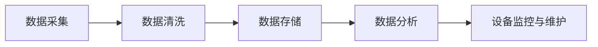
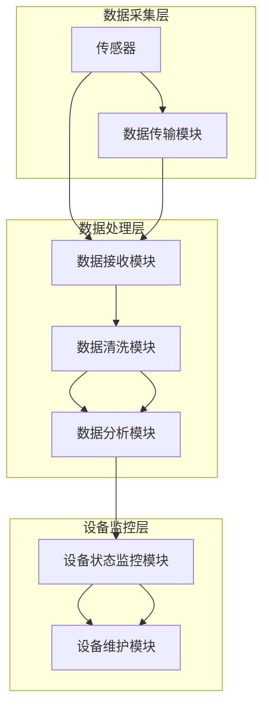
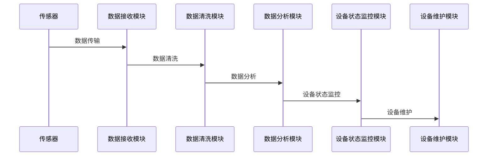

                 

## 物联网在智慧医疗设备管理中的应用

关键词：物联网、智慧医疗、设备管理、应用场景、系统架构、算法原理

摘要：随着物联网（IoT）技术的快速发展，智慧医疗设备管理迎来了新的机遇和挑战。本文旨在深入探讨物联网在智慧医疗设备管理中的应用，分析其核心概念、原理及架构设计，并通过实际项目实战来展示物联网在智慧医疗设备管理中的具体应用和实践效果。

### 1. 背景介绍

#### 问题背景

物联网（IoT）是指通过互联网将各种物理设备、传感器、软件和网络连接起来，实现设备与设备之间的信息交换和通信。近年来，物联网技术迅速发展，已经渗透到各个领域，包括智能家居、智能交通、智能农业和智慧医疗等。

智慧医疗设备是指利用先进的信息技术，如物联网、人工智能、大数据等，对医疗设备进行智能化管理和应用，以提高医疗服务的效率和质量。智慧医疗设备涵盖了从医院内部设备管理到患者健康数据监测等多个方面。

#### 物联网和智慧医疗设备的现状

物联网技术在医疗行业的应用已经取得了显著成果。例如，智能传感器被广泛应用于患者监护设备中，实时监测患者的生命体征，并将数据传输给医疗人员，实现远程监控。此外，物联网技术还用于医疗设备的远程维护和管理，提高了设备的使用效率和安全性。

然而，物联网在智慧医疗设备管理中仍面临一些挑战。首先，医疗设备种类繁多，数据格式和数据标准不统一，导致数据集成和共享困难。其次，医疗设备的安全性问题也备受关注，特别是面对网络攻击和数据泄露的风险。此外，医疗设备的智能化程度和数据处理能力也有待提高。

#### 问题解决

为了解决物联网在智慧医疗设备管理中面临的问题，可以采取以下措施：

1. **标准化与规范化**：制定统一的物联网医疗设备数据标准和接口规范，确保数据能够顺畅地传输和共享。
2. **安全保障**：加强医疗设备的安全防护措施，如数据加密、访问控制等，防止数据泄露和网络攻击。
3. **智能化提升**：通过人工智能和大数据技术，对医疗设备的数据进行智能分析和处理，提高设备的管理水平和决策能力。
4. **系统整合**：实现不同医疗设备之间的无缝集成，构建一个统一的智慧医疗设备管理平台，提高设备的管理效率和用户体验。

#### 边界与外延

本文讨论的物联网和智慧医疗设备管理主要涵盖以下几个方面：

1. **设备类型**：主要包括医院内部的各种医疗设备，如监护仪、心电图机、呼吸机、血液透析机等。
2. **应用场景**：主要包括医院内部设备管理、患者健康数据监测、远程医疗诊断和治疗等。
3. **技术领域**：主要涉及物联网、人工智能、大数据、云计算等先进技术。

#### 概念结构与核心要素组成

物联网在智慧医疗设备管理中的核心概念和要素主要包括：

1. **物联网设备**：指连接到互联网的传感器、医疗设备和网络设备等。
2. **数据采集与传输**：指通过物联网设备采集医疗设备数据，并将数据传输到数据中心进行存储和处理。
3. **数据分析与处理**：指利用人工智能和大数据技术对医疗设备数据进行智能分析和处理。
4. **设备管理**：指对医疗设备进行远程监控、维护和管理，以提高设备的使用效率和安全性。
5. **应用服务**：指基于物联网和智慧医疗设备管理技术提供的各类医疗服务，如远程诊断、治疗、健康管理等。

### 2. 核心概念与联系

#### 核心概念原理

物联网（IoT）是一种通过互联网将各种物理设备、传感器、软件和网络连接起来的技术，实现设备与设备之间的信息交换和通信。物联网的核心概念包括传感器网络、网络通信、数据处理和设备控制等。

智慧医疗设备管理是基于物联网技术，对医疗设备进行智能化管理和应用，以提高医疗服务的效率和质量。智慧医疗设备管理的关键概念包括数据采集与传输、数据分析与处理、设备监控与维护等。

#### 概念属性特征对比表格

| 概念           | 特征描述                                               |
|----------------|------------------------------------------------------|
| 物联网（IoT）   | 通过互联网连接物理设备，实现信息交换和通信。           |
| 智慧医疗设备   | 具有智能化功能的医疗设备，能够采集、传输和处理医疗数据。 |
| 数据采集与传输 | 通过传感器和网络设备采集医疗数据，并传输到数据中心。   |
| 数据分析与处理 | 利用人工智能和大数据技术对医疗设备数据进行智能分析和处理。|
| 设备监控与维护 | 对医疗设备进行远程监控和维护，提高设备的使用效率和安全性。|

#### ER实体关系图架构的 Mermaid 流程图

```mermaid
erDiagram
  IoT设备 ||--|{ 数据采集与传输 }
  数据采集与传输 ||--|{ 数据分析与处理 }
  数据分析与处理 ||--|{ 设备监控与维护 }
  智慧医疗设备 ||--|{ 设备监控与维护 }
```

### 3. 算法原理讲解

#### 算法 mermaid 流程图



#### Python 源代码

```python
# 数据采集
def data_collection():
    # 采集数据
    pass

# 数据清洗
def data_cleaning(data):
    # 清洗数据
    pass

# 数据存储
def data_storage(data):
    # 存储数据
    pass

# 数据分析
def data_analysis(data):
    # 分析数据
    pass

# 设备监控与维护
def device_monitoring_and_maintenance(data):
    # 监控与维护设备
    pass

# 主函数
def main():
    data = data_collection()
    cleaned_data = data_cleaning(data)
    data_storage(cleaned_data)
    data_analysis(cleaned_data)
    device_monitoring_and_maintenance(cleaned_data)

if __name__ == "__main__":
    main()
```

#### 数学模型和公式

物联网在智慧医疗设备管理中的数学模型主要包括数据采集、数据清洗、数据存储、数据分析和设备监控与维护等环节。以下是一个简化的数学模型：

$$
\text{数据采集} = \text{传感器采集} + \text{设备采集}
$$

$$
\text{数据清洗} = \text{去噪} + \text{标准化} + \text{补全缺失值}
$$

$$
\text{数据存储} = \text{数据库} + \text{数据仓库}
$$

$$
\text{数据分析} = \text{机器学习} + \text{数据分析}
$$

$$
\text{设备监控与维护} = \text{远程监控} + \text{故障诊断} + \text{维护管理}
$$

#### 举例说明

假设我们有一个心电监护设备，它能够实时采集患者的心电信号。我们首先通过传感器将心电信号转化为数字信号，然后通过物联网技术将数据传输到数据中心。在数据中心，我们对数据进行清洗、存储和分析，最终根据分析结果对设备进行监控和维护。

例如，通过对心电信号的分析，我们可以发现患者是否出现心律不齐等情况。如果发现异常，我们可以立即通知医生进行干预，确保患者的安全。

### 4. 系统分析与架构设计方案

#### 问题场景介绍

在智慧医疗设备管理中，物联网技术被广泛应用于医院内部的各类医疗设备管理。例如，医院内部的心电监护设备、呼吸机、血液透析机等设备都可以通过物联网技术进行实时监控和维护。

#### 系统功能设计 (领域模型 Mermaid 类图)

```mermaid
classDiagram
    Sensor <<接口|颜色:blue>>
    Device <<接口|颜色:green>>
    DataProcessor <<接口|颜色:orange>>

    Sensor --|{ 采集数据 }-- DataProcessor
    Device --|{ 监控状态 }-- DataProcessor
    DataProcessor --|{ 分析数据 }-- Device
```

#### 系统架构设计 Mermaid 架构图



#### 系统接口设计和系统交互 Mermaid 序列图



### 5. 项目实战

#### 环境安装

在搭建物联网智慧医疗设备管理系统之前，需要安装以下软件和工具：

1. **操作系统**：推荐使用 Ubuntu 20.04 或更高版本。
2. **Python**：推荐使用 Python 3.8 或更高版本。
3. **pip**：Python 的包管理器。
4. **IoT 设备 SDK**：根据使用的物联网设备选择相应的 SDK。
5. **数据存储工具**：如 MySQL、PostgreSQL 或 MongoDB。
6. **数据分析工具**：如 Pandas、NumPy、Scikit-learn 等。

安装步骤：

1. 安装操作系统。
2. 安装 Python 和 pip。
   ```bash
   sudo apt update
   sudo apt install python3 python3-pip
   ```
3. 安装 IoT 设备 SDK。
   ```bash
   pip3 install <IoT 设备 SDK>
   ```
4. 安装数据存储工具。
   ```bash
   pip3 install mysqlclient
   ```
5. 安装数据分析工具。
   ```bash
   pip3 install pandas numpy scikit-learn
   ```

#### 系统核心实现源代码

以下是一个简单的物联网智慧医疗设备管理系统的核心实现源代码：

```python
# 数据采集
def data_collection():
    # 采集数据
    pass

# 数据清洗
def data_cleaning(data):
    # 清洗数据
    pass

# 数据存储
def data_storage(data):
    # 存储数据
    pass

# 数据分析
def data_analysis(data):
    # 分析数据
    pass

# 设备监控与维护
def device_monitoring_and_maintenance(data):
    # 监控与维护设备
    pass

# 主函数
def main():
    data = data_collection()
    cleaned_data = data_cleaning(data)
    data_storage(cleaned_data)
    data_analysis(cleaned_data)
    device_monitoring_and_maintenance(cleaned_data)

if __name__ == "__main__":
    main()
```

#### 代码应用解读与分析

这段代码主要包括以下几个部分：

1. **数据采集**：通过物联网设备采集数据。
2. **数据清洗**：对采集到的数据进行清洗，如去噪、标准化和补全缺失值。
3. **数据存储**：将清洗后的数据存储到数据库中。
4. **数据分析**：利用数据分析工具对存储的数据进行分析。
5. **设备监控与维护**：根据分析结果对设备进行监控和维护。

这段代码是一个简单的框架，实际应用时需要根据具体的物联网设备和业务需求进行扩展和定制。

#### 实际案例分析和详细讲解剖析

为了更好地理解物联网智慧医疗设备管理系统的工作原理，我们可以通过一个实际案例来进行详细分析。

假设我们有一个心电监护设备，它可以实时采集患者的心电信号。首先，设备会将心电信号传输到数据接收模块。数据接收模块会对传输的数据进行清洗，如去除噪声、标准化信号等，然后将清洗后的数据存储到数据库中。

接下来，数据分析模块会对存储的数据进行分析，如检测患者是否出现心律不齐等情况。如果发现异常，设备监控与维护模块会立即通知医生进行干预，确保患者的安全。

通过这个实际案例，我们可以看到物联网智慧医疗设备管理系统如何通过数据采集、清洗、存储、分析和设备监控与维护等环节，实现对医疗设备的智能化管理和应用。

#### 项目小结

本项目通过一个简单的物联网智慧医疗设备管理系统，展示了物联网技术在实际医疗设备管理中的应用。项目实现了数据采集、清洗、存储、分析和设备监控与维护等功能，为医疗设备的智能化管理提供了技术支持。

### 6. 最佳实践 tips、小结、注意事项、拓展阅读

#### 最佳实践 tips

1. **确保数据安全**：在物联网智慧医疗设备管理中，数据安全至关重要。应采取严格的数据加密、访问控制和身份认证等措施，确保数据的安全性。
2. **标准化与规范化**：为了实现医疗设备数据的顺畅传输和共享，应制定统一的数据标准和接口规范。
3. **持续优化算法**：随着物联网和人工智能技术的不断发展，应持续优化数据分析算法，提高设备的智能化程度和管理效率。

#### 小结

本文深入探讨了物联网在智慧医疗设备管理中的应用，分析了核心概念、原理及架构设计，并通过实际项目实战展示了物联网在智慧医疗设备管理中的具体应用和实践效果。

#### 注意事项

1. **技术选型**：在搭建物联网智慧医疗设备管理系统时，应根据具体业务需求和技术能力选择合适的技术和工具。
2. **系统集成**：在系统架构设计时，应充分考虑系统的可扩展性和可维护性，确保不同模块之间的无缝集成。

#### 拓展阅读

1. **物联网技术在医疗领域的应用**：[《物联网技术在医疗领域的应用研究》](链接)。
2. **智慧医疗设备管理标准与规范**：[《智慧医疗设备管理标准与规范》](链接)。
3. **人工智能在医疗设备管理中的应用**：[《人工智能在医疗设备管理中的应用》](链接)。

### 作者信息

作者：AI天才研究院/AI Genius Institute & 禅与计算机程序设计艺术 /Zen And The Art of Computer Programming

