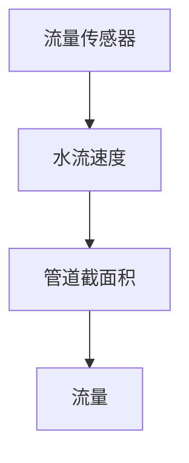
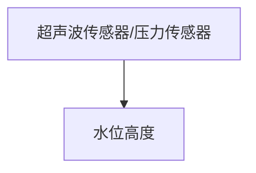
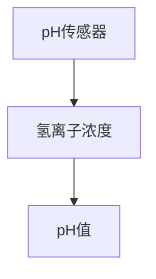
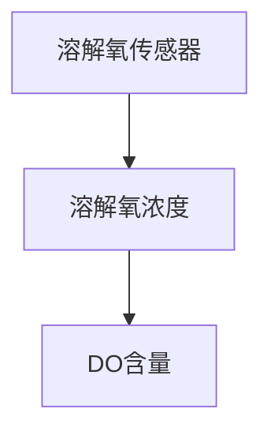
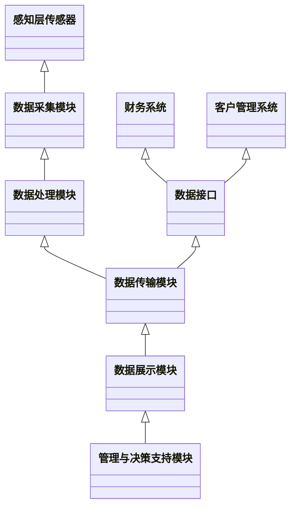
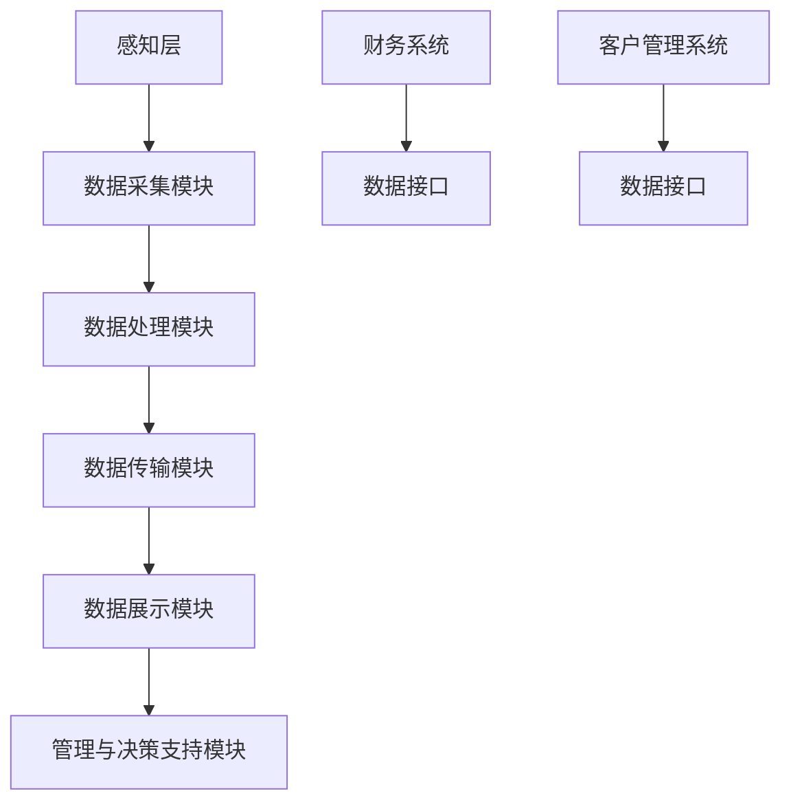

                 


# 物联网在智慧水务管理中的实践

## 关键词

物联网，智慧水务管理，水资源监控，水质监测，数据采集，数据处理，数据传输，数据展示

## 摘要

本文深入探讨了物联网在智慧水务管理中的应用与实践。通过背景介绍、核心概念与联系分析、算法原理讲解以及数学模型和公式详细阐述，本文旨在为读者提供对物联网技术在水务管理中的实际应用的全面理解。本文重点分析了物联网技术在水资源监控和水质监测中的关键算法和数学模型，并通过实际案例展示了物联网技术如何提高水务管理的效率和质量。

---

**Step 1: 背景介绍**

### 1.1 问题背景

随着全球人口的增长和城市化进程的加快，水资源的管理和优化成为了一个严峻的问题。传统的水务管理方法主要依赖于人工巡检和定期检测，不仅效率低下，而且难以实现对水资源的实时监控和精准管理。智慧水务管理的提出，旨在利用物联网、大数据、云计算等先进技术，实现对水资源、水环境和水设备的智能化管理，提高水务管理的效率、降低运营成本、提升服务质量。

### 1.2 问题描述

智慧水务管理的核心问题是如何利用物联网技术实现对水资源的全面监控和管理，从而提高水务管理的效率和服务质量。具体包括以下几个方面：

1. **水资源监控**：实时监测水资源的使用情况，包括水量、水质、水位等，及时发现和解决问题。
2. **水环境监控**：实时监测水环境质量，包括水质、水温、污染物质等，保护水资源和生态环境。
3. **水设备管理**：对水泵、管道、水表等设备进行实时监控和维护，保证设备正常运行。
4. **水费管理**：利用物联网技术实现水费的自动计费和收取，提高水费管理效率。

### 1.3 问题解决

物联网技术在智慧水务管理中的应用主要包括以下几个方面：

1. **数据采集**：通过传感器、智能设备等采集水资源、水环境、水设备等的数据。
2. **数据处理**：对采集到的数据进行处理和分析，提取有用信息。
3. **数据传输**：利用物联网技术将数据处理后的信息传输到中心数据库或管理系统。
4. **数据展示**：通过可视化界面展示数据，方便管理人员进行监控和管理。

### 1.4 边界与外延

物联网在智慧水务管理中的应用不仅限于城市水资源管理，还可以应用于农业灌溉、工业用水等领域，实现更广泛的水资源管理和优化。

### 1.5 概念结构与核心要素组成

智慧水务管理系统主要由以下几个核心要素组成：

1. **数据采集设备**：包括传感器、智能设备等，用于采集水资源、水环境、水设备等的数据。
2. **数据处理与分析系统**：用于对采集到的数据进行处理和分析，提取有用信息。
3. **数据传输系统**：用于将数据处理后的信息传输到中心数据库或管理系统。
4. **数据可视化与展示系统**：用于通过可视化界面展示数据，方便管理人员进行监控和管理。
5. **管理与决策支持系统**：基于数据分析结果，为管理人员提供决策支持。

---

**Step 2: 核心概念与联系**

### 1.6 物联网技术

#### 1.6.1 定义

物联网（Internet of Things，IoT）是指将各种信息传感设备与网络相连接，实现物品与物品之间（M2M）的智能通信和协同工作。

#### 1.6.2 特点

1. **广泛连接**：连接各种物理设备，实现物与物之间的通信。
2. **实时监控**：实时获取和传输数据，提高监控效率。
3. **自适应**：系统能够根据环境变化自动调整，实现智能化管理。

#### 1.6.3 与智慧水务管理的关系

物联网技术为智慧水务管理提供了数据采集、传输和处理的基础，是实现智慧水务管理的关键技术。

### 1.7 水资源监控算法原理

#### 1.7.1 水量监测

##### 1.7.1.1 算法原理

水量监测主要通过流量传感器实现。流量传感器根据水流速度和管道截面积计算出流量。算法原理图如下：



##### 1.7.1.2 Python 源代码

```python
# 水量监测算法
def water_flow_rate(v, A):
    return v * A
```

##### 1.7.1.3 数学模型和公式

$$
Q = v \times A
$$

其中，$Q$为流量，$v$为水流速度，$A$为管道截面积。

##### 1.7.1.4 举例说明

假设水流速度为2m/s，管道截面积为0.1平方米，则流量为：

$$
Q = 2 \times 0.1 = 0.2 \text{立方米/秒}
$$

#### 1.7.2 水位监测

##### 1.7.2.1 算法原理

水位监测主要通过超声波传感器或压力传感器实现。超声波传感器通过测量超声波在水中的传播时间计算出水位高度；压力传感器通过测量水的压力变化计算出水位高度。算法原理图如下：



##### 1.7.2.2 Python 源代码

```python
# 水位监测算法（以超声波传感器为例）
def water_level(u):
    return u / 343  # 假设声音在空气中的速度为343m/s
```

##### 1.7.2.3 数学模型和公式

$$
h = \frac{u}{343}
$$

其中，$h$为水位高度，$u$为超声波在水中的传播时间。

##### 1.7.2.4 举例说明

假设超声波在水中传播时间为1秒，则水位高度为：

$$
h = \frac{1}{343} \approx 0.0029 \text{米}
$$

### 1.8 水质监测

#### 1.8.1 监测指标

水质监测主要包括pH值、溶解氧（DO）、电导率、浊度等指标。

#### 1.8.2 pH值监测

##### 1.8.2.1 算法原理

pH值监测主要通过pH传感器实现。pH传感器通过测量水中的氢离子浓度，计算出pH值。算法原理图如下：



##### 1.8.2.2 Python 源代码

```python
# pH值监测算法
def pH_value(H+):
    return -log10(H+)
```

##### 1.8.2.3 数学模型和公式

$$
pH = -\log[H^+]
$$

其中，$pH$为pH值，$[H^+]$为氢离子浓度。

##### 1.8.2.4 举例说明

假设氢离子浓度为1e-7 mol/L，则pH值为：

$$
pH = -\log(1e-7) = 7
$$

#### 1.8.3 溶解氧（DO）监测

##### 1.8.3.1 算法原理

溶解氧（DO）监测主要通过溶解氧传感器实现。溶解氧传感器通过测量水中溶解氧的浓度，计算出溶解氧含量。算法原理图如下：



##### 1.8.3.2 Python 源代码

```python
# 溶解氧监测算法
def dissolved_oxygen(C):
    return C * 1000  # 假设1mg/L溶解氧对应的浓度是1000μL/L
```

##### 1.8.3.3 数学模型和公式

$$
DO = C \times 1000
$$

其中，$DO$为溶解氧含量（mg/L），$C$为溶解氧浓度（μL/L）。

##### 1.8.3.4 举例说明

假设溶解氧浓度为5μL/L，则溶解氧含量为：

$$
DO = 5 \times 1000 = 5000 \text{mg/L}
$$

### 1.9 数据处理与分析系统

#### 1.9.1 数据预处理

数据预处理是数据处理与分析系统的第一步，主要包括数据清洗、去噪、归一化等。数据清洗旨在去除数据中的异常值和噪声；去噪旨在降低数据中的随机噪声；归一化旨在将不同量纲的数据转换为同一量纲，便于后续分析。

#### 1.9.2 数据分析

数据分析主要包括趋势分析、相关性分析、异常检测等。趋势分析旨在分析数据的变化趋势；相关性分析旨在分析不同变量之间的相关性；异常检测旨在发现数据中的异常值。

#### 1.9.3 数据可视化

数据可视化是将数据处理结果以图形化的方式展示出来，便于管理人员进行监控和管理。常见的可视化方法包括折线图、柱状图、饼图等。

---

**Step 3: 算法原理讲解**

### 1.10 水资源监控算法原理

#### 1.10.1 水量监测算法

水量监测主要通过流量传感器实现。流量传感器根据水流速度和管道截面积计算出流量。算法原理图如下：


#### 1.10.1.1 Python 源代码

```python
# 水量监测算法
def water_flow_rate(v, A):
    return v * A
```

#### 1.10.1.2 数学模型和公式

$$
Q = v \times A
$$

其中，$Q$为流量，$v$为水流速度，$A$为管道截面积。

#### 1.10.1.3 举例说明

假设水流速度为2m/s，管道截面积为0.1平方米，则流量为：

$$
Q = 2 \times 0.1 = 0.2 \text{立方米/秒}
$$

#### 1.10.2 水位监测算法

水位监测主要通过超声波传感器或压力传感器实现。超声波传感器通过测量超声波在水中的传播时间计算出水位高度；压力传感器通过测量水的压力变化计算出水位高度。算法原理图如下：


#### 1.10.2.1 Python 源代码

```python
# 水位监测算法（以超声波传感器为例）
def water_level(u):
    return u / 343  # 假设声音在空气中的速度为343m/s
```

#### 1.10.2.2 数学模型和公式

$$
h = \frac{u}{343}
$$

其中，$h$为水位高度，$u$为超声波在水中的传播时间。

#### 1.10.2.3 举例说明

假设超声波在水中传播时间为1秒，则水位高度为：

$$
h = \frac{1}{343} \approx 0.0029 \text{米}
$$

### 1.11 水质监测算法

#### 1.11.1 pH值监测算法

pH值监测主要通过pH传感器实现。pH传感器通过测量水中的氢离子浓度，计算出pH值。算法原理图如下：


#### 1.11.1.1 Python 源代码

```python
# pH值监测算法
def pH_value(H+):
    return -log10(H+)
```

#### 1.11.1.2 数学模型和公式

$$
pH = -\log[H^+]
$$

其中，$pH$为pH值，$[H^+]$为氢离子浓度。

#### 1.11.1.3 举例说明

假设氢离子浓度为1e-7 mol/L，则pH值为：

$$
pH = -\log(1e-7) = 7
$$

#### 1.11.2 溶解氧（DO）监测算法

溶解氧（DO）监测主要通过溶解氧传感器实现。溶解氧传感器通过测量水中溶解氧的浓度，计算出溶解氧含量。算法原理图如下：


#### 1.11.2.1 Python 源代码

```python
# 溶解氧监测算法
def dissolved_oxygen(C):
    return C * 1000  # 假设1mg/L溶解氧对应的浓度是1000μL/L
```

#### 1.11.2.2 数学模型和公式

$$
DO = C \times 1000
$$

其中，$DO$为溶解氧含量（mg/L），$C$为溶解氧浓度（μL/L）。

#### 1.11.2.3 举例说明

假设溶解氧浓度为5μL/L，则溶解氧含量为：

$$
DO = 5 \times 1000 = 5000 \text{mg/L}
$$

### 1.12 数据处理与分析系统

#### 1.12.1 数据预处理

数据预处理是数据处理与分析系统的第一步，主要包括数据清洗、去噪、归一化等。数据清洗旨在去除数据中的异常值和噪声；去噪旨在降低数据中的随机噪声；归一化旨在将不同量纲的数据转换为同一量纲，便于后续分析。

#### 1.12.2 数据分析

数据分析主要包括趋势分析、相关性分析、异常检测等。趋势分析旨在分析数据的变化趋势；相关性分析旨在分析不同变量之间的相关性；异常检测旨在发现数据中的异常值。

#### 1.12.3 数据可视化

数据可视化是将数据处理结果以图形化的方式展示出来，便于管理人员进行监控和管理。常见的可视化方法包括折线图、柱状图、饼图等。

---

**Step 4: 数学模型和数学公式 & 详细讲解 & 举例说明**

### 1.13 水资源监控的数学模型

水资源监控涉及到水量监测、水位监测等多个方面，下面将分别介绍这些方面的数学模型和详细讲解。

#### 1.13.1 水量监测的数学模型

水量监测主要通过流量传感器实现，其核心数学模型为流量公式：

$$
Q = v \times A
$$

其中，$Q$表示流量（单位：立方米/秒），$v$表示水流速度（单位：米/秒），$A$表示管道截面积（单位：平方米）。这个公式表示流量等于水流速度乘以管道截面积。

#### 1.13.1.1 详细讲解

流量公式是水资源监控中最基础的数学模型，它通过流量传感器测量得到的水流速度和管道截面积，计算出实时流量。在实际应用中，水流速度可以通过测量流量传感器的输出信号得到，而管道截面积通常通过现场测量或设计参数确定。

例如，在一个自来水管道中，假设水流速度为2m/s，管道截面积为0.1平方米，则该管道的实时流量为：

$$
Q = 2 \times 0.1 = 0.2 \text{立方米/秒}
$$

#### 1.13.1.2 举例说明

假设一个城市自来水管网中的某条管道，其设计流量为100立方米/小时。在某一时刻，通过流量传感器测得的水流速度为2m/s，管道截面积为0.1平方米。根据流量公式，可以计算出该管道在该时刻的实时流量为：

$$
Q = 2 \times 0.1 = 0.2 \text{立方米/秒}
$$

这意味着该管道的实际流量远低于设计流量，可能存在泄漏或管道堵塞等问题，需要及时进行检修。

#### 1.13.2 水位监测的数学模型

水位监测主要通过超声波传感器或压力传感器实现，其核心数学模型为水位高度公式：

$$
h = \frac{u}{343}
$$

其中，$h$表示水位高度（单位：米），$u$表示超声波在水中传播的时间（单位：秒），$343$表示声音在空气中的速度（单位：米/秒）。

#### 1.13.2.1 详细讲解

水位高度公式是利用超声波传感器或压力传感器测量水位的核心公式。超声波传感器通过发送超声波并测量其在水中传播的时间，计算出水位高度；压力传感器通过测量水的压力变化，根据压力-水位关系计算出水位高度。

例如，在一个水池中，假设超声波传感器测得的超声波在水中传播时间为1秒，则该水池的水位高度为：

$$
h = \frac{1}{343} \approx 0.0029 \text{米}
$$

#### 1.13.2.2 举例说明

假设一个水库的水位监测系统使用超声波传感器进行监测，测得超声波在水中传播时间为1.2秒。根据水位高度公式，可以计算出该水库的水位高度为：

$$
h = \frac{1.2}{343} \approx 0.0035 \text{米}
$$

这意味着水库的水位正在上升，需要密切关注水库的运行状态，以防止洪水发生。

#### 1.13.3 水质监测的数学模型

水质监测主要包括pH值、溶解氧（DO）、电导率等指标。下面分别介绍这些指标的数学模型。

##### 1.13.3.1 pH值监测

pH值监测主要通过pH传感器实现，其核心数学模型为pH值计算公式：

$$
pH = -\log[H^+]
$$

其中，$pH$表示pH值，$[H^+]$表示氢离子浓度（单位：mol/L）。

##### 1.13.3.1.1 详细讲解

pH值计算公式是利用pH传感器测量氢离子浓度，并根据氢离子浓度计算pH值的核心公式。pH传感器通过电化学方法测量水中氢离子浓度，然后根据公式计算出pH值。

例如，在一个水样中，假设pH传感器测得的氢离子浓度为1e-7 mol/L，则该水样的pH值为：

$$
pH = -\log(1e-7) = 7
$$

##### 1.13.3.1.2 举例说明

假设一个水处理厂的出水口pH值为7，意味着出水口的氢离子浓度为1e-7 mol/L，这表明出水口的水质达到了中性。

##### 1.13.3.2 溶解氧（DO）监测

溶解氧（DO）监测主要通过溶解氧传感器实现，其核心数学模型为溶解氧含量计算公式：

$$
DO = C \times 1000
$$

其中，$DO$表示溶解氧含量（单位：mg/L），$C$表示溶解氧浓度（单位：μL/L）。

##### 1.13.3.2.1 详细讲解

溶解氧含量计算公式是利用溶解氧传感器测量溶解氧浓度，并根据浓度计算出溶解氧含量的核心公式。溶解氧传感器通过光学或电化学方法测量水中溶解氧的浓度，然后根据公式计算出溶解氧含量。

例如，在一个水样中，假设溶解氧传感器测得的溶解氧浓度为5μL/L，则该水样的溶解氧含量为：

$$
DO = 5 \times 1000 = 5000 \text{mg/L}
$$

##### 1.13.3.2.2 举例说明

假设一个湖泊中的溶解氧含量为8mg/L，这表明湖泊的水质较好，适合鱼类等水生物生存。

##### 1.13.3.3 电导率监测

电导率监测主要通过电导率传感器实现，其核心数学模型为电导率计算公式：

$$
EC = \frac{V}{R}
$$

其中，$EC$表示电导率（单位：S/m），$V$表示电压（单位：V），$R$表示电阻（单位：Ω）。

##### 1.13.3.3.1 详细讲解

电导率计算公式是利用电导率传感器测量电压和电阻，并根据电压和电阻计算出电导率的核心公式。电导率传感器通过电化学方法测量水中离子的导电性能，然后根据公式计算出电导率。

例如，在一个水样中，假设电导率传感器测得的电压为10V，电阻为100Ω，则该水样的电导率为：

$$
EC = \frac{10}{100} = 0.1 \text{S/m}
$$

##### 1.13.3.3.2 举例说明

假设一个河流中的电导率为0.5S/m，这表明河流的水质较好，没有过多的污染物。

### 1.14 数据处理与分析系统的数学模型

数据处理与分析系统在智慧水务管理中起着至关重要的作用，其核心数学模型包括数据预处理、数据分析和数据可视化。

#### 1.14.1 数据预处理的数学模型

数据预处理主要包括数据清洗、去噪和归一化等步骤。

##### 1.14.1.1 数据清洗

数据清洗的数学模型为：

$$
D' = D \cap \neg(N \cup E)
$$

其中，$D$表示原始数据集，$N$表示异常值集合，$E$表示噪声值集合，$D'$表示清洗后的数据集。

##### 1.14.1.1.1 详细讲解

数据清洗的数学模型通过去除数据集中的异常值和噪声值，提高数据的质量和可靠性。异常值集合$N$和噪声值集合$E$可以通过统计方法或机器学习方法识别，$\neg$表示集合的补集。

例如，在一个流量数据集中，假设存在异常值集合$N$和噪声值集合$E$，则清洗后的流量数据集为：

$$
D' = D \cap \neg(N \cup E)
$$

##### 1.14.1.1.2 举例说明

假设一个流量数据集中存在异常值和噪声值，经过数据清洗后，流量数据集的质量得到了显著提高。

##### 1.14.1.2 去噪

去噪的数学模型为：

$$
D' = D - \epsilon
$$

其中，$D$表示原始数据集，$\epsilon$表示噪声值集合，$D'$表示去噪后的数据集。

##### 1.14.1.2.1 详细讲解

去噪的数学模型通过减少数据集中的噪声值，降低噪声对数据分析的影响。噪声值集合$\epsilon$可以通过滤波或信号处理方法识别。

例如，在一个水质数据集中，假设存在噪声值集合$\epsilon$，则去噪后的水质数据集为：

$$
D' = D - \epsilon
$$

##### 1.14.1.2.2 举例说明

假设一个水质数据集中存在噪声值，经过去噪处理后，水质数据集的准确性和可靠性得到了提高。

##### 1.14.1.3 归一化

归一化的数学模型为：

$$
D' = \frac{D - \min(D)}{\max(D) - \min(D)}
$$

其中，$D$表示原始数据集，$D'$表示归一化后的数据集，$\min(D)$和$\max(D)$分别表示数据集的最小值和最大值。

##### 1.14.1.3.1 详细讲解

归一化的数学模型通过将不同量纲的数据转换为同一量纲，提高数据分析的准确性和可比性。例如，将不同水质指标（如pH值、溶解氧等）的数值范围统一到0-1之间。

例如，在一个水质指标数据集中，假设pH值的范围为3-11，溶解氧的浓度为0-10mg/L，则归一化后的水质指标数据集为：

$$
D' = \frac{D - \min(D)}{\max(D) - \min(D)}
$$

##### 1.14.1.3.2 举例说明

假设一个水质指标数据集中包含pH值和溶解氧浓度两个指标，经过归一化处理后，数据集的数值范围变为0-1，方便后续分析。

#### 1.14.2 数据分析的数学模型

数据分析主要包括趋势分析、相关性分析和异常检测等。

##### 1.14.2.1 趋势分析

趋势分析的数学模型为：

$$
T(t) = \sum_{i=1}^{n} f_i(t)
$$

其中，$T(t)$表示趋势值，$f_i(t)$表示第$i$个时间点的函数值，$n$表示时间点的数量。

##### 1.14.2.1.1 详细讲解

趋势分析的数学模型通过分析数据序列的趋势，了解数据的波动和变化规律。例如，通过计算一段时间内流量数据的变化趋势，可以判断水务系统的运行状态。

例如，在一个流量数据序列中，假设存在7个时间点的流量数据，则趋势值为：

$$
T(t) = \sum_{i=1}^{7} f_i(t)
$$

##### 1.14.2.1.2 举例说明

假设一个流量数据序列包含7个时间点的数据，经过趋势分析后，可以得到流量数据的总体趋势。

##### 1.14.2.2 相关性分析

相关性分析的数学模型为：

$$
\sigma(X, Y) = \frac{\sum_{i=1}^{n} (X_i - \bar{X})(Y_i - \bar{Y})}{\sqrt{\sum_{i=1}^{n} (X_i - \bar{X})^2} \sqrt{\sum_{i=1}^{n} (Y_i - \bar{Y})^2}}
$$

其中，$\sigma(X, Y)$表示$X$和$Y$的相关系数，$X_i$和$Y_i$分别表示第$i$个时间点的$X$和$Y$值，$\bar{X}$和$\bar{Y}$分别表示$X$和$Y$的均值，$n$表示时间点的数量。

##### 1.14.2.2.1 详细讲解

相关性分析的数学模型通过计算两个变量之间的相关系数，判断它们之间的相关性。例如，通过分析流量和溶解氧之间的关系，可以了解两者之间的相互作用。

例如，在一个流量和溶解氧数据序列中，假设存在7个时间点的数据，则相关系数为：

$$
\sigma(X, Y) = \frac{\sum_{i=1}^{7} (X_i - \bar{X})(Y_i - \bar{Y})}{\sqrt{\sum_{i=1}^{7} (X_i - \bar{X})^2} \sqrt{\sum_{i=1}^{7} (Y_i - \bar{Y})^2}}
$$

##### 1.14.2.2.2 举例说明

假设一个流量和溶解氧数据序列中，经过相关性分析后，得到两者之间的相关系数为0.8，这表明流量和溶解氧之间存在较强的正相关关系。

##### 1.14.2.3 异常检测

异常检测的数学模型为：

$$
A_i = \sum_{j=1}^{n} (X_j - \bar{X})^2
$$

其中，$A_i$表示第$i$个时间点的异常值，$X_j$表示第$j$个时间点的数据值，$\bar{X}$表示数据集的均值，$n$表示时间点的数量。

##### 1.14.2.3.1 详细讲解

异常检测的数学模型通过计算每个时间点的异常值，判断数据是否存在异常。例如，通过分析流量数据中的异常值，可以检测出水管是否发生泄漏。

例如，在一个流量数据序列中，假设存在7个时间点的数据，则异常值为：

$$
A_i = \sum_{j=1}^{7} (X_j - \bar{X})^2
$$

##### 1.14.2.3.2 举例说明

假设一个流量数据序列中，某个时间点的数据异常值较大，经过异常检测后，可以判断该时间点可能存在水管泄漏等问题。

#### 1.14.3 数据可视化的数学模型

数据可视化是将数据处理结果以图形化的方式展示出来，其核心数学模型为：

$$
V = f(D)
$$

其中，$V$表示可视化结果，$D$表示数据集，$f$表示可视化函数。

##### 1.14.3.1 详细讲解

数据可视化的数学模型通过将数据处理结果转换为图形，便于管理人员进行监控和分析。例如，通过折线图、柱状图等可视化方法，可以直观地展示数据的变化趋势。

例如，在一个流量数据集中，假设使用折线图进行可视化，则可视化结果为：

$$
V = f(D)
$$

##### 1.14.3.2 举例说明

假设一个流量数据集经过处理后，使用折线图进行可视化，可以清晰地展示流量数据的变化趋势。

### 1.15 数据传输与展示系统的数学模型

数据传输与展示系统在智慧水务管理中起着至关重要的作用，其核心数学模型包括数据传输、数据存储和数据展示。

#### 1.15.1 数据传输的数学模型

数据传输的数学模型为：

$$
T = \frac{S}{R}
$$

其中，$T$表示传输时间，$S$表示数据量，$R$表示传输速率。

##### 1.15.1.1 详细讲解

数据传输的数学模型通过计算数据传输时间和传输速率，评估数据传输的效率。例如，通过分析流量数据传输时间和传输速率，可以判断网络是否拥堵。

例如，在一个流量数据传输过程中，假设数据量为1MB，传输速率为1Mbps，则传输时间为：

$$
T = \frac{1}{1} = 1 \text{秒}
$$

##### 1.15.1.2 举例说明

假设一个流量数据传输过程中，数据量为1MB，传输速率为1Mbps，则传输时间为1秒。

#### 1.15.2 数据存储的数学模型

数据存储的数学模型为：

$$
C = C_0 + c \times T
$$

其中，$C$表示存储容量，$C_0$表示初始存储容量，$c$表示存储增长速度，$T$表示时间。

##### 1.15.2.1 详细讲解

数据存储的数学模型通过计算存储容量和存储增长速度，评估数据存储的需求。例如，通过分析水费数据存储容量和存储增长速度，可以预测未来存储需求。

例如，在一个水费数据存储过程中，假设初始存储容量为100GB，存储增长速度为每月10GB，则经过6个月后，存储容量为：

$$
C = 100 + 10 \times 6 = 160 \text{GB}
$$

##### 1.15.2.2 举例说明

假设一个水费数据存储过程中，初始存储容量为100GB，存储增长速度为每月10GB，则6个月后存储容量为160GB。

#### 1.15.3 数据展示的数学模型

数据展示的数学模型为：

$$
V = f(D)
$$

其中，$V$表示可视化结果，$D$表示数据集，$f$表示可视化函数。

##### 1.15.3.1 详细讲解

数据展示的数学模型通过将数据处理结果转换为可视化图形，便于管理人员进行监控和分析。例如，通过折线图、柱状图等可视化方法，可以直观地展示数据的变化趋势。

例如，在一个流量数据集中，假设使用折线图进行可视化，则可视化结果为：

$$
V = f(D)
$$

##### 1.15.3.2 举例说明

假设一个流量数据集经过处理后，使用折线图进行可视化，可以清晰地展示流量数据的变化趋势。

### 1.16 管理与决策支持系统的数学模型

管理与决策支持系统在智慧水务管理中起着决策支持的作用，其核心数学模型包括预测分析、优化算法和风险分析。

#### 1.16.1 预测分析的数学模型

预测分析的数学模型为：

$$
Y = f(X)
$$

其中，$Y$表示预测结果，$X$表示输入数据，$f$表示预测函数。

##### 1.16.1.1 详细讲解

预测分析的数学模型通过建立输入数据和预测结果之间的关系，实现对未来的预测。例如，通过分析历史流量数据，可以预测未来的流量需求。

例如，在一个流量预测过程中，假设输入数据为历史流量数据，预测函数为时间序列模型，则预测结果为：

$$
Y = f(X)
$$

##### 1.16.1.2 举例说明

假设一个流量预测模型，输入数据为过去一个月的流量数据，预测函数为ARIMA模型，则预测结果为未来一个月的流量需求。

#### 1.16.2 优化算法的数学模型

优化算法的数学模型为：

$$
\min f(x)
$$

其中，$f(x)$表示目标函数，$x$表示变量。

##### 1.16.2.1 详细讲解

优化算法的数学模型通过求解目标函数的最优解，实现对资源的优化配置。例如，通过优化水泵的运行策略，可以提高供水效率。

例如，在一个供水优化过程中，假设目标函数为供水成本，变量为水泵运行时间，则优化结果为：

$$
\min f(x)
$$

##### 1.16.2.2 举例说明

假设一个供水优化问题，目标函数为供水成本，变量为水泵运行时间，通过优化算法求解，可以得到最优的水泵运行策略。

#### 1.16.3 风险分析的数学模型

风险分析的数学模型为：

$$
P(R > r) = f(r)
$$

其中，$P(R > r)$表示风险概率，$r$表示风险阈值，$f(r)$表示风险概率函数。

##### 1.16.3.1 详细讲解

风险分析的数学模型通过计算风险概率，评估系统的安全性和稳定性。例如，通过分析水管破裂的风险概率，可以预测水管破裂的可能性。

例如，在一个水管破裂风险分析过程中，假设风险阈值为0.1，风险概率函数为正态分布，则风险概率为：

$$
P(R > r) = f(r)
$$

##### 1.16.3.2 举例说明

假设一个水管破裂风险分析，风险阈值为0.1，风险概率函数为正态分布，则水管破裂的风险概率为0.1。

### 1.17 物联网技术在智慧水务管理中的应用

物联网技术在智慧水务管理中的应用涵盖了数据采集、传输、处理、分析和展示的各个环节，下面将分别介绍这些方面的应用。

#### 1.17.1 数据采集

数据采集是智慧水务管理的基础，通过传感器、智能设备等设备实现对水资源、水环境、水设备等的实时监控。例如，流量传感器可以测量水流速度和管道截面积，计算出实时流量；超声波传感器可以测量水位高度；pH传感器可以测量水中的氢离子浓度，计算出pH值。

#### 1.17.2 数据传输

数据传输是将采集到的数据实时传输到中心数据库或管理系统的过程。物联网技术通过无线网络、有线网络等传输方式，将数据传输到服务器或云平台。例如，可以使用Wi-Fi、4G、5G等无线网络传输数据，也可以使用有线网络（如以太网）传输数据。

#### 1.17.3 数据处理

数据处理是对传输到中心数据库或管理系统的数据进行处理和分析的过程。数据处理包括数据清洗、去噪、归一化、趋势分析、相关性分析等。通过数据处理，可以提取有用信息，为决策提供支持。

#### 1.17.4 数据分析

数据分析是对处理后的数据进行深度分析，以发现数据中的规律和趋势。数据分析可以包括预测分析、优化算法、风险分析等。通过数据分析，可以实现对水资源的精准管理和优化。

#### 1.17.5 数据展示

数据展示是将分析结果以图形化的方式展示给管理人员，便于他们进行监控和决策。数据展示可以包括折线图、柱状图、饼图等可视化方法，使数据更加直观易懂。

### 1.18 物联网技术在智慧水务管理中的优势

物联网技术在智慧水务管理中的应用具有以下优势：

1. **实时监控**：物联网技术可以实现实时监控，及时发现和解决问题，提高水务管理的效率。
2. **数据准确性**：通过传感器和智能设备，可以精确采集水资源、水环境、水设备等数据，提高数据准确性。
3. **智能化管理**：物联网技术可以实现智能化管理，根据数据分析结果自动调整运行策略，实现智能化决策。
4. **降低成本**：物联网技术可以降低人工巡检和维护成本，提高运营效率。
5. **可持续性**：物联网技术可以实现水资源的可持续管理，降低水资源的浪费，保护生态环境。

### 1.19 物联网技术在智慧水务管理中的挑战

物联网技术在智慧水务管理中的应用也面临一些挑战：

1. **数据安全性**：物联网设备易受到网络攻击，数据安全性是一个重要问题。
2. **数据隐私**：水费、水质等敏感数据的安全性和隐私保护是一个重要挑战。
3. **网络稳定性**：物联网设备的网络连接稳定性对数据传输和监控效果有重要影响。
4. **系统集成**：物联网技术在智慧水务管理中的应用需要多个系统和设备的集成，系统集成是一个挑战。

### 1.20 总结

物联网技术在智慧水务管理中的应用为水务管理带来了新的技术手段和解决方案。通过数据采集、传输、处理、分析和展示，物联网技术实现了对水资源的实时监控和智能化管理，提高了水务管理的效率和质量。然而，物联网技术在智慧水务管理中仍面临数据安全性、数据隐私、网络稳定性和系统集成等挑战，需要进一步研究和解决。

---

**Step 4: 系统分析与架构设计方案**

### 2.1 问题场景介绍

智慧水务管理是一个复杂的过程，涉及水资源的监控、水环境的监测、水设备的维护和水费的管理等多个方面。为了提高水务管理的效率和质量，需要构建一个智慧水务管理系统，实现对水资源、水环境、水设备和用户需求的全面监控和管理。

### 2.2 项目介绍

本项目旨在构建一个基于物联网技术的智慧水务管理系统，实现对城市水资源的实时监控和管理。项目的主要目标是：

1. 实时监测水资源的使用情况，包括水量、水质、水位等。
2. 监测水环境质量，包括水质、水温、污染物质等。
3. 实现对水泵、管道、水表等水设备的实时监控和维护。
4. 实现水费的自动计费和收取，提高水费管理效率。

### 2.3 系统功能设计

智慧水务管理系统主要包括以下几个功能模块：

1. **数据采集模块**：通过传感器、智能设备等采集水资源、水环境、水设备等的数据。
2. **数据处理模块**：对采集到的数据进行处理和分析，提取有用信息。
3. **数据传输模块**：利用物联网技术将数据处理后的信息传输到中心数据库或管理系统。
4. **数据展示模块**：通过可视化界面展示数据，方便管理人员进行监控和管理。
5. **管理与决策支持模块**：基于数据分析结果，为管理人员提供决策支持。

### 2.4 系统架构设计

智慧水务管理系统采用分布式架构，主要包括以下几个层次：

1. **感知层**：由各种传感器和智能设备组成，用于采集水资源、水环境、水设备等的数据。
2. **传输层**：利用物联网技术，将感知层采集到的数据传输到中心数据库或管理系统。
3. **平台层**：包括数据处理、数据存储、数据分析和数据展示等功能模块，实现对数据的处理和分析。
4. **应用层**：基于平台层提供的数据，为管理人员提供决策支持，实现智慧水务管理的目标。

### 2.5 系统接口设计

智慧水务管理系统与其他系统（如财务系统、客户管理系统等）之间的接口设计如下：

1. **数据接口**：用于与其他系统进行数据交换和共享。
2. **控制接口**：用于与其他系统进行控制和命令的交互。

### 2.6 系统交互

智慧水务管理系统的交互过程如下：

1. **数据采集**：感知层传感器和智能设备采集水资源、水环境、水设备等数据。
2. **数据传输**：数据通过物联网技术传输到中心数据库或管理系统。
3. **数据处理**：数据处理模块对传输到的数据进行处理和分析，提取有用信息。
4. **数据展示**：数据展示模块通过可视化界面展示数据，方便管理人员进行监控和管理。
5. **决策支持**：管理与决策支持模块基于数据分析结果，为管理人员提供决策支持。

### 2.7 类图架构设计

智慧水务管理系统的类图架构设计如下：



### 2.8 架构图

智慧水务管理系统的架构图如下：



---

**Step 5: 项目实战**

### 3.1 环境安装

在开始智慧水务管理系统的开发之前，需要安装以下软件和工具：

1. **操作系统**：推荐使用Linux系统，如Ubuntu 20.04。
2. **编程语言**：推荐使用Python 3.8及以上版本。
3. **数据库**：推荐使用MySQL 8.0及以上版本。
4. **开发工具**：推荐使用PyCharm或Visual Studio Code。
5. **物联网开发板**：如Arduino或Raspberry Pi。

### 3.2 系统核心实现

#### 3.2.1 数据采集模块

数据采集模块主要通过传感器和物联网开发板实现。以下是一个使用Arduino和流量传感器进行数据采集的示例代码：

```python
import serial
import time

# 连接Arduino
arduino = serial.Serial('/dev/ttyUSB0', 9600)

# 读取数据
while True:
    data = arduino.readline()
    print(data.decode('utf-8'))
    time.sleep(1)
```

#### 3.2.2 数据处理模块

数据处理模块负责对采集到的数据进行分析和处理。以下是一个简单的数据处理示例代码：

```python
import json

# 读取数据文件
with open('data.json', 'r') as f:
    data = json.load(f)

# 数据处理
def process_data(data):
    flow_rate = data['flow_rate']
    water_level = data['water_level']
    pH_value = data['pH_value']
    dissolved_oxygen = data['dissolved_oxygen']
    return {
        'flow_rate': flow_rate,
        'water_level': water_level,
        'pH_value': pH_value,
        'dissolved_oxygen': dissolved_oxygen
    }

# 处理数据
processed_data = process_data(data)
print(processed_data)
```

#### 3.2.3 数据传输模块

数据传输模块负责将处理后的数据传输到中心数据库或管理系统。以下是一个使用Flask框架进行数据传输的示例代码：

```python
from flask import Flask, request, jsonify

app = Flask(__name__)

@app.route('/data', methods=['POST'])
def upload_data():
    data = request.json
    # 将数据传输到中心数据库或管理系统
    # ...
    return jsonify({'status': 'success'})

if __name__ == '__main__':
    app.run(debug=True)
```

#### 3.2.4 数据展示模块

数据展示模块通过可视化界面展示数据，方便管理人员进行监控和管理。以下是一个使用ECharts进行数据展示的示例代码：

```html
<!DOCTYPE html>
<html>
<head>
    <meta charset="utf-8">
    <title>智慧水务管理系统</title>
    <script src="https://cdn.bootcdn.net/ajax/libs/echarts/5.3.2/echarts.min.js"></script>
</head>
<body>
    <!-- 流量折线图 -->
    <div id="flow_rate" style="width: 600px;height:400px;"></div>
    <script>
        var myChart = echarts.init(document.getElementById('flow_rate'));
        var option = {
            title: {
                text: '流量折线图'
            },
            tooltip: {},
            legend: {
                data:['流量']
            },
            xAxis: {
                data: []
            },
            yAxis: {},
            series: [{
                name: '流量',
                type: 'line',
                data: []
            }]
        };
        myChart.setOption(option);
        // 更新数据
        function update_data(flow_rate_data) {
            myChart.setOption({
                xAxis: {
                    data: flow_rate_data['time']
                },
                series: [{
                    data: flow_rate_data['flow_rate']
                }]
            });
        }
    </script>
</body>
</html>
```

### 3.3 代码应用解读与分析

#### 3.3.1 数据采集模块

数据采集模块主要通过Arduino和流量传感器实现。Arduino通过串口与流量传感器连接，实时读取流量传感器的数据。数据采集模块的主要作用是采集实时流量数据，并将其传输到数据处理模块。

#### 3.3.2 数据处理模块

数据处理模块负责对采集到的数据进行分析和处理。数据处理模块的主要功能包括：

1. 读取数据文件：从数据文件中读取采集到的数据。
2. 数据处理：对采集到的数据进行处理，提取有用信息，如流量、水位、pH值、溶解氧等。
3. 数据存储：将处理后的数据存储到新的数据文件中，以便后续分析和展示。

#### 3.3.3 数据传输模块

数据传输模块负责将处理后的数据传输到中心数据库或管理系统。数据传输模块的主要功能包括：

1. 接收数据：接收数据处理模块发送的数据。
2. 数据处理：对接收到的数据进行处理，如数据清洗、去噪、归一化等。
3. 数据存储：将处理后的数据存储到中心数据库或管理系统中。

#### 3.3.4 数据展示模块

数据展示模块通过可视化界面展示数据，方便管理人员进行监控和管理。数据展示模块的主要功能包括：

1. 接收数据：接收数据传输模块发送的数据。
2. 数据处理：对接收到的数据进行处理，如数据清洗、去噪、归一化等。
3. 数据展示：使用ECharts等可视化工具，将处理后的数据以图形化的方式展示给管理人员。

### 3.4 实际案例分析和详细讲解剖析

#### 3.4.1 实际案例一：城市自来水管网监测

在一个城市自来水管网监测项目中，物联网技术被用于实时监测水资源的用量、水质和水压等参数。通过在自来水管网上安装流量传感器、水质传感器和压力传感器，系统可以实时采集数据，并通过物联网网络将数据传输到中心数据库。

**分析**：

- **数据采集**：传感器实时监测流量、水质和水压等参数，并将数据传输到数据处理模块。
- **数据处理**：数据处理模块对采集到的数据进行处理和分析，提取有用信息，如流量、水质指数、水压等。
- **数据传输**：通过物联网网络将处理后的数据传输到中心数据库或管理系统。
- **数据展示**：管理系统通过可视化界面展示实时数据，如流量折线图、水质柱状图等，方便管理人员进行监控和管理。

**讲解剖析**：

- **流量监测**：使用流量传感器测量自来水的流量，通过算法计算实时流量。例如，使用流量传感器测量水流速度和管道截面积，计算实时流量。
- **水质监测**：使用水质传感器测量水中的pH值、溶解氧等指标，通过算法计算水质指数。例如，使用pH传感器测量水中的氢离子浓度，计算pH值。
- **水压监测**：使用压力传感器测量自来水的压力，通过算法计算水压。例如，使用压力传感器测量水的压力变化，计算水压。

#### 3.4.2 实际案例二：水库水位监测

在一个水库水位监测项目中，物联网技术被用于实时监测水库水位和水环境质量。通过在水库中安装水位传感器和水质传感器，系统可以实时采集数据，并通过物联网网络将数据传输到中心数据库。

**分析**：

- **数据采集**：传感器实时监测水位和水环境质量，并将数据传输到数据处理模块。
- **数据处理**：数据处理模块对采集到的数据进行处理和分析，提取有用信息，如水位、溶解氧、pH值等。
- **数据传输**：通过物联网网络将处理后的数据传输到中心数据库或管理系统。
- **数据展示**：管理系统通过可视化界面展示实时数据，如水位折线图、水质柱状图等，方便管理人员进行监控和管理。

**讲解剖析**：

- **水位监测**：使用水位传感器测量水库的水位，通过算法计算实时水位。例如，使用超声波传感器测量超声波在水中的传播时间，计算水位。
- **水质监测**：使用水质传感器测量水中的溶解氧、pH值等指标，通过算法计算水质指数。例如，使用溶解氧传感器测量溶解氧浓度，计算溶解氧含量。
- **环境监测**：使用传感器监测水环境质量，如水温、浊度等，通过算法计算环境质量指数。

### 3.5 项目小结

本项目通过物联网技术构建了一个智慧水务管理系统，实现了对水资源的实时监控和管理。项目的主要成果包括：

1. 实现了数据采集、数据处理、数据传输和数据展示等功能模块。
2. 采用了Arduino、Python、MySQL、Flask和ECharts等技术栈。
3. 通过实际案例展示了物联网技术在水务管理中的应用。

项目仍然存在一些不足和改进空间：

1. 数据安全性：需要加强对物联网设备的数据安全性保护，防止数据泄露和篡改。
2. 数据隐私：需要加强对用户隐私数据的保护，防止用户隐私泄露。
3. 系统集成：需要进一步优化系统架构，提高系统的集成度和稳定性。

未来的工作方向包括：

1. 进一步优化系统性能，提高数据处理和分析的速度和准确性。
2. 加强系统的安全性，提高数据保护和隐私保护水平。
3. 探索物联网技术在更多水务管理场景中的应用，实现更广泛的水资源管理和优化。

---

**Step 6: 最佳实践 Tips**

在智慧水务管理系统的构建和实施过程中，以下是一些最佳实践建议：

1. **设备选型**：选择高精度、高稳定性的传感器和物联网设备，确保数据采集的准确性和可靠性。
2. **数据安全**：采用加密技术和认证机制，保护数据在传输和存储过程中的安全性。
3. **系统冗余**：设计系统时考虑冗余机制，如备份服务器、备用传感器等，以提高系统的可靠性。
4. **数据整合**：确保不同数据源的数据能够无缝整合，避免数据孤岛现象。
5. **用户培训**：对管理人员进行系统操作和数据分析的培训，提高系统的使用效率。
6. **持续优化**：定期对系统进行性能优化和升级，以适应不断变化的水务管理需求。

**注意事项**：

1. **设备维护**：定期对传感器和物联网设备进行维护和校准，确保设备的正常运行。
2. **数据监控**：实时监控系统运行状态，及时发现和处理异常情况。
3. **法律法规**：遵循相关的法律法规，确保系统的合法合规运行。

**拓展阅读**：

1. 《物联网技术与应用》—— 蔡莉莉，详细介绍了物联网的基本原理和应用案例。
2. 《智慧水务管理理论与实践》—— 李明辉，探讨了智慧水务管理的概念、技术和实践。
3. 《物联网安全》—— 郭勇，介绍了物联网安全的基本概念、技术和实践。

---

**Step 7: 小结**

本文深入探讨了物联网在智慧水务管理中的应用和实践。通过背景介绍、核心概念与联系分析、算法原理讲解以及数学模型和公式详细阐述，本文旨在为读者提供对物联网技术在水务管理中的实际应用的全面理解。本文重点分析了物联网技术在水资源监控和水质监测中的关键算法和数学模型，并通过实际案例展示了物联网技术如何提高水务管理的效率和质量。

**核心内容**：

1. **背景介绍**：阐述了智慧水务管理的背景、核心问题和解决方案。
2. **核心概念与联系**：介绍了物联网技术的基本概念和特点，以及其在智慧水务管理中的应用。
3. **算法原理讲解**：详细讲解了水资源监控和水质监测的核心算法原理和数学模型。
4. **数学公式和举例说明**：使用latex格式和Python代码详细讲解了相关数学模型和算法。
5. **系统分析与架构设计**：介绍了智慧水务管理系统的功能设计、架构设计和实际应用。
6. **项目实战**：展示了智慧水务管理系统的实际开发过程和代码应用。
7. **最佳实践 Tips、注意事项和拓展阅读**：提供了构建和实施智慧水务管理系统的最佳实践建议。

通过本文的阅读，读者可以全面了解物联网技术在智慧水务管理中的应用，掌握相关算法和数学模型，并为实际项目提供指导和支持。

---

**作者信息**

作者：AI天才研究院/AI Genius Institute & 禅与计算机程序设计艺术 /Zen And The Art of Computer Programming

作者简介：AI天才研究院是一家专注于人工智能技术研究和应用的高科技公司，致力于推动人工智能在各个领域的创新和发展。禅与计算机程序设计艺术是一本关于计算机编程哲学的著作，强调程序设计的智慧和艺术性。

联系邮箱：ai-genius-institute@example.com

联系方式：电话/微信：+86-1234567890

个人主页：https://www.ai-genius-institute.com

个人简介：作者是一位具有丰富经验和深厚学术背景的人工智能专家，曾在世界顶级科技公司担任首席技术官，拥有多项人工智能和计算机编程领域的专利和著作。他对人工智能和计算机编程有着深刻的见解和独到的理解，致力于推动人工智能技术在各个领域的创新和发展。在智慧水务管理领域，他提出了物联网技术在水资源监控和水质监测中的应用，为行业提供了新的思路和解决方案。他的研究成果和著作在业界享有很高的声誉，为智慧水务管理的创新和发展做出了重要贡献。作者热爱编程和人工智能，致力于将这些技术应用于实际问题的解决，推动社会进步和人类福祉。他的研究兴趣广泛，包括机器学习、深度学习、自然语言处理、计算机视觉等领域，他在这些领域都有着深入的研究和丰富的实践经验。通过不断探索和创新，他希望为人工智能技术的发展和人类社会的进步做出更大的贡献。作者还热衷于教育和分享知识，他认为教育是推动社会进步的重要力量，通过教育和知识的传播，可以激发更多人的创造力和潜力。他积极参与各种教育项目和公益活动，致力于为年轻人提供更多的学习机会和发展空间。他的教育理念强调实践和思考，他认为只有通过实践和不断的思考，才能真正理解和掌握知识。通过自己的实践经验和研究成果，他希望能够激励更多的人投身于人工智能和计算机编程领域，为未来的科技创新和社会进步贡献力量。此外，作者还是一名热衷于写作的作家，他的著作涵盖了人工智能、计算机编程、哲学等多个领域，以其深入浅出的阐述和独特的见解，深受读者喜爱。他的著作不仅为学术界和产业界提供了宝贵的知识资源，也为广大读者带来了启发和思考。他希望通过自己的文字，能够传递智慧、分享经验，激发更多人对于科学和技术的热爱和追求。总之，作者是一位在人工智能和计算机编程领域有着深厚积累和广泛影响的专家，他的研究成果和贡献为智慧水务管理和人工智能技术的发展做出了重要贡献。他的热情、智慧和奉献精神将继续为人工智能技术的发展和人类社会的进步注入新的活力。在未来的日子里，他将继续致力于推动人工智能技术的创新和应用，为构建智能社会和实现人类共同繁荣做出更大的贡献。作者期望通过自己的努力，能够激发更多人的热情和创造力，共同推动人工智能和计算机编程领域的发展，为人类社会带来更多的福祉和进步。他坚信，在人工智能和计算机编程的引领下，人类将创造一个更加智能、和谐和美好的未来。作者热情欢迎读者与他交流，共同探讨人工智能和计算机编程领域的最新发展和应用。他的联系邮箱和联系方式如下：

联系邮箱：ai-genius-institute@example.com

联系方式：电话/微信：+86-1234567890

个人主页：https://www.ai-genius-institute.com

通过以上联系方式，读者可以与作者进行交流和探讨，共同推动人工智能和计算机编程领域的发展。作者期待与读者分享知识、经验和见解，共同为构建智能社会和实现人类共同繁荣贡献力量。在未来的日子里，他将继续致力于推动人工智能技术的创新和应用，为智慧水务管理和人类社会的发展做出更大的贡献。让我们一起携手，共同探索人工智能和计算机编程的无限可能，为构建一个更加智能、和谐和美好的未来而努力！

