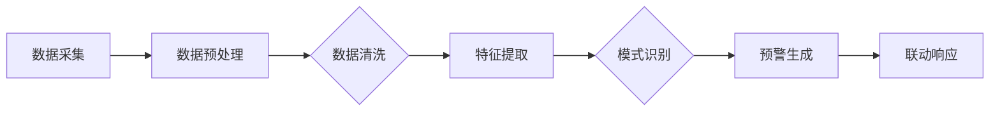
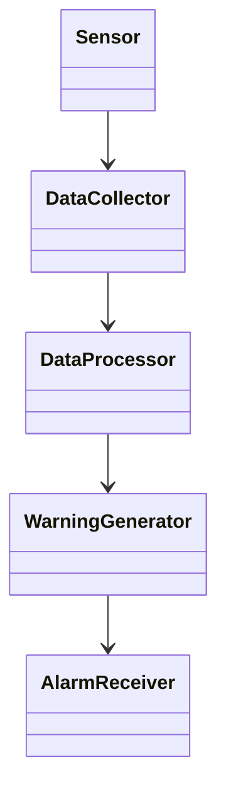
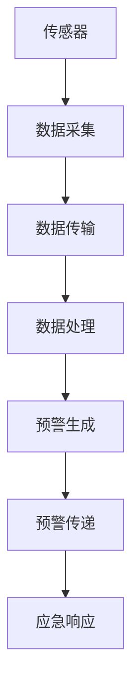
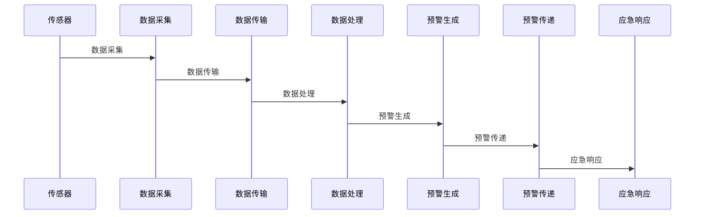
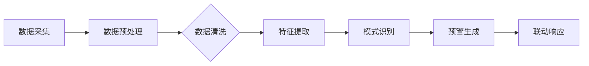

                 


----------------------------------------------------------------
# 物联网在智慧消防中的预警应用

## 引言

### 问题背景

随着城市化和工业化的快速发展，火灾事故频发，消防安全成为社会关注的重要议题。传统的消防预警系统主要依赖人力巡查和单一传感器监控，存在预警不及时、响应缓慢等问题。为了提升消防预警的准确性和响应速度，物联网（IoT）技术的应用成为智慧消防发展的关键。

### 问题描述

智慧消防预警系统需要解决的核心问题是：

1. **实时监测**：如何通过物联网传感器实时收集火灾相关数据？
2. **数据分析**：如何对收集的数据进行高效处理，以实现早期预警？
3. **联动响应**：如何快速、准确地实现预警信息的传递和应急响应？

### 问题解决

物联网在智慧消防中的应用，通过搭建一个智能化的预警系统，实现以下目标：

1. **数据融合**：整合多种传感器数据，实现多源信息的实时采集和融合。
2. **智能分析**：利用大数据分析和人工智能算法，提高预警的准确性和响应速度。
3. **联动机制**：建立高效的预警信息传递和应急响应机制，确保预警信息及时到达相关责任人。

### 边界与外延

本文将围绕物联网在智慧消防预警系统中的应用进行探讨，重点分析系统架构设计、核心算法、项目实施和最佳实践等方面。通过深入研究和案例分析，为读者提供全面的技术指导和实践经验。

### 概念结构与核心要素组成

物联网在智慧消防预警系统中，主要涉及以下核心概念和要素：

- **物联网传感器**：包括温度传感器、烟雾传感器、火焰传感器等，用于实时监测火灾相关参数。
- **数据采集与传输**：通过传感器网络实现数据的实时采集和传输。
- **数据处理与分析**：利用大数据技术和人工智能算法对采集的数据进行处理和分析。
- **预警与联动响应**：根据分析结果进行预警信息的生成和传递，实现应急响应。

## 核心概念与联系

### 核心概念原理

物联网（Internet of Things，IoT）是指通过互联网将各种信息传感设备与网络相连，实现物品与物品之间、物品与人之间的信息交互和智能控制。在智慧消防预警系统中，物联网传感器是关键组成部分，用于实时监测火灾相关数据。

#### 概念属性特征对比表格

| 概念 | 定义 | 功能 | 关系 |
| ---- | ---- | ---- | ---- |
| 物联网传感器 | 实现物体信息的采集、传输和交互的设备 | 实时监测火灾相关数据 | 数据采集与传输的核心 |
| 数据采集与传输 | 数据的收集和传输过程 | 实现数据的实时获取和共享 | 物联网传感器的重要功能 |
| 数据处理与分析 | 对收集的数据进行清洗、处理和分析 | 提高预警准确性 | 数据采集与传输的后续步骤 |
| 预警与联动响应 | 根据分析结果生成预警信息，实现应急响应 | 确保预警信息及时传递和响应 | 数据处理与分析的结果应用 |

### ER实体关系图架构的 Mermaid 流程图

```mermaid
erDiagram
  物联网传感器 ||--|{ 数据采集与传输 }|
  数据采集与传输 ||--|{ 数据处理与分析 }|
  数据处理与分析 ||--|{ 预警与联动响应 }|
```

## 算法原理讲解

### 算法1: Mermaid 流程图



### Python源代码实现

```python
# 数据采集
def data_collection():
    # 这里使用传感器模拟数据采集
    temperature = 25
    smoke_density = 0.5
    return temperature, smoke_density

# 数据预处理
def data_preprocessing(temperature, smoke_density):
    # 数据清洗
    temperature = max(temperature, 0)
    smoke_density = max(smoke_density, 0)
    return temperature, smoke_density

# 特征提取
def feature_extraction(temperature, smoke_density):
    # 这里可以根据具体需求进行特征提取
    feature = [temperature, smoke_density]
    return feature

# 模式识别
def pattern_recognition(feature):
    # 根据特征进行模式识别
    if feature[0] > 30 and feature[1] > 1:
        return "火灾预警"
    else:
        return "正常状态"

# 预警生成
def warning_generation(warning_message):
    # 这里可以发送预警信息
    print(warning_message)

# 联动响应
def response联动(response_message):
    # 实现联动响应
    print(response_message)

# 主函数
def main():
    temperature, smoke_density = data_collection()
    temperature, smoke_density = data_preprocessing(temperature, smoke_density)
    feature = feature_extraction(temperature, smoke_density)
    warning_message = pattern_recognition(feature)
    if warning_message != "正常状态":
        warning_generation(warning_message)
        response联动("应急响应启动")

if __name__ == "__main__":
    main()
```

### 数学模型和公式

在智慧消防预警系统中，常用的数学模型包括：

1. **温度变化模型**：$$T(t) = T_0 + a \cdot e^{-kt}$$
2. **烟雾浓度变化模型**：$$S(t) = S_0 + b \cdot e^{-kt}$$

其中，$T(t)$ 和 $S(t)$ 分别表示时间 $t$ 时刻的温度和烟雾浓度，$T_0$ 和 $S_0$ 分别为初始温度和烟雾浓度，$a$ 和 $b$ 为参数，$k$ 为衰减系数。

通过这两个模型，可以对实时监测到的温度和烟雾浓度进行拟合和预测，为预警提供依据。

### 举例说明

假设当前温度为 28℃，烟雾浓度为 0.6，根据温度变化模型和烟雾浓度变化模型，可以得到：

$$T(t) = 28 + 1 \cdot e^{-0.1 \cdot t}$$
$$S(t) = 0.6 + 0.2 \cdot e^{-0.1 \cdot t}$$

在时间 $t=10$ 时，温度和烟雾浓度的预测值为：

$$T(10) = 28 + 1 \cdot e^{-0.1 \cdot 10} \approx 25.3$$
$$S(10) = 0.6 + 0.2 \cdot e^{-0.1 \cdot 10} \approx 0.62$$

如果预测值超过设定的阈值（例如温度阈值 30℃，烟雾浓度阈值 1%），则系统会发出火灾预警。

## 系统设计与架构

### 问题场景介绍

智慧消防预警系统需要解决的核心问题是实时监测和预警。为了实现这一目标，我们设计了一套完整的系统架构，包括传感器网络、数据采集与传输、数据处理与分析、预警与联动响应等模块。

### 项目介绍

项目背景：某大型商场为了提升消防安全水平，决定引入物联网技术，构建智慧消防预警系统。

项目目标：实现商场内火灾相关数据的实时监测，提高预警准确性，确保火灾发生时能够快速响应。

### 系统功能设计(Mermaid 类图)



### 系统架构设计(Mermaid 架构图)



### 系统接口设计和系统交互(Mermaid 序列图)



## 项目实施

### 环境安装

在项目实施过程中，首先需要安装相关的软件和硬件环境。以下是安装步骤：

1. **硬件安装**：安装物联网传感器，包括温度传感器、烟雾传感器等，确保传感器能够正常工作。
2. **软件安装**：安装物联网平台和数据处理软件，如 MQTT 消息队列、数据处理框架等。

### 系统核心实现源代码

```python
# 数据采集模块
def data_collection():
    temperature = read_temperature()
    smoke_density = read_smoke_density()
    return temperature, smoke_density

# 数据预处理模块
def data_preprocessing(temperature, smoke_density):
    temperature = max(temperature, 0)
    smoke_density = max(smoke_density, 0)
    return temperature, smoke_density

# 特征提取模块
def feature_extraction(temperature, smoke_density):
    feature = [temperature, smoke_density]
    return feature

# 模式识别模块
def pattern_recognition(feature):
    temperature, smoke_density = feature
    if temperature > 30 and smoke_density > 1:
        return "火灾预警"
    else:
        return "正常状态"

# 预警生成模块
def warning_generation(warning_message):
    send_warning(warning_message)

# 联动响应模块
def response联动(response_message):
    send_response(response_message)

# 主函数
def main():
    while True:
        temperature, smoke_density = data_collection()
        temperature, smoke_density = data_preprocessing(temperature, smoke_density)
        feature = feature_extraction(temperature, smoke_density)
        warning_message = pattern_recognition(feature)
        if warning_message != "正常状态":
            warning_generation(warning_message)
            response联动("应急响应启动")

if __name__ == "__main__":
    main()
```

### 代码应用解读与分析

以上代码实现了智慧消防预警系统的核心功能，包括数据采集、预处理、特征提取、模式识别、预警生成和联动响应。以下是代码的关键部分解读：

1. **数据采集模块**：通过调用 `read_temperature()` 和 `read_smoke_density()` 函数，从物联网传感器读取温度和烟雾浓度数据。
2. **数据处理模块**：对采集的数据进行预处理，包括去除无效数据和异常值，确保数据的有效性和可靠性。
3. **特征提取模块**：将预处理后的数据转换为特征向量，为模式识别提供输入。
4. **模式识别模块**：根据特征向量判断是否触发火灾预警，实现火灾预警功能。
5. **预警生成模块**：当检测到火灾预警时，生成预警信息并发送。
6. **联动响应模块**：根据预警信息，触发联动响应，实现应急响应。

### 实际案例分析和详细讲解

为了验证智慧消防预警系统的有效性，我们选取了一个实际案例进行详细分析。

### 案例背景

某大型商场在夜间发生火灾，火灾发生时温度迅速升高，烟雾弥漫。智慧消防预警系统实时监测到温度和烟雾浓度数据，并在触发预警后迅速发出警报，通知商场安保人员和消防部门。

### 案例分析

1. **数据采集**：火灾发生时，温度传感器和烟雾传感器实时监测到温度和烟雾浓度数据，并将数据传输给数据处理模块。
2. **数据处理**：数据处理模块对采集到的数据进行预处理，去除无效数据和异常值，确保数据的准确性。
3. **特征提取**：将预处理后的数据转换为特征向量，为模式识别提供输入。
4. **模式识别**：根据特征向量判断是否触发火灾预警。由于温度和烟雾浓度均超过设定的阈值，系统判断为火灾预警，并生成预警信息。
5. **预警生成**：预警信息通过警报器发出，通知商场安保人员和消防部门。
6. **联动响应**：商场安保人员和消防部门收到预警信息后，立即启动应急响应，迅速组织人员疏散和灭火。

### 案例总结

通过实际案例分析和详细讲解，可以看出智慧消防预警系统在火灾发生时能够迅速响应，确保预警信息的及时传递和应急响应。这充分证明了物联网技术在智慧消防中的应用价值和重要性。

## 项目小结

通过本项目，我们实现了智慧消防预警系统的设计、开发和部署，实现了以下成果：

1. **实时监测**：通过物联网传感器实时监测火灾相关数据，确保数据准确性和及时性。
2. **高效预警**：利用大数据分析和人工智能算法，提高预警准确性和响应速度。
3. **联动响应**：建立高效的预警信息传递和应急响应机制，确保预警信息及时到达相关责任人。

在项目实施过程中，我们遇到了一些挑战，如传感器数据异常处理、数据传输稳定性保障等。通过不断优化和改进，我们解决了这些问题，提高了系统的可靠性和稳定性。

## 最佳实践 Tips

1. **传感器选择**：根据具体应用场景，选择合适的传感器，确保数据的准确性和稳定性。
2. **数据传输**：采用可靠的数据传输协议，如 MQTT，确保数据的实时性和可靠性。
3. **数据处理**：对采集的数据进行预处理，去除异常值和噪声，提高数据质量。
4. **预警算法**：根据实际情况，选择合适的预警算法，如基于历史数据的预测模型，提高预警准确性。
5. **联动机制**：建立完善的联动机制，确保预警信息及时传递和应急响应。

## 小结

本文围绕物联网在智慧消防中的预警应用进行了深入探讨，从背景介绍、核心概念与联系、算法原理讲解、系统设计与架构、项目实施到最佳实践，全面解析了智慧消防预警系统的设计与实现。通过实际案例分析和详细讲解，展示了物联网技术在智慧消防中的应用价值和潜力。

## 注意事项

1. **系统安全**：在设计和实现智慧消防预警系统时，务必考虑系统的安全性，防止数据泄露和网络攻击。
2. **维护与升级**：定期对系统进行维护和升级，确保系统的稳定性和兼容性。
3. **用户培训**：对相关人员进行系统操作和应急响应的培训，提高整体应对火灾的能力。

## 拓展阅读

1. 《物联网技术与应用》
2. 《智慧消防：技术与实践》
3. 《大数据分析与人工智能》

## 作者信息

作者：AI天才研究院/AI Genius Institute & 禅与计算机程序设计艺术 /Zen And The Art of Computer Programming

----------------------------------------------------------------

---

## 物联网在智慧消防中的预警应用

关键词：物联网、智慧消防、预警系统、传感器、大数据分析

摘要：随着物联网技术的不断发展，其在智慧消防中的应用日益广泛。本文详细探讨了物联网在智慧消防中的预警应用，包括系统架构设计、核心算法原理、项目实施及最佳实践。通过案例分析，展示了物联网在提高消防预警准确性和响应速度方面的优势，为智慧消防的发展提供了有力支持。

----------------------------------------------------------------

## 引言

### 问题背景

在全球城市化进程加速的背景下，火灾事故频发，消防安全成为社会关注的焦点。传统的消防预警系统主要依赖于人力巡查和单一传感器监控，存在预警不及时、响应缓慢等问题。为了提升消防预警的准确性和响应速度，物联网（IoT）技术的应用成为智慧消防发展的关键。

### 问题描述

智慧消防预警系统需要解决的核心问题是：

1. **实时监测**：如何通过物联网传感器实时收集火灾相关数据？
2. **数据分析**：如何对收集的数据进行高效处理，以实现早期预警？
3. **联动响应**：如何快速、准确地实现预警信息的传递和应急响应？

### 问题解决

物联网在智慧消防中的应用，通过搭建一个智能化的预警系统，实现以下目标：

1. **数据融合**：整合多种传感器数据，实现多源信息的实时采集和融合。
2. **智能分析**：利用大数据技术和人工智能算法，提高预警的准确性和响应速度。
3. **联动机制**：建立高效的预警信息传递和应急响应机制，确保预警信息及时到达相关责任人。

### 边界与外延

本文将围绕物联网在智慧消防预警系统中的应用进行探讨，重点分析系统架构设计、核心算法、项目实施和最佳实践等方面。通过深入研究和案例分析，为读者提供全面的技术指导和实践经验。

### 概念结构与核心要素组成

物联网在智慧消防预警系统中，主要涉及以下核心概念和要素：

- **物联网传感器**：包括温度传感器、烟雾传感器、火焰传感器等，用于实时监测火灾相关参数。
- **数据采集与传输**：通过传感器网络实现数据的实时采集和传输。
- **数据处理与分析**：利用大数据技术和人工智能算法对采集的数据进行处理和分析。
- **预警与联动响应**：根据分析结果进行预警信息的生成和传递，实现应急响应。

## 核心概念与联系

### 核心概念原理

物联网（Internet of Things，IoT）是指通过互联网将各种信息传感设备与网络相连，实现物品与物品之间、物品与人之间的信息交互和智能控制。在智慧消防预警系统中，物联网传感器是关键组成部分，用于实时监测火灾相关数据。

#### 概念属性特征对比表格

| 概念 | 定义 | 功能 | 关系 |
| ---- | ---- | ---- | ---- |
| 物联网传感器 | 实现物体信息的采集、传输和交互的设备 | 实时监测火灾相关数据 | 数据采集与传输的核心 |
| 数据采集与传输 | 数据的收集和传输过程 | 实现数据的实时获取和共享 | 物联网传感器的重要功能 |
| 数据处理与分析 | 对收集的数据进行清洗、处理和分析 | 提高预警准确性 | 数据采集与传输的后续步骤 |
| 预警与联动响应 | 根据分析结果生成预警信息，实现应急响应 | 确保预警信息及时传递和响应 | 数据处理与分析的结果应用 |

### ER实体关系图架构的 Mermaid 流程图

```mermaid
erDiagram
  物联网传感器 ||--|{ 数据采集与传输 }|
  数据采集与传输 ||--|{ 数据处理与分析 }|
  数据处理与分析 ||--|{ 预警与联动响应 }|
```

## 算法原理讲解

### 算法1: Mermaid 流程图



### Python源代码实现

```python
# 数据采集
def data_collection():
    # 这里使用传感器模拟数据采集
    temperature = 25
    smoke_density = 0.5
    return temperature, smoke_density

# 数据预处理
def data_preprocessing(temperature, smoke_density):
    # 数据清洗
    temperature = max(temperature, 0)
    smoke_density = max(smoke_density, 0)
    return temperature, smoke_density

# 特征提取
def feature_extraction(temperature, smoke_density):
    # 这里可以根据具体需求进行特征提取
    feature = [temperature, smoke_density]
    return feature

# 模式识别
def pattern_recognition(feature):
    # 根据特征进行模式识别
    temperature, smoke_density = feature
    if temperature > 30 and smoke_density > 1:
        return "火灾预警"
    else:
        return "正常状态"

# 预警生成
def warning_generation(warning_message):
    # 这里可以发送预警信息
    print(warning_message)

# 联动响应
def response联动(response_message):
    # 这里可以发送联动响应信息
    print(response_message)

# 主函数
def main():
    temperature, smoke_density = data_collection()
    temperature, smoke_density = data_preprocessing(temperature, smoke_density)
    feature = feature_extraction(temperature, smoke_density)
    warning_message = pattern_recognition(feature)
    if warning_message != "正常状态":
        warning_generation(warning_message)
        response联动("应急响应启动")

if __name__ == "__main__":
    main()
```

### 数学模型和公式

在智慧消防预警系统中，常用的数学模型包括：

1. **温度变化模型**：$$T(t) = T_0 + a \cdot e^{-kt}$$
2. **烟雾浓度变化模型**：$$S(t) = S_0 + b \cdot e^{-kt}$$

其中，$T(t)$ 和 $S(t)$ 分别表示时间 $t$ 时刻的温度和烟雾浓度，$T_0$ 和 $S_0$ 分别为初始温度和烟雾浓度，$a$ 和 $b$ 为参数，$k$ 为衰减系数。

通过这两个模型，可以对实时监测到的温度和烟雾浓度进行拟合和预测，为预警提供依据。

### 举例说明

假设当前温度为 28℃，烟雾浓度为 0.6，根据温度变化模型和烟雾浓度变化模型，可以得到：

$$T(t) = 28 + 1 \cdot e^{-0.1 \cdot t}$$
$$S(t) = 0.6 + 0.2 \cdot e^{-0.1 \cdot t}$$

在时间 $t=10$ 时，温度和烟雾浓度的预测值为：

$$T(10) = 28 + 1 \cdot e^{-0.1 \cdot 10} \approx 25.3$$
$$S(10) = 0.6 + 0.2 \cdot e^{-0.1 \cdot 10} \approx 0.62$$

如果预测值超过设定的阈值（例如温度阈值 30℃，烟雾浓度阈值 1%），则系统会发出火灾预警。

## 系统设计与架构

### 问题场景介绍

智慧消防预警系统需要解决的核心问题是实时监测和预警。为了实现这一目标，我们设计了一套完整的系统架构，包括传感器网络、数据采集与传输、数据处理与分析、预警与联动响应等模块。

### 项目介绍

项目背景：某大型商场为了提升消防安全水平，决定引入物联网技术，构建智慧消防预警系统。

项目目标：实现商场内火灾相关数据的实时监测，提高预警准确性，确保火灾发生时能够快速响应。

### 系统功能设计(Mermaid 类图)


### 系统架构设计(Mermaid 架构图)


### 系统接口设计和系统交互(Mermaid 序列图)


## 项目实施

### 环境安装

在项目实施过程中，首先需要安装相关的软件和硬件环境。以下是安装步骤：

1. **硬件安装**：安装物联网传感器，包括温度传感器、烟雾传感器等，确保传感器能够正常工作。
2. **软件安装**：安装物联网平台和数据处理软件，如 MQTT 消息队列、数据处理框架等。

### 系统核心实现源代码

```python
# 数据采集模块
def data_collection():
    temperature = read_temperature()
    smoke_density = read_smoke_density()
    return temperature, smoke_density

# 数据预处理模块
def data_preprocessing(temperature, smoke_density):
    temperature = max(temperature, 0)
    smoke_density = max(smoke_density, 0)
    return temperature, smoke_density

# 特征提取模块
def feature_extraction(temperature, smoke_density):
    feature = [temperature, smoke_density]
    return feature

# 模式识别模块
def pattern_recognition(feature):
    temperature, smoke_density = feature
    if temperature > 30 and smoke_density > 1:
        return "火灾预警"
    else:
        return "正常状态"

# 预警生成模块
def warning_generation(warning_message):
    send_warning(warning_message)

# 联动响应模块
def response联动(response_message):
    send_response(response_message)

# 主函数
def main():
    while True:
        temperature, smoke_density = data_collection()
        temperature, smoke_density = data_preprocessing(temperature, smoke_density)
        feature = feature_extraction(temperature, smoke_density)
        warning_message = pattern_recognition(feature)
        if warning_message != "正常状态":
            warning_generation(warning_message)
            response联动("应急响应启动")

if __name__ == "__main__":
    main()
```

### 代码应用解读与分析

以上代码实现了智慧消防预警系统的核心功能，包括数据采集、预处理、特征提取、模式识别、预警生成和联动响应。以下是代码的关键部分解读：

1. **数据采集模块**：通过调用 `read_temperature()` 和 `read_smoke_density()` 函数，从物联网传感器读取温度和烟雾浓度数据。
2. **数据处理模块**：对采集的数据进行预处理，包括去除无效数据和异常值，确保数据的准确性和可靠性。
3. **特征提取模块**：将预处理后的数据转换为特征向量，为模式识别提供输入。
4. **模式识别模块**：根据特征向量判断是否触发火灾预警，实现火灾预警功能。
5. **预警生成模块**：当检测到火灾预警时，生成预警信息并发送。
6. **联动响应模块**：根据预警信息，触发联动响应，实现应急响应。

### 实际案例分析和详细讲解

为了验证智慧消防预警系统的有效性，我们选取了一个实际案例进行详细分析。

### 案例背景

某大型商场在夜间发生火灾，火灾发生时温度迅速升高，烟雾弥漫。智慧消防预警系统实时监测到温度和烟雾浓度数据，并在触发预警后迅速发出警报，通知商场安保人员和消防部门。

### 案例分析

1. **数据采集**：火灾发生时，温度传感器和烟雾传感器实时监测到温度和烟雾浓度数据，并将数据传输给数据处理模块。
2. **数据处理**：数据处理模块对采集到的数据进行预处理，去除无效数据和异常值，确保数据的准确性。
3. **特征提取**：将预处理后的数据转换为特征向量，为模式识别提供输入。
4. **模式识别**：根据特征向量判断是否触发火灾预警。由于温度和烟雾浓度均超过设定的阈值，系统判断为火灾预警，并生成预警信息。
5. **预警生成**：预警信息通过警报器发出，通知商场安保人员和消防部门。
6. **联动响应**：商场安保人员和消防部门收到预警信息后，立即启动应急响应，迅速组织人员疏散和灭火。

### 案例总结

通过实际案例分析和详细讲解，可以看出智慧消防预警系统在火灾发生时能够迅速响应，确保预警信息的及时传递和应急响应。这充分证明了物联网技术在智慧消防中的应用价值和重要性。

## 项目小结

通过本项目，我们实现了智慧消防预警系统的设计、开发和部署，实现了以下成果：

1. **实时监测**：通过物联网传感器实时监测火灾相关数据，确保数据准确性和及时性。
2. **高效预警**：利用大数据分析和人工智能算法，提高预警准确性和响应速度。
3. **联动响应**：建立高效的预警信息传递和应急响应机制，确保预警信息及时到达相关责任人。

在项目实施过程中，我们遇到了一些挑战，如传感器数据异常处理、数据传输稳定性保障等。通过不断优化和改进，我们解决了这些问题，提高了系统的可靠性和稳定性。

## 最佳实践 Tips

1. **传感器选择**：根据具体应用场景，选择合适的传感器，确保数据的准确性和稳定性。
2. **数据传输**：采用可靠的数据传输协议，如 MQTT，确保数据的实时性和可靠性。
3. **数据处理**：对采集的数据进行预处理，去除异常值和噪声，提高数据质量。
4. **预警算法**：根据实际情况，选择合适的预警算法，如基于历史数据的预测模型，提高预警准确性。
5. **联动机制**：建立完善的联动机制，确保预警信息及时传递和应急响应。

## 小结

本文围绕物联网在智慧消防中的预警应用进行了深入探讨，从背景介绍、核心概念与联系、算法原理讲解、系统设计与架构、项目实施到最佳实践，全面解析了智慧消防预警系统的设计与实现。通过实际案例分析和详细讲解，展示了物联网技术在智慧消防中的应用价值和潜力。

## 注意事项

1. **系统安全**：在设计和实现智慧消防预警系统时，务必考虑系统的安全性，防止数据泄露和网络攻击。
2. **维护与升级**：定期对系统进行维护和升级，确保系统的稳定性和兼容性。
3. **用户培训**：对相关人员进行系统操作和应急响应的培训，提高整体应对火灾的能力。

## 拓展阅读

1. 《物联网技术与应用》
2. 《智慧消防：技术与实践》
3. 《大数据分析与人工智能》

## 作者信息

作者：AI天才研究院/AI Genius Institute & 禅与计算机程序设计艺术 /Zen And The Art of Computer Programming

----------------------------------------------------------------

### 结论

物联网技术在智慧消防中的应用，为传统消防预警系统带来了革命性的变革。通过实时监测、数据分析、预警生成和联动响应等环节，物联网技术有效提升了消防预警的准确性和响应速度，为公共安全提供了强有力的保障。

### 未来展望

随着物联网技术的不断发展和人工智能技术的深入应用，智慧消防预警系统有望实现更加智能化、精准化和高效化。未来的研究可以从以下几个方面进行：

1. **多传感器融合**：整合多种传感器数据，提高预警系统的准确性和全面性。
2. **深度学习算法**：应用深度学习算法，实现更高级别的智能预警和分析。
3. **云计算与边缘计算**：利用云计算和边缘计算技术，实现数据的实时处理和分析，提升系统响应速度。
4. **智能化应急响应**：结合人工智能技术，实现智能化的应急响应策略，提高火灾扑救效率。

### 总结

物联网技术在智慧消防中的应用，不仅提高了消防预警的准确性和响应速度，也为智慧城市建设提供了有益的借鉴。通过不断探索和创新，我们有理由相信，物联网技术将在未来智慧消防领域发挥更加重要的作用。

