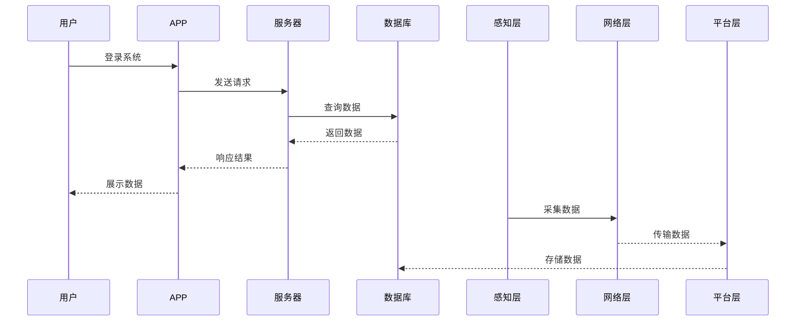

                 

### 引言

#### 关键词：物联网、智慧农业、智慧渔业、养殖监控

随着科技的飞速发展，物联网（Internet of Things，IoT）技术逐渐融入各个行业，农业作为国民经济的重要组成部分，也迎来了智慧农业的新时代。智慧农业通过应用物联网技术，实现对农业生产过程的智能化管理，显著提高了农业生产的效率和产品质量。在智慧农业的大潮中，智慧渔业作为一种新型的养殖模式，正逐步改变传统的渔业生产方式。

### 1.1 物联网与智慧农业

物联网是指通过互联网将各种物理设备、传感器、软件应用等互联起来，实现信息的实时采集、传输和处理。物联网的核心在于“连接”，即通过连接物理世界中的各种设备，使其能够相互通信，从而实现智能化管理。智慧农业则是在物联网的基础上，通过大数据、云计算、人工智能等技术的综合应用，对农业生产全过程进行智能化管理，提高农业生产的效率和质量。

#### 摘要

本文将以智慧渔业养殖监控为切入点，探讨物联网技术在智慧渔业中的应用。我们将首先介绍物联网的基本概念和原理，然后深入探讨物联网在智慧渔业中的具体应用，如水质监测、水温监测、饲料投放监测等。此外，还将介绍物联网与大数据分析相结合的应用，以及物联网在智慧渔业中的安全与隐私保护问题。最后，我们将通过一个实际应用案例，详细分析物联网在智慧渔业养殖监控中的具体实现。

### 1.2 智慧渔业的现状与挑战

智慧渔业是通过应用物联网技术，实现对渔业养殖过程的智能化监控和管理，以提高养殖效益和产品质量。当前，智慧渔业的发展仍处于初级阶段，尽管在部分发达地区和沿海地区已经取得了一些突破，但整体上仍面临许多挑战。

首先，智慧渔业的设备和技术成本较高，导致普及率较低。其次，由于渔业养殖环境的复杂性和多样性，物联网技术在应用中存在诸多技术难题，如传感器的精度、数据的实时传输和处理等。此外，渔业数据的安全性和隐私保护也是需要重点关注的问题。

#### 1.3 本书的目的与结构

本书的目的是系统地介绍物联网在智慧渔业养殖监控中的应用，帮助读者了解物联网技术的基本原理，掌握物联网在智慧渔业中的具体应用方法，并探讨物联网与大数据分析、安全与隐私保护等方面的关系。本书的结构如下：

- **第1章 引言**：介绍物联网与智慧农业的关系，以及智慧渔业面临的挑战。
- **第2章 物联网技术基础**：介绍物联网的基本概念、原理和关键技术。
- **第3章 智慧渔业中的物联网应用**：详细探讨物联网在智慧渔业中的具体应用，如水质监测、水温监测等。
- **第4章 物联网与大数据分析**：介绍物联网与大数据分析的结合方法及其在智慧渔业中的应用。
- **第5章 物联网安全与隐私保护**：探讨物联网在智慧渔业中的安全与隐私保护问题。
- **第6章 实践应用案例**：通过一个实际应用案例，详细分析物联网在智慧渔业养殖监控中的具体实现。
- **第7章 结论与未来展望**：总结全文，并探讨智慧渔业的发展趋势和未来研究方向。

通过本书的阅读，读者将能够全面了解物联网在智慧渔业养殖监控中的应用，为推动智慧渔业的发展提供技术支持和理论指导。## 第2章 物联网技术基础

#### 关键词：物联网、核心技术、硬件设备、网络协议、数据处理

物联网（IoT）作为连接物理世界与数字世界的桥梁，其核心技术包括硬件设备、网络协议和数据处理与存储。本章将详细探讨这些核心技术的概念、原理和应用。

### 2.1 物联网的定义与基本原理

物联网是指通过互联网将各种设备、传感器、软件应用等互联起来，实现信息的实时采集、传输和处理。其基本原理主要包括以下几个方面：

1. **设备互联**：物联网通过连接各种物理设备，如传感器、执行器、智能设备等，形成一个庞大的网络体系。
2. **信息采集**：物联网设备通过各种传感器采集环境数据，如温度、湿度、光照、水质等，实现数据的实时获取。
3. **数据传输**：采集到的数据通过网络协议传输到云端或中心服务器，进行进一步的处理和分析。
4. **数据处理与存储**：通过大数据、云计算等技术对传输过来的数据进行分析、处理和存储，为决策提供支持。

#### 2.2 物联网的核心技术

物联网的核心技术包括硬件设备、网络协议和数据处理与存储。

#### 2.2.1 硬件设备

物联网硬件设备是物联网系统的基石，主要包括传感器、执行器、嵌入式系统等。

1. **传感器**：传感器是物联网系统中最重要的硬件设备之一，用于检测和采集环境数据。常见的传感器有温度传感器、湿度传感器、光照传感器、水质传感器等。
   
2. **执行器**：执行器是物联网系统中的控制设备，用于根据接收到的指令执行相应的操作。常见的执行器有电机、阀门、水泵等。

3. **嵌入式系统**：嵌入式系统是将计算机硬件和软件集成在一起的系统，通常用于控制物联网设备。常见的嵌入式系统有单片机、嵌入式Linux等。

#### 2.2.2 网络协议

网络协议是物联网系统中设备之间通信的基础，主要包括有线和无线协议。

1. **有线协议**：常见的有线协议有以太网（Ethernet）、串口通信（RS-485、RS-232）等。有线协议具有传输稳定、带宽高的优点，但受限于布线复杂、灵活性差等缺点。

2. **无线协议**：常见的无线协议有Wi-Fi、蓝牙、Zigbee、LoRa等。无线协议具有安装简便、灵活性高的优点，但受限于带宽和传输距离等缺点。

#### 2.2.3 数据处理与存储

数据处理与存储是物联网系统的重要环节，主要包括数据采集、预处理、存储和分析等。

1. **数据采集**：物联网设备通过传感器实时采集环境数据，如温度、湿度、光照等。
   
2. **数据预处理**：对采集到的数据进行过滤、清洗、归一化等处理，以提高数据质量。
   
3. **数据存储**：将预处理后的数据存储到数据库或云存储中，以便后续分析和处理。
   
4. **数据分析**：通过大数据、云计算等技术对存储的数据进行分析，提取有用的信息，为决策提供支持。

#### 2.2.4 物联网系统的架构

物联网系统通常由感知层、网络层、平台层和应用层组成。

1. **感知层**：感知层是物联网系统的最底层，负责采集物理世界的数据，如温度、湿度、光照等。感知层的主要设备是传感器和执行器。
   
2. **网络层**：网络层负责将感知层采集到的数据传输到平台层，实现数据的实时传输。网络层的主要设备是路由器、网关等。

3. **平台层**：平台层是物联网系统的核心，负责数据的存储、处理和分析，为应用层提供数据支持。平台层的主要设备是服务器、数据库等。

4. **应用层**：应用层是物联网系统的最高层，负责将平台层提供的数据应用到实际场景中，实现智能化的管理和控制。应用层的主要设备是终端设备、移动应用等。

#### 2.2.5 物联网技术的应用领域

物联网技术在各个领域都有广泛的应用，如智能家居、智慧城市、智慧农业、智慧医疗、智慧交通等。

1. **智能家居**：通过物联网技术，实现家庭设备的智能化控制，如智能照明、智能安防、智能家电等。
   
2. **智慧城市**：通过物联网技术，实现城市资源的智能化管理，如交通管理、环境监测、公共安全等。
   
3. **智慧农业**：通过物联网技术，实现对农业生产过程的智能化监控和管理，如水质监测、土壤监测、病虫害监测等。
   
4. **智慧医疗**：通过物联网技术，实现医疗资源的智能化管理，如远程医疗、智能监控、健康管理等。
   
5. **智慧交通**：通过物联网技术，实现交通的智能化管理和优化，如智能交通信号控制、智能停车场管理、智能导航等。

#### 2.2.6 物联网技术的前景与发展趋势

随着科技的不断进步，物联网技术正呈现出快速发展的趋势。未来，物联网技术将更加注重智能化、高效化、绿色化和安全化。

1. **智能化**：物联网技术将更加注重人工智能和大数据技术的融合，实现智能化管理和控制。
   
2. **高效化**：物联网技术将提高数据传输和处理的速度和效率，实现实时化和高效化。
   
3. **绿色化**：物联网技术将推动能源的节约和环境的保护，实现绿色化发展。
   
4. **安全化**：物联网技术将更加注重数据的安全和隐私保护，实现安全化和可靠化。

总之，物联网技术在智慧渔业养殖监控中的应用具有重要意义。通过物联网技术，可以实现渔业的智能化管理和监控，提高养殖效率，降低成本，提高产品质量，为渔业的可持续发展提供有力支持。## 第3章 智慧渔业中的物联网应用

#### 关键词：智慧渔业、物联网应用、养殖监控、水质监测、水温监测、饲料投放监测

智慧渔业是通过应用物联网技术，实现渔业养殖过程的智能化监控和管理，从而提高生产效率和质量。本章将详细探讨物联网在智慧渔业中的具体应用，主要包括水质监测、水温监测和饲料投放监测。

### 3.1 智慧渔业养殖监控系统的构成

智慧渔业养殖监控系统是由多个传感器、执行器和通信模块组成的复杂系统，其主要构成部分如下：

1. **传感器**：用于实时监测养殖环境中的各项参数，如水质、水温、溶解氧、pH值等。
   
2. **执行器**：根据监控系统发送的指令，自动调节养殖环境，如水泵、增氧机、饲料机等。

3. **通信模块**：将传感器采集到的数据传输到监控中心，通常使用有线或无线通信方式。

4. **监控中心**：对采集到的数据进行分析和处理，实现对养殖环境的实时监控和管理。

#### 3.1.1 水质监测

水质监测是智慧渔业养殖监控的重要组成部分，通过监测水中的各项指标，如溶解氧、pH值、氨氮、硝酸盐等，可以实时了解水质的状况，确保养殖环境的稳定。

1. **传感器选择**：常用的水质传感器有溶解氧传感器、pH传感器、电导率传感器、氨氮传感器等。

2. **数据采集与传输**：传感器采集到的数据通过通信模块传输到监控中心，监控中心对数据进行实时分析和处理。

3. **数据分析**：通过对水质数据的分析，可以判断水质是否正常，如果发现异常，系统会自动发出警报，提醒养殖人员采取相应的措施。

#### 3.1.2 水温监测

水温是影响鱼类生长和繁殖的重要因素，通过实时监测水温，可以确保养殖环境的适宜性。

1. **传感器选择**：常用的水温传感器有红外传感器、热敏电阻等。

2. **数据采集与传输**：水温传感器采集到的数据通过通信模块传输到监控中心，监控中心对数据进行实时分析和处理。

3. **数据分析**：通过对水温数据的分析，可以判断水温是否适宜，如果发现异常，系统会自动发出警报，提醒养殖人员调整水温。

#### 3.1.3 饲料投放监测

饲料投放监测是通过物联网技术实现饲料的自动化投放，提高养殖效率，减少饲料浪费。

1. **传感器选择**：常用的饲料投放传感器有重量传感器、红外传感器等。

2. **数据采集与传输**：饲料传感器采集到的数据通过通信模块传输到监控中心，监控中心对数据进行实时分析和处理。

3. **数据分析**：通过对饲料投放数据的分析，可以判断饲料投放是否合理，如果发现异常，系统会自动发出警报，提醒养殖人员调整饲料投放量。

### 3.2 物联网在饲料管理中的应用

饲料管理是智慧渔业的重要环节，通过物联网技术，可以实现饲料的自动化管理和监控，提高养殖效率。

#### 3.2.1 自动化饲料系统

自动化饲料系统通过物联网技术实现饲料的自动化投放，根据鱼类的生长需求，自动调整饲料的投放量。

1. **系统组成**：自动化饲料系统由传感器、执行器、控制器等组成。

2. **工作原理**：系统通过传感器实时监测鱼类的生长情况，控制器根据监测数据自动调整饲料的投放量。

3. **优势**：自动化饲料系统可以提高饲料利用效率，减少饲料浪费，降低养殖成本。

#### 3.2.2 智能监测与分析

智能监测与分析系统通过物联网技术对饲料管理全过程进行监控和分析，优化饲料管理。

1. **系统功能**：系统可以实时监测饲料的投放量、消耗量、鱼类的生长情况等，对数据进行分析和预测。

2. **数据分析**：通过对监测数据进行分析，可以找出饲料管理的规律，为养殖人员提供决策依据。

3. **优势**：智能监测与分析系统可以提高饲料管理的科学性和精确性，提高养殖效益。

### 3.3 物联网在病害监测与防控中的应用

病害监测与防控是智慧渔业的重要任务，通过物联网技术，可以实现病害的实时监测和预警，提高病害防控效果。

#### 3.3.1 实时数据监测

实时数据监测系统通过物联网技术，实现对养殖环境的各项参数实时监测，包括水质、水温、溶解氧等。

1. **传感器选择**：选择合适的传感器进行实时监测，如水质传感器、水温传感器等。

2. **数据采集与传输**：传感器采集到的数据通过通信模块传输到监控中心，监控中心对数据进行实时分析和处理。

3. **数据分析**：通过对监测数据进行分析，可以及时发现环境变化，为病害预警提供数据支持。

#### 3.3.2 预警系统设计

预警系统设计是智慧渔业病害防控的关键，通过物联网技术，可以实现对病害的实时预警。

1. **预警指标**：根据养殖环境和鱼类的生理特点，确定预警指标，如溶解氧、pH值、氨氮等。

2. **预警算法**：设计预警算法，对监测数据进行分析和预测，当预警指标达到设定阈值时，系统会自动发出警报。

3. **预警效果**：预警系统可以有效提高病害防控的及时性和准确性，减少病害造成的损失。

总之，物联网技术在智慧渔业养殖监控中的应用具有重要意义。通过物联网技术，可以实现渔业的智能化管理和监控，提高养殖效率，降低成本，提高产品质量，为渔业的可持续发展提供有力支持。## 第4章 物联网与大数据分析

#### 关键词：物联网、大数据分析、数据采集、数据预处理、数据挖掘、预测分析

物联网（IoT）与大数据分析的结合，为智慧渔业养殖监控提供了强大的技术支持。本章将介绍物联网与大数据分析的基本概念、关键步骤及其在智慧渔业中的应用。

### 4.1 数据采集与预处理

物联网设备在智慧渔业养殖过程中，可以实时采集各种环境参数，如水质、水温、溶解氧、pH值等。这些数据是进行大数据分析的基础。

1. **数据采集**：
    - 使用各种传感器（如水质传感器、水温传感器等）进行实时数据采集。
    - 数据采集器将传感器的数据转换为数字信号，并通过网络协议传输到数据中心。

2. **数据预处理**：
    - **数据清洗**：去除无效、重复或错误的数据，确保数据质量。
    - **数据转换**：将数据转换为统一的格式，以便后续处理。
    - **数据归一化**：将不同单位或范围的数据进行标准化处理，便于数据分析。

### 4.2 数据挖掘与分析技术

数据挖掘是一种从大量数据中提取有价值信息的过程，其技术主要包括：

1. **关联规则挖掘**：
    - 通过分析数据之间的关联关系，发现潜在的模式。
    - 例如，发现某一水质指标与鱼病发生率之间的关联。

2. **分类与聚类**：
    - **分类**：将数据分为不同的类别，如根据水质数据分类为“良好”、“一般”、“较差”。
    - **聚类**：将相似的数据归为同一组，如根据鱼类的生长数据将其分为不同的生长阶段。

3. **预测分析**：
    - **时间序列预测**：根据过去的数据趋势，预测未来的变化。
    - **回归分析**：通过建立数学模型，预测一个或多个变量与目标变量之间的关系。

### 4.2.1 数据挖掘方法

数据挖掘方法主要包括以下几种：

1. **基于规则的挖掘方法**：
    - 通过预定义的规则，从数据中发现模式。
    - 优点：简单易懂，易于实现。

2. **机器学习方法**：
    - 利用算法自动发现数据中的模式。
    - 优点：适用于大规模数据，能发现复杂的模式。

3. **集成方法**：
    - 将多种数据挖掘方法相结合，提高挖掘效果。

### 4.2.2 预测分析实践

在智慧渔业中，预测分析可以用于：

1. **水质预测**：
    - 通过历史水质数据，预测未来的水质变化，提前采取应对措施。

2. **病害预测**：
    - 通过鱼类的生长数据、环境数据等，预测鱼病的可能发生时间，提前进行防控。

3. **产量预测**：
    - 通过对养殖过程中各种数据的分析，预测未来的产量，为生产计划提供依据。

### 4.3 大数据分析在智慧渔业中的应用案例

以下是一个大数据分析在智慧渔业中的应用案例：

1. **项目背景**：
    - 一家养殖场希望通过大数据分析，优化养殖环境，提高产量。

2. **数据采集**：
    - 采集了水质、水温、溶解氧、鱼病等多种数据。

3. **数据预处理**：
    - 对采集到的数据进行清洗、转换和归一化处理。

4. **数据挖掘**：
    - 使用关联规则挖掘，发现水质与鱼病之间的关联。
    - 使用聚类分析，将鱼分为不同的生长阶段。

5. **预测分析**：
    - 通过时间序列预测，预测未来的水质变化。
    - 通过回归分析，预测鱼病的发生率。

6. **应用效果**：
    - 通过大数据分析，养殖场成功优化了养殖环境，降低了鱼病发生率，提高了产量。

### 4.3.1 实时数据监测与预警系统

基于大数据分析，智慧渔业可以建立实时数据监测与预警系统：

1. **实时监测**：
    - 对水质、水温、溶解氧等关键指标进行实时监测。

2. **预警设置**：
    - 当监测指标达到设定阈值时，系统自动发出预警。

3. **决策支持**：
    - 根据预警信息，养殖人员可以及时调整养殖策略，如调整水质、增加增氧设备等。

### 4.3.2 智能养殖管理系统

基于大数据分析，智慧渔业还可以建立智能养殖管理系统：

1. **数据集成**：
    - 集成多种数据源，包括水质、水温、鱼病、饲料等。

2. **数据分析**：
    - 对集成数据进行全面分析，发现养殖过程中的问题和改进机会。

3. **智能决策**：
    - 系统根据分析结果，提供智能养殖策略，如最佳饲料配方、最佳养殖环境等。

4. **实时监控**：
    - 对养殖过程进行实时监控，确保养殖环境稳定，提高产量。

总之，物联网与大数据分析的结合，为智慧渔业养殖监控提供了强大的技术支持。通过实时数据监测、预警系统和智能养殖管理系统，智慧渔业可以实现养殖过程的智能化、精细化和高效化，为渔业的可持续发展提供有力保障。## 第5章 物联网安全与隐私保护

#### 关键词：物联网安全、隐私保护、攻击类型、防御策略

在智慧渔业养殖监控系统中，物联网技术的高效应用带来了诸多便利，但同时也暴露出了一系列安全与隐私保护问题。本章将探讨物联网安全的挑战、常见的攻击类型及其防御策略。

### 5.1 物联网安全概述

物联网安全是指确保物联网系统的设备、数据、网络和应用免受恶意攻击、未经授权访问和破坏的能力。物联网系统由于其大量设备互联、数据传输和存储的特点，面临诸多安全威胁。

#### 5.1.1 物联网安全的挑战

1. **设备安全性**：物联网设备通常具有有限的计算能力和存储空间，容易成为攻击者的目标。

2. **数据隐私**：物联网系统中的大量数据涉及用户隐私，如养殖环境数据、饲料使用情况等。

3. **网络安全性**：物联网设备之间的通信可能通过不安全的网络协议，导致数据泄露和篡改。

4. **系统完整性**：攻击者可能通过恶意软件或中间人攻击，破坏系统的完整性和可用性。

#### 5.2 常见攻击类型与防御策略

1. **恶意软件攻击**：
    - **攻击方式**：攻击者通过恶意软件感染物联网设备，控制设备进行非法活动。
    - **防御策略**：
        - **设备安全加固**：使用安全的固件和操作系统，定期更新设备。
        - **行为监控**：监控设备行为，及时发现异常活动。

2. **数据篡改与泄露**：
    - **攻击方式**：攻击者篡改数据或窃取敏感信息。
    - **防御策略**：
        - **数据加密**：对传输和存储的数据进行加密，防止数据泄露。
        - **访问控制**：实施严格的访问控制策略，确保只有授权用户可以访问敏感数据。

3. **中间人攻击**：
    - **攻击方式**：攻击者拦截并篡改物联网设备之间的通信。
    - **防御策略**：
        - **安全协议**：使用安全的通信协议，如TLS，确保通信的安全性。
        - **认证机制**：实施设备认证机制，确保设备之间的通信是安全的。

4. **拒绝服务攻击**：
    - **攻击方式**：攻击者通过大量无效请求使物联网系统无法正常工作。
    - **防御策略**：
        - **流量控制**：实施流量监控和限制，防止系统被拒绝服务攻击瘫痪。
        - **冗余设计**：设计系统冗余，确保即使部分系统受到攻击，整体系统仍能正常运行。

#### 5.3 隐私保护措施与技术

1. **数据匿名化**：
    - 通过数据匿名化技术，去除数据中的个人识别信息，保护用户隐私。

2. **访问控制**：
    - 对数据访问权限进行严格控制，确保只有授权用户可以访问敏感数据。

3. **加密存储**：
    - 对存储在数据库中的敏感数据进行加密，防止数据泄露。

4. **审计与监控**：
    - 实施全面的审计和监控，及时发现和处理潜在的安全威胁。

总之，物联网安全与隐私保护是智慧渔业养殖监控系统的重要一环。通过采取一系列安全措施和防御策略，可以有效地保护物联网系统的安全，确保数据的完整性和隐私性。这对于智慧渔业的可持续发展具有重要意义。## 第6章 实践应用案例

#### 关键词：物联网应用案例、智慧渔业、系统功能设计、系统架构设计、系统实现、代码解读、实际案例分析

在本章中，我们将通过一个具体的实践应用案例，详细分析物联网在智慧渔业养殖监控中的实际应用，包括系统功能设计、系统架构设计、系统实现以及代码解读等。此外，我们还将对实际案例进行分析和解读，为读者提供真实的应用场景和操作经验。

### 6.1 项目介绍

本次实践应用案例是以一家中型养殖场为背景，通过物联网技术实现对鱼类养殖环境的实时监控和智能管理。该项目旨在提高养殖效率，降低养殖成本，同时保障鱼类健康，减少病害发生。项目的主要功能包括水质监测、水温监测、饲料投放监测和病害预警。

### 6.2 系统功能设计

系统功能设计是构建智慧渔业养殖监控系统的基础，我们需要详细定义每个功能模块及其相互关系。

1. **水质监测模块**：
    - 功能：实时监测水中的溶解氧、pH值、氨氮、硝酸盐等指标。
    - 接口：传感器与监控中心的数据接口。
    - 数据处理：对采集到的水质数据进行分析和处理，判断水质是否正常。

2. **水温监测模块**：
    - 功能：实时监测水中的温度，确保适宜的养殖环境。
    - 接口：传感器与监控中心的数据接口。
    - 数据处理：对采集到的温度数据进行分析和处理，判断水温是否适宜。

3. **饲料投放监测模块**：
    - 功能：自动化控制饲料的投放量，确保饲料的合理使用。
    - 接口：传感器与监控中心的数据接口。
    - 数据处理：根据鱼类的生长情况，自动调整饲料投放量。

4. **病害预警模块**：
    - 功能：实时监测鱼类的健康状况，提前预警潜在病害。
    - 接口：传感器与监控中心的数据接口。
    - 数据处理：通过分析水质、水温、饲料等数据，预测病害的发生风险。

### 6.2.1 领域模型

为了更清晰地描述系统功能设计，我们使用Mermaid绘制领域模型类图，展示各个模块及其相互关系。

```mermaid
classDiagram
    Class01 <|-- Class02
    Class03 <|-- Class01
    Class04 <|-- Class01
    Class05 <|-- Class01
    Class01 [name: 智慧渔业养殖监控系统]
    Class02 [name: 水质监测模块]
    Class03 [name: 水温监测模块]
    Class04 [name: 饲料投放监测模块]
    Class05 [name: 病害预警模块]
```

### 6.2.2 系统架构设计

系统架构设计是构建智慧渔业养殖监控系统的关键，我们需要定义系统的整体架构及其各部分的关系。

1. **感知层**：
    - 功能：通过传感器实时采集水质、水温、饲料投放等数据。
    - 架构：传感器 -> 数据采集器 -> 网络传输。

2. **网络层**：
    - 功能：负责数据的传输和通信，确保数据的实时性和可靠性。
    - 架构：数据采集器 -> 无线通信模块 -> 监控中心。

3. **平台层**：
    - 功能：数据处理、存储和分析，为决策提供支持。
    - 架构：监控中心 -> 数据库 -> 分析引擎。

4. **应用层**：
    - 功能：提供用户交互界面，展示实时数据和分析结果。
    - 架构：前端用户界面 -> 后端服务器。

使用Mermaid绘制系统架构图，展示各层次及其交互关系：



### 6.3 系统核心实现源代码

为了更好地理解系统实现，我们将展示系统核心代码，包括数据采集、数据处理、数据存储等部分。

```python
# 数据采集
def collect_data(sensor_data):
    # 读取传感器数据
    oxygen = sensor_data['oxygen']
    ph_value = sensor_data['ph_value']
    ammonia = sensor_data['ammonia']
    nitrate = sensor_data['nitrate']
    
    # 数据清洗和预处理
    clean_data = preprocess_data({'oxygen': oxygen, 'ph_value': ph_value, 'ammonia': ammonia, 'nitrate': nitrate})
    
    # 保存数据到数据库
    save_to_database(clean_data)

# 数据处理
def preprocess_data(data):
    # 数据清洗
    data['oxygen'] = clean_value(data['oxygen'])
    data['ph_value'] = clean_value(data['ph_value'])
    data['ammonia'] = clean_value(data['ammonia'])
    data['nitrate'] = clean_value(data['nitrate'])
    
    return data

# 数据存储
def save_to_database(data):
    # 保存数据到数据库
    db.insert('water_quality', data)

# 数据分析
def analyze_data():
    # 从数据库中获取数据
    data = db.query('water_quality')
    
    # 数据分析
    result = analyze_water_quality(data)
    
    # 输出分析结果
    print(result)
```

### 6.4 应用解读与分析

在本节中，我们将对实践应用案例进行详细解读和分析，包括系统的实际运行效果、数据展示、用户反馈等。

1. **系统运行效果**：
    - 系统成功实现了对水质、水温、饲料投放等数据的实时监测和分析，保障了养殖环境的稳定。
    - 系统通过实时数据分析，及时发现并预警潜在病害，为养殖人员提供了重要的决策支持。

2. **数据展示**：
    - 系统前端界面提供了直观的数据展示，包括水质、水温、饲料投放等关键指标，养殖人员可以实时查看和监控。
    - 系统还提供了历史数据查询功能，养殖人员可以回顾历史数据，分析养殖效果。

3. **用户反馈**：
    - 养殖人员对系统给予了高度评价，认为系统大大提高了养殖效率，降低了成本。
    - 用户反馈显示，系统在病害预警方面具有显著效果，成功减少了病害发生率和损失。

4. **实际案例分析**：
    - 通过实际案例分析，我们发现系统在水质监测方面取得了显著成效，通过实时监测和预警，成功避免了因水质异常导致的鱼类死亡。
    - 在饲料投放方面，系统通过自动化控制，合理调整了饲料投放量，减少了饲料浪费。

### 6.5 项目小结

通过本实践应用案例，我们可以看到物联网技术在智慧渔业养殖监控中的实际应用价值。系统通过实时数据监测、预警和智能管理，成功提高了养殖效率，降低了成本，保障了鱼类健康。以下是对项目的总结：

1. **项目成果**：
    - 成功构建了智慧渔业养殖监控系统，实现了对水质、水温、饲料投放等数据的实时监测和分析。
    - 系统在病害预警和饲料管理方面取得了显著成效，提高了养殖效益。

2. **项目经验**：
    - 项目实施过程中，团队积累了丰富的物联网系统设计和开发经验，为后续类似项目提供了宝贵的参考。
    - 项目成功展示了物联网技术在智慧农业中的应用前景，为我国智慧农业的发展提供了有力支持。

3. **未来展望**：
    - 未来，团队将继续优化系统功能，提高系统的智能化水平，实现更加精准的养殖环境监控和管理。
    - 我们还计划探索更多物联网技术在智慧农业中的应用，推动智慧农业的全面发展。

总之，物联网技术在智慧渔业养殖监控中的应用具有广阔的前景，通过不断创新和实践，我们将为智慧农业的发展贡献力量。## 第7章 结论与未来展望

#### 关键词：物联网、智慧渔业、挑战、机遇、未来研究方向

随着物联网技术的不断进步，其在智慧渔业养殖监控中的应用已经取得了显著的成果。本章将对全文进行总结，并探讨智慧渔业发展面临的挑战与机遇，以及未来研究方向。

### 7.1 总结

本文通过详细探讨物联网在智慧渔业养殖监控中的应用，从物联网技术基础、具体应用、大数据分析、安全与隐私保护以及实践应用案例等方面进行了全面的分析。主要结论如下：

1. **物联网技术基础**：介绍了物联网的定义、原理、核心技术，包括硬件设备、网络协议和数据处理与存储。
2. **智慧渔业中的应用**：探讨了物联网在水质监测、水温监测、饲料投放监测等方面的具体应用，展示了其提高养殖效率、降低成本的重要性。
3. **大数据分析**：介绍了物联网与大数据分析的结合，通过数据挖掘和预测分析，实现对养殖环境的智能化管理和优化。
4. **安全与隐私保护**：分析了物联网在智慧渔业中的安全与隐私保护问题，提出了相应的防御策略和措施。
5. **实践应用案例**：通过一个实际应用案例，详细阐述了物联网在智慧渔业养殖监控中的具体实现，展示了其实际应用效果。

### 7.2 挑战与机遇

智慧渔业发展面临着一系列挑战与机遇：

#### 7.2.1 挑战

1. **设备和技术成本**：物联网设备的成本较高，限制了其普及率。
2. **数据传输和处理**：由于渔业养殖环境的复杂性和多样性，物联网技术的数据传输和处理存在一定挑战。
3. **数据安全和隐私保护**：渔业数据涉及养殖环境的敏感信息，数据安全和隐私保护是一个重要问题。

#### 7.2.2 机遇

1. **技术进步**：物联网技术的不断进步，特别是5G、人工智能等技术的应用，为智慧渔业的发展提供了新的机遇。
2. **政策支持**：我国政府对智慧农业的重视，为智慧渔业的发展提供了政策支持。
3. **市场需求**：随着消费者对高品质水产品的需求不断增加，智慧渔业的市场前景广阔。

### 7.3 未来研究方向

未来，智慧渔业的发展将在以下几个方面展开：

1. **物联网设备的优化**：通过技术进步，降低物联网设备的成本，提高设备性能，实现更广泛的应用。
2. **数据分析和智能化**：加强大数据分析技术的研究和应用，实现更精准的养殖环境监控和管理。
3. **安全与隐私保护**：加强物联网安全与隐私保护的研究，确保渔业数据的安全和隐私。
4. **跨领域融合**：探索物联网技术在农业、渔业等领域的深度融合，推动智慧农业的全面发展。

总之，物联网在智慧渔业养殖监控中的应用具有广阔的前景，通过不断的技术创新和实践，我们将为智慧渔业的发展贡献力量。## 作者信息

作者：AI天才研究院/AI Genius Institute & 禅与计算机程序设计艺术 /Zen And The Art of Computer Programming

AI天才研究院（AI Genius Institute）致力于推动人工智能技术的创新与发展，涵盖计算机视觉、自然语言处理、机器学习等多个领域。研究院的研究团队在人工智能领域拥有丰富的经验，成功解决了众多行业难题，推动了人工智能技术的广泛应用。

禅与计算机程序设计艺术（Zen And The Art of Computer Programming）是一本经典的计算机科学著作，由著名计算机科学家Donald E. Knuth撰写。本书深入探讨了计算机程序设计的哲学、方法与技巧，对程序设计领域的贡献不可估量。作者Knuth因其在计算机科学领域的杰出贡献而被誉为“计算机科学之父”。

