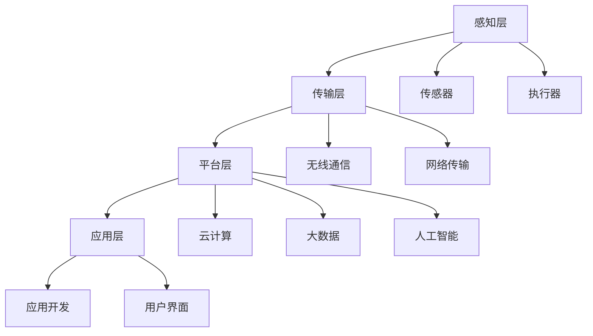

                 

## 1. 物联网在智慧物流仓储中的全面应用

### 1.1 物联网的定义与发展背景

物联网（Internet of Things，IoT）是指将各种信息传感设备与网络相连接，实现智能识别、定位、跟踪、监控和管理的一种网络技术。它通过传感器、控制器、计算机等设备，将物理世界与虚拟世界无缝连接，使得数据能够自由流动，从而实现智能化管理和控制。

物联网技术的发展起源于1999年，麻省理工学院的Kevin Ashton首次提出了物联网的概念。此后，随着信息技术的迅猛发展，物联网技术逐渐成为智慧城市建设、智能制造、智慧物流等领域的重要组成部分。

在物流仓储领域，物联网技术的应用能够显著提升物流效率，降低运营成本。通过物联网技术，物流仓储可以实现自动化管理、实时监控、智能调度等功能，从而提高物流仓储的运行效率和服务质量。

### 1.2 智慧物流仓储的需求与挑战

#### 1.2.1 需求

在当前快速发展的经济环境下，物流仓储对高效、准确、安全的要求越来越高。物联网技术能够提供实时监控、智能调度、自动化管理等功能，满足智慧物流仓储的需求。

- **实时监控**：物联网技术可以实现物流仓储环境的实时监控，如温湿度、空气质量等，确保仓储环境满足货物的存储要求。
- **智能调度**：物联网技术可以实现物流仓储资源的智能调度，如库存管理、设备维护等，提高物流仓储的运行效率。
- **自动化管理**：物联网技术可以实现物流仓储的自动化管理，如自动化分拣、自动化搬运等，降低人力成本，提高物流仓储的运行效率。

#### 1.2.2 挑战

然而，物联网在智慧物流仓储中的应用也面临着一些挑战，如数据安全、网络稳定性、设备兼容性等问题。这些问题需要通过技术手段和管理优化来解决。

- **数据安全**：物联网设备众多，数据传输过程中容易受到攻击，需要加强数据安全保护措施。
- **网络稳定性**：物联网设备在网络环境中容易受到干扰，需要提高网络稳定性，确保数据传输的可靠性。
- **设备兼容性**：不同厂商的物联网设备之间存在兼容性问题，需要制定统一的标准和协议，提高设备的互操作性。

### 1.3 本书结构安排

本书分为五个部分，分别从物联网技术基础、物联网在智慧物流仓储中的应用、数据采集与处理、物联网安全与隐私保护、物联网设备与系统集成等方面进行详细阐述。

- **第一部分：物联网技术基础**，介绍物联网的基本概念、技术架构、传感器与执行器、通信协议和平台技术。
- **第二部分：物联网在智慧物流仓储中的应用**，探讨物联网在智慧物流仓储中的应用场景、解决方案和实施案例。
- **第三部分：数据采集与处理**，介绍物联网数据采集与处理的技术和方法，如数据采集器、数据分析工具等。
- **第四部分：物联网安全与隐私保护**，探讨物联网安全与隐私保护的重要性、关键技术、挑战和解决方案。
- **第五部分：物联网设备与系统集成**，介绍物联网设备的选型、安装、配置和系统集成的方法和技巧。

通过本书的阅读，读者可以全面了解物联网在智慧物流仓储中的全面应用，掌握物联网技术的基本原理和应用方法，为推动智慧物流仓储的发展提供有力支持。

## 2. 物联网的基本组成与技术架构

### 2.1 物联网的三大核心层次

物联网的基本组成可以概括为三大核心层次：设备层、网络层和平台层。每一层都有其特定的功能和关键技术，共同构成了物联网的技术架构。

#### 2.1.1 设备层

设备层是物联网的基础，主要由传感器、执行器、智能终端等组成。传感器用于感知环境信息，如温度、湿度、光照、气体浓度等；执行器则用于执行控制指令，如电机、阀门、机械臂等；智能终端则是设备的“大脑”，具有计算、存储和通信功能，如智能摄像头、智能手表、智能手机等。

#### 2.1.2 网络层

网络层是物联网的中枢，主要负责数据传输和通信。网络层的技术种类繁多，包括Wi-Fi、蓝牙、ZigBee、LoRa等。这些通信技术为设备之间的数据交换提供了可靠、稳定的传输通道。在网络层，数据从设备层采集后，通过通信技术传输到平台层。

#### 2.1.3 平台层

平台层是物联网的大脑，负责数据处理、分析、存储和管理。平台层通常包括云计算、大数据、人工智能等技术。平台层的主要功能是对采集到的数据进行处理和分析，提取有价值的信息，如温度变化趋势、设备故障预警等。同时，平台层还负责存储和管理数据，为用户提供数据访问和查询服务。

### 2.2 物联网的技术架构

物联网的技术架构可以分为感知层、传输层、平台层和应用层。每一层都有其特定的功能和关键技术，共同构成了物联网的技术体系。

#### 2.2.1 感知层

感知层是物联网的最底层，主要负责信息的采集。感知层主要由传感器和执行器组成，用于感知环境信息和执行控制指令。感知层的核心技术包括传感器技术、无线通信技术和嵌入式系统技术。

#### 2.2.2 传输层

传输层负责数据的传输，将感知层采集到的数据传输到平台层。传输层的核心技术包括无线通信技术、网络传输技术和数据传输协议。常见的传输层技术有Wi-Fi、蓝牙、ZigBee、LoRa等。

#### 2.2.3 平台层

平台层是物联网的核心，负责数据的处理、分析、存储和管理。平台层通常包括云计算、大数据、人工智能等技术。平台层的核心技术包括云计算技术、大数据技术、人工智能技术等。

#### 2.2.4 应用层

应用层是物联网的最终用户界面，负责将处理后的数据和应用服务呈现给用户。应用层的核心技术包括应用开发技术、用户界面设计技术等。

### 2.3 物联网的技术架构图

为了更好地理解物联网的技术架构，我们可以通过以下Mermaid流程图来展示：

在这个流程图中，A表示感知层，B表示传输层，C表示平台层，D表示应用层。E表示传感器，F表示执行器，G表示无线通信，H表示网络传输，I表示云计算，J表示大数据，K表示人工智能，L表示应用开发，M表示用户界面。

通过这个流程图，我们可以清晰地看到物联网的技术架构及其各层次之间的联系。

### 2.4 物联网技术的特点与优势

物联网技术具有以下几个特点与优势：

- **广泛连接**：物联网技术可以连接各种设备，实现海量数据的传输和共享。
- **实时监控**：物联网技术可以实现实时监控，快速响应环境变化。
- **智能分析**：物联网技术可以运用大数据和人工智能技术，对数据进行分析和预测。
- **高效管理**：物联网技术可以实现对设备的自动化管理和调度，提高工作效率。
- **降低成本**：物联网技术可以降低人力成本，提高资源利用率，降低运营成本。

总之，物联网技术为智慧物流仓储提供了强大的技术支持，通过物联网技术的应用，可以显著提升物流仓储的运行效率和服务质量。

## 3. 物联网传感器与执行器

### 3.1 传感器的类型与原理

传感器是物联网设备中的关键组件，用于感知外部环境的变化，并将其转换为可处理的信号。根据感知对象的不同，传感器可以分为多种类型，如温度传感器、湿度传感器、压力传感器、光电传感器等。

#### 3.1.1 温度传感器

温度传感器用于测量温度，其工作原理是通过感知温度变化，将温度值转换为电信号输出。常见的温度传感器有热电偶、热电阻、半导体温度传感器等。

- **热电偶**：热电偶利用两种不同金属的热电效应，当两种金属接触处存在温差时，会产生热电动势。热电偶具有较高的精度和稳定性，适用于高温测量。
- **热电阻**：热电阻是一种利用电阻值随温度变化原理的温度传感器。常见的热电阻材料有铂、镍等，具有较好的线性特性。
- **半导体温度传感器**：半导体温度传感器利用半导体材料电阻随温度变化的特性，具有响应速度快、体积小、成本低等优点。

#### 3.1.2 湿度传感器

湿度传感器用于检测空气中的水分含量。根据工作原理，湿度传感器可以分为电容式湿度传感器、电阻式湿度传感器和红外线湿度传感器等。

- **电容式湿度传感器**：电容式湿度传感器通过测量电容的变化来检测湿度。其优点是精度高、响应速度快。
- **电阻式湿度传感器**：电阻式湿度传感器通过测量电阻的变化来检测湿度。其优点是结构简单、成本低。
- **红外线湿度传感器**：红外线湿度传感器利用红外线辐射强度随湿度变化的特性来检测湿度。其优点是测量范围宽、不受环境温度影响。

#### 3.1.3 压力传感器

压力传感器用于测量压力，其工作原理是通过感知压力变化，将压力值转换为电信号输出。常见的压力传感器有弹性体压力传感器、电容式压力传感器和压电式压力传感器等。

- **弹性体压力传感器**：弹性体压力传感器利用弹性体的形变来测量压力，具有结构简单、稳定性好等优点。
- **电容式压力传感器**：电容式压力传感器通过测量电容的变化来测量压力，具有精度高、响应速度快等优点。
- **压电式压力传感器**：压电式压力传感器利用压电材料的压电效应来测量压力，具有高灵敏度、高响应速度等优点。

#### 3.1.4 光电传感器

光电传感器用于检测光信号的变化，其工作原理是通过光电转换，将光信号转换为电信号输出。常见的光电传感器有光电二极管、光电三极管、光敏电阻等。

- **光电二极管**：光电二极管在接收到光信号时，会产生光电流，通过测量光电流的变化来检测光信号。
- **光电三极管**：光电三极管具有放大作用，可以放大光信号，提高检测精度。
- **光敏电阻**：光敏电阻的电阻值随光照强度变化，通过测量电阻值的变化来检测光照强度。

### 3.2 执行器的类型与原理

执行器是物联网设备中的执行单元，用于根据输入信号控制设备动作。常见的执行器有电机、电磁阀、气缸等。

#### 3.2.1 电机

电机作为执行器，通过接收电信号，实现转动动作。根据工作原理，电机可以分为直流电机、交流电机、步进电机等。

- **直流电机**：直流电机通过直流电源供电，具有结构简单、成本低、启动转矩大等优点。
- **交流电机**：交流电机通过交流电源供电，具有功率大、效率高、运行稳定等优点。
- **步进电机**：步进电机通过控制电流脉冲的顺序，实现步进转动。步进电机具有定位精度高、响应速度快等优点，广泛应用于工业控制、精密定位等领域。

#### 3.2.2 电磁阀

电磁阀通过电磁控制，实现流体介质的开启和关闭。根据工作原理，电磁阀可以分为直动式电磁阀和先导式电磁阀。

- **直动式电磁阀**：直动式电磁阀直接利用电磁力控制阀芯的移动，具有结构简单、反应速度快等优点。
- **先导式电磁阀**：先导式电磁阀通过先导阀控制主阀芯的移动，具有流量大、密封性好等优点。

#### 3.2.3 气缸

气缸是一种利用压缩空气推动活塞运动的执行器。根据结构形式，气缸可以分为单作用气缸和双作用气缸。

- **单作用气缸**：单作用气缸只有一个进气口，通过压缩空气推动活塞，实现一个方向的运动。
- **双作用气缸**：双作用气缸具有两个进气口，可以通过控制进气口的方向，实现活塞的往返运动。

### 3.3 物联网传感器与执行器的应用

物联网传感器与执行器在智慧物流仓储中具有广泛的应用。以下是一些典型的应用场景：

- **温度传感器**：用于监测仓库内部的温度，确保货物在适宜的温度下存储。
- **湿度传感器**：用于监测仓库内部的湿度，防止货物受潮。
- **压力传感器**：用于监测仓库内部的气压，确保货物存储的安全性。
- **光电传感器**：用于监测仓库内部的照明情况，实现智能照明控制。
- **电机**：用于驱动自动门、自动输送带等设备，实现自动化管理。
- **电磁阀**：用于控制仓库内部的气体供应，实现智能通风。
- **气缸**：用于驱动自动化仓库的货架升降、货物搬运等设备，实现自动化操作。

通过物联网传感器与执行器的应用，智慧物流仓储可以实现自动化管理、实时监控和智能调度，提高物流仓储的运行效率和服务质量。

## 4. 物联网通信协议

### 4.1 通信协议的基本概念

物联网通信协议是指用于设备之间数据交换的规则和标准。通信协议决定了设备如何发送、接收和处理数据，是实现物联网设备互连互通的基础。

物联网通信协议可以分为有线协议和无线协议两大类。有线协议如以太网（Ethernet）、串口通信（RS-232、RS-485等），适用于短距离、高速率的数据传输；无线协议如Wi-Fi、蓝牙、ZigBee、LoRa等，适用于长距离、低功耗的数据传输。

### 4.2 常见的物联网通信协议

以下是一些常见的物联网通信协议及其特点：

#### 4.2.1 Wi-Fi

Wi-Fi（Wireless Fidelity）是一种无线局域网通信技术，基于IEEE 802.11标准。Wi-Fi具有传输速度快、覆盖范围广、兼容性好等特点，适用于家庭、办公、公共场所等场景。

#### 4.2.2 蓝牙

蓝牙（Bluetooth）是一种短距离无线通信技术，基于IEEE 802.15.1标准。蓝牙具有低功耗、低延迟、高稳定性等特点，适用于智能手表、智能手机、耳机等设备之间的数据传输。

#### 4.2.3 ZigBee

ZigBee是一种低功耗、低速率的无线通信协议，基于IEEE 802.15.4标准。ZigBee具有低成本、低功耗、高可靠性、易扩展等特点，适用于智能家居、工业自动化、智慧物流等领域。

#### 4.2.4 LoRa

LoRa（Long Range）是一种低功耗、长距离的无线通信协议，基于FSK调制技术。LoRa具有传输距离远、穿透能力强、抗干扰性好等特点，适用于广域物联网场景，如智慧物流仓储、环境监测等。

### 4.3 物联网通信协议的应用场景

物联网通信协议在智慧物流仓储中具有广泛的应用场景，以下是一些典型的应用：

- **Wi-Fi**：用于仓库内部的无线网络覆盖，实现设备之间的数据传输和共享。
- **蓝牙**：用于设备之间的短距离通信，如手持终端与扫描器的数据同步。
- **ZigBee**：用于仓库内部的自动化设备通信，如智能灯泡、智能传感器等。
- **LoRa**：用于广域物联网场景，如仓库内部的远程数据传输、环境监测等。

通过合理选择和使用物联网通信协议，智慧物流仓储可以实现高效、稳定、可靠的数据传输，提高物流仓储的运行效率和服务质量。

## 5. 物联网平台技术

### 5.1 物联网平台的功能与架构

物联网平台是物联网系统中的核心，负责数据的采集、传输、处理、存储和管理。物联网平台的功能与架构可以分为以下几个部分：

#### 5.1.1 数据采集

数据采集是物联网平台的首要任务，通过物联网传感器、执行器等设备，实时采集环境数据，如温度、湿度、光照、气体浓度等。数据采集模块需要支持多种传感器接口，实现数据的实时采集和传输。

#### 5.1.2 数据传输

数据传输是将采集到的数据传输到云端或本地服务器。数据传输模块需要支持多种通信协议，如Wi-Fi、蓝牙、ZigBee、LoRa等，确保数据传输的稳定性和可靠性。

#### 5.1.3 数据处理

数据处理是物联网平台的核心功能之一，对采集到的数据进行分析和处理，提取有价值的信息，如温度变化趋势、设备故障预警等。数据处理模块通常包括数据预处理、特征提取、模型训练和预测等。

#### 5.1.4 数据存储

数据存储是将处理后的数据存储到数据库或文件系统中，以便后续的数据分析和查询。数据存储模块需要支持海量数据存储、快速查询和高效备份等功能。

#### 5.1.5 数据管理

数据管理包括数据安全管理、数据访问控制和数据备份等。数据管理模块需要确保数据的安全性、完整性和可靠性，并提供便捷的数据访问和管理工具。

#### 5.1.6 数据可视化

数据可视化是将采集到的数据以图表、报表等形式展示出来，帮助用户直观地了解数据情况。数据可视化模块需要支持多种数据可视化工具和插件，实现数据的实时监控和动态展示。

### 5.2 物联网平台的技术选型

物联网平台的技术选型是构建物联网系统的重要环节，需要考虑以下几个方面：

- **开发框架**：选择合适的开发框架，如Spring Boot、Node.js、Python Flask等，实现物联网平台的功能模块。
- **数据库技术**：选择合适的数据库技术，如关系数据库（MySQL、PostgreSQL）和NoSQL数据库（MongoDB、Cassandra）等，实现数据的存储和管理。
- **数据处理技术**：选择合适的数据处理技术，如大数据处理框架（Hadoop、Spark）和机器学习库（TensorFlow、PyTorch）等，实现数据处理和分析。
- **通信协议**：选择合适的通信协议，如Wi-Fi、蓝牙、ZigBee、LoRa等，实现设备之间的数据传输。
- **数据可视化工具**：选择合适的数据可视化工具，如D3.js、ECharts等，实现数据的实时监控和动态展示。

### 5.3 物联网平台的实际案例

以下是一个物联网平台的实际案例：

**项目背景**：某物流公司希望通过构建一个物联网平台，实现仓库内部的实时监控、智能调度和自动化管理，提高物流仓储的运行效率和服务质量。

**项目目标**：
1. 实时监控仓库内部的环境数据，如温度、湿度、光照等。
2. 实现仓库内部的智能调度，如库存管理、设备维护等。
3. 实现仓库内部的自动化管理，如自动分拣、自动搬运等。

**项目实施**：
1. **硬件选型**：选用支持Wi-Fi通信的传感器，如温湿度传感器、光照传感器等，实现数据采集。
2. **软件开发**：采用Spring Boot框架开发物联网平台，实现数据采集、传输、处理、存储和管理等功能。
3. **系统集成**：将物联网平台与物流公司的ERP系统、WMS系统等进行集成，实现数据的统一管理和调度。

**项目效果**：
1. 实时监控仓库内部的环境数据，确保货物存储的安全和质量。
2. 实现仓库内部的智能调度，提高物流仓储的运行效率。
3. 实现仓库内部的自动化管理，降低人力成本，提高物流仓储的服务质量。

通过这个实际案例，我们可以看到物联网平台在智慧物流仓储中的应用效果，为物流仓储的管理和运营提供了强大的技术支持。

## 6. 物联网在智慧物流仓储中的应用

### 6.1 物联网在智慧物流仓储中的具体应用场景

物联网技术在智慧物流仓储中具有广泛的应用，通过物联网技术的应用，可以实现物流仓储的自动化管理、实时监控和智能调度，提高物流仓储的运行效率和服务质量。以下是一些具体的应用场景：

#### 6.1.1 实时监控

物联网传感器可以实时采集仓库内部的环境数据，如温度、湿度、光照、气体浓度等。通过物联网平台，这些数据可以实时传输到云端或本地服务器，供仓库管理人员监控和分析。

- **环境监控**：通过实时监控仓库内部的环境数据，确保货物存储的安全和质量，如防止货物受潮、受热等。
- **设备监控**：通过实时监控仓库内部的设备运行状态，如货架、照明、空调等，实现设备的智能调度和维护。

#### 6.1.2 自动化分拣

物联网技术可以实现物流仓储的自动化分拣，通过传感器和执行器，实现货物的自动识别、分类和搬运。

- **自动识别**：通过物联网传感器，如条码扫描器、RFID标签等，实现货物的自动识别。
- **自动分类**：通过物联网技术，实现货物的自动分类，如根据目的地、货物类型等进行分类。
- **自动搬运**：通过物联网执行器，如自动导引车（AGV）、机械臂等，实现货物的自动搬运。

#### 6.1.3 智能调度

物联网技术可以实现物流仓储的智能调度，通过物联网平台，对仓库内部的资源进行实时监控和优化调度。

- **库存管理**：通过物联网平台，实时监控仓库内部的库存情况，实现智能库存管理，避免货物积压或缺货。
- **设备维护**：通过物联网平台，实时监控仓库内部的设备运行状态，实现智能设备维护，降低设备故障率。

#### 6.1.4 安全监控

物联网技术可以实现物流仓储的安全监控，通过传感器和摄像头等设备，实现对仓库内部的实时监控和异常报警。

- **实时监控**：通过摄像头等设备，实现对仓库内部的实时监控，确保仓库内部的安全。
- **异常报警**：通过物联网传感器，如烟雾传感器、运动传感器等，实现异常情况的实时报警，如火灾、入侵等。

#### 6.1.5 能耗管理

物联网技术可以实现物流仓储的能耗管理，通过物联网平台，实时监控仓库内部的能耗情况，实现能耗的智能管理和优化。

- **能耗监控**：通过物联网传感器，如电表、水表等，实时监控仓库内部的能耗情况。
- **能耗优化**：通过物联网平台，对仓库内部的能耗进行实时分析和优化，降低能耗，提高能源利用率。

### 6.2 物联网在智慧物流仓储中的优势与挑战

#### 6.2.1 优势

物联网技术在智慧物流仓储中的应用具有以下优势：

- **提高运行效率**：物联网技术可以实现物流仓储的自动化管理和智能调度，提高物流仓储的运行效率。
- **降低运营成本**：物联网技术可以实现物流仓储的实时监控和能耗管理，降低运营成本。
- **提高服务质量**：物联网技术可以实现物流仓储的实时监控和智能调度，提高物流仓储的服务质量，如减少货物丢失、提高配送速度等。
- **增强安全保障**：物联网技术可以实现物流仓储的安全监控和异常报警，提高安全保障。

#### 6.2.2 挑战

物联网技术在智慧物流仓储中的应用也面临着一些挑战：

- **数据安全**：物联网设备众多，数据传输过程中容易受到攻击，需要加强数据安全保护措施。
- **网络稳定性**：物联网设备在网络环境中容易受到干扰，需要提高网络稳定性，确保数据传输的可靠性。
- **设备兼容性**：不同厂商的物联网设备之间存在兼容性问题，需要制定统一的标准和协议，提高设备的互操作性。
- **数据隐私**：物联网设备采集的数据涉及个人隐私，需要保护用户数据的安全和隐私。

### 6.3 物联网在智慧物流仓储中的应用案例

以下是一个物联网在智慧物流仓储中的应用案例：

**项目背景**：某物流公司希望通过物联网技术提升仓库的自动化水平，提高物流仓储的运行效率和服务质量。

**项目目标**：
1. 实现仓库内部的实时监控，如温度、湿度、光照等。
2. 实现自动化分拣和搬运，提高物流仓储的运行效率。
3. 实现智能调度，优化仓库内部的资源配置。

**项目实施**：
1. **硬件选型**：选用支持Wi-Fi通信的传感器，如温湿度传感器、光照传感器等，实现数据采集。
2. **软件开发**：采用Spring Boot框架开发物联网平台，实现数据采集、传输、处理、存储和管理等功能。
3. **系统集成**：将物联网平台与物流公司的ERP系统、WMS系统等进行集成，实现数据的统一管理和调度。
4. **自动化设备部署**：部署自动导引车（AGV）、机械臂等自动化设备，实现货物的自动识别、分类和搬运。

**项目效果**：
1. 实时监控仓库内部的环境数据，确保货物存储的安全和质量。
2. 实现自动化分拣和搬运，提高物流仓储的运行效率。
3. 实现智能调度，优化仓库内部的资源配置。

通过这个实际案例，我们可以看到物联网在智慧物流仓储中的应用效果，为物流仓储的管理和运营提供了强大的技术支持。

## 7. 物联网数据采集与处理

### 7.1 数据采集的重要性

在物联网应用中，数据采集是基础且关键的一环。数据采集的准确性、及时性和完整性直接影响到物联网系统的性能和可靠性。在智慧物流仓储中，物联网设备通过传感器实时采集环境参数（如温度、湿度、光照、气体浓度等）、设备状态（如库存、运行状态、故障情况等）以及物流操作数据（如分拣、搬运、配送等）。这些数据为物流仓储的自动化管理、智能调度和优化提供了重要的信息支持。

#### 7.1.1 数据采集的挑战

数据采集面临以下几个挑战：

- **多样性**：物联网传感器类型多样，包括温度传感器、湿度传感器、光电传感器等，每种传感器都有其特定的数据采集方式和精度要求。
- **高频率**：为了实时监控环境变化，物联网设备需要高频采集数据，这要求数据采集系统具备高吞吐量和快速响应能力。
- **可靠性**：数据采集系统需要在各种复杂环境下稳定运行，如高低温、潮湿、振动等。
- **实时性**：物流仓储环境变化迅速，数据采集系统需要实时响应，确保数据及时上传和处理。

#### 7.1.2 数据采集的方法

数据采集的方法主要包括以下几种：

- **有线采集**：通过有线连接（如以太网、串口等）将传感器数据传输到中央处理单元。
- **无线采集**：通过无线通信技术（如Wi-Fi、蓝牙、ZigBee等）将传感器数据传输到物联网平台或服务器。
- **分布式采集**：将数据采集任务分布到各个节点，每个节点负责采集本地数据并传输到中心节点。

### 7.2 数据处理的技术和方法

数据处理是物联网系统中的关键环节，主要任务是对采集到的数据进行清洗、转换、存储和分析。以下是数据处理的主要技术和方法：

#### 7.2.1 数据清洗

数据清洗是数据处理的第一步，主要目的是去除数据中的噪声、错误和冗余。数据清洗的方法包括：

- **去重**：去除重复的数据记录。
- **纠错**：纠正数据中的错误，如数值修正、逻辑修复等。
- **缺失值填充**：对缺失的数据进行填充，如平均值填充、插值法等。

#### 7.2.2 数据转换

数据转换是将不同格式或单位的数据转换为统一格式或单位，以便后续处理和分析。数据转换的方法包括：

- **格式转换**：如将文本数据转换为数字数据。
- **单位转换**：如将温度从摄氏度转换为华氏度。

#### 7.2.3 数据存储

数据存储是将处理后的数据存储到数据库或文件系统中，以便后续的数据分析和查询。常用的数据存储技术包括：

- **关系数据库**：如MySQL、PostgreSQL等，适用于结构化数据的存储。
- **NoSQL数据库**：如MongoDB、Cassandra等，适用于非结构化数据的存储。

#### 7.2.4 数据分析

数据分析是对存储在数据库中的数据进行统计、分析和挖掘，以提取有价值的信息。数据分析的方法包括：

- **统计分析**：如均值、方差、相关系数等。
- **机器学习**：如分类、回归、聚类等。
- **数据挖掘**：如关联规则挖掘、异常检测等。

### 7.3 数据处理在智慧物流仓储中的应用

在智慧物流仓储中，数据处理技术可以应用于以下几个方面：

- **环境监控**：通过对环境数据的实时处理和分析，监控仓库内部的环境状况，确保货物存储条件符合要求。
- **设备管理**：通过对设备运行数据的处理和分析，监控设备运行状态，预测设备故障，进行设备维护和优化。
- **物流优化**：通过对物流操作数据的处理和分析，优化仓库内部的物流流程，提高物流效率和准确性。
- **能源管理**：通过对能耗数据的处理和分析，监控能源使用情况，优化能源消耗，降低运营成本。

### 7.4 数据采集与处理的实际案例

以下是一个数据采集与处理在智慧物流仓储中的实际案例：

**项目背景**：某物流公司希望通过物联网技术提升仓库的自动化水平，实现仓库内部环境的实时监控和设备运行状态的智能分析。

**项目目标**：
1. 实现仓库内部环境的实时监控，如温度、湿度、光照等。
2. 实现设备运行状态的实时监控，如货架、自动导引车（AGV）等。
3. 实现物流操作数据的实时处理和分析，优化物流流程。

**项目实施**：
1. **硬件部署**：在仓库内部部署各种传感器，如温度传感器、湿度传感器、光照传感器等，以及自动导引车（AGV）和货架等设备。
2. **软件开发**：开发物联网平台，实现数据采集、传输、处理、存储和管理等功能。
3. **数据处理**：采用大数据处理框架（如Hadoop、Spark）对采集到的数据进行分析和处理，提取有价值的信息。
4. **系统集成**：将物联网平台与物流公司的ERP系统、WMS系统等进行集成，实现数据的统一管理和调度。

**项目效果**：
1. 实现仓库内部环境的实时监控，确保货物存储的安全和质量。
2. 实现设备运行状态的实时监控，预测设备故障，进行设备维护和优化。
3. 实现物流操作数据的实时处理和分析，优化物流流程，提高物流效率和准确性。

通过这个实际案例，我们可以看到数据采集与处理在智慧物流仓储中的应用效果，为物流仓储的管理和运营提供了强大的技术支持。

## 8. 物联网安全与隐私保护

### 8.1 物联网安全的重要性

在智慧物流仓储中，物联网安全是保障系统正常运行和信息安全的关键。物联网设备众多，数据传输频繁，若安全措施不足，容易导致数据泄露、设备被攻击等风险。因此，保障物联网安全是智慧物流仓储发展的重中之重。

#### 8.1.1 数据安全

数据安全是物联网安全的核心问题。物联网设备采集和处理的数据涉及货物流向、库存信息、操作记录等敏感信息，若数据泄露，可能导致商业机密泄露、物流信息被篡改等问题。因此，必须采取有效的数据安全措施，确保数据在传输、存储和处理过程中不被泄露和篡改。

#### 8.1.2 设备安全

物联网设备是物流仓储系统的神经中枢，若设备安全受到威胁，可能导致整个系统的瘫痪。设备安全包括设备硬件安全、软件安全和网络安全。硬件安全需防止设备被恶意物理破坏；软件安全需防止恶意软件感染设备，导致设备运行异常；网络安全需防止网络攻击，确保数据传输的完整性和可靠性。

#### 8.1.3 网络安全

物联网设备通常通过网络连接，若网络安全措施不足，容易导致网络被入侵、数据被窃取等问题。网络安全包括网络防护、访问控制和数据加密等。网络防护需防止外部攻击，如DDoS攻击等；访问控制需确保只有授权用户才能访问系统资源；数据加密需对传输的数据进行加密，防止数据在传输过程中被窃取。

### 8.2 物联网安全的挑战

物联网安全面临以下几个挑战：

- **设备众多**：物联网设备数量庞大，管理难度大，易导致安全漏洞和攻击面扩大。
- **通信协议复杂**：物联网通信协议种类繁多，协议安全性参差不齐，易导致安全隐患。
- **数据量大**：物联网设备采集和处理的数据量大，存储、传输和处理过程中的安全风险高。
- **更新换代快**：物联网技术更新换代快，旧设备可能无法及时更新安全补丁，易成为攻击目标。

### 8.3 物联网安全的解决方案

为保障物联网安全，可以从以下几个方面入手：

- **安全设计**：在物联网系统设计阶段，充分考虑安全因素，采用安全可靠的技术和架构。
- **访问控制**：采用严格的访问控制机制，确保只有授权用户才能访问系统资源。
- **数据加密**：对传输的数据进行加密，防止数据在传输过程中被窃取和篡改。
- **安全监控**：实时监控物联网设备的运行状态，及时发现并处理安全事件。
- **定期更新**：定期更新物联网设备的安全补丁和软件版本，防止设备被攻击。

### 8.4 物联网隐私保护

物联网隐私保护是另一个重要问题。物联网设备采集和处理的数据涉及用户隐私，如地理位置、行为习惯等。若隐私保护措施不足，可能导致用户隐私泄露。因此，必须采取有效的隐私保护措施。

- **数据去识别化**：对采集的数据进行去识别化处理，去除个人身份信息，降低隐私泄露风险。
- **数据匿名化**：采用数据匿名化技术，如数据加密、哈希等，保护用户隐私。
- **隐私政策**：制定明确的隐私政策，告知用户数据采集、存储和处理的范围和目的，获得用户同意。

### 8.5 物联网安全与隐私保护的案例分析

以下是一个物联网安全与隐私保护的案例分析：

**案例背景**：某物流公司因物联网设备安全防护不足，导致客户数据泄露，引发了严重的隐私问题。

**案例目标**：
1. 评估物联网设备的安全风险。
2. 制定并实施安全防护措施。
3. 加强隐私保护措施，确保用户隐私不被泄露。

**案例实施**：
1. **安全评估**：对物联网设备进行全面的安全评估，识别潜在的安全漏洞和风险点。
2. **安全加固**：针对识别出的安全漏洞，进行安全加固，如更新设备固件、安装安全补丁等。
3. **隐私保护**：采用数据去识别化和匿名化技术，对采集的数据进行隐私保护处理。
4. **安全监控**：部署安全监控工具，实时监控物联网设备的运行状态，及时发现和处理安全事件。

**案例效果**：
1. 降低了物联网设备的安全风险，确保了系统的稳定运行。
2. 加强了用户隐私保护，避免了用户隐私泄露事件的发生。

通过这个案例，我们可以看到物联网安全与隐私保护的重要性，以及采取有效措施进行安全防护和隐私保护的效果。

## 9. 物联网设备与系统集成

### 9.1 物联网设备的选型与安装

在智慧物流仓储中，物联网设备的选型与安装是确保系统正常运行的基础。以下是一些关键点：

#### 9.1.1 设备选型

- **传感器的选型**：根据物流仓储的需求，选择适合的传感器，如温度传感器、湿度传感器、光照传感器等。
- **执行器的选型**：根据物流仓储的自动化需求，选择适合的执行器，如电机、电磁阀、气缸等。
- **智能终端的选型**：选择具备计算、存储和通信功能的智能终端，如智能摄像头、智能门禁设备等。

#### 9.1.2 安装注意事项

- **安装环境**：确保物联网设备安装在适宜的环境中，如温度、湿度、振动等。
- **布线方案**：合理规划布线方案，确保数据传输的稳定性和可靠性。
- **设备调试**：安装完成后，进行设备调试，确保设备正常工作。

### 9.2 系统集成的方法与技巧

系统集成是将各种物联网设备、系统和平台整合在一起，实现物流仓储的自动化管理和智能化调度。以下是一些关键点：

#### 9.2.1 系统集成架构

- **设备层**：包括传感器、执行器等物联网设备。
- **网络层**：包括Wi-Fi、蓝牙、ZigBee等无线通信技术。
- **平台层**：包括物联网平台、云计算平台等。
- **应用层**：包括物流仓储管理系统、智能调度系统等。

#### 9.2.2 集成方法

- **设备集成**：通过标准通信协议，将各种物联网设备连接到物联网平台。
- **数据集成**：将不同来源的数据进行整合，实现数据的统一管理和调度。
- **系统集成**：将物联网平台与物流仓储管理系统、智能调度系统等进行集成，实现系统功能的协同工作。

#### 9.2.3 集成技巧

- **标准化**：采用标准化的技术和协议，提高系统的互操作性和兼容性。
- **模块化**：采用模块化设计，提高系统的可扩展性和维护性。
- **安全性**：确保系统集成过程中的数据安全和设备安全，采取有效的安全防护措施。

### 9.3 物联网设备与系统集成的实际案例

以下是一个物联网设备与系统集成的实际案例：

**案例背景**：某物流公司希望通过物联网技术提升仓库的自动化水平，实现仓库内部环境实时监控、设备运行状态监控和智能调度。

**案例目标**：
1. 实现仓库内部环境的实时监控，如温度、湿度、光照等。
2. 实现设备运行状态的实时监控，如货架、自动导引车（AGV）等。
3. 实现智能调度，优化仓库内部的资源配置。

**案例实施**：
1. **设备选型**：选择适合的传感器（如温湿度传感器、光照传感器）、执行器（如电机、电磁阀）和智能终端（如智能摄像头）。
2. **系统集成**：将物联网传感器、执行器和智能终端通过Wi-Fi、ZigBee等无线通信技术连接到物联网平台，实现数据的实时采集、传输和处理。
3. **数据集成**：将物联网平台与物流公司的ERP系统、WMS系统等进行集成，实现数据的统一管理和调度。
4. **应用开发**：开发智能调度系统，实现对仓库内部资源的智能调度和优化。

**案例效果**：
1. 实现了仓库内部环境的实时监控，确保货物存储的安全和质量。
2. 实现了设备运行状态的实时监控，提高了设备的使用效率和安全性。
3. 实现了智能调度，优化了仓库内部的资源配置，提高了物流仓储的运行效率和服务质量。

通过这个实际案例，我们可以看到物联网设备与系统集成在智慧物流仓储中的应用效果，为物流仓储的管理和运营提供了强大的技术支持。

## 10. 物联网在智慧物流仓储中的应用前景与挑战

### 10.1 物联网在智慧物流仓储中的应用前景

物联网技术在智慧物流仓储中的应用前景广阔，随着物联网技术的不断发展，物联网在智慧物流仓储中的应用将更加深入和广泛。

#### 10.1.1 自动化水平的提升

物联网技术可以实现对物流仓储设备的自动化控制，提高物流仓储的运行效率。通过物联网传感器和执行器的协同工作，可以实现仓库内部环境的智能调节、货物的自动分拣和搬运、设备的自动维护等，降低人工成本，提高仓储效率。

#### 10.1.2 数据驱动决策

物联网技术可以实现对物流仓储数据的实时采集和处理，为决策提供数据支持。通过大数据分析和人工智能技术，可以实时监控仓库内部的运行状态，预测潜在问题，优化仓储流程，提高物流仓储的服务质量。

#### 10.1.3 智能供应链管理

物联网技术可以实现对整个供应链的实时监控和智能调度，提高供应链的透明度和协同效率。通过物联网技术，可以实现供应链各环节的信息共享和协同作业，降低库存成本，提高供应链的响应速度。

#### 10.1.4 跨界融合

物联网技术与其他技术的融合，如大数据、云计算、人工智能等，将推动智慧物流仓储的创新发展。通过跨界融合，可以实现物流仓储与其他领域的深度融合，如智能制造、智慧城市等，为智慧物流仓储带来更多创新应用。

### 10.2 物联网在智慧物流仓储中的应用挑战

尽管物联网在智慧物流仓储中具有广阔的应用前景，但在实际应用过程中仍面临一些挑战。

#### 10.2.1 数据安全与隐私保护

物联网设备众多，数据传输频繁，数据安全与隐私保护成为关键问题。如何确保数据在传输、存储和处理过程中的安全性，防止数据泄露和隐私侵犯，是物联网在智慧物流仓储中需要解决的重要问题。

#### 10.2.2 网络稳定性与可靠性

物联网设备通常分布在广泛的地理区域内，网络稳定性与可靠性成为关键问题。如何确保物联网设备在网络环境中稳定、可靠地运行，防止网络中断和数据丢失，是物联网在智慧物流仓储中需要解决的重要问题。

#### 10.2.3 设备兼容性与互操作性

不同厂商的物联网设备之间存在兼容性问题，如何实现设备的互操作性，是物联网在智慧物流仓储中需要解决的重要问题。需要制定统一的标准和协议，提高设备的互操作性和兼容性，降低系统的复杂性和维护成本。

#### 10.2.4 技术升级与更新换代

物联网技术更新换代速度快，如何应对技术升级和更新换代，是物联网在智慧物流仓储中需要解决的重要问题。需要关注新技术的发展趋势，及时更新物联网设备和技术，确保系统的先进性和竞争力。

### 10.3 应对挑战的策略

为应对物联网在智慧物流仓储中的应用挑战，可以采取以下策略：

#### 10.3.1 加强数据安全与隐私保护

- 采用加密技术和安全协议，确保数据在传输、存储和处理过程中的安全性。
- 建立完善的数据安全管理制度，加强对数据泄露和隐私侵犯的监控和防范。

#### 10.3.2 提高网络稳定性与可靠性

- 采用分布式网络架构，提高网络稳定性和可靠性。
- 定期对物联网设备进行维护和升级，确保设备的正常运行。

#### 10.3.3 制定统一标准与协议

- 制定统一的标准和协议，提高物联网设备的互操作性和兼容性。
- 推动物联网技术的标准化进程，降低系统的复杂性和维护成本。

#### 10.3.4 关注技术发展趋势

- 定期关注物联网技术发展趋势，及时更新物联网设备和技术。
- 培养物联网技术人才，提高系统的技术水平和创新能力。

通过以上策略，可以有效地应对物联网在智慧物流仓储中的应用挑战，推动物联网技术在智慧物流仓储中的应用和发展。

## 11. 总结与展望

### 11.1 物联网在智慧物流仓储中的重要性

物联网技术在智慧物流仓储中具有至关重要的作用。通过物联网技术的应用，可以实现物流仓储的自动化管理、实时监控和智能调度，提高物流仓储的运行效率和服务质量。物联网技术不仅提升了物流仓储的运营水平，还为物流仓储的管理者提供了丰富的数据支持，使其能够做出更加科学的决策。

### 11.2 物联网技术的挑战与未来发展方向

尽管物联网技术在智慧物流仓储中取得了显著成果，但在实际应用过程中仍面临诸多挑战。如数据安全与隐私保护、网络稳定性与可靠性、设备兼容性与互操作性等。为了解决这些问题，需要加强数据安全与隐私保护，提高网络稳定性和可靠性，制定统一的标准和协议，推动物联网技术的标准化进程。

### 11.3 物联网技术发展趋势

展望未来，物联网技术将继续向智能化、网络化、边缘计算等方向发展。以下是一些可能的发展趋势：

- **智能化**：随着人工智能技术的发展，物联网设备将具备更强大的智能处理能力，能够实现自主决策和自主学习，提高物流仓储的智能化水平。
- **网络化**：随着5G网络的普及，物联网设备将实现更高速、更稳定的连接，为智慧物流仓储提供更好的网络支持。
- **边缘计算**：物联网设备将更多地采用边缘计算技术，实现数据的本地处理和实时分析，降低数据传输成本，提高数据处理效率。

### 11.4 对智慧物流仓储的启示

物联网技术的发展为智慧物流仓储带来了新的机遇和挑战。物流仓储管理者应关注物联网技术的发展趋势，积极引进和应用物联网技术，提升物流仓储的运营效率和服务质量。同时，应重视物联网技术在数据安全与隐私保护、网络稳定性与可靠性、设备兼容性与互操作性等方面的问题，采取有效的措施加以解决。

通过物联网技术的应用，智慧物流仓储将实现更加高效、智能和安全的运营，为物流行业的可持续发展提供强有力的支持。

## 12. 最佳实践 Tips

### 12.1 数据安全与隐私保护

- **加密传输**：确保数据在传输过程中使用加密技术，如HTTPS、SSL等。
- **数据去识别化**：对敏感数据进行去识别化处理，如删除个人信息、使用匿名标识等。
- **权限管理**：实施严格的权限管理策略，确保只有授权用户才能访问敏感数据。

### 12.2 设备管理

- **定期维护**：定期对物联网设备进行检查和维护，确保设备的正常运行。
- **升级补丁**：及时更新设备的固件和软件补丁，修复已知的安全漏洞。
- **设备监控**：实时监控设备的运行状态，及时发现并处理异常情况。

### 12.3 网络稳定性与可靠性

- **冗余设计**：采用冗余设计，提高网络的稳定性和可靠性，如使用多路径传输、备份网络等。
- **容错机制**：建立容错机制，确保系统在发生故障时能够快速恢复，如自动切换到备份系统、自动重试等。

### 12.4 集成与兼容性

- **标准协议**：采用标准化的协议和接口，提高系统的互操作性和兼容性。
- **模块化设计**：采用模块化设计，提高系统的可扩展性和维护性，便于后续的升级和扩展。

### 12.5 数据处理与分析

- **实时处理**：采用实时数据处理技术，确保数据及时上传和处理，提高系统的响应速度。
- **数据可视化**：使用数据可视化工具，将处理后的数据以直观的方式展示，便于用户理解和分析。

### 12.6 持续优化

- **监控与反馈**：持续监控系统的运行状态，收集用户反馈，不断优化系统功能和服务。
- **技术创新**：关注物联网技术的发展趋势，积极探索和引入新技术，提升系统的性能和竞争力。

通过以上最佳实践 tips，可以有效地提高物联网在智慧物流仓储中的应用效果，确保系统的稳定、安全、高效运行。

## 13. 小结

本文全面探讨了物联网在智慧物流仓储中的全面应用。我们从物联网的基本概念、技术架构、传感器与执行器、通信协议、平台技术，到物联网在智慧物流仓储中的应用场景、数据处理与分析、安全与隐私保护、设备与系统集成等方面进行了详细阐述。通过本文的阅读，读者可以全面了解物联网在智慧物流仓储中的重要作用和实际应用，掌握物联网技术的基本原理和应用方法。

物联网技术为智慧物流仓储提供了强大的技术支持，通过物联网技术的应用，可以显著提升物流仓储的运行效率和服务质量。然而，物联网在智慧物流仓储中的应用也面临诸多挑战，如数据安全、网络稳定性、设备兼容性等。解决这些问题需要我们不断探索和优化物联网技术的应用。

未来，物联网技术将继续向智能化、网络化、边缘计算等方向发展。物流仓储管理者应关注物联网技术的发展趋势，积极引进和应用物联网技术，提升物流仓储的运营效率和服务质量。同时，应重视物联网技术在数据安全与隐私保护、网络稳定性与可靠性、设备兼容性与互操作性等方面的问题，采取有效的措施加以解决。

通过本文的探讨，我们希望为读者提供有益的参考和启示，推动物联网技术在智慧物流仓储中的应用和发展，助力物流行业的智能化转型。

## 14. 注意事项

在实施物联网技术在智慧物流仓储中的应用时，需要注意以下几点：

- **充分了解需求**：在引入物联网技术前，需要充分了解物流仓储的具体需求和问题，确保物联网技术的应用能够解决实际问题。
- **考虑系统兼容性**：在选型和集成物联网设备时，要考虑设备的兼容性和互操作性，确保系统能够稳定、高效地运行。
- **数据安全与隐私保护**：重视数据安全与隐私保护，采用加密、去识别化等技术，确保数据在传输、存储和处理过程中的安全性和隐私性。
- **持续监控与维护**：物联网系统上线后，需要持续监控和更新，确保系统的稳定性和可靠性，及时处理故障和问题。
- **培训与支持**：为员工提供培训和支持，提高他们对物联网技术的理解和应用能力，确保物联网技术在物流仓储中的有效运用。

通过注意以上事项，可以更好地实施物联网技术在智慧物流仓储中的应用，实现物流仓储的智能化升级。

## 15. 拓展阅读

### 15.1 物联网技术相关书籍

1. **《物联网导论》（Introduction to the Internet of Things）》
   - 作者：Heekap Sakulbinda
   - 简介：本书系统地介绍了物联网的基本概念、技术架构和应用场景，是物联网领域的重要入门书籍。

2. **《物联网系统设计与实现》（Design and Implementation of IoT Systems）》
   - 作者：Christian Floerkemeier
   - 简介：本书详细讲解了物联网系统的设计原理、实现方法和最佳实践，适用于物联网系统开发者。

3. **《物联网安全》（IoT Security）》
   - 作者：Travis Taylor
   - 简介：本书深入探讨了物联网安全的关键问题和解决方案，包括数据安全、隐私保护、设备安全等。

### 15.2 物联网技术相关论文

1. **“A Comprehensive Survey on Internet of Things”**
   - 作者：Xiaodong Zhang, Wei Zhang等
   - 简介：该论文对物联网的概念、架构、技术和发展趋势进行了全面综述，是物联网领域的重要研究文献。

2. **“IoT Security: A Comprehensive Survey”**
   - 作者：Vijay Kumar, P. S. Sastry等
   - 简介：该论文详细分析了物联网安全的关键问题和挑战，提出了多种安全解决方案和防护策略。

3. **“Smart Warehouse Management using IoT”**
   - 作者：V. Maheshkumar, M. Latha等
   - 简介：该论文探讨了物联网在智能仓库管理中的应用，包括自动化分拣、智能调度、实时监控等方面的实现方法。

### 15.3 物联网技术相关网站

1. **IEEE IoT Initiative**
   - 网址：<https://iot.ieee.org/>
   - 简介：IEEE IoT Initiative是一个专注于物联网技术研究和应用的官方网站，提供了丰富的物联网技术资源和最新动态。

2. **IoT for All**
   - 网址：<https://www.iotforall.org/>
   - 简介：IoT for All是一个面向物联网技术普及和推广的在线平台，提供了大量关于物联网技术、应用和案例的研究文章和视频教程。

3. **物联网技术社区**
   - 网址：<https://www.iotcommunity.cn/>
   - 简介：物联网技术社区是一个汇聚物联网技术爱好者、开发者、专家的在线社区，提供了丰富的物联网技术讨论和分享资源。

通过阅读以上书籍、论文和访问相关网站，读者可以进一步了解物联网技术的相关知识和最新发展动态，为物联网在智慧物流仓储中的应用提供更加深入的理论和实践支持。

