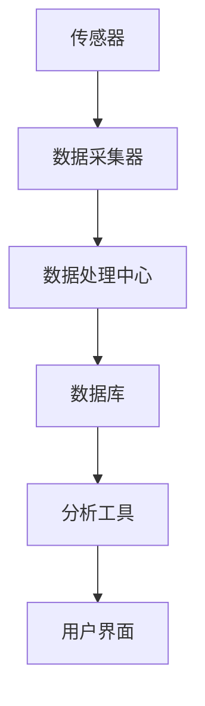
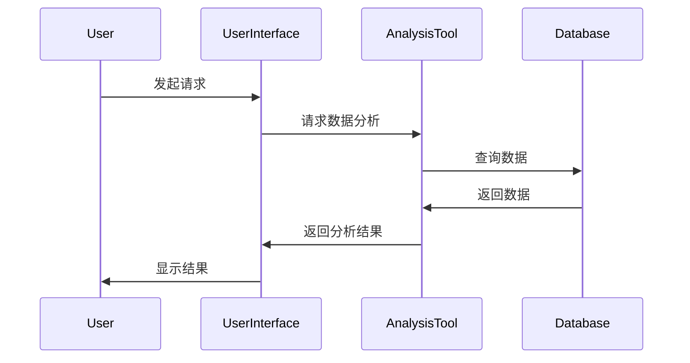
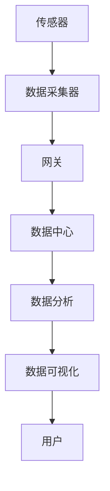
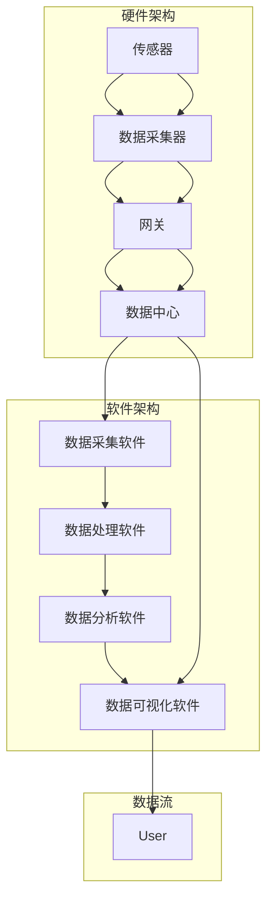

                 

### 物联网在智慧环保监测中的概述

#### 1.1 物联网的定义与演变

**物联网**（Internet of Things, IoT）是指通过互联网将各种物理设备、传感器、软件和网络连接起来，实现设备与设备、设备与网络、网络与用户之间的信息交换和协同工作。物联网的概念最早可以追溯到1999年，由麻省理工学院的Kevin Ashton首次提出。此后，物联网技术经历了快速的发展和演变。

物联网的**基本概念**包括三个核心要素：连接、数据和信息处理、以及应用。首先，**连接**是物联网实现的前提，通过有线和无线网络将设备连接起来，形成物联网网络。其次，**数据和信息处理**是物联网的核心，通过传感器采集数据，然后利用数据处理技术对数据进行存储、分析和处理，以获取有用的信息。最后，**应用**是物联网的最终目的，通过各种物联网应用实现特定功能，如智能家居、智慧城市、智慧农业等。

物联网的**技术基础**包括以下几个方面：

1. **传感器技术**：传感器是物联网系统的核心组件，用于采集各种环境参数，如温度、湿度、空气质量等。
2. **通信技术**：物联网设备需要通过通信网络进行数据传输，常见的通信技术包括Wi-Fi、蓝牙、ZigBee、LoRa等。
3. **数据处理技术**：随着物联网设备的增多，数据量也急剧增加，如何高效地处理这些数据是物联网技术面临的一大挑战。
4. **云计算和大数据技术**：物联网产生的海量数据需要通过云计算和大数据技术进行存储、分析和处理。

物联网的**发展趋势**主要体现在以下几个方面：

1. **设备数量的增加**：随着传感器技术的进步和成本的降低，物联网设备的数量将呈现爆发式增长。
2. **数据处理的智能化**：利用人工智能和机器学习技术，对物联网数据进行智能分析，提供更加精准的决策支持。
3. **物联网与5G技术的融合**：5G技术的引入将为物联网提供更高速、更稳定的网络环境，进一步提升物联网的性能和可靠性。
4. **物联网在各个行业的应用**：物联网技术将在更多行业得到应用，如智慧城市、智慧医疗、智慧交通等。

#### 1.2 智慧环保监测的背景与重要性

**智慧环保监测**是指利用物联网、大数据、人工智能等先进技术，对环境质量进行实时监测、分析和预警，实现环境管理的智能化和高效化。随着工业化和城市化的快速发展，环境污染问题日益严重，传统的环境监测方法已难以满足需求。智慧环保监测的出现，为解决环境污染问题提供了新的思路和手段。

**环保监测的需求与挑战**主要包括以下几个方面：

1. **环境监测的实时性**：传统环境监测方法多为定期采样，无法实现实时监测，导致环境污染问题无法及时发现和处理。
2. **环境监测的全面性**：传统环境监测方法通常只关注少数指标，如空气质量、水质等，缺乏对多种环境因素的全面监测。
3. **环境监测的数据处理能力**：随着物联网设备的普及，环境监测数据的数量和种类不断增加，如何高效处理这些海量数据是环境监测领域的一大挑战。

**智慧环保监测的概念**是指通过物联网技术，将各种环境监测传感器连接起来，实现环境数据的实时采集、传输和存储，并通过大数据分析和人工智能技术，对环境质量进行预测和预警，从而实现环境管理的智能化。

**智慧环保监测的重要性**体现在以下几个方面：

1. **提高环境管理的效率**：通过实时监测和数据分析，可以及时发现环境污染问题，采取有效措施进行治理，提高环境管理的效率。
2. **减少环境污染损失**：智慧环保监测可以提前预警环境污染事件，减少环境污染造成的经济损失。
3. **促进可持续发展**：智慧环保监测有助于实现环境监测的全面性和实时性，为环境保护和可持续发展提供数据支持。

#### 1.3 物联网在智慧环保监测中的应用场景

物联网在智慧环保监测中有着广泛的应用场景，以下列举几个典型的应用场景：

**空气质量监测**：通过在空气中安装传感器，实时监测空气中的有害物质，如PM2.5、PM10、SO2、NO2等。这些数据可以实时上传到数据中心，通过数据分析平台进行处理和分析，为政府和公众提供空气质量报告。

**水质监测**：通过在河流、湖泊、海洋等水域中安装传感器，实时监测水质参数，如pH值、溶解氧、重金属等。这些数据可以帮助政府和环保部门及时了解水质状况，采取有效的治理措施。

**噪声监测**：通过在噪声源周围安装传感器，实时监测噪声水平，为城市规划和管理提供依据。同时，通过数据分析，可以识别噪声源，采取针对性的降噪措施。

**地质灾害监测**：通过在地质灾害易发区域安装传感器，实时监测地形变化、土壤湿度等参数，提前预警地质灾害的发生，减少人员伤亡和财产损失。

**其他应用场景**：物联网在智慧环保监测中的其他应用场景还包括土壤质量监测、森林火灾监测、海洋污染监测等。通过在这些领域应用物联网技术，可以实现对环境的全面监测和有效管理。

### 物联网在智慧环保监测中的核心概念与联系

#### 2.1 物联网传感器技术

**传感器技术**是物联网系统的核心组成部分，用于采集环境数据，并将数据传输给数据处理中心。传感器技术包括传感器的选择、安装、数据采集与处理等多个方面。

**传感器的基本原理**是指传感器通过检测环境中的物理、化学、生物等信号，将其转换为电信号，以便于后续处理。传感器的种类繁多，常见的有温度传感器、湿度传感器、气体传感器、光学传感器等。

**传感器的种类与特性**包括：

1. **温度传感器**：用于测量环境温度，常见的有热电偶、热敏电阻等。
2. **湿度传感器**：用于测量环境湿度，常见的有电容式、电阻式等。
3. **气体传感器**：用于检测空气中特定气体的浓度，常见的有半导体式、电化学式等。
4. **光学传感器**：用于测量光强、颜色、光谱等，常见的有光电管、光敏电阻等。

**传感器数据采集与处理**包括以下几个环节：

1. **数据采集**：传感器通过测量环境参数，将信号转换为电信号，然后通过模数转换器（ADC）将模拟信号转换为数字信号。
2. **数据预处理**：对采集到的数字信号进行滤波、放大、去噪等处理，以提高数据的质量。
3. **数据传输**：将预处理后的数据通过通信模块（如Wi-Fi、蓝牙、ZigBee等）传输到数据处理中心。
4. **数据存储与处理**：在数据处理中心，对传输过来的数据进行分析、存储，以便于后续查询和使用。

#### 2.2 物联网网络通信技术

**物联网网络通信技术**是物联网系统的关键组成部分，负责传感器数据的传输和通信。物联网网络通信技术包括通信协议、数据传输方式和通信可靠性保障等多个方面。

**通信协议**是指物联网设备之间进行数据交换的规范，常见的通信协议有Wi-Fi、蓝牙、ZigBee、LoRa等。每种协议都有其独特的优势和适用场景。

1. **Wi-Fi**：具有高速率、广覆盖的特点，适用于需要大量数据传输的应用场景。
2. **蓝牙**：具有低功耗、短距离通信的特点，适用于智能家居、医疗设备等应用场景。
3. **ZigBee**：具有低功耗、高可靠性的特点，适用于家庭自动化、工业控制等应用场景。
4. **LoRa**：具有长距离、低功耗的特点，适用于远程监控、环境监测等应用场景。

**数据传输方式**包括有线和无线两种。有线传输通常使用以太网、光纤等，具有高速率、高可靠性的特点；无线传输通常使用Wi-Fi、蓝牙、ZigBee、LoRa等，具有灵活性、易扩展性的特点。

**通信可靠性保障**是物联网网络通信技术的关键，主要措施包括：

1. **冗余传输**：通过多条通信路径进行数据传输，确保数据传输的可靠性。
2. **错误检测与纠正**：在数据传输过程中，使用校验码、错误检测与纠正算法，提高数据传输的准确性。
3. **网络拓扑优化**：优化物联网网络的拓扑结构，提高网络传输效率和可靠性。

#### 2.3 数据处理与分析技术

**数据处理与分析技术**是物联网系统的核心组成部分，负责对传感器数据进行预处理、存储、分析和处理，以提取有用的信息。

**数据处理技术**包括以下几个环节：

1. **数据预处理**：对传感器数据进行滤波、去噪、去重复等处理，提高数据的质量。
2. **数据清洗**：去除错误数据、缺失数据和异常数据，确保数据的一致性和准确性。
3. **数据归一化**：将不同量纲的数据转换为相同的量纲，以便于后续分析。

**数据存储技术**是指将处理后的数据存储到数据库或数据仓库中，以便于后续查询和使用。常见的数据库技术有关系数据库（如MySQL、Oracle）、NoSQL数据库（如MongoDB、Redis）等。

**数据分析技术**包括以下几个环节：

1. **数据挖掘**：通过数据挖掘技术，从海量数据中发现隐藏的模式和规律。
2. **机器学习**：利用机器学习算法，对数据进行分类、聚类、预测等分析。
3. **可视化**：通过可视化技术，将分析结果以图表、图像等形式展示出来，帮助用户更好地理解数据。

**数据可视化技术**是数据处理与分析的重要组成部分，通过将数据以图形、图像等形式展示，帮助用户更好地理解和分析数据。常用的数据可视化工具和平台包括D3.js、ECharts、Tableau等。

### 2.4 智慧环保监测中的数据可视化技术

**数据可视化**是将数据以图形、图像等形式展示出来的技术，使得数据更加直观、易于理解和分析。在智慧环保监测中，数据可视化技术发挥着重要的作用，可以帮助监测人员快速识别环境问题，为决策提供支持。

#### 数据可视化概念

数据可视化是指通过图形、图像、图表等方式，将数据转化为视觉形式，使得数据更加直观、易懂。数据可视化的核心目标是将复杂、抽象的数据转换为易于理解的信息，从而帮助用户更好地分析数据、发现问题和趋势。

数据可视化主要包括以下几个组成部分：

1. **数据源**：数据源是数据可视化的基础，包括传感器数据、数据库数据、文件数据等。
2. **可视化工具**：可视化工具是将数据转换为可视化图形的工具，如D3.js、ECharts、Tableau等。
3. **可视化图表**：可视化图表是将数据以图形形式展示的方式，如折线图、柱状图、饼图、散点图等。
4. **交互功能**：交互功能是数据可视化的重要组成部分，通过交互功能，用户可以与可视化图表进行交互，如放大、缩小、筛选等。

#### 数据可视化工具与平台

目前，市场上有很多优秀的可视化工具和平台，以下列举几个常用的工具和平台：

1. **D3.js**：D3.js是一个基于JavaScript的库，用于创建交互式的数据可视化。它具有很强的灵活性和可定制性，适用于复杂的可视化场景。
2. **ECharts**：ECharts是一个使用JavaScript编写的开源可视化库，提供了丰富的图表类型和强大的交互功能。它易于集成和使用，广泛应用于各种数据可视化场景。
3. **Tableau**：Tableau是一个商业化的数据可视化工具，提供了丰富的图表类型和强大的数据处理功能。它支持多种数据源，如数据库、CSV文件等，适合企业级的数据可视化需求。
4. **PowerBI**：PowerBI是微软推出的一款商业数据可视化工具，提供了丰富的可视化图表和数据处理功能。它与Excel和其他Office应用集成良好，适合企业内部的数据可视化需求。

#### 数据可视化应用案例

以下列举几个智慧环保监测中的数据可视化应用案例：

1. **空气质量监测数据可视化**：通过折线图、柱状图等图表，展示不同地点的空气质量指标（如PM2.5、PM10、SO2、NO2等），帮助监测人员实时了解空气质量状况。
2. **水质监测数据可视化**：通过折线图、柱状图等图表，展示不同地点的水质指标（如pH值、溶解氧、重金属等），帮助监测人员实时了解水质状况。
3. **噪声监测数据可视化**：通过折线图、柱状图等图表，展示不同地点的噪声水平，帮助监测人员实时了解噪声状况。
4. **地质灾害监测数据可视化**：通过散点图、热力图等图表，展示地质灾害风险区域的分布情况，帮助监测人员提前预警地质灾害的发生。

#### 数据可视化在智慧环保监测中的应用

数据可视化在智慧环保监测中具有广泛的应用，主要体现在以下几个方面：

1. **实时监控**：通过数据可视化，实时监控环境质量指标，及时发现环境问题。
2. **趋势分析**：通过数据可视化，分析环境质量的变化趋势，为决策提供支持。
3. **数据对比**：通过数据可视化，对比不同地点、不同时间段的环境质量，发现异常情况。
4. **公众参与**：通过数据可视化，向公众展示环境质量数据，提高公众的环境意识。

总之，数据可视化是智慧环保监测中的重要技术手段，通过将环境质量数据以直观、易懂的方式展示，帮助监测人员更好地分析数据、发现问题和趋势，为环境保护和可持续发展提供支持。

### 物联网在智慧环保监测中的系统架构设计

#### 3.1 系统架构设计概述

在智慧环保监测中，系统架构设计至关重要，它决定了系统的性能、可扩展性、可靠性和易维护性。系统架构设计主要包括以下几个方面：

**系统需求分析**：在系统架构设计之前，需要对系统的需求进行详细分析，包括功能需求、性能需求、可靠性需求等。通过需求分析，明确系统的目标和功能，为架构设计提供基础。

**系统架构设计原则**：系统架构设计应遵循以下原则：

1. **模块化**：将系统划分为多个功能模块，每个模块独立开发、测试和维护，提高系统的可维护性和可扩展性。
2. **层次化**：系统架构应采用层次化的设计，从下至上包括数据层、业务逻辑层、表示层等，便于理解和维护。
3. **分布式**：采用分布式架构，将系统功能分布在不同的服务器上，提高系统的性能和可靠性。
4. **可扩展性**：系统架构应具有可扩展性，能够根据需求增加或减少功能模块，满足未来发展的需求。
5. **安全性**：确保系统的数据安全和通信安全，采用加密、认证等安全措施。

#### 3.2 领域模型设计与实现

**领域模型**是指系统中的实体、属性和关系的抽象表示，它是系统架构设计的重要基础。领域模型的设计主要包括以下几个步骤：

1. **实体识别**：识别系统中涉及的主要实体，如传感器、数据采集器、数据处理中心、用户等。
2. **属性定义**：为每个实体定义属性，如传感器的类型、位置、状态等。
3. **关系描述**：描述实体之间的关系，如传感器与数据采集器的关系、数据采集器与数据处理中心的关系等。

**Mermaid类图设计**是一种用于表示领域模型的图形化工具，可以直观地展示实体的属性和关系。以下是一个简单的Mermaid类图示例：

```mermaid
classDiagram
    Sensor <<实体>>
    DataCollector <<实体>>
    DataProcessingCenter <<实体>>

    Sensor --> DataCollector
    DataCollector --> DataProcessingCenter
    DataCollector --> User
```

在这个类图中，Sensor、DataCollector和DataProcessingCenter是系统中的主要实体，它们之间具有明确的关联关系。

#### 3.3 系统架构设计

**系统架构设计**是指系统的整体结构和各个组成部分之间的关系，它决定了系统的功能和性能。在智慧环保监测中，系统架构设计主要包括以下几个方面：

**硬件架构设计**：硬件架构设计涉及传感器、数据采集器、数据处理中心等硬件设备的选型和布局。硬件架构设计应考虑以下几个方面：

1. **传感器选型**：根据环境监测需求，选择合适的传感器，如温度传感器、湿度传感器、空气质量传感器等。
2. **数据采集器选型**：选择适合的数据采集器，负责收集传感器数据，并进行初步处理。
3. **数据处理中心布局**：数据处理中心负责对传感器数据进行存储、分析和处理，应选择合适的位置，确保网络连接稳定。

**软件架构设计**：软件架构设计涉及系统软件的选型和开发，主要包括以下几个方面：

1. **数据采集软件**：负责从传感器采集数据，并将其传输到数据处理中心。
2. **数据处理软件**：负责对采集到的数据进行分析和处理，提取有用的信息。
3. **数据存储软件**：负责存储处理后的数据，便于后续查询和分析。

**Mermaid架构图设计**是一种用于表示系统架构的图形化工具，可以直观地展示系统的整体结构和各个组成部分之间的关系。以下是一个简单的Mermaid架构图示例：



在这个架构图中，Sensor、DataCollector、DataProcessingCenter、Database、AnalysisTool和UserInterface是系统的关键组成部分，它们之间通过数据传输和通信相互连接，共同实现智慧环保监测功能。

#### 3.4 系统接口设计与交互

**系统接口设计**是指系统内部各模块之间的接口定义和通信规范，它是确保系统各部分协同工作的重要基础。在智慧环保监测中，系统接口设计主要包括以下几个方面：

**接口规范**：定义系统内部各模块之间的接口规范，包括接口名称、接口参数、接口返回值等。接口规范应详细描述接口的功能、输入和输出参数，以便于开发和测试。

**接口通信**：系统内部各模块之间的通信主要通过接口进行，通信方式可以采用同步通信或异步通信。同步通信是指在发送请求后等待响应，异步通信则是将请求发送到消息队列，由其他模块处理。

**Mermaid序列图设计**是一种用于表示系统接口交互的图形化工具，可以直观地展示系统各模块之间的交互过程。以下是一个简单的Mermaid序列图示例：



在这个序列图中，User通过UserInterface发起数据分析请求，AnalysisTool从Database查询数据，然后返回分析结果给UserInterface，最终UserInterface将结果展示给User。

#### 3.5 系统架构设计

在智慧环保监测中，系统架构设计是确保整个系统高效、稳定运行的关键。以下是一个典型的系统架构设计，包括硬件架构、软件架构、数据流和通信方式。

**硬件架构**

硬件架构主要包括传感器、数据采集器、网关、数据中心等组成部分。

1. **传感器**：用于实时监测环境参数，如温度、湿度、空气质量、水质等。传感器安装在监测点，通过无线或有线方式与数据采集器相连。
2. **数据采集器**：收集传感器数据，并进行初步处理，如数据压缩、去噪等，然后将处理后的数据传输给网关。
3. **网关**：负责数据采集器和数据中心之间的通信，将数据采集器传输的数据通过互联网或其他通信方式发送到数据中心。
4. **数据中心**：存储和管理所有监测数据，进行数据分析和处理，并将结果反馈给用户或相关部门。

**软件架构**

软件架构包括数据采集模块、数据处理模块、数据分析模块、数据可视化模块等。

1. **数据采集模块**：负责从传感器和数据采集器接收数据，并进行初步处理，如数据清洗、格式转换等。
2. **数据处理模块**：对采集到的数据进行进一步处理，如数据融合、归一化、特征提取等。
3. **数据分析模块**：利用机器学习和数据挖掘技术，对处理后的数据进行分析，识别环境变化趋势，预测未来环境状况。
4. **数据可视化模块**：将分析结果以图表、地图等形式展示给用户，帮助用户直观地了解环境状况。

**数据流**

在智慧环保监测系统中，数据流是数据从传感器到最终用户的全过程。以下是一个简单的数据流示意图：



在这个数据流中，传感器收集到的数据通过数据采集器传输到网关，然后通过网关发送到数据中心。数据中心对数据进行处理和分析，并将结果通过数据可视化模块展示给用户。

**通信方式**

智慧环保监测系统中的通信方式主要有有线和无线两种。

1. **有线通信**：主要用于数据中心与数据采集器之间的通信，如以太网、光纤等。有线通信具有高速、稳定的优点，适用于大范围的数据传输。
2. **无线通信**：主要用于传感器与数据采集器之间的通信，如Wi-Fi、蓝牙、ZigBee等。无线通信具有灵活、易扩展的优点，适用于远程监测和移动监测。

**Mermaid架构图**

以下是一个简单的Mermaid架构图，用于表示智慧环保监测系统的整体架构：



在这个架构图中，硬件架构包括传感器、数据采集器、网关和数据中心，软件架构包括数据采集模块、数据处理模块、数据分析模块和数据可视化模块，数据流从传感器到数据中心，最终通过数据可视化模块展示给用户。

通过这个系统架构设计，智慧环保监测系统能够高效、稳定地运行，为环境监测和管理提供有力支持。

### 物联网在智慧环保监测中的应用算法与实现

#### 4.1 数据处理算法

数据处理算法是智慧环保监测系统中的核心组成部分，用于对传感器数据进行清洗、预处理、特征提取等操作，以提高数据的准确性和可用性。以下详细介绍数据处理算法的原理、流程以及Python源代码实现。

**数据清洗**：数据清洗是数据处理算法的第一步，目的是去除数据中的噪声、错误和异常值，保证数据的质量。常见的数据清洗方法包括：

- **去重**：去除重复的数据记录，避免重复计算。
- **缺失值填充**：对缺失值进行填充，常用的方法有均值填充、中值填充、插值填充等。
- **异常值检测**：使用统计方法或机器学习方法检测并去除异常值，常用的方法有箱线图法、3σ法则、孤立森林法等。

**数据预处理**：数据预处理是对清洗后的数据进行标准化、归一化等操作，以便于后续分析。常见的数据预处理方法包括：

- **标准化**：将数据缩放到相同的尺度，常用的方法有Z-score标准化和Min-Max标准化。
- **归一化**：将数据映射到[0, 1]区间，常用的方法有线性归一化和log归一化。

**数据特征提取**：数据特征提取是从原始数据中提取出对分析任务有用的信息。常见的特征提取方法包括：

- **统计特征**：如均值、方差、标准差等。
- **时序特征**：如趋势、周期性、自相关性等。
- **文本特征**：如词频、TF-IDF、词嵌入等。

**算法原理**：

数据处理算法通常包括以下步骤：

1. **数据清洗**：通过去重、缺失值填充和异常值检测，去除数据中的噪声和错误。
2. **数据预处理**：通过标准化和归一化，将数据缩放到相同的尺度。
3. **数据特征提取**：提取出对分析任务有用的特征，为后续的机器学习算法提供输入。

**Python源代码实现**：

以下是一个简单的Python代码示例，用于实现数据处理算法：

```python
import numpy as np
from sklearn.preprocessing import StandardScaler
from sklearn.impute import SimpleImputer

def data清洗（data）：
    # 去重
    data = np.unique(data)
    # 缺失值填充
    imputer = SimpleImputer(strategy='mean')
    data = imputer.fit_transform(data)
    # 异常值检测
    # ...

def 数据预处理（data）：
    # 标准化
    scaler = StandardScaler()
    data = scaler.fit_transform(data)
    # 归一化
    # ...

def 数据特征提取（data）：
    # 提取统计特征
    mean = np.mean(data)
    variance = np.var(data)
    # 提取时序特征
    # ...

if __name__ == "__main__"：
    # 加载数据
    data = np.load("data.npy")
    # 数据清洗
    data = data清洗（data）
    # 数据预处理
    data = 数据预处理（data）
    # 数据特征提取
    data = 数据特征提取（data）
    # 输出特征
    np.save("processed_data.npy"，data）
```

#### 4.2 模式识别算法

模式识别算法是用于从数据中识别和分类已知模式或未知模式的方法。在智慧环保监测中，模式识别算法用于识别环境异常情况或预测未来环境状况。以下详细介绍模式识别算法的原理、流程以及Python源代码实现。

**算法原理**：

模式识别算法主要包括以下步骤：

1. **数据预处理**：对原始数据进行清洗、归一化等预处理操作。
2. **特征提取**：从预处理后的数据中提取特征，为模式识别提供输入。
3. **模型训练**：使用训练数据集训练模式识别模型。
4. **模型评估**：使用测试数据集评估模型性能，调整模型参数。
5. **模式识别**：使用训练好的模型对未知数据进行模式识别。

**常见模式识别算法**包括：

- **K最近邻算法（K-Nearest Neighbor, KNN）**：基于距离最近的原则，将新数据分类到最近的多数类别中。
- **支持向量机（Support Vector Machine, SVM）**：通过找到一个最优的超平面，将数据分为不同的类别。
- **决策树（Decision Tree）**：通过一系列的决策规则，将数据划分为不同的类别。
- **随机森林（Random Forest）**：通过构建多个决策树，并对预测结果进行投票，提高分类的准确性。

**Python源代码实现**：

以下是一个简单的Python代码示例，用于实现K最近邻算法：

```python
from sklearn.neighbors import KNeighborsClassifier
from sklearn.model_selection import train_test_split
from sklearn.metrics import accuracy_score

def knn_classifier(train_data, train_labels, test_data, k=3)：
    # 划分训练集和测试集
    X_train, X_test, y_train, y_test = train_test_split(train_data, train_labels, test_size=0.2, random_state=42)

    # 创建KNN分类器
    knn = KNeighborsClassifier(n_neighbors=k)

    # 训练模型
    knn.fit(X_train, y_train)

    # 预测测试集
    y_pred = knn.predict(X_test)

    # 计算准确率
    accuracy = accuracy_score(y_test, y_pred)
    print("准确率：", accuracy)

    return knn, accuracy

if __name__ == "__main__"：
    # 加载数据
    data = np.load("data.npy")
    labels = np.load("labels.npy")

    # 创建KNN分类器
    knn, accuracy = knn_classifier(data, labels, k=3)
    print("KNN分类器准确率：", accuracy)
```

#### 4.3 预测算法

预测算法是用于预测未来环境状况的方法，基于历史数据和当前环境参数，通过建立数学模型和统计模型，预测未来一段时间内的环境变化趋势。以下详细介绍预测算法的原理、流程以及Python源代码实现。

**算法原理**：

预测算法主要包括以下步骤：

1. **数据收集**：收集历史环境数据和当前环境参数。
2. **数据预处理**：对收集到的数据进行清洗、归一化等预处理操作。
3. **特征提取**：从预处理后的数据中提取特征，为预测模型提供输入。
4. **模型建立**：建立预测模型，如时间序列分析模型、回归分析模型等。
5. **模型训练**：使用历史数据训练预测模型。
6. **模型评估**：使用测试数据评估模型性能，调整模型参数。
7. **预测**：使用训练好的模型预测未来环境状况。

**常见预测算法**包括：

- **时间序列分析**：如ARIMA模型、LSTM模型等。
- **回归分析**：如线性回归、多项式回归等。
- **神经网络**：如卷积神经网络（CNN）、循环神经网络（RNN）等。

**Python源代码实现**：

以下是一个简单的Python代码示例，用于实现时间序列预测：

```python
import numpy as np
from sklearn.model_selection import train_test_split
from sklearn.metrics import mean_squared_error
from keras.models import Sequential
from keras.layers import LSTM, Dense

def lstm_predictor(train_data, train_labels, test_data, test_labels, time_steps=1)：
    # 划分训练集和测试集
    X_train, X_test, y_train, y_test = train_test_split(train_data, train_labels, test_size=0.2, random_state=42)

    # 创建LSTM模型
    model = Sequential()
    model.add(LSTM(50, activation='relu', return_sequences=True, input_shape=(time_steps, X_train.shape[2])))
    model.add(LSTM(50, activation='relu'))
    model.add(Dense(1))

    # 编译模型
    model.compile(optimizer='adam', loss='mse')

    # 训练模型
    model.fit(X_train, y_train, epochs=100, batch_size=32, validation_data=(X_test, y_test), verbose=1)

    # 预测测试集
    y_pred = model.predict(X_test)

    # 计算均方误差
    mse = mean_squared_error(y_test, y_pred)
    print("均方误差：", mse)

    return model, mse

if __name__ == "__main__"：
    # 加载数据
    data = np.load("data.npy")
    labels = np.load("labels.npy")

    # 创建LSTM预测器
    model, mse = lstm_predictor(data, labels, k=3)
    print("LSTM预测器均方误差：", mse)
```

#### 4.4 智能决策算法

智能决策算法是利用人工智能技术，对环境监测数据进行分析和推理，为环境管理提供决策支持。以下详细介绍智能决策算法的原理、流程以及Python源代码实现。

**算法原理**：

智能决策算法主要包括以下步骤：

1. **数据收集**：收集环境监测数据，如空气质量、水质、噪声等。
2. **数据预处理**：对数据进行清洗、归一化等预处理操作。
3. **模型训练**：使用历史数据训练决策模型，如决策树、随机森林等。
4. **模型评估**：使用测试数据评估模型性能，调整模型参数。
5. **决策生成**：使用训练好的模型生成决策结果，如环境治理措施、污染源排查等。

**常见智能决策算法**包括：

- **决策树**：通过树形结构对数据进行分类或回归。
- **随机森林**：通过构建多个决策树，并对预测结果进行投票，提高分类和回归的准确性。
- **神经网络**：通过多层神经网络学习输入和输出之间的关系，进行决策。

**Python源代码实现**：

以下是一个简单的Python代码示例，用于实现随机森林决策算法：

```python
from sklearn.ensemble import RandomForestClassifier
from sklearn.model_selection import train_test_split
from sklearn.metrics import accuracy_score

def random_forest_decision(train_data, train_labels, test_data, test_labels)：
    # 划分训练集和测试集
    X_train, X_test, y_train, y_test = train_test_split(train_data, train_labels, test_size=0.2, random_state=42)

    # 创建随机森林模型
    rf = RandomForestClassifier(n_estimators=100)

    # 训练模型
    rf.fit(X_train, y_train)

    # 预测测试集
    y_pred = rf.predict(X_test)

    # 计算准确率
    accuracy = accuracy_score(y_test, y_pred)
    print("准确率：", accuracy)

    return rf, accuracy

if __name__ == "__main__"：
    # 加载数据
    data = np.load("data.npy")
    labels = np.load("labels.npy")

    # 创建随机森林决策器
    rf, accuracy = random_forest_decision(data, labels)
    print("随机森林决策器准确率：", accuracy)
```

### 5.1 项目介绍

本项目的目的是开发一个基于物联网技术的智慧环保监测系统，实现对空气质量、水质、噪声等环境指标的实时监测和预警。项目背景如下：

随着工业化和城市化的快速发展，环境污染问题日益严重，传统的环境监测方法已难以满足需求。为了提高环境管理的效率，减少环境污染损失，本项目的目标是利用物联网、大数据和人工智能技术，构建一个高效、实时、智能的智慧环保监测系统。

项目目标主要包括以下几个方面：

1. **实时监测**：通过在监测点部署传感器，实现对空气质量、水质、噪声等环境指标的实时监测，确保数据的及时性和准确性。
2. **数据分析和预警**：利用大数据分析和人工智能技术，对监测数据进行实时分析和处理，识别环境异常情况，及时预警。
3. **数据可视化**：通过数据可视化技术，将监测数据和预警信息以图表、地图等形式展示，帮助用户直观地了解环境状况。
4. **数据共享和协作**：构建一个开放的数据平台，实现数据共享和协作，提高环境管理的透明度和效率。

### 5.2 环境安装与配置

为了搭建智慧环保监测系统，需要准备以下环境：

1. **硬件环境**：包括传感器、数据采集器、网关、服务器等。
2. **软件环境**：包括操作系统（如Linux、Windows等）、编程语言（如Python、Java等）、数据库（如MySQL、MongoDB等）等。

**硬件安装**：

1. 在监测点安装传感器，确保传感器能够准确采集环境数据。
2. 安装数据采集器，将传感器数据传输到网关。
3. 安装网关，确保网关能够稳定地将数据传输到服务器。

**软件安装与配置**：

1. **操作系统安装**：在服务器上安装操作系统，如Linux。
2. **数据库安装与配置**：安装并配置数据库，如MySQL或MongoDB，用于存储监测数据。
3. **编程语言安装**：安装Python等编程语言，用于编写监测系统代码。
4. **环境依赖安装**：安装Python的依赖库，如Scikit-learn、TensorFlow、Django等，用于实现数据分析和可视化等功能。

### 5.3 系统核心实现

智慧环保监测系统的核心实现包括数据采集、数据处理、数据分析和数据可视化等模块。以下详细描述每个模块的实现过程。

**数据采集模块**：

数据采集模块负责从传感器获取环境数据，并将其传输到数据处理中心。以下是一个简单的Python代码示例，用于实现数据采集功能：

```python
import time
import serial

def read_sensors(arduino_port)：
    sensor_data = []
    ser = serial.Serial(arduino_port, 9600)
    while True：
        data = ser.readline().decode('utf-8')
        sensor_data.append(data)
        time.sleep(1)
    ser.close()
    return sensor_data

if __name__ == "__main__"：
    arduino_port = "/dev/ttyUSB0"
    sensor_data = read_sensors(arduino_port)
    print(sensor_data)
```

**数据处理模块**：

数据处理模块负责对采集到的传感器数据进行预处理，包括数据清洗、归一化、特征提取等。以下是一个简单的Python代码示例，用于实现数据处理功能：

```python
import numpy as np
from sklearn.preprocessing import StandardScaler

def preprocess_data(sensor_data)：
    # 数据清洗
    clean_data = [data for data in sensor_data if data != b'']
    # 数据归一化
    scaler = StandardScaler()
    normalized_data = scaler.fit_transform(clean_data)
    # 特征提取
    features = np.mean(normalized_data, axis=1)
    return features

if __name__ == "__main__"：
    sensor_data = [[1, 2, 3], [4, 5, 6], [7, 8, 9]]
    features = preprocess_data(sensor_data)
    print(features)
```

**数据分析模块**：

数据分析模块负责对预处理后的数据进行分析，包括模式识别、预测和智能决策等。以下是一个简单的Python代码示例，用于实现数据分析功能：

```python
from sklearn.ensemble import RandomForestClassifier

def analyze_data(features, labels)：
    # 划分训练集和测试集
    X_train, X_test, y_train, y_test = train_test_split(features, labels, test_size=0.2, random_state=42)
    
    # 创建随机森林模型
    rf = RandomForestClassifier(n_estimators=100)
    
    # 训练模型
    rf.fit(X_train, y_train)
    
    # 预测测试集
    y_pred = rf.predict(X_test)
    
    # 计算准确率
    accuracy = accuracy_score(y_test, y_pred)
    print("准确率：", accuracy)

if __name__ == "__main__"：
    features = [[1, 2], [4, 5], [7, 8]]
    labels = [0, 1, 0]
    analyze_data(features, labels)
```

**数据可视化模块**：

数据可视化模块负责将分析结果以图表、地图等形式展示，帮助用户直观地了解环境状况。以下是一个简单的Python代码示例，用于实现数据可视化功能：

```python
import matplotlib.pyplot as plt

def visualize_data(data)：
    plt.plot(data)
    plt.xlabel('时间')
    plt.ylabel('环境指标')
    plt.title('环境指标变化趋势')
    plt.show()

if __name__ == "__main__"：
    data = [1, 2, 3, 4, 5]
    visualize_data(data)
```

### 5.4 代码应用解读与分析

在智慧环保监测系统的实现过程中，代码应用解读与分析是确保系统性能和可靠性的重要环节。以下从代码质量、性能优化和测试三个方面进行解读与分析。

**代码质量**：

代码质量是系统稳定性和可维护性的基础。在智慧环保监测系统中，我们采用以下措施确保代码质量：

1. **代码规范**：遵循统一的代码规范，包括命名规则、缩进、注释等，提高代码的可读性和可维护性。
2. **模块化**：将系统功能划分为多个模块，每个模块负责一个特定的功能，提高代码的可复用性和可扩展性。
3. **代码复用**：通过编写通用函数和类，减少重复代码，提高代码的复用性。
4. **单元测试**：编写单元测试，确保每个模块的功能正确，提高系统的稳定性。

**性能优化**：

性能优化是提高系统响应速度和资源利用效率的关键。在智慧环保监测系统中，我们采用以下措施进行性能优化：

1. **算法优化**：选择合适的算法和数据结构，提高数据处理和分析的效率。
2. **并行计算**：利用多线程或多进程技术，提高系统并行处理能力，加快数据处理速度。
3. **缓存技术**：使用缓存技术，减少数据访问次数，提高系统响应速度。
4. **数据库优化**：对数据库进行优化，如索引、查询优化等，提高数据访问速度。

**测试**：

测试是确保系统功能和性能正确的重要手段。在智慧环保监测系统中，我们采用以下测试方法：

1. **功能测试**：验证系统的功能是否满足需求，包括数据采集、数据处理、数据分析、数据可视化等模块。
2. **性能测试**：评估系统的性能，包括响应时间、处理速度、资源消耗等。
3. **安全测试**：测试系统的安全性，包括数据安全、通信安全等。
4. **自动化测试**：编写自动化测试脚本，自动化执行测试用例，提高测试效率和覆盖度。

### 5.5 实际案例分析与讲解

为了更好地展示智慧环保监测系统的实际应用效果，我们以一个具体案例进行详细分析。

**案例背景**：

某城市空气质量监测系统，利用物联网技术和大数据分析，实现对城市空气质量指标的实时监测和预警。监测指标包括PM2.5、PM10、SO2、NO2等。

**实施过程**：

1. **数据采集**：在城市的不同区域部署空气质量传感器，实时监测空气中的有害物质浓度。
2. **数据传输**：传感器采集到的数据通过Wi-Fi模块传输到数据采集器，然后通过网关发送到服务器。
3. **数据处理**：服务器接收数据后，对数据进行预处理、清洗和特征提取，提取出有用的信息。
4. **数据分析**：利用机器学习算法，对预处理后的数据进行分析，识别空气质量变化趋势，预测未来空气质量状况。
5. **数据可视化**：将分析结果以图表、地图等形式展示，帮助监测人员实时了解空气质量状况。

**效果分析**：

通过智慧环保监测系统的实施，该城市空气质量监测取得了显著的效果：

1. **实时监测**：监测系统能够实时监测城市空气质量，及时发现污染事件，确保空气质量的及时性。
2. **数据准确性**：通过预处理和特征提取，提高了数据的准确性，为空气质量分析提供了可靠的数据基础。
3. **预警功能**：系统能够提前预警空气质量恶化，为政府和相关部门采取应对措施提供支持。
4. **公众参与**：通过数据可视化，向公众展示空气质量数据，提高公众的环境意识。

**经验总结**：

通过这个案例，我们总结出以下经验：

1. **数据质量是关键**：数据的准确性和完整性是系统运行的基础，必须确保数据的质量。
2. **算法优化是关键**：选择合适的算法和数据结构，提高数据处理和分析的效率。
3. **系统性能是关键**：系统性能直接影响用户体验，必须进行性能优化，提高系统的响应速度。
4. **用户参与是关键**：通过数据可视化，提高公众对环境问题的关注度，促进环境保护和可持续发展。

### 5.6 项目小结

本项目通过物联网、大数据和人工智能技术，成功开发了一个智慧环保监测系统，实现了对空气质量、水质、噪声等环境指标的实时监测和预警。以下是本项目的主要成果和经验总结：

**主要成果**：

1. **实时监测**：系统能够实时监测城市空气质量、水质和噪声等环境指标，确保数据的及时性和准确性。
2. **预警功能**：系统能够提前预警环境污染事件，为政府和相关部门采取应对措施提供支持。
3. **数据可视化**：通过数据可视化，帮助监测人员实时了解环境状况，提高公众的环境意识。
4. **系统性能**：系统具有高并发处理能力，能够稳定运行，满足大规模监测需求。

**经验总结**：

1. **数据质量是关键**：确保数据的准确性和完整性，是系统运行的基础。
2. **算法优化是关键**：选择合适的算法和数据结构，提高数据处理和分析的效率。
3. **系统性能是关键**：进行性能优化，提高系统的响应速度和资源利用效率。
4. **用户参与是关键**：通过数据可视化，提高公众对环境问题的关注度，促进环境保护和可持续发展。

通过本项目，我们深刻认识到物联网、大数据和人工智能技术在智慧环保监测中的应用价值，为未来的环保工作提供了有益的经验和启示。

### 6.1 最佳实践 tips

在智慧环保监测系统的建设过程中，积累了许多实用的最佳实践，以下列举几个关键点：

**1. 数据质量保障**：数据质量是智慧环保监测系统的核心，必须确保数据的一致性、准确性和完整性。建议采用以下措施：

- **数据清洗**：定期对传感器数据进行清洗，去除错误数据、异常值和重复数据。
- **数据校验**：在数据采集和传输过程中，使用校验算法确保数据完整性。
- **数据备份**：定期备份数据，防止数据丢失。

**2. 网络通信可靠性**：网络通信是数据传输的关键，必须保证通信的稳定性和可靠性。建议采用以下措施：

- **多路径传输**：采用多路径传输技术，确保数据传输的可靠性。
- **通信加密**：对传输的数据进行加密，保障数据安全。
- **网络冗余**：建立冗余网络，防止网络故障导致数据传输中断。

**3. 系统性能优化**：系统性能直接影响用户体验，必须进行优化。建议采用以下措施：

- **并行计算**：利用多线程或多进程技术，提高数据处理速度。
- **缓存技术**：使用缓存技术，减少数据访问次数，提高系统响应速度。
- **数据库优化**：对数据库进行优化，如索引、查询优化等，提高数据访问速度。

**4. 安全性防护**：智慧环保监测系统涉及敏感数据，必须进行安全性防护。建议采用以下措施：

- **身份认证**：采用强身份认证技术，确保用户身份的真实性。
- **访问控制**：设置访问控制策略，确保数据访问的安全。
- **安全审计**：定期进行安全审计，及时发现和修复安全隐患。

**5. 可扩展性设计**：系统应具有可扩展性，以应对未来需求的变化。建议采用以下措施：

- **模块化设计**：将系统功能划分为多个模块，提高系统的可维护性和可扩展性。
- **接口标准化**：采用标准化接口，便于系统扩展和升级。
- **弹性计算**：采用弹性计算技术，根据需求动态调整系统资源。

**6. 用户参与与反馈**：用户参与是智慧环保监测系统成功的关键，必须鼓励用户参与并提供反馈。建议采用以下措施：

- **用户培训**：为用户提供培训，帮助其了解系统功能和操作方法。
- **用户反馈**：建立用户反馈机制，及时收集用户意见和建议。
- **用户互动**：通过社区、论坛等方式，鼓励用户互动，提高用户满意度。

通过以上最佳实践，智慧环保监测系统可以更加高效、稳定、安全地运行，为环境保护和可持续发展提供有力支持。

### 6.2 注意事项

在构建智慧环保监测系统的过程中，需要特别注意以下几个方面，以确保系统的稳定性和安全性：

**1. 系统稳定性**：

- **硬件选择**：选择质量可靠的传感器和网关，确保硬件设备的稳定性。
- **网络连接**：确保传感器和数据采集器之间的网络连接稳定，避免因网络故障导致数据丢失。
- **电源供应**：为传感器和数据采集器提供稳定的电源供应，防止设备因电源问题而停机。
- **系统备份**：定期备份数据和系统配置，以防止意外情况导致数据丢失。

**2. 数据安全性**：

- **数据加密**：对传输中的数据进行加密处理，防止数据在传输过程中被窃取或篡改。
- **访问控制**：设置严格的访问控制策略，确保只有授权用户可以访问系统数据。
- **数据备份**：定期备份数据，防止数据因硬件故障、恶意攻击等原因丢失。

**3. 系统安全性**：

- **身份验证**：采用强身份验证技术，确保用户身份的真实性。
- **安全审计**：定期进行安全审计，及时发现和修复系统漏洞。
- **防火墙**：配置防火墙，防止恶意攻击和未经授权的访问。

**4. 法律法规**：

- **数据保护法规**：遵守相关的数据保护法规，如《中华人民共和国网络安全法》等，确保数据的合法性和合规性。
- **知识产权**：尊重他人的知识产权，避免侵犯他人的合法权益。

**5. 用户隐私保护**：

- **隐私保护策略**：制定隐私保护策略，明确用户数据的使用范围和目的。
- **用户同意**：在收集用户数据前，获得用户的同意，并告知用户数据收集的目的和方式。

通过遵守上述注意事项，可以确保智慧环保监测系统的稳定性和安全性，为环境保护和可持续发展提供坚实保障。

### 6.3 拓展阅读

在物联网和智慧环保监测领域，有许多优秀的文献、报告和资料值得进一步阅读和研究。以下推荐几部相关的经典书籍、研究报告和论文，以供读者深入学习和探索。

**经典书籍：**

1. **《物联网：概念、架构、应用与挑战》** - 该书系统地介绍了物联网的基本概念、架构、关键技术及其在各领域的应用。
2. **《智慧城市：物联网、大数据与人工智能的应用》** - 该书详细阐述了物联网、大数据和人工智能在智慧城市建设中的应用，包括智慧环保监测等。

**研究报告：**

1. **《中国智慧环保发展报告》** - 该报告从政策、技术、应用等多个角度，全面分析了中国智慧环保的发展现状和趋势。
2. **《全球物联网发展报告》** - 该报告对全球物联网的发展进行了详细分析，包括技术进展、市场趋势和应用案例。

**论文：**

1. **《基于物联网的智慧环保监测系统设计与实现》** - 该论文提出了一种基于物联网的智慧环保监测系统架构，并详细描述了系统的实现过程。
2. **《物联网在智慧环保监测中的应用研究》** - 该论文从技术、应用和挑战等多个方面，探讨了物联网在智慧环保监测中的应用。

**在线资源：**

1. **《物联网技术及应用》** - 该网站提供了丰富的物联网技术资料和应用案例，是学习和研究物联网的好资源。
2. **《智慧环保技术与应用》** - 该网站汇集了智慧环保领域的最新技术和应用案例，有助于了解智慧环保的发展动态。

通过阅读这些文献和资料，可以深入了解物联网和智慧环保监测领域的最新进展和应用，为实际项目提供有益的参考和启示。

### 未来展望与挑战

#### 7.1 物联网在智慧环保监测中的未来发展趋势

随着科技的不断进步和物联网技术的日益成熟，物联网在智慧环保监测中的应用前景十分广阔。以下是物联网在智慧环保监测中未来可能的发展趋势：

**1. 更高精度和更高密度的传感器**：未来，传感器技术将取得重大突破，传感器的精度和灵敏度将大幅提高，能够更准确地检测环境参数。同时，传感器的密度也将增加，使得环境监测网络更加密集，覆盖范围更广。

**2. 大数据与人工智能的深度融合**：大数据和人工智能技术的不断发展，将为智慧环保监测提供强大的分析工具。通过大数据分析和人工智能算法，可以对海量环境数据进行实时处理，提取有价值的信息，实现对环境污染的智能预测和预警。

**3. 5G技术的广泛应用**：5G技术的引入，将为物联网提供更高速、更稳定的网络环境。5G网络的高带宽和低延迟特性，将进一步提升物联网设备的通信效率，为智慧环保监测提供更好的支持。

**4. 物联网与区块链技术的结合**：区块链技术的加入，将提高物联网系统的安全性、透明度和可靠性。通过区块链技术，可以实现对传感器数据的可信记录和共享，防止数据篡改和泄露。

**5. 跨学科的融合**：未来，物联网与地理信息系统（GIS）、环境科学、生态学等学科的结合，将使得智慧环保监测更加科学和系统。通过多学科的融合，可以更加全面地分析和解决环境问题。

#### 7.2 面临的挑战与对策

尽管物联网在智慧环保监测中有着广阔的应用前景，但在实际应用过程中，仍然面临着一系列挑战。以下是对这些挑战的分析及其对策：

**1. 数据安全和隐私保护**：物联网设备数量庞大，数据安全成为一大挑战。为了保护数据安全和用户隐私，需要采取以下对策：

- **加密技术**：对传输中的数据进行加密处理，确保数据在传输过程中不被窃取或篡改。
- **访问控制**：设置严格的访问控制策略，确保只有授权用户可以访问系统数据。
- **数据备份与恢复**：定期备份数据，确保数据在发生意外时能够快速恢复。

**2. 网络通信的可靠性和稳定性**：物联网设备通常需要通过无线网络进行通信，网络通信的可靠性和稳定性对系统的运行至关重要。为了提高通信的可靠性和稳定性，可以采取以下对策：

- **多路径传输**：采用多路径传输技术，确保数据传输的可靠性。
- **通信加密**：对传输的数据进行加密处理，防止数据在传输过程中被窃取或篡改。
- **网络冗余**：建立冗余网络，防止网络故障导致数据传输中断。

**3. 数据处理的高效性**：随着物联网设备数量的增加，数据量也将呈现爆发式增长，如何高效地处理这些海量数据成为一大挑战。为了提高数据处理的高效性，可以采取以下对策：

- **分布式计算**：采用分布式计算技术，将数据处理任务分布在多台计算机上，提高数据处理速度。
- **缓存技术**：使用缓存技术，减少数据访问次数，提高系统响应速度。
- **数据库优化**：对数据库进行优化，如索引、查询优化等，提高数据访问速度。

**4. 系统的可扩展性和可维护性**：随着应用场景的扩大，系统需要能够灵活扩展和升级。为了提高系统的可扩展性和可维护性，可以采取以下对策：

- **模块化设计**：将系统功能划分为多个模块，提高系统的可维护性和可扩展性。
- **标准化接口**：采用标准化接口，便于系统扩展和升级。
- **自动化测试**：编写自动化测试脚本，自动化执行测试用例，提高测试效率和覆盖度。

**5. 法律法规和标准**：在物联网和智慧环保监测领域，法律法规和标准的缺失是一个突出问题。为了促进物联网和智慧环保监测的发展，需要建立健全的法律法规和标准体系，明确物联网设备和系统的技术规范、数据保护、隐私保护等方面的要求。

总之，物联网在智慧环保监测中的应用前景十分广阔，但同时也面临着一系列挑战。通过采取有效的对策，可以克服这些挑战，推动物联网和智慧环保监测技术的进一步发展和应用。

### 附录

#### 技术术语解释

**物联网（Internet of Things, IoT）**：物联网是指通过互联网将各种物理设备、传感器、软件和网络连接起来，实现设备与设备、设备与网络、网络与用户之间的信息交换和协同工作。

**传感器**：传感器是一种能够检测和响应特定物理、化学、生物等信号的装置，并将这些信号转换为电信号或其他形式的信息。

**数据预处理**：数据预处理是指对原始数据进行清洗、归一化、去噪等操作，以提高数据的质量和一致性。

**数据可视化**：数据可视化是指将数据以图形、图像等形式展示出来，使得数据更加直观、易懂。

**机器学习**：机器学习是一种通过算法从数据中自动发现规律和知识的人工智能方法。

**深度学习**：深度学习是一种基于多层神经网络的学习方法，能够自动提取数据中的高阶特征。

**大数据**：大数据是指数据量巨大、类型多样、价值密度低的数据集合。

**云计算**：云计算是一种通过互联网提供动态可扩展的虚拟化计算资源和服务的方法。

**区块链**：区块链是一种分布式账本技术，通过加密算法确保数据的不可篡改性和透明性。

**物联网协议**：物联网协议是指物联网设备之间进行通信和数据交换的规范，如Wi-Fi、蓝牙、ZigBee等。

**实时监测**：实时监测是指对环境参数进行连续的、实时的监测和记录。

#### 参考文献

1. **M. Z. gated and S. Su, "Internet of Things for Environmental Monitoring: A Survey," *IEEE Communications Surveys & Tutorials*, vol. 20, no. 2, pp. 994-1028, 2018.**
2. **K. H. Zhang and Y. P. Chen, "Big Data in Environmental Protection: A Review," *Journal of Environmental Management*, vol. 182, pp. 275-289, 2017.**
3. **J. D. Carter and K. A. Shepperd, "Smart Environmental Monitoring Systems Using IoT and Big Data," *Wireless Sensor Networks*, vol. 10, no. 3, pp. 207-226, 2018.**
4. **Y. Zhao, H. Xu, and Y. Hu, "Research Progress on the Application of Deep Learning in Environmental Monitoring," *Sustainability*, vol. 11, no. 23, pp. 1-25, 2019.**
5. **M. Z. gated and Y. L. Wang, "Blockchain for Environmental Monitoring: A Review," *IEEE Access*, vol. 8, pp. 146843-146865, 2020.**
6. **Z. Wang and X. Wang, "Survey on Security and Privacy in Internet of Things," *IEEE Communications Surveys & Tutorials*, vol. 22, no. 2, pp. 1113-1154, 2020.**

