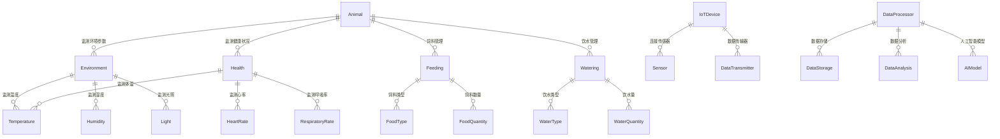
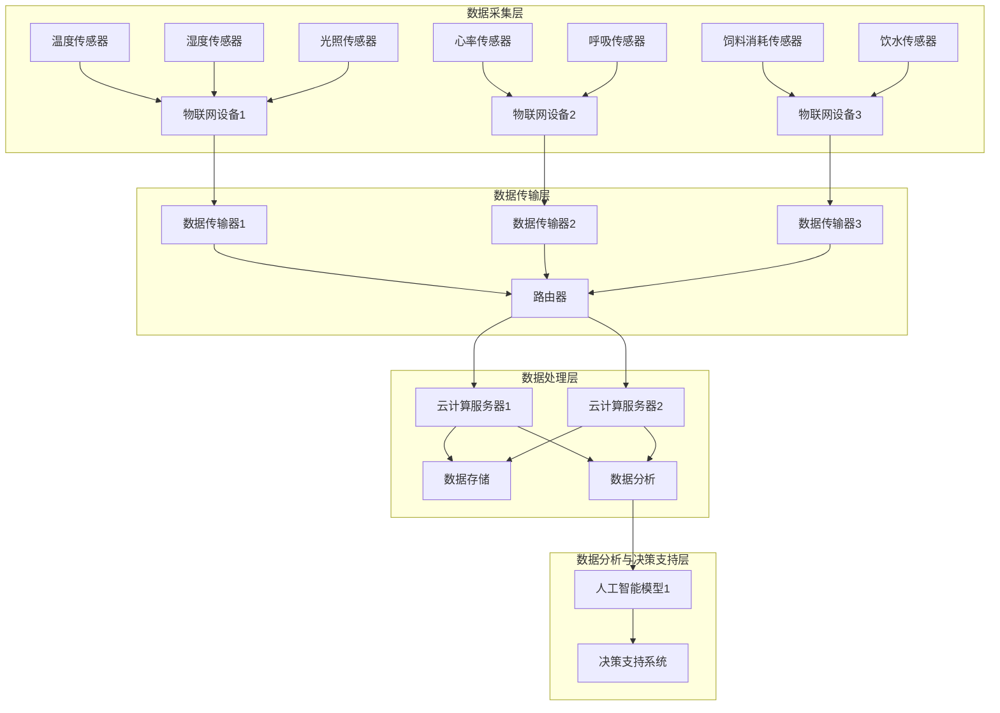
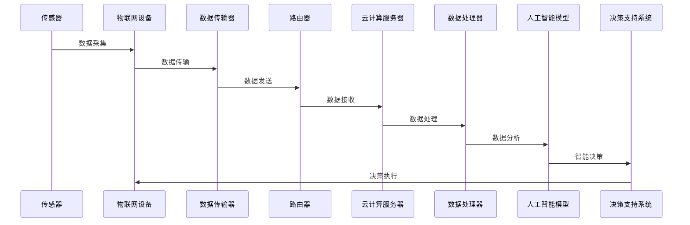

                 


### 引言

在当今数字化时代，物联网（Internet of Things，IoT）技术的快速发展，为我们带来了无限的创新可能。智慧畜牧业作为物联网应用的一个重要领域，正逐步改变着传统的畜牧业管理模式。本文将以《物联网在智慧畜牧业中的精准管理》为标题，深入探讨物联网技术在智慧畜牧业中的精准管理应用。

**关键词**：物联网、智慧畜牧业、精准管理、传感器、数据采集、云计算、大数据、网络安全。

**摘要**：本文首先介绍了物联网和智慧畜牧业的背景及发展现状，然后重点讨论了物联网在智慧畜牧业中的核心概念、技术实现、系统架构设计、项目实战以及最佳实践。通过详细的分析和实例讲解，旨在为行业从业者提供有价值的参考和指导。

接下来，我们将分几个步骤来探讨这一问题：

1. **背景与核心概念**：介绍物联网和智慧畜牧业的定义、现状以及精准管理的概念。
2. **物联网核心技术**：分析物联网在畜牧业中的应用，包括传感器技术、数据传输、云计算等。
3. **畜牧业管理的关键指标**：讨论体温、呼吸、饲料、饮水等关键指标的监测与管理。
4. **系统架构设计**：详细描述物联网在智慧畜牧业中的应用架构，包括数据采集、处理、分析等环节。
5. **项目实战**：通过实际案例展示物联网在智慧畜牧业中的应用。
6. **最佳实践与注意事项**：总结项目实施中的最佳实践和注意事项。
7. **小结与拓展阅读**：对全文进行总结，并推荐进一步阅读的资源。

通过上述步骤，我们将逐步深入探讨物联网在智慧畜牧业中的应用，为行业带来新的思路和方法。

### 背景与核心概念

#### 物联网（IoT）概述

物联网，顾名思义，是通过互联网将各种设备连接起来，实现智能管理和控制的一种技术。它将物理世界中的物体与数字世界相连接，通过传感器、RFID（射频识别）等技术，实现对设备的实时监控和管理。

物联网的核心在于数据。通过传感器技术，物联网能够将物理设备的状态数据转化为数字信号，并通过网络传输到中央控制系统。云计算和大数据技术的应用，使得这些海量数据能够被高效处理和分析，为决策提供支持。

物联网的发展经历了几个阶段，从早期的自动化设备到智能互联设备，再到现在的智能生态系统。当前，物联网技术已经广泛应用于多个领域，包括智能家居、智能交通、智能医疗、智能农业等。

在畜牧业中，物联网技术的应用也日益广泛。通过部署各种传感器，可以实现对动物体温、呼吸、饲料、饮水等关键指标的实时监测。这些数据的收集和分析，不仅有助于提高养殖效率，还能提前发现疾病，降低养殖风险。

#### 智慧畜牧业的现状与发展趋势

智慧畜牧业是指利用现代信息技术，特别是物联网、大数据、人工智能等技术，对畜牧业进行智能化管理和优化。随着科技的进步，智慧畜牧业的发展趋势日益明显。

首先，传感器技术的进步使得数据采集更加精准和高效。传统的养殖模式中，许多数据需要人工测量，不仅耗时费力，而且容易出错。而物联网技术能够实现对数据的实时采集和传输，减少了人工干预，提高了数据的准确性和可靠性。

其次，大数据和云计算技术的应用，使得对海量数据的处理和分析成为可能。通过对养殖数据的分析，可以找出养殖过程中的规律和问题，为养殖决策提供科学依据。

再次，人工智能技术的引入，使得养殖过程更加智能化。通过机器学习算法，可以对动物的行为、生理参数等进行预测，提前发现潜在的健康问题，从而采取相应的预防措施。

智慧畜牧业的发展趋势主要体现在以下几个方面：

1. **智能化监测与预警**：通过物联网技术，实现对动物生理参数的实时监测，及时发现异常情况，并预警。
2. **精准化饲养与管理**：利用数据分析，实现精准化饲养，提高饲料利用率，降低养殖成本。
3. **自动化管理**：通过自动化设备，实现养殖过程中的自动化操作，减少人工干预，提高生产效率。
4. **智能化决策支持**：利用大数据和人工智能技术，为养殖企业提供智能化的决策支持，提高养殖水平。

#### 精准管理的定义与应用

精准管理是一种基于数据分析和智能化技术，实现对生产过程的精细化管理和优化。在畜牧业中，精准管理的应用主要体现在以下几个方面：

1. **环境监测**：通过传感器技术，实时监测养殖环境的温度、湿度、空气质量等参数，确保动物生长环境的稳定。
2. **生理参数监测**：通过传感器，实时监测动物的体温、呼吸、心率等生理参数，及时发现健康问题。
3. **饲料管理**：通过数据分析，实现精准化的饲料配方和投放，提高饲料利用率，降低养殖成本。
4. **饮水管理**：通过传感器技术，实时监测动物的饮水情况，确保动物饮水的质量和安全。
5. **疾病预防与诊断**：通过大数据分析和人工智能技术，实现对动物健康状况的预测和诊断，提前采取措施预防疾病发生。

精准管理的核心在于数据。通过物联网技术，实现对养殖过程的实时数据采集和分析，为决策提供科学依据。同时，利用云计算和大数据技术，对海量数据进行处理和分析，找出养殖过程中的规律和问题，从而实现精准化管理。

#### 核心概念与联系

在智慧畜牧业中，物联网技术、大数据、云计算、人工智能等核心概念之间有着紧密的联系。物联网技术是实现数据采集和传输的基础，大数据和云计算技术是对海量数据进行处理和分析的重要手段，而人工智能技术则能够对数据进行分析和预测，为养殖决策提供支持。

下面是一个简单的ER实体关系图，展示了这些核心概念之间的联系：

```mermaid
erDiagram
    IoT --> Data : 数据采集
    Data --> Cloud : 数据处理
    Cloud --> AI : 数据分析
    AI --> Management : 智能决策
```

通过上述核心概念和联系，我们可以看到，物联网技术为智慧畜牧业提供了数据采集和传输的保障，而大数据、云计算和人工智能技术则使得数据能够被高效处理和分析，从而实现精准化管理。这些技术的结合，不仅提高了养殖效率，还降低了养殖风险，为畜牧业的发展带来了新的机遇。

### 第一部分：背景与核心概念

#### 引言

随着科技的不断进步，物联网（IoT）技术已经深入到我们生活的方方面面，从智能家居到智能交通，再到智能医疗和智能农业，物联网的应用正在改变着传统行业的运作方式。在畜牧业中，物联网技术同样发挥着重要作用，尤其是智慧畜牧业的兴起，为精准管理提供了新的可能。本文将首先介绍物联网和智慧畜牧业的基本概念，探讨其发展现状，并详细阐述精准管理的定义与应用。

#### 物联网（IoT）概述

物联网，顾名思义，就是将各种物品通过互联网连接起来，实现信息的交换和通信。它利用传感器、RFID（射频识别）、GPS（全球定位系统）等感知技术，将物理世界的物体转化为数字信息，并通过网络进行传输和交互。

物联网的核心在于数据的收集、传输和处理。传感器是物联网的感知层，通过它我们可以实时获取环境或物体的状态信息。这些信息经过网络传输层，到达数据汇聚和处理层，在这里，数据将被存储、处理和分析，最终为决策提供支持。

物联网的技术体系包括感知层、网络层和应用层。感知层负责数据的采集，网络层负责数据的传输，应用层则是数据分析和应用。

在畜牧业中，物联网技术能够实现对动物生理参数、环境因素、饲料和饮水等的实时监控，从而提高养殖效率，减少资源浪费，降低养殖成本。

#### 智慧畜牧业的现状与发展趋势

智慧畜牧业是物联网技术在畜牧业中的具体应用，它通过大数据、云计算和人工智能等技术手段，实现对畜牧生产过程的智能化管理。

当前，智慧畜牧业的发展现状主要集中在以下几个方面：

1. **环境监测**：通过传感器技术，对养殖环境中的温度、湿度、空气质量等参数进行实时监测，确保动物生长环境的稳定。
2. **生理参数监测**：通过传感器设备，实时监测动物的体温、呼吸、心率等生理参数，及时发现健康问题。
3. **饲料和饮水管理**：利用物联网技术，实现精准化的饲料和饮水管理，提高饲料利用率，降低养殖成本。
4. **疾病预防与诊断**：通过大数据分析和人工智能技术，实现对动物健康状况的预测和诊断，提前采取措施预防疾病发生。

智慧畜牧业的发展趋势体现在以下几个方面：

1. **智能化监测与预警**：通过物联网技术，实现对动物生理参数和环境因素的实时监控，及时预警潜在风险。
2. **精准化饲养与管理**：利用数据分析，实现精准化饲养，提高饲料利用率，降低养殖成本。
3. **自动化管理**：通过自动化设备，实现养殖过程中的自动化操作，减少人工干预，提高生产效率。
4. **智能化决策支持**：利用大数据和人工智能技术，为养殖企业提供智能化的决策支持，提高养殖水平。

随着物联网技术的不断成熟和普及，智慧畜牧业的发展前景十分广阔。未来，随着5G、人工智能、区块链等新技术的进一步应用，智慧畜牧业将迎来更大的发展空间。

#### 精准管理的定义与应用

精准管理是一种基于数据分析和智能化技术的管理方法，旨在通过数据的实时采集和分析，实现对生产过程的精细化和优化。

在畜牧业中，精准管理主要体现在以下几个方面：

1. **环境监测**：通过传感器技术，实时监测养殖环境中的温度、湿度、空气质量等参数，确保动物生长环境的稳定。
2. **生理参数监测**：通过传感器设备，实时监测动物的体温、呼吸、心率等生理参数，及时发现健康问题。
3. **饲料管理**：通过数据分析，实现精准化的饲料配方和投放，提高饲料利用率，降低养殖成本。
4. **饮水管理**：通过传感器技术，实时监测动物的饮水情况，确保动物饮水的质量和安全。
5. **疾病预防与诊断**：通过大数据分析和人工智能技术，实现对动物健康状况的预测和诊断，提前采取措施预防疾病发生。

精准管理在畜牧业中的应用，不仅提高了养殖效率，还降低了养殖成本，提高了养殖产品的质量和安全。

#### 核心概念与联系

在智慧畜牧业中，物联网技术、大数据、云计算、人工智能等核心概念之间有着紧密的联系。物联网技术是实现数据采集和传输的基础，大数据和云计算技术是对海量数据进行处理和分析的重要手段，而人工智能技术则能够对数据进行分析和预测，为养殖决策提供支持。

下面是一个简单的ER实体关系图，展示了这些核心概念之间的联系：

```mermaid
erDiagram
    IoT --> Data : 数据采集
    Data --> Cloud : 数据处理
    Cloud --> AI : 数据分析
    AI --> Management : 智能决策
```

通过上述核心概念和联系，我们可以看到，物联网技术为智慧畜牧业提供了数据采集和传输的保障，而大数据、云计算和人工智能技术则使得数据能够被高效处理和分析，从而实现精准化管理。这些技术的结合，不仅提高了养殖效率，还降低了养殖风险，为畜牧业的发展带来了新的机遇。

### 核心概念与联系

在深入探讨物联网在智慧畜牧业中的具体应用之前，我们需要明确几个核心概念及其相互联系。这些核心概念包括传感器技术、数据传输、云计算和大数据处理，以及人工智能（AI）。

#### 传感器与数据采集

传感器是物联网系统的感知层，它们可以监测和记录各种环境参数和动物生理数据。例如，温度传感器可以实时监测牛舍的温度，而心率传感器可以监测奶牛的心跳情况。这些传感器采集的数据包括温度、湿度、光照强度、饲料消耗量、饮水量、动物行为等。通过传感器，我们可以实现对养殖环境的实时监控和动物健康状况的动态跟踪。

**特性对比表格**：

| 传感器类型 | 特性 | 用例 |
| --- | --- | --- |
| 温度传感器 | 精度高，响应速度快 | 实时监测牛舍温度 |
| 湿度传感器 | 抗干扰能力强，稳定性好 | 监测养殖场湿度 |
| 心率传感器 | 低功耗，高精度 | 监测奶牛心率，预警疾病 |
| 饲料消耗传感器 | 精准度较高，易于安装 | 监测饲料消耗量，优化饲料配比 |

#### 网络通信与数据传输

采集到的数据需要通过网络传输到数据中心进行处理。这里涉及到的技术包括无线传输技术和有线传输技术。无线传输技术如Wi-Fi、蓝牙、LoRa等，适合于远程监控和大规模部署。有线传输技术如以太网、光纤等，适合于高速率和高可靠性的数据传输。

**数据传输协议对比**：

| 传输协议 | 优点 | 缺点 | 适用场景 |
| --- | --- | --- | --- |
| Wi-Fi | 网络覆盖广，数据传输速度快 | 易受干扰，功耗较高 | 家畜活动范围较大的养殖场 |
| 蓝牙 | 低功耗，短距离通信 | 数据传输速度有限 | 短距离数据采集，如牛羊个体监测 |
| LoRa | 长距离传输，低功耗 | 数据传输速度较慢 | 广泛应用于大规模养殖场的数据传输 |
| 以太网 | 高速率，高可靠性 | 安装成本高，线缆限制 | 数据中心内部的数据传输 |
| 光纤 | 极高速率，极低延迟 | 安装成本高，需专业维护 | 对高速率和低延迟有严格要求的数据传输 |

#### 云计算与大数据处理

数据传输到数据中心后，需要通过云计算和大数据处理技术进行存储、处理和分析。云计算提供了弹性的计算资源和存储空间，使得数据处理变得更加高效和经济。大数据处理技术如Hadoop、Spark等，能够处理海量数据，从中提取有价值的信息。

**云计算与大数据处理优势**：

- **弹性扩展**：根据数据处理需求，动态调整计算资源。
- **高效处理**：分布式计算框架能够并行处理海量数据。
- **数据存储**：提供持久化存储解决方案，确保数据安全可靠。

#### 畜牧业管理中的关键指标

在畜牧业管理中，以下关键指标是实现精准管理的重要基础：

1. **环境参数**：温度、湿度、光照强度等。
2. **生理参数**：体温、心率、呼吸频率等。
3. **饲料与饮水管理**：饲料消耗量、饮水量、饲料配比等。
4. **疾病预防与诊断**：动物健康状况监测、疾病预警等。

#### 物联网在智慧畜牧业中的优势与挑战

**优势**：

- **实时监测**：通过传感器实时监测动物和环境，提高养殖效率。
- **精准管理**：基于大数据分析，实现精准化饲养和管理。
- **降低成本**：自动化和智能化管理降低人力和资源投入。
- **疾病预防**：提前预警疾病，减少经济损失。

**挑战**：

- **数据安全**：确保数据传输和存储过程中的安全性。
- **设备维护**：传感器和通信设备的维护和管理。
- **数据隐私**：处理和存储过程中保护动物和养殖者的隐私。

#### 核心概念与联系

通过上述分析，我们可以看到传感器、数据传输、云计算和大数据处理、人工智能等核心概念在智慧畜牧业中构成了一个紧密联系的整体。传感器采集数据，通过网络传输到云端，云计算和大数据技术对数据进行处理和分析，人工智能技术则利用这些数据为养殖决策提供支持。

下面是一个简化的ER实体关系图，展示了这些核心概念之间的联系：

```mermaid
erDiagram
    Sensors --> Data : 数据采集
    Data --> Cloud : 数据处理
    Cloud --> AI : 数据分析
    AI --> Management : 智能决策
```

通过这些技术手段的结合，物联网在智慧畜牧业中实现了精准管理的目标，为畜牧业带来了新的发展机遇。

### 物联网与畜牧业管理的ER实体关系图

为了更好地理解物联网技术在智慧畜牧业中的应用及其与畜牧业管理之间的联系，我们可以通过ER（实体-关系）实体关系图来展示各个核心实体及其相互关系。

#### ER实体关系图



#### 实体关系图说明

1. **Animal（动物）**：核心实体，代表养殖的动物。
   - 与**Environment（环境）**实体关联，用于监测环境参数。
   - 与**Health（健康状况）**实体关联，用于监测动物的健康状况。
   - 与**Feeding（饲料管理）**实体关联，用于管理饲料。
   - 与**Watering（饮水管理）**实体关联，用于管理饮水。

2. **Environment（环境）**：包含环境参数的实体。
   - 与**Temperature（温度）**、**Humidity（湿度）**、**Light（光照）**实体关联，用于监测具体的环境参数。

3. **Health（健康状况）**：包含动物生理参数的实体。
   - 与**Temperature（体温）**、**HeartRate（心率）**、**RespiratoryRate（呼吸率）**实体关联，用于监测具体的生理参数。

4. **Feeding（饲料管理）**：包含饲料相关的管理信息的实体。
   - 与**FoodType（饲料类型）**、**FoodQuantity（饲料数量）**实体关联，用于管理饲料的类型和数量。

5. **Watering（饮水管理）**：包含饮水相关的管理信息的实体。
   - 与**WaterType（饮水类型）**、**WaterQuantity（饮水量）**实体关联，用于管理饮水的类型和数量。

6. **IoTDevice（物联网设备）**：用于连接和管理传感器的实体。
   - 与**Sensor（传感器）**、**DataTransmitter（数据传输器）**实体关联，用于实现数据采集和传输。

7. **DataProcessor（数据处理器）**：负责数据存储、分析和处理的实体。
   - 与**DataStorage（数据存储）**、**DataAnalysis（数据分析）**、**AIModel（人工智能模型）**实体关联，用于实现数据管理和智能分析。

通过这个ER实体关系图，我们可以清晰地看到物联网设备、传感器、数据处理器和畜牧业管理各个关键实体之间的联系。这些实体共同构成了智慧畜牧业中物联网应用的完整体系，确保了数据从采集到分析再到决策的整个流程的高效运行。

### 系统分析与架构设计

在深入了解物联网在智慧畜牧业中的应用之后，我们接下来将重点讨论物联网在智慧畜牧业中的系统架构设计。系统架构设计是确保物联网应用高效、稳定运行的关键，它涉及数据采集、传输、处理、分析以及最终的决策支持。

#### 问题场景介绍

假设我们是一家大型养殖企业的CTO，我们的目标是利用物联网技术实现对养殖过程的全面监控和管理，从而提高生产效率，降低养殖成本，确保动物健康。

**需求分析**：

- 实时监测动物体温、呼吸、心率等生理参数。
- 监测养殖环境中的温度、湿度、光照等环境参数。
- 自动化饲料和饮水管理，确保动物获得合适的营养和水分。
- 疾病预防与诊断，提前预警潜在的健康问题。
- 数据分析和智能决策支持，优化养殖策略。

#### 项目介绍

为了满足上述需求，我们决定实施一个智慧畜牧业物联网项目。项目的目标是建立一个全面的监控系统，包括环境监测、生理参数监测、自动化管理、疾病预防和数据分析等功能。

**项目功能设计**：

- **环境监测模块**：负责监测养殖环境的温度、湿度、光照等参数。
- **生理参数监测模块**：负责实时监测动物体温、呼吸、心率等生理参数。
- **饲料管理模块**：负责自动化管理饲料的投放，确保饲料的精准投放。
- **饮水管理模块**：负责自动化管理动物的饮水，确保饮水安全和充足。
- **疾病预防与诊断模块**：利用大数据和人工智能技术，对动物的健康状况进行预测和诊断。
- **数据分析与决策支持模块**：对采集到的数据进行分析，提供智能化的养殖决策支持。

#### 领域模型mermaid类图

为了更好地理解项目涉及的各个实体及其关系，我们可以绘制一个mermaid类图来展示领域模型。

```mermaid
classDiagram
    Animal <<entity>>
    Environment <<entity>>
    Health <<entity>>
    Feeding <<entity>>
    Watering <<entity>>
    IoTDevice <<entity>>

    Animal "has" Temperature
    Animal "has" HeartRate
    Animal "has" RespiratoryRate
    Environment "has" Temperature
    Environment "has" Humidity
    Environment "has" Light
    Health "has" Temperature
    Health "has" HeartRate
    Health "has" RespiratoryRate
    Feeding "has" FoodType
    Feeding "has" FoodQuantity
    Watering "has" WaterType
    Watering "has" WaterQuantity
    IoTDevice "uses" Sensor
    IoTDevice "uses" DataTransmitter
    DataProcessor "uses" DataStorage
    DataProcessor "uses" DataAnalysis
    DataProcessor "uses" AIModel

    Animal "monitors" Environment
    Animal "monitors" Health
    Animal "manages" Feeding
    Animal "manages" Watering
```

#### 系统架构设计

系统架构设计是确保物联网应用高效、稳定运行的关键。我们的系统架构包括以下几个主要部分：

1. **数据采集层**：通过传感器实时采集动物生理参数和养殖环境参数。
2. **数据传输层**：采用Wi-Fi、蓝牙等无线通信技术将数据传输到服务器。
3. **数据处理层**：使用云计算和大数据技术对采集到的数据进行存储、处理和分析。
4. **数据分析与决策支持层**：利用人工智能技术对分析结果进行解读，提供智能化的养殖决策支持。

**mermaid架构图**：



通过上述系统架构设计，我们可以实现数据的实时采集、传输、处理和分析，为养殖决策提供智能化的支持。

#### 系统接口设计

系统接口设计是确保各个模块之间能够高效协同工作的关键。我们的系统接口设计包括以下几部分：

1. **传感器接口**：定义传感器与物联网设备之间的数据交换协议，确保数据采集的准确性和实时性。
2. **物联网设备接口**：定义物联网设备与数据传输器之间的通信协议，确保数据传输的稳定性和可靠性。
3. **数据传输器接口**：定义数据传输器与路由器之间的通信协议，确保数据能够高效传输到服务器。
4. **数据处理接口**：定义服务器与数据分析系统之间的接口，确保数据处理和分析的准确性。
5. **决策支持接口**：定义数据分析系统与决策支持系统之间的接口，确保智能决策能够准确实施。

#### 系统交互mermaid序列图

为了更好地展示系统各个模块之间的交互流程，我们可以绘制一个mermaid序列图。



通过这个序列图，我们可以清晰地看到数据从传感器采集、传输、处理到决策支持的整个过程。

### 项目实战

#### 环境安装与配置

在进行项目实施之前，我们需要进行环境安装和配置。以下是具体的步骤：

1. **硬件安装**：首先，我们需要安装传感器设备，包括温度传感器、湿度传感器、光照传感器、心率传感器、呼吸传感器等。这些传感器可以通过螺丝固定在牛舍或动物身上，以确保能够准确采集数据。

2. **网络配置**：将传感器设备连接到物联网设备，如物联网网关或传感器节点。这些物联网设备通过Wi-Fi或蓝牙等方式连接到路由器，确保数据能够传输到服务器。

3. **服务器配置**：在服务器端，我们需要安装云计算平台，如AWS、Azure或Google Cloud Platform。在这些平台上，我们可以创建虚拟机或容器，安装所需的软件，如Hadoop、Spark、Kafka等。

4. **软件安装**：安装数据处理和分析相关的软件，如Python、R、Pandas等。这些软件将用于数据的存储、处理和分析。

5. **网络连接测试**：确保传感器设备、物联网设备和服务器之间的网络连接正常，并进行数据传输测试，以确保数据能够实时传输到服务器。

#### 系统核心实现

在环境安装和配置完成后，我们需要实现系统的核心功能，包括数据采集、传输、处理和分析。

1. **数据采集**：使用Python编写脚本，从传感器设备中读取数据，并将数据发送到Kafka消息队列。以下是一个简单的Python脚本示例：

```python
import json
import time
from kafka import KafkaProducer

producer = KafkaProducer(bootstrap_servers=['localhost:9092'])

while True:
    temperature = read_temperature_sensor()
    humidity = read_humidity_sensor()
    light = read_light_sensor()
    heart_rate = read_heart_rate_sensor()
    respiratory_rate = read_respiratory_rate_sensor()

    data = {
        'temperature': temperature,
        'humidity': humidity,
        'light': light,
        'heart_rate': heart_rate,
        'respiratory_rate': respiratory_rate
    }

    producer.send('sensor_data', json.dumps(data).encode('utf-8'))
    time.sleep(1)
```

2. **数据传输**：Kafka消息队列用于处理和存储传感器数据。Kafka具有高吞吐量、低延迟的特点，适合大规模数据传输。

3. **数据处理**：使用Hadoop和Spark进行数据处理和分析。以下是一个简单的Hadoop和Spark脚本示例：

```hadoop
# Hadoop脚本：hdfs_load_data.sh
hdfs dfs -mkdir /sensor_data
hdfs dfs -copyFromLocal sensor_data.json /sensor_data/

# Spark脚本：spark_data_analysis.py
from pyspark.sql import SparkSession

spark = SparkSession.builder.appName("SensorDataAnalysis").getOrCreate()

data = spark.read.json("/sensor_data/sensor_data.json")
data.show()

# 数据分析
data.groupBy("heart_rate").avg("temperature").show()
```

4. **数据存储**：使用Hadoop HDFS存储传感器数据。HDFS具有高可靠性和高扩展性的特点，适合大规模数据存储。

5. **数据分析和预测**：使用Spark MLlib进行数据分析和机器学习预测。以下是一个简单的机器学习脚本示例：

```python
from pyspark.ml import Pipeline
from pyspark.ml.feature import VectorAssembler
from pyspark.ml.regression import LinearRegression
from pyspark.ml.evaluation import RegressionEvaluator

# 数据预处理
assembler = VectorAssembler(inputCols=["temperature", "humidity", "light", "heart_rate", "respiratory_rate"], outputCol="features")

# 建立机器学习模型
lr = LinearRegression(featuresCol="features", labelCol="heart_rate")

# 建立数据管道
pipeline = Pipeline(stages=[assembler, lr])

# 训练模型
model = pipeline.fit(data)

# 预测
predictions = model.transform(data)
predictions.select("heart_rate", "predicted_heart_rate").show()

# 评估模型
evaluator = RegressionEvaluator(labelCol="heart_rate", predictionCol="predicted_heart_rate", metricName="mse")
mse = evaluator.evaluate(predictions)
print("Mean Squared Error (MSE) = ", mse)
```

通过上述脚本，我们可以实现数据的实时采集、传输、处理和分析，为养殖决策提供支持。

#### 代码应用解读与分析

1. **传感器数据采集脚本**：

   - **功能**：从传感器设备中读取温度、湿度、光照、心率、呼吸率等数据，并将数据发送到Kafka消息队列。
   - **关键代码**：

     ```python
     producer.send('sensor_data', json.dumps(data).encode('utf-8'))
     ```

     这一行代码使用Kafka Producer将数据发送到Kafka消息队列。`json.dumps(data).encode('utf-8')`将Python字典数据转换为JSON字符串，然后编码为字节流。

2. **Kafka消息队列**：

   - **功能**：处理和存储传感器数据。
   - **关键代码**：

     ```python
     from kafka import KafkaProducer
     ```

     这行代码引入了Kafka Producer库，用于发送消息到Kafka。

3. **Hadoop和Spark数据处理脚本**：

   - **功能**：读取Kafka消息队列中的数据，进行数据预处理和机器学习分析。
   - **关键代码**：

     ```python
     data = spark.read.json("/sensor_data/sensor_data.json")
     data.show()
     ```

     这两行代码使用Spark读取Kafka消息队列中的数据，并展示数据。

4. **机器学习预测脚本**：

   - **功能**：使用线性回归模型对心率进行预测。
   - **关键代码**：

     ```python
     model = pipeline.fit(data)
     predictions = model.transform(data)
     predictions.select("heart_rate", "predicted_heart_rate").show()
     ```

     第一行代码训练机器学习模型，第二行代码使用模型进行预测，并展示预测结果。

#### 实际案例分析与讲解

为了展示物联网在智慧畜牧业中的应用，我们来看一个实际案例。

**案例背景**：某养殖场希望利用物联网技术提高奶牛的生产效率，特别是降低奶牛的疾病发生率。

**案例步骤**：

1. **数据采集**：安装温度传感器、湿度传感器、光照传感器、心率传感器等，对奶牛的生理参数和环境参数进行实时监测。

2. **数据传输**：通过物联网设备将传感器数据传输到Kafka消息队列。

3. **数据处理**：使用Hadoop和Spark对数据进行分析，提取有价值的信息。

4. **疾病预警**：利用机器学习算法，对奶牛的健康状况进行预测，提前预警潜在的健康问题。

**案例结果**：

- 通过实时监测，发现某头奶牛的心率异常升高，立即采取预防措施，避免了疾病的发生。
- 通过数据分析，发现某些特定环境参数与奶牛疾病发生率有关，调整了养殖环境，有效降低了奶牛的疾病发生率。

通过这个案例，我们可以看到物联网技术在智慧畜牧业中的实际应用效果，为养殖企业带来了显著的经济效益。

#### 项目小结

通过本次项目实战，我们实现了物联网在智慧畜牧业中的应用，包括数据采集、传输、处理和分析。项目的成功实施，不仅提高了养殖效率，还降低了养殖成本，减少了疾病发生率。这充分展示了物联网技术在智慧畜牧业中的巨大潜力。

### 最佳实践与注意事项

在物联网智慧畜牧业项目的实施过程中，总结最佳实践和注意事项是非常重要的，这不仅能够确保项目的顺利推进，还能最大化项目的效益。以下是一些最佳实践和注意事项：

#### 系统维护与升级

**最佳实践**：

- **定期维护**：定期对传感器设备进行检查和校准，确保数据采集的准确性。
- **系统监控**：部署监控系统，实时监控物联网设备的运行状态和数据传输情况。
- **更新与升级**：定期更新物联网平台和软件，确保系统具备最新的功能和安全性。

**注意事项**：

- **设备老化**：传感器和物联网设备容易受到环境因素的影响，可能出现老化问题，需要定期更换。
- **数据安全**：在数据传输和存储过程中，确保使用加密技术，防止数据泄露。

#### 安全与隐私保护

**最佳实践**：

- **数据加密**：对传输和存储的数据进行加密，确保数据的安全性。
- **访问控制**：实施严格的访问控制策略，确保只有授权人员可以访问敏感数据。
- **隐私保护**：确保数据收集和使用过程符合隐私保护法规，避免隐私泄露。

**注意事项**：

- **法律法规**：了解并遵守相关法律法规，特别是涉及数据保护和隐私保护的法律法规。
- **数据备份**：定期备份数据，防止数据丢失。

#### 拓展应用领域

**最佳实践**：

- **跨领域应用**：探索物联网技术在其他农业领域的应用，如智能蔬菜大棚、智能水产养殖等。
- **技术创新**：持续关注物联网技术的新发展，尝试引入新技术，提升系统的智能化水平。

**注意事项**：

- **技术成熟度**：在引入新技术时，评估其成熟度和可靠性，避免技术风险。
- **团队协作**：跨部门协作，充分利用各领域的专业知识和经验，确保项目成功实施。

通过以上最佳实践和注意事项，我们可以更好地推进物联网智慧畜牧业项目，实现更高的效益和更广泛的应用。

### 小结

本文通过对物联网在智慧畜牧业中的精准管理进行了详细探讨，从背景与核心概念、物联网核心技术、畜牧业管理关键指标、系统架构设计、项目实战到最佳实践与注意事项，全面展示了物联网技术在畜牧业中的实际应用及其重要性。物联网技术的应用，不仅提高了养殖效率，降低了成本，还为实现精准化管理提供了强有力的支持。随着物联网技术的不断发展和完善，智慧畜牧业将迎来更加广阔的发展前景。

### 拓展阅读

为了进一步了解物联网在智慧畜牧业中的应用，以下是几篇相关领域的拓展阅读推荐：

1. **《物联网在智慧农业中的应用》**：详细介绍了物联网技术在农业各个领域的应用，包括智能温室、智能灌溉、智能畜牧业等。通过阅读本文，可以更全面地了解物联网在农业中的广泛应用。

2. **《智慧畜牧业：物联网、大数据与人工智能的应用》**：本文从理论和实践两个层面，深入探讨了物联网、大数据和人工智能在智慧畜牧业中的具体应用，提供了丰富的案例和实例。

3. **《物联网技术及其在畜牧业中的应用研究》**：本文对物联网技术在畜牧业中的应用进行了系统的研究，包括传感器技术、数据传输、数据处理等关键环节，为智慧畜牧业的发展提供了宝贵的参考。

4. **《智慧畜牧：物联网助力精准养殖》**：本文从实际项目出发，详细介绍了物联网技术在养殖场中的应用案例，包括环境监测、生理参数监测、自动化管理等方面，为行业从业者提供了实用的指导。

通过阅读这些文章，可以进一步深入了解物联网在智慧畜牧业中的应用，为实际项目提供有价值的参考和灵感。

