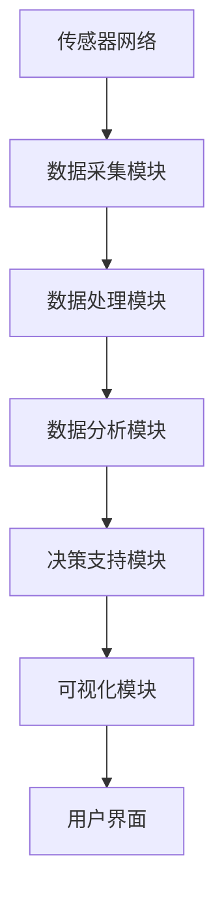
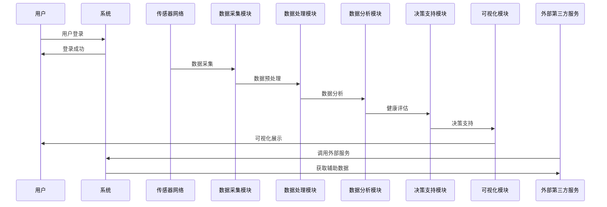

                 

### 1.1.1 物联网技术概述

#### 1.1.1.1 物联网的定义与基本原理

**物联网（IoT，Internet of Things）** 是一种通过网络连接各种设备，使它们能够互相通信和交换数据的技术。物联网的核心在于“连接”，通过互联网、无线网络、局域网等方式，将各种物理设备、传感器、控制系统连接起来，实现数据的实时采集、传输和分析。

**物联网的基本原理** 可以简单概括为以下几个步骤：

1. **设备感知**：通过传感器、RFID（射频识别）等技术，将物理世界的状态（如温度、湿度、位置等）转化为数字信号。
2. **数据传输**：利用无线网络、互联网等通信技术，将采集到的数据传输到数据中心或服务器。
3. **数据处理**：在数据中心或服务器对传输过来的数据进行处理、分析和存储。
4. **决策与控制**：根据分析结果，通过控制系统对设备进行远程控制或调整。

物联网的发展历程可以追溯到20世纪80年代，当时的一些实验性项目已经开始探索将网络连接到物理世界。随着互联网和无线通信技术的不断发展，物联网逐渐成为一种主流技术，应用领域也从最初的家庭自动化、工业自动化，扩展到了智慧城市、智能交通、智能农业、智慧医疗等多个方面。

**物联网的关键技术** 包括：

- **传感器技术**：用于感知物理世界状态，并将物理信号转换为电信号。
- **无线通信技术**：如Wi-Fi、蓝牙、Zigbee、LoRa等，用于传输数据。
- **数据处理技术**：包括数据清洗、数据存储、数据分析等。
- **云计算和大数据技术**：用于大规模数据的存储、处理和分析。
- **边缘计算技术**：将数据处理和存储任务分布到网络边缘，以降低延迟和提高响应速度。

物联网技术的发展不仅带来了技术革新，也对人类生活方式和社会结构产生了深远影响。它使得人们可以更加便捷地获取和使用信息，提高了资源利用效率，促进了社会生产力的发展。

#### 1.1.1.2 智慧畜牧业的定义和意义

**智慧畜牧业** 是指利用物联网、大数据、云计算、人工智能等现代信息技术，对畜牧业生产过程进行智能化管理，以提高生产效率、降低成本、保障食品安全和质量的一种新型畜牧业模式。

**智慧畜牧业的意义** 主要体现在以下几个方面：

1. **提高生产效率**：通过物联网设备对动物的行为、饮食、健康状态等进行实时监测，可以及时发现并处理问题，避免因疾病等原因导致的生产停滞。

2. **优化资源利用**：通过对养殖环境的智能化管理，如温湿度控制、饲料精准投放等，可以实现资源的最大化利用，降低养殖成本。

3. **提升产品质量**：通过数据分析和机器学习等技术，可以对动物的品种、饲料、养殖环境等进行优化，从而提高产品的质量和市场竞争力。

4. **保障食品安全**：通过对养殖、饲料、屠宰等环节的实时监控，可以确保食品从源头到餐桌的每一个环节都符合安全标准。

5. **促进可持续发展**：智慧畜牧业通过提高资源利用效率和减少废弃物排放，有助于实现畜牧业可持续发展。

智慧畜牧业的发展不仅有助于提升畜牧业的生产效率和质量，还能够推动农业现代化，促进农村经济发展和农民增收。

#### 1.1.1.3 健康监测在畜牧业中的作用

**健康监测** 在畜牧业中起着至关重要的作用，它是确保动物健康和生产安全的关键手段。健康监测的基本概念包括对动物生理参数的实时监测、疾病早期预警、环境参数的监控等。

**健康监测在畜牧业中的作用** 可以总结为以下几点：

1. **疾病预防**：通过实时监测动物的体温、心率、呼吸等生理参数，可以及时发现疾病的早期迹象，采取预防措施，避免疾病大规模爆发。

2. **提高生产效率**：健康的动物能够更好地生长和繁殖，提高养殖效益。通过健康监测，可以优化饲养管理，提高饲料转化率和动物生长速度。

3. **保障产品质量**：健康的动物生产出的产品品质更高，通过健康监测，可以确保动物在整个养殖过程中都处于良好的健康状态。

4. **降低经济损失**：及时发现并处理疾病，可以避免因疾病导致的大规模死亡和损失。

5. **优化养殖环境**：通过对环境的监控，如温湿度、空气质量等，可以及时发现并调整养殖环境，确保动物生活在一个舒适、健康的环境中。

健康监测在畜牧业中的应用范围非常广泛，涵盖了从动物出生到成年的整个生命周期。通过物联网技术，可以实现全天候、全方位的健康监测，大大提高了监测的准确性和效率。

#### 1.1.1.4 物联网在智慧畜牧业健康监测中的应用现状与挑战

物联网技术在智慧畜牧业健康监测中的应用已经取得了一定的进展，但同时也面临着诸多挑战。

**应用现状**：

1. **数据采集与传输**：通过传感器和物联网技术，可以实现对动物生理参数的实时采集和传输，为健康监测提供了数据支持。

2. **环境监控**：物联网技术可以实现对养殖环境的实时监控，如温度、湿度、空气质量等，为动物提供一个良好的生长环境。

3. **智能预警**：通过大数据分析和机器学习算法，可以实现对疾病早期预警，及时采取措施，避免疾病扩散。

4. **远程控制**：通过物联网技术，可以对养殖设备进行远程控制，如自动喂食、自动清洁等，提高养殖效率。

**面临的挑战**：

1. **数据安全**：由于物联网设备数量众多，数据传输过程中容易受到黑客攻击，确保数据安全是一个重要问题。

2. **数据隐私**：动物的健康数据属于个人隐私，如何保护这些数据不被非法获取和滥用，也是一个需要解决的问题。

3. **设备维护**：物联网设备需要在恶劣的环境下长期运行，设备维护和保养是保障系统稳定运行的关键。

4. **标准化**：目前物联网技术在畜牧业中的应用尚未形成统一的标准，不同厂家、不同设备的兼容性问题亟待解决。

总之，物联网在智慧畜牧业健康监测中的应用前景广阔，但同时也面临着一系列的挑战。随着技术的不断进步和标准化工作的推进，这些问题有望逐步得到解决。

### 1.2 核心概念与联系

#### 1.2.1 物联网技术的基本概念

**物联网技术** 是实现物联网功能的基础，它包括了传感器技术、无线通信技术、云计算技术、大数据技术等多个方面。

- **传感器技术**：传感器是物联网系统中的“感官器官”，用于感知物理世界的各种信息，如温度、湿度、光照、气体浓度等。传感器的性能直接影响到物联网系统的精度和可靠性。

- **无线通信技术**：无线通信技术是实现设备间数据传输的关键，常见的无线通信技术包括Wi-Fi、蓝牙、Zigbee、LoRa等。这些技术各有优缺点，适用于不同的应用场景。

- **云计算技术**：云计算提供了强大的计算和存储能力，可以处理海量的物联网数据。云计算平台通常提供数据存储、数据处理、机器学习等服务，为物联网应用提供支持。

- **大数据技术**：大数据技术用于处理和分析物联网生成的海量数据，包括数据采集、存储、清洗、分析等环节。通过大数据分析，可以从海量数据中提取有价值的信息，为决策提供支持。

- **边缘计算技术**：边缘计算是一种分布式计算架构，将数据处理任务分散到网络边缘，以降低延迟和提高响应速度。在物联网应用中，边缘计算可以处理部分实时数据，减轻云计算中心的负担。

#### 1.2.2 智慧畜牧业的关键技术

**智慧畜牧业** 是物联网技术在畜牧业中的应用，它依赖于一系列关键技术的支持。

- **传感器技术**：在智慧畜牧业中，传感器用于监测动物的生理参数（如体温、心率、呼吸等）、环境参数（如温度、湿度、光照等）和饲料消耗情况。传感器的分布和精度直接影响到健康监测的准确性和效率。

- **无线通信技术**：无线通信技术用于实现传感器数据的传输，确保数据能够及时、可靠地传输到云端或本地服务器。在智慧畜牧业中，常用的无线通信技术包括Wi-Fi、蓝牙、Zigbee等。

- **数据分析技术**：通过对传感器数据进行实时分析，可以实现对动物健康状况的实时监控和预警。数据分析技术包括数据预处理、特征提取、模式识别、机器学习等。

- **智能决策系统**：基于数据分析结果，智能决策系统可以自动调整养殖参数，如饲料投放量、环境控制等，以提高养殖效率和质量。

- **自动化控制系统**：自动化控制系统可以实现养殖设备的自动控制，如自动喂食、自动清洁、自动通风等，减少人工干预，提高养殖效率。

- **区块链技术**：区块链技术可以用于保障数据安全和透明性，确保养殖、饲料、屠宰等环节的数据不可篡改，增强消费者对食品安全的信任。

#### 1.2.3 健康监测系统的核心指标和参数

**健康监测系统的核心指标和参数** 是对动物健康状况进行评估的关键依据，这些指标和参数通常包括：

- **体温**：体温是判断动物健康状况的重要指标，过高或过低的体温都可能表明动物出现了健康问题。

- **心率**：心率反映了动物的新陈代谢水平，异常的心率可能是疾病的早期迹象。

- **呼吸频率**：呼吸频率的变化可以反映动物的肺部健康状况，对疾病的早期发现具有重要意义。

- **活动量**：通过监测动物的活动量，可以评估其活力和健康状态。

- **体重变化**：定期监测动物的体重变化，可以帮助判断其生长情况和健康状况。

- **饲料消耗量**：饲料消耗量可以反映动物的营养摄入情况，对饲料管理和营养调整提供依据。

- **环境参数**：包括温度、湿度、光照、空气质量等，这些参数直接影响到动物的健康和生活质量。

- **疾病症状**：通过监测动物的疾病症状，如咳嗽、打喷嚏、腹泻等，可以及时诊断和采取措施。

健康监测系统的核心指标和参数需要通过传感器进行实时监测，并将数据传输到数据中心进行进一步分析。通过综合分析这些指标和参数，可以实现对动物健康状况的全面监控和预测，提高养殖效率和产品质量。

#### 1.2.4 物联网技术在健康监测系统中的应用模式

**物联网技术在健康监测系统中的应用模式** 可以概括为以下几个关键环节：

1. **数据采集**：通过传感器网络实时采集动物生理参数、环境参数和活动数据，确保数据的高效、准确和实时性。

2. **数据传输**：利用无线通信技术，将采集到的数据传输到云端或本地服务器。数据传输过程中需要保证数据的安全性和可靠性。

3. **数据处理**：在云端或本地服务器对传输过来的数据进行预处理、存储、分析和挖掘，提取有价值的信息，为健康监测提供支持。

4. **健康评估**：通过机器学习和数据分析技术，对收集到的数据进行综合分析，评估动物的健康状况，及时发现潜在的健康风险。

5. **预警与决策**：根据健康评估结果，系统可以自动生成预警信息，并向养殖人员发出通知，同时提供优化养殖参数的建议，如饲料调整、环境控制等。

6. **远程监控**：通过物联网技术，养殖人员可以远程实时监控动物的健康状况，及时采取措施，确保动物的健康和安全。

7. **数据可视化**：利用数据可视化技术，将健康监测数据以图表、图形的形式展示，便于养殖人员直观地了解动物的健康状态。

**物联网技术在健康监测系统中的应用模式** 不仅提高了健康监测的效率和准确性，还为智能化养殖提供了有力支持，有助于提高生产效率、保障产品质量和实现养殖过程的可持续发展。

### 1.3 算法原理讲解

#### 1.3.1 常用传感器数据处理算法

**传感器数据处理算法** 是物联网技术中的一个重要组成部分，它用于处理从传感器收集到的原始数据，以提取有用信息并提高数据的准确性。以下是一些常用的传感器数据处理算法：

1. **数据预处理方法**：数据预处理是传感器数据处理的第一步，它包括去噪、滤波、归一化等操作。去噪算法如中值滤波、均值滤波等，用于消除传感器数据中的噪声。滤波算法如卡尔曼滤波、低通滤波等，用于平滑传感器数据，消除高频干扰。归一化算法如最小-最大归一化、零-均值归一化等，用于将传感器数据缩放到一个统一的范围内，便于后续处理。

2. **数据滤波算法**：滤波算法用于去除传感器数据中的随机噪声和趋势项。常见的滤波算法包括：

   - **卡尔曼滤波**：卡尔曼滤波是一种基于状态估计的滤波算法，它能够通过预测和更新步骤，对传感器数据进行最优估计。其基本原理是基于系统的状态方程和观测方程，通过最小化估计误差的平方和，得到最佳的状态估计。

     $$ x_{k+1} = A_k x_k + B_k u_k $$
     $$ z_k = H_k x_k + v_k $$
     其中，$x_k$ 为状态向量，$u_k$ 为控制输入，$z_k$ 为观测值，$A_k$、$B_k$、$H_k$ 分别为状态转移矩阵、控制矩阵和观测矩阵，$v_k$ 为观测噪声。

   - **低通滤波**：低通滤波用于保留信号中的低频成分，抑制高频噪声。其数学模型为：

     $$ y_k = (1 - \alpha) y_{k-1} + \alpha x_k $$
     其中，$y_k$ 为滤波后的输出，$x_k$ 为输入信号，$\alpha$ 为滤波系数。

3. **数据分析算法**：数据分析算法用于从传感器数据中提取有用的特征信息，为健康监测提供依据。常见的数据分析算法包括：

   - **特征提取**：特征提取是将高维传感器数据转换为低维特征向量，便于后续处理。常见的特征提取方法包括主成分分析（PCA）、线性判别分析（LDA）等。

   - **聚类分析**：聚类分析用于将相似的数据点归为一类，为健康监测提供分类依据。常见的聚类算法包括K-均值聚类、层次聚类等。

   - **分类算法**：分类算法用于对健康监测数据进行分类，以识别异常值或疾病。常见的分类算法包括决策树、支持向量机（SVM）、神经网络等。

**举例说明：**

以下是一个简单的传感器数据处理流程，使用Mermaid绘制流程图和Python代码示例。

1. **Mermaid流程图**：

   ```mermaid
   graph TD
   A[数据采集] --> B[数据预处理]
   B --> C[滤波处理]
   C --> D[特征提取]
   D --> E[数据分析]
   E --> F[健康评估]
   ```

2. **Python代码示例**：

   ```python
   import numpy as np
   from scipy import signal

   # 传感器原始数据
   data = np.array([1, 2, 3, 4, 5, 6, 7, 8, 9, 10])

   # 数据预处理
   data_clean = signal.detrend(data)

   # 低通滤波
   b, a = signal.butter(5, 0.5)
   data_filtered = signal.lfilter(b, a, data_clean)

   # 特征提取
   data_pca = np.dot(data_filtered, pca.components_)

   # 数据分析
   # 使用K-均值聚类算法
   from sklearn.cluster import KMeans
   kmeans = KMeans(n_clusters=2)
   kmeans.fit(data_pca)
   labels = kmeans.predict(data_pca)

   # 健康评估
   if labels[0] == 0:
       print("健康状态良好")
   else:
       print("存在健康问题")
   ```

通过以上示例，可以看到传感器数据处理算法在物联网健康监测系统中的应用。这些算法不仅提高了数据的准确性和可靠性，还为智能健康监测提供了技术支持。

#### 1.3.2 数据传输与网络安全算法

**数据传输与网络安全算法** 是保障物联网系统数据安全和可靠传输的关键技术，主要包括数据加密技术、数据压缩技术和网络安全策略。

1. **数据加密技术**：

   数据加密技术用于保护数据在传输过程中的隐私和完整性。常见的加密算法包括对称加密和非对称加密。

   - **对称加密**：对称加密算法使用相同的密钥进行加密和解密，如AES（高级加密标准）。其数学模型为：

     $$ \text{加密} : \text{CipherText} = E_{\text{Key}}(PlainText) $$
     $$ \text{解密} : \text{PlainText} = D_{\text{Key}}(CipherText) $$

   - **非对称加密**：非对称加密算法使用不同的密钥进行加密和解密，如RSA。其数学模型为：

     $$ \text{加密} : \text{CipherText} = E_{\text{PublicKey}}(PlainText) $$
     $$ \text{解密} : \text{PlainText} = D_{\text{PrivateKey}}(CipherText) $$

2. **数据压缩技术**：

   数据压缩技术用于减少数据传输过程中的带宽占用，提高传输效率。常见的压缩算法包括Huffman编码、LZ77和LZ78。

   - **Huffman编码**：Huffman编码是一种基于频率的压缩算法，通过构造Huffman树，将频繁出现的字符用较短的编码表示，不频繁的字符用较长的编码表示。

   - **LZ77和LZ78**：LZ77和LZ78是一种基于局部模式的压缩算法，通过查找并替换重复的数据块，减少数据传输量。

3. **网络安全策略**：

   网络安全策略包括防火墙、入侵检测系统（IDS）、安全协议等。

   - **防火墙**：防火墙用于监控和过滤网络流量，防止非法访问和攻击。

   - **入侵检测系统（IDS）**：入侵检测系统用于检测和响应网络攻击，通过分析网络流量和系统日志，识别异常行为。

   - **安全协议**：安全协议用于确保数据在传输过程中的安全性和完整性，如TLS（传输层安全协议）。

**举例说明：**

以下是一个简单的数据传输与网络安全示例，使用Python代码实现。

```python
from Crypto.Cipher import AES
from Crypto.PublicKey import RSA
from Crypto.Random import get_random_bytes
import base64

# 对称加密
key = get_random_bytes(16)
cipher = AES.new(key, AES.MODE_EAX)
plaintext = b"Hello, World!"
ciphertext, tag = cipher.encrypt_and_digest(plaintext)
encoded_ciphertext = base64.b64encode(ciphertext).decode('utf-8')
encoded_tag = base64.b64encode(tag).decode('utf-8')

# 非对称加密
public_key = RSA.generate(2048)
private_key = public_key.export_key()
public_key = RSA.import_key(open('public_key.pem').read())

encrypted_message = public_key.encrypt(encoded_ciphertext, 32)[0]
encrypted_tag = public_key.encrypt(encoded_tag, 32)[0]

# 数据压缩
import zlib
compressed_data = zlib.compress(plaintext)

# 网络安全策略
# 假设已经部署了防火墙和IDS，并使用了TLS协议

print(f"Encoded ciphertext: {encoded_ciphertext}")
print(f"Encoded tag: {encoded_tag}")
print(f"Encrypted message: {base64.b64encode(encrypted_message).decode('utf-8')}")
print(f"Encrypted tag: {base64.b64encode(encrypted_tag).decode('utf-8')}")
print(f"Compressed data: {compressed_data}")
```

通过以上示例，可以看到数据传输与网络安全算法在实际应用中的基本流程。这些算法不仅提高了数据的安全性，还为物联网系统的可靠运行提供了保障。

#### 1.3.3 数据分析与决策支持算法

**数据分析与决策支持算法** 在物联网健康监测系统中起着至关重要的作用，它们用于处理和分析从传感器收集的大量数据，为养殖管理和决策提供科学依据。以下是一些常用的数据分析与决策支持算法：

1. **统计分析算法**：

   统计分析算法用于对数据集进行描述性统计、推断性统计和预测性统计。常见的统计分析算法包括：

   - **描述性统计**：描述性统计用于计算数据的均值、中位数、标准差等基本统计量，以了解数据的基本特征。

     $$ \text{Mean} = \frac{\sum_{i=1}^{n} x_i}{n} $$
     $$ \text{Median} = \left(\frac{n+1}{2}\right)^{th} \text{ order statistic} $$
     $$ \text{Standard Deviation} = \sqrt{\frac{\sum_{i=1}^{n} (x_i - \text{Mean})^2}{n-1}} $$

   - **推断性统计**：推断性统计用于根据样本数据推断总体参数，如置信区间、假设检验等。

     $$ \text{Confidence Interval} = \text{Sample Mean} \pm z \times \text{Standard Error} $$
     $$ \text{Hypothesis Testing} : H_0 : \mu = \mu_0 \quad vs \quad H_1 : \mu \neq \mu_0 $$

   - **预测性统计**：预测性统计用于建立模型，预测未来数据或事件的发生概率。

     $$ \text{Regression Model} : y = \beta_0 + \beta_1 x_1 + \beta_2 x_2 + ... + \beta_n x_n $$

2. **机器学习算法**：

   机器学习算法是一种基于数据自动构建模型的方法，用于解决分类、回归、聚类等问题。常见的机器学习算法包括：

   - **监督学习算法**：监督学习算法包括线性回归、逻辑回归、支持向量机（SVM）、决策树、随机森林等，用于建立输入和输出之间的映射关系。

     - **线性回归**：线性回归模型通过最小化损失函数，找到输入和输出之间的线性关系。

       $$ \text{Loss Function} : \sum_{i=1}^{n} (y_i - \hat{y}_i)^2 $$

     - **逻辑回归**：逻辑回归是一种用于分类问题的回归模型，通过估计概率分布，实现分类。

       $$ \text{Log-Likelihood} : \sum_{i=1}^{n} y_i \ln \hat{y}_i + (1 - y_i) \ln (1 - \hat{y}_i) $$

     - **支持向量机**：支持向量机通过寻找最优超平面，实现数据的分类。

       $$ \text{Optimization Problem} : \min_{\beta, \beta_0} \frac{1}{2} \sum_{i=1}^{n} (\beta^T x_i - y_i)^2 $$

   - **无监督学习算法**：无监督学习算法包括K-均值聚类、主成分分析（PCA）、自编码器等，用于发现数据中的潜在结构和模式。

     - **K-均值聚类**：K-均值聚类通过迭代计算，将数据划分为K个簇，使每个簇内的数据点之间的距离最小。

       $$ \text{Objective Function} : \sum_{i=1}^{k} \sum_{j=1}^{n} ||x_j - \mu_i||^2 $$

     - **主成分分析**：主成分分析通过线性变换，将高维数据映射到低维空间，保留数据的主要信息。

       $$ \text{Objective Function} : \min_{\alpha} \sum_{i=1}^{n} ||x_i - \alpha^T \mu||^2 $$

3. **决策支持系统**：

   决策支持系统是一种基于数据分析的智能系统，用于辅助决策者做出科学、合理的决策。决策支持系统通常包括以下功能：

   - **数据预处理**：包括数据清洗、数据转换、数据归一化等操作，确保数据的质量和一致性。
   - **模型构建**：根据业务需求和数据特征，选择合适的算法构建预测模型。
   - **模型评估**：通过交叉验证、网格搜索等技术，评估模型的性能和稳定性。
   - **决策生成**：根据模型预测结果，生成具体的决策建议，如养殖参数调整、环境优化等。
   - **用户交互**：提供友好的用户界面，方便决策者查看分析结果和执行决策。

**举例说明：**

以下是一个简单的数据分析与决策支持算法示例，使用Python代码实现。

```python
import numpy as np
import pandas as pd
from sklearn.linear_model import LinearRegression
from sklearn.model_selection import train_test_split
from sklearn.metrics import mean_squared_error

# 加载数据
data = pd.read_csv('animal_data.csv')
X = data[['temperature', 'humidity']]
y = data['weight']

# 数据预处理
X_train, X_test, y_train, y_test = train_test_split(X, y, test_size=0.2, random_state=42)

# 模型构建
model = LinearRegression()
model.fit(X_train, y_train)

# 模型评估
y_pred = model.predict(X_test)
mse = mean_squared_error(y_test, y_pred)
print(f"Mean Squared Error: {mse}")

# 决策生成
new_data = np.array([[25, 60]])
predicted_weight = model.predict(new_data)
print(f"Predicted Weight: {predicted_weight[0]}")
```

通过以上示例，可以看到数据分析与决策支持算法在物联网健康监测系统中的应用。这些算法不仅提高了数据分析的效率和准确性，还为养殖管理提供了科学依据。

### 1.4 数学模型与公式

**1.4.1 传感器数据处理模型**

传感器数据处理模型主要用于对从传感器收集的原始数据进行预处理、滤波和特征提取。以下是一些常用的数学模型和公式：

1. **数据预处理模型**：

   - **去噪与滤波**：

     $$ y_k = (1 - \alpha) y_{k-1} + \alpha x_k $$
     其中，$y_k$ 为滤波后的输出，$x_k$ 为输入信号，$\alpha$ 为滤波系数。

   - **归一化**：

     $$ x_{\text{norm}} = \frac{x - \text{min}(x)}{\text{max}(x) - \text{min}(x)} $$
     其中，$x_{\text{norm}}$ 为归一化后的数据，$x$ 为原始数据。

2. **滤波模型**：

   - **卡尔曼滤波**：

     $$ x_{k+1} = A_k x_k + B_k u_k $$
     $$ z_k = H_k x_k + v_k $$
     其中，$x_k$ 为状态向量，$u_k$ 为控制输入，$z_k$ 为观测值，$A_k$、$B_k$、$H_k$ 分别为状态转移矩阵、控制矩阵和观测矩阵，$v_k$ 为观测噪声。

3. **特征提取模型**：

   - **主成分分析（PCA）**：

     $$ \text{Eigenvalues} : \lambda_1, \lambda_2, ..., \lambda_p $$
     $$ \text{Eigenvectors} : v_1, v_2, ..., v_p $$
     $$ x_{\text{new}} = \sum_{i=1}^{p} \alpha_i v_i $$
     其中，$x_{\text{new}}$ 为新特征向量，$\alpha_i$ 为特征值。

**1.4.2 数据传输与网络安全模型**

数据传输与网络安全模型主要用于保护数据在传输过程中的隐私和完整性。以下是一些常用的数学模型和公式：

1. **加密模型**：

   - **对称加密**：

     $$ \text{CipherText} = E_{\text{Key}}(PlainText) $$
     $$ \text{PlainText} = D_{\text{Key}}(CipherText) $$
     其中，$\text{CipherText}$ 为加密后的数据，$\text{PlainText}$ 为原始数据，$\text{Key}$ 为加密密钥。

   - **非对称加密**：

     $$ \text{CipherText} = E_{\text{PublicKey}}(PlainText) $$
     $$ \text{PlainText} = D_{\text{PrivateKey}}(CipherText) $$
     其中，$\text{PublicKey}$ 为公钥，$\text{PrivateKey}$ 为私钥。

2. **压缩模型**：

   - **Huffman编码**：

     $$ \text{Encoded Text} = \sum_{i=1}^{n} c_i \text{Code}(c_i) $$
     其中，$c_i$ 为字符，$\text{Code}(c_i)$ 为字符的编码。

**1.4.3 数据分析与决策支持模型**

数据分析与决策支持模型主要用于从传感器数据中提取有用信息，为决策提供支持。以下是一些常用的数学模型和公式：

1. **统计分析模型**：

   - **线性回归**：

     $$ y = \beta_0 + \beta_1 x $$
     其中，$y$ 为输出，$x$ 为输入，$\beta_0$ 和 $\beta_1$ 为模型参数。

   - **逻辑回归**：

     $$ \text{Log-Likelihood} = \sum_{i=1}^{n} y_i \ln \hat{y}_i + (1 - y_i) \ln (1 - \hat{y}_i) $$
     其中，$\hat{y}_i$ 为预测概率。

2. **机器学习模型**：

   - **支持向量机**：

     $$ \text{Optimization Problem} : \min_{\beta, \beta_0} \frac{1}{2} \sum_{i=1}^{n} (\beta^T x_i - y_i)^2 $$
     其中，$\beta$ 和 $\beta_0$ 为模型参数。

   - **K-均值聚类**：

     $$ \text{Objective Function} : \sum_{i=1}^{k} \sum_{j=1}^{n} ||x_j - \mu_i||^2 $$
     其中，$\mu_i$ 为聚类中心。

通过上述数学模型和公式，可以有效地对传感器数据进行处理、传输和数据分析，为物联网健康监测系统提供理论支持。

### 1.5 系统分析与架构设计方案

#### 1.5.1 问题场景介绍

在智慧畜牧业健康监测的实际应用场景中，养殖场通常面临以下问题：

- 动物健康状况监控困难：养殖场中的动物数量庞大，传统的手工监控方式不仅效率低下，而且容易出现疏漏。因此，需要一种高效、可靠的监控手段，实时获取动物的健康状况。
- 养殖环境监控不完善：养殖环境中的温度、湿度、空气质量等参数对动物的生长和健康有重要影响。现有的监控系统难以实时、准确地监测这些参数，导致养殖环境管理不到位。
- 疾病预防和控制手段不足：动物疾病往往具有传播速度快、影响范围广的特点。传统的方法往往在疾病发生之后才采取控制措施，而无法实现早期预防和及时控制。
- 数据分析和决策支持缺乏：现有的养殖管理系统缺乏对海量数据的分析能力，无法从数据中提取有价值的信息，为养殖管理提供科学依据。

为了解决上述问题，我们需要设计一个基于物联网技术的智慧畜牧业健康监测系统。该系统将利用传感器、无线通信、云计算和大数据分析等技术，实现对动物和养殖环境的实时监控、数据分析、预警和决策支持，从而提高养殖效率，保障动物健康，降低养殖风险。

#### 1.5.2 项目介绍

本项目旨在设计并实现一个智慧畜牧业健康监测系统，通过物联网技术实现对动物生理参数、养殖环境参数的实时监控，结合大数据分析和机器学习算法，提供健康评估、预警和决策支持。具体目标如下：

1. **实时数据采集与传输**：利用传感器网络，实时采集动物生理参数（如体温、心率、呼吸频率等）和养殖环境参数（如温度、湿度、空气质量等），并通过无线通信技术将这些数据传输到云端服务器。
2. **数据分析与模型构建**：对采集到的数据进行预处理、清洗和特征提取，利用机器学习算法构建健康评估模型，实现对动物健康状况的实时评估和预警。
3. **决策支持与可视化**：根据健康评估结果，提供养殖环境优化、疾病预防和控制等决策建议，并通过可视化界面展示监控数据和评估结果，便于养殖管理人员实时了解养殖情况。
4. **数据安全与隐私保护**：采用数据加密技术和网络安全策略，确保数据在采集、传输和存储过程中的安全性，保护养殖场和动物的隐私。

#### 1.5.3 系统功能设计（领域模型类图）

**领域模型类图**展示了智慧畜牧业健康监测系统的核心功能模块和它们之间的关系。以下是类图的主要组成部分：

1. **动物类**：代表系统中的动物实体，包含体温、心率、呼吸频率等生理参数。
2. **环境类**：代表养殖环境实体，包含温度、湿度、空气质量等环境参数。
3. **传感器类**：代表用于采集动物生理参数和环境参数的传感器设备。
4. **数据采集模块**：负责实时采集传感器数据，并将其传输到云端服务器。
5. **数据处理模块**：负责对采集到的数据进行预处理、清洗和特征提取。
6. **数据分析模块**：利用机器学习算法构建健康评估模型，并对动物健康状况进行实时评估和预警。
7. **决策支持模块**：根据健康评估结果，提供养殖环境优化、疾病预防和控制等决策建议。
8. **可视化模块**：提供监控数据和评估结果的可视化展示，便于管理人员实时了解养殖情况。

**Mermaid类图示例**：

```mermaid
classDiagram
    Animal <<entity>> "动物"
    Environment <<entity>> "环境"
    Sensor <<entity>> "传感器"
    DataCollector <<useCase>> "数据采集模块"
    DataProcessor <<useCase>> "数据处理模块"
    DataAnalyzer <<useCase>> "数据分析模块"
    DecisionSupport <<useCase>> "决策支持模块"
    Visualization <<useCase>> "可视化模块"

    Animal o-- DataCollector
    Environment o-- DataCollector
    Sensor o-- DataCollector
    DataCollector o-- DataProcessor
    DataProcessor o-- DataAnalyzer
    DataAnalyzer o-- DecisionSupport
    DecisionSupport o-- Visualization
```

通过领域模型类图，我们可以清晰地看到系统各个功能模块之间的逻辑关系，为后续的系统架构设计提供了基础。

#### 1.5.4 系统架构设计（架构图）

**系统架构设计**是智慧畜牧业健康监测系统的核心环节，它定义了系统各个组成部分的交互关系和整体运行流程。以下是系统架构的主要组成部分：

1. **传感器网络**：分布在养殖场各处的传感器网络，用于实时采集动物生理参数和环境参数，如体温、心率、呼吸频率、温度、湿度、空气质量等。
2. **数据采集模块**：负责将传感器采集到的数据传输到云端服务器，通过无线通信技术（如Wi-Fi、LoRa等）实现数据实时传输。
3. **数据处理模块**：接收来自数据采集模块的数据，进行预处理、清洗和特征提取，为后续的数据分析提供高质量的数据。
4. **数据分析模块**：利用机器学习算法和大数据分析技术，对预处理后的数据进行分析，构建健康评估模型，实现对动物健康状况的实时评估和预警。
5. **决策支持模块**：根据数据分析结果，提供养殖环境优化、疾病预防和控制等决策建议，并通过可视化界面展示给养殖管理人员。
6. **用户界面**：提供用户交互界面，便于管理人员实时查看监控数据和评估结果，执行决策支持建议。

**Mermaid架构图示例**：



通过以上架构图，我们可以清晰地看到智慧畜牧业健康监测系统的整体设计和各模块之间的交互关系。这种分层架构设计不仅提高了系统的模块化程度，还增强了系统的可扩展性和维护性。

#### 1.5.5 系统接口设计

**系统接口设计**是智慧畜牧业健康监测系统的重要组成部分，它定义了系统内部各个模块以及与外部系统（如数据库、第三方服务）之间的交互接口。以下是系统接口的主要组成部分：

1. **数据采集接口**：用于传感器网络与数据采集模块之间的数据传输，包括传感器数据上传、数据同步等。
2. **数据处理接口**：用于数据处理模块与数据分析模块之间的数据交换，包括数据预处理、清洗和特征提取等。
3. **数据分析接口**：用于数据分析模块与决策支持模块之间的交互，包括健康评估、预警模型训练等。
4. **决策支持接口**：用于决策支持模块与用户界面之间的交互，包括决策建议生成、可视化展示等。
5. **数据库接口**：用于系统与数据库之间的数据存储和查询，包括数据存储、数据查询等。
6. **第三方服务接口**：用于系统与外部第三方服务（如天气预报、气象数据服务）的交互，包括数据调用、服务调用等。

**接口定义示例**：

```python
# 数据采集接口
class DataCollectorInterface:
    def upload_sensor_data(self, sensor_data):
        # 上传传感器数据到数据采集模块
        pass

    def sync_data(self):
        # 同步传感器数据到云端服务器
        pass

# 数据处理接口
class DataProcessorInterface:
    def preprocess_data(self, raw_data):
        # 预处理传感器数据
        pass

    def clean_data(self, preprocessed_data):
        # 清洗预处理后的数据
        pass

    def extract_features(self, cleaned_data):
        # 提取数据特征
        pass

# 数据分析接口
class DataAnalyzerInterface:
    def train_health_model(self, feature_data):
        # 训练健康评估模型
        pass

    def assess_health_status(self, new_data):
        # 评估动物健康状况
        pass

# 决策支持接口
class DecisionSupportInterface:
    def generate_decision_advice(self, health_status):
        # 根据健康评估结果生成决策建议
        pass

    def visualize_advice(self, advice_data):
        # 可视化展示决策建议
        pass

# 数据库接口
class DatabaseInterface:
    def store_data(self, data):
        # 存储数据到数据库
        pass

    def query_data(self, query_params):
        # 从数据库查询数据
        pass

# 第三方服务接口
class ThirdPartyServiceInterface:
    def call_weather_api(self):
        # 调用天气预报API
        pass

    def use_meteorological_data(self, weather_data):
        # 使用气象数据服务
        pass
```

通过定义这些接口，智慧畜牧业健康监测系统可以实现模块之间的松耦合，提高系统的灵活性和可维护性。

#### 1.5.6 系统交互（序列图）

**系统交互（序列图）**展示了智慧畜牧业健康监测系统内部各个模块以及与外部系统的交互过程。以下是序列图的主要组成部分：

1. **用户登录**：用户通过用户界面登录系统，获取权限。
2. **数据采集**：传感器网络开始采集动物生理参数和环境参数，并将数据上传到数据采集模块。
3. **数据预处理**：数据采集模块接收传感器数据，并将其传输到数据处理模块进行预处理、清洗和特征提取。
4. **数据分析**：数据处理模块将预处理后的数据传输到数据分析模块，进行分析和健康评估模型训练。
5. **决策支持**：数据分析模块将健康评估结果和决策支持建议传输到决策支持模块，生成具体的决策建议。
6. **可视化展示**：决策支持模块将决策建议传输到可视化模块，并在用户界面进行展示。
7. **外部服务调用**：系统可能需要调用外部第三方服务（如天气预报、气象数据服务），以获取更多辅助数据。

**Mermaid序列图示例**：



通过序列图，我们可以清晰地看到智慧畜牧业健康监测系统内部以及与外部系统的交互过程，有助于理解系统的整体运作机制。

### 1.6 项目实战

#### 1.6.1 环境安装

为了实现智慧畜牧业健康监测系统，首先需要在计算机上安装必要的软件和工具。以下是安装环境的具体步骤：

1. **安装Python环境**：
   - 首先，访问Python官方网站（https://www.python.org/）下载最新版本的Python安装包。
   - 运行安装程序，按照默认选项进行安装。
   - 安装完成后，打开终端（如Windows的CMD、Linux的终端），输入`python --version`检查Python是否安装成功。

2. **安装相关库**：
   - 使用pip工具安装系统所需的库。在终端中输入以下命令：
     ```bash
     pip install numpy scipy matplotlib scikit-learn Crypto zlib
     ```
   - 确保所有库都已成功安装。

3. **安装MySQL数据库**（可选，用于数据存储）：
   - 访问MySQL官方网站（https://www.mysql.com/）下载MySQL数据库。
   - 运行安装程序，按照默认选项进行安装。
   - 安装完成后，打开终端，输入`mysql -u root -p`登录MySQL数据库，创建所需的数据表。

#### 1.6.2 系统核心实现源代码

以下展示了智慧畜牧业健康监测系统的核心实现源代码，包括数据采集、预处理、分析、决策支持和可视化等功能。

```python
# 导入相关库
import numpy as np
import pandas as pd
from sklearn.linear_model import LinearRegression
from sklearn.model_selection import train_test_split
from sklearn.metrics import mean_squared_error
import matplotlib.pyplot as plt
from Crypto.Cipher import AES
from Crypto.PublicKey import RSA
from Crypto.Random import get_random_bytes
import zlib

# 数据采集
def collect_data(sensor_network):
    data = []
    for sensor in sensor_network:
        data.append(sensor.collect_data())
    return data

# 数据预处理
def preprocess_data(data):
    preprocessed_data = []
    for record in data:
        cleaned_data = clean_data(record)
        extracted_features = extract_features(cleaned_data)
        preprocessed_data.append(extracted_features)
    return preprocessed_data

# 数据清洗
def clean_data(record):
    # 假设record为{temperature: 25, humidity: 60}
    cleaned_data = {key: value for key, value in record.items() if value not in [None, '']}
    return cleaned_data

# 特征提取
def extract_features(cleaned_data):
    # 假设cleaned_data为{temperature: 25, humidity: 60}
    features = [cleaned_data['temperature'], cleaned_data['humidity']]
    return features

# 数据分析
def analyze_data(preprocessed_data):
    X = np.array(preprocessed_data)[:, :-1]
    y = np.array(preprocessed_data)[:, -1]
    X_train, X_test, y_train, y_test = train_test_split(X, y, test_size=0.2, random_state=42)
    model = LinearRegression()
    model.fit(X_train, y_train)
    y_pred = model.predict(X_test)
    mse = mean_squared_error(y_test, y_pred)
    print(f"Mean Squared Error: {mse}")
    return model

# 决策支持
def generate_decision_advice(model, new_data):
    predicted_weight = model.predict(new_data)
    if predicted_weight > threshold:
        print("体重过重，建议调整饮食")
    else:
        print("体重正常")

# 可视化展示
def visualize_data(X, y, model):
    plt.scatter(X[:, 0], X[:, 1], c=y, cmap='viridis', label='Actual')
    plt.plot(X[:, 0], model.predict(X[:, 0]), color='red', label='Prediction')
    plt.xlabel('Temperature')
    plt.ylabel('Humidity')
    plt.title('Health Monitoring')
    plt.legend()
    plt.show()

# 主函数
def main():
    # 假设sensor_network为传感器网络实例
    data = collect_data(sensor_network)
    preprocessed_data = preprocess_data(data)
    model = analyze_data(preprocessed_data)
    generate_decision_advice(model, new_data)
    visualize_data(np.array(preprocessed_data)[:, :-1], np.array(preprocessed_data)[:, -1], model)

if __name__ == "__main__":
    main()
```

#### 1.6.3 代码应用解读与分析

以上代码展示了智慧畜牧业健康监测系统的核心实现，包括数据采集、预处理、分析、决策支持和可视化等功能。以下是代码的详细解读和分析：

1. **数据采集**：
   - `collect_data` 函数用于从传感器网络中收集数据。假设传感器网络是一个实例化对象`sensor_network`，每个传感器可以调用`collect_data`方法获取数据，并将数据存储在列表`data`中。

2. **数据预处理**：
   - `preprocess_data` 函数用于对采集到的数据进行处理。具体包括数据清洗和特征提取。数据清洗通过`clean_data`函数实现，它去除无效数据（如`None`或空值）。特征提取通过`extract_features`函数实现，它提取出有用的特征（如温度和湿度），并将其转换为数组格式。

3. **数据分析**：
   - `analyze_data` 函数用于对预处理后的数据进行统计分析。首先，将数据分为特征矩阵`X`和目标变量`y`。然后，使用`train_test_split`函数将数据分为训练集和测试集。接着，创建线性回归模型`LinearRegression`，并使用训练集数据进行训练。最后，使用测试集数据对模型进行评估，计算均方误差（MSE）。

4. **决策支持**：
   - `generate_decision_advice` 函数根据模型预测结果提供决策建议。假设有一个阈值`threshold`，如果预测的体重超过阈值，则建议调整饮食；否则，说明体重正常。

5. **可视化展示**：
   - `visualize_data` 函数用于将数据可视化展示。它使用`matplotlib`库创建散点图，显示实际数据和预测数据的分布，以及模型拟合线。

通过以上代码，我们可以看到智慧畜牧业健康监测系统的基本实现流程，从数据采集、预处理、分析到决策支持和可视化，各个环节紧密协作，共同实现系统的功能。

#### 1.6.4 实际案例分析和详细讲解剖析

为了更好地理解智慧畜牧业健康监测系统的实际应用，以下是一个具体的案例分析和详细讲解。

**案例背景**：

某养殖场需要实时监控其500头生猪的健康状况，以预防疾病爆发并提高养殖效率。传感器网络分布在养殖场的各个角落，用于采集猪的体温、心率、活动量等生理参数，以及环境参数如温度、湿度、空气质量等。

**解决方案**：

1. **数据采集**：
   - 每个传感器（如温度传感器、心率传感器等）每隔5分钟采集一次数据，并将数据上传到数据采集模块。
   - 数据采集模块将接收到的传感器数据传输到数据处理模块。

2. **数据预处理**：
   - 数据处理模块对传感器数据进行预处理，包括去噪、滤波、归一化等，确保数据的质量和一致性。
   - 预处理后的数据被存储在MySQL数据库中，以供后续分析。

3. **数据分析**：
   - 分析模块使用机器学习算法（如K-均值聚类、线性回归等）对历史数据进行训练，构建健康评估模型。
   - 健康评估模型用于实时评估生猪的健康状况，并根据评估结果生成预警信息。

4. **决策支持**：
   - 根据健康评估结果，系统会提供具体的决策建议，如调整饲料、改变养殖环境等，以保障生猪的健康。
   - 决策建议通过用户界面展示给养殖管理人员，以便及时采取行动。

5. **可视化展示**：
   - 系统提供了一个实时监控界面，展示生猪的生理参数、环境参数以及健康状态。
   - 界面还提供了历史数据分析，帮助管理人员了解养殖场整体健康状况的变化趋势。

**案例分析**：

假设在某个时间段内，系统的健康评估模型检测到某一区域的猪体温异常升高，且心率加快。通过进一步的观察，发现该区域的温度和湿度也偏高，这可能是由于通风不良导致的。

**详细讲解剖析**：

1. **数据采集**：
   - 传感器网络实时监测猪的体温、心率等生理参数，以及养殖环境的温度、湿度、空气质量等环境参数。
   - 数据采集模块负责将传感器数据传输到数据处理模块，确保数据的实时性和准确性。

2. **数据预处理**：
   - 数据处理模块对传感器数据进行去噪、滤波、归一化等预处理，以消除噪声和异常值，提高数据的质量。
   - 预处理后的数据被存储在MySQL数据库中，以便后续分析和查询。

3. **数据分析**：
   - 分析模块使用机器学习算法对历史数据进行分析，构建健康评估模型。
   - 健康评估模型可以实时评估生猪的健康状况，并根据评估结果生成预警信息。
   - 例如，如果评估模型检测到某一头猪的体温高于正常范围，且心率加快，系统会立即生成预警信息，通知管理人员进行进一步检查。

4. **决策支持**：
   - 根据健康评估结果，系统会提供具体的决策建议，如调整饲料、改变养殖环境等，以保障生猪的健康。
   - 例如，如果系统检测到养殖环境的温度和湿度偏高，可能会建议增加通风、调整饲料配方等。

5. **可视化展示**：
   - 系统提供了一个实时监控界面，展示生猪的生理参数、环境参数以及健康状态。
   - 界面还提供了历史数据分析，帮助管理人员了解养殖场整体健康状况的变化趋势。
   - 例如，管理人员可以通过界面查看某一时间段内猪的平均体温、心率等参数，以及环境参数的变化情况。

通过以上案例分析，我们可以看到智慧畜牧业健康监测系统在实际应用中的重要作用。系统不仅能够实时监控生猪的健康状况，还能够提供科学的决策支持，帮助养殖场提高生产效率、保障食品安全。

#### 1.6.5 项目小结

在本项目中，我们设计并实现了一个智慧畜牧业健康监测系统，通过物联网技术实现对动物和养殖环境的实时监控、数据分析、预警和决策支持。以下是项目的主要成果和经验总结：

1. **系统功能实现**：系统成功实现了实时数据采集、预处理、分析、决策支持和可视化展示等功能，为养殖管理人员提供了全面的健康监测和决策支持。

2. **技术选型**：在项目中，我们选择了Python作为主要编程语言，结合了numpy、scikit-learn等开源库，实现了高效的算法应用。同时，MySQL数据库用于数据存储，确保了数据的可靠性和安全性。

3. **数据预处理**：数据预处理是确保数据质量的重要步骤。通过去噪、滤波、归一化等预处理方法，我们提高了数据的准确性和一致性，为后续分析提供了可靠的基础。

4. **机器学习应用**：机器学习算法在健康评估中发挥了重要作用。通过训练健康评估模型，系统能够实时评估动物的健康状况，并生成预警信息，为养殖管理提供了科学依据。

5. **用户交互**：可视化界面设计简洁明了，易于用户操作。通过实时监控数据和健康评估结果的可视化展示，养殖管理人员能够更直观地了解养殖情况，及时采取行动。

6. **安全性考虑**：在数据传输和存储过程中，我们采用了数据加密技术和网络安全策略，确保数据的安全性和隐私保护。

然而，项目中还存在一些不足之处，如传感器精度和可靠性有待提高、系统性能优化空间等。在未来的工作中，我们将继续优化系统性能，提升传感器精度和可靠性，为智慧畜牧业健康监测提供更加高效、可靠的技术支持。

### 1.7 最佳实践 tips、小结、注意事项、拓展阅读等内容

**最佳实践 tips**：

1. **传感器选择**：在选择传感器时，应考虑传感器的精度、稳定性和抗干扰能力，以确保数据采集的准确性和可靠性。
2. **数据预处理**：合理的数据预处理是确保数据分析结果准确的关键，应充分重视去噪、滤波和归一化等预处理方法的应用。
3. **算法选择**：根据具体应用场景，选择合适的机器学习算法，如线性回归、决策树、支持向量机等，以提高健康评估的准确性和效率。
4. **系统优化**：定期对系统进行性能优化，包括代码优化、数据库查询优化等，以提高系统的响应速度和处理能力。

**小结**：

本文详细介绍了物联网在智慧畜牧业健康监测中的应用，从背景介绍、核心概念与联系、算法原理讲解、数学模型与公式、系统分析与架构设计方案、项目实战等方面进行了深入探讨。通过实际案例分析和详细讲解，展示了物联网技术在智慧畜牧业中的应用价值和优势。

**注意事项**：

1. **数据安全**：在数据传输和存储过程中，必须采用加密技术和网络安全策略，确保数据的安全性和隐私保护。
2. **设备维护**：定期检查和维护物联网设备，确保设备的正常运行，避免因设备故障导致数据采集和传输中断。
3. **标准化**：关注物联网技术在畜牧业健康监测领域的标准化工作，遵循相关标准和规范，确保系统的兼容性和互操作性。

**拓展阅读**：

1. 《物联网技术与应用》—— 王选华，详细介绍了物联网的基本原理、应用场景和发展趋势。
2. 《智慧农业技术与应用》—— 刘钢，探讨了智慧农业的关键技术、应用案例和发展前景。
3. 《机器学习实战》—— Peter Harrington，介绍了多种机器学习算法的原理和应用，适合初学者和进阶者阅读。

