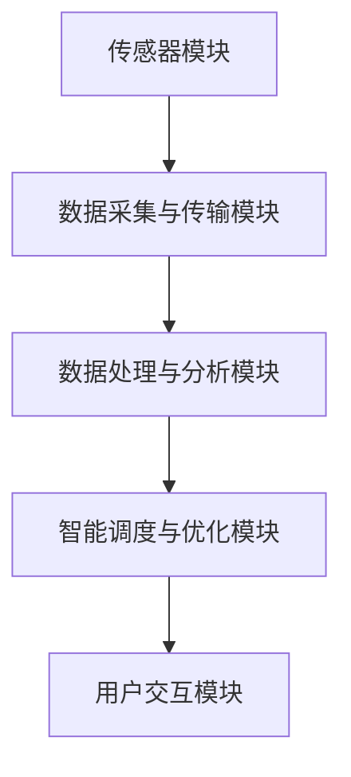
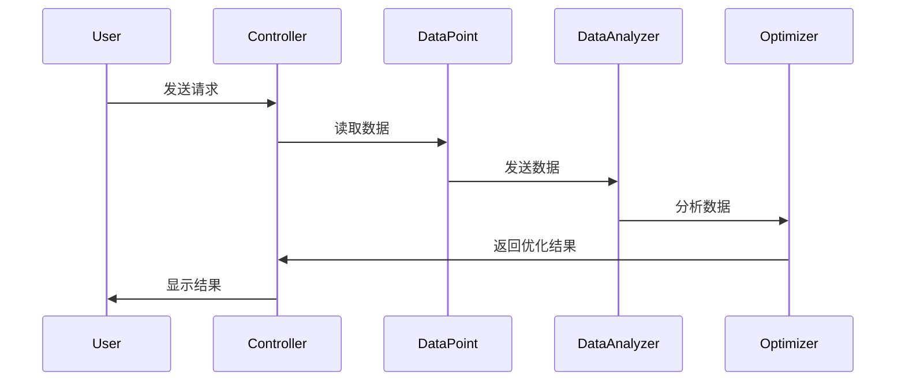

                 

## 物联网在智慧能源管理中的优化应用

### 关键词：物联网、智慧能源管理、优化应用、传感器、智能算法、数据采集

> 摘要：随着全球能源需求的不断增长和环境问题的日益严重，智慧能源管理成为实现能源可持续发展和提高能源利用效率的关键手段。物联网技术作为智能技术的重要组成部分，在智慧能源管理中发挥着日益重要的作用。本文从物联网与智慧能源管理的关系入手，详细分析了物联网技术在智慧能源管理中的应用场景、关键技术和优化措施，探讨了物联网在智慧能源管理中的挑战与机遇，并对未来发展趋势进行了展望。

### 第1章 物联网与智慧能源管理概述

#### 1.1 物联网与智慧能源管理的概念

**物联网（IoT）的定义与特点**：
物联网是指通过互联网、传感器、软件和电子设备，将各种物体连接起来，实现数据的采集、传输和处理，以实现智能化管理和控制。物联网的主要特点是连接性、感知性和智能化。

- **连接性**：物联网通过将各种设备连接到互联网上，实现设备之间的信息交换和协同工作。
- **感知性**：物联网利用传感器和智能设备，实现对物理环境的实时监测和感知。
- **智能化**：物联网通过数据处理和智能算法，实现对监测数据的分析和处理，实现智能决策和自动化控制。

**智慧能源管理的定义与目标**：
智慧能源管理是指利用物联网技术和智能算法，实现对能源系统的实时监控、预测、优化和自动化管理，以提高能源利用效率、降低成本和减少环境污染。智慧能源管理的目标包括：

- **提高能源利用效率**：通过实时监测和优化，减少能源浪费，提高能源利用效率。
- **降低能源成本**：通过智能调度和优化，降低能源采购和运维成本。
- **减少环境污染**：通过减少能源消耗和污染排放，实现可持续发展。

**两者关系的阐述**：
物联网为智慧能源管理提供了基础设施和技术支持，而智慧能源管理则是物联网技术在能源领域的具体应用。物联网技术通过智能传感器、数据采集和传输、数据处理和智能算法等手段，实现对能源系统的实时监控和优化管理，从而实现智慧能源管理。

#### 1.2 物联网在智慧能源管理中的应用

**智能传感与数据采集**：
利用各种传感器，实时监测能源设备的运行状态和能源消耗情况，为智慧能源管理提供数据基础。例如，智能电表可以实时监测家庭的电力消耗，智能燃气表可以实时监测家庭的燃气消耗。

**数据传输与处理**：
通过物联网技术，将采集到的数据传输到中心控制系统，进行数据清洗、处理和分析，为决策提供支持。数据传输可以通过有线和无线网络实现，数据处理包括数据清洗、数据压缩、数据分析和数据挖掘等。

**远程监控与控制**：
实现对能源设备的远程监控和控制，提高设备运行效率，减少维护成本。例如，智能电网可以通过物联网技术实现对电力设备的远程监控和故障诊断，从而提高电网的可靠性和稳定性。

**能效优化与预测**：
利用智能算法，对能源系统进行优化和预测，实现能源的精细化管理和调度。例如，通过预测用户未来的能源需求，智能电网可以提前调整电力供应，从而减少能源浪费。

#### 1.3 物联网在智慧能源管理中的挑战与机遇

**技术挑战**：
物联网在智慧能源管理中面临的技术挑战主要包括：

- **传感器技术的稳定性**：传感器在复杂环境下容易受到干扰，影响数据采集的准确性。
- **数据传输的安全性**：数据在传输过程中容易受到黑客攻击和篡改，需要保证数据传输的安全性和完整性。
- **数据处理的速度和准确性**：随着物联网设备的增多和数据量的增大，数据处理的速度和准确性成为关键问题。

**管理挑战**：
物联网在智慧能源管理中面临的管理挑战主要包括：

- **组织架构的调整**：智慧能源管理需要跨部门协作，需要调整组织架构，建立有效的管理机制。
- **人员培训**：智慧能源管理需要专业人才，需要进行人员培训，提高人员的技术水平和综合素质。
- **数据隐私和法律法规的遵守**：在物联网应用中，需要遵守相关的法律法规，保护用户的隐私和数据安全。

**机遇**：
物联网在智慧能源管理中的机遇主要包括：

- **提高能源利用效率**：通过物联网技术，可以实现能源的精细化管理和优化调度，提高能源利用效率。
- **降低能源成本**：通过物联网技术，可以实现能源的实时监测和远程控制，降低能源采购和运维成本。
- **减少环境污染**：通过物联网技术，可以实现能源的清洁生产和利用，减少环境污染。

#### 1.4 本章小结

物联网与智慧能源管理的关系紧密，物联网为智慧能源管理提供了技术支撑，智慧能源管理则是物联网技术在能源领域的具体应用。物联网技术在智慧能源管理中的应用包括智能传感与数据采集、数据传输与处理、远程监控与控制、能效优化与预测等方面。物联网在智慧能源管理中既面临技术挑战，也充满机遇，随着物联网技术的不断成熟，智慧能源管理将在能源领域发挥越来越重要的作用。

### 第2章 物联网技术在智慧能源管理中的应用场景

#### 2.1 家庭能源管理

**场景描述**：
家庭能源管理是指利用物联网技术，实现对家庭能源设备（如太阳能板、储能设备、智能家电等）的实时监控和管理，提高能源利用效率。通过物联网技术，用户可以随时随地了解家庭能源的消耗情况，并实现能源的优化使用。

**应用案例**：
智能家居系统是一个典型的家庭能源管理应用案例。用户可以通过手机APP远程控制家电，实现能源的优化使用。例如，用户可以远程关闭不使用的电器，调整空调和热水器的温度设置，从而降低能源消耗。

#### 2.2 工业能源管理

**场景描述**：
工业能源管理是指利用物联网技术，实现对工业生产过程中的能源消耗和设备运行状态的监控，提高生产效率和能源利用率。通过物联网技术，企业可以实现能源的精细化管理和优化调度，降低能源成本。

**应用案例**：
智能工厂是一个典型的工业能源管理应用案例。在智能工厂中，物联网技术被广泛应用于生产线的各个环节，实现能源的实时监测和优化调度。例如，智能工厂可以通过物联网技术监测设备的能耗情况，实时调整生产计划，实现能源的最优配置。

#### 2.3 城市能源管理

**场景描述**：
城市能源管理是指利用物联网技术，实现对城市能源系统的全面监控和管理，提高城市能源利用效率，减少能源浪费。通过物联网技术，城市可以实现能源的实时监控、预测和优化调度，提高能源供应的可靠性。

**应用案例**：
智能电网是一个典型的城市能源管理应用案例。智能电网通过物联网技术实现电力供应的实时监控和调度，提高供电可靠性。例如，智能电网可以通过物联网技术预测电力需求，提前调整电力供应，避免电力供应不足或过剩。

#### 2.4 智慧能源交易

**场景描述**：
智慧能源交易是指利用物联网技术和区块链技术，实现能源的智能交易和管理，提高能源市场的效率和透明度。通过物联网技术，用户可以实现能源的自主交易，实现能源的灵活调配和优化使用。

**应用案例**：
智能能源交易平台是一个典型的智慧能源交易应用案例。用户可以通过智能能源交易平台进行能源交易，实现能源的灵活调配和优化使用。例如，用户可以在平台上购买或出售多余的电能，实现能源的共享和利用。

#### 2.5 本章小结

物联网技术在家庭、工业、城市和智慧能源交易等场景中具有广泛的应用前景。通过物联网技术，可以实现能源的实时监测、优化调度和智能交易，提高能源利用效率，降低能源成本，减少环境污染。物联网技术在智慧能源管理中的应用场景多样，为智慧能源管理提供了有力支持。

### 第3章 物联网在智慧能源管理中的关键技术

#### 3.1 传感器技术

**核心概念**：
传感器是物联网系统中的重要组成部分，用于采集环境数据，如温度、湿度、光照、电压等。传感器的工作原理基于物理、化学或生物效应，通过检测环境变化，将其转化为电信号输出。

**特性对比表格**：

| 传感器类型 | 特性 |
| :--- | :--- |
| 温度传感器 | 测量温度 |
| 湿度传感器 | 测量湿度 |
| 光照传感器 | 测量光照强度 |
| 电压传感器 | 测量电压 |

**ER实体关系图架构**：

```mermaid
erDiagram
  Product ||--|{ Sensor }||>
  Sensor ||--|{ DataPoint }||>
  Device ||--|{ DataPoint }||>
```

**智能传感与数据采集**：
物联网通过传感器技术实现对能源设备运行状态和能源消耗情况的实时监测。传感器采集到的数据通过物联网网络传输到中心控制系统，为智慧能源管理提供数据支持。

#### 3.2 数据传输与处理技术

**核心概念**：
数据传输与处理技术是物联网系统中的关键环节，涉及数据的采集、传输、存储和处理。数据传输技术包括有线和无线网络，如Wi-Fi、Zigbee、LoRa等。数据处理技术包括数据清洗、压缩、分析和挖掘等。

**数据传输技术**：

- **Wi-Fi**：适用于短距离无线通信，数据传输速度快，但功耗较高。
- **Zigbee**：适用于低功耗、短距离通信，适用于智能家居等场景。
- **LoRa**：适用于长距离、低功耗通信，适用于智能电网等场景。

**数据处理技术**：

- **数据清洗**：去除数据中的噪声和错误，保证数据质量。
- **数据压缩**：减少数据体积，降低传输和存储成本。
- **数据分析**：通过对数据的分析和挖掘，提取有用信息。
- **数据挖掘**：从大量数据中发现潜在的模式和规律。

**远程监控与控制**：
通过数据传输技术，实现对能源设备的远程监控和控制。远程监控可以实时了解设备运行状态，远程控制可以实现设备运行参数的调整，从而提高设备运行效率和能源利用率。

#### 3.3 智能算法与优化技术

**核心概念**：
智能算法是物联网系统中的核心技术，用于对采集到的数据进行分析和处理，实现能源的优化管理。常见的智能算法包括机器学习、深度学习、优化算法等。

**机器学习**：
机器学习是一种通过数据训练模型，实现数据自动分析和决策的技术。在物联网系统中，机器学习可以用于预测能源需求、优化能源调度等。

**深度学习**：
深度学习是一种基于多层神经网络的数据分析方法，可以自动提取数据中的复杂特征。在物联网系统中，深度学习可以用于图像识别、语音识别等。

**优化算法**：
优化算法是一种用于求解最优解的算法，可以用于能源系统的优化调度。常见的优化算法包括线性规划、非线性规划、遗传算法等。

**能效优化与预测**：
通过智能算法，对能源系统进行优化和预测，实现能源的精细化管理和调度。例如，通过机器学习预测能源需求，通过优化算法调整能源供应，从而实现能源的最优配置。

### 第4章 物联网在智慧能源管理中的优化应用实例

#### 4.1 项目背景

随着能源需求的不断增加和环境污染的加剧，如何提高能源利用效率、降低能源成本和减少环境污染成为全球关注的问题。物联网技术作为一种新兴技术，为智慧能源管理提供了新的解决方案。本文以一个实际项目为例，介绍物联网在智慧能源管理中的优化应用。

#### 4.2 项目介绍

该项目是一个智慧能源管理系统，旨在通过物联网技术实现对能源系统的实时监控和优化管理。系统主要包括以下几个模块：

1. **传感器模块**：安装在各种能源设备上，用于采集能源设备的运行状态和能源消耗数据。
2. **数据采集与传输模块**：将传感器采集到的数据通过物联网网络传输到中心控制系统。
3. **数据处理与分析模块**：对采集到的数据进行清洗、压缩、分析和挖掘，提取有用信息。
4. **智能调度与优化模块**：根据数据分析结果，实现能源的优化调度和管理。

#### 4.3 系统功能设计

**领域模型类图**：

```mermaid
classDiagram
  Sensor -> DataPoint
  Device -> DataPoint
  Controller -> DataPoint
  DataAnalyzer -> DataPoint
  Optimizer -> DataPoint
  User -> Controller
  User -> DataAnalyzer
  User -> Optimizer
```

**功能描述**：

1. **数据采集**：传感器模块实时采集能源设备的运行状态和能源消耗数据，包括温度、湿度、光照、电压等。
2. **数据传输**：数据采集模块通过物联网网络将采集到的数据传输到中心控制系统。
3. **数据清洗**：数据处理与分析模块对采集到的数据进行清洗，去除噪声和错误，保证数据质量。
4. **数据压缩**：对清洗后的数据进行压缩，减少数据体积，降低传输和存储成本。
5. **数据分析**：数据处理与分析模块对压缩后的数据进行分析和挖掘，提取有用信息，如能源消耗趋势、设备故障预测等。
6. **智能调度**：智能调度与优化模块根据数据分析结果，实现能源的优化调度和管理，如调整电力供应、优化能源使用等。
7. **用户交互**：用户通过控制器与系统进行交互，了解能源消耗情况、设备运行状态等。

#### 4.4 系统架构设计

**系统架构图**：



**架构描述**：

1. **传感器模块**：负责实时采集能源设备的运行状态和能源消耗数据。
2. **数据采集与传输模块**：将传感器采集到的数据通过物联网网络传输到中心控制系统。
3. **数据处理与分析模块**：对采集到的数据进行清洗、压缩、分析和挖掘，提取有用信息。
4. **智能调度与优化模块**：根据数据分析结果，实现能源的优化调度和管理。
5. **用户交互模块**：提供用户与系统的交互界面，用户可以通过控制器了解能源消耗情况、设备运行状态等。

#### 4.5 系统接口设计

**接口设计**：

1. **传感器接口**：定义传感器与数据采集与传输模块之间的接口，实现数据采集。
2. **数据传输接口**：定义数据采集与传输模块与数据处理与分析模块之间的接口，实现数据传输。
3. **数据处理接口**：定义数据处理与分析模块与智能调度与优化模块之间的接口，实现数据处理和分析。
4. **用户交互接口**：定义用户交互模块与系统其他模块之间的接口，实现用户与系统的交互。

#### 4.6 系统交互序列图



**交互描述**：

1. **用户发送请求**：用户通过控制器发送请求，要求获取能源消耗情况。
2. **读取数据**：控制器从数据点读取能源消耗数据。
3. **发送数据**：数据点将数据发送到数据处理与分析模块。
4. **分析数据**：数据处理与分析模块对数据进行清洗、压缩、分析和挖掘。
5. **返回优化结果**：智能调度与优化模块根据数据分析结果，返回优化结果。
6. **显示结果**：控制器将优化结果显示给用户。

#### 4.7 项目实战

**环境安装**：

1. **安装物联网开发环境**：安装物联网开发板（如Arduino、Raspberry Pi）和相应的开发工具（如Arduino IDE、Python IDE）。
2. **安装传感器**：将传感器（如温度传感器、湿度传感器等）连接到开发板上，并进行调试。
3. **安装物联网网络**：设置物联网网络，确保传感器采集到的数据可以传输到中心控制系统。

**系统核心实现源代码**：

```python
# 传感器数据采集
import serial
import time

# 数据处理与分析
def process_data(data):
    # 对数据进行清洗和压缩
    cleaned_data = data.strip().split(',')
    compressed_data = [float(d) for d in cleaned_data]
    return compressed_data

# 数据传输
def transmit_data(data):
    # 将数据发送到中心控制系统
    # 这里可以使用HTTP、MQTT等协议
    pass

# 主程序
def main():
    # 连接传感器
    ser = serial.Serial('/dev/ttyUSB0', 9600)
    
    while True:
        # 读取传感器数据
        data = ser.readline()
        
        # 处理数据
        processed_data = process_data(data)
        
        # 传输数据
        transmit_data(processed_data)
        
        time.sleep(1)

if __name__ == '__main__':
    main()
```

**代码应用解读与分析**：

1. **传感器数据采集**：使用Python和串行通信库（如pyserial）连接传感器，读取传感器数据。
2. **数据处理与分析**：对读取到的数据进行清洗和压缩，将字符串转换为浮点数。
3. **数据传输**：将处理后的数据通过HTTP、MQTT等协议传输到中心控制系统。
4. **主程序**：实现传感器数据采集、数据处理和传输的循环执行。

**实际案例分析与详细讲解剖析**：

假设在一个智能家居场景中，用户希望通过物联网技术监控家庭的电力消耗。以下是一个实际案例的分析和讲解：

1. **场景描述**：用户希望了解家庭电器的电力消耗情况，包括空调、冰箱、电视等。
2. **数据采集**：安装温度传感器、电压传感器和电流传感器，采集空调、冰箱、电视等电器的温度、电压和电流数据。
3. **数据处理**：对采集到的数据进行清洗和压缩，计算每个电器的实际电力消耗。
4. **数据传输**：通过Wi-Fi或MQTT协议，将电力消耗数据传输到中心控制系统。
5. **数据分析**：中心控制系统对电力消耗数据进行分析，生成电力消耗报表，提供用户查看。
6. **优化建议**：根据电力消耗报表，中心控制系统可以提出节能建议，如关闭不使用的电器、调整空调温度等。

**项目小结**：

通过物联网技术在智慧能源管理中的应用，可以实现能源的实时监测、优化调度和智能交易，提高能源利用效率，降低能源成本，减少环境污染。在实际项目中，需要根据具体场景和需求，设计和实现相应的物联网系统，实现能源的精细化管理和优化调度。

### 第5章 物联网在智慧能源管理中的优化应用最佳实践

#### 5.1 实践一：优化传感器布局与数据采集策略

**场景**：在家庭能源管理中，优化传感器的布局和数据采集策略，提高数据采集的准确性和效率。

**最佳实践**：

1. **合理布局传感器**：根据家庭能源设备的位置和使用习惯，合理布局传感器，确保覆盖到所有关键能源设备。
2. **优化数据采集频率**：根据能源设备的工作特点和需求，调整数据采集频率，避免频繁采集造成不必要的资源浪费。
3. **数据采集阈值设定**：设定合理的阈值，当传感器数据超过阈值时，自动提高数据采集频率，以确保关键时刻的数据准确性。

#### 5.2 实践二：智能调度与优化算法的运用

**场景**：在工业能源管理中，运用智能调度与优化算法，实现能源的优化调度和管理。

**最佳实践**：

1. **建立能源需求模型**：根据历史数据和实时数据，建立准确的能源需求模型，预测未来的能源需求。
2. **运用优化算法**：采用线性规划、非线性规划等优化算法，根据能源需求模型，制定最优的能源调度策略。
3. **动态调整优化策略**：根据实时数据和能源市场变化，动态调整优化策略，实现能源的灵活调度和优化管理。

#### 5.3 实践三：数据安全与隐私保护

**场景**：在智慧能源管理中，确保数据的安全和用户隐私的保护。

**最佳实践**：

1. **数据加密传输**：采用加密算法，对传输的数据进行加密，防止数据在传输过程中被窃取或篡改。
2. **访问控制**：实施严格的访问控制策略，确保只有授权用户可以访问敏感数据。
3. **数据备份与恢复**：定期对数据进行备份，确保在数据丢失或损坏时，可以及时恢复。

#### 5.4 实践四：跨部门协作与人员培训

**场景**：在智慧能源管理中，实现跨部门协作和人员培训，提高系统运营效率。

**最佳实践**：

1. **建立跨部门协作机制**：明确各部门的职责和任务，建立有效的协作机制，确保项目顺利进行。
2. **人员培训与技能提升**：定期组织技术培训和技能提升课程，提高人员的专业素养和技术水平。
3. **建立反馈机制**：鼓励员工提出意见和建议，及时解决问题，不断优化系统运营。

### 第6章 本章小结

本章从物联网在智慧能源管理中的应用场景、关键技术、优化应用实例和最佳实践等方面进行了详细阐述。物联网技术在智慧能源管理中发挥着重要作用，通过优化传感器布局、智能调度与优化算法的运用、数据安全与隐私保护、跨部门协作与人员培训等最佳实践，可以进一步提高能源利用效率、降低能源成本、减少环境污染，实现能源的可持续发展和智能化管理。随着物联网技术的不断成熟，智慧能源管理将在未来发挥更大的作用。

### 作者信息

作者：AI天才研究院/AI Genius Institute & 禅与计算机程序设计艺术 /Zen And The Art of Computer Programming

