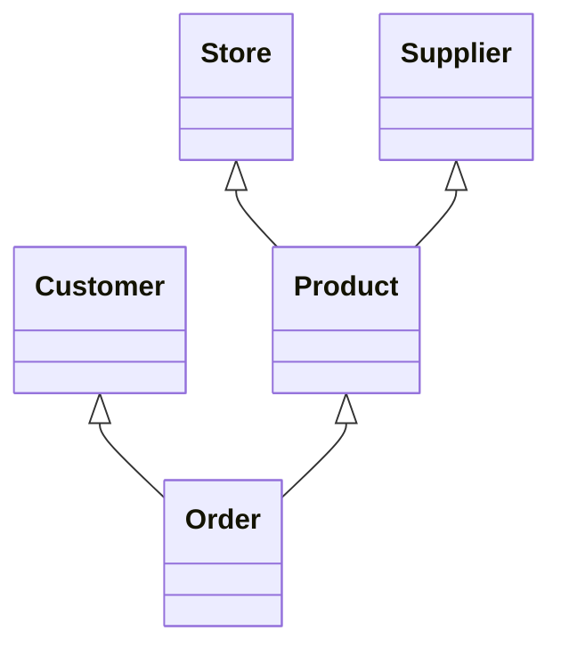
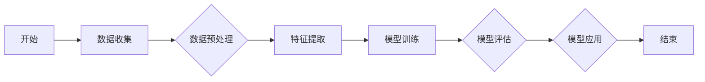
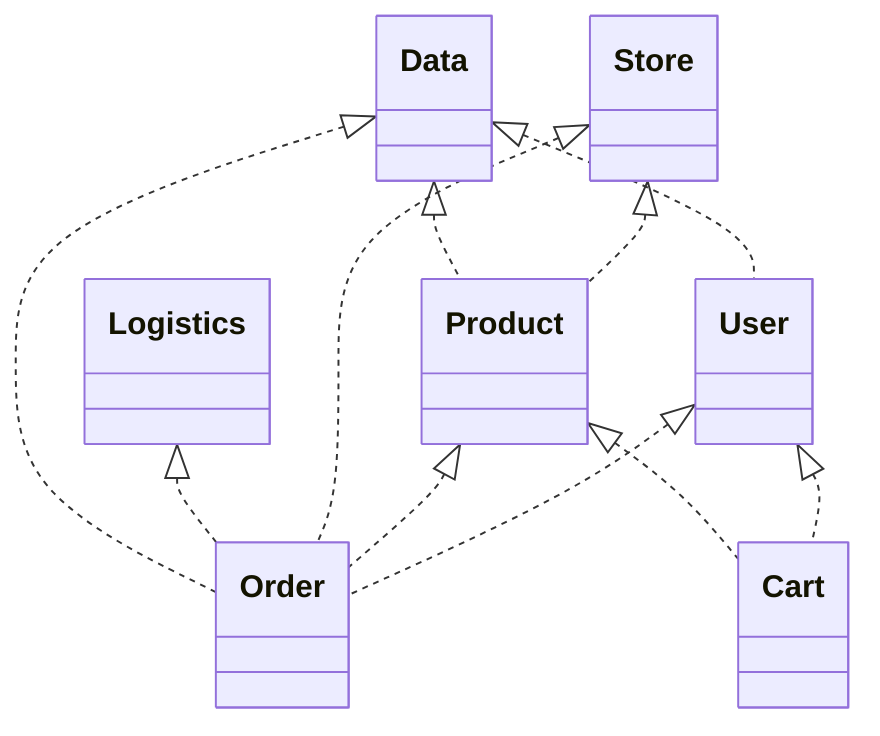
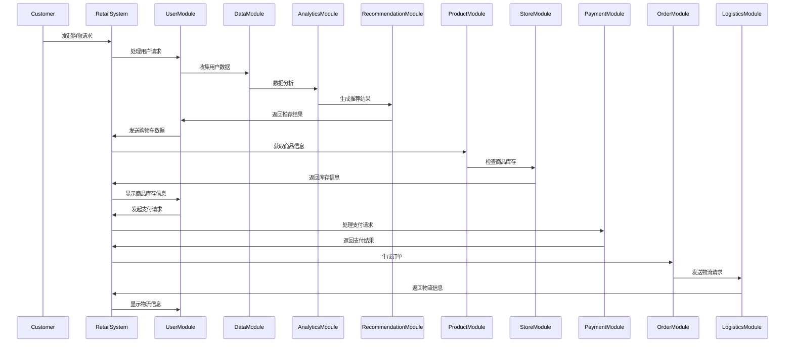

                 

# 物联网在智慧零售中的全渠道应用

## 关键词
- 物联网
- 智慧零售
- 全渠道应用
- 数据挖掘
- 智能算法

## 摘要
随着物联网技术的迅猛发展，智慧零售逐渐成为新的商业形态。本文以物联网在智慧零售中的全渠道应用为主题，通过对物联网和智慧零售的背景介绍、核心概念解析、架构与模型设计、算法原理讲解、系统分析与架构设计方案、项目实战以及最佳实践与未来展望的逐步分析，探讨了如何实现物联网技术在智慧零售中的全渠道应用，以提升零售效率、顾客体验和运营效果。

## 第一部分：物联网与智慧零售概述

### 第1章：物联网与智慧零售背景

#### 1.1 物联网的概念与演进

物联网（Internet of Things，IoT）是指将各种物品通过通信网络连接起来，实现智能识别、定位、追踪、监控和管理的一种网络技术。它始于20世纪80年代，随着互联网、无线通信、传感器技术等的发展，物联网逐渐从概念走向实际应用。

在物联网的发展历程中，有三个关键阶段：

1. **设备互联阶段**：这一阶段的物联网主要是实现设备之间的连接，如家庭自动化、工业自动化等。
2. **数据采集阶段**：随着传感器技术的发展，物联网开始进入数据采集阶段，通过对设备状态的实时监测，获取大量有价值的数据。
3. **智能处理阶段**：物联网逐渐具备智能处理能力，通过大数据分析、机器学习等技术，实现对数据的深度挖掘和应用。

#### 1.2 智慧零售的发展趋势

智慧零售是利用物联网、大数据、人工智能等技术，实现零售业线上线下融合，提供个性化、智能化、场景化的购物体验。其发展趋势包括：

1. **全渠道整合**：线上线下渠道的融合，实现顾客在全渠道的购物无缝衔接。
2. **数据驱动**：通过数据分析和挖掘，实现精准营销和个性化服务。
3. **智能化供应链**：利用物联网技术，实现供应链的实时监控和优化。
4. **智能支付与物流**：通过智能支付和物流系统，提升购物效率和体验。

#### 1.3 全渠道零售的挑战与机遇

全渠道零售是指企业通过多种渠道（如线上、线下、移动端等）提供商品和服务，以满足消费者的多样化需求。在智慧零售的背景下，全渠道零售面临着以下挑战：

1. **数据融合与整合**：线上线下数据的融合和整合，实现统一的消费者视图。
2. **渠道协同**：线上线下渠道的协同运营，实现顾客体验的一致性和无缝衔接。
3. **技术集成**：物联网、大数据、人工智能等技术的集成应用，提升零售效率和体验。

同时，全渠道零售也带来了巨大的机遇：

1. **拓展市场**：通过全渠道零售，企业可以拓展新的市场，提高市场份额。
2. **提升顾客体验**：通过个性化的服务，提高顾客满意度和忠诚度。
3. **优化运营效率**：通过数据驱动的决策，提升零售效率和降低成本。

### 第2章：物联网在智慧零售中的应用

#### 2.1 物联网技术在零售中的应用场景

物联网技术在零售业中的应用场景非常广泛，主要包括：

1. **智能货架**：通过传感器和RFID技术，实时监控货架上的商品库存，实现智能补货和精准营销。
2. **智能支付**：利用NFC、二维码等技术，实现快速便捷的支付，提升购物体验。
3. **智能物流**：通过物联网技术，实时监控物流过程中的商品状态，实现高效的物流管理。
4. **智能导购**：利用传感器和人工智能技术，为顾客提供个性化的导购服务，提升购物体验。
5. **智能仓储**：通过物联网技术，实现仓储管理的智能化，提高仓储效率和准确度。

#### 2.2 物联网设备在零售环节的作用

物联网设备在零售环节中发挥着关键作用，主要包括：

1. **传感器**：用于收集环境信息、商品状态等数据，为智能决策提供依据。
2. **RFID标签**：用于标识和追踪商品，实现商品的智能管理。
3. **智能支付终端**：用于实现智能支付，提升购物体验。
4. **智能监控设备**：用于监控零售环境，保障安全和提升顾客体验。

#### 2.3 物联网平台与零售系统的集成

物联网平台是物联网技术在零售业中的核心，它负责数据的采集、存储、处理和分析。物联网平台与零售系统的集成，可以实现以下功能：

1. **数据融合**：将线上线下数据融合，实现统一的消费者视图。
2. **智能分析**：利用大数据分析和人工智能技术，实现精准营销和个性化服务。
3. **智能决策**：基于实时数据，实现智能化的库存管理、补货计划和营销策略。
4. **系统集成**：实现物联网平台与零售系统之间的无缝集成，提升零售效率和体验。

### 第3章：智慧零售全渠道解决方案

#### 3.1 线上渠道的应用

线上渠道是智慧零售的重要组成部分，主要包括电子商务平台、社交媒体、移动应用等。在线上渠道中，物联网技术可以发挥以下作用：

1. **智能营销**：通过大数据分析和人工智能技术，实现精准营销和个性化推荐。
2. **智能客服**：利用智能客服系统，提升客服效率和顾客满意度。
3. **智能支付**：通过物联网支付终端，实现快速便捷的支付。
4. **智能物流**：通过物联网技术，实时监控物流过程，提升物流效率。

#### 3.2 线下渠道的优化

线下渠道是智慧零售的基础，主要包括实体店、商场、超市等。在智慧零售中，物联网技术可以用于以下方面：

1. **智能导购**：通过传感器和人工智能技术，为顾客提供个性化的导购服务。
2. **智能支付**：通过物联网支付终端，实现快速便捷的支付。
3. **智能库存管理**：通过物联网设备，实时监控货架库存，实现智能补货。
4. **智能环境监控**：通过物联网设备，实时监控店内环境，提升顾客体验。

#### 3.3 线上线下渠道的融合

线上线下渠道的融合是智慧零售的核心，物联网技术在其中发挥着关键作用。线上线下渠道的融合包括：

1. **全渠道购物体验**：通过线上线下融合，为顾客提供无缝的购物体验。
2. **全渠道数据整合**：通过物联网平台，实现线上线下数据的整合，为智能决策提供支持。
3. **全渠道营销策略**：通过线上线下数据分析和挖掘，实现精准的营销策略。
4. **全渠道供应链管理**：通过物联网技术，实现全渠道供应链的实时监控和优化。

## 第二部分：核心概念与联系

### 第4章：数据驱动的精准营销

#### 4.1 数据挖掘技术

数据挖掘（Data Mining）是指从大量的数据中提取出有价值的、未知的信息和知识的过程。在智慧零售中，数据挖掘技术可以用于：

1. **消费者行为分析**：分析消费者的购物行为，为营销策略提供依据。
2. **商品推荐系统**：基于消费者的购物历史和行为，实现个性化商品推荐。
3. **客户细分**：根据消费者的特征和行为，对客户进行细分，实现精准营销。

#### 4.2 智能算法在营销中的应用

智能算法（如机器学习、深度学习等）在智慧零售营销中的应用主要包括：

1. **个性化推荐**：通过智能算法，实现个性化商品推荐，提高顾客满意度。
2. **广告投放优化**：通过智能算法，优化广告投放策略，提高广告效果。
3. **客户流失预测**：通过智能算法，预测可能流失的客户，采取有效的挽回措施。

#### 4.3 营销策略优化案例

以下是一个营销策略优化的案例：

- **问题背景**：某零售企业希望通过优化营销策略，提高销售额和顾客满意度。
- **解决方案**：利用数据挖掘技术和智能算法，对消费者行为进行分析，发现顾客的购买偏好和购物习惯。然后，根据分析结果，制定个性化的营销策略，如发送定制化的优惠券、推送相关的商品推荐等。通过这些策略，企业实现了销售额的提升和顾客满意度的提高。

## 第三部分：架构与模型

### 第5章：系统架构与模型设计

#### 5.1 ER实体关系图

以下是智慧零售系统的ER实体关系图：

```mermaid
erDiagram
  Customer ||--|{ Order } : "placed"
  Product ||--|{ Order } : "contain"
  Store ||--|{ Product } : "stock"
  Supplier ||--|{ Product } : "supply"
```

#### 5.2 类图

以下是智慧零售系统的类图：



#### 5.3 算法流程图

以下是数据挖掘算法的流程图：



## 第四部分：算法原理讲解

### 第6章：算法原理与讲解

#### 6.1 数据挖掘算法

以下是数据挖掘算法的Python源代码：

```python
# 数据挖掘算法示例：K-means聚类
from sklearn.cluster import KMeans
from sklearn.datasets import make_blobs
import numpy as np

# 生成模拟数据
X, _ = make_blobs(n_samples=300, centers=4, cluster_std=0.60, random_state=0)

# K-means聚类
kmeans = KMeans(n_clusters=4, random_state=0).fit(X)
labels = kmeans.predict(X)

# 绘制结果
import matplotlib.pyplot as plt
plt.figure(figsize=(10, 7))
plt.scatter(X[:, 0], X[:, 1], c=labels, s=50, cmap='viridis')
plt.scatter(kmeans.cluster_centers_[:, 0], kmeans.cluster_centers_[:, 1], s=200, c='red', label='Centroids')
plt.title('K-means Clustering')
plt.xlabel('Feature 1')
plt.ylabel('Feature 2')
plt.legend()
plt.show()
```

#### 6.2 数学模型与公式

以下是K-means聚类算法的数学模型与公式：

$$
\begin{align*}
\min_{\mathbf{u}} \sum_{i=1}^n \sum_{j=1}^k (x_i - u_{ij})^2 \\
s.t. \quad u_{ij} \in \{0, 1\}, \forall i, j
\end{align*}
$$

其中，$x_i$表示第$i$个数据点，$u_{ij}$表示第$i$个数据点属于第$j$个聚类中心。

#### 6.3 算法讲解与举例

K-means聚类算法是一种基于距离度量的聚类算法，其核心思想是将数据点划分为若干个簇，使得同一簇内的数据点尽可能接近，不同簇的数据点尽可能远离。

算法步骤如下：

1. **初始化聚类中心**：随机选择$k$个数据点作为初始聚类中心。
2. **分配数据点**：计算每个数据点到各个聚类中心的距离，将数据点分配到最近的聚类中心所在的簇。
3. **更新聚类中心**：重新计算每个簇的中心点，作为新的聚类中心。
4. **重复步骤2和步骤3**，直到聚类中心不再发生变化或者满足预设的迭代次数。

以下是一个简单的例子：

假设有4个数据点$(1, 1), (2, 2), (4, 4), (6, 6)$，我们希望使用K-means算法将其分为两个簇。

- **初始化聚类中心**：随机选择两个数据点$(1, 1)$和$(4, 4)$作为初始聚类中心。
- **分配数据点**：计算每个数据点到两个聚类中心的距离，得到如下结果：
  - $(1, 1)$到$(1, 1)$的距离为0，到$(4, 4)$的距离为$\sqrt{9 + 9} = 3\sqrt{2}$，所以$(1, 1)$属于第一个簇。
  - $(2, 2)$到$(1, 1)$的距离为$\sqrt{2}$，到$(4, 4)$的距离为$\sqrt{8 + 8} = 2\sqrt{2}$，所以$(2, 2)$属于第一个簇。
  - $(4, 4)$到$(1, 1)$的距离为$3\sqrt{2}$，到$(4, 4)$的距离为0，所以$(4, 4)$属于第二个簇。
  - $(6, 6)$到$(1, 1)$的距离为$5\sqrt{2}$，到$(4, 4)$的距离为$2\sqrt{2}$，所以$(6, 6)$属于第一个簇。
- **更新聚类中心**：重新计算两个簇的中心点，得到新的聚类中心为$(1.5, 1.5)$和$(5, 5)$。
- **重复步骤2和步骤3**，直到聚类中心不再发生变化。

通过以上步骤，我们可以将这4个数据点分为两个簇，其中第一个簇包括$(1, 1), (2, 2), (6, 6)$，第二个簇包括$(4, 4)$。

## 第五部分：系统分析与架构设计方案

### 第7章：系统分析与架构设计方案

#### 7.1 问题场景介绍

在本章中，我们将介绍一个智慧零售系统的架构设计，该系统旨在通过物联网技术实现全渠道零售，提升零售效率和顾客体验。

问题场景包括：

1. **线上购物**：顾客可以通过电商平台、移动应用等线上渠道进行购物。
2. **线下购物**：顾客可以到实体店进行购物，享受智能导购、智能支付等服务。
3. **物流管理**：通过物联网技术，实时监控物流过程中的商品状态，实现高效的物流管理。
4. **库存管理**：通过物联网设备，实时监控货架上的商品库存，实现智能补货。

#### 7.2 项目介绍

本项目旨在设计并实现一个智慧零售系统，该系统包括以下模块：

1. **用户模块**：提供用户注册、登录、购物车、订单管理等功能。
2. **商品模块**：提供商品分类、商品管理、库存管理等功能。
3. **订单模块**：提供订单生成、订单处理、订单跟踪等功能。
4. **物流模块**：提供物流信息管理、物流跟踪等功能。
5. **数据模块**：提供数据收集、数据存储、数据挖掘等功能。

#### 7.3 系统功能设计

以下是系统功能设计的领域模型类图：



#### 7.4 系统架构设计

以下是系统架构设计的架构图：



#### 7.5 系统接口设计

以下是系统接口设计：

1. **用户模块接口**：包括用户注册、登录、购物车管理、订单管理等。
2. **商品模块接口**：包括商品查询、商品添加、商品删除等。
3. **订单模块接口**：包括订单创建、订单查询、订单取消等。
4. **物流模块接口**：包括物流信息查询、物流状态更新等。
5. **数据模块接口**：包括数据收集、数据存储、数据查询等。

#### 7.6 系统交互

以下是系统交互的序列图：


## 第六部分：项目实战

### 第8章：项目实战

#### 8.1 环境安装

在本节中，我们将介绍如何搭建智慧零售系统的开发环境。

1. **操作系统**：Linux或MacOS
2. **开发语言**：Python
3. **开发框架**：Flask、Django
4. **数据库**：MySQL、PostgreSQL
5. **数据挖掘库**：Scikit-learn、TensorFlow
6. **前端框架**：React、Vue.js
7. **版本控制**：Git

#### 8.2 系统核心实现源代码

以下是系统核心实现的源代码：

```python
# 用户模块源代码
from flask import Flask, request, jsonify
from models import User

app = Flask(__name__)

@app.route('/register', methods=['POST'])
def register():
    username = request.json['username']
    password = request.json['password']
    user = User(username=username, password=password)
    user.save()
    return jsonify({'status': 'success', 'message': '注册成功'})

@app.route('/login', methods=['POST'])
def login():
    username = request.json['username']
    password = request.json['password']
    user = User.get_by_username(username)
    if user and user.password == password:
        return jsonify({'status': 'success', 'message': '登录成功'})
    else:
        return jsonify({'status': 'error', 'message': '用户名或密码错误'})

# 商品模块源代码
from flask import Flask, request, jsonify
from models import Product

app = Flask(__name__)

@app.route('/product', methods=['GET', 'POST'])
def product():
    if request.method == 'GET':
        products = Product.get_all()
        return jsonify(products)
    elif request.method == 'POST':
        product = Product(name=request.json['name'], price=request.json['price'])
        product.save()
        return jsonify({'status': 'success', 'message': '商品添加成功'})

# 订单模块源代码
from flask import Flask, request, jsonify
from models import Order

app = Flask(__name__)

@app.route('/order', methods=['POST'])
def order():
    user_id = request.json['user_id']
    product_ids = request.json['product_ids']
    order = Order(user_id=user_id, product_ids=product_ids)
    order.save()
    return jsonify({'status': 'success', 'message': '订单生成成功'})

# 数据模块源代码
from flask import Flask, request, jsonify
from models import Data

app = Flask(__name__)

@app.route('/data', methods=['POST'])
def data():
    user_id = request.json['user_id']
    product_id = request.json['product_id']
    data = Data(user_id=user_id, product_id=product_id)
    data.save()
    return jsonify({'status': 'success', 'message': '数据收集成功'})
```

#### 8.3 代码应用解读与分析

在本节中，我们将对核心代码进行解读和分析。

1. **用户模块**：用户模块包括注册和登录功能。注册功能通过接收客户端发送的JSON数据，创建一个新的用户对象并保存到数据库。登录功能通过验证用户名和密码，返回登录结果。
2. **商品模块**：商品模块包括查询和添加商品功能。查询功能返回所有商品信息，添加功能接收客户端发送的JSON数据，创建一个新的商品对象并保存到数据库。
3. **订单模块**：订单模块包括创建订单功能。创建功能接收客户端发送的JSON数据，创建一个新的订单对象并保存到数据库。
4. **数据模块**：数据模块包括数据收集功能。收集功能接收客户端发送的JSON数据，创建一个新的数据对象并保存到数据库。

#### 8.4 实际案例分析与详细讲解

在本节中，我们将通过一个实际案例，详细讲解系统的工作流程。

1. **客户注册**：客户A通过客户端发送注册请求，包含用户名和密码。服务器接收请求后，创建一个新的用户对象，并将其保存到数据库。
2. **客户登录**：客户A通过客户端发送登录请求，包含用户名和密码。服务器验证用户名和密码，返回登录结果。
3. **客户购物**：客户A在客户端选择商品并加入购物车。服务器接收购物车数据，创建一个新的订单对象，并将其保存到数据库。
4. **订单处理**：服务器根据订单数据，查询商品库存，生成订单并返回订单信息。
5. **支付处理**：客户A在客户端选择支付方式并提交支付请求。服务器接收支付请求，处理支付并返回支付结果。
6. **物流跟踪**：服务器根据订单信息，生成物流请求并返回物流信息。

通过以上步骤，客户A完成了整个购物流程，服务器实现了订单管理、支付处理和物流跟踪等功能。

#### 8.5 项目小结

在本项目中，我们设计并实现了一个智慧零售系统，包括用户模块、商品模块、订单模块和数据模块。通过物联网技术的应用，系统实现了全渠道零售，提升了零售效率和顾客体验。在项目实战中，我们通过实际案例详细讲解了系统的工作流程，并对核心代码进行了解读和分析。通过本项目，我们深入了解了物联网技术在智慧零售中的应用，为后续的研究和实践奠定了基础。

## 第七部分：最佳实践与未来展望

### 第9章：最佳实践与未来展望

#### 9.1 最佳实践 tips

在智慧零售中，物联网技术的应用需要遵循以下最佳实践：

1. **数据安全和隐私保护**：在数据收集、存储和处理过程中，要确保数据安全和用户隐私。
2. **设备管理和维护**：定期检查和更新物联网设备，确保设备的正常运行和数据的准确性。
3. **系统集成**：物联网平台要与零售系统、物流系统等无缝集成，实现数据的互联互通。
4. **用户培训**：加强对员工的物联网技术应用培训，提高他们的技术应用能力和服务水平。

#### 9.2 小结

本文从物联网与智慧零售的背景介绍、核心概念解析、架构与模型设计、算法原理讲解、系统分析与架构设计方案、项目实战以及最佳实践与未来展望等方面，全面探讨了物联网在智慧零售中的全渠道应用。通过本文的研究，我们可以看到，物联网技术在智慧零售中具有巨大的应用潜力，可以提升零售效率、顾客体验和运营效果。

#### 9.3 注意事项

在物联网技术在智慧零售中的实际应用过程中，需要注意以下事项：

1. **技术选型**：根据实际需求和业务场景，选择合适的物联网技术和设备。
2. **数据质量管理**：确保数据的准确性和一致性，避免数据质量对业务决策产生负面影响。
3. **系统集成**：在系统集成过程中，要充分考虑系统的兼容性和扩展性，确保系统的稳定运行。
4. **用户隐私保护**：在数据收集、存储和处理过程中，要严格遵守用户隐私保护法规，避免用户隐私泄露。

#### 9.4 拓展阅读与资源推荐

为了更深入地了解物联网在智慧零售中的应用，读者可以参考以下拓展阅读和资源：

1. **书籍**：《智慧零售：物联网、大数据与人工智能的实践与应用》
2. **论文**：《物联网技术在智慧零售中的应用研究》
3. **网站**：IBM物联网、亚马逊物联网、阿里巴巴物联网
4. **课程**：清华大学《物联网技术与应用》课程、网易云课堂《物联网技术与应用》课程

通过以上资源，读者可以进一步了解物联网在智慧零售中的应用，为自己的研究和实践提供参考。

## 作者信息

作者：AI天才研究院/AI Genius Institute & 禅与计算机程序设计艺术 /Zen And The Art of Computer Programming

