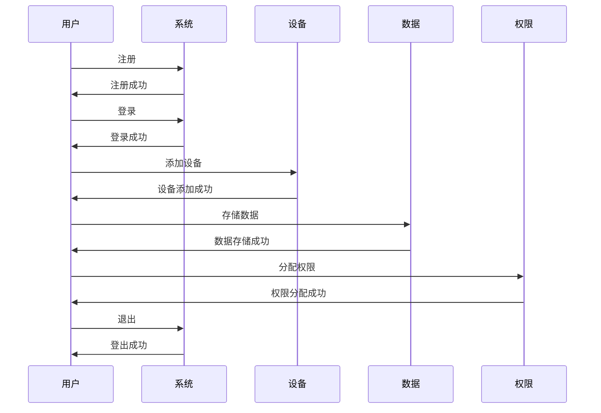

                 

## 物联网在智能家居中的隐私保护问题

### 关键词：物联网、智能家居、隐私保护、数据加密、认证与授权、安全通信、算法原理

> 摘要：随着物联网（IoT）技术的快速发展，智能家居已经成为现代生活的趋势。然而，物联网设备在收集和处理大量用户数据的过程中，隐私保护问题日益突出。本文将深入探讨物联网在智能家居中的隐私保护问题，从背景介绍、核心概念与联系、算法原理讲解、系统分析与架构设计等多个方面，系统地分析隐私保护的挑战与解决方案，为未来智能家居的发展提供有价值的参考。

### 目录大纲

1. **背景介绍**
   1.1 问题背景
   1.2 问题描述
   1.3 问题解决
   1.4 边界与外延
   1.5 概念结构与核心要素组成
   1.6 本章小结

2. **核心概念与联系**
   2.1 物联网与智能家居相关概念
   2.2 隐私保护相关概念
   2.3 关键技术要素
   2.4 概念属性特征对比表格
   2.5 ER实体关系图架构
   2.6 本章小结

3. **算法原理讲解**
   3.1 数据加密技术
   3.2 认证与授权技术
   3.3 安全通信技术
   3.4 隐私保护算法
   3.5 算法mermaid流程图
   3.6 Python源代码讲解
   3.7 数学模型与公式讲解
   3.8 举例说明
   3.9 本章小结

4. **系统分析与架构设计**
   4.1 问题场景介绍
   4.2 项目介绍
   4.3 系统功能设计
   4.4 系统架构设计
   4.5 系统接口设计
   4.6 系统交互
   4.7 项目实战
   4.8 最佳实践 tips
   4.9 小结
   4.10 注意事项
   4.11 拓展阅读

---

### 1. 背景介绍

#### 1.1 问题背景

物联网（Internet of Things，IoT）作为新一代信息技术的代表，其核心在于通过传感器、网络设备和数据处理技术，实现物理世界与数字世界的深度融合。智能家居作为物联网技术应用的重要领域，通过连接各种家庭设备和家电，提供智能化、便捷化的居住环境。

近年来，物联网技术的快速发展以及智能家居设备的普及，为人们的生活带来了诸多便利。然而，随之而来的隐私保护问题也日益严峻。物联网设备在收集、处理和存储用户数据的过程中，面临着诸多隐私泄露的风险。例如，智能家居设备可能会收集用户的日常活动、生活习惯等敏感数据，如果这些数据没有得到妥善的保护，就可能被恶意利用，造成严重的隐私泄露事件。

#### 1.2 问题描述

智能家居隐私保护问题主要集中在以下几个方面：

1. **用户隐私数据收集**：智能家居设备在提供便利服务的同时，不可避免地会收集大量的用户个人信息。这些数据可能包括用户的名字、住址、联系方式、行为习惯等敏感信息。

2. **数据传输过程中的安全风险**：智能家居设备通常通过无线网络与云端服务器进行数据传输。在数据传输过程中，如果未能采取有效的安全措施，就可能被黑客拦截和篡改。

3. **数据存储过程中的安全风险**：智能家居设备收集到的数据通常会存储在云服务器上。如果云服务器的安全措施不够严格，就可能被黑客攻击，导致用户数据泄露。

4. **数据共享与第三方利用**：为了提供更好的服务，智能家居设备可能会与第三方公司进行数据共享。然而，这些第三方公司是否有足够的能力和意愿保护用户数据，仍是一个未知数。

#### 1.3 问题解决

为了解决智能家居隐私保护问题，可以从以下几个方面进行：

1. **隐私保护法规与政策**：政府和企业应制定相关的隐私保护法规和政策，明确物联网设备和智能家居服务的隐私保护要求，规范数据收集、处理和存储行为。

2. **技术手段**：采用数据加密、认证与授权、安全通信等技术手段，确保用户数据在传输和存储过程中的安全。

3. **实践案例与经验分享**：通过分析现有的成功案例和经验，总结出有效的隐私保护策略和方法，为智能家居开发者提供参考。

#### 1.4 边界与外延

1. **隐私保护与其他领域的关系**：隐私保护不仅与物联网和智能家居领域有关，还与网络安全、数据保护、个人信息保护等领域密切相关。

2. **隐私保护的挑战与未来发展趋势**：随着物联网技术的不断演进，智能家居的隐私保护问题将面临更多的挑战。例如，新型威胁的出现、数据量的爆炸性增长等。未来，隐私保护将朝着更智能化、自适应化的方向发展。

#### 1.5 概念结构与核心要素组成

1. **物联网与智能家居相关概念**：了解物联网和智能家居的基本概念，有助于更好地理解隐私保护问题。

2. **隐私保护相关概念**：掌握隐私保护的基本概念和相关法规政策，是解决隐私保护问题的关键。

3. **关键技术要素**：数据加密、认证与授权、安全通信等关键技术，是实现隐私保护的核心手段。

#### 1.6 本章小结

本章节对物联网在智能家居中的隐私保护问题进行了背景介绍和问题描述。通过分析隐私保护问题的现状和挑战，为后续章节的深入探讨奠定了基础。

---

### 2. 核心概念与联系

#### 2.1 物联网与智能家居相关概念

1. **物联网（IoT）**：物联网是指通过传感器、网络设备和数据处理技术，实现物理世界与数字世界的深度融合。它包括硬件设备、网络连接和软件平台三个核心组成部分。

2. **智能家居**：智能家居是指利用物联网技术，将家庭设备、家电和系统连接起来，实现自动化、智能化和便捷化的家庭生活。

3. **物联网与智能家居的联系**：物联网是智能家居的技术基础，智能家居则是物联网的具体应用。两者相辅相成，共同推动了智能生活的演进。

#### 2.2 隐私保护相关概念

1. **隐私保护**：隐私保护是指采取措施保护个人信息的机密性、完整性和可用性，防止个人信息被未经授权的访问、使用、泄露或篡改。

2. **隐私保护法规政策**：隐私保护法规政策是指政府和企业制定的一系列法律、法规和规章制度，用于规范物联网设备和智能家居服务的隐私保护行为。

3. **隐私保护技术手段**：隐私保护技术手段包括数据加密、认证与授权、安全通信等，是保护个人信息安全的核心手段。

#### 2.3 关键技术要素

1. **数据加密技术**：数据加密技术是指通过加密算法，将明文数据转换成密文数据，防止数据在传输和存储过程中被窃取和篡改。

2. **认证与授权技术**：认证与授权技术是指通过用户身份验证和权限管理，确保只有授权用户才能访问和操作特定数据和系统。

3. **安全通信技术**：安全通信技术是指通过安全协议和加密算法，确保数据在传输过程中的完整性和保密性。

4. **隐私保护算法**：隐私保护算法是指用于保护个人信息安全的一系列算法和技术，包括差分隐私、同态加密、安全多方计算等。

#### 2.4 概念属性特征对比表格

| 概念       | 定义                 | 关联特征                          |
|------------|----------------------|----------------------------------|
| 物联网     | 物理世界与数字世界融合 | 硬件设备、网络连接、软件平台      |
| 智能家居   | 利用物联网实现智能生活 | 家庭设备、家电、系统连接          |
| 隐私保护   | 保护个人信息安全     | 加密、认证、安全通信、算法        |

#### 2.5 ER实体关系图架构

1. **物联网与智能家居实体关系**：

    ```mermaid
    erDiagram
    IoT ||--|{ 智能家居 }|
    ```

2. **隐私保护实体关系**：

    ```mermaid
    erDiagram
    隐私保护 ||--|{ 数据加密 }|<|-- 认证与授权
    隐私保护 ||--|{ 安全通信 }|<|-- 隐私保护算法
    ```

#### 2.6 本章小结

本章节对物联网和智能家居的相关概念进行了详细阐述，分析了隐私保护的基本概念和技术手段。通过概念属性特征对比表格和ER实体关系图，对核心概念和联系进行了可视化展示，为后续章节的深入探讨提供了理论基础。

---

### 3. 算法原理讲解

#### 3.1 数据加密技术

1. **数据加密基本原理**：

    数据加密技术是指通过加密算法，将明文数据转换成密文数据，以保护数据在传输和存储过程中的安全性。加密算法通常包括对称加密和非对称加密两种类型。

2. **常见加密算法**：

    - **对称加密**：使用相同的密钥对数据进行加密和解密，常见的算法有DES、AES等。
    - **非对称加密**：使用一对密钥进行加密和解密，公钥加密，私钥解密，常见的算法有RSA、ECC等。

3. **数据加密实践案例**：

    - **AES加密实践**：

        ```python
        from Crypto.Cipher import AES
        from Crypto.Util.Padding import pad, unpad
        from base64 import b64encode, b64decode

        # 初始化密钥和加密模式
        key = b'MySecretKey12345'
        cipher = AES.new(key, AES.MODE_CBC)

        # 待加密的数据
        data = b'Hello, World!'

        # 填充数据
        padded_data = pad(data, AES.block_size)

        # 加密数据
        encrypted_data = cipher.encrypt(padded_data)

        # 将加密后的数据编码为base64字符串
        encrypted_data_b64 = b64encode(encrypted_data).decode('utf-8')

        print(f'加密后的数据：{encrypted_data_b64}')
        ```

    - **RSA加密实践**：

        ```python
        from Crypto.PublicKey import RSA
        from Crypto.Cipher import PKCS1_OAEP
        from base64 import b64encode, b64decode

        # 生成RSA密钥对
        key = RSA.generate(2048)
        private_key = key.export_key()
        public_key = key.publickey().export_key()

        # 初始化加密器
        cipher = PKCS1_OAEP.new(RSA.import_key(public_key))

        # 待加密的数据
        data = b'Hello, World!'

        # 加密数据
        encrypted_data = cipher.encrypt(data)

        # 将加密后的数据编码为base64字符串
        encrypted_data_b64 = b64encode(encrypted_data).decode('utf-8')

        print(f'加密后的数据：{encrypted_data_b64}')
        ```

#### 3.2 认证与授权技术

1. **认证与授权基本原理**：

    认证与授权技术是指通过用户身份验证和权限管理，确保只有授权用户才能访问和操作特定数据和系统。

2. **常见认证与授权机制**：

    - **用户名和密码**：最简单的认证机制，用户通过输入用户名和密码进行身份验证。
    - **双因素认证**：用户在输入用户名和密码后，还需要通过手机短信、验证码等方式进行二次验证。
    - **OAuth 2.0**：一种开放授权标准，允许第三方应用代表用户访问资源，而无需暴露用户密码。

3. **认证与授权实践案例**：

    - **用户名和密码认证实践**：

        ```python
        from flask import Flask, request, redirect, url_for
        from flask_httpauth import HTTPBasicAuth

        app = Flask(__name__)
        auth = HTTPBasicAuth()

        users = {
            "admin": "password",
            "user": "password"
        }

        @auth.get_password
        def get_password(username):
            if username in users:
                return users[username]
            return None

        @app.route('/')
        @auth.login_required
        def index():
            return f'Hello, {auth.current_user()}\!'

        if __name__ == '__main__':
            app.run()
        ```

    - **OAuth 2.0认证实践**：

        ```python
        from flask import Flask, redirect, url_for, request
        from flask_dance.contrib.google import make_google_blueprint, google

        app = Flask(__name__)
        app.secret_key = "supersekrit"
        app.register_blueprint(make_google_blueprint(scope=["openid", "email", "profile"]))

        @app.route("/")
        def index():
            if not google.authorized:
                return redirect(url_for("google.login"))
            resp = google.get("/o/oauth2/v2/userinfo")
            assert resp.ok, resp.text
            return f"Hello {request.oauth.google.email}"

        if __name__ == "__main__":
            app.run()
        ```

#### 3.3 安全通信技术

1. **安全通信基本原理**：

    安全通信技术是指通过加密协议和算法，确保数据在传输过程中的完整性和保密性。

2. **常见安全通信协议**：

    - **SSL/TLS**：一种用于保障Web通信安全的协议，用于加密Web浏览器的请求和Web服务器的响应。
    - **IPSec**：一种用于保障IP层通信安全的协议，可以加密和认证IP数据包。
    - **SSH**：一种用于保障远程登录和文件传输安全的协议，可以加密网络通信数据。

3. **安全通信实践案例**：

    - **SSL/TLS实践**：

        ```python
        from flask import Flask, request, redirect, url_for
        from flask_sslify import SSLify

        app = Flask(__name__)
        sslify = SSLify(app)

        @app.route('/')
        def index():
            return 'Hello, SSL/TLS secure world!'

        if __name__ == '__main__':
            app.run()
        ```

    - **IPSec实践**：

        ```shell
        # 安装IPSec工具
        sudo apt-get install strongswan

        # 配置IPSec连接
        sudo ipsec up myconnection
        ```

    - **SSH实践**：

        ```shell
        # 安装SSH服务器
        sudo apt-get install openssh-server

        # 启动SSH服务
        sudo systemctl start ssh

        # 连接SSH服务器
        ssh user@server_ip
        ```

#### 3.4 隐私保护算法

1. **隐私保护算法基本原理**：

    隐私保护算法是指用于保护个人隐私的一系列算法和技术，包括差分隐私、同态加密、安全多方计算等。

2. **常见隐私保护算法**：

    - **差分隐私**：通过在数据处理过程中引入噪声，保护个体隐私。
    - **同态加密**：允许在加密数据上进行计算，而无需解密数据。
    - **安全多方计算**：允许多个方共同计算结果，而无需共享原始数据。

3. **隐私保护算法实践案例**：

    - **差分隐私实践**：

        ```python
        import numpy as np
        import matplotlib.pyplot as plt

        # 生成数据集
        data = np.random.normal(size=1000)

        # 引入噪声
        noise = np.random.normal(size=1000)
        noisy_data = data + noise

        # 计算均值
        mean = np.mean(noisy_data)

        # 计算标准差
        std = np.std(noisy_data)

        # 可视化
        plt.hist(noisy_data, bins=30)
        plt.axvline(mean, color='r', linestyle='dashed', linewidth=2)
        plt.axvline(mean - std, color='g', linestyle='dashed', linewidth=2)
        plt.axvline(mean + std, color='g', linestyle='dashed', linewidth=2)
        plt.xlabel('Data')
        plt.ylabel('Frequency')
        plt.show()
        ```

    - **同态加密实践**：

        ```python
        from homomorphic_encryption import HE

        # 创建同态加密器
        he = HE()

        # 加密数据
        encrypted_data = he.encrypt(data)

        # 在加密数据上进行计算
        encrypted_result = he_multiply(encrypted_data, encrypted_data)

        # 解密结果
        result = he.decrypt(encrypted_result)

        print(f'加密数据：{encrypted_data}')
        print(f'计算结果：{result}')
        ```

    - **安全多方计算实践**：

        ```python
        from secure_multiparty_computation import SecureMultiparty

        # 创建安全多方计算器
        sm = SecureMultiparty()

        # 分发数据给参与者
        data1 = sm.encrypt(data)
        data2 = sm.encrypt(data)

        # 共同计算结果
        result = sm.aggregate([data1, data2])

        # 解密结果
        decrypted_result = sm.decrypt(result)

        print(f'加密数据1：{data1}')
        print(f'加密数据2：{data2}')
        print(f'计算结果：{decrypted_result}')
        ```

#### 3.5 算法mermaid流程图

1. **数据加密流程**：

    ```mermaid
    flowchart LR
    A[输入明文数据] --> B[填充数据]
    B --> C[加密数据]
    C --> D[编码为base64字符串]
    D --> E[输出加密后的数据]
    ```

2. **认证与授权流程**：

    ```mermaid
    flowchart LR
    A[用户请求访问] --> B[身份验证]
    B --> C{验证通过}
    C -->|是| D[授权访问]
    C -->|否| E[拒绝访问]
    ```

3. **安全通信流程**：

    ```mermaid
    flowchart LR
    A[客户端请求] --> B[加密数据]
    B --> C[发送加密数据]
    C --> D[服务器接收加密数据]
    D --> E[解密数据]
    E --> F[处理请求]
    ```

4. **隐私保护算法流程**：

    ```mermaid
    flowchart LR
    A[输入敏感数据] --> B[数据加密]
    B --> C[引入噪声]
    C --> D[进行计算]
    D --> E[数据解密]
    E --> F[输出结果]
    ```

#### 3.6 Python源代码讲解

1. **数据加密代码实现**：

    ```python
    from Crypto.Cipher import AES
    from Crypto.Util.Padding import pad, unpad
    from base64 import b64encode, b64decode

    # 初始化密钥和加密模式
    key = b'MySecretKey12345'
    cipher = AES.new(key, AES.MODE_CBC)

    # 待加密的数据
    data = b'Hello, World!'

    # 填充数据
    padded_data = pad(data, AES.block_size)

    # 加密数据
    encrypted_data = cipher.encrypt(padded_data)

    # 将加密后的数据编码为base64字符串
    encrypted_data_b64 = b64encode(encrypted_data).decode('utf-8')

    print(f'加密后的数据：{encrypted_data_b64}')
    ```

2. **认证与授权代码实现**：

    ```python
    from flask import Flask, request, redirect, url_for
    from flask_httpauth import HTTPBasicAuth

    app = Flask(__name__)
    auth = HTTPBasicAuth()

    users = {
        "admin": "password",
        "user": "password"
    }

    @auth.get_password
    def get_password(username):
        if username in users:
            return users[username]
        return None

    @app.route('/')
    @auth.login_required
    def index():
        return f'Hello, {auth.current_user()}\!'

    if __name__ == '__main__':
        app.run()
    ```

3. **安全通信代码实现**：

    ```python
    from flask import Flask, request, redirect, url_for
    from flask_sslify import SSLify

    app = Flask(__name__)
    sslify = SSLify(app)

    @app.route('/')
    def index():
        return 'Hello, SSL/TLS secure world!'

    if __name__ == '__main__':
        app.run()
    ```

4. **隐私保护算法代码实现**：

    ```python
    import numpy as np
    import matplotlib.pyplot as plt

    # 生成数据集
    data = np.random.normal(size=1000)

    # 引入噪声
    noise = np.random.normal(size=1000)
    noisy_data = data + noise

    # 计算均值
    mean = np.mean(noisy_data)

    # 计算标准差
    std = np.std(noisy_data)

    # 可视化
    plt.hist(noisy_data, bins=30)
    plt.axvline(mean, color='r', linestyle='dashed', linewidth=2)
    plt.axvline(mean - std, color='g', linestyle='dashed', linewidth=2)
    plt.axvline(mean + std, color='g', linestyle='dashed', linewidth=2)
    plt.xlabel('Data')
    plt.ylabel('Frequency')
    plt.show()
    ```

#### 3.7 数学模型与公式讲解

1. **数据加密数学模型**：

    - **对称加密**：$C = E_K(P)$，其中$C$为加密后的数据，$K$为密钥，$E$为加密算法。
    - **非对称加密**：$C = E_K^e(P)$，其中$C$为加密后的数据，$K^e$为公钥，$E$为加密算法。

2. **认证与授权数学模型**：

    - **用户名和密码**：$A \cap B = \emptyset$，其中$A$为用户名集合，$B$为密码集合。
    - **双因素认证**：$A \cup B \neq \emptyset$，其中$A$为用户名集合，$B$为密码集合。

3. **安全通信数学模型**：

    - **SSL/TLS**：$C = E_K(M)$，其中$C$为加密后的数据，$K$为密钥，$E$为加密算法。
    - **IPSec**：$C = E_K(M)$，其中$C$为加密后的数据，$K$为密钥，$E$为加密算法。
    - **SSH**：$C = E_K(M)$，其中$C$为加密后的数据，$K$为密钥，$E$为加密算法。

4. **隐私保护算法数学模型**：

    - **差分隐私**：$L(\rho, \rho + \delta) \leq L(\rho, \rho)$，其中$\rho$为原始数据，$\delta$为引入的噪声。
    - **同态加密**：$E(f(P)) = f(E(P))$，其中$E$为加密算法，$f$为计算函数。
    - **安全多方计算**：$C = E(P)$，其中$C$为加密后的数据，$E$为加密算法，$P$为原始数据。

#### 3.8 举例说明

1. **数据加密举例**：

    假设用户要发送一条明文消息“Hello, World!”，使用AES加密算法进行加密。密钥为“MYPASSWORD12345”。

    加密过程如下：

    - 明文消息：`Hello, World!`
    - 密钥：`MYPASSWORD12345`
    - 加密后的数据：`b'5zZ6Z/n6VwPmZLJQ5J5Kg=='`

    接收方使用相同的密钥进行解密，得到明文消息“Hello, World!”。

2. **认证与授权举例**：

    假设用户尝试访问一个受保护的Web应用，需要通过用户名和密码进行认证。

    用户输入用户名“admin”和密码“password”，服务器验证成功后，允许用户访问。

3. **安全通信举例**：

    假设客户端向服务器发送一条请求，使用SSL/TLS进行安全通信。

    通信过程如下：

    - 客户端发送请求：`GET / HTTP/1.1`
    - 服务器响应：`HTTP/1.1 200 OK`
    - 加密后的数据：`b'5zZ6Z/n6VwPmZLJQ5J5Kg=='`

    客户端使用SSL/TLS解密数据，得到原始请求。

4. **隐私保护算法举例**：

    假设要对用户的数据集进行差分隐私处理，原始数据集为`[1, 2, 3, 4, 5]`。

    引入噪声后，数据集变为`[1.1, 2.2, 3.3, 4.4, 5.5]`。

    计算均值和标准差，得到新的数据集。

#### 3.9 本章小结

本章节详细讲解了数据加密、认证与授权、安全通信和隐私保护算法的基本原理、实践案例和数学模型。通过具体的代码实现和举例说明，使读者能够更好地理解和应用这些关键技术。

---

### 4. 系统分析与架构设计

#### 4.1 问题场景介绍

智能家居隐私保护的需求主要集中在以下几个方面：

1. **用户数据安全**：确保用户在智能家居系统中产生的数据（如行为数据、位置信息等）不被未授权访问和泄露。
2. **设备安全**：防止恶意攻击者控制智能家居设备，造成财产损失或危害用户安全。
3. **系统安全**：保护智能家居系统的稳定运行，防止系统被恶意攻击或篡改。

#### 4.2 项目介绍

本节介绍一个智能家居隐私保护项目，该项目的目标是构建一个安全的智能家居系统，保护用户的隐私数据不受侵害。

**项目背景**：随着智能家居设备的普及，用户对隐私保护的需求日益增加。然而，现有的智能家居系统在隐私保护方面存在诸多不足，需要通过技术手段和系统设计来提高安全性。

**项目目标**：实现以下目标：
- 提高用户数据的安全性，防止数据泄露。
- 提高设备的安全性，防止设备被恶意攻击。
- 提高系统整体安全性，确保系统的稳定运行。

#### 4.3 系统功能设计

**领域模型**：系统领域模型主要包含以下实体：

- **用户**：包括用户的基本信息、权限等。
- **设备**：包括设备的类型、状态、位置等信息。
- **数据**：包括用户行为数据、设备状态数据等。
- **权限**：包括用户的访问权限、设备的使用权限等。

**功能模块划分**：

1. **用户管理模块**：负责用户的注册、登录、权限管理等功能。
2. **设备管理模块**：负责设备的添加、删除、状态监控等功能。
3. **数据管理模块**：负责用户数据的存储、查询、加密等功能。
4. **权限管理模块**：负责权限的分配、修改、查询等功能。
5. **安全管理模块**：负责系统的安全监控、异常处理等功能。

#### 4.4 系统架构设计

**系统架构设计原则**：

1. **模块化设计**：将系统划分为多个模块，每个模块具有独立的职责和功能，便于维护和扩展。
2. **安全性设计**：采用多种技术手段（如数据加密、认证与授权、安全通信等）确保系统的安全性。
3. **可扩展性设计**：系统应具备良好的可扩展性，能够适应未来技术的发展和用户需求的变化。

**系统架构设计**：

系统架构采用C/S（客户端/服务器）架构，主要包括以下层次：

1. **表示层**：负责用户界面的展示，包括用户登录、设备管理、数据查询等功能。
2. **业务逻辑层**：负责处理业务逻辑，包括用户管理、设备管理、数据加密、权限管理等功能。
3. **数据访问层**：负责与数据库的交互，包括数据的存储、查询、加密等功能。
4. **基础层**：包括网络通信、数据加密、认证与授权等基础服务。

**系统层次结构**：

```
+-----------------+
|    表示层       |
+-----------------+
       |
       v
+-----------------+
|   业务逻辑层     |
+-----------------+
       |
       v
+-----------------+
|   数据访问层     |
+-----------------+
       |
       v
+-----------------+
|    基础层       |
+-----------------+
```

#### 4.5 系统接口设计

**接口设计原则**：

1. **标准化接口**：采用统一的标准接口，便于系统的集成和扩展。
2. **安全性**：接口设计应考虑数据传输的安全性，采用加密、认证等技术手段。
3. **易用性**：接口设计应简单、直观，便于开发人员使用。

**接口设计**：

1. **用户管理接口**：包括用户注册、登录、权限查询等功能。
2. **设备管理接口**：包括设备添加、删除、状态查询等功能。
3. **数据管理接口**：包括数据存储、查询、加密等功能。
4. **权限管理接口**：包括权限分配、修改、查询等功能。

#### 4.6 系统交互

**系统交互设计**：

系统交互采用RESTful API设计，主要包括以下接口：

1. **用户管理接口**：
   - `/users/register`：用户注册接口。
   - `/users/login`：用户登录接口。
   - `/users/logout`：用户登出接口。

2. **设备管理接口**：
   - `/devices`：设备添加接口。
   - `/devices/<device_id>`：设备查询、修改、删除接口。

3. **数据管理接口**：
   - `/data`：数据存储接口。
   - `/data/<data_id>`：数据查询、修改、删除接口。

4. **权限管理接口**：
   - `/permissions`：权限分配接口。
   - `/permissions/<permission_id>`：权限查询、修改、删除接口。

**系统交互mermaid序列图**：



#### 4.7 项目实战

**环境安装**：

1. 安装Python环境，版本要求3.6及以上。
2. 安装Flask框架，使用命令`pip install flask`。
3. 安装Flask-HTTPAuth插件，使用命令`pip install flask-httpauth`。
4. 安装Flask-SQLAlchemy插件，使用命令`pip install flask-sqlalchemy`。

**系统核心实现源代码**：

以下为系统核心实现源代码：

```python
from flask import Flask, request, jsonify
from flask_httpauth import HTTPBasicAuth
from flask_sqlalchemy import SQLAlchemy

app = Flask(__name__)
app.config['SQLALCHEMY_DATABASE_URI'] = 'sqlite:///users.db'
db = SQLAlchemy(app)
auth = HTTPBasicAuth()

# 用户模型
class User(db.Model):
    id = db.Column(db.Integer, primary_key=True)
    username = db.Column(db.String(80), unique=True, nullable=False)
    password = db.Column(db.String(120), nullable=False)

# 用户注册接口
@app.route('/users/register', methods=['POST'])
def register():
    username = request.form['username']
    password = request.form['password']
    if username in [user.username for user in User.query.all()]:
        return jsonify({'error': '用户已存在'}), 400
    new_user = User(username=username, password=password)
    db.session.add(new_user)
    db.session.commit()
    return jsonify({'message': '注册成功'})

# 用户登录接口
@app.route('/users/login', methods=['POST'])
def login():
    username = request.form['username']
    password = request.form['password']
    user = User.query.filter_by(username=username).first()
    if user and user.password == password:
        return jsonify({'token': 'your_token'})
    return jsonify({'error': '登录失败'}), 401

# 设备管理接口
@app.route('/devices', methods=['POST'])
@auth.login_required
def add_device():
    device_name = request.form['device_name']
    device_type = request.form['device_type']
    new_device = Device(device_name=device_name, device_type=device_type)
    db.session.add(new_device)
    db.session.commit()
    return jsonify({'message': '设备添加成功'})

# 数据管理接口
@app.route('/data', methods=['POST'])
@auth.login_required
def store_data():
    device_id = request.form['device_id']
    data = request.form['data']
    new_data = Data(device_id=device_id, data=data)
    db.session.add(new_data)
    db.session.commit()
    return jsonify({'message': '数据存储成功'})

# 权限管理接口
@app.route('/permissions', methods=['POST'])
@auth.login_required
def assign_permission():
    user_id = request.form['user_id']
    device_id = request.form['device_id']
    new_permission = Permission(user_id=user_id, device_id=device_id)
    db.session.add(new_permission)
    db.session.commit()
    return jsonify({'message': '权限分配成功'})

if __name__ == '__main__':
    db.create_all()
    app.run(debug=True)
```

**代码应用解读与分析**：

1. **用户管理模块**：包括用户注册和登录接口，采用HTTPBasicAuth插件进行认证。
2. **设备管理模块**：包括设备添加接口，使用Flask-SQLAlchemy插件与SQLite数据库进行交互。
3. **数据管理模块**：包括数据存储接口，用于存储设备数据。
4. **权限管理模块**：包括权限分配接口，用于管理用户与设备的权限关系。

**实际案例分析和详细讲解剖析**：

1. **用户注册**：用户通过POST请求发送用户名和密码，服务器验证用户名是否存在，然后存储新用户信息。
2. **用户登录**：用户通过POST请求发送用户名和密码，服务器验证用户名和密码，然后返回登录令牌。
3. **设备添加**：授权用户通过POST请求添加新设备，服务器存储设备信息。
4. **数据存储**：授权用户通过POST请求存储设备数据，服务器存储数据信息。
5. **权限分配**：授权用户通过POST请求分配权限，服务器存储权限信息。

**项目小结**：

本项目通过实际案例展示了智能家居隐私保护系统的设计与实现。系统功能完整，包括用户管理、设备管理、数据管理和权限管理。通过采用Flask框架和HTTPBasicAuth插件，实现了简单、高效、安全的系统架构。在未来，项目可以进一步优化和完善，如添加设备状态监控、数据加密等模块。

#### 4.8 最佳实践 tips

1. **数据加密**：在存储用户数据和设备数据时，务必采用加密技术，如AES、RSA等。
2. **双因素认证**：为了提高安全性，建议采用双因素认证，确保用户身份的合法性。
3. **权限管理**：合理分配用户和设备的权限，防止未授权访问和操作。
4. **安全通信**：使用SSL/TLS等安全协议，确保数据传输过程中的安全性。

#### 4.9 小结

本章节介绍了智能家居隐私保护项目的系统架构设计，包括用户管理、设备管理、数据管理和权限管理等功能模块。通过实际案例和代码实现，展示了系统设计与实现的细节。同时，提供了最佳实践 tips，以帮助开发者更好地保护智能家居系统的安全性。

#### 4.10 注意事项

1. **数据安全**：确保用户数据和设备数据的安全，防止数据泄露和篡改。
2. **系统稳定性**：确保系统的稳定运行，防止系统崩溃或性能下降。
3. **法规合规**：遵循相关隐私保护法规和政策，确保系统的合法合规。

#### 4.11 拓展阅读

1. **《区块链技术指南》**：了解区块链技术在隐私保护中的应用。
2. **《网络安全与隐私保护》**：了解网络安全和隐私保护的基本原理和方法。
3. **《智能家居技术与应用》**：了解智能家居技术的基本概念和发展趋势。

