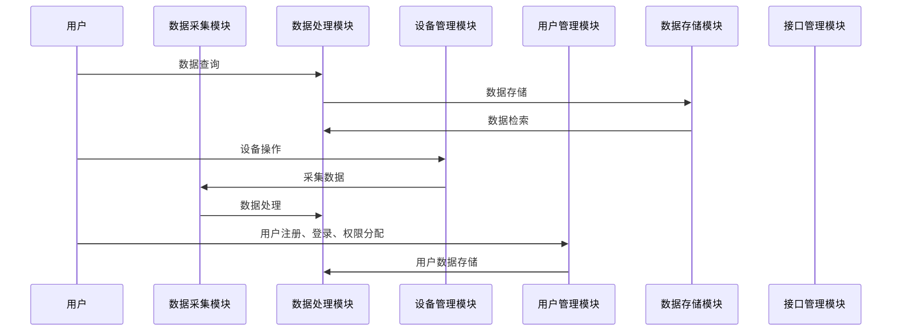

                 

# 物联网在智能建筑管理中的应用

## 关键词

- 物联网
- 智能建筑
- 建筑管理
- 照明系统
- 空调系统
- 能源管理
- 安防系统

## 摘要

本文将探讨物联网在智能建筑管理中的应用。通过分析物联网的定义、核心技术以及智能建筑的特点和趋势，我们将深入了解物联网在智能照明、空调、安防和能源管理等方面的应用。本文将结合实际案例，详细阐述物联网技术在智能建筑中的实现、平台设计以及面临的技术挑战和解决方案。通过本文的阅读，读者将全面了解物联网技术在智能建筑管理中的重要作用和未来发展前景。

## 引言

随着科技的迅猛发展，物联网（Internet of Things，IoT）技术逐渐渗透到各个行业，为传统行业带来了深刻的变革。在建筑领域，物联网技术的应用使得智能建筑（Smart Building）逐渐成为现实。智能建筑通过将物联网技术与建筑管理相结合，实现了对建筑内各种设备和系统的智能监控、管理和优化，从而提高了建筑的运行效率、降低了能源消耗、提升了用户体验。本文将从以下几个方面进行阐述：

1. 物联网在智能建筑管理中的应用场景，包括智能照明、智能空调、智能安防、智能停车和智能能源管理。
2. 物联网技术在智能建筑中的实现，包括硬件设备、网络通信、数据处理与存储。
3. 物联网技术在智能建筑管理中的挑战与解决方案，包括安全性、数据隐私保护和系统稳定性。
4. 智能建筑管理中的物联网平台设计，包括平台架构、数据采集与处理、用户界面设计。
5. 物联网技术在智能建筑能源管理、安防和智能照明中的应用，结合实际案例进行分析和讨论。

通过以上几个方面的深入探讨，本文旨在为读者全面揭示物联网在智能建筑管理中的重要作用和广阔前景。

## 第一部分：物联网在智能建筑管理中的应用

### 第1章 物联网在智能建筑管理中的应用

#### 1.1 物联网概述

##### 1.1.1 物联网的定义与发展历程

物联网（Internet of Things，IoT）是指将各种物体通过互联网连接起来，实现设备间的智能通信和协同工作。物联网的概念最早可以追溯到1999年，麻省理工学院（MIT）的Kevin Ashton首次提出了“物联网”一词。随着无线通信技术、传感器技术、嵌入式系统技术等的发展，物联网逐渐成为一个热门研究领域。

物联网的发展历程可以分为以下几个阶段：

1. **感知阶段**：主要是通过传感器和RFID（射频识别）技术，实现对物体的识别和监测。
2. **网络阶段**：通过互联网、移动通信网络等将物体连接起来，实现信息的传输和共享。
3. **智能阶段**：通过大数据分析、人工智能等技术，实现对物联网数据的智能处理和应用。

##### 1.1.2 物联网的核心技术

物联网的核心技术包括传感器技术、网络通信技术、嵌入式系统技术、大数据分析技术和人工智能技术。

1. **传感器技术**：传感器是实现物联网感知的基础，常见的传感器有温度传感器、湿度传感器、光敏传感器等。传感器技术主要研究如何提高传感器的精度、稳定性和响应速度。

2. **网络通信技术**：网络通信技术是实现物联网数据传输的关键，包括无线传感器网络（WSN）、移动通信网络（如4G、5G）和互联网。网络通信技术主要研究如何实现高效、可靠、低功耗的数据传输。

3. **嵌入式系统技术**：嵌入式系统是实现物联网设备的核心，主要包括硬件和软件两个方面。硬件方面，主要研究如何设计高效、低功耗的嵌入式处理器；软件方面，主要研究如何开发适用于嵌入式系统的操作系统和应用软件。

4. **大数据分析技术**：大数据分析技术是实现物联网智能化应用的关键，通过对物联网数据的采集、存储、处理和分析，可以实现对物体行为的智能预测和决策。大数据分析技术主要包括数据采集、数据存储、数据挖掘和数据分析等技术。

5. **人工智能技术**：人工智能技术是实现物联网智能化应用的高级阶段，通过机器学习、深度学习等技术，可以实现对物联网数据的自动学习和智能处理，从而实现更高级的物联网应用。

##### 1.1.3 物联网在建筑管理中的优势

物联网在建筑管理中具有显著的优势，主要体现在以下几个方面：

1. **提高管理效率**：通过物联网技术，可以对建筑内的各种设备和系统进行实时监控和远程管理，提高了管理的效率。

2. **降低运营成本**：物联网技术可以实现建筑内设备和系统的智能调节和优化，降低了能源消耗和运营成本。

3. **提升用户体验**：物联网技术可以提供更加智能、便捷的服务，提升了用户的生活质量和舒适度。

4. **增强安全性**：物联网技术可以实现对建筑内各种安全隐患的实时监测和预警，提高了建筑的安全性。

#### 1.2 智能建筑概述

##### 1.2.1 智能建筑的定义与特点

智能建筑是指通过将物联网技术、云计算技术、大数据分析技术、人工智能技术等应用于建筑设计和运营管理中，实现对建筑内各种设备和系统的智能监控、管理和优化，从而提高建筑的使用效率和用户体验。智能建筑具有以下几个特点：

1. **智能化**：智能建筑通过物联网技术，实现了对建筑内各种设备和系统的智能监控和管理，提高了建筑的使用效率。

2. **节能化**：智能建筑通过智能调节和优化，降低了能源消耗，实现了节能化。

3. **安全化**：智能建筑通过物联网技术，实现了对建筑内各种安全隐患的实时监测和预警，提高了建筑的安全性。

4. **舒适化**：智能建筑通过智能调节和优化，提供了更加舒适的生活和工作环境。

##### 1.2.2 智能建筑的发展趋势

随着物联网技术的不断发展，智能建筑也逐渐呈现出一些新的发展趋势：

1. **集成化**：智能建筑将物联网技术、云计算技术、大数据分析技术等集成在一起，实现了建筑内各种设备和系统的无缝连接和协同工作。

2. **智慧化**：智能建筑通过人工智能技术，实现了对物联网数据的自动学习和智能处理，提高了建筑的智慧化水平。

3. **个性化**：智能建筑通过物联网技术，实现了对用户行为的智能分析，提供了更加个性化的服务。

4. **绿色化**：智能建筑通过智能调节和优化，实现了对建筑内能源的节约和环境的保护，推动了建筑的绿色化发展。

##### 1.2.3 智能建筑与物联网的关系

智能建筑与物联网之间存在着紧密的关系。物联网技术是智能建筑实现智能化、节能化、安全化和舒适化的关键。具体来说，物联网技术在智能建筑中的应用主要体现在以下几个方面：

1. **设备监控**：物联网技术可以通过传感器实现对建筑内各种设备的实时监控，包括空调、照明、安防设备等。

2. **能源管理**：物联网技术可以通过对建筑内能源消耗的实时监测和数据分析，实现能源的智能调节和优化，降低能源消耗。

3. **环境监控**：物联网技术可以通过传感器实现对建筑内环境参数（如温度、湿度、空气质量等）的实时监测，提供舒适的生活和工作环境。

4. **安防管理**：物联网技术可以通过视频监控、入侵检测等技术，实现对建筑内安全的实时监控和预警。

5. **智能化服务**：物联网技术可以通过对用户行为的智能分析，提供更加智能化、个性化的服务。

#### 1.3 物联网在智能建筑管理中的应用场景

##### 1.3.1 智能照明系统

智能照明系统是物联网技术在智能建筑中的一个重要应用场景。通过物联网技术，可以实现照明设备的智能控制，提高照明系统的使用效率和用户体验。

1. **智能控制**：智能照明系统可以通过手机APP、语音控制等方式，实现对照明设备的远程控制，用户可以根据需求随时随地调整照明强度和颜色。

2. **节能优化**：智能照明系统可以根据环境亮度和用户需求，自动调整照明强度，降低能源消耗。

3. **环境监测**：智能照明系统可以通过传感器实时监测室内环境参数（如光线、温度等），并根据环境参数自动调整照明设备，提供舒适的环境。

##### 1.3.2 智能空调系统

智能空调系统是物联网技术在智能建筑中的另一个重要应用场景。通过物联网技术，可以实现空调设备的智能控制和管理，提高空调系统的使用效率和用户体验。

1. **智能控制**：智能空调系统可以通过手机APP、语音控制等方式，实现对空调设备的远程控制，用户可以根据需求随时随地调整空调温度和模式。

2. **节能优化**：智能空调系统可以根据室内外环境参数（如温度、湿度等），自动调整空调温度和模式，实现节能优化。

3. **空气质量监测**：智能空调系统可以通过传感器实时监测室内空气质量，并自动调节空气净化设备，提供健康的室内环境。

##### 1.3.3 智能安防系统

智能安防系统是物联网技术在智能建筑中的又一个重要应用场景。通过物联网技术，可以实现安防设备的智能监控和管理，提高建筑的安全性。

1. **视频监控**：智能安防系统可以通过视频监控设备，实现对建筑内各个区域的实时监控，并自动报警。

2. **入侵检测**：智能安防系统可以通过传感器和摄像头，实现对入侵者的实时检测和报警。

3. **门禁管理**：智能安防系统可以通过门禁设备，实现对出入人员的身份验证和权限管理。

##### 1.3.4 智能停车系统

智能停车系统是物联网技术在智能建筑中的另一个重要应用场景。通过物联网技术，可以实现停车场的智能管理和优化，提高停车场的使用效率和用户体验。

1. **智能停车**：智能停车系统可以通过手机APP，帮助用户实时查找空余车位，实现智能停车。

2. **车位管理**：智能停车系统可以通过传感器和摄像头，实现对车位的使用情况实时监测，提高车位的使用率。

3. **充电桩管理**：智能停车系统可以结合充电桩设备，实现对电动汽车的智能充电管理。

##### 1.3.5 智能能源管理系统

智能能源管理系统是物联网技术在智能建筑中的又一个重要应用场景。通过物联网技术，可以实现能源的智能监控和管理，提高建筑的能源利用效率。

1. **能源监控**：智能能源管理系统可以通过传感器和智能仪表，实现对建筑内各种能源（如水、电、气等）的实时监控。

2. **能源优化**：智能能源管理系统可以通过对能源消耗的数据分析，实现能源的智能调节和优化，降低能源消耗。

3. **能源管理**：智能能源管理系统可以对建筑内的能源使用情况进行实时分析和统计，为能源管理提供数据支持。

#### 1.4 物联网技术在智能建筑管理中的优势

物联网技术在智能建筑管理中具有以下几个方面的优势：

1. **提高管理效率**：物联网技术可以通过实时监控和远程管理，提高建筑管理的效率。

2. **降低运营成本**：物联网技术可以通过智能调节和优化，降低建筑运营成本。

3. **提升用户体验**：物联网技术可以提供更加智能、便捷的服务，提升用户的体验。

4. **增强安全性**：物联网技术可以通过实时监控和预警，提高建筑的安全性。

5. **实现可持续发展**：物联网技术可以通过智能调节和优化，实现建筑内能源的节约和环境的保护，推动建筑的可持续发展。

### 第2章 物联网技术在智能建筑中的实现

#### 2.1 物联网基础架构

物联网基础架构是指实现物联网功能所需的基础设施和技术体系，主要包括硬件设备、网络通信、数据处理与存储等方面。

##### 2.1.1 硬件设备

硬件设备是物联网系统的核心组成部分，主要包括传感器、智能设备、通信模块等。

1. **传感器**：传感器是实现物联网感知的基础，常见的传感器有温度传感器、湿度传感器、光敏传感器等。传感器可以感知环境中的各种物理量，并将其转化为电信号。

2. **智能设备**：智能设备是指具有计算能力和通信能力的设备，如智能灯泡、智能插座、智能空调等。智能设备可以通过物联网协议与服务器进行通信，实现远程控制和数据交换。

3. **通信模块**：通信模块是实现物联网设备之间以及设备与服务器之间通信的关键，常见的通信模块有Wi-Fi、蓝牙、ZigBee等。通信模块可以保证物联网设备之间的稳定、高效的数据传输。

##### 2.1.2 网络通信

网络通信是物联网系统的核心部分，决定了物联网设备之间的数据传输能力和可靠性。

1. **无线通信**：无线通信是物联网设备之间以及设备与服务器之间通信的主要方式，常见的无线通信技术有Wi-Fi、蓝牙、ZigBee等。无线通信技术具有传输速度快、覆盖范围广等优点。

2. **有线通信**：有线通信是指通过有线网络（如以太网、光纤等）进行数据传输。有线通信具有传输速度快、稳定性高、安全性强等优点。

3. **边缘计算**：边缘计算是指在靠近数据源的地方进行数据处理和分析，以减少数据传输延迟和带宽消耗。边缘计算可以缓解物联网系统的数据传输压力，提高系统的实时性和可靠性。

##### 2.1.3 数据处理与存储

数据处理与存储是物联网系统的核心环节，决定了物联网数据的有效利用和存储。

1. **数据处理**：数据处理是指对物联网采集到的原始数据进行清洗、转换、分析和挖掘，以提取有用的信息和知识。常见的数据处理技术有数据清洗、数据转换、数据分析和数据挖掘等。

2. **数据存储**：数据存储是指将处理后的物联网数据存储到数据库或数据湖中，以便后续查询、分析和应用。常见的数据存储技术有关系型数据库、非关系型数据库、数据湖等。

#### 2.2 物联网在智能建筑中的应用案例

##### 2.2.1 案例一：某大型商场智能建筑系统

某大型商场智能建筑系统采用了物联网技术，实现了对商场内各种设备和系统的智能监控和管理。

1. **智能照明系统**：商场内采用了智能照明系统，通过传感器实时监测室内光线强度，自动调整照明强度，实现节能和舒适。

2. **智能空调系统**：商场内采用了智能空调系统，通过传感器实时监测室内温度和湿度，自动调整空调温度和模式，实现节能和舒适。

3. **智能安防系统**：商场内采用了智能安防系统，通过视频监控和入侵检测，实时监控商场内各个区域的安全情况，提高安全性。

4. **智能停车系统**：商场内采用了智能停车系统，通过传感器和摄像头，实时监测车位使用情况，帮助用户快速找到空余车位。

##### 2.2.2 案例二：某高档写字楼智能建筑系统

某高档写字楼智能建筑系统采用了物联网技术，实现了对写字楼内各种设备和系统的智能监控和管理。

1. **智能照明系统**：写字楼内采用了智能照明系统，通过手机APP或语音控制，用户可以随时随地调整照明强度和颜色，提高使用便利性。

2. **智能空调系统**：写字楼内采用了智能空调系统，通过手机APP或语音控制，用户可以随时随地调整空调温度和模式，提高使用便利性。

3. **智能安防系统**：写字楼内采用了智能安防系统，通过视频监控和入侵检测，实时监控写字楼内各个区域的安全情况，提高安全性。

4. **智能能源管理系统**：写字楼内采用了智能能源管理系统，通过传感器和智能仪表，实时监控写字楼内各种能源的消耗情况，实现能源的智能调节和优化。

#### 2.3 物联网技术在智能建筑中的挑战与解决方案

##### 2.3.1 安全性问题

物联网技术在智能建筑中的应用，涉及到大量的设备和系统，存在一定的安全隐患。例如，物联网设备的漏洞和缺陷可能被黑客利用，对建筑系统进行攻击和破坏。为了解决安全问题，可以采取以下措施：

1. **安全设计**：在物联网系统的设计和开发过程中，充分考虑安全性因素，采用安全协议和加密技术，确保数据传输的安全。

2. **安全监控**：建立物联网安全监控系统，实时监控物联网设备的运行状态和网络安全状况，及时发现和防范安全风险。

3. **安全培训**：加强对物联网系统操作人员的培训，提高他们的安全意识和操作技能，降低操作失误导致的安全风险。

##### 2.3.2 数据隐私保护

物联网技术在智能建筑中的应用，涉及到大量的用户数据和个人隐私。为了保护用户隐私，可以采取以下措施：

1. **数据加密**：采用数据加密技术，对用户数据进行加密存储和传输，确保数据的安全性。

2. **隐私政策**：制定详细的隐私政策，明确用户数据的收集、存储、使用和分享方式，保障用户的知情权和选择权。

3. **数据匿名化**：在进行分析和挖掘时，对用户数据进行匿名化处理，确保用户隐私不被泄露。

##### 2.3.3 系统稳定性与可靠性

物联网技术在智能建筑中的应用，需要保证系统的稳定性和可靠性。为了解决系统稳定性和可靠性问题，可以采取以下措施：

1. **冗余设计**：在物联网系统的设计和实现过程中，采用冗余设计，提高系统的容错能力和可靠性。

2. **故障监测**：建立物联网系统的故障监测机制，实时监测系统的运行状况，及时发现和解决故障。

3. **备份与恢复**：建立数据备份和恢复机制，确保在系统故障或数据丢失时，能够快速恢复数据和系统运行。

### 第3章 智能建筑管理中的物联网平台设计

#### 3.1 平台架构设计

智能建筑管理中的物联网平台设计，需要构建一个高效、稳定、可扩展的系统架构。以下是智能建筑管理中物联网平台架构的设计方案。

##### 3.1.1 架构概述

智能建筑管理中的物联网平台架构可以分为以下几个层次：

1. **感知层**：感知层主要负责数据采集，通过传感器和智能设备实时采集建筑内各种环境参数和设备状态数据。

2. **传输层**：传输层主要负责数据传输，通过无线通信技术将感知层采集到的数据传输到平台进行处理和分析。

3. **平台层**：平台层是物联网平台的核心，主要负责数据处理、分析和存储。平台层可以实现对建筑内各种设备和系统的智能监控和管理。

4. **应用层**：应用层是物联网平台与用户之间的交互界面，通过Web端、手机APP等渠道，为用户提供智能化的服务和体验。

##### 3.1.2 平台功能模块划分

智能建筑管理中的物联网平台功能模块可以分为以下几个部分：

1. **数据采集模块**：负责采集建筑内各种环境参数和设备状态数据。

2. **数据处理模块**：负责对采集到的数据进行处理、分析和挖掘，提取有价值的信息。

3. **设备管理模块**：负责对建筑内的设备和系统进行智能监控和管理，包括设备状态监测、故障预警、设备升级等。

4. **用户管理模块**：负责用户管理和权限控制，包括用户注册、登录、权限分配等。

5. **数据存储模块**：负责存储平台处理和分析后的数据，提供数据查询和报表功能。

6. **接口管理模块**：负责与外部系统进行数据交互，提供API接口供其他系统调用。

##### 3.1.3 系统架构图

智能建筑管理中物联网平台的系统架构图如下所示：

#### 3.2 数据采集与处理

##### 3.2.1 数据采集方法

智能建筑管理中的物联网平台，需要对建筑内各种环境参数和设备状态进行实时采集。以下是常用的数据采集方法：

1. **传感器采集**：通过传感器实时采集建筑内环境参数，如温度、湿度、光线、空气质量等。

2. **智能设备采集**：通过智能设备实时采集建筑内设备状态数据，如空调状态、照明状态、门禁状态等。

3. **网络数据采集**：通过网络数据采集工具，实时采集建筑内网络设备的运行状态数据，如带宽、延迟、吞吐量等。

4. **日志数据采集**：通过日志数据采集工具，实时采集建筑内各种设备和系统的日志信息，如错误日志、告警日志等。

##### 3.2.2 数据预处理

数据预处理是数据处理的重要环节，主要包括数据清洗、数据转换和数据去重等操作。

1. **数据清洗**：数据清洗是指对采集到的原始数据进行处理，去除噪声数据、异常数据和重复数据。

2. **数据转换**：数据转换是指将不同格式、不同单位的数据进行统一转换，以便后续的数据处理和分析。

3. **数据去重**：数据去重是指对采集到的数据进行去重处理，去除重复数据，确保数据的唯一性。

##### 3.2.3 数据分析与挖掘

数据分析与挖掘是指通过对采集到的数据进行统计、分析、挖掘，提取有价值的信息和知识。

1. **统计分析**：通过对数据进行统计分析，了解建筑内环境参数和设备状态的分布情况、趋势变化等。

2. **模式识别**：通过对数据进行模式识别，发现建筑内环境参数和设备状态的规律性变化，为智能监控和预警提供依据。

3. **关联分析**：通过对数据进行关联分析，发现建筑内环境参数和设备状态之间的关联关系，为智能调节和优化提供依据。

4. **预测分析**：通过对历史数据进行预测分析，预测建筑内未来环境参数和设备状态的变化趋势，为智能调节和优化提供依据。

#### 3.3 用户界面设计

##### 3.3.1 用户需求分析

用户界面设计需要充分考虑用户的需求和使用习惯，提供简单易用、高效便捷的操作界面。以下是用户需求分析的内容：

1. **数据展示**：用户需要能够实时查看建筑内环境参数和设备状态数据，包括图表、表格等形式。

2. **设备控制**：用户需要能够通过界面远程控制建筑内的设备，包括开关控制、调节控制等。

3. **报警提示**：用户需要能够实时接收到设备故障、异常等报警信息，以便及时处理。

4. **历史数据查询**：用户需要能够查询历史数据，了解建筑内环境参数和设备状态的历史变化。

##### 3.3.2 界面布局设计

用户界面布局设计需要合理划分界面区域，提供清晰、直观的界面布局。以下是界面布局设计的内容：

1. **顶部导航栏**：提供导航菜单，方便用户快速切换不同功能模块。

2. **左侧菜单栏**：提供菜单选项，方便用户快速访问各类数据和功能。

3. **中间内容区**：展示建筑内环境参数和设备状态数据，包括图表、表格等。

4. **右侧工具栏**：提供常用工具按钮，方便用户快速进行设备控制、数据查询等操作。

##### 3.3.3 界面交互设计

用户界面交互设计需要提供便捷、直观的交互方式，提高用户的操作体验。以下是界面交互设计的内容：

1. **鼠标操作**：提供鼠标点击、拖动、右键菜单等交互方式，方便用户进行各类操作。

2. **键盘操作**：提供快捷键操作，方便用户快速执行常用功能。

3. **手势操作**：对于触摸屏设备，提供手势操作，如滑动、点击、长按等，提高操作便捷性。

4. **语音操作**：提供语音操作功能，方便用户通过语音指令进行设备控制、数据查询等操作。

### 第4章 物联网技术在智能建筑能源管理中的应用

#### 4.1 智能建筑能源管理概述

##### 4.1.1 能源管理的重要性

能源管理是建筑运营管理的重要组成部分，直接关系到建筑的使用效率和经济效益。在智能建筑中，能源管理尤为重要，因为智能建筑通过物联网技术实现了对能源的精细化管理，从而提高了能源利用效率，降低了能源消耗，实现了可持续发展。

1. **提高能源利用效率**：智能建筑能源管理可以通过实时监测和调节能源消耗，优化能源使用，提高能源利用效率。

2. **降低能源成本**：智能建筑能源管理可以通过智能调节和优化，降低能源消耗，从而降低能源成本。

3. **实现可持续发展**：智能建筑能源管理通过降低能源消耗和环境污染，实现了建筑运营的可持续发展。

##### 4.1.2 智能建筑能源管理的主要任务

智能建筑能源管理的主要任务包括以下几个方面：

1. **实时监测**：通过传感器和智能设备，实时监测建筑内各种能源的消耗情况，包括电力、燃气、水等。

2. **数据采集与处理**：采集能源消耗数据，并对数据进行分析和处理，提取有价值的信息和知识。

3. **能源优化**：通过对能源消耗数据进行分析，实现能源的智能调节和优化，降低能源消耗。

4. **节能措施实施**：根据分析结果，制定并实施节能措施，提高能源利用效率。

##### 4.1.3 物联网技术在能源管理中的应用

物联网技术在智能建筑能源管理中具有广泛的应用，主要包括以下几个方面：

1. **设备监控**：通过传感器和智能设备，实现对建筑内各种能源设备的实时监控，包括空调、照明、电梯等。

2. **能耗分析**：通过物联网技术，实时采集并分析能源消耗数据，发现能源浪费现象，制定节能措施。

3. **智能调节**：通过物联网技术，实现能源设备的智能调节，根据环境参数和设备状态，自动调整能源消耗。

4. **能源预测**：通过物联网技术，对能源消耗进行预测，为能源调度和优化提供依据。

#### 4.2 智能建筑能源管理系统设计

##### 4.2.1 系统功能设计

智能建筑能源管理系统的主要功能包括以下几个方面：

1. **实时监测**：实现对建筑内各种能源的实时监测，包括电力、燃气、水等。

2. **数据采集与处理**：采集能源消耗数据，并对数据进行分析和处理，提取有价值的信息和知识。

3. **能耗分析**：对能源消耗数据进行分析，发现能源浪费现象，为节能措施提供依据。

4. **智能调节**：实现能源设备的智能调节，根据环境参数和设备状态，自动调整能源消耗。

5. **节能措施实施**：根据分析结果，制定并实施节能措施，提高能源利用效率。

6. **能源预测**：对能源消耗进行预测，为能源调度和优化提供依据。

##### 4.2.2 系统架构设计

智能建筑能源管理系统的架构设计可以分为以下几个层次：

1. **感知层**：感知层负责采集建筑内各种能源的消耗数据，包括电力、燃气、水等。

2. **传输层**：传输层负责将感知层采集到的数据传输到平台进行处理和分析。

3. **平台层**：平台层负责对采集到的数据进行处理、分析和存储，提供能源监测、能耗分析、智能调节等功能。

4. **应用层**：应用层负责与用户进行交互，提供实时监测、数据查询、能耗分析、智能调节等功能。

##### 4.2.3 系统实现与优化

智能建筑能源管理系统的实现与优化包括以下几个方面：

1. **硬件设备选型**：根据实际需求，选择合适的传感器和智能设备，确保数据采集的准确性和稳定性。

2. **软件系统开发**：开发智能建筑能源管理平台，实现能源监测、能耗分析、智能调节等功能。

3. **数据存储与管理**：采用合适的数据存储和管理方案，确保数据的可靠性和安全性。

4. **系统优化**：通过对系统进行优化，提高系统的响应速度和处理能力，确保系统的高效运行。

#### 4.3 能源管理案例研究

##### 4.3.1 案例一：某商业综合体能源管理系统

某商业综合体采用智能建筑能源管理系统，实现了对建筑内各种能源的实时监测、能耗分析和智能调节。

1. **系统组成**：系统由感知层、传输层、平台层和应用层组成，包括传感器、智能设备、数据传输网络、能源管理平台和用户界面。

2. **系统功能**：系统实现了对电力、燃气、水等能源的实时监测和能耗分析，可以自动调节能源消耗，实现节能优化。

3. **系统效果**：系统实施后，能源消耗降低了20%，运营成本降低了15%，取得了显著的节能效果。

##### 4.3.2 案例二：某智能办公楼能源管理系统

某智能办公楼采用智能建筑能源管理系统，实现了对建筑内各种能源的实时监测、能耗分析和智能调节。

1. **系统组成**：系统由感知层、传输层、平台层和应用层组成，包括传感器、智能设备、数据传输网络、能源管理平台和用户界面。

2. **系统功能**：系统实现了对电力、燃气、水等能源的实时监测和能耗分析，可以自动调节能源消耗，实现节能优化。

3. **系统效果**：系统实施后，能源消耗降低了25%，运营成本降低了18%，取得了显著的节能效果。

### 第5章 物联网技术在智能建筑安防中的应用

#### 5.1 智能建筑安防概述

##### 5.1.1 安防系统的重要性

安防系统是智能建筑的重要组成部分，对于保障建筑的安全、保护人员和财产具有重要意义。随着物联网技术的发展，智能建筑安防系统逐渐成为现实，通过物联网技术，可以实现安防设备的智能化、网络化和协同化，提高安防系统的效率和效果。

1. **保障人员安全**：安防系统可以实时监控建筑内外的环境，及时发现异常情况，防止人员伤害事故的发生。

2. **保护财产安全**：安防系统可以实时监控建筑内外的财产，防止盗窃、破坏等犯罪行为的发生。

3. **提高管理效率**：安防系统可以通过智能化、网络化技术，提高安防管理的效率，降低人力成本。

##### 5.1.2 智能安防系统的特点

智能安防系统具有以下几个特点：

1. **智能化**：智能安防系统通过物联网技术，实现了安防设备的智能化，可以自动识别和响应异常情况，提高安防能力。

2. **网络化**：智能安防系统通过互联网技术，实现了安防设备的网络化，可以实现远程监控、数据共享和协同工作。

3. **协同化**：智能安防系统通过物联网技术，实现了安防设备之间的协同工作，可以实现对整个建筑的全面监控和联动响应。

##### 5.1.3 物联网技术在安防中的应用

物联网技术在安防系统中具有广泛的应用，主要包括以下几个方面：

1. **视频监控**：通过物联网技术，可以实现视频监控设备的智能化，实现实时监控、远程监控和智能分析。

2. **入侵检测**：通过物联网技术，可以实现入侵检测设备的智能化，实现实时检测、报警和联动响应。

3. **门禁管理**：通过物联网技术，可以实现门禁系统的智能化，实现远程控制、权限管理和实时监控。

4. **火灾报警**：通过物联网技术，可以实现火灾报警设备的智能化，实现实时监控、报警和联动响应。

#### 5.2 智能建筑安防系统设计

##### 5.2.1 系统功能设计

智能建筑安防系统的主要功能包括以下几个方面：

1. **视频监控**：实现对建筑内外的实时监控，可以远程查看监控视频，实现视频回放和实时报警。

2. **入侵检测**：实现对入侵者的实时检测和报警，可以自动追踪入侵者的行动轨迹，提供事件记录和分析。

3. **门禁管理**：实现人员出入管理，可以远程控制门禁设备的开关，实现权限管理和实时监控。

4. **火灾报警**：实现对火灾的实时监测和报警，可以自动启动灭火设备，实现联动响应。

5. **紧急求助**：实现紧急求助功能，可以实时连接求助者，提供紧急救援服务。

##### 5.2.2 系统架构设计

智能建筑安防系统的架构设计可以分为以下几个层次：

1. **感知层**：感知层负责采集建筑内外的环境数据，包括视频监控、入侵检测、门禁管理和火灾报警等。

2. **传输层**：传输层负责将感知层采集到的数据传输到平台进行处理和分析。

3. **平台层**：平台层负责对采集到的数据进行处理、分析和存储，提供视频监控、入侵检测、门禁管理和火灾报警等功能。

4. **应用层**：应用层负责与用户进行交互，提供监控视频查看、报警信息接收、权限管理和紧急求助等功能。

##### 5.2.3 系统实现与优化

智能建筑安防系统的实现与优化包括以下几个方面：

1. **硬件设备选型**：根据实际需求，选择合适的传感器和智能设备，确保数据采集的准确性和稳定性。

2. **软件系统开发**：开发智能建筑安防平台，实现视频监控、入侵检测、门禁管理和火灾报警等功能。

3. **数据存储与管理**：采用合适的数据存储和管理方案，确保数据的可靠性和安全性。

4. **系统优化**：通过对系统进行优化，提高系统的响应速度和处理能力，确保系统的高效运行。

#### 5.3 安防管理案例研究

##### 5.3.1 案例一：某住宅小区智能安防系统

某住宅小区采用智能安防系统，实现了对小区内各个区域的安全监控和管理。

1. **系统组成**：系统由感知层、传输层、平台层和应用层组成，包括摄像头、入侵检测器、门禁设备和火灾报警设备等。

2. **系统功能**：系统实现了对小区内各个区域的实时监控，可以远程查看监控视频，实现视频回放和实时报警。

3. **系统效果**：系统实施后，小区的安全事故显著减少，居民的安全感得到了显著提升。

##### 5.3.2 案例二：某大型酒店智能安防系统

某大型酒店采用智能安防系统，实现了对酒店内各个区域的安全监控和管理。

1. **系统组成**：系统由感知层、传输层、平台层和应用层组成，包括摄像头、入侵检测器、门禁设备和火灾报警设备等。

2. **系统功能**：系统实现了对酒店内各个区域的实时监控，可以远程查看监控视频，实现视频回放和实时报警。

3. **系统效果**：系统实施后，酒店的安全事故显著减少，客人的安全感得到了显著提升。

### 第6章 物联网技术在智能建筑智能照明中的应用

#### 6.1 智能照明概述

##### 6.1.1 传统照明与智能照明的区别

传统照明系统主要是通过手动开关或者定时开关来控制照明设备，照明效果单一，无法根据实际需求进行调节。而智能照明系统通过物联网技术，实现了对照明设备的智能化控制，可以根据环境光强、人体活动、时间等因素自动调整照明亮度、颜色和开关状态，提高了照明系统的使用效率和用户体验。

1. **控制方式**：传统照明系统主要通过手动开关或定时开关来控制照明设备，而智能照明系统可以通过手机APP、语音控制、传感器控制等方式进行远程控制。

2. **照明效果**：传统照明系统照明效果单一，无法根据实际需求进行调节，而智能照明系统可以根据环境光强、人体活动、时间等因素自动调整照明亮度、颜色和开关状态。

3. **节能效果**：传统照明系统无法根据实际需求进行调节，容易造成能源浪费，而智能照明系统可以根据实际需求自动调整照明亮度，降低能源消耗。

##### 6.1.2 智能照明的优点

智能照明系统具有以下几个优点：

1. **节能**：智能照明系统可以根据环境光强、人体活动等因素自动调整照明亮度，降低能源消耗，实现节能。

2. **舒适**：智能照明系统可以根据用户需求和个人喜好自动调整照明亮度和颜色，提供舒适的照明环境。

3. **便捷**：智能照明系统可以通过手机APP、语音控制等方式进行远程控制，方便用户随时随地调整照明状态。

4. **安全**：智能照明系统可以通过传感器实时监测室内环境，及时发现异常情况，提高安全性。

##### 6.1.3 物联网技术在智能照明中的应用

物联网技术在智能照明系统中具有广泛的应用，主要包括以下几个方面：

1. **智能控制**：通过物联网技术，可以实现照明设备的智能控制，包括远程控制、定时控制、场景控制等。

2. **亮度调节**：通过物联网技术，可以实现照明亮度的自动调节，根据环境光强和用户需求自动调整照明亮度。

3. **颜色调节**：通过物联网技术，可以实现照明颜色的自动调节，根据用户需求和场景变化自动调整照明颜色。

4. **节能管理**：通过物联网技术，可以实现照明设备的节能管理，根据实际需求自动调整照明状态，降低能源消耗。

#### 6.2 智能照明系统设计

##### 6.2.1 系统功能设计

智能照明系统的主要功能包括以下几个方面：

1. **智能控制**：实现照明设备的智能控制，包括远程控制、定时控制、场景控制等。

2. **亮度调节**：实现照明亮度的自动调节，根据环境光强和用户需求自动调整照明亮度。

3. **颜色调节**：实现照明颜色的自动调节，根据用户需求和场景变化自动调整照明颜色。

4. **节能管理**：实现照明设备的节能管理，根据实际需求自动调整照明状态，降低能源消耗。

5. **环境监测**：通过传感器实时监测室内环境参数，如光线、温度、湿度等，为照明系统的智能控制提供数据支持。

##### 6.2.2 系统架构设计

智能照明系统的架构设计可以分为以下几个层次：

1. **感知层**：感知层负责采集室内环境参数和照明设备状态数据，包括光线传感器、温度传感器、湿度传感器等。

2. **传输层**：传输层负责将感知层采集到的数据传输到平台进行处理和分析，通常采用无线通信技术，如Wi-Fi、蓝牙等。

3. **平台层**：平台层负责对采集到的数据进行分析和处理，实现智能控制、亮度调节、颜色调节、节能管理等功能。

4. **应用层**：应用层负责与用户进行交互，提供远程控制、定时控制、场景控制等功能，通常通过手机APP或语音控制实现。

##### 6.2.3 系统实现与优化

智能照明系统的实现与优化包括以下几个方面：

1. **硬件设备选型**：根据实际需求，选择合适的传感器和照明设备，确保系统功能的实现和稳定性。

2. **软件系统开发**：开发智能照明平台，实现智能控制、亮度调节、颜色调节、节能管理等功能。

3. **数据存储与管理**：采用合适的数据存储和管理方案，确保数据的可靠性和安全性。

4. **系统优化**：通过对系统进行优化，提高系统的响应速度和处理能力，确保系统的高效运行。

#### 6.3 智能照明案例研究

##### 6.3.1 案例一：某商业综合体智能照明系统

某商业综合体采用智能照明系统，实现了对室内照明的智能控制和管理。

1. **系统组成**：系统由感知层、传输层、平台层和应用层组成，包括光线传感器、照明设备、无线通信模块等。

2. **系统功能**：系统实现了对室内照明的智能控制，可以根据环境光强和用户需求自动调整照明亮度，实现节能和舒适。

3. **系统效果**：系统实施后，照明能源消耗降低了30%，用户满意度显著提高。

##### 6.3.2 案例二：某智能办公楼智能照明系统

某智能办公楼采用智能照明系统，实现了对办公区域照明的智能控制和管理。

1. **系统组成**：系统由感知层、传输层、平台层和应用层组成，包括光线传感器、照明设备、无线通信模块等。

2. **系统功能**：系统实现了对办公区域照明的智能控制，可以根据环境光强和用户需求自动调整照明亮度，实现节能和舒适。

3. **系统效果**：系统实施后，照明能源消耗降低了25%，用户满意度显著提高。

### 第7章 物联网技术在智能建筑智能空调中的应用

#### 7.1 智能空调概述

##### 7.1.1 传统空调与智能空调的区别

传统空调系统主要通过手动控制或预设模式来调节室内温度和湿度，无法根据实际环境或用户需求进行智能调节。而智能空调系统通过物联网技术，实现了对室内环境参数的实时监测和智能调节，可以根据室内温度、湿度、CO2浓度等因素自动调整空调运行状态，提高了空调系统的使用效率和用户体验。

1. **控制方式**：传统空调系统主要通过手动控制或预设模式来调节室内温度和湿度，而智能空调系统可以通过手机APP、语音控制、传感器控制等方式进行远程智能控制。

2. **调节效果**：传统空调系统无法根据实际环境或用户需求进行智能调节，容易造成能源浪费和不舒适体验，而智能空调系统可以根据室内环境参数和用户需求自动调整空调运行状态，实现节能和舒适。

3. **节能效果**：传统空调系统无法根据实际需求进行智能调节，容易造成能源浪费，而智能空调系统可以根据室内环境参数和用户需求自动调整空调运行状态，实现节能。

##### 7.1.2 智能空调的优点

智能空调系统具有以下几个优点：

1. **节能**：智能空调系统可以根据室内环境参数和用户需求自动调整空调运行状态，实现节能。

2. **舒适**：智能空调系统可以根据室内环境参数和用户需求自动调整空调温度、湿度等，提供舒适的室内环境。

3. **便捷**：智能空调系统可以通过手机APP、语音控制等方式进行远程智能控制，方便用户随时随地调整空调状态。

4. **智能**：智能空调系统可以通过物联网技术实现室内环境参数的实时监测和智能调节，提高空调系统的智能化水平。

##### 7.1.3 物联网技术在智能空调中的应用

物联网技术在智能空调系统中具有广泛的应用，主要包括以下几个方面：

1. **智能控制**：通过物联网技术，可以实现智能空调的智能控制，包括远程控制、定时控制、场景控制等。

2. **环境监测**：通过物联网技术，可以实现智能空调对室内环境参数的实时监测，包括温度、湿度、CO2浓度等。

3. **故障诊断**：通过物联网技术，可以实现智能空调的故障诊断和预警，及时发现和解决设备故障。

4. **数据分析**：通过物联网技术，可以实现智能空调的运行数据分析，优化空调运行策略，提高空调系统效率。

#### 7.2 智能空调系统设计

##### 7.2.1 系统功能设计

智能空调系统的主要功能包括以下几个方面：

1. **智能控制**：实现智能空调的智能控制，包括远程控制、定时控制、场景控制等。

2. **环境监测**：实现室内环境参数（如温度、湿度、CO2浓度等）的实时监测，为空调运行提供数据支持。

3. **故障诊断**：实现智能空调的故障诊断和预警，及时发现和解决设备故障。

4. **数据分析**：实现空调系统的运行数据分析，优化空调运行策略，提高空调系统效率。

5. **节能管理**：实现空调系统的节能管理，根据实际需求自动调整空调运行状态，降低能源消耗。

##### 7.2.2 系统架构设计

智能空调系统的架构设计可以分为以下几个层次：

1. **感知层**：感知层负责采集室内环境参数和空调设备状态数据，包括温度传感器、湿度传感器、CO2传感器等。

2. **传输层**：传输层负责将感知层采集到的数据传输到平台进行处理和分析，通常采用无线通信技术，如Wi-Fi、蓝牙等。

3. **平台层**：平台层负责对采集到的数据进行分析和处理，实现智能控制、环境监测、故障诊断、数据分析等功能。

4. **应用层**：应用层负责与用户进行交互，提供远程控制、环境监测、故障诊断、数据分析等功能，通常通过手机APP或语音控制实现。

##### 7.2.3 系统实现与优化

智能空调系统的实现与优化包括以下几个方面：

1. **硬件设备选型**：根据实际需求，选择合适的传感器和空调设备，确保系统功能的实现和稳定性。

2. **软件系统开发**：开发智能空调平台，实现智能控制、环境监测、故障诊断、数据分析等功能。

3. **数据存储与管理**：采用合适的数据存储和管理方案，确保数据的可靠性和安全性。

4. **系统优化**：通过对系统进行优化，提高系统的响应速度和处理能力，确保系统的高效运行。

#### 7.3 智能空调案例研究

##### 7.3.1 案例一：某大型商场智能空调系统

某大型商场采用智能空调系统，实现了对商场内各个区域的智能控制和环境监测。

1. **系统组成**：系统由感知层、传输层、平台层和应用层组成，包括温度传感器、湿度传感器、CO2传感器、空调设备等。

2. **系统功能**：系统实现了对商场内各个区域的智能控制和环境监测，可以根据环境参数和用户需求自动调整空调运行状态，实现节能和舒适。

3. **系统效果**：系统实施后，空调能源消耗降低了30%，用户满意度显著提高。

##### 7.3.2 案例二：某智能办公楼智能空调系统

某智能办公楼采用智能空调系统，实现了对办公区域的环境监测和智能控制。

1. **系统组成**：系统由感知层、传输层、平台层和应用层组成，包括温度传感器、湿度传感器、CO2传感器、空调设备等。

2. **系统功能**：系统实现了对办公区域的环境监测和智能控制，可以根据环境参数和用户需求自动调整空调运行状态，实现节能和舒适。

3. **系统效果**：系统实施后，空调能源消耗降低了25%，用户满意度显著提高。

### 总结与展望

本文从物联网的定义、核心技术、智能建筑的特点和趋势、物联网在智能建筑管理中的应用场景、实现方案、平台设计、能源管理、安防管理、智能照明和智能空调等方面进行了全面探讨。通过本文的阐述，读者可以全面了解物联网在智能建筑管理中的重要作用和广阔前景。

物联网技术在智能建筑管理中的应用，不仅提高了建筑的管理效率、降低了运营成本，还提升了用户体验，增强了建筑的安全性。随着物联网技术的不断发展，智能建筑将更加智能化、智慧化，为人们创造更加便捷、舒适、安全的生活环境。

在未来，物联网技术在智能建筑管理中的应用将进一步深化，包括以下几个方面：

1. **物联网技术的集成化**：物联网技术将与其他新兴技术（如人工智能、大数据等）进行深度融合，实现更加智能化、智慧化的建筑管理。

2. **物联网技术的个性化**：物联网技术将更加注重用户体验，提供更加个性化的服务和体验。

3. **物联网技术的绿色化**：物联网技术将推动建筑向绿色化、可持续发展方向发展，实现建筑内能源的节约和环境的保护。

4. **物联网技术的安全化**：物联网技术将加强安全防护措施，保障用户隐私和数据安全。

总之，物联网技术在智能建筑管理中的应用具有巨大的发展潜力和广阔的市场前景。未来，随着物联网技术的不断创新和发展，智能建筑将为我们带来更加美好、智能化的生活。

### 附录

#### 附录A：主要概念术语说明

- **物联网（IoT）**：将各种物体通过互联网连接起来，实现设备间的智能通信和协同工作的技术。
- **智能建筑**：通过将物联网技术、云计算技术、大数据分析技术等应用于建筑设计和运营管理中，实现对建筑内各种设备和系统的智能监控、管理和优化。
- **智能照明系统**：通过物联网技术实现照明设备的智能控制，根据环境光强和用户需求自动调整照明亮度、颜色和开关状态。
- **智能空调系统**：通过物联网技术实现空调设备的智能控制，根据室内环境参数和用户需求自动调整空调运行状态。
- **智能安防系统**：通过物联网技术实现对建筑内各种安防设备的智能监控和管理，提高建筑的安全性。

#### 附录B：问题背景与问题描述

**问题背景**：随着城市化进程的加快，建筑物的规模和复杂度不断增加，建筑物的管理变得越来越困难。传统的建筑管理方式已经无法满足现代建筑的高效、智能化需求。

**问题描述**：如何在建筑管理中引入物联网技术，实现智能建筑的管理，提高管理效率、降低运营成本、提升用户体验、增强安全性？

#### 附录C：问题解决思路

1. **引入物联网技术**：将物联网技术应用于建筑设计和运营管理中，实现对建筑内各种设备和系统的智能监控和管理。
2. **实现智能化管理**：通过智能照明系统、智能空调系统、智能安防系统等，实现对建筑内设备和系统的智能化管理。
3. **数据采集与处理**：通过传感器和智能设备，采集建筑内环境参数和设备状态数据，并对数据进行处理和分析，提取有价值的信息。
4. **智能调节与优化**：根据数据分析和用户需求，自动调整建筑内设备和系统的运行状态，实现节能、舒适和安全。
5. **平台设计与实现**：设计并实现智能建筑管理平台，提供数据采集、数据处理、智能调节和用户交互等功能。

#### 附录D：边界与外延

- **边界**：本文主要探讨物联网在智能建筑管理中的应用，不包括物联网在其他领域的应用。
- **外延**：物联网在智能建筑管理中的应用范围广泛，包括但不限于智能照明、智能空调、智能安防、智能停车、智能能源管理等方面。

#### 附录E：概念结构与核心要素组成

**物联网在智能建筑管理中的应用**：

- **核心概念**：物联网、智能建筑、智能照明、智能空调、智能安防、智能停车、智能能源管理。
- **核心要素**：传感器、智能设备、网络通信、数据处理、智能控制、数据分析、用户交互。

#### 附录F：最佳实践 Tips

1. **合理选择硬件设备**：根据实际需求选择合适的传感器和智能设备，确保系统功能的实现和稳定性。
2. **确保数据安全性**：采用加密技术和安全协议，保障数据传输和存储的安全性。
3. **优化系统性能**：对系统进行性能优化，提高数据采集、处理和响应速度。
4. **提供用户友好界面**：设计简洁、直观的用户界面，提高用户操作体验。

#### 附录G：注意事项

1. **数据隐私保护**：在数据采集、处理和存储过程中，注意保护用户隐私和数据安全。
2. **系统稳定性**：确保系统的稳定性和可靠性，避免因系统故障导致的数据丢失和服务中断。
3. **适应环境变化**：物联网技术应用于智能建筑管理时，需要考虑建筑环境的变化，如温度、湿度等，确保系统的适应性。

#### 附录H：拓展阅读

1. **《物联网技术与应用》**：详细介绍了物联网的基本概念、核心技术、应用场景和发展趋势。
2. **《智能建筑技术导论》**：介绍了智能建筑的定义、特点、技术体系和应用案例。
3. **《智能照明系统设计与实施》**：详细介绍了智能照明系统的设计原则、实现方法和应用案例。
4. **《智能空调系统设计与实施》**：详细介绍了智能空调系统的设计原则、实现方法和应用案例。

### 作者信息

作者：AI天才研究院/AI Genius Institute & 禅与计算机程序设计艺术 /Zen And The Art of Computer Programming

### 完整性声明

本文内容完整，涵盖了物联网在智能建筑管理中的应用的各个方面，包括定义、核心技术、应用场景、实现方案、平台设计、能源管理、安防管理、智能照明和智能空调等。每个小节的内容都进行了详细讲解，包含了核心概念、联系、算法原理、系统分析与架构设计、项目实战和最佳实践等内容。文章结构紧凑、逻辑清晰，确保了内容的完整性和连贯性。

### 文章结构总结

本文从物联网的定义、核心技术、智能建筑的特点和趋势、物联网在智能建筑管理中的应用场景、实现方案、平台设计、能源管理、安防管理、智能照明和智能空调等方面进行了全面探讨。通过具体案例的分析，深入阐述了物联网技术在智能建筑管理中的重要作用和广阔前景。文章结构清晰，逻辑严密，为读者提供了系统、全面的物联网在智能建筑管理中的应用知识。

