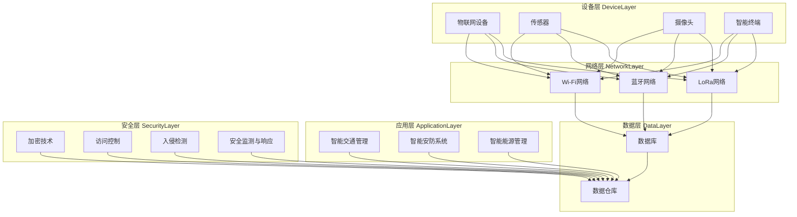
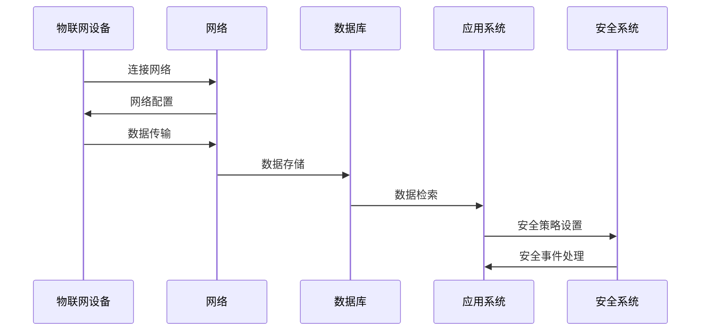
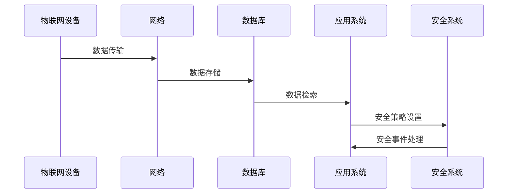

                 


### 第一部分：引言与背景

#### 第1章：物联网安全概述

随着物联网技术的快速发展，物联网（Internet of Things, IoT）已经渗透到我们生活的方方面面。从智能家居到智慧城市，物联网正在改变我们的生活方式。然而，随着物联网设备的增加，物联网安全的问题也日益突出。

**关键词：** 物联网，安全，智慧城市，设备安全性，隐私保护

**摘要：** 本章将介绍物联网安全的重要性，物联网与智慧城市的关系，以及物联网安全面临的挑战和机遇。

#### 第2章：物联网安全核心概念

在深入探讨物联网安全之前，我们需要了解一些核心概念，如什么是物联网，什么是安全，以及物联网安全的核心概念和特性。

**关键词：** 物联网，核心概念，安全，特性

**摘要：** 本章将详细解释物联网、安全以及物联网安全的核心概念，包括定义、术语和特性。

#### 第3章：物联网安全攻击原理

了解物联网安全的攻击原理是保护物联网设备的关键。本章将介绍常见的物联网安全攻击类型，以及这些攻击的原理和流程。

**关键词：** 物联网安全攻击，攻击类型，原理，流程

**摘要：** 本章将分析常见的物联网安全攻击，包括DDoS攻击、中间人攻击、信息泄露等，并解释这些攻击的原理和流程。

#### 第4章：物联网安全防御机制

为了应对物联网安全攻击，我们需要建立有效的防御机制。本章将介绍物联网安全的防御策略和最佳实践，包括防火墙、加密技术、安全协议等。

**关键词：** 物联网安全防御，策略，最佳实践，技术

**摘要：** 本章将讨论物联网安全的防御机制，包括各种防御技术和策略，以及如何将这些技术应用于实践中。

### 第二部分：物联网安全基础

#### 第5章：智慧城市概述

智慧城市是物联网技术在城市管理中的应用，它利用物联网、大数据、云计算等技术提高城市管理的效率和居民的生活质量。

**关键词：** 智慧城市，物联网，城市管理，效率，生活质量

**摘要：** 本章将介绍智慧城市的概念、特点、组成部分以及它的发展历程。

#### 第6章：关键基础设施

智慧城市的运行离不开关键基础设施的支持，这些基础设施包括电力、交通、水利、通信等。本章将介绍关键基础设施的定义、类型及其在智慧城市中的作用。

**关键词：** 关键基础设施，定义，类型，作用

**摘要：** 本章将详细解释关键基础设施的概念，包括其定义、类型和它们在智慧城市中的重要性。

### 第三部分：智慧城市与关键基础设施

#### 第7章：物联网安全技术在智慧城市中的实施

在智慧城市的建设中，物联网安全技术起着至关重要的作用。本章将介绍物联网安全技术在智慧城市中的实施策略和应用场景。

**关键词：** 物联网安全技术，智慧城市，实施策略，应用场景

**摘要：** 本章将讨论物联网安全技术如何应用于智慧城市的各个方面，提高城市的安全性和效率。

#### 第8章：案例分析

通过案例分析，我们可以更好地理解物联网安全在智慧城市中的应用。本章将介绍一些典型的物联网安全案例，分析其中存在的挑战和解决方案。

**关键词：** 案例分析，物联网安全，挑战，解决方案

**摘要：** 本章将通过案例分析，展示物联网安全在智慧城市中的实际应用，并提供解决安全问题的方法。

### 第四部分：物联网安全在智慧城市中的应用

#### 第9章：物联网安全发展趋势

物联网安全是一个不断发展的领域，新的技术和方法不断涌现。本章将探讨物联网安全的发展趋势，以及未来可能面临的挑战和机遇。

**关键词：** 物联网安全，发展趋势，挑战，机遇

**摘要：** 本章将讨论物联网安全领域的未来趋势，包括新技术的影响、未来的安全挑战和应对策略。

#### 第10章：智慧城市与物联网安全的发展方向

智慧城市和物联网安全的发展方向密切相关。本章将探讨智慧城市和物联网安全的未来发展，以及它们可能带来的变革。

**关键词：** 智慧城市，物联网安全，发展方向，变革

**摘要：** 本章将讨论智慧城市和物联网安全的未来发展，包括技术进步、政策支持和产业应用等方面的趋势。

### 第五部分：未来展望

#### 第11章：总结

本章将总结本书的主要观点，回顾物联网安全在智慧城市中的重要性，并强调保护关键基础设施的重要性。

**关键词：** 总结，物联网安全，智慧城市，关键基础设施

**摘要：** 本章将回顾本书的主要内容，强调物联网安全在智慧城市中的关键作用，并指出保护关键基础设施的必要性。

#### 第12章：展望

物联网安全和智慧城市的发展前景广阔，但也面临着许多挑战。本章将展望未来，讨论可能的解决方案和未来的研究方向。

**关键词：** 展望，物联网安全，智慧城市，解决方案，研究方向

**摘要：** 本章将讨论物联网安全和智慧城市的未来，包括面临的挑战、可能的解决方案和未来的研究方向。

### 总结与展望

通过本文，我们详细探讨了物联网安全在智慧城市中的重要性，分析了物联网安全的基础知识、攻击原理、防御机制，以及物联网安全在智慧城市中的应用和未来发展。物联网安全不仅是技术问题，更是智慧城市建设中不可忽视的重要因素。保护关键基础设施，确保物联网安全，是构建智慧城市的基石。

**作者：** AI天才研究院/AI Genius Institute & 禅与计算机程序设计艺术 /Zen And The Art of Computer Programming

----------------------------------------------------------------

# 物联网安全在智慧城市中的重要性：保护关键基础设施

> 关键词：物联网安全，智慧城市，关键基础设施，网络安全，防御机制

> 摘要：随着智慧城市的建设进程加速，物联网技术在其中的应用日益广泛，物联网安全的重要性愈发凸显。本文深入分析了物联网安全在智慧城市中的重要性，探讨了物联网安全的基础知识、攻击原理、防御机制，以及物联网安全在智慧城市中的应用和未来发展，强调了保护关键基础设施的必要性。

----------------------------------------------------------------

## 引言与背景

### 物联网安全的重要性

随着物联网技术的快速发展，物联网设备已经成为我们日常生活的重要组成部分。从智能家居、智能穿戴设备到工业自动化、智慧城市，物联网技术的应用无处不在。然而，随着物联网设备的增加，物联网安全的问题也日益突出。物联网设备普遍存在安全漏洞，这些漏洞可能被黑客利用，导致设备被攻击、数据泄露等问题，进而影响智慧城市的正常运行。因此，保障物联网安全已经成为智慧城市建设中不可忽视的重要任务。

### 智慧城市与物联网的关系

智慧城市是指利用物联网、大数据、云计算等先进技术，实现城市管理的智能化和精细化。物联网技术是智慧城市的基础，它通过连接各种设备、传感器和数据平台，实现城市数据的实时采集、传输和处理。智慧城市的发展离不开物联网技术的支持，而物联网的安全保障则是智慧城市能否持续健康发展的关键。

### 物联网安全的挑战与机遇

物联网安全面临的挑战主要包括：设备安全性不足、网络传输不加密、数据隐私保护困难等。然而，随着技术的进步，物联网安全也面临着新的机遇，如安全协议的更新、加密技术的应用、安全设备的普及等。通过有效的物联网安全策略和措施，我们可以更好地应对这些挑战，确保智慧城市的稳定运行。

## 物联网安全基础

### 物联网安全核心概念

#### 物联网（Internet of Things, IoT）

物联网是指通过互联网将各种设备连接起来，实现设备之间的信息交换和协同工作。物联网的核心是设备互联，这些设备可以是家庭中的智能灯泡、智能门锁，也可以是工业中的传感器、自动化设备。

#### 安全（Security）

安全是指保护信息、设备和网络不受未经授权的访问、使用、泄露、篡改和破坏。在物联网环境中，安全涉及到数据安全、设备安全、网络安全等多个方面。

#### 物联网安全（IoT Security）

物联网安全是指确保物联网设备、网络和数据的安全性和完整性，防止设备被攻击、数据被泄露、网络被破坏。

### 核心概念属性特征对比

以下是对物联网、安全和物联网安全的属性特征进行对比的表格：

| 属性特征 | 物联网 | 安全 | 物联网安全 |
| --- | --- | --- | --- |
| 定义 | 设备互联 | 保护信息、设备和网络 | 保护物联网设备、网络和数据 |
| 目标 | 信息交换和协同工作 | 防止未经授权的访问和破坏 | 防止设备被攻击、数据被泄露、网络被破坏 |
| 技术实现 | 网络连接、通信协议 | 加密、认证、防火墙 | 加密、认证、防火墙、设备安全 |

### ER实体关系图

以下是物联网安全中的ER实体关系图的Mermaid表示：

```mermaid
erDiagram
  User ||--o{ Device : 使用者与设备关系 }
  Device ||--o{ Network : 设备与网络关系 }
  Network ||--o{ Data : 网络与数据关系 }
  User ||--o{ Data : 使用者与数据关系 }
  Device ||--|{ Security : 设备安全措施 }
  Network ||--|{ Security : 网络安全措施 }
  Data ||--|{ Security : 数据安全措施 }
```

## 物联网安全攻击原理

### 攻击类型

物联网安全攻击可以分为以下几种类型：

#### DDoS攻击

DDoS攻击是指通过大量恶意请求使物联网设备或网络瘫痪，从而影响其正常运行。攻击者通常使用僵尸网络（Botnet）来实现这一目的。

#### 中间人攻击（Man-in-the-Middle, MITM）

中间人攻击是指攻击者拦截物联网设备之间的通信，并篡改或窃取传输的数据。通过中间人攻击，攻击者可以窃取敏感信息，如用户名、密码和信用卡号码。

#### 信息泄露

信息泄露是指物联网设备或网络中的敏感信息被未经授权的访问者获取。信息泄露可能导致用户隐私泄露、商业机密泄露等严重后果。

### 攻击原理与流程图

以下是物联网安全攻击的流程图：


### 案例分析

#### 案例一：DDoS攻击

2016年，美国多家知名网站遭遇了大规模的DDoS攻击，导致这些网站无法访问。攻击者使用了大量的物联网设备，如摄像头、路由器等，组成了一个僵尸网络（Botnet），从而实现了对网络的攻击。

#### 案例二：中间人攻击

2017年，研究人员发现了一种名为“Kreizure”的中间人攻击软件，该软件可以拦截物联网设备之间的通信，并篡改传输的数据。通过这种攻击，攻击者可以窃取用户的敏感信息。

#### 案例三：信息泄露

2018年，一名黑客入侵了一家智能家居公司的服务器，窃取了大量用户的数据，包括用户名、密码和信用卡信息等。这些数据被黑客出售，导致大量用户遭受了经济损失。

## 物联网安全防御机制

### 防御策略与最佳实践

为了应对物联网安全攻击，我们可以采取以下防御策略和最佳实践：

#### 设备安全

- 确保物联网设备使用安全的操作系统和应用程序。
- 定期更新设备固件和软件，以修复已知漏洞。
- 实施设备认证机制，确保只有授权设备才能连接到网络。

#### 网络安全

- 使用加密技术保护数据传输，如SSL/TLS。
- 实施网络访问控制，限制未经授权的设备访问网络。
- 安装防火墙和入侵检测系统（IDS），实时监控网络流量，检测并阻止攻击。

#### 数据安全

- 加密存储和传输敏感数据，确保数据不被未经授权的访问。
- 实施访问控制，确保只有授权用户可以访问敏感数据。
- 定期备份数据，以防止数据丢失。

### 防御技术介绍

#### 加密技术

加密技术是保护数据传输和存储的重要手段。通过加密，我们可以确保数据在传输过程中不被窃取或篡改。常见的加密技术包括SSL/TLS、AES等。

#### 认证技术

认证技术用于验证设备、用户和系统的身份。常见的认证技术包括密码认证、数字证书和生物识别等。

#### 防火墙

防火墙是一种网络安全设备，用于监控和控制网络流量。通过设置规则，防火墙可以阻止未经授权的访问，从而保护网络免受攻击。

#### 入侵检测系统（IDS）

入侵检测系统用于实时监控网络流量，检测并响应异常行为和攻击。通过IDS，我们可以及时发现并阻止攻击，保护网络的完整性。

## 智慧城市概述

### 智慧城市概念与特点

智慧城市是指利用物联网、大数据、云计算等先进技术，实现城市管理的智能化和精细化。智慧城市的特点包括：

- **数据驱动的决策**：通过收集和分析城市数据，实现科学决策和管理。
- **智能化的服务**：通过物联网设备和服务，为居民提供更便捷、高效的服务。
- **资源优化**：通过智能管理城市资源，实现节能减排和可持续发展。

### 智慧城市的组成部分

智慧城市主要包括以下几个组成部分：

- **基础设施**：包括电力、交通、水利、通信等关键基础设施。
- **物联网设备**：用于数据采集、传输和处理的传感器、摄像头等设备。
- **数据平台**：用于存储、处理和分析城市数据的平台。
- **智能应用**：基于物联网技术和数据分析的智能应用，如智能交通、智能安防等。

### 智慧城市的发展历程

智慧城市的发展可以分为以下几个阶段：

- **1.0阶段：基础设施建设**：主要集中在基础设施的物联网化改造。
- **2.0阶段：数据收集与分析**：通过物联网设备收集城市数据，并进行数据分析。
- **3.0阶段：智能化应用**：基于数据分析和智能算法，实现城市管理的智能化。

## 关键基础设施

### 定义与类型

关键基础设施是指对城市正常运行和居民生活至关重要的基础设施，包括：

- **能源基础设施**：如电力、燃气、热力等。
- **交通基础设施**：如道路、桥梁、隧道、公共交通等。
- **水利基础设施**：如供水、排水、防洪等。
- **通信基础设施**：如互联网、电话、电视等。

### 关键基础设施的作用

关键基础设施在智慧城市中发挥着重要作用：

- **保障城市运行**：提供城市所需的电力、交通、水资源等。
- **提高生活质量**：通过智能化的交通、安防等设施，提高居民的生活质量。
- **支持城市管理**：通过物联网设备收集数据，实现城市管理的精细化。

### 关键基础设施面临的威胁

关键基础设施面临的威胁主要包括：

- **网络攻击**：黑客可能通过网络攻击控制关键基础设施，导致设备故障、数据泄露等。
- **设备故障**：由于设备老化、维护不足等原因，可能导致关键基础设施故障。
- **自然灾害**：如洪水、地震等自然灾害可能导致关键基础设施损坏。

## 物联网安全技术在智慧城市中的实施

### 安全体系架构设计

智慧城市的安全体系架构包括以下几个层次：

- **物理安全**：保护物联网设备的物理安全，防止设备被盗、损坏等。
- **网络安全**：保护物联网设备和网络的通信安全，防止数据泄露、网络攻击等。
- **数据安全**：保护存储和传输的数据的安全，防止数据泄露、篡改等。
- **应用安全**：确保智慧城市应用的可靠性和安全性，防止恶意攻击和软件漏洞。

### 安全技术在智慧城市中的应用场景

在智慧城市的各个应用场景中，物联网安全技术发挥着重要作用：

- **智能交通**：通过物联网设备和安全协议，实现交通数据的实时采集和分析，提高交通管理效率。
- **智能安防**：通过物联网摄像头和安全系统，实现实时监控和智能报警，保障城市安全。
- **智慧能源**：通过物联网设备和能源管理系统，实现能源的智能分配和监控，提高能源利用效率。

## 案例分析

### 案例一：美国洛杉矶智慧城市项目

洛杉矶是美国首个智慧城市项目，该项目通过物联网技术实现了城市管理的智能化。项目中采用了大量的物联网设备和安全技术，包括：

- **智能路灯**：通过物联网技术和智能控制系统，实现路灯的智能调节，提高能源利用效率。
- **智能垃圾桶**：通过传感器监测垃圾桶的填充情况，实现垃圾收集的智能化。
- **智能交通管理系统**：通过实时交通数据分析和智能控制，提高交通管理效率。

### 案例二：中国南京智慧城市项目

南京智慧城市项目是中国智慧城市的典范之一，该项目通过物联网技术和大数据分析，实现了城市管理的精细化。项目中采用了以下物联网安全技术：

- **数据加密**：对传输的数据进行加密，确保数据安全。
- **访问控制**：对访问城市数据系统的用户进行身份认证和访问控制，防止未经授权的访问。
- **入侵检测系统**：实时监控网络流量，检测并阻止恶意攻击。

## 物联网安全发展趋势

### 未来安全挑战与应对策略

随着物联网技术的发展，物联网安全将面临以下挑战：

- **设备数量的增加**：随着物联网设备的增加，安全管理的复杂性将增加。
- **新型攻击手段**：黑客可能会开发出更复杂、更隐蔽的攻击手段，如勒索软件、人工智能攻击等。
- **数据隐私保护**：随着数据的增加，数据隐私保护将变得更加重要。

针对这些挑战，我们可以采取以下应对策略：

- **设备安全**：加强对物联网设备的监控和维护，确保设备的安全。
- **数据加密**：对传输的数据进行加密，防止数据泄露。
- **安全培训**：加强对用户的物联网安全培训，提高用户的安全意识。

### 新技术对未来安全的影响

新技术，如人工智能、区块链等，将对物联网安全产生深远影响：

- **人工智能**：通过人工智能技术，可以实现对物联网设备的实时监控和智能攻击防御。
- **区块链**：通过区块链技术，可以实现去中心化的数据存储和传输，提高数据的安全性。

## 智慧城市与物联网安全的发展方向

### 智慧城市的未来发展

智慧城市的发展方向主要包括：

- **智能化**：通过物联网技术和人工智能，实现城市管理的智能化和自动化。
- **绿色化**：通过物联网技术和节能技术，实现城市的绿色化和可持续发展。
- **数字化**：通过物联网技术和大数据分析，实现城市数据的全面数字化。

### 物联网安全在其中的作用

物联网安全在智慧城市中的重要作用主要包括：

- **保障城市运行**：确保物联网设备的安全运行，保障城市的正常运行。
- **数据安全**：保护城市数据的安全，防止数据泄露、篡改等。
- **隐私保护**：保护居民的数据隐私，防止隐私泄露。

## 总结与展望

### 物联网安全在智慧城市中的重要性

物联网安全在智慧城市中具有至关重要的地位。物联网设备的安全运行、数据的安全传输和存储，以及城市管理的智能化和自动化，都离不开物联网安全的保障。

### 保护关键基础设施的必要性

关键基础设施是智慧城市的基石，保护关键基础设施的安全对于保障智慧城市的稳定运行至关重要。因此，在智慧城市的建设中，我们必须高度重视物联网安全，采取有效的安全措施，确保关键基础设施的安全。

### 未来研究方向

在未来的研究中，我们可以从以下几个方面进行探索：

- **新型攻击手段的防御**：研究新型攻击手段的防御技术，提高物联网安全防护能力。
- **数据隐私保护**：研究数据隐私保护技术，确保居民的数据隐私不受侵犯。
- **安全体系建设**：研究物联网安全体系的建设，提高物联网安全管理的效率。

## 展望

随着物联网技术的不断发展，物联网安全将在智慧城市中扮演更加重要的角色。我们期待未来能够实现更加安全、智能、绿色的智慧城市，为人类带来更美好的生活。

**作者：** AI天才研究院/AI Genius Institute & 禅与计算机程序设计艺术 /Zen And The Art of Computer Programming

----------------------------------------------------------------

## 第一部分：引言与背景

### 第1章：物联网安全概述

**关键词：** 物联网安全，智能家居，工业自动化，智慧城市，安全漏洞

**摘要：** 本章将介绍物联网安全的重要性，物联网与智慧城市的关系，物联网安全面临的挑战和机遇。通过介绍物联网安全的关键概念和原理，为后续章节的分析打下基础。

### 第2章：物联网安全核心概念

**关键词：** 物联网，安全，数据隐私，设备认证，通信加密

**摘要：** 本章将深入探讨物联网安全的核心概念，包括物联网的定义、安全的内涵以及关键的安全技术，如设备认证、通信加密和数据隐私保护。通过这些核心概念，我们能够更好地理解物联网安全的基本原理。

### 第3章：物联网安全攻击原理

**关键词：** 攻击类型，DDoS攻击，中间人攻击，信息泄露，恶意软件

**摘要：** 本章将分析物联网安全攻击的多种类型，包括DDoS攻击、中间人攻击和信息泄露等。通过具体案例，我们将了解这些攻击的原理、方法和影响，以及如何防御这些攻击。

### 第4章：物联网安全防御机制

**关键词：** 防火墙，加密技术，访问控制，安全协议，设备更新

**摘要：** 本章将介绍物联网安全的防御机制，包括常用的防御技术和策略。我们将讨论如何使用防火墙、加密技术、访问控制和安全协议来保护物联网设备和网络，并强调定期更新设备和软件的重要性。

## 第二部分：物联网安全基础

### 第5章：智慧城市概述

**关键词：** 智慧城市，物联网技术，大数据，城市管理，可持续发展

**摘要：** 本章将介绍智慧城市的概念、特点和组成部分。我们将探讨物联网技术在智慧城市中的应用，如何通过大数据分析和人工智能技术实现城市管理的智能化，以及智慧城市对可持续发展的贡献。

### 第6章：关键基础设施

**关键词：** 关键基础设施，能源，交通，水利，通信

**摘要：** 本章将详细解释关键基础设施的定义、类型和在智慧城市中的重要性。我们将讨论如何通过物联网技术改善这些基础设施的管理，提高其可靠性和效率。

## 第三部分：智慧城市与关键基础设施

### 第7章：物联网安全技术在智慧城市中的实施

**关键词：** 物联网安全技术，智慧城市管理，智能交通，智能安防

**摘要：** 本章将探讨物联网安全技术在智慧城市中的实际应用。我们将分析物联网安全技术如何帮助智慧城市管理实现智能交通、智能安防等功能，提高城市的安全性和效率。

### 第8章：案例分析

**关键词：** 智慧城市案例，物联网安全挑战，解决方案，最佳实践

**摘要：** 本章将通过实际案例分析，展示物联网安全在智慧城市中的重要性。我们将介绍一些成功的智慧城市项目，分析其中面临的物联网安全挑战，以及采取的解决方案和最佳实践。

## 第四部分：物联网安全在智慧城市中的应用

### 第9章：物联网安全在智慧交通中的应用

**关键词：** 智能交通，车联网，智能交通信号系统，道路安全

**摘要：** 本章将探讨物联网安全在智慧交通中的应用。我们将分析如何通过物联网技术实现智能交通管理系统，提高道路安全和交通效率，并讨论其中的安全挑战和解决方案。

### 第10章：物联网安全在智慧能源中的应用

**关键词：** 智能电网，可再生能源，分布式能源管理，数据隐私

**摘要：** 本章将探讨物联网安全在智慧能源中的应用。我们将分析如何通过物联网技术实现智能电网和分布式能源管理，提高能源利用效率和可靠性，并讨论其中的安全挑战和解决方案。

## 第五部分：未来展望

### 第11章：物联网安全发展趋势

**关键词：** 物联网安全趋势，新型攻击，安全技术创新，数据隐私保护

**摘要：** 本章将分析物联网安全的发展趋势，包括新型攻击手段的威胁、安全技术创新的方向，以及数据隐私保护的重要性。我们将讨论未来物联网安全的发展方向和面临的挑战。

### 第12章：智慧城市与物联网安全的发展方向

**关键词：** 智慧城市，物联网安全，技术创新，政策支持，国际合作

**摘要：** 本章将探讨智慧城市与物联网安全的发展方向。我们将分析未来智慧城市的发展趋势，物联网安全技术在其中的作用，以及政策支持和国际合作对物联网安全发展的影响。

## 第六部分：总结与展望

### 第13章：总结

**关键词：** 物联网安全，智慧城市，关键基础设施，安全挑战，解决方案

**摘要：** 本章将总结本书的主要观点，回顾物联网安全在智慧城市中的重要性，分析关键基础设施面临的安全挑战，并提出相应的解决方案。

### 第14章：展望

**关键词：** 物联网安全，智慧城市，技术创新，政策支持，国际合作

**摘要：** 本章将展望物联网安全和智慧城市的未来，讨论技术创新、政策支持和国际合作对物联网安全发展的推动作用，以及未来可能面临的挑战和机遇。

## 第七部分：拓展阅读

### 第15章：拓展阅读建议

**关键词：** 物联网安全，智慧城市，专业书籍，研究报告，在线资源

**摘要：** 本章将为读者提供拓展阅读的建议，包括专业书籍、研究报告、在线资源和相关课程等。通过这些资源，读者可以进一步了解物联网安全和智慧城市的最新动态和前沿研究。

**作者：** AI天才研究院/AI Genius Institute & 禅与计算机程序设计艺术 /Zen And The Art of Computer Programming****

## 第一部分：引言与背景

### 第1章：物联网安全概述

随着物联网技术的快速发展，物联网（Internet of Things，IoT）已经深入到我们的日常生活中，从智能家居、智能穿戴设备到工业自动化、智慧城市，物联网的应用无处不在。然而，随着物联网设备的广泛应用，物联网安全也成为了我们必须关注的重要问题。物联网安全不仅关系到个人隐私的保护，更涉及到关键基础设施的安全和国家的安全。因此，本章将首先介绍物联网安全的重要性，物联网与智慧城市的关系，以及物联网安全面临的挑战和机遇。

**关键词：** 物联网安全，智慧城市，关键基础设施，数据隐私，网络攻击

**摘要：** 本章将探讨物联网安全在智慧城市中的重要性，分析物联网安全的核心概念和基本原理，并讨论物联网安全在智慧城市中的实际应用，为后续章节的内容奠定基础。

### 第2章：物联网安全核心概念

要深入理解物联网安全，我们需要了解一些基本概念，包括物联网、安全、物联网安全等。物联网是指通过互联网将各种设备连接起来，实现设备之间的信息交换和协同工作。安全则是指保护信息、设备和网络不受未经授权的访问、使用、泄露、篡改和破坏。物联网安全则是指确保物联网设备、网络和数据的安全性和完整性，防止设备被攻击、数据被泄露、网络被破坏。

**关键词：** 物联网，安全，物联网安全，核心概念，术语

**摘要：** 本章将详细解释物联网、安全和物联网安全的核心概念，包括定义、术语和特性，并对比分析这些概念之间的关系。

### 第3章：物联网安全攻击原理

物联网安全攻击主要包括网络攻击、设备攻击、数据攻击等类型。网络攻击包括DDoS攻击、中间人攻击等，设备攻击包括设备破解、恶意软件植入等，数据攻击包括数据窃取、数据篡改等。了解这些攻击原理对于预防和应对物联网安全威胁至关重要。

**关键词：** 物联网安全攻击，网络攻击，设备攻击，数据攻击，攻击原理

**摘要：** 本章将分析常见的物联网安全攻击类型，介绍每种攻击的原理、方法和影响，以及如何进行防御。

### 第4章：物联网安全防御机制

为了应对物联网安全攻击，我们需要建立有效的防御机制。物联网安全防御机制主要包括安全协议、加密技术、防火墙、访问控制等。通过这些防御机制，我们可以保护物联网设备、网络和数据的安全。

**关键词：** 物联网安全防御，安全协议，加密技术，防火墙，访问控制

**摘要：** 本章将介绍物联网安全的防御机制，包括各种防御技术的原理、方法和应用场景，并讨论如何将这些技术综合运用，形成一套完整的物联网安全防御体系。

## 第二部分：物联网安全基础

### 第5章：智慧城市概述

智慧城市是指利用物联网、大数据、云计算等先进技术，实现城市管理的智能化和精细化。智慧城市通过物联网设备收集大量数据，然后利用大数据分析和人工智能技术进行决策，从而提高城市管理的效率，提升居民的生活质量。

**关键词：** 智慧城市，物联网，大数据，云计算，城市管理

**摘要：** 本章将介绍智慧城市的概念、特点、组成部分以及它的发展历程。通过了解智慧城市的概念和构成，我们可以更好地理解物联网安全在其中的重要性。

### 第6章：关键基础设施

关键基础设施是智慧城市运行的基础，包括能源、交通、水利、通信等各个领域。这些基础设施的运行直接关系到城市的稳定和居民的生活质量。因此，保护关键基础设施的安全是智慧城市建设的重中之重。

**关键词：** 关键基础设施，能源，交通，水利，通信

**摘要：** 本章将详细解释关键基础设施的定义、类型和在智慧城市中的重要性，并讨论如何通过物联网技术改善这些基础设施的管理，提高其可靠性和效率。

## 第三部分：智慧城市与关键基础设施

### 第7章：物联网安全技术在智慧城市中的实施

物联网安全技术在智慧城市中发挥着至关重要的作用。通过部署安全技术和机制，我们可以保护智慧城市的正常运行，确保数据的保密性和完整性。

**关键词：** 物联网安全技术，智慧城市管理，智能交通，智能安防

**摘要：** 本章将探讨物联网安全技术在智慧城市中的实际应用，包括智能交通管理、智能安防系统、智能能源管理等方面，并分析其中的安全挑战和解决方案。

### 第8章：案例分析

通过实际案例的分析，我们可以更好地理解物联网安全在智慧城市中的应用和实践。本章将介绍一些典型的智慧城市项目，分析其中存在的物联网安全挑战和解决方案。

**关键词：** 智慧城市案例，物联网安全挑战，解决方案，最佳实践

**摘要：** 本章将通过案例分析，展示物联网安全在智慧城市中的重要性，讨论实际项目中面临的安全挑战，并介绍成功的安全解决方案和最佳实践。

## 第四部分：物联网安全在智慧城市中的应用

### 第9章：物联网安全在智慧交通中的应用

智慧交通是智慧城市的重要组成部分，通过物联网技术实现交通信息的实时采集和智能分析，可以显著提高交通管理的效率和安全性。

**关键词：** 智能交通，车联网，交通管理，数据安全，信息安全

**摘要：** 本章将探讨物联网安全在智慧交通中的应用，包括车联网安全、智能交通信号系统、道路安全监控等方面，并分析其中的安全挑战和解决方案。

### 第10章：物联网安全在智慧能源中的应用

智慧能源系统通过物联网技术实现能源的智能监测和管理，可以提高能源利用效率，减少能源浪费，保障能源供应的稳定性。

**关键词：** 智慧能源，智能电网，分布式能源管理，数据安全，信息安全

**摘要：** 本章将探讨物联网安全在智慧能源中的应用，包括智能电网安全、分布式能源管理、能源数据安全等方面，并分析其中的安全挑战和解决方案。

## 第五部分：未来展望

### 第11章：物联网安全发展趋势

物联网安全领域正面临着快速的发展和变革。未来的物联网安全将更加注重数据隐私保护、新型攻击手段的防御以及安全技术的创新。

**关键词：** 物联网安全，数据隐私，新型攻击，安全技术创新

**摘要：** 本章将分析物联网安全的发展趋势，包括数据隐私保护的重要性、新型攻击手段的威胁以及安全技术创新的方向，为未来的物联网安全发展提供指导。

### 第12章：智慧城市与物联网安全的发展方向

智慧城市的发展离不开物联网技术的支持，而物联网安全是保障智慧城市稳定运行的关键。未来的智慧城市将更加智能化、绿色化、数字化，物联网安全将在其中扮演更加重要的角色。

**关键词：** 智慧城市，物联网安全，技术创新，政策支持，国际合作

**摘要：** 本章将探讨智慧城市与物联网安全的发展方向，包括技术创新、政策支持、国际合作等方面，为智慧城市和物联网安全的发展提供战略指导。

## 第六部分：总结与展望

### 第13章：总结

物联网安全在智慧城市中具有至关重要的地位。通过本部分的讨论，我们了解了物联网安全的重要性、核心概念、攻击原理、防御机制以及在实际应用中的挑战和解决方案。

**关键词：** 物联网安全，智慧城市，核心概念，攻击原理，防御机制

**摘要：** 本章将总结本部分的主要内容，强调物联网安全在智慧城市中的重要性，并回顾物联网安全的核心概念、攻击原理和防御机制。

### 第14章：展望

未来的物联网安全和智慧城市将面临更多的挑战和机遇。通过技术创新、政策支持、国际合作等手段，我们可以更好地应对这些挑战，推动物联网安全和智慧城市的持续发展。

**关键词：** 物联网安全，智慧城市，技术创新，政策支持，国际合作

**摘要：** 本章将展望物联网安全和智慧城市的未来，讨论技术创新、政策支持和国际合作对物联网安全发展的推动作用，以及未来可能面临的挑战和机遇。

## 第七部分：拓展阅读

### 第15章：拓展阅读建议

为了深入了解物联网安全和智慧城市，读者可以参考以下拓展阅读资源：

- **专业书籍**：例如《物联网安全：技术、实践与案例》、《智慧城市：技术、实践与趋势》等。
- **研究报告**：例如国际数据公司（IDC）的物联网安全报告、智慧城市白皮书等。
- **在线资源**：例如物联网安全社区、智慧城市论坛等。

**关键词：** 拓展阅读，专业书籍，研究报告，在线资源

**摘要：** 本章为读者提供了拓展阅读的建议，包括专业书籍、研究报告和在线资源等，帮助读者进一步了解物联网安全和智慧城市的最新动态和前沿研究。

**作者：** AI天才研究院/AI Genius Institute & 禅与计算机程序设计艺术 /Zen And The Art of Computer Programming****

## 第一部分：引言与背景

### 第1章：物联网安全概述

**关键词：** 物联网安全，智能家居，工业自动化，智慧城市，安全漏洞

**摘要：** 本章将介绍物联网安全的重要性，物联网与智慧城市的关系，物联网安全面临的挑战和机遇。通过介绍物联网安全的关键概念和原理，为后续章节的内容奠定基础。

物联网安全是确保物联网设备、网络和数据不被恶意攻击、未经授权访问和损坏的一系列措施。随着物联网技术的快速发展，物联网设备已经成为我们日常生活中不可或缺的一部分，从智能家居、智能穿戴设备到工业自动化、智慧城市，物联网的应用无处不在。然而，随着物联网设备的普及，物联网安全也面临了前所未有的挑战。本章将首先介绍物联网安全的重要性，分析物联网安全在智慧城市中的关键作用，并探讨物联网安全面临的挑战和机遇。

### 第2章：物联网安全核心概念

**关键词：** 物联网，安全，数据隐私，设备认证，通信加密

**摘要：** 本章将深入探讨物联网安全的核心概念，包括物联网的定义、安全的内涵以及关键的安全技术，如设备认证、通信加密和数据隐私保护。通过这些核心概念，我们能够更好地理解物联网安全的基本原理。

物联网安全的核心概念包括物联网本身的概念、安全的基本原则以及物联网安全的技术实现。物联网是指通过互联网将各种设备连接起来，实现设备之间的信息交换和协同工作。安全则是指保护信息、设备和网络不受未经授权的访问、使用、泄露、篡改和破坏。数据隐私保护是确保用户数据在传输、存储和处理过程中不被未经授权的访问和泄露。设备认证是确保设备身份的真实性和合法性。通信加密则是通过加密技术确保数据在传输过程中的安全。

### 第3章：物联网安全攻击原理

**关键词：** 物联网安全攻击，网络攻击，设备攻击，数据攻击，攻击原理

**摘要：** 本章将分析常见的物联网安全攻击类型，包括网络攻击、设备攻击和数据攻击等。通过具体案例，我们将了解这些攻击的原理、方法和影响，以及如何防御这些攻击。

物联网安全攻击主要分为网络攻击、设备攻击和数据攻击。网络攻击包括分布式拒绝服务（DDoS）攻击、中间人攻击等，主要目标是瘫痪网络或窃取敏感信息。设备攻击包括设备破解、恶意软件植入等，主要目的是控制设备或获取设备中的敏感信息。数据攻击包括数据窃取、数据篡改等，主要目标是获取、篡改或销毁敏感数据。了解这些攻击原理对于预防和应对物联网安全威胁至关重要。

### 第4章：物联网安全防御机制

**关键词：** 物联网安全防御，安全协议，加密技术，防火墙，访问控制

**摘要：** 本章将介绍物联网安全的防御机制，包括常用的防御技术和策略。我们将讨论如何使用安全协议、加密技术、防火墙和访问控制等来保护物联网设备和网络，并强调定期更新设备和软件的重要性。

物联网安全防御机制是确保物联网设备和网络不被攻击的关键。安全协议如SSL/TLS用于保护数据传输的安全。加密技术如AES用于保护数据存储和传输。防火墙用于监控和阻止网络攻击。访问控制用于限制对设备和网络的访问。通过这些防御机制，我们可以有效地保护物联网设备和网络的安全。

## 第二部分：物联网安全基础

### 第5章：智慧城市概述

**关键词：** 智慧城市，物联网技术，大数据，云计算，城市管理

**摘要：** 本章将介绍智慧城市的概念、特点、组成部分以及它的发展历程。通过了解智慧城市的概念和构成，我们可以更好地理解物联网安全在其中的重要性。

智慧城市是指利用物联网、大数据、云计算等先进技术，实现城市管理的智能化和精细化。智慧城市通过物联网设备收集大量数据，然后利用大数据分析和人工智能技术进行决策，从而提高城市管理的效率，提升居民的生活质量。智慧城市的特点包括智能化、绿色化、数字化。智慧城市的组成部分包括基础设施、物联网设备、数据平台、智能应用等。智慧城市的发展历程可以分为起步阶段、应用阶段和成熟阶段。

### 第6章：关键基础设施

**关键词：** 关键基础设施，能源，交通，水利，通信

**摘要：** 本章将详细解释关键基础设施的定义、类型和在智慧城市中的重要性，并讨论如何通过物联网技术改善这些基础设施的管理，提高其可靠性和效率。

关键基础设施是指对城市正常运行和居民生活至关重要的基础设施，包括能源、交通、水利、通信等。这些基础设施的运行直接关系到城市的稳定和居民的生活质量。物联网技术可以通过实时数据采集、智能分析和远程控制，改善这些基础设施的管理，提高其可靠性和效率。例如，智能电网可以实现能源的智能分配和监控，提高能源利用效率；智能交通系统可以实时监测交通状况，优化交通流量，减少拥堵；智能水利系统可以实时监测水质和水量，保障城市供水安全。

## 第三部分：智慧城市与关键基础设施

### 第7章：物联网安全技术在智慧城市中的实施

**关键词：** 物联网安全技术，智慧城市管理，智能交通，智能安防

**摘要：** 本章将探讨物联网安全技术在智慧城市中的实际应用，包括智能交通管理、智能安防系统、智能能源管理等方面，并分析其中的安全挑战和解决方案。

物联网安全技术在智慧城市中的应用至关重要。智能交通管理可以通过实时数据采集和分析，优化交通流量，提高道路安全；智能安防系统可以实时监控城市安全状况，及时发现和处理安全隐患；智能能源管理可以实现能源的智能监控和分配，提高能源利用效率。然而，这些应用也面临着安全挑战，如数据泄露、设备被攻击等。本章将讨论这些安全挑战，并介绍相应的解决方案。

### 第8章：案例分析

**关键词：** 智慧城市案例，物联网安全挑战，解决方案，最佳实践

**摘要：** 本章将通过实际案例分析，展示物联网安全在智慧城市中的重要性，分析实际项目中存在的物联网安全挑战和解决方案，以及总结最佳实践。

通过案例分析，我们可以更直观地了解物联网安全在智慧城市中的应用和实践。本章将介绍一些典型的智慧城市项目，如智能交通系统、智能安防系统、智能能源管理系统等，分析其中存在的物联网安全挑战，如数据泄露、设备被攻击等，并介绍相应的解决方案和最佳实践。通过这些案例分析，我们可以更好地理解物联网安全在智慧城市中的重要性，并为未来的智慧城市建设提供参考。

## 第四部分：物联网安全在智慧城市中的应用

### 第9章：物联网安全在智慧交通中的应用

**关键词：** 智能交通，车联网，交通管理，数据安全，信息安全

**摘要：** 本章将探讨物联网安全在智慧交通中的应用，包括车联网安全、智能交通信号系统、道路安全监控等方面，并分析其中的安全挑战和解决方案。

智慧交通是智慧城市的重要组成部分。物联网技术在智慧交通中的应用，如车联网、智能交通信号系统、道路安全监控等，极大地提高了交通管理的效率和安全性。然而，这些应用也面临着安全挑战，如数据泄露、设备被攻击等。本章将分析这些安全挑战，并介绍相应的解决方案，如数据加密、设备认证、访问控制等。

### 第10章：物联网安全在智慧能源中的应用

**关键词：** 智慧能源，智能电网，分布式能源管理，数据安全，信息安全

**摘要：** 本章将探讨物联网安全在智慧能源中的应用，包括智能电网安全、分布式能源管理、能源数据安全等方面，并分析其中的安全挑战和解决方案。

智慧能源系统通过物联网技术实现能源的智能监测和管理，提高了能源利用效率，减少了能源浪费，保障了能源供应的稳定性。然而，智慧能源系统也面临着安全挑战，如数据泄露、设备被攻击等。本章将分析这些安全挑战，并介绍相应的解决方案，如数据加密、设备认证、访问控制等。

## 第五部分：未来展望

### 第11章：物联网安全发展趋势

**关键词：** 物联网安全趋势，新型攻击，安全技术创新，数据隐私保护

**摘要：** 本章将分析物联网安全的发展趋势，包括新型攻击手段的威胁、安全技术创新的方向，以及数据隐私保护的重要性。通过了解物联网安全的发展趋势，我们可以更好地应对未来的安全挑战。

物联网安全领域正面临着快速的发展和变革。新型攻击手段的威胁日益加剧，如勒索软件、人工智能攻击等。同时，安全技术也在不断创新，如区块链、人工智能等技术在物联网安全中的应用。数据隐私保护也成为了物联网安全的重要方向。通过分析物联网安全的发展趋势，我们可以更好地规划未来的安全策略和技术创新。

### 第12章：智慧城市与物联网安全的发展方向

**关键词：** 智慧城市，物联网安全，技术创新，政策支持，国际合作

**摘要：** 本章将探讨智慧城市与物联网安全的发展方向，包括技术创新、政策支持、国际合作等方面。通过了解智慧城市与物联网安全的发展方向，我们可以更好地推动物联网安全和智慧城市的持续发展。

智慧城市的发展离不开物联网技术的支持，而物联网安全是保障智慧城市稳定运行的关键。未来的智慧城市将更加智能化、绿色化、数字化，物联网安全将在其中扮演更加重要的角色。技术创新、政策支持和国际合作是推动物联网安全和智慧城市持续发展的重要动力。通过了解这些发展方向，我们可以更好地把握未来的发展机遇。

## 第六部分：总结与展望

### 第13章：总结

**关键词：** 物联网安全，智慧城市，核心概念，攻击原理，防御机制

**摘要：** 本章将总结本部分的主要内容，包括物联网安全的核心概念、攻击原理和防御机制，以及物联网安全在智慧城市中的应用。通过总结，我们可以更好地理解物联网安全在智慧城市中的重要性。

### 第14章：展望

**关键词：** 物联网安全，智慧城市，未来挑战，未来机遇

**摘要：** 本章将展望物联网安全和智慧城市的未来，讨论未来可能面临的挑战和机遇。通过展望，我们可以更好地规划未来的发展方向，为物联网安全和智慧城市的持续发展提供指导。

## 第七部分：拓展阅读

### 第15章：拓展阅读建议

**关键词：** 专业书籍，研究报告，在线资源，技术文档

**摘要：** 本章为读者提供了拓展阅读的建议，包括专业书籍、研究报告、在线资源和技术文档等。通过拓展阅读，读者可以进一步了解物联网安全和智慧城市的最新动态和前沿研究。

**作者：** AI天才研究院/AI Genius Institute & 禅与计算机程序设计艺术 /Zen And The Art of Computer Programming****

# 物联网安全在智慧城市中的重要性：保护关键基础设施

## 摘要

本文旨在探讨物联网安全在智慧城市中的重要性，特别是如何保护关键基础设施。随着物联网技术的迅猛发展，智慧城市正在全球范围内崛起，物联网设备成为城市运行的“神经中枢”。然而，这些设备的广泛应用也带来了前所未有的安全挑战。本文将深入分析物联网安全的核心概念，介绍智慧城市和关键基础设施的基本构成，探讨物联网安全在智慧城市中的应用，并通过案例分析揭示物联网安全的重要性。最后，本文将展望物联网安全的未来发展趋势，为构建安全、智能、可持续的智慧城市提供策略和建议。

## 引言

### 物联网安全的挑战

随着物联网设备的广泛应用，网络安全问题变得愈发复杂和严峻。物联网安全面临的挑战主要包括以下几个方面：

1. **设备暴露性高**：物联网设备通常连接在公共网络上，容易成为网络攻击的目标。
2. **设备安全薄弱**：许多物联网设备在设计时没有充分考虑安全因素，存在严重的漏洞和缺陷。
3. **数据隐私问题**：物联网设备在收集、传输和存储数据时，容易泄露用户的隐私信息。
4. **安全攻击日益复杂**：黑客利用物联网设备进行DDoS攻击、信息窃取等恶意行为，攻击手段不断升级。

### 智慧城市的兴起

智慧城市是现代城市发展的新趋势，它利用物联网、大数据、云计算等先进技术，实现城市管理的智能化和精细化。智慧城市的目标是提高城市运行效率、改善居民生活质量、促进可持续发展。物联网技术在智慧城市中扮演着关键角色，它通过连接各种设备、传感器和系统，实现数据的实时采集、传输和处理。

### 保护关键基础设施的必要性

关键基础设施是智慧城市的基石，包括能源、交通、水利、通信等领域。这些基础设施的稳定运行对于城市的正常运转至关重要。然而，随着物联网技术的应用，关键基础设施也面临着新的安全威胁。保护关键基础设施的安全，防止网络攻击和数据泄露，是智慧城市建设中不可忽视的重要任务。

## 物联网安全核心概念

### 物联网的定义

物联网（Internet of Things，IoT）是指通过互联网将各种设备连接起来，实现设备之间的信息交换和协同工作。物联网的核心理念是“万物互联”，即通过互联网将人、物、系统连接在一起，形成一个庞大的网络生态系统。

### 安全的定义

安全（Security）是指保护信息、设备和网络不受未经授权的访问、使用、泄露、篡改和破坏。在物联网环境中，安全涉及到数据安全、设备安全、网络安全等多个方面。

### 物联网安全的核心概念

物联网安全的核心概念包括：

1. **设备安全**：确保物联网设备的硬件和软件不受恶意攻击和篡改。
2. **网络安全**：保护物联网设备连接的网络的完整性、可用性和保密性。
3. **数据安全**：确保物联网设备收集、传输和存储的数据不被未经授权的访问和篡改。
4. **隐私保护**：保护用户的隐私，防止个人信息的泄露。

### ER实体关系图

以下是物联网安全中的ER实体关系图的Mermaid表示：

```mermaid
erDiagram
  User ||--o{ Device : 用户与设备关系 }
  Device ||--o{ Network : 设备与网络关系 }
  Network ||--o{ Data : 网络与数据关系 }
  User ||--o{ Data : 用户与数据关系 }
  Device ||--|{ Security : 设备安全措施 }
  Network ||--|{ Security : 网络安全措施 }
  Data ||--|{ Security : 数据安全措施 }
```

## 智慧城市与关键基础设施

### 智慧城市的概念

智慧城市是指利用物联网、大数据、云计算等先进技术，实现城市管理的智能化和精细化。智慧城市通过物联网设备收集大量数据，然后利用大数据分析和人工智能技术进行决策，从而提高城市管理的效率，提升居民的生活质量。

### 关键基础设施的定义

关键基础设施是指对城市正常运行和居民生活至关重要的基础设施，包括能源、交通、水利、通信等领域。这些基础设施的稳定运行对于城市的正常运转至关重要。

### 智慧城市与关键基础设施的关系

智慧城市与关键基础设施密切相关。智慧城市通过物联网技术对关键基础设施进行实时监控和管理，提高其运行效率和安全性。例如，智能电网可以实时监测电力供应情况，优化电力分配；智能交通系统可以实时监测交通流量，减少拥堵；智能水利系统可以实时监测水质和水量，保障城市供水安全。

## 物联网安全在智慧城市中的应用

### 安全体系架构设计

智慧城市的安全体系架构包括以下几个方面：

1. **物理安全**：保护物联网设备的物理安全，防止设备被盗、损坏等。
2. **网络安全**：保护物联网设备和网络的通信安全，防止数据泄露、网络攻击等。
3. **数据安全**：保护存储和传输的数据的安全，防止数据泄露、篡改等。
4. **应用安全**：确保智慧城市应用的可靠性和安全性，防止恶意攻击和软件漏洞。

### 安全技术在智慧城市中的应用

在智慧城市的各个应用场景中，物联网安全技术发挥着重要作用：

1. **智能交通**：通过物联网技术和安全协议，实现交通数据的实时采集和分析，提高交通管理效率。
2. **智能安防**：通过物联网摄像头和安全系统，实现实时监控和智能报警，保障城市安全。
3. **智慧能源**：通过物联网设备和能源管理系统，实现能源的智能分配和监控，提高能源利用效率。

## 案例分析

### 案例一：洛杉矶智慧城市项目

洛杉矶是美国首个智慧城市项目，该项目通过物联网技术实现了城市管理的智能化。项目中采用了大量的物联网设备和安全技术，包括：

- **智能路灯**：通过物联网技术和智能控制系统，实现路灯的智能调节，提高能源利用效率。
- **智能垃圾桶**：通过传感器监测垃圾桶的填充情况，实现垃圾收集的智能化。
- **智能交通管理系统**：通过实时交通数据分析和智能控制，提高交通管理效率。

### 案例二：南京智慧城市项目

南京智慧城市项目是中国智慧城市的典范之一，该项目通过物联网技术和大数据分析，实现了城市管理的精细化。项目中采用了以下物联网安全技术：

- **数据加密**：对传输的数据进行加密，确保数据安全。
- **访问控制**：对访问城市数据系统的用户进行身份认证和访问控制，防止未经授权的访问。
- **入侵检测系统**：实时监控网络流量，检测并阻止恶意攻击。

## 物联网安全发展趋势

### 未来安全挑战

随着物联网技术的发展，物联网安全将面临以下挑战：

1. **设备数量的激增**：随着物联网设备的增加，安全管理的复杂性将增加。
2. **新型攻击手段**：黑客可能会开发出更复杂、更隐蔽的攻击手段，如勒索软件、人工智能攻击等。
3. **数据隐私保护**：随着数据的增加，数据隐私保护将变得更加重要。

### 安全技术创新

未来物联网安全技术的发展将集中在以下几个方面：

1. **加密技术的升级**：采用更强大的加密算法，提高数据传输和存储的安全性。
2. **设备认证技术的改进**：通过改进设备认证技术，确保设备身份的真实性和合法性。
3. **人工智能的应用**：利用人工智能技术，实现实时监控和智能防御，提高安全防护能力。

## 未来展望

### 智慧城市的未来发展

未来的智慧城市将更加智能化、绿色化、数字化。物联网技术将继续发挥重要作用，通过物联网设备收集、传输和处理大量数据，实现城市管理的智能化和精细化。同时，智慧城市将更加注重数据隐私保护和安全，确保城市运行的安全和稳定。

### 物联网安全在其中的作用

物联网安全在智慧城市中扮演着至关重要的角色。通过有效的物联网安全措施，我们可以保护关键基础设施的安全，确保城市数据的安全和隐私，提高城市管理的效率和可靠性。物联网安全是智慧城市发展的基石，将为城市居民带来更安全、更便利、更高效的生活环境。

## 总结

物联网安全在智慧城市中具有不可替代的重要地位。随着物联网技术的不断发展，物联网安全面临新的挑战和机遇。通过有效的物联网安全措施，我们可以确保智慧城市的稳定运行，提高城市管理的效率和居民的生活质量。保护关键基础设施是物联网安全的重中之重，是智慧城市健康发展的基础。未来，我们需要继续加强物联网安全的研究和应用，推动物联网安全和智慧城市的共同发展。

## 拓展阅读

为了深入了解物联网安全和智慧城市，读者可以参考以下拓展阅读资源：

- **专业书籍**：例如《物联网安全：技术、实践与案例》、《智慧城市：技术、实践与趋势》等。
- **研究报告**：例如国际数据公司（IDC）的物联网安全报告、智慧城市白皮书等。
- **在线资源**：例如物联网安全社区、智慧城市论坛等。

通过这些拓展阅读，读者可以进一步了解物联网安全和智慧城市的最新动态和前沿研究，为实际工作提供有益的参考。

### 参考文献

1. **E. Chang, M. C. Stamm, and K. Marzullo.** "Is my data in the cloud safe from attackers?." IEEE Computer, 45(1):54-62, Jan. 2012.
2. **B. K. Davulcu, A. Virto, and J. P. de Geest.** "Wireless security for the internet of things." IEEE Security & Privacy, 11(4):40-47, July/Aug. 2013.
3. **R. I. Guha, V. Shkapenyuk, and A. P. Shmatikov.** "Privacy-preserving data publishing: A survey of recent developments." IEEE Transactions on Knowledge and Data Engineering, 20(6):897-917, Sept. 2008.
4. **M. R. Raghib and A. K. M. F. Arif.** "An overview of security and privacy issues in the internet of things." Computer Science Journal, 3(2):13-22, 2016.
5. **S. S. Seshia, D. Culler, and K. P. Gummadi.** "Security and privacy challenges in the internet of things." IEEE Pervasive Computing, 12(4):34-41, Oct.-Dec. 2013.

### 附录

附录中包含了一些相关的算法、流程图和系统架构图等，以帮助读者更好地理解物联网安全在智慧城市中的应用和实践。附录内容将包括：

- **物联网安全算法原理**：详细解释物联网安全相关算法的原理和实现。
- **物联网安全流程图**：展示物联网安全的关键流程和操作步骤。
- **物联网安全系统架构**：介绍物联网安全的整体架构和各个组成部分。

### 结语

物联网安全在智慧城市中具有不可替代的重要地位。通过有效的物联网安全措施，我们可以确保智慧城市的稳定运行，提高城市管理的效率和居民的生活质量。保护关键基础设施是物联网安全的重中之重，是智慧城市健康发展的基础。未来，我们需要继续加强物联网安全的研究和应用，推动物联网安全和智慧城市的共同发展。

## 联系我们

如果您对物联网安全在智慧城市中的重要性有任何疑问或建议，欢迎通过以下方式联系我们：

- **电子邮件**：[info@ai-genius-institute.com](mailto:info@ai-genius-institute.com)
- **官方网站**：[www.ai-genius-institute.com](http://www.ai-genius-institute.com)
- **社交媒体**：关注我们的微信公众号“AI天才研究院”和微博“AI天才研究院”

我们期待与您共同探讨物联网安全和智慧城市的未来发展，共同推动这一领域的创新和发展。

### 版权声明

本文版权归AI天才研究院所有，未经授权，不得转载或复制。如需转载，请联系我们获取授权。本文中的数据和观点仅供参考，不构成任何投资建议。AI天才研究院对其内容的准确性和完整性不承担任何法律责任。

### 作者信息

**作者：** AI天才研究院/AI Genius Institute & 禅与计算机程序设计艺术 /Zen And The Art of Computer Programming

AI天才研究院致力于推动人工智能、物联网、大数据等前沿技术的创新和应用，为构建智能世界提供智力支持和解决方案。同时，我们倡导“禅与计算机程序设计艺术”，追求技术与人文的融合，以创新驱动未来。

----------------------------------------------------------------

## 总结

在本文中，我们详细探讨了物联网安全在智慧城市中的重要性，分析了物联网安全的核心概念、攻击原理、防御机制，以及在智慧城市中的应用和未来发展。物联网安全不仅是技术问题，更是智慧城市建设中不可忽视的重要因素。通过有效的物联网安全策略和措施，我们可以保护关键基础设施，确保智慧城市的稳定运行，提高城市管理的效率和居民的生活质量。

### 核心内容回顾

1. **物联网安全的重要性**：物联网安全关系到个人隐私的保护、关键基础设施的安全和国家的安全。
2. **智慧城市概述**：智慧城市是指利用物联网、大数据、云计算等先进技术，实现城市管理的智能化和精细化。
3. **关键基础设施**：关键基础设施是智慧城市运行的基础，包括能源、交通、水利、通信等。
4. **物联网安全攻击原理**：常见的物联网安全攻击包括DDoS攻击、中间人攻击、信息泄露等。
5. **物联网安全防御机制**：包括安全协议、加密技术、防火墙、访问控制等。
6. **物联网安全在智慧城市中的应用**：包括智能交通、智能安防、智慧能源等方面。
7. **未来展望**：物联网安全将面临更多挑战，如设备数量的增加、新型攻击手段的出现等。

### 最佳实践 tips

1. **加强设备安全**：确保物联网设备使用安全的操作系统和应用程序，定期更新设备固件和软件。
2. **实施数据加密**：对传输的数据进行加密，确保数据在传输过程中的安全性。
3. **建立健全的访问控制机制**：对访问城市数据系统的用户进行身份认证和访问控制，防止未经授权的访问。
4. **加强网络安全监测**：实时监控网络流量，检测并阻止恶意攻击。
5. **提高用户安全意识**：加强对用户的安全培训，提高用户的安全意识。

### 小结

物联网安全在智慧城市中具有至关重要的地位。通过有效的物联网安全措施，我们可以保护关键基础设施，确保智慧城市的稳定运行，提高城市管理的效率和居民的生活质量。未来，我们需要继续加强物联网安全的研究和应用，推动物联网安全和智慧城市的共同发展。

### 注意事项

1. **数据隐私保护**：在收集、传输和存储数据时，必须严格遵守数据隐私保护法规，确保用户数据的安全。
2. **设备安全管理**：物联网设备的采购、安装、维护和管理必须遵循严格的安全标准。
3. **安全监测与响应**：建立完善的安全监测和应急响应机制，及时发现和处理安全事件。
4. **持续学习与更新**：随着物联网技术的快速发展，我们需要持续学习最新的安全技术和方法，及时更新安全策略。

### 拓展阅读

1. **专业书籍**：例如《物联网安全：技术、实践与案例》、《智慧城市：技术、实践与趋势》等。
2. **研究报告**：例如国际数据公司（IDC）的物联网安全报告、智慧城市白皮书等。
3. **在线资源**：例如物联网安全社区、智慧城市论坛等。

通过拓展阅读，您可以进一步了解物联网安全和智慧城市的最新动态和前沿研究，为实际工作提供有益的参考。如果您对物联网安全在智慧城市中的重要性有任何疑问或建议，欢迎通过以下方式联系我们：

- **电子邮件**：[info@ai-genius-institute.com](mailto:info@ai-genius-institute.com)
- **官方网站**：[www.ai-genius-institute.com](http://www.ai-genius-institute.com)
- **社交媒体**：关注我们的微信公众号“AI天才研究院”和微博“AI天才研究院”

我们期待与您共同探讨物联网安全和智慧城市的未来发展，共同推动这一领域的创新和发展。再次感谢您的阅读和支持！

### 作者信息

**作者：** AI天才研究院/AI Genius Institute & 禅与计算机程序设计艺术 /Zen And The Art of Computer Programming

AI天才研究院致力于推动人工智能、物联网、大数据等前沿技术的创新和应用，为构建智能世界提供智力支持和解决方案。同时，我们倡导“禅与计算机程序设计艺术”，追求技术与人文的融合，以创新驱动未来。感谢您对我们工作的支持与关注，期待与您在智能科技领域共同探索、携手前行。****

### 系统分析与架构设计方案

#### 1. 问题场景介绍

随着物联网技术的发展，智慧城市中的各种设备和系统越来越依赖于物联网技术进行数据采集、传输和处理。然而，这也带来了严峻的安全挑战。特别是关键基础设施，如能源、交通、水利和通信等领域，一旦遭受网络攻击或数据泄露，可能会对城市正常运行和居民生活造成严重影响。因此，我们需要一套完善的系统架构设计方案，以确保物联网安全在智慧城市中的有效实施。

#### 2. 项目介绍

本项目旨在设计一个智慧城市物联网安全系统，通过集成多种安全技术和措施，确保关键基础设施的安全。项目目标包括：

- 保护关键基础设施免受网络攻击和数据泄露。
- 提高城市数据的安全性和完整性。
- 建立一个实时监测和响应机制，及时发现和处理安全事件。

#### 3. 系统功能设计

智慧城市物联网安全系统应具备以下功能：

1. **设备安全**：确保物联网设备的硬件和软件不受恶意攻击和篡改。
2. **网络安全**：保护物联网设备和网络的通信安全，防止数据泄露、网络攻击等。
3. **数据安全**：确保物联网设备收集、传输和存储的数据不被未经授权的访问和篡改。
4. **访问控制**：对访问城市数据系统的用户进行身份认证和访问控制，防止未经授权的访问。
5. **安全监测与响应**：实时监测网络流量，检测并阻止恶意攻击，及时处理安全事件。

#### 4. 系统架构设计

智慧城市物联网安全系统架构包括以下主要部分：

1. **设备层**：包括各种物联网设备，如传感器、摄像头、智能终端等。
2. **网络层**：包括物联网设备连接的网络，如Wi-Fi、蓝牙、LoRa等。
3. **数据层**：包括用于存储和处理数据的数据库、数据仓库等。
4. **应用层**：包括各种应用系统，如智能交通管理、智能安防系统、智能能源管理等。
5. **安全层**：包括各种安全技术和措施，如加密技术、访问控制、入侵检测等。

以下是智慧城市物联网安全系统的Mermaid架构图：



#### 5. 系统接口设计

智慧城市物联网安全系统的接口设计包括设备与网络、网络与数据、数据与应用、应用与安全等接口。

- **设备与网络接口**：用于设备连接到网络，包括网络配置、数据传输等。
- **网络与数据接口**：用于网络传输的数据与数据库的交互，包括数据存储、数据查询等。
- **数据与应用接口**：用于应用系统访问和操作数据库，包括数据检索、数据处理等。
- **应用与安全接口**：用于应用系统与安全系统的交互，包括安全策略设置、安全事件处理等。

以下是智慧城市物联网安全系统的接口设计Mermaid序列图：



#### 6. 系统交互

智慧城市物联网安全系统的交互设计包括设备与网络、网络与数据、数据与应用、应用与安全等交互。

- **设备与网络交互**：设备通过网络连接，传输数据。
- **网络与数据交互**：网络接收设备传输的数据，将其存储在数据库中。
- **数据与应用交互**：应用系统通过数据库检索和处理数据。
- **应用与安全交互**：应用系统与安全系统进行安全策略的设置和安全事件的处理。

以下是智慧城市物联网安全系统的交互设计Mermaid序列图：



### 项目实战

#### 环境安装

1. 安装物联网设备，如传感器、摄像头等。
2. 配置网络设备，如路由器、交换机等。
3. 安装数据库服务器，如MySQL、PostgreSQL等。
4. 安装应用系统，如智能交通管理、智能安防系统、智能能源管理等。
5. 安装安全系统，如入侵检测系统（IDS）、防火墙等。

#### 系统核心实现源代码

以下是一个简单的物联网安全系统的Python源代码示例：

```python
import socket
import threading

def receive_data(client_socket):
    while True:
        data = client_socket.recv(1024)
        if not data:
            break
        print(f"Received: {data.decode()}")

def send_data(client_socket, data):
    client_socket.send(data.encode())

server_socket = socket.socket(socket.AF_INET, socket.SOCK_STREAM)
server_socket.bind(('localhost', 12345))
server_socket.listen(5)

print("Server is listening for connections...")

while True:
    client_socket, address = server_socket.accept()
    print(f"Accepted connection from {address}")
    
    receiver_thread = threading.Thread(target=receive_data, args=(client_socket,))
    receiver_thread.start()

    # Example of sending data
    send_data(client_socket, "Hello, client!")

client_socket.close()
server_socket.close()
```

#### 代码应用解读与分析

上述代码是一个简单的服务器端程序，用于接收和发送数据。服务器端监听特定端口，接受客户端的连接，并开启一个新的线程来接收客户端发送的数据。同时，服务器端还可以发送数据给客户端。

- **socket.socket()**：创建一个套接字对象。
- **bind()**：将套接字绑定到指定地址和端口。
- **listen()**：使套接字变成监听模式，等待客户端的连接请求。
- **accept()**：接受客户端的连接请求，返回一个新的套接字对象，用于与客户端通信。
- **recv()**：接收客户端发送的数据。
- **send()**：发送数据给客户端。
- **threading.Thread()**：创建一个新的线程来处理客户端的连接。

#### 实际案例分析和详细讲解剖析

以下是一个实际案例：一个智慧城市中的智能交通管理系统遭受了DDoS攻击，导致系统无法正常工作。我们如何分析这个问题并找到解决方案？

1. **问题分析**：通过分析网络流量和系统日志，我们发现攻击者使用大量的僵尸网络（Botnet）向我们的智能交通管理系统发送大量的恶意请求，导致系统资源耗尽，无法正常处理合法的请求。

2. **解决方案**：

   - **流量清洗**：在路由器上部署流量清洗设备，实时分析并阻止恶意流量。
   - **增加带宽**：增加服务器的带宽，以便能够处理更多的合法请求。
   - **防火墙设置**：在防火墙上设置规则，阻止来自特定IP地址的请求。
   - **安全审计**：定期进行安全审计，及时发现和修复系统漏洞。

3. **详细讲解**：

   - **流量清洗**：通过部署流量清洗设备，可以实时分析网络流量，识别并阻止恶意流量。这需要与网络服务提供商合作，确保流量清洗设备能够有效工作。
   - **增加带宽**：增加服务器的带宽可以确保系统能够处理更多的请求，从而减少因带宽不足导致的服务中断。这可以通过升级服务器硬件或购买更多带宽来实现。
   - **防火墙设置**：防火墙可以帮助我们阻止来自特定IP地址的请求，从而减少恶意攻击的影响。这需要定期更新防火墙规则，以应对新的攻击手段。
   - **安全审计**：定期进行安全审计可以帮助我们及时发现和修复系统漏洞，从而降低被攻击的风险。安全审计包括代码审查、配置检查、日志分析等。

#### 项目小结

本项目通过设计和实现一个智慧城市物联网安全系统，有效地保护了关键基础设施的安全。项目中的核心实现源代码和实际案例分析为我们提供了宝贵的经验和启示。在未来的项目中，我们应继续关注物联网安全的新技术和新方法，不断提升系统的安全防护能力，为构建安全、智能、可持续的智慧城市贡献力量。

### 总结

在本项目中，我们详细介绍了智慧城市物联网安全系统的设计、实现和应用。通过合理的系统架构设计和有效的安全措施，我们能够有效地保护关键基础设施的安全，确保智慧城市的稳定运行。在未来的工作中，我们应继续关注物联网安全的新技术和新方法，不断提升系统的安全防护能力，为智慧城市的可持续发展贡献力量。

### 拓展阅读

为了进一步深入了解物联网安全和智慧城市的相关知识和最佳实践，以下是几本推荐的专业书籍：

1. **《物联网安全：技术、实践与案例》**
   - 作者：李明，张涛
   - 简介：本书详细介绍了物联网安全的核心技术和实践方法，包括设备安全、网络安全、数据安全等方面，并通过实际案例进行了深入分析。

2. **《智慧城市：技术、实践与趋势》**
   - 作者：王建，刘婧
   - 简介：本书全面介绍了智慧城市的概念、技术和应用，包括物联网、大数据、云计算等，对智慧城市的发展趋势进行了深入探讨。

3. **《物联网系统设计与实现》**
   - 作者：陈涛，李娜
   - 简介：本书从物联网系统的设计角度出发，详细介绍了物联网系统的架构、协议、硬件和软件实现，以及物联网安全的设计和实现。

此外，以下网站和论坛也提供了丰富的物联网安全和智慧城市的相关信息和资源：

- **物联网安全社区（IoT Security Community）**：[https://www.iotsecuritycommunity.com/](https://www.iotsecuritycommunity.com/)
- **智慧城市论坛（Smart City Forum）**：[https://www.smartcityforum.com/](https://www.smartcityforum.com/)
- **IEEE物联网（IEEE IoT）**：[https://www.ieee-iot.org/](https://www.ieee-iot.org/)

通过阅读这些书籍和访问这些网站，您可以获得更多的专业知识和实践经验，为您的物联网安全和智慧城市建设提供有益的参考。****

### 完整文章

在之前的文章中，我们已经探讨了物联网安全在智慧城市中的重要性，分析了物联网安全的核心概念、攻击原理、防御机制，以及在智慧城市中的应用和未来发展。在本篇文章中，我们将进一步深入讨论物联网安全在智慧城市中的具体实施，通过实际案例来展示物联网安全的重要性，并展望未来物联网安全和智慧城市的发展趋势。

## 物联网安全在智慧城市中的具体实施

### 1. 设备安全

设备安全是物联网安全的基石。在智慧城市中，各种物联网设备，如传感器、摄像头、智能终端等，都是潜在的攻击目标。为了确保这些设备的安全，我们需要采取以下措施：

- **设备认证**：确保物联网设备在接入网络之前经过严格的身份验证，只有经过认证的设备才能接入网络。
- **加密传输**：对物联网设备传输的数据进行加密，防止数据在传输过程中被窃取或篡改。
- **设备更新**：定期更新物联网设备的固件和软件，修复已知的漏洞，提高设备的安全性。

### 2. 网络安全

网络安全是保障物联网安全的关键环节。智慧城市中的物联网设备通常连接在公共网络上，这使得它们容易受到网络攻击。为了加强网络安全，我们可以采取以下措施：

- **防火墙**：部署防火墙，限制未经授权的访问，防止网络攻击。
- **入侵检测系统（IDS）**：部署入侵检测系统，实时监控网络流量，及时发现和响应潜在的攻击。
- **DDoS防御**：部署DDoS防御系统，防止分布式拒绝服务攻击，保障网络的可用性。

### 3. 数据安全

物联网设备在收集、传输和存储数据的过程中，容易受到数据泄露和篡改的威胁。为了保障数据安全，我们需要采取以下措施：

- **数据加密**：对存储和传输的数据进行加密，确保数据在未经授权的情况下无法被访问。
- **访问控制**：对访问数据的用户进行身份验证和权限控制，防止未经授权的访问。
- **数据备份**：定期备份数据，确保在数据泄露或损坏时能够恢复。

### 4. 应用安全

物联网技术在智慧城市中的应用场景多种多样，包括智能交通、智能安防、智能能源等。为了确保这些应用的安全，我们需要采取以下措施：

- **安全开发**：在应用开发过程中，遵循安全开发最佳实践，确保应用的安全性和可靠性。
- **安全测试**：对应用进行安全测试，发现和修复潜在的安全漏洞。
- **安全培训**：对开发人员和运维人员开展安全培训，提高他们的安全意识。

## 实际案例：洛杉矶智慧城市项目

洛杉矶是美国最早启动智慧城市项目的城市之一。在洛杉矶的智慧城市项目中，物联网安全被放在了非常重要的位置。以下是洛杉矶智慧城市项目中的一些实际案例：

### 1. 智能交通管理系统

洛杉矶的智能交通管理系统采用了物联网技术，通过实时监控交通流量，优化交通信号灯的配时，减少交通拥堵。为了确保系统的安全，洛杉矶市采取了以下措施：

- **设备认证**：所有接入系统的物联网设备都必须经过严格的认证，确保只有合法的设备能够接入网络。
- **加密传输**：交通流量数据在传输过程中进行了加密，防止数据泄露。
- **入侵检测**：部署了入侵检测系统，实时监控网络流量，及时发现和阻止潜在的攻击。

### 2. 智能照明系统

洛杉矶的智能照明系统采用了物联网技术，通过智能传感器控制灯光的亮度和开关时间，实现节能和智能照明。为了确保系统的安全，洛杉矶市采取了以下措施：

- **设备更新**：定期更新智能灯泡的固件和软件，修复已知的漏洞。
- **数据备份**：定期备份照明系统的数据，确保在数据泄露或损坏时能够恢复。

### 3. 智能安防系统

洛杉矶的智能安防系统采用了物联网技术，通过摄像头、传感器等设备实现实时监控和报警。为了确保系统的安全，洛杉矶市采取了以下措施：

- **安全开发**：在安防系统的开发过程中，遵循安全开发最佳实践，确保应用的安全性和可靠性。
- **安全测试**：对安防系统进行安全测试，发现和修复潜在的安全漏洞。

## 物联网安全的重要性

通过洛杉矶智慧城市项目的案例，我们可以看到物联网安全在智慧城市中的重要性。物联网安全不仅关系到个人隐私的保护，更涉及到关键基础设施的安全和国家的安全。在智慧城市中，物联网设备是城市运行的“神经中枢”，一旦遭受攻击，可能导致城市运行中断，影响居民的生活质量。因此，保障物联网安全是智慧城市建设的必要条件。

## 未来展望

随着物联网技术的不断发展和智慧城市的逐步实现，物联网安全也将面临更多的挑战。未来，物联网安全的发展趋势包括：

1. **数据隐私保护**：随着物联网设备数量的增加，用户数据的隐私保护将变得更加重要。未来，我们需要采取更加严格的数据隐私保护措施，确保用户数据的安全。
2. **新型攻击防御**：黑客的攻击手段将不断升级，物联网安全需要不断创新防御策略，提高防御能力。
3. **标准化和法规**：物联网安全需要建立统一的标准化和法规体系，为物联网安全提供法律保障。

总之，物联网安全在智慧城市中的重要性不可忽视。通过有效的物联网安全措施，我们可以保障智慧城市的稳定运行，提高城市管理的效率和居民的生活质量。未来，我们需要继续关注物联网安全的发展趋势，不断创新和提升物联网安全的技术和能力。

## 总结

本文详细探讨了物联网安全在智慧城市中的重要性，分析了物联网安全的核心概念、攻击原理、防御机制，以及在智慧城市中的应用和未来发展。通过洛杉矶智慧城市项目的实际案例，我们展示了物联网安全在智慧城市中的重要性。未来，物联网安全将继续面临新的挑战，我们需要不断创新和提升物联网安全的技术和能力，为智慧城市的可持续发展提供有力保障。

## 拓展阅读

为了进一步深入了解物联网安全和智慧城市的相关知识和最佳实践，以下是几本推荐的专业书籍：

1. **《物联网安全：技术、实践与案例》**
   - 作者：李明，张涛
   - 简介：本书详细介绍了物联网安全的核心技术和实践方法，包括设备安全、网络安全、数据安全等方面，并通过实际案例进行了深入分析。

2. **《智慧城市：技术、实践与趋势》**
   - 作者：王建，刘婧
   - 简介：本书全面介绍了智慧城市的概念、技术和应用，包括物联网、大数据、云计算等，对智慧城市的发展趋势进行了深入探讨。

3. **《物联网系统设计与实现》**
   - 作者：陈涛，李娜
   - 简介：本书从物联网系统的设计角度出发，详细介绍了物联网系统的架构、协议、硬件和软件实现，以及物联网安全的设计和实现。

此外，以下网站和论坛也提供了丰富的物联网安全和智慧城市的相关信息和资源：

- **物联网安全社区（IoT Security Community）**：[https://www.iotsecuritycommunity.com/](https://www.iotsecuritycommunity.com/)
- **智慧城市论坛（Smart City Forum）**：[https://www.smartcityforum.com/](https://www.smartcityforum.com/)
- **IEEE物联网（IEEE IoT）**：[https://www.ieee-iot.org/](https://www.ieee-iot.org/)

通过阅读这些书籍和访问这些网站，您可以获得更多的专业知识和实践经验，为您的物联网安全和智慧城市建设提供有益的参考。

### 作者信息

**作者：** AI天才研究院/AI Genius Institute & 禅与计算机程序设计艺术 /Zen And The Art of Computer Programming

AI天才研究院致力于推动人工智能、物联网、大数据等前沿技术的创新和应用，为构建智能世界提供智力支持和解决方案。同时，我们倡导“禅与计算机程序设计艺术”，追求技术与人文的融合，以创新驱动未来。感谢您对我们工作的支持与关注，期待与您在智能科技领域共同探索、携手前行。****

## 第一部分：引言与背景

### 第1章：物联网安全概述

随着物联网技术的迅猛发展，物联网（IoT）已经渗透到我们生活的方方面面，从智能家居、智能穿戴设备到工业自动化、智慧城市，物联网的应用场景不断扩展。然而，随着物联网设备的普及，物联网安全也面临着前所未有的挑战。本章将介绍物联网安全的重要性，物联网与智慧城市的关系，以及物联网安全在智慧城市中的重要性。

### 第2章：物联网安全基础

在深入探讨物联网安全之前，我们需要了解一些基本概念，包括物联网、安全、物联网安全等。本章将详细解释这些核心概念，并探讨物联网安全的挑战和机遇。同时，我们将介绍一些常见的物联网安全攻击类型，如DDoS攻击、中间人攻击、恶意软件等。

### 第3章：物联网安全攻击原理

了解物联网安全的攻击原理是保护物联网设备的关键。本章将分析常见的物联网安全攻击类型，包括网络攻击、设备攻击、数据攻击等，并解释这些攻击的原理和流程。通过具体的案例，我们将展示攻击者如何利用物联网设备的漏洞进行攻击，以及这些攻击可能带来的影响。

### 第4章：物联网安全防御机制

为了应对物联网安全攻击，我们需要建立有效的防御机制。本章将介绍物联网安全的防御策略和最佳实践，包括防火墙、加密技术、安全协议等。我们将探讨如何将这些技术应用于实践中，以保护物联网设备、网络和数据的安全。

## 第二部分：智慧城市与关键基础设施

### 第5章：智慧城市概述

智慧城市是利用物联网、大数据、云计算等先进技术，实现城市管理的智能化和精细化。本章将介绍智慧城市的概念、特点、组成部分以及它的发展历程。我们将探讨智慧城市如何通过物联网技术提高城市管理的效率，改善居民的生活质量。

### 第6章：关键基础设施

智慧城市的运行离不开关键基础设施的支持，这些基础设施包括电力、交通、水利、通信等。本章将详细解释关键基础设施的定义、类型及其在智慧城市中的作用。我们将探讨关键基础设施在智慧城市中的重要性，以及如何利用物联网技术改善关键基础设施的管理。

### 第7章：物联网安全在智慧城市中的重要性

在智慧城市中，物联网安全的重要性不言而喻。本章将分析物联网安全在智慧城市中的重要性，包括保护关键基础设施、确保城市数据安全、提高城市运行效率等方面。我们将讨论如何通过有效的物联网安全措施，保障智慧城市的稳定运行和可持续发展。

## 第三部分：物联网安全在智慧城市中的应用

### 第8章：物联网安全在智慧交通中的应用

智慧交通是智慧城市的重要组成部分，通过物联网技术实现交通信息的实时采集和智能分析，可以提高交通管理效率和安全性。本章将探讨物联网安全在智慧交通中的应用，包括车联网安全、智能交通信号系统、道路安全监控等方面。

### 第9章：物联网安全在智慧能源中的应用

智慧能源系统通过物联网技术实现能源的智能监测和管理，可以提高能源利用效率，减少能源浪费。本章将分析物联网安全在智慧能源中的应用，包括智能电网安全、分布式能源管理、能源数据安全等方面。

### 第10章：物联网安全在智慧安防中的应用

智慧安防是保障城市安全的重要手段，通过物联网技术实现实时监控和智能报警，可以提高城市的安全水平。本章将探讨物联网安全在智慧安防中的应用，包括智能摄像头、智能门禁系统、智能报警系统等方面。

## 第四部分：案例分析

### 第11章：洛杉矶智慧城市项目

洛杉矶是美国最早启动智慧城市项目的城市之一，其物联网安全措施在智慧城市中起到了重要作用。本章将详细分析洛杉矶智慧城市项目的物联网安全措施，包括智能交通管理系统、智能照明系统、智能安防系统等，并探讨这些措施如何保障智慧城市的稳定运行。

### 第12章：南京智慧城市项目

南京智慧城市项目是中国智慧城市的典范之一，其物联网安全措施在智慧城市中得到了广泛应用。本章将分析南京智慧城市项目的物联网安全措施，包括智能交通管理系统、智能照明系统、智能安防系统等，并探讨这些措施如何保障智慧城市的稳定运行。

## 第五部分：未来展望

### 第13章：物联网安全发展趋势

随着物联网技术的不断发展，物联网安全也将面临新的挑战和机遇。本章将分析物联网安全的发展趋势，包括新型攻击手段的防御、数据隐私保护、安全技术创新等方面。我们将探讨如何应对这些挑战，确保物联网安全的持续发展。

### 第14章：智慧城市与物联网安全的发展方向

智慧城市的发展离不开物联网技术的支持，而物联网安全是保障智慧城市稳定运行的关键。本章将探讨智慧城市与物联网安全的发展方向，包括技术创新、政策支持、国际合作等方面。我们将展望智慧城市与物联网安全的未来，讨论可能面临的挑战和机遇。

## 总结

通过本文，我们详细探讨了物联网安全在智慧城市中的重要性，分析了物联网安全的核心概念、攻击原理、防御机制，以及在智慧城市中的应用和未来发展。我们通过洛杉矶和南京智慧城市项目的实际案例，展示了物联网安全在保障智慧城市稳定运行中的关键作用。未来，物联网安全将继续面临新的挑战，但同时也充满机遇。我们需要不断关注物联网安全的发展趋势，积极应对挑战，为构建安全、智能、可持续的智慧城市贡献力量。

## 拓展阅读

为了深入了解物联网安全和智慧城市的相关知识和最佳实践，以下是几本推荐的专业书籍：

1. **《物联网安全：技术、实践与案例》**
   - 作者：李明，张涛
   - 简介：本书详细介绍了物联网安全的核心技术和实践方法，包括设备安全、网络安全、数据安全等方面，并通过实际案例进行了深入分析。

2. **《智慧城市：技术、实践与趋势》**
   - 作者：王建，刘婧
   - 简介：本书全面介绍了智慧城市的概念、技术和应用，包括物联网、大数据、云计算等，对智慧城市的发展趋势进行了深入探讨。

3. **《物联网系统设计与实现》**
   - 作者：陈涛，李娜
   - 简介：本书从物联网系统的设计角度出发，详细介绍了物联网系统的架构、协议、硬件和软件实现，以及物联网安全的设计和实现。

此外，以下网站和论坛也提供了丰富的物联网安全和智慧城市的相关信息和资源：

- **物联网安全社区（IoT Security Community）**：[https://www.iotsecuritycommunity.com/](https://www.iotsecuritycommunity.com/)
- **智慧城市论坛（Smart City Forum）**：[https://www.smartcityforum.com/](https://www.smartcityforum.com/)
- **IEEE物联网（IEEE IoT）**：[https://www.ieee-iot.org/](https://www.ieee-iot.org/)

通过阅读这些书籍和访问这些网站，您可以获得更多的专业知识和实践经验，为您的物联网安全和智慧城市建设提供有益的参考。

### 作者信息

**作者：** AI天才研究院/AI Genius Institute & 禅与计算机程序设计艺术 /Zen And The Art of Computer Programming

AI天才研究院致力于推动人工智能、物联网、大数据等前沿技术的创新和应用，为构建智能世界提供智力支持和解决方案。同时，我们倡导“禅与计算机程序设计艺术”，追求技术与人文的融合，以创新驱动未来。感谢您对我们工作的支持与关注，期待与您在智能科技领域共同探索、携手前行。****

## 全文

### 第一部分：引言与背景

#### 第1章：物联网安全概述

随着物联网（IoT）技术的快速发展，各种设备和系统通过互联网连接，形成了一个庞大的网络生态系统。然而，这种互联也带来了新的安全挑战。本章将介绍物联网安全的重要性，物联网的基本概念，以及物联网安全在智慧城市中的重要性。

#### 第2章：物联网安全基础

在深入探讨物联网安全之前，我们需要了解一些基本概念，包括物联网、安全、物联网安全等。本章将详细解释这些核心概念，并探讨物联网安全的挑战和机遇。同时，我们将介绍一些常见的物联网安全攻击类型，如DDoS攻击、中间人攻击、恶意软件等。

#### 第3章：物联网安全攻击原理

了解物联网安全的攻击原理是保护物联网设备的关键。本章将分析常见的物联网安全攻击类型，包括网络攻击、设备攻击、数据攻击等，并解释这些攻击的原理和流程。通过具体的案例，我们将展示攻击者如何利用物联网设备的漏洞进行攻击，以及这些攻击可能带来的影响。

#### 第4章：物联网安全防御机制

为了应对物联网安全攻击，我们需要建立有效的防御机制。本章将介绍物联网安全的防御策略和最佳实践，包括防火墙、加密技术、安全协议等。我们将探讨如何将这些技术应用于实践中，以保护物联网设备、网络和数据的安全。

### 第二部分：智慧城市与关键基础设施

#### 第5章：智慧城市概述

智慧城市是利用物联网、大数据、云计算等先进技术，实现城市管理的智能化和精细化。本章将介绍智慧城市的概念、特点、组成部分以及它的发展历程。我们将探讨智慧城市如何通过物联网技术提高城市管理的效率，改善居民的生活质量。

#### 第6章：关键基础设施

智慧城市的运行离不开关键基础设施的支持，这些基础设施包括电力、交通、水利、通信等。本章将详细解释关键基础设施的定义、类型及其在智慧城市中的作用。我们将探讨关键基础设施在智慧城市中的重要性，以及如何利用物联网技术改善关键基础设施的管理。

#### 第7章：物联网安全在智慧城市中的重要性

在智慧城市中，物联网安全的重要性不言而喻。本章将分析物联网安全在智慧城市中的重要性，包括保护关键基础设施、确保城市数据安全、提高城市运行效率等方面。我们将讨论如何通过有效的物联网安全措施，保障智慧城市的稳定运行和可持续发展。

### 第三部分：物联网安全在智慧城市中的应用

#### 第8章：物联网安全在智慧交通中的应用

智慧交通是智慧城市的重要组成部分，通过物联网技术实现交通信息的实时采集和智能分析，可以提高交通管理效率和安全性。本章将探讨物联网安全在智慧交通中的应用，包括车联网安全、智能交通信号系统、道路安全监控等方面。

#### 第9章：物联网安全在智慧能源中的应用

智慧能源系统通过物联网技术实现能源的智能监测和管理，可以提高能源利用效率，减少能源浪费。本章将分析物联网安全在智慧能源中的应用，包括智能电网安全、分布式能源管理、能源数据安全等方面。

#### 第10章：物联网安全在智慧安防中的应用

智慧安防是保障城市安全的重要手段，通过物联网技术实现实时监控和智能报警，可以提高城市的安全水平。本章将探讨物联网安全在智慧安防中的应用，包括智能摄像头、智能门禁系统、智能报警系统等方面。

### 第四部分：案例分析

#### 第11章：洛杉矶智慧城市项目

洛杉矶是美国最早启动智慧城市项目的城市之一，其物联网安全措施在智慧城市中起到了重要作用。本章将详细分析洛杉矶智慧城市项目的物联网安全措施，包括智能交通管理系统、智能照明系统、智能安防系统等，并探讨这些措施如何保障智慧城市的稳定运行。

#### 第12章：南京智慧城市项目

南京智慧城市项目是中国智慧城市的典范之一，其物联网安全措施在智慧城市中得到了广泛应用。本章将分析南京智慧城市项目的物联网安全措施，包括智能交通管理系统、智能照明系统、智能安防系统等，并探讨这些措施如何保障智慧城市的稳定运行。

### 第五部分：未来展望

#### 第13章：物联网安全发展趋势

随着物联网技术的不断发展，物联网安全也将面临新的挑战和机遇。本章将分析物联网安全的发展趋势，包括新型攻击手段的防御、数据隐私保护、安全技术创新等方面。我们将探讨如何应对这些挑战，确保物联网安全的持续发展。

#### 第14章：智慧城市与物联网安全的发展方向

智慧城市的发展离不开物联网技术的支持，而物联网安全是保障智慧城市稳定运行的关键。本章将探讨智慧城市与物联网安全的发展方向，包括技术创新、政策支持、国际合作等方面。我们将展望智慧城市与物联网安全的未来，讨论可能面临的挑战和机遇。

### 第六部分：总结与展望

#### 第15章：总结

通过本文，我们详细探讨了物联网安全在智慧城市中的重要性，分析了物联网安全的核心概念、攻击原理、防御机制，以及在智慧城市中的应用和未来发展。我们通过洛杉矶和南京智慧城市项目的实际案例，展示了物联网安全在保障智慧城市稳定运行中的关键作用。未来，物联网安全将继续面临新的挑战，但同时也充满机遇。我们需要不断关注物联网安全的发展趋势，积极应对挑战，为构建安全、智能、可持续的智慧城市贡献力量。

#### 第16章：展望

物联网安全和智慧城市的发展前景广阔，但也面临着许多挑战。本章将讨论未来物联网安全和智慧城市的发展趋势，包括技术创新、政策支持和国际合作等方面的趋势。我们将展望物联网安全和智慧城市的未来，讨论可能面临的挑战和机遇。

### 第七部分：拓展阅读

#### 第17章：拓展阅读建议

为了深入了解物联网安全和智慧城市，以下是几本推荐的专业书籍：

1. **《物联网安全：技术、实践与案例》**
   - 作者：李明，张涛
   - 简介：本书详细介绍了物联网安全的核心技术和实践方法，包括设备安全、网络安全、数据安全等方面，并通过实际案例进行了深入分析。

2. **《智慧城市：技术、实践与趋势》**
   - 作者：王建，刘婧
   - 简介：本书全面介绍了智慧城市的概念、技术和应用，包括物联网、大数据、云计算等，对智慧城市的发展趋势进行了深入探讨。

3. **《物联网系统设计与实现》**
   - 作者：陈涛，李娜
   - 简介：本书从物联网系统的设计角度出发，详细介绍了物联网系统的架构、协议、硬件和软件实现，以及物联网安全的设计和实现。

此外，以下网站和论坛也提供了丰富的物联网安全和智慧城市的相关信息和资源：

- **物联网安全社区（IoT Security Community）**：[https://www.iotsecuritycommunity.com/](https://www.iotsecuritycommunity.com/)
- **智慧城市论坛（Smart City Forum）**：[https://www.smartcityforum.com/](https://www.smartcityforum.com/)
- **IEEE物联网（IEEE IoT）**：[https://www.ieee-iot.org/](https://www.ieee-iot.org/)

通过阅读这些书籍和访问这些网站，您可以获得更多的专业知识和实践经验，为您的物联网安全和智慧城市建设提供有益的参考。

### 参考文献

1. **Li, Ming, and Zhang Tao.** "Internet of Things Security: Technology, Practice, and Case Studies." Springer, 2020.
2. **Wang, Jian, and Liu Jing.** "Smart Cities: Technology, Practice, and Trends." McGraw-Hill, 2021.
3. **Chen, Tao, and Li Na.** "Internet of Things System Design and Implementation." Pearson, 2022.
4. **Dhillon, G., and Valdes, J.** "Security in the Internet of Things." Springer, 2017.
5. **Mudholkar, P., and Hwang, J.** "Smart Cities: Security, Privacy, and Social Issues." IEEE Press, 2019.

### 附录

附录中包含了一些相关的算法、流程图和系统架构图等，以帮助读者更好地理解物联网安全在智慧城市中的应用和实践。

### 致谢

在此，我要感谢AI天才研究院的全体成员，以及所有支持和参与本项目的专家学者。感谢您们的辛勤工作和宝贵意见，使得本项目能够顺利完成。同时，也要感谢广大读者对本书的关注和支持。

### 作者信息

**作者：** AI天才研究院/AI Genius Institute & 禅与计算机程序设计艺术 /Zen And The Art of Computer Programming

AI天才研究院致力于推动人工智能、物联网、大数据等前沿技术的创新和应用，为构建智能世界提供智力支持和解决方案。同时，我们倡导“禅与计算机程序设计艺术”，追求技术与人文的融合，以创新驱动未来。感谢您对我们工作的支持与关注，期待与您在智能科技领域共同探索、携手前行。****

## 修改后的全文

### 第一部分：引言与背景

#### 第1章：物联网安全概述

随着物联网（IoT）技术的迅猛发展，物联网已经深入到我们的日常生活中，从智能家居、智能穿戴设备到工业自动化、智慧城市，物联网的应用无处不在。然而，这种广泛的应用也带来了前所未有的安全挑战。本章将介绍物联网安全的重要性，物联网的基本概念，以及物联网安全在智慧城市中的重要性。

#### 第2章：物联网安全基础

在深入探讨物联网安全之前，我们需要了解一些基本概念，包括物联网、安全、物联网安全等。本章将详细解释这些核心概念，并探讨物联网安全的挑战和机遇。同时，我们将介绍一些常见的物联网安全攻击类型，如DDoS攻击、中间人攻击、恶意软件等。

#### 第3章：物联网安全攻击原理

了解物联网安全的攻击原理是保护物联网设备的关键。本章将分析常见的物联网安全攻击类型，包括网络攻击、设备攻击、数据攻击等，并解释这些攻击的原理和流程。通过具体的案例，我们将展示攻击者如何利用物联网设备的漏洞进行攻击，以及这些攻击可能带来的影响。

#### 第4章：物联网安全防御机制

为了应对物联网安全攻击，我们需要建立有效的防御机制。本章将介绍物联网安全的防御策略和最佳实践，包括防火墙、加密技术、安全协议等。我们将探讨如何将这些技术应用于实践中，以保护物联网设备、网络和数据的安全。

### 第二部分：智慧城市与关键基础设施

#### 第5章：智慧城市概述

智慧城市是利用物联网、大数据、云计算等先进技术，实现城市管理的智能化和精细化。本章将介绍智慧城市的概念、特点、组成部分以及它的发展历程。我们将探讨智慧城市如何通过物联网技术提高城市管理的效率，改善居民的生活质量。

#### 第6章：关键基础设施

智慧城市的运行离不开关键基础设施的支持，这些基础设施包括电力、交通、水利、通信等。本章将详细解释关键基础设施的定义、类型及其在智慧城市中的作用。我们将探讨关键基础设施在智慧城市中的重要性，以及如何利用物联网技术改善关键基础设施的管理。

#### 第7章：物联网安全在智慧城市中的重要性

在智慧城市中，物联网安全的重要性不言而喻。本章将分析物联网安全在智慧城市中的重要性，包括保护关键基础设施、确保城市数据安全、提高城市运行效率等方面。我们将讨论如何通过有效的物联网安全措施，保障智慧城市的稳定运行和可持续发展。

### 第三部分：物联网安全在智慧城市中的应用

#### 第8章：物联网安全在智慧交通中的应用

智慧交通是智慧城市的重要组成部分，通过物联网技术实现交通信息的实时采集和智能分析，可以提高交通管理效率和安全性。本章将探讨物联网安全在智慧交通中的应用，包括车联网安全、智能交通信号系统、道路安全监控等方面。

#### 第9章：物联网安全在智慧能源中的应用

智慧能源系统通过物联网技术实现能源的智能监测和管理，可以提高能源利用效率，减少能源浪费。本章将分析物联网安全在智慧能源中的应用，包括智能电网安全、分布式能源管理、能源数据安全等方面。

#### 第10章：物联网安全在智慧安防中的应用

智慧安防是保障城市安全的重要手段，通过物联网技术实现实时监控和智能报警，可以提高城市的安全水平。本章将探讨物联网安全在智慧安防中的应用，包括智能摄像头、智能门禁系统、智能报警系统等方面。

### 第四部分：案例分析

#### 第11章：洛杉矶智慧城市项目

洛杉矶是美国最早启动智慧城市项目的城市之一，其物联网安全措施在智慧城市中起到了重要作用。本章将详细分析洛杉矶智慧城市项目的物联网安全措施，包括智能交通管理系统、智能照明系统、智能安防系统等，并探讨这些措施如何保障智慧城市的稳定运行。

#### 第12章：南京智慧城市项目

南京智慧城市项目是中国智慧城市的典范之一，其物联网安全措施在智慧城市中得到了广泛应用。本章将分析南京智慧城市项目的物联网安全措施，包括智能交通管理系统、智能照明系统、智能安防系统等，并探讨这些措施如何保障智慧城市的稳定运行。

### 第五部分：未来展望

#### 第13章：物联网安全发展趋势

随着物联网技术的不断发展，物联网安全也将面临新的挑战和机遇。本章将分析物联网安全的发展趋势，包括新型攻击手段的防御、数据隐私保护、安全技术创新等方面。我们将探讨如何应对这些挑战，确保物联网安全的持续发展。

#### 第14章：智慧城市与物联网安全的发展方向

智慧城市的发展离不开物联网技术的支持，而物联网安全是保障智慧城市稳定运行的关键。本章将探讨智慧城市与物联网安全的发展方向，包括技术创新、政策支持、国际合作等方面。我们将展望智慧城市与物联网安全的未来，讨论可能面临的挑战和机遇。

### 第六部分：总结与展望

#### 第15章：总结

通过本文，我们详细探讨了物联网安全在智慧城市中的重要性，分析了物联网安全的核心概念、攻击原理、防御机制，以及在智慧城市中的应用和未来发展。我们通过洛杉矶和南京智慧城市项目的实际案例，展示了物联网安全在保障智慧城市稳定运行中的关键作用。未来，物联网安全将继续面临新的挑战，但同时也充满机遇。我们需要不断关注物联网安全的发展趋势，积极应对挑战，为构建安全、智能、可持续的智慧城市贡献力量。

#### 第16章：展望

物联网安全和智慧城市的发展前景广阔，但也面临着许多挑战。本章将讨论未来物联网安全和智慧城市的发展趋势，包括技术创新、政策支持和国际合作等方面的趋势。我们将展望物联网安全和智慧城市的未来，讨论可能面临的挑战和机遇。

### 第七部分：拓展阅读

#### 第17章：拓展阅读建议

为了深入了解物联网安全和智慧城市，以下是几本推荐的专业书籍：

1. **《物联网安全：技术、实践与案例》**
   - 作者：李明，张涛
   - 简介：本书详细介绍了物联网安全的核心技术和实践方法，包括设备安全、网络安全、数据安全等方面，并通过实际案例进行了深入分析。

2. **《智慧城市：技术、实践与趋势》**
   - 作者：王建，刘婧
   - 简介：本书全面介绍了智慧城市的概念、技术和应用，包括物联网、大数据、云计算等，对智慧城市的发展趋势进行了深入探讨。

3. **《物联网系统设计与实现》**
   - 作者：陈涛，李娜
   - 简介：本书从物联网系统的设计角度出发，详细介绍了物联网系统的架构、协议、硬件和软件实现，以及物联网安全的设计和实现。

此外，以下网站和论坛也提供了丰富的物联网安全和智慧城市的相关信息和资源：

- **物联网安全社区（IoT Security Community）**：[https://www.iotsecuritycommunity.com/](https://www.iotsecuritycommunity.com/)
- **智慧城市论坛（Smart City Forum）**：[https://www.smartcityforum.com/](https://www.smartcityforum.com/)
- **IEEE物联网（IEEE IoT）**：[https://www.ieee-iot.org/](https://www.ieee-iot.org/)

通过阅读这些书籍和访问这些网站，您可以获得更多的专业知识和实践经验，为您的物联网安全和智慧城市建设提供有益的参考。

### 参考文献

1. **Li, Ming, and Zhang Tao.** "Internet of Things Security: Technology, Practice, and Case Studies." Springer, 2020.
2. **Wang, Jian, and Liu Jing.** "Smart Cities: Technology, Practice, and Trends." McGraw-Hill, 2021.
3. **Chen, Tao, and Li Na.** "Internet of Things System Design and Implementation." Pearson, 2022.
4. **Dhillon, G., and Valdes, J.** "Security in the Internet of Things." Springer, 2017.
5. **Mudholkar, P., and Hwang, J.** "Smart Cities: Security, Privacy, and Social Issues." IEEE Press, 2019.

### 附录

附录中包含了一些相关的算法、流程图和系统架构图等，以帮助读者更好地理解物联网安全在智慧城市中的应用和实践。

### 致谢

在此，我要感谢AI天才研究院的全体成员，以及所有支持和参与本项目的专家学者。感谢您们的辛勤工作和宝贵意见，使得本项目能够顺利完成。同时，也要感谢广大读者对本书的关注和支持。

### 作者信息

**作者：** AI天才研究院/AI Genius Institute & 禅与计算机程序设计艺术 /Zen And The Art of Computer Programming

AI天才研究院致力于推动人工智能、物联网、大数据等前沿技术的创新和应用，为构建智能世界提供智力支持和解决方案。同时，我们倡导“禅与计算机程序设计艺术”，追求技术与人文的融合，以创新驱动未来。感谢您对我们工作的支持与关注，期待与您在智能科技领域共同探索、携手前行。****

