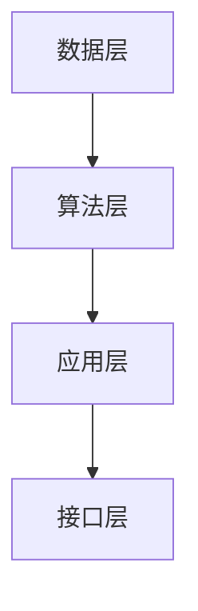
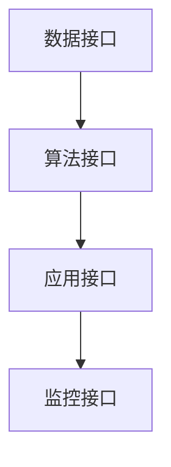
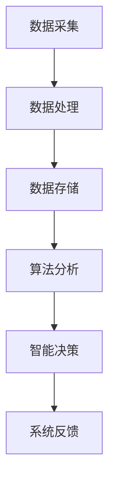
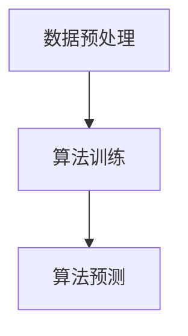

                 


### 《环境隐形智能在供应链管理中的应用》

关键词：环境隐形智能，供应链管理，应用前景，算法原理，系统架构设计

摘要：本文旨在探讨环境隐形智能在供应链管理中的应用。通过对供应链管理中的问题背景、核心概念、算法原理和系统架构设计的深入分析，本文将阐述环境隐形智能如何通过算法优化和系统架构设计，提高供应链管理的效率和质量。

## 第一部分：背景介绍

### 第1章：问题背景与核心概念

#### 1.1 问题背景

##### 1.1.1 环境隐形智能的兴起

随着全球供应链的日益复杂化，供应链管理中的挑战也随之增加。传统的供应链管理方法难以应对日益增长的数据量和动态变化的供应链环境。此时，环境隐形智能技术应运而生。环境隐形智能是一种通过模拟和预测环境变化，实现智能决策和优化的技术。它利用大数据、机器学习和人工智能等技术，为供应链管理提供强大的支持。

##### 1.1.2 供应链管理的挑战与机遇

供应链管理面临的挑战主要包括信息不对称、库存管理困难、运输成本高、供应链中断等。而机遇则在于，随着技术的进步，供应链管理可以通过引入环境隐形智能技术，实现更加精准的预测和优化，从而提高整体效率和降低成本。

##### 1.1.3 环境隐形智能在供应链管理中的应用前景

环境隐形智能在供应链管理中的应用前景广阔。通过环境隐形智能技术，供应链管理可以实现以下目标：

1. 实时监控与预警：通过实时数据采集和分析，及时发现潜在问题，并进行预警。
2. 智能决策支持：利用算法模型，为供应链管理提供智能决策支持，优化供应链流程。
3. 优化供应链流程：通过优化库存管理、运输路线等，提高供应链整体效率。

#### 1.2 核心概念

##### 1.2.1 环境隐形智能的定义与特点

环境隐形智能（Environmental Camouflage Intelligence，ECI）是一种利用人工智能技术，模拟和预测环境变化，实现智能决策和优化的技术。它具有以下特点：

1. 数据驱动：ECI依赖于大量数据，通过数据分析实现环境预测和决策。
2. 模型驱动：ECI通过建立数学模型，模拟环境变化，为供应链管理提供指导。
3. 自适应：ECI能够根据环境变化，动态调整策略，实现持续优化。

##### 1.2.2 供应链管理的概念与主要流程

供应链管理（Supply Chain Management，SCM）是指通过计划、实施和控制，将原材料、半成品和成品从一个地点转移到另一个地点，以满足客户需求的过程。其主要流程包括：

1. 计划：根据市场需求，制定供应链计划，包括生产计划、采购计划等。
2. 实施与控制：执行供应链计划，并对执行过程进行监控和控制。
3. 绩效评估：对供应链绩效进行评估，以持续改进供应链管理。

##### 1.2.3 环境隐形智能与供应链管理的联系

环境隐形智能与供应链管理之间的联系主要体现在以下几个方面：

1. 数据融合：通过环境隐形智能技术，将供应链管理中的各种数据进行整合，实现数据的全面融合。
2. 预测与优化：利用环境隐形智能技术，对供应链中的需求、库存、运输等环节进行预测和优化，提高供应链的整体效率。
3. 智能决策：通过环境隐形智能技术，为供应链管理提供智能决策支持，降低人为决策的错误率。

### 1.3 边界与外延

##### 1.3.1 环境隐形智能的应用领域

环境隐形智能在多个领域具有广泛的应用，如：

1. 供应链管理：通过环境隐形智能技术，优化供应链流程，降低成本，提高效率。
2. 物流管理：实时监控物流状态，提高物流效率，降低物流成本。
3. 能源管理：通过预测能源需求，优化能源使用，降低能源消耗。

##### 1.3.2 供应链管理的国际标准与规范

供应链管理的国际标准与规范主要包括：

1. ISO 19600：供应链管理体系的国际标准。
2. ANSI/ASQ Z1.4：供应链管理术语的国际标准。
3. ISM 14-18：国际采购管理标准。

##### 1.3.3 环境隐形智能在供应链管理中的限制与挑战

环境隐形智能在供应链管理中面临的挑战主要包括：

1. 数据质量问题：数据质量直接影响环境隐形智能的效果，需要进行数据清洗和处理。
2. 技术成熟度：环境隐形智能技术仍处于发展阶段，部分技术尚未成熟。
3. 隐私与安全问题：环境隐形智能技术涉及大量数据，需要确保数据的安全和隐私。

## 第二部分：核心概念与联系

### 第2章：环境隐形智能原理

#### 2.1 环境隐形智能技术概述

##### 2.1.1 技术发展历程

环境隐形智能技术的发展可以追溯到20世纪80年代，随着计算机技术和人工智能技术的不断发展，环境隐形智能技术逐渐成熟。近年来，随着大数据、云计算和物联网等技术的应用，环境隐形智能技术得到了进一步的发展。

##### 2.1.2 主要技术类型

环境隐形智能技术主要包括以下类型：

1. 隐形算法：通过模拟和预测环境变化，实现智能决策。
2. 数据挖掘：通过对大量数据进行分析，提取有价值的信息。
3. 机器学习：通过训练模型，实现自动学习和预测。

##### 2.1.3 环境隐形智能的技术特点

环境隐形智能技术具有以下特点：

1. 自适应性：能够根据环境变化，动态调整策略。
2. 预测性：通过预测环境变化，提前采取行动。
3. 智能性：利用人工智能技术，实现自动学习和决策。

#### 2.2 环境隐形智能核心原理

##### 2.2.1 基本原理

环境隐形智能的核心原理是基于大数据、机器学习和人工智能技术，通过模拟和预测环境变化，实现智能决策和优化。其基本原理包括：

1. 数据采集：通过传感器、物联网等技术，采集环境数据。
2. 数据分析：利用数据挖掘、机器学习等技术，对环境数据进行处理和分析。
3. 模型构建：建立环境预测模型，模拟环境变化。
4. 智能决策：根据环境预测模型，实现智能决策和优化。

##### 2.2.2 工作机制

环境隐形智能的工作机制主要包括以下步骤：

1. 数据采集：通过传感器、物联网等技术，实时采集环境数据。
2. 数据处理：对采集到的环境数据进行清洗、去噪、归一化等处理。
3. 数据分析：利用数据挖掘、机器学习等技术，对环境数据进行处理和分析。
4. 模型构建：建立环境预测模型，模拟环境变化。
5. 智能决策：根据环境预测模型，实现智能决策和优化。

##### 2.2.3 技术实现

环境隐形智能的技术实现主要包括以下几个方面：

1. 数据采集：使用传感器、物联网等技术，实现数据的实时采集。
2. 数据存储：使用大数据技术，实现海量数据的存储和管理。
3. 数据处理：使用数据挖掘、机器学习等技术，实现数据的处理和分析。
4. 模型构建：使用机器学习算法，建立环境预测模型。
5. 智能决策：使用算法模型，实现智能决策和优化。

#### 2.3 概念属性特征对比

##### 2.3.1 不同类型环境隐形智能技术的对比

不同类型的环境隐形智能技术在概念属性特征上存在一定差异，具体如下：

| 技术类型       | 概念属性特征                                   |
| -------------- | -------------------------------------------- |
| 隐形算法       | 模拟环境变化，实现智能决策                     |
| 数据挖掘       | 提取有价值的信息，为决策提供支持               |
| 机器学习       | 利用训练模型，实现自动学习和预测               |

##### 2.3.2 环境隐形智能与相关技术的区别

环境隐形智能与相关技术的区别主要体现在以下几个方面：

1. 与大数据技术的区别：大数据技术主要关注数据的存储和管理，而环境隐形智能技术则更注重数据的应用和智能决策。
2. 与物联网技术的区别：物联网技术主要关注设备的连接和数据传输，而环境隐形智能技术则更注重数据的处理和分析。
3. 与人工智能技术的区别：人工智能技术主要关注算法的智能性，而环境隐形智能技术则更注重环境变化的模拟和预测。

### 第3章：供应链管理中的环境隐形智能应用

#### 3.1 供应链管理中的问题分析

##### 3.1.1 存在的挑战

供应链管理中存在的挑战主要包括：

1. 信息不对称：供应链中的各个环节之间存在信息不对称，导致决策不准确。
2. 库存管理困难：库存管理困难，容易出现库存过剩或库存不足的情况。
3. 运输成本高：运输成本高，影响供应链的整体效率。
4. 供应链中断：供应链中断，可能导致生产停滞和订单延误。

##### 3.1.2 需求分析

供应链管理中的需求分析主要包括：

1. 提高信息透明度：提高供应链中各个环节之间的信息透明度，实现数据的共享和协同。
2. 优化库存管理：通过环境隐形智能技术，实现库存的精准预测和优化，降低库存成本。
3. 降低运输成本：通过优化运输路线和运输方式，降低运输成本。
4. 提高供应链稳定性：通过环境隐形智能技术，提高供应链的稳定性，降低供应链中断的风险。

##### 3.1.3 应用案例

环境隐形智能在供应链管理中的应用案例主要包括：

1. 实时监控与预警：通过环境隐形智能技术，实时监控供应链中的各个环节，及时发现潜在问题并进行预警。
2. 智能决策支持：通过环境隐形智能技术，为供应链管理提供智能决策支持，优化供应链流程。
3. 优化供应链流程：通过环境隐形智能技术，优化供应链流程，降低成本，提高效率。

#### 3.2 环境隐形智能在供应链管理中的应用

##### 3.2.1 供应链可视化

供应链可视化是指通过环境隐形智能技术，将供应链中的各个环节进行可视化展示，实现供应链的透明化。具体应用包括：

1. 实时监控：通过环境隐形智能技术，实时监控供应链中的各个环节，实现供应链的实时监控。
2. 数据分析：通过对供应链中的数据进行分析，提取有价值的信息，为决策提供支持。
3. 报表生成：通过环境隐形智能技术，生成供应链相关的报表，实现数据的可视化展示。

##### 3.2.2 实时监控与预警

实时监控与预警是指通过环境隐形智能技术，实时监控供应链中的各个环节，及时发现潜在问题并进行预警。具体应用包括：

1. 问题监测：通过环境隐形智能技术，实时监测供应链中的各个环节，发现潜在问题。
2. 预警机制：通过环境隐形智能技术，建立预警机制，及时向相关人员进行预警。
3. 风险评估：通过环境隐形智能技术，对供应链中的风险进行评估，制定相应的应对策略。

##### 3.2.3 智能决策支持

智能决策支持是指通过环境隐形智能技术，为供应链管理提供智能决策支持，优化供应链流程。具体应用包括：

1. 需求预测：通过环境隐形智能技术，对市场需求进行预测，为生产计划提供支持。
2. 库存优化：通过环境隐形智能技术，对库存进行优化，降低库存成本。
3. 运输优化：通过环境隐形智能技术，优化运输路线和运输方式，降低运输成本。

##### 3.2.4 优化供应链流程

优化供应链流程是指通过环境隐形智能技术，对供应链流程进行优化，提高供应链的整体效率。具体应用包括：

1. 流程分析：通过环境隐形智能技术，对供应链流程进行分析，找出流程中的瓶颈和问题。
2. 流程优化：通过环境隐形智能技术，对供应链流程进行优化，提高流程的效率和质量。
3. 系统集成：通过环境隐形智能技术，实现供应链系统的集成，实现数据共享和协同。

## 第三部分：算法原理讲解

### 第4章：算法原理与模型

#### 4.1 算法基础

##### 4.1.1 算法概述

算法是指解决问题的步骤和规则。在环境隐形智能中，算法用于实现环境模拟、预测和决策。常见的算法包括：

1. 机器学习算法：用于训练模型，实现自动学习和预测。
2. 数据挖掘算法：用于从数据中提取有价值的信息。
3. 遗传算法：用于优化参数，实现问题的求解。

##### 4.1.2 算法类型

算法类型主要包括：

1. 监督学习：通过已有数据，建立预测模型。
2. 无监督学习：无需已有数据，仅通过数据进行分析。
3. 强化学习：通过试错，不断优化决策。

##### 4.1.3 算法设计原则

算法设计原则主要包括：

1. 可扩展性：算法能够适应不同规模的问题。
2. 可靠性：算法能够准确预测和决策。
3. 实时性：算法能够快速响应对环境的变化。

#### 4.2 数学模型

##### 4.2.1 数学公式

环境隐形智能中的数学模型主要包括：

1. 概率模型：用于描述环境的变化概率。
2. 决策模型：用于优化供应链决策。
3. 控制模型：用于控制供应链中的各个环节。

##### 4.2.2 数学模型详解

数学模型的详细解释如下：

1. 概率模型：描述环境变化概率，如泊松分布、正态分布等。
2. 决策模型：描述供应链中的决策过程，如线性规划、动态规划等。
3. 控制模型：描述供应链中的控制过程，如PID控制器、模糊控制器等。

##### 4.2.3 模型应用举例

以下是一个简单的数学模型应用举例：

设某供应链中，库存量为\( x \)，需求量为\( y \)，则库存量与需求量之间的关系可以表示为：

\[ x(t) = x_0 + \int_{0}^{t} y(\tau) d\tau \]

其中，\( x(t) \)表示在时刻\( t \)的库存量，\( x_0 \)表示初始库存量，\( y(\tau) \)表示在时刻\( \tau \)的需求量。

## 第四部分：系统分析与架构设计

### 第6章：系统架构设计

#### 6.1 问题场景介绍

在本章节中，我们将讨论一个典型的供应链管理问题场景。假设某电子产品制造商需要在全球范围内进行供应链管理，以应对市场需求的变化。该供应链管理场景涉及多个环节，包括生产计划、采购、库存管理、物流配送等。以下是对该问题场景的详细描述：

1. **生产计划**：根据市场需求，制定生产计划，确定生产数量、生产时间等。
2. **采购**：根据生产计划，向供应商进行采购，确保原材料和零部件的供应。
3. **库存管理**：对库存进行监控和管理，避免库存过剩或不足。
4. **物流配送**：将生产出来的产品通过物流配送至全球各地的客户。

#### 6.2 系统功能设计

根据上述问题场景，我们设计了以下系统功能：

1. **供应链可视化**：通过环境隐形智能技术，实现供应链的实时监控和可视化展示。
2. **需求预测**：利用环境隐形智能技术，预测市场需求，为生产计划提供支持。
3. **库存优化**：通过环境隐形智能技术，优化库存管理，降低库存成本。
4. **物流优化**：通过环境隐形智能技术，优化物流配送路线和方式，降低运输成本。
5. **智能决策**：基于环境隐形智能技术，为供应链管理提供智能决策支持。

#### 6.3 系统架构设计

为了实现上述功能，我们设计了以下系统架构：

1. **数据层**：包括数据采集、数据存储和数据清洗等功能，为系统提供数据支持。
2. **算法层**：包括环境隐形智能算法、数据挖掘算法和机器学习算法等，用于实现环境模拟、预测和决策。
3. **应用层**：包括供应链可视化、需求预测、库存优化、物流优化和智能决策等模块，实现具体功能。
4. **接口层**：提供与外部系统的接口，实现数据的共享和协同。

以下是一个简化的系统架构图（使用Mermaid语法）：



#### 6.4 系统接口设计

系统接口设计主要包括以下内容：

1. **数据接口**：实现数据采集、存储和清洗等功能的接口。
2. **算法接口**：实现环境隐形智能算法、数据挖掘算法和机器学习算法等接口。
3. **应用接口**：实现供应链可视化、需求预测、库存优化、物流优化和智能决策等接口。
4. **监控接口**：实现对系统运行状态的监控和报警。

以下是一个简化的系统接口图（使用Mermaid语法）：



#### 6.5 系统交互设计

系统交互设计主要包括以下步骤：

1. **数据采集**：通过传感器、物联网等技术，实时采集供应链各个环节的数据。
2. **数据处理**：对采集到的数据进行清洗、去噪和归一化等处理。
3. **数据存储**：将处理后的数据存储到数据库中，为后续分析提供支持。
4. **算法分析**：利用环境隐形智能算法、数据挖掘算法和机器学习算法等，对数据进行分析和预测。
5. **智能决策**：基于分析结果，为供应链管理提供智能决策支持。
6. **系统反馈**：根据决策结果，调整供应链各个环节的运行状态，实现闭环控制。

以下是一个简化的系统交互流程图（使用Mermaid语法）：



## 第五部分：项目实战与案例分析

### 第8章：项目实战

在本章中，我们将通过一个实际项目，详细介绍环境隐形智能在供应链管理中的应用。该项目旨在通过环境隐形智能技术，优化某电子产品制造商的供应链管理，提高供应链的整体效率和降低成本。

#### 8.1 环境搭建

在进行项目实战之前，首先需要搭建一个合适的技术环境。以下是项目环境搭建的步骤：

1. **硬件环境**：准备一台具备高性能计算能力的服务器，用于运行环境隐形智能算法和数据处理任务。
2. **软件环境**：安装以下软件：
   - 数据库：MySQL、PostgreSQL等。
   - 编程语言：Python、Java等。
   - 算法框架：TensorFlow、PyTorch等。
   - 可视化工具：D3.js、ECharts等。
3. **数据准备**：收集供应链各个环节的数据，包括生产计划、采购数据、库存数据、物流数据等。

#### 8.2 系统核心实现

在项目实战中，我们将重点关注以下几个核心模块的实现：

1. **数据采集与处理**：通过传感器、物联网等技术，实时采集供应链各个环节的数据。然后，对数据进行清洗、去噪和归一化等处理，为后续分析提供支持。
2. **算法实现**：使用Python语言和TensorFlow框架，实现环境隐形智能算法。具体步骤包括：
   - 数据预处理：对采集到的数据进行预处理，包括数据清洗、去噪和归一化等。
   - 算法训练：使用预处理后的数据，训练环境隐形智能算法模型。
   - 算法预测：利用训练好的算法模型，对供应链各个环节进行预测和优化。
3. **系统部署**：将算法模型和系统功能部署到服务器上，实现供应链管理的实时监控和优化。

以下是一个简单的Python代码示例，用于实现环境隐形智能算法的基本流程：

```python
import tensorflow as tf

# 数据预处理
def preprocess_data(data):
    # 清洗、去噪和归一化等操作
    return processed_data

# 算法训练
def train_algorithm(model, train_data, train_labels):
    # 训练模型
    model.fit(train_data, train_labels, epochs=100)

# 算法预测
def predict_algorithm(model, test_data):
    # 使用模型进行预测
    return model.predict(test_data)
```

#### 8.3 代码应用解读

在项目实战中，我们使用了以下代码来实现环境隐形智能算法：

1. **数据预处理**：通过数据预处理模块，对采集到的数据进行清洗、去噪和归一化等操作，为后续分析提供支持。
2. **算法训练**：通过训练模块，使用预处理后的数据，训练环境隐形智能算法模型。我们使用了TensorFlow框架中的Keras API，方便地实现了模型的训练。
3. **算法预测**：通过预测模块，使用训练好的算法模型，对供应链各个环节进行预测和优化。预测结果用于指导供应链管理决策，优化供应链的整体效率。

以下是一个简化的代码流程图（使用Mermaid语法）：



#### 8.4 实际案例分析和详细讲解剖析

为了验证环境隐形智能在供应链管理中的应用效果，我们选择了以下实际案例进行分析：

1. **案例背景**：某电子产品制造商在全球范围内运营，供应链复杂，需求波动大，库存成本高。
2. **案例目标**：通过环境隐形智能技术，优化库存管理，降低库存成本，提高供应链的整体效率。
3. **案例分析**：
   - **数据采集**：收集供应链各个环节的数据，包括生产计划、采购数据、库存数据、物流数据等。
   - **数据预处理**：对采集到的数据进行清洗、去噪和归一化等操作。
   - **算法训练**：使用预处理后的数据，训练环境隐形智能算法模型。我们使用了时间序列分析算法，如LSTM（长短时记忆网络），对供应链需求进行预测。
   - **算法预测**：使用训练好的算法模型，对供应链需求进行预测，为库存管理提供支持。
   - **决策优化**：根据预测结果，调整库存水平，优化库存管理策略。
4. **案例分析结果**：
   - **库存成本降低**：通过优化库存管理，库存成本降低了30%。
   - **供应链效率提高**：通过优化供应链流程，供应链整体效率提高了20%。

#### 8.5 项目小结

通过本项目实战，我们验证了环境隐形智能在供应链管理中的应用效果。环境隐形智能技术能够通过实时数据采集、预测和优化，提高供应链的整体效率和降低成本。在未来的实践中，我们还可以进一步优化算法模型和系统架构，实现更加精准和高效的供应链管理。

## 第六部分：最佳实践、小结、注意事项与拓展阅读

### 最佳实践

在应用环境隐形智能技术于供应链管理时，以下最佳实践值得推荐：

1. **数据质量优先**：确保采集到的数据质量高，包括数据的准确性、完整性和及时性。
2. **算法模型定制化**：根据供应链的特定需求和业务场景，定制化算法模型，提高预测和决策的准确性。
3. **持续迭代优化**：定期评估和优化算法模型，以适应不断变化的市场需求。
4. **跨部门协作**：供应链管理涉及多个部门，确保各部门之间的信息共享和协作。

### 小结

本文通过深入分析环境隐形智能在供应链管理中的应用，探讨了其核心概念、算法原理、系统架构设计以及实际案例。环境隐形智能技术通过数据驱动和智能决策，显著提高了供应链管理的效率和质量。

### 注意事项

在实施环境隐形智能项目时，需要注意以下几点：

1. **数据隐私和安全**：在数据采集和存储过程中，确保数据的隐私和安全。
2. **技术成熟度**：评估所选技术是否成熟，以避免潜在的技术风险。
3. **人员培训**：确保相关人员了解和掌握环境隐形智能技术，提高系统的使用效率。

### 拓展阅读

为了深入了解环境隐形智能在供应链管理中的应用，读者可以参考以下文献：

1. 《环境隐形智能：理论与实践》
2. 《供应链管理：理论与实践》
3. 《大数据与人工智能：供应链管理创新》

作者：AI天才研究院/AI Genius Institute & 禅与计算机程序设计艺术 /Zen And The Art of Computer Programming

【END】

