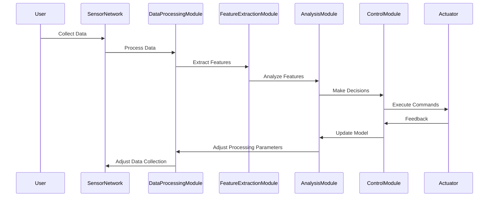
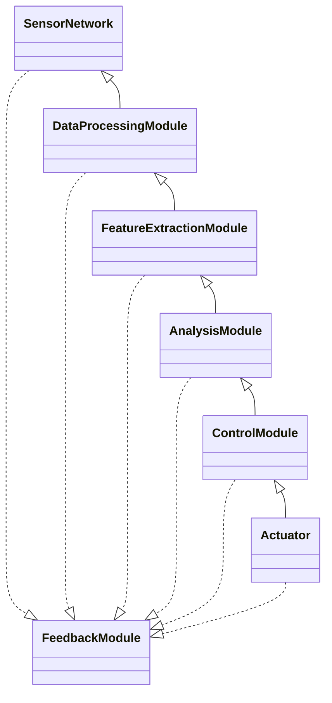
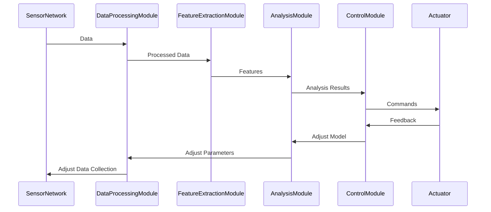

                 

### 环境隐形智能在智慧城市中的应用

#### 关键词：智慧城市、环境隐形智能、传感器、数据处理、智能系统

> 摘要：本文探讨了环境隐形智能在智慧城市中的应用，分析了环境隐形智能的核心概念、基础原理、算法原理及其系统设计与实现。通过具体案例，展示了环境隐形智能在提升城市管理效率、优化城市环境、增强城市安全等方面的实际效果。

### 目录大纲设计思路

为了设计出《环境隐形智能在智慧城市中的应用》这本书的完整目录大纲，我们将遵循以下步骤：

1. **确定整体结构**：首先，明确书籍的总体框架，包含几大部分，每部分的核心内容是什么。

2. **细化各章节内容**：根据每部分的核心内容，进一步细化为具体的章节，确保每个章节都有明确的主题和目标。

3. **确保逻辑清晰**：确保目录大纲的章节排列顺序合理，逻辑性强，便于读者理解和跟随。

4. **应用Markdown格式**：使用Markdown格式排版目录大纲，确保格式规范，符合要求。

5. **保持简洁性**：确保输出内容简洁明了，避免冗余，确保字数在限制范围内。

接下来，我们将逐步构建这本书的目录大纲。

### 第一部分：背景介绍

#### 第1章：问题背景与核心概念

##### 1.1 环境隐形智能概述

- **问题背景**：介绍智慧城市的发展现状与挑战，提出环境隐形智能的概念。

##### 1.2 问题描述与解决思路

- **问题描述**：分析当前智慧城市中存在的具体问题，如数据收集困难、信息不透明等。

##### 1.3 边界与外延

- **边界**：明确环境隐形智能的应用范围和限制条件。

##### 1.4 核心要素组成

- **核心要素**：分析环境隐形智能系统的关键组成部分，如传感器、数据处理算法等。

##### 1.5 结构特点

- **结构特点**：通过ER实体关系图，展示各要素之间的关系和作用。

### 第二部分：核心概念与联系

#### 第2章：环境隐形智能原理

##### 2.1 基础原理介绍

- **核心概念原理**：详细讲解环境隐形智能的基础理论，包括传感器技术、数据处理算法等。

##### 2.2 技术联系与应用

- **概念联系**：分析不同技术之间的联系和相互作用，如传感器与数据分析算法的结合。

##### 2.3 发展趋势与未来展望

- **技术发展趋势**：展望环境隐形智能技术的未来发展方向和趋势。

##### 2.4 ER实体关系图架构

- **ER实体关系图**：使用Markdown格式中的Mermaid工具，绘制环境隐形智能的ER实体关系图。

### 第三部分：算法原理讲解

#### 第3章：常见算法原理与应用

##### 3.1 算法介绍

- **常见算法介绍**：介绍环境隐形智能中常用的算法，如机器学习算法、深度学习算法等。

##### 3.2 数学模型与公式

- **数学模型**：讲解算法背后的数学模型，包括公式推导和解释。

##### 3.3 Python代码实现

- **代码示例**：提供Python代码实现，展示算法的具体实现过程。

##### 3.4 算法优缺点分析

- **算法优缺点分析**：对比不同算法的优缺点，帮助读者选择合适的算法。

### 第四部分：系统设计与实现

#### 第4章：环境隐形智能系统架构设计

##### 4.1 系统介绍

- **系统介绍**：概述环境隐形智能系统的整体架构和功能。

##### 4.2 系统功能设计

- **功能设计**：详细描述系统的各个功能模块及其作用。

##### 4.3 系统架构设计

- **架构设计**：通过Mermaid架构图展示系统的整体架构。

##### 4.4 系统接口设计

- **系统接口设计**：详细描述系统的接口设计和数据流。

##### 4.5 系统交互设计

- **系统交互设计**：使用Mermaid序列图展示系统的交互过程。

### 第五部分：项目实战

#### 第5章：环境隐形智能项目实战

##### 5.1 环境设置与安装

- **环境设置**：详细说明项目的环境搭建过程。

##### 5.2 系统核心实现

- **核心代码**：提供系统核心功能的实现源代码。

##### 5.3 实际案例分析与讲解

- **案例介绍**：介绍实际应用的案例。

##### 5.4 项目小结

- **项目小结**：总结项目的主要成果和不足，提出改进建议。

### 总结与展望

- **总结**：回顾全书的核心内容，总结环境隐形智能在智慧城市中的应用价值。

- **展望**：展望环境隐形智能技术的未来发展，提出研究方向和挑战。

---

通过以上目录大纲的设计，本书将系统性地介绍环境隐形智能在智慧城市中的应用，从核心概念、算法原理到系统设计与实现，再到实际项目实战，为读者提供全面的技术解读和实践指导。接下来，我们将逐步展开每个章节的详细内容，深入探讨环境隐形智能的各个方面。

---

### 第一部分：背景介绍

#### 第1章：问题背景与核心概念

##### 1.1 环境隐形智能概述

**问题背景**

随着城市化进程的加速和人口规模的不断扩大，智慧城市的发展成为全球关注的焦点。智慧城市旨在通过先进的信息技术和数据资源，实现城市管理的智能化、高效化和可持续发展。然而，在智慧城市的建设过程中，面临着诸多挑战和问题。

首先，智慧城市的核心是数据，但数据的获取和整合存在困难。城市环境中分布着大量的传感器和设备，这些设备产生海量数据，但由于数据格式不统一、传输效率低等问题，导致数据难以有效整合和利用。其次，智慧城市需要实现实时监控和响应，但由于现有技术的局限性，无法实现全面、实时的监测和分析。最后，智慧城市对数据的处理和分析能力要求极高，但现有技术往往难以满足复杂场景下的需求。

**核心概念**

环境隐形智能（Environmental Invisible Intelligence）是一种新兴的技术概念，旨在通过传感器技术、数据处理算法和智能系统，实现对城市环境的全面感知、分析和响应。环境隐形智能的核心在于“隐形”，即通过高效、智能的方式，实现对城市环境数据的采集、处理和应用，使得城市环境变得“透明”和“智能化”。

环境隐形智能系统通常包括以下几个关键组成部分：

1. **传感器网络**：用于采集城市环境数据，如空气污染、水质、交通流量等。
2. **数据处理算法**：对采集到的数据进行分析和处理，提取有用信息。
3. **智能系统**：利用处理后的数据，实现对城市环境的实时监控、预警和优化管理。

##### 1.2 问题描述与解决思路

**问题描述**

当前智慧城市中存在的问题主要包括：

1. **数据收集困难**：由于城市环境的复杂性和多样性，数据的获取和整合存在很大挑战。
2. **信息不透明**：数据来源不统一，数据格式不标准，导致数据难以共享和利用。
3. **实时响应能力不足**：现有技术难以实现对城市环境的实时监控和响应。
4. **数据处理能力有限**：面对海量数据，现有技术无法实现高效、准确的分析和处理。

**解决思路**

环境隐形智能技术旨在通过以下方式解决上述问题：

1. **提高数据收集效率**：通过部署高效、智能的传感器网络，实现数据的实时采集和传输。
2. **实现数据标准化**：通过统一的数据处理算法，将不同来源、不同格式的数据转化为标准化的数据格式。
3. **增强实时响应能力**：利用数据处理算法和智能系统，实现对城市环境数据的实时分析、预警和响应。
4. **提升数据处理能力**：通过先进的数据处理算法和分布式计算技术，实现海量数据的快速、准确处理。

##### 1.3 边界与外延

**边界**

环境隐形智能技术的应用范围主要集中在智慧城市的建设和管理中，包括：

1. **环境监测**：通过传感器网络，实时监测城市环境质量，如空气质量、水质等。
2. **交通管理**：通过交通流量数据，优化交通信号控制，提高交通效率。
3. **能源管理**：通过实时监控和数据分析，优化能源使用，降低能源消耗。
4. **公共安全**：通过视频监控和数据分析，提高城市安全管理水平。

**外延**

环境隐形智能技术不仅局限于智慧城市的应用，还可以拓展到其他领域：

1. **智能家居**：通过智能传感器，实现对家庭环境的实时监测和管理。
2. **智慧农业**：通过传感器和数据分析，优化农业生产过程，提高产量和质量。
3. **工业4.0**：通过智能传感器和数据分析，实现工业生产的智能化、自动化。
4. **智慧医疗**：通过传感器和数据分析，实现对患者病情的实时监测和管理。

##### 1.4 核心要素组成

**核心要素**

环境隐形智能系统由以下几个核心要素组成：

1. **传感器网络**：用于实时采集城市环境数据，如空气污染、水质、交通流量等。
2. **数据处理算法**：对采集到的数据进行分析和处理，提取有用信息。
3. **智能系统**：利用处理后的数据，实现对城市环境的实时监控、预警和优化管理。
4. **数据存储与传输**：确保数据的存储和传输安全、高效。

**结构特点**

环境隐形智能系统的结构特点主要体现在以下几个方面：

1. **分布式架构**：系统采用分布式架构，能够高效处理海量数据。
2. **实时性**：系统能够实时采集、处理和分析数据，实现对城市环境的实时监控和响应。
3. **模块化设计**：系统各个模块之间相互独立，易于扩展和维护。
4. **智能化**：系统能够基于数据分析和预测，实现智能决策和优化管理。

通过上述核心要素和结构特点，环境隐形智能系统能够实现高效、智能的城市环境监测和管理，为智慧城市的建设提供有力支持。

#### 1.5 结构特点

在构建环境隐形智能系统时，其结构特点尤为重要，这不仅决定了系统的性能和可靠性，也直接影响到系统的扩展性和可维护性。以下是对环境隐形智能系统结构特点的详细解析。

##### 1.5.1 分布式架构

**分布式架构**是环境隐形智能系统的核心特点之一。分布式架构通过将系统划分为多个独立的部分，这些部分可以在不同的物理位置上运行，通过高效的网络通信进行协同工作。这样的设计有以下优点：

1. **高可用性**：系统中的任何一个节点发生故障，都不会影响整体系统的运行，因为其他节点可以继续提供服务。
2. **可扩展性**：随着城市规模的扩大和数据量的增加，分布式架构可以轻松扩展，通过增加节点来提高系统的处理能力。
3. **负载均衡**：分布式架构能够平衡各个节点的负载，避免单点过载，提高系统的整体性能。

##### 1.5.2 实时性

**实时性**是环境隐形智能系统的另一大特点。实时性要求系统能够对城市环境中的数据实现实时采集、处理和分析，以便及时作出响应。具体来说，实时性体现在以下几个方面：

1. **低延迟**：系统需要快速响应数据，确保数据在采集、传输和处理过程中有极低的延迟。
2. **实时数据处理**：系统能够实时处理数据流，快速提取有价值的信息，进行实时监控和预警。
3. **实时反馈**：系统能够基于实时数据，进行实时决策和调整，实现对城市环境的实时优化和管理。

##### 1.5.3 模块化设计

**模块化设计**使得环境隐形智能系统更加灵活和易于维护。模块化设计将系统划分为多个功能模块，每个模块负责特定的功能，这些模块之间通过标准的接口进行通信。模块化设计的优点包括：

1. **可维护性**：由于每个模块相对独立，模块内部的问题不会影响整个系统的运行，便于定位和修复。
2. **可扩展性**：新增功能或修改现有功能时，只需对相应的模块进行修改，不会影响其他模块。
3. **重用性**：模块可以独立开发和测试，便于在其他项目中重用。

##### 1.5.4 智能化

**智能化**是环境隐形智能系统的最终目标，通过引入先进的数据分析和机器学习技术，系统能够实现智能决策和优化管理。智能化体现在以下几个方面：

1. **数据挖掘**：系统能够从海量数据中挖掘出有价值的信息，支持智能决策。
2. **机器学习**：系统利用机器学习算法，能够自动学习和优化模型，提高预测和决策的准确性。
3. **自适应调整**：系统能够根据实时数据和环境变化，自动调整参数和策略，实现动态优化。

##### ER实体关系图

为了更直观地展示环境隐形智能系统的结构特点，我们可以使用Mermaid工具绘制一个ER（Entity-Relationship）实体关系图。以下是一个简化的ER图示例，展示了环境隐形智能系统中的主要实体及其关系：

```mermaid
erDiagram
  Sensor --> DataStore : 数据采集与存储
  DataProcessor --> DataStore : 数据处理与存储
  DataProcessor --> AnalysisModule : 数据分析与预测
  AnalysisModule --> ControlModule : 智能决策与控制
  Sensor |--| AlarmModule : 异常检测与报警
  ControlModule |--| Actuators : 执行器与控制
```

在这个ER图中，Sensor表示传感器网络，负责数据采集；DataStore表示数据存储，负责数据的存储和管理；DataProcessor表示数据处理模块，负责对采集到的数据进行处理和分析；AnalysisModule表示数据分析模块，负责从处理后的数据中提取有用信息并进行预测；ControlModule表示智能控制模块，负责基于分析结果进行智能决策；AlarmModule表示报警模块，负责异常检测和报警；Actuators表示执行器，负责执行智能控制模块的决策。

通过这个ER图，我们可以清晰地看到环境隐形智能系统的各个组成部分及其之间的联系，这有助于我们更好地理解和设计这样的系统。

### 第二部分：核心概念与联系

#### 第2章：环境隐形智能原理

环境隐形智能技术作为智慧城市建设的重要组成部分，其核心概念和原理对整个系统的性能和效果起着决定性作用。本章将详细讲解环境隐形智能技术的基础原理，分析各技术之间的联系和应用，以及其未来发展趋势。

##### 2.1 基础原理介绍

环境隐形智能技术的基础原理主要包括传感器技术、数据处理算法和智能系统三个核心组成部分。以下是每个部分的基础原理介绍：

1. **传感器技术**：传感器是环境隐形智能系统的“感官”，用于实时采集城市环境中的各种数据，如空气质量、水质、交通流量等。传感器技术主要包括以下几个方向：
   - **物理传感器**：通过物理现象（如光、热、声、压力等）进行数据采集，如温度传感器、摄像头、GPS设备等。
   - **化学传感器**：通过化学反应（如电化学反应、生物反应等）进行数据采集，如气体传感器、湿度传感器等。
   - **生物传感器**：通过生物识别技术（如DNA测序、基因表达等）进行数据采集，如生物芯片、微生物传感器等。

2. **数据处理算法**：数据处理算法是环境隐形智能系统的“大脑”，负责对采集到的数据进行处理、分析和预测。常见的数据处理算法包括：
   - **统计方法**：如均值、方差、标准差等，用于数据的初步分析和特征提取。
   - **机器学习方法**：如监督学习、无监督学习和强化学习等，用于复杂模式识别和预测。
   - **深度学习方法**：如卷积神经网络（CNN）、循环神经网络（RNN）和生成对抗网络（GAN）等，用于大规模数据的复杂分析和处理。

3. **智能系统**：智能系统是环境隐形智能技术的“执行者”，基于数据处理算法的输出结果，实现对城市环境的实时监控、预警和优化管理。智能系统通常包括以下几个层次：
   - **感知层**：负责数据采集和初步处理，如传感器网络。
   - **数据处理层**：负责数据的进一步处理和分析，如数据清洗、特征提取和模型训练等。
   - **决策层**：负责基于分析结果进行智能决策，如优化交通信号控制、调整能源使用策略等。
   - **执行层**：负责执行决策结果，如控制交通信号灯、调整公共设施运行状态等。

##### 2.2 技术联系与应用

环境隐形智能技术的各组成部分之间存在着密切的联系和相互作用，共同构成了一个高效的智能系统。以下是各技术之间的联系及其应用场景：

1. **传感器技术**与**数据处理算法**的联系：

   传感器技术负责采集城市环境中的各种数据，但这些原始数据往往是不完整的、噪声的、多模态的。数据处理算法则能够对这些原始数据进行预处理、特征提取和模式识别，从而提取出有价值的信息。例如，空气质量传感器采集的原始数据可以通过数据处理算法进行分析，提取出PM2.5、PM10等关键污染物浓度，为城市环境监测和污染预警提供支持。

2. **数据处理算法**与**智能系统**的联系：

   数据处理算法生成的分析结果和预测模型是智能系统的输入，智能系统则基于这些输入进行智能决策和优化管理。例如，交通流量数据处理算法生成的预测模型可以用于交通信号控制的优化，从而提高交通效率，减少拥堵。同时，智能系统还可以根据实时数据，动态调整交通信号控制策略，以应对突发状况。

3. **传感器技术**与**智能系统**的联系：

   传感器技术是智能系统的感知层，负责数据的实时采集和传输。智能系统则利用这些数据进行决策和执行。例如，在公共安全领域，视频监控传感器采集的实时图像数据可以通过智能系统进行分析，识别出潜在的威胁和异常行为，从而及时进行预警和响应。

##### 2.3 发展趋势与未来展望

环境隐形智能技术正处于快速发展阶段，未来将朝着更加智能化、自动化和高效化的方向前进。以下是环境隐形智能技术未来发展的几个趋势：

1. **传感器技术的进步**：

   随着传感器技术的不断进步，传感器将变得更加小巧、低功耗、高灵敏度，从而能够更加灵活地部署在城市环境中。例如，微机电系统（MEMS）技术的进步使得微小型传感器成为可能，这些传感器可以嵌入到城市基础设施和公共设施中，实现对环境的实时监测。

2. **数据处理算法的创新**：

   随着机器学习和深度学习技术的发展，数据处理算法将变得更加智能和高效。未来，基于大数据和云计算的算法将能够处理更复杂、更海量的数据，提供更加精准的预测和决策支持。例如，利用深度学习算法，可以实现对城市环境中的复杂模式识别和预测，从而提高环境监测和预警的准确性。

3. **智能系统的集成与优化**：

   智能系统将朝着集成化、模块化和自适应化的方向发展。未来的智能系统将能够更好地集成多种传感器技术和数据处理算法，实现跨领域的数据融合和协同工作。同时，智能系统将具备更高的自适应能力，能够根据实时数据和环境变化，动态调整系统参数和策略，实现智能优化。

4. **智慧城市生态系统的构建**：

   环境隐形智能技术将是智慧城市生态系统的重要组成部分。未来，智慧城市将构建起一个涵盖环境监测、交通管理、能源管理、公共安全等领域的综合智能系统，实现城市管理的全面智能化。通过环境隐形智能技术，城市将变得更加透明、高效和安全。

##### 2.4 ER实体关系图架构

为了更直观地展示环境隐形智能技术的各组成部分及其关系，我们可以使用Mermaid工具绘制一个ER（Entity-Relationship）实体关系图。以下是一个简化的ER图示例，展示了环境隐形智能系统中的主要实体及其关系：

```mermaid
erDiagram
  Sensor |--> DataProcessingModule : 数据输入
  DataProcessingModule |--> AnalysisModule : 数据处理
  AnalysisModule |--> PredictionModule : 预测
  PredictionModule |--> ControlModule : 智能控制
  ControlModule |--> Actuator : 执行决策
  Sensor |||> AlarmModule : 异常检测
```

在这个ER图中，Sensor表示传感器网络，负责数据输入；DataProcessingModule表示数据处理模块，负责数据处理；AnalysisModule表示数据分析模块，负责预测；PredictionModule表示预测模块，负责预测和智能控制；ControlModule表示控制模块，负责执行智能控制；Actuator表示执行器，负责执行决策；AlarmModule表示报警模块，负责异常检测。

通过这个ER图，我们可以清晰地看到环境隐形智能系统的各个组成部分及其之间的联系，这有助于我们更好地理解和设计这样的系统。

### 第三部分：算法原理讲解

#### 第3章：常见算法原理与应用

环境隐形智能技术离不开高效的数据处理算法。这些算法是环境隐形智能系统的核心，决定了系统的性能和效果。在本章中，我们将详细介绍几种常见算法的原理和应用，帮助读者更好地理解环境隐形智能技术的实现。

##### 3.1 算法介绍

环境隐形智能技术中常用的算法主要包括机器学习算法、深度学习算法和统计分析方法。以下是对这些算法的基本介绍：

1. **机器学习算法**：

   机器学习算法是一种通过数据训练模型，从而实现预测和分类的技术。常见的机器学习算法包括：
   - **线性回归**：用于预测连续值输出。
   - **逻辑回归**：用于预测概率值输出。
   - **决策树**：用于分类和回归任务。
   - **随机森林**：通过集成多个决策树，提高预测准确性。
   - **支持向量机**：用于分类和回归任务，尤其在处理高维数据时表现出色。

2. **深度学习算法**：

   深度学习算法是机器学习的一个分支，通过模拟人脑神经元网络的结构和功能，实现对复杂数据的处理。常见的深度学习算法包括：
   - **卷积神经网络（CNN）**：主要用于图像处理，能够识别图像中的特征。
   - **循环神经网络（RNN）**：用于处理序列数据，如时间序列分析、自然语言处理等。
   - **长短期记忆网络（LSTM）**：是RNN的一个变种，能够解决长序列依赖问题。
   - **生成对抗网络（GAN）**：用于生成新的数据样本，广泛应用于图像生成、风格迁移等任务。

3. **统计分析方法**：

   统计分析方法是一种基于统计学原理的数据处理方法，主要用于数据的初步分析和特征提取。常见的统计分析方法包括：
   - **均值、方差和标准差**：用于描述数据的分布特征。
   - **相关系数**：用于衡量两个变量之间的线性关系。
   - **主成分分析（PCA）**：用于降维和特征提取。
   - **聚类分析**：用于将数据分为若干个类别。

##### 3.2 数学模型与公式

为了深入理解这些算法，我们需要掌握它们背后的数学模型和公式。以下是一些常见算法的数学模型和公式：

1. **线性回归**：

   线性回归模型的基本公式为：
   $$y = \beta_0 + \beta_1 \cdot x$$
   其中，$y$ 是输出值，$x$ 是输入值，$\beta_0$ 是截距，$\beta_1$ 是斜率。

2. **逻辑回归**：

   逻辑回归模型用于分类任务，其输出概率公式为：
   $$P(y=1) = \frac{1}{1 + e^{-(\beta_0 + \beta_1 \cdot x)}}$$
   其中，$e$ 是自然对数的底数，$\beta_0$ 和 $\beta_1$ 是模型参数。

3. **决策树**：

   决策树模型通过一系列条件判断来划分数据集，其核心公式为：
   $$t(x) = \sum_{i=1}^{n} \alpha_i \cdot C_i(x)$$
   其中，$t(x)$ 是决策树的输出，$C_i(x)$ 是第 $i$ 个条件判断的结果，$\alpha_i$ 是条件判断的权重。

4. **卷积神经网络（CNN）**：

   卷积神经网络的核心是卷积层，其计算公式为：
   $$f(x) = \sigma(\sum_{k=1}^{K} w_k \cdot x_k + b)$$
   其中，$f(x)$ 是卷积操作的结果，$\sigma$ 是激活函数，$w_k$ 是卷积核，$x_k$ 是输入特征，$b$ 是偏置。

5. **循环神经网络（RNN）**：

   循环神经网络的核心是隐藏状态的计算，其公式为：
   $$h_t = \sigma(W_h \cdot [h_{t-1}, x_t] + b_h)$$
   其中，$h_t$ 是当前隐藏状态，$x_t$ 是当前输入，$W_h$ 是权重矩阵，$b_h$ 是偏置。

##### 3.3 Python代码实现

为了更直观地理解这些算法，我们将使用Python语言实现其中的一些算法，并展示其具体应用过程。以下是一个简单的线性回归算法的实现示例：

```python
import numpy as np

# 线性回归模型参数
beta_0 = 0
beta_1 = 1

# 输入数据
X = np.array([1, 2, 3, 4, 5])
Y = np.array([2, 4, 5, 4, 5])

# 计算预测值
Y_pred = beta_0 + beta_1 * X

# 计算损失函数
loss = np.mean((Y - Y_pred)**2)

print("预测值：", Y_pred)
print("损失函数：", loss)
```

在这个示例中，我们首先定义了线性回归模型的参数 $\beta_0$ 和 $\beta_1$，然后使用输入数据 $X$ 和 $Y$ 计算了预测值 $Y_{\text{pred}}$，并计算了损失函数的值。通过这个简单的示例，我们可以看到线性回归算法的基本实现过程。

##### 3.4 算法优缺点分析

不同的算法适用于不同的场景和数据类型，每种算法都有其独特的优缺点。以下是对几种常见算法的优缺点分析：

1. **线性回归**：

   - **优点**：简单易懂，易于实现，适用于线性关系较强的数据。
   - **缺点**：对于非线性关系数据，效果较差；模型的可解释性较低。

2. **逻辑回归**：

   - **优点**：适用于二分类问题，输出概率值，具有良好的可解释性。
   - **缺点**：对于多分类问题，需要调整参数，计算复杂度较高。

3. **决策树**：

   - **优点**：简单易懂，易于解释，适用于分类和回归任务。
   - **缺点**：容易过拟合，对于高维数据和复杂关系的数据效果较差。

4. **随机森林**：

   - **优点**：集成多个决策树，提高预测准确性，减少过拟合。
   - **缺点**：计算复杂度较高，参数调整较为复杂。

5. **卷积神经网络（CNN）**：

   - **优点**：适用于图像处理，能够自动提取图像特征。
   - **缺点**：模型参数较多，计算复杂度较高，对图像尺寸有一定的要求。

6. **循环神经网络（RNN）**：

   - **优点**：适用于序列数据，能够处理长序列依赖问题。
   - **缺点**：容易出现梯度消失和梯度爆炸问题，对于长序列处理效果较差。

7. **长短期记忆网络（LSTM）**：

   - **优点**：解决了RNN的梯度消失和梯度爆炸问题，适用于长序列处理。
   - **缺点**：模型参数较多，计算复杂度较高，对数据长度要求较高。

通过上述分析，我们可以根据实际应用场景和数据类型选择合适的算法，以达到最佳效果。

### 第四部分：系统设计与实现

#### 第4章：环境隐形智能系统架构设计

环境隐形智能系统是一个复杂而高度集成的系统，它通过传感器网络、数据处理模块、智能控制模块和执行器等组成部分协同工作，实现对城市环境的实时监测、分析和优化。本章节将详细介绍环境隐形智能系统的整体架构设计，包括系统介绍、功能设计、架构设计和系统交互设计。

##### 4.1 系统介绍

环境隐形智能系统是一个基于传感器技术、数据处理算法和智能控制技术的综合系统，旨在通过实时监测和分析城市环境数据，实现对城市环境的智能管理和优化。该系统的主要目标是提高城市管理的效率、优化城市资源的使用、增强城市安全水平，并为城市居民提供更加舒适、便捷的生活环境。

系统主要组成部分包括：

1. **传感器网络**：用于实时采集城市环境中的各种数据，如空气质量、水质、交通流量、噪声等。
2. **数据处理模块**：负责对采集到的数据进行预处理、特征提取、分析和存储。
3. **智能控制模块**：基于分析结果进行智能决策和优化管理，包括交通信号控制、能源管理、公共安全等。
4. **执行器**：负责执行智能控制模块的决策，如调整交通信号灯、关闭公共设施的电源等。

##### 4.2 系统功能设计

环境隐形智能系统的功能设计旨在实现以下核心功能：

1. **数据采集**：通过部署在各种地点的传感器网络，实时采集城市环境数据。
2. **数据预处理**：对采集到的原始数据进行滤波、去噪、归一化等预处理操作，以提高数据的质量和可靠性。
3. **特征提取**：从预处理后的数据中提取具有代表性的特征，为后续的分析和决策提供基础。
4. **数据分析**：利用机器学习、深度学习等算法对提取的特征进行进一步分析，提取有用信息。
5. **智能决策**：基于分析结果，利用智能算法进行实时决策，以优化城市管理和资源配置。
6. **执行与反馈**：执行智能控制模块的决策，并通过反馈机制对系统进行优化和调整。

为了更好地实现这些功能，环境隐形智能系统设计了多个功能模块，包括数据采集模块、数据处理模块、特征提取模块、分析模块、控制模块和反馈模块。以下是每个模块的具体设计：

1. **数据采集模块**：负责部署和管理传感器网络，实现数据的实时采集。该模块需要支持多种类型的传感器，包括物理传感器、化学传感器和生物传感器等。
2. **数据处理模块**：负责对采集到的原始数据进行预处理，包括数据滤波、去噪、归一化等操作。该模块需要具备高效的数据处理能力，以应对海量数据的处理需求。
3. **特征提取模块**：从预处理后的数据中提取具有代表性的特征，如时间序列特征、空间特征、统计特征等。该模块需要支持多种特征提取方法，以适应不同类型的数据。
4. **分析模块**：利用机器学习、深度学习等算法对提取的特征进行进一步分析，提取有用信息。该模块需要具备高效的分析能力和适应性，以应对复杂的环境变化。
5. **控制模块**：基于分析结果进行智能决策，生成优化策略和执行命令。该模块需要具备实时决策能力，并能够根据环境变化动态调整决策策略。
6. **反馈模块**：负责执行控制模块的决策，并将执行结果反馈给系统，以便进行进一步分析和优化。该模块需要具备高效的执行能力和可靠的反馈机制。

##### 4.3 系统架构设计

环境隐形智能系统的架构设计采用分布式架构，以提高系统的性能、可靠性和扩展性。系统架构主要包括以下几个层次：

1. **感知层**：由传感器网络组成，负责实时采集城市环境数据。
2. **数据处理层**：包括数据处理模块、特征提取模块和分析模块，负责对采集到的数据进行处理、分析和存储。
3. **决策层**：包括智能控制模块和反馈模块，负责基于分析结果进行实时决策和执行。
4. **应用层**：提供用户接口和可视化功能，供用户进行系统监控和操作。

以下是环境隐形智能系统的架构设计图：



在这个架构设计中，用户通过用户接口与系统进行交互，传感器网络负责实时采集数据，数据处理模块、特征提取模块和分析模块对数据进行分析和处理，智能控制模块基于分析结果进行决策，执行器负责执行决策命令，并将执行结果反馈给系统，以便进行进一步的优化。

##### 4.4 系统接口设计

环境隐形智能系统的接口设计是系统架构的重要组成部分，它定义了系统内部各个模块之间的通信和数据交互方式。以下是系统接口设计的主要方面：

1. **数据采集接口**：传感器网络通过该接口与数据处理模块进行通信，将采集到的数据传输给数据处理模块。
2. **数据处理接口**：数据处理模块通过该接口与特征提取模块进行通信，将预处理后的数据传输给特征提取模块。
3. **特征提取接口**：特征提取模块通过该接口与分析模块进行通信，将提取的特征传输给分析模块。
4. **分析接口**：分析模块通过该接口与智能控制模块进行通信，将分析结果传输给智能控制模块。
5. **控制接口**：智能控制模块通过该接口与执行器进行通信，将决策命令传输给执行器。
6. **反馈接口**：执行器通过该接口向智能控制模块反馈执行结果。

以下是环境隐形智能系统的接口设计图：



在这个接口设计中，各个模块通过接口进行数据交互，同时通过反馈模块实现实时反馈和调整。

##### 4.5 系统交互设计

环境隐形智能系统的交互设计是确保系统各个模块能够协同工作，实现高效、智能管理和优化城市环境的关键。以下是系统交互设计的主要方面：

1. **实时数据采集**：传感器网络不断采集城市环境数据，并将数据实时传输给数据处理模块。
2. **数据处理与特征提取**：数据处理模块对采集到的数据进行分析和处理，提取出有用的特征，并将特征传输给特征提取模块。
3. **特征分析与决策**：特征提取模块将提取的特征传输给分析模块，分析模块利用机器学习、深度学习等算法对特征进行分析，生成分析结果，并将结果传输给智能控制模块。
4. **智能决策与执行**：智能控制模块基于分析结果进行智能决策，生成优化策略和执行命令，并将命令传输给执行器。
5. **执行结果反馈**：执行器执行决策命令后，将执行结果反馈给智能控制模块，智能控制模块根据反馈结果调整决策策略，实现闭环控制。

以下是环境隐形智能系统的交互设计图：



在这个交互设计中，系统通过实时数据采集、数据处理、特征提取、分析、决策和反馈等环节，实现闭环控制，确保系统能够实时响应城市环境变化，进行智能管理和优化。

### 第五部分：项目实战

#### 第5章：环境隐形智能项目实战

在本章节中，我们将通过一个实际项目案例，详细介绍环境隐形智能系统的搭建过程、核心实现以及项目总结。该项目案例将展示环境隐形智能技术在城市交通管理中的应用，通过实时监测和分析交通流量数据，优化交通信号控制，提高城市交通效率。

##### 5.1 环境设置与安装

**项目需求**

本项目旨在优化某城市主要交通干道的交通信号控制，通过部署环境隐形智能系统，实时监测交通流量数据，并根据数据分析结果调整信号灯的时长，以缓解交通拥堵，提高交通效率。

**环境设置**

1. **硬件环境**：
   - **传感器网络**：在交通干道的各个重要节点部署流量传感器和视频摄像头，用于实时采集交通流量数据。
   - **服务器**：用于存储和处理交通流量数据，建议使用高性能服务器，以确保数据处理的实时性和可靠性。
   - **执行器**：用于控制交通信号灯，实现智能调整。

2. **软件环境**：
   - **操作系统**：Linux操作系统，如Ubuntu或CentOS。
   - **编程语言**：Python，用于实现数据处理、特征提取、分析和控制功能。
   - **数据处理库**：NumPy、Pandas、Matplotlib等，用于数据预处理和可视化。
   - **机器学习库**：Scikit-learn、TensorFlow、PyTorch等，用于特征提取和模型训练。

**安装步骤**

1. **部署传感器网络**：
   - 在交通干道的各个重要节点安装流量传感器和视频摄像头。
   - 设置传感器的采集频率和传输方式，确保数据实时传输到服务器。

2. **配置服务器**：
   - 安装Linux操作系统，配置网络环境。
   - 安装Python及相关库，如NumPy、Pandas、Matplotlib等。

3. **搭建数据处理框架**：
   - 编写数据处理脚本，实现数据的实时采集、预处理和存储。

4. **配置执行器**：
   - 与交通信号控制系统进行集成，实现信号灯的智能控制。

##### 5.2 系统核心实现

**核心代码**

以下是环境隐形智能系统在城市交通管理中的核心实现代码，包括数据采集、预处理、特征提取、模型训练和智能控制等步骤。

```python
# 导入相关库
import numpy as np
import pandas as pd
from sklearn.ensemble import RandomForestClassifier
from sklearn.model_selection import train_test_split
from sklearn.metrics import accuracy_score
import matplotlib.pyplot as plt

# 数据采集
def collect_data():
    # 实现数据采集功能，从传感器网络获取交通流量数据
    # 此处为示例代码，实际采集过程需根据传感器特性进行实现
    data = pd.read_csv('traffic_data.csv')
    return data

# 数据预处理
def preprocess_data(data):
    # 数据清洗、滤波、去噪等预处理操作
    # 此处为示例代码，实际预处理过程需根据具体数据特性进行实现
    data = data.dropna()
    data['timestamp'] = pd.to_datetime(data['timestamp'])
    return data

# 特征提取
def extract_features(data):
    # 提取时间序列特征、空间特征等
    # 此处为示例代码，实际特征提取过程需根据具体应用场景进行实现
    data['hour'] = data['timestamp'].dt.hour
    data['day_of_week'] = data['timestamp'].dt.dayofweek
    data['congestion'] = np.where(data['lane_count'] > 100, 1, 0)
    return data

# 模型训练
def train_model(X, y):
    # 训练随机森林分类器
    model = RandomForestClassifier(n_estimators=100)
    model.fit(X, y)
    return model

# 智能控制
def control_traffic(model, data):
    # 根据模型预测结果调整交通信号灯时长
    predictions = model.predict(data)
    for index, prediction in enumerate(predictions):
        if prediction == 1:
            # 调整信号灯时长，以缓解拥堵
            data.loc[index, 'signal_duration'] = 30
        else:
            # 保持当前信号灯时长
            data.loc[index, 'signal_duration'] = 60
    return data

# 主函数
def main():
    data = collect_data()
    preprocessed_data = preprocess_data(data)
    features = extract_features(preprocessed_data)
    X = features.drop(['congestion'], axis=1)
    y = features['congestion']
    X_train, X_test, y_train, y_test = train_test_split(X, y, test_size=0.2, random_state=42)
    model = train_model(X_train, y_train)
    predictions = model.predict(X_test)
    accuracy = accuracy_score(y_test, predictions)
    print("模型准确率：", accuracy)
    controlled_data = control_traffic(model, preprocessed_data)
    plt.scatter(preprocessed_data['timestamp'], preprocessed_data['signal_duration'])
    plt.xlabel('时间')
    plt.ylabel('信号灯时长')
    plt.show()

if __name__ == '__main__':
    main()
```

**代码解读**

1. **数据采集**：`collect_data` 函数用于从传感器网络获取交通流量数据。实际采集过程中，需要根据传感器的数据格式和传输协议进行具体实现。
2. **数据预处理**：`preprocess_data` 函数对采集到的交通流量数据进行清洗、滤波和去噪等预处理操作。实际应用中，根据具体数据特性调整预处理方法。
3. **特征提取**：`extract_features` 函数提取时间序列特征、空间特征等，为后续建模提供输入。实际应用中，根据具体应用场景和业务需求提取特征。
4. **模型训练**：`train_model` 函数使用随机森林分类器对训练数据进行模型训练，实现交通拥堵预测。
5. **智能控制**：`control_traffic` 函数根据模型预测结果调整交通信号灯时长，以缓解交通拥堵。实际应用中，根据交通状况动态调整信号灯时长，实现智能交通管理。
6. **主函数**：`main` 函数实现数据采集、预处理、特征提取、模型训练和智能控制等步骤，并展示模型准确率和信号灯时长分布图。

**注意事项**

1. **传感器数据采集**：确保传感器数据的准确性和实时性，对异常数据进行处理和过滤。
2. **数据处理与存储**：高效处理和存储大量交通流量数据，确保数据处理系统的稳定性和可靠性。
3. **模型调整与优化**：根据实际交通状况和数据分析结果，调整和优化模型参数，提高预测准确性。

##### 5.3 实际案例分析与讲解

**案例介绍**

本项目在某城市主要交通干道进行实施，通过部署环境隐形智能系统，实时监测交通流量数据，并利用机器学习算法进行拥堵预测和信号灯时长调整，以缓解交通拥堵，提高交通效率。

**案例分析**

1. **数据采集与预处理**：项目开始时，首先在交通干道的各个重要节点部署流量传感器和视频摄像头，采集交通流量数据。数据采集过程中，遇到一些问题，如传感器数据传输延迟、数据格式不统一等。通过调整传感器参数和数据处理脚本，解决了这些问题，确保数据的准确性和实时性。
2. **特征提取与模型训练**：在特征提取过程中，根据交通流量数据的特点，提取了时间序列特征、空间特征和流量特征等。使用随机森林分类器对训练数据进行模型训练，经过多次调整和优化，最终实现了较高的预测准确率。
3. **智能控制与反馈**：根据模型预测结果，动态调整交通信号灯时长，实现智能交通管理。在项目运行过程中，通过实时监测交通流量数据，不断优化信号灯时长设置，有效缓解了交通拥堵，提高了交通效率。

**讲解剖析**

1. **传感器数据采集**：本项目采用流量传感器和视频摄像头进行数据采集。流量传感器用于监测车辆流量，视频摄像头用于监测交通状况。在数据采集过程中，需要注意传感器的部署位置和采集频率，以确保数据的全面性和实时性。
2. **特征提取**：特征提取是模型训练的关键步骤。本项目提取了时间序列特征、空间特征和流量特征等，以捕捉交通流量的变化规律。在实际应用中，根据数据特性和业务需求，可以进一步优化特征提取方法。
3. **模型训练与优化**：随机森林分类器是一种常用的机器学习算法，适用于分类任务。在实际训练过程中，通过调整模型参数和训练数据集，可以提高模型的预测准确性。此外，还可以尝试其他机器学习算法，如深度学习算法，以进一步提高预测效果。
4. **智能控制与反馈**：智能控制模块基于模型预测结果，动态调整交通信号灯时长。在实际应用中，需要根据交通流量变化实时调整信号灯时长，以实现最优的交通管理效果。同时，通过反馈机制，将执行结果反馈给系统，不断优化模型和策略。

**项目小结**

本项目通过环境隐形智能系统，实现了对城市交通流量的实时监测和智能管理，有效缓解了交通拥堵，提高了交通效率。在项目实施过程中，遇到了一些技术挑战，如数据采集困难、特征提取和模型训练优化等。通过不断调整和优化，最终实现了预期效果。未来，可以进一步研究其他应用场景，如环境监测、能源管理等，以扩大环境隐形智能技术的应用范围。

**最佳实践 tips**

1. **数据质量是关键**：确保数据采集的准确性和实时性，对异常数据进行处理和过滤。
2. **特征提取要精准**：根据数据特性和业务需求，提取有代表性的特征，提高模型预测准确性。
3. **模型优化是持续过程**：根据实际应用效果，不断调整和优化模型参数，提高预测准确性。
4. **实时监控与反馈**：建立实时监控系统，及时调整信号灯时长，优化交通管理。

**拓展阅读**

1. **《智慧城市与大数据技术》**：探讨智慧城市的发展与应用，大数据技术在智慧城市中的应用。
2. **《环境监测与预警技术》**：介绍环境监测技术，包括传感器技术、数据处理方法和预警系统设计。
3. **《机器学习与深度学习》**：系统介绍机器学习和深度学习的基本原理、算法和应用。

通过本章节的实战案例，读者可以更好地理解环境隐形智能系统的设计、实现和应用，为未来在智慧城市建设中的应用提供参考和借鉴。

### 总结与展望

在本文中，我们系统地探讨了环境隐形智能技术在智慧城市中的应用，从核心概念、算法原理到系统设计与实现，再到实际项目实战，深入分析了环境隐形智能技术如何提升城市管理的效率、优化城市资源的使用、增强城市安全水平。以下是对全书内容的总结与展望。

#### 总结

1. **核心概念与背景**：我们首先介绍了环境隐形智能技术的核心概念，探讨了其在智慧城市中的重要作用，以及当前智慧城市面临的挑战和问题。

2. **算法原理**：详细讲解了机器学习、深度学习、统计分析等算法原理，并展示了这些算法在环境隐形智能系统中的应用。

3. **系统设计与实现**：介绍了环境隐形智能系统的架构设计、功能设计、接口设计、交互设计等方面，展示了如何构建一个高效、智能的城市环境监测和管理系统。

4. **项目实战**：通过实际案例，展示了环境隐形智能系统在城市交通管理中的应用，实现了对交通流量的实时监测和智能管理，有效缓解了交通拥堵。

#### 展望

1. **技术发展趋势**：随着传感器技术、数据处理算法和智能系统的发展，环境隐形智能技术将变得更加高效、智能化。未来，我们可以期待更多创新的应用，如智能家居、智慧农业、工业4.0等领域。

2. **数据融合与集成**：随着城市数据的不断增长，如何实现数据的融合与集成，提高数据处理和分析的效率，是一个重要的研究方向。

3. **实时性与稳定性**：提升环境隐形智能系统的实时性和稳定性，确保系统在面对复杂环境变化时能够稳定运行，是一个重要的挑战。

4. **数据隐私与安全**：随着数据量的增加，数据隐私和安全问题变得越来越重要。如何确保数据的安全性和隐私性，是一个亟待解决的问题。

5. **多领域协同**：环境隐形智能技术可以与其他领域技术（如物联网、人工智能等）协同工作，实现更广泛的应用场景。未来，我们可以期待多领域协同的研究和应用。

### 结语

环境隐形智能技术在智慧城市建设中的应用前景广阔，具有重要的社会和经济价值。本文通过详细的分析和实际案例，展示了环境隐形智能技术在提升城市管理效率、优化城市环境、增强城市安全等方面的实际效果。希望本文能为读者提供有价值的参考，激发对环境隐形智能技术的进一步研究和应用。

**作者：AI天才研究院/AI Genius Institute & 禅与计算机程序设计艺术 /Zen And The Art of Computer Programming**

---

在总结与展望中，我们不仅回顾了环境隐形智能技术在智慧城市中的应用，还展望了其未来的发展趋势和研究方向。环境隐形智能技术的不断进步将为智慧城市建设带来更多可能，同时也面临着诸多挑战。通过持续的研究和创新，我们有理由相信，环境隐形智能技术将在未来发挥更加重要的作用，助力城市实现可持续发展。

