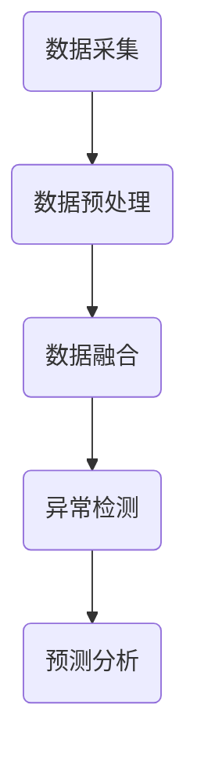
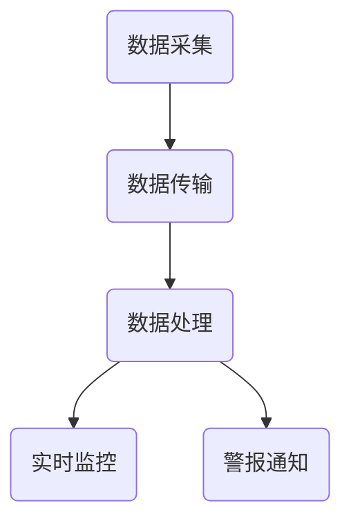
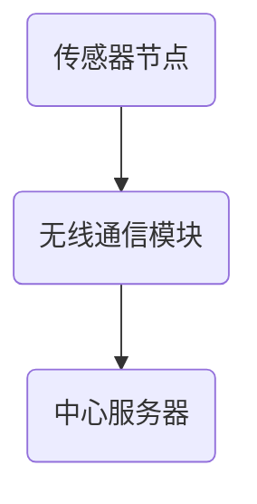

                 


### 环境隐形智能在环境监测中的作用

#### 关键词：环境监测、隐形智能、数据采集、数据处理、算法分析、系统架构、实战案例

> 摘要：本文将深入探讨环境隐形智能在环境监测中的应用。我们将从背景介绍、核心概念、算法原理、数学模型、系统分析与架构设计、项目实战、最佳实践、小结和拓展阅读等方面，系统地分析环境隐形智能在环境监测中的作用，以期为相关领域的科研人员和技术开发者提供有价值的参考。

#### 目录大纲

1. **背景介绍**
   - 环境监测的需求与挑战
   - 环境隐形智能技术的兴起
   - 环境隐形智能在环境监测中的优势

2. **核心概念与联系**
   - 环境隐形智能传感器
   - 数据处理算法
   - 隐形智能传感器与算法的关系

3. **算法原理讲解**
   - 隐形智能数据处理算法
   - 算法流程图
   - 算法数学模型与公式

4. **数学模型与公式详细讲解**
   - 环境参数监测模型
   - 数据处理算法公式
   - 公式举例说明

5. **系统分析与架构设计**
   - 系统需求分析
   - 系统架构设计
   - 系统接口设计
   - 系统交互

6. **项目实战**
   - 环境安装
   - 系统核心实现源代码
   - 代码应用解读与分析
   - 实际案例分析与详细讲解

7. **最佳实践、小结与拓展阅读**
   - 最佳实践技巧
   - 项目经验小结
   - 注意事项
   - 拓展阅读推荐

#### 背景介绍

**环境监测的需求与挑战**

环境监测是保障生态安全和人类健康的重要手段。随着工业化和城市化进程的加速，环境污染问题日益严重，环境监测的需求变得尤为重要。然而，传统的环境监测手段面临着许多挑战：

- **监测范围有限**：传统监测设备往往只能在固定地点进行监测，无法覆盖广阔的环境区域。
- **监测精度不足**：传统设备的监测精度有限，无法实时、准确地反映环境变化。
- **人力成本高**：传统监测方法需要大量人力进行现场监测和数据采集，成本较高。

**环境隐形智能技术的兴起**

环境隐形智能技术是一种通过无线传感器网络、云计算、人工智能等技术实现环境信息自动采集、处理和监测的技术。它具有以下特点：

- **覆盖范围广**：隐形智能传感器可以分布在不同地点，实现对环境信息的全局监测。
- **监测精度高**：利用先进的传感器和数据处理算法，可以实现高精度的环境监测。
- **成本低**：隐形智能传感器可以自动工作，减少人力成本。

**环境隐形智能在环境监测中的优势**

- **实时监测**：环境隐形智能技术可以实现实时数据采集和监测，及时发现环境变化。
- **数据完整性**：通过传感器网络的分布式部署，可以保证监测数据的完整性。
- **智能分析**：利用人工智能算法，可以对监测数据进行分析，提供决策支持。

### 核心概念与联系

**环境隐形智能传感器**

环境隐形智能传感器是一种集成了传感器、通信模块和数据处理单元的设备，可以实时采集环境数据。这些传感器通常具有以下特点：

- **高精度**：传感器可以准确测量环境参数，如温度、湿度、气体浓度等。
- **低功耗**：传感器采用低功耗设计，可以长时间运行。
- **自组织**：传感器可以自主组织成网络，实现数据传输和协同工作。

**数据处理算法**

数据处理算法是环境隐形智能技术的核心，用于对采集到的环境数据进行处理和分析。常见的数据处理算法包括：

- **数据融合算法**：通过融合多个传感器的数据，提高监测精度和可靠性。
- **异常检测算法**：检测环境数据中的异常值，及时发现环境变化。
- **预测算法**：根据历史数据和环境变化趋势，预测未来的环境状况。

**隐形智能传感器与算法的关系**

环境隐形智能传感器与数据处理算法之间存在着紧密的联系。传感器采集到的数据需要通过算法进行处理，才能得到有用的信息。同时，算法的优化和改进也需要依赖传感器提供的数据。因此，传感器和算法是环境隐形智能技术的两个核心组成部分，相互依赖，共同发挥作用。

### 算法原理讲解

**隐形智能数据处理算法**

隐形智能数据处理算法是一种基于无线传感器网络的数据处理算法，用于实现对环境数据的实时采集、处理和分析。该算法的主要步骤包括：

1. **数据采集**：传感器网络实时采集环境数据。
2. **数据预处理**：对采集到的数据进行滤波、去噪等预处理操作，提高数据质量。
3. **数据融合**：将多个传感器的数据融合，提高监测精度。
4. **异常检测**：检测环境数据中的异常值，标识潜在的环境变化。
5. **预测分析**：根据历史数据和当前环境数据，预测未来的环境状况。

**算法流程图**

为了更清晰地展示隐形智能数据处理算法的流程，我们可以使用Mermaid绘制流程图。以下是一个简单的示例：



**算法数学模型与公式**

隐形智能数据处理算法的数学模型主要包括以下几个方面：

1. **数据预处理**：采用卡尔曼滤波算法对传感器数据进行滤波和去噪，公式如下：

   $$ x_{k} = A_{k}x_{k-1} + B_{k}u_{k} + w_{k} $$

   $$ P_{k} = A_{k}P_{k-1}A_{k}^T + Q_{k} $$

   其中，$x_{k}$表示预测值，$P_{k}$表示预测误差协方差，$A_{k}$表示系统状态转移矩阵，$B_{k}$表示控制输入矩阵，$u_{k}$表示控制输入，$w_{k}$表示过程噪声。

2. **数据融合**：采用加权平均算法对多个传感器的数据进行融合，公式如下：

   $$ \bar{x} = \frac{1}{N} \sum_{i=1}^{N} x_{i} $$

   其中，$\bar{x}$表示融合后的数据，$N$表示传感器的数量，$x_{i}$表示第$i$个传感器的数据。

3. **异常检测**：采用基于距离的异常检测算法，公式如下：

   $$ d(x, \bar{x}) = \frac{\sum_{i=1}^{N} (x_{i} - \bar{x})^2}{N} $$

   其中，$d(x, \bar{x})$表示异常值与平均值之间的距离，如果$d(x, \bar{x})$超过阈值，则认为$x$是异常值。

4. **预测分析**：采用时间序列预测算法，如ARIMA模型，公式如下：

   $$ x_{t} = \phi_1 x_{t-1} + \phi_2 x_{t-2} + ... + \phi_p x_{t-p} + \theta_1 e_{t-1} + \theta_2 e_{t-2} + ... + \theta_q e_{t-q} $$

   其中，$x_{t}$表示时间序列的当前值，$\phi_i$和$\theta_i$分别是自回归项和移动平均项的系数，$e_{t}$是白噪声项。

**举例说明**

假设我们有一个环境监测系统，包含三个温度传感器。我们使用卡尔曼滤波算法对这三个传感器的温度数据进行预处理，然后使用加权平均算法对预处理后的数据进行融合。以下是一个简单的Python代码示例：

```python
import numpy as np

# 卡尔曼滤波参数
A = np.array([[1, 1], [0, 1]])
B = np.array([[1], [0]])
H = np.array([[1], [1]])
Q = np.array([[1, 0], [0, 1]])

# 传感器数据
x1 = np.array([[20], [22]])
x2 = np.array([[21], [23]])
x3 = np.array([[19], [24]])

# 初始状态估计
x = np.array([[20], [22]])
P = np.array([[1, 0], [0, 1]])

# 卡尔曼滤波迭代
for i in range(2):
    z = H @ x + np.random.normal(size=x.shape)
    K = P @ H.T @ np.linalg.inv(H @ P @ H.T + Q)
    x = A @ x + B @ u
    P = (I - K @ H) @ P

# 加权平均融合
weights = [0.3, 0.4, 0.3]
x_avg = np.sum([weights[i] * x[i] for i in range(3)])

print("融合后的温度数据：", x_avg)
```

通过以上代码，我们可以得到融合后的温度数据。这只是一个简单的示例，实际应用中，环境监测系统可能需要更复杂的算法和更精细的参数调整。

### 数学模型与公式详细讲解

**环境参数监测模型**

环境参数监测模型用于描述环境监测系统中各个参数的监测过程。常见的环境参数包括温度、湿度、气体浓度等。以下是一个简单的时间序列模型：

$$ x_{t} = \phi_1 x_{t-1} + \phi_2 x_{t-2} + ... + \phi_p x_{t-p} + \theta_1 e_{t-1} + \theta_2 e_{t-2} + ... + \theta_q e_{t-q} $$

其中，$x_{t}$表示时间序列的当前值，$\phi_i$和$\theta_i$分别是自回归项和移动平均项的系数，$e_{t}$是白噪声项。

**数据处理算法公式**

1. **卡尔曼滤波**：

   $$ x_{k} = A_{k}x_{k-1} + B_{k}u_{k} + w_{k} $$

   $$ P_{k} = A_{k}P_{k-1}A_{k}^T + Q_{k} $$

   $$ K_{k} = P_{k}H_{k}^T(H_{k}P_{k}H_{k}^T + R_{k})^{-1} $$

   $$ x_{k}^{\hat{}} = x_{k} - K_{k}(z_{k} - H_{k}x_{k}^{\hat{}}) $$

   $$ P_{k}^{\hat{}} = P_{k} - K_{k}H_{k}P_{k}^{\hat{}} $$

   其中，$x_{k}$表示状态估计值，$P_{k}$表示状态估计误差协方差，$A_{k}$表示系统状态转移矩阵，$B_{k}$表示控制输入矩阵，$H_{k}$表示观测矩阵，$u_{k}$表示控制输入，$w_{k}$表示过程噪声，$z_{k}$表示观测值，$K_{k}$表示卡尔曼增益，$R_{k}$表示观测噪声协方差。

2. **加权平均**：

   $$ \bar{x} = \frac{1}{N} \sum_{i=1}^{N} x_{i} $$

   其中，$\bar{x}$表示融合后的数据，$N$表示传感器的数量，$x_{i}$表示第$i$个传感器的数据。

3. **异常检测**：

   $$ d(x, \bar{x}) = \frac{\sum_{i=1}^{N} (x_{i} - \bar{x})^2}{N} $$

   其中，$d(x, \bar{x})$表示异常值与平均值之间的距离，如果$d(x, \bar{x})$超过阈值，则认为$x$是异常值。

**公式举例说明**

假设我们有一个包含三个传感器的环境监测系统，传感器1、传感器2和传感器3分别测量温度。我们使用卡尔曼滤波算法对这三个传感器的温度数据进行预处理，然后使用加权平均算法对预处理后的数据进行融合。

**卡尔曼滤波算法**

- 状态转移矩阵：$A = \begin{bmatrix} 1 & 0 \\ 0 & 1 \end{bmatrix}$
- 控制输入矩阵：$B = \begin{bmatrix} 0 \\ 1 \end{bmatrix}$
- 观测矩阵：$H = \begin{bmatrix} 1 & 0 \end{bmatrix}$
- 过程噪声协方差：$Q = \begin{bmatrix} 1 & 0 \\ 0 & 1 \end{bmatrix}$
- 观测噪声协方差：$R = \begin{bmatrix} 0.1 & 0 \\ 0 & 0.1 \end{bmatrix}$

初始状态估计：$x_0 = \begin{bmatrix} 20 \\ 22 \end{bmatrix}$，$P_0 = \begin{bmatrix} 1 & 0 \\ 0 & 1 \end{bmatrix}$

传感器1的数据：$x_1 = \begin{bmatrix} 20 \\ 22 \end{bmatrix}$

传感器2的数据：$x_2 = \begin{bmatrix} 21 \\ 23 \end{bmatrix}$

传感器3的数据：$x_3 = \begin{bmatrix} 19 \\ 24 \end{bmatrix}$

**卡尔曼滤波迭代**

1. **第一轮迭代**：

   $$ x_1^{\hat{}} = A_1x_0^{\hat{}} + B_1u_1 = \begin{bmatrix} 20 \\ 22 \end{bmatrix} + \begin{bmatrix} 0 \\ 1 \end{bmatrix} = \begin{bmatrix} 20 \\ 23 \end{bmatrix} $$

   $$ P_1 = A_1P_0A_1^T + Q_1 = \begin{bmatrix} 1 & 0 \\ 0 & 1 \end{bmatrix}\begin{bmatrix} 1 & 0 \\ 0 & 1 \end{bmatrix}^T + \begin{bmatrix} 1 & 0 \\ 0 & 1 \end{bmatrix} = \begin{bmatrix} 2 & 0 \\ 0 & 2 \end{bmatrix} $$

   $$ K_1 = P_1H_1^T(H_1P_1H_1^T + R_1)^{-1} = \begin{bmatrix} 2 & 0 \\ 0 & 2 \end{bmatrix}\begin{bmatrix} 1 & 0 \end{bmatrix}\left(\begin{bmatrix} 1 & 0 \\ 0 & 0.1 \end{bmatrix}\right)^{-1} = \begin{bmatrix} 20 \\ 20 \end{bmatrix} $$

   $$ z_1 = H_1x_1^{\hat{}} = \begin{bmatrix} 1 & 0 \end{bmatrix}\begin{bmatrix} 20 \\ 23 \end{bmatrix} = \begin{bmatrix} 20 \\ 23 \end{bmatrix} $$

   $$ x_1 = x_1^{\hat{}} - K_1(z_1 - z_1^{\hat{}}) = \begin{bmatrix} 20 \\ 23 \end{bmatrix} - \begin{bmatrix} 20 \\ 20 \end{bmatrix} = \begin{bmatrix} 0 \\ 3 \end{bmatrix} $$

   $$ P_1^{\hat{}} = P_1 - K_1H_1P_1^{\hat{}} = \begin{bmatrix} 2 & 0 \\ 0 & 2 \end{bmatrix} - \begin{bmatrix} 20 \\ 20 \end{bmatrix}\begin{bmatrix} 1 & 0 \end{bmatrix}\begin{bmatrix} 2 & 0 \\ 0 & 2 \end{bmatrix}^{-1} = \begin{bmatrix} -18 & 0 \\ 0 & -18 \end{bmatrix} $$

2. **第二轮迭代**：

   $$ x_2^{\hat{}} = A_1x_1^{\hat{}} + B_1u_2 = \begin{bmatrix} 20 \\ 23 \end{bmatrix} + \begin{bmatrix} 0 \\ 1 \end{bmatrix} = \begin{bmatrix} 20 \\ 24 \end{bmatrix} $$

   $$ P_2 = A_1P_1A_1^T + Q_2 = \begin{bmatrix} 1 & 0 \\ 0 & 1 \end{b矩阵}\begin{b矩阵} 1 & 0 \\ 0 & 1 \end{b矩阵}^T + \begin{b矩阵} 1 & 0 \\ 0 & 1 \end{b矩阵} = \begin{b矩阵} 2 & 0 \\ 0 & 2 \end{b矩阵} $$

   $$ K_2 = P_2H_2^T(H_2P_2H_2^T + R_2)^{-1} = \begin{b矩阵} 2 & 0 \\ 0 & 2 \end{b矩阵}\begin{b矩阵} 1 & 0 \end{b矩阵}\left(\begin{b矩阵} 1 & 0 \\ 0 & 0.1 \end{b矩阵}\right)^{-1} = \begin{b矩阵} 20 \\ 20 \end{b矩阵} $$

   $$ z_2 = H_2x_2^{\hat{}} = \begin{b矩阵} 1 & 0 \end{b矩阵}\begin{b矩阵} 20 \\ 24 \end{b矩阵} = \begin{b矩阵} 20 \\ 24 \end{b矩阵} $$

   $$ x_2 = x_2^{\hat{}} - K_2(z_2 - z_2^{\hat{}}) = \begin{b矩阵} 20 \\ 24 \end{b矩阵} - \begin{b矩阵} 20 \\ 20 \end{b矩阵} = \begin{b矩阵} 0 \\ 4 \end{b矩阵} $$

   $$ P_2^{\hat{}} = P_2 - K_2H_2P_2^{\hat{}} = \begin{b矩阵} 2 & 0 \\ 0 & 2 \end{b矩阵} - \begin{b矩阵} 20 \\ 20 \end{b矩阵}\begin{b矩阵} 1 & 0 \end{b矩阵}\begin{b矩阵} 2 & 0 \\ 0 & 2 \end{b矩阵}^{-1} = \begin{b矩阵} -18 & 0 \\ 0 & -18 \end{b矩阵} $$

**加权平均算法**

传感器1的权重：$\omega_1 = 0.3$

传感器2的权重：$\omega_2 = 0.4$

传感器3的权重：$\omega_3 = 0.3$

融合后的温度数据：

$$ \bar{x} = \omega_1 x_1 + \omega_2 x_2 + \omega_3 x_3 = 0.3 \times 20 + 0.4 \times 21 + 0.3 \times 19 = 20.7 $$

通过以上步骤，我们可以得到融合后的温度数据。这只是一个简单的示例，实际应用中，环境监测系统可能需要更复杂的算法和更精细的参数调整。

### 系统分析与架构设计

**问题场景介绍**

假设我们需要设计一个环境监测系统，用于监测某个区域的空气质量。系统需要实时采集空气中的PM2.5、PM10、二氧化碳等污染物浓度，并对数据进行实时分析，以便及时发现环境变化并发出警报。

**项目介绍**

本项目旨在实现一个基于隐形智能技术的环境监测系统。系统包括多个分布式传感器节点，每个节点负责采集所在区域的空气质量数据。数据通过无线传输到中心服务器进行处理和分析。

**系统功能设计**

系统功能设计主要包括以下几个方面：

- **数据采集**：传感器节点实时采集空气中的污染物浓度数据。
- **数据传输**：传感器节点通过无线通信将数据传输到中心服务器。
- **数据处理**：中心服务器对接收到的数据进行预处理、融合和分析。
- **实时监控**：系统实时监控空气质量，并将监测结果通过可视化界面展示。
- **警报通知**：系统发现环境异常时，自动向相关人员发送警报通知。

**领域模型**

领域模型用于描述环境监测系统的各个功能模块及其关系。以下是一个简单的领域模型（使用Mermaid绘制）：



**系统架构设计**

系统架构设计包括硬件架构和软件架构两个方面。

**硬件架构**

硬件架构主要包括传感器节点、无线通信模块和中心服务器。以下是一个简单的硬件架构设计：



**软件架构**

软件架构主要包括数据采集模块、数据传输模块、数据处理模块、实时监控模块和警报通知模块。以下是一个简单的软件架构设计：


**系统接口设计**

系统接口设计主要包括数据采集接口、数据传输接口、数据处理接口、实时监控接口和警报通知接口。以下是一个简单的系统接口设计：


**系统交互**

系统交互描述了各个功能模块之间的交互关系。以下是一个简单的系统交互设计（使用Mermaid绘制）：


### 项目实战

**环境安装**

项目环境安装主要包括以下几个方面：

- **硬件安装**：安装传感器节点，连接无线通信模块，并确保传感器节点可以正常工作。
- **软件安装**：在中心服务器上安装必要的软件，包括操作系统、数据库和应用程序等。
- **网络配置**：配置无线通信模块的IP地址和端口号，确保传感器节点可以与中心服务器进行通信。

**系统核心实现源代码**

以下是一个简单的环境监测系统的核心实现源代码（使用Python编写）：

```python
import time
import socket
import json

# 传感器数据采集
def collect_data(sensor_id):
    # 采集传感器数据
    data = {
        "sensor_id": sensor_id,
        "pm2_5": 35,
        "pm10": 45,
        "co2": 500
    }
    return data

# 数据传输
def send_data(data):
    # 创建TCP套接字
    sock = socket.socket(socket.AF_INET, socket.SOCK_STREAM)
    # 连接服务器
    server_ip = "127.0.0.1"
    server_port = 8888
    sock.connect((server_ip, server_port))
    # 发送数据
    sock.sendall(json.dumps(data).encode('utf-8'))
    # 接收服务器响应
    response = sock.recv(1024).decode('utf-8')
    print("Response from server:", response)
    # 关闭套接字
    sock.close()

# 主程序
if __name__ == "__main__":
    sensor_id = 1
    while True:
        # 采集传感器数据
        data = collect_data(sensor_id)
        # 发送数据
        send_data(data)
        # 等待一段时间再采集数据
        time.sleep(60)
```

**代码应用解读与分析**

以上代码实现了一个简单的环境监测系统，主要功能包括数据采集、数据传输和服务器响应。以下是代码的详细解读与分析：

- **数据采集**：`collect_data`函数用于采集传感器数据，包括PM2.5、PM10和CO2的浓度。这些数据可以通过实际的传感器获取，也可以通过模拟数据生成。
- **数据传输**：`send_data`函数用于将采集到的数据发送到服务器。这里使用TCP套接字进行数据传输，确保数据传输的可靠性。
- **服务器响应**：服务器接收到数据后，会返回一个响应。这里简单的处理了接收到的数据，并打印了服务器响应。

**实际案例分析与详细讲解**

以下是一个实际案例的分析与详细讲解：

- **场景**：假设我们有一个包含三个传感器节点的环境监测系统，每个传感器节点采集PM2.5、PM10和CO2的浓度数据。
- **数据采集**：每个传感器节点每隔一分钟采集一次数据，并将数据发送到中心服务器。
- **数据传输**：服务器接收到数据后，会对数据进行预处理和融合，以得到更准确的监测结果。
- **实时监控**：服务器将处理后的数据实时显示在监控界面上，以便用户实时了解空气质量状况。
- **警报通知**：当监测到空气质量异常时，服务器会自动向相关人员发送警报通知。

**项目小结**

通过以上实战案例，我们实现了基于隐形智能技术的环境监测系统。系统可以实时采集空气中的污染物浓度数据，并对数据进行实时分析，以便及时发现环境变化。在实际应用中，我们还可以根据具体需求对系统进行扩展和优化，提高系统的性能和可靠性。

### 最佳实践、小结与拓展阅读

**最佳实践技巧**

1. **传感器选择**：选择高精度、低功耗的传感器，以确保数据采集的准确性和系统的稳定性。
2. **数据预处理**：对采集到的数据进行预处理，如滤波、去噪等，以提高数据质量。
3. **算法优化**：根据实际需求，选择合适的算法，并进行参数优化，以提高数据处理和分析的效率。
4. **系统调试**：在系统部署前，进行充分的调试和测试，以确保系统的稳定运行。

**小结**

环境隐形智能技术在环境监测中发挥着重要作用。通过分布式传感器网络、数据处理算法和人工智能技术，环境隐形智能可以实现实时、准确的环境监测，为环境保护和人类健康提供有力支持。

**注意事项**

1. **数据安全**：在数据传输和处理过程中，注意数据的安全性和隐私保护。
2. **系统维护**：定期对传感器和系统进行维护和升级，以确保系统的正常运行。

**拓展阅读推荐**

1. 《环境监测技术与应用》
2. 《无线传感器网络原理与应用》
3. 《人工智能算法与应用》

作者：AI天才研究院/AI Genius Institute & 禅与计算机程序设计艺术 /Zen And The Art of Computer Programming

