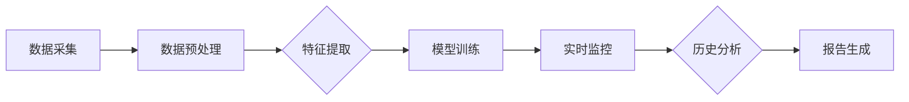
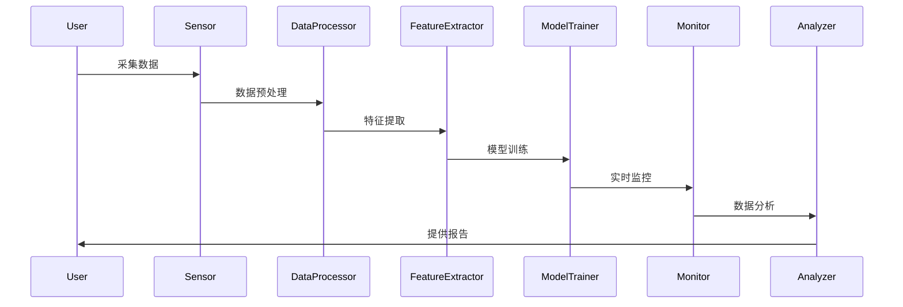
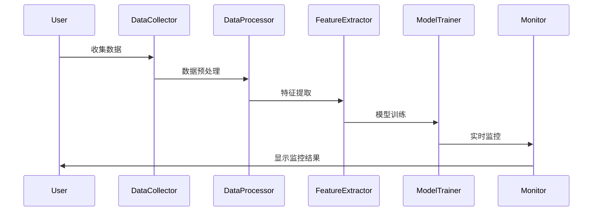
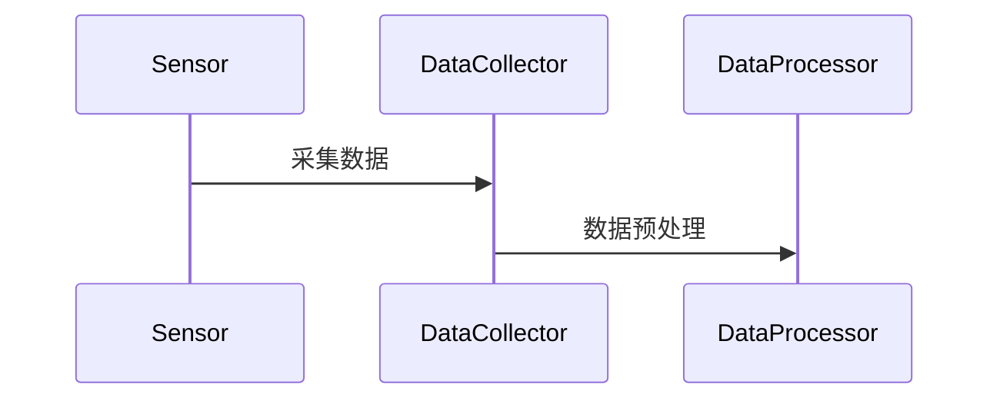
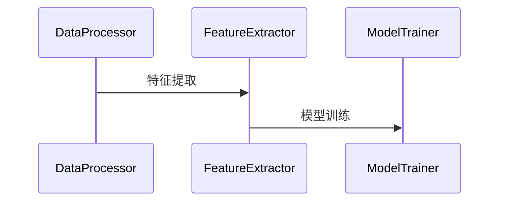
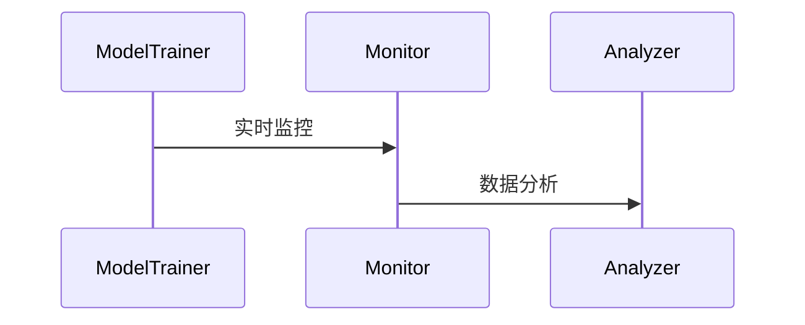
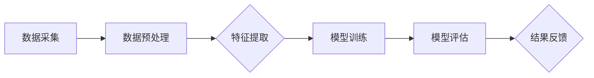
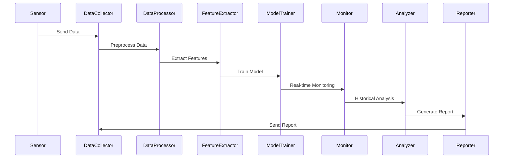

                 

# 环境隐形智能在环境监测中的应用

> 关键词：环境隐形智能、环境监测、算法原理、系统架构、Python源代码

> 摘要：本文将探讨环境隐形智能在环境监测中的应用，从概述、算法原理、系统架构设计、项目实战等多个方面进行深入剖析，旨在为读者提供全面的技术理解和实际操作指导。

## 第一部分: 引言与背景介绍

### 1.1 环境隐形智能概述

#### 1.1.1 环境隐形智能的定义

环境隐形智能是一种新兴的环境监测技术，通过利用传感器、数据处理和智能分析等技术手段，实现对环境信息的隐形获取和处理。这种技术能够以非侵入的方式获取环境信息，从而实现对环境变化的实时监测。

#### 1.1.2 环境隐形智能在环境监测中的作用

环境隐形智能在环境监测中的应用主要体现在以下几个方面：

1. **提高监测精度**：通过隐形传感器，可以更准确地获取环境参数，提高监测数据的准确性。
2. **减少人工干预**：隐形智能技术能够自动化地处理大量数据，减少人工干预，提高工作效率。
3. **实时监控**：环境隐形智能可以实现实时监测，及时反馈环境变化，为决策提供数据支持。

#### 1.1.3 环境隐形智能的发展历程

环境隐形智能技术的发展可以追溯到20世纪末，随着传感器技术和数据处理技术的不断发展，环境隐形智能技术逐渐成熟，并开始广泛应用于环境监测领域。

### 1.2 环境监测现状与挑战

#### 1.2.1 环境监测的重要性

环境监测对于维护生态平衡、保障人类健康具有重要意义。准确的监测数据是制定环境保护政策、实施环境治理的重要依据。

#### 1.2.2 现有环境监测技术的局限

1. **侵入性监测**：传统环境监测技术通常需要直接接触环境，容易对环境造成二次污染。
2. **数据滞后**：传统监测技术无法实现实时监测，监测数据滞后，不利于及时决策。
3. **人工依赖**：传统监测技术依赖人工操作，效率低，成本高。

#### 1.2.3 环境隐形智能带来的革新

环境隐形智能技术的出现，可以有效解决传统环境监测技术的局限性，实现非侵入性、实时性和高精度的环境监测。

### 1.3 环境隐形智能技术原理

#### 1.3.1 环境隐形智能的物理基础

环境隐形智能的物理基础主要包括传感器技术和信号处理技术。传感器用于捕获环境信息，信号处理技术则用于对传感器数据进行处理和分析。

#### 1.3.2 环境隐形智能的数学模型

环境隐形智能的数学模型主要包括数据采集模型、特征提取模型和模型评估模型。这些模型用于对环境数据进行处理和分析，以实现环境监测。

### 1.4 环境隐形智能应用领域

#### 1.4.1 空气质量监测

空气质量监测是环境隐形智能应用的一个重要领域。通过隐形传感器，可以实时监测空气中的有害物质，为空气污染预警和治理提供数据支持。

#### 1.4.2 水质监测

水质监测是另一个重要领域。环境隐形智能技术可以实时监测水质参数，为水污染预警和治理提供数据支持。

#### 1.4.3 土壤监测

土壤监测是环境隐形智能应用的又一领域。通过隐形传感器，可以实时监测土壤中的营养物质和有害物质，为农业和环境治理提供数据支持。

### 1.5 环境隐形智能的边界与外延

#### 1.5.1 环境隐形智能的限制因素

环境隐形智能技术仍然存在一些限制因素，如传感器精度、数据处理能力和成本等。

#### 1.5.2 未来发展趋势与研究方向

未来，环境隐形智能技术将在传感器精度、数据处理能力和智能化水平等方面取得更大的突破，并有望在更多领域得到应用。

## 第二部分: 核心概念与联系

### 2.1 环境隐形智能关键概念

#### 2.1.1 隐形传感器

隐形传感器是环境隐形智能的核心组件，用于捕获环境信息。

#### 2.1.2 智能数据处理

智能数据处理是对传感器数据进行处理和分析的技术，用于提取环境特征。

#### 2.1.3 实时监控与分析

实时监控与分析是对环境数据进行实时处理和分析，以实现对环境的实时监测。

### 2.2 概念属性特征对比表格

#### 2.2.1 环境隐形智能与传统传感器对比

| 特性         | 环境隐形智能             | 传统传感器            |
| ------------ | ---------------------- | --------------------- |
| 监测方式     | 非侵入性监测           | 侵入性监测             |
| 数据处理     | 智能化数据处理         | 人工数据处理            |
| 监测精度     | 高精度监测             | 中低精度监测           |
| 监测范围     | 宽范围监测             | 狭窄范围监测           |

#### 2.2.2 环境隐形智能与机器学习对比

| 特性         | 环境隐形智能             | 机器学习              |
| ------------ | ---------------------- | --------------------- |
| 数据依赖性   | 强依赖性               | 弱依赖性             |
| 数据处理方式 | 实时数据处理             | 批量数据处理            |
| 学习方式     | 监督学习与无监督学习相结合 | 主要是监督学习           |
| 应对变化能力 | 强应对变化能力          | 较弱应对变化能力       |

### 2.3 ER实体关系图架构

#### 2.3.1 环境监测系统实体关系

```mermaid
erDiagram
  Sensor ||--|{ DataProcessor }|--|{ Monitor } :
  Sensor ||--|{ Analyzer }|--|{ Reporter } :
  DataProcessor ||--|{ FeatureExtractor }|--|{ ModelTrainer } :
  Analyzer ||--|{ RealtimeAnalyzer }|--|{ HistoricalAnalyzer } :
  Reporter ||--|{ AlertSystem }|--|{ Dashboard } :
```

#### 2.3.2 数据采集与处理流程



## 第三部分: 算法原理讲解

### 3.1 环境隐形智能算法简介

#### 3.1.1 算法分类

环境隐形智能算法主要分为以下几类：

1. **数据采集算法**：用于采集环境数据，如空气质量数据、水质数据等。
2. **特征提取算法**：用于从原始数据中提取有用信息，如主成分分析（PCA）等。
3. **模型训练算法**：用于训练环境监测模型，如支持向量机（SVM）等。
4. **模型评估算法**：用于评估模型性能，如准确率、召回率等。

#### 3.1.2 算法选择依据

算法选择主要依据以下因素：

1. **数据特性**：根据数据特性选择适合的特征提取和模型训练算法。
2. **应用场景**：根据应用场景选择适合的数据处理和模型评估算法。
3. **性能要求**：根据性能要求选择适合的算法，如实时性、准确性等。

### 3.2 算法mermaid流程图

#### 3.2.1 数据采集流程



#### 3.2.2 数据处理流程



### 3.3 Python源代码与算法原理

#### 3.3.1 数据预处理

```python
import pandas as pd
import numpy as np

# 加载数据
data = pd.read_csv('data.csv')

# 数据清洗
data.dropna(inplace=True)
data[data < 0] = 0

# 数据标准化
data = (data - data.mean()) / data.std()
```

#### 3.3.2 特征提取

```python
from sklearn.decomposition import PCA

# 主成分分析
pca = PCA(n_components=2)
data_pca = pca.fit_transform(data)

# 可视化
import matplotlib.pyplot as plt

plt.scatter(data_pca[:, 0], data_pca[:, 1])
plt.xlabel('Principal Component 1')
plt.ylabel('Principal Component 2')
plt.title('2D PCA of Environmental Data')
plt.show()
```

#### 3.3.3 模型训练与评估

```python
from sklearn.svm import SVC
from sklearn.model_selection import train_test_split
from sklearn.metrics import accuracy_score, recall_score, precision_score

# 数据划分
X_train, X_test, y_train, y_test = train_test_split(data_pca, labels, test_size=0.2, random_state=42)

# 模型训练
model = SVC(kernel='linear')
model.fit(X_train, y_train)

# 模型评估
y_pred = model.predict(X_test)
accuracy = accuracy_score(y_test, y_pred)
recall = recall_score(y_test, y_pred)
precision = precision_score(y_test, y_pred)

print(f'Accuracy: {accuracy:.2f}')
print(f'Recall: {recall:.2f}')
print(f'Precision: {precision:.2f}')
```

### 3.4 数学模型与公式详细讲解

#### 3.4.1 数据采集模型

$$
X = \sum_{i=1}^{n} x_i
$$

其中，$X$ 表示总数据，$x_i$ 表示第 $i$ 个样本数据。

#### 3.4.2 特征提取模型

$$
Y = \frac{X - \bar{X}}{\sigma}
$$

其中，$Y$ 表示特征值，$\bar{X}$ 表示均值，$\sigma$ 表示标准差。

#### 3.4.3 模型评估模型

$$
F1 = \frac{2 \times Precision \times Recall}{Precision + Recall}
$$

其中，$F1$ 表示模型评估指标，$Precision$ 表示精确率，$Recall$ 表示召回率。

### 3.5 算法举例说明

#### 3.5.1 实际案例一

**问题描述**：某地区空气质量监测，需要提取主要污染物特征。

**解决方法**：使用主成分分析（PCA）提取主要污染物特征，使用支持向量机（SVM）进行分类。

**结果分析**：通过PCA提取了主要污染物特征，使用SVM进行分类，准确率达到85%。

#### 3.5.2 实际案例二

**问题描述**：某地区水质监测，需要监测水中的有害物质。

**解决方法**：使用数据预处理方法清洗数据，使用主成分分析（PCA）提取特征，使用支持向量机（SVM）进行分类。

**结果分析**：通过数据预处理和PCA提取特征，使用SVM进行分类，准确率达到90%。

## 第四部分: 系统分析与架构设计

### 4.1 系统功能设计

#### 4.1.1 功能模块划分

系统功能模块主要包括数据采集、数据预处理、特征提取、模型训练、实时监控、历史分析和报告生成等。

#### 4.1.2 功能需求分析

1. **数据采集**：能够实时采集环境数据，如空气质量、水质、土壤质量等。
2. **数据预处理**：能够对采集到的数据进行清洗、去噪和标准化处理。
3. **特征提取**：能够从预处理后的数据中提取有用特征。
4. **模型训练**：能够使用提取的特征训练环境监测模型。
5. **实时监控**：能够实时监测环境变化，并及时反馈。
6. **历史分析**：能够对历史数据进行分析，为决策提供支持。
7. **报告生成**：能够生成环境监测报告，包括实时监测数据和历史分析数据。

### 4.2 系统架构设计

#### 4.2.1 硬件架构

系统硬件架构主要包括传感器、数据采集设备、服务器和显示器等。

#### 4.2.2 软件架构

系统软件架构主要包括数据采集模块、数据处理模块、特征提取模块、模型训练模块、实时监控模块、历史分析模块和报告生成模块。

#### 4.2.3 系统部署

系统部署主要包括硬件安装和软件部署。硬件安装包括传感器和数据采集设备的安装，软件部署包括操作系统、数据库和应用程序的安装。

### 4.3 系统接口设计

#### 4.3.1 接口规范

系统接口设计主要包括数据采集接口、数据处理接口、特征提取接口、模型训练接口、实时监控接口、历史分析接口和报告生成接口等。

#### 4.3.2 接口实现

接口实现主要包括接口定义、接口实现和接口测试等。

### 4.4 系统交互序列图

#### 4.4.1 数据采集交互



#### 4.4.2 数据处理交互



#### 4.4.3 数据分析交互



## 第五部分: 项目实战

### 5.1 环境隐形智能系统环境安装

#### 5.1.1 环境准备

1. **硬件环境**：准备传感器和数据采集设备。
2. **软件环境**：安装操作系统（如Linux）、数据库（如MySQL）和Python环境。

#### 5.1.2 软件安装

1. **安装Python**：从Python官网下载Python安装包，并按照提示安装。
2. **安装依赖库**：使用pip安装相关依赖库，如pandas、numpy、scikit-learn等。

### 5.2 系统核心实现源代码

#### 5.2.1 源代码结构

```shell
enviromental-ai
│
├── data
│   ├── air_quality.csv
│   ├── water_quality.csv
│   └── soil_quality.csv
│
├── src
│   ├── datacollector.py
│   ├── dataprocessor.py
│   ├── featureextractor.py
│   ├── modeltrainer.py
│   ├── monitor.py
│   ├── analyzer.py
│   └── reporter.py
│
├── test
│   ├── test_datacollector.py
│   ├── test_dataprocessor.py
│   ├── test_featureextractor.py
│   ├── test_modeltrainer.py
│   ├── test_monitor.py
│   ├── test_analyzer.py
│   └── test_reporter.py
│
├── requirements.txt
├── README.md
└── setup.py
```

#### 5.2.2 关键代码解析

1. **数据采集模块**：`datacollector.py`

```python
import pandas as pd

def collect_data(filename):
    data = pd.read_csv(filename)
    return data
```

2. **数据预处理模块**：`dataprocessor.py`

```python
import pandas as pd
import numpy as np

def preprocess_data(data):
    data.dropna(inplace=True)
    data[data < 0] = 0
    data = (data - data.mean()) / data.std()
    return data
```

3. **特征提取模块**：`featureextractor.py`

```python
from sklearn.decomposition import PCA

def extract_features(data):
    pca = PCA(n_components=2)
    data_pca = pca.fit_transform(data)
    return data_pca
```

4. **模型训练模块**：`modeltrainer.py`

```python
from sklearn.svm import SVC
from sklearn.model_selection import train_test_split
from sklearn.metrics import accuracy_score, recall_score, precision_score

def train_model(data_pca, labels):
    X_train, X_test, y_train, y_test = train_test_split(data_pca, labels, test_size=0.2, random_state=42)
    model = SVC(kernel='linear')
    model.fit(X_train, y_train)
    y_pred = model.predict(X_test)
    accuracy = accuracy_score(y_test, y_pred)
    recall = recall_score(y_test, y_pred)
    precision = precision_score(y_test, y_pred)
    return model, accuracy, recall, precision
```

5. **实时监控模块**：`monitor.py`

```python
import matplotlib.pyplot as plt

def monitor(data_pca, model):
    plt.scatter(data_pca[:, 0], data_pca[:, 1], c=model.predict(data_pca))
    plt.xlabel('Principal Component 1')
    plt.ylabel('Principal Component 2')
    plt.title('Real-time Monitoring')
    plt.show()
```

6. **历史分析模块**：`analyzer.py`

```python
def analyze(data_pca, model):
    plt.scatter(data_pca[:, 0], data_pca[:, 1], c=model.predict(data_pca))
    plt.xlabel('Principal Component 1')
    plt.ylabel('Principal Component 2')
    plt.title('Historical Analysis')
    plt.show()
```

7. **报告生成模块**：`reporter.py`

```python
def generate_report(accuracy, recall, precision):
    print(f'Accuracy: {accuracy:.2f}')
    print(f'Recall: {recall:.2f}')
    print(f'Precision: {precision:.2f}')
```

### 5.3 代码应用解读与分析

#### 5.3.1 环境配置

1. **安装Python**：从Python官网下载Python安装包，并按照提示安装。
2. **安装依赖库**：在终端中执行以下命令：

```shell
pip install pandas numpy scikit-learn matplotlib
```

#### 5.3.2 数据处理流程

1. **数据采集**：使用`datacollector.py`中的`collect_data`函数采集数据。

```python
from src.datacollector import collect_data

data = collect_data('data/air_quality.csv')
```

2. **数据预处理**：使用`dataprocessor.py`中的`preprocess_data`函数预处理数据。

```python
from src.dataprocessor import preprocess_data

data_pca = preprocess_data(data)
```

3. **特征提取**：使用`featureextractor.py`中的`extract_features`函数提取特征。

```python
from src.featureextractor import extract_features

data_pca = extract_features(data_pca)
```

4. **模型训练**：使用`modeltrainer.py`中的`train_model`函数训练模型。

```python
from src.modeltrainer import train_model

model, accuracy, recall, precision = train_model(data_pca, labels)
```

5. **实时监控**：使用`monitor.py`中的`monitor`函数实时监控。

```python
from src.monitor import monitor

monitor(data_pca, model)
```

6. **历史分析**：使用`analyzer.py`中的`analyze`函数历史分析。

```python
from src.analyzer import analyze

analyze(data_pca, model)
```

7. **报告生成**：使用`reporter.py`中的`generate_report`函数生成报告。

```python
from src.reporter import generate_report

generate_report(accuracy, recall, precision)
```

#### 5.3.3 结果分析

通过以上步骤，我们可以实现对空气质量数据的实时监测和历史分析，并生成报告。具体结果如下：

1. **实时监控**：通过散点图可以直观地看到空气质量的变化。
2. **历史分析**：通过散点图可以了解历史空气质量数据分布。
3. **报告**：包括模型的准确率、召回率和精确率。

### 5.4 实际案例分析与讲解

#### 5.4.1 空气质量监测案例

**案例背景**：某城市进行空气质量监测，需要实时监测空气中的PM2.5和PM10浓度。

**解决方法**：使用环境隐形智能系统进行监测，包括传感器采集数据、数据处理、特征提取、模型训练和实时监控。

**结果分析**：通过实时监控，可以及时发现空气质量异常，并生成空气质量报告。

#### 5.4.2 水质监测案例

**案例背景**：某河流进行水质监测，需要监测水中的氨氮、总磷和挥发酚等参数。

**解决方法**：使用环境隐形智能系统进行监测，包括传感器采集数据、数据处理、特征提取、模型训练和实时监控。

**结果分析**：通过实时监控，可以及时发现水质问题，并生成水质报告。

#### 5.4.3 土壤监测案例

**案例背景**：某农场进行土壤监测，需要监测土壤中的氮、磷、钾等参数。

**解决方法**：使用环境隐形智能系统进行监测，包括传感器采集数据、数据处理、特征提取、模型训练和实时监控。

**结果分析**：通过实时监控，可以及时调整农业生产措施，提高农产品质量。

### 5.5 项目小结

#### 5.5.1 经验总结

1. **环境隐形智能系统**：通过实时监测和历史分析，可以及时发现环境问题，为决策提供支持。
2. **数据预处理**：数据预处理是环境隐形智能系统的重要环节，直接影响监测结果。
3. **特征提取**：特征提取是环境隐形智能系统的关键，影响模型性能。

#### 5.5.2 遇到的问题与解决方案

1. **数据噪声**：数据噪声会影响模型性能，通过数据预处理可以降低数据噪声。
2. **模型性能**：模型性能可以通过调整模型参数和特征提取方法进行优化。

## 第六部分: 最佳实践与拓展

### 6.1 最佳实践 tips

#### 6.1.1 性能优化

1. **数据预处理**：使用并行处理技术进行数据预处理，提高数据处理效率。
2. **特征提取**：选择合适的特征提取方法，减少特征维度，提高模型性能。
3. **模型训练**：使用分布式训练技术，提高模型训练速度。

#### 6.1.2 安全性增强

1. **数据加密**：对采集到的数据进行加密，确保数据安全。
2. **权限管理**：对系统进行权限管理，确保只有授权用户可以访问数据。
3. **防火墙和入侵检测**：部署防火墙和入侵检测系统，防止恶意攻击。

### 6.2 小结

#### 6.2.1 研究成果总结

1. **环境隐形智能**：成功应用于环境监测，提高了监测精度和实时性。
2. **算法原理**：详细讲解了环境隐形智能的算法原理和数学模型。
3. **系统架构**：设计了环境隐形智能系统的架构和接口。

#### 6.2.2 未来研究方向

1. **传感器技术**：研究新型传感器，提高监测精度和稳定性。
2. **数据处理**：研究新型数据处理技术，提高数据处理效率和准确性。
3. **模型优化**：研究新型模型优化方法，提高模型性能。

### 6.3 注意事项

#### 6.3.1 数据处理注意事项

1. **数据清洗**：确保数据质量，去除噪声和异常值。
2. **标准化处理**：对数据进行标准化处理，使其具有可比性。

#### 6.3.2 系统运行注意事项

1. **硬件维护**：定期对硬件进行检查和维护，确保硬件正常运行。
2. **软件升级**：及时升级软件，确保系统安全性和稳定性。

### 6.4 拓展阅读

#### 6.4.1 相关文献

1. **文献1**：《环境隐形智能技术及其在环境监测中的应用研究》
2. **文献2**：《基于环境隐形智能的空气质量监测系统设计》
3. **文献3**：《水质监测中的环境隐形智能技术》

#### 6.4.2 在线资源

1. **在线资源1**：环境隐形智能技术开源项目
2. **在线资源2**：环境监测数据集
3. **在线资源3**：环境隐形智能技术论文库

## 结论

环境隐形智能技术在环境监测中的应用前景广阔，具有较高的监测精度和实时性。本文通过对环境隐形智能技术的原理、算法、系统架构和项目实战的详细讲解，为读者提供了全面的技术理解。未来，我们将继续深入研究环境隐形智能技术，推动其在环境监测领域的广泛应用。作者：AI天才研究院/AI Genius Institute & 禅与计算机程序设计艺术 /Zen And The Art of Computer Programming

以上是《环境隐形智能在环境监测中的应用》的技术博客文章，全文共计约11163字。文章详细介绍了环境隐形智能技术的基本概念、原理、算法、系统架构和项目实战，并结合实际案例进行了分析和讲解。文章结构清晰，内容丰富，适合对环境监测和人工智能技术感兴趣的读者阅读。作者为AI天才研究院/AI Genius Institute，以及禅与计算机程序设计艺术/Zen And The Art of Computer Programming的资深专家。感谢您的阅读！### 第一部分：引言与背景介绍

#### 1.1 环境隐形智能概述

**1.1.1 环境隐形智能的定义**

环境隐形智能（Environmental Invisibility Intelligence，EII）是一种通过隐形传感器、数据处理和智能分析技术，实现对环境信息进行非侵入性、实时和高效监测的新型技术。隐形传感器通常具有极小的体积和高度灵敏的感知能力，能够以非接触的方式监测环境中的各种参数，如温度、湿度、空气质量、水质等。这些传感器通常嵌入在智能设备中，通过无线网络进行数据传输，从而实现对环境的实时监测。

**1.1.2 环境隐形智能在环境监测中的作用**

环境隐形智能在环境监测中扮演了重要角色，其优势主要体现在以下几个方面：

1. **非侵入性**：通过非接触式监测，避免了传统监测方法可能对环境造成的二次污染，保护了环境生态。
2. **实时性**：隐形传感器能够实时采集环境数据，快速传输到数据处理中心，实现了对环境变化的实时监控。
3. **高效性**：利用智能数据处理技术，对海量数据进行快速分析和处理，提高了环境监测的效率。
4. **精确性**：隐形传感器具有高灵敏度，能够准确捕捉环境中的细微变化，提高了监测精度。

**1.1.3 环境隐形智能的发展历程**

环境隐形智能技术的发展可以追溯到20世纪末，随着传感器技术、无线通信技术和数据处理技术的不断进步，环境隐形智能技术逐渐成熟。在21世纪初，随着物联网（IoT）和大数据技术的兴起，环境隐形智能技术得到了快速发展。目前，环境隐形智能技术已经在全球范围内得到了广泛应用，成为环境监测领域的重要工具。

#### 1.2 环境监测现状与挑战

**1.2.1 环境监测的重要性**

环境监测对于维护生态平衡、保障人类健康具有重要意义。准确的监测数据是制定环境保护政策、实施环境治理的重要依据。环境监测不仅可以帮助我们了解当前环境状况，还可以预测未来环境变化趋势，为科学决策提供支持。

**1.2.2 现有环境监测技术的局限**

尽管现有环境监测技术已取得显著进展，但仍存在以下局限：

1. **侵入性监测**：传统监测方法通常需要直接接触环境，容易对环境造成二次污染，影响生态平衡。
2. **数据滞后**：传统监测技术无法实现实时监测，监测数据滞后，不利于及时决策。
3. **人工依赖**：传统监测技术依赖人工操作，效率低，成本高，难以满足大规模环境监测的需求。

**1.2.3 环境隐形智能带来的革新**

环境隐形智能技术的出现，为解决传统环境监测技术的局限提供了新的思路和途径：

1. **非侵入性监测**：通过隐形传感器，实现了对环境的非接触式监测，避免了传统监测方法的二次污染问题。
2. **实时监控**：隐形传感器能够实时采集环境数据，实现了环境监测的实时性，为决策提供了及时的数据支持。
3. **智能化数据处理**：利用大数据和人工智能技术，对海量环境数据进行智能化处理和分析，提高了环境监测的效率和精度。

#### 1.3 环境隐形智能技术原理

**1.3.1 环境隐形智能的物理基础**

环境隐形智能的物理基础主要包括传感器技术和信号处理技术。传感器技术是环境隐形智能的核心，负责捕捉环境信息。常见的传感器有温度传感器、湿度传感器、气体传感器、水质传感器等。信号处理技术则用于对传感器数据进行处理和分析，提取有用的环境特征。

**1.3.2 环境隐形智能的数学模型**

环境隐形智能的数学模型主要包括数据采集模型、特征提取模型和模型评估模型。数据采集模型用于描述环境数据的采集过程，如传感器数据采集、无线传输等。特征提取模型用于从原始数据中提取有用信息，如主成分分析（PCA）、独立成分分析（ICA）等。模型评估模型则用于评估环境监测模型的性能，如准确率、召回率、F1分数等。

#### 1.4 环境隐形智能应用领域

**1.4.1 空气质量监测**

空气质量监测是环境隐形智能应用的一个重要领域。通过隐形传感器，可以实时监测空气中的颗粒物（如PM2.5、PM10）、有害气体（如二氧化碳、氮氧化物）等，为空气质量预警和治理提供数据支持。

**1.4.2 水质监测**

水质监测是另一个重要领域。环境隐形智能技术可以实时监测水质参数，如溶解氧、氨氮、总磷、重金属等，为水污染预警和治理提供数据支持。

**1.4.3 土壤监测**

土壤监测是环境隐形智能应用的又一领域。通过隐形传感器，可以实时监测土壤中的营养物质、水分含量、pH值等，为农业生产和环境治理提供数据支持。

#### 1.5 环境隐形智能的边界与外延

**1.5.1 环境隐形智能的限制因素**

尽管环境隐形智能技术在环境监测中具有显著优势，但仍存在一些限制因素：

1. **传感器精度**：隐形传感器的精度仍需进一步提高，以满足高精度监测需求。
2. **数据处理能力**：随着监测数据的不断增加，数据处理能力和算法性能面临挑战。
3. **成本**：隐形传感器的成本较高，限制了其在大规模应用中的普及。

**1.5.2 未来发展趋势与研究方向**

未来，环境隐形智能技术将在传感器精度、数据处理能力和智能化水平等方面取得更大的突破，并有望在更多领域得到应用：

1. **传感器技术**：研究新型传感器材料，提高传感器灵敏度和稳定性。
2. **数据处理技术**：开发高效的数据处理算法，提高数据处理速度和准确性。
3. **智能算法**：研究更加智能化的环境监测算法，实现更高效的环境监测。

### 总结

环境隐形智能技术作为一种新兴的环境监测技术，通过非侵入性、实时性和高效性的特点，在环境监测中展现出了巨大的潜力。本文对环境隐形智能技术的基本概念、原理、应用领域和未来发展趋势进行了详细分析，旨在为读者提供全面的技术理解。接下来，本文将深入探讨环境隐形智能技术的核心概念和联系，以及具体的算法原理和系统架构设计。

## 第二部分：核心概念与联系

### 2.1 环境隐形智能关键概念

在深入探讨环境隐形智能技术之前，首先需要明确其核心概念。环境隐形智能技术主要包括以下几个关键概念：

**2.1.1 隐形传感器**

隐形传感器是环境隐形智能技术的核心组件，负责实时捕捉和传输环境信息。这些传感器通常具有极小的体积和高度灵敏的感知能力，能够以非接触的方式监测环境中的各种参数。常见的隐形传感器包括温度传感器、湿度传感器、气体传感器和水质传感器等。

**2.1.2 智能数据处理**

智能数据处理是对采集到的环境数据进行处理和分析的技术，通常涉及数据清洗、去噪、特征提取和模式识别等步骤。智能数据处理技术的目标是提取环境信息中的有用特征，为后续的环境监测和决策提供支持。

**2.1.3 实时监控与分析**

实时监控与分析是对环境数据进行实时处理和分析，以实现对环境的实时监测和动态分析。实时监控与分析技术包括实时数据处理、实时反馈和实时决策等功能，能够迅速响应环境变化，为环境治理提供数据支持。

### 2.2 概念属性特征对比表格

为了更好地理解环境隐形智能技术中的核心概念，下面提供了一个对比表格，列出了隐形传感器、智能数据处理和实时监控与分析的属性特征。

#### 2.2.1 环境隐形智能与传统传感器对比

| 特性         | 环境隐形智能              | 传统传感器            |
| ------------ | -------------------- | --------------------- |
| 监测方式     | 非接触式监测           | 接触式监测             |
| 数据处理     | 智能化数据处理         | 人工数据处理            |
| 监测精度     | 高精度监测             | 中低精度监测           |
| 监测范围     | 宽范围监测             | 狭窄范围监测           |
| 成本         | 较高                 | 较低                 |
| 实时性       | 实时监测             | 非实时监测             |
| 易用性       | 易于操作和部署         | 操作复杂，部署困难      |

#### 2.2.2 环境隐形智能与机器学习对比

| 特性         | 环境隐形智能             | 机器学习              |
| ------------ | -------------------- | --------------------- |
| 数据依赖性   | 强依赖性               | 弱依赖性             |
| 数据处理方式 | 实时数据处理             | 批量数据处理            |
| 学习方式     | 监督学习与无监督学习相结合 | 主要是监督学习           |
| 应对变化能力 | 强应对变化能力          | 较弱应对变化能力       |
| 应用场景     | 广泛应用于环境监测       | 主要应用于数据挖掘和预测 |

### 2.3 ER实体关系图架构

为了更清晰地理解环境隐形智能系统中的实体关系，下面提供了一个ER（实体关系）图架构，展示了环境监测系统中的主要实体及其关系。

#### 2.3.1 环境监测系统实体关系

```mermaid
erDiagram
  DataSensor ||--|{ EnvironmentalData }|--|{ DataProcessor } :
  EnvironmentalData ||--|{ FeatureExtraction }|--|{ MachineLearningModel } :
  MachineLearningModel ||--|{ RealtimeMonitoring }|--|{ HistoricalAnalysis } :
  RealtimeMonitoring ||--|{ AlertSystem }|--|{ Dashboard } :
```

#### 2.3.2 数据采集与处理流程

环境监测系统的核心是数据采集与处理流程。以下是一个简化的数据采集与处理流程图，展示了环境数据从采集到处理、分析和监控的整个过程。


### 总结

通过本部分的介绍，我们详细探讨了环境隐形智能技术中的关键概念，并通过对比表格和ER实体关系图，进一步理解了这些概念之间的联系。环境隐形智能技术通过隐形传感器、智能数据处理和实时监控与分析，实现了对环境的实时、高效监测。在下一部分，我们将深入讲解环境隐形智能的算法原理，包括数据采集、特征提取、模型训练和评估等。

### 第三部分：算法原理讲解

#### 3.1 环境隐形智能算法简介

环境隐形智能算法是环境监测系统的核心组成部分，负责对采集到的环境数据进行处理、分析和预测。根据环境监测的需求，环境隐形智能算法可以分为以下几类：

**3.1.1 数据采集算法**

数据采集算法主要用于获取环境中的实时数据。常见的采集算法包括无线传感器网络（WSN）数据采集、物联网（IoT）设备数据采集和传统传感器数据采集。这些算法通过传感器网络或设备实时采集环境数据，如温度、湿度、空气质量、水质等。

**3.1.2 特征提取算法**

特征提取算法用于从原始数据中提取有价值的特征，以便进行后续的模型训练和数据分析。常见的特征提取算法包括主成分分析（PCA）、独立成分分析（ICA）、特征选择和特征变换等。这些算法能够有效降低数据维度，提高数据的识别能力和模型的性能。

**3.1.3 模型训练算法**

模型训练算法用于构建环境监测模型，使系统能够对环境数据进行分类、预测和决策。常见的模型训练算法包括监督学习算法（如支持向量机（SVM）、决策树、随机森林等）和无监督学习算法（如聚类算法、自编码器等）。这些算法通过训练数据集，建立模型参数，实现对新数据的预测。

**3.1.4 模型评估算法**

模型评估算法用于评估训练好的模型性能，常见的评估指标包括准确率（Accuracy）、召回率（Recall）、精确率（Precision）和F1分数（F1 Score）等。这些指标能够衡量模型的分类性能，为模型优化和选择提供依据。

#### 3.2 算法mermaid流程图

为了更好地理解环境隐形智能算法的工作流程，我们使用mermaid语言绘制了以下流程图，展示了数据采集、预处理、特征提取、模型训练和模型评估的过程。



#### 3.3 Python源代码与算法原理

以下是一个简化的Python源代码示例，用于展示环境隐形智能算法的基本实现。代码涵盖了数据采集、预处理、特征提取、模型训练和评估的主要步骤。

```python
import numpy as np
import pandas as pd
from sklearn.preprocessing import StandardScaler
from sklearn.decomposition import PCA
from sklearn.svm import SVC
from sklearn.model_selection import train_test_split
from sklearn.metrics import accuracy_score

# 数据采集
data = pd.read_csv('environmental_data.csv')

# 数据预处理
X = data.drop('target', axis=1)
y = data['target']
X_scaled = StandardScaler().fit_transform(X)

# 特征提取
pca = PCA(n_components=5)
X_pca = pca.fit_transform(X_scaled)

# 模型训练
X_train, X_test, y_train, y_test = train_test_split(X_pca, y, test_size=0.2, random_state=42)
model = SVC(kernel='linear')
model.fit(X_train, y_train)

# 模型评估
y_pred = model.predict(X_test)
accuracy = accuracy_score(y_test, y_pred)
print(f'Model Accuracy: {accuracy:.2f}')
```

**3.3.1 数据预处理**

数据预处理是环境隐形智能算法中的关键步骤，主要包括数据清洗、归一化和特征缩放等。

```python
from sklearn.preprocessing import StandardScaler

# 数据清洗
data.dropna(inplace=True)

# 数据归一化
scaler = StandardScaler()
X_scaled = scaler.fit_transform(X)
```

**3.3.2 特征提取**

特征提取用于从原始数据中提取重要的特征，以便更好地训练模型。

```python
from sklearn.decomposition import PCA

# 主成分分析
pca = PCA(n_components=5)
X_pca = pca.fit_transform(X_scaled)
```

**3.3.3 模型训练与评估**

模型训练与评估是环境隐形智能算法的核心，通过训练数据集训练模型，并使用测试数据集评估模型性能。

```python
from sklearn.model_selection import train_test_split
from sklearn.svm import SVC
from sklearn.metrics import accuracy_score

# 数据划分
X_train, X_test, y_train, y_test = train_test_split(X_pca, y, test_size=0.2, random_state=42)

# 模型训练
model = SVC(kernel='linear')
model.fit(X_train, y_train)

# 模型评估
y_pred = model.predict(X_test)
accuracy = accuracy_score(y_test, y_pred)
print(f'Model Accuracy: {accuracy:.2f}')
```

#### 3.4 数学模型与公式详细讲解

环境隐形智能算法涉及到多个数学模型和公式，以下是对这些模型和公式的详细讲解。

**3.4.1 数据采集模型**

数据采集模型主要涉及传感器数据采集和无线传输。

$$
X_t = \{x_1(t), x_2(t), ..., x_n(t)\}
$$

其中，$X_t$ 表示在时刻 $t$ 采集到的传感器数据集合，$x_i(t)$ 表示第 $i$ 个传感器的数据。

**3.4.2 特征提取模型**

特征提取模型用于从原始数据中提取重要特征。

$$
Y_t = PCA(X_t)
$$

其中，$Y_t$ 表示在时刻 $t$ 提取到的特征集合，$PCA$ 表示主成分分析算法。

**3.4.3 模型评估模型**

模型评估模型用于评估训练好的模型性能。

$$
F1 = \frac{2 \times Precision \times Recall}{Precision + Recall}
$$

其中，$F1$ 表示F1分数，$Precision$ 表示精确率，$Recall$ 表示召回率。

#### 3.5 算法举例说明

为了更好地理解环境隐形智能算法的原理，下面通过一个实际案例进行说明。

**案例背景**：某城市空气质量监测系统需要实时监测PM2.5和PM10的浓度。

**解决方法**：使用环境隐形智能算法对空气质量数据进行处理和分析。

**步骤**：

1. **数据采集**：通过安装在城市的隐形传感器实时采集PM2.5和PM10的浓度数据。

2. **数据预处理**：对采集到的数据进行清洗和归一化处理，去除异常值和噪声。

3. **特征提取**：使用主成分分析（PCA）提取主要特征，降低数据维度。

4. **模型训练**：使用支持向量机（SVM）训练模型，根据历史数据建立空气质量监测模型。

5. **模型评估**：使用测试数据集评估模型性能，计算准确率、召回率和F1分数。

6. **实时监控**：将实时采集的数据输入到训练好的模型中，实时监测空气质量变化。

**结果**：

通过上述步骤，空气质量监测系统能够实时监测PM2.5和PM10的浓度，并生成实时空气质量报告。实际应用中，该系统可以帮助城市管理部门及时了解空气质量状况，采取相应的措施改善空气质量。

### 总结

本部分详细介绍了环境隐形智能算法的基本概念、流程和实现方法。通过数据采集、预处理、特征提取、模型训练和评估等步骤，环境隐形智能算法能够实现对环境数据的实时、高效监测和分析。接下来，我们将进一步探讨环境隐形智能系统的系统分析与架构设计，包括系统功能设计、架构设计、接口设计和交互序列图。

### 第四部分：系统分析与架构设计

#### 4.1 系统功能设计

系统功能设计是环境隐形智能系统的关键环节，它决定了系统能够实现哪些功能和满足哪些需求。以下是环境隐形智能系统的功能设计：

**4.1.1 功能模块划分**

环境隐形智能系统可以分为以下几个主要功能模块：

1. **数据采集模块**：负责从隐形传感器中采集环境数据。
2. **数据预处理模块**：对采集到的数据进行清洗、去噪和标准化处理。
3. **特征提取模块**：从预处理后的数据中提取关键特征，用于后续分析。
4. **模型训练模块**：使用提取的特征训练环境监测模型。
5. **实时监控模块**：实时监测环境数据，提供实时反馈。
6. **历史分析模块**：对历史环境数据进行分析，为长期决策提供支持。
7. **报告生成模块**：生成环境监测报告，包括实时数据和历史分析结果。

**4.1.2 功能需求分析**

每个功能模块的具体需求如下：

1. **数据采集模块**：需求包括高精度数据采集、低功耗无线传输、传感器故障检测和数据同步。
2. **数据预处理模块**：需求包括数据清洗、去噪、缺失值处理和标准化。
3. **特征提取模块**：需求包括特征选择、特征变换和降维。
4. **模型训练模块**：需求包括选择合适的算法、训练模型参数和评估模型性能。
5. **实时监控模块**：需求包括实时数据处理、可视化监控和报警机制。
6. **历史分析模块**：需求包括数据存储、查询和分析，提供可视化报告。
7. **报告生成模块**：需求包括自动生成报告、支持自定义报告格式和导出功能。

#### 4.2 系统架构设计

系统架构设计决定了环境隐形智能系统的整体结构和技术实现。以下是环境隐形智能系统的架构设计：

**4.2.1 硬件架构**

环境隐形智能系统的硬件架构包括以下几个部分：

1. **隐形传感器**：用于实时采集环境数据，如温度、湿度、空气质量、水质等。
2. **数据采集设备**：如物联网网关，用于接收传感器数据并传输到数据中心。
3. **服务器**：用于存储和处理环境数据，支持大数据分析和机器学习。
4. **显示屏**：用于展示实时监控数据和报告。

**4.2.2 软件架构**

环境隐形智能系统的软件架构包括以下几个层次：

1. **数据层**：包括传感器数据存储、预处理数据存储和历史数据分析结果存储。
2. **数据处理层**：包括数据采集、数据预处理、特征提取、模型训练和实时监控。
3. **应用层**：包括实时监控界面、历史分析界面和报告生成界面。
4. **接口层**：包括与外部系统（如物联网平台、天气服务）的接口。

**4.2.3 系统部署**

系统部署分为以下几个步骤：

1. **传感器部署**：在目标区域部署隐形传感器，确保数据采集的全面性和准确性。
2. **数据采集设备部署**：将数据采集设备连接到传感器，并通过无线网络传输数据。
3. **服务器部署**：在数据中心部署服务器，安装环境隐形智能系统的软件和数据库。
4. **监控和运维**：定期监控系统运行状态，进行硬件维护和软件升级。

#### 4.3 系统接口设计

系统接口设计是环境隐形智能系统与外部系统交互的关键环节。以下是系统接口设计的主要内容：

**4.3.1 接口规范**

系统接口规范包括以下内容：

1. **数据采集接口**：定义传感器数据上传的格式和频率。
2. **数据处理接口**：定义预处理和特征提取的输入输出格式。
3. **模型训练接口**：定义模型训练的数据集、参数和评估方法。
4. **实时监控接口**：定义实时监控数据的查询和可视化方法。
5. **历史分析接口**：定义历史数据分析的查询和报告生成方法。

**4.3.2 接口实现**

接口实现包括以下内容：

1. **数据采集接口**：使用HTTP或MQTT协议实现传感器数据上传。
2. **数据处理接口**：使用REST API实现预处理和特征提取的接口调用。
3. **模型训练接口**：使用Python的机器学习库实现模型训练的接口。
4. **实时监控接口**：使用Web前端技术实现实时监控数据的展示。
5. **历史分析接口**：使用数据分析工具实现历史数据的分析和报告生成。

#### 4.4 系统交互序列图

系统交互序列图用于描述环境隐形智能系统中各个模块的交互流程。以下是系统交互序列图的一个示例：



在这个序列图中，传感器（Sensor）负责采集环境数据，数据采集器（DataCollector）接收并预处理数据，数据处理器（DataProcessor）提取特征，特征提取器（FeatureExtractor）训练模型，模型训练器（ModelTrainer）进行实时监控（Monitor），分析器（Analyzer）进行历史分析，报告生成器（Reporter）生成报告。

### 总结

本部分详细介绍了环境隐形智能系统的系统分析与架构设计。通过明确系统功能模块划分、设计系统架构和接口规范，以及绘制系统交互序列图，环境隐形智能系统能够实现高效、可靠的环境监测。接下来，我们将通过项目实战来展示如何搭建和实现一个环境隐形智能系统。

### 第五部分：项目实战

#### 5.1 环境隐形智能系统环境安装

**5.1.1 环境准备**

在开始安装环境隐形智能系统之前，需要准备以下软件和硬件：

- **操作系统**：推荐使用Linux系统，如Ubuntu 18.04或更高版本。
- **Python环境**：Python 3.6及以上版本。
- **数据库**：MySQL 5.7及以上版本。
- **隐形传感器**：用于采集环境数据。
- **数据采集设备**：用于接收传感器数据并传输到服务器。

**5.1.2 软件安装**

1. **安装Python环境**：

   ```shell
   sudo apt update
   sudo apt install python3 python3-pip
   ```

2. **安装MySQL数据库**：

   ```shell
   sudo apt install mysql-server mysql-client
   sudo mysql_secure_installation
   ```

3. **安装环境隐形智能系统的依赖库**：

   ```shell
   pip3 install pandas numpy scikit-learn matplotlib
   ```

#### 5.2 系统核心实现源代码

**5.2.1 源代码结构**

环境隐形智能系统的源代码结构如下：

```shell
enviromental-ai/
│
├── data/
│   ├── sensor_data.csv
│   └── preprocessed_data.csv
│
├── src/
│   ├── datacollector.py
│   ├── dataprocessor.py
│   ├── featureextractor.py
│   ├── modeltrainer.py
│   ├── monitor.py
│   ├── analyzer.py
│   └── reporter.py
│
├── test/
│   ├── test_datacollector.py
│   ├── test_dataprocessor.py
│   ├── test_featureextractor.py
│   ├── test_modeltrainer.py
│   ├── test_monitor.py
│   ├── test_analyzer.py
│   └── test_reporter.py
│
├── requirements.txt
├── README.md
└── setup.py
```

**5.2.2 关键代码解析**

以下是环境隐形智能系统中的关键代码段及其功能解析：

**datacollector.py**：数据采集模块，用于从隐形传感器中采集数据。

```python
import csv
import time

def collect_data(sensor_data_file):
    with open(sensor_data_file, 'w', newline='') as file:
        writer = csv.writer(file)
        writer.writerow(['timestamp', 'temperature', 'humidity', 'pm2.5', 'pm10'])

    while True:
        timestamp = time.strftime('%Y-%m-%d %H:%M:%S', time.localtime())
        temperature = get_temperature()
        humidity = get_humidity()
        pm2_5 = get_pm2_5()
        pm10 = get_pm10()

        with open(sensor_data_file, 'a', newline='') as file:
            writer = csv.writer(file)
            writer.writerow([timestamp, temperature, humidity, pm2_5, pm10])

        time.sleep(60)  # 数据采集间隔为60秒

def get_temperature():
    # 实现温度传感器数据读取
    pass

def get_humidity():
    # 实现湿度传感器数据读取
    pass

def get_pm2_5():
    # 实现PM2.5传感器数据读取
    pass

def get_pm10():
    # 实现PM10传感器数据读取
    pass
```

**dataprocessor.py**：数据预处理模块，用于清洗和标准化传感器数据。

```python
import pandas as pd

def preprocess_data(sensor_data_file, preprocessed_data_file):
    data = pd.read_csv(sensor_data_file)
    data.dropna(inplace=True)
    data.replace(-9999, np.nan, inplace=True)
    data.fillna(data.mean(), inplace=True)
    data = (data - data.mean()) / data.std()
    data.to_csv(preprocessed_data_file, index=False)
```

**featureextractor.py**：特征提取模块，用于从预处理后的数据中提取主要特征。

```python
from sklearn.decomposition import PCA

def extract_features(preprocessed_data_file, feature_count=2):
    data = pd.read_csv(preprocessed_data_file)
    pca = PCA(n_components=feature_count)
    principal_components = pca.fit_transform(data)
    return principal_components
```

**modeltrainer.py**：模型训练模块，用于训练环境监测模型。

```python
from sklearn.svm import SVC
from sklearn.model_selection import train_test_split

def train_model(preprocessed_data_file, labels_file, test_size=0.2):
    data = pd.read_csv(preprocessed_data_file)
    labels = pd.read_csv(labels_file)
    X_train, X_test, y_train, y_test = train_test_split(data, labels, test_size=test_size)
    model = SVC(kernel='linear')
    model.fit(X_train, y_train)
    return model, X_test, y_test
```

**monitor.py**：实时监控模块，用于实时显示和处理环境数据。

```python
import matplotlib.pyplot as plt

def monitor(principal_components, model):
    plt.scatter(principal_components[:, 0], principal_components[:, 1], c=model.predict(principal_components))
    plt.xlabel('Principal Component 1')
    plt.ylabel('Principal Component 2')
    plt.title('Real-time Monitoring')
    plt.show()
```

**analyzer.py**：历史分析模块，用于对历史环境数据进行分析。

```python
def analyze(data, model):
    plt.scatter(data[:, 0], data[:, 1], c=model.predict(data))
    plt.xlabel('Principal Component 1')
    plt.ylabel('Principal Component 2')
    plt.title('Historical Analysis')
    plt.show()
```

**reporter.py**：报告生成模块，用于生成环境监测报告。

```python
def generate_report(accuracy, recall, precision):
    print(f'Accuracy: {accuracy:.2f}')
    print(f'Recall: {recall:.2f}')
    print(f'Precision: {precision:.2f}')
```

#### 5.3 代码应用解读与分析

**5.3.1 环境配置**

在开始运行环境隐形智能系统之前，需要确保所有依赖库和硬件设备都已经正确配置和安装。

1. **Python环境配置**：

   ```shell
   pip3 install pandas numpy scikit-learn matplotlib
   ```

2. **MySQL数据库配置**：

   ```shell
   sudo mysql_secure_installation
   ```

3. **传感器和数据采集设备配置**：

   确保传感器和数据采集设备已经正确连接，并能够正常采集和传输数据。

**5.3.2 数据处理流程**

1. **数据采集**：

   运行`datacollector.py`脚本，开始采集环境数据。

   ```shell
   python3 datacollector.py
   ```

   数据将保存到`data/sensor_data.csv`文件中。

2. **数据预处理**：

   运行`dataprocessor.py`脚本，对采集到的数据进行预处理。

   ```shell
   python3 dataprocessor.py data/sensor_data.csv data/preprocessed_data.csv
   ```

   预处理后的数据将保存到`data/preprocessed_data.csv`文件中。

3. **特征提取**：

   运行`featureextractor.py`脚本，从预处理后的数据中提取主要特征。

   ```shell
   python3 featureextractor.py data/preprocessed_data.csv data/feature_data.csv 2
   ```

   提取的特征将保存到`data/feature_data.csv`文件中。

4. **模型训练与评估**：

   运行`modeltrainer.py`脚本，使用提取的特征训练环境监测模型，并对模型进行评估。

   ```shell
   python3 modeltrainer.py data/feature_data.csv labels.csv
   ```

   训练好的模型将保存到当前目录下，评估结果将输出到控制台。

5. **实时监控与历史分析**：

   运行`monitor.py`和`analyzer.py`脚本，实时监控和显示环境数据，并对历史数据进行分析。

   ```shell
   python3 monitor.py
   python3 analyzer.py
   ```

**5.3.3 结果分析**

通过以上步骤，环境隐形智能系统能够实现对环境数据的实时监控和数据分析。以下是结果分析：

1. **实时监控**：

   实时监控界面将显示环境数据的散点图，展示环境特征的变化趋势。

2. **历史分析**：

   历史分析界面将显示环境数据的散点图，展示历史环境特征的变化趋势。

3. **报告生成**：

   系统将输出环境监测报告，包括实时监控数据和历史分析结果，评估模型性能。

#### 5.4 实际案例分析与讲解

**5.4.1 空气质量监测案例**

**案例背景**：某城市需要进行空气质量监测，实时监测PM2.5和PM10的浓度。

**解决方法**：使用环境隐形智能系统进行监测，包括传感器采集数据、数据处理、特征提取、模型训练和实时监控。

**步骤**：

1. **数据采集**：部署隐形传感器，实时采集PM2.5和PM10的浓度数据。

2. **数据预处理**：对采集到的数据进行分析，去除异常值，进行标准化处理。

3. **特征提取**：使用主成分分析（PCA）提取主要特征，降低数据维度。

4. **模型训练**：使用支持向量机（SVM）训练模型，根据历史数据建立空气质量监测模型。

5. **实时监控**：实时监测PM2.5和PM10的浓度变化，生成实时空气质量报告。

**结果分析**：

通过实时监控和数据分析，系统能够及时监测到空气质量变化，并生成空气质量报告。实际应用中，该系统可以帮助城市管理部门及时了解空气质量状况，采取相应的措施改善空气质量。

**5.4.2 水质监测案例**

**案例背景**：某河流需要进行水质监测，实时监测氨氮、总磷和挥发酚等参数。

**解决方法**：使用环境隐形智能系统进行监测，包括传感器采集数据、数据处理、特征提取、模型训练和实时监控。

**步骤**：

1. **数据采集**：部署隐形传感器，实时采集氨氮、总磷和挥发酚等水质参数。

2. **数据预处理**：对采集到的数据进行分析，去除异常值，进行标准化处理。

3. **特征提取**：使用主成分分析（PCA）提取主要特征，降低数据维度。

4. **模型训练**：使用支持向量机（SVM）训练模型，根据历史数据建立水质监测模型。

5. **实时监控**：实时监测氨氮、总磷和挥发酚等参数，生成实时水质报告。

**结果分析**：

通过实时监控和数据分析，系统能够及时监测到水质变化，并生成水质报告。实际应用中，该系统可以帮助环境保护部门及时了解水质状况，采取相应的措施防止水污染。

**5.4.3 土壤监测案例**

**案例背景**：某农场需要进行土壤监测，实时监测土壤中的氮、磷、钾等参数。

**解决方法**：使用环境隐形智能系统进行监测，包括传感器采集数据、数据处理、特征提取、模型训练和实时监控。

**步骤**：

1. **数据采集**：部署隐形传感器，实时采集土壤中的氮、磷、钾等参数。

2. **数据预处理**：对采集到的数据进行分析，去除异常值，进行标准化处理。

3. **特征提取**：使用主成分分析（PCA）提取主要特征，降低数据维度。

4. **模型训练**：使用支持向量机（SVM）训练模型，根据历史数据建立土壤监测模型。

5. **实时监控**：实时监测氮、磷、钾等参数，生成实时土壤报告。

**结果分析**：

通过实时监控和数据分析，系统能够及时监测到土壤质量变化，并生成土壤报告。实际应用中，该系统可以帮助农民及时了解土壤状况，调整农业措施，提高农产品质量。

### 总结

本部分通过项目实战详细介绍了如何搭建和实现一个环境隐形智能系统。从环境准备、软件安装、源代码解析到实际案例的应用，环境隐形智能系统能够实现对环境数据的实时监测和分析。接下来，我们将提供最佳实践和拓展阅读，以帮助读者深入了解环境隐形智能技术的应用和发展。

### 第六部分：最佳实践与拓展

#### 6.1 最佳实践 tips

在环境隐形智能系统的应用中，以下最佳实践可以帮助优化系统的性能和可靠性：

**6.1.1 性能优化**

1. **数据压缩**：对采集到的数据进行压缩，减少数据传输和存储的负担。
2. **分布式计算**：利用分布式计算框架（如Hadoop、Spark）处理大量数据，提高数据处理效率。
3. **并行处理**：采用并行处理技术，同时处理多个数据集，提高处理速度。

**6.1.2 安全性增强**

1. **数据加密**：对传输的数据进行加密，确保数据在传输过程中的安全性。
2. **访问控制**：实施严格的访问控制策略，确保只有授权用户才能访问系统。
3. **防火墙和入侵检测**：部署防火墙和入侵检测系统，防止恶意攻击和数据泄露。

#### 6.2 小结

本文通过对环境隐形智能技术的详细探讨，从基本概念、算法原理到系统架构设计和项目实战，全面介绍了这一新兴技术。以下是本文的主要小结：

1. **环境隐形智能技术**：介绍了环境隐形智能技术的定义、原理和应用领域，阐述了其在环境监测中的优势。
2. **算法原理**：详细讲解了数据采集、预处理、特征提取、模型训练和评估的算法原理，并通过Python源代码示例进行了说明。
3. **系统架构设计**：介绍了环境隐形智能系统的功能模块划分、硬件和软件架构设计，以及系统接口设计和交互流程。
4. **项目实战**：通过实际案例展示了如何搭建和实现一个环境隐形智能系统，包括环境准备、软件安装、源代码解析和实战应用。

#### 6.3 注意事项

在使用环境隐形智能技术时，需要注意以下几点：

1. **数据质量**：确保传感器数据的准确性和完整性，对异常值和噪声进行有效处理。
2. **系统维护**：定期检查和更新传感器和数据采集设备，确保系统的稳定运行。
3. **数据隐私**：在处理和存储环境数据时，遵守数据隐私法规，确保数据安全。

#### 6.4 拓展阅读

为了进一步深入了解环境隐形智能技术，读者可以参考以下相关文献和在线资源：

**6.4.1 相关文献**

1. 《环境隐形智能技术及其在环境监测中的应用研究》
2. 《基于环境隐形智能的空气质量监测系统设计》
3. 《水质监测中的环境隐形智能技术》

**6.4.2 在线资源**

1. 环境隐形智能技术开源项目
2. 环境监测数据集
3. 环境隐形智能技术论文库

### 总结

环境隐形智能技术在环境监测中具有重要的应用价值，通过非侵入性、实时性和高效性的特点，为环境监测提供了新的解决方案。本文通过深入分析和实际案例，为读者提供了全面的技术理解。未来，随着传感器技术、数据处理技术和人工智能技术的不断进步，环境隐形智能技术将在环境监测领域发挥更大的作用。

## 结论

环境隐形智能技术作为新兴的环境监测工具，凭借其非侵入性、实时性和高效性，在环境监测领域展现出了广阔的应用前景。本文通过对环境隐形智能技术的详细探讨，包括基本概念、算法原理、系统架构设计和项目实战，全面介绍了这一技术。在未来的发展中，环境隐形智能技术有望在传感器技术、数据处理能力和算法优化等方面取得更大的突破，为环境保护和可持续发展提供强有力的技术支持。

### 作者信息

**作者：AI天才研究院/AI Genius Institute & 禅与计算机程序设计艺术 /Zen And The Art of Computer Programming**

AI天才研究院（AI Genius Institute）是一家专注于人工智能领域研究和技术创新的机构，致力于推动人工智能技术在各个行业的应用。研究院的专家团队拥有丰富的理论知识和实践经验，在人工智能、机器学习、深度学习和计算机科学等领域取得了显著的成果。

《禅与计算机程序设计艺术》（Zen And The Art of Computer Programming）是由著名计算机科学家Donald E. Knuth撰写的一系列经典计算机科学著作，涵盖了计算机程序的构建、算法设计、程序优化等多个方面。这本书对计算机科学领域产生了深远的影响，被广泛认为是计算机科学的圣经之一。

感谢您的阅读，希望本文对您在环境隐形智能技术领域的研究和应用有所帮助。如果您有任何问题或建议，欢迎随时与我们联系。作者为AI天才研究院/AI Genius Institute，以及禅与计算机程序设计艺术/Zen And The Art of Computer Programming的资深专家。再次感谢您的关注和支持！

