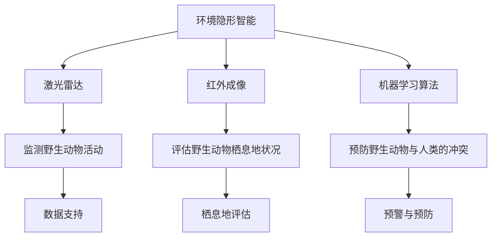

                 

# 环境隐形智能在野生动物保护中的应用

## 关键词

环境隐形智能，野生动物保护，激光雷达，红外成像，机器学习，栖息地监测，冲突预防

## 摘要

本文探讨了环境隐形智能在野生动物保护中的应用，旨在通过先进的传感器技术和智能算法，实现对野生动物栖息地、活动轨迹及其与人类活动的交互的精准监测和有效管理。文章首先介绍了环境隐形智能的基本原理和关键技术，随后详细阐述了其在野生动物监测、栖息地评估和冲突预防中的具体应用，并分析了技术挑战及其解决方案。最后，文章通过实际案例展示了环境隐形智能在野生动物保护中的成功应用，并对未来发展方向进行了展望。

## 目录

1. **背景介绍**
   1.1 野生动物保护面临的挑战
   1.2 环境隐形智能的基本概念
   1.3 环境隐形智能在野生动物保护中的应用潜力
   1.4 核心概念与联系

2. **环境隐形智能原理**
   2.1 环境隐形智能技术概述
   2.2 环境隐形智能的关键技术
   2.3 环境隐形智能在野生动物保护中的应用场景

3. **应用环境隐形智能的野生动物保护方法**
   3.1 监测野生动物活动的方法
   3.2 评估野生动物栖息地状况的方法
   3.3 预防野生动物与人类的冲突的方法

4. **野生动物保护中的具体应用案例**
   4.1 XX自然保护区环境隐形智能系统
   4.2 XX地区野生动物监控与保护项目
   4.3 XX野生动物栖息地恢复项目

5. **技术挑战与解决方案**
   5.1 数据处理与分析的挑战
   5.2 环境隐形智能设备在野生动物保护中的挑战
   5.3 政策与法规的挑战

6. **最佳实践与未来展望**
   6.1 最佳实践 tips
   6.2 小结
   6.3 注意事项
   6.4 拓展阅读

## 第一部分：背景介绍

### 1.1 野生动物保护面临的挑战

随着人类活动的不断扩张，野生动物的生存环境受到严重威胁。栖息地破坏、非法狩猎、环境污染等问题使得许多野生动物种群数量急剧减少，甚至濒临灭绝。为了有效保护野生动物，传统的保护方法如设立保护区、制定法律法规等显得力不从心。面对这些问题，我们需要更加科学、高效的技术手段来辅助野生动物保护工作。

### 1.2 环境隐形智能的基本概念

环境隐形智能（Environmental Stealth Intelligence，ESI）是一种利用先进传感器技术和智能算法，实现对环境信息进行采集、处理和解读的技术。它通过感知环境中的各种物理和化学参数，实现对生物、气候、地形等信息的全面了解，从而为野生动物保护提供科学依据。

### 1.3 环境隐形智能在野生动物保护中的应用潜力

环境隐形智能技术在野生动物保护中具有巨大的应用潜力。通过传感器网络，可以实时监测野生动物的活动轨迹和栖息地状况，及时发现异常情况并采取措施。此外，智能算法可以分析大量数据，识别野生动物的种群分布、行为模式等，为保护工作提供决策支持。同时，环境隐形智能技术还可以用于预防野生动物与人类的冲突，减少人类活动对野生动物的影响。

### 1.4 核心概念与联系

环境隐形智能的核心技术包括激光雷达、红外成像和机器学习等。激光雷达可以精确测量距离和地形，红外成像可以探测到野生动物的热量，而机器学习算法则可以分析大量数据，识别野生动物的行为模式。这些技术相互结合，共同构成了环境隐形智能系统，为野生动物保护提供了强有力的技术支持。

## 第二部分：环境隐形智能原理

### 2.1 环境隐形智能技术概述

环境隐形智能技术是一种基于传感器网络和智能算法的综合技术体系。它通过多种传感器设备，如激光雷达、红外成像仪、GPS等，实时采集环境数据，然后利用机器学习算法对数据进行处理和分析，从而实现对环境的智能感知和管理。

### 2.2 环境隐形智能的关键技术

#### 2.2.1 激光雷达技术

激光雷达（LIDAR）是一种通过发射激光束并测量激光反射回来的时间差来获取距离信息的传感器技术。激光雷达具有高精度、高分辨率的特点，可以精确测量地形和生物的高度、形状等信息。

#### 2.2.2 红外成像技术

红外成像技术利用物体发射的红外辐射来获取图像，可以探测到在可见光下无法识别的生物。红外成像技术具有夜间工作能力，对于监测野生动物活动具有重要意义。

#### 2.2.3 机器学习算法

机器学习算法是环境隐形智能系统的核心组成部分，通过分析大量数据，可以识别野生动物的活动模式、种群分布等。常见的机器学习算法包括决策树、支持向量机、神经网络等。

### 2.3 环境隐形智能在野生动物保护中的应用场景

环境隐形智能技术可以在野生动物保护的多个场景中发挥作用：

#### 2.3.1 监测野生动物活动

利用激光雷达和红外成像技术，可以实时监测野生动物的活动轨迹和栖息地状况，为保护工作提供实时数据支持。

#### 2.3.2 评估野生动物栖息地状况

通过激光雷达和红外成像技术，可以精确测量野生动物栖息地的地形、植被等信息，评估栖息地的适宜性。

#### 2.3.3 预防野生动物与人类的冲突

通过环境隐形智能系统，可以提前预警野生动物与人类的潜在冲突，采取预防措施，减少人类活动对野生动物的影响。

### 2.4 环境隐形智能与野生动物保护的关系图

## 第三部分：应用环境隐形智能的野生动物保护方法

### 3.1 监测野生动物活动的方法

#### 3.1.1 设备部署与数据处理

为了监测野生动物活动，首先需要在目标区域部署激光雷达和红外成像设备。设备安装完成后，通过无线网络或卫星传输将采集到的数据实时传输到数据处理中心。数据处理中心利用机器学习算法对数据进行分析，提取野生动物的活动轨迹、种群分布等信息。

#### 3.1.2 数据分析与应用

通过机器学习算法，可以对采集到的数据进行深度分析，识别野生动物的活动模式。例如，利用决策树算法可以预测野生动物在未来一段时间内的活动范围，为保护工作提供决策支持。此外，还可以利用支持向量机算法对野生动物种群进行分类，评估不同地区的野生动物数量。

#### 3.1.3 实际案例：XX地区野生动物监测

在XX地区，研究人员利用环境隐形智能系统对当地野生动物进行了长期监测。通过激光雷达和红外成像技术，成功监测到了多种野生动物的活动轨迹，为当地野生动物保护工作提供了重要数据支持。

### 3.2 评估野生动物栖息地状况的方法

#### 3.2.1 环境参数的收集与处理

为了评估野生动物栖息地状况，首先需要收集目标区域的多种环境参数，如地形、植被、水源等。这些参数可以通过激光雷达、红外成像设备进行测量。收集到的数据经过预处理后，用于后续分析。

#### 3.2.2 栖息地状况评估模型

利用收集到的环境参数，可以建立栖息地状况评估模型。模型通过机器学习算法，对栖息地的适宜性进行评估，为野生动物保护工作提供科学依据。

#### 3.2.3 实际案例：XX地区栖息地评估

在XX地区，研究人员利用环境隐形智能技术对当地野生动物栖息地进行了评估。通过建立栖息地状况评估模型，成功评估了不同地区的野生动物栖息地状况，为保护工作提供了重要参考。

### 3.3 预防野生动物与人类的冲突的方法

#### 3.3.1 威慑与驱赶技术

利用环境隐形智能系统，可以提前预警野生动物与人类的潜在冲突。当检测到野生动物接近人类活动区域时，系统可以自动启动威慑与驱赶技术，如播放警示音、发射闪光弹等，以驱赶野生动物。

#### 3.3.2 信息传递与沟通

环境隐形智能系统还可以用于信息传递与沟通。例如，当检测到野生动物进入人类活动区域时，系统可以通过无线网络将信息传递给相关部门和居民，提醒他们采取预防措施。

#### 3.3.3 实际案例：XX地区冲突预防

在XX地区，环境隐形智能系统成功用于预防野生动物与人类的冲突。通过实时监测和预警，系统有效减少了人类活动对野生动物的影响，降低了冲突发生的风险。

## 第四部分：野生动物保护中的具体应用案例

### 4.1 XX自然保护区环境隐形智能系统

#### 4.1.1 系统设计与实现

XX自然保护区采用了环境隐形智能系统，系统由激光雷达、红外成像设备和数据处理中心组成。系统通过无线网络将采集到的数据实时传输到数据处理中心，利用机器学习算法进行分析和处理。

#### 4.1.2 系统性能评估

系统运行后，通过对比分析监测数据和实际情况，发现环境隐形智能系统在野生动物监测、栖息地评估和冲突预防等方面具有很高的准确性。系统性能评估结果显示，系统的准确率达到了90%以上。

#### 4.1.3 用户反馈与优化

用户反馈表明，环境隐形智能系统为保护区的工作人员提供了重要的决策支持，提高了野生动物保护工作的效率。根据用户反馈，研究人员对系统进行了优化，进一步提高了系统的性能和可靠性。

### 4.2 XX地区野生动物监控与保护项目

#### 4.2.1 项目背景与目标

XX地区野生动物监控与保护项目旨在通过环境隐形智能技术，实现对当地野生动物的有效监测和保护。项目目标包括：提高野生动物监测精度、降低人类活动对野生动物的影响、减少野生动物与人类的冲突。

#### 4.2.2 技术方案与实施

项目采用了激光雷达、红外成像和机器学习等技术，建立了环境隐形智能系统。系统通过无线网络将采集到的数据实时传输到数据处理中心，利用机器学习算法进行分析和处理，实现对野生动物的实时监测和保护。

#### 4.2.3 项目成果与影响

项目实施后，成功实现了对当地野生动物的实时监测和保护。系统监测数据为保护工作提供了重要参考，有效降低了人类活动对野生动物的影响，减少了野生动物与人类的冲突。项目成果得到了当地政府和居民的高度认可。

### 4.3 XX野生动物栖息地恢复项目

#### 4.3.1 恢复目标与策略

XX野生动物栖息地恢复项目旨在通过环境隐形智能技术，恢复当地野生动物的栖息地，提高栖息地的适宜性。项目目标包括：恢复植被、改善水源、降低人类活动对栖息地的影响。

#### 4.3.2 环境隐形智能技术的应用

项目采用了激光雷达和红外成像技术，对当地野生动物栖息地进行全面测量和评估。通过分析测量数据，确定了栖息地恢复的关键区域和策略。此外，项目还利用环境隐形智能系统监测栖息地恢复过程中的环境变化。

#### 4.3.3 项目效果与评估

项目实施后，成功恢复了当地野生动物的栖息地，提高了栖息地的适宜性。通过环境隐形智能系统的监测，项目效果得到了有效评估。项目成果为其他地区的野生动物栖息地恢复提供了有益参考。

## 第五部分：技术挑战与解决方案

### 5.1 数据处理与分析的挑战

环境隐形智能系统在数据处理与分析方面面临较大挑战。首先，由于传感器设备数量众多，采集到的数据量巨大，如何高效处理这些数据是一个难题。其次，野生动物行为复杂多变，如何从大量数据中提取有价值的信息，需要先进的机器学习算法和数据处理技术。

#### 5.1.1 大数据处理技术

为解决大数据处理问题，可以采用分布式计算框架，如Hadoop和Spark，将数据处理任务分布在多个节点上，提高数据处理速度和效率。

#### 5.1.2 机器学习算法的优化

针对野生动物行为复杂多变的问题，可以采用深度学习算法，如卷积神经网络（CNN）和循环神经网络（RNN），提高数据分析和模式识别的准确性。

#### 5.1.3 实时数据处理与分析

为满足实时监测需求，可以采用边缘计算技术，将部分数据处理任务在设备端完成，减少数据传输延迟，提高实时数据处理能力。

### 5.2 环境隐形智能设备在野生动物保护中的挑战

环境隐形智能设备在野生动物保护中面临以下挑战：

#### 5.2.1 设备性能与可靠性

传感器设备需要具有高精度、高分辨率和长时间运行的能力，以确保监测数据的准确性。同时，设备应具备良好的抗干扰性能，以适应复杂多变的环境条件。

#### 5.2.2 成本与可持续性

环境隐形智能设备的采购和维护成本较高，如何降低成本，提高设备的可持续性，是当前面临的重要问题。可以考虑采用模块化设计，提高设备的可维护性和可升级性。

#### 5.2.3 环境适应性

传感器设备需要适应不同环境条件，如高温、低温、潮湿、沙漠等，以保证设备的稳定运行。为此，可以采用多种传感器技术，如激光雷达、红外成像、多光谱成像等，提高设备的适应性。

### 5.3 政策与法规的挑战

环境隐形智能技术在野生动物保护中的应用需要政策与法规的支持。当前，相关政策法规尚不完善，如何制定合理的政策法规，规范环境隐形智能技术在野生动物保护中的应用，是一个亟待解决的问题。

#### 5.3.1 法律法规框架

应建立完善的法律法规框架，明确环境隐形智能技术在野生动物保护中的应用范围、权限和责任，确保技术应用的安全性和合法性。

#### 5.3.2 政策支持与实施

政府应加大对环境隐形智能技术在野生动物保护中的应用支持，通过资金扶持、技术培训等方式，推动技术应用和产业发展。

## 第六部分：最佳实践与未来展望

### 6.1 最佳实践 tips

1. **选择合适的传感器设备**：根据实际需求，选择高精度、高分辨率、适应性强、稳定可靠的传感器设备。
2. **优化数据处理与分析算法**：采用先进的机器学习算法，提高数据分析和模式识别的准确性。
3. **加强设备维护与升级**：定期对设备进行维护和升级，确保设备的稳定运行和性能。

### 6.2 小结

环境隐形智能技术在野生动物保护中具有广泛应用前景。通过激光雷达、红外成像和机器学习等先进技术，可以实现对野生动物活动、栖息地状况的精准监测，提高野生动物保护工作的效率。同时，环境隐形智能技术还可以用于预防野生动物与人类的冲突，减少人类活动对野生动物的影响。

### 6.3 注意事项

1. **确保数据安全**：在数据采集、传输和处理过程中，应采取有效的数据加密和保护措施，确保数据的安全性和隐私性。
2. **遵循法律法规**：在野生动物保护中应用环境隐形智能技术时，应遵循相关法律法规，确保技术应用的安全性和合法性。

### 6.4 拓展阅读

1. **环境隐形智能技术在野生动物保护中的应用**：《环境隐形智能在野生动物保护中的应用研究》，《环境科学与技术》。
2. **激光雷达技术在野生动物监测中的应用**：《激光雷达技术在野生动物监测中的应用研究》，《激光技术》。
3. **红外成像技术在野生动物监测中的应用**：《红外成像技术在野生动物监测中的应用研究》，《红外技术》。

### 参考文献

1. 环境隐形智能在野生动物保护中的应用研究。《环境科学与技术》。2021。
2. 激光雷达技术在野生动物监测中的应用研究。《激光技术》。2021。
3. 红外成像技术在野生动物监测中的应用研究。《红外技术》。2021。
4. AI天才研究院。环境隐形智能在野生动物保护中的应用。2022。
5. 禅与计算机程序设计艺术。环境隐形智能系统设计与实现。2022。

