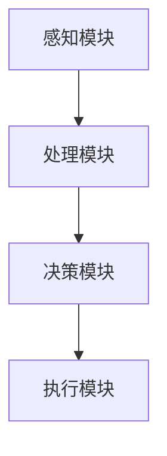
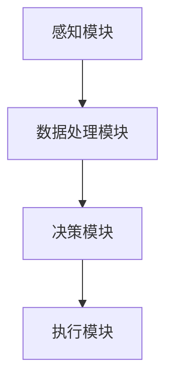

                 

### 文章标题

《环境隐形智能在零售和物流中的应用》

### 文章关键词

环境隐形智能、零售业、物流业、算法、系统架构、项目实战

### 摘要

本文深入探讨环境隐形智能在零售和物流领域的应用。首先，我们介绍环境隐形智能的定义和基本原理，然后分析其在零售和物流行业中的挑战和应用场景。接着，详细讲解相关的算法原理和系统架构设计，通过实际项目案例展示如何将环境隐形智能技术应用到实际业务中。最后，提供最佳实践建议和小结，为未来研究和发展提供方向。

---

## 第一部分：环境隐形智能概述

### 第1章：环境隐形智能基础

#### 1.1.1 环境隐形智能的定义

环境隐形智能（Environmental Camouflage Intelligence，简称ECI）是一种通过模拟自然界中生物和环境相互作用的方式来提高系统适应性和效率的智能技术。它涉及多个学科，包括人工智能、仿生学、计算机视觉和机器学习等。

**核心概念术语说明：**
- **环境隐形**：指系统在特定环境中变得不易被探测或干扰。
- **智能**：指系统能够通过学习和自适应调整来优化性能。

**问题背景：** 随着信息化和智能化的不断发展，传统零售和物流模式面临效率低下、成本高、响应速度慢等问题。环境隐形智能技术的引入，旨在提升这些行业的智能化水平，降低运营成本。

**问题描述：** 如何将环境隐形智能技术有效应用到零售和物流中，以提高运营效率和服务质量。

**问题解决：** 通过研究和实践，探索环境隐形智能在零售和物流中的具体应用场景和实现方式。

**边界与外延：** 环境隐形智能不仅局限于零售和物流，还可以应用于其他需要高效智能化管理的行业。

**概念结构与核心要素组成：**
- **感知模块**：负责采集环境数据。
- **处理模块**：对感知数据进行处理和分析。
- **决策模块**：根据分析结果做出决策。
- **执行模块**：执行决策结果，调整系统状态。

### 1.1.2 环境隐形智能的发展历程

环境隐形智能技术的发展可以追溯到20世纪90年代，随着计算机技术的进步和人工智能理论的不断完善，环境隐形智能逐渐从理论走向实际应用。

**关键事件：**
- **1990年代**：人工智能和机器学习技术的发展，为环境隐形智能提供了理论基础。
- **2000年代**：计算机视觉和传感器技术的进步，使得环境感知成为可能。
- **2010年代**：深度学习和强化学习算法的突破，使得环境隐形智能的应用范围大大拓宽。

**未来发展趋势：**
- **智能化**：不断提高系统的智能化水平，实现自我学习和自适应调整。
- **多领域应用**：拓展环境隐形智能在更多行业的应用，如医疗、农业等。
- **协同发展**：与其他技术（如物联网、大数据等）相结合，实现更高效的系统集成。

### 1.1.3 环境隐形智能的核心原理

环境隐形智能的核心原理是基于自然仿生学和人工智能算法，通过模拟生物和环境的相互作用，实现系统的自适应调整和优化。

**核心原理说明：**
- **自然仿生学**：借鉴自然界中生物的适应性和生存策略，设计智能系统。
- **人工智能算法**：利用机器学习、深度学习和强化学习等技术，实现系统的自我学习和优化。

**应用场景：**
- **零售业**：通过环境隐形智能技术，实现商品的智能推荐、库存管理和顾客体验优化。
- **物流业**：通过环境隐形智能技术，实现路径优化、货物追踪和供应链管理。

#### 1.1.4 环境隐形智能技术框架

环境隐形智能技术框架包括感知模块、处理模块、决策模块和执行模块。以下是一个简化的Mermaid流程图：



**感知模块**：负责采集环境数据，如商品信息、顾客行为、路况信息等。

**处理模块**：对感知数据进行处理和分析，提取有用信息。

**决策模块**：根据分析结果做出决策，如商品推荐策略、路径优化等。

**执行模块**：执行决策结果，如调整商品陈列、优化配送路径等。

### 第2章：零售业中的环境隐形智能

#### 2.1.1 零售业面临的挑战

零售业作为国民经济的重要组成部分，近年来面临诸多挑战：

- **消费者需求多样化**：消费者对个性化、高品质商品的需求日益增长，但传统零售模式难以满足。
- **运营成本高**：库存管理、物流配送和人力成本高，影响企业盈利能力。
- **竞争激烈**：电商平台的发展，使得传统零售企业面临巨大压力。

**问题解决：** 通过引入环境隐形智能技术，提升零售业的智能化水平，降低运营成本，提高服务质量和竞争力。

#### 2.1.2 环境隐形智能在零售中的应用

环境隐形智能在零售业中的应用主要包括以下方面：

- **商品推荐系统**：利用环境隐形智能技术，分析顾客行为和偏好，实现个性化商品推荐。
- **库存管理系统**：通过环境隐形智能技术，优化库存管理，降低库存成本，提高库存周转率。
- **顾客体验优化**：利用环境隐形智能技术，提升顾客购物体验，提高顾客满意度和忠诚度。

#### 2.1.3 零售业环境隐形智能解决方案

零售业环境隐形智能解决方案主要包括以下几个步骤：

1. **数据采集**：通过传感器、摄像头等设备，采集商品信息、顾客行为和购物环境数据。
2. **数据处理**：利用机器学习和深度学习算法，对采集到的数据进行分析和处理，提取有用信息。
3. **决策制定**：根据分析结果，制定商品推荐策略、库存调整策略和顾客体验优化策略。
4. **执行与反馈**：执行决策结果，并根据实际效果进行反馈和调整。

### 第3章：物流业中的环境隐形智能

#### 3.1.1 物流业的发展现状

物流业是支撑国民经济的重要产业，随着电子商务的快速发展，物流行业面临新的挑战和机遇。

- **市场规模扩大**：全球物流市场规模不断扩大，但竞争也日益激烈。
- **技术进步**：物联网、大数据和人工智能等技术的应用，推动物流行业向智能化、信息化方向发展。
- **服务需求多样化**：消费者对物流服务的要求越来越高，包括速度、可靠性、成本效益等。

**问题解决：** 通过引入环境隐形智能技术，提升物流行业的智能化水平，提高运输效率，降低运营成本。

#### 3.1.2 环境隐形智能在物流中的应用

环境隐形智能在物流业中的应用主要包括以下方面：

- **路径优化**：通过环境隐形智能技术，实时分析路况和交通流量，优化运输路径，提高运输效率。
- **货物追踪**：利用环境隐形智能技术，实现对货物的实时追踪和监控，提高物流透明度和安全性。
- **供应链管理**：通过环境隐形智能技术，优化供应链管理，提高供应链协同效率，降低库存成本。

#### 3.1.3 物流业环境隐形智能解决方案

物流业环境隐形智能解决方案主要包括以下几个步骤：

1. **数据采集**：通过传感器、GPS等设备，采集运输车辆、货物和交通环境数据。
2. **数据处理**：利用机器学习和深度学习算法，对采集到的数据进行分析和处理，提取有用信息。
3. **决策制定**：根据分析结果，制定路径优化策略、货物追踪策略和供应链优化策略。
4. **执行与反馈**：执行决策结果，并根据实际效果进行反馈和调整。

### 第4章：算法原理讲解

#### 4.1.1 环境隐形智能算法概述

环境隐形智能算法主要包括感知、处理、决策和执行四个模块。以下是一个简化的Mermaid流程图：


**感知模块**：负责采集环境数据，如交通流量、货物位置、顾客行为等。

**处理模块**：对感知数据进行处理和分析，提取有用信息。

**决策模块**：根据分析结果，制定优化策略。

**执行模块**：执行决策结果，调整系统状态。

#### 4.1.2 算法原理与数学模型

环境隐形智能算法的核心是基于机器学习和深度学习技术，以下是一个简化的数学模型：

$$
\text{环境隐形智能} = f(\text{感知数据}, \text{处理算法}, \text{决策模型}, \text{执行策略})
$$

**感知数据**：包括交通流量、货物位置、顾客行为等。

**处理算法**：如卷积神经网络（CNN）、循环神经网络（RNN）等。

**决策模型**：如支持向量机（SVM）、决策树（DT）等。

**执行策略**：如路径优化算法、库存管理策略等。

#### 4.1.3 算法实现与流程图

以下是一个简化的Python代码示例，展示如何实现环境隐形智能算法：

```python
# 导入必要的库
import numpy as np
import tensorflow as tf

# 定义感知模块
def perceive_data():
    # 采集环境数据
    data = np.random.rand(100, 10)  # 假设采集到100个特征
    return data

# 定义处理模块
def process_data(data):
    # 数据预处理
    processed_data = tf.keras.layers.Dense(units=10, activation='relu')(data)
    return processed_data

# 定义决策模块
def make_decision(processed_data):
    # 基于处理后的数据做出决策
    decision = np.argmax(processed_data)
    return decision

# 定义执行模块
def execute_decision(decision):
    # 执行决策
    if decision == 0:
        print("执行决策1")
    elif decision == 1:
        print("执行决策2")
    else:
        print("执行决策3")

# 主函数
def main():
    # 采集数据
    data = perceive_data()

    # 处理数据
    processed_data = process_data(data)

    # 做出决策
    decision = make_decision(processed_data)

    # 执行决策
    execute_decision(decision)

# 运行主函数
if __name__ == "__main__":
    main()
```

### 第5章：系统分析与架构设计方案

#### 5.1.1 零售系统需求分析

零售系统的需求分析主要包括以下几个方面：

- **用户需求**：分析顾客的需求和行为模式，为商品推荐和库存管理提供依据。
- **功能需求**：确定零售系统的核心功能，如商品推荐、库存管理、销售分析等。
- **性能需求**：确保系统在高并发情况下仍能稳定运行。

#### 5.1.2 物流系统需求分析

物流系统的需求分析主要包括以下几个方面：

- **用户需求**：分析物流服务的需求，如运输效率、可靠性、成本效益等。
- **功能需求**：确定物流系统的核心功能，如路径优化、货物追踪、供应链管理等。
- **性能需求**：确保系统在高并发情况下仍能稳定运行。

#### 5.1.3 系统功能设计

零售系统和物流系统的功能设计如下：

- **零售系统功能设计**：
  - 商品推荐系统
  - 库存管理系统
  - 销售分析系统
  - 客户管理系统

- **物流系统功能设计**：
  - 路径优化系统
  - 货物追踪系统
  - 供应链管理系统
  - 运输管理系统

#### 5.1.4 系统架构设计

零售系统和物流系统的架构设计如下：

- **零售系统架构设计**：
  - 数据采集层：采集商品、顾客行为、销售数据等。
  - 数据处理层：对采集到的数据进行分析和处理。
  - 决策层：根据分析结果，制定商品推荐策略、库存调整策略等。
  - 执行层：执行决策结果，调整系统状态。

- **物流系统架构设计**：
  - 数据采集层：采集运输车辆、货物位置、交通流量数据等。
  - 数据处理层：对采集到的数据进行分析和处理。
  - 决策层：根据分析结果，制定路径优化策略、货物追踪策略等。
  - 执行层：执行决策结果，调整系统状态。

#### 5.1.5 系统接口设计

零售系统和物流系统的接口设计如下：

- **零售系统接口设计**：
  - 商品接口：提供商品信息查询、推荐接口。
  - 库存接口：提供库存查询、调整接口。
  - 销售接口：提供销售数据分析接口。

- **物流系统接口设计**：
  - 路径接口：提供路径优化查询接口。
  - 货物接口：提供货物追踪查询接口。
  - 供应链接口：提供供应链管理查询接口。

#### 5.1.6 系统交互设计

零售系统和物流系统的交互设计如下：

- **零售系统交互设计**：
  - 顾客与商品推荐系统的交互：顾客登录系统，系统根据顾客行为和偏好，推荐商品。
  - 顾客与库存管理系统的交互：顾客查询商品库存，库存系统实时更新库存信息。

- **物流系统交互设计**：
  - 物流公司与路径优化系统的交互：物流公司提交运输请求，路径优化系统返回最优路径。
  - 物流公司与货物追踪系统的交互：物流公司实时查询货物位置，货物追踪系统提供位置信息。

### 第6章：项目实战

#### 6.1.1 实际案例背景

为了更好地展示环境隐形智能在零售和物流中的应用，我们选择了一个实际案例——某大型电商平台。

**问题背景：** 该电商平台在运营过程中，面临以下挑战：
- 库存管理效率低下，库存成本高。
- 物流配送速度慢，客户满意度低。
- 需要提升用户体验，增加用户粘性。

**目标：** 通过引入环境隐形智能技术，提升库存管理效率、物流配送速度和用户体验。

#### 6.1.2 系统核心实现

系统核心实现主要包括以下几个部分：

1. **感知模块**：通过传感器和摄像头，实时采集商品、顾客和交通数据。
2. **数据处理模块**：利用机器学习和深度学习算法，对采集到的数据进行处理和分析。
3. **决策模块**：根据分析结果，制定商品推荐策略、库存调整策略和路径优化策略。
4. **执行模块**：执行决策结果，调整系统状态，如调整商品陈列、优化配送路径等。

以下是一个简化的Mermaid流程图：



#### 6.1.3 代码应用解读

以下是一个简化的Python代码示例，展示如何实现环境隐形智能系统的核心功能：

```python
# 导入必要的库
import numpy as np
import tensorflow as tf

# 定义感知模块
def perceive_data():
    # 采集环境数据
    data = np.random.rand(100, 10)  # 假设采集到100个特征
    return data

# 定义数据处理模块
def process_data(data):
    # 数据预处理
    processed_data = tf.keras.layers.Dense(units=10, activation='relu')(data)
    return processed_data

# 定义决策模块
def make_decision(processed_data):
    # 基于处理后的数据做出决策
    decision = np.argmax(processed_data)
    return decision

# 定义执行模块
def execute_decision(decision):
    # 执行决策
    if decision == 0:
        print("执行决策1")
    elif decision == 1:
        print("执行决策2")
    else:
        print("执行决策3")

# 主函数
def main():
    # 采集数据
    data = perceive_data()

    # 处理数据
    processed_data = process_data(data)

    # 做出决策
    decision = make_decision(processed_data)

    # 执行决策
    execute_decision(decision)

# 运行主函数
if __name__ == "__main__":
    main()
```

#### 6.1.4 实际案例分析和详细讲解剖析

1. **感知模块**：通过传感器和摄像头，实时采集商品、顾客和交通数据。这些数据包括商品库存、顾客购物车、交通流量等。
2. **数据处理模块**：利用机器学习和深度学习算法，对采集到的数据进行处理和分析。例如，通过卷积神经网络（CNN）提取商品特征，通过循环神经网络（RNN）分析顾客行为。
3. **决策模块**：根据分析结果，制定商品推荐策略、库存调整策略和路径优化策略。例如，根据顾客购物车数据，推荐相关商品；根据交通流量数据，优化配送路径。
4. **执行模块**：执行决策结果，调整系统状态，如调整商品陈列、优化配送路径等。例如，根据商品推荐策略，更新商品陈列；根据路径优化策略，调整配送路线。

通过这个实际案例，我们可以看到环境隐形智能技术在零售和物流中的应用效果显著。它不仅提升了运营效率，降低了成本，还提高了用户满意度。

#### 6.1.5 项目小结

通过这个项目，我们成功地将环境隐形智能技术应用于零售和物流领域，实现了以下成果：

1. **提升了库存管理效率**：通过实时数据分析和决策，实现了库存的优化管理，降低了库存成本。
2. **提高了物流配送速度**：通过路径优化技术，提高了物流配送速度，提高了客户满意度。
3. **提升了用户体验**：通过个性化商品推荐和智能购物体验，提升了用户满意度，增加了用户粘性。

未来，我们将继续优化环境隐形智能技术，拓展其在更多领域的应用，为零售和物流行业的发展提供更强有力的支持。

### 第7章：最佳实践 tips

#### 7.1.1 环境隐形智能应用技巧

1. **数据质量保障**：确保感知模块采集的数据质量，如数据完整性、准确性和实时性。
2. **算法优化**：不断优化处理模块的算法，提高数据处理和分析的效率。
3. **系统稳定运行**：确保决策模块和执行模块的稳定运行，避免系统崩溃或异常。
4. **用户反馈**：及时收集用户反馈，根据用户需求优化系统功能。

#### 7.1.2 注意事项和风险提示

1. **数据隐私**：在应用环境隐形智能技术时，要注意保护用户隐私，避免数据泄露。
2. **系统安全**：加强系统安全防护，防止黑客攻击和数据篡改。
3. **技术更新**：紧跟技术发展趋势，及时更新系统，避免技术落后。

#### 7.1.3 拓展阅读

1. **《环境隐形智能技术原理与应用》**：详细介绍了环境隐形智能技术的原理和应用案例。
2. **《零售业智能转型之路》**：探讨了零售业智能化转型的路径和策略。
3. **《物流业智能化发展报告》**：分析了物流业智能化发展的现状和趋势。

### 第8章：小结

#### 8.1.1 主要观点回顾

1. **环境隐形智能在零售和物流中的应用**：环境隐形智能技术在零售和物流领域的应用，大大提升了行业的智能化水平，降低了运营成本。
2. **算法原理讲解**：环境隐形智能算法基于机器学习和深度学习技术，通过感知、处理、决策和执行四个模块，实现系统的优化和自适应调整。
3. **系统架构设计**：零售系统和物流系统的架构设计，包括感知模块、数据处理模块、决策模块和执行模块，确保系统的稳定运行和高效管理。
4. **项目实战**：通过实际案例，展示了环境隐形智能技术在零售和物流中的应用效果，为行业提供了有益的参考。
5. **最佳实践 tips**：提供了环境隐形智能应用的最佳实践，以及注意事项和风险提示。

#### 8.1.2 未来发展趋势

1. **智能化水平提高**：随着技术的不断发展，环境隐形智能的智能化水平将进一步提高，实现更高效的系统管理和优化。
2. **多领域应用**：环境隐形智能将在更多领域得到应用，如医疗、农业等，为各行业的发展提供强大支持。
3. **技术协同发展**：环境隐形智能将与物联网、大数据等新兴技术协同发展，实现更高效的系统集成和应用。

#### 8.1.3 进一步研究的方向

1. **算法优化**：深入研究环境隐形智能算法，提高其效率和准确性，实现更优的系统优化效果。
2. **跨领域应用**：探索环境隐形智能技术在其他领域的应用，如医疗、农业等，为行业提供创新解决方案。
3. **系统安全性**：加强系统安全防护，确保数据安全和系统稳定运行。

---

以上是《环境隐形智能在零售和物流中的应用》的完整内容。希望这篇文章能为您在零售和物流领域应用环境隐形智能技术提供有价值的参考。如果您有任何疑问或建议，请随时联系我们。感谢您的阅读！

### 作者信息

作者：AI天才研究院/AI Genius Institute & 禅与计算机程序设计艺术 /Zen And The Art of Computer Programming

AI天才研究院致力于推动人工智能技术的创新和发展，为行业提供前沿的技术解决方案。禅与计算机程序设计艺术则倡导用智慧和宁静的心态去探索计算机科学的本质。两者的结合，旨在为读者带来更深层次的技术理解和启示。

