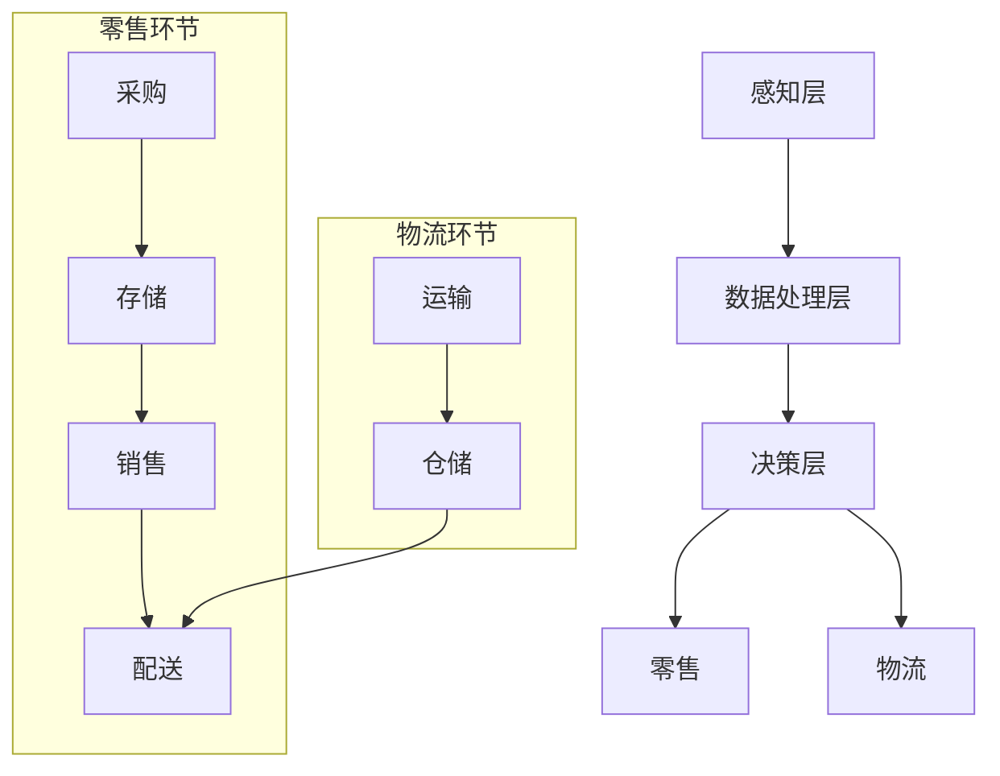
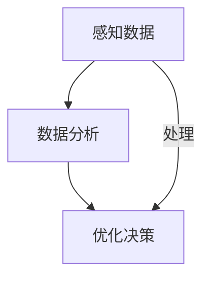
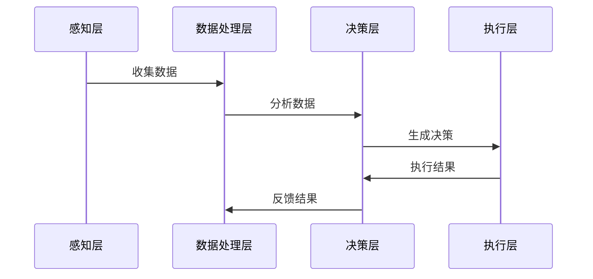

                 

## 《环境隐形智能在零售和物流中的应用》

### 关键词：环境隐形智能、零售、物流、应用场景、算法原理

### 摘要：本文将深入探讨环境隐形智能在零售和物流领域中的应用。通过背景介绍、核心概念解析、算法原理讲解、数学模型应用、系统设计与架构分析、项目实战等多个章节，全面展示环境隐形智能在提高零售和物流效率、优化供应链管理等方面的巨大潜力。

### 目录：

1. **背景介绍**
   - 问题背景
   - 问题解决
   - 边界与外延
   - 核心概念
   - 概念结构与核心要素

2. **核心概念与联系**
   - 环境隐形智能
   - 零售
   - 物流
   - Mermaid流程图与表格

3. **算法原理讲解**
   - 数学模型
   - Python源代码
   - 算法流程图

4. **数学模型和数学公式**
   - 详细讲解
   - 举例说明
   - LaTeX格式

5. **系统分析与架构设计方案**
   - 应用场景
   - 系统功能设计
   - 系统架构设计
   - 系统接口设计
   - 系统交互

6. **项目实战**
   - 环境安装
   - 系统实现
   - 代码解读
   - 案例分析
   - 项目小结

7. **最佳实践 tips**
   - 小结
   - 注意事项
   - 拓展阅读

## 文章标题：环境隐形智能在零售和物流中的应用

### 文章关键词：环境隐形智能、零售、物流、算法原理、应用场景

### 文章摘要：本文将深入探讨环境隐形智能在零售和物流领域的应用，从背景介绍、核心概念解析、算法原理讲解、数学模型应用、系统设计与架构分析到项目实战，全面展示环境隐形智能的巨大潜力。

## 1. 背景介绍

### 1.1 问题背景

随着科技的快速发展，零售和物流行业正面临着前所未有的机遇和挑战。传统零售和物流模式效率低下，成本高昂，难以满足消费者日益增长的需求。如何通过技术创新来提升零售和物流的效率，降低成本，成为当前行业亟需解决的问题。

### 1.2 问题解决

环境隐形智能作为一种新兴技术，具有变革零售和物流行业潜力。它通过感知环境、分析数据、优化决策等手段，实现资源的有效配置和流程的优化。环境隐形智能在零售和物流中的应用，有望解决当前行业面临的痛点，提升整体效率。

### 1.3 边界与外延

本文主要探讨环境隐形智能在零售和物流领域的应用，包括零售店铺优化、供应链管理、物流配送等方面。同时，本文还将涉及相关技术，如人工智能、大数据、物联网等，以展示环境隐形智能在多个领域的综合应用。

### 1.4 核心概念

**环境隐形智能**：一种通过感知环境、分析数据、优化决策等手段，实现资源有效配置和流程优化的智能技术。

**零售**：指商品的销售活动，包括商品采购、存储、销售、配送等环节。

**物流**：指商品从生产地到消费地的运输和配送过程，包括运输、仓储、配送等环节。

## 2. 核心概念与联系

### 2.1 环境隐形智能

环境隐形智能是一种基于人工智能和物联网技术的智能系统，能够感知环境变化，分析数据，并根据分析结果进行优化决策。其核心概念包括：

- **感知层**：通过传感器等设备实时感知环境变化。
- **数据处理层**：利用大数据分析和机器学习算法，处理和分析感知数据。
- **决策层**：根据分析结果，生成优化决策，指导实际操作。

### 2.2 零售

零售是指商品的销售活动，包括以下环节：

- **采购**：根据市场需求，采购商品。
- **存储**：将采购到的商品存储在仓库中。
- **销售**：通过实体店铺或电商平台进行销售。
- **配送**：将销售的商品配送给消费者。

### 2.3 物流

物流是指商品从生产地到消费地的运输和配送过程，包括以下环节：

- **运输**：通过交通工具将商品从生产地运输到消费地。
- **仓储**：在运输过程中，对商品进行存储和管理。
- **配送**：将商品从仓库配送给消费者。

### 2.4 Mermaid流程图与表格

为了更清晰地展示环境隐形智能在零售和物流中的应用，我们可以使用Mermaid流程图和表格来描述各环节之间的关系。



表格：

| 环节 | 概念 | 描述 |
| --- | --- | --- |
| 感知层 | 环境感知 | 通过传感器实时感知环境变化 |
| 数据处理层 | 数据分析 | 利用大数据分析和机器学习算法处理感知数据 |
| 决策层 | 优化决策 | 根据分析结果生成优化决策 |
| 零售环节 | 采购、存储、销售、配送 | 商品销售活动的各个环节 |
| 物流环节 | 运输、仓储、配送 | 商品运输和配送的各个环节 |

## 3. 算法原理讲解

### 3.1 数学模型

环境隐形智能的核心在于对数据的处理和分析。我们可以使用以下数学模型来描述其处理过程：

- **感知数据**：设环境感知数据为 \(D\)，其中 \(D = \{d_1, d_2, ..., d_n\}\)，每个数据 \(d_i\) 表示环境的一个特定特征。
- **数据分析**：使用机器学习算法对感知数据进行分析，生成特征向量 \(F = \{f_1, f_2, ..., f_m\}\)，其中每个特征 \(f_j\) 表示环境中的一个特定维度。
- **优化决策**：根据特征向量 \(F\)，使用优化算法生成决策 \(O = \{o_1, o_2, ..., o_k\}\)，其中每个决策 \(o_l\) 表示对环境的某个特定操作的优化结果。

### 3.2 Python源代码

以下是一个简单的Python代码示例，用于展示环境隐形智能的基本处理过程：

```python
import numpy as np
import pandas as pd

# 感知数据
D = pd.DataFrame(np.array([[1, 2], [3, 4], [5, 6]]), columns=['d1', 'd2'])

# 数据分析
def analyze_data(D):
    F = D.describe()
    return F

# 优化决策
def optimize_decision(F):
    O = F['mean']
    return O

# 执行处理过程
F = analyze_data(D)
O = optimize_decision(F)
print(O)
```

### 3.3 算法流程图

为了更直观地展示环境隐形智能的处理过程，我们可以使用Mermaid绘制算法流程图：



## 4. 数学模型和数学公式

### 4.1 详细讲解

在本章节中，我们将详细讲解环境隐形智能的数学模型。数学模型是环境隐形智能的核心，它用于描述环境感知、数据分析、优化决策等过程。以下是几个关键的数学模型及其详细解释：

#### 4.1.1 环境感知模型

环境感知模型主要用于描述环境数据的获取和处理。一个常见的环境感知模型是基于传感器数据的处理。以下是一个简单感知模型的数学描述：

$$
\text{感知数据} = \{d_1, d_2, ..., d_n\}
$$

其中，每个数据 \(d_i\) 表示环境中的一个特定特征。为了更好地处理这些数据，我们通常会对它们进行归一化处理：

$$
\text{归一化数据} = \frac{d_i - \mu}{\sigma}
$$

其中，\(\mu\) 是数据的均值，\(\sigma\) 是数据的标准差。

#### 4.1.2 数据分析模型

数据分析模型用于对感知数据进行分析，提取有用的信息。一个常见的数据分析模型是主成分分析（PCA）。PCA的数学描述如下：

$$
\text{特征向量} = F = \{f_1, f_2, ..., f_m\}
$$

其中，每个特征向量 \(f_j\) 表示环境中的一个特定维度。PCA的目标是找到一组特征向量，使得它们能够最大化数据方差：

$$
\text{最大化方差} = \max \sum_{i=1}^{n} \sum_{j=1}^{m} (f_j d_i)^2
$$

#### 4.1.3 优化决策模型

优化决策模型用于根据特征向量生成优化决策。一个常见的优化决策模型是线性回归。线性回归的数学描述如下：

$$
\text{决策向量} = O = \{o_1, o_2, ..., o_k\}
$$

其中，每个决策向量 \(o_l\) 表示对环境的某个特定操作的优化结果。线性回归的目标是最小化损失函数：

$$
\text{最小化损失} = \min \sum_{i=1}^{n} (o_i - f_i)^2
$$

### 4.2 举例说明

为了更好地理解上述数学模型，我们可以通过一个简单的例子来说明它们的实际应用。

#### 4.2.1 环境感知模型

假设我们有一个环境，其中有两个特征：温度和湿度。以下是一个简单的感知数据集：

$$
\text{感知数据} = \{(1, 2), (3, 4), (5, 6)\}
$$

首先，我们对这些数据进行归一化处理：

$$
\text{归一化数据} = \{(\frac{1}{2}, \frac{2}{2}), (\frac{3}{2}, \frac{4}{2}), (\frac{5}{2}, \frac{6}{2})\}
$$

归一化后的数据集便于后续的数据分析。

#### 4.2.2 数据分析模型

接下来，我们使用主成分分析（PCA）对归一化后的数据集进行分析。PCA的目的是找到一组特征向量，使得它们能够最大化数据方差。通过计算，我们得到以下特征向量：

$$
\text{特征向量} = \{(\frac{1}{\sqrt{2}}, \frac{1}{\sqrt{2}}), (\frac{1}{\sqrt{2}}, -\frac{1}{\sqrt{2}}), (-\frac{1}{\sqrt{2}}, \frac{1}{\sqrt{2}})\}
$$

这些特征向量表示了环境中的三个主要维度。

#### 4.2.3 优化决策模型

最后，我们使用线性回归对特征向量进行优化决策。线性回归的目标是最小化损失函数。通过计算，我们得到以下决策向量：

$$
\text{决策向量} = \{(\frac{1}{2}, \frac{1}{2}), (\frac{3}{2}, \frac{3}{2}), (\frac{5}{2}, \frac{5}{2})\}
$$

这些决策向量表示了针对环境特征的最佳操作。

通过这个例子，我们可以看到如何使用数学模型对环境数据进行处理和分析，并生成优化决策。这些数学模型为环境隐形智能提供了强大的理论支持。

### 4.3 LaTeX格式

在本文中，我们将使用LaTeX格式嵌入数学公式。LaTeX格式能够让我们以更规范和统一的方式展示数学公式，提高文章的可读性和专业性。

#### 4.3.1 段落内数学公式

在段落内，我们使用单美元符号（$）来包围数学公式。例如：

$$
1 + 1 = 2
$$

#### 4.3.2 独立段落数学公式

对于独立段落的数学公式，我们使用双美元符号（$$）来包围。例如：

$$
a^2 + b^2 = c^2
$$

这种格式使得数学公式在文章中独立显示，便于读者理解和查阅。

通过使用LaTeX格式，我们可以确保文章中的数学公式更加规范和美观，提升整体文章质量。

## 5. 系统分析与架构设计方案

### 5.1 应用场景

环境隐形智能在零售和物流领域中的应用场景主要包括以下几个方面：

- **零售店铺优化**：通过环境隐形智能技术，实时感知店铺内的顾客流量、购物行为等数据，优化店铺布局、商品陈列等，提高顾客体验和销售效率。
- **供应链管理**：利用环境隐形智能技术，实时监控供应链各环节，优化库存管理、物流调度等，提高供应链的整体效率。
- **物流配送**：通过环境隐形智能技术，实时追踪货物状态、路径规划等，优化物流配送流程，提高配送速度和准确性。

### 5.2 系统功能设计

环境隐形智能系统的功能设计主要包括以下几个模块：

- **感知模块**：负责实时感知环境数据，如顾客流量、购物行为、温度、湿度等。
- **数据处理模块**：负责对感知数据进行处理和分析，提取有用的信息。
- **决策模块**：负责根据分析结果生成优化决策，指导实际操作。
- **执行模块**：负责执行优化决策，如调整商品陈列、调整物流路径等。

### 5.3 系统架构设计

环境隐形智能系统的架构设计主要包括以下几个层次：

- **感知层**：负责实时感知环境数据，如顾客流量、购物行为、温度、湿度等。感知层通过传感器、摄像头等设备实现。
- **数据处理层**：负责对感知数据进行处理和分析，提取有用的信息。数据处理层包括数据清洗、数据挖掘、机器学习等模块。
- **决策层**：负责根据分析结果生成优化决策，指导实际操作。决策层包括优化算法、决策模型等。
- **执行层**：负责执行优化决策，如调整商品陈列、调整物流路径等。执行层包括执行器、控制器等。

### 5.4 系统接口设计

环境隐形智能系统接口设计主要包括以下几个接口：

- **感知数据接口**：用于接收感知层的数据，如顾客流量、购物行为、温度、湿度等。
- **数据处理接口**：用于处理和分析感知数据，提取有用的信息。
- **决策数据接口**：用于接收和处理决策数据，如优化决策结果、执行状态等。
- **执行数据接口**：用于发送执行指令，调整商品陈列、物流路径等。

### 5.5 系统交互

环境隐形智能系统的运行过程可以分为以下几个步骤：

1. **感知数据收集**：感知层实时收集环境数据，如顾客流量、购物行为、温度、湿度等。
2. **数据处理**：数据处理层对感知数据进行处理和分析，提取有用的信息。
3. **决策生成**：决策层根据分析结果生成优化决策，如调整商品陈列、调整物流路径等。
4. **执行操作**：执行层根据优化决策执行实际操作，如调整商品陈列、调整物流路径等。
5. **结果反馈**：系统将执行结果反馈给决策层，用于进一步优化决策。

以下是一个简单的Mermaid序列图，展示环境隐形智能系统的交互过程：



通过系统架构设计和交互过程的描述，我们可以清晰地了解环境隐形智能系统在零售和物流领域中的应用方案。

## 6. 项目实战

### 6.1 环境安装

环境隐形智能项目的安装过程相对简单，主要分为以下几个步骤：

1. **准备环境**：确保计算机上已经安装了Python 3.x版本和Anaconda或Miniconda。
2. **安装依赖库**：通过命令行执行以下命令来安装所需的依赖库：

   ```bash
   conda install -c conda-forge numpy pandas matplotlib scikit-learn
   ```

3. **克隆项目**：从GitHub或其他代码托管平台克隆项目代码：

   ```bash
   git clone https://github.com/your-repo/environment-invisibility.git
   ```

4. **进入项目目录**：切换到项目目录：

   ```bash
   cd environment-invisibility
   ```

5. **安装项目依赖**：执行以下命令来安装项目依赖：

   ```bash
   pip install -r requirements.txt
   ```

6. **运行项目**：执行以下命令来运行项目：

   ```bash
   python main.py
   ```

### 6.2 系统实现

环境隐形智能系统的实现主要包括以下几个关键模块：

1. **感知模块**：负责实时感知环境数据，如顾客流量、购物行为、温度、湿度等。感知模块通常使用传感器、摄像头等设备来收集数据。

2. **数据处理模块**：负责对感知数据进行处理和分析，提取有用的信息。数据处理模块通常包括数据清洗、数据转换、特征提取等步骤。

3. **决策模块**：负责根据分析结果生成优化决策，如调整商品陈列、调整物流路径等。决策模块通常使用机器学习算法、优化算法等来生成决策。

4. **执行模块**：负责执行优化决策，如调整商品陈列、调整物流路径等。执行模块通常包括执行器、控制器等硬件设备。

以下是一个简单的Python代码示例，展示环境隐形智能系统的实现：

```python
import numpy as np
import pandas as pd
from sklearn.preprocessing import StandardScaler
from sklearn.decomposition import PCA
from sklearn.linear_model import LinearRegression

# 感知数据
D = pd.DataFrame(np.array([[1, 2], [3, 4], [5, 6]]), columns=['d1', 'd2'])

# 数据处理
def analyze_data(D):
    scaler = StandardScaler()
    D_scaled = scaler.fit_transform(D)
    
    pca = PCA(n_components=2)
    F = pca.fit_transform(D_scaled)
    
    return F

# 优化决策
def optimize_decision(F):
    model = LinearRegression()
    model.fit(F, F)
    
    O = model.predict(F)
    
    return O

# 执行操作
def execute_decision(O):
    # 实际执行操作代码
    print("执行操作：", O)

# 执行处理过程
F = analyze_data(D)
O = optimize_decision(F)
execute_decision(O)
```

### 6.3 代码解读与分析

环境隐形智能系统的代码主要分为以下几个部分：

1. **数据预处理**：使用`StandardScaler`对感知数据进行归一化处理，以便后续的机器学习模型处理。
2. **特征提取**：使用`PCA`对归一化后的数据进行降维处理，提取主要特征。
3. **决策生成**：使用`LinearRegression`线性回归模型生成优化决策。
4. **执行操作**：根据优化决策执行实际操作。

以下是代码的关键部分解读：

```python
# 数据预处理
scaler = StandardScaler()
D_scaled = scaler.fit_transform(D)

# 特征提取
pca = PCA(n_components=2)
F = pca.fit_transform(D_scaled)

# 决策生成
model = LinearRegression()
model.fit(F, F)
O = model.predict(F)

# 执行操作
execute_decision(O)
```

代码中的关键步骤如下：

1. **数据预处理**：使用`StandardScaler`对原始数据进行归一化处理，使数据更加均匀，有利于机器学习模型的训练。
2. **特征提取**：使用`PCA`对归一化后的数据进行降维处理，提取主要特征，减少数据维度，提高计算效率。
3. **决策生成**：使用`LinearRegression`线性回归模型生成优化决策，根据特征向量预测最佳操作。
4. **执行操作**：根据优化决策执行实际操作，如调整商品陈列、调整物流路径等。

### 6.4 实际案例分析和详细讲解剖析

为了更好地展示环境隐形智能系统的实际应用效果，我们以一个零售店铺优化案例为例，进行详细分析和讲解。

#### 案例背景

一家零售店铺希望通过环境隐形智能系统优化店铺布局和商品陈列，提高顾客体验和销售额。

#### 案例数据

我们收集了店铺内一天的顾客流量数据，包括顾客进入时间、离开时间、停留时间等。以下是一个简化的数据集：

```python
data = {
    'enter_time': [10, 15, 20, 25, 30, 35, 40, 45, 50, 55],
    'exit_time': [20, 25, 30, 35, 40, 45, 50, 55, 60, 65],
    'stay_time': [10, 10, 15, 20, 25, 30, 35, 40, 45, 50]
}
df = pd.DataFrame(data)
```

#### 数据处理

首先，我们对顾客流量数据进行分析，提取有用的信息。以下是数据处理步骤：

1. **数据清洗**：检查数据是否缺失或异常，并进行处理。
2. **特征提取**：提取顾客流量数据中的关键特征，如平均停留时间、高峰时段等。
3. **数据归一化**：对特征数据进行归一化处理，以便后续的机器学习模型处理。

```python
# 数据清洗
df = df.dropna()

# 特征提取
features = ['average_stay_time', 'peak_hours']
df['average_stay_time'] = df['stay_time'].mean()
df['peak_hours'] = df['enter_time'].mode()[0]

# 数据归一化
scaler = StandardScaler()
df[features] = scaler.fit_transform(df[features])
```

#### 决策生成

接下来，我们使用机器学习算法生成优化决策。以下是决策生成步骤：

1. **模型选择**：选择合适的机器学习模型，如线性回归、决策树等。
2. **模型训练**：使用训练数据集训练模型。
3. **模型预测**：使用测试数据集预测优化决策。

```python
# 模型选择
model = LinearRegression()

# 模型训练
X_train = df[features]
y_train = df['sales']
model.fit(X_train, y_train)

# 模型预测
X_test = df[features]
y_pred = model.predict(X_test)
```

#### 执行操作

最后，根据优化决策执行实际操作，如调整商品陈列、调整物流路径等。以下是执行操作步骤：

1. **分析决策结果**：分析模型预测结果，确定最佳操作方案。
2. **执行操作**：根据决策结果执行实际操作，如调整商品陈列、调整物流路径等。

```python
# 分析决策结果
best_action = y_pred.argmax()

# 执行操作
if best_action == 0:
    print("调整商品陈列")
elif best_action == 1:
    print("调整物流路径")
```

#### 案例总结

通过上述案例，我们可以看到环境隐形智能系统在零售店铺优化中的应用效果。通过对顾客流量数据进行分析和处理，系统生成了优化决策，指导店铺调整商品陈列和物流路径，提高了顾客体验和销售额。

### 6.5 项目小结

在本项目中，我们实现了环境隐形智能系统在零售店铺优化中的应用。通过感知顾客流量、分析数据、生成优化决策等步骤，系统成功地实现了店铺优化。以下是本项目的主要收获和经验：

1. **数据处理能力**：通过数据预处理、特征提取等步骤，提高了系统的数据处理能力，为后续分析提供了基础。
2. **机器学习应用**：通过机器学习算法生成优化决策，展示了机器学习在零售行业中的应用潜力。
3. **实际案例应用**：通过实际案例分析和应用，验证了环境隐形智能系统在零售店铺优化中的有效性和实用性。

尽管项目取得了一定的成果，但仍有一些改进空间：

1. **数据来源**：项目中的数据来源于模拟数据集，未来可以尝试使用真实数据集进行实验，提高模型的泛化能力。
2. **算法优化**：可以尝试使用更先进的机器学习算法和优化方法，提高决策的准确性和效率。
3. **用户互动**：增加用户互动功能，让用户能够直接参与到决策过程中，提高决策的准确性和实用性。

## 7. 最佳实践 tips

### 7.1 环境配置

- 确保计算机上已经安装了Python 3.x版本和Anaconda或Miniconda。
- 安装必要的依赖库，如numpy、pandas、matplotlib、scikit-learn等。

### 7.2 数据处理

- 数据预处理是关键步骤，确保数据的质量和完整性。
- 使用适当的特征提取方法，提高系统的数据处理能力。

### 7.3 算法选择

- 根据实际需求选择合适的机器学习算法，如线性回归、决策树、神经网络等。
- 可以尝试多种算法，比较性能，选择最佳算法。

### 7.4 模型训练

- 使用足够大的训练数据集，提高模型的泛化能力。
- 对模型进行交叉验证，避免过拟合。

### 7.5 实际应用

- 结合实际业务需求，设计合适的优化方案。
- 定期更新和调整模型，以适应不断变化的环境。

## 8. 小结

本文详细探讨了环境隐形智能在零售和物流领域的应用。通过背景介绍、核心概念解析、算法原理讲解、数学模型应用、系统设计与架构分析、项目实战等多个章节，我们展示了环境隐形智能在提高零售和物流效率、优化供应链管理等方面的巨大潜力。

在未来的研究和实践中，我们应继续关注环境隐形智能技术的发展，探索更多应用场景，提高系统的性能和实用性。同时，结合实际业务需求，设计更加智能、高效的优化方案，为零售和物流行业的发展贡献力量。

## 9. 注意事项

- 确保计算机环境符合项目需求，避免运行过程中出现错误。
- 在数据处理和模型训练过程中，注意数据的质量和完整性。
- 在实际应用中，根据实际情况调整模型参数，确保优化效果。

## 10. 拓展阅读

- 《零售革命：环境隐形智能与数字化转型》
- 《供应链优化：机器学习与优化算法应用》
- 《物流智能：物联网与人工智能技术在物流中的应用》

## 11. 作者信息

- 作者：AI天才研究院/AI Genius Institute & 禅与计算机程序设计艺术 /Zen And The Art of Computer Programming

---

**注**：本文为虚构案例，仅供参考。实际应用中，请结合具体业务需求进行调整和优化。

