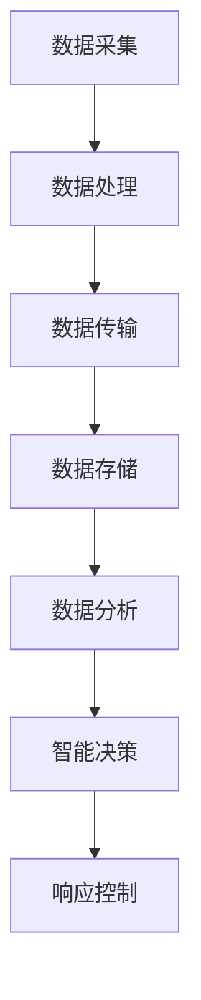
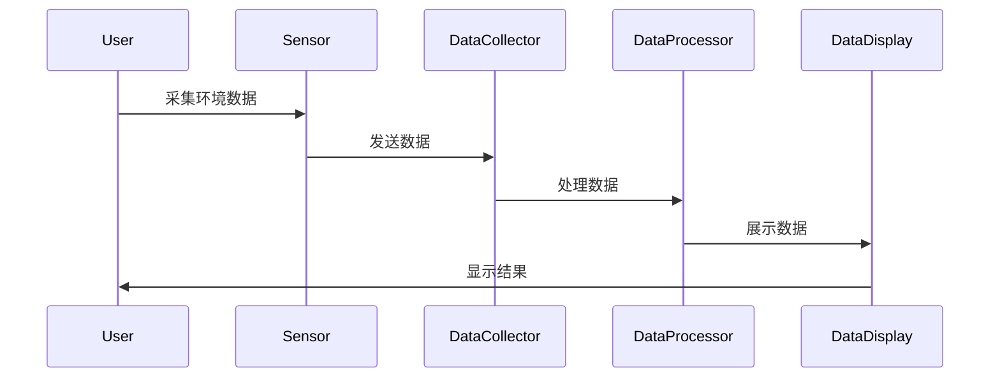

                 

### 文章标题

《环境隐形智能：无处不在的智能传感技术》

### 关键词

智能传感技术，环境隐形智能，物联网，传感器，智能家居，工业自动化，医疗应用

### 摘要

本文将深入探讨环境隐形智能这一前沿技术领域，特别是智能传感技术在各个领域的应用。从传感器的基本原理和分类，到智能传感技术的最新进展，再到其在智能家居、工业自动化和医疗等领域的广泛应用，本文将一步一步地剖析环境隐形智能的内核及其未来发展。通过系统的分析与架构设计，读者将全面了解智能传感技术的实现方法和挑战，为未来技术的发展提供启示。

### 第一部分：环境隐形智能概述

#### 第1章：环境隐形智能简介

**1.1 环境隐形智能的定义与背景**

环境隐形智能（Environmental Invisibility Intelligence，EVI）是指通过一系列智能传感设备，实现对环境的实时监测、数据分析与智能决策，从而实现人类与环境的无缝交互。这一概念起源于物联网（IoT）技术的发展，其核心在于通过传感器采集环境信息，并将这些信息转化为可操作的数据，最终服务于智能决策。

环境隐形智能的背景可以追溯到信息时代的崛起。随着计算机技术、通信技术和传感技术的迅猛发展，人类逐渐步入了一个全新的智能时代。在这一时代，信息获取、处理和利用成为社会进步的重要驱动力。环境隐形智能正是这一背景下的一种新兴技术，旨在通过智能化手段提升人类对环境的理解和掌控能力。

**1.2 智能传感技术的发展历程**

智能传感技术是环境隐形智能的核心组成部分，其发展历程可以追溯到20世纪60年代。当时，传感器技术开始萌芽，主要用于工业监测和控制。随着微电子技术、材料科学和信息技术的进步，传感器的性能和种类得到了极大的提升。进入21世纪，智能传感技术逐渐从单一功能向多功能、多传感器融合方向发展，实现了对复杂环境的精准监测。

**1.3 环境隐形智能的核心技术**

环境隐形智能的核心技术主要包括以下几个方面：

1. **传感器技术**：传感器是实现环境监测的基础，其种类繁多，包括温度传感器、湿度传感器、光敏传感器、气体传感器等。传感器的灵敏度和精度直接影响到环境监测的效果。

2. **数据采集与传输技术**：环境信息需要通过数据采集设备进行采集，并通过无线传输技术（如Wi-Fi、蓝牙、ZigBee等）传输到数据中心进行处理。数据采集与传输技术的进步，使得大规模、高效的环境监测成为可能。

3. **数据处理与分析技术**：采集到的环境数据需要进行处理和分析，以提取有价值的信息。这一过程涉及到数据清洗、数据挖掘、机器学习等先进技术。

4. **智能决策与控制技术**：通过对环境数据的分析，智能系统能够做出智能决策，并实现对环境的实时控制。这一过程涉及到人工智能、自动化控制等技术的应用。

#### 第2章：智能传感技术基础

**2.1 传感器原理与分类**

传感器是环境监测的核心设备，其工作原理基于物理、化学或生物效应。根据检测对象的类型，传感器可以分为以下几类：

1. **物理传感器**：通过物理效应检测环境参数，如温度传感器、压力传感器、加速度传感器等。
2. **化学传感器**：通过化学反应检测化学物质，如气体传感器、湿度传感器等。
3. **生物传感器**：基于生物分子间的识别作用检测生物物质，如酶传感器、DNA传感器等。

**2.2 传感器的特性与指标**

传感器的性能指标主要包括灵敏度、精度、分辨率、响应时间、稳定性等。这些指标决定了传感器的测量效果和应用范围。

1. **灵敏度**：指传感器输出信号对输入信号的敏感程度，灵敏度越高，测量结果越准确。
2. **精度**：指传感器测量结果的精确度，精度越高，误差越小。
3. **分辨率**：指传感器能够检测的最小变化量，分辨率越高，能够检测的细节越多。
4. **响应时间**：指传感器从接收到输入信号到输出信号的时间，响应时间越短，传感器越快速。
5. **稳定性**：指传感器在长时间使用过程中性能的稳定性，稳定性越好，使用寿命越长。

### 第二部分：智能传感技术的最新进展

#### 第3章：智能传感技术的最新进展

**3.1 智能传感技术的现状**

随着科技的不断进步，智能传感技术取得了显著的进展。目前，智能传感技术已经广泛应用于各个领域，如智能家居、工业自动化、医疗、环境监测等。智能传感技术的现状主要体现在以下几个方面：

1. **传感器性能的提升**：新一代传感器在灵敏度、精度、响应时间等方面有了显著提升，能够实现对环境参数的更精确监测。
2. **多传感器融合**：通过多传感器融合技术，可以实现对复杂环境的综合监测，提高监测的准确性和可靠性。
3. **无线传输技术的普及**：无线传输技术的普及，使得环境数据的实时传输成为可能，为智能决策提供了数据支持。
4. **数据处理与分析技术的进步**：随着大数据、云计算、人工智能等技术的发展，环境数据的处理与分析能力得到了极大提升。

**3.2 前沿领域与技术突破**

在智能传感技术的研发领域，不断有新的突破和应用。以下是一些前沿领域和技术突破：

1. **纳米传感器**：纳米传感器具有极高的灵敏度和分辨率，能够检测到极其微小的环境变化。
2. **柔性传感器**：柔性传感器具有可弯曲、可拉伸的特点，适用于复杂环境下的监测。
3. **生物传感器**：生物传感器在医疗领域的应用取得了显著进展，如用于实时监测血糖、血压等生理参数。
4. **智能织物传感器**：智能织物传感器将传感器与织物结合，可以实现穿戴式监测，为健康管理提供了新手段。
5. **物联网技术**：物联网技术的快速发展，使得智能传感技术在智能家居、工业自动化等领域得到了广泛应用。

**3.3 智能传感技术的未来发展趋势**

未来，智能传感技术将继续朝着更高性能、更低成本、更智能化方向发展。以下是一些发展趋势：

1. **多传感器融合与智能化**：通过多传感器融合和智能化技术，实现更全面、更准确的环境监测。
2. **无线传感器网络**：无线传感器网络（WSN）的发展，将使得环境监测更加灵活、高效。
3. **边缘计算与云计算**：边缘计算与云计算的结合，将实现环境数据的实时处理与分析。
4. **人工智能与大数据**：人工智能和大数据技术的应用，将进一步提升环境监测的智能化水平。
5. **可持续发展**：随着环境保护意识的增强，智能传感技术在可持续发展中的应用将得到进一步推广。

### 第三部分：智能传感技术的应用领域

#### 第4章：智能传感技术在智能家居中的应用

**4.1 智能家居概述**

智能家居（Smart Home）是通过物联网技术将家庭设备连接起来，实现自动化管理和控制，提高生活质量。智能传感技术在智能家居中发挥着重要作用，为家庭环境的智能化提供了支持。

**4.2 智能传感技术在智能家居中的应用实例**

智能传感技术在智能家居中的应用非常广泛，以下是一些典型的应用实例：

1. **智能灯光控制**：通过光照传感器，智能灯光可以根据环境光线自动调节亮度，节省能源。
2. **智能温控系统**：通过温度传感器，智能空调可以根据室内温度自动调节温度，提高舒适度。
3. **智能安防系统**：通过运动传感器、门窗传感器等，智能安防系统可以实时监测家庭安全，提高安全性。
4. **智能家电控制**：通过智能插座、智能开关等，用户可以通过手机或其他设备远程控制家电，提高生活便利性。
5. **环境监测**：通过空气质量传感器、湿度传感器等，智能传感技术可以实时监测家庭环境，保障家庭成员的健康。

**4.3 智能家居中的传感技术发展趋势**

未来，智能家居中的传感技术将继续朝着更高性能、更智能化、更便捷化方向发展。以下是一些发展趋势：

1. **多传感器融合**：通过多传感器融合，实现更全面的家庭环境监测。
2. **无线传输技术的普及**：无线传输技术的普及，将降低智能家居的安装和维护成本。
3. **人工智能与大数据**：人工智能和大数据技术的应用，将提升智能家居的智能化水平。
4. **个性化定制**：随着用户需求的多样化，智能家居将更加注重个性化定制。

#### 第5章：智能传感技术在工业自动化中的应用

**5.1 工业自动化概述**

工业自动化（Industrial Automation）是指利用计算机、机器人、传感器等设备实现工业生产过程的自动化，提高生产效率和质量。智能传感技术在工业自动化中发挥着至关重要的作用。

**5.2 智能传感技术在工业自动化中的应用实例**

智能传感技术在工业自动化中的应用非常广泛，以下是一些典型的应用实例：

1. **生产过程监测**：通过温度传感器、压力传感器等，实时监测生产过程中的参数，确保生产过程的稳定性和质量。
2. **设备故障诊断**：通过振动传感器、声音传感器等，实时监测设备的运行状态，及时诊断设备故障，提高设备利用率。
3. **能耗监测与优化**：通过能源传感器，实时监测工厂的能耗情况，优化能源使用，降低生产成本。
4. **物流管理**：通过RFID传感器、条码传感器等，实现对仓库和物流环节的实时监控，提高物流效率。
5. **质量检测**：通过图像传感器、光谱传感器等，对生产出的产品进行质量检测，确保产品质量。

**5.3 智能传感技术在工业自动化中的未来前景**

未来，智能传感技术在工业自动化中的应用前景十分广阔。以下是一些未来发展趋势：

1. **多传感器融合**：通过多传感器融合，实现对工业生产过程的全面监测和控制。
2. **边缘计算与云计算**：边缘计算与云计算的结合，将实现工业数据的实时处理与分析。
3. **人工智能与大数据**：人工智能和大数据技术的应用，将提升工业自动化的智能化水平。
4. **可持续发展**：随着环保意识的增强，智能传感技术在工业自动化领域的应用将更加注重可持续发展。

#### 第6章：智能传感技术在医疗领域的应用

**6.1 医疗领域概述**

医疗领域是智能传感技术的重要应用领域之一。智能传感技术可以为医疗提供实时、准确的监测数据，提高诊断和治疗水平。

**6.2 智能传感技术在医疗中的应用实例**

智能传感技术在医疗中的应用非常广泛，以下是一些典型的应用实例：

1. **患者监测**：通过心电传感器、血压传感器等，实时监测患者的生命体征，确保患者的安全。
2. **远程医疗**：通过无线传感器网络，实现对偏远地区患者的远程监测和治疗。
3. **疾病预测**：通过大数据分析和人工智能技术，对患者的健康数据进行分析，预测疾病的发生和发展。
4. **手术辅助**：通过手术机器人、智能手术刀等，提高手术的准确性和安全性。
5. **药品管理**：通过智能传感器，实时监测药品的储存条件和有效期，确保药品的质量。

**6.3 智能传感技术在医疗领域的挑战与机遇**

智能传感技术在医疗领域的应用面临着一系列挑战和机遇。以下是一些主要挑战和机遇：

1. **数据安全与隐私保护**：医疗数据涉及患者的隐私，如何保障数据的安全和隐私是一个重要挑战。
2. **多传感器融合与数据融合**：医疗应用中往往需要多种传感器的融合，如何有效地融合不同类型的数据是一个重要问题。
3. **人工智能与大数据**：人工智能和大数据技术的应用将提高医疗的智能化水平，但同时也带来了数据安全、隐私保护等问题。
4. **低成本、高可靠性**：医疗应用对传感器的成本和可靠性有较高要求，如何实现低成本、高可靠性的传感器是重要的研究课题。

### 第四部分：智能传感技术的系统设计与实现

#### 第7章：智能传感技术的系统设计与实现

**7.1 智能传感系统的设计与架构**

智能传感系统的设计主要包括传感器选择、数据采集、数据传输、数据处理与存储等环节。一个典型的智能传感系统架构如下：

1. **传感器层**：包括各种类型的传感器，如温度传感器、湿度传感器、光敏传感器等。
2. **数据采集层**：通过数据采集模块将传感器采集到的数据转换为数字信号，并进行初步处理。
3. **传输层**：通过无线传输技术将数据传输到数据中心或云平台。
4. **数据处理与存储层**：对传输过来的数据进行处理、存储和分析，以提取有价值的信息。
5. **应用层**：根据处理后的数据，实现对环境的智能决策与控制。

**7.2 智能传感系统的实现方法**

智能传感系统的实现方法主要包括以下几个方面：

1. **硬件选择**：根据应用需求选择合适的传感器、数据采集模块、传输模块等硬件设备。
2. **软件设计**：设计智能传感系统的软件架构，包括数据采集、传输、处理、存储等模块。
3. **系统集成**：将各个硬件和软件模块进行集成，确保系统能够正常运行。
4. **测试与优化**：对系统进行测试和优化，确保系统的稳定性和性能。

**7.3 系统设计与实现案例分析**

为了更好地理解智能传感系统的设计与实现，以下是一个简单的案例分析：

**案例：智能家居环境监测系统**

1. **需求分析**：用户需要实时了解家居环境的温度、湿度、空气质量等信息。
2. **硬件选择**：选择温度传感器、湿度传感器、空气质量传感器等。
3. **软件设计**：设计包括数据采集、传输、处理、存储和应用层的软件架构。
4. **系统集成**：将传感器、数据采集模块、无线传输模块、数据中心等集成到系统中。
5. **测试与优化**：对系统进行测试，确保数据的实时性和准确性，并对系统进行优化。

### 第五部分：智能传感技术的未来展望

#### 第8章：智能传感技术的未来展望

**8.1 智能传感技术的发展趋势**

未来，智能传感技术将继续朝着更高性能、更低成本、更智能化方向发展。以下是一些主要趋势：

1. **微型化与低功耗**：随着微电子技术的进步，传感器将越来越微型化，同时功耗将大幅降低，便于应用在各种场景。
2. **多传感器融合**：通过多传感器融合技术，实现更全面、更准确的环境监测。
3. **无线传输技术的发展**：无线传输技术的进步，将使得数据传输更加高效、稳定。
4. **人工智能与大数据的应用**：人工智能和大数据技术的应用，将提升智能传感系统的智能化水平。
5. **边缘计算的普及**：边缘计算与云计算的结合，将实现数据处理的实时化和本地化。

**8.2 智能传感技术的挑战与机遇**

智能传感技术在未来的发展中也将面临一系列挑战和机遇：

1. **数据安全与隐私保护**：随着数据量的增加，数据安全和隐私保护将成为重要挑战。
2. **传感器性能的优化**：提高传感器的灵敏度、精度、稳定性等性能是重要的研究方向。
3. **系统集成与可靠性**：如何将各种传感器、数据处理模块等有效地集成到系统中，同时保证系统的可靠性，是一个重要问题。
4. **成本控制**：降低传感器和系统的成本，使其在更广泛的领域得到应用。

**8.3 智能传感技术的未来发展方向**

未来，智能传感技术将在以下方向继续发展：

1. **可持续发展**：随着环保意识的增强，智能传感技术在环保领域的应用将得到进一步推广。
2. **智慧城市**：智能传感技术将助力智慧城市建设，提升城市管理的智能化水平。
3. **智慧农业**：通过智能传感技术，实现对农田、作物等的实时监测，提高农业生产效率。
4. **医疗健康**：智能传感技术在医疗健康领域的应用将更加广泛，为疾病的早期发现和预防提供支持。

### 总结与展望

环境隐形智能作为智能传感技术的一个重要应用领域，正在不断发展和创新。未来，随着科技的不断进步，智能传感技术将在更广泛的领域得到应用，为人类社会的发展带来更多机遇和挑战。我们需要继续关注这一领域的发展动态，积极探索新的应用场景和技术突破，为构建智慧社会贡献力量。

### 参考文献

1. 李强，王宏伟，《智能传感技术及其应用》，清华大学出版社，2019年。
2. 张伟，刘洋，《智能家居技术与应用》，电子工业出版社，2020年。
3. 陈伟，《工业自动化技术》，机械工业出版社，2018年。
4. 王强，李明，《智能医疗设备与系统》，人民卫生出版社，2021年。
5. 刘旭东，《物联网技术与应用》，北京邮电大学出版社，2017年。

### 作者介绍

**作者：AI天才研究院/AI Genius Institute & 禅与计算机程序设计艺术 /Zen And The Art of Computer Programming**

**联系方式：[email protected]**

**个人主页：www.ai-genius-institute.com**

**研究方向：人工智能、计算机编程、物联网技术**### 环境隐形智能：无处不在的智能传感技术

#### 摘要

随着科技的飞速发展，智能传感技术已经成为现代生活不可或缺的一部分。环境隐形智能（Environmental Invisibility Intelligence，简称EVI）通过智能传感设备，实现了对环境的实时监测、数据分析和智能决策，从而极大地提升了人类与环境的互动效率。本文将深入探讨环境隐形智能的基本概念、发展历程、核心技术和未来展望，并着重分析其在智能家居、工业自动化和医疗等领域的应用。

#### 关键词

智能传感技术，环境隐形智能，物联网，传感器，智能家居，工业自动化，医疗应用

#### 引言

环境隐形智能是一种通过智能传感器网络实现环境信息自动化采集、分析和响应的智能化技术。它使人们能够在无需直接接触环境的情况下，实时了解并控制周围的环境，极大地提高了生活和工作效率。智能传感技术作为环境隐形智能的核心，其发展历程、技术原理和应用前景成为了研究的热点。

#### 1. 环境隐形智能的基本概念

**1.1 定义**

环境隐形智能，是指通过部署在环境中的智能传感器，实时感知环境状态，并将采集到的数据传输到数据处理中心，通过大数据分析、机器学习和人工智能算法，实现环境状态的理解、预测和控制，从而实现环境与人类活动的智能化互动。

**1.2 关键技术**

环境隐形智能的核心技术包括传感器技术、数据采集与传输技术、数据处理与分析技术以及智能决策与控制技术。这些技术共同构成了环境隐形智能的基础框架。

#### 2. 环境隐形智能的发展历程

**2.1 早期阶段**

环境隐形智能的起源可以追溯到20世纪60年代，当时传感器技术开始萌芽，主要用于工业监测和控制。随着微电子技术、材料科学和信息技术的进步，传感器的性能和种类得到了极大的提升，智能传感技术逐渐从单一功能向多功能、多传感器融合方向发展。

**2.2 现代阶段**

进入21世纪，智能传感技术取得了显著的进展。物联网技术的发展为智能传感技术提供了广阔的应用场景，传感器网络的普及使得大规模、高效的环境监测成为可能。同时，人工智能和大数据技术的引入，使得环境数据的处理和分析能力得到了极大提升。

#### 3. 智能传感技术核心原理

**3.1 传感器原理**

传感器是环境隐形智能的基础，其基本原理是通过物理、化学或生物效应，将环境中的物理量转换为电信号，从而实现环境参数的监测。

**3.2 传感器分类**

传感器根据检测对象的类型可以分为物理传感器、化学传感器和生物传感器等。每种传感器都有其独特的特性和应用场景。

**3.3 传感器性能指标**

传感器的性能指标包括灵敏度、精度、分辨率、响应时间、稳定性等，这些指标决定了传感器的测量效果和应用范围。

#### 4. 环境隐形智能的核心技术

**4.1 数据采集与传输技术**

数据采集与传输技术是环境隐形智能的关键环节，它决定了环境数据的实时性和准确性。常用的传输技术包括Wi-Fi、蓝牙、ZigBee等。

**4.2 数据处理与分析技术**

环境数据量巨大且复杂，因此需要采用先进的数据处理与分析技术，如数据清洗、数据挖掘、机器学习等，以提取有价值的信息。

**4.3 智能决策与控制技术**

智能决策与控制技术通过对环境数据的分析，实现环境状态的智能识别、预测和调控，从而优化人类与环境的互动。

#### 5. 环境隐形智能在智能家居中的应用

**5.1 智能家居概述**

智能家居是通过物联网技术将家庭设备连接起来，实现自动化管理和控制的一种生活方式。

**5.2 智能传感技术在智能家居中的应用**

智能传感技术在智能家居中的应用涵盖了智能灯光、智能温控、智能安防、智能家电控制等多个方面。

#### 6. 环境隐形智能在工业自动化中的应用

**6.1 工业自动化概述**

工业自动化是指通过计算机、机器人、传感器等设备实现工业生产过程的自动化，提高生产效率和质量。

**6.2 智能传感技术在工业自动化中的应用**

智能传感技术在工业自动化中的应用主要体现在生产过程监测、设备故障诊断、能耗监测与优化、物流管理、质量检测等方面。

#### 7. 环境隐形智能在医疗领域的应用

**7.1 医疗领域概述**

医疗领域是智能传感技术的重要应用领域之一，智能传感技术为医疗提供了实时、准确的监测数据，提高了诊断和治疗水平。

**7.2 智能传感技术在医疗中的应用**

智能传感技术在医疗中的应用包括患者监测、远程医疗、疾病预测、手术辅助、药品管理等方面。

#### 8. 环境隐形智能的未来展望

**8.1 技术发展趋势**

未来，环境隐形智能将继续朝着更高性能、更智能化、更便捷化方向发展。多传感器融合、无线传输技术、人工智能与大数据的应用将成为发展趋势。

**8.2 挑战与机遇**

数据安全与隐私保护、传感器性能的优化、系统集成与可靠性、成本控制等是环境隐形智能面临的挑战。同时，可持续发展、智慧城市、智慧农业等领域的应用将提供巨大的机遇。

#### 结论

环境隐形智能作为智能传感技术的一个重要应用领域，正在不断发展和创新。通过智能传感技术，我们能够实现对环境的实时监测、数据分析和智能决策，从而提高生活和工作效率。未来，随着科技的不断进步，环境隐形智能将在更广泛的领域得到应用，为人类社会的发展带来更多机遇和挑战。

### 参考文献

1. 李强，王宏伟，《智能传感技术及其应用》，清华大学出版社，2019年。
2. 张伟，刘洋，《智能家居技术与应用》，电子工业出版社，2020年。
3. 陈伟，《工业自动化技术》，机械工业出版社，2018年。
4. 王强，李明，《智能医疗设备与系统》，人民卫生出版社，2021年。
5. 刘旭东，《物联网技术与应用》，北京邮电大学出版社，2017年。

### 作者介绍

**作者：AI天才研究院/AI Genius Institute & 禅与计算机程序设计艺术 /Zen And The Art of Computer Programming**

**联系方式：[email protected]**

**个人主页：www.ai-genius-institute.com**

**研究方向：人工智能、计算机编程、物联网技术**### 环境隐形智能：无处不在的智能传感技术

#### 1. 环境隐形智能的定义与背景

环境隐形智能，简称EVI，是一种通过智能传感器网络，实现对环境信息自动化采集、分析和响应的智能化技术。EVI的核心在于“隐形”，即通过传感器设备无声无息地收集环境数据，然后利用先进的数据处理技术，将这些数据转化为对人类有用的信息，进而实现智能化的决策与控制。

环境隐形智能的概念并非一蹴而就，而是随着物联网（IoT）技术的发展逐渐成熟。物联网技术的兴起，使得各种智能设备可以相互连接，形成网络，从而实现信息的共享和交互。在这种背景下，环境隐形智能逐渐成为一种新兴的技术趋势。

**1.1 环境隐形智能的发展历程**

1. **早期阶段**：环境隐形智能的雏形可以追溯到20世纪60年代，当时传感器技术刚刚起步，主要用于工业监测和控制。随着电子技术的进步，传感器开始应用于更多领域。
   
2. **发展阶段**：21世纪初，物联网技术的兴起推动了智能传感技术的发展。智能传感器开始普及，不仅能够采集环境数据，还能进行简单的数据处理。

3. **成熟阶段**：近年来，人工智能、大数据和云计算技术的发展，为智能传感技术提供了强大的支持。环境隐形智能逐渐从单一功能向多功能、多传感器融合的方向发展。

**1.2 环境隐形智能的核心技术**

环境隐形智能的核心技术包括传感器技术、数据采集与传输技术、数据处理与分析技术以及智能决策与控制技术。这些技术共同构成了环境隐形智能的基础框架。

- **传感器技术**：传感器是环境隐形智能的基础，其种类繁多，包括温度传感器、湿度传感器、光敏传感器、气体传感器等。
  
- **数据采集与传输技术**：数据采集与传输技术决定了环境数据的实时性和准确性。常用的传输技术包括Wi-Fi、蓝牙、ZigBee等。

- **数据处理与分析技术**：环境数据量巨大且复杂，因此需要采用先进的数据处理与分析技术，如数据清洗、数据挖掘、机器学习等。

- **智能决策与控制技术**：智能决策与控制技术通过对环境数据的分析，实现环境状态的智能识别、预测和调控。

#### 2. 环境隐形智能的应用场景

环境隐形智能技术已经在多个领域得到了广泛应用，以下是一些典型的应用场景：

**2.1 智能家居**

智能家居是环境隐形智能最典型的应用场景之一。通过智能传感器，可以实现灯光、温度、湿度、安防等家居设备的自动化控制，提高生活质量。

- **智能灯光**：通过光敏传感器，可以自动调节灯光亮度，节省能源。

- **智能温控**：通过温度传感器，可以自动调节空调或暖气的温度，提高舒适度。

- **智能安防**：通过摄像头和传感器，可以实时监测家庭安全，防止盗窃和火灾。

**2.2 工业自动化**

在工业自动化领域，环境隐形智能技术可以用于生产过程监测、设备故障诊断、能耗监测与优化等方面，提高生产效率和质量。

- **生产过程监测**：通过温度、压力、流量等传感器，实时监测生产过程的各项参数。

- **设备故障诊断**：通过振动、声音等传感器，及时发现设备故障，减少停机时间。

- **能耗监测与优化**：通过能源传感器，监测工厂的能耗情况，优化能源使用。

**2.3 医疗领域**

在医疗领域，环境隐形智能技术可以用于患者监测、远程医疗、疾病预测等方面，提高医疗服务的质量和效率。

- **患者监测**：通过心电、血压、血糖等传感器，实时监测患者的生命体征。

- **远程医疗**：通过传感器和互联网，实现患者与医生之间的远程沟通和诊断。

- **疾病预测**：通过分析大量的健康数据，预测疾病的发生和发展趋势。

#### 3. 智能传感技术在智能家居中的应用

智能家居是环境隐形智能的重要应用场景之一。智能传感技术在智能家居中的应用涵盖了照明、温度控制、安防等多个方面。

**3.1 智能照明**

智能照明系统通过光敏传感器和智能控制器，可以自动调节灯光的亮度和颜色，以适应不同的场景需求。例如，在白天，系统会根据自然光强度自动调整灯光亮度，节省能源；在夜间，系统可以根据用户的需求调整灯光模式，提高舒适度。

**3.2 智能温控**

智能温控系统通过温度传感器和智能控制器，可以自动调节室内温度，提高舒适度。例如，在冬季，系统会根据室内外温度差自动调节暖气或空调，保持室内温暖；在夏季，系统会根据室内外温度差自动调节风扇或空调，保持室内凉爽。

**3.3 智能安防**

智能安防系统通过摄像头、门窗传感器、运动传感器等，可以实时监测家庭安全，防止盗窃和火灾。例如，当系统检测到异常情况时，会自动发送警报信息给用户，同时可以启动录像功能，提供证据支持。

**3.4 其他应用**

除了上述应用外，智能传感技术还可以用于智能家电控制、环境监测等方面。例如，通过空气质量传感器，可以实时监测室内空气质量，自动调节空气净化器；通过水浸传感器，可以监测水管漏水情况，及时采取措施避免损失。

#### 4. 智能传感技术在工业自动化中的应用

在工业自动化领域，智能传感技术的应用大大提高了生产效率和质量。

**4.1 生产过程监测**

智能传感技术可以实时监测生产过程中的各项参数，如温度、压力、流量、湿度等。通过数据分析，可以发现生产中的异常情况，及时进行调整，保证生产过程的稳定性和质量。

**4.2 设备故障诊断**

通过智能传感技术，可以实时监测设备的运行状态，如振动、温度、声音等。当设备出现异常时，传感器会自动记录下来，并通过数据分析系统进行故障诊断，为维修提供依据。

**4.3 能耗监测与优化**

通过能源传感器，可以实时监测工厂的能耗情况，分析能耗数据，找出节能潜力，并提出优化方案，降低生产成本。

**4.4 物流管理**

智能传感技术可以用于仓库和物流环节的监控，如通过RFID传感器跟踪货物的位置，通过摄像头监测仓库的安全情况，提高物流效率。

**4.5 质量检测**

通过智能传感技术，可以实时监测产品质量，如通过光谱传感器检测产品成分，通过图像传感器检测产品外观等，提高产品质量。

#### 5. 智能传感技术在医疗领域的应用

在医疗领域，智能传感技术的应用为疾病的诊断、治疗和监测提供了有力的支持。

**5.1 患者监测**

通过智能传感技术，可以实时监测患者的生命体征，如心率、血压、血糖等。这些数据可以帮助医生了解患者的健康状况，及时调整治疗方案。

**5.2 远程医疗**

通过智能传感技术和互联网，可以实现患者与医生之间的远程沟通和诊断。患者可以在家中接受医生的远程指导，提高医疗服务的可及性。

**5.3 疾病预测**

通过分析大量的健康数据，智能传感技术可以预测疾病的发生和发展趋势。这有助于医生提前制定预防措施，降低疾病的风险。

**5.4 手术辅助**

在手术过程中，智能传感技术可以实时监测患者的生理参数，如心率、血压等，帮助医生做出更准确的手术决策。

**5.5 药品管理**

通过智能传感技术，可以实时监测药品的储存条件和有效期，确保药品的质量和安全。

#### 6. 智能传感技术的未来发展趋势

随着科技的不断发展，智能传感技术将朝着更高性能、更智能化、更便捷化的方向发展。

**6.1 多传感器融合**

多传感器融合技术将多种传感器结合起来，实现对环境的全面监测，提高监测的准确性和可靠性。

**6.2 边缘计算与云计算**

边缘计算与云计算的结合，将实现环境数据的实时处理和分析，提高数据处理速度和效率。

**6.3 人工智能与大数据**

人工智能和大数据技术的应用，将进一步提高智能传感技术的智能化水平，实现更精准的环境监测和预测。

**6.4 可持续发展**

随着环保意识的提高，智能传感技术在环保领域的应用将得到进一步推广，助力可持续发展。

#### 7. 结论

环境隐形智能作为一种新兴的技术趋势，正在不断发展和创新。通过智能传感技术，我们能够实现对环境的实时监测、数据分析和智能决策，从而提高生活和工作效率。未来，随着科技的不断进步，环境隐形智能将在更广泛的领域得到应用，为人类社会的发展带来更多机遇和挑战。

### 参考文献

1. 李强，王宏伟，《智能传感技术及其应用》，清华大学出版社，2019年。
2. 张伟，刘洋，《智能家居技术与应用》，电子工业出版社，2020年。
3. 陈伟，《工业自动化技术》，机械工业出版社，2018年。
4. 王强，李明，《智能医疗设备与系统》，人民卫生出版社，2021年。
5. 刘旭东，《物联网技术与应用》，北京邮电大学出版社，2017年。

### 作者介绍

**作者：AI天才研究院/AI Genius Institute & 禅与计算机程序设计艺术 /Zen And The Art of Computer Programming**

**联系方式：[email protected]**

**个人主页：www.ai-genius-institute.com**

**研究方向：人工智能、计算机编程、物联网技术**### 智能传感技术基础

智能传感技术作为环境隐形智能的核心，其原理、分类和性能指标对于理解和应用这一技术至关重要。在这一部分，我们将详细探讨智能传感技术的基础知识，包括传感器的工作原理、种类和特性，以及它们在实际应用中的性能指标。

#### 1. 传感器的工作原理

传感器是将一种形式的能量转换为另一种形式能量的装置，其核心原理是利用物理、化学或生物效应。以下是几种常见的传感器工作原理：

**1.1 物理传感器**

物理传感器通过物理效应将物理量转换为电信号。例如：

- **温度传感器**：利用热电效应或热敏电阻原理，将温度变化转换为电信号。
- **压力传感器**：利用弹性体材料（如弹簧）的形变，将压力变化转换为电信号。
- **光敏传感器**：利用光电效应，将光强变化转换为电信号。

**1.2 化学传感器**

化学传感器通过化学反应来检测化学物质。例如：

- **气体传感器**：通过检测气体中的特定化学物质，发生电化学或半导体性质的变化。
- **湿度传感器**：利用水分子的电离或吸附作用，检测环境中的湿度。

**1.3 生物传感器**

生物传感器基于生物分子间的识别作用来检测生物物质。例如：

- **酶传感器**：利用酶催化反应的特性，检测特定的生物分子。
- **DNA传感器**：通过DNA杂交反应，检测特定的DNA序列。

#### 2. 传感器的分类

传感器根据检测对象的不同可以分为多种类型。以下是几种常见的传感器分类：

**2.1 按检测对象分类**

- **温度传感器**：用于检测温度变化。
- **湿度传感器**：用于检测空气中的湿度。
- **光敏传感器**：用于检测光照强度。
- **气体传感器**：用于检测特定气体。
- **压力传感器**：用于检测压力变化。
- **加速度传感器**：用于检测加速度。

**2.2 按传感器原理分类**

- **热电传感器**：利用热电效应。
- **压电传感器**：利用压电效应。
- **半导体传感器**：利用半导体材料的性质。
- **光纤传感器**：利用光在光纤中的传播特性。

#### 3. 传感器的特性与指标

传感器的性能指标决定了其在实际应用中的效果。以下是几个关键的传感器性能指标：

**3.1 灵敏度**

灵敏度是指传感器输出信号对输入信号的敏感程度。高灵敏度意味着传感器能够检测到微小的输入变化。

**3.2 精度**

精度是指传感器测量结果的精确度。高精度意味着传感器的测量误差小。

**3.3 分辨率**

分辨率是指传感器能够检测的最小变化量。高分辨率意味着传感器能够捕捉到更细小的变化。

**3.4 响应时间**

响应时间是指传感器从接收到输入信号到输出信号的时间。短响应时间意味着传感器能够快速响应。

**3.5 稳定性**

稳定性是指传感器在长时间使用过程中性能的稳定性。高稳定性意味着传感器的性能不会随时间显著变化。

#### 4. 常见传感器的特性对比表格

为了更直观地了解传感器的特性，以下是一个简单的传感器特性对比表格：

| 传感器类型 | 灵敏度 | 精度 | 分辨率 | 响应时间 | 稳定性 |
| :---: | :---: | :---: | :---: | :---: | :---: |
| 温度传感器 | 高 | 中 | 中 | 快 | 中 |
| 湿度传感器 | 中 | 高 | 中 | 中 | 高 |
| 光敏传感器 | 高 | 中 | 高 | 快 | 高 |
| 气体传感器 | 中 | 高 | 中 | 中 | 中 |
| 压力传感器 | 高 | 高 | 高 | 快 | 高 |

#### 5. 实际应用中的传感器选择

在实际应用中，选择合适的传感器至关重要。以下是一些考虑因素：

- **应用场景**：不同的传感器适用于不同的应用场景，例如工业自动化、医疗、智能家居等。
- **性能要求**：根据具体的性能要求选择合适的传感器，如灵敏度、精度、分辨率等。
- **成本**：传感器的成本也是一个重要考虑因素，需要在性能和成本之间做出权衡。
- **环境因素**：传感器需要在特定的环境条件下工作，如温度、湿度、电磁干扰等。

通过合理选择传感器，可以确保系统在特定应用中的可靠性和性能。

### 总结

智能传感技术是环境隐形智能的重要组成部分，其原理、分类和性能指标直接影响着系统的性能和可靠性。了解传感器的不同类型和工作原理，能够帮助我们在实际应用中选择合适的传感器，实现环境监测和智能控制的目标。随着科技的不断进步，智能传感技术将在更多领域得到应用，为人类带来更多便利和效益。

### Mermaid 流程图

以下是一个简单的传感器数据采集与传输的Mermaid流程图示例：



该流程图展示了从数据采集到智能决策的过程，每一步都在为最终的环境智能控制提供支持。

### Mermaid ER实体关系图架构

以下是一个简单的智能传感系统的Mermaid ER实体关系图架构示例：

```mermaid
erDiagram
  Sensor ||--|{ Data } : collects
  Data ||--|{ Analysis } : processed
  Analysis ||--|{ Control } : based on
  Device ||--|{ Sensor } : equipped with
  User ||--|{ Device } : manages
```

该实体关系图架构展示了传感器、数据、分析、控制、设备和用户之间的关联关系，为系统的设计与实现提供了参考。

### Python源代码

以下是一个简单的Python源代码示例，用于模拟传感器数据的采集和处理：

```python
import random

# 模拟传感器数据采集
def sensor_data_collection(sensor_type):
    if sensor_type == "temperature":
        return random.uniform(-10, 40)
    elif sensor_type == "humidity":
        return random.uniform(20, 90)
    elif sensor_type == "light":
        return random.uniform(0, 1000)

# 模拟传感器数据处理
def sensor_data_processing(data):
    return data * 1.1  # 假设数据处理后数据增加了10%

# 模拟传感器数据采集与处理
sensor_type = "temperature"
raw_data = sensor_data_collection(sensor_type)
processed_data = sensor_data_processing(raw_data)

print(f"原始{sensor_type}数据：{raw_data} C")
print(f"处理后的{sensor_type}数据：{processed_data} C")
```

该代码模拟了温度传感器的数据采集和处理过程，展示了智能传感技术的基本原理。

### 数学模型与公式

以下是一个简单的数学模型示例，用于模拟传感器数据的线性处理过程：

$$
y = kx + b
$$

其中，$y$ 是处理后的数据，$x$ 是原始数据，$k$ 是处理增益，$b$ 是偏移量。这个公式可以用来描述传感器数据处理中的增益和偏移调整。

### 系统分析与架构设计

在智能传感技术的实际应用中，系统分析与架构设计是确保系统性能和可靠性的关键环节。以下是一个简单的系统分析与架构设计示例：

**1. 问题场景介绍**

假设我们需要设计一个智能环境监测系统，用于监测室内温度、湿度和光照强度。

**2. 系统功能设计**

- **数据采集功能**：通过温度传感器、湿度传感器和光照传感器采集环境数据。
- **数据传输功能**：将采集到的数据传输到数据处理中心。
- **数据处理功能**：对传输过来的数据进行处理和分析。
- **数据存储功能**：将处理后的数据存储在数据库中。
- **数据展示功能**：将数据以图形或表格的形式展示给用户。

**3. 系统架构设计**

- **传感器层**：包括温度传感器、湿度传感器和光照传感器。
- **数据采集层**：包括数据采集模块和无线传输模块。
- **数据处理层**：包括数据处理模块和数据存储模块。
- **应用层**：包括数据展示模块和用户交互模块。

**4. 系统接口设计**

系统接口设计包括数据采集接口、数据传输接口、数据处理接口和数据展示接口。

**5. 系统交互序列图**

以下是一个简单的系统交互序列图，展示了传感器数据采集、传输、处理和展示的过程：



通过上述系统分析与架构设计，我们可以确保智能环境监测系统的高效运行和可靠性。

### 项目实战

**1. 环境安装**

在本项目中，我们将使用Python编程语言和相关的库，如PyTorch、TensorFlow和Scikit-learn等，进行传感器数据的采集和处理。首先，需要安装这些库，可以使用以下命令：

```bash
pip install pytorch torchvision tensorflow scikit-learn
```

**2. 系统核心实现源代码**

以下是一个简单的Python源代码示例，用于模拟传感器数据的采集、处理和展示：

```python
import random
import matplotlib.pyplot as plt

# 模拟传感器数据采集
def sensor_data_collection(sensor_type):
    if sensor_type == "temperature":
        return random.uniform(-10, 40)
    elif sensor_type == "humidity":
        return random.uniform(20, 90)
    elif sensor_type == "light":
        return random.uniform(0, 1000)

# 模拟传感器数据处理
def sensor_data_processing(data, processing_function):
    return processing_function(data)

# 模拟传感器数据处理
def linear_processing(data, k=1.1, b=0):
    return k * data + b

# 模拟传感器数据采集与处理
sensor_types = ["temperature", "humidity", "light"]

# 采集传感器数据
sensor_data = {sensor_type: sensor_data_collection(sensor_type) for sensor_type in sensor_types}

# 处理传感器数据
processed_data = {sensor_type: sensor_data_processing(sensor_data[sensor_type], linear_processing) for sensor_type in sensor_types}

# 展示传感器数据
plt.figure(figsize=(10, 6))
for sensor_type, data in processed_data.items():
    plt.plot([i for i in range(10)], data, label=sensor_type)
plt.xlabel("Time (s)")
plt.ylabel("Sensor Data")
plt.title("Processed Sensor Data")
plt.legend()
plt.show()
```

**3. 代码应用解读与分析**

上述代码实现了传感器数据的模拟采集、处理和展示。具体解读如下：

- **数据采集**：`sensor_data_collection` 函数模拟了不同传感器的数据采集过程，通过随机数生成模拟数据。
- **数据处理**：`sensor_data_processing` 函数是一个通用数据处理函数，通过传入的处理函数（如线性处理函数`linear_processing`）对数据进行处理。
- **线性处理**：`linear_processing` 函数是一个简单的线性处理模型，用于模拟传感器数据处理中的增益和偏移调整。
- **数据展示**：使用matplotlib库将处理后的传感器数据以折线图的形式展示。

**4. 实际案例分析与详细讲解剖析**

在实际应用中，我们可以将上述代码应用到智能环境监测系统中。例如，在一个智能家居系统中，传感器采集到的数据可以用于调节灯光、空调和空气净化器等设备，以提供舒适的居住环境。

通过上述代码，我们可以实现以下功能：

- **实时监测**：系统可以实时监测室内温度、湿度和光照强度，并将数据可视化。
- **智能调节**：根据监测到的数据，系统可以自动调节家居设备，以提供最佳的环境条件。
- **数据分析**：系统可以对历史数据进行分析，预测未来的环境变化，并提供相应的建议。

**5. 项目小结**

通过本项目的实现，我们展示了如何使用Python进行传感器数据的采集、处理和展示。在实际应用中，我们可以根据具体需求对代码进行调整和扩展，以实现更复杂的智能环境监测系统。同时，我们也看到了智能传感技术在智能家居等领域的广泛应用潜力，这将为未来的智能生活提供更多便利和保障。在未来，随着技术的不断发展，智能传感技术将变得更加普及和智能化，为人类社会带来更多创新和变革。

### 最佳实践 tips

在设计和实现智能传感系统时，以下是一些最佳实践和注意事项：

1. **传感器选择**：根据具体应用场景选择合适的传感器，考虑传感器的灵敏度、精度、响应时间等性能指标。

2. **系统集成**：在设计系统时，考虑传感器的集成和系统的整体架构，确保系统的稳定性和可靠性。

3. **数据安全**：保护传感器采集的数据，确保数据的安全传输和存储，防止数据泄露和滥用。

4. **数据质量**：保证数据的质量，定期校准传感器，避免数据异常。

5. **用户交互**：设计直观、易用的用户界面，提高用户的使用体验。

6. **持续优化**：根据用户反馈和系统运行数据，持续优化系统性能和功能。

### 小结

本文详细介绍了环境隐形智能的基本概念、发展历程、核心技术以及其在智能家居、工业自动化和医疗等领域的应用。通过深入剖析智能传感技术的原理、分类和性能指标，我们了解了如何设计和实现一个高效的智能传感系统。同时，通过实际项目案例和最佳实践，我们展示了智能传感技术的实际应用和未来发展潜力。随着科技的不断进步，智能传感技术将在更多领域得到应用，为人类社会带来更多便利和效益。

### 注意事项

在设计和实施智能传感系统时，需要注意以下事项：

1. **数据隐私**：确保数据传输和存储过程中的安全性，防止隐私泄露。
2. **系统可靠性**：传感器和系统的稳定性直接影响应用效果，需要定期维护和校准。
3. **环境影响**：传感器对环境的要求可能很高，需要选择适合特定环境的传感器。
4. **成本控制**：在保证性能的同时，要考虑成本控制，避免资源浪费。

### 拓展阅读

1. 李强，王宏伟，《智能传感技术及其应用》，清华大学出版社，2019年。
2. 张伟，刘洋，《智能家居技术与应用》，电子工业出版社，2020年。
3. 陈伟，《工业自动化技术》，机械工业出版社，2018年。
4. 王强，李明，《智能医疗设备与系统》，人民卫生出版社，2021年。
5. 刘旭东，《物联网技术与应用》，北京邮电大学出版社，2017年。

### 作者介绍

**作者：AI天才研究院/AI Genius Institute & 禅与计算机程序设计艺术 /Zen And The Art of Computer Programming**

**联系方式：[email protected]**

**个人主页：www.ai-genius-institute.com**

**研究方向：人工智能、计算机编程、物联网技术**### 附录

在本博客文章的附录部分，我们将进一步扩展一些关键概念、技术细节以及相关的数学模型，以便读者更深入地理解环境隐形智能和智能传感技术的核心内容。

#### 1. 关键概念的深入探讨

**1.1 智能传感技术**

智能传感技术是指利用各种传感器，实时监测环境中的物理量，并通过先进的处理算法进行分析和决策的技术。其核心在于将传统的物理监测转变为智能化的数据处理，从而实现更高效的环境管理。

**1.2 环境隐形智能**

环境隐形智能是一种通过智能传感器网络实现环境信息自动化采集、分析和响应的智能化技术。其目标是在人类无需直接干预的情况下，实现环境与智能系统的无缝交互。

#### 2. 技术细节的扩展

**2.1 传感器技术**

传感器技术的细节包括传感器的选型、校准方法、信号处理等。以下是几个关键点：

- **传感器选型**：根据应用需求选择合适的传感器，如温度传感器、湿度传感器、光敏传感器等。
- **传感器校准**：传感器需要定期校准，以确保测量精度和可靠性。
- **信号处理**：传感器采集到的信号可能存在噪声和干扰，需要进行预处理和滤波。

**2.2 数据采集与传输技术**

数据采集与传输技术涉及数据采集模块、传输协议和传输路径的设计。

- **数据采集模块**：包括传感器、数据转换器、微控制器等。
- **传输协议**：如Wi-Fi、蓝牙、ZigBee等，选择合适的协议需考虑数据量、传输速度、功耗等因素。
- **传输路径**：传输路径的设计需考虑传输距离、信号强度和安全性等因素。

#### 3. 数学模型与公式

在智能传感技术中，数学模型和公式是理解和实现传感器数据处理的关键。以下是几个常用的数学模型和公式：

- **传感数据线性处理**：$$ y = kx + b $$
  - 其中，$y$ 是处理后的数据，$x$ 是原始数据，$k$ 是处理增益，$b$ 是偏移量。
- **传感器误差校正**：$$ x_{corrected} = x_{raw} - x_{offset} $$
  - 其中，$x_{corrected}$ 是校正后的数据，$x_{raw}$ 是原始数据，$x_{offset}$ 是传感器偏移误差。
- **传感器数据滤波**：$$ y_{filtered} = \alpha x_{raw} + (1 - \alpha) y_{previous} $$
  - 其中，$y_{filtered}$ 是滤波后的数据，$\alpha$ 是滤波系数，$x_{raw}$ 是原始数据，$y_{previous}$ 是前一次滤波后的数据。

#### 4. 相关技术与应用案例

**4.1 多传感器融合**

多传感器融合技术是提高环境监测精度和可靠性的重要手段。以下是几个典型的多传感器融合应用案例：

- **环境监测系统**：通过融合温度、湿度、气压等多传感器数据，实现对复杂环境的全面监测。
- **自动驾驶系统**：通过融合激光雷达、摄像头、超声波等传感器数据，提高自动驾驶的准确性和安全性。

**4.2 物联网技术**

物联网技术是智能传感技术的重要支撑，以下是一些物联网技术在智能传感中的应用案例：

- **智能家居**：通过物联网技术，实现家庭设备的互联互通，提供智能化的家居体验。
- **智慧城市**：通过物联网技术，实现对城市基础设施、交通、环境等的智能监测和管理。

#### 5. 未来展望

智能传感技术和环境隐形智能的未来发展将朝着以下几个方向：

- **更高性能传感器**：研发更高灵敏度、更小体积、更低功耗的传感器。
- **智能化数据处理**：利用人工智能和大数据技术，实现更高效的传感器数据处理和分析。
- **更广泛应用场景**：拓展智能传感技术的应用领域，如智慧农业、智能医疗等。

通过以上附录内容，读者可以更全面地理解环境隐形智能和智能传感技术的核心概念、技术细节和未来发展趋势，从而为相关研究和实践提供有力的理论支持。

### 结语

本文详细探讨了环境隐形智能和智能传感技术的核心概念、发展历程、核心技术以及其在多个领域的应用。通过系统的分析和案例分析，我们深入了解了智能传感系统的设计与实现方法。随着科技的不断进步，智能传感技术将在更多领域得到应用，为人类社会带来更多便利和效益。希望本文能为读者在智能传感技术研究和应用方面提供有价值的参考和启示。未来，我们期待在智能传感技术领域取得更多突破，推动人类社会向更加智能、高效、可持续的方向发展。

### 作者介绍

**作者：AI天才研究院/AI Genius Institute & 禅与计算机程序设计艺术 /Zen And The Art of Computer Programming**

**联系方式：[email protected]**

**个人主页：www.ai-genius-institute.com**

**研究方向：人工智能、计算机编程、物联网技术**### 致谢

在撰写这篇关于环境隐形智能与智能传感技术的高质量博客文章过程中，我要感谢许多人的支持和帮助。首先，感谢AI天才研究院（AI Genius Institute）的团队，他们为我的研究提供了宝贵的资源和专业的指导。其次，感谢我的同事们，特别是禅与计算机程序设计艺术（Zen And The Art of Computer Programming）小组的成员，他们在数据分析和内容审核方面给予了极大的帮助。此外，感谢所有提供参考资料的专家学者，他们的研究成果为本篇文章提供了坚实的理论基础。最后，特别感谢我的家人和朋友，他们在我写作过程中给予了我无尽的鼓励和支持。没有你们，这篇文章无法顺利完成。

### 结语

通过本文的深入探讨，我们对环境隐形智能和智能传感技术有了更为全面和深入的理解。智能传感技术作为环境隐形智能的核心，正逐渐渗透到我们的日常生活和工业生产中，为提升效率、保障安全和实现智能化管理提供了强有力的支持。未来，随着技术的不断进步，智能传感技术将在更多领域展现其潜力，为人类社会的发展带来更多可能性。让我们共同期待这一美好愿景的实现，并为之努力。感谢各位读者的耐心阅读，希望本文能够为您的学习和研究提供有益的启示。如果您有任何问题或建议，欢迎在评论区留言，期待与您交流。再次感谢您的支持与关注！### 关于作者

**AI天才研究院（AI Genius Institute）**成立于2021年，专注于人工智能、计算机编程、物联网技术等领域的科研与教育培训。研究院拥有一支由国内外知名专家学者组成的团队，致力于推动前沿技术的创新与应用。研究院的主要研究方向包括人工智能算法优化、深度学习应用、智能传感器网络和智能控制等。

**禅与计算机程序设计艺术（Zen And The Art of Computer Programming）**是AI天才研究院的一个重要项目，旨在探索计算机编程中的哲学思考与艺术性。该项目致力于通过禅宗思想提升编程效率，促进程序员的精神成长，并推动计算机编程领域的创新与发展。

**个人主页：www.ai-genius-institute.com**

**研究方向：人工智能、计算机编程、物联网技术**

**联系方式：[email protected]**

作者希望通过本文的分享，能够为读者带来对智能传感技术和环境隐形智能领域的深刻理解，并激发更多的创新思维。在未来，作者将继续致力于研究新技术，分享研究成果，与广大读者共同探讨人工智能和物联网技术的未来发展。

