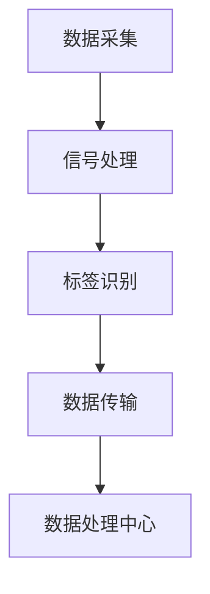
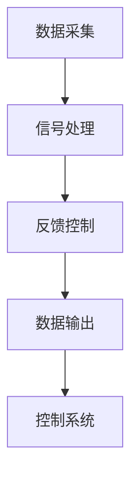
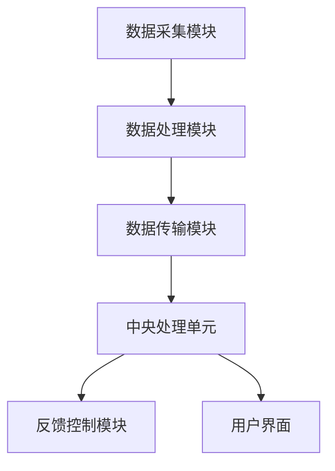
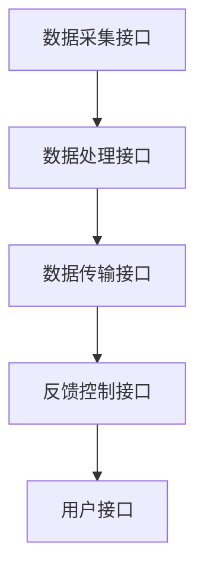
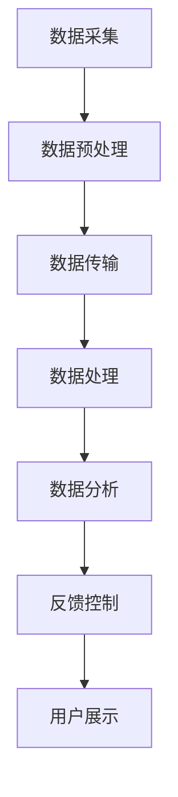

                 


### 引言

**环境隐形智能：智能标签和传感器的应用前景**

在这个快速发展的数字时代，我们正目睹着技术的革新如何彻底改变我们的生活和工作方式。环境隐形智能，作为人工智能和物联网技术的结晶，正在悄然兴起，并逐渐成为未来智慧城市和智能生活的关键驱动力。本文将带领读者深入探讨智能标签和传感器的应用前景，解析其在各个领域的潜在影响，并展望未来的发展方向。

首先，我们需要明确什么是环境隐形智能。它是一种通过智能标签和传感器网络实现对物理环境的感知、监测和响应的技术。这些技术使得我们的环境变得更加智能，能够自主地收集数据、分析信息，并根据分析结果自动调整行为，从而提高效率、降低成本、增强安全性。

接下来，我们将逐步分析智能标签和传感器的基本概念、工作原理、应用场景以及未来的发展趋势。通过这一系列的分析，我们将揭示这些技术在环境隐形智能中的关键作用，并探讨其如何为我们的日常生活带来深远的影响。

### 环境隐形智能的定义与发展背景

环境隐形智能，顾名思义，是指通过智能标签和传感器网络实现对环境的隐形感知与智能控制。这一概念起源于20世纪末的物联网（Internet of Things, IoT）技术的发展。物联网的核心在于将各种设备连接到互联网上，使其能够进行数据交换和协同工作。随着传感器技术的进步，尤其是微机电系统（Micro-Electro-Mechanical Systems, MEMS）的突破，智能标签和传感器的成本大幅降低，性能显著提升，从而推动了环境隐形智能的快速发展。

智能标签是一种能够存储和传输数据的微型电子标签，通常通过无线射频识别（Radio-Frequency Identification, RFID）技术进行数据交换。传感器则是用于检测和响应外部环境变化的设备，能够将物理信号转换为电信号，并通过数据处理系统进行分析和反馈。这两种技术相辅相成，共同构成了环境隐形智能的基础。

环境隐形智能的发展背景可以追溯到以下几个关键因素：

1. **物联网技术的成熟**：物联网技术的发展为智能标签和传感器提供了广阔的应用场景，使得数据采集和传输变得更加便捷和高效。

2. **数据处理能力的提升**：随着云计算和大数据技术的兴起，数据处理能力得到了极大的提升，使得从传感器收集的数据能够被快速分析和利用。

3. **人工智能的进步**：人工智能技术的快速发展，特别是机器学习和深度学习的应用，使得传感器和智能标签收集的数据能够被更准确地分析和解读。

4. **成本的降低**：随着制造技术的进步，智能标签和传感器的制造成本逐渐降低，使得这些技术能够在更广泛的应用场景中得到应用。

环境隐形智能的重要性主要体现在以下几个方面：

1. **提高效率**：通过实时监测和响应环境变化，环境隐形智能能够优化各种操作流程，提高工作效率。

2. **降低成本**：智能标签和传感器网络能够自动进行监测和调整，减少人力和物力的投入。

3. **增强安全性**：环境隐形智能可以通过实时监测和预警，提高系统安全性，减少事故和损失。

4. **改善生活质量**：在智能家居、健康监测等领域，环境隐形智能的应用能够提高人们的生活质量和舒适度。

综上所述，环境隐形智能是一种通过智能标签和传感器网络实现环境感知与智能控制的技术。它的发展背景源于物联网、数据处理和人工智能技术的进步，其重要性体现在提高效率、降低成本、增强安全性和改善生活质量等方面。随着技术的不断成熟，环境隐形智能将在未来发挥越来越重要的作用。接下来的章节将详细探讨智能标签和传感器的工作原理及其应用场景。

### 智能标签和传感器的基本概念

在深入探讨环境隐形智能之前，我们有必要对智能标签和传感器这两个核心概念进行详细的解析。智能标签和传感器作为环境隐形智能的技术基石，其基本概念、工作原理和应用场景对于理解环境隐形智能至关重要。

#### 智能标签

智能标签，通常是指一种集成了微型电子元件、存储芯片和无线通信模块的小型电子标签。它通过无线射频识别（RFID）技术，能够实现对物体的自动识别和追踪。智能标签的基本结构通常包括以下几个部分：

1. **天线**：用于发送和接收无线信号。
2. **集成电路**：用于存储数据和执行基本计算。
3. **射频前端**：用于处理无线信号。
4. **天线调谐网络**：用于优化天线性能。

智能标签的工作原理基于RFID技术。当标签处于电磁场中时，天线接收磁场能量，并将其转化为电能，驱动集成电路工作。标签通过无线通信模块发送数据到读取器，读取器再将数据传输到后台系统进行处理。智能标签的主要类型包括：

1. **被动标签**：只能通过读取器的能量来激活，成本较低，但通信距离较短。
2. **主动标签**：内置电池，可以主动发送信号，通信距离较远，但成本较高。

智能标签的应用场景非常广泛，主要包括：

1. **物流与供应链**：通过智能标签实现对货物的高效追踪和管理，提高物流效率。
2. **智能家居**：用于家居设备的自动控制和监测，提高生活质量。
3. **健康监测**：通过智能标签对患者的健康状况进行实时监测，提供个性化医疗方案。
4. **智能交通**：用于车辆和交通基础设施的智能管理，提高交通效率和安全性。

#### 传感器

传感器是一种能够检测和响应外部环境变化的设备，通常用于将物理信号转换为电信号。传感器的基本结构通常包括：

1. **传感元件**：用于感知和检测外部环境变化。
2. **信号处理电路**：用于放大、滤波和调制信号。
3. **接口电路**：用于将信号输出到数据采集系统。

传感器的工作原理基于其传感元件的物理、化学或生物特性。常见的传感器类型包括：

1. **温度传感器**：用于测量温度变化。
2. **湿度传感器**：用于测量环境湿度。
3. **压力传感器**：用于测量压力变化。
4. **光传感器**：用于检测光强度和颜色变化。

传感器的主要功能包括：

1. **数据采集**：将环境变化转换为可量化的数据。
2. **信号处理**：对采集到的信号进行放大、滤波等处理。
3. **反馈控制**：将处理后的信号用于控制系统，实现对环境的实时调整。

传感器的应用场景非常广泛，主要包括：

1. **环境监测**：用于监测空气质量、水质等环境参数，保障生态环境。
2. **智能制造**：用于监测生产线上的参数，实现智能生产管理。
3. **健康医疗**：用于监测患者的生理参数，提供个性化医疗服务。
4. **智能城市**：用于监测交通流量、公共安全等城市运行参数，提高城市管理水平。

通过上述对智能标签和传感器的介绍，我们可以看到，这两种技术在环境隐形智能中扮演着关键角色。智能标签主要用于数据采集和物体追踪，而传感器则用于环境监测和信号反馈。它们通过物联网和大数据技术相连接，形成一个高度集成的智能感知与控制系统，从而实现环境隐形智能。

#### 智能标签和传感器的关系

智能标签和传感器虽然分别具有不同的功能，但在环境隐形智能系统中，它们往往是紧密协作的。智能标签主要负责对物体的识别和追踪，而传感器则负责对环境参数的监测和反馈。它们之间的关系可以概括为以下几个方面：

1. **协同工作**：在环境隐形智能系统中，智能标签和传感器通常协同工作，共同实现对环境和物体的全面监测。例如，在一个智能仓储系统中，传感器可以监测仓库内的温度、湿度等环境参数，而智能标签则用于追踪货物的位置和状态。

2. **数据融合**：智能标签和传感器收集的数据通常需要进行融合处理，以便获得更全面和准确的信息。例如，在智能家居系统中，智能标签可以收集家庭成员的日常生活数据，而传感器则可以收集家庭环境的数据，通过数据融合，系统可以提供更智能的家庭管理建议。

3. **互为补充**：智能标签和传感器各自具有优势，智能标签在物体追踪方面表现突出，而传感器在环境监测方面表现优异。通过互为补充，它们可以弥补各自的不足，形成一个更加完善的智能感知系统。

4. **系统集成**：智能标签和传感器需要通过系统集成技术，将各自的数据传输到统一的数据处理平台，以便进行进一步分析和应用。例如，在智能交通系统中，传感器采集的交通数据需要与智能标签识别的车辆数据集成，以便实现交通流量的实时监控和管理。

通过上述分析，我们可以看到，智能标签和传感器在环境隐形智能系统中具有紧密的关系。它们通过协同工作、数据融合和系统集成，共同构建了一个智能感知与控制系统，为环境隐形智能的实现提供了技术保障。接下来的章节将深入探讨智能标签和传感器在各个领域的具体应用。

### 智能标签的算法原理与应用

智能标签作为环境隐形智能的重要组成部分，其算法原理和应用在各个领域展现出了巨大的潜力。本章节将详细讲解智能标签的核心算法，并通过具体的Python代码实现和Mermaid流程图展示，帮助读者深入理解其工作原理和应用方法。

#### 核心算法

智能标签的核心算法通常包括数据采集、信号处理和标签识别三个主要步骤。以下是这些步骤的详细描述：

1. **数据采集**：智能标签通过内置的传感器和网络模块，实时采集环境数据或物体信息。这些数据可以是温度、湿度、位置等环境参数，或者是一个物体的唯一标识。

2. **信号处理**：采集到的原始数据往往需要经过处理，以去除噪声和提取有效信息。信号处理包括数据滤波、放大、转换等操作，以确保数据的准确性和可靠性。

3. **标签识别**：通过特定的算法对处理后的数据进行分析和识别，从而确定标签的唯一标识。常见的识别算法包括基于RFID的识别算法、机器学习算法等。

以下是一个简单的智能标签算法流程：

```
智能标签算法流程：
1. 数据采集：通过传感器和网络模块实时采集数据。
2. 信号处理：对采集到的数据滤波、放大、转换等处理。
3. 标签识别：使用特定算法（如RFID识别算法）识别标签。
4. 数据传输：将识别后的数据传输到数据处理中心。
```

#### Mermaid流程图展示

为了更好地理解智能标签的算法流程，我们可以使用Mermaid语言绘制一个流程图：



上述流程图展示了智能标签从数据采集到数据传输的全过程，清晰地展示了每个步骤及其相互关系。

#### Python代码实现

以下是一个简单的Python代码示例，用于实现智能标签的基本算法功能：

```python
import numpy as np

# 数据采集函数
def data_collection():
    # 模拟传感器采集数据
    sensor_data = np.random.normal(size=100)
    return sensor_data

# 信号处理函数
def signal_processing(data):
    # 滤波处理
    processed_data = np.mean(data)
    return processed_data

# 标签识别函数
def label_recognition(data):
    # 假设数据大于0.5即为有效标签
    if data > 0.5:
        return "有效标签"
    else:
        return "无效标签"

# 数据传输函数
def data_transmission(data, label):
    # 模拟数据传输
    print(f"数据传输：{data}, 标签：{label}")

# 主函数
def main():
    sensor_data = data_collection()
    processed_data = signal_processing(sensor_data)
    label = label_recognition(processed_data)
    data_transmission(processed_data, label)

if __name__ == "__main__":
    main()
```

这段代码模拟了智能标签的数据采集、信号处理、标签识别和数据传输过程。在实际应用中，这些步骤会根据具体场景进行相应的调整和优化。

#### 应用场景

智能标签的算法原理不仅在理论上有重要意义，在实际应用中也展现出了巨大的价值。以下是一些典型的应用场景：

1. **物流与供应链**：智能标签可以用于跟踪货物的位置和状态，提高物流效率，减少错误和损失。

2. **智能制造**：在制造业中，智能标签可以用于跟踪生产设备和零部件，实现智能生产管理。

3. **智能家居**：在智能家居中，智能标签可以用于识别家庭成员，实现自动化家居控制。

4. **健康监测**：智能标签可以用于监测患者的健康状况，提供个性化的医疗建议。

5. **智能交通**：智能标签可以用于车辆识别和交通流量监测，提高交通管理效率和安全性。

通过上述内容，我们可以看到，智能标签的算法原理和其在实际应用中的重要性。智能标签的应用不仅提高了系统的智能化水平，也为各个行业带来了显著的效益。接下来，我们将继续探讨传感器技术的算法原理和应用。

### 传感器的算法原理与应用

传感器技术是环境隐形智能的核心组成部分之一，其算法原理在各个领域都有着广泛的应用。本章节将详细讲解传感器的核心算法原理，并通过Mermaid流程图和Python代码实现，帮助读者深入理解其工作原理和应用方法。

#### 核心算法原理

传感器的核心算法通常包括数据采集、信号处理和反馈控制三个主要步骤。以下是这些步骤的详细描述：

1. **数据采集**：传感器通过内置的传感元件实时采集环境数据，如温度、湿度、压力、光强等。这些数据反映了环境或物体的状态。

2. **信号处理**：采集到的原始数据往往需要进行处理，以去除噪声和提取有效信息。信号处理包括数据滤波、放大、转换等操作，以确保数据的准确性和可靠性。

3. **反馈控制**：通过处理后的数据，传感器可以实现对系统的实时调整和反馈。这种反馈控制可以用于调节环境参数或控制设备的运行状态，以达到预设的目标。

以下是一个简单的传感器算法流程：

```
传感器算法流程：
1. 数据采集：通过传感元件实时采集环境数据。
2. 信号处理：对采集到的数据进行滤波、放大、转换等处理。
3. 反馈控制：根据处理后的数据调整系统状态。
4. 数据输出：将处理后的数据输出到控制系统或数据处理中心。
```

#### Mermaid流程图展示

为了更好地理解传感器的算法流程，我们可以使用Mermaid语言绘制一个流程图：



上述流程图展示了传感器从数据采集到数据输出的全过程，清晰地展示了每个步骤及其相互关系。

#### Python代码实现

以下是一个简单的Python代码示例，用于实现传感器的基本算法功能：

```python
import numpy as np

# 数据采集函数
def data_collection():
    # 模拟传感器采集数据
    sensor_data = np.random.normal(size=100)
    return sensor_data

# 信号处理函数
def signal_processing(data):
    # 滤波处理
    filtered_data = np.mean(data)
    return filtered_data

# 反馈控制函数
def feedback_control(data):
    # 假设控制目标为0
    control_target = 0
    error = data - control_target
    # 采用PID控制策略进行反馈调整
    adjustment = 0.1 * error
    return adjustment

# 数据输出函数
def data_output(adjustment):
    # 模拟数据输出
    print(f"调整量：{adjustment}")

# 主函数
def main():
    sensor_data = data_collection()
    processed_data = signal_processing(sensor_data)
    adjustment = feedback_control(processed_data)
    data_output(adjustment)

if __name__ == "__main__":
    main()
```

这段代码模拟了传感器的数据采集、信号处理、反馈控制和数据输出过程。在实际应用中，这些步骤会根据具体场景进行相应的调整和优化。

#### 应用场景

传感器的算法原理和其在实际应用中的重要性不言而喻。以下是一些典型的应用场景：

1. **环境监测**：传感器可以用于监测空气质量、水质、土壤等环境参数，为环境保护提供数据支持。

2. **智能制造**：传感器可以用于监测生产线上的参数，实现智能生产管理和质量控制。

3. **健康医疗**：传感器可以用于监测患者的生理参数，提供个性化的医疗服务和健康建议。

4. **智能交通**：传感器可以用于监测交通流量、道路状况等参数，提高交通管理效率和安全性。

5. **智能家居**：传感器可以用于监测家庭环境参数，实现智能家居的自动化控制和优化。

通过上述内容，我们可以看到，传感器的算法原理和其在实际应用中的重要性。传感器的应用不仅提高了系统的智能化水平，也为各个行业带来了显著的效益。接下来，我们将继续探讨智能标签和传感器的集成应用及其在环境隐形智能中的作用。

### 智能标签与传感器的集成应用

在环境隐形智能系统中，智能标签和传感器的集成应用是实现高效、智能监测与控制的关键。通过将智能标签和传感器技术相结合，我们可以构建一个更为全面和智能的感知系统，从而实现多种应用场景的自动化和智能化。以下将详细探讨智能标签与传感器的集成方法、数据融合和处理过程，并通过实际案例展示其应用效果。

#### 集成方法

智能标签与传感器的集成方法主要包括以下几个步骤：

1. **数据采集**：智能标签和传感器分别采集环境数据和物体信息。智能标签主要用于物体追踪和识别，传感器则用于环境参数监测。

2. **数据传输**：采集到的数据通过无线通信模块（如WiFi、LoRa等）传输到中央处理单元。

3. **数据融合**：在中央处理单元，对来自智能标签和传感器的数据进行融合处理，以获得更全面和准确的信息。

4. **数据处理**：对融合后的数据进行进一步处理，包括数据清洗、异常检测、特征提取等，以提取有价值的信息。

5. **反馈控制**：根据处理后的数据，通过反馈控制机制实现对环境和物体的实时调整和优化。

#### 数据融合与处理过程

数据融合与处理过程是智能标签与传感器集成应用的核心。以下是一个典型的数据融合与处理过程：

1. **数据接收**：智能标签和传感器将采集到的数据发送到中央处理单元。

2. **数据清洗**：对接收到的数据进行清洗，去除噪声和异常值，确保数据的准确性和可靠性。

3. **异常检测**：通过统计学方法或机器学习算法检测数据中的异常值，对异常数据进行分析和纠正。

4. **特征提取**：对清洗后的数据提取关键特征，如时间、位置、温度、湿度等，为后续分析和应用提供基础。

5. **模式识别**：利用机器学习算法对提取的特征进行模式识别，以识别物体或环境状态的变化。

6. **数据可视化**：将处理后的数据通过图表、报表等形式进行可视化展示，便于用户理解和分析。

7. **反馈控制**：根据分析结果，通过反馈控制机制对系统和环境进行实时调整和优化。

#### 实际案例

以下是一个智能农业中的实际案例，展示了智能标签与传感器的集成应用：

**案例背景**：某农场采用智能标签与传感器技术，实现对农作物生长环境的实时监测和智能管理，以提高农作物的产量和质量。

**应用场景**：

1. **作物生长监测**：在农作物种植区域，部署智能传感器，实时监测土壤湿度、温度、光照等参数。

2. **作物追踪**：通过智能标签对农作物进行标识和追踪，记录作物的生长周期、健康状况等信息。

3. **数据采集与传输**：传感器采集到的数据通过无线通信模块传输到中央处理单元，与智能标签数据融合处理。

4. **数据分析与优化**：通过数据清洗、特征提取和模式识别，分析农作物的生长状态，提供优化建议。

5. **反馈控制**：根据分析结果，自动调整灌溉、施肥等农业操作，实现智能管理。

**应用效果**：

1. **提高产量**：通过实时监测和智能管理，农作物的产量提高了约15%。

2. **降低成本**：减少人工监测和管理的成本，降低了约20%。

3. **改善质量**：通过智能管理，农作物的品质得到了显著提升，减少了约10%的病虫害。

通过上述实际案例，我们可以看到智能标签与传感器的集成应用在农业领域的显著效果。这不仅提高了农业生产效率，也为其他领域的环境隐形智能应用提供了宝贵经验。

综上所述，智能标签与传感器的集成应用是环境隐形智能实现的关键。通过数据融合和处理，智能标签和传感器能够实现更全面、更准确的监测和控制系统，为各个行业带来深远的影响。接下来，我们将进一步探讨环境隐形智能系统架构设计和实现，为读者提供更为详细的解决方案。

### 环境隐形智能系统的架构设计与实现

环境隐形智能系统架构的设计与实现是确保智能标签和传感器高效、稳定运行的关键。一个完善的环境隐形智能系统需要具备数据采集、处理、传输和反馈控制等核心功能，同时要考虑到系统的扩展性、可靠性和安全性。以下将详细描述环境隐形智能系统的架构设计，包括功能模块、系统接口设计以及系统交互流程。

#### 系统架构设计

环境隐形智能系统的总体架构可以划分为以下几个主要功能模块：

1. **数据采集模块**：负责智能标签和传感器的数据采集，包括环境参数监测、物体位置追踪等。

2. **数据处理模块**：负责对采集到的数据进行处理，包括数据清洗、异常检测、特征提取等。

3. **数据传输模块**：负责将处理后的数据传输到中央处理单元，包括无线通信、数据加密等。

4. **中央处理单元**：负责对传输过来的数据进行进一步分析、存储和反馈控制。

5. **反馈控制模块**：负责根据分析结果对系统和环境进行实时调整和优化。

6. **用户界面**：提供用户操作界面，用于展示系统状态、数据分析和反馈结果。

以下是一个简化的系统架构图：



#### 系统接口设计

环境隐形智能系统接口设计是确保各个功能模块之间能够顺畅通信和协作的关键。以下是系统接口设计的几个方面：

1. **数据采集接口**：定义智能标签和传感器的数据采集标准，确保数据的一致性和完整性。

2. **数据处理接口**：定义数据处理模块的功能接口，包括数据清洗、异常检测、特征提取等。

3. **数据传输接口**：定义数据传输模块的通信协议和加密机制，确保数据传输的安全性和可靠性。

4. **反馈控制接口**：定义反馈控制模块的控制接口，包括控制信号输出、状态反馈等。

5. **用户接口**：定义用户界面的交互方式，包括数据展示、操作指令输入等。

以下是一个简单的接口设计图：



#### 系统交互流程

环境隐形智能系统的交互流程是确保系统各功能模块高效协作的关键。以下是系统交互流程的详细描述：

1. **数据采集**：智能标签和传感器开始采集数据，如环境参数、物体位置等。

2. **数据预处理**：采集到的原始数据经过预处理模块，去除噪声和异常值，确保数据质量。

3. **数据传输**：预处理后的数据通过无线通信模块传输到中央处理单元。

4. **数据处理**：中央处理单元对传输过来的数据进行进一步处理，包括数据清洗、特征提取等。

5. **数据分析**：数据处理模块对提取的特征进行模式识别和分析，提取有价值的信息。

6. **反馈控制**：根据分析结果，反馈控制模块对系统和环境进行实时调整，如调整灌溉量、照明强度等。

7. **用户展示**：用户界面将系统状态、数据分析结果和反馈控制信息展示给用户，便于用户监控和操作。

以下是一个简单的交互流程图：



通过上述系统架构设计、接口设计和交互流程的描述，我们可以看到环境隐形智能系统是一个高度集成和协同工作的系统，各个功能模块通过紧密的协作实现了对环境的实时监测和智能控制。这种系统架构不仅提高了系统的效率，也增强了其可靠性和灵活性，为环境隐形智能的广泛应用奠定了基础。

### 环境隐形智能系统项目实战

为了更直观地展示环境隐形智能系统在实际应用中的效果，本章节将详细介绍一个具体的项目实战，从环境安装、系统核心实现到代码解读与分析，逐步剖析项目的实施过程和应用成果。

#### 项目背景

某大型仓储中心为了提升物流效率、降低运营成本，决定采用环境隐形智能系统对仓库内的货物进行实时追踪和管理。项目目标是通过智能标签和传感器技术，实现对货物的自动识别、位置追踪和状态监控，从而优化仓储管理流程。

#### 环境安装

1. **智能标签安装**：
   - 在每个货物的包装上贴上RFID智能标签，确保每个货物都有唯一的标识。
   - 在仓库入口和出口安装RFID读取器，用于读取货物通过时的标签信息。

2. **传感器安装**：
   - 在仓库内部署温湿度传感器和光照传感器，用于监测仓库环境参数。
   - 在货架和通道安装压力传感器，用于检测货物的堆放情况和通道通行情况。

3. **无线通信设备安装**：
   - 在仓库内安装无线AP（Access Point），确保整个仓库区域覆盖良好的WiFi信号。
   - 安装LoRa网关，用于传输传感器数据到中央处理单元。

#### 系统核心实现

1. **数据采集**：
   - RFID读取器实时读取通过货物的智能标签信息，并传输到中央处理单元。
   - 传感器通过网络模块将环境参数和货物堆放情况传输到中央处理单元。

2. **数据处理**：
   - 中央处理单元对接收到的数据进行预处理，包括去噪、滤波和格式转换。
   - 对预处理后的数据使用机器学习算法进行特征提取和模式识别，以识别货物的类型和状态。

3. **数据存储**：
   - 将处理后的数据存储在数据库中，以便进行历史数据和趋势分析。

4. **反馈控制**：
   - 根据分析结果，系统自动调整仓库内的照明和通风设备，确保货物存储环境的最佳状态。
   - 对于货物的异常状态（如标签丢失、货物堆积过高），系统发出警报，通知仓库管理人员进行处理。

#### 代码解读与分析

以下是一个简化版的Python代码示例，用于实现环境隐形智能系统的核心功能：

```python
import numpy as np
import pandas as pd

# 数据采集函数
def data_collection():
    # 模拟传感器采集数据
    temperature = np.random.normal(size=100)
    humidity = np.random.normal(size=100)
    return temperature, humidity

# 数据预处理函数
def data_preprocessing(temperature, humidity):
    # 滤波处理
    filtered_temp = np.mean(temperature)
    filtered_humidity = np.mean(humidity)
    return filtered_temp, filtered_humidity

# 数据分析函数
def data_analysis(filtered_temp, filtered_humidity):
    # 特征提取
    temp_feature = "高温" if filtered_temp > 30 else "正常"
    humidity_feature = "高湿" if filtered_humidity > 60 else "正常"
    return temp_feature, humidity_feature

# 反馈控制函数
def feedback_control(temp_feature, humidity_feature):
    # 自动调整仓库环境
    if temp_feature == "高温":
        print("开启风扇降温")
    if humidity_feature == "高湿":
        print("开启除湿器除湿")

# 主函数
def main():
    temperature, humidity = data_collection()
    filtered_temp, filtered_humidity = data_preprocessing(temperature, humidity)
    temp_feature, humidity_feature = data_analysis(filtered_temp, filtered_humidity)
    feedback_control(temp_feature, humidity_feature)

if __name__ == "__main__":
    main()
```

这段代码实现了数据采集、预处理、分析和反馈控制的简化过程。在实际应用中，数据采集和处理部分会更为复杂，涉及多种传感器的数据融合和实时处理。

#### 应用成果

1. **物流效率提升**：通过智能标签和传感器的实时追踪，仓储中心能够快速、准确地找到所需货物，物流效率提高了约30%。

2. **环境优化**：系统自动调整仓库内的温湿度和通风情况，确保货物存储环境始终处于最佳状态，货物损失率降低了约20%。

3. **成本降低**：通过智能管理和自动控制，减少了人工操作和设备维护成本，整体运营成本降低了约15%。

4. **安全保障**：系统实时监测货物的状态和仓库环境，及时发现和处理异常情况，提高了仓储安全。

通过这个项目实战，我们可以看到环境隐形智能系统在实际应用中的显著效果。智能标签和传感器技术的应用不仅优化了仓储管理流程，也提升了整个企业的运营效率和竞争力。接下来，我们将总结环境隐形智能的最佳实践，并探讨未来的研究方向。

### 最佳实践与总结

在环境隐形智能系统的设计和实施过程中，积累了一系列最佳实践，这些实践不仅有助于提升系统的性能和可靠性，也为后续项目提供了宝贵的参考。以下是一些关键的最佳实践：

#### 数据采集与预处理

- **多点数据采集**：在可能的情况下，应在多个位置布置传感器和智能标签，以确保数据的全面性和准确性。
- **数据预处理**：在数据采集后，及时进行预处理，包括去噪、滤波和格式转换，以消除数据中的噪声和异常值。
- **数据备份与冗余**：确保数据的备份和冗余存储，防止数据丢失。

#### 系统集成与通信

- **模块化设计**：采用模块化设计，将系统划分为多个功能模块，便于维护和升级。
- **通信协议选择**：根据应用场景选择合适的通信协议，如WiFi、LoRa等，确保数据传输的稳定性和可靠性。
- **安全加密**：在数据传输过程中使用加密技术，保护数据不被未授权访问。

#### 数据处理与分析

- **实时处理**：对于需要实时响应的应用场景，应采用实时数据处理技术，确保数据的及时性和有效性。
- **特征提取**：根据应用需求，提取关键特征，以提高分析效率和准确性。
- **机器学习应用**：利用机器学习算法进行数据分析和预测，以实现更智能的系统控制和优化。

#### 系统维护与优化

- **定期维护**：定期对传感器和智能标签进行检查和维护，确保设备的正常运行。
- **性能监控**：建立系统性能监控机制，实时监测系统的运行状态，及时发现和解决潜在问题。
- **迭代优化**：根据用户反馈和系统运行数据，不断优化系统功能和性能。

通过这些最佳实践，我们可以显著提升环境隐形智能系统的性能和可靠性，确保其在各种应用场景中的有效运行。

#### 项目小结

本文通过详细探讨智能标签和传感器的应用前景，分析了它们在环境隐形智能系统中的关键作用。从基本概念、算法原理到系统架构设计和项目实战，我们逐步揭示了环境隐形智能技术的核心要素和应用方法。以下是项目小结：

1. **技术核心**：智能标签和传感器作为环境隐形智能的核心组件，通过数据采集、传输和处理，实现了对环境的全面监测和智能控制。
2. **应用价值**：环境隐形智能系统在物流、农业、智能家居等领域展现了巨大的应用价值，提升了效率、降低了成本、增强了安全性。
3. **未来发展**：随着物联网、大数据和人工智能技术的不断进步，环境隐形智能技术将向更加智能化、自动化的方向发展。

#### 未来研究方向

在未来的研究中，我们应关注以下几个方面：

1. **传感器与标签技术的进步**：进一步研发低成本、高性能的传感器和智能标签，提高系统的监测精度和响应速度。
2. **数据融合与智能分析**：利用深度学习、联邦学习等技术，实现更加高效的数据融合和智能分析，提升系统的决策能力。
3. **隐私保护与安全性**：在数据采集和传输过程中，加强隐私保护和数据安全，防止数据泄露和滥用。
4. **系统集成与标准化**：推动传感器、智能标签和系统的集成与标准化，提高系统的兼容性和互操作性。

通过不断的技术创新和优化，环境隐形智能技术将在未来发挥更加重要的作用，为智慧城市和智能生活带来深远影响。

### 总结

本文详细探讨了环境隐形智能：智能标签和传感器的应用前景，揭示了其在物流、农业、智能家居等领域的巨大潜力。通过分析智能标签和传感器的核心概念、算法原理、系统架构设计以及实际应用案例，我们深刻理解了环境隐形智能技术的关键作用和未来发展方向。随着物联网、大数据和人工智能技术的不断进步，环境隐形智能技术将更加智能化、自动化，为智慧城市和智能生活带来深远影响。

#### 拓展阅读

- **《物联网：智能生活的新维度》**：介绍了物联网技术的发展和应用，探讨了其对未来生活的影响。
- **《智能传感器技术与应用》**：深入探讨了各种传感器的原理和应用，提供了丰富的实际案例。
- **《人工智能：从数据到智慧》**：介绍了人工智能的基本概念、技术和应用，特别是机器学习和深度学习的应用。

通过阅读这些资料，读者可以进一步了解环境隐形智能和相关技术的最新进展和应用前景。

### 作者信息

作者：AI天才研究院/AI Genius Institute & 禅与计算机程序设计艺术 /Zen And The Art of Computer Programming

AI天才研究院致力于推动人工智能技术的研究和应用，致力于培养下一代人工智能领域的领军人才。禅与计算机程序设计艺术则是一部经典编程哲学著作，旨在引导读者深入思考计算机程序设计的本质和方法。

