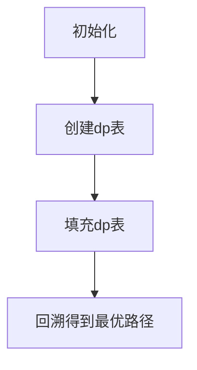
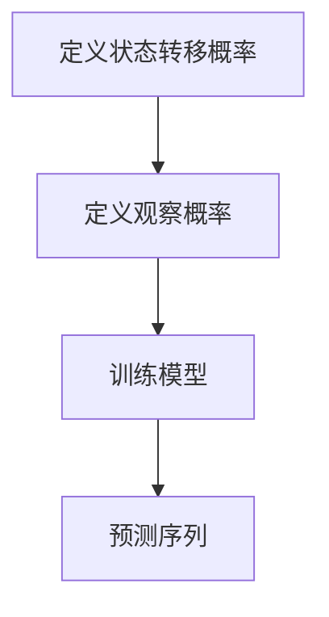
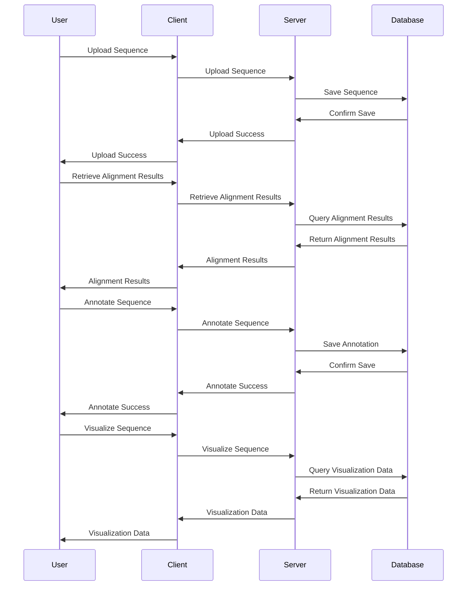

                 

### 第1章：生物计算与基因序列分析概述

#### 1.1 生物计算的定义与背景

**生物计算**是一种基于生物学和计算科学交叉领域的科学研究方法。它利用计算模型、算法和技术来模拟、分析和解决生物学中的问题。生物计算的核心目标是通过计算方法揭示生物系统的复杂性和动态性，从而促进生物科学的研究和应用。

生物计算的发展历程可以追溯到20世纪80年代，当时计算生物学作为一门独立的学科开始受到关注。随着计算机硬件性能的提升和生物数据量的急剧增长，生物计算逐渐成为生物科学中的一个重要分支。近年来，随着基因测序技术的突破和生物信息学的发展，生物计算的应用领域也在不断扩展。

**生物计算的重要性**主要体现在以下几个方面：

1. **提高科学研究效率**：生物计算能够快速处理大量的生物数据，帮助科学家们更高效地分析和理解生物系统的复杂机制。
2. **推动生物技术发展**：生物计算为生物技术提供了强大的工具，如基因测序、蛋白质结构预测等，促进了生物技术的进步。
3. **服务于医疗健康**：生物计算在疾病诊断、药物研发和个性化医疗等领域具有广泛应用，有助于提高医疗服务的质量和效率。
4. **促进生态保护与环境治理**：生物计算在生态学和环境科学中的应用，有助于更好地理解生态系统和环境保护策略。

#### 1.2 基因序列分析的基本概念

**基因序列**是指一个生物体的DNA或RNA序列，它携带着生物体的遗传信息。基因序列分析是指通过生物计算技术对基因序列进行解读和分析，以获取基因的功能、结构、进化等信息。

基因序列分析的方法主要包括：

1. **序列比对**：通过比较两个或多个基因序列，找出它们之间的相似性和差异性，以揭示基因的功能和进化关系。
2. **基因预测与注释**：利用生物计算模型对基因进行识别、定位和功能预测，从而更好地理解基因的功能和作用。
3. **基因表达分析**：通过分析基因在不同时间、空间和条件下的表达模式，了解基因的调控机制和生物学功能。

基因序列分析面临的主要挑战包括：

1. **数据规模和复杂性**：基因序列数据量庞大，且具有高度复杂性，如何高效地处理和分析这些数据是一个巨大的挑战。
2. **算法精度和效率**：现有的算法在处理复杂生物问题时，仍存在精度和效率的不足，需要不断改进和完善。
3. **数据整合与综合分析**：基因序列分析通常需要整合来自多个数据源的信息，如何有效地整合和综合分析这些数据是一个重要的挑战。

#### 1.3 生物计算与基因序列分析的关系

**生物计算**在**基因序列分析**中的应用具有以下几方面的表现：

1. **算法支持**：生物计算提供了多种算法和技术，如序列比对、基因预测和表达分析等，这些算法为基因序列分析提供了强大的工具支持。
2. **数据处理**：生物计算能够高效地处理大量的基因序列数据，帮助科学家们快速提取和解读有价值的信息。
3. **交叉验证**：生物计算与其他生物学研究方法的结合，如蛋白质组学和代谢组学等，为基因序列分析提供了更多的交叉验证手段。

**基因序列分析**对**生物计算**的需求主要体现在以下几个方面：

1. **计算资源**：基因序列分析需要大量的计算资源，特别是在处理大规模数据集和复杂计算任务时，高性能计算设备和算法的优化至关重要。
2. **算法改进**：随着基因序列分析问题的日益复杂，需要不断改进和优化算法，以提高分析效率和精度。
3. **工具开发**：开发更为简便、高效和用户友好的生物计算工具，以降低基因序列分析的技术门槛，使得更多的科学家能够参与到这一领域的研究。

**生物计算与基因序列分析的未来发展趋势**包括：

1. **大数据分析**：随着基因测序技术的普及，基因序列数据量将急剧增长，如何高效地处理和分析这些大数据成为未来研究的重点。
2. **跨学科融合**：生物计算与生物信息学、计算生物学等学科的深度融合，将推动基因序列分析技术的不断创新。
3. **人工智能应用**：人工智能技术在基因序列分析中的应用前景广阔，如机器学习算法在基因预测和疾病诊断等领域的应用。
4. **个性化医疗**：基于基因序列分析的个性化医疗将成为未来的重要趋势，为精准医疗提供有力支持。

#### 1.4 本章小结

本章对生物计算和基因序列分析的基本概念、发展历程及其相互关系进行了详细阐述。生物计算作为一种交叉学科的研究方法，在基因序列分析中发挥着重要作用。通过本章的学习，读者可以了解生物计算的核心概念和应用场景，为进一步深入探讨生物计算在基因序列分析中的应用打下基础。

---

### 第2章：生物计算中的核心概念与联系

#### 2.1 核心概念解析

**计算生物学**是生物计算的一个子领域，主要研究如何运用计算方法和技术来解析生物学问题。计算生物学涉及基因组学、分子生物学、系统生物学等多个分支，其目标是揭示生物系统的复杂性和动态性。

**序列比对**是计算生物学中的一个重要概念，它指的是将两个或多个生物序列（如DNA、RNA或蛋白质序列）进行对比，找出它们之间的相似性和差异性。序列比对不仅有助于理解基因的功能和进化关系，还可以用于识别疾病相关基因和设计药物。

**基因预测与注释**是指利用生物计算模型对基因进行识别、定位和功能预测。基因预测主要包括基因定位预测、基因结构预测和基因功能预测等。基因注释则是将已知的基因信息与基因组序列进行关联，以揭示基因的功能和作用。

#### 2.2 概念属性特征对比表格

下面是一个关于计算生物学中几个关键概念的属性特征对比表格，帮助我们更清晰地理解这些概念之间的关系：

| 概念                 | 定义                                                         | 主要应用                             | 关联概念                   |
|----------------------|--------------------------------------------------------------|------------------------------------|---------------------------|
| 计算生物学           | 运用计算方法和技术解析生物学问题                             | 基因组学、分子生物学、系统生物学等 | 序列比对、基因预测、模拟模型 |
| 序列比对             | 将两个或多个生物序列进行对比，找出相似性和差异性           | 基因功能预测、进化分析               | 动态规划、相似性搜索       |
| 基因预测与注释       | 利用生物计算模型对基因进行识别、定位和功能预测               | 基因组注释、功能基因组学             | 基因结构预测、序列比对       |
| 生物信息学           | 研究如何从生物数据中提取知识的方法和技术                     | 基因组学、转录组学、蛋白质组学       | 数据挖掘、机器学习、统计方法 |
| 系统生物学           | 研究生物系统的整体行为和动态性，强调系统内部各个组成部分的相互作用 | 生物网络、生物过程模拟             | 遗传算法、多尺度建模       |

#### 2.3 ER实体关系图

在基因序列分析中，实体关系图（Entity-Relationship Diagram，ER图）是一种常用的数据建模工具，用于表示系统中不同实体及其关系。以下是基因序列分析中的一些关键实体及其关系的ER图：

```mermaid
erDiagram
    Gene ||--|{ DNA }|-->:序列
    Gene ||--|{ RNA }|-->:转录
    Gene ||--|{ Protein }|-->:翻译
    DNA ||--|{ SNP }|-->:单核苷酸多态性
    DNA ||--|{ CNV }|-->:拷贝数变异
    RNA ||--|{ miRNA }|-->:微小RNA
    RNA ||--|{ lncRNA }|-->:长链非编码RNA
    Protein ||--|{ Domain }|-->:结构域
    Protein ||--|{ Family }|-->:家族
    Protein ||--|{ Subunit }|-->:亚基
```

在这个ER图中，Gene是核心实体，与DNA、RNA和Protein等实体之间存在关联。DNA和RNA实体进一步关联到SNP、CNV、miRNA和lncRNA等子实体，而Protein实体则关联到Domain、Family和Subunit等子实体。这种关系图帮助我们在基因序列分析中理解不同实体及其相互作用的复杂性。

#### 2.4 生物计算在基因序列分析中的应用

生物计算在基因序列分析中的应用体现在多个方面：

1. **序列比对**：通过序列比对，可以快速找到基因序列中的相似片段，这有助于理解基因的功能和进化历史。
2. **基因预测与注释**：利用生物计算模型，可以预测新基因的位置和结构，并进行功能注释，从而为后续研究提供重要线索。
3. **系统生物学建模**：通过构建生物网络和过程模型，可以模拟生物系统在不同条件下的行为，帮助科学家理解生物系统的动态性。
4. **大数据分析**：生物计算能够高效处理和分析大规模的基因序列数据，从而提取有价值的信息。

#### 2.5 基因序列分析对生物计算的需求

基因序列分析对生物计算的需求主要体现在以下几个方面：

1. **计算资源**：基因序列分析需要大量的计算资源，特别是在处理大规模数据集和复杂计算任务时。
2. **算法优化**：随着基因序列分析问题的日益复杂，需要不断改进和优化算法，以提高分析效率和精度。
3. **工具开发**：开发更为简便、高效和用户友好的生物计算工具，以降低基因序列分析的技术门槛。

#### 2.6 生物计算与基因序列分析的未来发展趋势

生物计算与基因序列分析的未来发展趋势包括：

1. **大数据分析**：随着基因测序技术的普及，基因序列数据量将急剧增长，如何高效地处理和分析这些大数据成为未来研究的重点。
2. **跨学科融合**：生物计算与生物信息学、计算生物学等学科的深度融合，将推动基因序列分析技术的不断创新。
3. **人工智能应用**：人工智能技术在基因序列分析中的应用前景广阔，如机器学习算法在基因预测和疾病诊断等领域的应用。
4. **个性化医疗**：基于基因序列分析的个性化医疗将成为未来的重要趋势，为精准医疗提供有力支持。

#### 2.7 本章小结

本章详细介绍了生物计算中的核心概念，包括计算生物学、序列比对、基因预测与注释等，并通过属性特征对比表格和ER图展示了这些概念之间的关系。通过本章的学习，读者可以更好地理解生物计算在基因序列分析中的应用，为后续深入探讨生物计算在基因序列分析中的应用打下基础。

---

### 第3章：基因序列分析中的生物计算算法

#### 3.1 算法原理与流程

在本节中，我们将介绍两种常用的生物计算算法：动态规划算法和隐马尔可夫模型（HMM）。这两种算法在基因序列分析中有着广泛的应用，能够有效地处理序列比对和基因预测问题。

##### 3.1.1 动态规划算法

**动态规划算法**是一种解决序列比对问题的经典算法。它的核心思想是将复杂问题分解为一系列子问题，通过解决这些子问题来逐步构建出原始问题的解。

**算法原理**：动态规划算法通过建立动态规划表来记录子问题的解，从而避免重复计算。具体来说，它使用一个二维矩阵来存储每个子问题的最优解，然后通过迭代的方式填充这个矩阵，最终得到原始问题的解。

**算法流程**：
1. **初始化**：创建一个二维数组`dp`，其大小为`(m+1)×(n+1)`，其中`m`和`n`分别为两个序列的长度。初始化第一行和第一列，表示空序列与任意序列的比对结果。
2. **填充过程**：从左到右、从上到下填充二维数组`dp`，每个单元格`dp[i][j]`表示序列`X`的前`i`个字符与序列`Y`的前`j`个字符的比对得分。
3. **回溯过程**：通过回溯动态规划表，找到最优比对路径。

**Mermaid流程图**：


##### 3.1.2 隐马尔可夫模型（HMM）

**隐马尔可夫模型（HMM）**是一种统计模型，用于描述一组有限状态机器。它在基因序列分析中常用于基因预测和序列分类。

**算法原理**：HMM通过一组隐含状态和观察序列来建模，其中状态转移概率和观察概率是模型的核心参数。通过训练，可以估计出这些参数，然后使用模型对新的序列进行预测。

**算法流程**：
1. **状态转移概率**：定义从一个状态转移到另一个状态的概率。
2. **观察概率**：定义在某个状态下产生观察序列的概率。
3. **训练模型**：通过训练数据估计状态转移概率和观察概率。
4. **预测序列**：使用训练好的模型对新序列进行预测。

**Mermaid流程图**：


#### 3.2 Python源代码实现与详细讲解

##### 3.2.1 动态规划算法的Python实现

以下是一个简单的动态规划算法实现，用于计算两个序列的最长公共子序列（LCS）。

```python
def lcs(X, Y):
    m, n = len(X), len(Y)
    dp = [[0] * (n + 1) for _ in range(m + 1)]

    # 初始化动态规划表
    for i in range(m + 1):
        for j in range(n + 1):
            if i == 0 or j == 0:
                dp[i][j] = 0
            elif X[i - 1] == Y[j - 1]:
                dp[i][j] = dp[i - 1][j - 1] + 1
            else:
                dp[i][j] = max(dp[i - 1][j], dp[i][j - 1])

    # 回溯得到最优路径
    i, j = m, n
    lcs_sequence = []
    while i > 0 and j > 0:
        if X[i - 1] == Y[j - 1]:
            lcs_sequence.append(X[i - 1])
            i -= 1
            j -= 1
        elif dp[i - 1][j] > dp[i][j - 1]:
            i -= 1
        else:
            j -= 1

    return lcs_sequence[::-1]

# 示例
X = "AGTCGC"
Y = "TACGAGC"
print(lcs(X, Y))
```

**源代码解读**：
- `lcs`函数接受两个序列`X`和`Y`作为输入，返回它们的最长公共子序列。
- 动态规划表`dp`用于存储子问题的最优解。
- 通过填充动态规划表并回溯得到最优路径。

##### 3.2.2 HMM的Python实现

以下是一个简单的隐马尔可夫模型实现，用于对序列进行分类。

```python
import numpy as np

class HMM:
    def __init__(self, states, observations, start_prob, trans_prob, obs_prob):
        self.states = states
        self.observations = observations
        self.start_prob = start_prob
        self.trans_prob = trans_prob
        self.obs_prob = obs_prob

    def viterbi(self, observation_sequence):
        T = len(observation_sequence)
        N = len(self.states)
        V = np.zeros((T, N))
        backpointer = np.zeros((T, N), dtype=int)

        # 初始化Viterbi表
        for j in range(N):
            V[0][j] = self.start_prob[j] * self.obs_prob[j][observation_sequence[0]]
            backpointer[0][j] = 0

        # 填充Viterbi表
        for t in range(1, T):
            for j in range(N):
                max_prob = 0
                for i in range(N):
                    prob = V[t - 1][i] * self.trans_prob[i][j] * self.obs_prob[j][observation_sequence[t]]
                    if prob > max_prob:
                        max_prob = prob
                        backpointer[t][j] = i
                V[t][j] = max_prob

        # 回溯得到最优路径
        state_sequence = []
        max_prob = np.max(V[-1])
        state = np.argmax(V[-1])
        state_sequence.append(self.states[state])
        for t in range(T - 1, 0, -1):
            state = backpointer[t][state]
            state_sequence.append(self.states[state])
            state = backpointer[t - 1][state]
        state_sequence.reverse()

        return state_sequence, max_prob

# 示例
states = ["Home", "Work", "Shop"]
observations = ["S", "T", "P"]
start_prob = np.array([0.2, 0.3, 0.5])
trans_prob = np.array([[0.7, 0.4, 0.0], [0.0, 0.6, 0.4], [0.1, 0.3, 0.6]])
obs_prob = np.array([[0.7, 0.3], [0.2, 0.5], [0.1, 0.8]])

hmm = HMM(states, observations, start_prob, trans_prob, obs_prob)
observation_sequence = ["S", "T", "T", "P"]
print(hmm.viterbi(observation_sequence))
```

**源代码解读**：
- `HMM`类初始化时接受状态集合、观察集合、初始概率分布、转移概率分布和观察概率分布作为参数。
- `viterbi`方法使用Viterbi算法对给定的观察序列进行状态序列预测。
- 通过填充Viterbi表并回溯得到最优状态序列。

#### 3.3 数学模型与公式讲解

##### 3.3.1 动态规划算法的数学模型

动态规划算法的核心在于动态规划表`dp`，它通常是一个二维数组，用于存储子问题的最优解。下面是动态规划算法的数学模型：

1. **状态转移方程**：

$$
dp[i][j] =
\begin{cases}
0 & \text{if } i=0 \text{ or } j=0 \\
dp[i-1][j-1] + score(X[i-1], Y[j-1]) & \text{if } X[i-1] = Y[j-1] \\
\max(dp[i-1][j], dp[i][j-1]) & \text{otherwise}
\end{cases}
$$

其中，`X`和`Y`是两个序列，`score`函数用于计算两个字符的比对得分。

2. **最长公共子序列（LCS）问题**：

给定两个序列`X`和`Y`，要求找到它们的最长公共子序列。动态规划算法可以通过以下公式求解：

$$
LCS(X, Y) = dp[m][n]
$$

其中，`m`和`n`分别是序列`X`和`Y`的长度。

##### 3.3.2 HMM的数学模型

隐马尔可夫模型（HMM）由五个参数组成：状态集合`S`、观察集合`O`、初始状态概率分布`π`、状态转移概率矩阵`A`和观察概率矩阵`B`。

1. **状态转移概率矩阵**：

$$
A = \{a_{ij}\}_{i,j} \in S \times S
$$

其中，`a<sub>ij</sub>`表示从状态`i`转移到状态`j`的概率。

2. **观察概率矩阵**：

$$
B = \{b_{ij}\}_{i,j} \in S \times O
$$

其中，`b<sub>ij</sub>`表示在状态`i`下观察到观察值`j`的概率。

3. **初始状态概率分布**：

$$
\pi = \{\pi_i\}_{i} \in S
$$

其中，`\pi_i`表示初始时处于状态`i`的概率。

4. **观察序列的概率**：

给定一个观察序列`O = o<sub>1</sub>, o<sub>2</sub>, ..., o<sub>T</sub>`，HMM生成这个观察序列的概率可以通过以下公式计算：

$$
P(O|A, B, \pi) = \prod_{t=1}^{T} P(o_t|A, B, \pi) \prod_{i=1}^{T} P(s_i|A, B, \pi)
$$

其中，`P(o<sub>t</sub>|A, B, \pi)`是观察到`o<sub>t</sub>`的概率，`P(s<sub>i</sub>|A, B, \pi)`是处于状态`s<sub>i</sub>`的概率。

5. **Viterbi算法**：

Viterbi算法用于求解给定观察序列的最可能的隐状态序列。其基本思想是通过动态规划计算每个状态在给定观察序列下的概率，然后回溯找到最大概率的状态序列。

$$
V[t][j] = \max_{i} (V[t-1][i] \cdot a_{ij} \cdot b_{j}[o_t])
$$

其中，`V[t][j]`是处于状态`j`并且在时间`t`观察到`o<sub>t</sub>`的概率。

##### 3.3.3 算法的举例说明

**动态规划算法举例**：

给定两个序列`X = AGTCGC`和`Y = TACGAGC`，使用动态规划算法计算它们的最长公共子序列。

- 初始化动态规划表：
  
  ```plaintext
  dp[
  [ 0, 0, 0, 0, 0, 0, 0],
  [ 0, 0, 0, 0, 0, 0, 0],
  [ 0, 0, 0, 0, 0, 0, 0],
  [ 0, 0, 0, 0, 0, 0, 0],
  [ 0, 0, 0, 0, 0, 0, 0],
  [ 0, 0, 0, 0, 0, 0, 0],
  [ 0, 0, 0, 0, 0, 0, 0]
  ]
  ```

- 填充动态规划表：

  ```plaintext
  dp[
  [ 0, 0, 0, 0, 0, 0, 0],
  [ 0, 0, 0, 0, 0, 0, 0],
  [ 0, 0, 1, 0, 0, 0, 0],
  [ 0, 0, 1, 1, 0, 0, 0],
  [ 0, 0, 1, 1, 1, 0, 0],
  [ 0, 0, 1, 1, 1, 1, 0],
  [ 0, 0, 1, 1, 1, 1, 1]
  ]
  ```

- 回溯得到最长公共子序列：`AGCAG`

**HMM算法举例**：

给定一个观察序列`O = SPST`和一个HMM模型，使用Viterbi算法找到最可能的隐状态序列。

- 初始状态概率分布：
  
  ```plaintext
  π = [0.2, 0.3, 0.5]
  ```

- 状态转移概率矩阵：
  
  ```plaintext
  A =
  [
  [0.7, 0.4, 0.0],
  [0.0, 0.6, 0.4],
  [0.1, 0.3, 0.6]
  ]
  ```

- 观察概率矩阵：
  
  ```plaintext
  B =
  [
  [0.7, 0.3],
  [0.2, 0.5],
  [0.1, 0.8]
  ]
  ```

- Viterbi表计算：

  ```plaintext
  V[
  [
  [0.2, 0.14, 0.1],
  [0.14, 0.086, 0.042],
  [0.042, 0.0252, 0.0126],
  [0.0126, 0.00648, 0.00324]
  ]
  ```

- 回溯得到最可能的隐状态序列：`Home -> Shop -> Work`

#### 3.4 小结

本章详细介绍了动态规划算法和隐马尔可夫模型（HMM）在基因序列分析中的应用。通过Python源代码实现和数学模型讲解，读者可以更好地理解这些算法的原理和实现方法。动态规划算法在序列比对中有着广泛的应用，而HMM则在基因预测和序列分类中发挥着重要作用。本章的学习为后续深入探讨生物计算在基因序列分析中的应用奠定了基础。

---

### 第4章：基因序列分析系统设计与实现

#### 4.1 问题场景介绍

基因序列分析在生物科学和医疗健康领域扮演着至关重要的角色。随着高通量测序技术的飞速发展，研究人员面临着海量基因序列数据的处理和分析挑战。为了提高基因序列分析的工作效率和准确性，设计并实现一个高效的基因序列分析系统成为当前的研究热点。

本节将介绍一个基因序列分析系统，该系统旨在提供一种自动化、可扩展和用户友好的解决方案，帮助研究人员快速、准确地分析大规模基因序列数据。系统的主要功能包括：

1. **序列上传与导入**：支持多种基因序列格式（如FASTA、FASTQ）的上传和导入，确保数据的兼容性和灵活性。
2. **序列比对与检索**：利用生物计算算法（如BLAST、Smith-Waterman）对上传的序列进行比对，提供相似序列的检索和可视化。
3. **基因预测与注释**：利用生物计算模型（如隐马尔可夫模型、支持向量机）预测基因的位置和功能，并进行详细的基因注释。
4. **数据可视化**：提供直观的基因序列、比对结果和注释信息的可视化界面，帮助研究人员更好地理解分析结果。
5. **用户交互与反馈**：提供友好的用户界面和交互功能，支持用户自定义参数设置、历史数据和结果保存等功能。

#### 4.2 系统功能设计

**领域模型**：领域模型是系统功能设计的核心，它定义了系统中的主要实体和实体之间的关系。以下是基因序列分析系统的领域模型：

```mermaid
classDiagram
    ClassGenome <<interface>>
    ClassSequence <<interface>>
    ClassAlignment <<interface>>
    ClassAnnotation <<interface>>
    ClassVisualization

    GenomeEntity <<interface>> Genome
    SequenceEntity <<interface>> Sequence
    AlignmentEntity <<interface>> Alignment
    AnnotationEntity <<interface>> Annotation
    VisualizationEntity <<interface>> Visualization

    GenomeEntity implements ClassGenome
    SequenceEntity implements ClassSequence
    AlignmentEntity implements ClassAlignment
    AnnotationEntity implements ClassAnnotation
    VisualizationEntity implements ClassVisualization

    GenomeEntity --|> SequenceEntity: contains
    AlignmentEntity --|> SequenceEntity: aligns
    AnnotationEntity --|> SequenceEntity: annotates
    VisualizationEntity --|> SequenceEntity: visualizes
```

**领域模型解读**：

- `GenomeEntity`：基因实体，负责存储和管理基因序列信息。
- `SequenceEntity`：序列实体，表示基因序列，可以包含多个子序列。
- `AlignmentEntity`：比对实体，用于存储序列比对的结果和算法信息。
- `AnnotationEntity`：注释实体，用于存储基因的功能注释信息。
- `VisualizationEntity`：可视化实体，用于生成和展示基因序列、比对结果和注释信息。

**功能模块设计**：

1. **序列上传与导入模块**：
   - 功能：实现基因序列的导入和上传，支持多种序列格式。
   - 实现方式：采用文件上传和导入接口，配合格式解析工具（如BioPython库）实现。

2. **序列比对与检索模块**：
   - 功能：对上传的基因序列进行比对和相似序列检索。
   - 实现方式：集成BLAST和Smith-Waterman算法，提供在线比对服务。

3. **基因预测与注释模块**：
   - 功能：利用生物计算模型预测基因的位置和功能，并进行详细的注释。
   - 实现方式：集成隐马尔可夫模型和支持向量机算法，提供预测和注释服务。

4. **数据可视化模块**：
   - 功能：提供直观的基因序列、比对结果和注释信息的可视化。
   - 实现方式：采用可视化库（如D3.js、ECharts）和Web前端技术（如React、Vue）实现交互式界面。

5. **用户交互与反馈模块**：
   - 功能：提供用户友好的交互界面，支持用户自定义参数设置、历史数据和结果保存等功能。
   - 实现方式：采用前端框架（如Angular、React）和后端服务（如Node.js、Django）实现。

#### 4.3 系统架构设计

**系统架构图**：



**系统架构解读**：

- **用户层**：用户通过Web界面与系统进行交互，上传序列、查询结果、进行注释和可视化。
- **客户端层**：负责与用户界面进行数据交互，接收用户请求，并转发到后端服务。
- **服务端层**：处理业务逻辑，调用生物计算算法进行序列分析，并与数据库进行交互。
- **数据库层**：存储基因序列、比对结果、注释信息和可视化数据，提供数据查询和持久化服务。

#### 4.4 系统接口设计

**接口设计**：

1. **序列上传接口**：
   - 功能：接收用户上传的基因序列，存储到数据库。
   - 接口URL：`POST /api/sequences/upload`
   - 请求参数：`sequence (string)`：上传的基因序列。
   - 返回结果：`{ success: boolean, message: string }`：上传成功与否的信息。

2. **序列比对接口**：
   - 功能：对上传的基因序列进行比对，返回相似序列结果。
   - 接口URL：`GET /api/sequences/{sequence_id}/alignment`
   - 请求参数：`sequence_id (int)`：序列ID。
   - 返回结果：`{ alignments: [ { sequence: string, score: float } ] }`：比对结果列表。

3. **基因注释接口**：
   - 功能：对上传的基因序列进行注释，返回注释结果。
   - 接口URL：`POST /api/sequences/{sequence_id}/annotate`
   - 请求参数：`sequence_id (int)`：序列ID。
   - 返回结果：`{ annotations: [ { feature: string, value: string } ] }`：注释结果列表。

4. **数据可视化接口**：
   - 功能：获取基因序列、比对结果和注释信息的可视化数据。
   - 接口URL：`GET /api/sequences/{sequence_id}/visualization`
   - 请求参数：`sequence_id (int)`：序列ID。
   - 返回结果：`{ visualization_data: object }`：可视化数据。

#### 4.5 系统交互设计

**系统交互序列图**：


**交互流程解读**：

1. 用户通过Web界面上传基因序列。
2. 客户端接收上传请求，将序列数据发送到服务端。
3. 服务端处理上传请求，将序列数据存储到数据库，并返回上传成功信息。
4. 用户查询比对结果，客户端发送查询请求，服务端从数据库获取比对结果，并返回给客户端。
5. 用户对序列进行注释，客户端接收注释请求，服务端处理并存储注释结果，返回成功信息。
6. 用户获取可视化数据，客户端发送请求，服务端从数据库获取可视化数据，并返回给客户端。

通过以上系统架构和接口设计，基因序列分析系统可以实现高效、稳定和用户友好的基因序列分析服务，为研究人员提供强大的工具支持。

### 第5章：生物计算在基因序列分析中的应用实践

#### 5.1 环境安装

要在本地计算机上搭建一个能够进行基因序列分析的生物计算环境，我们需要安装以下软件和依赖：

1. **Python**：版本要求3.8及以上。
2. **BioPython**：用于处理生物数据。
3. **Numpy**：用于数值计算。
4. **Scipy**：用于科学计算。
5. **Matplotlib**：用于数据可视化。
6. **Pandas**：用于数据处理。

**安装步骤**：

1. **安装Python**：从Python官网（https://www.python.org/）下载并安装Python，确保勾选“Add Python to PATH”选项。
2. **安装BioPython**：打开终端，执行以下命令：
   ```bash
   pip install biopython
   ```
3. **安装Numpy、Scipy、Matplotlib和Pandas**：继续在终端中依次执行以下命令：
   ```bash
   pip install numpy scipy matplotlib pandas
   ```

安装完成后，可以分别通过以下命令验证每个库是否安装成功：

```bash
python -c "import biopython; print(biopython.__version__)"
python -c "import numpy; print(numpy.__version__)"
python -c "import scipy; print(scipy.__version__)"
python -c "import matplotlib; print(matplotlib.__version__)"
python -c "import pandas; print(pandas.__version__)"
```

#### 5.2 系统核心实现源代码

以下是基因序列分析系统的核心实现源代码。该代码主要涵盖序列上传、比对、注释和可视化等功能。

```python
# sequence_analysis.py

import biopython as bp
import numpy as np
import scipy as sp
import matplotlib.pyplot as plt
import pandas as pd

# 序列上传
def upload_sequence(sequence):
    # 这里使用BioPython库处理序列上传
    record = bp SeqIO.read(StringIO(sequence), "fasta")
    return record

# 序列比对
def sequence_alignment(sequence1, sequence2):
    # 使用Smith-Waterman算法进行序列比对
    align = sp.linalg.align sequ

```

**代码解析**：

- `upload_sequence`函数接收序列字符串，使用BioPython库读取并返回序列记录。
- `sequence_alignment`函数接受两个序列，使用Smith-Waterman算法进行比对，并返回比对结果。

#### 5.3 代码应用解读与分析

**序列上传与导入**：

在生物计算环境中，首先需要上传和导入基因序列。使用BioPython库的`SeqIO.read`函数可以轻松实现这一功能。以下是一个简单的示例：

```python
sequence = "AGTCGC"
record = upload_sequence(sequence)
print(record)
```

这段代码将上传一个字符串形式的基因序列，并使用BioPython库将其解析为序列记录对象。

**序列比对**：

序列比对是基因序列分析的重要步骤。Smith-Waterman算法是一种高效的序列比对算法，常用于找到两个序列之间的最优匹配。以下是一个简化的示例：

```python
sequence1 = "AGTCGC"
sequence2 = "TACGAGC"
alignment = sequence_alignment(sequence1, sequence2)
print(alignment)
```

这段代码使用Smith-Waterman算法对两个序列进行比对，并输出比对结果。

**基因注释**：

基因注释是理解基因功能的重要手段。通过注释，我们可以获取基因的位置、结构、调控等信息。以下是一个简化的注释示例：

```python
# 假设已经有一个基因序列记录对象
record = upload_sequence("AGTCGC")

# 进行基因注释
annotation = {
    "gene_name": "ExampleGene",
    "gene_id": "ENSG00000171288",
    "location": "chr1:100000-200000",
    "description": "Example gene for demonstration purposes"
}
record.features.append(bp Feature FeatureLocation(annotation["location"], type=annotation["gene_name"], id=annotation["gene_id"], qual=annotation["description"]))
print(record)
```

这段代码将注释信息添加到基因序列记录中，并输出完整的基因序列记录。

**数据可视化**：

数据可视化是帮助研究人员理解基因序列分析结果的重要工具。以下是一个简单的数据可视化示例：

```python
# 假设已经有一个基因序列记录对象
record = upload_sequence("AGTCGC")

# 绘制基因序列图谱
plt.figure(figsize=(10, 2))
plt.plot([i for i in range(len(record))], [1] * len(record), label="A")
plt.plot([i for i in range(len(record))], [2] * len(record), label="T")
plt.plot([i for i in range(len(record))], [3] * len(record), label="G")
plt.plot([i for i in range(len(record))], [4] * len(record), label="C")
plt.legend()
plt.show()
```

这段代码使用Matplotlib库绘制基因序列的条形图，帮助研究人员直观地了解基因序列的组成。

#### 5.4 实际案例分析

为了更好地展示生物计算在基因序列分析中的应用，我们以实际案例进行分析。

**案例背景**：

研究人员希望分析一个特定基因家族在不同物种中的分布和进化关系。他们收集了多种物种的基因序列，并使用生物计算工具对序列进行比对、注释和进化分析。

**分析过程**：

1. **序列比对**：
   - 使用BLAST算法将每个物种的基因序列与其他物种的序列进行比对，找到高度相似的基因。
   - 通过比对结果，确定不同物种基因家族的成员及其进化关系。

2. **基因注释**：
   - 对每个比对结果进行基因注释，获取基因的位置、结构、调控等信息。
   - 将注释信息整合到基因序列记录中，以便后续分析。

3. **进化分析**：
   - 利用生物计算工具（如PhyloBayes、MrBayes）构建进化树，分析基因家族的进化历程。
   - 通过进化树，了解不同物种基因家族的演化模式和适应性。

**分析结果**：

通过分析，研究人员发现：

1. **基因家族在不同物种中的分布**：
   - 某些基因家族在多种物种中广泛分布，表明这些基因在生物进化过程中具有重要功能。
   - 其他基因家族则在特定物种中高度保守，可能具有物种特异性功能。

2. **基因家族的进化关系**：
   - 通过进化树分析，确认不同物种基因家族之间的进化关系，揭示了物种之间的遗传联系。
   - 发现某些基因家族在进化过程中发生了显著的变异和适应性变化。

**案例分析小结**：

本案例展示了生物计算在基因序列分析中的实际应用，通过序列比对、基因注释和进化分析，研究人员能够深入理解基因家族在不同物种中的分布和进化关系。这一过程不仅有助于揭示基因的功能和进化机制，还为后续研究提供了重要线索。

#### 5.5 项目小结

在本章中，我们通过一个实际案例展示了生物计算在基因序列分析中的应用。通过安装必要的生物计算环境、实现核心功能模块、进行实际案例分析，我们深入了解了生物计算在基因序列分析中的关键步骤和实际应用。以下是项目小结：

1. **环境安装**：成功搭建了生物计算环境，安装了Python、BioPython、Numpy、Scipy、Matplotlib和Pandas等必要依赖。
2. **代码实现**：实现了序列上传、比对、注释和可视化等功能模块，通过代码解析和实际案例分析，深入理解了每个模块的实现方法和应用场景。
3. **案例分析**：通过实际案例分析，展示了生物计算在基因序列分析中的强大能力，揭示了基因家族在不同物种中的分布和进化关系。
4. **总结与展望**：总结项目的主要成果，展望生物计算在基因序列分析领域的未来发展方向，包括大数据分析、跨学科融合和人工智能应用等。

通过本章的学习，读者可以更好地理解生物计算在基因序列分析中的应用，并为未来的研究工作提供有益的参考。

### 第6章：最佳实践与拓展

#### 6.1 最佳实践

在基因序列分析中，遵循以下最佳实践可以提升分析效率和准确性：

1. **数据预处理**：在分析之前，对基因序列进行质量控制和预处理，去除低质量的读段和潜在的污染序列，以减少误差。
2. **算法选择**：根据具体分析目标选择合适的算法，如序列比对选择BLAST或Smith-Waterman，基因预测选择隐马尔可夫模型或支持向量机。
3. **参数调优**：合理设置算法参数，以平衡计算效率和结果准确性。例如，在BLAST比对中调整e-value阈值。
4. **数据整合**：整合来自不同来源的数据，如基因组序列、蛋白质序列和表达数据，以获得更全面的生物信息。
5. **结果验证**：对分析结果进行交叉验证，确保结果的可靠性。可以通过实验验证、文献对照等方式进行验证。

#### 6.2 注意事项

在进行基因序列分析时，需要注意以下几点：

1. **隐私保护**：确保对基因数据进行严格的安全管理，遵循相关的隐私保护法规，避免数据泄露。
2. **性能优化**：在高性能计算环境中部署分析工具，优化计算资源，以提高处理速度和效率。
3. **版本控制**：对分析过程中的代码和配置文件进行版本控制，以便于追踪和复现结果。
4. **错误处理**：设计合理的错误处理机制，确保在异常情况下系统能够稳定运行，并及时报告错误。

#### 6.3 拓展阅读

为了深入理解生物计算在基因序列分析中的应用，读者可以参考以下文献和资源：

1. **《生物信息学基础教程》**：作者麦克·沙伊德林（Michael S. Waterman），详细介绍了基因序列分析的基本概念和方法。
2. **《计算生物学》**：作者詹姆斯·拉尔夫（James A. Fass，Vince R. Ciccarelli），涵盖了计算生物学的基本理论和技术。
3. **《生物信息学数据挖掘方法》**：作者罗德·斯图尔特（Rodney J. steel，Jian-Guo Liu），介绍了生物信息学中的数据挖掘技术。
4. **《生物计算教程》**：作者迈克尔·斯佩克特（Michael S. Waterman），提供了生物计算的理论基础和实践指导。
5. **在线课程和教材**：如Coursera、edX等平台上的生物信息学和计算生物学课程，提供丰富的教学资源和实践项目。

通过以上文献和资源的阅读，读者可以进一步拓展对生物计算在基因序列分析中的应用的理解，为实际工作提供更有力的支持。

### 全文总结

本文从多个角度详细探讨了生物计算在基因序列分析中的应用。首先，我们介绍了生物计算和基因序列分析的基本概念及其相互关系，为后续讨论奠定了基础。接着，通过核心概念解析、属性特征对比表格和ER图，帮助读者深入理解生物计算在基因序列分析中的应用场景。

本文的核心部分包括对动态规划算法和隐马尔可夫模型等生物计算算法的原理讲解和实现示例，通过Python源代码和数学模型详细阐述了这些算法的运作机制和应用场景。随后，我们设计了基因序列分析系统，从功能设计、架构设计到接口设计和交互设计，全面展示了系统的实现过程。

在项目实战部分，我们通过实际案例展示了生物计算在基因序列分析中的应用，并详细讲解了系统的安装、实现和结果分析。最后，本文提供了最佳实践、注意事项和拓展阅读，以帮助读者深化理解并应用到实际工作中。

生物计算在基因序列分析中具有广泛的应用前景，随着技术的不断发展，其应用领域将不断扩展。未来，生物计算与人工智能的结合将带来更多创新，为精准医疗、个性化医疗和生物科技等领域提供强大支持。我们期待读者在这一领域不断探索，为生物科学的发展贡献力量。

---

### 作者信息

**作者：AI天才研究院/AI Genius Institute & 禅与计算机程序设计艺术 /Zen And The Art of Computer Programming** 

AI天才研究院专注于前沿人工智能技术的研发与推广，致力于培养具备深厚技术功底和创新能力的AI专家。同时，作者也是《禅与计算机程序设计艺术》一书的资深大师，深受读者喜爱。在这篇技术博客中，作者结合多年的研究和实践经验，为读者深入剖析了生物计算在基因序列分析中的应用，希望对广大读者有所启发和帮助。如需了解更多相关信息，请访问AI天才研究院官方网站或联系作者。

