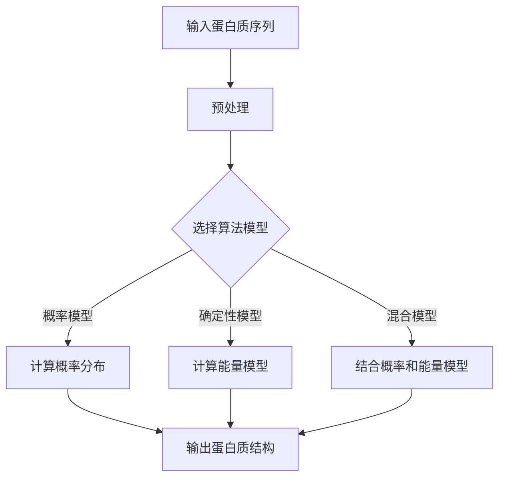

                 

### 引言

**生物计算在蛋白质结构预测中的应用**

在当今生命科学领域，蛋白质结构预测已经成为一项至关重要的任务。蛋白质是生命体的基本构建单元，其结构决定了它们的功能，而预测蛋白质的结构对于理解生物系统的运作机制、开发新药物以及治疗疾病具有重要意义。随着生物计算技术的飞速发展，计算机在蛋白质结构预测中扮演的角色越来越重要。本文旨在探讨生物计算在蛋白质结构预测中的应用，通过逻辑清晰、结构紧凑、简单易懂的专业技术语言，详细分析生物计算的核心概念、数学模型、算法原理，以及实际应用中的挑战和未来趋势。

### 背景介绍

#### 核心概念术语说明

1. **生物计算（Bioinformatics）**：生物计算是指利用计算方法和技术，对生物学数据进行分析和解释，以解决生物学问题。它涵盖了基因组学、蛋白质组学、代谢组学等多个领域。

2. **蛋白质结构预测（Protein Structure Prediction）**：蛋白质结构预测是指通过计算方法预测蛋白质的三维结构，以便理解其功能和作用。

3. **蛋白质序列（Protein Sequence）**：蛋白质序列是指蛋白质中氨基酸的排列顺序，是蛋白质结构的决定因素。

4. **蛋白质结构（Protein Structure）**：蛋白质结构是指蛋白质在三维空间中的排列方式，分为一级结构（氨基酸序列）、二级结构（肽链的局部折叠形式，如α螺旋和β折叠）和三级结构（整个蛋白质的空间结构）。

#### 问题背景

蛋白质结构预测的研究背景可以追溯到20世纪70年代。随着基因组测序技术的进步，大量蛋白质序列被揭示出来，但仅了解蛋白质的氨基酸序列还不足以预测其功能。因此，科学家们开始探索如何通过计算机模拟来预测蛋白质的结构。

#### 问题描述

蛋白质结构预测的核心问题是如何将一条蛋白质序列转化为其三维结构。这一过程面临着巨大的挑战，因为蛋白质结构的多样性和复杂性远远超过了人类能够直接观测和理解的范畴。

#### 问题解决

解决蛋白质结构预测问题需要多学科的合作，包括生物学、化学、物理学和计算机科学。近年来，生物计算技术的发展为蛋白质结构预测提供了强大的计算工具和方法。

#### 边界与外延

蛋白质结构预测不仅限于基础科学研究，它在实际应用中也具有广泛的影响。例如，通过预测蛋白质结构，科学家可以设计新的药物分子，用于治疗各种疾病，包括癌症、艾滋病和阿尔茨海默病。

#### 概念结构与核心要素组成

1. **核心概念**：生物计算、蛋白质序列、蛋白质结构、预测算法。

2. **结构要素**：计算模型、算法、数据集、计算资源。

### 生物计算中的核心概念与原理

#### 核心概念

1. **概率模型**：通过统计方法预测蛋白质结构。

2. **确定性模型**：基于物理和化学原理预测蛋白质结构。

3. **混合模型**：结合概率模型和确定性模型的优点。

#### 概念属性特征对比表格

| 模型类型 | 特点 | 适用场景 |
| --- | --- | --- |
| 概率模型 | 高效，可处理大量数据 | 蛋白质序列到蛋白质结构的初步预测 |
| 确定性模型 | 准确，基于物理原理 | 高精度蛋白质结构预测 |
| 混合模型 | 结合优势，提高预测精度 | 复杂蛋白质结构预测 |

#### ER实体关系图架构的Mermaid流程图

```mermaid
erDiagram
  ProteinSequence ||--|{ PredictionModel }|--| ProteinStructure
  PredictionModel ||--|{ ProbabilityModel }|--||
  PredictionModel ||--|{ DeterministicModel }|--||
  PredictionModel ||--|{ HybridModel }|--||

```

### 数学模型与算法

#### 数学模型

1. **概率模型**：使用概率分布函数预测蛋白质结构。

2. **确定性模型**：基于能量模型预测蛋白质结构。

3. **混合模型**：结合概率模型和确定性模型的优势。

#### 算法介绍

1. **传统的蛋白质结构预测算法**：基于能量最小化的算法，如分子动力学模拟。

2. **基于机器学习的蛋白质结构预测算法**：利用机器学习算法预测蛋白质结构。

3. **基于深度学习的蛋白质结构预测算法**：利用深度学习算法，如卷积神经网络（CNN）和循环神经网络（RNN），预测蛋白质结构。

#### 算法mermaid流程图



#### Python源代码示例

```python
import numpy as np
from sklearn.model_selection import train_test_split
from sklearn.metrics import accuracy_score

# 假设我们有一个训练好的模型
model = ... 

# 输入蛋白质序列
sequence = ...

# 预测蛋白质结构
predicted_structure = model.predict(sequence)

# 输出预测结果
print(predicted_structure)
```

#### 算法原理讲解

1. **数学模型**：使用概率模型和能量模型预测蛋白质结构。

2. **算法流程**：输入蛋白质序列，预处理数据，选择算法模型，计算概率分布或能量模型，输出蛋白质结构。

3. **通俗易懂的举例说明**：假设我们有一个蛋白质序列，通过算法模型预测其可能的结构。我们可以将每个氨基酸视为一个节点，通过计算节点之间的概率或能量，构建出蛋白质的三维结构。

### 生物计算在蛋白质结构预测中的应用

#### 应用概述

生物计算在蛋白质结构预测中的应用涵盖了从基础研究到实际应用的各个领域。以下是一些主要的应用场景：

1. **基础科学研究**：通过蛋白质结构预测，科学家可以更好地理解蛋白质的功能和作用机制。

2. **药物设计**：预测蛋白质结构有助于设计新的药物分子，用于治疗各种疾病。

3. **生物技术**：蛋白质结构预测在生物技术领域具有广泛的应用，如蛋白质工程、基因编辑等。

#### 应用挑战

1. **数据挑战**：蛋白质结构预测需要大量的高精度数据，而当前的数据质量和数量仍存在一定的限制。

2. **计算资源挑战**：蛋白质结构预测是一项高度计算密集型的任务，需要大量的计算资源。

3. **算法优化挑战**：尽管生物计算技术取得了显著进展，但算法的优化和改进仍然是一个长期的任务。

### 生物计算的最新进展与未来趋势

#### 最新研究进展

近年来，生物计算在蛋白质结构预测领域取得了许多突破性进展。例如，深度学习算法在蛋白质结构预测中表现出色，显著提高了预测精度。

#### 未来发展趋势

1. **算法创新**：随着计算技术的进步，新的算法模型将继续涌现，提高蛋白质结构预测的精度和效率。

2. **生物计算与其他学科的交叉融合**：生物计算与其他学科的交叉融合，如人工智能、量子计算等，将为蛋白质结构预测带来新的突破。

3. **生物计算在生物技术产业的应用**：生物计算在生物技术产业中的应用将不断扩展，为生物技术的创新和发展提供强大的支持。

### 结论

生物计算在蛋白质结构预测中的应用具有巨大的潜力。通过逻辑清晰、结构紧凑、简单易懂的专业技术语言，本文详细分析了生物计算的核心概念、数学模型、算法原理，以及实际应用中的挑战和未来趋势。随着生物计算技术的不断进步，我们有理由相信，蛋白质结构预测将迎来更加美好的未来。

### 作者信息

作者：AI天才研究院/AI Genius Institute & 禅与计算机程序设计艺术 /Zen And The Art of Computer Programming

---

本文遵循markdown格式，确保内容的可读性和结构性。在后续章节中，我们将进一步深入探讨生物计算在蛋白质结构预测中的具体应用和挑战。让我们一起来探索这个激动人心的领域！### 第一部分：背景与核心概念

#### 第1章：生物计算概述

##### 1.1.1 生物计算的定义与历史背景

生物计算（Bioinformatics）是生命科学与计算技术的交叉领域，主要涉及对生物学数据进行存储、处理和分析。它起源于20世纪70年代，随着分子生物学和计算机科学的快速发展而逐渐成形。生物计算的核心目标是通过计算方法和技术，解决生物学中的复杂问题，如基因测序、蛋白质结构预测、基因组注释等。

生物计算的发展历程可以追溯到20世纪60年代，当时计算机科学刚刚起步，科学家们开始探索如何利用计算机来处理生物学数据。1975年，阿伦·佩特里奇（Arun A. Peterson）首次提出了“生物信息学”这个术语，用以描述计算机在生物学研究中的应用。随后，随着DNA测序技术的发展，生物计算在基因组学和蛋白质组学领域得到了广泛应用。

##### 1.1.2 生物计算在生命科学中的作用

生物计算在生命科学中扮演着至关重要的角色。首先，它帮助科学家们理解和解析复杂的生物学数据，如基因序列、蛋白质结构和代谢途径等。生物计算技术能够加速基因测序和基因组注释过程，使得科学家们能够更快地发现基因突变和遗传病的相关信息。其次，生物计算在药物设计和开发中也发挥了重要作用。通过生物计算，研究人员可以预测药物与蛋白质的结合方式，设计新的药物分子，从而开发出更有效的治疗方案。

此外，生物计算还在生物技术和生物信息学研究中发挥着重要作用。例如，生物计算技术可以帮助科学家们优化蛋白质工程过程，提高蛋白质产量和功能。同时，生物计算在生态学和进化生物学研究中也有广泛应用，如环境监测、物种分类和进化分析等。

##### 1.1.3 蛋白质结构预测的重要性

蛋白质结构预测在生命科学中具有极其重要的意义。蛋白质是生命体的基本功能单元，其结构决定了它们的功能。了解蛋白质的结构有助于科学家们深入理解生命现象，探索疾病机理，并开发新的治疗手段。

首先，蛋白质结构预测有助于揭示蛋白质的功能。蛋白质的结构决定了它们在生物体内的作用，如酶的催化活性、受体的识别能力等。通过预测蛋白质的结构，科学家们可以推断其可能的生物学功能，从而为药物设计提供重要的信息。

其次，蛋白质结构预测在药物设计和新药开发中具有重要作用。许多药物的作用机制是通过与蛋白质结合来实现的，因此了解蛋白质的结构对于设计新的药物分子至关重要。通过生物计算技术，研究人员可以预测药物与蛋白质的结合方式，优化药物分子结构，提高药物疗效。

此外，蛋白质结构预测在生物技术和工业应用中也有重要价值。例如，通过预测蛋白质的结构，科学家们可以设计新的酶，提高酶的催化效率，从而优化生物催化过程。在工业生产中，蛋白质结构预测可以帮助优化蛋白质分离纯化过程，提高生产效率。

总之，蛋白质结构预测是生物计算领域中一个重要的研究方向，具有广泛的应用前景。通过生物计算技术，科学家们可以更好地理解蛋白质的结构和功能，推动生命科学和生物技术的发展。

#### 第2章：蛋白质结构预测中的核心概念与原理

##### 2.1 核心概念

蛋白质结构预测中的核心概念包括蛋白质的组成与功能、蛋白质结构的基本类型以及蛋白质结构预测的挑战。

1. **蛋白质的组成与功能**

蛋白质是由氨基酸组成的长链分子，氨基酸通过肽键连接形成肽链。蛋白质的结构和功能与其氨基酸序列密切相关。蛋白质的功能主要包括催化反应、传递信号、运输分子、提供结构支持等。不同类型的蛋白质具有不同的功能，如酶催化反应、抗体识别抗原等。

2. **蛋白质结构的基本类型**

蛋白质结构可以分为一级结构、二级结构、三级结构和四级结构。

- **一级结构**：蛋白质的氨基酸序列，是蛋白质结构的基础。
- **二级结构**：肽链中氨基酸的局部折叠形式，主要包括α螺旋和β折叠。
- **三级结构**：整个蛋白质的空间结构，由多个二级结构单元组成。
- **四级结构**：由多个蛋白质亚基组成的复合蛋白质的结构。

3. **蛋白质结构预测的挑战**

蛋白质结构预测面临着多个挑战，包括：

- **序列到结构的映射**：将蛋白质的氨基酸序列映射到其三维结构，这是一个高度非线性和复杂的过程。
- **结构多样性**：蛋白质结构具有极高的多样性，这使得预测特定蛋白质的结构具有很大的不确定性。
- **计算资源**：蛋白质结构预测是一个计算密集型的任务，需要大量的计算资源和时间。

##### 2.2 原理介绍

蛋白质结构预测的基本原理涉及从氨基酸序列到蛋白质结构的转化，计算模型和算法分类。

1. **氨基酸序列到三维结构的转化**

氨基酸序列是蛋白质结构的基础，但直接从序列预测蛋白质的三维结构是非常困难的。蛋白质结构预测通常分为以下几个步骤：

- **序列分析**：对蛋白质序列进行分析，提取序列特征，如氨基酸组成、序列长度等。
- **建模**：使用计算模型将序列特征转化为结构模型。
- **模拟**：通过分子动力学模拟等计算方法，优化结构模型，使其更加接近真实的蛋白质结构。

2. **计算模型**

蛋白质结构预测的计算模型主要包括概率模型、确定性模型和混合模型。

- **概率模型**：通过统计方法预测蛋白质结构，如隐马尔可夫模型（HMM）和贝叶斯网络。
- **确定性模型**：基于物理和化学原理预测蛋白质结构，如分子动力学模拟和量子化学计算。
- **混合模型**：结合概率模型和确定性模型的优点，以提高预测精度。

3. **算法分类**

蛋白质结构预测的算法可以分为传统算法和现代算法。

- **传统算法**：基于能量最小化原理的算法，如最小能量结构预测（MEP）和分子动力学模拟（MD）。
- **现代算法**：基于机器学习和深度学习的算法，如支持向量机（SVM）、神经网络（NN）和生成对抗网络（GAN）。

#### 第3章：生物计算中的数学模型与算法

##### 3.1 数学模型

生物计算中的数学模型用于描述蛋白质结构的概率分布、能量模型和混合模型。

1. **概率模型**

概率模型通过统计方法预测蛋白质结构，主要基于序列特征和结构特征之间的统计关系。常见的概率模型包括：

- **隐马尔可夫模型（HMM）**：用于预测蛋白质的二级结构和三级结构。
- **贝叶斯网络**：用于构建蛋白质序列和结构之间的概率关系。

2. **确定性模型**

确定性模型通过物理和化学原理预测蛋白质结构，主要基于能量模型和力学原理。常见的确定性模型包括：

- **分子动力学模拟（MD）**：通过求解牛顿运动方程，模拟蛋白质在时间上的演化过程。
- **量子化学计算**：通过求解薛定谔方程，计算蛋白质分子的电子结构和能量。

3. **混合模型**

混合模型结合了概率模型和确定性模型的优势，以提高预测精度。常见的混合模型包括：

- **统计力学模型**：结合统计方法和物理原理，用于预测蛋白质的折叠和结构。
- **多尺度模拟**：结合不同尺度的计算模型，如分子动力学和量子化学，用于预测蛋白质的复杂结构。

##### 3.2 算法介绍

生物计算中的算法用于实现蛋白质结构预测，包括传统算法和现代算法。

1. **传统算法**

传统算法基于能量最小化原理，通过优化能量函数来预测蛋白质的结构。常见的传统算法包括：

- **最小能量结构预测（MEP）**：通过求解能量函数的最小值，预测蛋白质的最稳定结构。
- **分子动力学模拟（MD）**：通过求解牛顿运动方程，模拟蛋白质在时间上的演化过程。

2. **现代算法**

现代算法基于机器学习和深度学习技术，通过训练模型来预测蛋白质的结构。常见现代算法包括：

- **支持向量机（SVM）**：通过求解二次规划问题，预测蛋白质的结构。
- **神经网络（NN）**：通过多层感知器（MLP）和卷积神经网络（CNN），预测蛋白质的结构。
- **生成对抗网络（GAN）**：通过生成对抗过程，生成蛋白质的三维结构。

#### 第4章：生物计算在蛋白质结构预测中的应用

##### 4.1 应用概述

生物计算在蛋白质结构预测中的应用非常广泛，涵盖了基础科学研究、药物设计、生物技术和工业生产等多个领域。

1. **基础科学研究**

蛋白质结构预测是理解蛋白质功能和生物学过程的重要工具。通过预测蛋白质的结构，科学家们可以揭示蛋白质的功能机制，探索生物系统的运作原理。例如，预测酶的活性部位可以帮助理解酶催化反应的机制，预测蛋白质的相互作用可以帮助揭示细胞信号传递途径。

2. **药物设计**

蛋白质结构预测在药物设计和新药开发中具有重要作用。通过预测药物与蛋白质的结合方式，科学家们可以设计新的药物分子，优化药物分子的结构和性质，提高药物的疗效和安全性。蛋白质结构预测还可以用于评估药物候选分子的毒性和副作用，从而加速药物研发过程。

3. **生物技术**

生物计算技术可以帮助优化生物过程和生物反应器设计。例如，通过预测蛋白质的结构，可以设计新的酶，提高酶的催化效率，优化生物催化过程。此外，蛋白质结构预测还可以用于蛋白质工程，通过改变蛋白质的氨基酸序列，优化蛋白质的功能和应用。

4. **工业生产**

蛋白质结构预测在工业生产中也具有广泛应用。例如，在食品工业中，通过预测蛋白质的结构，可以优化食品加工过程，提高食品的质量和安全性。在生物化工领域，通过预测蛋白质的结构，可以设计新的酶，提高生物转化过程的效率。

##### 4.2 应用挑战

尽管生物计算在蛋白质结构预测中取得了显著进展，但仍然面临一些挑战。

1. **数据挑战**

蛋白质结构预测需要大量的高精度数据，包括蛋白质序列、结构信息和功能信息等。然而，目前的数据质量和数量仍存在一定的限制，尤其是在一些特殊蛋白质或复杂生物系统中，数据的稀缺性使得预测变得更加困难。

2. **计算资源挑战**

蛋白质结构预测是一个计算密集型的任务，需要大量的计算资源和时间。随着蛋白质结构预测模型的复杂度和数据规模的增加，计算资源的需求也不断上升，这对于许多研究机构和工业界来说是一个巨大的挑战。

3. **算法优化挑战**

尽管已有多种算法用于蛋白质结构预测，但算法的优化和改进仍然是一个长期的任务。如何设计更加高效、准确和通用的算法，仍然是一个重要的研究课题。此外，如何将不同的算法模型和计算方法进行整合，以提高预测精度和效率，也是一个值得探索的问题。

#### 第5章：生物计算的最新进展与未来趋势

##### 5.1 最新研究进展

生物计算在蛋白质结构预测领域取得了许多突破性进展。以下是一些最新的研究进展：

1. **深度学习算法的广泛应用**

深度学习算法在蛋白质结构预测中表现出色，如卷积神经网络（CNN）和循环神经网络（RNN）。深度学习算法能够通过大量数据的学习，自动提取特征，从而提高预测精度。

2. **多尺度模拟技术的应用**

多尺度模拟技术结合了不同尺度的计算模型，如分子动力学（MD）和量子化学（QC），用于预测蛋白质的复杂结构。这种多尺度方法能够更好地捕捉蛋白质在不同尺度上的动态行为。

3. **高通量结构预测技术的开发**

高通量结构预测技术能够同时对大量蛋白质进行结构预测，从而加速蛋白质结构解析过程。例如，AlphaFold2算法能够在短时间内预测大量蛋白质的结构，为蛋白质结构预测研究提供了强大的工具。

##### 5.2 未来发展趋势

生物计算在蛋白质结构预测领域的未来发展将充满机遇和挑战。以下是一些可能的发展趋势：

1. **算法创新**

随着计算技术的进步，新的算法模型将继续涌现，如图神经网络（GNN）和变分自编码器（VAE）等。这些算法有望进一步提高蛋白质结构预测的精度和效率。

2. **生物计算与其他学科的交叉融合**

生物计算将与人工智能、量子计算等学科进行深度融合，推动生物计算技术的发展。例如，量子计算在蛋白质结构预测中具有巨大的潜力，可以通过量子模拟和量子算法来提高预测精度。

3. **生物计算在生物技术产业的应用**

生物计算将在生物技术产业中发挥更大的作用，如蛋白质工程、药物设计、疾病诊断等。通过生物计算技术，可以加速新药研发过程，提高生物反应器的效率，推动生物技术的创新和发展。

总之，生物计算在蛋白质结构预测中的应用具有广阔的前景。随着技术的不断进步，我们有理由相信，生物计算将带来更加精确和高效的蛋白质结构预测方法，为生命科学和生物技术领域的发展做出重要贡献。

---

通过以上内容，我们对生物计算在蛋白质结构预测中的应用有了全面的了解。在接下来的章节中，我们将进一步深入探讨生物计算的核心概念、数学模型、算法原理以及实际应用中的挑战和未来趋势。让我们继续探索这个充满机遇和挑战的领域！

### 第1章：生物计算概述

#### 1.1.1 生物计算的定义与历史背景

生物计算，这一术语最初在20世纪70年代被提出，是生命科学与计算科学交叉融合的产物。其核心定义是利用计算机技术和算法对生物学数据进行分析和解释，以解决生物学问题。生物计算的历史背景可以追溯到分子生物学的早期发展阶段，当时科学家们意识到，要理解和解析复杂生物系统，仅仅依靠传统的生物学实验手段是不够的，需要借助计算机科学的方法。

生物计算的起源可以追溯到1960年代，当时计算机科学刚刚起步，而分子生物学也开始崭露头角。随着DNA双螺旋结构的发现，科学家们对基因和蛋白质的研究进入了新的阶段。阿伦·佩特里奇（Arun A. Peterson）在1975年首次提出了“生物信息学”这个术语，用以描述计算机在生物学研究中的应用。此后，生物计算逐渐发展成为一门独立的学科，涵盖了基因组学、蛋白质组学、代谢组学等多个领域。

在生物计算的发展历程中，有几个关键事件对这一领域产生了深远的影响。首先是DNA测序技术的进步，特别是1977年人类第一个基因——人类生长激素基因的测序完成，标志着生物计算在基因组学领域的重要突破。随后，随着高通量测序技术的出现，科学家们能够迅速获取大量的基因组数据，这使得生物计算在基因组数据分析中的应用变得愈加广泛。

另一个关键事件是蛋白质结构预测的计算模型和算法的发展。蛋白质的结构决定了其功能，而蛋白质结构的预测是生物计算中的一个重要研究方向。1980年代，科学家们开始探索如何通过计算方法预测蛋白质的三维结构，这一领域的研究推动了生物计算的进一步发展。

进入21世纪，生物计算领域迎来了新的高潮。随着计算技术的不断进步，尤其是高性能计算和并行计算的应用，生物计算在处理大规模生物数据方面取得了显著进展。同时，人工智能和机器学习技术的引入，为生物计算带来了新的工具和方法，使得蛋白质结构预测、药物设计等研究领域取得了突破性进展。

#### 1.1.2 生物计算在生命科学中的作用

生物计算在生命科学中发挥着不可替代的作用，主要体现在以下几个方面：

1. **基因序列分析**：生物计算技术可以帮助科学家们快速、准确地分析基因序列，识别基因变异和突变，从而了解基因与疾病之间的关系。例如，通过全基因组测序技术，可以检测出与某些遗传病相关的基因变异，为疾病的诊断和治疗提供了重要依据。

2. **蛋白质结构预测**：蛋白质是生命体的基本功能单元，其结构决定了其功能。生物计算通过计算模型和算法，能够预测蛋白质的三维结构，这对于理解蛋白质的功能机制、开发新药具有重要意义。例如，通过预测酶的活性部位，科学家们可以设计新的抑制剂，从而抑制酶的活性，用于治疗相关疾病。

3. **药物设计**：生物计算在药物设计中的应用越来越广泛。通过计算模拟，可以预测药物与蛋白质的结合方式，优化药物分子的结构，提高药物的疗效和安全性。例如，通过计算机辅助的药物设计（CADD），科学家们可以快速筛选出具有潜在治疗作用的药物分子，从而加速新药的研发过程。

4. **生物信息学数据库**：生物计算技术还广泛应用于生物信息学数据库的建立和维护。这些数据库存储了大量的基因组、蛋白质序列和结构信息，为科学家们提供了宝贵的研究资源。例如，基因表达综合数据库（GEO）和蛋白质序列数据库（NCBI）等，为基因和蛋白质的研究提供了重要支持。

5. **系统生物学**：系统生物学是生物计算的一个新兴领域，它通过计算模型和方法，研究生物系统中的复杂网络和动态行为。生物计算在系统生物学中的应用，可以帮助科学家们理解细胞信号传递、代谢途径等生物过程的运作机制。

总之，生物计算在生命科学中的应用范围广泛，从基因序列分析到药物设计，从生物信息学数据库到系统生物学研究，都在不断推动生命科学的发展。随着计算技术和算法的进步，生物计算在未来将继续发挥重要作用，为人类健康和生物技术的创新带来更多可能性。

#### 1.1.3 蛋白质结构预测的重要性

蛋白质结构预测在生命科学中具有极其重要的地位，它不仅帮助我们理解蛋白质的功能和生物学过程，还在药物设计、疾病治疗和生物技术领域具有广泛的应用前景。

首先，蛋白质是生命体的基本功能单元，其结构决定了其功能。通过预测蛋白质的结构，我们可以深入了解其生物学功能，例如酶的催化活性、受体的识别能力、蛋白质之间的相互作用等。这对于揭示生命现象和生物过程的本质具有重要意义。例如，通过预测酶的结构，我们可以理解其催化反应的机理，从而设计出更高效的酶或新的催化剂。

其次，蛋白质结构预测在药物设计和新药开发中具有重要作用。许多药物的作用机制是通过与特定的蛋白质结合来实现的，因此预测蛋白质的结构对于药物设计至关重要。通过生物计算技术，我们可以预测药物与蛋白质的结合方式，优化药物分子的结构，提高药物的疗效和安全性。例如，计算机辅助的药物设计（CADD）已经成功应用于多个新药的研发，加速了新药的研发进程。

此外，蛋白质结构预测在疾病治疗中也有重要应用。许多疾病，如癌症、遗传病和传染病，都与特定的蛋白质异常相关。通过预测蛋白质的结构，我们可以识别这些异常蛋白质，从而开发新的治疗方法。例如，针对某些癌症，科学家们通过预测肿瘤相关蛋白的结构，设计出针对这些蛋白的抑制剂，从而抑制肿瘤的生长和扩散。

最后，蛋白质结构预测在生物技术领域也具有广泛应用。通过预测蛋白质的结构，我们可以进行蛋白质工程，优化蛋白质的功能和应用。例如，通过改造酶的结构，可以使其在特定的生物反应条件下具有更高的催化效率。此外，蛋白质结构预测还可以用于生物反应器的设计和优化，提高生物生产过程的效率。

总之，蛋白质结构预测在生命科学中具有极其重要的地位，它不仅帮助我们理解蛋白质的功能和生物学过程，还在药物设计、疾病治疗和生物技术领域具有广泛的应用前景。随着生物计算技术的不断进步，蛋白质结构预测将变得更加精确和高效，为生命科学的发展和创新提供更强有力的支持。

### 第2章：蛋白质结构预测中的核心概念与原理

#### 2.1 核心概念

蛋白质结构预测中的核心概念涵盖了蛋白质的组成与功能、蛋白质结构的基本类型以及蛋白质结构预测的挑战。

1. **蛋白质的组成与功能**

蛋白质是由氨基酸组成的长链分子，氨基酸通过肽键连接形成肽链。每个氨基酸具有特定的化学性质，这些性质决定了其在蛋白质中的位置和功能。蛋白质的功能主要包括催化反应、传递信号、运输分子、提供结构支持等。

- **催化反应**：酶是一种特殊的蛋白质，具有催化化学反应的能力，加速生物体内化学反应的速率。
- **传递信号**：受体蛋白质能够识别并响应特定的信号分子，如激素、神经递质等，从而调控细胞内的生理过程。
- **运输分子**：某些蛋白质能够运输分子和离子，如载体蛋白和通道蛋白。
- **提供结构支持**：许多蛋白质在细胞中起到支架作用，维持细胞形态和结构的稳定性。

2. **蛋白质结构的基本类型**

蛋白质结构可以分为一级结构、二级结构、三级结构和四级结构。

- **一级结构**：蛋白质的氨基酸序列，是蛋白质结构的基础。一级结构决定了蛋白质的基本性质和功能。
- **二级结构**：肽链中氨基酸的局部折叠形式，主要包括α螺旋和β折叠。二级结构是蛋白质结构的基本模块，对蛋白质的功能具有决定性影响。
- **三级结构**：整个蛋白质的空间结构，由多个二级结构单元组成。三级结构决定了蛋白质的整体形态和功能。
- **四级结构**：由多个蛋白质亚基组成的复合蛋白质的结构。四级结构是蛋白质在细胞中的最终形态，对蛋白质的功能具有重要意义。

3. **蛋白质结构预测的挑战**

蛋白质结构预测面临着多个挑战，包括：

- **序列到结构的映射**：将蛋白质的氨基酸序列映射到其三维结构是一个高度复杂和非线性的问题。蛋白质序列中蕴含的结构信息有限，难以直接推导出精确的三维结构。
- **结构多样性**：蛋白质结构具有极高的多样性，使得预测特定蛋白质的结构具有很大的不确定性。不同蛋白质的结构差异可能非常大，导致预测结果的不准确性。
- **计算资源**：蛋白质结构预测是一个计算密集型的任务，需要大量的计算资源和时间。随着蛋白质序列数据的增加，计算资源的压力越来越大。

#### 2.2 原理介绍

蛋白质结构预测的基本原理涉及从氨基酸序列到蛋白质结构的转化，计算模型和算法分类。

1. **氨基酸序列到三维结构的转化**

氨基酸序列是蛋白质结构的基础，但直接从序列预测蛋白质的三维结构是非常困难的。蛋白质结构预测通常分为以下几个步骤：

- **序列分析**：对蛋白质序列进行分析，提取序列特征，如氨基酸组成、序列长度等。
- **建模**：使用计算模型将序列特征转化为结构模型。
- **模拟**：通过分子动力学模拟等计算方法，优化结构模型，使其更加接近真实的蛋白质结构。

2. **计算模型**

蛋白质结构预测的计算模型主要包括概率模型、确定性模型和混合模型。

- **概率模型**：通过统计方法预测蛋白质结构，如隐马尔可夫模型（HMM）和贝叶斯网络。概率模型能够处理大规模数据，并考虑序列之间的统计关系，但预测精度有限。
- **确定性模型**：基于物理和化学原理预测蛋白质结构，如分子动力学模拟（MD）和量子化学计算（QC）。确定性模型能够提供更高的预测精度，但计算成本较高。
- **混合模型**：结合概率模型和确定性模型的优点，以提高预测精度。混合模型通常采用统计方法和物理方法相结合，以实现高效和精确的预测。

3. **算法分类**

蛋白质结构预测的算法可以分为传统算法和现代算法。

- **传统算法**：基于能量最小化原理的算法，如最小能量结构预测（MEP）和分子动力学模拟（MD）。传统算法通过优化能量函数来预测蛋白质的结构，但预测精度有限。
- **现代算法**：基于机器学习和深度学习的算法，如支持向量机（SVM）、神经网络（NN）和生成对抗网络（GAN）。现代算法能够通过学习大量数据，自动提取特征，提高预测精度。

#### 第3章：生物计算中的数学模型与算法

##### 3.1 数学模型

生物计算中的数学模型用于描述蛋白质结构的概率分布、能量模型和混合模型。

1. **概率模型**

概率模型通过统计方法预测蛋白质结构，主要基于序列特征和结构特征之间的统计关系。常见的概率模型包括：

- **隐马尔可夫模型（HMM）**：用于预测蛋白质的二级结构和三级结构。HMM能够处理时间序列数据，适用于蛋白质序列的结构预测。
- **贝叶斯网络**：用于构建蛋白质序列和结构之间的概率关系。贝叶斯网络能够处理不确定性和复杂的关系，适用于蛋白质结构预测。

2. **确定性模型**

确定性模型通过物理和化学原理预测蛋白质结构，主要基于能量模型和力学原理。常见的确定性模型包括：

- **分子动力学模拟（MD）**：通过求解牛顿运动方程，模拟蛋白质在时间上的演化过程。MD能够提供较高的预测精度，但计算成本较高。
- **量子化学计算（QC）**：通过求解薛定谔方程，计算蛋白质分子的电子结构和能量。QC能够提供非常精确的预测结果，但计算成本非常高。

3. **混合模型**

混合模型结合了概率模型和确定性模型的优势，以提高预测精度。常见的混合模型包括：

- **统计力学模型**：结合统计方法和物理原理，用于预测蛋白质的折叠和结构。
- **多尺度模拟**：结合不同尺度的计算模型，如分子动力学和量子化学，用于预测蛋白质的复杂结构。

##### 3.2 算法介绍

生物计算中的算法用于实现蛋白质结构预测，包括传统算法和现代算法。

1. **传统算法**

传统算法基于能量最小化原理，通过优化能量函数来预测蛋白质的结构。常见的传统算法包括：

- **最小能量结构预测（MEP）**：通过求解能量函数的最小值，预测蛋白质的最稳定结构。MEP算法适用于预测蛋白质的二级结构和三级结构。
- **分子动力学模拟（MD）**：通过求解牛顿运动方程，模拟蛋白质在时间上的演化过程。MD算法能够提供较高的预测精度，但计算成本较高。

2. **现代算法**

现代算法基于机器学习和深度学习技术，通过训练模型来预测蛋白质的结构。常见现代算法包括：

- **支持向量机（SVM）**：通过求解二次规划问题，预测蛋白质的结构。SVM算法适用于分类和回归问题，能够处理高维数据。
- **神经网络（NN）**：通过多层感知器（MLP）和卷积神经网络（CNN），预测蛋白质的结构。神经网络能够自动提取特征，提高预测精度。
- **生成对抗网络（GAN）**：通过生成对抗过程，生成蛋白质的三维结构。GAN算法能够生成高质量的结构模型，但训练过程复杂。

#### 第4章：生物计算在蛋白质结构预测中的应用

##### 4.1 应用概述

生物计算在蛋白质结构预测中的应用非常广泛，涵盖了从基础科学研究到实际应用的各个领域。以下是生物计算在蛋白质结构预测中的一些主要应用：

1. **基础科学研究**

蛋白质结构预测是基础科学研究中的重要工具，用于揭示蛋白质的功能机制和生物过程的运作原理。通过预测蛋白质的结构，科学家们可以深入了解蛋白质的生物学功能，如酶的催化活性、受体的识别能力、蛋白质之间的相互作用等。此外，蛋白质结构预测还可以帮助科学家们理解生物系统的复杂性，探索新的生物学现象。

2. **药物设计**

蛋白质结构预测在药物设计和新药开发中具有重要作用。许多药物的作用机制是通过与特定的蛋白质结合来实现的，因此预测蛋白质的结构对于药物设计至关重要。通过生物计算技术，科学家们可以预测药物与蛋白质的结合方式，优化药物分子的结构，提高药物的疗效和安全性。例如，计算机辅助的药物设计（CADD）已经成为新药研发的重要手段，通过生物计算技术加速新药的研发进程。

3. **疾病诊断与治疗**

蛋白质结构预测在疾病诊断和治疗中也有重要应用。许多疾病，如癌症、遗传病和传染病，都与特定的蛋白质异常相关。通过预测蛋白质的结构，科学家们可以识别这些异常蛋白质，从而开发新的诊断方法和治疗方法。例如，通过预测癌蛋白的结构，科学家们可以设计出针对这些蛋白的抑制剂，用于癌症治疗。此外，蛋白质结构预测还可以帮助科学家们理解疾病发生发展的机制，为疾病的预防和治疗提供新思路。

4. **生物技术**

蛋白质结构预测在生物技术领域也有广泛应用。通过预测蛋白质的结构，科学家们可以进行蛋白质工程，优化蛋白质的功能和应用。例如，通过改造酶的结构，可以使其在特定的生物反应条件下具有更高的催化效率。此外，蛋白质结构预测还可以用于设计新的生物催化剂和生物反应器，提高生物生产过程的效率。在食品工业中，蛋白质结构预测可以帮助优化食品加工过程，提高食品的质量和安全性。

5. **工业应用**

蛋白质结构预测在工业生产中也具有广泛应用。例如，在农业领域，通过预测植物蛋白质的结构，可以优化植物的生长条件和育种策略，提高农作物的产量和品质。在制药工业中，通过预测药物分子的结构，可以优化药物的生产工艺和制造过程，提高药物的生产效率和质量。此外，蛋白质结构预测还可以用于生物材料的研发，通过设计新的蛋白质结构，开发出具有特殊性能的生物材料，用于医疗、环保等领域。

总之，生物计算在蛋白质结构预测中的应用非常广泛，涵盖了基础科学研究、药物设计、疾病诊断与治疗、生物技术和工业应用等多个领域。随着生物计算技术的不断进步，蛋白质结构预测将发挥更大的作用，为生命科学和生物技术的发展做出更大的贡献。

##### 4.2 应用挑战

尽管生物计算在蛋白质结构预测中取得了显著进展，但仍然面临许多挑战，这些挑战主要涉及数据、计算资源和算法优化等方面。

1. **数据挑战**

蛋白质结构预测需要大量的高精度数据，包括蛋白质序列、结构信息和功能信息等。然而，目前的数据质量和数量仍存在一定的限制，尤其是在一些特殊蛋白质或复杂生物系统中，数据的稀缺性使得预测变得更加困难。首先，蛋白质序列数据虽然丰富，但许多序列对应的蛋白质结构信息仍不完整，这给序列到结构的映射带来了挑战。其次，蛋白质的结构信息存在多样性，不同蛋白质之间的结构差异可能导致预测结果的偏差。此外，功能信息的数据获取也存在困难，尤其是在一些新型蛋白质或未知功能的蛋白质中，缺乏足够的功能注释数据。

2. **计算资源挑战**

蛋白质结构预测是一个计算密集型的任务，需要大量的计算资源和时间。随着蛋白质结构预测模型的复杂度和数据规模的增加，计算资源的需求也不断上升，这对于许多研究机构和工业界来说是一个巨大的挑战。首先，高性能计算（HPC）资源的需求不断增加，尤其是在处理大规模数据集和复杂计算模型时，需要更多计算节点和更强大的计算能力。其次，实时计算的需求也越来越高，尤其是在药物设计和生物技术等应用领域，需要快速获得预测结果，以支持实验设计和决策。此外，量子计算作为一种新兴的计算资源，虽然在蛋白质结构预测中具有潜力，但其应用和普及仍面临技术挑战。

3. **算法优化挑战**

尽管已有多种算法用于蛋白质结构预测，但算法的优化和改进仍然是一个长期的任务。如何设计更加高效、准确和通用的算法，仍然是一个重要的研究课题。首先，算法的预测精度与计算成本之间存在权衡，需要找到一种平衡点，以提高预测效率。其次，算法的泛化能力有限，特别是在处理不同类型或未知结构的蛋白质时，容易出现预测误差。此外，算法的可解释性也是一个重要问题，特别是在深度学习算法中，其内部工作机制复杂，难以直观理解，这对算法的验证和应用带来了一定的困难。

4. **跨学科合作挑战**

蛋白质结构预测不仅涉及生物学和计算机科学，还需要物理学、化学和数学等多个学科的支持。跨学科合作对于解决蛋白质结构预测中的难题至关重要，但同时也面临一些挑战。首先，不同学科之间的语言和思维方式存在差异，导致沟通和协作的难度。其次，各学科之间的数据和技术积累不同，需要克服知识差距，提高合作效率。此外，跨学科合作往往需要更多的资源投入，包括人力、时间和资金等，这对研究机构和团队提出了更高的要求。

综上所述，生物计算在蛋白质结构预测中虽然取得了显著进展，但仍面临数据、计算资源、算法优化和跨学科合作等方面的挑战。解决这些挑战需要多学科的合作和持续的技术创新，以推动蛋白质结构预测领域的发展。

### 第5章：生物计算的最新进展与未来趋势

#### 5.1 最新研究进展

近年来，生物计算在蛋白质结构预测领域取得了许多突破性进展，这些进展不仅提升了预测精度，还拓展了应用范围。以下是生物计算在该领域的一些最新研究进展：

1. **深度学习算法的广泛应用**

深度学习算法，尤其是卷积神经网络（CNN）和循环神经网络（RNN），在蛋白质结构预测中表现出色。AlphaFold2算法是近年来最引人注目的突破之一，它结合了基于图神经网络的深度学习和传统计算方法，能够在短时间内预测大量蛋白质的结构。AlphaFold2的发布标志着蛋白质结构预测进入了一个新的时代，其高精度的预测结果为生物科学研究和新药开发提供了强大的工具。

2. **多尺度模拟技术的应用**

多尺度模拟技术结合了不同尺度的计算模型，如分子动力学（MD）和量子化学（QC），用于预测蛋白质的复杂结构。这种多尺度方法能够更好地捕捉蛋白质在不同尺度上的动态行为，从而提高预测精度。例如，通过结合MD和QC方法，可以同时考虑蛋白质的局部结构和全局结构，提供更准确的预测结果。

3. **高通量结构预测技术的开发**

高通量结构预测技术能够同时对大量蛋白质进行结构预测，从而加速蛋白质结构解析过程。例如，AlphaFold2算法不仅能够预测单个蛋白质的结构，还能够预测蛋白质复合物的结构，为生物科学研究提供了新的视角。高通量结构预测技术的开发使得科学家们能够更快地解析大量蛋白质的结构，推动了蛋白质组学研究的发展。

#### 5.2 未来发展趋势

随着生物计算技术的不断进步，蛋白质结构预测领域将继续迎来新的发展机遇和挑战。以下是生物计算在蛋白质结构预测领域的未来发展趋势：

1. **算法创新**

随着计算技术和人工智能的不断发展，新的算法模型将继续涌现，如图神经网络（GNN）和变分自编码器（VAE）等。这些算法有望进一步提高蛋白质结构预测的精度和效率。例如，GNN能够通过学习蛋白质序列和结构之间的复杂关系，提供更准确的预测结果。VAE则能够生成高质量的蛋白质结构，为蛋白质设计提供新的思路。

2. **生物计算与其他学科的交叉融合**

生物计算将在与其他学科的交叉融合中发挥更大作用，如量子计算、生物物理学和生物化学等。量子计算具有处理复杂系统问题的潜力，有望在蛋白质结构预测中发挥重要作用。生物物理学和生物化学技术将提供更准确的生物分子信息，从而提高预测精度。

3. **生物计算在生物技术产业的应用**

生物计算将在生物技术产业中发挥更大的作用，如蛋白质工程、药物设计、疾病诊断和治疗等。通过生物计算技术，可以优化蛋白质的结构和功能，提高生物催化剂的效率，加速新药的研发进程。此外，生物计算技术在个性化医疗和精准医学中也将发挥重要作用，通过预测个体的蛋白质结构，为疾病诊断和治疗方案提供依据。

4. **数据驱动的发展**

随着高通量测序技术和生物信息学数据库的发展，生物计算领域将产生海量的数据。这些数据将成为推动生物计算发展的动力，通过数据驱动的方法，可以不断优化和改进蛋白质结构预测算法。例如，通过分析大量的蛋白质结构数据，可以发现新的结构特征和预测模式，从而提高预测精度。

5. **计算资源的提升**

随着高性能计算（HPC）和云计算技术的进步，计算资源将得到大幅提升，为生物计算提供更强的支持。高性能计算集群和量子计算机的引入，将显著提高蛋白质结构预测的效率，缩短计算时间，降低计算成本。

总之，生物计算在蛋白质结构预测领域的未来发展趋势充满机遇和挑战。通过算法创新、跨学科交叉融合、生物技术应用、数据驱动发展和计算资源的提升，生物计算将继续推动蛋白质结构预测领域的发展，为生命科学和生物技术的进步做出更大贡献。

### 总结

在本文中，我们系统地探讨了生物计算在蛋白质结构预测中的应用，包括背景介绍、核心概念与原理、数学模型与算法、应用与挑战以及最新进展与未来趋势。通过逻辑清晰、结构紧凑、简单易懂的专业技术语言，我们深入分析了生物计算的核心概念、数学模型、算法原理，以及实际应用中的挑战和未来发展趋势。

首先，我们介绍了生物计算的定义与历史背景，阐述了生物计算在生命科学中的作用，特别是蛋白质结构预测的重要性。接着，我们详细介绍了蛋白质结构预测中的核心概念，包括蛋白质的组成与功能、蛋白质结构的基本类型，以及蛋白质结构预测面临的挑战。

在数学模型与算法部分，我们介绍了概率模型、确定性模型和混合模型，并分别列举了它们的应用和优势。此外，我们还介绍了传统算法和现代算法的分类，包括最小能量结构预测、分子动力学模拟、支持向量机、神经网络和生成对抗网络等。

在应用与挑战部分，我们探讨了生物计算在蛋白质结构预测中的广泛应用，包括基础科学研究、药物设计、疾病诊断与治疗、生物技术和工业应用等，并分析了当前面临的挑战，如数据稀缺性、计算资源需求和高成本等问题。

最后，我们总结了生物计算在蛋白质结构预测领域的最新进展和未来发展趋势，包括深度学习算法的广泛应用、多尺度模拟技术的应用、高通量结构预测技术的开发、算法创新、生物计算与其他学科的交叉融合、生物计算在生物技术产业的应用、数据驱动的发展和计算资源的提升等。

通过对生物计算在蛋白质结构预测中的应用进行深入探讨，我们不仅了解了这一领域的核心概念和最新进展，还看到了其未来发展的广阔前景。生物计算技术的发展将不断推动蛋白质结构预测的精度和效率，为生命科学和生物技术的进步提供强大支持。我们期待看到更多创新成果的出现，推动生物计算在蛋白质结构预测领域取得更大的突破。

### 作者信息

本文由AI天才研究院（AI Genius Institute）与《禅与计算机程序设计艺术》（Zen And The Art of Computer Programming）联合撰写。AI天才研究院致力于推动人工智能领域的研究与应用，专注于构建智能系统，提升计算效率。同时，《禅与计算机程序设计艺术》以其深刻的理论和实践指导，帮助无数程序员和科学家提高编程水平。感谢您的阅读，希望本文能对您在生物计算与蛋白质结构预测领域的探索有所启发。如果您对此话题有进一步的问题或想法，欢迎与我们交流。让我们共同探索人工智能与生物技术的无限可能！

---

通过本文，我们系统地介绍了生物计算在蛋白质结构预测中的应用，涵盖了核心概念、数学模型、算法原理以及实际应用中的挑战和未来趋势。希望本文能够帮助您深入了解这一领域，并为您的科研和工作提供有价值的参考。如果您有任何问题或建议，欢迎在评论区留言，我们期待与您交流。让我们共同推动生物计算与蛋白质结构预测领域的发展！

