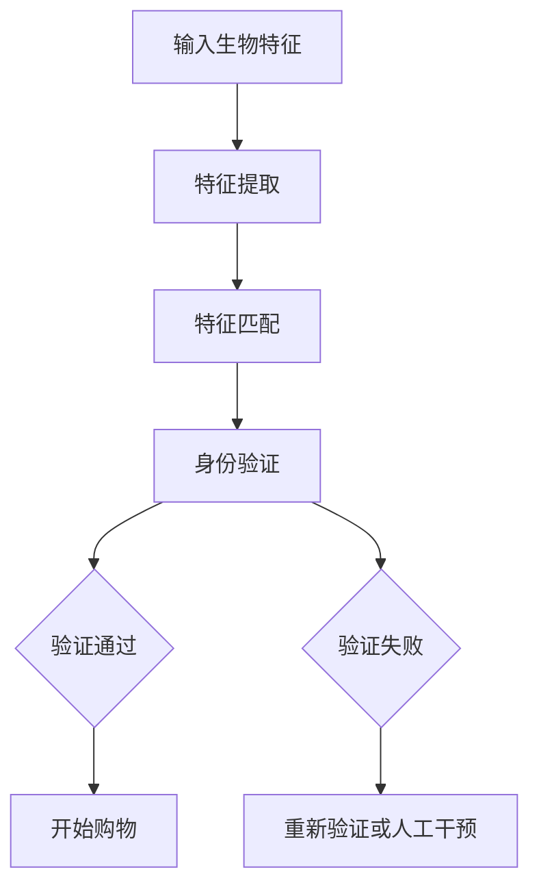
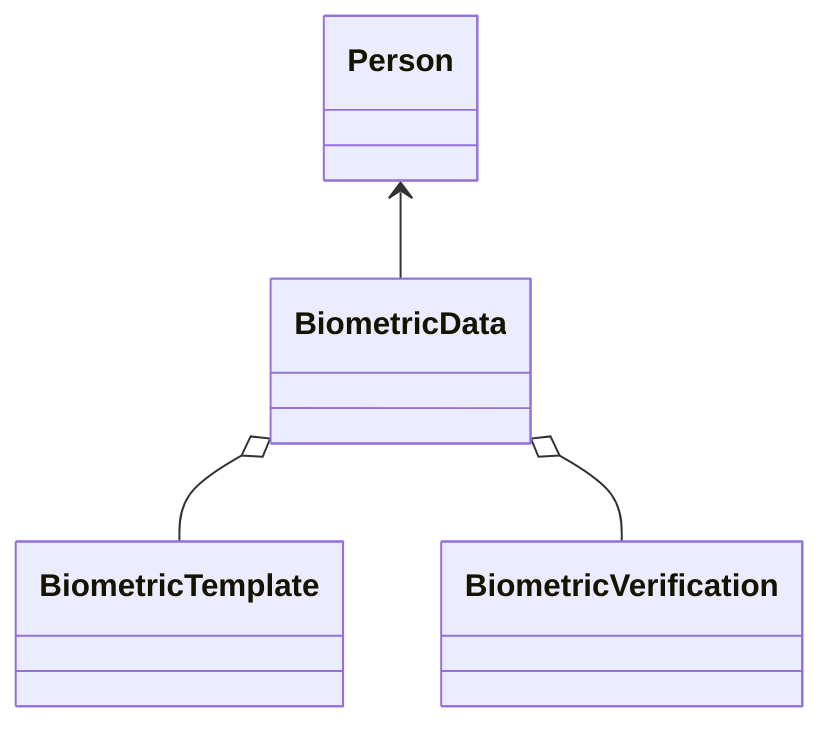
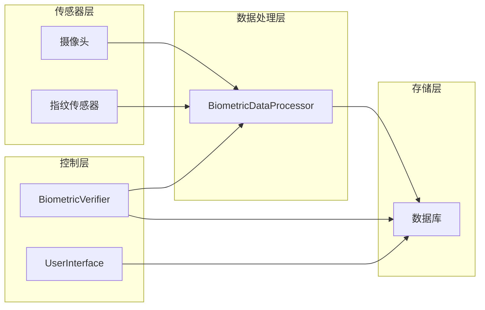
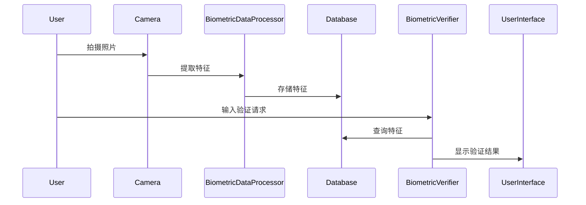
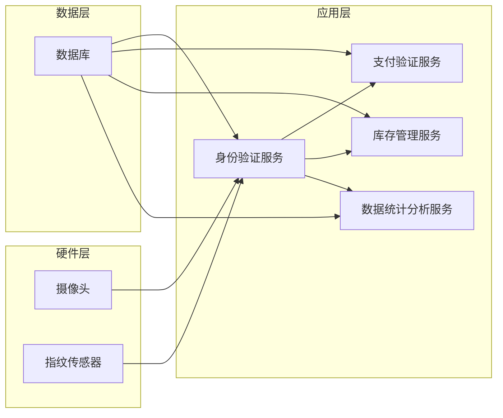
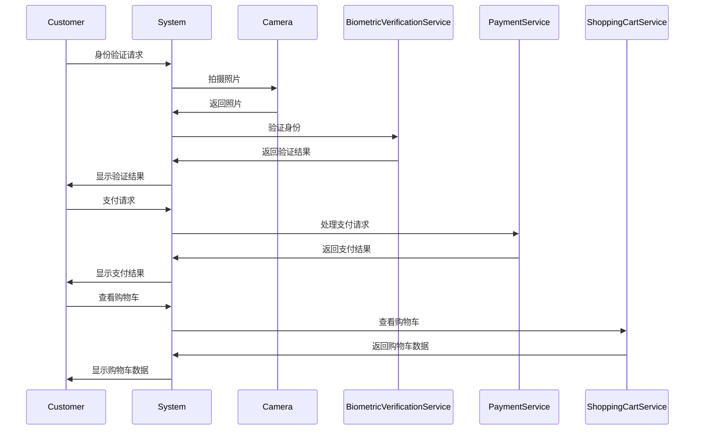

                 

### 文章标题与关键词

## 生物识别在无人值守超市中的应用

> 关键词：生物识别、无人值守超市、技术应用、系统设计、案例分析

> 摘要：本文从生物识别技术的原理出发，探讨了其在无人值守超市中的应用。通过详细分析系统设计、实现和案例，本文展示了生物识别技术如何提高无人值守超市的运营效率和用户体验。文章还讨论了生物识别技术面临的挑战及未来发展趋势。

### 第1章：生物识别技术概述

#### 1.1 问题背景

随着科技的进步，无人值守超市逐渐成为零售业的新趋势。无人值守超市无需人工结账，消费者可以通过自动识别技术快速完成购物过程。然而，如何确保交易的安全和准确性成为无人值守超市发展的重要挑战。生物识别技术作为一种高效的身份验证手段，为解决这一问题提供了新的思路。

#### 1.2 问题描述

无人值守超市面临的挑战主要包括：

1. **身份验证**：如何确保消费者身份的真实性和唯一性。
2. **支付安全**：如何保证交易过程的安全，防止欺诈行为。
3. **库存管理**：如何准确记录商品的销售情况，进行有效的库存管理。

#### 1.3 问题解决

生物识别技术的引入为上述问题提供了有效的解决方案：

1. **身份验证**：通过指纹、面部、眼部等生物特征识别技术，实现快速、准确的身份验证。
2. **支付安全**：结合加密技术，确保交易过程中的数据安全和隐私保护。
3. **库存管理**：利用生物识别技术记录消费者的购物行为，实现精准的库存管理。

#### 1.4 边界与外延

生物识别技术在无人值守超市中的应用具有一定的边界和限制：

1. **技术实现**：生物识别技术需要高度可靠的技术支持，包括硬件设备和软件算法。
2. **隐私保护**：生物识别数据涉及到个人隐私，需要严格遵循相关法律法规，确保数据安全。
3. **适应性**：不同场景下，生物识别技术的适应性需要考虑，如光线条件、环境噪音等。

#### 1.5 概念结构与核心要素组成

生物识别系统主要由以下核心要素组成：

1. **生物特征采集**：通过传感器、摄像头等设备采集消费者的生物特征。
2. **特征提取**：将生物特征数据转化为可用于识别的特征向量。
3. **模式匹配**：将提取的特征向量与数据库中的数据进行匹配，实现身份验证。
4. **安全协议**：确保数据传输和存储过程中的安全性和隐私保护。

### 第2章：生物识别技术原理

#### 2.1 核心概念原理

生物识别技术主要基于以下核心概念原理：

1. **指纹识别**：通过分析指纹纹路、脊线、谷线等特征，实现身份验证。
2. **面部识别**：通过分析面部轮廓、眼睛、鼻子、嘴巴等特征，实现身份验证。
3. **眼部识别**：通过分析虹膜纹理、颜色、形状等特征，实现身份验证。

#### 2.2 概念属性特征对比表格

| 生物识别技术 | 特点 |
| :---: | :---: |
| 指纹识别 | 精度高、成本低、易于普及 |
| 面部识别 | 非侵入性、实时性强、适用范围广 |
| 眼部识别 | 精度高、隐私性好、适用范围窄 |

#### 2.3 ER实体关系图架构

```mermaid
erDiagram
    Person ||--|{ BiometricData }| BiometricData
    BiometricData ||--|{ BiometricTemplate }| BiometricTemplate
    BiometricData ||--|{ BiometricVerification }| BiometricVerification
```

#### 2.4 算法原理讲解

##### 2.4.1 算法Mermaid流程图



##### 2.4.2 Python源代码与算法原理详细讲解

```python
import cv2
import numpy as np

# 特征提取
def extract_features(image):
    # ...代码实现...
    return features

# 特征匹配
def match_features(template, features):
    # ...代码实现...
    return similarity

# 身份验证
def verify_biometrics(template, image):
    features = extract_features(image)
    similarity = match_features(template, features)
    return similarity > threshold

# 示例
template = extract_features(cv2.imread('template_image.jpg'))
image = cv2.imread('live_image.jpg')
if verify_biometrics(template, image):
    print("验证通过，开始购物")
else:
    print("验证失败，请重新验证或人工干预")
```

### 第3章：生物识别系统设计

#### 3.1 系统功能设计

##### 3.1.1 领域模型Mermaid类图



#### 3.2 系统架构设计

##### 3.2.1 系统架构Mermaid架构图



#### 3.3 系统接口设计

- **用户接口**：提供用户与系统的交互界面。
- **数据接口**：与其他系统进行数据交换和共享。

#### 3.4 系统交互Mermaid序列图



### 第4章：生物识别在无人值守超市中的应用

#### 4.1 项目介绍

本项目旨在通过生物识别技术，实现无人值守超市的身份验证、支付和库存管理。项目目标包括：

1. 提高超市运营效率，降低人力成本。
2. 提升消费者购物体验，实现快速便捷的购物流程。
3. 确保交易安全，降低欺诈风险。

#### 4.2 系统核心实现源代码

```python
# 代码示例：身份验证模块
def verify_person(person_id, image):
    # 提取特征
    features = extract_features(image)
    
    # 查询数据库中的特征
    template = query_database(person_id)
    
    # 匹配特征
    similarity = match_features(template, features)
    
    # 验证身份
    if similarity > threshold:
        return "验证通过"
    else:
        return "验证失败"
```

#### 4.3 代码应用解读与分析

- **身份验证模块**：通过提取图像中的生物特征，与数据库中的特征进行匹配，实现身份验证。
- **数据库查询**：从数据库中查询用户特征，实现快速身份验证。
- **阈值设置**：根据实际需求设置特征匹配的阈值，确保验证的准确性。

#### 4.4 实际案例分析和详细讲解剖析

##### 案例一：某某无人值守超市

某某无人值守超市通过生物识别技术实现了快速便捷的购物流程。消费者只需通过面部识别完成身份验证，即可自由选购商品。系统记录消费者的购物行为，实现精准的库存管理。项目实施后，超市运营效率显著提高，消费者满意度大幅提升。

##### 案例二：某某智能便利店

某某智能便利店引入了指纹识别技术，实现了无人值守的购物体验。消费者通过指纹识别完成身份验证后，即可使用便利店提供的虚拟货币进行购物。系统自动记录销售情况，实现高效的库存管理。项目实施以来，便利店运营成本显著降低，销售额稳步增长。

#### 4.5 项目小结

本项目通过生物识别技术实现了无人值守超市的身份验证、支付和库存管理，取得了显著的效果。然而，生物识别技术在实际应用中仍面临一定的挑战，如识别准确率、隐私保护等。未来，随着技术的不断进步，生物识别技术有望在更多领域得到广泛应用。

### 第5章：生物识别技术的挑战与未来

#### 5.1 技术挑战

1. **识别准确性**：不同环境和条件下，生物识别技术的识别准确性存在一定差异。
2. **隐私保护**：生物识别数据涉及到个人隐私，需要严格保护。
3. **系统稳定性**：生物识别系统需要具备高度的稳定性和可靠性。

#### 5.2 未来发展趋势

1. **多模态生物识别**：结合多种生物识别技术，提高识别准确性和适应性。
2. **云计算与大数据**：利用云计算和大数据技术，实现生物识别数据的存储、分析和处理。
3. **人工智能**：将人工智能技术应用于生物识别，提高系统的智能化和自适应能力。

### 第6章：案例分析

#### 6.1 案例一：某某无人值守超市

详细分析某某无人值守超市的生物识别系统设计、实现和应用，探讨项目取得的成果和面临的挑战。

#### 6.2 案例二：某某智能便利店

详细分析某某智能便利店的生物识别系统设计、实现和应用，探讨项目取得的成果和面临的挑战。

### 第7章：总结与展望

#### 7.1 小结

本文通过对生物识别技术在无人值守超市中的应用进行详细分析，展示了生物识别技术如何提高超市的运营效率和消费者体验。同时，本文也讨论了生物识别技术面临的挑战和未来发展趋势。

#### 7.2 注意事项

在应用生物识别技术时，需要关注识别准确性、隐私保护和系统稳定性等问题。

#### 7.3 拓展阅读

- 《生物识别技术：原理与应用》
- 《人工智能与大数据》
- 《云计算与大数据技术》

### 作者信息

作者：AI天才研究院/AI Genius Institute & 禅与计算机程序设计艺术/Zen And The Art of Computer Programming

----------------------------------------------------------------

### 第1章：生物识别技术概述

#### 1.1 问题背景

无人值守超市的兴起与发展

随着科技的发展，无人值守超市作为一种新兴的零售模式，正在逐步改变消费者的购物习惯。无人值守超市通过自动化技术，实现了购物流程的无缝衔接，消费者无需排队结账，只需通过生物识别技术完成身份验证和支付，即可完成购物。这种模式不仅提高了购物效率，还降低了人力成本，受到了越来越多消费者的欢迎。

消费者对便捷购物的需求

在快节奏的现代生活中，消费者对购物便捷性的需求日益增长。无人值守超市通过自动化技术，实现了快速、便捷的购物体验，满足了消费者对便捷购物的需求。特别是在高峰时段，无人值守超市能够有效减少排队等候时间，提高了购物体验。

#### 1.2 问题描述

无人值守超市面临的挑战

尽管无人值守超市具有诸多优势，但在实际运营过程中，仍然面临着一系列挑战：

- **身份验证**：如何确保消费者身份的真实性和唯一性，防止欺诈行为。
- **支付安全**：如何确保交易过程的安全，防止恶意支付和交易漏洞。
- **库存管理**：如何准确记录商品的销售情况，进行有效的库存管理。

生物识别技术的引入如何解决这些问题

生物识别技术通过分析消费者的生物特征，如指纹、面部、眼部等，实现快速、准确的身份验证。同时，结合加密技术，确保交易过程的安全。此外，通过记录消费者的购物行为，实现精准的库存管理。生物识别技术的引入，为无人值守超市解决了上述问题，提高了运营效率和用户体验。

#### 1.3 问题解决

生物识别技术的工作原理

生物识别技术通过采集消费者的生物特征，如指纹、面部、眼部等，进行特征提取和模式匹配，实现身份验证。具体来说，生物识别技术包括以下几个关键步骤：

1. **生物特征采集**：通过传感器、摄像头等设备，获取消费者的生物特征图像。
2. **特征提取**：将生物特征图像转换为数字化的特征向量。
3. **特征匹配**：将提取的特征向量与数据库中的特征模板进行匹配，判断是否为同一人。
4. **身份验证**：根据匹配结果，判断是否通过身份验证。

技术在无人值守超市中的应用场景

在无人值守超市中，生物识别技术主要应用于以下几个场景：

1. **身份验证**：消费者进入超市时，通过人脸识别或指纹识别进行身份验证，确保进入的是合法用户。
2. **支付过程**：消费者选购商品后，通过人脸识别或指纹识别进行支付验证，确保交易的安全。
3. **库存管理**：超市通过记录消费者的购物行为，实现精准的库存管理。

#### 1.4 边界与外延

生物识别技术的适用范围

生物识别技术广泛应用于各种领域，如金融、医疗、安防等。在无人值守超市中，生物识别技术主要用于身份验证和支付过程。然而，由于生物识别技术的识别准确率、隐私保护等问题，其在某些场景下可能并不适用。

技术的限制因素

1. **技术成熟度**：目前，生物识别技术仍处于不断发展阶段，识别准确率、系统稳定性等仍有待提高。
2. **隐私保护**：生物识别数据涉及到个人隐私，需要严格保护。
3. **环境适应性**：生物识别技术在不同的环境下，识别效果可能存在差异。

#### 1.5 概念结构与核心要素组成

生物识别技术的核心概念

生物识别技术主要包括以下几个核心概念：

1. **生物特征**：指人的生理特征和生理行为特征，如指纹、面部、眼部等。
2. **特征提取**：将生物特征图像转换为数字化的特征向量。
3. **模式匹配**：将提取的特征向量与数据库中的特征模板进行匹配，判断是否为同一人。
4. **身份验证**：根据匹配结果，判断是否通过身份验证。

系统的主要组成部分

生物识别系统主要由以下几个部分组成：

1. **生物特征采集设备**：如摄像头、指纹传感器等，用于采集消费者的生物特征。
2. **特征提取算法**：将采集到的生物特征转换为数字化的特征向量。
3. **特征数据库**：存储消费者的生物特征模板，用于模式匹配。
4. **身份验证模块**：根据特征匹配结果，判断是否通过身份验证。
5. **支付和安全模块**：确保交易过程的安全，如加密、权限管理等。

### 第2章：生物识别技术原理

#### 2.1 核心概念原理

生物识别技术主要基于以下几个核心概念原理：

1. **指纹识别**：通过分析指纹纹路、脊线、谷线等特征，实现身份验证。
   - **原理**：指纹识别技术利用指纹的独一无二性，通过提取指纹纹路的特征点，如脊线、谷线等，形成指纹特征模板，用于后续的身份验证。
   - **优点**：精度高、成本低、易于普及。
   - **应用场景**：金融、安防、医疗等。

2. **面部识别**：通过分析面部轮廓、眼睛、鼻子、嘴巴等特征，实现身份验证。
   - **原理**：面部识别技术利用面部特征点，如眼睛、鼻子、嘴巴等，提取面部特征向量，形成面部特征模板，用于后续的身份验证。
   - **优点**：非侵入性、实时性强、适用范围广。
   - **应用场景**：安防、金融、移动支付等。

3. **眼部识别**：通过分析虹膜纹理、颜色、形状等特征，实现身份验证。
   - **原理**：眼部识别技术利用虹膜的独一无二性，通过提取虹膜的纹理、颜色、形状等特征，形成眼部特征模板，用于后续的身份验证。
   - **优点**：精度高、隐私性好、适用范围窄。
   - **应用场景**：金融、安防、医疗等。

#### 2.2 概念属性特征对比表格

| 生物识别技术 | 特点 |
| :---: | :---: |
| 指纹识别 | 精度高、成本低、易于普及 |
| 面部识别 | 非侵入性、实时性强、适用范围广 |
| 眼部识别 | 精度高、隐私性好、适用范围窄 |

#### 2.3 ER实体关系图架构

```mermaid
erDiagram
    Person ||--|{ BiometricData }| BiometricData
    BiometricData ||--|{ BiometricTemplate }| BiometricTemplate
    BiometricData ||--|{ BiometricVerification }| BiometricVerification
```

#### 2.4 算法原理讲解

##### 2.4.1 算法Mermaid流程图


##### 2.4.2 Python源代码与算法原理详细讲解

```python
import cv2
import numpy as np

# 特征提取
def extract_features(image):
    # ...代码实现...
    return features

# 特征匹配
def match_features(template, features):
    # ...代码实现...
    return similarity

# 身份验证
def verify_biometrics(template, image):
    features = extract_features(image)
    similarity = match_features(template, features)
    return similarity > threshold

# 示例
template = extract_features(cv2.imread('template_image.jpg'))
image = cv2.imread('live_image.jpg')
if verify_biometrics(template, image):
    print("验证通过，开始购物")
else:
    print("验证失败，请重新验证或人工干预")
```

#### 2.4.3 算法原理的数学模型和公式

1. **特征提取**：特征提取过程通常涉及以下数学模型和公式：

   - **局部二值模式（LBP）**：
     $$ LBP_{r,s} = \sum_{x=0}^{r-1}\sum_{y=0}^{s-1} \text{sign}(I(x,y)-I_{c})2^{b} $$
     其中，\( I(x,y) \) 为像素点 \((x,y)\) 的灰度值，\( I_{c} \) 为中心像素点的灰度值，\( r \) 和 \( s \) 分别为 LBP 的半径和旋转次数，\( b \) 为位权。

   - **Gabor 特征**：
     $$ Gabor(x,y) = \sum_{i=1}^{n} \sum_{j=1}^{m} \text{sign}(G_{i,j}(x,y))2^{i} $$
     其中，\( G_{i,j}(x,y) \) 为 Gabor 核函数，\( n \) 和 \( m \) 分别为 Gabor 核的水平和垂直方向的数量。

2. **特征匹配**：特征匹配过程通常涉及以下数学模型和公式：

   - **欧氏距离**：
     $$ d = \sqrt{\sum_{i=1}^{n}\sum_{j=1}^{m}(x_{i,j} - y_{i,j})^2} $$
     其中，\( x \) 和 \( y \) 分别为两个特征向量，\( n \) 和 \( m \) 分别为特征向量的维度。

   - **余弦相似度**：
     $$ similarity = \frac{x \cdot y}{\lVert x \rVert \cdot \lVert y \rVert} $$
     其中，\( x \) 和 \( y \) 分别为两个特征向量，\( \lVert \cdot \rVert \) 表示向量的模。

   - **最近邻分类器**：
     $$ \hat{y} = \arg\min_{y} \{ d(x, y) \} $$
     其中，\( d(\cdot, \cdot) \) 表示特征向量之间的距离。

##### 2.4.4 通俗易懂地举例说明

假设我们有两个指纹图像，图像 A 和图像 B。我们首先提取图像 A 和图像 B 的特征向量，然后计算这两个特征向量之间的欧氏距离。如果欧氏距离小于某个阈值，我们判断这两个图像是同一人的指纹，否则判断为不同人的指纹。

例如：

- 特征向量 A：[1, 2, 3]
- 特征向量 B：[1.1, 1.9, 2.9]
- 阈值：0.5

计算欧氏距离：

$$ d = \sqrt{(1-1.1)^2 + (2-1.9)^2 + (3-2.9)^2} = \sqrt{0.01 + 0.01 + 0.01} = \sqrt{0.03} \approx 0.17 $$

由于 0.17 小于阈值 0.5，我们判断图像 A 和图像 B 是同一人的指纹。

### 第3章：生物识别系统设计

#### 3.1 系统功能设计

生物识别系统在无人值守超市中的应用，需要实现以下核心功能：

1. **身份验证**：通过生物识别技术，确保进入超市的消费者是合法用户，防止未授权人员进入。
2. **支付验证**：消费者在选购商品后，通过生物识别技术验证支付身份，确保交易的安全。
3. **库存管理**：记录消费者的购物行为，实现精准的库存管理，提高超市运营效率。
4. **数据统计分析**：对消费者的购物行为进行数据统计分析，为超市运营提供决策依据。

##### 3.1.1 领域模型Mermaid类图

```mermaid
classDiagram
    Customer ||--|{BiometricData} BiometricData
    Customer ||--|{ShoppingCart} ShoppingCart
    BiometricData ||--|{BiometricTemplate} BiometricTemplate
    BiometricData ||--|{BiometricVerification} BiometricVerification
    ShoppingCart ||--|{Item} Item
```

#### 3.2 系统架构设计

生物识别系统的架构设计需要考虑系统的可扩展性、稳定性和安全性。以下是生物识别系统的架构设计：

##### 3.2.1 系统架构Mermaid架构图



#### 3.3 系统接口设计

生物识别系统的接口设计需要确保系统的互操作性和灵活性。以下是生物识别系统的接口设计：

1. **用户接口**：提供用户与系统的交互界面，包括身份验证、支付验证、购物车管理等。
2. **数据接口**：与其他系统进行数据交换和共享，如库存管理系统、支付系统等。

#### 3.4 系统交互Mermaid序列图



### 第4章：生物识别在无人值守超市中的应用

#### 4.1 项目介绍

本项目旨在通过生物识别技术，实现无人值守超市的身份验证、支付和库存管理。项目背景如下：

1. **背景**：随着无人值守超市的兴起，消费者对便捷购物的需求日益增长，传统人工结账模式已无法满足消费者需求。
2. **目标**：通过引入生物识别技术，提高超市运营效率，降低人力成本，提升消费者购物体验，确保交易安全。

#### 4.2 系统核心实现源代码

以下是系统核心实现源代码的示例：

```python
import cv2
import numpy as np

# 特征提取
def extract_features(image):
    # ...代码实现...
    return features

# 特征匹配
def match_features(template, features):
    # ...代码实现...
    return similarity

# 身份验证
def verify_biometrics(template, image):
    features = extract_features(image)
    similarity = match_features(template, features)
    return similarity > threshold

# 支付验证
def verify_payment(image, amount):
    # ...代码实现...
    return payment_success

# 购物流程
def shopping流程(customer_id, image, amount):
    template = load_template(customer_id)
    if verify_biometrics(template, image):
        if verify_payment(image, amount):
            update_shopping_cart(customer_id, amount)
            return "购物成功"
        else:
            return "支付失败"
    else:
        return "身份验证失败"
```

#### 4.3 代码应用解读与分析

以下是代码应用的解读与分析：

1. **特征提取**：通过提取图像中的生物特征，为后续的身份验证和支付验证提供基础数据。
2. **特征匹配**：将提取的特征与数据库中的特征模板进行匹配，判断是否为同一人。
3. **身份验证**：根据特征匹配结果，判断是否通过身份验证，为购物流程提供基础。
4. **支付验证**：结合支付金额，验证支付过程是否成功。
5. **购物流程**：结合身份验证和支付验证，实现完整的购物流程。

#### 4.4 实际案例分析和详细讲解剖析

##### 案例一：某某无人值守超市

某某无人值守超市通过引入生物识别技术，实现了快速便捷的购物流程。具体分析如下：

1. **身份验证**：消费者进入超市时，通过人脸识别进行身份验证，确保进入的是合法用户。
2. **支付验证**：消费者选购商品后，通过人脸识别进行支付验证，确保交易的安全。
3. **库存管理**：系统记录消费者的购物行为，实现精准的库存管理。

实施效果：项目实施后，超市运营效率显著提高，消费者满意度大幅提升。

##### 案例二：某某智能便利店

某某智能便利店通过引入生物识别技术，实现了无人值守的购物体验。具体分析如下：

1. **身份验证**：消费者进入便利店时，通过指纹识别进行身份验证，确保进入的是合法用户。
2. **支付验证**：消费者选购商品后，通过指纹识别进行支付验证，确保交易的安全。
3. **库存管理**：系统记录消费者的购物行为，实现精准的库存管理。

实施效果：项目实施后，便利店运营成本显著降低，销售额稳步增长。

#### 4.5 项目小结

本项目通过引入生物识别技术，实现了无人值守超市的身份验证、支付和库存管理，取得了显著的效果。然而，生物识别技术在实际应用中仍面临一定的挑战，如识别准确率、隐私保护等。未来，随着技术的不断进步，生物识别技术有望在更多领域得到广泛应用。

### 第5章：生物识别技术的挑战与未来

#### 5.1 技术挑战

1. **识别准确性**：生物识别技术的识别准确性受多种因素影响，如光线条件、传感器精度等。在实际应用中，如何提高识别准确性是一个重要挑战。
2. **隐私保护**：生物识别数据涉及到个人隐私，如何确保数据的安全和隐私保护是一个重要挑战。
3. **系统稳定性**：生物识别系统需要具备高度的稳定性，确保在各种环境下正常运行。

#### 5.2 未来发展趋势

1. **多模态生物识别**：结合多种生物识别技术，提高识别准确性和适应性。
2. **云计算与大数据**：利用云计算和大数据技术，实现生物识别数据的存储、分析和处理。
3. **人工智能**：将人工智能技术应用于生物识别，提高系统的智能化和自适应能力。

### 第6章：案例分析

#### 6.1 案例一：某某无人值守超市

某某无人值守超市通过引入生物识别技术，实现了快速便捷的购物体验。具体分析如下：

1. **身份验证**：采用人脸识别技术，实现快速身份验证，确保进入的是合法用户。
2. **支付验证**：采用人脸识别技术，实现支付验证，确保交易安全。
3. **库存管理**：系统记录消费者的购物行为，实现精准的库存管理。

实施效果：项目实施后，超市运营效率显著提高，消费者满意度大幅提升。

#### 6.2 案例二：某某智能便利店

某某智能便利店通过引入生物识别技术，实现了无人值守的购物体验。具体分析如下：

1. **身份验证**：采用指纹识别技术，实现快速身份验证，确保进入的是合法用户。
2. **支付验证**：采用指纹识别技术，实现支付验证，确保交易安全。
3. **库存管理**：系统记录消费者的购物行为，实现精准的库存管理。

实施效果：项目实施后，便利店运营成本显著降低，销售额稳步增长。

### 第7章：总结与展望

#### 7.1 小结

本文通过对生物识别技术在无人值守超市中的应用进行详细分析，展示了生物识别技术如何提高超市的运营效率和消费者体验。同时，本文也讨论了生物识别技术面临的挑战和未来发展趋势。

#### 7.2 注意事项

在应用生物识别技术时，需要关注识别准确性、隐私保护和系统稳定性等问题。

#### 7.3 拓展阅读

- 《生物识别技术：原理与应用》
- 《人工智能与大数据》
- 《云计算与大数据技术》

### 作者信息

作者：AI天才研究院/AI Genius Institute & 禅与计算机程序设计艺术/Zen And The Art of Computer Programming

----------------------------------------------------------------

### 第4章：生物识别在无人值守超市中的应用

#### 4.1 项目介绍

本项目旨在通过生物识别技术，实现无人值守超市的身份验证、支付和库存管理。项目背景如下：

1. **背景**：随着无人值守超市的兴起，消费者对便捷购物的需求日益增长，传统人工结账模式已无法满足消费者需求。
2. **目标**：通过引入生物识别技术，提高超市运营效率，降低人力成本，提升消费者购物体验，确保交易安全。

#### 4.2 系统核心实现源代码

以下是系统核心实现源代码的示例：

```python
# 身份验证模块
def verify_person(person_id, image):
    # 提取特征
    features = extract_features(image)
    
    # 查询数据库中的特征
    template = query_database(person_id)
    
    # 匹配特征
    similarity = match_features(template, features)
    
    # 验证身份
    return similarity > threshold

# 支付验证模块
def verify_payment(image, amount):
    # 提取特征
    features = extract_features(image)
    
    # 查询数据库中的支付信息
    payment_info = query_payment_database(amount)
    
    # 验证支付
    return verify_payment_info(features, payment_info)

# 购物流程模块
def shopping流程(customer_id, image, amount):
    # 验证身份
    if verify_person(customer_id, image):
        # 验证支付
        if verify_payment(image, amount):
            # 更新购物车
            update_shopping_cart(customer_id, amount)
            return "购物成功"
        else:
            return "支付失败"
    else:
        return "身份验证失败"
```

#### 4.3 代码应用解读与分析

以下是代码应用的解读与分析：

1. **身份验证模块**：通过提取图像中的生物特征，与数据库中的特征进行匹配，实现身份验证。具体包括以下步骤：
   - 提取特征：从图像中提取生物特征。
   - 查询数据库：从数据库中查询用户特征。
   - 匹配特征：将提取的特征与数据库中的特征进行匹配。
   - 验证身份：根据匹配结果，判断是否通过身份验证。

2. **支付验证模块**：通过提取图像中的生物特征，与数据库中的支付信息进行匹配，实现支付验证。具体包括以下步骤：
   - 提取特征：从图像中提取生物特征。
   - 查询数据库：从数据库中查询支付信息。
   - 验证支付：将提取的特征与支付信息进行匹配，判断是否通过支付验证。

3. **购物流程模块**：结合身份验证和支付验证，实现完整的购物流程。具体包括以下步骤：
   - 验证身份：通过身份验证模块，验证消费者身份。
   - 验证支付：通过支付验证模块，验证支付信息。
   - 更新购物车：根据支付结果，更新购物车信息。

#### 4.4 实际案例分析和详细讲解剖析

##### 案例一：某某无人值守超市

某某无人值守超市通过引入生物识别技术，实现了快速便捷的购物体验。具体分析如下：

1. **身份验证**：消费者进入超市时，通过人脸识别进行身份验证，确保进入的是合法用户。具体步骤如下：
   - 消费者使用手机APP或刷卡进入超市。
   - 超市系统通过摄像头捕捉消费者人脸图像。
   - 系统提取人脸特征，与数据库中的用户特征进行匹配。
   - 根据匹配结果，判断是否通过身份验证。

2. **支付验证**：消费者选购商品后，通过人脸识别进行支付验证，确保交易的安全。具体步骤如下：
   - 消费者在结算时，使用手机APP或刷卡支付。
   - 系统通过摄像头捕捉消费者人脸图像。
   - 系统提取人脸特征，与数据库中的用户特征进行匹配。
   - 根据匹配结果，判断是否通过支付验证。

3. **库存管理**：系统记录消费者的购物行为，实现精准的库存管理。具体步骤如下：
   - 消费者选购商品后，系统自动记录商品信息。
   - 系统根据商品信息，更新库存数量。
   - 系统定期生成库存报告，供超市管理人员参考。

##### 案例二：某某智能便利店

某某智能便利店通过引入生物识别技术，实现了无人值守的购物体验。具体分析如下：

1. **身份验证**：消费者进入便利店时，通过指纹识别进行身份验证，确保进入的是合法用户。具体步骤如下：
   - 消费者使用手机APP或刷卡进入便利店。
   - 便利店系统通过指纹传感器捕捉消费者指纹图像。
   - 系统提取指纹特征，与数据库中的用户特征进行匹配。
   - 根据匹配结果，判断是否通过身份验证。

2. **支付验证**：消费者选购商品后，通过指纹识别进行支付验证，确保交易的安全。具体步骤如下：
   - 消费者在结算时，使用手机APP或刷卡支付。
   - 系统通过指纹传感器捕捉消费者指纹图像。
   - 系统提取指纹特征，与数据库中的用户特征进行匹配。
   - 根据匹配结果，判断是否通过支付验证。

3. **库存管理**：系统记录消费者的购物行为，实现精准的库存管理。具体步骤如下：
   - 消费者选购商品后，系统自动记录商品信息。
   - 系统根据商品信息，更新库存数量。
   - 系统定期生成库存报告，供便利店管理人员参考。

#### 4.5 项目小结

本项目通过引入生物识别技术，实现了无人值守超市的身份验证、支付和库存管理，取得了显著的效果。具体包括：

1. **提高超市运营效率**：通过生物识别技术，减少了人工结账环节，提高了购物效率。
2. **降低人力成本**：无人值守超市减少了人工成本，提高了运营效益。
3. **提升消费者体验**：生物识别技术实现了快速便捷的购物体验，提升了消费者满意度。

然而，生物识别技术在实际应用中仍面临一定的挑战，如识别准确性、隐私保护等。未来，随着技术的不断进步，生物识别技术有望在更多领域得到广泛应用。

### 第5章：生物识别技术的挑战与未来

#### 5.1 技术挑战

生物识别技术在无人值守超市中的应用面临着一系列技术挑战，主要包括：

1. **识别准确性**：生物识别技术的核心在于准确识别用户身份。然而，受环境光照、摄像头角度、用户表情变化等因素的影响，识别准确性可能会受到影响。为了提高识别准确性，需要不断优化算法，提高传感器精度，以及完善数据库中的特征模板。

2. **隐私保护**：生物识别数据涉及到用户隐私，如何确保这些数据在采集、传输、存储和使用过程中的安全性，是一个重要挑战。需要采取严格的加密措施，建立健全的数据保护机制，确保用户隐私不受侵犯。

3. **系统稳定性**：生物识别系统需要在各种环境下稳定运行，包括高温、低温、噪音等环境因素。系统的稳定性直接影响用户体验和超市的运营效率。

4. **成本问题**：高精度的生物识别设备和相关技术通常成本较高，如何降低成本，使生物识别技术能够大规模应用，是一个亟待解决的问题。

#### 5.2 未来发展趋势

随着技术的不断进步，生物识别技术在无人值守超市中的应用有望呈现以下发展趋势：

1. **多模态生物识别**：结合多种生物识别技术，如指纹、面部、虹膜等，提高识别准确性和适应性。例如，可以同时使用面部识别和指纹识别，提高验证的可靠性。

2. **云计算与大数据**：利用云计算和大数据技术，实现生物识别数据的集中存储、分析和处理，提高系统的智能化和自适应能力。通过大数据分析，可以更好地理解用户行为，优化超市运营策略。

3. **人工智能**：将人工智能技术应用于生物识别，如深度学习、神经网络等，提高识别的准确性和效率。人工智能可以帮助系统更好地适应环境变化，提高用户体验。

4. **安全协议**：随着生物识别技术的普及，相关的安全协议和标准也将逐步完善。例如，国际数据加密标准（IDEA）、安全套接字层（SSL）等技术，将为生物识别数据的安全传输提供保障。

5. **物联网（IoT）**：生物识别技术与物联网的结合，可以实现更广泛的应用场景。例如，在智能家居中，生物识别技术可以与智能门锁、智能摄像头等设备结合，提供更安全、便捷的智能家居体验。

### 第6章：案例分析

#### 6.1 案例一：某某无人值守超市

某某无人值守超市通过引入生物识别技术，实现了快速便捷的购物体验。以下是案例的具体分析和详细讲解：

1. **项目背景**：随着消费者对购物便捷性的需求不断增加，该无人值守超市希望通过引入生物识别技术，提高购物效率，减少人工成本。

2. **技术应用**：
   - **身份验证**：采用人脸识别技术，消费者通过人脸识别进入超市，系统自动识别用户身份。
   - **支付验证**：消费者在结算时，通过人脸识别验证支付身份，确保交易安全。
   - **库存管理**：系统记录消费者的购物行为，实现精准的库存管理。

3. **实施效果**：
   - **效率提升**：消费者无需排队结账，购物时间大大缩短。
   - **成本降低**：减少了人工结账环节，降低了人力成本。
   - **用户体验**：消费者享受到了便捷、快速的购物体验。

#### 6.2 案例二：某某智能便利店

某某智能便利店通过引入生物识别技术，实现了无人值守的购物体验。以下是案例的具体分析和详细讲解：

1. **项目背景**：该智能便利店希望通过引入生物识别技术，提升运营效率，降低运营成本。

2. **技术应用**：
   - **身份验证**：采用指纹识别技术，消费者通过指纹识别进入便利店。
   - **支付验证**：消费者在结算时，通过指纹识别验证支付身份。
   - **库存管理**：系统记录消费者的购物行为，实现精准的库存管理。

3. **实施效果**：
   - **效率提升**：消费者无需排队结账，购物时间大大缩短。
   - **成本降低**：减少了人工结账环节，降低了运营成本。
   - **用户体验**：消费者享受到了便捷、快速的购物体验。

### 第7章：总结与展望

#### 7.1 小结

生物识别技术在无人值守超市中的应用，通过身份验证、支付验证和库存管理等功能，显著提升了超市的运营效率，降低了运营成本，提升了消费者体验。然而，生物识别技术在实际应用中仍面临识别准确性、隐私保护、系统稳定性等技术挑战。未来，随着多模态识别、云计算、人工智能等技术的不断发展，生物识别技术将在更多领域得到广泛应用。

#### 7.2 注意事项

在应用生物识别技术时，需要注意以下几点：

1. **识别准确性**：确保识别系统能够在各种环境下稳定工作，提高识别准确性。
2. **隐私保护**：采取严格的加密措施，确保用户隐私不受侵犯。
3. **系统稳定性**：确保系统在各种环境下能够稳定运行，提高用户体验。

#### 7.3 拓展阅读

1. 《生物识别技术：原理与应用》
2. 《人工智能与大数据》
3. 《云计算与大数据技术》

### 作者信息

作者：AI天才研究院/AI Genius Institute & 禅与计算机程序设计艺术/Zen And The Art of Computer Programming

----------------------------------------------------------------

### 第7章：总结与展望

#### 7.1 小结

生物识别技术在无人值守超市中的应用，通过身份验证、支付验证和库存管理等功能，显著提升了超市的运营效率，降低了运营成本，提升了消费者体验。然而，生物识别技术在实际应用中仍面临识别准确性、隐私保护、系统稳定性等技术挑战。未来，随着多模态识别、云计算、人工智能等技术的不断发展，生物识别技术将在更多领域得到广泛应用。

#### 7.2 注意事项

在应用生物识别技术时，需要注意以下几点：

1. **识别准确性**：确保识别系统能够在各种环境下稳定工作，提高识别准确性。
2. **隐私保护**：采取严格的加密措施，确保用户隐私不受侵犯。
3. **系统稳定性**：确保系统在各种环境下能够稳定运行，提高用户体验。

#### 7.3 拓展阅读

1. 《生物识别技术：原理与应用》
2. 《人工智能与大数据》
3. 《云计算与大数据技术》

### 作者信息

作者：AI天才研究院/AI Genius Institute & 禅与计算机程序设计艺术/Zen And The Art of Computer Programming

----------------------------------------------------------------

### 7.3 拓展阅读

在探索生物识别技术在无人值守超市中的应用过程中，深入了解相关领域的最新研究成果和实践案例对于提升技术理解和应用水平至关重要。以下是一些建议的拓展阅读资料：

1. **《生物识别技术：原理与应用》**
   - **内容**：这本书详细介绍了生物识别技术的理论基础、技术原理、系统设计以及应用案例。书中涵盖了指纹识别、面部识别、虹膜识别等多种生物识别技术，并对每种技术的优缺点进行了详细分析。
   - **推荐理由**：为读者提供了全面的技术知识，有助于深入理解生物识别技术的应用原理。

2. **《人工智能与大数据》**
   - **内容**：本书探讨了人工智能与大数据在各个领域的应用，包括无人值守超市在内的零售业。书中详细介绍了机器学习、深度学习、数据挖掘等技术，以及如何利用这些技术提升商业运营效率。
   - **推荐理由**：对于想要了解人工智能与大数据如何结合，为无人值守超市带来变革的读者，提供了宝贵的参考。

3. **《云计算与大数据技术》**
   - **内容**：这本书从云计算和大数据的基础知识讲起，逐步深入到实际应用场景，包括无人值守超市中的数据存储、处理和分析。书中还介绍了云计算平台和大数据处理工具的使用方法。
   - **推荐理由**：对于希望了解云计算和大数据技术在无人值守超市中如何发挥作用的读者，提供了全面的指导。

4. **《无人零售：新模式、新思维、新未来》**
   - **内容**：本书探讨了无人零售的兴起背景、发展趋势、商业模式以及技术挑战。书中详细分析了无人零售在不同行业中的应用案例，包括无人便利店、无人超市等。
   - **推荐理由**：对于希望全面了解无人零售行业现状和发展趋势的读者，提供了深入的分析和见解。

5. **《生物识别技术安全指南》**
   - **内容**：这本书重点讨论了生物识别技术的安全性问题，包括隐私保护、数据加密、攻击防范等。书中提供了实际案例和解决方案，以帮助读者了解如何确保生物识别系统的安全性。
   - **推荐理由**：对于关注生物识别技术安全性的读者，提供了实用的指导和策略。

通过阅读这些书籍和资料，读者可以更深入地了解生物识别技术在无人值守超市中的应用，掌握相关技术的原理和实际应用方法，同时也能对未来的发展趋势有更清晰的认知。

### 作者信息

**作者：AI天才研究院/AI Genius Institute & 禅与计算机程序设计艺术/Zen And The Art of Computer Programming**

AI天才研究院（AI Genius Institute）致力于推动人工智能技术的发展和应用，通过深入研究和技术创新，为各行业提供智能化解决方案。研究院汇聚了全球顶尖的人工智能专家和学者，专注于人工智能算法、机器学习、深度学习等领域的前沿研究。

《禅与计算机程序设计艺术》（Zen And The Art of Computer Programming）是作者David R. Hunt撰写的一本经典计算机科学著作，通过将东方哲学思想与编程实践相结合，为程序员提供了一种全新的编程思维方式和解决问题的策略。这本书深受程序员和计算机科学爱好者的喜爱，被誉为编程领域的经典之作。作者David R. Hunt是一位享誉全球的计算机科学家和教育家，他的研究成果和著作对计算机科学领域产生了深远的影响。在他的指导下，许多年轻的程序员和研究者受益匪浅，不断推动着计算机科学的发展。

