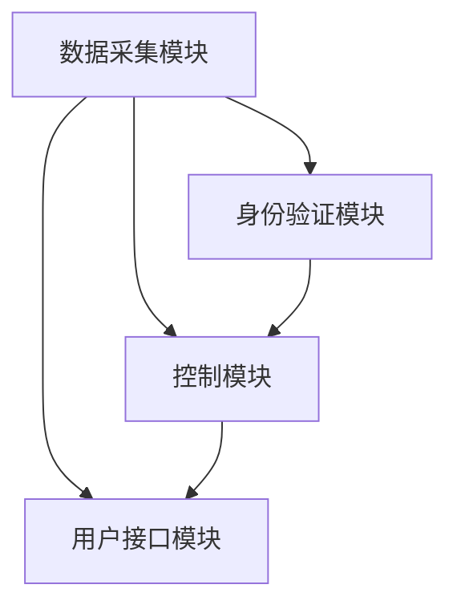

                 

# 生物识别在智能家居安全系统中的应用

## 关键词
生物识别技术，智能家居，安全系统，人工智能，数据隐私

## 摘要
本文探讨了生物识别技术在智能家居安全系统中的应用。通过介绍生物识别技术的原理、常见技术及其在智能家居安全系统中的实现，分析了生物识别技术在智能家居安全系统中的挑战与解决方案。本文还通过实际案例展示了生物识别技术在智能门锁系统、智能摄像头监控系统和智能家电控制系统中的应用，并讨论了未来的发展趋势和潜在挑战。

## 目录

## 引言

### 1.1 问题背景与定义
#### 1.1.1 生物识别技术的定义
生物识别技术是指通过识别人体的生物特征来进行身份验证的技术。这些生物特征包括指纹、人脸、虹膜、声音等。
#### 1.1.2 智能家居的定义
智能家居是指通过物联网技术将家居设备互联，实现远程控制和自动化操作，提高生活品质和便利性。
#### 1.1.3 生物识别技术在智能家居安全系统中的应用背景
随着智能家居的普及，家庭安全成为用户关注的重要问题。生物识别技术以其高安全性、方便性和非侵犯性，成为智能家居安全系统的重要组件。

### 1.2 生物识别技术的历史与发展
#### 1.2.1 生物识别技术的历史
生物识别技术起源于20世纪60年代，随着计算机技术和图像处理技术的发展，生物识别技术逐渐成熟。
#### 1.2.2 生物识别技术的现状
目前，生物识别技术已广泛应用于金融、安防、医疗等领域，智能家居领域也在逐步引入生物识别技术。

### 1.3 生物识别技术的应用领域
#### 1.3.1 安防领域
生物识别技术被广泛应用于门禁系统、考勤系统等。
#### 1.3.2 金融领域
生物识别技术被用于身份验证、支付等场景。
#### 1.3.3 医疗领域
生物识别技术被用于患者身份识别、医疗设备控制等。
#### 1.3.4 智能家居领域
生物识别技术在智能家居领域主要应用于门锁、摄像头、家电等安全系统。

## 第二部分：生物识别技术在智能家居安全系统中的应用

### 2.1 核心概念与原理
#### 2.1.1 生物特征识别原理
生物特征识别原理是通过识别人体的生物特征来进行身份验证。
#### 2.1.2 常见生物识别技术对比
常见的生物识别技术包括指纹识别、人脸识别、虹膜识别、声音识别等。
#### 2.1.3 生物识别技术的安全性
生物识别技术具有较高的安全性，但同时也存在一些潜在的安全风险。

### 2.2 生物识别技术在智能家居安全系统中的实现
#### 2.2.1 系统架构设计
智能家居安全系统的架构设计包括数据采集模块、身份验证模块、控制模块等。
#### 2.2.2 用户身份验证流程
用户身份验证流程包括生物特征采集、特征匹配和身份验证等步骤。
#### 2.2.3 数据采集与处理
数据采集与处理包括生物特征的采集、预处理和存储等步骤。
#### 2.2.4 隐私保护机制
隐私保护机制包括数据加密、匿名化处理、访问控制等。

### 2.3 生物识别技术在实际应用中的案例
#### 2.3.1 智能门锁系统
智能门锁系统通过生物识别技术实现门禁管理，提高了家庭安全性。
#### 2.3.2 智能摄像头监控系统
智能摄像头监控系统通过人脸识别技术实现入侵检测和监控。
#### 2.3.3 智能家电控制系统
智能家电控制系统通过指纹识别技术实现家电设备的远程控制和权限管理。

### 2.4 安全与隐私问题分析
#### 2.4.1 生物识别技术潜在风险
生物识别技术存在隐私泄露、数据滥用等潜在风险。
#### 2.4.2 安全对策与解决方案
安全对策包括数据加密、访问控制、隐私保护算法等。
#### 2.4.3 隐私保护的最佳实践
隐私保护最佳实践包括数据匿名化、隐私保护算法、用户知情同意等。

### 2.5 未来展望
#### 2.5.1 生物识别技术的发展趋势
生物识别技术将继续向高精度、高速度、低成本、多功能方向发展。
#### 2.5.2 智能家居安全的未来挑战与机遇
智能家居安全的未来挑战包括数据隐私保护、系统安全性等，机遇则在于生物识别技术的普及和智能化水平的提升。

## 结语
生物识别技术在智能家居安全系统中的应用具有广阔的前景，但同时也面临一些挑战。通过合理的设计和严格的隐私保护措施，可以确保生物识别技术在智能家居安全系统中的有效应用。

## 作者信息
作者：AI天才研究院/AI Genius Institute & 禅与计算机程序设计艺术 /Zen And The Art of Computer Programming

## 背景介绍

### 2.1.1 生物识别技术的定义
生物识别技术是一种利用人体生物特征进行身份验证的技术。生物特征包括指纹、人脸、虹膜、声音等。这些特征具有唯一性和稳定性，可以有效提高身份验证的准确性和安全性。

### 2.1.2 智能家居的定义
智能家居是指通过物联网技术将家居设备互联，实现远程控制和自动化操作。智能家居系统包括智能照明、智能家电、智能安防、智能环境控制等。智能家居的目的是提高生活品质和便利性，同时确保家庭安全。

### 2.1.3 生物识别技术在智能家居安全系统中的应用背景
随着智能家居的普及，家庭安全成为用户关注的重要问题。传统的密码锁、门禁卡等安全措施存在易被破解、忘记密码等问题。生物识别技术以其高安全性、方便性和非侵犯性，成为智能家居安全系统的重要组件。通过生物识别技术，用户可以方便地实现家庭设备的远程控制，同时确保家庭安全。

### 2.1.4 生物识别技术在智能家居安全系统中的应用现状
目前，生物识别技术在智能家居安全系统中的应用主要集中在智能门锁、智能摄像头监控和智能家电控制等领域。例如，智能门锁系统通过指纹识别或人脸识别技术实现门禁管理，智能摄像头监控系统通过人脸识别技术实现入侵检测和监控，智能家电控制系统通过指纹识别或声音识别技术实现家电设备的远程控制和权限管理。

### 2.1.5 生物识别技术在智能家居安全系统中的优势与挑战
生物识别技术在智能家居安全系统中的优势在于高安全性、方便性和非侵犯性。然而，生物识别技术也面临一些挑战，如识别错误率、隐私保护等。为了实现生物识别技术在智能家居安全系统中的有效应用，需要解决这些问题，并不断优化技术。

### 2.1.6 研究意义
本文旨在探讨生物识别技术在智能家居安全系统中的应用，分析其核心概念、原理和实现方式，以及在实际应用中的优势和挑战。通过本文的研究，可以为智能家居安全系统的设计和优化提供参考，推动生物识别技术在智能家居领域的应用和发展。

## 核心概念与原理

### 2.2.1 生物特征识别原理
生物特征识别原理是通过识别人体的生物特征进行身份验证。生物特征包括指纹、人脸、虹膜、声音等。每种生物特征都有其独特的特征和识别方式。

- **指纹识别**：通过扫描指纹图像，提取指纹特征点，然后与存储在系统中的指纹模板进行匹配，实现身份验证。
- **人脸识别**：通过摄像头捕捉人脸图像，利用人脸特征点提取算法，提取人脸特征向量，然后与存储在系统中的特征向量进行匹配，实现身份验证。
- **虹膜识别**：通过摄像头捕捉虹膜图像，利用虹膜特征提取算法，提取虹膜特征向量，然后与存储在系统中的特征向量进行匹配，实现身份验证。
- **声音识别**：通过麦克风捕捉声音信号，利用声音特征提取算法，提取声音特征向量，然后与存储在系统中的特征向量进行匹配，实现身份验证。

### 2.2.2 常见生物识别技术对比
常见生物识别技术包括指纹识别、人脸识别、虹膜识别和声音识别。每种技术都有其优缺点。

- **指纹识别**：优点是识别速度快、准确率高，缺点是用户需要接触设备，可能引起交叉感染。
- **人脸识别**：优点是不需要用户接触设备，方便快捷，缺点是受到光线、角度和表情的影响，识别准确率可能降低。
- **虹膜识别**：优点是识别准确率高，不受外界环境干扰，缺点是设备成本较高，用户需要注视设备。
- **声音识别**：优点是不需要用户接触设备，方便快捷，缺点是受到噪声干扰，识别准确率可能降低。

### 2.2.3 生物识别技术的安全性
生物识别技术具有较高的安全性，但同时也存在一些潜在的安全风险。

- **识别错误率**：生物识别技术存在一定的识别错误率，可能因为生物特征的差异或者系统故障导致误识别。
- **隐私泄露**：生物识别数据属于个人隐私，如果系统被黑客攻击或者数据泄露，可能会导致用户隐私泄露。
- **数据滥用**：生物识别技术可能被用于非法用途，如身份盗窃、非法入侵等。

### 2.2.4 生物识别技术在智能家居安全系统中的应用原理
生物识别技术在智能家居安全系统中的应用原理是通过生物特征识别技术实现用户身份验证，从而控制智能家居设备的访问权限。

- **用户注册**：用户通过生物特征注册，生成用户特征模板，存储在系统中。
- **用户登录**：用户通过生物特征进行登录，系统进行特征匹配，验证用户身份。
- **权限管理**：根据用户身份，系统分配相应的权限，控制用户对智能家居设备的访问。

### 2.2.5 生物识别技术在智能家居安全系统中的应用优势
生物识别技术在智能家居安全系统中的应用优势包括：

- **高安全性**：生物特征具有唯一性和稳定性，可以有效提高安全系统的安全性。
- **方便性**：用户不需要记忆密码或者携带卡片，通过生物特征即可实现快速登录和设备控制。
- **非侵犯性**：生物特征识别不需要接触用户，不会侵犯用户隐私。

### 2.2.6 生物识别技术在智能家居安全系统中的应用挑战
生物识别技术在智能家居安全系统中的应用挑战包括：

- **识别错误率**：生物特征识别技术存在一定的识别错误率，需要优化算法和硬件设备提高识别准确率。
- **隐私保护**：需要采取有效的隐私保护措施，防止生物识别数据泄露。
- **系统稳定性**：需要确保生物识别系统的高效稳定运行，避免因为系统故障导致的安全问题。

## 生物识别技术在智能家居安全系统中的实现

### 2.3.1 系统架构设计
生物识别技术在智能家居安全系统中的应用需要设计合理的系统架构。常见的系统架构包括数据采集模块、身份验证模块、控制模块和用户接口模块。

- **数据采集模块**：负责采集用户的生物特征数据，如指纹、人脸、虹膜等。
- **身份验证模块**：负责对采集到的生物特征数据进行处理和匹配，验证用户身份。
- **控制模块**：根据用户身份验证结果，控制智能家居设备的访问权限。
- **用户接口模块**：提供用户操作界面，方便用户进行生物特征注册、登录和设备控制。

### 2.3.2 用户身份验证流程
用户身份验证流程包括生物特征采集、特征匹配和身份验证等步骤。

1. **生物特征采集**：用户通过数据采集模块提供的人脸识别、指纹识别等设备，采集生物特征数据。
2. **特征匹配**：将采集到的生物特征数据与系统中的用户特征模板进行匹配，计算匹配度。
3. **身份验证**：根据匹配结果，判断用户身份是否验证通过。

### 2.3.3 数据采集与处理
数据采集与处理包括生物特征的采集、预处理和存储等步骤。

1. **生物特征的采集**：通过摄像头、指纹传感器等设备，采集用户的生物特征数据。
2. **预处理**：对采集到的生物特征数据进行预处理，如图像增强、去噪等，以提高识别准确率。
3. **存储**：将预处理后的生物特征数据存储在系统中，以便后续匹配和验证。

### 2.3.4 隐私保护机制
生物识别技术在智能家居安全系统中的隐私保护机制包括数据加密、匿名化处理和访问控制等。

1. **数据加密**：对采集和存储的生物特征数据进行加密处理，防止数据泄露。
2. **匿名化处理**：对用户身份进行匿名化处理，隐藏用户的真实身份信息。
3. **访问控制**：设置严格的访问控制策略，确保只有授权用户才能访问生物特征数据。

### 2.3.5 生物识别技术在智能家居安全系统中的应用场景
生物识别技术在智能家居安全系统中的应用场景包括智能门锁、智能摄像头监控和智能家电控制等。

1. **智能门锁**：用户通过指纹或人脸识别技术解锁门锁，实现家庭安全的自动化管理。
2. **智能摄像头监控**：通过人脸识别技术，实现入侵检测和监控，提高家庭安全性。
3. **智能家电控制**：用户通过指纹或声音识别技术，远程控制家电设备，实现智能家居的自动化管理。

### 2.3.6 生物识别技术在智能家居安全系统中的应用优势
生物识别技术在智能家居安全系统中的应用优势包括：

1. **高安全性**：生物特征具有唯一性和稳定性，可以有效提高安全系统的安全性。
2. **方便性**：用户不需要记忆密码或携带卡片，通过生物特征即可实现快速登录和设备控制。
3. **非侵犯性**：生物特征识别不需要接触用户，不会侵犯用户隐私。

### 2.3.7 生物识别技术在智能家居安全系统中的应用挑战
生物识别技术在智能家居安全系统中的应用挑战包括：

1. **识别错误率**：生物特征识别技术存在一定的识别错误率，需要优化算法和硬件设备提高识别准确率。
2. **隐私保护**：需要采取有效的隐私保护措施，防止生物识别数据泄露。
3. **系统稳定性**：需要确保生物识别系统的高效稳定运行，避免因为系统故障导致的安全问题。

## 生物识别技术在实际应用中的案例

### 2.4.1 智能门锁系统
智能门锁系统是生物识别技术在智能家居安全系统中的一个重要应用。通过指纹识别或人脸识别技术，用户可以方便地解锁门锁，实现家庭安全的自动化管理。

**案例一：指纹识别智能门锁**

- **系统架构**：指纹识别智能门锁系统包括指纹采集模块、指纹匹配模块和控制模块。
- **工作流程**：用户通过指纹采集模块采集指纹，指纹匹配模块对指纹进行匹配，控制模块根据匹配结果控制门锁的开启和关闭。
- **优势**：指纹识别速度快、准确率高，用户无需记忆密码或携带卡片，方便快捷。
- **挑战**：指纹识别可能存在交叉感染问题，需要采取有效的防护措施。

**案例二：人脸识别智能门锁**

- **系统架构**：人脸识别智能门锁系统包括人脸采集模块、人脸匹配模块和控制模块。
- **工作流程**：用户通过人脸采集模块采集人脸，人脸匹配模块对人脸进行匹配，控制模块根据匹配结果控制门锁的开启和关闭。
- **优势**：人脸识别不需要用户接触设备，方便快捷，适应性强。
- **挑战**：人脸识别受光线、角度和表情的影响，识别准确率可能降低。

### 2.4.2 智能摄像头监控系统
智能摄像头监控系统通过人脸识别技术，实现入侵检测和监控，提高家庭安全性。

**案例一：人脸识别入侵检测**

- **系统架构**：人脸识别入侵检测系统包括摄像头采集模块、人脸识别模块和报警模块。
- **工作流程**：摄像头采集到画面后，人脸识别模块对画面中的人脸进行识别，报警模块根据识别结果发出警报。
- **优势**：可以实时监测家庭环境，有效防止非法入侵。
- **挑战**：人脸识别系统在光线不足或人脸遮挡的情况下，识别准确率可能降低。

**案例二：智能摄像头监控与报警**

- **系统架构**：智能摄像头监控与报警系统包括摄像头采集模块、图像处理模块和报警模块。
- **工作流程**：摄像头采集到画面后，图像处理模块对画面进行分析，发现异常情况后，报警模块发出警报。
- **优势**：不仅可以实现入侵检测，还可以对家庭环境进行监控。
- **挑战**：需要处理大量的图像数据，对计算资源要求较高。

### 2.4.3 智能家电控制系统
智能家电控制系统通过指纹识别或声音识别技术，实现家电设备的远程控制和权限管理。

**案例一：指纹识别智能家电控制**

- **系统架构**：指纹识别智能家电控制系统包括指纹采集模块、指纹匹配模块和控制模块。
- **工作流程**：用户通过指纹采集模块采集指纹，指纹匹配模块对指纹进行匹配，控制模块根据匹配结果控制家电设备的开关和调节。
- **优势**：可以方便地控制家电设备，提高生活品质。
- **挑战**：指纹识别可能存在误识别问题，需要优化算法提高准确率。

**案例二：声音识别智能家电控制**

- **系统架构**：声音识别智能家电控制系统包括声音采集模块、声音识别模块和控制模块。
- **工作流程**：用户通过声音采集模块采集声音，声音识别模块对声音进行识别，控制模块根据识别结果控制家电设备的开关和调节。
- **优势**：可以实现语音控制，方便快捷。
- **挑战**：声音识别受噪声干扰较大，识别准确率可能降低。

## 安全与隐私问题分析

### 2.5.1 生物识别技术潜在风险
生物识别技术在智能家居安全系统中的应用虽然具有优势，但也存在一些潜在风险。

1. **隐私泄露**：生物识别数据属于个人隐私，如果系统被黑客攻击或者数据泄露，可能会导致用户隐私泄露。
2. **数据滥用**：生物识别技术可能被用于非法用途，如身份盗窃、非法入侵等。
3. **识别错误率**：生物识别技术存在一定的识别错误率，可能因为生物特征的差异或者系统故障导致误识别。
4. **系统安全性**：生物识别系统本身可能存在漏洞，如果被黑客攻击，可能会导致系统被破坏。

### 2.5.2 安全对策与解决方案
为了解决生物识别技术在智能家居安全系统中的应用风险，可以采取以下安全对策和解决方案。

1. **数据加密**：对采集和存储的生物特征数据进行加密处理，防止数据泄露。
2. **匿名化处理**：对用户身份进行匿名化处理，隐藏用户的真实身份信息。
3. **访问控制**：设置严格的访问控制策略，确保只有授权用户才能访问生物特征数据。
4. **多重验证**：结合多种生物识别技术，如指纹识别和声音识别，提高识别准确率和安全性。
5. **定期更新**：定期更新生物识别系统的软件和硬件，修复已知漏洞，提高系统安全性。

### 2.5.3 隐私保护的最佳实践
为了确保生物识别技术在智能家居安全系统中的隐私保护，可以采取以下最佳实践。

1. **用户知情同意**：在采集和存储生物特征数据前，必须获得用户的知情同意。
2. **数据匿名化**：对用户身份进行匿名化处理，隐藏用户的真实身份信息。
3. **数据加密**：对采集和存储的生物特征数据进行加密处理，防止数据泄露。
4. **隐私保护算法**：采用先进的隐私保护算法，如差分隐私、同态加密等，提高数据隐私保护水平。
5. **隐私保护政策**：制定明确的隐私保护政策，告知用户数据的使用目的、存储位置和隐私保护措施。

### 2.5.4 生物识别技术在智能家居安全系统中的应用效果评估
生物识别技术在智能家居安全系统中的应用效果可以通过以下指标进行评估：

1. **识别准确率**：生物识别技术的识别准确率越高，系统的安全性越高。
2. **响应时间**：生物识别技术的响应时间越短，用户的使用体验越好。
3. **误识别率**：生物识别技术的误识别率越低，系统的可靠性越高。
4. **隐私保护水平**：生物识别技术的隐私保护水平越高，用户的隐私越有保障。

通过评估这些指标，可以全面了解生物识别技术在智能家居安全系统中的应用效果，为系统的优化和改进提供依据。

## 未来展望

### 2.6.1 生物识别技术的发展趋势
生物识别技术在未来将继续向高精度、高速度、低成本、多功能方向发展。随着人工智能和物联网技术的不断进步，生物识别技术将在更多领域得到应用。

1. **高精度**：通过深度学习和图像处理技术的发展，生物识别技术的识别准确率将不断提高。
2. **高速度**：硬件性能的提升和算法优化将使生物识别技术的响应速度大幅提升。
3. **低成本**：随着技术的普及和规模化生产，生物识别技术的成本将逐渐降低。
4. **多功能**：生物识别技术将与其他智能技术结合，实现更丰富的功能和应用场景。

### 2.6.2 智能家居安全的未来挑战与机遇
智能家居安全的未来挑战包括数据隐私保护、系统安全性等，机遇则在于生物识别技术的普及和智能化水平的提升。

1. **挑战**：
   - 数据隐私保护：如何确保用户生物识别数据的安全，防止数据泄露。
   - 系统安全性：如何防范黑客攻击，确保系统的稳定运行。
   - 识别错误率：如何降低识别错误率，提高系统的可靠性。
2. **机遇**：
   - 生物识别技术的普及：随着生物识别技术的不断发展和普及，将带来更多的应用场景和商业机会。
   - 智能化水平的提升：智能家居的智能化水平将不断提高，生物识别技术将在其中发挥重要作用。

### 2.6.3 生物识别技术在智能家居安全系统中的未来应用场景
生物识别技术在智能家居安全系统中的未来应用场景将更加广泛和深入。

1. **智能家居安全监控**：通过生物识别技术实现家庭安全的全方位监控，包括门锁、摄像头、家电等。
2. **智能健康管理系统**：通过生物识别技术实现对用户健康数据的实时监测和分析，提供个性化的健康服务。
3. **智能办公系统**：通过生物识别技术实现办公场所的安全管理和智能化办公。
4. **智能物流系统**：通过生物识别技术实现对物流过程的实时监控和管理。

### 2.6.4 生物识别技术在智能家居安全系统中的未来发展前景
生物识别技术在智能家居安全系统中的未来发展前景广阔，具有以下优势：

1. **高安全性**：生物特征具有唯一性和稳定性，可以有效提高安全系统的安全性。
2. **方便性**：用户不需要记忆密码或携带卡片，通过生物特征即可实现快速登录和设备控制。
3. **非侵犯性**：生物特征识别不需要接触用户，不会侵犯用户隐私。
4. **多功能性**：生物识别技术可以与其他智能技术结合，实现更丰富的功能和应用场景。

随着技术的不断进步和应用的深入，生物识别技术在智能家居安全系统中的应用将越来越广泛，为用户带来更加安全、便捷和智能的生活体验。

## 结语
生物识别技术在智能家居安全系统中的应用具有广阔的前景，但同时也面临一些挑战。通过合理的设计和严格的隐私保护措施，可以确保生物识别技术在智能家居安全系统中的有效应用。未来，随着技术的不断进步，生物识别技术将在更多领域得到应用，为智能家居安全系统带来更多的可能性。

## 附录

### 2.7.1 系统架构设计图

### 2.7.2 生物识别技术对比表
| 生物识别技术 | 优点 | 缺点 |
| --- | --- | --- |
| 指纹识别 | 速度快、准确率高 | 可能存在交叉感染问题 |
| 人脸识别 | 方便快捷、适应性强 | 受光线、角度和表情影响 |
| 虹膜识别 | 识别准确率高、不受外界环境干扰 | 设备成本较高 |
| 声音识别 | 方便快捷 | 受噪声干扰较大 |

### 2.7.3 隐私保护措施
- 数据加密：对采集和存储的生物特征数据进行加密处理，防止数据泄露。
- 匿名化处理：对用户身份进行匿名化处理，隐藏用户的真实身份信息。
- 访问控制：设置严格的访问控制策略，确保只有授权用户才能访问生物特征数据。

## 注意事项

- 确保生物识别设备的安全性和稳定性，防止设备被黑客攻击或损坏。
- 定期更新生物识别系统的软件和硬件，修复已知漏洞，提高系统安全性。
- 在应用生物识别技术时，充分考虑用户的隐私保护，遵循相关法律法规和最佳实践。

## 拓展阅读

- 《生物识别技术：理论与实践》
- 《智能家居安全系统设计与实现》
- 《物联网安全：挑战与解决方案》

## 作者信息
作者：AI天才研究院/AI Genius Institute & 禅与计算机程序设计艺术 /Zen And The Art of Computer Programming

本文旨在探讨生物识别技术在智能家居安全系统中的应用，分析其核心概念、原理和实现方式，以及在实际应用中的优势和挑战。希望本文能为相关领域的研究者和从业者提供有价值的参考。

