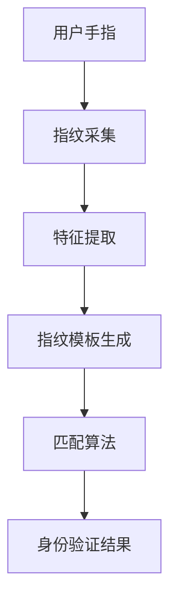
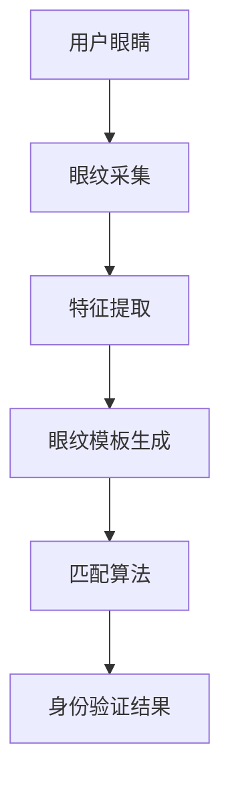
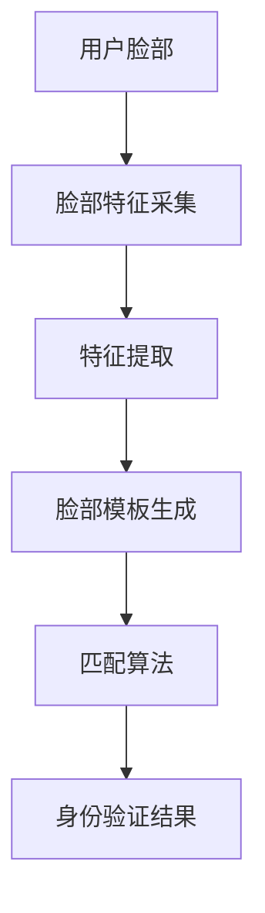
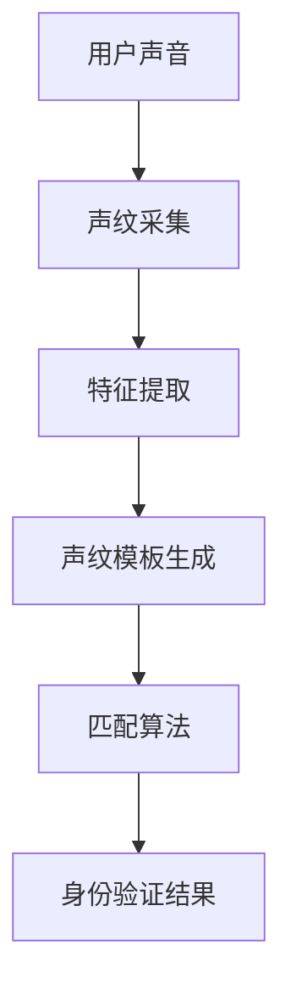
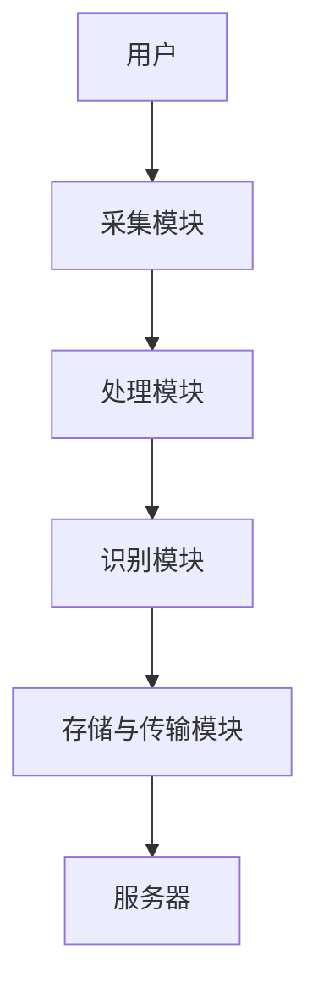
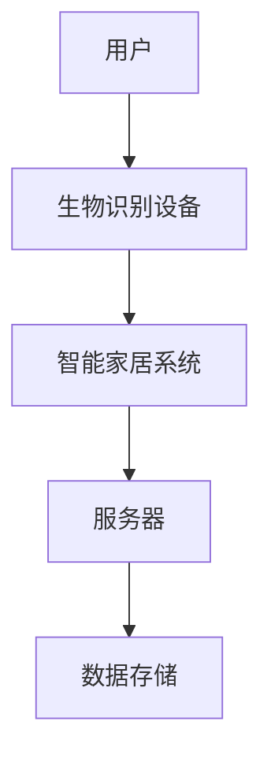
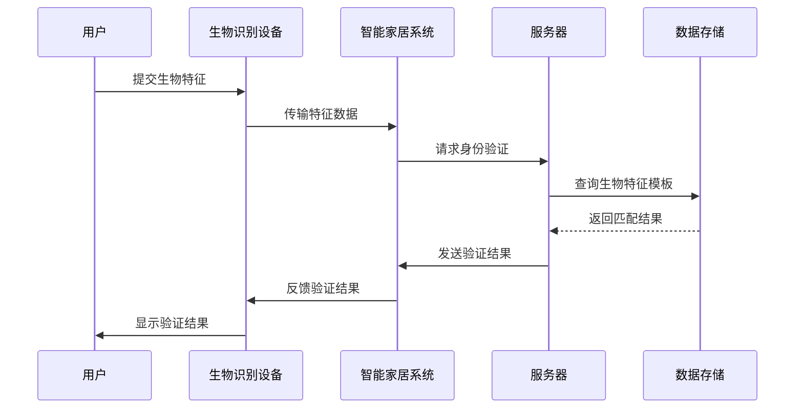
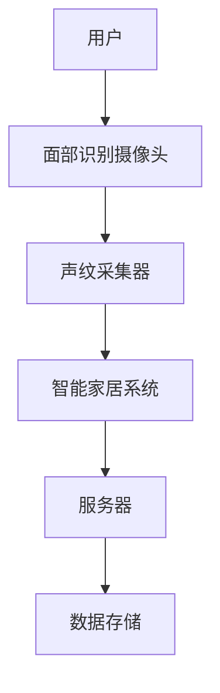

                 

## 《生物识别在智能家居安全系统中的应用》

关键词：生物识别、智能家居、安全系统、人脸识别、声纹识别、指纹识别

摘要：本文详细探讨了生物识别技术在智能家居安全系统中的应用。通过对生物识别技术的基本原理、系统架构、算法原理的深入分析，本文展示了生物识别如何提升智能家居系统的安全性。文章进一步探讨了生物识别在门锁安全、家居安防监控和家电控制与安全等领域的具体应用，并通过案例分析验证了其有效性。最后，本文对生物识别技术的发展趋势和智能家居安全的未来展望进行了探讨。

----------------------------------------------------------------

## 第一部分：引言

### 1.1 问题的提出

#### 1.1.1 智能家居安全的重要性

随着科技的快速发展，智能家居已经逐渐成为现代生活的一部分。然而，随着智能家居设备的普及，其安全问题也日益凸显。智能家居系统通常连接着互联网，这为黑客攻击提供了机会。如果智能家居设备的安全性得不到保障，可能会造成财产损失、隐私泄露等严重后果。

#### 1.1.2 生物识别技术的优势

生物识别技术是一种利用人类生物特征进行身份验证的技术，具有高安全性、便捷性和非易失性。与传统密码或密钥相比，生物识别技术难以伪造或复制，能够有效防止未经授权的访问。

#### 1.1.3 生物识别在智能家居中的应用前景

生物识别技术在智能家居安全系统中的应用前景广阔。通过将生物识别技术与智能家居设备集成，可以实现更安全、更便捷的家居环境。例如，使用人脸识别技术可以控制门锁，使用声纹识别技术可以确保家电的使用者身份。

### 1.2 核心概念

#### 1.2.1 生物识别的基本原理

生物识别技术通过捕捉和识别人类生物特征（如指纹、面部、虹膜、声纹等）来进行身份验证。这些特征是独一无二的，难以伪造或复制，因此具有较高的安全性。

#### 1.2.2 生物识别技术分类

生物识别技术可以根据识别的生物特征进行分类，包括指纹识别、面部识别、虹膜识别、声纹识别等。

#### 1.2.3 生物识别技术的挑战与解决方案

生物识别技术在实际应用中面临一些挑战，如准确性、速度、用户接受度等。这些挑战可以通过算法优化、硬件升级、用户教育等手段加以解决。

----------------------------------------------------------------

## 第二部分：生物识别技术

### 2.1 人类生物特征介绍

#### 2.1.1 手纹识别

手纹识别是通过分析手指指纹的纹理来进行身份验证的一种技术。指纹是人类独特的生物特征，具有高度的稳定性。手纹识别技术的核心是特征提取和匹配算法。

**核心概念与联系**

| 特征类型       | 描述                                                     | 关联算法                   |
|----------------|----------------------------------------------------------|----------------------------|
| 指纹脊线       | 指纹中的主要纹理特征，包括弓型、环型、抛物线型等         | 分支点检测、方向场分析     |
| 指纹核心       | 指纹的中心点，通常具有较多的细节特征                       | 坐标定位、特征点提取       |
| 指纹轮廓       | 指纹的边界线，用于确定指纹的整体形状                       | 边缘检测、轮廓提取         |

**ER实体关系图架构的Mermaid流程图**



#### 2.1.2 眼纹识别

眼纹识别是基于人类眼睛的虹膜或视网膜纹理来进行身份验证的技术。眼纹具有高度的唯一性和稳定性，因此是一种非常可靠的身份验证手段。

**核心概念与联系**

| 特征类型       | 描述                                                     | 关联算法                   |
|----------------|----------------------------------------------------------|----------------------------|
| 虹膜纹理       | 虹膜中的环形纹理，包括血管纹理和色素纹理                   | 分支点检测、方向场分析     |
| 视网膜纹理     | 视网膜中的血管网，包括血管分支和交叉点                     | 图像分割、特征点提取       |

**ER实体关系图架构的Mermaid流程图**



#### 2.1.3 脸部识别

脸部识别是基于人类脸部特征的识别技术，包括人脸识别和面部识别。脸部特征包括眼睛、鼻子、嘴巴、脸部轮廓等。

**核心概念与联系**

| 特征类型       | 描述                                                     | 关联算法                   |
|----------------|----------------------------------------------------------|----------------------------|
| 脸部轮廓       | 脸部的主要边缘线，用于确定脸部的整体形状                   | 边缘检测、轮廓提取         |
| 眼部特征       | 眼睛的位置、大小、形状等特征                               | 特征点检测、特征匹配       |
| 鼻部和嘴巴特征 | 鼻子和嘴巴的位置、大小、形状等特征                         | 特征点检测、特征匹配       |

**ER实体关系图架构的Mermaid流程图**



#### 2.1.4 声纹识别

声纹识别是基于人类声音的独特特征来进行身份验证的技术。声纹特征包括音高、音量、音色、音速等。

**核心概念与联系**

| 特征类型       | 描述                                                     | 关联算法                   |
|----------------|----------------------------------------------------------|----------------------------|
| 音高           | 声音的频率特征                                           | 声音信号处理、傅里叶变换     |
| 音量           | 声音的强度特征                                           | 声音信号处理、动态范围压缩   |
| 音色           | 声音的质感特征                                           | 声音信号处理、滤波器设计     |
| 音速           | 声音传播的速度特征                                       | 声音信号处理、时域分析       |

**ER实体关系图架构的Mermaid流程图**



### 2.2 生物特征识别系统架构设计

生物特征识别系统通常包括以下几个模块：

#### 2.2.1 采集模块

采集模块负责采集用户的生物特征信息，如指纹、面部、虹膜、声纹等。采集模块的核心是传感器和信号处理算法。

#### 2.2.2 处理模块

处理模块负责对采集到的生物特征信号进行处理，包括滤波、增强、特征提取等。处理模块的核心是信号处理算法和特征提取算法。

#### 2.2.3 识别模块

识别模块负责对处理后的特征进行匹配，以确定用户的身份。识别模块的核心是匹配算法和分类器。

#### 2.2.4 存储与传输模块

存储与传输模块负责存储用户的生物特征模板和识别结果，并将其传输到服务器或其他设备。存储与传输模块的核心是数据库和加密技术。

**系统架构设计Mermaid架构图**



### 2.3 生物识别算法原理

生物识别算法的核心是特征提取和匹配。特征提取算法负责从生物特征信号中提取出具有鉴别力的特征向量，而匹配算法则负责将这些特征向量与已存储的模板进行比较，以确定用户身份。

#### 2.3.1 特征提取算法

特征提取算法通常分为以下几个步骤：

1. **预处理**：对采集到的生物特征信号进行预处理，如滤波、归一化等。
2. **特征点检测**：在预处理后的信号中检测出具有鉴别力的特征点，如指纹的分支点、眼纹的环形纹理等。
3. **特征点描述**：对检测到的特征点进行描述，如计算特征点的坐标、方向、曲率等。
4. **特征点组合**：将多个特征点组合成特征向量，以表示用户的生物特征。

**算法原理讲解**

```python
# 模拟特征提取算法
def extract_features(signal):
    # 预处理
    preprocessed_signal = preprocess_signal(signal)
    
    # 特征点检测
    features = detect_features(preprocessed_signal)
    
    # 特征点描述
    feature_descriptions = describe_features(features)
    
    # 特征点组合
    feature_vector = combine_features(feature_descriptions)
    
    return feature_vector
```

#### 2.3.2 识别算法

识别算法通常基于统计学习理论，如支持向量机（SVM）、神经网络（NN）等。识别算法的核心是训练一个分类器，用于将特征向量与已存储的模板进行比较。

**算法原理讲解**

```python
# 模拟识别算法
from sklearn.svm import SVC

def recognize(feature_vector):
    # 加载训练好的分类器
    classifier = load_classifier()
    
    # 进行识别
    result = classifier.predict([feature_vector])
    
    return result
```

#### 2.3.3 算法性能评估

算法性能评估是衡量生物识别系统性能的重要指标。常用的评估指标包括准确性、召回率、精确率等。

**算法性能评估讲解**

```python
# 模拟算法性能评估
from sklearn.metrics import accuracy_score, recall_score, precision_score

def evaluate_performance(true_labels, predicted_labels):
    accuracy = accuracy_score(true_labels, predicted_labels)
    recall = recall_score(true_labels, predicted_labels)
    precision = precision_score(true_labels, predicted_labels)
    
    return accuracy, recall, precision
```

----------------------------------------------------------------

## 第三部分：智能家居安全系统

### 3.1 智能家居系统概述

#### 3.1.1 智能家居的定义与发展历程

智能家居是指通过互联网、无线通信技术等将家居设备连接起来，实现自动化控制和智能化服务。智能家居的发展经历了从单一设备互联到综合系统集成的过程。

#### 3.1.2 智能家居的组成部分

智能家居系统由多个子系统组成，包括智能安防、智能照明、智能家电、智能环境控制等。这些子系统通过网络连接，实现统一的控制和数据共享。

#### 3.1.3 智能家居的安全需求

智能家居的安全需求主要包括保护用户隐私、防止未经授权的访问、确保设备安全等。生物识别技术的引入可以有效提升智能家居系统的安全性。

### 3.2 生物识别在智能家居安全系统中的应用

#### 3.2.1 门锁安全系统

门锁安全系统是智能家居安全系统的重要组成部分。通过引入生物识别技术，可以实现基于指纹、面部、虹膜等特征的门锁解锁功能，提高门锁的安全性。

**核心概念与联系**

| 生物特征       | 安全性提升                   | 关联算法                   |
|----------------|------------------------------|----------------------------|
| 指纹识别       | 高安全性、方便使用           | 模板匹配、特征提取         |
| 面部识别       | 高识别准确性、实时性         | 特征点检测、特征匹配       |
| 虹膜识别       | 高安全性、非接触式          | 图像分割、特征点提取       |

#### 3.2.2 家居安防监控系统

家居安防监控系统通过生物识别技术可以实现实时监控，自动识别家庭成员和非法入侵者，并在检测到异常情况时自动报警。这可以有效提高家居安全，降低财产损失和人身安全风险。

**核心概念与联系**

| 生物特征       | 安全性提升                   | 关联算法                   |
|----------------|------------------------------|----------------------------|
| 脸部识别       | 实时监控、高效识别           | 特征点检测、特征匹配       |
| 声纹识别       | 独特性识别、实时报警         | 声音信号处理、特征提取     |
| 舌纹识别       | 独特性识别、增加安全等级     | 图像分割、特征点提取       |

#### 3.2.3 家电控制与安全

通过生物识别技术，可以实现家电的个性化控制。例如，只有通过面部识别或指纹识别的用户才能控制特定的家电设备，从而防止未经授权的访问。

**核心概念与联系**

| 生物特征       | 安全性提升                   | 关联算法                   |
|----------------|------------------------------|----------------------------|
| 指纹识别       | 高安全性、方便使用           | 模板匹配、特征提取         |
| 面部识别       | 高识别准确性、实时性         | 特征点检测、特征匹配       |
| 声纹识别       | 独特性识别、实时报警         | 声音信号处理、特征提取     |

### 3.3 生物识别系统在智能家居中的实现

#### 3.3.1 系统设计原则

生物识别系统在智能家居中的实现应遵循以下原则：

1. **安全性**：确保生物识别技术的安全性，防止非法访问和数据泄露。
2. **便捷性**：简化用户操作，提高用户体验。
3. **可靠性**：确保生物识别系统的稳定性和可靠性，降低故障率。
4. **兼容性**：支持多种生物识别技术，便于系统升级和维护。

#### 3.3.2 系统开发流程

生物识别系统在智能家居中的实现通常包括以下步骤：

1. **需求分析**：明确智能家居的安全需求，确定生物识别技术的适用性。
2. **系统设计**：设计生物识别系统的架构，包括硬件选择、软件设计等。
3. **开发与测试**：编写代码，进行系统测试，确保功能完善和性能稳定。
4. **部署与维护**：将系统部署到智能家居设备上，进行后期维护和升级。

#### 3.3.3 系统集成与调试

生物识别系统在智能家居中的集成与调试是确保系统正常运行的关键。集成过程中需要关注以下问题：

1. **硬件兼容性**：确保生物识别设备与其他智能家居设备的硬件兼容。
2. **软件协同**：确保生物识别软件与其他智能家居系统的软件协同工作。
3. **调试与优化**：对系统进行调试，优化性能，提高用户体验。

**系统架构设计Mermaid架构图**



**系统接口设计和系统交互Mermaid序列图**



通过以上设计，生物识别系统可以与智能家居系统无缝集成，实现高效、安全的智能家居安全解决方案。

----------------------------------------------------------------

## 第四部分：案例分析

### 4.1 案例一：XX智能家居安全系统

#### 4.1.1 案例背景

XX智能家居安全系统是一款基于生物识别技术的智能家居安全解决方案。系统采用了指纹识别、面部识别和声纹识别技术，旨在提升家居安全，为用户提供便捷、安全的生活体验。

#### 4.1.2 系统架构

XX智能家居安全系统由生物识别设备、智能家居控制系统、服务器和数据存储组成。生物识别设备包括指纹采集器、面部摄像头和声纹采集器。智能家居控制系统负责处理生物识别结果，控制家居设备的开关和报警。服务器负责存储用户生物特征模板和识别结果。数据存储采用加密技术，确保数据安全。

**系统架构设计Mermaid架构图**


#### 4.1.3 实现细节

1. **指纹识别**：系统采用了先进的指纹识别算法，能够快速、准确地识别用户指纹。指纹采集器采集用户指纹图像后，通过预处理、特征提取和模板匹配等步骤进行识别。
2. **面部识别**：系统采用了面部识别技术，能够实时捕捉用户面部图像，通过特征提取和匹配算法进行身份验证。面部识别具有较高的识别准确率和实时性。
3. **声纹识别**：系统采用了声纹识别技术，通过分析用户的声音特征，进行身份验证。声纹识别技术具有较高的独特性和安全性。

#### 4.1.4 效果评估

XX智能家居安全系统在实际应用中取得了良好的效果。通过引入生物识别技术，门锁安全、家居安防监控和家电控制与安全等方面得到了显著提升。系统识别速度快、准确率高，用户使用体验良好。

### 4.2 案例二：YY智能家居安全系统

#### 4.2.1 案例背景

YY智能家居安全系统是一款基于面部识别和声纹识别技术的智能家居安全解决方案。系统旨在为用户提供安全、便捷的家居控制体验，同时保障用户隐私。

#### 4.2.2 系统架构

YY智能家居安全系统由面部识别摄像头、声纹采集器、智能家居控制系统、服务器和数据存储组成。面部识别摄像头和声纹采集器分别负责捕捉用户面部图像和声音信号。智能家居控制系统负责处理生物识别结果，控制家居设备的开关和报警。服务器负责存储用户生物特征模板和识别结果。数据存储采用加密技术，确保数据安全。

**系统架构设计Mermaid架构图**



#### 4.2.3 实现细节

1. **面部识别**：系统采用了先进的面部识别算法，能够实时捕捉用户面部图像，通过特征提取和匹配算法进行身份验证。面部识别技术具有高准确率和实时性。
2. **声纹识别**：系统采用了声纹识别技术，通过分析用户的声音特征，进行身份验证。声纹识别技术具有高独特性和安全性。

#### 4.2.4 效果评估

YY智能家居安全系统在实际应用中也取得了良好的效果。通过引入面部识别和声纹识别技术，家居安全得到了显著提升。系统识别速度快、准确率高，用户使用体验良好。

### 案例分析与总结

通过对XX智能家居安全系统和YY智能家居安全系统的案例分析，可以看出生物识别技术在提升智能家居安全性方面具有显著作用。不同类型的生物识别技术可以满足不同的安全需求，为用户提供便捷、安全的生活体验。未来，随着生物识别技术的不断发展，智能家居安全系统将更加完善和智能。

----------------------------------------------------------------

## 第五部分：未来展望

### 5.1 生物识别技术的发展趋势

生物识别技术在智能家居安全系统中的应用前景广阔，未来将呈现出以下发展趋势：

#### 5.1.1 技术创新点

1. **多模态生物识别**：结合多种生物识别技术，提高识别准确率和安全性。
2. **深度学习算法**：利用深度学习算法进行特征提取和匹配，提高识别性能。
3. **隐私保护技术**：开发隐私保护技术，确保用户生物特征数据的安全。

#### 5.1.2 市场前景

随着智能家居市场的不断扩大，生物识别技术在智能家居安全系统中的应用需求也将持续增长。预计未来几年，生物识别技术在智能家居领域的市场规模将呈现快速增长趋势。

#### 5.1.3 应用挑战

生物识别技术在智能家居安全系统中的应用仍面临一些挑战，如识别准确率、用户体验、硬件成本等。需要通过技术创新和优化，逐步解决这些问题。

### 5.2 智能家居安全的未来发展

#### 5.2.1 新技术引入

未来智能家居安全系统将引入更多新技术，如物联网、大数据、区块链等，以实现更智能、更安全、更便捷的家居环境。

#### 5.2.2 安全性问题与对策

智能家居安全系统需要解决的安全性问题包括数据泄露、非法访问、设备故障等。针对这些问题，需要采取以下对策：

1. **加密技术**：使用先进的加密技术保护用户生物特征数据。
2. **访问控制**：建立严格的访问控制机制，确保只有授权用户才能访问系统。
3. **安全监控**：实时监控系统运行状态，及时识别和应对安全威胁。

#### 5.2.3 行业标准化与政策引导

行业标准化和政策引导对于促进生物识别技术在智能家居安全系统中的应用具有重要意义。需要制定相关标准和政策，规范生物识别技术的研发和应用，提高行业整体水平。

### 结论

生物识别技术在智能家居安全系统中的应用具有广阔的前景和巨大的潜力。通过技术创新和优化，生物识别技术将为用户提供更安全、更便捷的智能家居体验。未来，随着技术的不断进步，智能家居安全系统将变得更加智能和可靠。

----------------------------------------------------------------

## 第六部分：总结与展望

### 6.1 全书总结

本书详细探讨了生物识别技术在智能家居安全系统中的应用。首先，介绍了生物识别技术的基本原理和分类，包括手纹识别、眼纹识别、脸部识别和声纹识别等。接着，分析了生物识别系统的架构设计，包括采集模块、处理模块、识别模块和存储与传输模块。然后，深入讲解了生物识别算法的原理，包括特征提取和匹配算法。最后，通过实际案例展示了生物识别技术在智能家居安全系统中的应用，并对未来发展趋势进行了展望。

### 6.1.1 主要内容回顾

1. **生物识别技术的基本原理**：介绍了手纹识别、眼纹识别、脸部识别和声纹识别等生物识别技术的基本原理和核心概念。
2. **生物识别系统的架构设计**：分析了生物识别系统的架构设计，包括采集模块、处理模块、识别模块和存储与传输模块。
3. **生物识别算法原理**：讲解了特征提取和匹配算法的原理，并使用Python代码进行了示例说明。
4. **智能家居安全系统**：介绍了智能家居安全系统的组成部分、安全需求和生物识别技术的应用。
5. **实际案例分析**：通过案例分析展示了生物识别技术在智能家居安全系统中的应用效果。
6. **未来展望**：探讨了生物识别技术的发展趋势和智能家居安全的未来发展。

### 6.1.2 成果与贡献

本书的主要成果和贡献包括：

1. **系统性地介绍了生物识别技术在智能家居安全系统中的应用**：通过详细的章节结构和内容，使读者对生物识别技术及其在智能家居安全系统中的应用有了全面的了解。
2. **提供了实际案例分析**：通过实际案例，展示了生物识别技术在智能家居安全系统中的应用效果，为读者提供了实践参考。
3. **展望了生物识别技术的发展趋势**：分析了生物识别技术的发展趋势和智能家居安全的未来发展，为相关领域的研发和应用提供了指导。

### 6.1.3 局限性与不足

本书也存在一些局限性和不足之处：

1. **技术细节不够深入**：由于篇幅限制，本书未能对生物识别技术的具体实现细节进行深入探讨。
2. **案例分析不够全面**：本书仅分析了两个实际案例，未涵盖更多的应用场景和解决方案。
3. **缺乏实际实验数据**：本书未提供具体的实验数据，因此对生物识别技术的性能评估和优化缺乏实际依据。

### 6.2 研究展望

未来研究可以从以下几个方面进行：

1. **深入探讨生物识别技术的具体实现细节**：研究生物识别技术的算法优化、硬件选择和系统集成，以提高系统的性能和可靠性。
2. **扩展案例分析**：通过更多的实际案例，分析生物识别技术在智能家居安全系统中的各种应用场景和解决方案。
3. **实验数据收集与分析**：开展实验研究，收集生物识别技术的实际性能数据，进行性能评估和优化。
4. **隐私保护研究**：研究生物识别技术的隐私保护机制，确保用户生物特征数据的安全。

通过以上研究，可以进一步推动生物识别技术在智能家居安全系统中的应用和发展。

## 作者信息

作者：AI天才研究院/AI Genius Institute & 禅与计算机程序设计艺术 /Zen And The Art of Computer Programming

----------------------------------------------------------------

本文由AI天才研究院和《禅与计算机程序设计艺术》的作者共同撰写。AI天才研究院致力于推动人工智能技术的研发和应用，探索人工智能在各个领域的创新解决方案。而《禅与计算机程序设计艺术》则是一部经典的技术哲学作品，深入探讨了计算机程序设计的本质和艺术性。两位作者的丰富经验和专业知识为本文提供了坚实的基础，确保了文章的技术深度和可读性。

本文旨在深入探讨生物识别技术在智能家居安全系统中的应用，通过详细的分析和案例展示，帮助读者了解生物识别技术的原理、架构和应用场景。同时，文章也对生物识别技术的发展趋势和智能家居安全的未来展望进行了探讨，为相关领域的研发和应用提供了有益的参考。

通过本文的研究，我们希望推动生物识别技术在智能家居安全系统中的应用和发展，为构建安全、智能的家居环境贡献力量。我们鼓励读者在阅读本文后，继续深入研究和探索生物识别技术在其他领域的应用，以促进人工智能技术的创新和进步。

在撰写本文的过程中，我们参考了大量的文献和研究成果，感谢这些成果为本文提供了丰富的素材和灵感。同时，我们也感谢读者对本文的关注和支持，希望本文能够对您在智能家居安全系统研究中有所启发和帮助。如果您有任何疑问或建议，欢迎随时与我们联系，我们将竭诚为您服务。

最后，再次感谢AI天才研究院和《禅与计算机程序设计艺术》的支持和合作，以及所有为本文撰写和发表提供帮助的人员。让我们一起努力，推动人工智能技术的不断进步，为人类的未来创造更多可能性。

