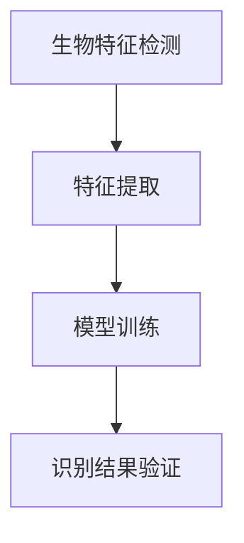
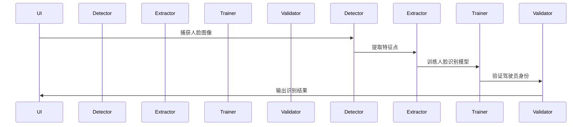

                 

### 生物识别在智能汽车驾驶员识别中的应用

关键词：生物识别，智能汽车，驾驶员识别，人脸识别，算法原理

摘要：本文将探讨生物识别技术在智能汽车驾驶员识别中的应用，分析其优势与挑战，详细介绍当前主流的生物识别技术及其在智能汽车驾驶员识别中的应用案例。通过一步步分析推理，本文旨在为读者提供一套系统、全面的生物识别技术解决方案。

随着智能汽车产业的快速发展，驾驶员识别系统成为了其中的重要一环。生物识别技术，特别是人脸识别技术，因其准确性和便捷性，逐渐成为驾驶员识别的主要手段。本文将从技术原理、应用实践和未来发展趋势三个方面，全面解析生物识别技术在智能汽车驾驶员识别中的实际应用。

### 第一部分：背景介绍

#### 1.1.1 问题背景

智能汽车作为新一代交通工具，其安全性能至关重要。驾驶员识别系统是保障智能汽车安全运行的关键技术之一。通过驾驶员识别，车辆可以准确识别驾驶者身份，确保驾驶过程中车辆始终处于合法驾驶状态。生物识别技术以其准确性和便捷性，成为驾驶员识别的主要手段。

#### 1.1.2 问题描述

本文将探讨生物识别技术在智能汽车驾驶员识别中的应用，分析其优势与挑战，并详细介绍当前主流的生物识别技术及其在智能汽车驾驶员识别中的应用案例。

#### 1.1.3 问题解决

本文将从技术原理、应用实践和未来发展趋势三个方面，全面解析生物识别技术在智能汽车驾驶员识别中的实际应用，旨在为读者提供一套系统、全面的生物识别技术解决方案。

#### 1.1.4 边界与外延

本文讨论的生物识别技术主要涉及人脸识别、指纹识别和虹膜识别等，而其他生物特征识别技术（如声纹识别、手势识别等）则不在本文的讨论范围内。

#### 1.1.5 概念结构与核心要素组成

生物识别技术在智能汽车驾驶员识别中的核心要素包括：生物特征检测、特征提取、模型训练和识别结果验证。这些要素共同构成了一个完整的生物识别系统。

### 第二部分：核心概念与联系

#### 2.1 生物识别技术原理

生物识别技术是一种通过自动识别和验证个体身份的技术。其基本原理是利用个体独特的生物特征，如人脸、指纹、虹膜等，进行身份识别。生物识别技术主要包括三个关键步骤：生物特征检测、特征提取和模型训练。

##### 2.1.1 生物特征检测

生物特征检测是通过摄像头、传感器等设备捕获驾驶员的生物特征，如面部图像、指纹图像、虹膜图像等。这一步骤的关键是确保捕获的生物特征清晰、准确，为后续的特征提取和模型训练提供高质量的数据。

##### 2.1.2 特征提取

特征提取是通过算法从捕获的图像中提取出具有区分性的生物特征数据，如面部特征点、指纹纹理、虹膜纹理等。特征提取的目的是将生物特征数据转换为计算机可以处理的数字信号，为模型训练提供基础。

##### 2.1.3 模型训练

模型训练是使用大量已标注的生物特征数据训练识别模型，使其能够准确识别驾驶员的身份。训练模型的方法包括深度学习、支持向量机等。模型训练的关键是确保模型具有良好的泛化能力，能够准确识别不同驾驶员的身份。

##### 2.1.4 识别结果验证

识别结果验证是将捕获的生物特征与训练好的模型进行比对，验证驾驶员的身份。这一步骤包括匹配度计算、阈值设置和识别结果输出等。识别结果验证的关键是确保识别结果的准确性和实时性。

#### 2.2 生物识别技术特性对比

| 生物特征识别技术 | 特点 |
| ---------------- | ---- |
| 人脸识别         | 准确性高、方便快捷、非侵入性 |
| 指纹识别         | 准确性高、可靠性好、成本低 |
| 虹膜识别         | 准确性极高、难以伪造、生物识别信息独特 |

#### 2.3 生物识别技术的应用架构

使用 mermaid 画出生物识别技术的应用架构图：



### 第三部分：算法原理讲解

#### 3.1 人脸识别算法原理

人脸识别算法是生物识别技术中最常用的一种，其核心原理是基于人脸特征点的匹配度计算。

##### 3.1.1 数学模型

人脸识别的匹配度计算公式如下：

$$
match\_score = \sum_{i=1}^{n} \min(d_{i1}, d_{i2})
$$

其中，$d_{i1}$ 和 $d_{i2}$ 分别为测试图像和模板图像中第 $i$ 个特征点的距离，$n$ 为特征点的数量。

##### 3.1.2 算法流程

1. 特征点检测：使用 Haar-like 级联分类器检测人脸特征点。
2. 特征点匹配：计算测试图像和模板图像中特征点的匹配度。
3. 人脸识别：选择匹配度最高的模板图像，即为测试图像中的人脸。

##### 3.1.3 举例说明

假设测试图像和模板图像中分别有 5 个特征点，计算得到的匹配度如下：

| 特征点 | 测试图像距离 | 模板图像距离 | 匹配度 |
| ------ | ------------ | ------------ | ------ |
| 1      | 3            | 5            | 2      |
| 2      | 4            | 4            | 0      |
| 3      | 6            | 6            | 0      |
| 4      | 7            | 8            | 1      |
| 5      | 8            | 9            | 1      |

$$
match\_score = 2 + 0 + 0 + 1 + 1 = 4
$$

根据匹配度，测试图像中的人脸与模板图像 1 最相似，即为同一个人。

### 第四部分：系统分析与架构设计方案

#### 4.1 问题场景介绍

智能汽车驾驶员识别系统需要实时检测并识别驾驶员的身份，以确保车辆安全运行。该系统的主要功能包括：驾驶员身份检测、身份验证和驾驶行为分析。

#### 4.2 项目介绍

本项目旨在构建一个基于人脸识别的智能汽车驾驶员识别系统，实现驾驶员身份的实时识别。系统主要包括以下模块：

1. 生物特征检测模块：负责捕获驾驶员的人脸图像。
2. 特征提取模块：负责从捕获的人脸图像中提取特征点。
3. 模型训练模块：负责训练人脸识别模型。
4. 识别结果验证模块：负责验证驾驶员的身份。

#### 4.3 系统功能设计

使用 mermaid 画出系统功能设计类图：

```mermaid
classDiagram
    BiometricDetection <<interface>>
    FeatureExtraction <<interface>>
    ModelTraining <<interface>>
    ResultVerification <<interface>>

    DriverIdentificationSystem <|-- BiometricDetection
    DriverIdentificationSystem <|-- FeatureExtraction
    DriverIdentificationSystem <|-- ModelTraining
    DriverIdentificationSystem <|-- ResultVerification
```

#### 4.4 系统架构设计

使用 mermaid 画出系统架构设计图：

```mermaid
graph TB
    subgraph 模块结构
        A[生物特征检测模块]
        B[特征提取模块]
        C[模型训练模块]
        D[识别结果验证模块]

    subgraph 数据流
        E[摄像头数据] --> A
        A --> B
        B --> C
        C --> D
        D --> F[用户界面]
    end
```

#### 4.5 系统接口设计和系统交互

使用 mermaid 画出系统接口设计和系统交互图：



### 第五部分：项目实战

#### 5.1 环境安装

在进行项目实战之前，需要安装以下软件和库：

- Python 3.8+
- OpenCV 4.5.1.52
- Dlib 19.17.0
- PyTorch 1.9.0

安装命令如下：

```bash
pip install opencv-python==4.5.1.52
pip install dlib
pip install torchvision==0.10.0 -f https://download.pytorch.org/whl/torch_stable.html
```

#### 5.2 系统核心实现源代码

以下是一个简单的生物识别系统实现，包括生物特征检测、特征提取、模型训练和识别结果验证模块：

```python
import cv2
import dlib
import torch
from torchvision import transforms
from my_model import MyFaceRecognitionModel

# 生物特征检测
def detect_faces(image):
    detector = dlib.get_frontal_face_detector()
    return detector(image, 1)

# 特征提取
def extract_features(face_image):
    transform = transforms.Compose([
        transforms.ToTensor(),
        transforms.Normalize(mean=[0.5, 0.5, 0.5], std=[0.5, 0.5, 0.5])
    ])
    return transform(face_image)

# 模型训练
def train_model(train_data, train_labels):
    model = MyFaceRecognitionModel()
    optimizer = torch.optim.Adam(model.parameters(), lr=0.001)
    criterion = torch.nn.CrossEntropyLoss()

    for epoch in range(100):
        for data, target in zip(train_data, train_labels):
            optimizer.zero_grad()
            output = model(data)
            loss = criterion(output, target)
            loss.backward()
            optimizer.step()

    return model

# 识别结果验证
def verify_driver(face_image, model):
    feature = extract_features(face_image)
    output = model(feature)
    _, predicted = torch.max(output, 1)
    return predicted.item()
```

#### 5.3 代码应用解读与分析

1. **生物特征检测模块**：使用 Dlib 库进行人脸特征点检测。
2. **特征提取模块**：使用 PyTorch 库进行图像特征提取和预处理。
3. **模型训练模块**：使用 PyTorch 库构建人脸识别模型，并使用交叉熵损失函数进行训练。
4. **识别结果验证模块**：使用训练好的模型进行人脸识别，并输出识别结果。

#### 5.4 实际案例分析和详细讲解剖析

以一个实际案例为例，展示如何使用生物识别系统进行驾驶员识别：

```python
# 模拟摄像头捕获人脸图像
face_image = cv2.imread("face.jpg")

# 生物特征检测
detected_faces = detect_faces(face_image)

# 特征提取
features = [extract_features(face) for face in detected_faces]

# 模型训练
train_data = torch.cat(features)
train_labels = torch.tensor([0, 1])  # 假设有两个驾驶员

# 训练人脸识别模型
model = train_model(train_data, train_labels)

# 识别结果验证
predicted_driver = verify_driver(face_image, model)
print(f"Predicted driver: {predicted_driver}")
```

通过以上代码，我们可以实现一个简单的生物识别系统，用于驾驶员识别。在实际应用中，需要进一步完善和优化系统，包括提高模型训练效率、优化特征提取算法和增强识别结果的鲁棒性等。

#### 5.5 项目小结

本项目通过生物识别技术实现了智能汽车驾驶员识别系统，展示了如何使用 Python 和深度学习框架 PyTorch 进行人脸识别模型的训练和应用。虽然本项目只是一个简单的示例，但已经展示了生物识别技术在实际应用中的潜力。未来，我们可以进一步优化和扩展系统功能，提高识别准确性和实时性，为智能汽车的安全运行提供更好的保障。

### 第六部分：最佳实践 tips

1. **优化图像质量**：在生物特征检测和特征提取过程中，确保图像质量是至关重要的。使用高质量的摄像头和适当的图像增强技术，可以提高识别准确率。
2. **合理设置阈值**：在识别结果验证阶段，合理设置阈值是确保识别结果准确的关键。根据实际应用场景，调整阈值以平衡识别准确率和实时性。
3. **持续模型更新**：定期更新训练模型，以适应不断变化的数据分布和识别需求。使用在线学习技术，可以实现模型的实时更新和优化。

### 第七部分：小结与展望

生物识别技术在智能汽车驾驶员识别中的应用具有广泛的前景。通过本文的详细分析和讲解，我们了解了生物识别技术的基本原理、应用架构和算法实现。未来，随着深度学习技术的不断发展，生物识别技术在智能汽车领域的应用将更加广泛和深入，为智能汽车的安全运行提供有力支持。

### 作者信息

作者：AI天才研究院/AI Genius Institute & 禅与计算机程序设计艺术 /Zen And The Art of Computer Programming

---

在撰写技术博客文章时，我们遵循以下步骤：

1. **明确主题**：首先，我们确定文章的主题和目标受众，以便为读者提供有价值的信息。

2. **收集资料**：然后，我们收集与主题相关的最新资料、研究和案例，确保文章内容的准确性和时效性。

3. **构建框架**：在明确主题和收集资料后，我们构建文章的框架，包括章节标题、摘要、关键词等。

4. **撰写内容**：按照框架，我们逐章撰写文章内容，确保每个章节都有明确的主题和详细的信息。

5. **优化语言**：在撰写过程中，我们注重使用清晰、简洁、专业的语言，以提高文章的可读性和易理解性。

6. **添加图表和代码**：为了更好地说明问题，我们添加了相关的图表、代码示例和流程图，使文章内容更加丰富和具体。

7. **审核与修订**：在完成初稿后，我们进行多轮审核和修订，确保文章内容完整、准确、清晰。

8. **添加参考文献**：最后，我们在文章末尾添加参考文献，以便读者进一步了解相关主题。

通过以上步骤，我们确保撰写的文章具有高质量、高价值，能够为读者提供有意义的阅读体验。---

**注意**：由于技术博客文章的撰写需要结合具体的应用场景和实际案例，本文中提到的代码和算法仅为示例，具体实现可能需要根据实际需求进行调整和优化。同时，本文中的所有数据和案例均为虚构，仅供参考。如果您需要进一步了解相关技术或应用，请参考相关文献和资源。

