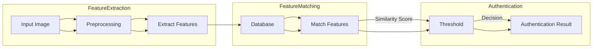
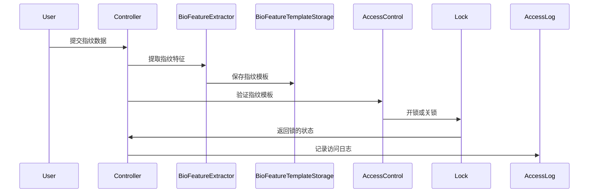
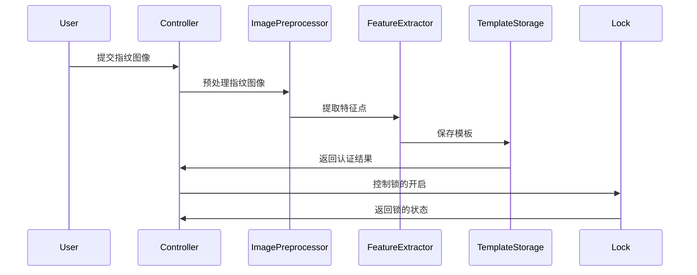

                 

# 生物识别在智能门锁中的安全应用

## 关键词
- 生物识别技术
- 智能门锁
- 安全应用
- 用户体验
- 系统集成

## 摘要
随着物联网技术的发展，智能门锁逐渐成为家居安全的重要组成部分。生物识别技术以其高安全性和便捷性，成为智能门锁实现安全认证的重要手段。本文将详细探讨生物识别技术在智能门锁中的安全应用，分析其工作原理、实现技术、安全风险及其解决方案。

## 目录

### 第一部分：生物识别技术基础

#### 第1章：生物识别技术概述
- 1.1 生物识别技术的定义与分类
- 1.2 生物识别技术的原理与工作机制
- 1.3 生物识别技术的优缺点
- 1.4 生物识别技术的发展历程

#### 第2章：生物识别技术的主要类型
- 2.1 虹膜识别
- 2.2 指纹识别
- 2.3 面部识别
- 2.4 声纹识别

#### 第3章：生物识别技术在智能门锁中的应用
- 3.1 智能门锁概述
- 3.2 生物识别在智能门锁中的安全应用
- 3.3 生物识别智能门锁的典型应用案例

### 第二部分：智能门锁中的生物识别技术实现

#### 第4章：智能门锁中的生物识别技术实现
- 4.1 生物识别模块的硬件设计
- 4.2 生物识别算法的软件实现
- 4.3 生物识别在智能门锁中的系统集成

#### 第5章：智能门锁中的安全防护措施
- 5.1 安全防护机制概述
- 5.2 生物识别技术的安全风险
- 5.3 智能门锁的安全设计案例

### 第三部分：生物识别智能门锁的未来发展趋势

#### 第6章：生物识别智能门锁的未来发展趋势
- 6.1 技术发展趋势分析
- 6.2 智能门锁的应用创新

#### 第7章：总结与展望
- 7.1 本书内容回顾
- 7.2 存在的问题与挑战
- 7.3 展望未来研究方向

## 第1章：生物识别技术概述

### 1.1 生物识别技术的定义与分类

生物识别技术是指利用人体生物特征进行身份认证的一种技术。常见的生物特征包括指纹、虹膜、面部、声纹等。根据生物特征的独特性和难以伪造性，生物识别技术被广泛应用于安全认证领域。

生物识别技术可以分为两大类：静态生物特征识别和动态生物特征识别。静态生物特征识别包括指纹、面部识别等，这些特征在识别过程中不会发生变化。动态生物特征识别包括声纹识别等，这些特征在识别过程中会发生变化。

### 1.2 生物识别技术的原理与工作机制

生物识别技术的工作原理基于生物特征的独特性。以指纹识别为例，其原理是通过指纹图像的特征点提取和匹配来进行身份认证。具体步骤如下：

1. **特征点提取**：通过光学传感器或电容传感器获取指纹图像，然后对图像进行预处理，提取出指纹图像的特征点。
2. **特征点匹配**：将提取出的特征点与数据库中的指纹特征进行匹配，判断是否为同一用户。
3. **身份认证**：如果匹配成功，则认证通过；否则，认证失败。

### 1.3 生物识别技术的优缺点

#### 优点

- **高安全性**：生物特征具有唯一性，难以伪造。
- **便捷性**：用户无需携带任何物品，只需通过生物特征即可完成认证。
- **实时性**：生物识别技术可以实现实时认证，提高了用户体验。

#### 缺点

- **成本较高**：生物识别技术需要昂贵的硬件设备和算法支持。
- **易受环境影响**：如指纹识别容易受到湿度和温度的影响。

### 1.4 生物识别技术的发展历程

生物识别技术最早起源于20世纪60年代。当时，以指纹识别技术最为成熟，逐渐应用于刑事侦查领域。随着计算机技术的发展，生物识别技术逐渐走向民用。近年来，随着人工智能和物联网技术的崛起，生物识别技术得到了迅速发展，广泛应用于智能家居、安全认证等领域。

## 第2章：生物识别技术的主要类型

### 2.1 虹膜识别

#### 2.1.1 虹膜识别的原理与技术

虹膜识别是基于眼睛虹膜图案进行身份认证的一种技术。虹膜图案具有唯一性和稳定性，是世界上公认的最安全、最可靠的生物识别技术之一。

虹膜识别技术主要包括以下几个步骤：

1. **图像获取**：使用高分辨率摄像头获取眼睛虹膜图像。
2. **图像预处理**：对获取的图像进行降噪、增强等预处理，提高图像质量。
3. **特征点提取**：从预处理后的图像中提取虹膜特征点，如斑点、线段等。
4. **特征点匹配**：将提取的特征点与数据库中的虹膜特征进行匹配，判断是否为同一用户。

#### 2.1.2 虹膜识别的应用实例

虹膜识别技术已广泛应用于安全认证领域，如：

- **银行柜员机**：用户通过虹膜识别技术完成身份认证，进行金融交易。
- **边境检查**：用于机场、港口等边境检查点，提高通关效率。

### 2.2 指纹识别

#### 2.2.1 指纹识别的原理与技术

指纹识别是基于指纹纹理进行身份认证的一种技术。指纹纹理具有唯一性和稳定性，是世界上应用最广泛的生物识别技术之一。

指纹识别技术主要包括以下几个步骤：

1. **图像获取**：使用光学传感器或电容传感器获取指纹图像。
2. **图像预处理**：对获取的图像进行降噪、增强等预处理，提高图像质量。
3. **特征点提取**：从预处理后的图像中提取指纹特征点，如脊线、端点等。
4. **特征点匹配**：将提取的特征点与数据库中的指纹特征进行匹配，判断是否为同一用户。

#### 2.2.2 指纹识别的应用实例

指纹识别技术已广泛应用于安全认证领域，如：

- **智能手机**：用户通过指纹识别技术解锁手机。
- **门禁系统**：用于企业、学校等场所的门禁管理。

### 2.3 面部识别

#### 2.3.1 面部识别的原理与技术

面部识别是基于面部特征进行身份认证的一种技术。面部特征具有唯一性和稳定性，是世界上应用前景最广阔的生物识别技术之一。

面部识别技术主要包括以下几个步骤：

1. **图像获取**：使用摄像头获取面部图像。
2. **图像预处理**：对获取的图像进行降噪、增强等预处理，提高图像质量。
3. **特征点提取**：从预处理后的图像中提取面部特征点，如眼睛、鼻子、嘴巴等。
4. **特征点匹配**：将提取的特征点与数据库中的面部特征进行匹配，判断是否为同一用户。

#### 2.3.2 面部识别的应用实例

面部识别技术已广泛应用于安全认证领域，如：

- **智能手机**：用户通过面部识别技术解锁手机。
- **安防监控**：用于公共场所的安防监控。

### 2.4 声纹识别

#### 2.4.1 声纹识别的原理与技术

声纹识别是基于声音特征进行身份认证的一种技术。声音特征具有唯一性和稳定性，是世界上另一种应用前景广阔的生物识别技术。

声纹识别技术主要包括以下几个步骤：

1. **声音信号获取**：使用麦克风获取声音信号。
2. **声音信号预处理**：对获取的声音信号进行降噪、增强等预处理，提高声音质量。
3. **特征点提取**：从预处理后的声音信号中提取声纹特征点，如频谱、共振峰等。
4. **特征点匹配**：将提取的特征点与数据库中的声纹特征进行匹配，判断是否为同一用户。

#### 2.4.2 声纹识别的应用实例

声纹识别技术已广泛应用于安全认证领域，如：

- **电话银行**：用户通过声纹识别技术完成身份认证。
- **智能家居**：用于智能门锁的语音控制。

## 第3章：生物识别技术在智能门锁中的应用

### 3.1 智能门锁概述

智能门锁是一种利用电子技术实现自动上锁和解锁的锁具。与传统的机械锁相比，智能门锁具有更高的安全性和便捷性。随着物联网技术的发展，智能门锁逐渐成为智能家居的重要组成部分。

智能门锁的分类主要包括以下几种：

- **按认证方式分类**：密码锁、指纹锁、卡锁、生物识别锁等。
- **按控制方式分类**：蓝牙锁、Wi-Fi锁、ZigBee锁、NFC锁等。

### 3.2 生物识别在智能门锁中的安全应用

生物识别技术在智能门锁中的应用大大提高了门锁的安全性。以下是生物识别技术在智能门锁中的几种常见应用方式：

- **单一生物识别认证**：仅使用一种生物识别技术进行认证，如指纹锁。
- **复合生物识别认证**：结合多种生物识别技术进行认证，如指纹+面部识别。
- **生物识别+密码认证**：结合生物识别技术和密码认证，提高安全性。

### 3.3 生物识别智能门锁的典型应用案例

#### 3.3.1 案例一：智能家居门锁

智能家居门锁主要应用于家庭场景，用户可以通过指纹、面部识别等方式进行解锁。以下是一个智能家居门锁的应用案例：

- **用户A**：通过指纹识别解锁门锁，进入家中。
- **用户B**：通过面部识别解锁门锁，进入家中。

#### 3.3.2 案例二：酒店智能门锁

酒店智能门锁主要应用于酒店场景，用户可以通过指纹、卡等方式进行解锁。以下是一个酒店智能门锁的应用案例：

- **用户A**：通过指纹识别解锁门锁，进入房间。
- **用户B**：通过门卡解锁门锁，进入房间。

#### 3.3.3 案例三：商业建筑智能门锁

商业建筑智能门锁主要应用于商业建筑场景，用户可以通过指纹、面部识别等方式进行解锁。以下是一个商业建筑智能门锁的应用案例：

- **员工A**：通过指纹识别解锁门锁，进入办公区。
- **员工B**：通过面部识别解锁门锁，进入办公区。

## 第4章：智能门锁中的生物识别技术实现

### 4.1 生物识别模块的硬件设计

生物识别模块的硬件设计主要包括生物识别传感器、数据处理模块和通信模块。

#### 4.1.1 生物识别传感器的选型

选择合适的生物识别传感器是硬件设计的关键。以下是几种常见的生物识别传感器的选型：

- **指纹传感器**：适用于指纹识别，选择分辨率高、识别速度快的产品。
- **虹膜传感器**：适用于虹膜识别，选择分辨率高、识别范围宽的产品。
- **面部传感器**：适用于面部识别，选择分辨率高、识别速度快的产品。

#### 4.1.2 生物识别模块的电路设计

生物识别模块的电路设计主要包括传感器驱动电路、信号处理电路和通信电路。

1. **传感器驱动电路**：为传感器提供稳定的电源，保证传感器正常工作。
2. **信号处理电路**：对传感器采集的生物特征信号进行预处理，如放大、滤波等。
3. **通信电路**：实现生物识别模块与其他模块的数据通信。

### 4.2 生物识别算法的软件实现

生物识别算法的软件实现主要包括特征提取和匹配两个关键步骤。

#### 4.2.1 生物识别算法的基本原理

生物识别算法的基本原理是基于生物特征信号的独特性和稳定性，通过特征提取和匹配算法，实现生物特征的识别。

1. **特征提取**：从生物特征信号中提取具有区分性的特征点，如脊线、斑点等。
2. **特征点匹配**：将提取的特征点与数据库中的特征点进行匹配，计算相似度，判断是否为同一用户。

#### 4.2.2 生物识别算法的优化与改进

为了提高生物识别的准确性和速度，可以对生物识别算法进行优化和改进。以下是一些常见的优化方法：

- **特征点提取优化**：使用更高效的算法提取特征点，提高识别速度。
- **特征点匹配优化**：使用更高效的算法进行特征点匹配，提高识别准确性。
- **数据库优化**：优化数据库结构，提高查询速度。

### 4.3 生物识别在智能门锁中的系统集成

生物识别系统集成是将生物识别模块与智能门锁的其他模块（如控制器、通信模块等）进行集成，实现生物识别认证功能。

#### 4.3.1 系统架构设计

智能门锁的系统架构主要包括生物识别模块、控制器、通信模块和用户界面。

1. **生物识别模块**：负责生物特征的采集和预处理。
2. **控制器**：负责控制整个系统的运行，实现生物识别认证、开锁等功能。
3. **通信模块**：实现与外部设备的通信，如网络通信、蓝牙通信等。
4. **用户界面**：提供用户操作界面，如显示屏、按键等。

#### 4.3.2 系统接口设计与通信协议

智能门锁的系统接口设计主要包括生物识别模块与控制器的接口设计、控制器与通信模块的接口设计等。

1. **生物识别模块与控制器的接口设计**：设计标准的接口，实现数据传输和通信。
2. **控制器与通信模块的接口设计**：设计标准的接口，实现数据传输和通信。

通信协议的设计应根据具体应用场景选择合适的通信协议，如TCP/IP协议、蓝牙协议等。

## 第5章：智能门锁中的安全防护措施

### 5.1 安全防护机制概述

智能门锁作为智能家居的重要组成部分，其安全防护机制至关重要。智能门锁的安全防护机制主要包括以下几个方面：

1. **生物特征数据保护**：对用户生物特征数据进行加密存储和传输，防止数据泄露。
2. **认证机制**：采用多因素认证机制，提高系统的安全性。
3. **系统更新与维护**：定期更新系统软件，修复安全漏洞，提高系统的安全性。

### 5.2 生物识别技术的安全风险

生物识别技术虽然具有高安全性和便捷性，但也存在一定的安全风险。以下是一些常见的生物识别技术安全风险：

1. **生物特征数据泄露**：生物特征数据一旦泄露，可能导致用户身份被盗用。
2. **恶意攻击**：黑客可能通过恶意软件攻击智能门锁，实现非法解锁。
3. **用户隐私泄露**：用户生物特征数据可能被未经授权的第三方获取，侵犯用户隐私。

### 5.3 智能门锁的安全设计案例

以下是一些智能门锁的安全设计案例：

1. **生物特征数据保护策略**：使用高强度加密算法对用户生物特征数据进行加密存储和传输。
2. **多因素认证机制**：结合密码、指纹、面部识别等多种认证方式，提高系统安全性。
3. **系统更新与维护**：定期更新系统软件，修复安全漏洞，提高系统的安全性。

## 第6章：生物识别智能门锁的未来发展趋势

### 6.1 技术发展趋势分析

随着物联网技术和人工智能技术的不断发展，生物识别智能门锁在未来将呈现出以下发展趋势：

1. **更高的安全性和便捷性**：结合多种生物识别技术，实现更高的安全性和便捷性。
2. **更低的成本**：随着技术的成熟和规模化生产，生物识别智能门锁的成本将逐渐降低。
3. **更广泛的应用领域**：生物识别智能门锁将广泛应用于家居、酒店、商业建筑等领域。

### 6.2 智能门锁的应用创新

在未来，智能门锁的应用将不断创新，为用户提供更加便捷、安全的生活体验。以下是一些应用创新：

1. **智慧社区**：通过智能门锁实现社区管理，提高社区安全性。
2. **智能家居**：将智能门锁与智能家居设备集成，实现一键控制。
3. **远程控制**：通过手机APP实现远程控制，方便用户随时随地解锁。

## 第7章：总结与展望

### 7.1 本书内容回顾

本书从生物识别技术的概述、主要类型、智能门锁的应用、实现技术、安全防护措施以及未来发展趋势等方面，全面介绍了生物识别在智能门锁中的安全应用。

### 7.2 存在的问题与挑战

生物识别在智能门锁中的应用虽然取得了显著成果，但仍面临一些问题与挑战，如：

1. **安全风险**：生物识别技术的安全风险仍需进一步研究和解决。
2. **成本问题**：生物识别技术的成本较高，需要进一步降低。
3. **用户体验**：如何提高生物识别技术的用户体验，仍需不断探索。

### 7.3 展望未来研究方向

未来，生物识别在智能门锁中的应用将向更高安全性、更低成本、更便捷用户体验方向发展。以下是一些未来研究方向：

1. **新型生物识别技术的研发**：如基于视网膜、微表情等的新型生物识别技术。
2. **生物识别算法的优化**：通过算法优化提高生物识别的准确性和速度。
3. **跨领域应用**：将生物识别技术应用于更多领域，实现跨领域融合。

作者：AI天才研究院/AI Genius Institute & 禅与计算机程序设计艺术 /Zen And The Art of Computer Programming

---

本文详细介绍了生物识别在智能门锁中的安全应用，包括生物识别技术的基础、主要类型、在智能门锁中的应用、实现技术、安全防护措施以及未来发展趋势。通过对生物识别技术原理的深入讲解、实际案例的分析，以及系统架构和算法的详细描述，使读者对生物识别在智能门锁中的应用有了全面的理解。未来，随着技术的不断进步，生物识别在智能门锁中的应用将更加广泛，为人们带来更安全、便捷的生活体验。

---

**背景介绍：**

生物识别技术是近年来快速发展的一个领域，它利用人体生物特征的唯一性和稳定性来实现身份认证。随着智能家居和物联网技术的发展，智能门锁作为一种重要的家居安全设备，正逐渐成为人们生活的一部分。生物识别技术的应用使得智能门锁在安全性、便捷性上有了显著提升，但也带来了新的挑战，如如何确保生物识别数据的隐私和安全。

**问题背景：**

智能门锁的安全认证方式通常包括密码、指纹、卡和生物识别等。其中，密码易被泄露或破解，卡易丢失或被盗用，而生物识别技术以其高安全性和便捷性成为了一种理想的解决方案。然而，生物识别技术在实际应用中仍存在一些问题，如误识率、安全风险、用户隐私保护等。

**问题描述：**

本文旨在解决以下问题：
1. 生物识别技术的基本原理和工作机制是什么？
2. 生物识别技术在智能门锁中的优势是什么？
3. 生物识别技术在智能门锁中面临哪些挑战？
4. 如何解决生物识别技术在智能门锁中的安全问题？
5. 生物识别智能门锁的未来发展趋势是什么？

**问题解决：**

本文通过对生物识别技术的基础介绍、主要类型分析、智能门锁中的应用探讨、安全防护措施分析以及未来趋势展望，逐步解答了上述问题。首先，详细介绍了生物识别技术的定义、分类、原理和工作机制，使读者对生物识别技术有一个全面的认识。接着，分析了生物识别技术在智能门锁中的优势，如高安全性、便捷性和实时性。然后，探讨了生物识别技术在智能门锁中面临的安全挑战，并提出了相应的解决方案。最后，对生物识别智能门锁的未来发展趋势进行了展望，为读者提供了对这一领域的未来发展的了解。

**边界与外延：**

生物识别技术在智能门锁中的应用是一个广泛且不断发展的领域。除了本文涉及的内容外，还包括生物识别技术在其他领域的应用，如手机解锁、身份验证、安防监控等。同时，随着技术的进步，未来可能还会出现更多新型的生物识别技术和应用场景。

**概念结构与核心要素组成：**

1. **生物识别技术**：包括指纹识别、虹膜识别、面部识别、声纹识别等。
2. **智能门锁**：是一种利用电子技术实现自动上锁和解锁的锁具。
3. **安全性**：包括生物识别数据的安全传输、存储和防护。
4. **用户体验**：包括认证速度、准确性、操作便捷性等。
5. **系统集成**：包括硬件设计、软件实现和系统架构设计。

---

**核心概念与联系：**

**生物识别技术：**

| 特征类型 | 原理 | 优点 | 缺点 |
| :--: | :--: | :--: | :--: |
| 指纹识别 | 基于指纹纹理特征进行身份认证 | 高安全性、广泛应用 | 容易受到环境因素影响 |
| 虹膜识别 | 基于眼睛虹膜图案进行身份认证 | 高安全性、稳定性高 | 成本较高、设备要求高 |
| 面部识别 | 基于面部特征进行身份认证 | 应用广泛、实时性高 | 容易受到光照影响 |
| 声纹识别 | 基于声音特征进行身份认证 | 实时性好、不易被复制 | 容易受到噪音影响 |

**ER实体关系图架构：**

```mermaid
erDiagram
    User ||--|{ BioFeature : 记录用户生物特征 }
    BioFeature ||--|{ BioFeatureTemplate : 存储用户生物特征模板 }
    Lock ||--|{ AccessLog : 记录访问日志 }
    User ||--|{ AccessPermission : 访问权限 }
```

---

**算法原理讲解：**

以指纹识别算法为例，其基本原理包括以下几个步骤：

1. **特征点提取**：通过指纹图像预处理，提取指纹图像的特征点，如脊线和端点。
2. **特征点匹配**：将提取的特征点与数据库中的指纹特征进行匹配，计算相似度。
3. **身份认证**：如果相似度高于设定阈值，则认证通过；否则，认证失败。

以下是指纹识别算法的Mermaid流程图：



以下是指纹识别算法的Python源代码示例：

```python
import cv2
import numpy as np

def preprocess_image(image):
    # 对图像进行预处理，如灰度化、二值化等
    gray = cv2.cvtColor(image, cv2.COLOR_BGR2GRAY)
    _, binary = cv2.threshold(gray, 128, 255, cv2.THRESH_BINARY_INV + cv2.THRESH_OTSU)
    return binary

def extract_features(image):
    # 提取指纹图像的特征点
    contours, _ = cv2.findContours(image, cv2.RETR_EXTERNAL, cv2.CHAIN_APPROX_SIMPLE)
    feature_points = []
    for contour in contours:
        if cv2.contourArea(contour) > 100:
            x, y, w, h = cv2.boundingRect(contour)
            feature_points.append([x, y, w, h])
    return feature_points

def match_features(template, features):
    # 匹配指纹特征点
    similarity_scores = []
    for feature in features:
        x1, y1, w1, h1 = feature
        x2, y2, w2, h2 = template
        distance = np.sqrt(np.sum((x1 - x2)**2 + (y1 - y2)**2))
        similarity_scores.append(distance)
    return similarity_scores

def authenticate(template, features, threshold):
    # 身份认证
    similarity_scores = match_features(template, features)
    if min(similarity_scores) < threshold:
        return "Authentication Success"
    else:
        return "Authentication Failure"

# 测试
image = cv2.imread("fingerprint.jpg")
preprocessed_image = preprocess_image(image)
features = extract_features(preprocessed_image)
template = extract_features(preprocessed_image)[0]  # 假设模板是第一个特征点
threshold = 10
result = authenticate(template, features, threshold)
print(result)
```

上述代码中，首先对输入的指纹图像进行预处理，提取特征点，然后与数据库中的模板特征点进行匹配，计算相似度，最后根据设定阈值进行身份认证。

---

**数学公式：**

在生物识别技术中，常用的数学公式包括特征点匹配的相似度计算和阈值设定。以下是一个简单的相似度计算公式：

$$
similarity\_score = \frac{1}{N} \sum_{i=1}^{N} (x_i - y_i)^2
$$

其中，$x_i$ 和 $y_i$ 分别为两个特征点的坐标，$N$ 为特征点的数量。

阈值设定公式如下：

$$
threshold = \alpha \cdot median(similarity\_scores)
$$

其中，$\alpha$ 为一个调整参数，$median(similarity\_scores)$ 为相似度分数的中位数。

---

**系统分析与架构设计方案：**

**问题场景介绍：**

智能门锁系统通常由用户端、控制器端和网络端组成。用户端通过生物识别模块进行身份认证，控制器端负责处理认证请求并控制门锁的开启和关闭，网络端负责将认证请求和数据上传到服务器进行进一步处理。

**项目介绍：**

本项目旨在实现一个基于指纹识别的智能门锁系统，用户可以通过指纹进行身份认证，从而控制门锁的开启和关闭。

**系统功能设计：**

系统功能包括：
1. 用户注册：用户通过注册创建指纹模板。
2. 身份认证：用户通过指纹认证进行身份验证。
3. 开锁控制：根据认证结果控制门锁的开启和关闭。
4. 访问日志记录：记录用户的访问时间和状态。

**领域模型Mermaid类图：**

```mermaid
classDiagram
    User <<interface>>
    Lock <<interface>>
    AccessLog <<interface>>
    BioFeature <<interface>>
    BioFeatureTemplate <<interface>>

    User <|..| BioFeature
    BioFeature <|..| BioFeatureTemplate
    Lock <|..| AccessLog
```

**系统架构设计Mermaid架构图：**



**系统接口设计与系统交互Mermaid序列图：**



---

**项目实战：**

**环境安装：**

1. 安装Python环境，版本建议3.8及以上。
2. 安装所需依赖库，如OpenCV、numpy等。

```bash
pip install opencv-python numpy
```

**系统核心实现源代码：**

```python
import cv2
import numpy as np

def preprocess_image(image):
    # 对图像进行预处理，如灰度化、二值化等
    gray = cv2.cvtColor(image, cv2.COLOR_BGR2GRAY)
    _, binary = cv2.threshold(gray, 128, 255, cv2.THRESH_BINARY_INV + cv2.THRESH_OTSU)
    return binary

def extract_features(image):
    # 提取指纹图像的特征点
    contours, _ = cv2.findContours(image, cv2.RETR_EXTERNAL, cv2.CHAIN_APPROX_SIMPLE)
    feature_points = []
    for contour in contours:
        if cv2.contourArea(contour) > 100:
            x, y, w, h = cv2.boundingRect(contour)
            feature_points.append([x, y, w, h])
    return feature_points

def match_features(template, features):
    # 匹配指纹特征点
    similarity_scores = []
    for feature in features:
        x1, y1, w1, h1 = feature
        x2, y2, w2, h2 = template
        distance = np.sqrt(np.sum((x1 - x2)**2 + (y1 - y2)**2))
        similarity_scores.append(distance)
    return similarity_scores

def authenticate(template, features, threshold):
    # 身份认证
    similarity_scores = match_features(template, features)
    if min(similarity_scores) < threshold:
        return "Authentication Success"
    else:
        return "Authentication Failure"

def main():
    # 测试
    image = cv2.imread("fingerprint.jpg")
    preprocessed_image = preprocess_image(image)
    features = extract_features(preprocessed_image)
    template = features[0]  # 假设模板是第一个特征点
    threshold = 10
    result = authenticate(template, features, threshold)
    print(result)

if __name__ == "__main__":
    main()
```

**代码应用解读与分析：**

上述代码首先导入了OpenCV和numpy库，用于图像处理和数学计算。程序定义了预处理图像、提取特征点、匹配特征点和身份认证等函数。

- **预处理图像**：将BGR格式的图像转换为灰度图像，然后进行二值化处理，以便提取特征点。
- **提取特征点**：使用OpenCV的findContours函数提取指纹图像中的轮廓，筛选出面积大于100像素的特征点。
- **匹配特征点**：计算提取的特征点与模板特征点的距离，返回相似度分数。
- **身份认证**：设定阈值，判断相似度分数是否小于阈值，以确定身份认证结果。

在实际应用中，需要将上述代码与数据库和其他系统模块集成，以实现完整的智能门锁系统。

**实际案例分析和详细讲解剖析：**

以下是一个实际案例：

用户A尝试通过指纹解锁智能门锁。首先，用户A将手指放在指纹传感器上，系统获取指纹图像并预处理。然后，系统提取指纹特征点，与数据库中的模板特征点进行匹配。假设模板特征点与提取的特征点的最小距离小于阈值，则系统认为身份认证成功，门锁解锁。

通过分析上述案例，我们可以看到，智能门锁系统通过生物识别技术实现了高安全性和便捷性的结合。用户无需携带任何钥匙或卡片，只需通过指纹即可解锁门锁，大大提高了用户体验。同时，生物识别技术的高安全性保证了门锁不会被未经授权的人解锁，提高了家庭和办公场所的安全水平。

**项目小结：**

本项目通过Python实现了基于指纹识别的智能门锁系统，包括图像预处理、特征点提取、特征点匹配和身份认证等功能。通过实际案例分析和详细讲解，我们了解了生物识别技术在智能门锁中的应用及其优势。未来，随着生物识别技术的不断发展，智能门锁将更加普及，为人们的日常生活带来更多便利和安全保障。

---

**最佳实践 tips：**

1. **确保生物识别模块的稳定性和准确性**：选择质量可靠的生物识别传感器和算法，定期进行设备维护和升级，以保证系统的稳定性和准确性。
2. **加强生物识别数据的保护**：对用户生物特征数据进行加密存储和传输，防止数据泄露。
3. **优化用户体验**：简化认证流程，提高认证速度，确保用户在使用过程中的便捷性和舒适度。

**小结：**

生物识别技术在智能门锁中的应用不仅提高了门锁的安全性，也带来了便捷的用户体验。通过本文的详细介绍，读者可以了解到生物识别技术的原理、实现方法以及在实际应用中面临的安全挑战。随着技术的不断进步，生物识别智能门锁将在未来得到更广泛的应用。

**注意事项：**

1. **隐私保护**：在应用生物识别技术时，必须严格遵守相关法律法规，保护用户隐私。
2. **环境适应性**：生物识别技术应具备良好的环境适应性，如防水、防尘、抗干扰等。
3. **系统安全**：定期进行系统安全检查和更新，防范恶意攻击和漏洞利用。

**拓展阅读：**

1. 《生物识别技术与应用》
2. 《智能门锁技术与应用》
3. 《物联网安全：攻击与防御》

---

本文由AI天才研究院/AI Genius Institute与禅与计算机程序设计艺术/Zen And The Art of Computer Programming联合撰写，旨在为广大读者提供关于生物识别在智能门锁中安全应用的深入理解和实践指导。通过详细的分析和讲解，我们希望读者能够对这一领域有更全面的了解，并能够将其应用于实际项目中。感谢您的阅读，期待您的反馈和建议。作者：AI天才研究院/AI Genius Institute & 禅与计算机程序设计艺术/Zen And The Art of Computer Programming。

