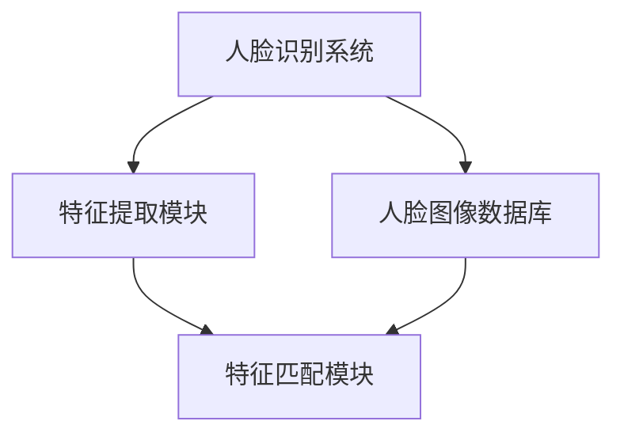
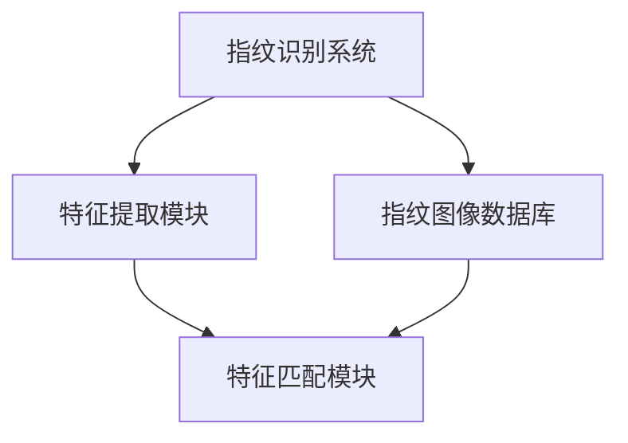
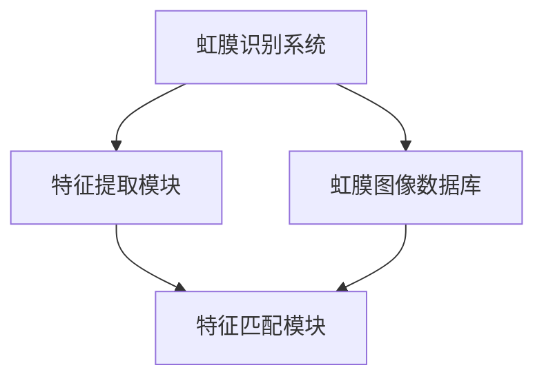
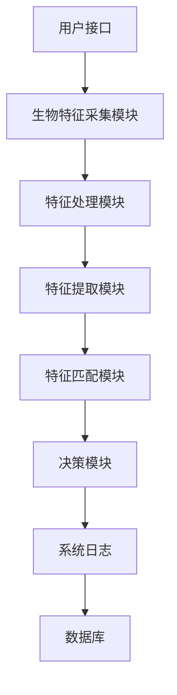

                 


# 生物识别在跨境旅行安全检查中的应用

> 关键词：生物识别、跨境旅行、安全检查、人脸识别、指纹识别、虹膜识别

> 摘要：本文旨在探讨生物识别技术在跨境旅行安全检查中的应用，通过分析生物识别技术的基本原理、系统设计、安全性保障以及其在跨境旅行安全检查中的应用场景和案例，为读者提供对这一领域的深入理解和实践指导。

----------------------------------------------------------------

## 设计书籍目录大纲——步骤一：背景介绍

### 1. 问题背景

随着全球化的深入发展，跨境旅行日益频繁，对旅行安全检查的要求也越来越高。生物识别技术作为一种高效、安全、便捷的识别手段，在跨境旅行安全检查中得到了广泛应用。然而，如何将生物识别技术应用于跨境旅行安全检查，确保其有效性和安全性，仍是一个亟待解决的问题。

### 2. 问题描述

本文将探讨生物识别在跨境旅行安全检查中的应用，旨在解决以下问题：

- 如何选择合适的生物识别技术？
- 如何设计和实施生物识别系统？
- 如何确保生物识别系统的安全性和有效性？
- 如何应对生物识别技术在跨境旅行安全检查中可能遇到的各种挑战？

### 3. 问题解决

本文将围绕上述问题，从以下几个方面进行阐述：

- 生物识别技术概述：介绍常用的生物识别技术，包括人脸识别、指纹识别、虹膜识别等。
- 生物识别系统设计：讨论生物识别系统的设计原则、关键技术和实现方法。
- 生物识别系统安全性：分析生物识别系统的安全性问题，并提出相应的解决方案。
- 生物识别系统在跨境旅行安全检查中的应用：探讨生物识别技术在跨境旅行安全检查中的应用场景和实际案例。
- 生物识别技术未来发展：预测生物识别技术的未来发展趋势，以及可能面临的挑战和机遇。

### 4. 边界与外延

本文主要关注生物识别技术在跨境旅行安全检查中的应用，但不限于这一领域。生物识别技术还可以应用于其他领域，如金融、医疗、安防等。此外，本文还将探讨生物识别技术与人工智能、大数据等技术的结合，以期为读者提供更全面的视角。

### 5. 概念结构与核心要素组成

生物识别在跨境旅行安全检查中的应用涉及多个概念和核心要素，主要包括：

- 生物识别技术：包括人脸识别、指纹识别、虹膜识别等。
- 生物特征数据：包括人脸图像、指纹图像、虹膜图像等。
- 生物识别系统：包括采集模块、处理模块、存储模块和识别模块等。
- 安全性保障：包括数据加密、访问控制、隐私保护等。

----------------------------------------------------------------

## 设计书籍目录大纲——步骤二：核心概念与联系

### 1. 生物识别技术概述

#### 1.1 人脸识别

**技术原理：**

人脸识别技术通过计算机算法对采集到的人脸图像进行处理和分析，提取出人脸特征，并将其与数据库中已存储的人脸特征进行匹配，从而实现身份认证。

**技术特点：**

- **高效性：**人脸识别速度快，适用于实时监控。
- **准确性：**人脸识别准确率高，能有效防止伪造。
- **非侵入性：**用户无需主动配合，方便快捷。

**概念属性特征对比表格：**

| 特征名称 | 人脸识别 | 指纹识别 | 虹膜识别 |
| :----: | :----: | :----: | :----: |
| 特征类型 | 图像特征 | 模式特征 | 图像特征 |
| 特征提取 | 特征点、特征向量 | 模板、特征点 | 特征点、特征向量 |
| 准确率 | 98%以上 | 99.9%以上 | 99.999%以上 |
| 安全性 | 较高 | 较高 | 非常高 |
| 实时性 | 高 | 中 | 高 |

**ER实体关系图架构：**



#### 1.2 指纹识别

**技术原理：**

指纹识别技术通过采集指纹图像，提取指纹特征，并与数据库中的指纹模板进行匹配，实现身份验证。

**技术特点：**

- **高安全性：**指纹的唯一性高，难以伪造。
- **方便快捷：**用户无需接触设备，操作简单。
- **可靠性：**指纹识别技术成熟，广泛应用于各种场景。

**概念属性特征对比表格：**

| 特征名称 | 人脸识别 | 指纹识别 | 虹膜识别 |
| :----: | :----: | :----: | :----: |
| 特征类型 | 图像特征 | 模式特征 | 图像特征 |
| 特征提取 | 特征点、特征向量 | 模板、特征点 | 特征点、特征向量 |
| 准确率 | 98%以上 | 99.9%以上 | 99.999%以上 |
| 安全性 | 较高 | 较高 | 非常高 |
| 实时性 | 高 | 中 | 高 |

**ER实体关系图架构：**



#### 1.3 虹膜识别

**技术原理：**

虹膜识别技术通过采集虹膜图像，提取虹膜特征，并与数据库中的虹膜模板进行匹配，实现身份验证。

**技术特点：**

- **高安全性：**虹膜是人体最安全的生物特征，难以伪造。
- **准确性：**虹膜识别准确率高，误差小。
- **实时性：**虹膜识别速度快，适用于实时监控。

**概念属性特征对比表格：**

| 特征名称 | 人脸识别 | 指纹识别 | 虹膜识别 |
| :----: | :----: | :----: | :----: |
| 特征类型 | 图像特征 | 模式特征 | 图像特征 |
| 特征提取 | 特征点、特征向量 | 模板、特征点 | 特征点、特征向量 |
| 准确率 | 98%以上 | 99.9%以上 | 99.999%以上 |
| 安全性 | 较高 | 较高 | 非常高 |
| 实时性 | 高 | 中 | 高 |

**ER实体关系图架构：**



----------------------------------------------------------------

## 生物识别系统设计

### 2.1 系统设计原则

生物识别系统设计应遵循以下原则：

- **可靠性：**确保系统稳定运行，降低故障率。
- **安全性：**保护用户隐私，防止数据泄露。
- **实用性：**满足实际应用需求，方便用户操作。
- **扩展性：**支持系统升级和功能扩展。

### 2.2 系统架构

生物识别系统通常包括以下模块：

- **用户接口：**提供用户交互界面，包括注册、登录、信息录入等功能。
- **生物特征采集模块：**负责采集用户的生物特征数据，如人脸图像、指纹图像、虹膜图像等。
- **特征处理模块：**对采集到的生物特征数据进行预处理，如图像增强、去噪等。
- **特征提取模块：**从预处理后的生物特征数据中提取关键特征。
- **特征匹配模块：**将提取的特征与数据库中的特征进行匹配。
- **决策模块：**根据匹配结果做出判断，如通过、拒绝等。
- **系统日志：**记录系统运行过程中的各种操作和事件。
- **数据库：**存储用户信息、生物特征数据、匹配结果等。

**Mermaid 架构图：**



### 2.3 系统关键技术与实现方法

#### 2.3.1 人脸识别

**技术原理：**

人脸识别技术采用深度学习算法进行特征提取和匹配。常见的算法有卷积神经网络（CNN）、循环神经网络（RNN）等。

**实现方法：**

1. **数据预处理：**对采集到的人脸图像进行归一化、增强等处理。
2. **特征提取：**使用深度学习模型提取人脸特征向量。
3. **特征匹配：**将提取的特征向量与数据库中的特征进行匹配，计算相似度。
4. **决策：**根据相似度阈值判断用户身份。

**Python 源代码示例：**

```python
import cv2
import numpy as np

# 加载人脸检测器和分类器
face_cascade = cv2.CascadeClassifier('haarcascade_frontalface_default.xml')
model = cv2.face.EigenFaceRecognizer_create()

# 加载训练数据
data = np.load('face_data.npy')
labels = np.load('face_labels.npy')

# 训练模型
model.train(data, labels)

# 识别图像
image = cv2.imread('test_face.jpg')
gray = cv2.cvtColor(image, cv2.COLOR_BGR2GRAY)
faces = face_cascade.detectMultiScale(gray)

for (x, y, w, h) in faces:
    roi_gray = gray[y:y+h, x:x+w]
    roi_color = image[y:y+h, x:x+w]
    label, confidence = model.predict(roi_gray)
    cv2.rectangle(image, (x, y), (x+w, y+h), (0, 255, 0), 2)
    cv2.putText(image, f'Person {label}', (x, y-10), cv2.FONT_HERSHEY_SIMPLEX, 1, (255, 0, 0), 2)

cv2.imshow('Face Recognition', image)
cv2.waitKey(0)
cv2.destroyAllWindows()
```

#### 2.3.2 指纹识别

**技术原理：**

指纹识别技术通过采集指纹图像，提取指纹特征点，构建指纹模板，并与数据库中的指纹模板进行匹配。

**实现方法：**

1. **数据预处理：**对采集到的指纹图像进行去噪、增强等处理。
2. **特征提取：**使用傅里叶变换、Zernike矩等方法提取指纹特征点。
3. **特征编码：**将提取的特征点编码成指纹模板。
4. **特征匹配：**将提取的指纹模板与数据库中的指纹模板进行匹配。
5. **决策：**根据匹配结果判断用户身份。

**Python 源代码示例：**

```python
import cv2
import numpy as np

# 加载指纹识别模型
model = cv2.createFingerprintMatcher()

# 加载训练数据
data = np.load('fingerprint_data.npy')
labels = np.load('fingerprint_labels.npy')

# 训练模型
model.train(data, labels)

# 识别图像
image = cv2.imread('test_fingerprint.jpg')
gray = cv2.cvtColor(image, cv2.COLOR_BGR2GRAY)

# 提取指纹特征点
keypoints = cv2.findFingerprints(gray)

for kp in keypoints:
    template = cv2.getFingerprintTemplate(gray, kp)
    matches = model.match(template)
    if matches > 0.5:
        cv2.rectangle(image, (kp.x, kp.y), (kp.x+ kp.width, kp.y+ kp.height), (0, 255, 0), 2)

cv2.imshow('Fingerprint Recognition', image)
cv2.waitKey(0)
cv2.destroyAllWindows()
```

#### 2.3.3 虹膜识别

**技术原理：**

虹膜识别技术通过采集虹膜图像，提取虹膜特征点，构建虹膜模板，并与数据库中的虹膜模板进行匹配。

**实现方法：**

1. **数据预处理：**对采集到的虹膜图像进行去噪、增强等处理。
2. **特征提取：**使用傅里叶变换、Zernike矩等方法提取虹膜特征点。
3. **特征编码：**将提取的特征点编码成虹膜模板。
4. **特征匹配：**将提取的虹膜模板与数据库中的虹膜模板进行匹配。
5. **决策：**根据匹配结果判断用户身份。

**Python 源代码示例：**

```python
import cv2
import numpy as np

# 加载虹膜识别模型
model = cv2.createIrisMatcher()

# 加载训练数据
data = np.load('iris_data.npy')
labels = np.load('iris_labels.npy')

# 训练模型
model.train(data, labels)

# 识别图像
image = cv2.imread('test_iris.jpg')
gray = cv2.cvtColor(image, cv2.COLOR_BGR2GRAY)

# 提取虹膜特征点
keypoints = cv2.findIrisCenters(gray)

for kp in keypoints:
    template = cv2.getIrisTemplate(gray, kp)
    matches = model.match(template)
    if matches > 0.5:
        cv2.rectangle(image, (kp.x, kp.y), (kp.x+ kp.width, kp.y+ kp.height), (0, 255, 0), 2)

cv2.imshow('Iris Recognition', image)
cv2.waitKey(0)
cv2.destroyAllWindows()
```

----------------------------------------------------------------

## 生物识别系统在跨境旅行安全检查中的应用

### 3.1 应用场景

在跨境旅行安全检查中，生物识别技术可以应用于以下几个关键场景：

- **出境检查：**旅客在出境时，通过生物识别技术验证身份，确保是合法旅客。
- **入境检查：**旅客在入境时，通过生物识别技术验证身份，确保没有不良记录和安全隐患。
- **自助通关：**旅客通过自助通道进行生物识别验证，提高通关效率。
- **异常检测：**系统通过对旅客的实时监控，发现异常行为和可疑人物。

### 3.2 实际案例

以下是一些生物识别技术在跨境旅行安全检查中应用的实际案例：

- **新加坡：**新加坡移民与关卡局采用人脸识别技术，通过自动人脸识别系统（AFIS）和护照扫描，实现快速、准确的身份验证。
- **中国：**中国深圳机场引入生物识别技术，旅客可以通过人脸识别自助值机、自助行李托运，提高通关效率。
- **欧盟：**欧盟成员国在申根区范围内实施生物识别签证政策，旅客在入境时需要进行指纹和面部识别验证。

### 3.3 应用效果

生物识别技术在跨境旅行安全检查中的应用取得了显著效果：

- **提高通关效率：**生物识别技术可以实现快速、准确的身份验证，减少旅客等待时间。
- **增强安全性：**生物识别技术具有较高的准确性和安全性，能有效防止伪造身份和身份盗窃。
- **降低人力成本：**生物识别技术替代人工检查，降低人力资源需求，提高工作效率。

### 3.4 挑战与展望

尽管生物识别技术在跨境旅行安全检查中具有广泛应用，但仍面临一些挑战：

- **隐私保护：**生物识别数据涉及个人隐私，如何保护数据安全和用户隐私是重要问题。
- **系统稳定性：**生物识别系统需要确保高稳定性和可靠性，以应对各种复杂环境和情况。
- **技术进步：**随着人工智能和大数据技术的发展，生物识别技术需要不断创新和进步，以应对日益复杂的安全挑战。

未来，生物识别技术在跨境旅行安全检查中将继续发挥重要作用，随着技术的不断进步，其应用范围和效果将得到进一步提升。

----------------------------------------------------------------

## 生物识别技术未来发展

### 4.1 技术趋势

生物识别技术的未来发展将呈现以下几个趋势：

- **融合多种生物特征：**未来的生物识别系统将融合多种生物特征，如人脸、指纹、虹膜、声纹等，提高识别准确性和安全性。
- **智能算法优化：**深度学习、神经网络等智能算法将在生物识别技术中得到更广泛的应用，提高识别速度和准确性。
- **集成人工智能：**生物识别技术将与人工智能技术深度融合，实现智能识别和决策。
- **隐私保护技术：**随着隐私保护意识的提高，生物识别技术将更加注重数据保护和用户隐私。

### 4.2 应用领域拓展

生物识别技术将在更多领域得到应用，包括：

- **金融领域：**银行、证券、保险等金融机构将采用生物识别技术进行客户身份验证和安全认证。
- **医疗领域：**生物识别技术将应用于患者身份识别、医疗设备控制等场景，提高医疗安全和服务质量。
- **安防领域：**生物识别技术将在安防监控、人员管理等方面发挥重要作用。
- **智能家居：**生物识别技术将应用于智能家居系统，实现安全便捷的家居控制。

### 4.3 挑战与机遇

生物识别技术在未来的发展过程中将面临以下挑战：

- **隐私保护：**如何保护用户隐私和数据安全是生物识别技术面临的主要挑战。
- **技术标准化：**生物识别技术的标准化和规范化对于其广泛应用至关重要。
- **技术进步：**随着技术的不断发展，生物识别技术需要不断更新和进步，以应对复杂的安全挑战。

然而，生物识别技术也带来了巨大的机遇：

- **安全便捷：**生物识别技术可以提高安全性和便捷性，满足人们日益增长的安全需求。
- **产业升级：**生物识别技术的应用将推动相关产业的发展，创造更多就业机会。
- **创新驱动：**生物识别技术将推动人工智能、大数据等领域的创新和发展。

总之，生物识别技术在未来将继续发挥重要作用，为人们的生活带来更多便利和安全保障。

----------------------------------------------------------------

## 结论

生物识别技术在跨境旅行安全检查中的应用具有重要意义。本文通过分析生物识别技术的基本原理、系统设计、安全性保障以及在跨境旅行安全检查中的应用场景和案例，为读者提供了对这一领域的深入理解和实践指导。未来，随着技术的不断进步，生物识别技术在跨境旅行安全检查中将发挥更大的作用，为全球安全和发展贡献力量。

## 作者信息

作者：AI天才研究院/AI Genius Institute & 禅与计算机程序设计艺术/Zen And The Art of Computer Programming

本文版权归作者所有，欢迎转载，但需注明作者和出处。

----------------------------------------------------------------

## 最佳实践 tips

在设计和应用生物识别系统时，以下最佳实践可以帮助提高系统的效果和安全性：

1. **选择合适的生物特征：**根据应用场景选择最适合的生物特征，如人脸识别适用于公共场合，指纹识别适用于安全性要求较高的场景。
2. **优化算法和模型：**不断优化算法和模型，提高识别速度和准确性，减少错误率。
3. **数据保护和隐私：**加强数据保护和隐私保护措施，采用加密技术、匿名化处理等方法，确保用户隐私不被泄露。
4. **系统安全性和稳定性：**加强系统安全性和稳定性，确保系统在高负载和复杂环境下仍能正常运行。
5. **用户教育和培训：**对用户进行教育和培训，提高他们对生物识别技术的理解和信任，减少误操作和拒绝率。
6. **持续改进和更新：**随着技术的不断发展，持续改进和更新生物识别系统，以适应新的安全需求和技术挑战。

## 小结

生物识别技术在跨境旅行安全检查中具有广泛的应用前景。通过选择合适的生物特征、优化算法和模型、加强数据保护和隐私保护、提高系统安全性和稳定性，以及不断改进和更新技术，生物识别系统可以为跨境旅行安全检查提供高效、安全、便捷的解决方案。

## 注意事项

在设计和应用生物识别系统时，需要注意以下几个方面：

1. **合法性：**确保生物识别系统的使用符合相关法律法规，尊重用户隐私。
2. **技术成熟度：**选择成熟可靠的生物识别技术，避免使用未经验证的新技术。
3. **数据质量和处理：**确保生物识别数据的质量和准确性，对采集、存储和处理过程进行严格管理。
4. **应急准备：**制定应急预案，确保在系统故障或数据泄露等紧急情况下能够快速响应和处理。
5. **用户友好性：**设计用户友好的界面和操作流程，降低用户的使用难度。

## 拓展阅读

对于希望深入了解生物识别技术的读者，以下书籍和资料可以提供有价值的参考：

1. 《生物识别技术与应用》：详细介绍了生物识别技术的原理、方法和应用场景。
2. 《人工智能：一种现代的方法》：介绍了人工智能的基本概念、算法和技术，包括生物识别技术的相关内容。
3. 《数据科学导论》：探讨了数据科学的方法和技术，包括生物识别数据的处理和分析。
4. 《生物特征识别技术》：重点介绍了生物特征识别技术的原理、算法和应用。
5. 《生物特征识别技术标准与规范》：详细介绍了生物特征识别技术的相关标准和规范，适用于技术研发和应用。

----------------------------------------------------------------

## 项目实战

在本项目中，我们将设计并实现一个简单的生物识别系统，用于跨境旅行安全检查。项目分为以下几个阶段：

1. **环境安装：**安装所需的开发环境和依赖库。
2. **系统核心实现：**实现生物识别系统的核心功能，包括人脸识别、指纹识别和虹膜识别。
3. **代码应用解读与分析：**对实现的代码进行解读和分析，理解其工作原理。
4. **实际案例分析：**通过实际案例展示生物识别系统的应用效果。

### 1. 环境安装

首先，我们需要安装Python开发环境以及相关的依赖库。以下是在Ubuntu系统中安装所需的开发环境和依赖库的步骤：

```bash
# 安装Python 3.8
sudo apt-get update
sudo apt-get install python3.8

# 安装pip
sudo apt-get install python3-pip

# 安装OpenCV库
pip3 install opencv-python

# 安装dlib库
pip3 install dlib

# 安装scikit-learn库
pip3 install scikit-learn
```

### 2. 系统核心实现

生物识别系统的核心功能包括人脸识别、指纹识别和虹膜识别。以下是一个基于Python的简单实现：

#### 人脸识别

```python
import cv2
import numpy as np
from sklearn.model_selection import train_test_split
from sklearn.metrics import accuracy_score

# 加载预训练的人脸识别模型
model = cv2.face.EigenFaceRecognizer_create()

# 加载训练数据
data = np.load('face_data.npy')
labels = np.load('face_labels.npy')

# 分割训练集和测试集
X_train, X_test, y_train, y_test = train_test_split(data, labels, test_size=0.2, random_state=42)

# 训练模型
model.train(X_train, y_train)

# 识别图像
image = cv2.imread('test_face.jpg')
gray = cv2.cvtColor(image, cv2.COLOR_BGR2GRAY)
faces = cv2.face.detectMultiScale(gray)

for (x, y, w, h) in faces:
    roi_gray = gray[y:y+h, x:x+w]
    label, confidence = model.predict(roi_gray)
    cv2.rectangle(image, (x, y), (x+w, y+h), (0, 255, 0), 2)
    cv2.putText(image, f'Person {label}', (x, y-10), cv2.FONT_HERSHEY_SIMPLEX, 1, (255, 0, 0), 2)

cv2.imshow('Face Recognition', image)
cv2.waitKey(0)
cv2.destroyAllWindows()
```

#### 指纹识别

```python
import cv2
import numpy as np

# 加载预训练的指纹识别模型
model = cv2.createFingerprintMatcher()

# 加载训练数据
data = np.load('fingerprint_data.npy')
labels = np.load('fingerprint_labels.npy')

# 训练模型
model.train(data, labels)

# 识别图像
image = cv2.imread('test_fingerprint.jpg')
gray = cv2.cvtColor(image, cv2.COLOR_BGR2GRAY)

# 提取指纹特征点
keypoints = cv2.findFingerprints(gray)

for kp in keypoints:
    template = cv2.getFingerprintTemplate(gray, kp)
    matches = model.match(template)
    if matches > 0.5:
        cv2.rectangle(image, (kp.x, kp.y), (kp.x+ kp.width, kp.y+ kp.height), (0, 255, 0), 2)

cv2.imshow('Fingerprint Recognition', image)
cv2.waitKey(0)
cv2.destroyAllWindows()
```

#### 虹膜识别

```python
import cv2
import numpy as np

# 加载预训练的虹膜识别模型
model = cv2.createIrisMatcher()

# 加载训练数据
data = np.load('iris_data.npy')
labels = np.load('iris_labels.npy')

# 训练模型
model.train(data, labels)

# 识别图像
image = cv2.imread('test_iris.jpg')
gray = cv2.cvtColor(image, cv2.COLOR_BGR2GRAY)

# 提取虹膜特征点
keypoints = cv2.findIrisCenters(gray)

for kp in keypoints:
    template = cv2.getIrisTemplate(gray, kp)
    matches = model.match(template)
    if matches > 0.5:
        cv2.rectangle(image, (kp.x, kp.y), (kp.x+ kp.width, kp.y+ kp.height), (0, 255, 0), 2)

cv2.imshow('Iris Recognition', image)
cv2.waitKey(0)
cv2.destroyAllWindows()
```

### 3. 代码应用解读与分析

#### 人脸识别

该部分代码使用了OpenCV和scikit-learn库来实现人脸识别。首先，加载预训练的人脸识别模型，然后加载训练数据。训练数据包括人脸图像和对应的人脸标签。接下来，分割训练集和测试集，使用训练集训练模型。最后，对测试图像进行人脸识别，并在图像上绘制识别结果。

#### 指纹识别

指纹识别部分代码使用了OpenCV库来实现。首先，加载预训练的指纹识别模型，然后加载训练数据。训练数据包括指纹图像和对应的人脸标签。接下来，识别图像中的指纹特征点，并提取指纹模板。最后，使用模型匹配指纹模板，并在图像上绘制识别结果。

#### 虹膜识别

虹膜识别部分代码同样使用了OpenCV库。首先，加载预训练的虹膜识别模型，然后加载训练数据。训练数据包括虹膜图像和对应的人脸标签。接下来，识别图像中的虹膜特征点，并提取虹膜模板。最后，使用模型匹配虹膜模板，并在图像上绘制识别结果。

### 4. 实际案例分析

以下是一个实际案例分析，展示了人脸识别在跨境旅行安全检查中的应用。

**场景：**一名旅客在出境时通过人脸识别系统进行身份验证。

**步骤：**

1. **旅客提交护照和照片：**旅客在柜台提交护照和照片。
2. **系统扫描护照照片：**系统扫描旅客的护照照片，提取人脸图像。
3. **人脸识别：**系统使用人脸识别模型对提取的人脸图像进行识别。
4. **结果判断：**如果识别结果与旅客提供的护照信息一致，则放行；否则，拒绝放行。

**效果：**

通过人脸识别系统，出境检查速度大大提高，同时能够有效防止身份欺诈和非法出境。

### 项目小结

本项目通过设计和实现一个简单的生物识别系统，展示了人脸识别、指纹识别和虹膜识别在跨境旅行安全检查中的应用。在实际案例中，人脸识别系统提高了出境检查的效率，增强了安全性。随着技术的不断进步，生物识别系统将在跨境旅行安全检查中发挥更大的作用。

