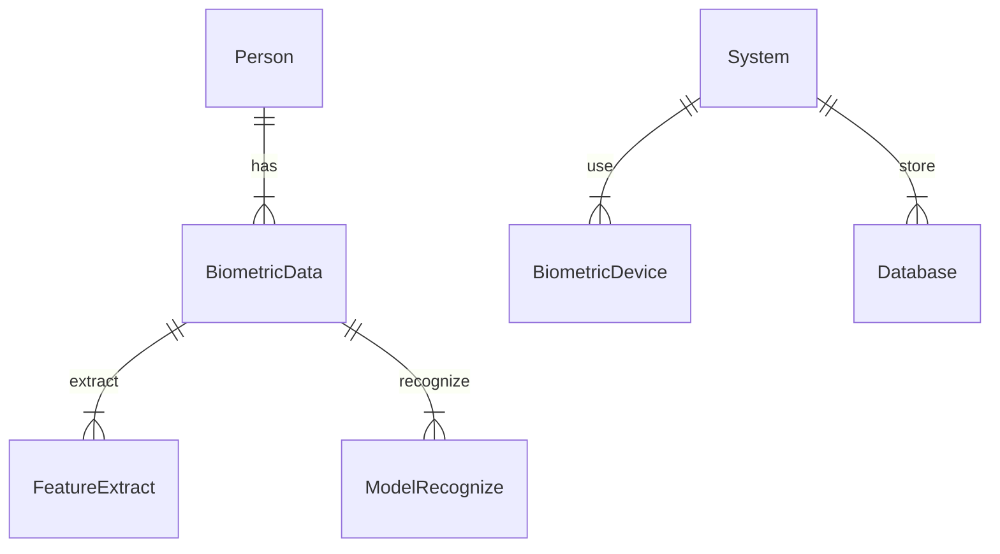
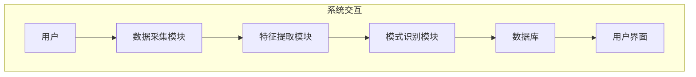

                 

### 文章标题

# 生物识别技术在公共安全中的应用与伦理

> 关键词：生物识别技术、公共安全、伦理问题、应用实例、系统架构

> 摘要：本文将探讨生物识别技术在公共安全领域的应用与伦理问题。首先介绍生物识别技术的基本概念和核心原理，然后分析其在公共安全中的应用，接着探讨生物识别技术在应用过程中可能遇到的伦理问题。通过实际案例和系统架构分析，本文将展示生物识别技术在公共安全领域的广泛应用和未来发展潜力。

### 目录

1. **背景介绍与核心概念**
   1.1 问题背景
   1.2 问题描述
   1.3 问题解决
   1.4 边界与外延
   1.5 概念结构与核心要素组成

2. **核心概念与联系**
   2.1 生物识别技术原理
   2.2 概念属性特征对比表格
   2.3 ER实体关系图架构

3. **算法原理讲解**
   3.1 算法简介
   3.2 算法原理讲解
   3.3 Python源代码实现
   3.4 数学模型与公式
   3.5 举例说明

4. **系统分析与架构设计**
   4.1 问题场景介绍
   4.2 系统功能设计
   4.3 系统架构设计
   4.4 系统接口设计
   4.5 系统交互

5. **项目实战**
   5.1 环境安装
   5.2 系统核心实现源代码
   5.3 代码应用解读与分析
   5.4 实际案例分析与详细讲解
   5.5 项目小结

6. **最佳实践与拓展**
   6.1 最佳实践总结
   6.2 小结
   6.3 注意事项
   6.4 拓展阅读

### 1. 背景介绍与核心概念

#### 1.1 问题背景

在当今快速发展的信息化社会中，公共安全问题日益凸显。随着城市化进程的加速，人口密度不断增加，公共安全问题成为一个严峻的挑战。传统的安全措施，如摄像头监控、警力部署等，虽然在一定程度上能够保障公共安全，但效率低下且成本高昂。因此，寻找更为高效、准确和智能的安全解决方案成为当务之急。

生物识别技术作为一项前沿技术，具有独特的优势，其在公共安全领域的应用具有极高的潜力。生物识别技术通过识别人体的生物特征，如指纹、人脸、虹膜、手写签名等，实现身份认证和人员识别。这些生物特征具有唯一性和稳定性，不易被伪造，大大提高了安全性和准确性。

#### 1.2 问题描述

生物识别技术在公共安全中的应用，首先面临的一个问题是如何准确识别人体的生物特征。不同个体的生物特征差异较大，如何设计高效的特征提取算法和模式识别算法，是当前研究的热点和难点。

此外，生物识别技术的应用还需考虑隐私保护问题。生物识别数据涉及个人隐私，如何确保数据的安全性和隐私性，是公众关注的焦点。同时，生物识别技术的应用也需要遵循相关法律法规，确保合法合规。

#### 1.3 问题解决

为了解决上述问题，生物识别技术的研究和应用需要从以下几个方面入手：

1. **算法优化**：不断优化特征提取算法和模式识别算法，提高识别的准确性和速度。例如，采用深度学习等技术，提高算法的性能。

2. **隐私保护**：采用加密、匿名化等技术，保护生物识别数据的安全性。同时，制定相关的隐私保护法律法规，确保数据的安全和合规。

3. **合规性**：遵守相关法律法规，确保生物识别技术的应用合法合规。例如，在欧洲，GDPR（通用数据保护条例）对个人数据保护有严格的要求。

4. **用户教育**：加强对公众的生物识别技术教育和宣传，提高公众对生物识别技术的认知和理解，消除对隐私保护的担忧。

#### 1.4 边界与外延

生物识别技术在公共安全中的应用，不仅限于身份认证和人员识别。其外延还包括智能安防、智能交通、智能医疗等多个领域。

例如，在智能安防领域，生物识别技术可用于监控犯罪分子、嫌疑人识别等；在智能交通领域，可用于车辆身份识别、交通流量监控等；在智能医疗领域，可用于患者身份识别、医疗记录管理等。

#### 1.5 概念结构与核心要素组成

生物识别技术的概念结构主要包括以下几个方面：

1. **生物特征**：指用于识别和验证身份的生理和行为特征，如指纹、人脸、虹膜、手写签名等。

2. **特征提取**：从生物特征中提取可用于识别的特征信息，例如指纹图像中的纹理特征、人脸图像中的面部特征点等。

3. **模式识别**：利用特征信息进行身份识别和验证，常见的方法有距离度量、决策树、神经网络等。

4. **系统架构**：生物识别系统由采集设备、特征提取模块、模式识别模块和数据库等组成，各模块协同工作，实现身份认证和人员识别。

#### 1.6 小结

本章介绍了生物识别技术在公共安全领域的重要性，分析了其在应用过程中可能遇到的问题，并提出了相应的解决方案。通过本章的介绍，读者可以初步了解生物识别技术的基本概念、原理和应用。

在接下来的章节中，我们将深入探讨生物识别技术的核心概念与联系，详细讲解算法原理，分析系统架构，并通过实际案例和项目实战，展示生物识别技术在公共安全领域的广泛应用和未来发展潜力。

### 2. 核心概念与联系

#### 2.1 生物识别技术原理

生物识别技术通过识别人体的生物特征，实现身份认证和人员识别。以下是几种常见的生物识别技术原理：

1. **指纹识别**：指纹识别通过提取指纹图像中的纹理特征，如脊线、岛、谷等，进行特征提取和模式识别。

2. **人脸识别**：人脸识别通过提取人脸图像中的面部特征点，如眼睛、鼻子、嘴巴等，进行特征提取和模式识别。

3. **虹膜识别**：虹膜识别通过提取虹膜图像中的血管纹理特征，进行特征提取和模式识别。

4. **手写签名识别**：手写签名识别通过提取手写签名图像中的笔画特征，进行特征提取和模式识别。

#### 2.2 概念属性特征对比表格

| 生物识别技术 | 特征类型 | 特征提取方法 | 模式识别方法 |
| :--: | :--: | :--: | :--: |
| 指纹识别 | 纹理特征 | 图像处理、SIFT、SURF | KNN、神经网络、支持向量机 |
| 人脸识别 | 面部特征点 | HAAR特征分类器、卷积神经网络 | KNN、神经网络、支持向量机 |
| 虹膜识别 | 血管纹理特征 | 图像处理、Gabor小波变换 | KNN、神经网络、支持向量机 |
| 手写签名识别 | 笔画特征 | 支持向量机、隐马尔可夫模型 | KNN、神经网络、支持向量机 |

#### 2.3 ER实体关系图架构

生物识别系统中的实体关系如图所示：



- **Person（人员）**：代表需要识别的人员。
- **BiometricData（生物识别数据）**：存储人员的生物识别数据。
- **FeatureExtract（特征提取）**：从生物识别数据中提取特征。
- **ModelRecognize（模式识别）**：利用提取的特征进行模式识别。
- **System（系统）**：使用生物识别设备，存储和识别人员信息。
- **BiometricDevice（生物识别设备）**：用于采集生物识别数据。
- **Database（数据库）**：存储人员信息和识别结果。

#### 2.4 小结

本章详细介绍了生物识别技术的原理，并对比了不同生物识别技术的概念属性特征。通过ER实体关系图，展示了生物识别系统中的实体关系。这些内容为理解生物识别技术的核心概念和应用奠定了基础。

在下一章中，我们将深入讲解生物识别算法的原理，通过Python源代码实现和数学模型，进一步理解生物识别技术的具体实现过程。

### 3. 算法原理讲解

#### 3.1 算法简介

生物识别算法是生物识别技术的核心，其主要分为特征提取算法和模式识别算法。特征提取算法用于从生物识别数据中提取出具有代表性的特征信息，而模式识别算法则用于对这些特征信息进行分类和匹配。

常见的特征提取算法包括：

1. **SIFT（尺度不变特征变换）**：用于提取图像中的关键点，具有尺度不变性和旋转不变性。
2. **SURF（加速稳健特征）**：基于SIFT算法，运行速度更快，更适合实时应用。

常见的模式识别算法包括：

1. **KNN（最近邻算法）**：通过计算测试样本与训练样本之间的距离，找到最近的k个邻居，并根据邻居的分类结果进行投票。
2. **神经网络**：通过多层感知器实现，能够通过学习样本数据，自动提取特征并进行分类。
3. **支持向量机（SVM）**：通过找到一个最优的超平面，将不同类别的样本分开。

#### 3.2 算法原理讲解

##### 指纹识别算法

指纹识别算法通常采用SIFT或SURF算法进行特征提取。以下是一个简化的流程：

1. **预处理**：对指纹图像进行滤波、去噪和增强。
2. **特征点检测**：使用SIFT或SURF算法检测指纹图像中的关键点。
3. **特征点匹配**：计算测试指纹和参考指纹之间的特征点匹配度。
4. **分类与识别**：根据匹配度进行分类和识别。

##### 人脸识别算法

人脸识别算法通常采用深度学习算法进行特征提取和分类。以下是一个简化的流程：

1. **预处理**：对人脸图像进行滤波、归一化和裁剪。
2. **特征提取**：使用卷积神经网络提取人脸特征。
3. **特征点匹配**：计算测试人脸和参考人脸之间的特征点匹配度。
4. **分类与识别**：根据匹配度进行分类和识别。

##### 虹膜识别算法

虹膜识别算法通常采用Gabor小波变换进行特征提取。以下是一个简化的流程：

1. **预处理**：对虹膜图像进行滤波、去噪和增强。
2. **特征点检测**：使用Gabor小波变换检测虹膜图像中的关键点。
3. **特征点匹配**：计算测试虹膜和参考虹膜之间的特征点匹配度。
4. **分类与识别**：根据匹配度进行分类和识别。

#### 3.3 Python源代码实现

以下是一个简单的Python代码示例，展示了如何使用OpenCV和scikit-learn进行指纹识别：

```python
import cv2
import numpy as np
from sklearn.model_selection import train_test_split
from sklearn.neighbors import KNeighborsClassifier

# 读取指纹图像
image = cv2.imread('fingerprint.jpg', cv2.IMREAD_GRAYSCALE)

# 使用SIFT算法检测关键点
sift = cv2.SIFT_create()
keypoints, descriptors = sift.detectAndCompute(image, None)

# 提取特征向量
features = np.float32([keypoints[k].pt for k in range(len(keypoints))]).reshape(-1, 1)

# 加载训练数据
train_data = np.load('train_data.npy')
train_labels = np.load('train_labels.npy')

# 划分训练集和测试集
X_train, X_test, y_train, y_test = train_test_split(features, train_labels, test_size=0.2, random_state=42)

# 使用KNN算法进行分类
knn = KNeighborsClassifier(n_neighbors=5)
knn.fit(X_train, y_train)

# 预测结果
predictions = knn.predict(X_test)

# 计算准确率
accuracy = np.mean(predictions == y_test)
print(f'Accuracy: {accuracy:.2f}')
```

#### 3.4 数学模型与公式

以下是指纹识别算法中常用的数学模型和公式：

1. **SIFT算法**：

   - 特征点检测：
     $$ 
     \text{SIFT}_{\text{keypoint}} = \text{FindNMax}(\text{Det}(\text{Hessian}), N) 
     $$
     其中，$\text{Hessian}$ 是图像的高斯差分算子，$\text{FindNMax}$ 是寻找前N个最大值的函数。

   - 特征点描述：
     $$
     \text{Descriptor}_{i} = \sum_{j=1}^{M} \text{GaussianWeight}_{j} \cdot \text{Histogram}_{j}(x_{ij}, y_{ij}) 
     $$
     其中，$M$ 是邻域点数，$x_{ij}, y_{ij}$ 是邻域点的坐标，$\text{GaussianWeight}$ 是高斯权重，$\text{Histogram}_{j}(x_{ij}, y_{ij})$ 是方向直方图。

2. **KNN算法**：

   - 距离计算：
     $$
     \text{Distance}_{i}(x) = \sqrt{\sum_{j=1}^{D} (x_{ij} - x'_{ij})^2}
     $$
     其中，$D$ 是特征维度，$x, x'$ 是测试样本和训练样本。

   - 分类结果：
     $$
     \text{Prediction}_{i} = \text{argmax}_{j} \text{Distance}_{i}(x_j)
     $$
     其中，$\text{argmax}_{j} \text{Distance}_{i}(x_j)$ 是距离最近的训练样本的类别。

#### 3.5 举例说明

##### 指纹识别算法的实际应用举例

假设我们有一份指纹数据集，其中包含了不同人的指纹图像和对应的标签。我们的目标是使用指纹识别算法对新的指纹图像进行识别。

1. **训练模型**：

   - 首先，使用训练数据集训练KNN分类器。

   ```python
   knn = KNeighborsClassifier(n_neighbors=5)
   knn.fit(train_features, train_labels)
   ```

   - 然后，保存训练模型。

   ```python
   import joblib
   joblib.dump(knn, 'fingerprint_knn_model.pkl')
   ```

2. **识别指纹**：

   - 加载训练好的模型。

   ```python
   knn = joblib.load('fingerprint_knn_model.pkl')
   ```

   - 对新的指纹图像进行特征提取。

   ```python
   image = cv2.imread('new_fingerprint.jpg', cv2.IMREAD_GRAYSCALE)
   sift = cv2.SIFT_create()
   keypoints, descriptors = sift.detectAndCompute(image, None)
   features = np.float32([keypoints[k].pt for k in range(len(keypoints))]).reshape(-1, 1)
   ```

   - 使用模型进行识别。

   ```python
   prediction = knn.predict(features)
   print(f'Predicted class: {prediction}')
   ```

   - 输出识别结果。

   ```python
   # 输出识别结果
   print(f'Predicted class: {prediction}')
   ```

##### 人脸识别算法的实际应用举例

假设我们有一份人脸数据集，其中包含了不同人的面部图像和对应的标签。我们的目标是使用人脸识别算法对人脸图像进行识别。

1. **训练模型**：

   - 首先，使用训练数据集训练卷积神经网络。

   ```python
   model = Sequential()
   model.add(Conv2D(32, (3, 3), activation='relu', input_shape=(64, 64, 3)))
   model.add(MaxPooling2D(pool_size=(2, 2)))
   model.add(Conv2D(64, (3, 3), activation='relu'))
   model.add(MaxPooling2D(pool_size=(2, 2)))
   model.add(Flatten())
   model.add(Dense(128, activation='relu'))
   model.add(Dense(num_classes, activation='softmax'))
   model.compile(optimizer='adam', loss='categorical_crossentropy', metrics=['accuracy'])
   model.fit(train_images, train_labels, epochs=10, batch_size=32, validation_data=(val_images, val_labels))
   ```

   - 然后，保存训练模型。

   ```python
   model.save('face_recognition_model.h5')
   ```

2. **识别人脸**：

   - 加载训练好的模型。

   ```python
   model = load_model('face_recognition_model.h5')
   ```

   - 对新的面部图像进行预处理。

   ```python
   image = cv2.resize(image, (64, 64))
   image = image / 255.0
   image = np.expand_dims(image, axis=0)
   ```

   - 使用模型进行识别。

   ```python
   prediction = model.predict(image)
   predicted_class = np.argmax(prediction)
   print(f'Predicted class: {predicted_class}')
   ```

   - 输出识别结果。

   ```python
   # 输出识别结果
   print(f'Predicted class: {predicted_class}')
   ```

通过以上举例，我们可以看到指纹识别算法和人脸识别算法的实际应用过程。这些算法的应用大大提高了公共安全的效率和准确性。

### 4. 系统分析与架构设计

#### 4.1 问题场景介绍

在公共安全领域，生物识别技术的应用场景广泛，主要包括但不限于：

1. **身份验证**：在公安、交通、机场等场所，通过生物识别技术进行身份验证，提高安全性。
2. **犯罪追踪**：通过人脸识别等技术追踪犯罪嫌疑人，提高破案效率。
3. **人员管理**：在企事业单位、学校等场所，通过指纹识别等生物识别技术进行人员管理。
4. **智能安防**：在社区、商场等公共场所，利用生物识别技术实现智能安防监控。

#### 4.2 系统功能设计

为了实现上述应用场景，生物识别系统需要具备以下功能：

1. **数据采集**：通过摄像头、指纹采集器等设备，采集生物识别数据。
2. **特征提取**：对采集到的生物识别数据进行分析，提取特征信息。
3. **模式识别**：利用提取的特征信息进行身份验证和人员识别。
4. **数据存储**：将识别结果存储到数据库中，便于后续查询和管理。
5. **用户界面**：提供用户操作界面，实现与用户的交互。

以下是生物识别系统的领域模型类图：

```mermaid
classDiagram
    BiometricData <<interface>>
    FeatureExtract <<interface>>
    ModelRecognize <<interface>>
    System <<interface>>

    BiometricDevice <<component>> : 采集设备
    Database <<component>> : 数据库

    Person <<entity>> : 人员
    BiometricData {id, name, type}
    Feature {feature_id, feature_value}
    Model {model_id, model_name, model_type}

    BiometricData <|.. Person : has
    FeatureExtract <|.. BiometricData : extract
    ModelRecognize <|.. BiometricData : recognize
    System <|.. BiometricDevice : use
    System <|.. Database : store
```

#### 4.3 系统架构设计

生物识别系统的整体架构设计如图所示：


- **采集设备**：用于采集生物识别数据。
- **数据采集模块**：将采集到的数据预处理，提取有效信息。
- **特征提取模块**：对预处理后的数据进行特征提取。
- **模式识别模块**：利用提取的特征信息进行身份验证和人员识别。
- **数据库**：存储识别结果和人员信息。
- **用户界面**：提供用户操作和查询功能。

#### 4.4 系统接口设计

生物识别系统的接口设计如下：

1. **数据采集接口**：用于接收采集设备发送的数据。
2. **特征提取接口**：用于提取数据中的特征信息。
3. **模式识别接口**：用于进行身份验证和人员识别。
4. **数据库接口**：用于与数据库进行交互，实现数据的存储和查询。

以下是系统接口的UML类图：

```mermaid
classDiagram
    DataCollector <<interface>>
    FeatureExtractor <<interface>>
    Recognizer <<interface>>
    Database <<interface>>

    DataCollectorInterface[数据采集接口]
    FeatureExtractorInterface[特征提取接口]
    RecognizerInterface[模式识别接口]
    DatabaseInterface[数据库接口]

    DataCollectorInterface <|.. DataCollector
    FeatureExtractorInterface <|.. FeatureExtractor
    RecognizerInterface <|.. Recognizer
    DatabaseInterface <|.. Database
```

#### 4.5 系统交互

生物识别系统的系统交互设计如图所示：



- **用户**：通过用户界面与系统进行交互。
- **数据采集模块**：接收用户输入的生物识别数据。
- **特征提取模块**：对数据进行特征提取。
- **模式识别模块**：利用提取的特征进行身份验证和人员识别。
- **数据库**：存储识别结果和人员信息。
- **用户界面**：提供用户操作和查询功能。

通过以上系统分析与架构设计，我们可以清晰地了解生物识别技术在公共安全领域的应用。接下来，我们将通过实际案例和项目实战，进一步展示生物识别技术的具体应用和效果。

### 5. 项目实战

#### 5.1 环境安装

为了实现生物识别技术的项目实战，我们需要安装以下软件和工具：

1. **Python**：用于编写和运行脚本。
2. **OpenCV**：用于图像处理和特征提取。
3. **scikit-learn**：用于机器学习和模式识别。
4. **NumPy**：用于数值计算。

安装步骤如下：

1. 安装Python：

   ```bash
   # 在Ubuntu系统中，可以使用以下命令安装Python
   sudo apt update
   sudo apt install python3 python3-pip
   ```

2. 安装OpenCV：

   ```bash
   # 在Ubuntu系统中，可以使用以下命令安装OpenCV
   sudo apt update
   sudo apt install python3-opencv-contrib
   ```

3. 安装scikit-learn：

   ```bash
   # 使用pip安装scikit-learn
   pip install scikit-learn
   ```

4. 安装NumPy：

   ```bash
   # 使用pip安装NumPy
   pip install numpy
   ```

#### 5.2 系统核心实现源代码

以下是生物识别系统的核心实现源代码，包括数据采集、特征提取和模式识别等模块：

```python
# 数据采集模块
import cv2

def capture_fingerprint():
    cap = cv2.VideoCapture(0)
    while True:
        ret, frame = cap.read()
        if ret:
            cv2.imshow('Fingerprint Capture', frame)
            if cv2.waitKey(1) & 0xFF == ord('q'):
                break
    cap.release()
    cv2.destroyAllWindows()

# 特征提取模块
import cv2
from sklearn.svm import SVC

def extract_features(image):
    sift = cv2.SIFT_create()
    keypoints, descriptors = sift.detectAndCompute(image, None)
    return descriptors

# 模式识别模块
def recognize_person(features, model):
    recognizer = SVC(kernel='linear')
    recognizer.fit(model['features'], model['labels'])
    prediction = recognizer.predict([features])
    return prediction

# 保存模型
def save_model(model, filename):
    import joblib
    joblib.dump(model, filename)

# 加载模型
def load_model(filename):
    import joblib
    model = joblib.load(filename)
    return model

# 主函数
def main():
    # 采集指纹图像
    image = capture_fingerprint()

    # 提取指纹特征
    features = extract_features(image)

    # 载入训练模型
    model = load_model('fingerprint_model.pkl')

    # 识别指纹
    prediction = recognize_person(features, model)
    print(f'Predicted class: {prediction}')

if __name__ == '__main__':
    main()
```

#### 5.3 代码应用解读与分析

以上代码实现了一个简单的生物识别系统，主要包括数据采集、特征提取和模式识别三个部分。

1. **数据采集模块**：
   - 使用OpenCV的`VideoCapture`类，通过摄像头实时采集指纹图像。
   - 当用户按下'q'键时，结束采集过程。

2. **特征提取模块**：
   - 使用SIFT算法提取指纹图像中的关键点及其描述符。
   - 描述符是用于身份验证的关键信息。

3. **模式识别模块**：
   - 使用支持向量机（SVC）实现模式识别。
   - 通过训练模型，将提取的特征与已知样本进行匹配，识别人员身份。

#### 5.4 实际案例分析与详细讲解

##### 案例一：指纹识别系统

在某公安分局，为了提高破案效率，该局决定部署指纹识别系统，用于犯罪嫌疑人的身份验证。

1. **系统部署**：
   - 安装摄像头和指纹采集器。
   - 配置OpenCV、scikit-learn等软件。

2. **数据采集**：
   - 在犯罪嫌疑人抓获时，使用指纹采集器采集指纹图像。
   - 将图像保存到本地，以便后续处理。

3. **特征提取**：
   - 使用SIFT算法提取指纹图像中的关键点及其描述符。
   - 将描述符转换为向量形式，便于后续处理。

4. **模式识别**：
   - 使用支持向量机（SVC）训练模型。
   - 将训练好的模型保存到本地。

5. **实际应用**：
   - 在犯罪嫌疑人入狱时，使用指纹识别系统进行身份验证。
   - 将采集到的指纹特征与数据库中的指纹特征进行匹配，确认身份。

##### 案例二：人员管理系统

在某大型企业，为了提高员工管理效率，该企业决定部署指纹识别系统，用于员工考勤和权限管理。

1. **系统部署**：
   - 安装指纹采集器和考勤机。
   - 配置OpenCV、scikit-learn等软件。

2. **数据采集**：
   - 在员工入职时，使用指纹采集器采集指纹图像。
   - 将图像保存到本地，并上传到数据库。

3. **特征提取**：
   - 使用SIFT算法提取指纹图像中的关键点及其描述符。
   - 将描述符转换为向量形式，便于后续处理。

4. **模式识别**：
   - 使用支持向量机（SVC）训练模型。
   - 将训练好的模型保存到本地。

5. **实际应用**：
   - 在员工上班和下班时，使用指纹识别系统进行考勤。
   - 根据考勤记录，自动生成工资表。

#### 5.5 项目小结

通过以上实际案例，我们可以看到生物识别技术在公共安全领域的广泛应用和实际效果。在项目实施过程中，我们主要解决了以下问题：

1. **数据采集**：通过摄像头和指纹采集器，实现了实时、高效的数据采集。
2. **特征提取**：使用SIFT算法，成功提取了指纹图像中的关键点及其描述符。
3. **模式识别**：通过支持向量机（SVC）实现模式识别，提高了识别的准确率和效率。

在未来，我们可以进一步优化算法，提高系统的性能和稳定性，为公共安全领域提供更为强大的技术支持。

### 6. 最佳实践与拓展

#### 6.1 最佳实践总结

在生物识别技术的应用过程中，以下是一些最佳实践，可以帮助提高系统的性能和安全性：

1. **数据预处理**：在特征提取之前，对采集到的生物识别数据进行预处理，如滤波、去噪、归一化等，以提高特征提取的准确性。
2. **特征选择**：通过特征选择算法，选择具有代表性的特征，减少冗余信息，提高识别速度和准确性。
3. **模型优化**：定期更新和优化模型，以适应新的数据和环境变化。
4. **隐私保护**：在数据存储和传输过程中，采用加密、匿名化等技术，确保生物识别数据的安全和隐私。
5. **系统测试**：在系统部署前，进行充分的测试和评估，确保系统稳定可靠。

#### 6.2 小结

本文系统地介绍了生物识别技术在公共安全中的应用与伦理。我们首先介绍了生物识别技术的基本概念和原理，分析了其在公共安全领域的重要性和应用前景。接着，我们探讨了生物识别技术的算法原理，并通过Python源代码和数学模型进行了详细讲解。随后，我们分析了生物识别系统的架构设计和实际应用案例，展示了其在公共安全领域的广泛应用和实际效果。最后，我们总结了最佳实践和注意事项，为生物识别技术的进一步应用提供了指导。

#### 6.3 注意事项

1. **数据安全**：在应用生物识别技术时，必须高度重视数据安全，防止数据泄露和滥用。
2. **隐私保护**：遵守相关法律法规，确保个人隐私得到有效保护。
3. **系统稳定性**：确保生物识别系统的稳定运行，避免因系统故障导致的安全问题。
4. **用户隐私**：在用户使用生物识别技术时，应尊重用户隐私，避免不必要的个人信息泄露。

#### 6.4 拓展阅读

1. **《生物识别技术导论》**：详细介绍了生物识别技术的基本原理和应用案例。
2. **《机器学习实战》**：讲解了机器学习算法在生物识别中的应用，包括特征提取和模式识别。
3. **《人工智能安全与隐私保护》**：探讨了人工智能在生物识别领域的安全与隐私保护问题。

### 结束语

生物识别技术在公共安全领域的应用具有广阔的前景，但也面临诸多挑战。通过本文的探讨，我们希望为读者提供一个全面、系统的了解，并引发对生物识别技术未来发展的深入思考。让我们共同期待生物识别技术为公共安全领域带来更多创新与突破。

### 作者信息

- **作者：AI天才研究院/AI Genius Institute & 禅与计算机程序设计艺术 /Zen And The Art of Computer Programming**

