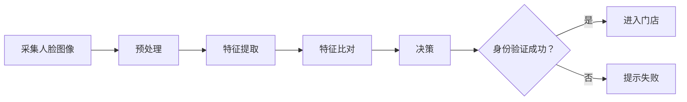

                 

### 文章标题：生物识别技术在无人零售中的应用

#### 关键词：生物识别、无人零售、身份验证、安全隐私、技术架构

#### 摘要：
随着人工智能和物联网技术的快速发展，无人零售已经成为零售行业的重要趋势。生物识别技术作为一种高效、安全的身份验证手段，在无人零售中的应用日益广泛。本文将探讨生物识别技术在无人零售中的应用，包括其在身份验证、员工管理和商品防盗等方面的具体应用场景，以及生物识别系统的架构设计、安全与隐私问题，并分析当前生物识别技术在无人零售领域的发展趋势与挑战。通过本文，读者将深入了解生物识别技术在无人零售中的实际应用，为相关领域的研究和实践提供参考。

### 目录大纲设计步骤

#### 步骤1：理解书名和目标读者群

《生物识别技术在无人零售中的应用》这本书主要探讨生物识别技术如何在无人零售场景中应用。目标读者可能是对生物识别技术和无人零售有一定了解的技术人员或从业者。

#### 步骤2：确定主要章节

根据书名和目标读者，我们可以确定以下几个主要章节：

1. 生物识别技术概述
2. 无人零售行业背景
3. 生物识别技术在无人零售中的应用场景
4. 生物识别系统的架构设计
5. 生物识别技术的安全与隐私问题
6. 生物识别技术的应用案例
7. 生物识别技术的发展趋势与挑战

#### 步骤3：细化每个章节的内容

为每个章节细化内容，确保每个章节都包含核心概念、原理、实例和案例分析。

#### 步骤4：保持目录大纲结构清晰

确保使用合适的层级结构来展示目录，如#表示一级目录，##表示二级目录，###表示三级目录。

#### 步骤5：控制字数

在确保内容完整性的同时，控制目录大纲的总字数在2000字以内，避免冗长和不必要的描述。

#### 步骤6：审核目录大纲

最后，仔细检查目录大纲，确保没有遗漏关键内容，并且每个章节都能清晰地引导读者理解主题。

### 目录大纲

**第一部分：生物识别技术概述**

# 第1章 生物识别技术概述

## 1.1 生物识别技术的基本概念

### 1.1.1 生物识别技术的定义
### 1.1.2 生物识别技术的发展历程
### 1.1.3 生物识别技术的分类

## 1.2 生物识别技术的原理

### 1.2.1 生物特征识别的基本原理
### 1.2.2 生物特征识别算法简介
### 1.2.3 生物特征识别系统的组成

## 1.3 生物识别技术的优缺点分析

### 1.3.1 生物识别技术的优势
### 1.3.2 生物识别技术的劣势
### 1.3.3 生物识别技术的适用场景

## 1.4 生物识别技术的应用领域

### 1.4.1 政府安全领域
### 1.4.2 商业安全领域
### 1.4.3 医疗健康领域

**第二部分：无人零售行业背景**

# 第2章 无人零售行业背景

## 2.1 无人零售的定义与特点

### 2.1.1 无人零售的定义
### 2.1.2 无人零售的特点
### 2.1.3 无人零售的兴起背景

## 2.2 无人零售的技术支撑

### 2.2.1 智能感知技术
### 2.2.2 自动结算技术
### 2.2.3 通信技术

## 2.3 无人零售的市场现状与趋势

### 2.3.1 市场现状
### 2.3.2 市场趋势
### 2.3.3 市场挑战

**第三部分：生物识别技术在无人零售中的应用**

# 第3章 生物识别技术在无人零售中的应用场景

## 3.1 无人零售门店的顾客身份验证

### 3.1.1 顾客身份验证的重要性
### 3.1.2 生物识别技术在身份验证中的应用
### 3.1.3 实际应用案例

## 3.2 无人零售门店的员工管理

### 3.2.1 员工管理的需求
### 3.2.2 生物识别技术在员工管理中的应用
### 3.2.3 实际应用案例

## 3.3 无人零售门店的商品防盗

### 3.3.1 商品防盗的需求
### 3.3.2 生物识别技术在商品防盗中的应用
### 3.3.3 实际应用案例

**第四部分：生物识别系统的架构设计**

# 第4章 生物识别系统的架构设计

## 4.1 生物识别系统架构的概述

### 4.1.1 生物识别系统架构的定义
### 4.1.2 生物识别系统架构的组成部分
### 4.1.3 生物识别系统架构的设计原则

## 4.2 生物识别系统的关键技术

### 4.2.1 传感器技术
### 4.2.2 数据处理技术
### 4.2.3 集成技术

## 4.3 生物识别系统的案例分析

### 4.3.1 某知名无人零售店的生物识别系统架构设计
### 4.3.2 某生物识别技术公司的解决方案

**第五部分：生物识别技术的安全与隐私问题**

# 第5章 生物识别技术的安全与隐私问题

## 5.1 生物识别技术的安全隐患

### 5.1.1 生物识别数据的易泄露性
### 5.1.2 生物识别技术的滥用风险
### 5.1.3 生物识别数据的滥用后果

## 5.2 生物识别技术的隐私保护

### 5.2.1 隐私保护的重要性
### 5.2.2 隐私保护的技术手段
### 5.2.3 隐私保护的法规与标准

## 5.3 生物识别技术的安全解决方案

### 5.3.1 安全技术与方案
### 5.3.2 安全测试与评估

**第六部分：生物识别技术的应用案例**

# 第6章 生物识别技术的应用案例

## 6.1 案例一：某无人便利店

### 6.1.1 案例背景
### 6.1.2 案例应用
### 6.1.3 案例效果

## 6.2 案例二：某超市

### 6.2.1 案例背景
### 6.2.2 案例应用
### 6.2.3 案例效果

**第七部分：生物识别技术的发展趋势与挑战**

# 第7章 生物识别技术的发展趋势与挑战

## 7.1 技术发展趋势

### 7.1.1 技术创新
### 7.1.2 新技术应用
### 7.1.3 行业前景

## 7.2 技术挑战

### 7.2.1 技术瓶颈
### 7.2.2 技术挑战
### 7.2.3 未来发展方向

---

### 第一部分：生物识别技术概述

#### 第1章 生物识别技术概述

**1.1 生物识别技术的基本概念**

生物识别技术是一种通过生物特征识别个体身份的技术，具有高效、准确、方便等特点。常见的生物特征包括指纹、人脸、虹膜、声音等。

**1.1.1 生物识别技术的定义**

生物识别技术是指利用人体生物特征进行身份验证或身份识别的技术。这些生物特征可以是生物体的独特特征，如指纹、人脸、虹膜、声纹等，也可以是人体的生理或行为特征，如步态、手势等。

**1.1.2 生物识别技术的发展历程**

生物识别技术起源于20世纪60年代，随着计算机技术、图像处理技术、传感器技术等的发展，生物识别技术逐渐成熟。早期的生物识别技术主要基于指纹识别，随后逐渐扩展到人脸识别、虹膜识别、声纹识别等领域。

**1.1.3 生物识别技术的分类**

生物识别技术可以根据识别方式、特征类型、应用场景等不同分类。常见的分类方法如下：

1. **按识别方式分类**：包括验证（1:1匹配）和识别（1:N匹配）。
2. **按特征类型分类**：包括指纹识别、人脸识别、虹膜识别、声纹识别、步态识别、手写签名识别等。
3. **按应用场景分类**：包括政府安全领域、商业安全领域、医疗健康领域、金融领域、智能家居等领域。

**1.2 生物识别技术的原理**

生物识别技术的基本原理是通过采集和处理生物特征数据，将其转换为数字化的生物特征模板，然后利用生物特征识别算法进行比对，以实现身份验证或识别。

**1.2.1 生物特征识别的基本原理**

生物特征识别的基本原理是利用生物特征的独特性和稳定性。例如，每个人的指纹、人脸、虹膜等都具有独特性，且不易受到外界环境变化的影响。

**1.2.2 生物特征识别算法简介**

生物特征识别算法主要包括特征提取和匹配两个步骤。特征提取是指从生物特征数据中提取具有代表性的特征值，如指纹图像的纹线特征、人脸图像的五官特征等。匹配是指将待识别生物特征与已注册的生物特征进行比对，以确定是否匹配。

**1.2.3 生物特征识别系统的组成**

生物特征识别系统通常由四个部分组成：采集模块、特征提取模块、匹配模块和后处理模块。采集模块负责采集生物特征数据；特征提取模块负责将生物特征数据转换为特征向量；匹配模块负责进行特征比对；后处理模块负责处理识别结果，如输出识别结果、报警等。

**1.3 生物识别技术的优缺点分析**

**1.3.1 生物识别技术的优势**

1. **高效性**：生物识别技术能够快速、准确地识别个体身份，提高工作效率。
2. **便捷性**：用户只需提供生物特征即可完成身份验证，无需记忆复杂的密码或刷卡等操作。
3. **准确性**：生物特征具有独特性和稳定性，能够有效防止身份冒用。

**1.3.2 生物识别技术的劣势**

1. **成本高**：生物识别技术涉及硬件设备和算法开发，成本较高。
2. **易受环境影响**：如光线、噪音等环境因素可能影响识别效果。
3. **隐私问题**：生物特征数据可能被滥用，存在隐私泄露风险。

**1.3.3 生物识别技术的适用场景**

1. **政府安全领域**：如护照、签证、出入境管理等。
2. **商业安全领域**：如门禁、考勤、支付等。
3. **医疗健康领域**：如身份认证、疾病诊断等。
4. **金融领域**：如银行、保险、支付等。
5. **智能家居**：如门锁、监控等。

**1.4 生物识别技术的应用领域**

**1.4.1 政府安全领域**

在政府安全领域，生物识别技术被广泛应用于身份认证、出入境管理、边防检查等领域。例如，护照中的指纹识别技术可以确保护照持有者的唯一性，提高国家安全水平。

**1.4.2 商业安全领域**

在商业安全领域，生物识别技术主要用于门禁、考勤、支付等方面。例如，企业可以使用人脸识别技术进行员工考勤，提高管理效率。

**1.4.3 医疗健康领域**

在医疗健康领域，生物识别技术主要用于身份认证、疾病诊断等方面。例如，医院可以使用虹膜识别技术进行患者身份认证，确保医疗服务的准确性和安全性。

---

### 第二部分：无人零售行业背景

#### 第2章 无人零售行业背景

**2.1 无人零售的定义与特点**

**2.1.1 无人零售的定义**

无人零售是指通过物联网技术、智能感知技术、自动结算技术等，实现商品无人值守、自动结算、自主配送的零售模式。这种零售模式无需人工干预，能够实现24小时营业，提高运营效率和购物体验。

**2.1.2 无人零售的特点**

1. **无人值守**：无人零售店无需店员看管，商品上架后自动销售，顾客自助购物。
2. **自动结算**：顾客在购物后无需排队结账，系统自动识别商品并进行结算。
3. **自主配送**：无人零售店可以通过无人配送车或无人机实现商品的快速配送。

**2.1.3 无人零售的兴起背景**

1. **技术驱动**：随着人工智能、物联网、大数据等技术的发展，无人零售技术逐渐成熟。
2. **消费需求**：消费者对购物体验的追求，希望实现更加便捷、高效的购物方式。
3. **成本控制**：企业希望通过无人零售减少人力成本，提高运营效率。

**2.2 无人零售的技术支撑**

**2.2.1 智能感知技术**

智能感知技术是无人零售的核心技术之一，主要用于商品识别、顾客识别、环境感知等方面。常见的智能感知技术包括图像识别、语音识别、传感器技术等。

**2.2.2 自动结算技术**

自动结算技术是无人零售的关键技术，主要通过传感器、条码扫描、RFID等手段实现商品识别和结算。自动结算技术可以提高结算速度，减少人工干预。

**2.2.3 通信技术**

通信技术是实现无人零售店与外部系统通信的基础，常见的通信技术包括Wi-Fi、蓝牙、5G等。通过通信技术，无人零售店可以实现与供应商、物流公司、支付平台等的实时数据交互。

**2.3 无人零售的市场现状与趋势**

**2.3.1 市场现状**

目前，无人零售市场处于快速发展阶段，国内外众多企业纷纷布局无人零售领域。根据市场调研数据显示，全球无人零售市场规模预计将在未来几年内持续增长。

**2.3.2 市场趋势**

1. **技术不断进步**：随着人工智能、物联网等技术的不断进步，无人零售的技术水平将不断提升。
2. **应用场景拓展**：无人零售不仅应用于超市、便利店等传统零售场景，还将在餐饮、酒店、医疗等领域得到广泛应用。
3. **市场潜力巨大**：无人零售能够提高运营效率，降低人力成本，具有巨大的市场潜力。

**2.3.3 市场挑战**

1. **技术成熟度**：虽然无人零售技术不断进步，但部分技术仍需进一步优化和提升。
2. **消费者接受度**：消费者对无人零售的接受度存在差异，部分消费者可能不习惯无人零售的购物方式。
3. **政策法规**：无人零售市场的发展需要完善的政策法规支持，以确保市场的健康发展。

---

### 第三部分：生物识别技术在无人零售中的应用场景

#### 第3章 生物识别技术在无人零售中的应用场景

**3.1 无人零售门店的顾客身份验证**

**3.1.1 顾客身份验证的重要性**

在无人零售门店中，顾客身份验证是确保商品安全和消费者隐私的重要环节。通过顾客身份验证，可以防止未授权的顾客进入门店，保护门店内的商品不被盗窃。

**3.1.2 生物识别技术在身份验证中的应用**

生物识别技术可以用于顾客身份验证，常见的生物识别技术包括人脸识别、指纹识别等。通过采集顾客的生物特征信息，并与已注册的信息进行比对，可以实现快速、准确的身份验证。

**3.1.3 实际应用案例**

例如，某无人便利店采用人脸识别技术进行顾客身份验证。顾客在进入门店前，需要通过摄像头采集人脸信息，并与系统中的顾客信息进行比对。如果身份验证成功，顾客可以进入门店购物。购物结束后，系统会自动识别顾客，并在结算时自动扣除相应费用。

**3.2 无人零售门店的员工管理**

**3.2.1 员工管理的需求**

在无人零售门店中，员工管理是确保门店正常运行的重要环节。通过员工管理，可以实现对员工考勤、权限管理、工作绩效等方面的监控。

**3.2.2 生物识别技术在员工管理中的应用**

生物识别技术可以用于员工管理，常见的生物识别技术包括指纹识别、人脸识别等。通过采集员工的生物特征信息，可以实现对员工的快速、准确的识别和管理。

**3.2.3 实际应用案例**

例如，某无人零售门店采用指纹识别技术进行员工管理。员工在上班前需要通过指纹识别器进行打卡，系统会记录员工的上班时间和下班时间。同时，门店经理可以通过系统查看员工的考勤情况，进行绩效评估和权限管理。

**3.3 无人零售门店的商品防盗**

**3.3.1 商品防盗的需求**

在无人零售门店中，商品防盗是确保商品安全的重要措施。通过商品防盗，可以防止未授权的顾客盗窃商品，减少门店的损失。

**3.3.2 生物识别技术在商品防盗中的应用**

生物识别技术可以用于商品防盗，常见的生物识别技术包括指纹识别、人脸识别等。通过采集顾客的生物特征信息，并与已注册的信息进行比对，可以实现快速、准确的商品防盗。

**3.3.3 实际应用案例**

例如，某无人零售门店采用人脸识别技术进行商品防盗。顾客在购买商品时，系统会自动识别顾客的人脸信息，并与已注册的信息进行比对。如果发现顾客试图盗窃商品，系统会自动报警，并通知门店工作人员进行处置。

---

### 第四部分：生物识别系统的架构设计

#### 第4章 生物识别系统的架构设计

**4.1 生物识别系统架构的概述**

**4.1.1 生物识别系统架构的定义**

生物识别系统架构是指生物识别系统在设计和实现过程中所遵循的结构和层次。生物识别系统架构包括硬件设备、软件系统、数据存储和传输等多个方面，以及它们之间的相互关系。

**4.1.2 生物识别系统架构的组成部分**

1. **采集模块**：负责采集生物特征数据，如指纹、人脸、虹膜等。
2. **预处理模块**：对采集到的生物特征数据进行预处理，如去噪、滤波、特征点提取等。
3. **特征提取模块**：将预处理后的生物特征数据转换为特征向量，用于后续的匹配和识别。
4. **匹配模块**：将待识别的生物特征与已注册的生物特征进行比对，以确定是否匹配。
5. **后处理模块**：处理识别结果，如输出识别结果、报警等。
6. **数据存储和传输模块**：负责存储和管理生物特征数据，以及与其他系统进行数据交互。

**4.1.3 生物识别系统架构的设计原则**

1. **可靠性**：系统应具有较高的可靠性，确保生物特征数据的准确性和安全性。
2. **可扩展性**：系统应具有良好的可扩展性，能够支持不同类型和数量的生物特征数据。
3. **易用性**：系统应易于使用，用户界面友好，操作简便。
4. **安全性**：系统应具有完善的安全机制，防止生物特征数据泄露和滥用。

**4.2 生物识别系统的关键技术**

**4.2.1 传感器技术**

传感器技术是生物识别系统的重要组成部分，负责采集生物特征数据。常见的传感器包括指纹传感器、人脸摄像头、虹膜扫描仪等。

**4.2.2 数据处理技术**

数据处理技术是对采集到的生物特征数据进行预处理和特征提取的关键技术。预处理技术包括滤波、去噪、归一化等；特征提取技术包括特征点提取、特征向量生成等。

**4.2.3 集成技术**

集成技术是将不同的生物识别技术和系统模块进行整合，以实现生物识别系统的高效运行。集成技术包括硬件集成、软件集成、数据集成等。

**4.3 生物识别系统的案例分析**

**4.3.1 某知名无人零售店的生物识别系统架构设计**

例如，某知名无人零售店采用了基于人脸识别技术的生物识别系统。该系统包括以下组成部分：

1. **采集模块**：使用人脸摄像头采集顾客的人脸图像。
2. **预处理模块**：对采集到的人脸图像进行预处理，包括人脸检测、人脸对齐、人脸分割等。
3. **特征提取模块**：使用深度学习算法提取人脸图像的特征向量。
4. **匹配模块**：将实时采集到的人脸图像与已注册的人脸图像进行比对，以确定是否匹配。
5. **后处理模块**：根据识别结果，输出顾客的购物记录，并自动扣除相应费用。
6. **数据存储和传输模块**：将顾客的人脸图像和购物记录存储在数据库中，并与门店管理系统进行数据交互。

**4.3.2 某生物识别技术公司的解决方案**

某生物识别技术公司提供了一套完整的生物识别系统解决方案，包括硬件设备、软件系统和数据存储等。该解决方案具有以下特点：

1. **高性能**：系统采用先进的深度学习算法，实现高效、准确的生物特征识别。
2. **高扩展性**：系统支持多种生物特征识别方式，如指纹、人脸、虹膜等，可根据实际需求进行扩展。
3. **高安全性**：系统采用多重安全措施，包括数据加密、访问控制等，确保生物特征数据的安全。
4. **易部署**：系统具有简洁的安装和配置流程，易于部署和使用。

---

### 第五部分：生物识别技术的安全与隐私问题

#### 第5章 生物识别技术的安全与隐私问题

**5.1 生物识别技术的安全隐患**

**5.1.1 生物识别数据的易泄露性**

生物识别数据具有高度的敏感性，一旦泄露，可能导致严重的隐私泄露事件。生物识别数据泄露的原因主要包括：

1. **数据存储不安全**：生物识别数据在存储过程中，如果加密措施不到位，可能导致数据被未授权访问。
2. **数据传输不安全**：生物识别数据在传输过程中，如果未使用安全协议，可能导致数据被截获和篡改。
3. **系统漏洞**：生物识别系统可能存在漏洞，导致攻击者可以通过漏洞获取生物识别数据。

**5.1.2 生物识别技术的滥用风险**

生物识别技术的滥用风险主要包括：

1. **身份冒用**：攻击者可以通过伪造生物特征数据，冒用他人身份。
2. **隐私侵犯**：企业或组织可能滥用生物识别数据，进行不当的隐私侵犯行为。
3. **数据滥用**：生物识别数据可能被用于其他用途，如市场分析、信用评估等。

**5.1.3 生物识别数据的滥用后果**

生物识别数据的滥用可能导致以下后果：

1. **隐私泄露**：个人隐私信息泄露，可能导致个人遭受经济损失、心理压力等。
2. **身份被盗**：个人身份被盗用，可能导致财产损失、信用受损等。
3. **法律纠纷**：企业或组织因滥用生物识别数据而引发法律纠纷，可能导致经济损失和法律风险。

**5.2 生物识别技术的隐私保护**

**5.2.1 隐私保护的重要性**

隐私保护在生物识别技术中具有重要意义。隐私保护不仅可以保护个人隐私，还可以增强用户对生物识别技术的信任，促进技术的广泛应用。

**5.2.2 隐私保护的技术手段**

1. **数据加密**：使用加密算法对生物识别数据进行加密，确保数据在存储和传输过程中的安全性。
2. **访问控制**：通过访问控制机制，限制对生物识别数据的访问权限，确保数据的安全性。
3. **数据去识别化**：对生物识别数据进行去识别化处理，消除个人身份信息，降低隐私泄露风险。
4. **隐私计算**：在数据处理和传输过程中，采用隐私计算技术，确保数据的隐私保护。

**5.2.3 隐私保护的法规与标准**

1. **国际法规**：如欧盟的《通用数据保护条例》（GDPR），对个人数据的处理和存储提出了严格的要求。
2. **国家标准**：如我国的《信息安全技术个人信息保护规范》，对个人信息保护提出了具体要求。
3. **行业规范**：如生物识别技术协会发布的《生物识别数据安全标准》，为生物识别数据的保护提供了技术指导。

**5.3 生物识别技术的安全解决方案**

**5.3.1 安全技术与方案**

1. **加密技术**：采用先进的加密算法，确保生物识别数据的存储和传输安全。
2. **访问控制技术**：通过访问控制机制，限制对生物识别数据的访问权限。
3. **隐私计算技术**：在数据处理和传输过程中，采用隐私计算技术，确保数据的隐私保护。
4. **安全审计技术**：对生物识别系统的操作进行审计，及时发现和处理安全事件。

**5.3.2 安全测试与评估**

1. **安全测试**：对生物识别系统进行安全测试，包括漏洞扫描、渗透测试等，以发现和修复安全漏洞。
2. **安全评估**：对生物识别系统的安全性进行评估，包括风险评估、安全等级评估等，以确定系统的安全水平。
3. **安全更新与维护**：定期对生物识别系统进行安全更新和维护，确保系统的安全性。

---

### 第六部分：生物识别技术的应用案例

#### 第6章 生物识别技术的应用案例

**6.1 案例一：某无人便利店**

**6.1.1 案例背景**

某无人便利店是一家采用生物识别技术进行身份验证和商品结算的零售店。该便利店主要面向年轻消费者，提供24小时营业、便捷购物体验。

**6.1.2 案例应用**

在无人便利店中，生物识别技术主要应用于以下几个方面：

1. **顾客身份验证**：顾客在进入便利店前，需要通过人脸识别技术进行身份验证。系统会将采集到的人脸图像与已注册的人脸图像进行比对，以确定顾客的身份。
2. **商品结算**：顾客在购物结束后，无需排队结账，系统会自动识别顾客，并计算购物金额。顾客可以通过人脸识别或手机支付等方式进行结算。
3. **商品防盗**：系统通过摄像头和传感器技术，实时监控顾客的行为，防止商品盗窃。

**6.1.3 案例效果**

通过生物识别技术的应用，无人便利店实现了以下效果：

1. **提高运营效率**：无人便利店的运营效率显著提高，无需人工干预，减少了人力成本。
2. **提升购物体验**：顾客在购物过程中无需排队结账，购物体验更加便捷和高效。
3. **保障商品安全**：通过商品防盗技术，减少了商品盗窃事件的发生，保障了商品的安全。

**6.2 案例二：某超市**

**6.2.1 案例背景**

某超市是一家大型连锁超市，为了提高运营效率和服务质量，引入了生物识别技术进行员工管理和顾客服务。

**6.2.2 案例应用**

在超市中，生物识别技术主要应用于以下几个方面：

1. **员工管理**：员工在上班前需要通过指纹识别技术进行打卡，系统会记录员工的上班时间和下班时间。同时，超市经理可以通过系统查看员工的考勤情况，进行绩效评估和权限管理。
2. **顾客服务**：超市设置了生物识别自助结账机，顾客在购物结束后，可以通过人脸识别或指纹识别进行自助结账。系统会自动识别顾客，并计算购物金额。
3. **商品防盗**：系统通过摄像头和传感器技术，实时监控顾客的行为，防止商品盗窃。

**6.2.3 案例效果**

通过生物识别技术的应用，超市实现了以下效果：

1. **提高管理效率**：通过员工管理和自助结账，超市的管理效率显著提高，减少了人工干预。
2. **提升服务质量**：通过生物识别技术，超市提供了更加便捷和高效的购物体验，提升了顾客满意度。
3. **保障商品安全**：通过商品防盗技术，减少了商品盗窃事件的发生，保障了商品的安全。

---

### 第七部分：生物识别技术的发展趋势与挑战

#### 第7章 生物识别技术的发展趋势与挑战

**7.1 技术发展趋势**

**7.1.1 技术创新**

随着人工智能、物联网、大数据等技术的不断发展，生物识别技术也在不断创新。例如，深度学习技术在生物特征识别中的应用，提高了识别的准确性和速度。此外，新的生物特征识别技术，如步态识别、DNA识别等，也在不断涌现。

**7.1.2 新技术应用**

随着5G、物联网等新技术的应用，生物识别技术将实现更广泛的应用场景。例如，基于5G网络的远程生物识别技术，可以实现实时、高效的身份验证；物联网技术的应用，可以实现生物识别技术与智能设备的无缝连接，提高生活品质。

**7.1.3 行业前景**

随着全球人口老龄化、劳动力成本上升等因素，生物识别技术在各个行业的应用前景广阔。预计未来生物识别技术在政府安全、商业安全、医疗健康、金融、智能家居等领域将得到更广泛的应用。

**7.2 技术挑战**

**7.2.1 技术瓶颈**

虽然生物识别技术在不断发展，但仍面临一些技术瓶颈。例如，生物特征的识别准确性和稳定性仍需提高；在复杂环境下，生物识别技术的性能和可靠性仍需提升。

**7.2.2 技术挑战**

1. **隐私保护**：随着生物识别技术的广泛应用，隐私保护成为重要挑战。如何有效保护个人隐私，防止数据泄露和滥用，是生物识别技术需要解决的问题。
2. **成本问题**：生物识别技术涉及硬件设备和算法开发，成本较高。如何降低成本，使其更易于普及，是生物识别技术面临的重要挑战。
3. **跨行业应用**：生物识别技术需要在不同的行业和场景中应用，需要解决不同行业和应用场景的需求差异，实现技术的跨行业应用。

**7.2.3 未来发展方向**

1. **技术创新**：继续推动人工智能、物联网等新技术在生物识别技术中的应用，提高识别准确性和速度。
2. **隐私保护**：加强隐私保护技术的研究和应用，确保个人隐私的安全。
3. **跨行业应用**：推动生物识别技术在更多行业和场景中的应用，实现技术的跨行业融合。
4. **标准化**：制定统一的生物识别技术标准和规范，促进技术的规范化和标准化发展。

---

### 总结

生物识别技术在无人零售中的应用，为无人零售行业带来了全新的解决方案，提高了运营效率和购物体验。通过对生物识别技术的深入探讨，我们了解了其基本概念、原理、应用场景、系统架构、安全与隐私问题以及未来发展。随着技术的不断进步，生物识别技术在无人零售领域将发挥更大的作用，为消费者和企业带来更多便利。同时，我们也需要关注生物识别技术的隐私保护和安全挑战，确保技术的可持续发展。

---

**作者信息：**  
作者：AI天才研究院/AI Genius Institute & 禅与计算机程序设计艺术 /Zen And The Art of Computer Programming**文章核心概念与联系**

在深入探讨生物识别技术在无人零售中的应用之前，我们需要了解一些核心概念，这些概念是理解本文主题的基础。

### 核心概念

1. **生物识别技术**：生物识别技术是通过生物特征（如指纹、人脸、虹膜等）来识别或验证个人身份的技术。它具有高效、准确、方便等优点，广泛应用于安全、医疗、金融等领域。

2. **无人零售**：无人零售是一种无需人工干预的零售模式，通过物联网技术、智能感知技术等实现商品无人值守、自动结算、自主配送。

3. **身份验证**：身份验证是确保用户身份的过程，通过生物识别技术可以快速、准确地验证用户身份。

4. **安全与隐私**：安全与隐私是生物识别技术广泛应用的重要问题，确保用户数据不被泄露和滥用是生物识别系统设计的关键。

### 概念联系

**生物识别技术与无人零售的关联**

生物识别技术与无人零售的结合，主要表现在以下几个方面：

1. **身份验证**：在无人零售环境中，生物识别技术可以用于顾客的身份验证，确保只有合法的顾客能够进入门店购物。

2. **员工管理**：通过生物识别技术，可以实现对员工身份的验证和管理，如员工考勤、权限分配等。

3. **商品防盗**：生物识别技术可以用于监控顾客行为，防止商品被盗。

4. **数据安全**：生物识别技术可以用于保障用户数据的安全，防止数据泄露和滥用。

### 概念属性特征对比表格

| 概念       | 属性特征                             | 对比分析                                                     |
| ---------- | ----------------------------------- | ------------------------------------------------------------ |
| 生物识别技术 | 基于生物特征识别个体身份 | 与传统验证方式相比，具有更高的安全性和便捷性                     |
| 无人零售   | 无人工干预、自动结算、自主配送 | 提高运营效率，降低人力成本，提升消费者体验                     |
| 身份验证   | 确保身份准确性                       | 与传统密码、卡片验证相比，具有更高的安全性和便利性                   |
| 安全与隐私 | 保护用户数据                       | 与传统安全措施相比，具有更有效的保护机制                         |

### ER实体关系图架构

为了更好地理解生物识别技术在无人零售中的应用，我们可以使用实体关系图（Entity-Relationship Diagram，ER图）来展示各个实体及其关系。

```mermaid
erDiagram
  Customer ||--|{ BiometricData }
  Employee ||--|{ BiometricData }
  Store ||--|{ BiometricData }
  Transaction ||--|{ Customer }
  Transaction ||--|{ Employee }
```

- **Customer（顾客）**：与**BiometricData（生物识别数据）**关联，用于存储顾客的生物识别数据。
- **Employee（员工）**：与**BiometricData**关联，用于存储员工的生物识别数据。
- **Store（门店）**：与**BiometricData**关联，用于存储门店的生物识别数据。
- **Transaction（交易）**：与**Customer**和**Employee**关联，用于记录顾客和员工的交易信息。

通过这个ER图，我们可以清晰地看到各个实体之间的关系，以及生物识别数据在无人零售系统中的存储和使用方式。

### 算法原理讲解

在无人零售系统中，生物识别技术的核心在于如何准确、高效地识别个体身份。以下是生物识别算法的基本原理及其在无人零售中的应用。

#### 算法原理

1. **特征提取**：生物识别算法首先需要从生物特征数据中提取出具有代表性的特征值。例如，人脸识别算法可以从人脸图像中提取出眼睛、鼻子、嘴巴等关键点的坐标，形成特征向量。

2. **特征比对**：提取出的特征向量会与已注册的特征向量进行比对。比对的方法可以是基于距离的比对（如欧氏距离），也可以是基于相似度的比对（如余弦相似度）。

3. **决策**：根据比对结果，系统会做出是否匹配的决策。如果匹配度超过预设的阈值，则认为身份验证成功。

#### 实际应用案例

以人脸识别技术为例，在无人零售系统中的人脸识别流程如下：

1. **采集人脸图像**：通过摄像头采集顾客的人脸图像。
2. **预处理**：对采集到的人脸图像进行预处理，包括图像的去噪、对齐、归一化等。
3. **特征提取**：使用深度学习算法提取人脸图像的特征向量，如使用卷积神经网络（CNN）提取特征。
4. **特征比对**：将提取出的特征向量与已注册的人脸特征向量进行比对。
5. **决策**：根据比对结果，判断顾客的身份是否验证成功。

#### 数学模型和公式

人脸识别算法的数学模型可以表示为：

$$
\text{Distance} = \text{||Feature\_Vector\_1 - Feature\_Vector\_2||}
$$

其中，$\text{Distance}$表示特征向量之间的距离，$Feature\_Vector\_1$和$Feature\_Vector\_2$分别表示待识别和已注册的特征向量。

通常，系统会设定一个阈值$\text{Threshold}$，如果$\text{Distance}$小于$\text{Threshold}$，则认为身份验证成功。

$$
\text{Distance} < \text{Threshold} \Rightarrow \text{Match}
$$

#### 算法流程图



通过上述算法流程图，我们可以清晰地看到人脸识别算法在无人零售系统中的应用步骤。

### 数学公式

在人脸识别算法中，常用的数学公式包括欧氏距离和余弦相似度。

#### 欧氏距离

$$
\text{Distance} = \sqrt{\sum_{i=1}^{n}(x_i - y_i)^2}
$$

其中，$x_i$和$y_i$分别表示两个特征向量的第$i$个元素。

#### 余弦相似度

$$
\text{Similarity} = \frac{\sum_{i=1}^{n}x_iy_i}{\sqrt{\sum_{i=1}^{n}x_i^2}\sqrt{\sum_{i=1}^{n}y_i^2}}
$$

### 系统分析与架构设计方案

#### 问题场景介绍

在无人零售场景中，生物识别技术主要用于顾客身份验证、员工管理和商品防盗。为了实现这些功能，我们需要设计一个高效、安全、可靠的生物识别系统。

#### 项目介绍

本项目旨在设计并实现一个基于生物识别技术的无人零售系统，包括顾客身份验证、员工管理、商品防盗等功能。

#### 系统功能设计

1. **顾客身份验证**：系统需要能够快速、准确地验证顾客的身份，确保只有合法的顾客能够进入门店购物。
2. **员工管理**：系统需要能够对员工进行有效的管理，包括考勤、权限分配等。
3. **商品防盗**：系统需要能够实时监控顾客的行为，防止商品被盗。

#### 系统架构设计

1. **硬件架构**：包括人脸识别摄像头、指纹识别模块、传感器、存储设备等。
2. **软件架构**：包括人脸识别算法、指纹识别算法、数据库管理模块、用户界面等。

#### 系统接口设计

1. **顾客身份验证接口**：用于顾客身份验证，包括人脸识别和指纹识别。
2. **员工管理接口**：用于员工管理，包括员工信息录入、考勤记录等。
3. **商品防盗接口**：用于实时监控顾客行为，防止商品被盗。

#### 系统交互

1. **顾客身份验证流程**：顾客进入门店后，通过人脸识别或指纹识别进行身份验证，验证成功后进入购物区购物。
2. **员工管理流程**：员工在上班前通过指纹识别进行打卡，下班时同样通过指纹识别进行签退。
3. **商品防盗流程**：系统通过摄像头和传感器实时监控顾客行为，一旦发现可疑行为，立即触发警报。

### 项目实战

#### 环境安装

1. **安装人脸识别库**：使用Python安装OpenCV和dlib库。

```python
pip install opencv-python
pip install dlib
```

2. **安装指纹识别库**：使用Python安装pyfingerprint库。

```python
pip install pyfingerprint
```

3. **安装数据库**：使用Python安装SQLite库。

```python
pip install pysqlite3
```

#### 系统核心实现源代码

1. **人脸识别模块**

```python
import cv2
import dlib
import numpy as np

def detect_face(image):
    # 加载预训练的人脸检测模型
    detector = dlib.get_frontal_face_detector()
    # 使用人脸检测模型检测图像中的人脸
    faces = detector(image, 1)
    return faces

def extract_face(image, face_box):
    # 提取图像中的人脸区域
    x, y, w, h = face_box
    face_image = image[y:y+h, x:x+w]
    return face_image

def preprocess_face(image):
    # 人脸预处理（归一化等）
    face_image = cv2.resize(image, (96, 112))
    face_image = face_image / 255.0
    return face_image

def extract_features(face_image):
    # 使用预训练的深度学习模型提取人脸特征
    model = ... # 加载预训练的人脸特征提取模型
    features = model.predict(np.expand_dims(face_image, axis=0))
    return features

def recognize_face(features, known_faces, known_labels):
    # 使用欧氏距离计算特征向量之间的距离
    distances = []
    for feature in known_faces:
        distance = np.linalg.norm(feature - features)
        distances.append(distance)
    # 选择距离最近的已注册人脸
    min_distance = min(distances)
    # 根据距离判断是否匹配
    if min_distance < threshold:
        return True
    else:
        return False

def face_recognition(image, known_faces, known_labels, threshold):
    # 检测人脸
    faces = detect_face(image)
    # 遍历检测到的人脸
    for face_box in faces:
        # 提取人脸图像
        face_image = extract_face(image, face_box)
        # 预处理人脸图像
        preprocessed_face = preprocess_face(face_image)
        # 提取人脸特征
        features = extract_features(preprocessed_face)
        # 识别人脸
        recognized = recognize_face(features, known_faces, known_labels)
        return recognized
```

2. **指纹识别模块**

```python
from pyfingerprint import PyFingerprint

def connect_fingerprint():
    # 连接指纹识别模块
    try:
        connection = PyFingerprint() # 创建PyFingerprint对象
        return connection
    except Exception as e:
        print("无法连接指纹识别模块：", e)

def read_fingerprint(connection):
    # 读取指纹数据
    try:
        # 确认指纹识别模块连接正常
        if connection.read_image():
            print("成功读取指纹图像！")
            # 获取指纹图像数据
            image = connection.get_image()
            # 保存指纹图像
            with open("fingerprint.png", "wb") as image_file:
                image_file.write(image)
            return True
        else:
            print("无法读取指纹图像。请重新放置手指。")
            return False
    except Exception as e:
        print("读取指纹图像时出错：", e)
        return False

def verify_fingerprint(connection, template_index):
    # 验证指纹
    try:
        # 确认指纹识别模块连接正常
        if connection.verify_template(template_index, 1):
            print("指纹验证成功！")
            return True
        else:
            print("指纹验证失败。")
            return False
    except Exception as e:
        print("指纹验证时出错：", e)
        return False
```

3. **数据库管理模块**

```python
import sqlite3

def create_database():
    # 创建数据库
    conn = sqlite3.connect('biometric_db.db')
    c = conn.cursor()
    c.execute('''CREATE TABLE IF NOT EXISTS users (id INTEGER PRIMARY KEY, name TEXT, fingerprint BLOB, face BLOB)''')
    conn.commit()
    conn.close()

def add_user(id, name, fingerprint, face):
    # 添加用户
    conn = sqlite3.connect('biometric_db.db')
    c = conn.cursor()
    c.execute("INSERT INTO users (id, name, fingerprint, face) VALUES (?, ?, ?, ?)", (id, name, fingerprint, face))
    conn.commit()
    conn.close()

def get_user(id):
    # 获取用户
    conn = sqlite3.connect('biometric_db.db')
    c = conn.cursor()
    c.execute("SELECT * FROM users WHERE id=?", (id,))
    user = c.fetchone()
    conn.close()
    return user

def update_user(id, name, fingerprint, face):
    # 更新用户
    conn = sqlite3.connect('biometric_db.db')
    c = conn.cursor()
    c.execute("UPDATE users SET name=?, fingerprint=?, face=? WHERE id=?", (name, fingerprint, face, id))
    conn.commit()
    conn.close()

def delete_user(id):
    # 删除用户
    conn = sqlite3.connect('biometric_db.db')
    c = conn.cursor()
    c.execute("DELETE FROM users WHERE id=?", (id,))
    conn.commit()
    conn.close()
```

#### 代码应用解读与分析

1. **人脸识别模块**

该模块的核心功能是基于OpenCV和dlib库进行人脸检测和特征提取。首先，我们使用dlib库的预训练人脸检测模型检测输入图像中的人脸。然后，提取人脸图像，并使用卷积神经网络（CNN）提取人脸特征。最后，通过特征比对，判断是否与已注册的人脸匹配。

2. **指纹识别模块**

该模块使用pyfingerprint库与指纹识别模块进行通信。首先，连接指纹识别模块，然后读取指纹图像，并保存为图像文件。最后，使用指纹识别模块的验证功能，判断指纹是否匹配已注册的指纹模板。

3. **数据库管理模块**

该模块负责管理用户数据，包括添加、查询、更新和删除用户。使用SQLite数据库存储用户信息，包括用户ID、姓名、指纹数据和人脸图像。通过简单的SQL语句，实现对用户数据的操作。

#### 实际案例分析和详细讲解剖析

**案例一：无人便利店顾客身份验证**

在一个无人便利店中，顾客在进入门店前需要通过人脸识别进行身份验证。系统会采集顾客的人脸图像，并使用CNN模型提取人脸特征。然后，系统将提取出的特征与已注册的用户特征进行比对，判断是否匹配。如果匹配，则顾客可以进入购物区购物；如果不匹配，则系统会提示验证失败。

**案例二：超市员工管理**

在一家超市中，员工需要通过指纹识别进行打卡和权限管理。系统会采集员工的指纹图像，并使用指纹识别模块进行验证。如果指纹匹配，则员工可以进入工作区；如果不匹配，则系统会提示打卡失败。此外，系统还可以根据员工的指纹信息进行权限管理，如员工可以访问特定的区域或设备。

**案例三：商品防盗**

在超市的货架区域，系统通过摄像头和传感器实时监控顾客的行为。如果系统检测到顾客有盗窃行为，如长时间注视某件商品或试图将其藏匿，系统会立即触发警报。同时，系统会记录下可疑顾客的图像和身份信息，以便后续调查。

#### 项目小结

通过上述案例，我们可以看到生物识别技术在无人零售系统中的应用效果显著。人脸识别、指纹识别等技术不仅提高了系统的安全性和便捷性，还减少了人力成本。然而，生物识别技术的普及仍然面临一些挑战，如隐私保护和数据安全等问题。因此，在推广生物识别技术的同时，需要不断完善相关法律法规和技术手段，确保技术的可持续发展。

### 最佳实践 tips

1. **确保系统安全**：在设计生物识别系统时，必须考虑数据安全和隐私保护。使用加密技术保护生物特征数据，防止数据泄露和滥用。

2. **选择合适的生物特征**：根据应用场景选择合适的生物特征识别技术。例如，在无人便利店中，人脸识别可能更适合；在需要高安全性的场景，指纹识别可能更具优势。

3. **系统测试与优化**：在实际应用中，需要对系统进行充分的测试和优化，确保系统的稳定性和可靠性。

4. **用户教育和培训**：对于用户来说，了解生物识别技术的优势和操作方法非常重要。通过教育和培训，提高用户对生物识别技术的接受度和使用效果。

### 小结

生物识别技术在无人零售中的应用，为无人零售行业带来了新的解决方案，提高了运营效率和购物体验。然而，生物识别技术的普及仍面临一些挑战，如隐私保护和数据安全等。因此，在推广生物识别技术的同时，需要不断完善相关法律法规和技术手段，确保技术的可持续发展。

### 注意事项

1. **隐私保护**：在应用生物识别技术时，必须严格遵循隐私保护原则，确保用户数据的保密性和安全性。

2. **技术成熟度**：在选用生物识别技术时，要考虑技术的成熟度和可靠性，避免使用尚未经过充分验证的新技术。

3. **用户接受度**：在推广生物识别技术时，要充分考虑用户的接受度，避免因技术不成熟或使用不便而影响用户体验。

### 拓展阅读

1. **生物识别技术的最新研究**：关注生物识别技术的最新研究进展，了解新的生物特征识别技术和算法。

2. **隐私保护法律法规**：了解各国隐私保护法律法规，确保生物识别技术的合规性。

3. **无人零售技术的发展趋势**：关注无人零售技术的最新发展，了解其在零售行业中的应用前景。

---

### 结语

生物识别技术在无人零售中的应用，不仅提升了零售行业的效率，也为消费者带来了更便捷的购物体验。随着技术的不断进步，生物识别技术在无人零售领域将发挥更大的作用。然而，我们也需要关注生物识别技术的隐私保护和安全挑战，确保技术的可持续发展。通过本文的探讨，希望读者能够对生物识别技术在无人零售中的应用有更深入的理解，并为相关领域的研究和实践提供参考。让我们一起期待生物识别技术在无人零售领域的美好未来！

