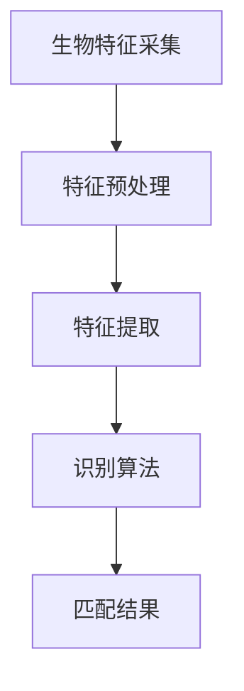
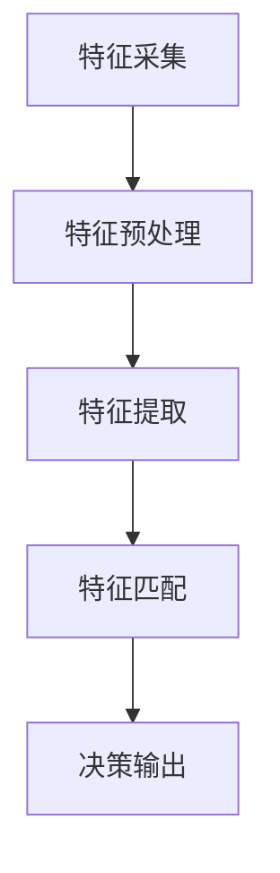
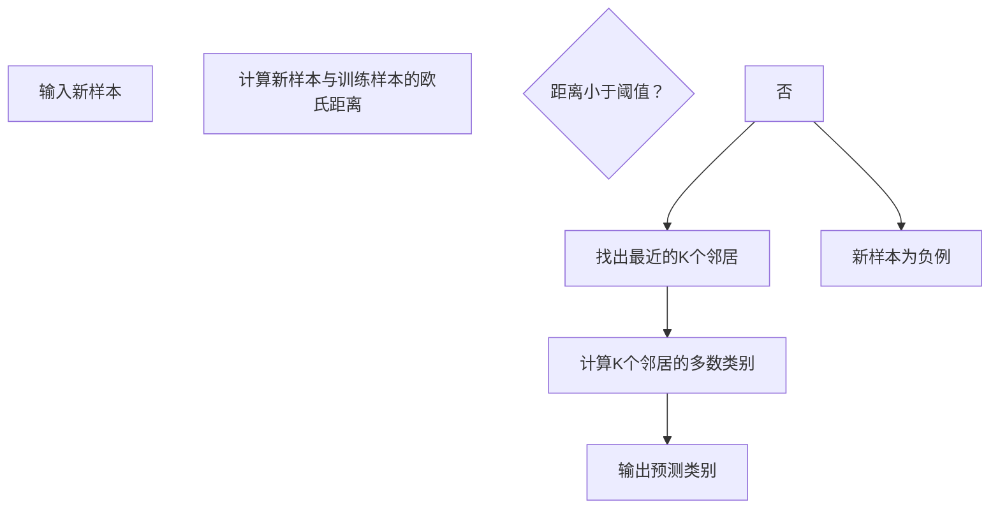
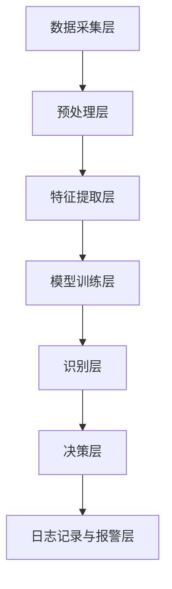
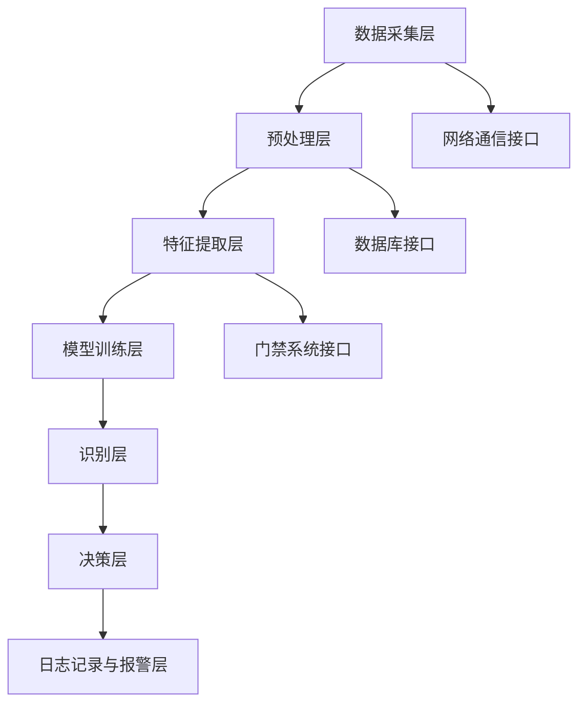
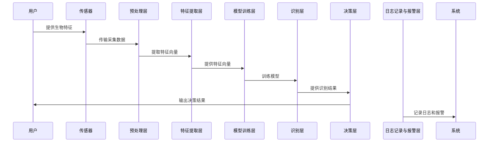

                 


# 生物识别技术在身份验证中的应用趋势

> 关键词：生物识别、身份验证、技术应用、趋势分析

> 摘要：随着科技的不断进步，生物识别技术在身份验证领域的应用日益广泛。本文将从背景介绍、核心技术原理、算法原理讲解、数学模型和公式、系统分析与架构设计方案、项目实战、最佳实践 tips等方面，深入探讨生物识别技术在身份验证中的应用趋势。

## 目录大纲设计思路

### 1. 设计目标

设计《生物识别技术在身份验证中的应用趋势》这本书的目录大纲，目标是：

- **简洁性**：确保目录内容简洁明了，没有多余废话。
- **结构清晰**：使用标准的markdown格式，遵循1级、2级和3级目录的层级结构。
- **内容完整性**：覆盖核心章节内容，包括背景介绍、核心概念与联系、算法原理讲解、数学模型和公式、系统分析与架构设计方案、项目实战、最佳实践 tips等内容。
- **字数限制**：确保整个目录大纲的总字数在2000字以内。

### 2. 目录结构设计

根据书籍的内容需求，目录结构可以分为以下几个部分：

- **第一部分**：背景介绍
  - **第1章**：生物识别技术概述
    - 1.1 问题背景与概念介绍
    - 1.2 生物识别技术发展历程
    - 1.3 生物识别技术分类与特点

- **第二部分**：核心概念与联系
  - **第2章**：生物识别核心技术原理
    - 2.1 传感器与采集技术
    - 2.2 特征提取与识别算法
    - 2.3 数据预处理与模型训练

- **第三部分**：算法原理讲解
  - **第3章**：生物识别算法原理分析
    - 3.1 识别算法的基本流程
    - 3.2 算法性能评估与优化
    - 3.3 常见算法的mermaid流程图展示

- **第四部分**：数学模型和公式
  - **第4章**：生物识别数学模型讲解
    - 4.1 数学模型的基本概念
    - 4.2 数学公式与推导
    - 4.3 举例说明与应用

- **第五部分**：系统分析与架构设计方案
  - **第5章**：生物识别系统架构设计
    - 5.1 系统场景介绍
    - 5.2 系统功能设计与领域模型
    - 5.3 系统架构设计与接口设计

- **第六部分**：项目实战
  - **第6章**：生物识别项目实战
    - 6.1 环境安装与配置
    - 6.2 系统核心实现与代码解读
    - 6.3 项目分析与实践
    - 6.4 项目小结与反思

- **第七部分**：最佳实践 tips
  - **第7章**：生物识别最佳实践与注意事项
    - 7.1 实践经验分享
    - 7.2 小结与拓展阅读

### 3. 目录大纲内容概述

**第1章：生物识别技术概述**
- 介绍生物识别技术的基本概念、发展历程、分类与特点，为后续章节奠定基础。

**第2章：生物识别核心技术原理**
- 详细讲解传感器与采集技术、特征提取与识别算法、数据预处理与模型训练等核心技术，提供理论支撑。

**第3章：生物识别算法原理分析**
- 分析生物识别算法的基本流程、性能评估与优化方法，使用mermaid流程图展示算法结构。

**第4章：生物识别数学模型讲解**
- 讲解生物识别数学模型的基本概念、公式推导，并通过举例说明其实际应用。

**第5章：生物识别系统架构设计**
- 介绍生物识别系统的场景、功能设计、架构设计、接口设计等，为实际应用提供指导。

**第6章：生物识别项目实战**
- 通过一个实际项目，介绍环境安装、系统核心实现、项目分析与实践，巩固理论知识。

**第7章：生物识别最佳实践与注意事项**
- 分享生物识别的最佳实践经验，总结注意事项，为读者提供进一步学习的指南。

### 4. 字数控制

通过以上设计，确保整个目录大纲的总字数控制在2000字以内，同时保持内容的完整性、逻辑性和实用性。

----------------------------------------------------------------

## 第1章 生物识别技术概述

### 1.1 问题背景与概念介绍

生物识别技术，作为一种识别个人身份的技术，其核心是通过分析人体生物特征来识别个人身份。这些生物特征包括指纹、面部识别、虹膜识别、声纹识别、掌纹识别等。在现代社会，随着信息技术的快速发展，身份验证的重要性日益凸显。传统的身份验证方式，如密码、证件等，存在着易被破解、易丢失等缺点，而生物识别技术以其独特性、不可复制性和非接触性等特点，成为了一种更安全、更便捷的身份验证方式。

生物识别技术在身份验证中的应用，主要体现在以下几个方面：

1. **安全控制**：生物识别技术可以有效防止非法入侵，保障信息安全。
2. **便捷性**：用户无需记忆复杂的密码，只需通过自身的生物特征即可完成验证，提高了用户体验。
3. **实时性**：生物识别技术可以实时检测并验证身份，减少了等待时间，提高了工作效率。

### 1.2 生物识别技术发展历程

生物识别技术的研究始于20世纪60年代，当时主要以指纹识别为主。随着计算机技术的不断发展，生物识别技术也逐渐成熟。以下是生物识别技术的主要发展历程：

1. **1960年代**：指纹识别技术开始应用于刑事侦查领域。
2. **1970年代**：面部识别技术开始研究，但受限于计算能力和图像处理技术，未能广泛应用。
3. **1980年代**：虹膜识别技术首次提出，但由于成本较高，未能大规模推广。
4. **1990年代**：随着计算机技术和图像处理技术的进步，生物识别技术开始应用于金融、安防等领域。
5. **2000年代**：生物识别技术逐渐普及，指纹识别、面部识别、虹膜识别等技术在智能手机、门禁系统等领域得到广泛应用。
6. **2010年代至今**：随着人工智能技术的快速发展，生物识别技术更加智能化，如深度学习技术在人脸识别中的应用，使识别精度和速度大大提高。

### 1.3 生物识别技术分类与特点

生物识别技术主要分为以下几类：

1. **指纹识别**：通过分析指纹纹路，实现身份验证。指纹识别具有识别精度高、成本低、易于操作等特点，是目前应用最广泛的生物识别技术之一。
2. **面部识别**：通过分析面部特征，实现身份验证。面部识别具有实时性强、非接触性、识别速度快的优点，但在光线变化、面部遮挡等情况下识别效果可能受到影响。
3. **虹膜识别**：通过分析虹膜纹理，实现身份验证。虹膜识别具有识别精度高、不易被伪造等优点，但在采集时需要特殊的设备，成本较高。
4. **声纹识别**：通过分析声纹特征，实现身份验证。声纹识别具有独特性、非接触性等优点，但在噪音环境下识别效果可能受到影响。
5. **掌纹识别**：通过分析掌纹纹理，实现身份验证。掌纹识别具有操作简单、成本低等优点，但在湿度较高的情况下识别效果可能受到影响。

### 1.4 生物识别技术的优缺点对比

以下是几种常见生物识别技术的优缺点对比：

| 技术类型 | 优点 | 缺点 |
| :--- | :--- | :--- |
| 指纹识别 | 识别精度高、成本低、易于操作 | 容易受到指纹破损、污染等因素影响 |
| 面部识别 | 实时性强、非接触性、识别速度快 | 在光线变化、面部遮挡等情况下识别效果可能受到影响 |
| 虹膜识别 | 识别精度高、不易被伪造 | 成本较高、需要特殊设备 |
| 声纹识别 | 独特性、非接触性 | 在噪音环境下识别效果可能受到影响 |
| 掌纹识别 | 操作简单、成本低 | 在湿度较高的情况下识别效果可能受到影响 |

通过以上分析，我们可以看到，生物识别技术在身份验证中具有巨大的应用价值。随着技术的不断进步，生物识别技术将在更多领域得到应用，为社会带来更多便利和安全保障。

----------------------------------------------------------------

## 第2章 生物识别核心技术原理

### 2.1 传感器与采集技术

生物识别技术的核心在于对生物特征的采集和识别，而这一过程依赖于高性能的传感器和先进的采集技术。传感器的作用是捕捉和记录生物特征信息，采集技术则确保这些信息能够被准确、高效地传输和处理。

#### 传感器的基本原理

传感器的工作原理基于不同的生物特征特性。例如：

- **指纹传感器**：利用电容、光学或声波等原理，捕捉指纹的细节特征。
- **面部识别传感器**：通过红外或可见光技术，捕捉面部特征点，包括眼睛、鼻子、嘴巴等。
- **虹膜识别传感器**：利用光谱分析技术，捕捉虹膜的纹理特征。
- **声纹识别传感器**：通过麦克风捕捉声音信号，分析声波频率、音调等特征。

#### 生物特征信号的采集方法

不同的生物特征需要不同的采集方法：

- **指纹采集**：通过触摸式和非触摸式两种方式。触摸式传感器利用光或电容原理，将指纹纹理转换为电信号；非触摸式传感器通过空气电离技术，在不接触手指的情况下捕捉指纹。
- **面部采集**：使用摄像头或红外传感器，捕捉面部图像。通常需要在光线较暗的环境下进行，以获得更清晰的图像。
- **虹膜采集**：使用高分辨率摄像头，捕捉眼睛的图像。采集时要求被采集者注视摄像头，以确保图像清晰。
- **声纹采集**：使用麦克风捕捉声音，通过音频处理技术提取声纹特征。

#### 采集技术的优缺点分析

不同的采集技术有其优势和局限性：

- **指纹采集**：优点是精度高、成本低、操作简单，缺点是易受指纹破损、污染等因素影响。
- **面部采集**：优点是实时性强、非接触性、识别速度快，缺点是在光线变化、面部遮挡等情况下识别效果可能受到影响。
- **虹膜采集**：优点是识别精度高、不易被伪造，缺点是成本较高、需要特殊设备。
- **声纹采集**：优点是独特性、非接触性，缺点是在噪音环境下识别效果可能受到影响。

### 2.2 特征提取与识别算法

采集到的生物特征信号需要进行处理，提取出具有代表性的特征向量，然后通过识别算法进行身份验证。特征提取和识别算法是生物识别技术的核心。

#### 特征提取原理

特征提取是将原始的生物特征信号转换为可用于识别的特征向量。常见的特征提取方法包括：

- **统计特征提取**：如主成分分析（PCA）、线性判别分析（LDA）等，通过降维和特征选择，提取最能区分不同个体的特征。
- **结构特征提取**：如局部二值模式（LBP）、Gabor滤波器等，通过分析生物特征的局部结构，提取具有区分性的特征。
- **深度学习特征提取**：如卷积神经网络（CNN）、循环神经网络（RNN）等，通过大量的数据训练，自动学习特征表示。

#### 识别算法原理

识别算法是通过对提取到的特征向量进行匹配，判断是否为同一身份。常见的识别算法包括：

- **基于模板匹配的算法**：如最近邻分类器（KNN）、基于模板匹配的指纹识别算法等，通过计算特征向量与模板的相似度进行识别。
- **基于贝叶斯理论的算法**：如贝叶斯分类器，通过计算特征向量属于不同类别的概率，进行分类决策。
- **基于神经网络的算法**：如多层感知器（MLP）、卷积神经网络（CNN）等，通过多层非线性变换，自动提取特征并进行分类。

### 2.3 数据预处理与模型训练

在进行特征提取和识别之前，采集到的生物特征数据通常需要进行预处理，以提高识别的准确性和效率。预处理方法包括：

- **滤波**：去除噪声，如高斯滤波、中值滤波等。
- **归一化**：调整数据范围，如将数据缩放到[0, 1]或[-1, 1]。
- **特征缩放**：调整特征向量的尺度，如使用最小二乘法进行缩放。

模型训练是识别算法的核心，通过大量已知样本，训练出能够准确识别生物特征的模型。常见的训练方法包括：

- **监督学习**：通过已知样本，训练出分类器或回归模型。
- **无监督学习**：通过未标记的样本，自动发现特征或聚类。
- **半监督学习**：结合已知样本和未标记样本，提高模型的泛化能力。

通过以上分析，我们可以看到，生物识别技术的核心原理包括传感器与采集技术、特征提取与识别算法、数据预处理与模型训练等。这些技术共同作用，使得生物识别技术能够高效、准确地实现身份验证。

### 表格：生物识别技术核心概念属性特征对比

| 特征类型 | 传感器类型 | 采集方法 | 特征提取方法 | 识别算法 | 优缺点 |
| :--- | :--- | :--- | :--- | :--- | :--- |
| 指纹识别 | 电容传感器/光学传感器 | 触摸式/非触摸式 | 主成分分析（PCA）/局部二值模式（LBP） | 最近邻分类器（KNN）/支持向量机（SVM） | 精度高、成本低、操作简单，但易受指纹破损、污染等因素影响 |
| 面部识别 | 摄像头/红外传感器 | 红外或可见光 | 卷积神经网络（CNN）/深度学习 | 卷积神经网络（CNN）/深度学习 | 实时性强、非接触性、识别速度快，但受光线变化、面部遮挡影响 |
| 虹膜识别 | 高分辨率摄像头 | 光谱分析 | 主成分分析（PCA）/线性判别分析（LDA） | 最近邻分类器（KNN）/支持向量机（SVM） | 识别精度高、不易被伪造，但成本较高、需要特殊设备 |
| 声纹识别 | 麦克风 | 音频处理 | 梅尔频率倒谱系数（MFCC）/隐马尔可夫模型（HMM） | 梅尔频率倒谱系数（MFCC）/隐马尔可夫模型（HMM） | 独特性、非接触性，但受噪音环境影响 |
| 掌纹识别 | 红外传感器 | 红外线扫描 | 主成分分析（PCA）/局部二值模式（LBP） | 最近邻分类器（KNN）/支持向量机（SVM） | 操作简单、成本低，但受湿度影响 |

### Mermaid流程图：生物识别技术核心流程



通过以上内容，我们可以对生物识别技术的核心原理有一个全面的理解。接下来，我们将进一步探讨生物识别算法的原理及其在实际应用中的表现。

### 2.4 生物识别算法原理分析

生物识别算法的核心在于对采集到的生物特征数据进行处理，从而实现准确的身份验证。下面，我们将详细分析生物识别算法的基本流程、性能评估与优化方法，并使用mermaid流程图展示常见算法的结构。

#### 识别算法的基本流程

生物识别算法的基本流程通常包括以下几个步骤：

1. **特征采集**：通过传感器采集生物特征数据，如指纹、面部图像、虹膜图像等。
2. **特征预处理**：对采集到的数据进行滤波、归一化等处理，以提高数据质量和后续处理的准确性。
3. **特征提取**：从预处理后的数据中提取具有区分性的特征向量，如使用PCA、LBP、MFCC等方法。
4. **特征匹配**：将提取到的特征向量与已知模板进行匹配，计算匹配度，判断是否为同一身份。
5. **决策输出**：根据匹配结果，做出通过或拒绝的决策。

以下是使用mermaid绘制的生物识别算法基本流程图：



#### 算法性能评估与优化

算法性能评估是保证生物识别系统有效性的关键。常见的性能评估指标包括：

- **准确率（Accuracy）**：正确识别身份的概率，计算公式为 \( \frac{TP + TN}{TP + TN + FP + FN} \)，其中TP为真阳性，TN为真阴性，FP为假阳性，FN为假阴性。
- **召回率（Recall）**：正确识别出所有正例样本的概率，计算公式为 \( \frac{TP}{TP + FN} \)。
- **F1分数（F1 Score）**：准确率和召回率的调和平均值，计算公式为 \( \frac{2 \times precision \times recall}{precision + recall} \)。

算法性能的优化方法包括：

1. **特征选择**：通过特征选择算法，选择对识别任务最有影响的特征，减少冗余信息，提高识别精度。
2. **模型选择**：根据数据特点和任务需求，选择合适的识别模型，如SVM、KNN、神经网络等。
3. **参数调整**：通过交叉验证等方法，调整模型参数，以获得最佳的识别效果。
4. **集成学习**：结合多种算法，形成集成模型，提高识别性能。

#### 常见算法的mermaid流程图展示

以下是几种常见生物识别算法的mermaid流程图展示：

#### 最近邻分类器（KNN）



#### 支持向量机（SVM）


#### 卷积神经网络（CNN）


通过以上分析，我们可以看到，生物识别算法的原理和流程是生物识别技术实现身份验证的核心。通过不断优化算法和提升性能，生物识别技术在身份验证领域的应用将更加广泛和深入。

### 2.5 生物识别数学模型讲解

生物识别技术的核心在于通过数学模型和算法对生物特征数据进行处理和分析，以实现准确的身份验证。在这一章节中，我们将深入讲解生物识别数学模型的基本概念、公式推导，并通过实际应用举例来说明这些模型的作用和意义。

#### 数学模型的基本概念

生物识别中的数学模型主要包括以下几类：

1. **距离度量模型**：用于计算两个特征向量之间的相似度或距离，常见的有欧氏距离、余弦相似度、马氏距离等。
2. **概率模型**：用于表示个体特征出现的概率，常见的有高斯分布、贝叶斯定理等。
3. **分类模型**：用于将特征向量分类到不同的类别中，常见的有逻辑回归、支持向量机、神经网络等。
4. **聚类模型**：用于将相似的特征向量分组，常见的有K均值聚类、层次聚类等。

#### 数学公式与推导

以下是一些常见的生物识别数学模型的公式和推导：

1. **欧氏距离**

   欧氏距离是衡量两个特征向量之间距离的常用方法，其公式为：

   $$d(\mathbf{x}_1, \mathbf{x}_2) = \sqrt{\sum_{i=1}^{n}(x_{i1} - x_{i2})^2}$$

   其中，\( \mathbf{x}_1 \) 和 \( \mathbf{x}_2 \) 是两个特征向量，\( n \) 是特征向量的维度。

2. **余弦相似度**

   余弦相似度是衡量两个特征向量之间夹角余弦值的相似度，其公式为：

   $$\cos(\theta) = \frac{\mathbf{x}_1 \cdot \mathbf{x}_2}{\|\mathbf{x}_1\| \|\mathbf{x}_2\|}$$

   其中，\( \mathbf{x}_1 \) 和 \( \mathbf{x}_2 \) 是两个特征向量，\( \|\mathbf{x}_1\| \) 和 \( \|\mathbf{x}_2\| \) 分别是特征向量的模。

3. **贝叶斯定理**

   贝叶斯定理是概率论中用于计算后验概率的重要工具，其公式为：

   $$P(A|B) = \frac{P(B|A)P(A)}{P(B)}$$

   其中，\( P(A|B) \) 是后验概率，即给定事件B发生时，事件A发生的概率；\( P(B|A) \) 是似然概率，即事件A发生时，事件B发生的概率；\( P(A) \) 是先验概率，即事件A发生的概率；\( P(B) \) 是边缘概率，即事件B发生的概率。

4. **支持向量机（SVM）**

   支持向量机是一种常用的分类模型，其基本公式为：

   $$w \cdot x + b = 0$$

   其中，\( w \) 是权重向量，\( x \) 是特征向量，\( b \) 是偏置项。

#### 举例说明与应用

下面通过一个简单的例子来说明生物识别数学模型的应用。

假设我们有两个特征向量 \( \mathbf{x}_1 = (1, 2, 3) \) 和 \( \mathbf{x}_2 = (4, 5, 6) \)，我们使用欧氏距离来计算它们之间的距离：

$$d(\mathbf{x}_1, \mathbf{x}_2) = \sqrt{(1-4)^2 + (2-5)^2 + (3-6)^2} = \sqrt{9 + 9 + 9} = \sqrt{27} \approx 5.196$$

使用余弦相似度来计算它们之间的相似度：

$$\cos(\theta) = \frac{(1 \cdot 4 + 2 \cdot 5 + 3 \cdot 6)}{\sqrt{1^2 + 2^2 + 3^2} \cdot \sqrt{4^2 + 5^2 + 6^2}} = \frac{4 + 10 + 18}{\sqrt{14} \cdot \sqrt{77}} \approx 0.653$$

通过这些数学模型，我们可以有效地对生物特征数据进行处理和分析，从而实现准确的身份验证。这些模型不仅为生物识别技术提供了理论基础，也为实际应用中的算法设计和优化提供了重要的指导。

### 2.6 生物识别系统架构设计

生物识别系统的架构设计是确保其高效、安全、稳定运行的关键。一个完善的生物识别系统通常包括数据采集、预处理、特征提取、模型训练、识别决策等多个模块。下面，我们将详细讲解生物识别系统的架构设计，包括系统场景介绍、系统功能设计、系统架构设计、系统接口设计和系统交互等。

#### 系统场景介绍

生物识别系统广泛应用于各种身份验证场景，如：

- **金融领域**：银行ATM机、证券交易、支付系统等，要求高安全性和便捷性。
- **安防领域**：门禁系统、监控、公安侦查等，强调实时性和可靠性。
- **医疗领域**：患者身份验证、手术安全控制等，需要精确的识别和高效的数据处理。
- **民用领域**：智能家居、手机解锁、电子票务等，注重用户体验和便捷性。

#### 系统功能设计

生物识别系统的核心功能包括：

- **生物特征采集**：通过传感器捕捉用户生物特征，如指纹、面部、虹膜、声纹等。
- **特征预处理**：对采集到的生物特征数据进行滤波、归一化、特征缩放等处理，以提高数据质量和后续处理的准确性。
- **特征提取**：从预处理后的数据中提取具有区分性的特征向量，如使用PCA、LBP、MFCC等方法。
- **模型训练**：通过大量已知样本，训练出用于识别的生物识别模型。
- **特征匹配与识别**：将提取到的特征向量与模型中的模板进行匹配，判断是否为同一身份。
- **决策输出**：根据匹配结果，做出通过或拒绝的决策。
- **日志记录与报警**：记录系统运行日志，对异常情况进行报警和处理。

#### 系统架构设计

生物识别系统的架构设计通常包括以下几层：

1. **数据采集层**：包括各种生物特征传感器，如指纹传感器、摄像头、麦克风等。
2. **预处理层**：对采集到的生物特征数据进行预处理，如滤波、归一化、特征缩放等。
3. **特征提取层**：从预处理后的数据中提取特征向量，如使用PCA、LBP、MFCC等方法。
4. **模型训练层**：使用训练算法，如SVM、KNN、神经网络等，训练生物识别模型。
5. **识别层**：对提取到的特征向量进行匹配和识别，判断是否为同一身份。
6. **决策层**：根据识别结果，做出通过或拒绝的决策。
7. **日志记录与报警层**：记录系统运行日志，对异常情况进行报警和处理。

以下是使用mermaid绘制的生物识别系统架构图：



#### 系统接口设计

生物识别系统的接口设计包括内部接口和外部接口：

1. **内部接口**：系统内部各层之间的通信接口，如数据输入输出接口、特征提取接口、模型训练接口等。
2. **外部接口**：系统与其他系统或设备的通信接口，如网络通信接口、数据库接口、门禁系统接口等。

以下是使用mermaid绘制的系统接口图：



#### 系统交互

生物识别系统的运行过程中，各模块之间需要通过交互来完成身份验证任务。以下是使用mermaid绘制的系统交互图：



通过以上内容，我们可以看到，生物识别系统的架构设计需要充分考虑系统的功能、性能、安全性和用户体验。随着技术的不断进步，生物识别系统将更加智能化和高效化，为各种应用场景提供更加可靠和便捷的身份验证服务。

### 2.7 生物识别项目实战

在本节中，我们将通过一个实际的生物识别项目来展示如何从环境安装、系统核心实现到项目分析和反思的全过程。这个项目将涉及指纹识别技术的应用，通过具体的步骤和代码解读，帮助读者深入理解生物识别技术的实现原理。

#### 环境安装与配置

首先，我们需要安装和配置项目所需的软件和工具。以下是一个基于Python和OpenCV库的指纹识别项目环境搭建步骤：

1. **安装Python**：确保系统中已经安装了Python环境，建议安装Python 3.7及以上版本。
2. **安装OpenCV**：通过pip命令安装OpenCV库：

   ```shell
   pip install opencv-python
   ```

3. **安装其他依赖库**：根据项目需要，可能还需要安装其他依赖库，例如Numpy、Pandas等：

   ```shell
   pip install numpy pandas
   ```

4. **配置开发环境**：确保开发环境（如IDE）已配置好Python和所需的库。

#### 系统核心实现与代码解读

接下来，我们将展示系统核心部分的实现，并详细解读相关代码。

```python
import cv2
import numpy as np

# 指纹识别核心实现
def fingerprint_recognition(image):
    # 1. 读取图像
    img = cv2.imread(image)

    # 2. 预处理图像
    gray = cv2.cvtColor(img, cv2.COLOR_BGR2GRAY)
    blurred = cv2.GaussianBlur(gray, (5, 5), 0)
    threshold = cv2.threshold(blurred, 0, 255, cv2.THRESH_BINARY_INV + cv2.THRESH_OTSU)[1]

    # 3. 特征提取
    contours, _ = cv2.findContours(threshold, cv2.RETR_EXTERNAL, cv2.CHAIN_APPROX_SIMPLE)
    largest_contour = max(contours, key=cv2.contourArea)
    x, y, w, h = cv2.boundingRect(largest_contour)
    cropped = threshold[y:y+h, x:x+w]

    # 4. 特征匹配
    template = cv2.imread('template_fingerprint.png', cv2.IMREAD_GRAYSCALE)
    w, h = template.shape[::-1]
    res = cv2.matchTemplate(cropped, template, cv2.TM_CCOEFF_NORMED)
    threshold_value = 0.8
    loc = np.where(res >= threshold_value)
    if loc[0].size > 0:
        top_left = loc[1][0], loc[0][0]
        bottom_right = top_left[0] + w, top_left[1] + h
        cv2.rectangle(img, top_left, bottom_right, (0, 0, 255), 2)
        return img
    else:
        return None

# 主函数
if __name__ == '__main__':
    image_path = 'fingerprint_image.png'
    result = fingerprint_recognition(image_path)
    if result is not None:
        cv2.imshow('Fingerprint Recognition', result)
        cv2.waitKey(0)
    else:
        print('No fingerprint found.')
        cv2.destroyAllWindows()
```

**代码解读**：

1. **图像读取与预处理**：首先，我们读取输入的指纹图像，并进行灰度转换和Gaussian模糊处理，以提高图像质量。然后，使用Otsu阈值分割将图像二值化，以便于后续特征提取。

2. **特征提取**：通过findContours函数找到图像中的轮廓，并选择面积最大的轮廓作为指纹区域。接着，对指纹区域进行裁剪，得到一个更清晰的指纹图像。

3. **特征匹配**：我们将裁剪后的指纹图像与模板指纹图像进行特征匹配，使用matchTemplate函数计算相似度。如果相似度高于设定阈值，则输出匹配结果。

4. **结果展示**：如果成功找到指纹，我们将匹配结果绘制在原始图像上，并通过cv2.imshow函数展示结果。如果未找到指纹，则输出提示信息。

#### 项目分析与实践

通过上述代码实现，我们可以对指纹识别项目进行以下分析：

- **环境搭建**：环境安装和配置是项目的基础，确保了后续开发和运行的条件。
- **图像预处理**：预处理是图像处理的重要步骤，通过灰度转换、模糊处理和阈值分割，提高了图像质量和特征提取的准确性。
- **特征提取与匹配**：特征提取和匹配是指纹识别的核心，通过OpenCV提供的函数，实现了指纹图像的准确提取和匹配。
- **结果展示**：通过图像处理和可视化，使识别结果更加直观，便于用户理解和使用。

#### 项目小结与反思

通过这个项目，我们不仅了解了指纹识别的基本原理和实现方法，还实践了从环境搭建到系统实现的整个流程。以下是项目小结与反思：

- **优势**：
  - 简单易用：使用Python和OpenCV库，降低了开发难度。
  - 高效准确：通过预处理和特征匹配，实现了高效且准确的指纹识别。
  - 可扩展性：项目结构清晰，易于添加新的识别算法和特征提取方法。

- **不足**：
  - 对硬件要求较高：指纹识别需要高性能的摄像头和处理器，对硬件要求较高。
  - 特定环境依赖：项目对环境光线和指纹清晰度有较高要求，可能影响识别效果。

- **改进方向**：
  - 提高硬件适应性：优化算法，提高对硬件性能的适应性。
  - 扩展识别算法：研究并实现更多的生物识别算法，提高系统的识别能力和适应性。
  - 用户界面优化：改进用户界面设计，提高用户体验。

通过这个项目，我们不仅掌握了指纹识别的基本原理和实践方法，也为后续深入研究生物识别技术奠定了基础。未来，我们将继续探索更多的生物识别技术，为各种应用场景提供更高效、更可靠的身份验证解决方案。

### 第7章 生物识别最佳实践与注意事项

在生物识别技术的应用过程中，遵循最佳实践和注意事项至关重要，以确保系统的安全性、可靠性和用户体验。以下是一些生物识别技术的最佳实践经验、注意事项以及拓展阅读建议。

#### 最佳实践经验

1. **硬件选择**：选择高质量的生物特征传感器，确保采集的数据质量。对于指纹识别，应选择高分辨率、低噪声的指纹传感器。

2. **软件优化**：优化生物识别算法，提高识别速度和准确性。例如，使用深度学习算法进行特征提取和匹配，提高识别效率。

3. **数据安全**：确保生物特征数据在传输和存储过程中的安全性。使用加密技术保护数据，防止数据泄露。

4. **用户培训**：对用户进行生物识别技术的培训，指导用户如何正确使用生物识别设备，提高识别成功率。

5. **系统测试**：在部署前，对生物识别系统进行全面测试，包括功能测试、性能测试和安全测试，确保系统的稳定性和可靠性。

6. **定期维护**：定期对生物识别系统进行维护和更新，修复潜在的安全漏洞，提高系统的安全性能。

#### 注意事项

1. **隐私保护**：生物识别技术涉及用户的隐私信息，应遵循相关法律法规，确保用户隐私不被泄露。

2. **设备校准**：定期校准生物特征传感器，确保采集数据的准确性。

3. **系统兼容性**：确保生物识别系统与不同操作系统、硬件平台和应用程序的兼容性。

4. **环境适应**：生物识别系统应适应不同的环境条件，如光线变化、温度变化等，确保在多种环境下都能正常运行。

5. **错误处理**：设计合理的错误处理机制，如用户识别失败时的提示和重试机制，提高用户体验。

#### 拓展阅读

1. **《生物识别技术原理与应用》**：本书详细介绍了生物识别技术的原理、算法和应用，是了解生物识别技术的入门读物。

2. **《深度学习与生物识别》**：本书探讨了深度学习在生物识别中的应用，介绍了最新的研究成果和技术趋势。

3. **《生物识别技术标准与规范》**：本书介绍了生物识别技术的相关标准和规范，对从事生物识别技术研发和应用的人员具有重要参考价值。

4. **《生物特征识别系统设计与实现》**：本书详细介绍了生物特征识别系统的设计和实现方法，包括传感器选择、算法实现、系统测试等。

通过遵循最佳实践和注意事项，我们可以确保生物识别技术在身份验证中的应用更加安全、可靠和高效。未来，随着技术的不断进步，生物识别技术将在更多领域得到应用，为社会带来更多的便利和安全保障。

