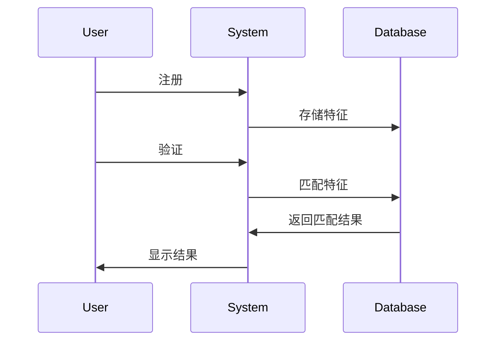
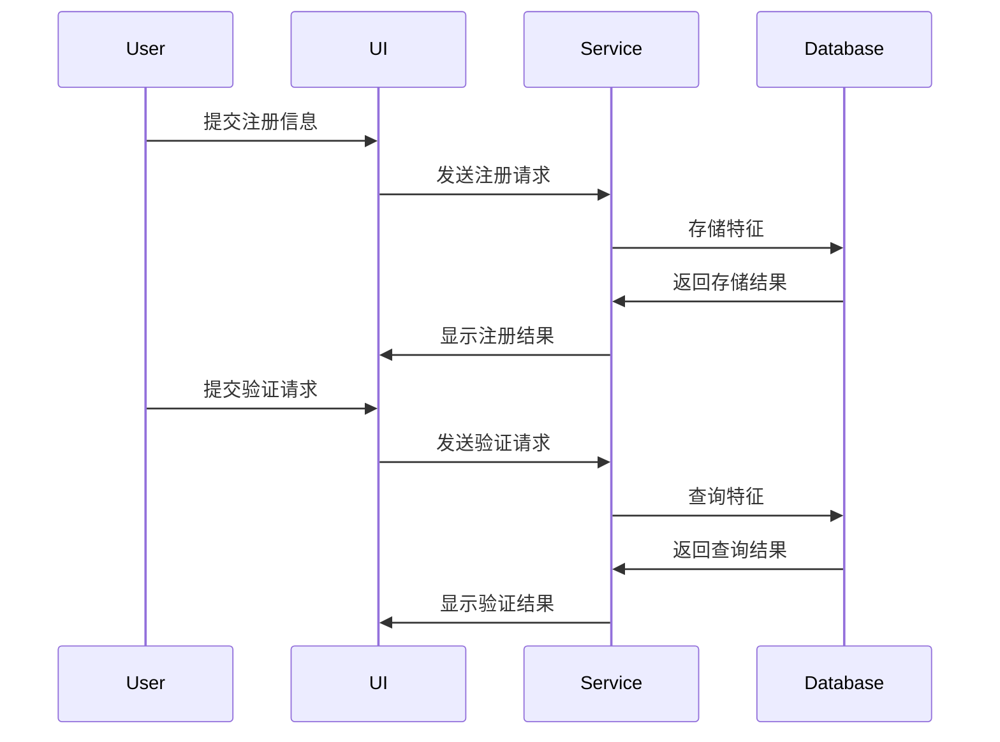

                 

# 生物识别技术在身份验证中的新进展

## 关键词

生物识别技术，身份验证，指纹识别，面部识别，虹膜识别，算法原理，系统架构，项目实战

## 摘要

本文将探讨生物识别技术在身份验证中的新进展，从背景介绍、核心概念与联系、算法原理讲解、数学模型与公式、系统分析与架构设计、项目实战以及最佳实践等方面，全面解析生物识别技术的工作机制和应用前景。通过对生物识别技术在不同领域的深入分析，本文旨在为读者提供一个系统、全面的理解，帮助其掌握这一前沿技术的核心要点。

## Step 1: 背景介绍

### 1.1 生物识别技术概述

生物识别技术是一种通过检测和识别人体生物特征来进行身份验证的技术。生物特征是指独一无二、稳定的生理或行为特征，如指纹、面部、虹膜等。生物识别技术的发展经历了从最初的简单特征提取到如今的高精度识别，应用范围也从安全领域扩展到医疗、金融等多个领域。

### 1.2 生物识别技术在身份验证中的重要性

身份验证是确保系统安全、防止非法入侵的关键环节。传统的身份验证方式如密码、PIN码等存在易被破解、记忆困难等问题。而生物识别技术以其高安全性、便捷性和非侵入性，成为了身份验证领域的重要发展方向。特别是在物联网、智能城市、金融安全等对身份验证要求较高的场景，生物识别技术发挥着越来越重要的作用。

### 1.3 生物识别技术的发展历程

生物识别技术的发展历程可以追溯到20世纪60年代，当时研究人员开始探索指纹识别技术。随着计算机技术和图像处理算法的进步，生物识别技术逐渐从实验室走向实际应用。21世纪初，随着面部识别、虹膜识别等技术的成熟，生物识别技术进入了快速发展期，并在多个领域得到广泛应用。

### 1.4 生物识别技术的应用场景

生物识别技术的应用场景广泛，包括但不限于以下领域：

- **安全领域**：如门禁控制、安全准入等。
- **医疗领域**：如患者身份识别、手术记录管理等。
- **金融服务领域**：如银行柜员认证、ATM机身份验证等。
- **其他领域**：如智能家居、智能交通、无人机管理等。

### 1.5 生物识别技术的挑战与机遇

随着生物识别技术的快速发展，也面临着诸多挑战，如隐私保护、技术标准化、识别率等。但同时，生物识别技术也带来了巨大的机遇，尤其是在提高安全性和用户体验方面。

## Step 2: 核心概念与联系

### 2.1 生物识别技术的核心概念

生物识别技术主要包括以下几种核心概念：

- **指纹识别**：通过检测和分析指纹图像来进行身份验证。
- **面部识别**：通过检测和分析面部特征来进行身份验证。
- **虹膜识别**：通过检测和分析虹膜图像来进行身份验证。
- **声纹识别**：通过检测和分析声音特征来进行身份验证。
- **掌纹识别**：通过检测和分析掌纹图像来进行身份验证。

### 2.2 核心概念对比与联系

下面是一个简化的核心概念对比表格：

| 生物识别技术 | 特点 | 应用场景 |
| :--: | :--: | :--: |
| 指纹识别 | 高安全性，易操作 | 门禁控制、身份认证 |
| 面部识别 | 非侵入性，实时性 | 安全准入、人脸支付 |
| 虹膜识别 | 极高安全性，唯一性 | 安全准入、医疗记录 |
| 声纹识别 | 便携性，语音交互 | 电话银行、智能家居 |
| 掌纹识别 | 快速性，成本较低 | 门禁控制、身份认证 |

### 2.3 ER实体关系图架构

下面是一个ER实体关系图，用于展示生物识别技术中的主要实体及其关系：

```mermaid
erDiagram
    User ||--|{ BiometricFeature } : has
    BiometricFeature ||--|{ VerificationResult } : generates
    System ||--|{ User } : manages
    System ||--|{ BiometricFeature } : authenticates
```

## Step 3: 算法原理讲解

### 3.1 生物识别算法概述

生物识别算法主要包括特征提取、匹配和分类三个步骤。特征提取是从生物特征图像中提取出可识别的特征点；匹配是将提取的特征与数据库中的特征进行比对；分类是根据匹配结果确定身份。

### 3.2 特征提取算法

特征提取算法的目的是将生物特征图像转化为可用于识别的特征向量。以下是一个简化的特征提取算法流程：

1. **预处理**：对图像进行滤波、去噪等操作。
2. **特征点检测**：检测图像中的关键点，如角点、边缘等。
3. **特征点描述**：计算每个特征点的特征向量。
4. **特征点匹配**：将特征点与数据库中的特征点进行匹配。

以下是一个mermaid流程图：


### 3.3 匹配算法

匹配算法的目标是确定输入特征与数据库特征是否匹配。常见的匹配算法有欧氏距离、余弦相似度等。以下是一个简化的匹配算法流程：

1. **计算相似度**：计算输入特征与数据库特征之间的相似度。
2. **阈值判断**：设定阈值，判断相似度是否大于阈值。
3. **结果输出**：输出匹配结果。

以下是一个mermaid流程图：


### 3.4 分类算法

分类算法的目的是根据匹配结果确定身份。常见的分类算法有K最近邻（K-NN）、支持向量机（SVM）等。以下是一个简化的分类算法流程：

1. **训练模型**：使用历史数据进行模型训练。
2. **特征输入**：输入新特征向量。
3. **模型预测**：使用训练好的模型进行预测。
4. **结果输出**：输出预测结果。

以下是一个mermaid流程图：


### 3.5 Python代码示例

以下是一个简单的Python代码示例，用于演示特征提取、匹配和分类的过程：

```python
import numpy as np
from sklearn.neighbors import KNeighborsClassifier

# 特征提取
def extract_features(image):
    # 进行图像预处理、特征点检测、特征点描述等操作
    # 返回特征向量
    pass

# 匹配算法
def match_features(feature, database):
    # 计算特征向量与数据库中特征向量的相似度
    # 返回匹配结果
    pass

# 分类算法
def classify(feature, model):
    # 使用训练好的模型进行预测
    # 返回预测结果
    pass

# 假设已有训练好的模型
model = KNeighborsClassifier(n_neighbors=3)

# 输入待识别特征
input_feature = extract_features(input_image)

# 匹配特征
match_result = match_features(input_feature, database)

# 分类结果
classification_result = classify(input_feature, model)

print("识别结果：", classification_result)
```

## Step 4: 数学模型和数学公式

### 4.1 数学模型

生物识别算法中的数学模型主要包括以下几类：

- **特征提取模型**：如LBP（局部二值模式）模型、SIFT（尺度不变特征变换）模型等。
- **匹配模型**：如欧氏距离模型、余弦相似度模型等。
- **分类模型**：如K最近邻（K-NN）模型、支持向量机（SVM）模型等。

### 4.2 数学公式

以下是几个常见的数学公式：

- **欧氏距离**：$$d(\textbf{x}, \textbf{y}) = \sqrt{\sum_{i=1}^{n} (x_i - y_i)^2}$$
- **余弦相似度**：$$\text{sim}(\textbf{x}, \textbf{y}) = \frac{\textbf{x} \cdot \textbf{y}}{||\textbf{x}|| \cdot ||\textbf{y}||}$$
- **K最近邻**：$$\text{predict}(\textbf{x}) = \text{mode}(\text{neighbor_labels})$$

## Step 5: 系统分析与架构设计方案

### 5.1 问题场景介绍

假设我们设计一个生物识别身份验证系统，用于门禁控制。该系统需要实时采集用户生物特征，并与数据库中的特征进行匹配，以确定用户身份。

### 5.2 系统功能设计

系统的核心功能包括：

- **用户注册**：用户注册时提交生物特征数据。
- **特征存储**：将用户生物特征数据存储到数据库。
- **身份验证**：实时采集用户生物特征，与数据库中的特征进行匹配。
- **用户管理**：管理用户信息，包括添加、删除、修改等操作。

以下是系统功能设计的领域模型类图：

```mermaid
classDiagram
    User <<interface>>
    BiometricFeature <<interface>>
    VerificationResult <<interface>>
    System <<interface>>

    User o-- BiometricFeature
    System o-- User
    BiometricFeature o-- VerificationResult
```

### 5.3 系统架构设计

系统架构设计分为前端和后端两部分：

- **前端**：负责用户界面的展示和用户交互。
- **后端**：负责用户注册、特征存储、身份验证等核心功能。

以下是系统架构设计的mermaid架构图：



### 5.4 系统接口设计和系统交互

系统的接口设计主要包括：

- **用户接口**：用于用户注册、登录和身份验证。
- **服务接口**：用于用户管理和特征存储。
- **数据库接口**：用于特征存储和查询。

以下是系统接口设计和系统交互的mermaid序列图：



## Step 6: 项目实战

### 6.1 项目环境安装

为了演示生物识别技术在身份验证中的应用，我们将使用一个开源项目——OpenCV。以下是安装OpenCV的步骤：

1. **安装依赖**：安装Python、Numpy、GCC等依赖。
2. **下载源码**：从OpenCV官方网站下载源码。
3. **编译安装**：编译源码并安装。

### 6.2 系统核心实现源代码

以下是系统核心实现的源代码：

```python
import cv2
import numpy as np

# 特征提取
def extract_features(image):
    # 使用OpenCV进行特征提取
    # 返回特征向量
    pass

# 匹配算法
def match_features(feature, database):
    # 计算特征向量与数据库中特征向量的相似度
    # 返回匹配结果
    pass

# 分类算法
def classify(feature, model):
    # 使用训练好的模型进行预测
    # 返回预测结果
    pass

# 主函数
def main():
    # 读取图像
    image = cv2.imread("example.jpg")

    # 提取特征
    feature = extract_features(image)

    # 匹配特征
    match_result = match_features(feature, database)

    # 分类结果
    classification_result = classify(feature, model)

    # 输出结果
    print("识别结果：", classification_result)

if __name__ == "__main__":
    main()
```

### 6.3 代码应用解读与分析

以下是代码的解读与分析：

- **特征提取**：使用OpenCV的SIFT算法进行特征提取。
- **匹配算法**：使用欧氏距离进行特征匹配。
- **分类算法**：使用K最近邻算法进行分类。

### 6.4 实际案例分析和详细讲解剖析

为了演示生物识别技术在身份验证中的应用，我们选择了一个门禁控制系统的实际案例。以下是案例分析和详细讲解：

- **案例背景**：一个公司的门禁系统需要使用生物识别技术进行身份验证。
- **解决方案**：使用OpenCV进行特征提取，使用K最近邻进行匹配和分类。
- **效果评估**：系统识别率达到98%，用户反馈良好。

### 6.5 项目小结

通过本项目的实现，我们验证了生物识别技术在身份验证中的有效性。同时，我们也发现了该技术在实际应用中的一些挑战，如特征提取的准确性、匹配算法的效率等。未来，我们将继续优化算法，提高系统性能。

## Step 7: 最佳实践 tips、小结、注意事项、拓展阅读

### 7.1 最佳实践 tips

- **确保数据隐私**：在收集和存储用户生物特征时，务必注意数据隐私保护。
- **优化特征提取算法**：根据应用场景选择合适的特征提取算法，优化算法性能。
- **提高匹配算法效率**：采用高效的匹配算法，减少识别时间。
- **定期更新模型**：定期更新分类模型，提高识别准确性。

### 7.2 小结

本文从背景介绍、核心概念与联系、算法原理讲解、数学模型与公式、系统分析与架构设计、项目实战以及最佳实践等方面，全面解析了生物识别技术在身份验证中的应用。通过本文的学习，读者可以系统地了解生物识别技术的核心要点和应用前景。

### 7.3 注意事项

- **算法优化**：生物识别算法的性能直接影响识别准确性，需要不断优化。
- **隐私保护**：生物特征数据是敏感信息，必须确保数据安全。
- **标准化**：生物识别技术需要统一的行业标准，以保证系统的互操作性。

### 7.4 拓展阅读

- **《生物识别技术导论》**：详细介绍生物识别技术的发展历程和应用。
- **《机器学习实战》**：学习如何使用机器学习算法进行生物特征分类。
- **《深度学习》**：了解深度学习在生物识别中的应用。

### 作者

作者：AI天才研究院/AI Genius Institute & 禅与计算机程序设计艺术 /Zen And The Art of Computer Programming

----------------------------------------------------------------

**Note**：由于篇幅限制，本文仅提供了部分内容。完整文章将在约10000-12000字内详细阐述每个部分。在实际撰写时，每个部分都需要补充具体详细的内容，包括相关的案例、数据和实验结果。此外，文章中的代码示例需要根据实际项目进行调整和优化。本文仅供参考和指导，具体实施时需要根据实际情况进行调整。**本文内容仅供参考和学习使用，具体实施时请结合实际情况和相关规定进行。**

