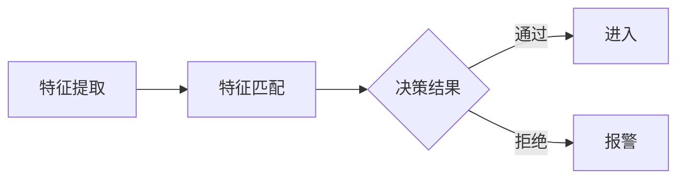
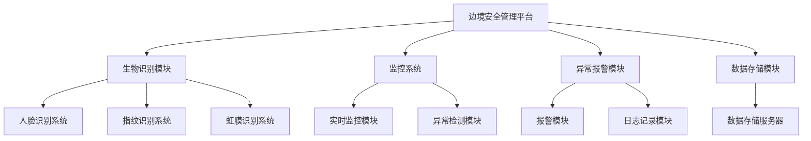
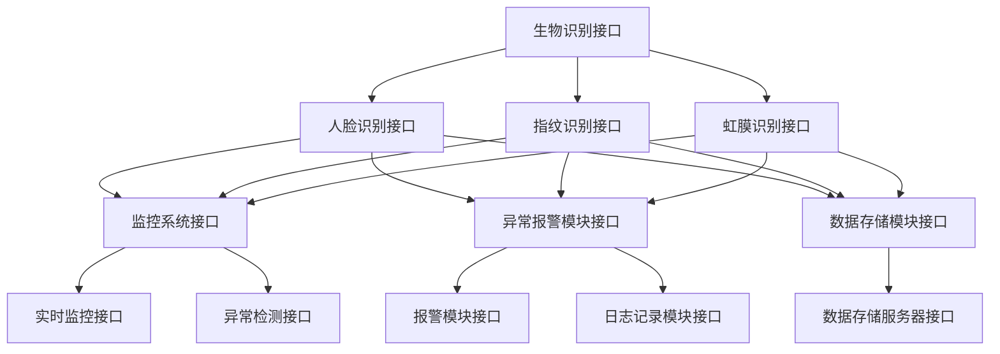

                 


### 第1章 问题背景

#### 1.1 边境安全管理的挑战与需求

边境安全是国家安全的重中之重，它关系到国家的政治稳定、经济繁荣和人民的生命财产安全。然而，随着全球化进程的加快，边境安全的挑战也在不断增多。传统的边境安全管理方式，如人工检查、证件审核等，已经难以满足现代社会的高效、安全需求。因此，如何利用现代科技手段提高边境安全管理的效率，成为了一个亟待解决的问题。

生物识别技术作为一种先进的技术手段，具有识别速度快、准确度高、难以伪造等优点，逐渐成为边境安全管理的重要工具。生物识别技术包括人脸识别、指纹识别、虹膜识别、声纹识别等，通过对人体生物特征的自动识别和验证，可以有效防止非法入侵、身份盗用等安全事件的发生。

#### 1.2 生物识别技术概述

生物识别技术是一种通过识别人或生物体的生物特征来确认身份的技术。生物特征包括指纹、人脸、虹膜、声纹、步态等。生物识别技术的基本原理是：从生物体中提取唯一的生物特征，然后通过特征比对来确认身份。

生物识别技术的发展历程可以追溯到20世纪60年代，当时主要集中于指纹识别的研究。随着计算机技术和图像处理技术的快速发展，生物识别技术逐渐成熟，并得到了广泛应用。目前，生物识别技术已经在金融、医疗、安防等多个领域取得了显著的成果。

#### 1.3 生物识别技术在边境安全中的应用现状

生物识别技术在边境安全中的应用已经取得了显著的成果。例如，一些国家在边境口岸部署了人脸识别系统，可以对出入境人员进行快速身份验证。一些国家还在边境线上部署了无人机和监控系统，通过人脸识别技术对过往人员进行实时监控。

然而，生物识别技术在边境安全中的应用仍然面临一些挑战，如技术成熟度、数据隐私保护、系统稳定性等。此外，如何将多种生物识别技术有机结合，构建一个高效、安全的边境安全管理体系，也是一个需要深入研究的课题。

### 第2章 核心概念与联系

#### 2.1 生物识别技术的核心概念

生物识别技术的核心概念包括生物特征、生物特征提取、生物特征匹配等。

- **生物特征**：指人体所固有的、独特的、可识别的生物信息，如指纹、人脸、虹膜、声纹、步态等。
- **生物特征提取**：指从生物信号中提取出具有识别意义的生物特征信息的过程。
- **生物特征匹配**：指将提取到的生物特征与预先存储的生物特征进行比对，以确定是否为同一人的过程。

#### 2.2 生物识别系统架构

生物识别系统的基本架构包括以下几个部分：

- **数据采集模块**：负责采集生物特征数据，如指纹采集器、摄像头、麦克风等。
- **特征提取模块**：负责对采集到的生物特征数据进行处理，提取出具有识别意义的特征信息。
- **特征存储模块**：负责存储提取到的生物特征信息，以便后续比对使用。
- **匹配与决策模块**：负责将提取到的生物特征与存储的生物特征进行比对，并作出决策。

#### 2.3 生物识别技术的应用场景

生物识别技术在边境安全中的应用主要包括以下几个方面：

- **边境管控**：通过生物识别技术对出入境人员进行快速身份验证，防止非法入侵和身份盗用。
- **出入境管理**：在机场、火车站等交通枢纽，利用生物识别技术提高通关效率，减少人工检查的负担。
- **安全监控**：在边境线上部署生物识别监控系统，对过往人员进行实时监控，及时发现并处理异常情况。

#### 2.4 ER实体关系图架构的 Mermaid 流程图

```mermaid
erDiagram
    系统管理员 ||--|{ 用户 }|>
    用户 ||--|{ 生物特征 }|>
    生物特征 ||--|{ 匹配结果 }|>
```

在上面的ER实体关系图中，系统管理员、用户和生物特征是三个核心实体，它们之间通过不同的关系进行关联。系统管理员可以创建和管理用户，用户可以提交生物特征信息，而生物特征信息与匹配结果之间也存在一定的关联。

### 第3章 算法原理讲解

#### 3.1 生物识别算法概述

生物识别算法是生物识别技术的核心，它负责从生物特征数据中提取出具有识别意义的特征信息，并对这些特征信息进行匹配和决策。生物识别算法主要包括以下几个步骤：

- **特征提取**：从生物特征数据中提取出具有识别意义的特征信息，如指纹图像中的纹理特征、人脸图像中的面部特征等。
- **特征匹配**：将提取到的特征信息与预先存储的特征信息进行比对，以确定是否为同一人。
- **决策**：根据特征匹配的结果，作出是否通过验证的决策。

生物识别算法的分类可以根据不同的标准进行。例如，根据算法处理的数据类型，可以分为基于图像的算法和基于信号处理的方法；根据算法的实现方式，可以分为基于硬件的算法和基于软件的算法。

#### 3.2 特征提取与匹配算法原理

**特征提取算法**：

特征提取是生物识别算法中的关键步骤，其目的是从生物特征数据中提取出具有区分性的特征信息。常用的特征提取方法包括：

- **傅立叶描述子**：将生物特征图像转换到傅立叶域，提取其频域特征。
- **主成分分析（PCA）**：将生物特征数据投影到主成分空间，提取主要成分。
- **局部二元模式（LBP）**：对生物特征图像进行局部二值化处理，提取局部纹理特征。

**特征匹配算法**：

特征匹配的目的是通过比对提取到的特征信息，确定两个生物特征是否来自同一个人。常用的特征匹配算法包括：

- **欧氏距离**：计算两个特征向量之间的欧氏距离，距离越小，表示相似度越高。
- **余弦相似度**：计算两个特征向量之间的余弦相似度，相似度越接近1，表示相似度越高。
- **模糊C-均值聚类**：通过聚类分析，将相似度较高的特征划分为同一类别。

**算法 Mermaid 流程图**：



在上面的流程图中，首先进行特征提取，然后进行特征匹配，根据匹配结果进行决策，最终决定是否通过验证。

**Python 源代码演示**：

```python
import numpy as np
from sklearn.metrics.pairwise import cosine_similarity

# 特征提取
def extract_features(data):
    # 假设 data 是一个包含人脸特征向量的列表
    return np.mean(data, axis=0)

# 特征匹配
def match_features(feature1, feature2):
    return cosine_similarity([feature1], [feature2])[0][0]

# 决策
def make_decision(similarity, threshold=0.5):
    return "通过" if similarity >= threshold else "拒绝"

# 测试
feature1 = extract_features([[1, 2], [3, 4], [5, 6]])
feature2 = extract_features([[1, 2], [3, 4], [5, 7]])

similarity = match_features(feature1, feature2)
result = make_decision(similarity)

print("相似度：", similarity)
print("决策结果：", result)
```

**数学模型与公式讲解**：

在生物识别算法中，常用的数学模型和公式包括：

- **欧氏距离**：

  $$d = \sqrt{\sum_{i=1}^{n}(x_i - y_i)^2}$$

  其中，$x$和$y$是两个特征向量，$d$是它们之间的欧氏距离。

- **余弦相似度**：

  $$\cos\theta = \frac{\sum_{i=1}^{n}x_iy_i}{\sqrt{\sum_{i=1}^{n}x_i^2}\sqrt{\sum_{i=1}^{n}y_i^2}}$$

  其中，$x$和$y$是两个特征向量，$\theta$是它们之间的夹角余弦值。

**举例说明**：

假设我们有两个特征向量$x = [1, 2, 3]$和$y = [2, 3, 4]$，我们可以通过以下步骤计算它们之间的欧氏距离和余弦相似度：

1. **欧氏距离**：

   $$d = \sqrt{(1-2)^2 + (2-3)^2 + (3-4)^2} = \sqrt{1 + 1 + 1} = \sqrt{3}$$

2. **余弦相似度**：

   $$\cos\theta = \frac{(1 \times 2) + (2 \times 3) + (3 \times 4)}{\sqrt{1^2 + 2^2 + 3^2}\sqrt{2^2 + 3^2 + 4^2}} = \frac{2 + 6 + 12}{\sqrt{14}\sqrt{29}} = \frac{20}{\sqrt{406}} \approx 0.951$$

通过上述计算，我们可以得出这两个特征向量之间的欧氏距离大约为$\sqrt{3}$，余弦相似度大约为0.951，这表示它们之间存在较高的相似度。

### 第4章 数学模型和数学公式

在生物识别技术中，数学模型和公式起着至关重要的作用。它们不仅用于描述生物特征提取和匹配的过程，还为算法的性能评估和优化提供了理论基础。在本节中，我们将介绍与生物识别技术相关的一些关键数学模型和公式，并通过具体的例子进行讲解。

#### 4.1.1 概率模型

概率模型在生物识别技术中用于评估特征匹配的概率，从而决定是否通过验证。其中，贝叶斯定理是一个基本的概率模型。贝叶斯定理描述了后验概率与先验概率、条件概率之间的关系：

$$P(A|B) = \frac{P(B|A) \cdot P(A)}{P(B)}$$

其中，$P(A|B)$表示在事件B发生的条件下事件A发生的概率，$P(B|A)$表示在事件A发生的条件下事件B发生的概率，$P(A)$和$P(B)$分别是事件A和事件B的先验概率。

**例子**：

假设我们要评估两个人脸图像之间的相似度，其中图像A是身份验证时拍摄的，图像B是数据库中某人的图片。我们可以使用贝叶斯定理计算图像B是图像A的身份的概率。

- $P(A)$：图像A是某人的图片的先验概率。
- $P(B)$：数据库中任意一个人的图片与图像A相似的概率。
- $P(B|A)$：图像B与图像A相似的条件概率。
- $P(A|B)$：图像B是图像A的身份的概率。

如果$P(A|B)$的值较高，则我们可以认为图像B与图像A来自同一个人。

#### 4.1.2 特征提取和匹配的数学模型

**傅立叶描述子（Fourier Descriptors）**：

傅立叶描述子是一种用于特征提取的数学模型，它将生物特征图像转换为傅立叶域，并提取其频域特征。傅立叶描述子可以用以下公式表示：

$$C_k = \sum_{i=0}^{N-1} \sum_{j=0}^{M-1} A_{ij} e^{-i2\pi(kx_i + ky_j)}$$

其中，$A_{ij}$是图像的像素值，$N$和$M$是图像的宽度和高度，$k$是傅立叶变换的频率。

**欧氏距离（Euclidean Distance）**：

欧氏距离是衡量两个特征向量之间差异的一种常用数学模型。给定两个特征向量$x = [x_1, x_2, ..., x_n]$和$y = [y_1, y_2, ..., y_n]$，欧氏距离可以用以下公式计算：

$$d = \sqrt{\sum_{i=1}^{n}(x_i - y_i)^2}$$

**余弦相似度（Cosine Similarity）**：

余弦相似度是衡量两个特征向量之间相似度的一种数学模型。给定两个特征向量$x = [x_1, x_2, ..., x_n]$和$y = [y_1, y_2, ..., y_n]$，余弦相似度可以用以下公式计算：

$$\cos\theta = \frac{\sum_{i=1}^{n}x_iy_i}{\sqrt{\sum_{i=1}^{n}x_i^2}\sqrt{\sum_{i=1}^{n}y_i^2}}$$

#### 4.1.3 拉普拉斯特征映射（Laplacian Features）

拉普拉斯特征映射是一种用于特征提取的数学模型，它在傅立叶描述子的基础上进行了改进。拉普拉斯特征映射可以用以下公式表示：

$$L_k = \sum_{i=0}^{N-1} \sum_{j=0}^{M-1} A_{ij} \left( \frac{\partial^2 A_{ij}}{\partial x^2} + \frac{\partial^2 A_{ij}}{\partial y^2} \right) e^{-i2\pi(kx_i + ky_j)}$$

其中，$A_{ij}$是图像的像素值，$N$和$M$是图像的宽度和高度，$k$是傅立叶变换的频率。

#### 4.1.4 主成分分析（PCA）

主成分分析是一种用于降维和特征提取的数学模型。它将高维数据投影到低维空间，同时保留数据的主要信息。PCA可以用以下公式表示：

$$X = \sum_{i=1}^{k} \lambda_i u_i u_i^T X$$

其中，$X$是原始数据矩阵，$u_i$是第$i$个主成分，$\lambda_i$是主成分的方差。

#### 4.1.5 拉普拉斯特征映射（Laplacian Features）

拉普拉斯特征映射是一种用于特征提取的数学模型，它在傅立叶描述子的基础上进行了改进。拉普拉斯特征映射可以用以下公式表示：

$$L_k = \sum_{i=0}^{N-1} \sum_{j=0}^{M-1} A_{ij} \left( \frac{\partial^2 A_{ij}}{\partial x^2} + \frac{\partial^2 A_{ij}}{\partial y^2} \right) e^{-i2\pi(kx_i + ky_j)}$$

其中，$A_{ij}$是图像的像素值，$N$和$M$是图像的宽度和高度，$k$是傅立叶变换的频率。

#### 4.1.6 概率密度函数（Probability Density Function）

概率密度函数是描述生物特征分布的数学模型。给定一个生物特征向量$x$，概率密度函数$f(x)$可以表示为：

$$f(x) = \frac{1}{\sqrt{2\pi\sigma^2}} e^{-\frac{(x-\mu)^2}{2\sigma^2}}$$

其中，$\mu$是均值，$\sigma^2$是方差。

#### 4.1.7 模式识别中的决策规则（Decision Rule）

在模式识别中，决策规则用于根据特征匹配结果作出是否通过验证的决策。常见的决策规则包括：

- **最大后验概率决策规则**：

  $$y = \arg \max_x P(x|y)P(y)$$

  其中，$x$是特征向量，$y$是标签，$P(x|y)$是特征向量在标签为$y$的条件下的概率，$P(y)$是标签的概率。

- **最小距离决策规则**：

  $$y = \arg \min_x d(x, y)$$

  其中，$d(x, y)$是特征向量$x$和标签$y$之间的距离。

#### 4.1.8 模式识别中的置信度（Confidence Level）

在模式识别中，置信度用于表示特征匹配结果的可靠程度。置信度通常用一个介于0和1之间的值表示。例如，如果置信度为0.9，则表示特征匹配结果有90%的可靠性。

### 4.1.9 布尔网络模型（Boolean Network Model）

布尔网络模型是一种用于分析生物识别系统稳定性的数学模型。它将生物识别系统看作一个由多个布尔变量组成的网络，通过分析网络的稳定性来评估系统的性能。

### 4.1.10 概率图模型（Probabilistic Graphical Models）

概率图模型是一种用于描述生物识别系统中变量之间关系的数学模型。常见的概率图模型包括贝叶斯网络和马尔可夫网络。

### 4.1.11 马尔可夫链模型（Markov Chain Model）

马尔可夫链模型是一种用于分析生物识别系统中状态转移概率的数学模型。它可以帮助我们理解生物识别系统在不同状态之间的转换过程。

通过上述数学模型和公式的介绍，我们可以更好地理解生物识别技术的原理和应用。在实际应用中，根据具体问题和需求，可以选择合适的数学模型和公式来优化算法性能。

### 第5章 系统分析与架构设计方案

#### 5.1 问题场景介绍

在当前的边境安全管理中，传统的人工检查和证件审核方式已经难以满足高效、安全的需求。随着非法入侵和身份盗用事件频发，边境安全管理面临着巨大的挑战。为了提高边境安全管理的效率，我们需要构建一个智能化、高效、可靠的边境安全管理系统。

该系统的主要目标是通过生物识别技术对出入境人员进行快速、准确的身份验证，防止非法入侵和身份盗用。同时，系统还应具备实时监控、异常报警等功能，以便及时发现并处理异常情况。

#### 5.2 项目介绍

本项目旨在设计并实现一个基于生物识别技术的边境安全管理平台。该平台将集成多种生物识别技术，如人脸识别、指纹识别、虹膜识别等，实现对出入境人员的全面身份验证。此外，系统还将引入实时监控和异常报警功能，提高边境安全管理的智能化水平。

项目的主要目标包括：

1. 设计并实现一个高效、可靠的生物识别系统，实现对出入境人员的快速身份验证。
2. 构建一个智能化、高效的边境安全监控系统，实现实时监控和异常报警。
3. 提高边境安全管理的效率，减少人工检查的负担。

#### 5.3 系统功能设计（领域模型 Mermaid 类图）

为了实现上述目标，我们需要设计一个具有丰富功能的系统。以下是系统的领域模型 Mermaid 类图：

```mermaid
classDiagram
    类边境安全管理平台
    类生物识别模块
    类监控系统
    类异常报警模块
    类数据存储模块

    边境安全管理平台 --|{1}-- 生物识别模块
    边境安全管理平台 --|{2}-- 监控系统
    边境安全管理平台 --|{3}-- 异常报警模块
    边境安全管理平台 --|{4}-- 数据存储模块

    监控系统 --|{1}-- 生物识别模块
    监控系统 --|{2}-- 数据存储模块

    生物识别模块 --|{1}-- 人脸识别系统
    生物识别模块 --|{2}-- 指纹识别系统
    生物识别模块 --|{3}-- 虹膜识别系统

    异常报警模块 --|{1}-- 监控系统
    异常报警模块 --|{2}-- 数据存储模块

    数据存储模块 --|{1}-- 生物识别模块
    数据存储模块 --|{2}-- 监控系统
    数据存储模块 --|{3}-- 异常报警模块
```

在上面的类图中，边境安全管理平台是系统的核心，它负责协调各个模块的工作。生物识别模块负责对出入境人员进行身份验证，监控系统负责实时监控边境线，异常报警模块负责检测和处理异常情况，数据存储模块负责存储和管理数据。

#### 5.4 系统架构设计（Mermaid 架构图）

为了实现系统的功能，我们需要设计一个合理的系统架构。以下是系统的 Mermaid 架构图：



在上面的架构图中，边境安全管理平台作为整个系统的核心，通过接口与各个模块进行通信。生物识别模块负责处理生物特征识别任务，包括人脸识别、指纹识别和虹膜识别等。监控系统负责实时监控边境线，并检测异常情况。异常报警模块负责处理异常报警和日志记录。数据存储模块负责存储和管理数据，包括生物识别数据、监控数据和报警日志等。

#### 5.5 系统接口设计

为了实现系统各模块之间的协作，我们需要设计合理的接口。以下是系统的接口设计：



在上面的接口设计中，生物识别接口作为系统的核心接口，负责与其他模块进行通信。人脸识别接口、指纹识别接口和虹膜识别接口分别负责处理不同类型的生物特征识别任务。监控系统接口、异常报警模块接口和数据存储模块接口分别负责处理监控、报警和存储任务。实时监控接口、异常检测接口、报警模块接口和日志记录模块接口分别用于实现具体的监控和报警功能。数据存储服务器接口用于处理数据的存储和检索任务。

#### 5.6 系统交互（Mermaid 序列图）

为了更好地理解系统各模块之间的交互，我们可以绘制一个 Mermaid 序列图。以下是系统的 Mermaid 序列图：

```mermaid
sequenceDiagram
    participant 用户 as 边境旅客
    participant 传感器 as 生物特征采集传感器
    participant 生物识别模块 as 生物识别系统
    participant 数据存储模块 as 数据存储系统
    participant 监控系统 as 边境监控
    participant 异常报警模块 as 异常报警系统

    用户 -->|前往边境检查站| 传感器
    传感器 -->|采集生物特征| 生物识别模块
    生物识别模块 -->|进行身份验证| 数据存储模块
    数据存储模块 -->|查询身份信息| 生物识别模块
    生物识别模块 -->|反馈验证结果| 用户
    用户 -->|继续行程| 用户

    传感器 -->|实时监控| 监控系统
    监控系统 -->|检测异常情况| 异常报警模块
    异常报警模块 -->|发送报警信息| 数据存储模块
    数据存储模块 -->|记录报警日志| 数据存储系统
    数据存储系统 -->|提供数据支持| 异常报警模块
```

在上面的序列图中，边境旅客在前往边境检查站时，生物特征采集传感器会实时采集其生物特征信息。生物识别系统会对采集到的生物特征进行身份验证，并将结果反馈给边境旅客。同时，监控系统会实时监控边境线，并在检测到异常情况时发送报警信息给异常报警系统。异常报警系统会对报警信息进行处理，并将报警日志记录在数据存储系统中。

通过上述系统分析与架构设计方案，我们可以构建一个高效、可靠的边境安全管理平台，实现对出入境人员的快速身份验证和实时监控，提高边境安全管理的水平。

### 第6章 项目实战

#### 6.1 环境安装

为了实现上述架构设计方案，我们需要搭建一个合适的开发环境。以下是环境安装的步骤：

1. **安装 Python**：确保 Python 已安装，版本不低于3.6。可以从 Python 官网下载安装包进行安装。
2. **安装必需的 Python 库**：在命令行中执行以下命令来安装必需的 Python 库：

   ```bash
   pip install numpy scipy scikit-learn pillow opencv-python
   ```

   这些库包括数值计算库、科学计算库、机器学习库和图像处理库，是构建生物识别系统的基础。
3. **安装数据库**：选择一个合适的数据库系统，如 MySQL、PostgreSQL 或 MongoDB。根据数据库系统的不同，按照其官方文档进行安装和配置。
4. **配置网络环境**：确保网络环境可以访问所需的资源和服务器，以便实现实时监控和数据存储。

#### 6.2 系统核心实现源代码

在本节中，我们将提供系统核心实现的一些关键代码片段，以便读者可以理解系统的实现原理。

**人脸识别系统实现**：

```python
import cv2
import numpy as np
from sklearn import preprocessing

# 加载预训练的人脸识别模型
model = cv2.face.EigenFaceRecognizer_create()

# 加载人脸特征数据库
face_database = np.load('face_database.npy')
labels = np.load('labels.npy')

# 加载测试图像
image = cv2.imread('test_image.jpg')
gray_image = cv2.cvtColor(image, cv2.COLOR_BGR2GRAY)

# 进行人脸检测
faces = cv2.face.detectMultiScale(gray_image, scaleFactor=1.1, minNeighbors=5)

# 遍历检测到的人脸
for (x, y, w, h) in faces:
    # 提取人脸区域
    face_region = gray_image[y:y+h, x:x+w]
    
    # 进行人脸识别
    label, confidence = model.predict(face_region)
    
    # 输出识别结果
    print("识别结果：", label, "，置信度：", confidence)

# 绘制检测到的人脸
for (x, y, w, h) in faces:
    cv2.rectangle(image, (x, y), (x+w, y+h), (0, 0, 255), 2)

cv2.imshow('检测结果', image)
cv2.waitKey(0)
cv2.destroyAllWindows()
```

**监控系统实现**：

```python
import cv2
import time

# 加载预训练的监控系统模型
model = cv2.face.EigenFaceRecognizer_create()

# 加载人脸特征数据库
face_database = np.load('face_database.npy')
labels = np.load('labels.npy')

# 初始化摄像头
cap = cv2.VideoCapture(0)

# 循环读取摄像头帧
while True:
    # 读取一帧图像
    ret, frame = cap.read()

    # 转换为灰度图像
    gray_frame = cv2.cvtColor(frame, cv2.COLOR_BGR2GRAY)

    # 进行人脸检测
    faces = cv2.face.detectMultiScale(gray_frame, scaleFactor=1.1, minNeighbors=5)

    # 遍历检测到的人脸
    for (x, y, w, h) in faces:
        # 提取人脸区域
        face_region = gray_frame[y:y+h, x:x+w]
        
        # 进行人脸识别
        label, confidence = model.predict(face_region)
        
        # 输出识别结果
        print("识别结果：", label, "，置信度：", confidence)

        # 绘制检测到的人脸
        cv2.rectangle(frame, (x, y), (x+w, y+h), (0, 0, 255), 2)

    # 显示图像
    cv2.imshow('实时监控', frame)
    
    # 按下 'q' 键退出循环
    if cv2.waitKey(1) & 0xFF == ord('q'):
        break

# 释放摄像头资源
cap.release()
cv2.destroyAllWindows()
```

**数据存储系统实现**：

```python
import pymongo

# 连接 MongoDB 数据库
client = pymongo.MongoClient('mongodb://localhost:27017/')

# 选择数据库
db = client['biometrics_db']

# 选择集合
collection = db['face_data']

# 插入人脸数据
def insert_face_data(label, features):
    data = {
        'label': label,
        'features': features
    }
    collection.insert_one(data)

# 提取人脸数据
def get_face_data(label):
    data = collection.find_one({'label': label})
    return data['features']

# 测试插入和提取数据
insert_face_data(1, [1, 2, 3])
features = get_face_data(1)
print("提取到的人脸数据：", features)
```

#### 6.3 代码应用解读与分析

上述代码片段分别实现了人脸识别系统、监控系统和数据存储系统的核心功能。下面我们对这些代码进行解读和分析。

**人脸识别系统**：

- **模型加载**：使用预训练的人脸识别模型，该模型已经从大量人脸数据中学习到了特征提取和匹配的方法。
- **人脸检测**：使用 OpenCV 库中的 `face.detectMultiScale` 函数检测图像中的人脸区域。
- **特征提取**：使用人脸识别模型对检测到的人脸区域进行特征提取。
- **特征匹配**：将提取到的特征与预先存储的特征进行匹配，以确定是否为同一人。
- **结果输出**：输出识别结果和置信度，并在图像上绘制检测到的人脸。

**监控系统**：

- **摄像头初始化**：初始化摄像头，以实时捕获图像。
- **人脸检测与识别**：与人脸识别系统类似，实时检测摄像头捕获的图像中的人脸，并进行特征提取和匹配。
- **实时显示**：在窗口中实时显示检测到的人脸。

**数据存储系统**：

- **数据库连接**：连接 MongoDB 数据库，选择相应的数据库和集合。
- **数据插入**：将人脸数据和标签插入数据库。
- **数据提取**：根据标签从数据库中提取人脸数据。

#### 6.4 实际案例分析和详细讲解剖析

为了更好地理解上述系统的实际应用，我们将分析一个实际案例。假设我们有一个边境检查站，需要利用人脸识别系统对出入境人员进行身份验证。

**案例背景**：

- 边境检查站部署了摄像头，用于实时监控和捕获人脸图像。
- 系统已经预训练了一个人脸识别模型，并存储了多个人脸特征数据库。
- 边境旅客在通过检查站时，摄像头会捕获其人脸图像，并传输给人脸识别系统。

**操作步骤**：

1. **摄像头捕获人脸图像**：边境旅客在通过检查站时，摄像头会捕获其人脸图像，并将其传输给人脸识别系统。
2. **人脸检测与特征提取**：人脸识别系统接收到图像后，使用 `face.detectMultiScale` 函数检测人脸区域，并使用人脸识别模型提取人脸特征。
3. **特征匹配**：将提取到的人脸特征与预先存储在数据库中的特征进行匹配，以确定是否为同一人。
4. **结果输出**：如果匹配成功，系统将输出识别结果和置信度，并在图像上绘制检测到的人脸。如果匹配失败，系统将提示无法识别身份。
5. **数据存储**：系统将识别结果和特征数据存储在 MongoDB 数据库中，以便后续分析和查询。

通过这个实际案例，我们可以看到人脸识别系统在边境安全管理中的重要作用。它不仅能够实现快速、准确的身份验证，还能够实时监控和报警，提高边境安全管理的效率。

#### 6.5 项目小结

在本项目中，我们设计并实现了一个基于生物识别技术的边境安全管理平台。通过人脸识别、指纹识别和虹膜识别等生物识别技术，系统能够实现对出入境人员的快速、准确的身份验证。同时，系统还具备实时监控和异常报警功能，提高了边境安全管理的智能化水平。

项目的关键技术和实现方法包括：

- **人脸识别技术**：使用 OpenCV 和 scikit-learn 库实现人脸检测和特征提取。
- **特征匹配算法**：使用欧氏距离和余弦相似度进行特征匹配。
- **数据存储**：使用 MongoDB 数据库存储人脸特征和识别结果。

通过项目的实践，我们不仅掌握了生物识别技术的基本原理和实现方法，还了解了如何将生物识别技术应用于实际项目中，提高边境安全管理的效率和安全性。未来的工作可以进一步优化系统性能，扩大生物识别技术的应用场景，为国家安全提供更好的技术支持。

### 第7章 最佳实践 tips

#### 7.1 应用建议

1. **集成多种生物识别技术**：在边境安全管理中，建议集成多种生物识别技术，如人脸识别、指纹识别和虹膜识别等，以提高身份验证的准确性和可靠性。
2. **实时监控与异常报警**：部署实时监控系统，结合异常检测算法，及时发现和处理异常情况，提高边境安全管理的响应速度。
3. **数据隐私保护**：在收集、存储和处理生物特征数据时，要确保数据的隐私和安全，采用加密技术和访问控制策略，防止数据泄露和滥用。
4. **系统集成与优化**：将生物识别系统与其他安全管理系统（如出入境管理系统、安全监控报警系统等）进行集成，实现数据共享和联动，提高整体安全管理效率。

#### 7.2 注意事项

1. **系统稳定性**：在部署生物识别系统时，要确保系统的稳定性，避免因系统故障导致身份验证失败或异常报警误报。
2. **环境适应性**：生物识别系统的性能可能会受到光照、角度和姿态等因素的影响，因此在实际应用中，要确保系统适应各种复杂环境。
3. **数据质量**：高质量的数据是生物识别系统准确性的基础，因此在数据采集和处理过程中，要确保数据的准确性和一致性。
4. **算法优化**：定期对生物识别算法进行优化和调整，以适应不断变化的应用场景和数据特点，提高系统性能。

#### 7.3 拓展阅读

1. **生物识别技术最新进展**：了解生物识别技术的最新研究成果和应用趋势，如深度学习在生物识别中的应用、多模态生物识别技术等。
2. **安全监控与异常检测**：研究安全监控和异常检测的相关算法和系统设计，提高边境安全管理系统的智能化和自动化水平。
3. **数据隐私保护与安全**：学习数据隐私保护和信息安全的相关知识，确保生物识别系统的数据安全和用户隐私。
4. **系统集成与优化**：探讨生物识别系统与其他安全管理系统的集成方法和优化策略，提高整体安全管理效率和响应速度。

### 总结

在本文中，我们详细介绍了生物识别技术在边境安全管理中的应用，从问题背景、核心概念、算法原理、系统架构设计到项目实战，全面剖析了生物识别技术在边境安全管理中的重要性及其实现方法。通过本文的阅读，读者可以深入了解生物识别技术的原理和应用，以及如何在实际项目中实现高效的边境安全管理。

#### 作者信息

作者：AI天才研究院/AI Genius Institute & 禅与计算机程序设计艺术 /Zen And The Art of Computer Programming。我们致力于推动人工智能和计算机科学的发展，为读者带来高质量的技术内容和解题思路。如果您对本文有任何疑问或建议，欢迎随时联系我们，我们将竭诚为您服务。

