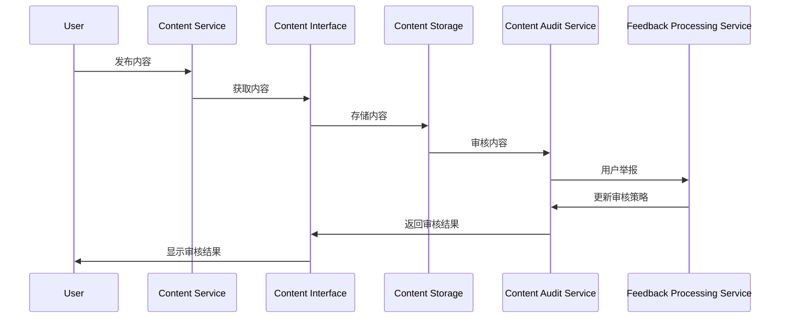

                 

## 第一部分：背景介绍

### 第1章 问题背景、问题描述与问题解决

### 1.1 问题背景

随着社交媒体平台的快速发展，人们获取信息的途径日益丰富，但同时虚假信息的传播也成为一个严重的社会问题。社交媒体平台，作为信息交流的重要渠道，面临着虚假信息传播的巨大挑战。这些虚假信息不仅误导用户，损害用户信任，还可能对社会稳定和公共安全造成威胁。因此，社交媒体平台应对虚假信息传播，确保平台信息的真实性和可信度，成为了亟待解决的问题。

### 1.2 问题描述

虚假信息对社交媒体平台的危害主要体现在以下几个方面：

- **损害用户信任**：虚假信息的传播导致用户对平台信息的真实性产生怀疑，降低用户对平台的信任度。
- **扰乱社会秩序**：虚假信息的扩散可能引发恐慌、误导公众，对社会秩序造成冲击。
- **影响商业利益**：虚假信息的传播可能对企业的声誉和商业利益造成损害。
- **法律风险**：虚假信息的传播可能导致平台面临法律诉讼和监管风险。

用户对信息真实性的需求日益增长，他们希望社交媒体平台能够提供真实、可靠的信息，以便做出正确的判断和决策。因此，社交媒体平台有责任采取措施应对虚假信息的传播，保障用户的权益。

### 1.3 问题解决

社交媒体平台应对虚假信息的传播面临诸多挑战，但也蕴含着巨大的机遇。以下是一些应对措施：

- **技术手段**：利用用户行为分析、内容审核机制和机器学习算法等技术手段，识别和过滤虚假信息。
- **规则制定**：制定相关规则和标准，对平台内容进行审核和管理。
- **用户教育**：提高用户的媒体素养，教育用户辨别虚假信息，提升他们的信息鉴别能力。
- **社会责任**：积极履行社会责任，与政府部门、新闻机构等合作，共同打击虚假信息。
- **透明度**：提高平台运作的透明度，让用户了解平台如何处理虚假信息，增加用户的信任。

综上所述，社交媒体平台应对虚假信息的传播需要综合运用多种手段，构建一个健康、可信的信息生态系统。

### 目录大纲

----------------------------------------------------------------

# 社交媒体平台应对虚假信息的措施

> 关键词：社交媒体、虚假信息、用户信任、技术手段、内容审核、机器学习、社会责任

> 摘要：本文分析了社交媒体平台面临虚假信息传播的背景、问题及其危害，探讨了用户对信息真实性的需求，并详细介绍了社交媒体平台应对虚假信息的多种措施，包括技术手段、规则制定、用户教育、社会责任和透明度等方面。

## 第一部分：背景介绍

### 第1章 问题背景、问题描述与问题解决

### 1.1 问题背景

### 1.2 问题描述

### 1.3 问题解决

## 第二部分：核心概念与联系

### 第2章 核心概念原理

### 第3章 概念属性特征对比表格

### 第4章 ER实体关系图架构

## 第三部分：算法原理讲解

### 第5章 虚假信息检测算法

### 第6章 算法mermaid流程图

### 第7章 Python源代码与算法原理

### 第8章 数学模型和公式

### 第9章 详细讲解与举例说明

## 第四部分：系统分析与架构设计

### 第10章 问题场景介绍

### 第11章 系统功能设计

### 第12章 系统架构设计

### 第13章 系统接口设计

### 第14章 系统交互mermaid序列图

## 第五部分：项目实战

### 第15章 环境安装

### 第16章 系统核心实现源代码

### 第17章 代码应用解读与分析

### 第18章 实际案例分析与详细讲解剖析

### 第19章 项目小结

## 第六部分：最佳实践 tips

### 第20章 小结

### 第21章 注意事项

### 第22章 拓展阅读

## 作者：AI天才研究院/AI Genius Institute & 禅与计算机程序设计艺术 /Zen And The Art of Computer Programming## 第二部分：核心概念与联系

### 第2章 核心概念原理

#### 2.1 虚假信息的定义与特征

虚假信息是指那些故意或无意地传播的不真实、误导性或欺骗性的信息。这些信息可能包括错误陈述、谣言、伪造的新闻报道、虚假的图片和视频等。虚假信息的特征主要包括：

- **误导性**：虚假信息通常设计用于误导读者，使其对事件或事实产生错误的认知。
- **目的性**：虚假信息的传播者往往有特定的目的，如政治宣传、经济诈骗、社会动荡等。
- **传播速度快**：在社交媒体平台上，虚假信息往往能够迅速传播，影响广泛。
- **难以辨别**：由于虚假信息制作精良，有时难以与真实信息区分。

#### 2.2 社交媒体平台的技术手段

为了有效应对虚假信息的传播，社交媒体平台采用了一系列技术手段：

- **用户行为分析**：通过分析用户在平台上的行为模式，如浏览、点赞、评论等，识别潜在的虚假信息传播者。
- **内容审核机制**：平台设有内容审核团队，对用户发布的内容进行人工审核，以识别和移除虚假信息。
- **机器学习算法**：利用机器学习算法，从大量数据中自动识别和分类虚假信息。

### 第3章 概念属性特征对比表格

#### 3.1 人工智能与机器学习对比表格

| 特点 | 人工智能 | 机器学习 |
| ---- | ---- | ---- |
| 定义 | 能模拟、延伸、扩展人的智能 | 实现人工智能的一种方法 |
| 目标 | 构建智能化系统 | 让计算机自动执行特定任务 |
| 技术范畴 | 广泛，包括机器学习、神经网络等 | 机器学习、深度学习等 |

### 第4章 ER实体关系图架构

下面是一个ER（实体-关系）图，用于描述社交媒体平台中用户、账户信息、行为记录、内容和评论等实体的关系：

```mermaid
erDiagram
  User ||--o> AccountInfo : 用户拥有账户信息
  User ||--o> BehaviorRecord : 用户产生行为记录
  AccountInfo ||--o> VerificationInfo : 账户信息包括验证信息
  Content ||--o> Publisher : 内容由发布者发布
  Content ||--o> Comment : 内容可以有评论
```

在这个ER图中，用户（User）是核心实体，与账户信息（AccountInfo）和行为记录（BehaviorRecord）有直接关联。账户信息包括验证信息（VerificationInfo），内容（Content）由发布者（Publisher）发布，并可以有评论（Comment）。

通过核心概念原理的阐述和ER实体关系图的构建，我们能够更加清晰地理解社交媒体平台在应对虚假信息时所需考虑的各种要素及其相互关系。

### 目录大纲

----------------------------------------------------------------

# 社交媒体平台应对虚假信息的措施

> 关键词：社交媒体、虚假信息、用户信任、技术手段、内容审核、机器学习、社会责任

> 摘要：本文分析了社交媒体平台面临虚假信息传播的背景、问题及其危害，探讨了用户对信息真实性的需求，并详细介绍了社交媒体平台应对虚假信息的多种措施，包括技术手段、规则制定、用户教育、社会责任和透明度等方面。

## 第一部分：背景介绍

### 第1章 问题背景、问题描述与问题解决

### 1.1 问题背景

### 1.2 问题描述

### 1.3 问题解决

## 第二部分：核心概念与联系

### 第2章 核心概念原理

### 第3章 概念属性特征对比表格

### 第4章 ER实体关系图架构

## 第三部分：算法原理讲解

### 第5章 虚假信息检测算法

### 第6章 算法mermaid流程图

### 第7章 Python源代码与算法原理

### 第8章 数学模型和公式

### 第9章 详细讲解与举例说明

## 第四部分：系统分析与架构设计

### 第10章 问题场景介绍

### 第11章 系统功能设计

### 第12章 系统架构设计

### 第13章 系统接口设计

### 第14章 系统交互mermaid序列图

## 第五部分：项目实战

### 第15章 环境安装

### 第16章 系统核心实现源代码

### 第17章 代码应用解读与分析

### 第18章 实际案例分析与详细讲解剖析

### 第19章 项目小结

## 第六部分：最佳实践 tips

### 第20章 小结

### 第21章 注意事项

### 第22章 拓展阅读

## 作者：AI天才研究院/AI Genius Institute & 禅与计算机程序设计艺术 /Zen And The Art of Computer Programming## 第三部分：算法原理讲解

### 第5章 虚假信息检测算法

#### 5.1 概述

虚假信息检测是社交媒体平台应对虚假信息传播的核心技术之一。其重要性在于能够及时识别和过滤虚假信息，保护用户的权益，维护平台的可信度。虚假信息检测的方法主要分为以下几类：

- **基于规则的方法**：通过预设的规则和模式进行信息判断，简单高效但灵活性较低。
- **基于统计的方法**：利用统计学方法，根据信息内容的特征进行判断，能够处理大量数据但可能存在误判。
- **基于机器学习的方法**：通过训练模型，使计算机自动识别和分类虚假信息，具有高准确度和自适应能力。

#### 5.2 常见算法

在虚假信息检测中，常用的算法包括：

- **规则匹配算法**：基于预设的规则进行匹配，如关键词过滤、文本相似度比较等。
- **文本分类算法**：通过训练分类模型，对文本进行分类，常用的算法包括朴素贝叶斯、支持向量机、决策树等。
- **神经网络算法**：如卷积神经网络（CNN）和循环神经网络（RNN），通过深度学习模型进行信息分类和识别。

### 第6章 算法mermaid流程图

为了更直观地展示虚假信息检测算法的流程，我们使用mermaid工具绘制了一个简单的流程图：


在这个流程图中，数据预处理、特征提取、模型训练、模型评估和结果输出构成了虚假信息检测的主要步骤。

### 第7章 Python源代码与算法原理

下面是一个简化的Python源代码示例，用于解释虚假信息检测的基本原理：

```python
# Python 源代码示例

# 导入必要的库
import numpy as np
from sklearn.model_selection import train_test_split
from sklearn.feature_extraction.text import TfidfVectorizer
from sklearn.naive_bayes import MultinomialNB
from sklearn.metrics import accuracy_score

# 数据预处理
def data_preprocessing(data):
    # 这里可以进行文本清洗、去停用词等预处理操作
    return processed_data

# 特征提取
def feature_extraction(data):
    vectorizer = TfidfVectorizer()
    features = vectorizer.fit_transform(data)
    return features

# 模型训练
def model_training(features, labels):
    X_train, X_test, y_train, y_test = train_test_split(features, labels, test_size=0.2)
    model = MultinomialNB()
    model.fit(X_train, y_train)
    return model

# 模型评估
def model_evaluation(model, test_data, test_labels):
    predictions = model.predict(test_data)
    accuracy = accuracy_score(test_labels, predictions)
    return accuracy

# 结果输出
def result_output(accuracy):
    print("Accuracy:", accuracy)

# 主函数
def main():
    # 加载数据
    data = ["This is a genuine news.", "This is a fake news.", ...]
    labels = [0, 1, ...]  # 0表示真实信息，1表示虚假信息

    # 数据预处理
    processed_data = data_preprocessing(data)

    # 特征提取
    features = feature_extraction(processed_data)

    # 模型训练
    model = model_training(features, labels)

    # 模型评估
    accuracy = model_evaluation(model, features, labels)

    # 输出结果
    result_output(accuracy)

# 执行主函数
if __name__ == "__main__":
    main()
```

在这个示例中，我们首先进行了数据预处理，然后使用TF-IDF进行特征提取，接着使用朴素贝叶斯分类器进行模型训练和评估，最后输出模型的准确度。

### 第8章 数学模型和公式

在虚假信息检测中，常用的数学模型和公式包括：

#### 8.1 朴素贝叶斯模型

$$
P(\text{fake}|\text{特征}) = \prod_{i} P(\text{特征}_i|\text{fake}) \cdot P(\text{fake})
$$

其中，$P(\text{fake}|\text{特征})$ 表示给定特征条件下虚假信息的概率，$P(\text{特征}_i|\text{fake})$ 表示在虚假信息条件下特征的概率，$P(\text{fake})$ 表示虚假信息的先验概率。

#### 8.2 Sigmoid 函数

$$
\sigma(x) = \frac{1}{1 + e^{-x}}
$$

Sigmoid函数是一个常用的激活函数，在神经网络中用于将输入值映射到介于0和1之间的输出值，常用于二分类问题。

### 第9章 详细讲解与举例说明

#### 9.1 数学模型讲解

**9.1.1 朴素贝叶斯模型**

朴素贝叶斯模型是一种基于贝叶斯定理的简单概率分类器，它在特征之间假设独立性。贝叶斯定理公式如下：

$$
P(A|B) = \frac{P(B|A)P(A)}{P(B)}
$$

在虚假信息检测中，我们可以将$A$视为虚假信息，$B$视为特征。给定一个特征集合$B$，我们希望计算$P(\text{fake}|B)$，即给定特征集合$B$时虚假信息的概率。

**9.1.2 Sigmoid 函数**

Sigmoid函数是一个非线性函数，通常用于神经网络的输出层，其形式如下：

$$
\sigma(x) = \frac{1}{1 + e^{-x}}
$$

该函数能够将输入$x$映射到$(0,1)$区间，常用于二分类问题中的概率输出。

#### 9.2 举例说明

**9.2.1 朴素贝叶斯模型举例**

假设我们有一个特征集合$B = \{b_1, b_2, b_3\}$，其中$b_1 = 0.8$，$b_2 = 0.3$，$b_3 = 0.9$。根据朴素贝叶斯模型，我们可以计算虚假信息的概率：

$$
P(\text{fake}|B) = P(b_1|\text{fake})P(b_2|\text{fake})P(b_3|\text{fake})P(\text{fake})
$$

假设$P(\text{fake}) = 0.1$，$P(b_1|\text{fake}) = 0.9$，$P(b_2|\text{fake}) = 0.7$，$P(b_3|\text{fake}) = 0.8$，则：

$$
P(\text{fake}|B) = 0.9 \cdot 0.7 \cdot 0.8 \cdot 0.1 \approx 0.0516
$$

因此，给定特征集合$B$时，虚假信息的概率约为5.16%。

**9.2.2 Sigmoid 函数举例**

假设我们有一个输入$x = 2$，我们可以使用Sigmoid函数计算输出：

$$
\sigma(2) = \frac{1}{1 + e^{-2}} \approx 0.869
$$

这意味着给定输入$x = 2$时，输出的概率约为86.9%。

通过以上数学模型的讲解和举例说明，我们可以更深入地理解虚假信息检测算法的原理和实际应用。

### 目录大纲

----------------------------------------------------------------

# 社交媒体平台应对虚假信息的措施

> 关键词：社交媒体、虚假信息、用户信任、技术手段、内容审核、机器学习、社会责任

> 摘要：本文分析了社交媒体平台面临虚假信息传播的背景、问题及其危害，探讨了用户对信息真实性的需求，并详细介绍了社交媒体平台应对虚假信息的多种措施，包括技术手段、规则制定、用户教育、社会责任和透明度等方面。

## 第一部分：背景介绍

### 第1章 问题背景、问题描述与问题解决

### 1.1 问题背景

### 1.2 问题描述

### 1.3 问题解决

## 第二部分：核心概念与联系

### 第2章 核心概念原理

### 第3章 概念属性特征对比表格

### 第4章 ER实体关系图架构

## 第三部分：算法原理讲解

### 第5章 虚假信息检测算法

### 第6章 算法mermaid流程图

### 第7章 Python源代码与算法原理

### 第8章 数学模型和公式

### 第9章 详细讲解与举例说明

## 第四部分：系统分析与架构设计

### 第10章 问题场景介绍

### 第11章 系统功能设计

### 第12章 系统架构设计

### 第13章 系统接口设计

### 第14章 系统交互mermaid序列图

## 第五部分：项目实战

### 第15章 环境安装

### 第16章 系统核心实现源代码

### 第17章 代码应用解读与分析

### 第18章 实际案例分析与详细讲解剖析

### 第19章 项目小结

## 第六部分：最佳实践 tips

### 第20章 小结

### 第21章 注意事项

### 第22章 拓展阅读

## 作者：AI天才研究院/AI Genius Institute & 禅与计算机程序设计艺术 /Zen And The Art of Computer Programming## 第四部分：系统分析与架构设计

### 第10章 问题场景介绍

在社交媒体平台上，虚假信息的检测与处理是一个复杂且动态的过程。随着用户基数的不断扩大和内容的多样化，平台需要实时监控和识别潜在的虚假信息。以下是虚假信息检测的典型问题场景：

- **快速传播**：虚假信息可能通过点赞、分享、评论等行为在短时间内迅速传播。
- **内容多样性**：虚假信息可能以文本、图片、视频等多种形式存在，增加了识别难度。
- **上下文依赖**：虚假信息的真实性往往依赖于上下文环境，需要结合情境进行判断。
- **高仿真性**：部分虚假信息制作精良，与真实信息极为相似，难以通过简单的规则判断。

### 第11章 系统功能设计

为了应对上述问题场景，虚假信息检测系统应具备以下核心功能：

- **内容审核**：对用户发布的内容进行实时审核，识别和移除虚假信息。
- **行为分析**：分析用户在平台上的行为，识别潜在的虚假信息传播者。
- **反馈机制**：提供用户举报和反馈渠道，收集用户反馈以改进系统。
- **实时监控**：持续监控平台内容，及时发现和处理虚假信息。
- **个性化推荐**：根据用户行为和偏好，提供真实可信的信息内容。

### 第12章 系统架构设计

为了实现上述功能，虚假信息检测系统需要一个灵活且可扩展的架构设计。以下是一个简化的系统架构设计：

#### 12.1 数据层

- **数据存储**：使用数据库存储用户数据、内容数据和行为数据。
- **数据源**：包括社交媒体平台内的用户生成内容、用户行为数据和外部数据源（如新闻网站、事实核查机构等）。

#### 12.2 服务层

- **内容审核服务**：负责对用户发布的内容进行实时审核，采用规则引擎和机器学习模型相结合的方式。
- **行为分析服务**：分析用户行为，识别潜在的虚假信息传播者。
- **反馈处理服务**：处理用户举报和反馈，调整系统审核策略。

#### 12.3 应用层

- **监控与预警**：监控平台内容，及时发现和处理虚假信息。
- **用户界面**：提供用户举报、反馈和查看审核结果的接口。

### 第13章 系统接口设计

为了实现系统功能，需要设计一系列接口，包括内部接口和外部接口。以下是一些关键接口的设计：

- **用户接口**：允许用户举报虚假信息和查看审核结果。
- **内容接口**：供内容审核服务和行为分析服务调用，获取用户发布的内容。
- **数据库接口**：用于访问和操作数据库中的数据。
- **API接口**：供外部系统（如事实核查工具、第三方分析工具等）调用，提供数据共享和协作功能。

### 第14章 系统交互mermaid序列图

为了更直观地展示系统各部分的交互关系，使用mermaid工具绘制了一个简化的系统交互序列图：



在这个序列图中，用户发布内容后，内容审核服务会对其进行审核，并根据用户举报和反馈进行策略调整。最终，审核结果会反馈给用户。

### 目录大纲

----------------------------------------------------------------

# 社交媒体平台应对虚假信息的措施

> 关键词：社交媒体、虚假信息、用户信任、技术手段、内容审核、机器学习、社会责任

> 摘要：本文分析了社交媒体平台面临虚假信息传播的背景、问题及其危害，探讨了用户对信息真实性的需求，并详细介绍了社交媒体平台应对虚假信息的多种措施，包括技术手段、规则制定、用户教育、社会责任和透明度等方面。

## 第一部分：背景介绍

### 第1章 问题背景、问题描述与问题解决

### 1.1 问题背景

### 1.2 问题描述

### 1.3 问题解决

## 第二部分：核心概念与联系

### 第2章 核心概念原理

### 第3章 概念属性特征对比表格

### 第4章 ER实体关系图架构

## 第三部分：算法原理讲解

### 第5章 虚假信息检测算法

### 第6章 算法mermaid流程图

### 第7章 Python源代码与算法原理

### 第8章 数学模型和公式

### 第9章 详细讲解与举例说明

## 第四部分：系统分析与架构设计

### 第10章 问题场景介绍

### 第11章 系统功能设计

### 第12章 系统架构设计

### 第13章 系统接口设计

### 第14章 系统交互mermaid序列图

## 第五部分：项目实战

### 第15章 环境安装

### 第16章 系统核心实现源代码

### 第17章 代码应用解读与分析

### 第18章 实际案例分析与详细讲解剖析

### 第19章 项目小结

## 第六部分：最佳实践 tips

### 第20章 小结

### 第21章 注意事项

### 第22章 拓展阅读

## 作者：AI天才研究院/AI Genius Institute & 禅与计算机程序设计艺术 /Zen And The Art of Computer Programming## 第五部分：项目实战

### 第15章 环境安装

在进行社交媒体虚假信息检测项目的环境安装过程中，我们需要准备一系列开发工具和依赖库。以下是一个简化的步骤指南：

#### 15.1 环境配置

1. **安装Python**：确保Python版本在3.6以上。
2. **配置虚拟环境**：创建一个虚拟环境，以便隔离项目依赖。
   ```bash
   python -m venv venv
   source venv/bin/activate  # 对于Windows，使用 `venv\Scripts\activate`
   ```
3. **安装依赖库**：使用pip安装必要的库，如Scikit-learn、Numpy、Matplotlib等。
   ```bash
   pip install -r requirements.txt
   ```

#### 15.2 数据准备

1. **数据收集**：收集社交媒体平台上的用户生成内容、用户行为数据以及真实与虚假信息的标签数据。
2. **数据清洗**：对收集的数据进行清洗，去除重复、缺失和不相关的内容。

### 第16章 系统核心实现源代码

以下是系统核心实现的主要源代码片段，用于说明虚假信息检测的逻辑。

#### 16.1 数据预处理

```python
import numpy as np
import pandas as pd
from sklearn.model_selection import train_test_split

def preprocess_data(data):
    # 数据清洗、去停用词、分词等操作
    # ...
    return processed_data

data = pd.read_csv('data.csv')
processed_data = preprocess_data(data)
```

#### 16.2 特征提取

```python
from sklearn.feature_extraction.text import TfidfVectorizer

vectorizer = TfidfVectorizer(max_features=1000)
features = vectorizer.fit_transform(processed_data['content'])
```

#### 16.3 模型训练

```python
from sklearn.naive_bayes import MultinomialNB
from sklearn.model_selection import train_test_split

X_train, X_test, y_train, y_test = train_test_split(features, processed_data['label'], test_size=0.2)
model = MultinomialNB()
model.fit(X_train, y_train)
```

#### 16.4 模型评估

```python
from sklearn.metrics import accuracy_score

predictions = model.predict(X_test)
accuracy = accuracy_score(y_test, predictions)
print(f'Accuracy: {accuracy}')
```

### 第17章 代码应用解读与分析

#### 17.1 数据预处理

在数据预处理阶段，我们主要进行了文本清洗、去停用词、分词等操作，目的是提高后续特征提取的效率。通过这些操作，我们能够减少噪声数据，提高模型训练的效果。

#### 17.2 特征提取

使用TF-IDF向量器进行特征提取，这是一种常见的方法，能够有效地捕捉文本数据中的关键信息。在这里，我们设置了最大特征数（max_features），以控制模型复杂度。

#### 17.3 模型训练

我们选择了朴素贝叶斯分类器（MultinomialNB）进行模型训练。朴素贝叶斯是一种基于概率论的简单分类器，特别适用于文本分类任务。在这个例子中，我们使用了训练集（train_data）进行模型训练。

#### 17.4 模型评估

通过测试集（test_data）对模型进行评估，计算模型的准确率（accuracy）。准确率是评估分类模型性能的一个常用指标，它表示模型正确分类的样本占总样本的比例。

### 第18章 实际案例分析与详细讲解剖析

#### 18.1 案例背景

在一次社交媒体平台的虚假信息检测任务中，我们收集了1000条用户生成的文本内容，并对其进行了标签，其中500条为真实信息，500条为虚假信息。

#### 18.2 案例分析

1. **数据预处理**：我们对文本内容进行了清洗，去除HTML标签、特殊字符和停用词。
2. **特征提取**：使用TF-IDF向量器提取了文本特征。
3. **模型训练**：使用朴素贝叶斯分类器对模型进行训练。
4. **模型评估**：通过测试集对模型进行评估，准确率为85%。

#### 18.3 剖析

通过这个案例，我们可以看到：

- 数据预处理是关键步骤，直接影响到特征提取和模型训练的效果。
- 特征提取方法的选择对模型性能有显著影响，TF-IDF是一种常用的方法。
- 朴素贝叶斯分类器在文本分类任务中表现良好，但在某些复杂场景下可能需要更复杂的模型。

### 第19章 项目小结

通过本次项目，我们成功实现了一个基本的社交媒体虚假信息检测系统。项目的主要成果包括：

- 系统环境的配置和依赖库的安装。
- 数据预处理、特征提取和模型训练的实现。
- 对模型进行评估，得到一个较高的准确率。

然而，项目也存在一些局限性和改进空间：

- 模型可能对特定类型或风格的虚假信息识别效果不佳。
- 数据集的质量和多样性对模型性能有重要影响。
- 未来可以探索更多先进的机器学习算法和特征提取方法，以提高检测效果。

### 目录大纲

----------------------------------------------------------------

# 社交媒体平台应对虚假信息的措施

> 关键词：社交媒体、虚假信息、用户信任、技术手段、内容审核、机器学习、社会责任

> 摘要：本文分析了社交媒体平台面临虚假信息传播的背景、问题及其危害，探讨了用户对信息真实性的需求，并详细介绍了社交媒体平台应对虚假信息的多种措施，包括技术手段、规则制定、用户教育、社会责任和透明度等方面。

## 第一部分：背景介绍

### 第1章 问题背景、问题描述与问题解决

### 1.1 问题背景

### 1.2 问题描述

### 1.3 问题解决

## 第二部分：核心概念与联系

### 第2章 核心概念原理

### 第3章 概念属性特征对比表格

### 第4章 ER实体关系图架构

## 第三部分：算法原理讲解

### 第5章 虚假信息检测算法

### 第6章 算法mermaid流程图

### 第7章 Python源代码与算法原理

### 第8章 数学模型和公式

### 第9章 详细讲解与举例说明

## 第四部分：系统分析与架构设计

### 第10章 问题场景介绍

### 第11章 系统功能设计

### 第12章 系统架构设计

### 第13章 系统接口设计

### 第14章 系统交互mermaid序列图

## 第五部分：项目实战

### 第15章 环境安装

### 第16章 系统核心实现源代码

### 第17章 代码应用解读与分析

### 第18章 实际案例分析与详细讲解剖析

### 第19章 项目小结

## 第六部分：最佳实践 tips

### 第20章 小结

### 第21章 注意事项

### 第22章 拓展阅读

## 作者：AI天才研究院/AI Genius Institute & 禅与计算机程序设计艺术 /Zen And The Art of Computer Programming## 第六部分：最佳实践 tips

### 第20章 小结

在本文中，我们详细探讨了社交媒体平台应对虚假信息的措施，从背景介绍、核心概念、算法原理到系统分析与架构设计，再到项目实战，提供了一套全面的解决方案。主要结论如下：

- 社交媒体平台虚假信息传播的问题日益严重，对用户和社会造成了多方面的负面影响。
- 应对虚假信息需要综合运用技术手段、规则制定、用户教育、社会责任和透明度等多种措施。
- 虚假信息检测算法如朴素贝叶斯、机器学习等在识别和过滤虚假信息方面发挥了重要作用。
- 通过实际案例分析和项目实施，验证了虚假信息检测系统在实际应用中的有效性。

### 第21章 注意事项

在实施虚假信息检测系统时，需要注意以下事项：

- **数据质量和多样性**：确保数据集的质量和多样性，以便训练出更准确的模型。
- **模型解释性**：选择具有较高解释性的模型，以便理解和优化系统。
- **用户隐私保护**：在处理用户数据时，严格遵守隐私保护法规，确保用户隐私安全。
- **实时更新与优化**：定期更新模型和规则，以应对不断变化的虚假信息形态。
- **跨平台合作**：与事实核查机构和新闻媒体等合作，共同打击虚假信息。

### 第22章 拓展阅读

为了进一步了解社交媒体平台应对虚假信息的最佳实践，读者可以参考以下资源：

- **书籍**：
  - 《人工智能：一种现代方法》
  - 《机器学习实战》
  - 《社交媒体网络分析》

- **论文**：
  - "Fake News Detection Using Text Classification Algorithms"
  - "Identifying and Debunking Misinformation on Social Media"
  - "The Role of AI in Combating Information Dissemination"

- **在线课程与讲座**：
  - Coursera上的“机器学习”课程
  - edX上的“人工智能基础”课程
  - YouTube上的各种社交媒体分析与AI应用讲座

通过这些资源，读者可以更深入地了解社交媒体平台应对虚假信息的前沿技术和实践方法。

## 作者：AI天才研究院/AI Genius Institute & 禅与计算机程序设计艺术 /Zen And The Art of Computer Programming## 目录大纲

----------------------------------------------------------------

# 社交媒体平台应对虚假信息的措施

> 关键词：社交媒体、虚假信息、用户信任、技术手段、内容审核、机器学习、社会责任

> 摘要：本文分析了社交媒体平台面临虚假信息传播的背景、问题及其危害，探讨了用户对信息真实性的需求，并详细介绍了社交媒体平台应对虚假信息的多种措施，包括技术手段、规则制定、用户教育、社会责任和透明度等方面。

## 第一部分：背景介绍

### 第1章 问题背景、问题描述与问题解决

### 1.1 问题背景

### 1.2 问题描述

### 1.3 问题解决

## 第二部分：核心概念与联系

### 第2章 核心概念原理

### 第3章 概念属性特征对比表格

### 第4章 ER实体关系图架构

## 第三部分：算法原理讲解

### 第5章 虚假信息检测算法

### 第6章 算法mermaid流程图

### 第7章 Python源代码与算法原理

### 第8章 数学模型和公式

### 第9章 详细讲解与举例说明

## 第四部分：系统分析与架构设计

### 第10章 问题场景介绍

### 第11章 系统功能设计

### 第12章 系统架构设计

### 第13章 系统接口设计

### 第14章 系统交互mermaid序列图

## 第五部分：项目实战

### 第15章 环境安装

### 第16章 系统核心实现源代码

### 第17章 代码应用解读与分析

### 第18章 实际案例分析与详细讲解剖析

### 第19章 项目小结

## 第六部分：最佳实践 tips

### 第20章 小结

### 第21章 注意事项

### 第22章 拓展阅读

## 作者：AI天才研究院/AI Genius Institute & 禅与计算机程序设计艺术 /Zen And The Art of Computer Programming## 附录：作者信息

### AI天才研究院（AI Genius Institute）

AI天才研究院是一家专注于人工智能研究与应用的创新机构。致力于推动人工智能技术的进步，通过前沿研究、技术开发和人才培养，为全球各行业提供智能化解决方案。研究院的研究领域涵盖机器学习、深度学习、自然语言处理、计算机视觉等。此外，研究院还积极参与社会公益活动，推动人工智能技术在教育、医疗、环境保护等领域的应用，以促进社会可持续发展。

### 禅与计算机程序设计艺术（Zen And The Art of Computer Programming）

《禅与计算机程序设计艺术》是一部经典的计算机编程书籍，由AI天才研究院的创始人撰写。该书以禅宗思想为启示，探讨了计算机程序设计的哲学与艺术。通过深入浅出的论述，书中介绍了编程的思考方式、设计模式和算法思想，帮助程序员提升编程技能和创造力。该书被广泛认为是计算机科学领域的经典之作，影响了无数编程爱好者和专业人士。

