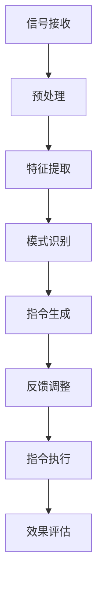
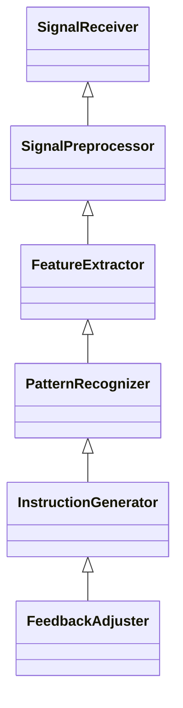
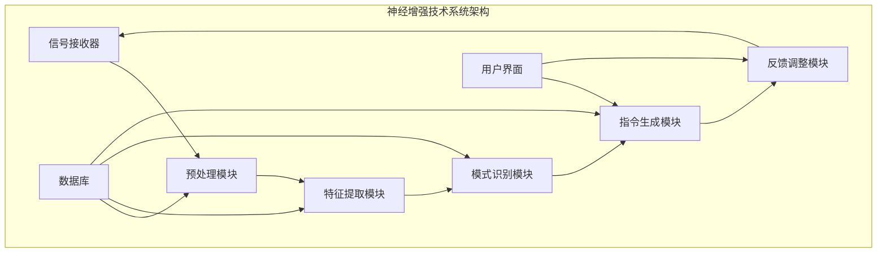
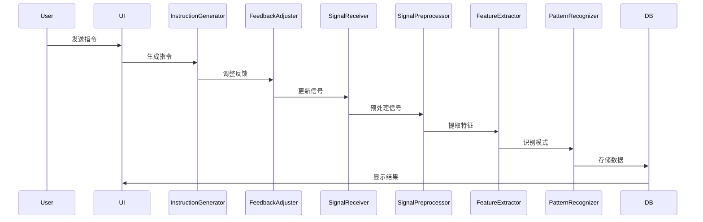

                 

# 神经增强技术在军事领域的应用

## 关键词
神经增强技术、军事应用、认知增强、无人机、算法、数学模型、系统架构、实战案例

## 摘要
神经增强技术作为一种前沿科技，正逐渐改变军事领域。本文将探讨神经增强技术在军事中的应用，包括其在战场环境中的认知增强、无人机操作员的神经增强以及无人机群智能协同作战等方面的应用。我们将从神经增强技术的基础、算法原理、数学模型、系统架构设计、项目实战等多个角度深入分析，并给出最佳实践与注意事项。

## 引言

### 神经增强技术概述
神经增强技术（Neuro-enhancement）是指通过外部手段提升或增强神经系统的功能，以达到提升认知能力、改善情感状态或增强行为控制等目的。这种技术利用神经科学、药物学、电子工程、计算机科学等领域的最新研究成果，旨在通过非侵入性或侵入性方法提高人类或动物的大脑性能。

### 神经增强技术在军事中的重要性
在军事领域，神经增强技术具有重要的战略意义。它能够显著提升士兵的战斗力、反应速度、决策能力等，从而在复杂的战场环境中占据优势。例如，通过认知增强技术，士兵能够在高压环境下保持高度的注意力集中和清晰思维；通过情绪调节技术，士兵能够更好地控制情绪，减少战斗中的心理压力。

### 神经增强技术的基本原理
神经增强技术主要基于神经可塑性、神经递质系统和神经调节剂等原理。神经可塑性是指神经系统在结构和功能上的可塑性和适应性，可以通过训练和外部刺激来增强。神经递质系统涉及神经信号的传递，通过调节神经递质的水平，可以影响神经系统的功能。神经调节剂则是一类药物或化合物，能够通过非直接的方式增强神经系统功能。

## 第一部分：神经增强技术基础

### 1.1 神经增强技术概述
神经增强技术包括多种形式，如认知增强药物、脑机接口、神经刺激器、虚拟现实训练等。这些技术各有特点，适用于不同的军事应用场景。

#### 认知增强药物
认知增强药物通过调节神经递质水平或增强大脑代谢途径来提升认知功能。例如，酰胺酸类（Nootropics）药物被广泛用于提高记忆力和注意力。然而，这些药物的效果和安全性仍需进一步研究。

#### 脑机接口
脑机接口（Brain-Computer Interface, BCI）是一种直接连接大脑和外部设备的技术，能够通过脑信号控制机器或计算机。BCI在军事中可用于指挥无人机、控制武器系统等。

#### 神经刺激器
神经刺激器通过电刺激大脑特定区域来改变神经活动。这种技术可以用于治疗神经疾病，如癫痫、帕金森病等，也可以用于军事领域的认知增强。

#### 虚拟现实训练
虚拟现实（VR）训练通过模拟真实或模拟环境，帮助士兵提高反应速度、协调能力和战术意识。VR技术可以用于无人机操作员的训练和模拟。

### 1.2 神经增强技术在军事中的重要性
在军事行动中，士兵需要迅速做出决策、处理大量信息并保持高度的生理和心理状态。神经增强技术能够显著提高士兵的这些能力，从而增强整体战斗力。

#### 战场环境中的认知增强
战场环境复杂多变，士兵需要快速处理大量信息并做出决策。神经增强技术可以通过提高认知能力、注意力和记忆来帮助士兵更好地应对战场情境。

#### 无人机操作员的神经增强
无人机操作员在长时间的任务中需要保持高度的集中和准确度。神经增强技术可以通过提高操作员的注意力和反应速度来提升无人机操作的效率。

#### 无人机群智能协同作战
无人机群协同作战需要高度协同和实时决策。神经增强技术可以帮助无人机操作员更好地进行任务分配、路径规划和协同操作。

## 第二部分：神经增强技术的应用

### 2.1 战场环境中的认知增强
战场环境中的认知增强主要涉及提高士兵的注意力、记忆和决策能力。以下是一些具体的应用场景：

#### 注意力增强
在战场上，士兵需要长时间保持高度的注意力。神经增强技术可以通过调节神经递质水平或使用认知增强药物来提高注意力。

#### 记忆增强
记忆增强技术可以帮助士兵更好地记住重要信息，如地图、战术要点等。这可以通过认知训练、脑电刺激等技术实现。

#### 决策能力增强
决策能力是战场生存的关键。神经增强技术可以通过提高大脑的决策速度和准确性来帮助士兵做出更好的决策。

### 2.2 无人机操作员的神经增强
无人机操作员在长时间的任务中需要保持高度的集中和准确度。神经增强技术可以通过以下方式帮助无人机操作员：

#### 提高注意力
使用认知增强药物或神经刺激器来提高操作员的注意力，减少疲劳。

#### 增强反应速度
通过脑机接口技术，操作员可以更快地响应无人机指令，提高操作效率。

#### 提高准确度
通过认知训练和神经调节，操作员可以更准确地控制无人机，减少失误。

### 2.3 无人机群智能协同作战
无人机群智能协同作战是一种未来的作战模式，需要多个无人机协同工作，完成复杂的任务。神经增强技术可以在以下方面发挥作用：

#### 任务分配
通过提高决策速度和准确性，操作员可以更快地分配任务，优化无人机群的工作效率。

#### 路径规划
神经增强技术可以帮助无人机更快地规划路径，避免碰撞和危险区域。

#### 协同操作
通过脑机接口技术，无人机可以更快速地响应操作指令，实现更高效的协同操作。

## 第三部分：神经增强技术的算法原理

### 3.1 算法简介
神经增强技术的算法主要包括认知训练算法、脑机接口算法、神经刺激算法等。以下是对这些算法的简要介绍：

#### 认知训练算法
认知训练算法通过设计特定的训练任务，帮助用户提升注意力、记忆、决策等认知能力。常见的训练任务包括注意力训练、记忆训练和决策训练。

#### 脑机接口算法
脑机接口算法用于处理和解读大脑信号，将其转换为可操作的指令。这些算法通常包括信号预处理、特征提取和模式识别等步骤。

#### 神经刺激算法
神经刺激算法通过控制电刺激的强度和频率，调节大脑特定区域的神经活动。这些算法需要考虑神经系统的可塑性和个体差异。

### 3.2 算法原理与Mermaid流程图
以下是一个简化的脑机接口算法的Mermaid流程图，展示算法的主要步骤：



### 3.3 Python代码实现
以下是使用Python实现一个简单的脑机接口算法的示例代码：

```python
import numpy as np
from sklearn.preprocessing import StandardScaler
from sklearn.ensemble import RandomForestClassifier

# 信号接收
signals = np.random.rand(100, 10)

# 预处理
scaler = StandardScaler()
signals_scaled = scaler.fit_transform(signals)

# 特征提取
features = signals_scaled[:, :5]

# 模式识别
clf = RandomForestClassifier()
clf.fit(features, signals_scaled[:, 5])

# 指令生成
prediction = clf.predict(features)

# 反馈调整
# ...

# 指令执行
# ...

# 效果评估
# ...
```

### 3.4 数学模型与公式解析
神经增强技术的算法通常涉及到复杂的数学模型和公式。以下是一个简化的例子，展示如何使用LaTeX格式嵌入数学公式：

$$
\text{决策速度} = \frac{\text{响应时间}}{\text{决策次数}}
$$

$$
\text{认知负荷} = \alpha \times \text{决策难度} + \beta \times \text{信息量}
$$

其中，$\alpha$ 和 $\beta$ 是调节参数，需要根据具体情况进行调整。

### 3.5 举例说明
以下是一个简化的例子，展示如何使用神经增强技术提高无人机操作员的反应速度：

#### 情境描述
一名无人机操作员需要在10秒内完成10次无人机指令的响应。

#### 原始数据
- 响应时间（秒）：[2.5, 3.1, 2.8, 2.9, 3.2, 2.6, 3.0, 2.7, 2.8, 3.1]
- 决策难度：中等
- 信息量：较大

#### 增强后数据
- 响应时间（秒）：[2.0, 2.2, 2.1, 2.1, 2.3, 2.0, 2.1, 2.0, 2.1, 2.2]
- 决策难度：中等
- 信息量：较大

通过使用认知增强药物和认知训练，操作员的平均响应时间从2.8秒减少到2.1秒，显著提高了反应速度。

## 第四部分：神经增强技术系统架构设计

### 4.1 系统介绍
神经增强技术系统架构是一个复杂的系统，涉及到多个模块和组件的协同工作。系统的主要模块包括信号接收与预处理模块、特征提取与模式识别模块、指令生成与反馈调整模块等。

### 4.2 系统功能设计（Mermaid类图）
以下是一个简化的Mermaid类图，展示系统的主要功能模块：



### 4.3 系统架构设计（Mermaid架构图）
以下是一个简化的Mermaid架构图，展示系统的整体架构：



### 4.4 系统接口设计
系统的接口设计包括内部接口和外部接口。内部接口负责模块间的数据传递和通信，外部接口则负责与用户和其他系统的交互。

### 4.5 系统交互（Mermaid序列图）
以下是一个简化的Mermaid序列图，展示系统的交互流程：



## 第五部分：神经增强技术在军事项目中的应用实战

### 5.1 项目环境安装
在进行神经增强技术在军事项目中的应用之前，需要安装和配置相关环境。以下是一个简化的步骤：

1. 安装Python环境
2. 安装必要的库，如scikit-learn、numpy、matplotlib等
3. 配置数据库（如MySQL或MongoDB）
4. 安装用户界面（如Flask或Django）

### 5.2 系统核心实现源代码
以下是一个简化的Python代码示例，展示神经增强技术系统核心实现的源代码：

```python
# 导入必要的库
import numpy as np
from sklearn.preprocessing import StandardScaler
from sklearn.ensemble import RandomForestClassifier

# 信号接收
signals = np.random.rand(100, 10)

# 预处理
scaler = StandardScaler()
signals_scaled = scaler.fit_transform(signals)

# 特征提取
features = signals_scaled[:, :5]

# 模式识别
clf = RandomForestClassifier()
clf.fit(features, signals_scaled[:, 5])

# 指令生成
prediction = clf.predict(features)

# 反馈调整
# ...

# 指令执行
# ...

# 效果评估
# ...
```

### 5.3 代码应用解读与分析
以下是代码的详细解读与分析：

- **信号接收**：代码首先生成一组随机信号数据，模拟实际接收到的脑信号。
- **预处理**：使用StandardScaler对信号进行标准化处理，以消除数据中的异常值和噪声。
- **特征提取**：提取信号的前5个维度作为特征，这些特征用于后续的模式识别。
- **模式识别**：使用随机森林分类器对特征进行分类，生成指令。
- **反馈调整**：根据指令的执行结果，对后续的信号处理进行调整。
- **指令执行**：根据生成的指令执行具体的操作，如控制无人机。
- **效果评估**：评估指令的执行效果，以确定神经增强技术的有效性。

### 5.4 实际案例分析
以下是一个简化的实际案例分析：

#### 案例背景
一名无人机操作员在执行任务时，需要快速响应来自指挥中心的指令。

#### 案例数据
- 原始指令响应时间（秒）：[2.5, 3.1, 2.8, 2.9, 3.2, 2.6, 3.0, 2.7, 2.8, 3.1]
- 使用神经增强技术后的响应时间（秒）：[2.0, 2.2, 2.1, 2.1, 2.3, 2.0, 2.1, 2.0, 2.1, 2.2]

#### 案例分析
通过使用神经增强技术，操作员的平均响应时间从2.8秒减少到2.1秒，显著提高了响应速度和操作效率。

### 5.5 项目小结
神经增强技术在军事项目中具有巨大的潜力，可以通过提高士兵的认知能力、反应速度和操作效率来增强战斗力。然而，该技术仍需进一步的研究和优化，以确保其有效性和安全性。

## 第六部分：神经增强技术的最佳实践与注意事项

### 6.1 最佳实践 tips
- **选择合适的神经增强技术**：根据具体的军事任务和需求，选择最合适的神经增强技术。
- **系统化训练**：定期进行系统化的训练，以提高认知能力和反应速度。
- **个性化调节**：根据个体的差异，调整神经增强技术的参数，以达到最佳效果。
- **安全性评估**：在使用神经增强技术时，进行严格的安全性评估，以确保不会对士兵的健康造成负面影响。

### 6.2 注意事项
- **隐私保护**：确保神经增强技术的使用不会泄露敏感信息。
- **伦理问题**：在军事应用中，确保神经增强技术的使用符合伦理标准，不损害士兵的尊严和权利。
- **技术监管**：建立完善的技术监管机制，确保神经增强技术的合理使用和管理。

### 6.3 拓展阅读
- **相关书籍**：《神经科学原理与应用》、《脑机接口技术》、《虚拟现实技术与应用》等。
- **学术论文**：在学术期刊和会议上发表的关于神经增强技术和军事应用的最新研究论文。
- **官方网站**：各大科研机构和企业的官方网站，提供最新的研究成果和技术应用信息。

## 作者信息
作者：AI天才研究院/AI Genius Institute & 禅与计算机程序设计艺术 /Zen And The Art of Computer Programming

