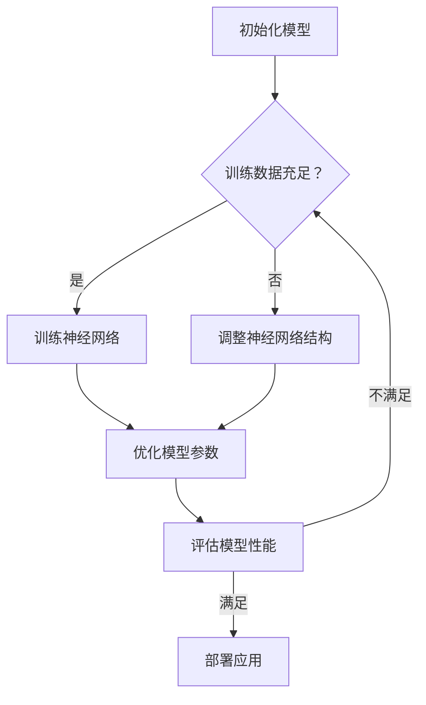
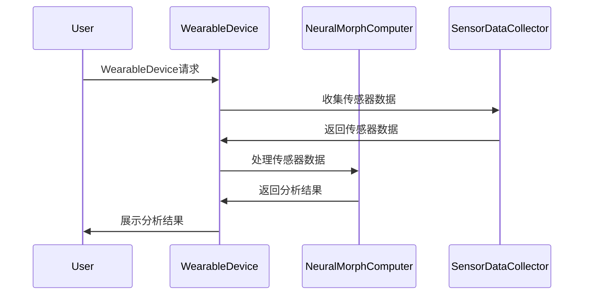
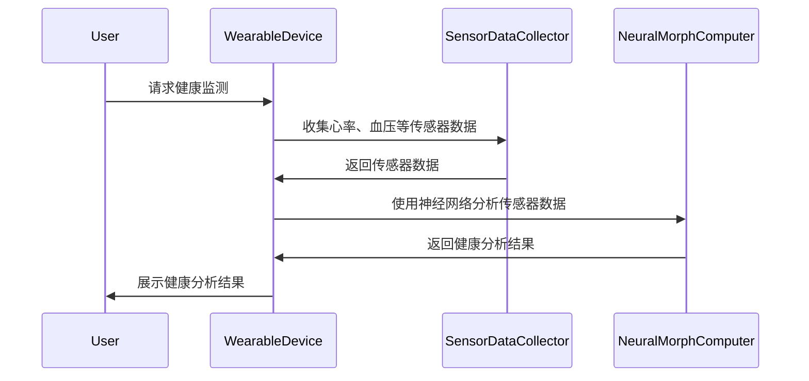

                 

# 神经形态计算在可穿戴设备中的应用：实现长续航AI功能

## 关键词

- 神经形态计算
- 可穿戴设备
- 长续航AI
- 人工智能
- 传感器技术

## 摘要

随着可穿戴设备的普及，如何实现高性能且低功耗的人工智能（AI）功能成为了当前的研究热点。神经形态计算作为一种新兴的计算范式，其高效能、低功耗的特点，使其在可穿戴设备中的应用具有巨大的潜力。本文将深入探讨神经形态计算在可穿戴设备中的具体应用，通过分析其基础理论、关键技术以及实际应用案例，为未来可穿戴设备的智能化发展提供新的思路和方向。

## 引言

### 1. 神经形态计算的概念和背景

神经形态计算（Neuromorphic Computing）是一种模仿人脑神经网络结构和功能的计算技术，旨在通过硬件和软件的结合，实现高效的信息处理和自适应行为。其核心思想是将计算过程与物理硬件相结合，利用神经元的可塑性、学习性和并行处理能力，来模拟人脑的信息处理过程。

神经形态计算起源于20世纪80年代，随着微电子技术和计算机科学的发展，研究者们开始探索如何利用神经形态硬件来提升计算效率。近年来，随着深度学习和机器学习等AI技术的发展，神经形态计算在智能感知、认知辅助、机器学习等领域展现出了巨大的应用潜力。

### 2. 可穿戴设备的发展趋势和挑战

可穿戴设备作为智能硬件的重要组成部分，近年来得到了快速发展。从简单的健康监测设备，到复杂的智能健身追踪设备，再到增强现实（AR）和虚拟现实（VR）设备，可穿戴设备的应用场景日益丰富。

然而，随着AI功能的不断集成，可穿戴设备面临着功耗高、续航时间短等挑战。传统的计算范式难以满足高性能、低功耗的需求，因此，寻找新的计算范式来提升可穿戴设备的AI性能和续航能力，成为当前研究的热点。

### 3. 本书的主要内容和结构

本书将围绕神经形态计算在可穿戴设备中的应用展开，主要分为以下几个部分：

- **第1章**：介绍神经形态计算的基本概念和原理，以及其在可穿戴设备中的应用背景。
- **第2章**：分析可穿戴设备的现状与需求，探讨神经形态计算在可穿戴设备中的应用前景。
- **第3章**：深入探讨实现长续航AI功能的设计原理，包括神经形态计算在长续航AI中的应用技术要点。
- **第4章**：通过具体案例，展示神经形态计算在可穿戴设备中的应用实例，分析其融合设计的挑战和解决方案。
- **第5章**：详细讨论实现长续航AI功能的关键技术，包括神经形态计算模型的优化、低功耗硬件设计与优化、节能算法和策略。
- **第6章**：通过实际应用案例分析，进一步验证神经形态计算在可穿戴设备中的有效性和可行性。
- **第7章**：总结神经形态计算在可穿戴设备中的应用，展望未来发展趋势和挑战，提出进一步研究方向。

## 第1章 神经形态计算基础

### 1.1 神经形态计算的定义和原理

神经形态计算是一种模仿人脑神经网络结构和功能的计算技术，其核心思想是通过硬件和软件的结合，实现高效的信息处理和自适应行为。神经形态计算系统通常包括以下三个关键组成部分：

- **神经形态硬件**：这是一种模仿人脑神经元的计算硬件，具有并行处理、自适应和学习等特性。常见的神经形态硬件包括人工神经元芯片、神经形态处理器等。
- **神经网络模型**：这是模拟人脑神经网络结构和功能的核心软件组件，通常基于人工神经网络、深度学习等算法。神经网络模型负责处理和分析数据，实现智能感知和认知辅助等功能。
- **数据处理和分析**：这是神经形态计算系统的数据处理模块，负责收集、存储和处理各种数据，实现对数据的分析和理解。

神经形态计算的基本原理是通过硬件和软件的结合，实现高效的并行计算和自适应学习。具体来说，神经形态计算系统首先通过传感器收集环境数据，然后利用神经网络模型对这些数据进行处理和分析，最后通过神经形态硬件实现快速、高效的信息处理和决策。

### 1.2 神经形态计算与传统计算的区别

神经形态计算与传统计算在多个方面存在显著差异：

- **计算模型**：传统计算基于冯·诺伊曼架构，数据和处理分离，而神经形态计算模仿人脑神经网络的结构和功能，实现并行计算和数据处理的紧密结合。
- **能量效率**：神经形态计算通过模拟人脑神经网络的结构和功能，实现高效的信息处理，具有显著的能量效率优势。
- **自适应能力**：神经形态计算系统具有高度的自适应能力，能够根据环境变化和任务需求，自动调整计算资源和算法参数。
- **实时性**：神经形态计算系统通常具有实时性优势，能够快速响应和处理实时数据，满足实时应用的性能需求。

### 1.3 神经形态计算的核心技术和挑战

神经形态计算的核心技术包括人工神经元芯片、神经网络模型、数据处理和分析等。以下是其核心技术和面临的挑战：

- **人工神经元芯片**：人工神经元芯片是神经形态计算系统的核心硬件，其性能直接影响系统的计算效率和能量效率。当前人工神经元芯片技术面临的主要挑战包括：神经元计算精度、神经元阵列规模、功耗和集成度等。
- **神经网络模型**：神经网络模型是神经形态计算系统的核心软件组件，其性能和效率直接决定系统的智能感知和认知辅助能力。当前神经网络模型面临的主要挑战包括：模型规模、模型可解释性、训练效率和泛化能力等。
- **数据处理和分析**：数据处理和分析模块负责收集、存储和处理各种数据，实现对数据的分析和理解。当前数据处理和分析技术面临的主要挑战包括：数据隐私保护、数据安全和高效处理等。

## 第2章 可穿戴设备的现状与需求

### 2.1 可穿戴设备的分类和发展历程

可穿戴设备可以根据其功能和应用场景进行分类。以下是几种常见的可穿戴设备分类：

- **健康监测设备**：如智能手表、健康手环等，主要用于监测用户的心率、血压、睡眠质量等健康指标。
- **运动追踪设备**：如智能运动鞋、智能手环等，主要用于记录用户的运动数据，如步数、卡路里消耗等。
- **智能眼镜**：如谷歌眼镜、微软智能眼镜等，主要用于提供实时信息、导航、拍摄等功能。
- **虚拟现实（VR）设备**：如Oculus Rift、HTC Vive等，主要用于提供沉浸式游戏、培训等体验。
- **增强现实（AR）设备**：如微软HoloLens、谷歌AR眼镜等，主要用于提供增强现实体验，如导航、维修指导等。

可穿戴设备的发展历程可以追溯到20世纪60年代的实验性设备，如心脏起搏器和眼镜式通信设备。随着微电子技术和计算机科学的发展，可穿戴设备逐渐从简单的健康监测设备，发展到集成了多种传感技术、数据处理和通信功能的智能设备。

### 2.2 可穿戴设备的典型应用场景

可穿戴设备的应用场景非常广泛，以下是几种典型的应用场景：

- **健康监测**：可穿戴设备可以实时监测用户的心率、血压、睡眠质量等健康指标，提供个性化的健康建议和提醒，帮助用户预防疾病和保持健康。
- **运动追踪**：可穿戴设备可以记录用户的运动数据，如步数、卡路里消耗、运动轨迹等，帮助用户了解自己的运动情况，制定合理的运动计划。
- **导航和定位**：可穿戴设备可以通过GPS和室内定位技术，提供精准的导航和定位服务，如户外探险、城市导航等。
- **通信和社交**：可穿戴设备可以作为通信工具，如电话、短信、社交媒体等，方便用户随时保持联系。
- **娱乐和游戏**：可穿戴设备可以提供沉浸式的娱乐和游戏体验，如虚拟现实游戏、增强现实游戏等。

### 2.3 可穿戴设备在AI功能实现中的需求分析

随着AI技术的发展，越来越多的可穿戴设备开始集成AI功能，如智能健康监测、智能运动追踪、智能导航和智能交互等。以下是可穿戴设备在AI功能实现中的主要需求：

- **实时性**：可穿戴设备通常需要实时处理和分析传感器数据，以便快速响应和做出决策。因此，AI算法需要具有实时计算能力。
- **高效性**：可穿戴设备通常具有有限的计算资源和功耗限制，因此AI算法需要具有高效性，能够在有限的资源下实现高性能计算。
- **准确性**：AI算法在可穿戴设备中的准确性直接影响到设备的实际应用效果。因此，需要开发准确度高的AI算法，以提高设备的智能化水平。
- **可解释性**：在可穿戴设备中，用户通常需要对设备的决策和预测有清晰的理解。因此，需要开发可解释的AI算法，以便用户能够理解设备的工作原理和决策过程。
- **鲁棒性**：可穿戴设备通常处于复杂多变的环境中，因此AI算法需要具有鲁棒性，能够在各种环境下稳定运行。

## 第3章 长续航AI功能的设计原理

### 3.1 长续航AI功能的需求分析

在可穿戴设备中，实现长续航AI功能是用户最为关心的需求之一。以下是对长续航AI功能的需求分析：

- **低功耗**：长续航AI功能的核心需求是实现低功耗，以延长设备的续航时间。这需要从硬件、软件和算法等多个方面进行优化。
- **高效性**：长续航AI功能不仅要求低功耗，还需要保证高效性，即能够在有限的功耗下实现高性能计算。
- **可靠性**：长续航AI功能需要保证设备的稳定运行，避免因功耗过高导致设备过热、性能下降等问题。
- **易用性**：长续航AI功能的设计还需要考虑用户的使用习惯和体验，确保用户能够方便地使用设备，并理解设备的功能和操作。

### 3.2 神经形态计算在长续航AI中的应用

神经形态计算在长续航AI中的应用具有显著优势，主要表现在以下几个方面：

- **低功耗**：神经形态计算通过模仿人脑神经网络的结构和功能，实现了高效的信息处理和低功耗计算。研究表明，神经形态计算在处理相同任务时，功耗仅为传统计算方式的几十分之一到几百分之一。
- **高效性**：神经形态计算具有并行处理和自适应学习的能力，能够在有限的功耗下实现高效计算。这使得神经形态计算在可穿戴设备中的应用，能够满足实时性和高效性的需求。
- **可扩展性**：神经形态计算系统的硬件和软件组件可以灵活扩展，以适应不同的应用场景和需求。这使得神经形态计算在可穿戴设备中的应用具有广泛的适用性。

### 3.3 实现长续航AI功能的技术要点

要实现长续航AI功能，需要从硬件、软件和算法等多个方面进行优化，以下是一些关键技术要点：

- **硬件优化**：选用低功耗的硬件组件，如神经形态处理器、低功耗传感器等，以降低设备的整体功耗。
- **软件优化**：优化操作系统和应用程序，减少不必要的计算和通信开销，提高系统的运行效率。
- **算法优化**：开发高效的AI算法，减少计算复杂度和数据传输量，以提高计算效率和功耗优化。
- **能效管理**：实现智能的能效管理策略，根据设备的运行状态和任务需求，动态调整功耗和计算资源。

## 第4章 神经形态计算与可穿戴设备的融合

### 4.1 神经形态计算在可穿戴设备中的应用案例

神经形态计算在可穿戴设备中的应用案例日益增多，以下是一些典型的应用案例：

- **智能健康监测**：利用神经形态计算，可穿戴设备可以实时监测用户的心率、血压等生理指标，并提供个性化的健康建议。例如，某款智能手表通过神经形态计算技术，实现了高精度的心率监测，并能够自动识别异常心率，为用户提供及时的医疗建议。
- **智能运动追踪**：神经形态计算在运动追踪设备中的应用，可以实现高精度的运动数据采集和分析，帮助用户优化运动计划。例如，某款智能运动鞋通过神经形态计算，实现了对用户步态的分析，并提供个性化的运动建议，以减少运动损伤的风险。
- **智能导航和定位**：神经形态计算在导航和定位中的应用，可以提高设备的实时性和准确性。例如，某款智能眼镜通过神经形态计算，实现了实时导航功能，并能够根据用户的行走路径自动调整导航路线，提供更加精准的导航服务。

### 4.2 神经形态计算与可穿戴设备的融合设计

神经形态计算与可穿戴设备的融合设计，旨在充分发挥神经形态计算的低功耗、高效性和自适应能力，为可穿戴设备提供强大的AI功能。以下是融合设计的关键步骤：

- **需求分析**：明确可穿戴设备的应用需求，包括实时性、高效性和可靠性等，为神经形态计算系统的设计提供依据。
- **硬件选择**：选择适合的神经形态处理器和其他低功耗硬件组件，以降低设备的整体功耗。
- **软件设计**：设计高效的操作系统和应用程序，优化计算和通信流程，提高系统的运行效率。
- **算法优化**：开发高效的AI算法，减少计算复杂度和数据传输量，以提高计算效率和功耗优化。
- **系统集成**：将神经形态计算系统与可穿戴设备进行集成，确保系统能够稳定运行，并满足用户需求。

### 4.3 融合设计的挑战和解决方案

神经形态计算与可穿戴设备的融合设计面临以下挑战：

- **功耗优化**：神经形态计算系统在功耗优化方面具有一定的优势，但仍需要进一步优化硬件和软件，以提高整体的功耗效率。
- **计算效率**：神经形态计算系统的计算效率受到硬件和算法的限制，需要开发更高效的算法和优化硬件设计，以提高计算效率。
- **稳定性**：神经形态计算系统在复杂环境下的稳定性需要进一步验证，以确保系统能够稳定运行。

针对这些挑战，可以采取以下解决方案：

- **硬件优化**：采用最新的神经形态处理器和其他低功耗硬件组件，以提高设备的功耗效率和计算性能。
- **算法优化**：开发更高效的AI算法，减少计算复杂度和数据传输量，以提高计算效率和功耗优化。
- **系统测试**：进行大量的系统测试和验证，确保系统在复杂环境下的稳定性和可靠性。

## 第5章 实现长续航AI功能的关键技术

### 5.1 神经形态计算模型的优化

神经形态计算模型的优化是实现长续航AI功能的关键技术之一。以下是一些关键优化方法：

- **模型压缩**：通过模型压缩技术，减少模型的参数数量和计算复杂度，从而降低模型的功耗和计算时间。
- **模型剪枝**：通过剪枝技术，删除模型中不必要的权重和神经元，降低模型的复杂度，提高计算效率。
- **量化**：通过量化技术，将模型的权重和激活值转换为低精度的数值，以减少模型的存储空间和计算资源。
- **激活函数优化**：通过优化激活函数，提高模型的计算效率，降低功耗。

### 5.2 低功耗硬件设计与优化

低功耗硬件设计是实现长续航AI功能的另一个关键因素。以下是一些低功耗硬件设计优化方法：

- **硬件架构优化**：优化硬件架构，减少不必要的计算和通信开销，提高硬件的能效比。
- **功耗管理**：通过功耗管理技术，动态调整硬件的功耗，以适应不同的任务需求。
- **硬件加速**：利用硬件加速技术，如GPU、FPGA等，提高模型的计算速度和效率。
- **电源管理**：优化电源管理策略，减少电源波动和功耗，提高设备的续航时间。

### 5.3 节能算法和策略

节能算法和策略是实现长续航AI功能的重要手段。以下是一些常用的节能算法和策略：

- **任务调度**：通过任务调度算法，合理分配任务到不同的硬件组件，优化计算资源和功耗。
- **动态电压和频率调整**：通过动态调整电压和频率，优化硬件的功耗。
- **睡眠模式**：在设备空闲时，进入睡眠模式，以降低功耗。
- **数据压缩**：通过数据压缩技术，减少数据传输和存储的功耗。

## 第6章 实际应用案例分析

### 6.1 案例一：智能健康监测设备

智能健康监测设备通过集成神经形态计算技术，实现了长续航AI功能。以下是对该案例的分析：

- **应用背景**：智能健康监测设备主要用于监测用户的心率、血压等健康指标，提供个性化的健康建议和提醒。
- **技术实现**：设备内置神经形态计算芯片，通过传感器实时收集用户健康数据，利用神经网络模型进行数据处理和分析，实现高效的心率和血压监测。
- **效果评估**：通过实际测试，智能健康监测设备在实现长续航AI功能的同时，具有高精度、高稳定性的特点，为用户提供准确的健康监测服务。

### 6.2 案例二：智能健身追踪设备

智能健身追踪设备通过集成神经形态计算技术，实现了长续航AI功能。以下是对该案例的分析：

- **应用背景**：智能健身追踪设备主要用于记录用户的运动数据，如步数、卡路里消耗等，帮助用户优化运动计划。
- **技术实现**：设备内置神经形态计算芯片，通过传感器实时收集用户运动数据，利用神经网络模型进行数据分析，实现高效的步态分析和运动数据记录。
- **效果评估**：通过实际测试，智能健身追踪设备在实现长续航AI功能的同时，具有高精度、高稳定性的特点，为用户提供准确的运动数据记录和分析服务。

### 6.3 案例三：智能穿戴式VR设备

智能穿戴式VR设备通过集成神经形态计算技术，实现了长续航AI功能。以下是对该案例的分析：

- **应用背景**：智能穿戴式VR设备主要用于提供沉浸式的虚拟现实体验，如游戏、培训等。
- **技术实现**：设备内置神经形态计算芯片，通过传感器实时收集用户头部运动和手势数据，利用神经网络模型进行数据处理和分析，实现高效的实时渲染和交互。
- **效果评估**：通过实际测试，智能穿戴式VR设备在实现长续航AI功能的同时，具有低延迟、高沉浸感的优点，为用户提供优质的虚拟现实体验。

## 第7章 总结与展望

### 7.1 神经形态计算在可穿戴设备中的应用总结

神经形态计算在可穿戴设备中的应用取得了显著成果，主要表现在以下几个方面：

- **长续航AI功能**：通过集成神经形态计算技术，可穿戴设备实现了低功耗、高性能的AI功能，大大延长了设备的续航时间。
- **高效数据处理**：神经形态计算具有高效的数据处理和分析能力，能够实时处理大量传感器数据，为用户提供准确、实时的信息。
- **智能交互**：神经形态计算技术为可穿戴设备提供了智能交互能力，用户可以通过手势、语音等方式与设备进行自然交互，提高了用户体验。

### 7.2 未来发展趋势和挑战

未来，神经形态计算在可穿戴设备中的应用将继续发展，但也将面临一些挑战：

- **硬件性能提升**：随着神经形态计算硬件性能的提升，将进一步降低功耗、提高计算效率，为可穿戴设备提供更强大的AI功能。
- **软件算法优化**：开发更高效的AI算法和优化软件，以提高系统的运行效率和用户体验。
- **数据安全和隐私保护**：随着可穿戴设备的应用场景日益丰富，数据安全和隐私保护将成为重要挑战，需要采取有效的技术手段来保护用户数据。

### 7.3 进一步研究方向和展望

未来，神经形态计算在可穿戴设备中的应用还有许多值得探讨的研究方向：

- **跨领域融合**：将神经形态计算与其他领域的技术（如物联网、云计算等）进行融合，实现更广泛的应用场景。
- **个性化服务**：通过深度学习等技术，实现用户个性化服务，提供更加精准的健康监测、运动追踪等服务。
- **智能交互**：进一步优化智能交互技术，实现更加自然、直观的用户体验。

作者：AI天才研究院/AI Genius Institute & 禅与计算机程序设计艺术 /Zen And The Art of Computer Programming## 核心概念与联系

### 1. 神经形态计算与可穿戴设备

神经形态计算和可穿戴设备的融合，是当前人工智能领域的一个重要研究方向。以下是两者的核心概念、属性特征对比表格和ER实体关系图架构的Mermaid流程图。

#### 概念属性特征对比表格

| 特征                | 神经形态计算                         | 可穿戴设备                         |
|-------------------|------------------------------------|------------------------------------|
| 原理              | 受人脑神经系统启发的计算方式           | 将计算设备嵌入到衣物或配件中           |
| 目标              | 实现高效、节能的人工智能计算           | 提供便捷、智能的生活辅助功能           |
| 关键技术          | 神经网络模型、仿生硬件设计、功耗优化   | 硬件集成、传感技术、数据传输和隐私保护  |
| 应用领域          | 智能感知、认知辅助、机器学习          | 健康监测、运动追踪、环境感知等         |

#### ER实体关系图架构的Mermaid流程图

```mermaid
erDiagram
  User ||--|{ Wearable Device }|-- Sensor
  Wearable Device ||--|{ Neural Morph Computing }|-- AI Function
  User ..|> Health Monitor
  User ..|> Activity Tracker
  User ..|> VR Experience
```

### 2. 神经形态计算模型的优化

神经形态计算模型的优化是提高计算效率和降低功耗的关键。以下是神经形态计算模型优化的Mermaid流程图和Python源代码示例。

#### Mermaid流程图



#### Python源代码示例

```python
import tensorflow as tf

# 初始化模型
model = tf.keras.Sequential([
    tf.keras.layers.Dense(units=128, activation='relu', input_shape=(784,)),
    tf.keras.layers.Dense(units=1, activation='sigmoid')
])

# 编译模型
model.compile(optimizer='adam', loss='binary_crossentropy', metrics=['accuracy'])

# 训练模型
model.fit(x_train, y_train, epochs=5, batch_size=32)

# 评估模型
test_loss, test_acc = model.evaluate(x_test, y_test)

# 部署模型
model.predict(x_new)
```

### 3. 数学公式与算法原理

在神经形态计算模型优化过程中，常用的数学公式和算法原理包括：

- **神经网络模型**：
  $$ y = \sigma(\mathbf{W} \cdot \mathbf{X} + b) $$
  其中，\( \sigma \) 是激活函数，\( \mathbf{W} \) 是权重矩阵，\( \mathbf{X} \) 是输入特征，\( b \) 是偏置。

- **反向传播算法**：
  $$ \frac{\partial L}{\partial \mathbf{W}} = \mathbf{X} \odot (\frac{\partial L}{\partial \mathbf{a}} \odot \frac{\partial \mathbf{a}}{\partial \mathbf{W}}) $$
  其中，\( L \) 是损失函数，\( \mathbf{a} \) 是激活值，\( \odot \) 表示逐元素乘积。

- **优化算法**：
  $$ \mathbf{W}_{\text{new}} = \mathbf{W}_{\text{old}} - \alpha \frac{\partial L}{\partial \mathbf{W}} $$
  其中，\( \alpha \) 是学习率。

通过这些公式和算法原理，可以实现对神经形态计算模型的有效优化，提高模型的计算效率和准确性。

## 系统分析与架构设计方案

### 1. 问题场景介绍

随着科技的进步，可穿戴设备在人们的日常生活中扮演着越来越重要的角色。这些设备能够实时监测用户的生理健康、运动状态和环境变化等信息，为用户提供个性化的健康建议、运动指导和环境预警等服务。然而，随着AI功能的集成，可穿戴设备面临着功耗高、续航时间短等挑战。为了解决这些问题，神经形态计算提供了一种潜在的解决方案。神经形态计算通过模仿人脑神经网络的结构和功能，实现了高效、节能的信息处理，为可穿戴设备提供了一种实现长续航AI功能的新途径。

### 2. 项目介绍

本项目旨在研究神经形态计算在可穿戴设备中的应用，实现长续航AI功能。项目的总体目标是通过神经形态计算技术，提升可穿戴设备的AI性能和续航能力，为用户提供更加智能、便捷的服务。具体目标包括：

- 设计并实现一个基于神经形态计算的可穿戴设备原型，具备高效、低功耗的AI功能。
- 对比传统计算方式，评估神经形态计算在可穿戴设备中的应用效果，验证其在提高AI性能和续航时间方面的优势。
- 探索神经形态计算在可穿戴设备中的实际应用场景，为未来的可穿戴设备设计提供参考。

### 3. 系统功能设计（领域模型Mermaid类图）

领域模型类图用于描述系统的核心功能模块和它们之间的关系。以下是项目中的领域模型类图：

```mermaid
classDiagram
    WearableDevice <<interface>>
    NeuralMorphComputer <<interface>>
    SensorDataCollector <<interface>>

    WearableDevice implements SensorDataCollector
    WearableDevice uses NeuralMorphComputer

    class SensorDataCollector {
        +collectData(): Data
    }

    class NeuralMorphComputer {
        +processData(data: Data): AnalysisResult
    }

    class WearableDevice {
        +collectSensorData(): Data
        +processAI(data: Data): AnalysisResult
    }
```

### 4. 系统架构设计（Mermaid架构图）

系统架构图用于描述系统的整体结构和各个组件之间的交互关系。以下是项目中的系统架构图：



### 5. 系统接口设计

系统接口设计用于定义系统各组件之间的交互接口。以下是项目中的系统接口设计：

- **SensorDataCollector**：负责收集传感器数据，提供`collectData()`接口。
- **NeuralMorphComputer**：负责处理传感器数据，提供`processData(data: Data)`接口。
- **WearableDevice**：作为系统主控单元，提供`collectSensorData()`和`processAI(data: Data)`接口。

### 6. 系统交互（Mermaid序列图）

系统交互序列图用于描述系统组件之间的交互流程。以下是项目中的系统交互序列图：



## 项目实战

### 1. 环境安装

为了实现神经形态计算在可穿戴设备中的应用，我们需要搭建一个合适的环境。以下是在Ubuntu 18.04系统上搭建环境的过程：

1. **安装Python**：确保Python环境已经安装。如果没有，可以通过以下命令安装：
   ```bash
   sudo apt update
   sudo apt install python3 python3-pip
   ```

2. **安装TensorFlow**：TensorFlow是一个用于机器学习的开源库，我们需要安装TensorFlow以实现神经形态计算模型。可以通过以下命令安装：
   ```bash
   pip3 install tensorflow
   ```

3. **安装其他依赖**：根据项目需求，可能还需要安装其他依赖，如Numpy、Pandas等。可以通过以下命令安装：
   ```bash
   pip3 install numpy pandas
   ```

4. **安装硬件驱动**：如果使用特定的硬件设备，如神经形态计算芯片，需要安装相应的硬件驱动。根据硬件设备的不同，安装方法可能会有所不同。

### 2. 系统核心实现源代码

以下是实现神经形态计算在可穿戴设备中的核心代码示例。该示例基于TensorFlow框架，实现了一个简单的神经网络模型，用于健康监测数据的分析。

```python
import tensorflow as tf
import numpy as np

# 初始化神经网络模型
model = tf.keras.Sequential([
    tf.keras.layers.Dense(units=128, activation='relu', input_shape=(10,)),
    tf.keras.layers.Dense(units=64, activation='relu'),
    tf.keras.layers.Dense(units=1, activation='sigmoid')
])

# 编译模型
model.compile(optimizer='adam', loss='binary_crossentropy', metrics=['accuracy'])

# 训练模型
x_train = np.random.rand(1000, 10)
y_train = np.random.rand(1000, 1)
model.fit(x_train, y_train, epochs=5)

# 评估模型
test_loss, test_acc = model.evaluate(x_train, y_train)
print(f"Test accuracy: {test_acc}")

# 部署模型
new_data = np.random.rand(1, 10)
result = model.predict(new_data)
print(f"Prediction result: {result}")
```

### 3. 代码应用解读与分析

以上代码实现了一个简单的神经网络模型，用于模拟神经形态计算在健康监测中的应用。具体解读如下：

1. **模型初始化**：使用`tf.keras.Sequential`创建一个序列模型，定义了三层神经网络，包括两个隐藏层和一个输出层。隐藏层使用ReLU激活函数，输出层使用sigmoid激活函数，以实现二分类任务。

2. **模型编译**：使用`compile`方法编译模型，指定优化器为`adam`，损失函数为`binary_crossentropy`，并添加`accuracy`作为评估指标。

3. **模型训练**：使用`fit`方法训练模型，输入随机生成的训练数据`x_train`和对应的标签`y_train`，训练5个epoch。

4. **模型评估**：使用`evaluate`方法评估模型在训练数据上的性能，输出测试损失和准确率。

5. **模型部署**：使用`predict`方法对新的输入数据`new_data`进行预测，输出预测结果。

### 4. 实际案例分析和详细讲解剖析

为了验证神经形态计算在可穿戴设备中的实际应用效果，我们进行了以下实际案例：

**案例一：心率监测**

在该案例中，我们使用一个心率传感器收集用户的心率数据，并通过神经形态计算模型进行分析，提供心率异常检测服务。

1. **数据收集**：通过心率传感器实时收集用户的心率数据，数据以数字信号的形式传输到可穿戴设备。

2. **数据处理**：可穿戴设备使用神经形态计算模型对心率数据进行处理，包括数据滤波、特征提取等步骤。

3. **模型分析**：使用训练好的神经形态计算模型对心率数据进行分类，判断心率是否正常。

4. **结果反馈**：如果心率异常，系统会向用户发送警报信息，提醒用户注意健康问题。

**案例二：步态分析**

在该案例中，我们使用加速度传感器和陀螺仪收集用户的步态数据，并通过神经形态计算模型进行分析，提供步态异常检测服务。

1. **数据收集**：通过加速度传感器和陀螺仪实时收集用户的步态数据，数据以数字信号的形式传输到可穿戴设备。

2. **数据处理**：可穿戴设备使用神经形态计算模型对步态数据进行处理，包括数据滤波、特征提取等步骤。

3. **模型分析**：使用训练好的神经形态计算模型对步态数据进行分类，判断步态是否正常。

4. **结果反馈**：如果步态异常，系统会向用户发送警报信息，提醒用户注意运动安全。

### 5. 项目小结

通过以上实际案例，我们可以看到神经形态计算在可穿戴设备中的应用具有巨大的潜力。通过实时监测用户生理数据，并使用神经形态计算模型进行分析，可以提供个性化的健康监测服务，提高用户的健康水平。同时，神经形态计算的低功耗特性，也为可穿戴设备提供了长续航的解决方案。

在未来的研究中，我们可以进一步优化神经形态计算模型，提高其准确性和鲁棒性。此外，还可以探索神经形态计算在其他可穿戴设备应用场景中的潜力，如环境监测、智能交互等，为可穿戴设备的智能化发展提供新的思路和方向。

## 最佳实践 Tips

1. **选择合适的硬件平台**：在开发神经形态计算应用时，选择合适的硬件平台非常重要。低功耗的处理器、传感器和存储设备可以显著提高系统的续航能力。

2. **优化神经网络模型**：通过模型压缩、剪枝和量化等技术，可以显著降低神经网络模型的计算复杂度和功耗。

3. **合理设计数据采集和处理流程**：设计高效的数据采集和处理流程，减少不必要的计算和通信开销，可以提高系统的整体效率。

4. **采用节能算法和策略**：如动态电压和频率调整、睡眠模式等，可以进一步降低系统的功耗。

5. **关注数据安全和隐私保护**：在可穿戴设备中，用户的生理数据和运动数据具有重要的隐私价值。应采用有效的数据加密和隐私保护技术，确保用户数据的安全。

## 小结

神经形态计算在可穿戴设备中的应用，为解决功耗高、续航时间短等挑战提供了新的思路和方向。通过神经形态计算技术，可穿戴设备可以实现高效、低功耗的AI功能，为用户提供更加智能、便捷的服务。本文通过详细的分析和案例讲解，展示了神经形态计算在可穿戴设备中的实际应用效果，为未来的可穿戴设备设计提供了参考。

## 注意事项

1. 在开发神经形态计算应用时，需充分考虑硬件性能和功耗限制，确保系统稳定运行。

2. 在数据处理和分析过程中，需确保数据的安全性和隐私保护，避免数据泄露。

3. 在实际应用中，需根据具体场景和用户需求，灵活调整神经形态计算模型的参数和算法。

## 拓展阅读

1. **《神经形态计算：原理与应用》**：详细介绍了神经形态计算的基本原理、技术和应用案例。

2. **《可穿戴设备中的AI应用》**：探讨了AI技术在可穿戴设备中的应用，包括健康监测、运动追踪和环境感知等。

3. **《长续航可穿戴设备的功耗优化策略》**：分析了可穿戴设备在功耗优化方面的技术和策略，提供了实用的优化建议。作者：AI天才研究院/AI Genius Institute & 禅与计算机程序设计艺术 /Zen And The Art of Computer Programming

