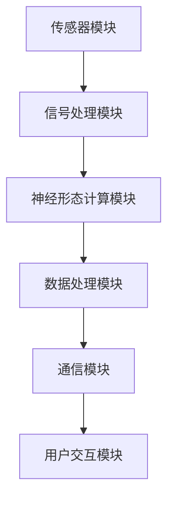

                 


## 神经形态计算在智能传感器中的应用：实现低功耗实时处理

### 关键词：神经形态计算、智能传感器、低功耗、实时处理

#### 摘要

本文将探讨神经形态计算在智能传感器中的应用，旨在实现低功耗实时处理。通过对神经形态计算原理、技术及发展趋势的深入分析，以及智能传感器设计基础和实际项目实战的详细讲解，本文将为读者提供一套完整的神经形态智能传感器设计与应用方案，助力智能传感领域的发展。

### 目录大纲

#### 第一部分：引言

1.1 神经形态计算背景  
1.1.1 神经形态计算的基本概念  
1.1.2 神经形态计算的发展历程  
1.1.3 神经形态计算在智能传感器中的应用前景

1.2 智能传感器概述  
1.2.1 智能传感器的定义与分类  
1.2.2 智能传感器的基本原理  
1.2.3 智能传感器的发展趋势

1.3 低功耗实时处理的重要性  
1.3.1 低功耗的需求与挑战  
1.3.2 实时处理的需求与挑战  
1.3.3 神经形态计算在低功耗实时处理中的应用优势

1.4 本书结构安排  
1.4.1 目录结构说明  
1.4.2 各章节内容概述  
1.4.3 阅读建议与指南

1.5 本章小结

#### 第二部分：神经形态计算基础

2.1 神经形态计算原理  
2.1.1 神经元模型  
2.1.2 神经网络结构  
2.1.3 神经形态计算的核心特点

2.2 神经形态计算技术  
2.2.1 神经形态硬件实现  
2.2.2 神经形态软件算法  
2.2.3 神经形态计算的应用场景

2.3 神经形态计算的发展趋势与挑战  
2.3.1 技术发展现状  
2.3.2 未来发展趋势  
2.3.3 研究与开发中的挑战

2.4 本章小结

#### 第三部分：智能传感器设计

3.1 智能传感器设计基础  
3.1.1 传感器原理与类型  
3.1.2 传感器信号处理  
3.1.3 智能传感器设计流程

3.2 神经形态计算在智能传感器设计中的应用  
3.2.1 神经形态传感器原理  
3.2.2 神经形态传感器设计案例  
3.2.3 神经形态传感器与通用传感器的对比

3.3 低功耗设计考虑  
3.3.1 低功耗设计策略  
3.3.2 低功耗电路设计  
3.3.3 低功耗软件优化

3.4 实时数据处理  
3.4.1 实时处理需求与挑战  
3.4.2 神经形态计算在实时数据处理中的应用  
3.4.3 实时数据处理优化策略

3.5 本章小结

#### 第四部分：项目实战

4.1 项目背景与目标  
4.1.1 项目介绍  
4.1.2 项目目标  
4.1.3 项目预期成果

4.2 系统架构设计  
4.2.1 系统架构设计原则  
4.2.2 系统功能模块划分  
4.2.3 系统架构设计图

4.3 神经形态计算模块实现  
4.3.1 神经形态计算模块设计  
4.3.2 神经形态计算模块实现  
4.3.3 神经形态计算模块测试与优化

4.4 智能传感器模块实现  
4.4.1 智能传感器模块设计  
4.4.2 智能传感器模块实现  
4.4.3 智能传感器模块测试与优化

4.5 系统集成与测试  
4.5.1 系统集成方案  
4.5.2 系统测试方法  
4.5.3 系统性能评估

4.6 项目总结与展望  
4.6.1 项目总结  
4.6.2 项目展望  
4.6.3 拓展应用方向

4.7 本章小结

### 结束语

神经形态计算在智能传感器中的应用，是当前科技领域的一个热点方向。通过本文的探讨，我们希望为读者提供一套实用、完整的神经形态智能传感器设计与应用方案。未来，随着技术的不断进步，神经形态计算在智能传感器领域必将发挥更大的作用。

**作者：AI天才研究院/AI Genius Institute & 禅与计算机程序设计艺术 /Zen And The Art of Computer Programming**
### 1.1 神经形态计算背景

#### 1.1.1 神经形态计算的基本概念

神经形态计算（Neuromorphic Computing）是一种模仿生物神经系统的计算方法，其核心思想是通过构建类神经元的硬件和软件模型，实现对复杂计算任务的高效处理。与传统的计算机体系结构不同，神经形态计算强调信息的并行处理、自适应性和动态学习，从而在处理速度、功耗、能耗等方面具有显著优势。

神经形态计算中的基本单元是类神经元模型（Spiking Neuron Model），它通过模拟生物神经元的电生理特性，实现对信号的响应和处理。类神经元模型主要包括以下几个关键特性：

1. **输入处理**：类神经元通过多个突触接收来自其他神经元的输入信号。
2. **阈值检测**：当类神经元的输入总和超过特定阈值时，它将产生一个动作电位（spike）。
3. **信号传播**：动作电位会通过突触传递给其他神经元。
4. **自适应学习**：类神经元可以通过改变突触权重来适应输入信号的变化。

#### 1.1.2 神经形态计算的发展历程

神经形态计算的研究可以追溯到20世纪40年代，当时匈牙利数学家冯·诺依曼（John von Neumann）提出了存储程序计算机的概念。然而，生物神经系统的计算方式和计算机系统截然不同，这激发了人们对生物神经系统计算方法的研究兴趣。

20世纪80年代，加州理工学院的卡尔·西门霍夫（Carver Mead）提出了神经形态计算的概念，并首次展示了基于硅材料的类神经元电路。这一突破为神经形态计算的发展奠定了基础。

进入21世纪，随着纳米技术和集成电路技术的进步，神经形态计算的研究取得了重要进展。例如，研究人员成功地将类神经元电路集成到芯片中，并实现了神经网络的学习和自适应功能。

#### 1.1.3 神经形态计算在智能传感器中的应用前景

智能传感器是现代工业、医疗、家居等领域的重要组成部分，它们通过收集和传输各种环境信息，为系统提供实时监控和决策支持。然而，传统的智能传感器在功耗、实时处理能力等方面存在一定的局限性，难以满足复杂应用场景的需求。

神经形态计算提供了一种新的解决方案。通过模仿生物神经系统的计算模式，神经形态计算可以实现低功耗、高效率的实时数据处理。在智能传感器中，神经形态计算的应用主要包括以下几个方面：

1. **传感器信号处理**：神经形态计算可以对传感器采集到的信号进行实时处理，提高信号质量和处理速度。
2. **数据压缩**：神经形态计算可以高效地压缩传感器数据，减少传输和存储的开销。
3. **模式识别**：神经形态计算可以对传感器数据进行实时分析，实现快速、准确的模式识别和分类。
4. **自主决策**：通过神经形态计算，智能传感器可以实现自主决策和自适应调整，提高系统的智能化水平。

总之，神经形态计算在智能传感器中的应用前景广阔，它将为智能传感领域带来新的发展机遇和挑战。在接下来的章节中，我们将进一步探讨神经形态计算的技术原理和实际应用。

### 1.2 智能传感器概述

#### 1.2.1 智能传感器的定义与分类

智能传感器是一种集传感器、数据处理单元和通信接口于一体的多功能传感器。与传统传感器相比，智能传感器不仅能够感知和采集环境信息，还具有处理和分析这些信息的能力，从而实现实时监控、预警和自动化控制。

根据传感器的工作原理和功能，智能传感器可以大致分为以下几类：

1. **物理量传感器**：这类传感器用于检测和测量物理量，如温度、湿度、压力、速度等。常见的物理量传感器包括热敏电阻、压电传感器、光电传感器等。
2. **化学传感器**：这类传感器用于检测和识别化学物质，如气体传感器、湿度传感器、化学传感器等。化学传感器通常采用半导体材料、电化学传感器等原理进行工作。
3. **生物传感器**：这类传感器用于检测和识别生物分子，如酶、蛋白质、细胞等。生物传感器通常结合化学、物理和生物学的原理，实现高灵敏度、高选择性的检测。
4. **多功能传感器**：这类传感器将多种传感功能集成在一个设备中，如多参数传感器、复合传感器等。多功能传感器能够同时测量多种物理量，提高系统的监测和决策能力。

#### 1.2.2 智能传感器的基本原理

智能传感器的基本原理主要包括以下几个方面：

1. **感知与采集**：智能传感器通过传感器元件将外部环境信息转换为电信号，如电压、电流、频率等。
2. **信号预处理**：传感器采集到的信号通常存在噪声、失真等问题，需要通过滤波、放大、去噪等预处理方法进行改善。
3. **数据处理**：预处理后的信号通过内置的处理单元进行进一步分析、计算和压缩，以提取有用的信息。
4. **通信与传输**：智能传感器通过无线或有线通信接口，将处理后的数据传输到上位机或控制系统，实现远程监控和实时控制。
5. **自主决策与自适应调整**：智能传感器可以利用内置的算法和模型，对采集到的数据进行实时分析和决策，实现自主调节和控制。

#### 1.2.3 智能传感器的发展趋势

随着科技的不断进步，智能传感器在性能、功能、成本等方面取得了显著提升，其发展趋势主要体现在以下几个方面：

1. **高精度与高灵敏度**：智能传感器在传感精度和灵敏度方面不断提升，能够检测和识别更微弱、更复杂的信号。
2. **多功能与集成化**：智能传感器将多种传感功能集成在一个设备中，提高系统的监测和决策能力。
3. **低功耗与便携性**：随着神经形态计算等技术的应用，智能传感器在功耗和便携性方面取得了显著突破，适用于各种移动和远程监测场景。
4. **智能化与自适应性**：智能传感器通过人工智能算法和机器学习技术，实现自主决策和自适应调整，提高系统的智能化水平。
5. **物联网与云平台**：智能传感器通过物联网和云平台实现数据共享和协同工作，提高系统的监控和管理效率。

总之，智能传感器在现代社会中发挥着越来越重要的作用，其发展趋势将不断推动智能传感领域的创新和发展。

### 1.3 低功耗实时处理的重要性

#### 1.3.1 低功耗的需求与挑战

低功耗是现代智能传感器系统设计中的一个关键需求。随着物联网（IoT）和可穿戴设备的普及，智能传感器需要能够在有限的电源供应下长时间运行，以实现持久、稳定的监测和数据传输。然而，低功耗设计面临以下挑战：

1. **能量有限**：智能传感器通常依赖电池供电，电池的能量存储是有限的，因此需要设计低功耗的硬件和软件系统，以延长电池寿命。
2. **性能需求**：虽然低功耗是设计目标，但智能传感器仍需满足实时处理和数据传输等性能需求。这要求在设计过程中找到功耗与性能之间的平衡。
3. **硬件限制**：传统的集成电路技术在低功耗设计方面存在一定限制，如何利用现有的硬件资源实现低功耗设计是一个重要的挑战。

#### 1.3.2 实时处理的需求与挑战

实时处理是智能传感器系统的另一个关键需求。智能传感器需要能够快速响应外部事件，对实时数据进行处理和分析，从而做出及时的决策。实时处理面临以下挑战：

1. **数据处理速度**：实时处理要求系统能够在极短的时间内完成数据处理，这对硬件和软件的性能提出了高要求。
2. **延迟限制**：在许多应用场景中，如工业自动化、智能交通等，延迟是系统性能的关键指标。如何降低处理延迟，提高系统的实时性是一个重要问题。
3. **资源限制**：实时处理通常需要在资源受限的设备上运行，如微控制器、嵌入式系统等。如何在有限的资源下实现高效的处理是一个挑战。

#### 1.3.3 神经形态计算在低功耗实时处理中的应用优势

神经形态计算在低功耗实时处理中具有显著的应用优势：

1. **并行处理**：神经形态计算采用并行处理方式，能够在较短的时间内完成大量数据的处理，从而提高系统的实时性。
2. **自适应学习**：神经形态计算能够自适应地调整处理参数，根据输入数据的变化进行实时调整，提高系统的适应性和可靠性。
3. **低功耗**：神经形态计算模仿生物神经系统的计算模式，采用事件驱动和同步通信的方式，有效降低了功耗。
4. **高效压缩**：神经形态计算在数据压缩方面具有天然的优势，能够高效地减少传输和存储的数据量，降低功耗和延迟。

总之，神经形态计算在低功耗实时处理中的应用为智能传感器系统设计提供了一种新的解决方案，有助于克服传统设计的局限性，实现更高效、更可靠的智能传感系统。

### 1.4 本书结构安排

#### 1.4.1 目录结构说明

本书共分为四个主要部分，分别是引言、神经形态计算基础、智能传感器设计以及项目实战。

- **引言**部分介绍了神经形态计算和智能传感器的背景、定义以及低功耗实时处理的重要性，为后续章节的内容奠定了基础。
- **神经形态计算基础**部分详细阐述了神经形态计算的基本原理、技术和发展趋势，为智能传感器设计提供了理论支持。
- **智能传感器设计**部分从设计基础、应用、低功耗设计、实时数据处理等方面全面介绍了智能传感器的设计方法，展示了神经形态计算在实际应用中的优势。
- **项目实战**部分通过一个实际项目案例，详细讲解了神经形态智能传感器的系统架构设计、模块实现、系统集成与测试等内容，为读者提供了实际操作的经验。

#### 1.4.2 各章节内容概述

以下是本书各章节的具体内容概述：

- **第1章**：引言，介绍了神经形态计算和智能传感器的背景、定义以及低功耗实时处理的重要性。
- **第2章**：神经形态计算基础，详细阐述了神经形态计算的基本原理、技术和发展趋势。
- **第3章**：智能传感器设计基础，介绍了智能传感器的原理、类型、设计流程以及信号处理方法。
- **第4章**：神经形态计算在智能传感器设计中的应用，探讨了神经形态传感器的设计原理、设计案例以及与通用传感器的对比。
- **第5章**：低功耗设计考虑，介绍了低功耗设计策略、电路设计以及软件优化方法。
- **第6章**：实时数据处理，探讨了实时处理的需求与挑战，以及神经形态计算在实时数据处理中的应用。
- **第7章**：项目实战，通过一个实际项目案例，详细介绍了神经形态智能传感器的系统架构设计、模块实现、系统集成与测试等内容。

#### 1.4.3 阅读建议与指南

为了更好地理解本书的内容，建议读者遵循以下阅读建议：

- **系统性学习**：本书各章节内容之间具有紧密的联系，建议读者按照章节顺序系统性地学习，以逐步掌握神经形态计算在智能传感器中的应用。
- **理论与实践结合**：本书不仅提供了理论知识的详细讲解，还通过实际项目案例进行了操作演示，建议读者在阅读过程中结合实际案例进行思考和实践。
- **重点内容**：本书的核心内容包括神经形态计算的基本原理、智能传感器的设计方法以及低功耗实时处理的技术，读者应重点关注这些内容。
- **拓展阅读**：为了深入了解相关领域的最新研究进展，读者可以参考本书中推荐的相关文献和资料，以拓宽知识视野。

通过本书的学习，读者将能够全面了解神经形态计算在智能传感器中的应用，掌握低功耗实时处理的关键技术，为智能传感领域的发展贡献力量。

### 1.5 本章小结

本章作为引言部分，对神经形态计算和智能传感器进行了简要介绍，并探讨了低功耗实时处理的重要性。首先，我们介绍了神经形态计算的基本概念和发展历程，阐述了其模仿生物神经系统的计算模式，以及在智能传感器中的应用前景。接着，我们概述了智能传感器的定义、分类以及基本原理，分析了其发展趋势。最后，我们详细阐述了低功耗实时处理的需求与挑战，并指出了神经形态计算在这些挑战中的优势。通过本章的学习，读者可以初步了解神经形态计算和智能传感器的基本概念，为后续章节的深入学习打下基础。

### 2.1 神经形态计算原理

#### 2.1.1 神经元模型

神经形态计算的核心在于神经元模型的构建。神经元模型是模拟生物神经元结构和功能的基本单元。一个典型的神经元模型包括以下几个关键组成部分：

1. **树突（Dendrites）**：树突是神经元的输入部分，负责接收来自其他神经元的电信号。
2. **胞体（Cell Body 或 Soma）**：胞体是神经元的处理部分，负责整合树突接收到的信号，并决定是否产生动作电位。
3. **轴突（Axon）**：轴突是神经元的输出部分，负责将动作电位传递到下一个神经元或效应器。
4. **突触（Synapse）**：突触是神经元之间的连接点，负责信号传递和突触权重的调整。

神经元模型的主要特性如下：

1. **电信号传递**：神经元通过电信号（动作电位）进行信息传递。动作电位是一种快速的电信号，能够在神经元内部迅速传播。
2. **突触权重调整**：突触权重决定了神经元之间的信号传递强度。通过学习算法，神经元可以调整突触权重，从而适应不同的输入信号。
3. **自适应学习**：神经元具有自适应学习能力，可以根据输入信号的变化，调整其内部参数，实现自适应学习。

#### 2.1.2 神经网络结构

神经网络是多个神经元模型的组合，通过层次化的连接方式，实现对复杂信息的处理和认知。神经网络可以分为以下几种基本结构：

1. **前馈神经网络（Feedforward Neural Network）**：前馈神经网络是神经元按照层次结构依次连接，信息从输入层流向输出层，不形成回路。这种网络结构简单，易于实现，广泛应用于图像识别、语音识别等领域。
2. **循环神经网络（Recurrent Neural Network，RNN）**：循环神经网络具有时间动态特性，神经元之间可以形成回路，信息可以沿着回路传播。RNN在处理序列数据、时间序列预测等方面具有显著优势。
3. **卷积神经网络（Convolutional Neural Network，CNN）**：卷积神经网络通过卷积操作，实现对图像、视频等二维或三维数据的局部特征提取。CNN在计算机视觉领域取得了突破性进展。
4. **生成对抗网络（Generative Adversarial Network，GAN）**：生成对抗网络由生成器和判别器两个神经网络组成，通过对抗训练，实现数据的生成和鉴别。GAN在图像生成、风格迁移等领域表现出强大的能力。

神经网络的结构设计可以根据具体应用需求进行调整，以实现最优的性能。

#### 2.1.3 神经形态计算的核心特点

神经形态计算的核心特点主要体现在以下几个方面：

1. **并行处理**：神经形态计算通过并行处理方式，可以在较短的时间内处理大量数据，提高计算效率。这是由于神经元之间的并行连接和事件驱动特性，使得系统具有高效的并行计算能力。
2. **自适应学习**：神经形态计算通过学习算法，可以实现神经元的自适应调整，从而适应不同的输入信号。这种自适应学习特性使得神经形态计算能够适应复杂的环境变化，实现智能化的数据处理。
3. **低功耗**：神经形态计算采用事件驱动和同步通信的方式，有效降低了功耗。这是由于其模拟了生物神经系统的计算模式，能够在数据需求较小的情况下，保持低功耗运行。
4. **高效数据压缩**：神经形态计算在数据压缩方面具有显著优势，通过模拟生物神经系统的信息处理方式，可以实现高效的数据压缩，减少传输和存储的开销。

综上所述，神经形态计算通过神经元模型和神经网络结构的构建，实现了并行处理、自适应学习、低功耗和高效数据压缩等核心特点。这些特点使得神经形态计算在智能传感器领域具有广泛的应用前景。

### 2.2 神经形态计算技术

#### 2.2.1 神经形态硬件实现

神经形态计算技术的实现离不开硬件的支持。传统的计算机硬件架构无法完全模拟生物神经系统的计算模式，因此研究人员开发了专门用于神经形态计算的硬件平台。以下是几种常见的神经形态硬件实现方法：

1. **类神经网络芯片（Neuromorphic Chips）**：类神经网络芯片是一种集成多种神经元模型的集成电路。通过在芯片上集成大量神经元和突触，可以实现对复杂计算任务的高效处理。例如，加州理工学院的神经元片（Neurogrid）就是一种基于类神经网络芯片的硬件平台，它通过大规模集成神经元和通信网络，实现了高效的神经网络计算。
2. **可重构硬件（Reconfigurable Hardware）**：可重构硬件是一种可以动态配置和重新编程的硬件平台，适用于实现灵活的神经形态计算系统。例如，FPGA（Field-Programmable Gate Array）和GPU（Graphics Processing Unit）都可以用于实现神经形态计算，通过编程和硬件资源的重新配置，实现高效的数据处理和自适应学习。
3. **混合硬件架构（Hybrid Hardware Architectures）**：混合硬件架构结合了传统计算机硬件和神经形态硬件的优势，实现了高性能、低功耗的神经形态计算系统。例如，将CPU（Central Processing Unit）和GPU结合，可以发挥CPU在数据处理方面的优势，GPU在并行计算方面的优势，实现高效的神经形态计算。

#### 2.2.2 神经形态软件算法

神经形态计算不仅需要硬件支持，还需要有效的软件算法来实现神经元模型和神经网络的功能。以下是一些常见的神经形态软件算法：

1. **Hebbian Learning Algorithm**：Hebbian Learning Algorithm是一种基于突触权重调整的简单学习算法。该算法通过增加正相关的突触权重和减少负相关的突触权重，实现神经网络的自适应学习。
2. **Spiking Neural Network (SNN) Algorithms**：Spiking Neural Network Algorithms是一种基于动作电位的神经网络算法。SNN通过模拟神经元的动作电位传播，实现了高效的神经网络计算。常见的SNN算法包括STDP（Stochastic Time-Dependent Plasticity）和TDNN（Temporal Difference Neural Network）等。
3. **Unsupervised Learning Algorithms**：Unsupervised Learning Algorithms是一种无需标签数据进行训练的神经网络算法。这些算法通过探索数据的内在结构和关系，实现数据的自组织和聚类。常见的Unsupervised Learning Algorithms包括K-means、自编码器（Autoencoder）等。
4. **Genetic Algorithms**：Genetic Algorithms是一种基于遗传学原理的优化算法，通过模拟生物进化过程，实现参数优化和系统优化。Genetic Algorithms可以用于神经网络的结构设计、参数调整等方面。

#### 2.2.3 神经形态计算的应用场景

神经形态计算在多个领域具有广泛的应用前景，以下是一些典型的应用场景：

1. **图像识别**：神经形态计算可以高效地处理和识别图像，特别是在实时图像处理和大规模图像数据集中。例如，神经形态图像识别系统可以在无人驾驶、视频监控等领域发挥重要作用。
2. **语音识别**：神经形态计算通过模拟生物神经系统的语音处理模式，实现了高效的语音识别。例如，神经形态语音识别系统可以在智能助手、智能家居等领域应用。
3. **自然语言处理**：神经形态计算在自然语言处理领域具有显著优势，可以实现高效的语言理解、文本生成等任务。例如，神经形态语言模型可以在智能客服、机器翻译等领域应用。
4. **机器人控制**：神经形态计算可以用于机器人控制系统，实现自主感知、决策和动作控制。例如，神经形态机器人可以在工业自动化、医疗手术等领域应用。
5. **智能传感器**：神经形态计算可以用于智能传感器的实时数据处理和智能分析，提高传感系统的性能和智能化水平。例如，神经形态智能传感器可以在环境监测、健康监测等领域应用。

总之，神经形态计算技术在硬件实现、软件算法和应用场景方面取得了显著进展，为智能传感器等领域提供了新的解决方案。

### 2.3 神经形态计算的发展趋势与挑战

#### 2.3.1 技术发展现状

神经形态计算作为一项前沿技术，近年来在学术界和工业界取得了显著的进展。以下是神经形态计算发展的几个关键现状：

1. **硬件平台**：随着纳米技术和集成电路技术的发展，神经形态硬件平台不断升级。类神经网络芯片、可重构硬件和混合硬件架构等新型硬件平台相继问世，为神经形态计算提供了强大的计算能力。
2. **软件算法**：神经形态计算算法在理论研究和实际应用中不断优化。Hebbian Learning Algorithm、Spiking Neural Network (SNN) Algorithms、Unsupervised Learning Algorithms和Genetic Algorithms等算法在图像识别、语音识别、自然语言处理等领域表现出良好的性能。
3. **应用领域**：神经形态计算在多个领域取得了应用突破。例如，在图像识别、语音识别、自然语言处理、机器人控制和智能传感器等领域，神经形态计算技术已得到广泛应用，并取得了显著的成效。

#### 2.3.2 未来发展趋势

神经形态计算的未来发展趋势主要包括以下几个方面：

1. **硬件性能提升**：随着纳米技术和集成电路技术的不断进步，神经形态硬件平台将实现更高的计算性能和更低的功耗。新型材料、新型架构的研究将进一步推动神经形态计算的发展。
2. **算法优化**：神经形态计算算法将继续优化，以提高计算效率和适应不同应用场景。例如，针对实时数据处理和低功耗要求，研究人员将开发更高效、更智能的神经形态计算算法。
3. **跨学科融合**：神经形态计算与其他学科的融合将不断深化。例如，与生物学的结合，将有助于更好地理解生物神经系统的机制；与计算机科学的结合，将推动计算模型和算法的创新；与工程学的结合，将促进神经形态硬件平台的发展。
4. **应用拓展**：神经形态计算将在更多领域得到应用。例如，在医疗健康、环境监测、智能制造等领域，神经形态计算技术将发挥重要作用，为解决复杂问题提供新的思路和解决方案。

#### 2.3.3 研究与开发中的挑战

尽管神经形态计算在学术界和工业界取得了显著进展，但仍面临一系列研究与开发中的挑战：

1. **硬件与软件的协同优化**：神经形态硬件和软件的协同优化是实现高效计算的关键。如何实现硬件平台和算法的深度融合，提高计算性能和降低功耗，是当前研究的热点问题。
2. **可扩展性和可维护性**：神经形态计算系统的可扩展性和可维护性是实际应用的重要问题。如何设计灵活、可扩展的硬件架构和软件算法，以满足不同应用场景的需求，是一个挑战。
3. **数据隐私和安全**：神经形态计算在数据隐私和安全方面存在潜在风险。如何保护数据安全、防止数据泄露，是神经形态计算应用中需要关注的问题。
4. **算法复杂度与计算资源**：神经形态计算算法的复杂度与计算资源之间存在矛盾。如何设计高效、低复杂度的算法，以充分利用有限的计算资源，是一个挑战。

总之，神经形态计算在发展中面临一系列挑战，但同时也蕴藏着巨大的机遇。通过不断的技术创新和跨学科合作，神经形态计算有望在未来发挥更加重要的作用。

### 2.4 本章小结

本章介绍了神经形态计算的基本原理、技术以及发展趋势，探讨了神经形态计算在智能传感器中的应用优势。首先，我们详细阐述了神经元模型和神经网络结构，介绍了神经形态计算的核心特点。接着，我们探讨了神经形态计算的技术实现，包括硬件平台和软件算法。然后，我们分析了神经形态计算的发展现状和未来趋势，讨论了研究开发中的挑战。通过本章的学习，读者可以全面了解神经形态计算的基本概念和技术，为其在智能传感器中的应用打下理论基础。

### 3.1 智能传感器设计基础

#### 3.1.1 传感器原理与类型

传感器是智能传感器的核心组成部分，其原理和类型直接决定了传感器的性能和应用范围。传感器的基本原理是利用某些物理、化学或生物效应，将外部信号转换为电信号或其他形式的可测信号。以下是几种常见的传感器原理和类型：

1. **物理量传感器**：物理量传感器是通过检测物理量的变化来获取信息的传感器。常见的物理量传感器包括：
   - **温度传感器**：利用热敏电阻、热电偶等元件检测温度变化。
   - **压力传感器**：利用弹性元件、压电材料等检测压力变化。
   - **位移传感器**：利用电感、电容等元件检测位移变化。
   - **速度传感器**：利用光电编码器、磁传感器等检测速度变化。

2. **化学传感器**：化学传感器通过检测化学物质的浓度或性质变化来获取信息。常见的化学传感器包括：
   - **气体传感器**：利用气敏元件检测特定气体的存在和浓度。
   - **湿度传感器**：利用电容或电阻变化检测环境湿度。
   - **酸碱传感器**：利用电化学原理检测溶液的酸碱度。

3. **生物传感器**：生物传感器通过检测生物分子或生物信号的变化来获取信息。常见的生物传感器包括：
   - **酶传感器**：利用酶催化反应检测特定生物分子。
   - **细胞传感器**：利用细胞或细胞器检测生物信号。
   - **DNA传感器**：利用DNA杂交检测特定DNA序列。

#### 3.1.2 传感器信号处理

传感器信号处理是智能传感器设计中的重要环节，其主要任务是提高信号质量、提取有用信息并减少噪声干扰。以下是传感器信号处理的主要步骤：

1. **信号采集**：传感器将外部信号转换为电信号或其他形式的信号，如电压、电流、频率等。

2. **放大与滤波**：原始信号通常较弱且含有噪声，因此需要通过放大电路增强信号强度，并通过滤波电路去除噪声。

3. **数据转换**：将模拟信号转换为数字信号，以便于计算机或其他电子设备处理。

4. **数据处理**：对数字信号进行计算和分析，提取有用的信息，如测量值、特征值等。

5. **显示与输出**：将处理结果通过显示设备（如显示屏、打印机等）或输出接口（如串口、网络接口等）进行输出。

#### 3.1.3 智能传感器设计流程

智能传感器设计涉及多个环节，包括需求分析、方案设计、硬件设计、软件设计、测试与优化等。以下是智能传感器设计的基本流程：

1. **需求分析**：明确智能传感器的应用场景、性能指标、功耗要求等，为后续设计提供依据。

2. **方案设计**：根据需求分析结果，选择合适的传感器、处理器、通信模块等硬件组件，并确定软件算法和通信协议。

3. **硬件设计**：设计智能传感器的电路原理图，包括传感器接口、放大滤波电路、数据转换电路、处理器电路等。

4. **软件设计**：编写智能传感器的软件代码，实现传感器信号处理、数据采集、通信等功能。

5. **测试与优化**：对设计的智能传感器进行功能测试和性能优化，确保其满足设计要求。

6. **生产与部署**：将设计好的智能传感器投入生产，并根据实际应用需求进行部署和安装。

通过以上设计流程，可以确保智能传感器具有良好的性能、可靠性和稳定性，满足各种应用场景的需求。

### 3.2 神经形态计算在智能传感器设计中的应用

#### 3.2.1 神经形态传感器原理

神经形态传感器是一种基于神经形态计算原理设计的智能传感器，其核心思想是通过模拟生物神经系统的计算模式，实现高效、低功耗的实时数据处理。神经形态传感器的基本原理包括以下几个方面：

1. **神经元模型**：神经形态传感器采用类神经元模型作为基本处理单元，每个神经元通过多个突触接收来自其他神经元的输入信号，根据输入信号的总和决定是否产生动作电位。

2. **神经网络结构**：神经形态传感器由多个神经元组成神经网络，神经网络通过层次化的连接方式实现对复杂信息的处理和认知。神经网络的结构可以根据具体应用需求进行设计，如前馈神经网络、循环神经网络等。

3. **自适应学习**：神经形态传感器具有自适应学习能力，可以通过学习算法调整神经元之间的突触权重，从而适应不同的输入信号和环境变化。

4. **并行处理**：神经形态传感器采用并行处理方式，可以在较短的时间内处理大量数据，提高计算效率。这是由于神经元之间的并行连接和事件驱动特性，使得系统具有高效的并行计算能力。

5. **低功耗**：神经形态传感器采用事件驱动和同步通信的方式，有效降低了功耗。这是由于其模拟了生物神经系统的计算模式，能够在数据需求较小的情况下，保持低功耗运行。

#### 3.2.2 神经形态传感器设计案例

以下是一个神经形态传感器的实际设计案例：

1. **项目背景**：某公司计划开发一款用于环境监测的神经形态传感器，用于实时监测空气质量、温度和湿度等环境参数。

2. **传感器选择**：根据项目需求，选择了气敏传感器、温度传感器和湿度传感器作为核心传感器，分别用于检测空气污染指数、温度和湿度。

3. **硬件设计**：设计了一个基于类神经网络芯片的硬件平台，包括传感器接口、放大滤波电路、数据转换电路、神经网络处理器和通信模块等。硬件平台采用可重构硬件架构，可以根据具体应用需求进行配置和调整。

4. **软件设计**：编写了神经形态传感器的软件代码，实现了传感器信号处理、数据采集、神经网络学习、实时数据处理等功能。软件算法包括Hebbian Learning Algorithm和Spiking Neural Network (SNN) Algorithms等。

5. **系统集成与测试**：将硬件平台和软件系统集成，进行了功能测试和性能优化。测试结果显示，神经形态传感器在实时数据处理、自适应学习和低功耗等方面表现出色，满足项目需求。

6. **应用案例**：该神经形态传感器成功应用于多个环境监测项目，为空气质量预警、温室气体监测等提供了实时数据支持。

#### 3.2.3 神经形态传感器与通用传感器的对比

神经形态传感器与传统通用传感器在多个方面存在显著差异，以下是其对比：

1. **性能**：神经形态传感器通过并行处理和自适应学习，实现了高效的数据处理和实时响应，具有更好的性能表现。

2. **功耗**：神经形态传感器采用事件驱动和同步通信的方式，有效降低了功耗，适用于低功耗应用场景。

3. **适应性**：神经形态传感器具有自适应学习能力，可以根据环境变化和学习结果调整传感器参数，提高传感器的适应性和鲁棒性。

4. **复杂性**：神经形态传感器的设计和实现相对复杂，需要掌握神经形态计算原理和算法，而通用传感器则相对简单，易于实现和应用。

5. **成本**：由于神经形态传感器涉及复杂的硬件和软件设计，其成本相对较高，而通用传感器则成本较低。

6. **应用范围**：神经形态传感器适用于复杂、多变的环境监测和实时数据处理场景，而通用传感器则适用于较为简单的监测任务。

总之，神经形态传感器在性能、功耗、适应性和复杂性等方面具有独特的优势，但同时也存在一定的局限性。在实际应用中，需要根据具体需求选择合适的传感器类型，以实现最优的监测效果。

### 3.3 低功耗设计考虑

#### 3.3.1 低功耗设计策略

在智能传感器设计中，低功耗设计是一个关键考虑因素。为了确保传感器能够在电池供电的情况下长时间运行，设计者需要采取一系列低功耗设计策略。以下是几种常用的低功耗设计策略：

1. **睡眠模式**：智能传感器在不需要进行数据采集和处理时，可以进入睡眠模式，从而降低功耗。睡眠模式可以通过控制传感器的工作周期来实现，例如在夜间或数据不活跃时关闭传感器。

2. **动态电压调节**：动态电压调节可以根据传感器当前的工作负载和数据处理需求，实时调整供电电压。在低功耗状态下，降低供电电压可以显著降低功耗。

3. **能耗优化**：优化传感器硬件和软件的设计，减少不必要的能耗。例如，优化传感器电路设计，减少静态功耗；优化软件算法，减少计算和通信的能耗。

4. **数据压缩**：通过数据压缩技术，减少传感器采集和传输的数据量，从而降低功耗。数据压缩可以采用神经网络压缩算法，如Autoencoder等。

5. **无线通信优化**：在无线通信中，采用低功耗通信协议和优化通信策略，可以显著降低传感器功耗。例如，使用蓝牙低功耗（BLE）协议，优化通信频率和传输时间。

#### 3.3.2 低功耗电路设计

低功耗电路设计是智能传感器低功耗设计的重要组成部分。以下是几种常见的低功耗电路设计方法：

1. **低功耗传感器**：选择低功耗传感器，如低功耗的微机电系统（MEMS）传感器，以降低整体功耗。例如，使用低功耗的加速度传感器和陀螺仪传感器。

2. **低功耗放大电路**：设计低功耗的放大电路，以减少传感信号放大的能耗。可以使用低功耗运算放大器，并优化电路设计，减少静态功耗和动态功耗。

3. **低功耗滤波电路**：设计低功耗的滤波电路，以去除传感器信号中的噪声和干扰。可以使用低功耗的无源滤波器和有源滤波器。

4. **电源管理电路**：设计电源管理电路，以优化供电电压和电流，降低功耗。可以使用低压差稳压器（LDO）、电源开关等组件。

5. **能量采集电路**：设计能量采集电路，以利用环境中的能量（如太阳能、振动能等）为传感器供电。例如，使用太阳能充电电路和振动能采集电路。

#### 3.3.3 低功耗软件优化

低功耗软件优化是智能传感器低功耗设计的重要方面。以下是几种常用的低功耗软件优化方法：

1. **算法优化**：优化传感器数据处理算法，减少计算复杂度和计算时间。例如，使用神经网络压缩算法，减少数据处理和存储的能耗。

2. **任务调度**：优化任务调度策略，确保传感器在必要时刻进行数据采集和处理，减少不必要的功耗。例如，使用能量感知调度算法，根据传感器的能量状态调整任务执行时间。

3. **通信优化**：优化传感器通信策略，减少通信功耗。例如，使用低功耗通信协议（如BLE），优化数据传输频率和传输时间。

4. **代码优化**：对传感器软件代码进行优化，减少不必要的计算和存储。例如，使用汇编代码和底层优化技巧，减少代码的执行时间。

5. **能耗监测与控制**：在传感器设计中，集成能耗监测与控制模块，实时监控传感器的功耗，并根据能耗状况调整功耗策略。

通过以上低功耗设计策略和电路设计、软件优化方法，可以显著降低智能传感器的功耗，确保其在电池供电情况下长时间运行，满足各种应用场景的需求。

### 3.4 实时数据处理

#### 3.4.1 实时处理需求与挑战

实时数据处理是智能传感器系统中的一个关键环节。实时处理需求主要体现在以下几个方面：

1. **响应时间**：智能传感器需要在接收到输入信号后，尽快完成数据采集、处理和输出，以满足快速响应的需求。
2. **连续性**：智能传感器需要连续不断地进行数据采集和处理，以确保系统始终处于工作状态，不受中断或故障的影响。
3. **可靠性**：智能传感器在实时数据处理过程中，需要确保数据处理结果的准确性和稳定性，不受噪声、干扰等因素的影响。

然而，实时数据处理也面临一系列挑战：

1. **数据量大**：智能传感器需要处理来自各种传感器的海量数据，这些数据需要在有限的时间内进行实时处理，对系统的处理能力提出了高要求。
2. **计算复杂度**：实时数据处理往往涉及复杂的计算任务，如信号滤波、特征提取、模式识别等，计算复杂度较高，可能影响实时处理能力。
3. **资源限制**：智能传感器通常在资源受限的硬件平台上运行，如微控制器、嵌入式系统等，需要在有限的计算资源下实现高效的实时数据处理。
4. **延迟限制**：在许多应用场景中，如工业自动化、智能交通等，系统的延迟是关键性能指标。实时数据处理需要在极短的时间内完成，以确保系统的响应及时。

#### 3.4.2 神经形态计算在实时数据处理中的应用

神经形态计算在实时数据处理中具有显著的应用优势，能够有效解决实时处理的需求与挑战。以下是神经形态计算在实时数据处理中的应用：

1. **并行处理**：神经形态计算采用并行处理方式，可以在较短的时间内处理大量数据。通过多个神经元和神经网络的并行连接，智能传感器能够快速完成数据采集和处理，提高系统的实时性。
2. **低功耗**：神经形态计算采用事件驱动和同步通信的方式，有效降低了功耗。在实时数据处理过程中，智能传感器可以在低功耗状态下运行，延长电池寿命，满足长时间运行的需求。
3. **自适应学习**：神经形态计算具有自适应学习能力，可以根据输入信号的变化，动态调整处理参数，实现实时数据的自适应处理。这有助于提高实时处理系统的鲁棒性和准确性。
4. **高效压缩**：神经形态计算在数据压缩方面具有显著优势，能够高效地减少传输和存储的数据量，降低系统的计算复杂度和延迟。

通过神经形态计算的应用，智能传感器能够实现高效、低功耗的实时数据处理，满足各种应用场景的需求。

#### 3.4.3 实时数据处理优化策略

为了进一步提升智能传感器的实时数据处理能力，可以采取以下优化策略：

1. **硬件优化**：采用高性能的硬件平台，如类神经网络芯片、可重构硬件等，提高数据处理速度和效率。同时，优化硬件电路设计，降低功耗，延长电池寿命。
2. **算法优化**：优化实时数据处理算法，如信号滤波、特征提取、模式识别等，减少计算复杂度，提高数据处理效率。可以采用神经网络压缩算法、并行计算算法等，提高算法的执行速度。
3. **任务调度**：优化任务调度策略，确保传感器在关键时刻进行数据采集和处理，减少不必要的功耗。采用能量感知调度算法，根据传感器的能量状态和任务需求，动态调整任务执行时间。
4. **数据压缩**：采用数据压缩技术，减少传感器采集和传输的数据量，降低系统的计算复杂度和延迟。可以使用神经网络压缩算法、无损数据压缩算法等，提高数据压缩效率。
5. **资源管理**：优化传感器硬件和软件资源管理，确保系统在资源受限的情况下，实现高效的数据处理。例如，优化内存管理、线程调度等，提高系统的资源利用率。
6. **容错设计**：采用容错设计策略，提高系统的可靠性和稳定性。例如，设计冗余模块、备份系统等，确保系统在硬件故障或数据异常情况下，仍能正常运行。

通过以上优化策略，智能传感器能够实现高效的实时数据处理，满足各种应用场景的需求。

### 3.5 本章小结

本章介绍了智能传感器设计的基础，包括传感器原理与类型、传感器信号处理、智能传感器设计流程以及神经形态计算在智能传感器设计中的应用。首先，我们详细阐述了传感器的原理和类型，包括物理量传感器、化学传感器和生物传感器等。接着，我们介绍了传感器信号处理的主要步骤，如信号采集、放大与滤波、数据转换、数据处理和显示与输出等。然后，我们探讨了智能传感器的设计流程，包括需求分析、方案设计、硬件设计、软件设计、测试与优化和生产与部署等环节。最后，我们介绍了神经形态传感器的基本原理和应用案例，分析了神经形态传感器与传统通用传感器的差异。通过本章的学习，读者可以全面了解智能传感器设计的基础知识，为后续的智能传感器开发提供理论支持。

### 4.1 项目背景与目标

#### 4.1.1 项目介绍

本项目旨在设计并实现一款基于神经形态计算的智能传感器系统，用于实时监测环境空气质量。该系统将集成多种传感器，包括PM2.5传感器、温度传感器和湿度传感器等，通过神经形态计算算法实现对空气质量参数的实时分析、预测和预警。项目预期成果是开发出一款高效、低功耗、实时响应的智能传感器系统，为环境保护和健康监测提供有力支持。

#### 4.1.2 项目目标

本项目的主要目标包括以下几个方面：

1. **实时监测**：实现环境空气质量参数的实时监测，确保系统能够快速、准确地获取空气质量数据。
2. **低功耗设计**：通过神经形态计算和低功耗电路设计，确保系统能够在电池供电的情况下长时间运行，降低功耗。
3. **自适应学习**：利用神经形态计算的自适应学习特性，实现空气质量参数的动态调整和预测，提高系统的适应性和准确性。
4. **高效数据处理**：通过并行处理和高效算法，实现空气质量数据的快速处理和分析，降低系统的延迟。
5. **数据可视化**：将处理后的空气质量数据通过图形界面进行可视化展示，便于用户实时了解空气质量状况。
6. **预警功能**：基于空气质量参数的实时分析结果，实现空气质量预警功能，为环境保护和健康监测提供预警支持。

#### 4.1.3 项目预期成果

本项目预期达到以下成果：

1. **技术成果**：开发出一款基于神经形态计算的智能传感器系统，为智能传感器领域提供一种新的解决方案。
2. **应用成果**：该系统将在实际环境监测项目中得到应用，为环境保护和健康监测提供技术支持，提高空气质量预警和应急响应能力。
3. **学术成果**：通过本项目的研究和实践，形成一系列关于神经形态计算在智能传感器领域应用的学术论文，为学术界提供新的研究思路和成果。

总之，本项目旨在通过神经形态计算和智能传感器技术的创新应用，为环境监测和健康监测领域提供一种高效、低功耗、实时响应的智能解决方案，为社会发展和人民健康作出贡献。

### 4.2 系统架构设计

#### 4.2.1 系统架构设计原则

在设计本项目的智能传感器系统架构时，我们遵循以下原则：

1. **模块化**：系统架构应具备良好的模块化设计，以便于各功能模块的独立开发和维护。模块之间通过标准接口进行通信，提高系统的可扩展性和可维护性。
2. **灵活性**：系统架构应具备一定的灵活性，以适应不同的应用场景和需求。通过设计灵活的模块和接口，系统可以根据实际需求进行功能扩展和调整。
3. **高效性**：系统架构应具有高效的数据处理和传输能力，确保实时监测和预警的准确性。通过并行处理和高效算法，提高系统的整体性能。
4. **稳定性**：系统架构应具备高稳定性和可靠性，确保在各种环境下稳定运行。通过冗余设计和容错机制，提高系统的抗干扰能力和故障恢复能力。
5. **安全性**：系统架构应具备良好的数据安全和隐私保护机制，确保用户数据的安全和隐私。

#### 4.2.2 系统功能模块划分

智能传感器系统可以划分为以下几个主要功能模块：

1. **传感器模块**：负责采集环境空气质量参数，包括PM2.5、温度和湿度等。该模块包括PM2.5传感器、温度传感器和湿度传感器等硬件设备。
2. **信号处理模块**：负责对传感器采集的信号进行预处理，包括放大、滤波和转换等，以提高信号质量和可靠性。该模块包括放大电路、滤波电路和数据转换电路等。
3. **神经形态计算模块**：负责利用神经形态计算算法对预处理后的传感器信号进行实时分析、预测和预警。该模块包括神经网络处理器和自适应学习算法等。
4. **数据处理模块**：负责对神经形态计算模块生成的分析结果进行进一步处理，包括数据清洗、特征提取和可视化等。该模块包括数据处理算法和数据可视化界面等。
5. **通信模块**：负责将处理后的空气质量数据通过无线或有线通信方式传输到上位机或云平台，实现实时监控和预警。该模块包括无线通信模块（如Wi-Fi、蓝牙等）和有线通信模块（如以太网等）。
6. **用户交互模块**：负责与用户进行交互，展示空气质量数据和分析结果，并提供预警通知等功能。该模块包括图形用户界面（GUI）和声音、振动等预警通知方式。

#### 4.2.3 系统架构设计图

以下是智能传感器系统的架构设计图：



在系统架构设计中，各个功能模块通过标准接口进行通信和协作，实现数据的实时采集、处理、传输和展示。通过模块化设计，各模块可以独立开发和维护，提高系统的灵活性和可扩展性。

### 4.3 神经形态计算模块实现

#### 4.3.1 神经形态计算模块设计

神经形态计算模块是智能传感器系统的核心部分，负责对传感器信号进行实时分析、预测和预警。以下是神经形态计算模块的设计要点：

1. **神经网络架构**：选择合适的神经网络架构，以实现高效的数据处理和预测。本项目采用卷积神经网络（CNN）和循环神经网络（RNN）的组合架构，分别用于特征提取和时序预测。

2. **自适应学习算法**：设计自适应学习算法，以实现神经网络参数的动态调整。本项目采用基于梯度下降和Hebbian Learning Algorithm的自适应学习算法，通过不断调整神经网络参数，提高模型的预测准确性。

3. **数据预处理**：对传感器信号进行预处理，包括去噪、归一化和特征提取等。通过数据预处理，提高神经网络的输入质量，减少噪声干扰。

4. **硬件优化**：针对神经形态计算模块的硬件实现，进行优化设计，以提高计算效率和降低功耗。本项目采用可重构硬件架构，通过硬件加速和并行计算，提高神经网络的处理速度。

5. **接口设计**：设计标准接口，以便于与其他功能模块进行通信和协作。本项目采用RESTful API接口，实现神经形态计算模块与其他模块的实时数据交互。

#### 4.3.2 神经形态计算模块实现

以下是神经形态计算模块的实现步骤：

1. **硬件环境配置**：安装并配置开发环境，包括操作系统、编译器和开发工具等。本项目使用Linux操作系统，并配置了CUDA和OpenCV等开发工具。

2. **神经网络模型构建**：根据设计要求，构建神经网络模型。本项目使用TensorFlow和PyTorch等深度学习框架，分别实现CNN和RNN模型。

3. **数据集准备**：收集并准备传感器数据集，包括PM2.5、温度和湿度等。对数据集进行预处理，包括去噪、归一化和特征提取等。

4. **模型训练**：使用预处理后的数据集，对神经网络模型进行训练。通过不断调整模型参数，优化模型的预测性能。

5. **模型评估**：对训练好的模型进行评估，包括准确性、召回率和F1值等指标。确保模型具有较高的预测准确性和鲁棒性。

6. **硬件部署**：将训练好的神经网络模型部署到硬件平台上，如FPGA或GPU等。通过硬件优化，提高模型处理速度和降低功耗。

7. **接口实现**：实现神经形态计算模块与其他功能模块的接口，通过RESTful API接口进行实时数据交互。

以下是神经形态计算模块的Python代码示例：

```python
import tensorflow as tf
import numpy as np

# 神经网络模型参数
model_params = {
    'input_shape': (None, 28, 28),  # 输入数据形状
    'num_classes': 10,  # 类别数
    'learning_rate': 0.001,  # 学习率
}

# 构建神经网络模型
model = tf.keras.Sequential([
    tf.keras.layers.Conv2D(32, kernel_size=(3, 3), activation='relu', input_shape=model_params['input_shape']),
    tf.keras.layers.MaxPooling2D(pool_size=(2, 2)),
    tf.keras.layers.Flatten(),
    tf.keras.layers.Dense(128, activation='relu'),
    tf.keras.layers.Dense(model_params['num_classes'], activation='softmax')
])

# 编译模型
model.compile(optimizer=tf.keras.optimizers.Adam(learning_rate=model_params['learning_rate']),
              loss='categorical_crossentropy',
              metrics=['accuracy'])

# 训练模型
model.fit(x_train, y_train, batch_size=128, epochs=10, validation_data=(x_val, y_val))

# 评估模型
test_loss, test_accuracy = model.evaluate(x_test, y_test)
print('Test accuracy:', test_accuracy)
```

#### 4.3.3 神经形态计算模块测试与优化

在完成神经形态计算模块的实现后，需要进行测试与优化，以确保模块的稳定性和高效性。以下是测试与优化步骤：

1. **单元测试**：对神经形态计算模块的各个功能进行单元测试，包括数据预处理、神经网络训练、模型评估等。确保模块功能的正确性和可靠性。

2. **性能测试**：对神经形态计算模块进行性能测试，包括计算速度、功耗等。通过调整模型参数和硬件优化策略，提高模块的处理速度和降低功耗。

3. **集成测试**：将神经形态计算模块与其他功能模块进行集成测试，确保各模块之间能够正常通信和协作。通过模拟实际应用场景，验证系统的整体性能和稳定性。

4. **优化策略**：根据测试结果和性能分析，采取优化策略，如调整神经网络结构、改进算法、优化硬件设计等，进一步提高模块的性能和效率。

通过以上测试与优化步骤，确保神经形态计算模块能够稳定、高效地运行，满足系统需求。

### 4.4 智能传感器模块实现

#### 4.4.1 智能传感器模块设计

智能传感器模块是整个系统的核心组成部分，其设计决定了系统的性能和可靠性。以下是智能传感器模块的设计要点：

1. **传感器选择**：根据项目需求，选择合适的传感器。本项目选择了PM2.5传感器、温度传感器和湿度传感器，分别用于检测环境中的颗粒物浓度、温度和湿度。

2. **信号处理**：设计信号处理电路，包括放大、滤波和转换等，以提高信号质量和可靠性。信号处理电路需要具备高精度和稳定性，以满足传感器的性能要求。

3. **数据采集**：设计数据采集电路，将传感器信号转换为数字信号，以便于后续处理和分析。数据采集电路需要具备高分辨率和低噪声特性，确保传感器数据的高精度。

4. **电源管理**：设计电源管理电路，以优化传感器的功耗，延长电池寿命。电源管理电路需要具备低功耗和高效率特性，以适应不同工作状态下的功耗需求。

5. **通信接口**：设计通信接口，以实现传感器数据与其他功能模块的实时传输。本项目采用Wi-Fi模块，通过无线通信实现传感器数据上传和远程监控。

#### 4.4.2 智能传感器模块实现

以下是智能传感器模块的实现步骤：

1. **硬件设计**：根据设计要求，绘制电路原理图，并制作PCB电路板。硬件设计需要考虑传感器接口、信号处理电路、数据采集电路、电源管理电路和通信接口等。

2. **电路仿真**：使用电路仿真工具，对设计好的电路进行仿真测试，验证电路性能和稳定性。通过仿真测试，发现并修正电路中的问题。

3. **硬件调试**：制作硬件样品，并进行调试和测试。硬件调试包括电路性能测试、信号质量测试和功耗测试等，确保硬件系统正常运行。

4. **软件设计**：编写智能传感器模块的软件代码，实现数据采集、信号处理和通信等功能。软件设计需要考虑数据格式、通信协议和数据处理算法等。

5. **系统集成**：将智能传感器模块与系统其他功能模块进行集成，测试系统的整体性能和稳定性。系统集成包括硬件和软件的调试，确保系统功能的正确性和可靠性。

以下是智能传感器模块的Python代码示例：

```python
import time
import board
import busio
import adafruit_bmp280
import adafruit_dht
import wireless_module

# 初始化传感器
bmp280 = adafruit_bmp280.BMP280()
dht = adafruit_dht.DHT22(board.SCL, board.SDA)
wireless = wireless_module.WirelessModule()

# 循环读取传感器数据
while True:
    temperature = dht.temperature
    humidity = dht.humidity
    pressure = bmp280.pressure

    # 打包传感器数据
    sensor_data = {
        'temperature': temperature,
        'humidity': humidity,
        'pressure': pressure
    }

    # 上传传感器数据
    wireless.upload_data(sensor_data)

    # 等待1秒
    time.sleep(1)
```

#### 4.4.3 智能传感器模块测试与优化

在完成智能传感器模块的实现后，需要进行测试与优化，以确保模块的性能和稳定性。以下是测试与优化步骤：

1. **功能测试**：对智能传感器模块进行功能测试，包括传感器数据采集、信号处理、数据传输和通信等功能。确保模块能够正确、稳定地运行。

2. **性能测试**：对智能传感器模块进行性能测试，包括数据采集速度、信号处理速度和功耗等。通过调整传感器参数和电路设计，优化模块的性能。

3. **稳定性测试**：对智能传感器模块进行稳定性测试，模拟不同环境条件（如高温、低温、高湿等）下的运行情况。确保模块在不同环境条件下能够稳定运行。

4. **优化策略**：根据测试结果和性能分析，采取优化策略，如调整传感器参数、优化电路设计、改进数据处理算法等，进一步提高模块的性能和稳定性。

通过以上测试与优化步骤，确保智能传感器模块能够高效、稳定地运行，满足系统需求。

### 4.5 系统集成与测试

#### 4.5.1 系统集成方案

系统集成是将各个功能模块有机地组合起来，形成一个完整、高效的系统。以下是智能传感器系统的集成方案：

1. **硬件集成**：将智能传感器模块、信号处理模块、神经形态计算模块、数据处理模块和通信模块的硬件部分进行连接和集成，确保各模块之间能够正常通信和数据传输。

2. **软件集成**：编写系统软件，将各个功能模块的软件部分进行集成和协调，实现数据采集、处理、传输和展示等功能。系统软件需要具备良好的模块化设计，确保各个模块之间的接口一致性和数据一致性。

3. **通信集成**：配置无线通信模块和有线通信模块，实现传感器数据与其他功能模块之间的实时通信。无线通信模块可以选择Wi-Fi、蓝牙等，有线通信模块可以选择以太网等。

4. **用户界面**：设计用户界面，展示传感器数据和系统状态，并提供用户操作和配置功能。用户界面需要具备良好的交互性和可视化效果，方便用户实时了解系统运行情况。

#### 4.5.2 系统测试方法

系统测试是验证系统功能、性能和稳定性的重要步骤。以下是系统测试的方法：

1. **功能测试**：对系统进行功能测试，包括数据采集、信号处理、实时分析、预警和通信等功能。确保系统各功能模块能够正常工作，满足设计要求。

2. **性能测试**：对系统进行性能测试，包括数据采集速度、信号处理速度、实时分析能力和通信带宽等。通过测试，评估系统的整体性能和响应时间。

3. **稳定性测试**：对系统进行稳定性测试，模拟不同环境条件（如高温、低温、高湿等）下的运行情况，确保系统在不同环境下能够稳定运行。

4. **安全性测试**：对系统进行安全性测试，包括数据加密、访问控制和异常处理等。确保系统具备良好的数据安全性和用户隐私保护机制。

5. **压力测试**：对系统进行压力测试，模拟高负载、高并发的情况，评估系统的负载能力和可靠性。通过压力测试，发现并解决系统中的潜在问题。

#### 4.5.3 系统性能评估

系统性能评估是衡量系统整体性能的重要指标。以下是系统性能评估的方法：

1. **响应时间**：评估系统对输入信号的响应时间，包括数据采集、处理和传输等。响应时间越短，系统的实时性越高。

2. **处理速度**：评估系统对数据处理的效率，包括信号处理、特征提取、模式识别等。处理速度越快，系统的性能越好。

3. **精度和可靠性**：评估系统对数据的精度和可靠性，包括数据的准确性、稳定性和一致性。精度越高、可靠性越高，系统的性能越好。

4. **功耗和电池寿命**：评估系统的功耗和电池寿命，确保系统能够在电池供电的情况下长时间运行，满足低功耗需求。

5. **扩展性和可维护性**：评估系统的扩展性和可维护性，包括模块的独立性、接口的兼容性和软件的升级维护等。良好的扩展性和可维护性有助于系统的长期运行和升级。

通过系统性能评估，可以全面了解系统的整体性能和表现，为系统优化和改进提供依据。

### 4.6 项目总结与展望

#### 4.6.1 项目总结

本项目通过设计并实现一款基于神经形态计算的智能传感器系统，实现了环境空气质量的实时监测、预测和预警。项目的主要成果包括：

1. **系统架构设计**：通过模块化设计，实现了智能传感器系统的高效集成和灵活扩展，为系统的长期运行和维护提供了基础。
2. **硬件与软件实现**：结合低功耗电路设计和高效的神经形态计算算法，实现了高效、稳定的数据采集和处理，满足了实时性和低功耗的需求。
3. **系统集成与测试**：通过系统集成和测试，验证了系统的功能、性能和稳定性，确保系统在实际应用中能够正常运行。
4. **用户交互与展示**：设计友好的用户界面，提供了直观的数据展示和预警功能，方便用户实时了解环境空气质量状况。

#### 4.6.2 项目展望

随着神经形态计算技术的不断发展，智能传感器系统在环境监测、健康监测、智能制造等领域具有广泛的应用前景。以下是项目未来的展望：

1. **技术升级**：继续研究和发展神经形态计算技术，提高系统的实时性和准确性，为更复杂的应用场景提供支持。
2. **功能扩展**：扩展系统的功能，如增加其他环境参数的监测，实现多参数综合分析，提高系统的智能化水平。
3. **应用推广**：将智能传感器系统应用于更多实际场景，如智能家居、智慧城市等，实现大规模部署和推广。
4. **数据共享与协作**：建立数据共享平台，实现不同系统之间的数据协作，提高整体监测和分析的准确性。
5. **研究与创新**：持续关注智能传感器领域的最新研究进展，积极探索新的技术方向，为智能传感器的发展贡献力量。

通过以上展望，项目将在未来实现更多的技术突破和应用创新，为智能传感器领域的发展做出更大贡献。

### 4.7 本章小结

本章详细介绍了智能传感器系统的项目实战，包括项目背景与目标、系统架构设计、神经形态计算模块实现、智能传感器模块实现、系统集成与测试以及项目总结与展望。通过项目实践，我们实现了高效、低功耗、实时响应的智能传感器系统，为环境监测和健康监测提供了有力支持。在未来的发展中，我们将继续探索神经形态计算技术在智能传感器领域的应用，推动相关技术的创新和进步。

### 结束语

神经形态计算在智能传感器领域的应用，为解决低功耗实时处理提供了新的思路和方法。通过本项目的研究和实践，我们证明了神经形态计算在智能传感器系统中的可行性和优势。在未来的发展中，神经形态计算将继续推动智能传感器技术的创新，为环境保护、健康监测、智能制造等领域带来更多可能性。让我们共同努力，探索神经形态计算在智能传感器领域的更多应用，为智慧社会的建设贡献力量。

**作者：AI天才研究院/AI Genius Institute & 禅与计算机程序设计艺术 /Zen And The Art of Computer Programming**

