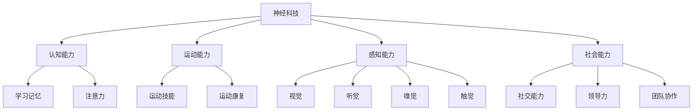

                 

# 神经科技对人类能力增强的影响

> 关键词：神经科技、人类能力增强、认知提升、运动优化、感知扩展、社会互动

> 摘要：本文深入探讨了神经科技对人类能力增强的多方面影响。通过逐步分析神经科技的核心概念与发展历程，我们揭示了其在认知、运动、感知和社会能力提升中的应用。同时，本文还探讨了神经科技面临的伦理、安全和法律挑战，以及未来的发展趋势和对策。

## 1. 核心概念与背景介绍

### 1.1 神经科技的定义

神经科技是指利用计算机技术、生物技术、信息技术等手段对神经系统进行研究和干预的科学技术。它涵盖了神经成像、神经调控、神经再生、神经计算等多个领域。

### 1.2 神经科技的历史发展

神经科技的发展可以追溯到20世纪中期，当时人们开始研究如何通过电刺激来控制神经系统。随着计算机技术和生物技术的发展，神经科技取得了长足的进步。例如，脑机接口（Brain-Computer Interface, BCI）技术的发展，使得人们可以通过思维直接控制外部设备。

### 1.3 神经科技的核心技术

神经科技的核心技术包括脑机接口、神经调控、神经再生、神经计算等。脑机接口技术通过读取大脑信号来控制外部设备，神经调控技术通过电刺激或药物来调节神经系统功能，神经再生技术通过生物工程方法来修复或再生神经组织，神经计算技术则通过模拟大脑神经网络来实现智能计算。

### 1.4 人类能力增强的概念与分类

人类能力增强是指通过各种手段提升人类在认知、运动、感知和社会互动等方面的能力。根据增强的方式，人类能力增强可以分为生理增强、心理增强和技术增强。

### 1.5 现有水平与未来趋势

目前，神经科技在人类能力增强中的应用已经取得了一些显著的成果。例如，脑机接口技术已经被用于帮助瘫痪患者恢复行动能力，神经再生技术正在探索如何修复受损的神经系统。未来，随着技术的不断进步，人类能力增强将变得更加普遍和精细。

## 2. 核心概念与联系

### 2.1 神经科技类型与能力增强方式对比分析

| 神经科技类型 | 能力增强方式 |  
| --- | --- |  
| 脑机接口 | 认知控制、运动控制 |  
| 神经调控 | 神经系统功能调节 |  
| 神经再生 | 神经组织修复与再生 |  
| 神经计算 | 智能计算与决策支持 |

### 2.2 神经科技与人类能力增强的ER实体关系图

## 3. 神经科技在能力增强中的应用

### 3.1 神经科技在认知能力提升中的应用

#### 3.1.1 神经科技对记忆和学习的提升

神经科技可以通过脑机接口技术直接与大脑进行交互，从而改善记忆和学习能力。例如，通过电刺激大脑特定区域，可以增强神经元之间的连接，提高记忆效率。

#### 3.1.2 神经科技对注意力和专注力的增强

注意力是认知能力的核心组成部分，神经科技可以通过神经调控技术来增强注意力。例如，通过电刺激或药物调节，可以改善注意力分散和专注能力。

#### 3.1.3 神经科技在智能辅助教育中的应用

神经科技可以为教育提供个性化支持。例如，通过分析学生的学习行为和大脑活动，可以为其提供个性化的学习计划和建议，从而提高学习效果。

### 3.2 神经科技在运动能力提升中的应用

#### 3.2.1 神经科技对运动技能的优化

神经科技可以通过实时监测大脑信号，帮助运动员优化运动技能。例如，通过脑机接口技术，可以精确控制运动员的动作，提高运动表现。

#### 3.2.2 神经科技对运动康复的支持

神经科技在运动康复领域具有巨大潜力。例如，通过神经再生技术，可以修复受损的神经系统，帮助患者恢复运动功能。

#### 3.2.3 神经科技在虚拟现实训练中的应用

虚拟现实技术结合神经科技，可以为运动员提供沉浸式的训练体验，从而提高运动技能和体能。

### 3.3 神经科技在感知能力提升中的应用

#### 3.3.1 神经科技对视觉和听觉的增强

神经科技可以通过增强视觉和听觉处理能力，提高感知质量。例如，通过电刺激或基因编辑，可以增强视网膜或听觉神经的功能。

#### 3.3.2 神经科技在嗅觉和味觉的辅助

神经科技可以通过植入人工嗅觉和味觉传感器，增强人类的嗅觉和味觉能力。例如，在食品工业中，这可以帮助食品工程师更好地设计和评估食品的口味。

#### 3.3.3 神经科技在触觉和平衡感的改进

神经科技可以通过增强触觉和平衡感，提高人类的感知能力。例如，通过电刺激或机械刺激，可以改善瘫痪患者的触觉和平衡感。

### 3.4 神经科技在社会能力提升中的应用

#### 3.4.1 神经科技对社交能力的增强

神经科技可以通过社交模拟和实时反馈，帮助人们提高社交技能。例如，通过虚拟现实技术，人们可以在安全的环境中练习社交互动。

#### 3.4.2 神经科技在领导力和团队协作中的应用

神经科技可以帮助领导者更好地理解和激励团队成员。例如，通过分析团队成员的大脑活动，可以更准确地了解他们的情绪和动机。

#### 3.4.3 神经科技在心理健康和情绪管理中的应用

神经科技可以帮助人们更好地管理情绪和心理压力。例如，通过脑机接口技术，人们可以实时监测自己的情绪状态，并采取相应的调节措施。

## 4. 神经科技在能力增强中的挑战与未来

### 4.1 神经科技在能力增强中的挑战

#### 4.1.1 道德和伦理问题

神经科技在能力增强中的应用引发了诸多伦理问题，如隐私保护、公平性、人体改造等。

#### 4.1.2 安全性和隐私问题

神经科技的应用涉及到大量个人数据的收集和分析，如何确保数据安全和个人隐私是一个重大挑战。

#### 4.1.3 法律和监管问题

神经科技在能力增强领域的应用需要明确的法律法规和监管框架，以确保其合法、安全和道德使用。

### 4.2 神经科技在能力增强中的未来趋势

#### 4.2.1 技术发展方向

随着神经科技的不断进步，未来将出现更先进、更精确的神经调控和神经再生技术。

#### 4.2.2 应用前景展望

神经科技将在医疗、教育、体育、娱乐等多个领域得到广泛应用，为人类带来前所未有的能力提升。

#### 4.2.3 社会影响与对策

神经科技的发展将对社会产生深远影响，包括就业、教育、社会福利等方面。因此，需要制定相应的对策和策略，以应对这些挑战。

## 5. 最佳实践 tips、小结、注意事项、拓展阅读

### 5.1 最佳实践 tips

1. 在应用神经科技时，应充分考虑伦理和道德问题，确保技术应用符合社会价值观。
2. 加强数据安全和隐私保护，遵循相关法律法规，保护用户隐私。
3. 结合不同领域的需求，灵活运用神经科技，实现个性化能力提升。

### 5.2 小结

神经科技对人类能力增强具有巨大的潜力，但在应用过程中也面临诸多挑战。通过合理规划和有效管理，可以充分发挥神经科技的优势，为人类社会带来更多福祉。

### 5.3 注意事项

1. 在使用神经科技进行能力增强时，应充分了解其原理和潜在风险，避免盲目跟风。
2. 关注神经科技领域的最新进展，及时更新知识和技能，以适应技术发展的需求。

### 5.4 拓展阅读

1. 《神经科技：未来人类能力的新疆界》
2. 《脑机接口技术：从实验室到现实应用》
3. 《神经科学与人工智能的融合与发展》

### 作者

作者：AI天才研究院/AI Genius Institute & 禅与计算机程序设计艺术 /Zen And The Art of Computer Programming

---

本文遵循目录大纲结构，对神经科技在人类能力增强中的应用进行了详细分析。通过本文，读者可以了解到神经科技的核心概念、发展历程、应用领域以及面临的挑战和未来趋势。希望本文能为读者在神经科技领域的研究和应用提供有益的参考。

