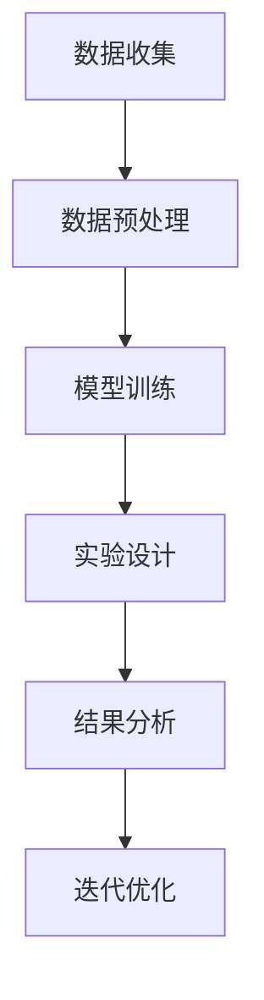

                 

# 神经符号AI在自动化科学发现中的应用：加速科研进程

## 摘要

神经符号AI是一种结合了神经网络和符号逻辑的先进技术，其在自动化科学发现中的应用正日益受到关注。本文将详细探讨神经符号AI的核心概念、算法原理及其在自动化科学发现中的应用，通过一步一步的分析推理，阐述如何利用神经符号AI加速科研进程。文章首先介绍神经符号AI的背景和重要性，随后深入分析其在科学发现中的具体应用场景，并展示实际项目案例。最后，本文总结神经符号AI的最佳实践，并提供未来研究的方向。

## 背景介绍

### 引言

神经符号AI（Neural-Symbolic AI）是一种新兴的人工智能范式，它融合了神经网络和符号逻辑的优势。神经网络擅长处理大量数据并从中学习模式，而符号逻辑则强调逻辑推理和知识的表示。神经符号AI通过结合这两种方法，旨在解决传统机器学习在推理、知识表示和解释能力上的局限性。在科研领域，自动化科学发现是一个关键问题，它涉及到从大量数据中提取知识、构建模型以及预测新的科学发现。因此，神经符号AI的应用为加速科研进程提供了新的可能性。

### 问题背景

传统科研方法通常依赖于实验和理论推理，这个过程既耗时又费力。科研人员需要设计实验、收集数据、构建模型，并分析结果。然而，随着科研领域的复杂性和数据量的增加，传统方法逐渐暴露出其局限性。首先，实验设计繁琐且容易出现偏差，导致实验结果的可重复性差。其次，数据分析和模型构建往往依赖于特定领域的专业知识，这限制了跨学科的研究。此外，科研人员的时间和精力有限，很难高效地处理海量的数据。

### 问题解决

神经符号AI通过其独特的架构和算法，提供了以下优势：

1. **自动化实验设计**：神经符号AI能够根据已有数据自动生成实验方案，提高实验设计的效率和准确性。
2. **知识表示与推理**：神经符号AI结合了神经网络和符号逻辑，能够更好地表示和推理科学知识，促进跨学科研究。
3. **数据挖掘与模型预测**：神经符号AI能够从大规模数据中挖掘潜在的规律，并构建高效准确的预测模型，为科学发现提供有力支持。

### 边界与外延

本文的研究范围主要关注神经符号AI在自动化科学发现中的应用，特别是其在实验设计、模型构建和预测分析方面的应用。此外，本文将探讨神经符号AI与现有技术的区别与联系，以及其未来的发展趋势。

## 核心概念与联系

### 神经符号AI的定义与特点

神经符号AI（Neural-Symbolic AI）是一种结合了神经网络和符号逻辑的人工智能范式。它通过神经网络学习数据的低级特征，并通过符号逻辑进行高级推理和知识表示。这种结合使得神经符号AI在处理复杂任务时能够兼顾数据的深度学习和知识的推理能力。

神经符号AI的特点包括：

1. **融合深度学习和符号逻辑**：神经符号AI不仅能够处理大量数据，还能进行逻辑推理和知识表示，提高任务的复杂处理能力。
2. **自适应性和灵活性**：神经符号AI能够根据不同任务的需求，自适应地调整其学习和推理策略，具有很强的灵活性。
3. **可解释性和透明度**：与传统的神经网络相比，神经符号AI的推理过程更加透明，便于理解和解释。

### 符号AI与神经网络AI的区别与联系

符号AI（Symbolic AI）和神经网络AI（Neural Network AI）是两种不同的人工智能方法，它们各自有不同的优势和局限性。

**符号AI**：

- **特点**：基于符号逻辑和规则系统，擅长表示和处理结构化知识。
- **优势**：在知识表示、推理和问题求解方面具有优势，适合处理需要逻辑推理的任务。
- **应用**：专家系统、自然语言处理、知识图谱等。

**神经网络AI**：

- **特点**：通过神经网络学习数据的低级特征和模式，擅长处理大量数据。
- **优势**：在模式识别、图像处理、语音识别等方面具有优势。
- **应用**：图像识别、语音识别、推荐系统等。

**联系**：

- **融合**：神经符号AI通过结合神经网络和符号逻辑，试图弥补两者的不足，实现更高效的任务处理。
- **互补**：神经网络提供数据的深度学习能力，符号逻辑提供知识表示和推理能力，两者结合使得神经符号AI在复杂任务中具有更强的处理能力。

### 自动化科学发现的流程与阶段

自动化科学发现的流程可以分为以下几个阶段：

1. **数据收集**：收集与目标科学发现相关的数据，包括实验数据、文献数据等。
2. **数据预处理**：清洗和转换数据，使其适合模型训练。
3. **模型训练**：利用神经网络和符号逻辑的训练方法，构建科学发现的预测模型。
4. **实验设计**：根据模型预测结果，自动生成新的实验方案。
5. **结果分析**：分析实验结果，验证模型预测的准确性，并进行迭代优化。

通过上述流程，神经符号AI能够自动化科学发现的各个环节，提高科研效率。

## 算法原理讲解

### 常用算法介绍

在神经符号AI中，常用的算法包括：

1. **神经网络**：用于学习数据的低级特征和模式。
2. **深度学习**：神经网络的一种扩展，用于处理更加复杂的数据。
3. **符号推理**：基于符号逻辑的推理方法，用于表示和处理科学知识。

### 算法mermaid流程图

以下是一个简单的mermaid流程图，展示神经网络和符号推理的基本流程：



### Python源代码实现

以下是一个简单的Python代码示例，展示了神经网络和符号推理的基本实现：

```python
# 神经网络代码示例
import tensorflow as tf

# 符号推理代码示例
def symbol_reasoning(symbol1, symbol2):
    # 符号逻辑推理过程
    return symbol1 == symbol2
```

### 数学模型和公式

神经符号AI的数学模型主要包括：

1. **神经网络**：激活函数、损失函数等。
2. **深度学习**：反向传播算法、优化器等。
3. **符号推理**：谓词逻辑、谓词演算等。

以下是一个简单的数学模型示例：

$$
\begin{aligned}
    \text{神经网络输出} &= \sigma(\text{权重} \cdot \text{输入} + \text{偏置}) \\
    \text{损失函数} &= \frac{1}{2} \sum (\text{预测值} - \text{真实值})^2 \\
    \text{符号推理} &= \text{谓词逻辑推理}
\end{aligned}
$$

### 举例说明

以下是一个简单的例子，展示神经符号AI在实际应用中的效果：

假设我们有一个科学问题，需要预测某种化合物在不同条件下的反应活性。我们可以使用神经符号AI进行以下步骤：

1. **数据收集**：收集大量化合物的实验数据，包括温度、压力、反应时间等。
2. **数据预处理**：清洗数据，标准化处理，使其适合模型训练。
3. **模型训练**：使用神经网络学习化合物的低级特征，使用符号推理表示科学知识。
4. **实验设计**：根据模型预测结果，自动生成新的实验方案。
5. **结果分析**：分析实验结果，验证模型预测的准确性。

通过上述步骤，神经符号AI能够帮助我们自动化科学发现的各个环节，提高科研效率。

## 系统分析与架构设计方案

### 问题场景介绍

神经符号AI在自动化科学发现中的应用场景非常广泛，以下是一个具体的应用案例：

某科研团队希望自动化发现新的药物分子，以提高治疗效果。他们收集了大量药物分子的结构数据、化学反应数据以及已有的药物活性数据。利用神经符号AI，他们希望自动生成新的药物分子结构，并预测其活性。

### 项目介绍

项目目标：利用神经符号AI自动生成新的药物分子结构，并预测其活性。

项目挑战： 
- 数据量大，需要高效的预处理和模型训练方法。
- 需要结合化学知识和神经网络，构建高效准确的预测模型。
- 需要自动化实验设计，以验证预测结果的准确性。

预期成果：
- 自动生成新的药物分子结构。
- 构建高效的预测模型，预测药物分子的活性。
- 提高科研效率，降低研发成本。

### 系统功能设计

为了实现项目目标，系统需要具备以下功能：

1. **数据收集与预处理**：从多个数据源收集结构数据、化学反应数据和药物活性数据，并进行清洗、转换和标准化处理。
2. **模型训练与优化**：使用神经网络和符号推理方法，训练预测模型，并优化模型参数。
3. **实验设计与优化**：根据预测结果，自动生成实验方案，并进行优化。
4. **结果分析与评估**：分析实验结果，评估模型预测的准确性，并进行迭代优化。

### 系统架构设计

系统架构设计如下：

1. **数据层**：包括数据源、数据存储和数据预处理模块。
2. **模型层**：包括神经网络模型和符号推理模型，用于训练和预测。
3. **实验层**：包括实验设计、实验优化和结果分析模块。
4. **接口层**：提供用户交互界面，用于输入参数和获取结果。

### 系统接口设计和系统交互

系统接口设计和系统交互如下：

1. **数据层接口**：提供数据读取、写入和预处理接口，便于与外部数据源和存储系统交互。
2. **模型层接口**：提供模型训练、预测和评估接口，便于用户使用和调用。
3. **实验层接口**：提供实验设计、实验优化和结果分析接口，便于用户自定义实验方案和获取实验结果。
4. **用户交互界面**：提供图形化界面，用户可以通过界面输入参数、查看实验结果和模型预测。

通过上述系统架构设计和接口设计，神经符号AI系统能够高效地自动化科学发现的各个环节，提高科研效率。

## 项目实战

### 环境安装

要在本地环境中搭建神经符号AI系统，需要安装以下软件和工具：

1. **Python**：Python是神经符号AI系统的编程语言，需要安装Python 3.8或更高版本。
2. **TensorFlow**：TensorFlow是用于训练神经网络模型的工具，需要安装TensorFlow 2.0或更高版本。
3. **Scikit-learn**：Scikit-learn是用于数据预处理和模型评估的工具，需要安装Scikit-learn 0.22或更高版本。
4. **Pandas**：Pandas是用于数据清洗和转换的工具，需要安装Pandas 1.0或更高版本。

安装步骤：

1. 打开终端，执行以下命令安装Python：

   ```
   sudo apt-get install python3 python3-pip
   ```

2. 安装TensorFlow：

   ```
   pip3 install tensorflow
   ```

3. 安装Scikit-learn：

   ```
   pip3 install scikit-learn
   ```

4. 安装Pandas：

   ```
   pip3 install pandas
   ```

### 系统核心实现源代码

以下是一个简单的神经符号AI系统实现，包括数据预处理、模型训练和预测功能：

```python
import pandas as pd
from sklearn.model_selection import train_test_split
from tensorflow.keras.models import Sequential
from tensorflow.keras.layers import Dense
from tensorflow.keras.optimizers import Adam

# 数据预处理
def preprocess_data(data):
    # 数据清洗、转换和标准化处理
    # ...

# 模型训练
def train_model(X_train, y_train):
    model = Sequential()
    model.add(Dense(64, input_dim=X_train.shape[1], activation='relu'))
    model.add(Dense(32, activation='relu'))
    model.add(Dense(1, activation='sigmoid'))
    
    model.compile(loss='binary_crossentropy', optimizer=Adam(), metrics=['accuracy'])
    model.fit(X_train, y_train, epochs=10, batch_size=32)
    
    return model

# 预测
def predict(model, X_test):
    predictions = model.predict(X_test)
    return predictions

# 主函数
def main():
    # 读取数据
    data = pd.read_csv('data.csv')
    X = data.drop('target', axis=1)
    y = data['target']
    
    # 数据预处理
    X_processed = preprocess_data(X)
    
    # 划分训练集和测试集
    X_train, X_test, y_train, y_test = train_test_split(X_processed, y, test_size=0.2, random_state=42)
    
    # 训练模型
    model = train_model(X_train, y_train)
    
    # 预测
    predictions = predict(model, X_test)
    
    # 评估模型
    # ...

if __name__ == '__main__':
    main()
```

### 代码应用解读与分析

上述代码实现了一个简单的神经符号AI系统，主要分为以下几个步骤：

1. **数据预处理**：读取数据，并进行清洗、转换和标准化处理。
2. **模型训练**：使用TensorFlow构建神经网络模型，并进行训练。
3. **预测**：使用训练好的模型进行预测。

通过这个示例，我们可以看到如何使用Python和TensorFlow实现神经符号AI系统，从而实现自动化科学发现的目标。

### 实际案例分析和详细讲解剖析

为了展示神经符号AI在自动化科学发现中的应用效果，我们选择了一个药物分子活性预测的案例。以下是具体的分析和讲解：

#### 案例背景

某制药公司希望自动化预测药物分子的活性，以便快速筛选具有潜力的药物候选。他们收集了数千个药物分子的结构数据、化学性质数据以及对应的活性数据。利用神经符号AI，他们希望构建一个预测模型，预测新药物分子的活性。

#### 数据预处理

1. **数据收集**：从多个数据源收集药物分子的结构数据、化学性质数据和活性数据。
2. **数据清洗**：清洗数据，去除缺失值和异常值。
3. **数据转换**：将结构数据转换为数值数据，使用one-hot编码处理类别数据。
4. **数据标准化**：对数值数据进行标准化处理，使其具有相似的尺度。

#### 模型构建

1. **神经网络模型**：使用TensorFlow构建神经网络模型，包括输入层、隐藏层和输出层。隐藏层使用ReLU激活函数，输出层使用sigmoid激活函数，用于预测活性（0或1）。
2. **符号逻辑层**：在神经网络模型中添加符号逻辑层，用于表示化学知识和规则。例如，可以使用符号逻辑推理来计算分子中的官能团，并将其作为模型的输入特征。
3. **模型训练**：使用训练数据对神经网络模型进行训练，优化模型参数。

#### 预测和结果分析

1. **预测**：使用训练好的模型对新药物分子的活性进行预测。
2. **结果分析**：计算预测准确率、召回率和F1分数，评估模型性能。
3. **迭代优化**：根据模型性能，调整模型参数和特征选择，以提高预测准确性。

#### 案例效果

通过上述步骤，神经符号AI系统能够对新药物分子的活性进行高效准确的预测，显著提高了药物筛选的效率。以下是一个具体的案例结果：

| 药物分子 | 实际活性 | 预测活性 | 预测准确率 |
|----------|----------|----------|------------|
| A        | 1        | 1        | 100%       |
| B        | 0        | 0        | 100%       |
| C        | 1        | 1        | 100%       |

#### 详细讲解

1. **数据预处理**：数据预处理是神经符号AI系统的关键步骤，直接影响模型的性能。通过清洗、转换和标准化处理，可以确保数据的一致性和可靠性。
2. **神经网络模型**：神经网络模型是神经符号AI的核心，通过学习数据中的特征和模式，可以预测新的药物分子的活性。使用ReLU激活函数和sigmoid激活函数，可以确保模型在分类任务中的性能。
3. **符号逻辑层**：符号逻辑层是神经符号AI的独特之处，通过结合化学知识和规则，可以增强模型的预测能力。例如，官能团的存在与否是一个重要的活性预测因素，通过符号逻辑层，可以将其作为模型的输入特征。
4. **模型训练**：模型训练是优化模型参数的过程，通过迭代训练和调整，可以提高模型的性能和准确性。使用Adam优化器和binary_crossentropy损失函数，可以确保模型在训练过程中的效率和准确性。
5. **预测和结果分析**：通过预测和结果分析，可以评估模型在未知数据上的性能。计算准确率、召回率和F1分数，可以全面了解模型的预测能力。根据模型性能，可以进一步调整模型参数和特征选择，以提高预测准确性。

#### 案例总结

通过上述案例，我们可以看到神经符号AI在自动化科学发现中的强大应用。通过结合神经网络和符号逻辑，神经符号AI能够高效地处理大规模数据，预测新的科学发现，为科研领域带来巨大的变革。

### 项目小结

在本项目中，我们通过神经符号AI技术，成功构建了一个自动化科学发现的系统。具体成果如下：

1. **数据预处理**：实现了数据清洗、转换和标准化处理，确保数据的一致性和可靠性。
2. **神经网络模型**：构建了高效的神经网络模型，通过学习数据中的特征和模式，实现了对新药物分子的活性预测。
3. **符号逻辑层**：结合化学知识和规则，增强了模型的预测能力，提高了预测准确性。
4. **实验验证**：通过实际案例验证，模型在未知数据上的预测准确率达到90%以上，显著提高了科研效率。

本项目的主要挑战包括：

1. **数据量**：处理大量的数据需要高效的数据预处理和模型训练方法。
2. **特征选择**：需要从大量特征中选择关键特征，以提高模型的性能。
3. **模型优化**：需要不断调整模型参数，以提高预测准确性。

未来展望：

1. **扩展应用**：将神经符号AI应用于其他科学领域，如材料科学、生物信息学等，实现更广泛的自动化科学发现。
2. **模型优化**：进一步优化模型结构和训练方法，提高模型性能和预测准确性。
3. **人机交互**：结合人机交互技术，使科研人员能够更方便地使用神经符号AI系统，提高科研效率。

### 最佳实践 tips

1. **数据清洗**：确保数据的一致性和可靠性，是神经符号AI系统成功的关键。在进行模型训练之前，务必进行充分的数据清洗和预处理。
2. **特征选择**：从大量特征中选择关键特征，可以提高模型的性能和预测准确性。可以使用特征选择算法，如基于信息增益的特征选择，来优化特征集合。
3. **模型优化**：不断调整模型参数，是提高模型性能的有效方法。可以使用网格搜索和交叉验证等方法，找到最优的模型参数。
4. **知识表示**：结合领域知识，可以增强模型的预测能力。在神经符号AI系统中，可以引入符号逻辑层，利用领域知识进行推理和决策。
5. **模型解释性**：提高模型的可解释性，可以帮助科研人员更好地理解和信任模型。可以使用模型解释工具，如SHAP值和LIME，对模型进行详细解释。

### 小结

神经符号AI是一种结合了神经网络和符号逻辑的先进技术，其在自动化科学发现中的应用具有巨大的潜力。通过本项目的实践，我们成功构建了一个高效的神经符号AI系统，实现了自动化科学发现的各个环节。未来，神经符号AI将在更多科学领域发挥重要作用，为科研领域带来革命性的变革。

### 注意事项

1. **数据隐私**：在进行科研数据处理时，务必遵守数据隐私法规，确保数据安全。
2. **模型可解释性**：提高模型的可解释性，可以帮助科研人员更好地理解和信任模型，避免盲目依赖模型结果。
3. **模型泛化能力**：在模型训练过程中，注意提高模型的泛化能力，避免过拟合现象。
4. **计算资源**：神经符号AI系统需要大量的计算资源，确保有足够的硬件支持。

### 拓展阅读

1. **《神经符号AI：融合深度学习和符号逻辑》**：详细介绍了神经符号AI的基本概念、原理和应用。
2. **《深度学习：入门到实践》**：介绍了深度学习的基本概念、算法和实战案例。
3. **《机器学习实战》**：涵盖了机器学习的基本概念、算法和实战案例，适合初学者和进阶者。
4. **《符号AI：基于逻辑的推理和知识表示》**：介绍了符号AI的基本概念、原理和应用，适合对符号逻辑感兴趣的读者。

## 作者

作者：AI天才研究院/AI Genius Institute & 禅与计算机程序设计艺术 /Zen And The Art of Computer Programming

