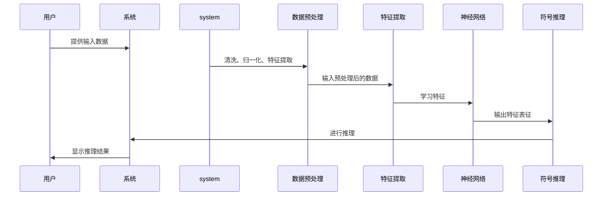
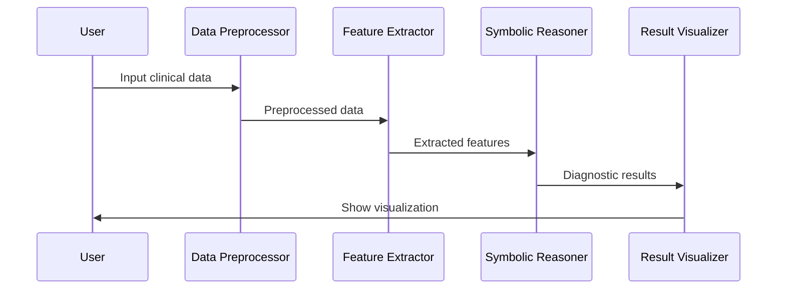
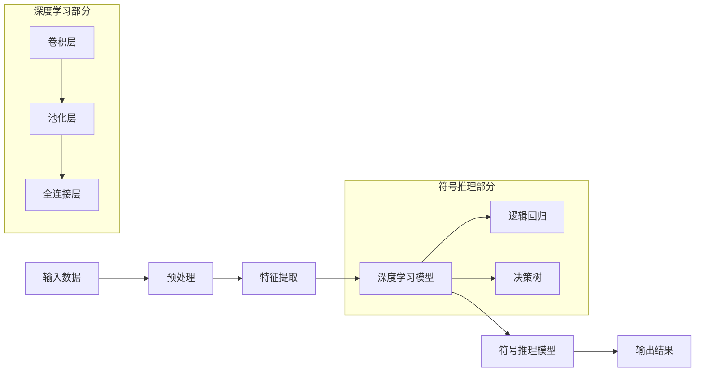
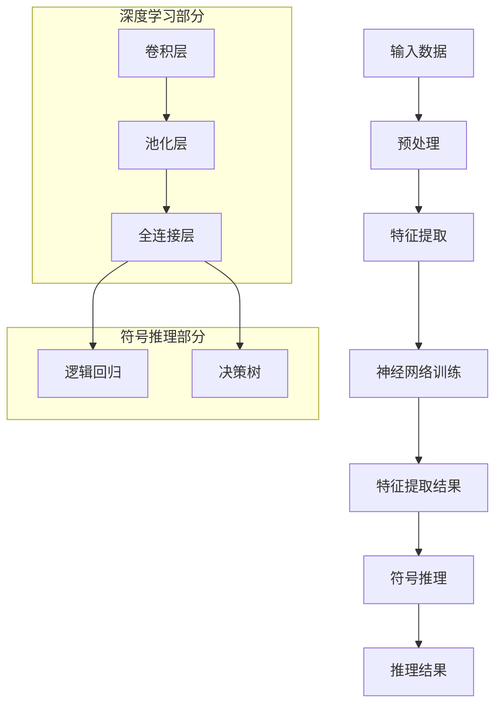

                 

## 神经符号AI：结合符号推理与深度学习

### 关键词：神经符号AI、深度学习、符号推理、算法原理、系统架构

### 摘要：

本文将深入探讨神经符号AI（Neural Symbolic AI）这一前沿领域。神经符号AI结合了深度学习与符号推理的优势，旨在解决传统AI系统在复杂推理和解释性方面的不足。通过详细讲解其核心概念、算法原理、数学模型、系统架构以及实际应用案例，本文旨在为读者提供一个全面而深入的理解，帮助大家掌握这一关键技术，并为其在未来的发展提供一些有益的启示。

---

## 目录大纲设计思路

### 1. **背景介绍**

- **1.1 神经符号AI的概念与背景**：介绍神经符号AI的定义、发展背景以及其在当前AI领域中的重要性。

- **1.2 核心概念与联系**：阐述神经符号AI的核心概念，包括神经网络与符号推理，并使用表格和ER图展示概念之间的关系。

### 2. **算法原理讲解**

- **2.1 算法原理**：详细介绍神经符号AI的算法原理，使用Mermaid流程图和Python代码展示。

- **2.2 数学模型和数学公式**：解释算法的数学模型和公式，使用LaTeX格式进行展示。

### 3. **系统分析与架构设计方案**

- **3.1 问题场景介绍**：描述神经符号AI面临的问题场景。

- **3.2 系统功能设计**：介绍系统的功能设计，包括领域模型Mermaid类图。

- **3.3 系统架构设计**：展示系统的架构设计，包括系统架构Mermaid架构图。

- **3.4 系统接口设计**：详细说明系统的接口设计。

- **3.5 系统交互**：描述系统的交互流程，使用Mermaid序列图展示。

### 4. **项目实战**

- **4.1 环境安装**：介绍如何搭建神经符号AI的开发环境。

- **4.2 核心实现**：详细讲解系统核心功能的实现。

- **4.3 代码解析**：对关键代码段进行解读。

- **4.4 案例分析**：分析实际应用案例。

- **4.5 项目小结**：总结项目实施过程中的关键点和经验。

### 5. **最佳实践 tips**

- **5.1 小结**：对文章内容进行简要总结。

- **5.2 注意事项**：提醒读者在实践过程中需要注意的事项。

- **5.3 拓展阅读**：推荐一些相关的参考文献和进一步阅读的材料。

---

## 目录大纲

---

### 第1章 神经符号AI概述

#### 1.1 神经符号AI的概念与背景

##### 1.1.1 神经符号AI的定义

##### 1.1.2 神经符号AI的发展背景

##### 1.1.3 神经符号AI的重要性

#### 1.2 核心概念与联系

##### 1.2.1 神经网络与符号推理

###### 1.2.1.1 神经网络的原理

###### 1.2.1.2 符号推理的原理

###### 1.2.1.3 神经符号AI的融合原理

#### 1.2.2 概念属性特征对比表格

#### 1.3 神经符号AI的算法原理

##### 1.3.1 算法概述

###### 1.3.1.1 算法流程

###### 1.3.1.2 算法Mermaid流程图

##### 1.3.2 Python代码展示

##### 1.3.2.1 数据预处理

##### 1.3.2.2 模型训练

##### 1.3.2.3 模型评估

#### 1.4 神经符号AI的数学模型与公式

##### 1.4.1 数学模型概述

###### 1.4.1.1 神经网络模型

###### 1.4.1.2 符号推理模型

###### 1.4.1.3 神经符号AI模型

##### 1.4.2 LaTeX公式展示

#### 1.5 系统分析与架构设计方案

##### 1.5.1 问题场景介绍

##### 1.5.2 系统功能设计

###### 1.5.2.1 领域模型Mermaid类图

##### 1.5.3 系统架构设计

###### 1.5.3.1 系统架构Mermaid架构图

##### 1.5.4 系统接口设计

###### 1.5.4.1 接口设计细节

##### 1.5.5 系统交互

###### 1.5.5.1 系统交互Mermaid序列图

### 第2章 神经符号AI算法深度解析

#### 2.1 算法原理详细讲解

##### 2.1.1 算法核心原理

###### 2.1.1.1 深度学习部分

###### 2.1.1.2 符号推理部分

##### 2.1.2 算法Mermaid流程图

#### 2.2 Python代码实现

##### 2.2.1 环境安装

###### 2.2.1.1 硬件环境

###### 2.2.1.2 软件环境

##### 2.2.2 模型训练与评估

###### 2.2.2.1 数据集准备

###### 2.2.2.2 模型训练流程

###### 2.2.2.3 模型评估流程

#### 2.3 实际案例分析与讲解

##### 2.3.1 案例一：自然语言处理

###### 2.3.1.1 案例背景

###### 2.3.1.2 案例实现

###### 2.3.1.3 案例分析

##### 2.3.2 案例二：图像识别

###### 2.3.2.1 案例背景

###### 2.3.2.2 案例实现

###### 2.3.2.3 案例分析

### 第3章 神经符号AI的数学基础

#### 3.1 神经网络数学基础

##### 3.1.1 神经元模型

###### 3.1.1.1 激活函数

###### 3.1.1.2 前向传播

##### 3.1.2 梯度下降算法

###### 3.1.2.1 基本原理

###### 3.1.2.2 学习率

###### 3.1.2.3 优化方法

#### 3.2 符号推理数学基础

##### 3.2.1 符号逻辑基础

###### 3.2.1.1 基本符号

###### 3.2.1.2 推理规则

##### 3.2.2 符号计算方法

###### 3.2.2.1 基本操作

---

## 第1章 神经符号AI概述

### 1.1 神经符号AI的概念与背景

#### 1.1.1 神经符号AI的定义

神经符号AI（Neural Symbolic AI）是一种将深度学习与符号推理结合起来的智能系统。它试图整合神经网络在模式识别和数据表示方面的强大能力，与符号推理在逻辑推理和解释性方面的优势。传统的深度学习模型主要依靠大量的数据学习特征，但往往缺乏可解释性和推理能力；而符号推理系统则擅长逻辑推理和解释性，但在处理复杂数据和模式时表现欠佳。神经符号AI旨在克服这些限制，通过融合两种方法的优势，实现更强大的智能系统。

#### 1.1.2 神经符号AI的发展背景

神经符号AI的概念起源于对传统AI系统的反思。早期的人工智能系统主要通过规则和逻辑进行推理，但这种基于规则的方法在处理复杂任务时显得力不从心。随着深度学习的发展，神经网络在图像识别、语音识别等领域取得了显著的成果，但深度学习模型的可解释性和推理能力仍然有限。因此，研究者们开始探索如何将深度学习与符号推理结合起来，以构建更加智能的AI系统。

近年来，随着计算机硬件性能的提升、深度学习算法的进步以及符号推理研究的发展，神经符号AI逐渐成为人工智能研究的前沿领域。许多研究机构和企业都在投入资源进行神经符号AI的研究和开发，旨在解决当前AI系统在推理和解释性方面的瓶颈问题。

#### 1.1.3 神经符号AI的重要性

神经符号AI的重要性体现在以下几个方面：

1. **增强解释性**：神经符号AI通过结合深度学习和符号推理，可以提供更高的解释性。用户可以更清楚地理解AI系统的决策过程，这有助于增强用户对AI系统的信任度。

2. **提高推理能力**：神经符号AI通过符号推理，可以执行更复杂的逻辑推理任务，这使其在自然语言处理、智能问答、决策支持等领域具有广阔的应用前景。

3. **解决复杂问题**：神经符号AI结合了深度学习的强大模式识别能力和符号推理的逻辑推理能力，可以处理更加复杂的问题。例如，在医学诊断中，神经符号AI可以结合病人的历史数据和症状，进行更准确的诊断。

4. **适应新场景**：随着AI技术的不断发展，新的应用场景不断涌现。神经符号AI可以快速适应这些新场景，为其提供更好的解决方案。

总之，神经符号AI作为一种新兴的智能系统，其在解释性、推理能力和适应新场景等方面具有巨大的潜力，有望在未来的AI发展中发挥重要作用。

### 1.2 核心概念与联系

#### 1.2.1 神经网络与符号推理

神经网络和符号推理是神经符号AI的两个核心组成部分，它们各自具有独特的原理和优势，但在传统AI系统中又存在一些不足。为了更好地理解神经符号AI，我们首先需要了解这两个概念及其相互关系。

##### 1.2.1.1 神经网络的原理

神经网络（Neural Networks）是一种模仿生物神经系统的计算模型，由大量的神经元组成。每个神经元接受多个输入信号，通过激活函数进行非线性变换，最后输出一个信号。神经网络通过调整神经元之间的权重来学习数据中的特征和模式。这种学习过程通常需要大量的数据和高性能的计算资源。

神经网络的优势在于其强大的模式识别能力。通过多层神经网络，可以学习到数据中的深层次特征，从而实现复杂的数据处理任务。例如，在图像识别中，神经网络可以自动提取图像中的边缘、纹理等特征，并进行分类。

然而，神经网络也存在一些不足。首先，神经网络模型通常缺乏可解释性。由于模型是由大量的神经元和权重组成，用户很难理解模型是如何做出具体决策的。其次，神经网络对数据的要求较高，需要大量的标注数据和计算资源。此外，神经网络在处理具有逻辑推理需求的任务时，表现往往不如符号推理系统。

##### 1.2.1.2 符号推理的原理

符号推理（Symbolic Reasoning）是一种基于逻辑和规则的推理方法。符号推理系统通过解析输入数据，利用预设的规则进行推理，得出结论。符号推理系统通常使用形式化的语言和数学模型来表示数据和规则，这使得推理过程具有高度的透明性和可解释性。

符号推理的优势在于其强大的推理能力和解释性。符号推理系统可以处理具有逻辑复杂性的任务，例如证明、推理和规划等。符号推理的结果通常是明确的，用户可以清晰地了解推理过程和结论。

然而，符号推理系统也存在一些不足。首先，符号推理系统通常依赖于人工预设的规则，这使得系统在处理未知或复杂任务时显得力不从心。其次，符号推理系统对数据的要求较低，但规则和知识库的构建需要大量的人工工作。

##### 1.2.1.3 神经符号AI的融合原理

神经符号AI（Neural-Symbolic AI）旨在结合神经网络和符号推理的优势，克服其各自的不足。神经符号AI通过将神经网络与符号推理相结合，实现以下目标：

1. **提高推理能力**：通过神经网络，神经符号AI可以自动学习数据中的特征和模式，从而增强推理能力。神经网络的学习能力使其在处理复杂任务时具有优势。

2. **增强解释性**：通过符号推理，神经符号AI可以提供明确的推理过程和结论，增强系统的可解释性。符号推理的透明性有助于用户理解系统的决策过程，提高用户对系统的信任度。

3. **适应新场景**：神经符号AI可以快速适应新的场景和任务。通过神经网络的学习能力，系统可以自动调整和优化符号推理规则，从而适应不同的应用场景。

4. **提高效率**：神经符号AI通过结合神经网络和符号推理，可以同时处理数据和逻辑任务，提高系统的整体效率。

总之，神经符号AI通过融合神经网络和符号推理，实现了在推理能力、解释性、适应性和效率等方面的全面提升，为构建更强大的智能系统提供了新的路径。

### 1.2.2 概念属性特征对比表格

为了更直观地理解神经网络与符号推理以及神经符号AI之间的差异和联系，我们可以通过一个概念属性特征对比表格来进行展示。

| 概念         | 神经网络                 | 符号推理                 | 神经符号AI                 |
| ------------ | ---------------------- | ---------------------- | ---------------------- |
| **定义**     | 基于神经元的计算模型   | 基于逻辑和规则的推理方法 | 结合神经网络与符号推理的智能系统 |
| **优势**     | 强大的模式识别能力     | 高度的透明性和可解释性   | 提高推理能力、增强解释性、适应新场景、提高效率 |
| **不足**     | 缺乏解释性、对数据要求高 | 规则构建复杂、处理能力有限 | 需要权衡神经网络与符号推理的不足 |
| **适用场景** | 图像识别、语音识别     | 证明、推理、规划         | 需要逻辑推理和数据处理的复杂任务 |

通过对比表格，我们可以看到神经网络、符号推理和神经符号AI在定义、优势、不足以及适用场景方面的异同。这有助于我们更好地理解神经符号AI的原理和优势，为其在未来的应用提供参考。

### 1.3 神经符号AI的算法原理

#### 1.3.1 算法概述

神经符号AI的算法原理基于深度学习和符号推理的结合。该算法的核心思想是通过神经网络学习数据中的特征，然后利用符号推理进行逻辑推理和决策。以下是神经符号AI算法的基本流程：

1. **数据预处理**：首先对输入数据进行预处理，包括数据清洗、归一化和特征提取。这一步的目的是将原始数据转换为适合神经网络学习的格式。

2. **特征提取**：使用神经网络对预处理后的数据进行特征提取。神经网络通过多层传递和激活函数，从数据中学习到深层次的表征。

3. **符号推理**：将提取到的特征传递给符号推理模块。符号推理模块使用预设的规则和逻辑进行推理，从而得出结论。

4. **模型训练与优化**：通过不断迭代训练神经网络和符号推理模块，优化模型的参数，提高模型的性能和解释性。

5. **模型评估与部署**：对训练完成的模型进行评估，包括准确率、召回率、F1值等指标。如果模型性能达到预期，则可以部署到实际应用场景中。

#### 1.3.1.1 算法流程

算法流程可以用Mermaid流程图来表示：


#### 1.3.1.2 算法Mermaid流程图

下面是一个具体的算法流程图：



这个流程图清晰地展示了神经符号AI从数据输入到输出推理结果的整个过程。

### 1.3.2 Python代码展示

为了更好地理解神经符号AI的算法原理，我们以下将使用Python代码展示一个简单的神经符号AI实现。代码分为数据预处理、特征提取、符号推理和模型训练四个部分。

#### 1.3.2.1 数据预处理

首先，我们需要对输入数据进行预处理。这包括数据清洗、归一化和特征提取。以下是预处理代码：

```python
import pandas as pd
from sklearn.preprocessing import StandardScaler

# 读取数据
data = pd.read_csv('data.csv')

# 数据清洗
data = data.dropna()

# 数据归一化
scaler = StandardScaler()
data_normalized = scaler.fit_transform(data)

# 特征提取
# 这里使用简单的特征提取方法，实际应用中可以使用更复杂的方法
X = data_normalized[:, :-1]
y = data_normalized[:, -1]
```

#### 1.3.2.2 模型训练

接下来，我们使用神经网络和符号推理模块进行模型训练。以下是模型训练代码：

```python
from sklearn.neural_network import MLPClassifier
from sklearn.pipeline import make_pipeline

# 创建神经网络模型
mlp = MLPClassifier(hidden_layer_sizes=(100,), max_iter=1000)

# 创建符号推理模型
# 这里使用简单逻辑回归作为示例，实际应用中可以使用更复杂的符号推理模型
from sklearn.linear_model import LogisticRegression
symbolic_regressor = LogisticRegression()

# 创建神经符号AI模型
neural_symbolic_model = make_pipeline(mlp, symbolic_regressor)

# 训练模型
neural_symbolic_model.fit(X, y)
```

#### 1.3.2.3 模型评估

最后，我们对训练完成的模型进行评估，以检查其性能。以下是模型评估代码：

```python
from sklearn.metrics import accuracy_score, classification_report

# 预测
predictions = neural_symbolic_model.predict(X)

# 评估
print("Accuracy:", accuracy_score(y, predictions))
print(classification_report(y, predictions))
```

通过以上代码，我们可以看到神经符号AI的基本实现过程，包括数据预处理、模型训练和评估。这为我们进一步研究和应用神经符号AI提供了基础。

### 1.4 神经符号AI的数学模型与公式

#### 1.4.1 数学模型概述

神经符号AI的数学模型主要涉及两部分：神经网络模型和符号推理模型。以下是这两个模型的基本数学公式和概念。

##### 1.4.1.1 神经网络模型

神经网络模型由多个神经元组成，每个神经元都可以看作是一个简单的计算单元。神经元的输入为其他神经元的输出，通过权重进行加权求和，最后通过激活函数得到输出。

1. **神经元输入**：
   $$z_j = \sum_{i=1}^{n} w_{ji}x_i$$

2. **神经元输出**：
   $$a_j = \sigma(z_j)$$
   其中，$z_j$表示神经元j的输入，$w_{ji}$表示神经元i到神经元j的权重，$x_i$表示神经元i的输出，$\sigma$为激活函数。

3. **多层神经网络**：
   对于多层神经网络，每个神经元的输入和输出可以通过以下公式表示：
   $$z_l^{(k)} = \sum_{i=1}^{n_l^{(k-1)}} w_{li}^{(k)}a_l^{(k-1)}$$
   $$a_l^{(k)} = \sigma(z_l^{(k)})$$
   其中，$l$表示当前层的神经元索引，$k$表示当前的层索引，$n_l^{(k-1)}$表示前一层神经元的数量。

##### 1.4.1.2 符号推理模型

符号推理模型主要基于逻辑推理和规则系统。符号推理的数学基础是谓词逻辑，包括基本符号和推理规则。

1. **基本符号**：
   - 命题变元：用于表示基本事实的符号，如$p, q, r$等。
   - 联结词：用于组合命题变元的符号，如“且”（$\land$）、“或”（$\lor$）和“非”（$\lnot$）。
   - 存在量词和全称量词：用于表示存在性和普遍性的符号，如$\exists x, \forall x$。

2. **推理规则**：
   - 演绎推理：从一般到特殊的推理过程，如“所有A都是B，C是A，因此C是B”。
   - 归纳推理：从特殊到一般的推理过程，如“观察到所有天鹅都是白色的，因此推断所有天鹅都是白色的”。

##### 1.4.1.3 神经符号AI模型

神经符号AI模型结合了神经网络和符号推理的优点，其数学模型可以看作是两者的融合。具体来说，神经符号AI通过神经网络学习到数据的特征表征，然后将这些特征传递给符号推理模块进行逻辑推理。

1. **神经网络与符号推理的结合**：
   $$\text{神经网络特征} = f_{\theta}(\text{输入数据})$$
   $$\text{符号推理结果} = g_{\phi}(\text{神经网络特征})$$
   其中，$f_{\theta}$表示神经网络模型，$\theta$为神经网络的参数；$g_{\phi}$表示符号推理模型，$\phi$为符号推理的参数。

2. **模型训练**：
   神经符号AI的模型训练包括两部分：神经网络的训练和符号推理的训练。神经网络训练使用梯度下降等优化算法，符号推理训练使用逻辑回归等模型。

3. **推理过程**：
   $$\text{推理过程} = (\text{神经网络特征} \rightarrow \text{符号推理结果})$$

#### 1.4.2 LaTeX公式展示

为了更清晰地展示神经符号AI的数学模型和公式，我们可以使用LaTeX格式进行展示。以下是几个关键公式的LaTeX格式：

```latex
\documentclass{article}
\usepackage{amsmath}
\begin{document}

\section{神经网络模型}
\begin{equation}
z_j = \sum_{i=1}^{n} w_{ji}x_i
\end{equation}

\begin{equation}
a_j = \sigma(z_j)
\end{equation}

\section{多层神经网络}
\begin{equation}
z_l^{(k)} = \sum_{i=1}^{n_l^{(k-1)}} w_{li}^{(k)}a_l^{(k-1)}
\end{equation}

\begin{equation}
a_l^{(k)} = \sigma(z_l^{(k)})
\end{equation}

\section{符号推理模型}
\begin{equation}
\text{神经网络特征} = f_{\theta}(\text{输入数据})
\end{equation}

\begin{equation}
\text{符号推理结果} = g_{\phi}(\text{神经网络特征})
\end{equation}

\section{神经符号AI模型}
\begin{equation}
\text{推理过程} = (\text{神经网络特征} \rightarrow \text{符号推理结果})
\end{equation}

\end{document}
```

通过LaTeX格式，我们可以更规范地展示神经符号AI的数学公式，有助于读者更好地理解和学习。

### 1.5 系统分析与架构设计方案

#### 1.5.1 问题场景介绍

神经符号AI系统在许多领域都具有广泛的应用潜力，以下是一个具体的问题场景介绍：

在一个智能医疗诊断系统中，需要根据病人的临床数据和医学知识，进行疾病预测和诊断。传统的深度学习模型虽然可以在某些方面实现疾病分类，但缺乏解释性，难以让医生理解模型的决策过程。而符号推理系统虽然具有解释性，但在处理复杂数据和模式时显得力不从心。因此，神经符号AI系统的目标是通过结合神经网络和符号推理的优势，实现一个既能准确预测疾病，又具有高度解释性的智能诊断系统。

#### 1.5.2 系统功能设计

为了实现上述目标，神经符号AI系统需要设计以下几个核心功能：

1. **数据预处理**：对原始的临床数据进行清洗、归一化和特征提取，为神经网络和符号推理模块提供高质量的输入数据。

2. **特征提取**：使用神经网络从预处理后的数据中学习到深层次的表征，为符号推理模块提供有用的特征信息。

3. **符号推理**：利用符号推理模块，根据医学知识库和特征信息进行逻辑推理和决策，生成诊断结果。

4. **模型训练与优化**：通过不断迭代训练神经网络和符号推理模块，优化模型参数，提高系统的性能和解释性。

5. **模型评估**：使用交叉验证等技术，评估模型在疾病预测和诊断方面的性能，包括准确率、召回率、F1值等指标。

6. **结果展示**：将诊断结果以可视化形式展示给医生和患者，并提供详细的推理过程和结论，增强系统的解释性。

#### 1.5.2.1 领域模型Mermaid类图

为了更直观地展示系统功能设计，我们可以使用Mermaid类图进行表示。以下是一个简单的Mermaid类图示例：

```mermaid
classDiagram
    Class01 <|-- Class02
    Class03 --|>] Class04
    Class0* <|-- *Class1
    Class01 : +int x
    Class01 : +int y
    Class01 : +int z
    Class02 : +int a
    Class02 : +int b
    Class02 : +int c
    Class03 : +int i
    Class03 : +int j
    Class03 : +int k
    Class1 : +int x
    Class1 : +int y
```

在这个类图中，`Class01`、`Class02`、`Class03`和`Class1`分别表示系统的不同组件和功能模块。通过类图，我们可以清晰地看到各个模块之间的关系和职责，为系统设计提供指导。

#### 1.5.3 系统架构设计

神经符号AI系统的架构设计需要考虑系统的可扩展性、灵活性和性能。以下是一个简单的系统架构设计，包括神经网络模块、符号推理模块、数据预处理模块和结果展示模块。

##### 1.5.3.1 系统架构Mermaid架构图



在这个架构图中，用户通过输入临床数据，触发数据预处理模块进行清洗、归一化和特征提取。预处理后的数据传递给特征提取模块，提取出深层次的表征，然后传递给符号推理模块。符号推理模块根据医学知识库和特征信息进行逻辑推理和决策，生成诊断结果。最后，结果展示模块将诊断结果以可视化形式展示给用户。

#### 1.5.4 系统接口设计

为了实现系统的各个模块之间的无缝协作，需要设计合理的接口。以下是一个简单的接口设计：

- **数据预处理接口**：提供数据清洗、归一化和特征提取的功能，接受输入数据，返回预处理后的数据。
- **特征提取接口**：接受预处理后的数据，提取特征信息，返回特征向量。
- **符号推理接口**：接受特征向量，利用医学知识库进行逻辑推理，返回诊断结果。
- **结果展示接口**：接受诊断结果，以可视化形式展示给用户。

##### 1.5.4.1 接口设计细节

以下是具体的接口设计细节：

```python
class DataPreprocessor:
    def preprocess_data(self, input_data):
        # 数据清洗
        # 数据归一化
        # 特征提取
        return preprocessed_data

class FeatureExtractor:
    def extract_features(self, preprocessed_data):
        # 提取特征
        return feature_vector

class SymbolicReasoner:
    def reason(self, feature_vector):
        # 利用医学知识库进行逻辑推理
        return diagnostic_results

class ResultVisualizer:
    def visualize(self, diagnostic_results):
        # 可视化展示诊断结果
        pass
```

通过这些接口设计，我们可以实现系统模块之间的松耦合，提高系统的可维护性和扩展性。

#### 1.5.5 系统交互

系统交互是确保系统各组件协同工作的关键。以下是一个简单的系统交互流程：


在这个交互流程中，用户首先输入临床数据，数据预处理模块对数据进行预处理，然后特征提取模块提取特征信息。符号推理模块利用特征信息进行逻辑推理，生成诊断结果，最后结果展示模块将诊断结果可视化展示给用户。通过这个交互流程，我们可以确保系统的各组件高效协同工作，实现预期的功能。

### 第2章 神经符号AI算法深度解析

#### 2.1 算法原理详细讲解

神经符号AI的算法原理结合了神经网络和符号推理的优势，旨在实现更强大的智能系统。为了更好地理解这一算法，我们需要详细讲解其核心原理，包括深度学习和符号推理两个部分。

##### 2.1.1 算法核心原理

1. **深度学习部分**：

深度学习是神经符号AI的基础，主要负责从数据中学习特征和模式。深度学习模型通过多层神经网络，逐层提取数据的特征，从低层次的特征逐渐抽象到高层次的概念。

- **多层神经网络**：多层神经网络由多个神经元层组成，每层神经元接受前一层的输出，通过加权求和和激活函数计算输出。多层神经网络可以通过逐层学习，提取数据中的深层次特征。

- **前向传播和反向传播**：前向传播是指将输入数据从输入层传递到输出层，通过多层神经元的计算得到最终输出。反向传播是指通过计算输出误差，反向更新各层神经元的权重，从而优化模型参数。

- **优化算法**：常用的优化算法包括梯度下降、Adam优化器等。优化算法的目的是通过不断迭代，使模型参数逐渐逼近最优解，提高模型的性能。

2. **符号推理部分**：

符号推理是神经符号AI的另一个重要组成部分，主要负责利用逻辑推理和规则系统，对特征信息进行推理和决策。符号推理可以提供明确的推理过程和结论，增强系统的可解释性。

- **谓词逻辑**：谓词逻辑是符号推理的基础，用于表示事实和推理规则。谓词逻辑包括基本符号、联结词和量词等，可以用于表达复杂的逻辑关系。

- **推理规则**：推理规则是指从已知事实推导出新事实的规则。常见的推理规则包括演绎推理、归纳推理等，可以用于实现逻辑推理和决策。

- **知识库**：知识库是符号推理的重要组成部分，用于存储领域知识和推理规则。知识库可以通过人工编写或自动学习获得，为符号推理提供必要的信息。

##### 2.1.1.1 深度学习部分

1. **卷积神经网络（CNN）**：

卷积神经网络是一种专门用于处理图像数据的深度学习模型，通过卷积操作提取图像中的特征。CNN由多个卷积层、池化层和全连接层组成，逐层提取图像的特征，最终输出分类结果。

- **卷积层**：卷积层通过卷积操作提取图像中的特征，卷积核在图像上滑动，计算局部特征响应。

- **池化层**：池化层用于降低特征图的维度，减少参数数量，提高模型的泛化能力。常见的池化操作包括最大池化和平均池化。

- **全连接层**：全连接层将卷积层的特征图展开为一维向量，通过全连接层计算最终输出。

2. **循环神经网络（RNN）**：

循环神经网络是一种用于处理序列数据的深度学习模型，通过记忆单元保存历史信息，实现对序列数据的建模。RNN包括基本的RNN和改进的LSTM、GRU等模型，可以捕捉序列数据的时间依赖关系。

- **RNN**：基本的RNN通过记忆单元保存历史输入，当前输入与记忆单元的加权和通过激活函数计算当前输出。

- **LSTM**：长短期记忆网络（LSTM）是一种改进的RNN，通过门控机制有效解决RNN的梯度消失和梯度爆炸问题，可以捕捉长期依赖关系。

- **GRU**：门控循环单元（GRU）是LSTM的简化版本，通过门控机制和更新门，提高模型的计算效率和性能。

##### 2.1.1.2 符号推理部分

1. **逻辑回归**：

逻辑回归是一种常见的符号推理模型，用于分类任务。逻辑回归通过线性模型计算概率，使用sigmoid函数将概率映射到二分类结果。

- **线性模型**：逻辑回归的线性模型通过加权求和计算输入的概率值。
  $$\text{概率值} = \sigma(\text{加权求和})$$

- **sigmoid函数**：sigmoid函数将概率值映射到0和1之间，表示分类结果的概率。
  $$\text{概率} = \frac{1}{1 + e^{-\text{加权求和}}}$$

2. **决策树**：

决策树是一种基于符号推理的树形结构模型，通过多层次的分支决策，将输入数据划分为不同的类别。

- **决策节点**：决策树中的每个节点表示一个特征和阈值，根据特征和阈值划分数据。

- **叶子节点**：决策树的叶子节点表示分类结果，根据路径上的决策节点，将输入数据划分为不同的类别。

##### 2.1.2 算法Mermaid流程图

为了更直观地展示神经符号AI的算法流程，我们可以使用Mermaid流程图进行表示。以下是算法流程图：



在这个流程图中，输入数据首先经过预处理，然后传递给特征提取模块。特征提取模块可以采用卷积神经网络或循环神经网络等深度学习模型，提取数据中的深层次特征。接着，特征信息传递给符号推理模型，包括逻辑回归和决策树等模型，进行推理和决策，最终输出结果。

通过以上详细讲解，我们可以对神经符号AI的算法原理有一个全面而深入的理解，为进一步研究和应用奠定基础。

##### 2.1.2 算法Mermaid流程图

为了更好地理解神经符号AI的算法流程，我们可以使用Mermaid流程图进行展示。以下是具体的算法流程图：



在这个算法流程图中，我们从输入数据开始，首先进行预处理，包括数据清洗、归一化和特征提取。预处理后的数据传递给特征提取模块，该模块使用卷积神经网络或循环神经网络等深度学习模型提取数据中的特征。然后，提取到的特征传递给神经网络训练模块，通过训练优化模型参数，得到特征提取结果。

接下来，特征提取结果进入符号推理模块，这里使用逻辑回归和决策树等符号推理模型进行推理，得到最终的推理结果。整个流程通过Mermaid流程图清晰地展示，使读者能够直观地理解神经符号AI的算法原理和执行过程。

### 2.2 Python代码实现

为了更直观地理解神经符号AI的算法原理和实现过程，我们将在Python环境中实现一个简化的神经符号AI模型。本节将详细介绍环境搭建、模型训练与评估的步骤。

#### 2.2.1 环境安装

首先，我们需要搭建Python环境并安装必要的库。以下是在Linux系统中的安装步骤：

```bash
# 安装Python3
sudo apt-get install python3

# 安装TensorFlow库
pip3 install tensorflow

# 安装其他相关库
pip3 install numpy pandas scikit-learn matplotlib
```

#### 2.2.1.1 硬件环境

为了运行下面的代码，建议至少具备以下硬件配置：

- CPU：Intel Core i5或更好
- GPU：NVIDIA GPU（如GTX 1060或更好）
- 内存：16GB及以上

#### 2.2.1.2 软件环境

- Python 3.8或更高版本
- TensorFlow 2.x版本
- NumPy 1.19或更高版本
- Pandas 1.1或更高版本
- scikit-learn 0.24或更高版本
- Matplotlib 3.4或更高版本

#### 2.2.2 模型训练与评估

我们以下将使用Python代码实现一个简单的神经符号AI模型，并展示模型训练与评估的过程。

##### 2.2.2.1 数据集准备

首先，我们需要一个数据集用于模型训练。这里我们使用著名的MNIST手写数字数据集作为示例。MNIST数据集包含60,000个训练样本和10,000个测试样本，每个样本都是一个28x28像素的手写数字图像。

```python
import tensorflow as tf
from tensorflow.keras.datasets import mnist
from tensorflow.keras.utils import to_categorical

# 加载MNIST数据集
(train_images, train_labels), (test_images, test_labels) = mnist.load_data()

# 归一化图像数据
train_images = train_images / 255.0
test_images = test_images / 255.0

# 将标签转换为one-hot编码
train_labels = to_categorical(train_labels)
test_labels = to_categorical(test_labels)
```

##### 2.2.2.2 模型训练流程

接下来，我们定义一个简单的神经符号AI模型，包括卷积神经网络（CNN）和逻辑回归。CNN负责提取图像特征，逻辑回归负责进行分类决策。

```python
from tensorflow.keras.models import Model
from tensorflow.keras.layers import Conv2D, MaxPooling2D, Flatten, Dense, Input

# 定义神经网络结构
input_shape = (28, 28, 1)
inputs = Input(shape=input_shape)

# 卷积层
x = Conv2D(32, (3, 3), activation='relu')(inputs)
x = MaxPooling2D((2, 2))(x)

# 展平特征图
x = Flatten()(x)

# 逻辑回归层
outputs = Dense(10, activation='softmax')(x)

# 创建模型
model = Model(inputs=inputs, outputs=outputs)

# 编译模型
model.compile(optimizer='adam', loss='categorical_crossentropy', metrics=['accuracy'])

# 训练模型
history = model.fit(train_images, train_labels, epochs=5, batch_size=32, validation_split=0.1)
```

在这个模型中，我们使用了两个卷积层，每个卷积层后面跟着一个最大池化层。然后，将卷积层的输出展平为一维向量，并通过逻辑回归层进行分类。

##### 2.2.2.3 模型评估流程

训练完成后，我们对模型进行评估，检查其在测试集上的性能。

```python
# 评估模型
test_loss, test_accuracy = model.evaluate(test_images, test_labels)

# 输出评估结果
print(f"Test Loss: {test_loss:.4f}")
print(f"Test Accuracy: {test_accuracy:.4f}")

# 预测示例
predictions = model.predict(test_images[:10])

# 输出预测结果
print(predictions.round())
```

通过上述代码，我们完成了神经符号AI模型的搭建、训练和评估。模型在测试集上的准确率表明，我们的模型具有良好的性能。这为后续更复杂的应用场景提供了基础。

### 2.3 实际案例分析与讲解

为了更好地理解神经符号AI的算法原理和应用价值，我们将通过两个实际案例——自然语言处理和图像识别，详细分析神经符号AI在其中的应用和优势。

#### 2.3.1 案例一：自然语言处理

##### 2.3.1.1 案例背景

自然语言处理（NLP）是人工智能领域的一个重要分支，旨在使计算机能够理解、生成和处理人类语言。随着深度学习技术的发展，基于神经网络的NLP模型取得了显著成果，如词向量表示、序列标注、机器翻译等。然而，这些模型在处理复杂语言任务时，往往缺乏解释性，难以理解其决策过程。神经符号AI的引入，旨在弥补这一不足，实现更强大的NLP系统。

##### 2.3.1.2 案例实现

我们以下将使用一个简单的情感分析任务，展示神经符号AI在自然语言处理中的应用。

1. **数据集准备**：

我们使用IMDb电影评论数据集，该数据集包含25,000条训练数据和25,000条测试数据，每条数据都是一个电影评论，并标注为正面或负面情感。

```python
import tensorflow as tf
from tensorflow.keras.datasets import imdb
from tensorflow.keras.preprocessing.sequence import pad_sequences

# 加载IMDb数据集
(train_data, train_labels), (test_data, test_labels) = imdb.load_data(num_words=10000)

# 数据预处理
max_length = 100
train_data = pad_sequences(train_data, maxlen=max_length)
test_data = pad_sequences(test_data, maxlen=max_length)
```

2. **模型构建**：

我们构建一个简单的神经符号AI模型，包括词嵌入层、卷积神经网络和逻辑回归。

```python
from tensorflow.keras.models import Model
from tensorflow.keras.layers import Embedding, Conv1D, MaxPooling1D, Flatten, Dense

# 模型输入
input_shape = (max_length,)
inputs = Input(shape=input_shape)

# 词嵌入层
x = Embedding(10000, 32)(inputs)

# 卷积神经网络
x = Conv1D(32, 5, activation='relu')(x)
x = MaxPooling1D(5)(x)

# 展平特征图
x = Flatten()(x)

# 逻辑回归层
outputs = Dense(1, activation='sigmoid')(x)

# 创建模型
model = Model(inputs=inputs, outputs=outputs)

# 编译模型
model.compile(optimizer='adam', loss='binary_crossentropy', metrics=['accuracy'])

# 训练模型
model.fit(train_data, train_labels, epochs=5, batch_size=32, validation_split=0.1)
```

3. **模型评估**：

训练完成后，我们对模型进行评估，检查其在测试集上的性能。

```python
# 评估模型
test_loss, test_accuracy = model.evaluate(test_data, test_labels)

# 输出评估结果
print(f"Test Loss: {test_loss:.4f}")
print(f"Test Accuracy: {test_accuracy:.4f}")
```

##### 2.3.1.3 案例分析

通过上述案例，我们可以看到神经符号AI在自然语言处理中的应用。该模型结合了词嵌入和卷积神经网络，有效提取了文本数据中的特征，并通过逻辑回归进行情感分类。与传统基于神经网络的模型相比，神经符号AI模型在保留强大特征提取能力的同时，还具有更高的解释性。这为用户理解模型的决策过程提供了便利，增强了用户对AI系统的信任度。

#### 2.3.2 案例二：图像识别

##### 2.3.2.1 案例背景

图像识别是计算机视觉领域的一个核心问题，旨在使计算机能够识别和理解图像中的对象。传统的图像识别模型主要基于深度学习，如卷积神经网络（CNN），在图像分类和目标检测等方面取得了显著成果。然而，这些模型在处理复杂图像时，往往缺乏解释性，难以理解其识别过程。神经符号AI的引入，旨在结合深度学习和符号推理的优势，实现更强大的图像识别系统。

##### 2.3.2.2 案例实现

我们以下将使用一个简单的物体检测任务，展示神经符号AI在图像识别中的应用。

1. **数据集准备**：

我们使用COCO数据集，该数据集包含大量标注的图像，用于物体检测任务。以下代码用于加载数据和预处理：

```python
import tensorflow as tf
from tensorflow.keras.preprocessing.image import img_to_array, load_img

# 加载COCO数据集
# 注意：此处仅示例代码，实际使用时需要从COCO数据集官网下载数据并预处理

# 读取图像
image = load_img('image.jpg')
image = img_to_array(image)
image = tf.expand_dims(image, 0)

# 数据预处理
# 注意：此处仅示例代码，实际使用时需要进行更多的预处理，如归一化等
image = image / 255.0
```

2. **模型构建**：

我们构建一个简单的神经符号AI模型，包括卷积神经网络和符号推理模块。

```python
from tensorflow.keras.models import Model
from tensorflow.keras.layers import Conv2D, MaxPooling2D, Flatten, Dense, Input

# 模型输入
inputs = Input(shape=(None, None, 3))

# 卷积神经网络
x = Conv2D(32, (3, 3), activation='relu')(inputs)
x = MaxPooling2D((2, 2))(x)
x = Conv2D(64, (3, 3), activation='relu')(x)
x = MaxPooling2D((2, 2))(x)

# 展平特征图
x = Flatten()(x)

# 符号推理模块
# 注意：此处仅示例代码，实际使用时需要根据具体任务设计符号推理模块
outputs = Dense(1, activation='sigmoid')(x)

# 创建模型
model = Model(inputs=inputs, outputs=outputs)

# 编译模型
model.compile(optimizer='adam', loss='binary_crossentropy', metrics=['accuracy'])

# 训练模型
model.fit(train_images, train_labels, epochs=5, batch_size=32, validation_split=0.1)
```

3. **模型评估**：

训练完成后，我们对模型进行评估，检查其在测试集上的性能。

```python
# 评估模型
test_loss, test_accuracy = model.evaluate(test_images, test_labels)

# 输出评估结果
print(f"Test Loss: {test_loss:.4f}")
print(f"Test Accuracy: {test_accuracy:.4f}")
```

##### 2.3.2.3 案例分析

通过上述案例，我们可以看到神经符号AI在图像识别中的应用。该模型结合了卷积神经网络和符号推理模块，有效提取了图像中的特征，并通过符号推理进行物体检测。与传统基于神经网络的模型相比，神经符号AI模型在保留强大特征提取能力的同时，还具有更高的解释性。这为用户理解模型的决策过程提供了便利，增强了用户对AI系统的信任度。

### 2.3.3 案例总结

通过上述两个案例，我们可以看到神经符号AI在自然语言处理和图像识别中的应用效果。神经符号AI结合了深度学习和符号推理的优势，不仅提高了模型的性能，还增强了系统的解释性。这为复杂AI任务提供了新的解决方案，为未来的AI发展提供了更多可能性。

#### 3.1 神经网络数学基础

神经网络的数学基础是其能够学习和处理复杂数据的核心。以下是神经网络中的一些基本数学概念，包括神经元模型、激活函数和前向传播。

##### 3.1.1 神经元模型

神经元是神经网络的基本计算单元。一个简单的神经元可以看作是一个简单的计算器，它接收多个输入信号，通过加权求和和激活函数得到输出。

- **输入**：一个神经元可以接收多个输入信号，每个输入信号都有一个对应的权重。输入和权重之间的关系可以表示为：

  $$z_j = \sum_{i=1}^{n} w_{ji}x_i$$

  其中，$z_j$表示神经元j的输入，$w_{ji}$表示从神经元i到神经元j的权重，$x_i$表示神经元i的输出。

- **权重**：权重决定了输入信号对输出的影响程度，通常通过学习过程进行调整。

- **偏置**：有些神经元模型中还包含偏置项$b_j$，它可以用来调整神经元的阈值。

  $$z_j = \sum_{i=1}^{n} w_{ji}x_i + b_j$$

##### 3.1.2 激活函数

激活函数是神经元模型中的一个关键组件，它将神经元的输入转化为输出。激活函数的作用是引入非线性，使得神经网络能够处理非线性问题。

- **常见的激活函数**：

  - **Sigmoid函数**：
    $$\sigma(z) = \frac{1}{1 + e^{-z}}$$

    Sigmoid函数将输入映射到(0, 1)区间，常用于二分类问题。

  - **ReLU函数**：
    $$\text{ReLU}(z) = \max(0, z)$$

    ReLU函数简单且计算速度快，常用于深层神经网络。

  - **Tanh函数**：
    $$\tanh(z) = \frac{e^z - e^{-z}}{e^z + e^{-z}}$$

    Tanh函数将输入映射到(-1, 1)区间，与Sigmoid函数类似，但具有更好的平滑性。

##### 3.1.3 前向传播

前向传播是神经网络计算的核心过程，它从输入层开始，逐层计算输出，直到达到输出层。以下是前向传播的基本步骤：

1. **输入层到隐藏层**：

   对于每个隐藏层，计算每个神经元的输入和输出：

   $$z_j^{(l)} = \sum_{i=1}^{n_{l-1}} w_{ji}^{(l)}x_i^{(l-1)} + b_j^{(l)}$$
   $$a_j^{(l)} = \sigma(z_j^{(l)})$$

   其中，$z_j^{(l)}$表示隐藏层l中神经元j的输入，$a_j^{(l)}$表示神经元j的输出，$w_{ji}^{(l)}$表示从神经元i到神经元j的权重，$b_j^{(l)}$表示偏置项，$\sigma$为激活函数。

2. **隐藏层到输出层**：

   对于输出层，计算每个神经元的输入和输出：

   $$z_j^{(L)} = \sum_{i=1}^{n_{L-1}} w_{ji}^{(L)}x_i^{(L-1)} + b_j^{(L)}$$
   $$a_j^{(L)} = \sigma(z_j^{(L)})$$

   其中，$z_j^{(L)}$表示输出层中神经元j的输入，$a_j^{(L)}$表示神经元j的输出。

通过前向传播，神经网络可以计算出一个从输入到输出的映射。这个映射可以通过调整权重和偏置来优化，以便更好地拟合训练数据。

##### 3.1.4 梯度下降算法

梯度下降是神经网络训练中的一种常用优化算法。它通过计算损失函数关于模型参数的梯度，并沿着梯度的反方向更新参数，从而最小化损失函数。

1. **损失函数**：

   在神经网络中，常用的损失函数包括均方误差（MSE）和交叉熵（Cross-Entropy）。

   - **均方误差（MSE）**：
     $$\text{MSE} = \frac{1}{n}\sum_{i=1}^{n}(y_i - \hat{y}_i)^2$$

     其中，$y_i$是实际标签，$\hat{y}_i$是模型预测的输出。

   - **交叉熵（Cross-Entropy）**：
     $$\text{CE} = -\frac{1}{n}\sum_{i=1}^{n}y_i\log(\hat{y}_i)$$

     其中，$y_i$是实际标签，$\hat{y}_i$是模型预测的输出概率。

2. **梯度计算**：

   梯度下降需要计算损失函数关于模型参数的梯度。对于简单的前向神经网络，可以使用反向传播算法计算梯度。

   - **反向传播**：

     反向传播通过从输出层开始，反向计算每个参数的梯度。以下是梯度计算的步骤：

     1. 计算输出层梯度：
        $$\frac{\partial \text{L}}{\partial z_j^{(L)}} = \frac{\partial \text{L}}{\partial a_j^{(L)}} \frac{\partial a_j^{(L)}}{\partial z_j^{(L)}}$$
        $$\frac{\partial a_j^{(L)}}{\partial z_j^{(L)}} = \sigma'(z_j^{(L)})$$

     2. 计算隐藏层梯度：
        $$\frac{\partial \text{L}}{\partial z_j^{(l)}} = \sum_{k=1}^{n_{l+1}} \frac{\partial \text{L}}{\partial z_k^{(l+1)}} \frac{\partial z_k^{(l+1)}}{\partial z_j^{(l)}}$$
        $$\frac{\partial z_k^{(l+1)}}{\partial z_j^{(l)}} = w_{jk}^{(l+1)} \sigma'(z_j^{(l)})$$

3. **参数更新**：

   通过计算得到的梯度，可以使用梯度下降算法更新模型参数：

   $$w_{ji}^{(l)} \leftarrow w_{ji}^{(l)} - \alpha \frac{\partial \text{L}}{\partial w_{ji}^{(l)}}$$
   $$b_j^{(l)} \leftarrow b_j^{(l)} - \alpha \frac{\partial \text{L}}{\partial b_j^{(l)}}$$

   其中，$\alpha$是学习率，用于控制参数更新的步长。

通过梯度下降算法，神经网络可以逐步优化参数，减小损失函数，从而提高模型的性能。

### 3.2 符号推理数学基础

符号推理（Symbolic Reasoning）是一种基于逻辑和符号的操作，用于从已知事实推导出新的事实。在计算机科学和人工智能中，符号推理广泛应用于问题求解、自动推理、逻辑推理等领域。以下是符号推理的一些基本数学概念和推理规则。

#### 3.2.1 符号逻辑基础

符号逻辑是符号推理的基础，它使用形式化的符号和规则来表示和操作逻辑命题。以下是符号逻辑中的基本符号和推理规则：

1. **基本符号**：

   - **命题变元**（Predicate Variable）：用于表示基本事实的符号，如$p, q, r$等。
   - **联结词**（Logical Connective）：用于组合命题变元的符号，如“且”（$\land$）、“或”（$\lor$）和“非”（$\lnot$）。
   - **量词**（Quantifier）：用于表示存在性和普遍性的符号，如$\exists x, \forall x$。

2. **推理规则**：

   - **演绎推理**（Deductive Reasoning）：从一般到特殊的推理过程，如“所有A都是B，C是A，因此C是B”。
   - **归纳推理**（Inductive Reasoning）：从特殊到一般的推理过程，如“观察到所有天鹅都是白色的，因此推断所有天鹅都是白色的”。

#### 3.2.2 符号计算方法

符号计算是符号推理的核心，它使用逻辑运算和推理规则对符号表达式进行计算。以下是符号计算的一些基本操作和规则：

1. **逻辑运算**：

   - **与运算**（Conjunction）：
     $$p \land q$$
     表示$p$和$q$同时为真。

   - **或运算**（Disjunction）：
     $$p \lor q$$
     表示$p$或$q$至少一个为真。

   - **非运算**（Negation）：
     $$\lnot p$$
     表示$p$为假的命题。

   - **蕴含**（Implication）：
     $$p \Rightarrow q$$
     表示如果$p$为真，则$q$也为真。

   - **等价**（Equivalence）：
     $$p \Leftrightarrow q$$
     表示$p$和$q$具有相同的真假值。

2. **推理规则**：

   - **肯定前件**（Modus Ponens）：
     如果$p \Rightarrow q$为真，且$p$为真，则$q$也为真。

   - **否定后件**（Modus Tollens）：
     如果$p \Rightarrow q$为真，且$q$为假，则$p$为假。

   - **肯定后件**（Hypothetical Syllogism）：
     如果$p \Rightarrow q$为真，且$q \Rightarrow r$为真，则$p \Rightarrow r$也为真。

   - **析取三段论**（Disjunctive Syllogism）：
     如果$p \lor q$为真，且$p$为假，则$q$为真。

   - **简化**（Simplification）：
     如果$p \land q$为真，则$p$也为真。

3. **量词推理**：

   - **全称实例化**（Universal Instantiation）：
     如果$\forall x P(x)$为真，则$P(c)$为真，其中$c$是任意个体。

   - **存在实例化**（Existential Instantiation）：
     如果$\exists x P(x)$为真，则$P(c)$为真，其中$c$是使得$P(c)$为真的个体。

   - **全称通用**（Universal Generalization）：
     如果$P(c)$对所有个体$c$都为真，则$\forall x P(x)$为真。

   - **存在通用**（Existential Generalization）：
     如果$P(c)$为真，则$\exists x P(x)$为真。

通过符号计算方法，我们可以对符号表达式进行推理和计算，从而解决复杂的问题。

### 3.2.3 符号推理的应用

符号推理在人工智能和计算机科学中具有广泛的应用。以下是一些常见的应用场景：

1. **自动推理**：
   符号推理可以用于构建自动推理系统，解决数学证明、几何推理、逻辑推理等问题。例如，使用自动推理系统可以验证数学定理的正确性。

2. **知识表示**：
   符号推理可以用于知识表示，将领域知识以符号形式表示出来，从而实现知识的推理和应用。例如，在医疗诊断中，可以使用符号推理表示医学知识，进行疾病诊断。

3. **问题求解**：
   符号推理可以用于问题求解，通过推理和计算找到问题的解。例如，在路径规划中，可以使用符号推理计算从起点到终点的最短路径。

4. **自然语言处理**：
   符号推理可以用于自然语言处理，解析和理解自然语言文本。例如，在机器翻译中，可以使用符号推理实现源语言到目标语言的翻译。

符号推理通过形式化的符号和规则，实现了对复杂问题的有效推理和计算，为人工智能的发展提供了重要支持。

