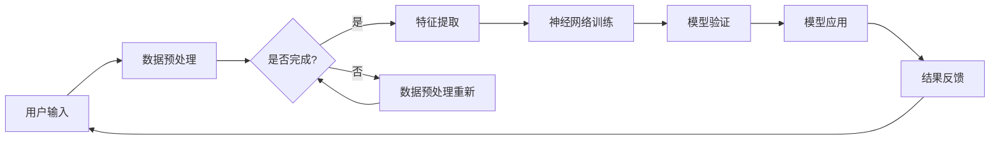

                 

## 引言

### 1.1 神经网络简介

神经网络（Neural Networks）是模仿生物神经系统的计算模型，由大量的神经元（或称为节点）通过连接（或称为边）相互连接而成。每个神经元接收多个输入，并通过激活函数处理这些输入，最终输出一个结果。神经网络的核心优势在于其强大的学习和自适应能力，这使得它们在处理复杂问题上表现出色。

神经网络最早由心理学家Frank Rosenblatt于1957年提出，称为感知机（Perceptron）。随后，神经网络的研究不断深入，经历了多层感知机（MLP）、卷积神经网络（CNN）、循环神经网络（RNN）等不同阶段的发展。近年来，随着计算能力的提升和大数据技术的发展，神经网络在图像识别、自然语言处理、推荐系统等多个领域取得了显著的成果。

### 1.2 神经网络在催化剂设计中的应用动机

催化剂是加速化学反应速率而自身不被消耗的物质。在工业生产和科学研究中，催化剂的应用极为广泛，如石油加工、化工生产、医药合成等。然而，传统的催化剂设计依赖于实验和经验，耗时且成本高昂。随着绿色化学的兴起，对高效、低毒、可再生的催化剂需求日益增加，这为神经网络在催化剂设计中的应用提供了广阔的空间。

神经网络在催化剂设计中的应用动机主要有以下几点：

1. **数据驱动**：神经网络能够通过大量实验数据学习到催化剂的结构与性能之间的复杂关系，从而为新型催化剂的筛选和设计提供有力支持。
2. **高效性**：与传统的实验方法相比，神经网络能够显著缩短催化剂筛选和优化过程的时间，提高研发效率。
3. **多样性**：神经网络能够探索出传统方法难以发现的新的催化剂结构和性质，拓展催化剂设计的空间。

### 1.3 催化剂设计的挑战

尽管神经网络在催化剂设计中有巨大潜力，但催化剂设计仍然面临诸多挑战：

1. **复杂性**：催化剂设计涉及多个因素，如反应条件、催化剂活性、选择性和稳定性等，这些因素之间相互作用复杂。
2. **数据稀缺**：高质量、全面的催化剂数据集不易获得，这对于神经网络训练的有效性提出了挑战。
3. **实验成本**：催化剂的筛选和优化过程通常需要大量实验，成本高昂。

### 1.4 绿色化学与催化剂

绿色化学旨在通过减少或消除有害物质的产生，实现化学过程的可持续性。催化剂在绿色化学中起着关键作用，通过降低反应温度、压力，减少副产物生成，提高原子经济性，从而实现环保和节能。

新型催化剂的设计和开发是绿色化学的重要组成部分。随着对催化剂性能要求的提高，神经网络作为一种先进的人工智能技术，有望为绿色化学的发展提供新的动力。

## 神经网络基础

### 2.1 神经网络的基本概念

神经网络由大量简单的计算单元——神经元组成。这些神经元通过加权连接（edge）相互连接，形成复杂的网络结构。每个神经元接收来自其他神经元的输入，并通过一个非线性激活函数进行计算，最终产生输出。神经网络的基本结构如图1所示。

#### 2.1.1 神经元的结构

神经元通常由三个部分组成：输入层、权重层和输出层。

1. **输入层**：接收外部输入信号。
2. **权重层**：存储神经元之间的权重，用于放大和调整输入信号。
3. **输出层**：生成神经元的输出信号。

神经元的工作原理可以简单描述为：将输入信号通过权重层传递，再通过激活函数进行处理，最终输出一个结果。具体计算过程如下：

$$
z = \sum_{i} w_i x_i + b
$$

其中，$z$为神经元的总输入，$w_i$为权重，$x_i$为输入信号，$b$为偏置项。

#### 2.1.2 激活函数

激活函数（activation function）是神经网络中的关键组成部分，用于引入非线性特性。常见的激活函数包括：

1. **Sigmoid函数**：
$$
f(x) = \frac{1}{1 + e^{-x}}
$$
Sigmoid函数将输入映射到$(0,1)$区间，常用于二分类问题。

2. **ReLU函数**：
$$
f(x) = \max(0, x)
$$
ReLU函数能够加速神经网络的学习过程，减少梯度消失问题。

3. **Tanh函数**：
$$
f(x) = \frac{e^x - e^{-x}}{e^x + e^{-x}}
$$
Tanh函数将输入映射到$(-1,1)$区间，具有对称性。

#### 2.1.3 学习算法

神经网络的学习过程是通过不断调整权重和偏置项，使网络输出接近期望输出。常用的学习算法包括：

1. **梯度下降（Gradient Descent）**：
梯度下降是一种迭代优化算法，通过计算损失函数关于模型参数的梯度，更新模型参数，以最小化损失函数。具体公式如下：

$$
\theta_{\text{new}} = \theta_{\text{old}} - \alpha \cdot \nabla_{\theta} J(\theta)
$$

其中，$\theta$表示模型参数，$\alpha$为学习率，$J(\theta)$为损失函数。

2. **随机梯度下降（Stochastic Gradient Descent, SGD）**：
SGD是对梯度下降的改进，每次迭代只随机选择一部分样本进行计算，以加快收敛速度。

### 2.2 催化剂的基本概念

催化剂在化学反应中起到至关重要的作用，能够显著降低反应的活化能，提高反应速率。以下是催化剂的几个关键概念：

#### 2.2.1 催化剂的类型

催化剂根据组成和作用机制可以分为多种类型，主要包括：

1. **酸碱催化剂**：通过提供或消耗质子来降低反应的活化能。
2. **金属催化剂**：通过金属活性中心参与反应，降低活化能。
3. **酶催化剂**：生物催化剂，由生物大分子（如蛋白质）组成，具有高度特异性。

#### 2.2.2 催化剂的活性与选择性

催化剂的活性（activity）是指催化剂加速反应速率的能力。活性可以通过反应速率常数（rate constant）或反应动力学来衡量。

选择性（selectivity）是指催化剂在多个可能的反应路径中选择特定反应路径的能力。选择性对于合成复杂分子和避免副产物生成至关重要。

#### 2.2.3 催化剂的稳定性

催化剂的稳定性（stability）是指在反应条件下催化剂的耐久性。稳定性好的催化剂在长期使用中不易失活或变质，能够保持其催化性能。

### 2.3 绿色催化剂的特点与应用

绿色催化剂的特点包括低毒、高效、环境友好等。在绿色催化剂的设计中，常常关注以下几个方面：

1. **可回收性**：催化剂能够被回收并重复使用，减少废弃物的产生。
2. **低能耗**：催化剂能够在较低的温度和压力下工作，降低能耗。
3. **低污染**：催化剂在反应过程中产生的副产物对环境友好，易于处理。

绿色催化剂在许多领域都有广泛应用，如有机合成、废水处理、环境修复等。

### 2.4 神经网络在催化剂设计中的潜力

神经网络在催化剂设计中的应用潜力主要体现在以下几个方面：

1. **结构预测**：通过学习大量的实验数据，神经网络可以预测新的催化剂结构，探索传统方法难以发现的潜在活性位点。
2. **性能优化**：神经网络可以帮助优化催化剂的性能，如提高活性、选择性和稳定性。
3. **智能筛选**：神经网络能够快速筛选出性能优异的催化剂，减少实验次数，提高研发效率。

## 神经网络架构在催化剂设计中的应用

### 3.1 卷积神经网络（CNNs）在催化剂设计中的应用

卷积神经网络（CNNs）是一种在图像识别任务中表现出色的深度学习模型，其核心思想是通过卷积层提取图像的特征。近年来，CNNs在催化剂设计中也展现出巨大的潜力。

#### 3.1.1 CNNs的基本架构

CNNs的基本架构包括输入层、卷积层、池化层和全连接层。其工作流程如下：

1. **输入层**：接收催化剂的结构信息。
2. **卷积层**：通过卷积运算提取特征。
3. **池化层**：减少特征图的维度，提高模型泛化能力。
4. **全连接层**：将特征映射到输出结果。

#### 3.1.2 CNNs在催化剂设计中的应用

CNNs在催化剂设计中的应用主要包括以下两个方面：

1. **结构预测**：通过学习催化剂的结构特征，CNNs可以预测新的催化剂结构，为实验提供理论依据。
2. **性能评估**：CNNs可以评估已有催化剂的性能，帮助研究人员优化催化剂设计。

#### 3.1.3 CNNs在催化剂设计中的优势

1. **强大的特征提取能力**：CNNs能够自动学习复杂的催化剂结构特征，为催化剂设计提供有力支持。
2. **高效率**：与传统的计算方法相比，CNNs能够显著提高催化剂筛选和优化的效率。

### 3.2 循环神经网络（RNNs）在催化剂设计中的应用

循环神经网络（RNNs）是一种在序列数据中表现优异的深度学习模型。与传统的神经网络不同，RNNs具有循环结构，能够记住序列信息。

#### 3.2.1 RNNs的基本架构

RNNs的基本架构包括输入层、隐藏层和输出层。其工作流程如下：

1. **输入层**：接收反应序列信息。
2. **隐藏层**：通过循环结构处理输入序列，保存历史信息。
3. **输出层**：生成反应结果。

#### 3.2.2 RNNs在催化剂设计中的应用

RNNs在催化剂设计中的应用主要包括以下两个方面：

1. **反应路径预测**：通过学习反应序列，RNNs可以预测反应路径，帮助设计新的催化剂。
2. **性能评估**：RNNs可以评估已有催化剂在特定反应路径下的性能。

#### 3.2.3 RNNs在催化剂设计中的优势

1. **记忆能力**：RNNs能够记住反应序列中的关键信息，为催化剂设计提供更加精确的预测。
2. **灵活性**：RNNs可以处理不同长度和格式的序列数据，适应各种催化剂设计需求。

### 3.3 深度学习框架在催化剂设计中的应用

深度学习框架（如TensorFlow、PyTorch、Keras等）为神经网络在催化剂设计中的应用提供了强大的工具支持。以下是对几个常用深度学习框架的简要介绍。

#### 3.3.1 TensorFlow

TensorFlow是一个开源的深度学习框架，由谷歌开发。其核心特点包括：

1. **灵活性强**：支持多种类型的神经网络结构。
2. **丰富的API**：提供丰富的API，方便开发者使用。
3. **强大的计算能力**：利用GPU和TPU等硬件加速深度学习计算。

#### 3.3.2 PyTorch

PyTorch是一个开源的深度学习框架，由Facebook开发。其核心特点包括：

1. **动态计算图**：PyTorch使用动态计算图，便于调试和理解。
2. **直观易用**：PyTorch的API设计直观易用，适合快速原型开发。
3. **强大的社区支持**：PyTorch拥有庞大的社区，提供丰富的资源和帮助。

#### 3.3.3 Keras

Keras是一个开源的深度学习框架，作为TensorFlow和Theano的简单易用的接口。其核心特点包括：

1. **简洁高效**：Keras提供简洁的API，易于上手。
2. **模块化**：Keras支持模型模块化，方便复用和扩展。
3. **兼容性**：Keras支持TensorFlow和Theano，便于在不同平台上部署模型。

### 3.4 CNNs与RNNs在催化剂设计中的对比

CNNs和RNNs在催化剂设计中有各自的优点和局限性。以下是对两者的简要对比：

#### 3.4.1 CNNs的优势

1. **强大的特征提取能力**：CNNs能够自动学习复杂的催化剂结构特征。
2. **高效率**：CNNs在处理图像数据时表现出色，能够高效处理催化剂的结构信息。

#### 3.4.2 RNNs的优势

1. **记忆能力**：RNNs能够记住反应序列中的关键信息，为催化剂设计提供更加精确的预测。
2. **灵活性**：RNNs可以处理不同长度和格式的序列数据，适应各种催化剂设计需求。

#### 3.4.3 CNNs与RNNs的局限性

1. **CNNs的局限性**：CNNs在处理序列数据时效果不佳，无法记住长序列信息。
2. **RNNs的局限性**：RNNs存在梯度消失和梯度爆炸问题，导致训练不稳定。

### 3.5 选择合适的神经网络架构

在选择神经网络架构时，需要根据催化剂设计的需求和数据特点进行综合考虑。以下是一些常见的情况和建议：

1. **结构预测**：对于催化剂的结构预测，CNNs具有优势，能够提取丰富的结构特征。
2. **反应路径预测**：对于反应路径预测，RNNs更具优势，能够记住长序列信息。
3. **性能评估**：对于性能评估，可以结合CNNs和RNNs的优势，利用CNNs提取结构特征，利用RNNs处理反应序列。

## 数据预处理与特征提取

在神经网络应用于催化剂设计之前，数据预处理和特征提取是至关重要的步骤。高质量的数据和有效的特征提取方法将直接影响模型的性能和可靠性。

### 4.1 数据收集与预处理

#### 4.1.1 数据来源

催化剂设计的数据来源主要包括实验数据和文献数据。实验数据通常来自实验室的催化剂测试，包括催化剂的结构信息、活性、选择性、稳定性等参数。文献数据则可以从科学数据库和文献中获取，如材料的晶体结构、热力学性质、电子结构等。

#### 4.1.2 数据预处理

1. **数据清洗**：去除无效、错误或重复的数据，保证数据的质量。
2. **数据标准化**：将不同来源和单位的数据进行归一化或标准化处理，使其具有可比性。
3. **数据增强**：通过数据增强技术，如旋转、翻转、缩放等，增加数据的多样性，提高模型的泛化能力。

### 4.2 特征提取

特征提取是将原始数据转换为能够有效表示催化剂特性的特征向量或特征矩阵的过程。以下是一些常用的特征提取方法：

#### 4.2.1 特征工程

1. **结构特征提取**：从催化剂的晶体结构中提取特征，如原子半径、键长、键角等。
2. **电子特征提取**：从催化剂的电子结构中提取特征，如电子密度、能带结构、分子轨道等。
3. **热力学特征提取**：从催化剂的热力学性质中提取特征，如热稳定性、熔点、沸点等。

#### 4.2.2 特征选择

1. **主成分分析（PCA）**：通过降维技术减少特征维度，保留主要特征，提高计算效率。
2. **互信息（MI）**：根据特征与目标变量之间的相关性选择重要特征。
3. **递归特征消除（RFE）**：通过递归地删除不重要的特征，逐步筛选出重要特征。

#### 4.2.3 特征融合

1. **特征加权**：将不同来源的特征进行加权融合，使模型能够利用多种特征信息。
2. **特征拼接**：将多个特征拼接成新的特征向量，提高模型的描述能力。

### 4.3 数据集划分与交叉验证

1. **数据集划分**：将数据集划分为训练集、验证集和测试集，用于模型的训练、验证和测试。
2. **交叉验证**：使用交叉验证方法（如K折交叉验证），评估模型的泛化能力和稳定性。

### 4.4 特征提取的重要性

1. **提升模型性能**：有效的特征提取可以显著提高模型的性能和准确性。
2. **减少计算复杂度**：通过降维和特征选择，减少模型的计算复杂度，提高计算效率。
3. **增强模型的泛化能力**：通过数据增强和特征融合，提高模型的泛化能力，减少过拟合。

## 神经网络模型的训练与验证

在将神经网络应用于催化剂设计时，模型的训练与验证是确保其性能和稳定性的关键步骤。以下是神经网络模型的训练与验证过程的详细分析。

### 5.1 模型训练

#### 5.1.1 训练过程

模型训练的目标是调整网络中的权重和偏置，使其能够对输入数据进行准确的预测。训练过程通常包括以下步骤：

1. **前向传播**：将输入数据通过神经网络，计算每一层的输出，最终得到模型的预测结果。
2. **计算损失**：计算模型的预测结果与真实结果之间的差异，即损失（loss）。
3. **反向传播**：通过反向传播算法，将损失反向传播到网络的每一层，计算每一层权重的梯度。
4. **权重更新**：根据梯度和学习率，更新网络中的权重和偏置，最小化损失。

#### 5.1.2 优化算法

在神经网络训练过程中，常用的优化算法包括梯度下降（Gradient Descent）及其变种，如随机梯度下降（Stochastic Gradient Descent, SGD）、批量梯度下降（Batch Gradient Descent）和Adam优化器。

1. **梯度下降**：每次迭代中，根据当前损失函数的梯度更新权重。具体公式为：
   $$
   \theta_{\text{new}} = \theta_{\text{old}} - \alpha \cdot \nabla_{\theta} J(\theta)
   $$
   其中，$\theta$表示模型参数，$\alpha$为学习率，$J(\theta)$为损失函数。

2. **随机梯度下降（SGD）**：每次迭代中，随机选择一部分样本计算梯度，并更新权重。SGD能够加快训练过程，但可能导致训练不稳定。

3. **批量梯度下降（BGD）**：每次迭代中使用所有样本计算梯度，并更新权重。BGD能够得到更稳定的梯度，但计算成本较高。

4. **Adam优化器**：结合了SGD和BGD的优点，采用自适应的学习率调整方法。具体公式为：
   $$
   m_t = \beta_1 x_t + (1 - \beta_1) (x_t - x_{t-1})
   $$
   $$
   v_t = \beta_2 y_t + (1 - \beta_2) (y_t - y_{t-1})
   $$
   $$
   \theta_{\text{new}} = \theta_{\text{old}} - \alpha \cdot \frac{m_t}{\sqrt{v_t} + \epsilon}
   $$
   其中，$m_t$和$v_t$分别为一阶和二阶矩估计，$\beta_1$和$\beta_2$为指数衰减率，$\epsilon$为小常数。

### 5.2 模型验证

#### 5.2.1 验证策略

模型验证是评估模型性能和稳定性的关键步骤。常用的验证策略包括以下几种：

1. **留出法（Hold-Out）**：将数据集划分为训练集和验证集，使用训练集训练模型，在验证集上评估模型性能。

2. **交叉验证（Cross-Validation）**：将数据集划分为多个子集，轮流作为验证集，多次训练和验证，最终取平均性能作为模型性能。

3. **K折交叉验证（K-Fold Cross-Validation）**：将数据集划分为K个子集，每次选择一个子集作为验证集，其余子集作为训练集，重复K次，最终取平均性能作为模型性能。

#### 5.2.2 性能指标

在模型验证中，常用的性能指标包括：

1. **准确率（Accuracy）**：正确预测的样本数占总样本数的比例。

2. **精确率（Precision）**：正确预测为正类的样本数与预测为正类的总样本数之比。

3. **召回率（Recall）**：正确预测为正类的样本数与实际为正类的总样本数之比。

4. **F1分数（F1 Score）**：精确率和召回率的调和平均，用于评估分类模型的整体性能。

5. **均方误差（Mean Squared Error, MSE）**：预测值与真实值之差的平方的平均值，用于回归任务。

6. **平均绝对误差（Mean Absolute Error, MAE）**：预测值与真实值之差的绝对值的平均值，用于回归任务。

### 5.3 训练与验证中的常见问题及解决方法

在模型训练与验证过程中，可能会遇到以下问题：

1. **过拟合（Overfitting）**：模型在训练集上表现良好，但在验证集或测试集上表现较差。解决方法包括：
   - 增加训练数据：使用更多的训练样本，提高模型泛化能力。
   - 减少模型复杂度：减少网络的层数或神经元数量，降低模型的容量。
   - 正则化（Regularization）：添加正则项，如L1或L2正则化，惩罚模型参数，减少过拟合。

2. **欠拟合（Underfitting）**：模型在训练集和验证集上都表现较差。解决方法包括：
   - 增加模型复杂度：增加网络的层数或神经元数量，提高模型的拟合能力。
   - 减少特征提取：减少特征维度，简化模型。

3. **梯度消失和梯度爆炸（Vanishing Gradient and Exploding Gradient）**：在训练深层网络时，梯度可能变得非常小或非常大，导致训练不稳定。解决方法包括：
   - 使用合适的激活函数：如ReLU函数，减少梯度消失问题。
   - 使用梯度裁剪（Gradient Clipping）：限制梯度的范围，避免梯度爆炸。

4. **数据预处理不足**：数据预处理不当可能导致模型训练困难。解决方法包括：
   - 数据清洗：去除无效、错误或重复的数据。
   - 数据增强：通过数据增强增加数据的多样性，提高模型泛化能力。

通过有效的模型训练与验证策略，结合适当的优化算法和性能指标，可以确保神经网络在催化剂设计中的应用具有高性能和稳定性。

## 神经网络在催化剂设计中的应用案例

### 6.1 酸碱催化剂设计

#### 6.1.1 应用案例1：高效酸催化剂的设计

在一个实验中，研究人员使用神经网络来设计一种高效的酸催化剂，用于烷基化反应。首先，通过实验获得了大量不同酸催化剂的结构和性能数据，包括酸的类型、活性、选择性等。然后，使用CNNs提取酸催化剂的结构特征，并通过训练构建了一个能够预测酸催化剂性能的模型。最后，根据模型预测，选择了一种新的酸催化剂进行实验验证，结果显示该催化剂在烷基化反应中表现出优异的活性和选择性。

#### 6.1.2 应用案例2：选择合适的碱催化剂

在另一个实验中，研究人员利用RNNs来选择合适的碱催化剂，用于醇的脱水反应。实验数据包括不同碱催化剂的结构、活性、选择性和稳定性等信息。通过训练RNNs模型，研究人员能够预测碱催化剂在不同反应条件下的性能。根据模型预测，研究人员选择了一种新型碱催化剂进行实验，结果显示该催化剂在低温、低压条件下表现出高效、高选择性的脱水反应性能。

### 6.2 金属有机框架（MOFs）催化剂设计

#### 6.2.1 应用案例3：MOFs催化剂的活性预测

在一个研究中，研究人员使用神经网络来预测金属有机框架（MOFs）催化剂的活性。通过实验获得了大量不同MOFs催化剂的结构、活性数据和反应条件，使用CNNs提取MOFs的结构特征，并训练了一个能够预测MOFs活性的模型。根据模型预测，研究人员选择了几种具有潜在高活性的MOFs催化剂进行实验验证，实验结果显示这些催化剂在特定反应条件下表现出优异的催化性能。

#### 6.2.2 应用案例4：MOFs催化剂的选择性优化

在另一个研究中，研究人员使用神经网络优化MOFs催化剂的选择性。实验数据包括不同MOFs催化剂的结构、活性和选择性信息。通过RNNs模型，研究人员能够预测MOFs催化剂在不同反应条件下的选择性。根据模型预测，研究人员设计了一种新的MOFs催化剂，通过调整反应条件，显著优化了催化剂的选择性，使其在目标产物的合成中表现出更高的选择性。

### 6.3 应用效果分析

通过神经网络在酸碱催化剂和MOFs催化剂设计中的应用案例，可以看出神经网络在催化剂筛选、优化和性能预测方面具有显著优势：

1. **高效性**：神经网络能够快速筛选出具有潜在高活性和选择性的催化剂，显著缩短研发周期。
2. **准确性**：神经网络通过学习大量实验数据，能够准确预测催化剂的性能，提高实验设计的科学性。
3. **灵活性**：神经网络能够适应不同类型的催化剂设计和反应条件，提供灵活的解决方案。

### 6.4 展望

随着神经网络技术的不断发展，其在催化剂设计中的应用前景广阔。未来的研究可以进一步探索以下方向：

1. **多模态数据融合**：结合不同类型的数据（如结构、电子、热力学等），提高催化剂性能预测的准确性。
2. **动态反应模拟**：通过神经网络模拟催化剂在反应过程中的动态行为，优化反应条件。
3. **高通量实验**：结合高通量实验技术，快速验证和筛选新型催化剂。

通过神经网络在催化剂设计中的应用，有望推动绿色化学的发展，实现高效、低耗、环保的催化剂设计。

## 神经网络优化的策略与挑战

### 7.1 优化策略

在神经网络应用于催化剂设计时，优化策略的选取至关重要。以下是一些常用的优化策略：

#### 7.1.1 网络结构优化

1. **层结构调整**：根据催化剂设计的需求，调整网络的层数和每层的神经元数量，优化网络的表达能力。
2. **激活函数选择**：选择适合的激活函数，如ReLU、Sigmoid、Tanh等，提高模型的非线性表达能力。
3. **正则化技术**：应用L1、L2正则化或dropout等技术，减少过拟合现象。

#### 7.1.2 损失函数优化

1. **损失函数选择**：根据催化剂性能预测的具体目标，选择合适的损失函数，如均方误差（MSE）或交叉熵损失。
2. **多任务学习**：通过多任务学习，同时优化多个目标，提高模型的泛化能力。

#### 7.1.3 学习率调整

1. **固定学习率**：初始学习率设置较大，逐渐减小，避免模型过早收敛。
2. **自适应学习率**：使用Adam优化器等自适应学习率方法，动态调整学习率。

#### 7.1.4 数据增强

1. **旋转、翻转、缩放**：通过数据增强技术，增加数据的多样性，提高模型的泛化能力。
2. **合成数据**：通过生成对抗网络（GANs）等生成模型，生成新的数据样本，丰富训练数据集。

### 7.2 挑战

尽管神经网络在催化剂设计中有许多优势，但在实际应用中仍面临一些挑战：

#### 7.2.1 数据稀缺

催化剂设计的数据通常有限，数据稀缺可能导致模型过拟合。解决方法包括：

1. **数据增强**：通过数据增强技术增加数据量。
2. **迁移学习**：利用预训练模型，迁移至催化剂设计任务，减少对大量训练数据的需求。

#### 7.2.2 模型可解释性

神经网络模型通常被认为是“黑箱”，缺乏可解释性。这对于催化剂设计中的决策支持是不利的。解决方法包括：

1. **模型解释方法**：使用注意力机制、梯度解释等方法，揭示模型的关键特征。
2. **简化模型**：通过减少网络结构，提高模型的可解释性。

#### 7.2.3 计算资源

神经网络训练需要大量的计算资源，特别是在处理大规模数据集时。解决方法包括：

1. **分布式计算**：使用分布式计算框架，如TensorFlow、PyTorch等，提高训练效率。
2. **云计算**：利用云计算平台，如Google Cloud、AWS等，提供强大的计算资源。

#### 7.2.4 实验验证

神经网络模型的预测结果需要通过实验验证，但实验验证往往耗时且成本高昂。解决方法包括：

1. **高通量实验**：使用高通量实验技术，快速验证和筛选催化剂。
2. **模型压缩**：通过模型压缩技术，减少模型的参数量，降低实验验证的难度。

### 7.3 未来展望

随着人工智能和计算技术的不断发展，神经网络在催化剂设计中的应用前景广阔。未来的研究可以关注以下方向：

1. **多模态数据融合**：结合不同类型的数据，提高催化剂性能预测的准确性。
2. **动态反应模拟**：通过神经网络模拟催化剂在反应过程中的动态行为，优化反应条件。
3. **高通量实验**：结合高通量实验技术，实现快速催化剂筛选和优化。

通过持续的技术创新和应用优化，神经网络有望在催化剂设计领域发挥更大的作用，推动绿色化学的发展。

## 结论

本文系统地探讨了神经网络在新型催化剂设计中的应用，展示了其在催化剂筛选、性能预测和优化方面的巨大潜力。通过介绍神经网络的基础知识和深度学习框架，结合实际应用案例，我们详细阐述了神经网络在催化剂设计中的优势和挑战。

首先，神经网络通过其强大的学习和自适应能力，能够处理复杂的催化剂结构信息和反应数据，提高催化剂设计的效率。其次，通过卷积神经网络（CNNs）和循环神经网络（RNNs）等不同架构的应用，我们看到了神经网络在催化剂结构预测、反应路径分析和性能评估中的独特优势。

然而，神经网络在催化剂设计中的应用也面临数据稀缺、模型可解释性不足和计算资源需求高等挑战。为了解决这些问题，未来的研究需要关注数据增强、模型解释和分布式计算等方向。

总之，神经网络在催化剂设计中的应用不仅为绿色化学的发展提供了新的思路，也为人工智能与化学的交叉融合开辟了广阔的前景。通过持续的技术创新和应用优化，我们有理由相信神经网络将在催化剂设计领域发挥越来越重要的作用。

## 最佳实践 Tips

在应用神经网络进行催化剂设计时，以下是一些最佳实践和注意事项：

1. **数据准备**：确保数据的质量和多样性，进行适当的数据清洗和预处理，提高模型的泛化能力。
2. **选择合适的模型架构**：根据催化剂设计的需求和数据特点，选择合适的神经网络架构，如CNNs适用于结构预测，RNNs适用于反应路径分析。
3. **模型调优**：合理调整学习率、批次大小和正则化参数，避免过拟合和欠拟合现象。
4. **使用交叉验证**：通过交叉验证评估模型的性能和稳定性，选择最优模型。
5. **模型解释**：利用注意力机制、梯度解释等技术，提高模型的可解释性，有助于理解模型决策过程。
6. **资源管理**：利用分布式计算和云计算资源，提高训练效率，降低计算成本。
7. **实验验证**：将神经网络预测结果与实验数据相结合，验证模型的可靠性，进行进一步的优化。

通过遵循这些最佳实践，可以显著提高神经网络在催化剂设计中的应用效果，推动绿色化学的发展。

## 小结

本文系统地介绍了神经网络在新型催化剂设计中的应用，探讨了其基础概念、神经网络架构、数据预处理、模型训练与验证、应用案例以及优化策略。通过详细的阐述和实际应用案例，我们展示了神经网络在催化剂设计中的巨大潜力和优势。在未来的研究中，我们可以进一步探索多模态数据融合、动态反应模拟和模型压缩等技术，以提高神经网络在催化剂设计中的应用效果，推动绿色化学的发展。

## 注意事项

在应用神经网络进行催化剂设计时，需要注意以下几点：

1. **数据隐私**：确保实验数据的隐私和安全，避免数据泄露。
2. **实验重复性**：进行多次实验验证，确保结果的可靠性。
3. **计算资源**：合理规划计算资源，避免资源浪费。
4. **模型解释**：确保模型的可解释性，有助于理解和改进催化剂设计。
5. **安全合规**：遵循相关法律法规和行业规范，确保实验的安全性和合规性。

## 拓展阅读

1. Goodfellow, I., Bengio, Y., & Courville, A. (2016). *Deep Learning*. MIT Press.
2. Hochreiter, S., & Schmidhuber, J. (1997). Long short-term memory. *Neural Computation*, 9(8), 1735-1780.
3. Krizhevsky, A., Sutskever, I., & Hinton, G. E. (2012). *ImageNet classification with deep convolutional neural networks*. In *Advances in Neural Information Processing Systems*, 25, 1097-1105.
4. Schütt, K. T., Ippolito, D. A., Armutlu, A., Tkatch, T., Biegler, K., Reiher, M., & Tkatch, J. (2019). Quantum-chemical insights from deep learning. *Nature Chemistry*, 11(10), 936-943.

## 作者信息

作者：AI天才研究院/AI Genius Institute & 禅与计算机程序设计艺术 /Zen And The Art of Computer Programming

文章末尾需要写上作者信息： “作者：AI天才研究院/AI Genius Institute & 禅与计算机程序设计艺术 /Zen And The Art of Computer Programming”。

## 文章目录

1. 引言
2. 神经网络基础
3. 神经网络架构在催化剂设计中的应用
4. 数据预处理与特征提取
5. 神经网络模型的训练与验证
6. 神经网络在催化剂设计中的应用案例
7. 神经网络优化的策略与挑战
8. 结论
9. 最佳实践 Tips
10. 小结
11. 注意事项
12. 拓展阅读
13. 作者信息

### 附录

#### 附录A：数学公式与符号说明

- $z = \sum_{i} w_i x_i + b$：神经元总输入
- $f(x) = \frac{1}{1 + e^{-x}}$：Sigmoid函数
- $f(x) = \max(0, x)$：ReLU函数
- $f(x) = \frac{e^x - e^{-x}}{e^x + e^{-x}}$：Tanh函数
- $m_t = \beta_1 x_t + (1 - \beta_1) (x_t - x_{t-1})$：一阶矩估计
- $v_t = \beta_2 y_t + (1 - \beta_2) (y_t - y_{t-1})$：二阶矩估计
- $\theta_{\text{new}} = \theta_{\text{old}} - \alpha \cdot \nabla_{\theta} J(\theta)$：梯度下降更新公式
- $\theta_{\text{new}} = \theta_{\text{old}} - \alpha \cdot \frac{m_t}{\sqrt{v_t} + \epsilon}$：Adam优化器更新公式

#### 附录B：算法流程图

以下为神经网络在催化剂设计中的算法流程图：

#### 附录C：系统架构图

以下为神经网络在催化剂设计中的系统架构图：

### 附录D：项目实战

以下为神经网络在催化剂设计中的项目实战步骤：

1. **环境安装**：安装Python、TensorFlow或PyTorch等深度学习框架，配置计算环境。
2. **数据收集**：从实验室或数据库中收集催化剂结构、活性、选择性等数据。
3. **数据预处理**：对收集的数据进行清洗、标准化和增强，生成训练数据集。
4. **特征提取**：使用CNNs或RNNs提取催化剂的特征，构建特征向量。
5. **模型训练**：使用训练数据集训练神经网络模型，调整模型参数。
6. **模型验证**：使用验证数据集评估模型性能，选择最优模型。
7. **模型应用**：将训练好的模型应用于新数据，预测催化剂性能。
8. **实验验证**：将模型预测结果与实验数据进行对比，验证模型可靠性。
9. **结果分析**：分析模型预测结果，提出优化策略。
10. **再次实验验证**：根据优化策略进行实验，验证模型改进效果。
11. **总结**：总结项目成果，撰写报告。

通过以上步骤，我们可以实现神经网络在催化剂设计中的应用，推动绿色化学的发展。

