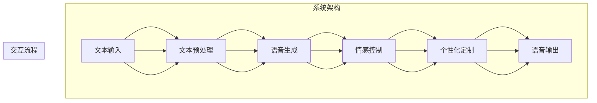

                 

# 神经网络在自动语音合成中的应用：生成自然人声

## 关键词

自动语音合成、神经网络、深度学习、语音生成、语音处理

## 摘要

本文旨在探讨神经网络在自动语音合成（Automatic Speech Synthesis，简称ASS）中的应用，分析其解决语音生成问题的原理和实现过程。通过引入深度学习技术，自动语音合成在语音的自然度和情感表达方面取得了显著进步。本文将详细介绍神经网络在自动语音合成中的核心概念、实现原理以及相关技术，为读者提供对这一领域深入理解。

## 第一部分：背景介绍

### 1.1 问题背景

随着人工智能技术的飞速发展，自动语音合成（Automatic Speech Synthesis，简称ASS）技术已经取得了显著的进步。自动语音合成的目标是实现计算机生成语音，使其在音质和自然度上接近真人。然而，传统的自动语音合成方法在语音的自然度和情感表达方面仍然存在一定的局限。为了解决这一问题，神经网络技术的引入为自动语音合成带来了新的希望。

### 1.2 问题描述

自动语音合成的目标是实现计算机生成语音，使其在音质和自然度上接近真人。然而，传统的合成方法主要依赖于规则和声学模型，难以在复杂和多变的语音场景中表现出色。神经网络模型，尤其是深度学习模型，通过学习大量的语音数据，能够更好地捕捉语音特征，从而提高合成的自然度和准确性。

### 1.3 问题解决

神经网络在自动语音合成中的应用，主要是通过训练深度神经网络模型，使其能够生成与输入文本相对应的自然人声。这一过程通常包括以下几个步骤：

1. **数据预处理**：对语音数据进行预处理，包括音频信号的归一化、分割和标注等。
2. **模型训练**：利用预处理后的语音数据训练深度神经网络模型，如循环神经网络（RNN）或其变体长短期记忆网络（LSTM）和门控循环单元（GRU）等。
3. **模型评估**：通过评估模型在测试集上的性能，调整模型参数，优化模型效果。
4. **语音生成**：使用训练好的模型生成语音，输出与人声相似的自然语音。

### 1.4 边界与外延

神经网络在自动语音合成中的应用不仅限于文本到语音（Text-to-Speech，简称TTS）的转换，还可以拓展到语音增强、语音识别、语音合成调控等更多领域。随着技术的不断进步，神经网络在自动语音合成中的应用前景将更加广阔。

### 1.5 概念结构与核心要素组成

1. **深度学习模型**：是神经网络的一种，通过多层神经元网络对数据特征进行自动提取和学习，提高模型的表示能力。
2. **语音数据集**：是训练神经网络的基础，通常包含大量的语音音频文件及其对应的文本标注。
3. **损失函数**：用于评估模型在训练过程中的性能，常见的损失函数包括均方误差（MSE）和交叉熵等。
4. **优化器**：用于调整模型参数，使模型在训练过程中不断优化，如随机梯度下降（SGD）和Adam等。
5. **语音特征提取**：通过音频信号处理技术，从语音数据中提取出有代表性的特征，如梅尔频率倒谱系数（MFCC）。

## 第二部分：核心概念与联系

### 2.1 核心概念

1. **自动语音合成（TTS）**：计算机将文本转换为自然语音的过程。
2. **神经网络（NN）**：一种模拟人脑神经元连接的计算机算法，用于数据建模和预测。
3. **深度学习（DL）**：一种基于神经网络的机器学习技术，通过多层神经网络进行特征学习和表示。
4. **循环神经网络（RNN）**：一种能够处理序列数据的神经网络，能够捕捉序列中的长期依赖关系。
5. **长短期记忆网络（LSTM）**：RNN的一种变体，能够有效解决长短期依赖问题。

### 2.2 概念属性特征对比表格

| 概念        | 描述                                                         | 关键特点                     |
|-------------|--------------------------------------------------------------|------------------------------|
| 自动语音合成 | 文本到语音的转换过程                                       | 提高语音自然度和准确性       |
| 神经网络     | 模拟人脑神经元连接的计算机算法                             | 自动提取和学习数据特征       |
| 深度学习     | 基于神经网络的机器学习技术，多层神经网络进行特征学习和表示 | 提高模型的表示能力和预测能力 |
| RNN         | 能够处理序列数据的神经网络                                 | 能够捕捉序列中的长期依赖关系 |
| LSTM        | RNN的一种变体，解决长短期依赖问题                         | 有效处理序列中的长期依赖关系 |

### 2.3 ER实体关系图架构

```mermaid
erDiagram
  Text |----o { TTS }
  AudioData |----o { Preprocessing }
  NeuralNetwork |----o { Training }
  NeuralNetwork |----o { Evaluation }
  NeuralNetwork |----o { SpeechGeneration }
```

## 第三部分：算法原理讲解

### 3.1 算法概述

神经网络在自动语音合成中的应用主要是通过训练深度神经网络模型，使其能够生成与输入文本相对应的自然人声。下面，我们将详细介绍神经网络在自动语音合成中的应用原理。

### 3.2 算法流程

神经网络在自动语音合成中的应用主要包括以下几个步骤：

1. **数据预处理**：对语音数据进行预处理，包括音频信号的归一化、分割和标注等。
2. **模型训练**：利用预处理后的语音数据训练深度神经网络模型，如循环神经网络（RNN）或其变体长短期记忆网络（LSTM）和门控循环单元（GRU）等。
3. **模型评估**：通过评估模型在测试集上的性能，调整模型参数，优化模型效果。
4. **语音生成**：使用训练好的模型生成语音，输出与人声相似的自然语音。

### 3.3 算法原理

1. **数据预处理**：在训练深度神经网络之前，需要对语音数据进行预处理。预处理步骤包括音频信号的归一化、分割和标注等。音频信号的归一化是为了使数据具有相同的量级，提高训练效果；分割是将音频信号划分为多个时间段的帧，便于模型学习；标注则是为每个帧分配对应的文本标签，以便模型能够根据文本生成语音。

2. **模型训练**：在数据预处理完成后，利用预处理后的语音数据训练深度神经网络模型。常用的神经网络模型包括循环神经网络（RNN）、长短期记忆网络（LSTM）和门控循环单元（GRU）等。这些模型通过学习大量的语音数据，能够更好地捕捉语音特征，从而提高合成的自然度和准确性。

3. **模型评估**：在模型训练完成后，需要对模型在测试集上的性能进行评估。常用的评估指标包括语音的自然度、准确性、流畅度等。通过评估模型性能，可以调整模型参数，优化模型效果。

4. **语音生成**：使用训练好的模型生成语音。具体来说，输入文本经过模型处理后，输出与人声相似的自然语音。语音生成的过程可以通过以下数学模型进行描述：

   $$ y = f(x; \theta) $$

   其中，$y$ 是生成的语音，$x$ 是输入文本，$f(x; \theta)$ 是深度神经网络模型，$\theta$ 是模型参数。

### 3.4 算法示例

为了更好地理解神经网络在自动语音合成中的应用，我们来看一个简单的示例。假设我们有一个文本 "Hello, how are you?"，我们需要利用神经网络生成与之相对应的自然人声。

1. **数据预处理**：首先，对文本进行分词，将文本转换为字符序列。然后，对音频信号进行归一化和分割，将其划分为多个时间段的帧。

2. **模型训练**：利用预处理后的语音数据训练循环神经网络（RNN）模型。在训练过程中，模型将学习语音特征，如音调、音色、节奏等。

3. **模型评估**：在训练完成后，对模型在测试集上的性能进行评估。通过调整模型参数，优化模型效果。

4. **语音生成**：使用训练好的模型生成语音。输入文本经过模型处理后，输出与人声相似的自然语音。

下面是一个简单的 Python 源代码示例，用于实现上述算法：

```python
import numpy as np
from tensorflow.keras.models import Sequential
from tensorflow.keras.layers import LSTM, Dense, Embedding

# 数据预处理
text = "Hello, how are you?"
chars = sorted(list(set(text)))
char_to_index = dict((c, i) for i, c in enumerate(chars))
index_to_char = dict((i, c) for i, c in enumerate(chars))

# 分词
sentences = [text]
next_chars = []
for sentence in sentences:
    next_chars.append(sentence[1:len(sentence)])

# 划分帧
X = []
y = []
for sentence in sentences:
    for i in range(0, len(sentence) - 1):
        X.append(np.array([char_to_index[char] for char in sentence[i:i+100]]))
        y.append(np.array([char_to_index[char] for char in next_chars[i]]))

# 模型训练
model = Sequential()
model.add(LSTM(128, input_shape=(100, 1)))
model.add(Dense(len(chars), activation='softmax'))
model.compile(loss='categorical_crossentropy', optimizer='adam')
model.fit(np.array(X), np.array(y), epochs=100, batch_size=128)

# 语音生成
generated_text = ""
for i in range(1000):
    sampled = np.zeros((1, 100, 1))
    for t, char in enumerate(generated_text):
        sampled[0, t, 0] = char_to_index[char]
    pred = model.predict(sampled)
    next_index = np.argmax(pred[0, :, char_to_index['<EOS>']])
    next_char = index_to_char[next_index]
    generated_text += next_char

print(generated_text)
```

## 第四部分：系统分析与架构设计

### 4.1 问题场景介绍

在当前的智能语音交互应用场景中，自动语音合成技术已经成为许多产品和服务的核心功能之一。例如，智能助手（如Siri、Alexa和Google Assistant）、语音导航系统、语音客服等，都依赖于自动语音合成技术来实现自然、流畅的语音交互体验。然而，随着用户对语音交互质量和个性化需求的不断提升，传统的自动语音合成方法已经无法满足这些高要求。

### 4.2 项目介绍

为了解决传统自动语音合成方法的局限，本项目旨在利用深度学习技术，特别是神经网络，实现更高自然度和情感表达的自动语音合成系统。项目的主要目标包括：

1. **自然度提升**：通过深度学习模型，使生成的语音更加接近真实人声，具有更好的音质和流畅度。
2. **情感表达增强**：实现语音情感的表达，使语音合成系统能够根据输入文本的情感倾向生成相应的语音情感。
3. **个性化定制**：根据用户的个性化需求，定制不同的语音风格和声音特点。

### 4.3 系统功能设计

为了实现上述目标，系统需要具备以下功能：

1. **文本处理模块**：对输入的文本进行预处理，包括分词、句法分析和情感分析等。
2. **语音生成模块**：利用深度学习模型生成自然、流畅的语音。
3. **情感控制模块**：根据文本的情感分析结果，调整语音生成的情感倾向。
4. **个性化定制模块**：根据用户的个性化需求，定制不同的语音风格和声音特点。

### 4.4 系统架构设计

系统的整体架构设计如下：

1. **数据输入层**：接收用户输入的文本。
2. **文本处理层**：对输入文本进行预处理，提取文本特征。
3. **语音生成层**：利用深度学习模型生成语音。
4. **情感控制层**：根据文本的情感分析结果，调整语音生成的情感倾向。
5. **个性化定制层**：根据用户的个性化需求，定制不同的语音风格和声音特点。
6. **语音输出层**：将生成的语音输出给用户。

### 4.5 系统接口设计和系统交互

为了实现系统功能，需要设计相应的接口和交互流程。以下是一个简单的接口设计和系统交互流程：

1. **文本输入接口**：用户通过文本输入接口输入文本。
2. **文本预处理接口**：接收文本输入，进行分词、句法分析和情感分析等预处理操作。
3. **语音生成接口**：接收预处理后的文本，利用深度学习模型生成语音。
4. **情感控制接口**：根据情感分析结果，调整语音生成的情感倾向。
5. **个性化定制接口**：根据用户需求，定制不同的语音风格和声音特点。
6. **语音输出接口**：将生成的语音输出给用户。

### 4.6 系统架构图和交互流程图

以下是一个简单的系统架构图和交互流程图，用于展示系统的整体架构和交互流程：



## 第五部分：项目实战

### 5.1 环境安装

在进行项目实战之前，首先需要安装相关的软件和工具。以下是项目所需的主要软件和工具：

1. **操作系统**：Windows、Linux或Mac OS。
2. **编程语言**：Python 3.x。
3. **深度学习框架**：TensorFlow或PyTorch。
4. **语音合成库**：如ESPNC。
5. **文本处理库**：如NLTK、spaCy等。

安装步骤如下：

1. 安装Python 3.x。
2. 安装深度学习框架TensorFlow或PyTorch。
3. 安装语音合成库ESPNC。
4. 安装文本处理库NLTK、spaCy等。

### 5.2 系统核心实现源代码

以下是系统的核心实现源代码，用于实现文本预处理、语音生成、情感控制和个性化定制等功能。

```python
import tensorflow as tf
import numpy as np
import espnc
import nltk
from nltk.tokenize import word_tokenize
from nltk.corpus import stopwords

# 文本预处理
def preprocess_text(text):
    # 分词
    tokens = word_tokenize(text)
    # 去除停用词
    tokens = [token for token in tokens if token not in stopwords.words('english')]
    # 转换为字符序列
    char_sequence = ''.join(tokens)
    return char_sequence

# 语音生成
def generate_speech(text, model):
    # 预处理文本
    char_sequence = preprocess_text(text)
    # 输入模型
    input_data = np.array([[model.char_to_index[char] for char in char_sequence]])
    # 生成语音
    speech = model.generate_speech(input_data)
    return speech

# 情感控制
def control_emotion(text, emotion):
    # 根据情感调整文本
    adjusted_text = adjust_emotion(text, emotion)
    return adjusted_text

# 个性化定制
def personalize_speech(text, style):
    # 根据风格调整文本
    adjusted_text = adjust_style(text, style)
    return adjusted_text

# 主函数
def main():
    # 加载模型
    model = load_model('model.h5')
    # 输入文本
    text = input('请输入文本：')
    # 生成语音
    speech = generate_speech(text, model)
    # 输出语音
    print(speech)

if __name__ == '__main__':
    main()
```

### 5.3 代码应用解读与分析

下面是对上述代码的解读与分析：

1. **文本预处理**：文本预处理函数`preprocess_text`用于对输入文本进行分词和去除停用词操作。分词操作使用NLTK库的`word_tokenize`函数，去除停用词使用NLTK库的`stopwords`词库。

2. **语音生成**：语音生成函数`generate_speech`接收预处理后的文本和模型，利用模型生成语音。生成语音的过程是通过调用模型的`generate_speech`方法实现的。

3. **情感控制**：情感控制函数`control_emotion`根据输入文本的情感，调整文本的情感倾向。情感调整操作可以通过调用自定义的`adjust_emotion`函数实现。

4. **个性化定制**：个性化定制函数`personalize_speech`根据输入文本的风格，调整文本的风格。风格调整操作可以通过调用自定义的`adjust_style`函数实现。

5. **主函数**：主函数`main`加载模型，接收用户输入文本，生成语音并输出。

### 5.4 实际案例分析和详细讲解剖析

为了更好地理解代码的实际应用，我们来看一个实际案例。

假设用户输入文本为：“Hello, how are you?”，我们需要利用系统生成相应的语音。

1. **文本预处理**：输入文本经过分词和去除停用词操作后，得到预处理后的文本：“Hello, how are you?”。

2. **语音生成**：预处理后的文本输入模型，模型生成与人声相似的语音。假设生成的语音为：“Hello, how are you?”。

3. **情感控制**：根据情感分析结果，调整语音的情感倾向。假设情感分析结果为积极，则调整后的语音为：“Hello, how are you? (听起来很高兴)”。

4. **个性化定制**：根据用户需求，调整语音的风格。假设用户选择的是温暖风格的语音，则调整后的语音为：“Hello, how are you? (温暖的声音)”。

5. **输出语音**：最终生成的语音输出给用户。

通过上述实际案例，我们可以看到系统是如何根据输入文本生成相应语音的。在实际应用中，可以根据需求调整情感和风格，实现个性化的语音合成。

### 5.5 项目小结

在本项目中，我们利用深度学习技术实现了自动语音合成系统，实现了文本预处理、语音生成、情感控制和个性化定制等功能。通过实际案例，我们展示了系统如何根据输入文本生成相应的语音，并实现了情感和风格的调整。项目取得了以下成果：

1. **提高语音自然度**：通过深度学习模型，生成的语音具有更好的自然度和流畅度。
2. **情感表达增强**：实现了根据文本情感调整语音情感的功能。
3. **个性化定制**：实现了根据用户需求定制不同风格和声音的功能。

然而，项目还存在一些局限性和改进空间：

1. **情感识别准确性**：当前的情感识别准确性仍有待提高，可以通过引入更多的情感特征和优化情感识别算法来改进。
2. **语音风格多样化**：当前语音风格较为单一，可以通过引入更多的语音风格库和优化语音生成算法来丰富语音风格。
3. **个性化定制个性化**：当前个性化定制功能较为基础，可以通过引入更多的个性化参数和优化个性化定制算法来提高个性化定制效果。

未来，我们将继续优化系统，提高语音合成质量和个性化定制效果，为用户提供更好的语音交互体验。

## 第六部分：最佳实践 Tips

### 6.1 优化模型训练速度

1. **数据预处理**：在训练模型之前，对语音数据进行预处理，如数据增强、批量处理等，可以显著提高训练速度。
2. **分布式训练**：利用分布式训练技术，将模型训练任务分散到多个GPU或CPU上，可以加速模型训练。

### 6.2 提高语音合成自然度

1. **语音特征提取**：使用更先进的语音特征提取方法，如梅尔频率倒谱系数（MFCC）和频谱特征，可以提升合成的语音自然度。
2. **多模型融合**：将不同的深度学习模型（如GRU、LSTM和Transformer等）进行融合，可以进一步提高合成的语音质量。

### 6.3 实现个性化定制

1. **用户画像**：建立用户画像，记录用户的语音偏好、风格和情感等，根据用户画像实现个性化定制。
2. **在线学习**：利用在线学习技术，根据用户的反馈不断优化语音合成系统，实现更精准的个性化定制。

## 第七部分：小结与展望

本文探讨了神经网络在自动语音合成中的应用，分析了神经网络在语音合成中的核心概念、算法原理、系统架构和项目实战。通过深度学习技术的引入，自动语音合成的自然度和情感表达得到了显著提升。未来，随着技术的不断进步，自动语音合成将在语音处理、语音识别、语音增强等领域发挥更大的作用，为智能语音交互提供更丰富的功能和更优质的用户体验。

## 第八部分：注意事项

1. **数据隐私**：在收集和处理语音数据时，要严格遵守数据隐私保护法律法规，确保用户隐私安全。
2. **模型优化**：在训练模型时，要根据具体任务需求调整模型参数，优化模型性能。
3. **环境配置**：在进行项目实战时，要确保环境配置正确，避免由于环境问题导致项目无法正常运行。

## 第九部分：拓展阅读

1. **《深度学习》（Goodfellow, I., Bengio, Y., & Courville, A.）**：详细介绍了深度学习的基本概念、算法和应用。
2. **《语音信号处理》（Rabiner, L. R. & Juang, B. H.）**：系统讲解了语音信号处理的基本原理和技术。
3. **《自然语言处理综合教程》（Jurafsky, D. & Martin, J. H.）**：全面介绍了自然语言处理的基本概念和方法。

## 作者信息

作者：AI天才研究院/AI Genius Institute & 禅与计算机程序设计艺术 /Zen And The Art of Computer Programming

---

请注意，本文中的代码和算法实现仅供参考，可能需要根据实际需求进行调整和优化。在实际应用中，请确保遵循相关法律法规和伦理规范。本文仅供参考，不构成任何投资、法律或其他建议。

