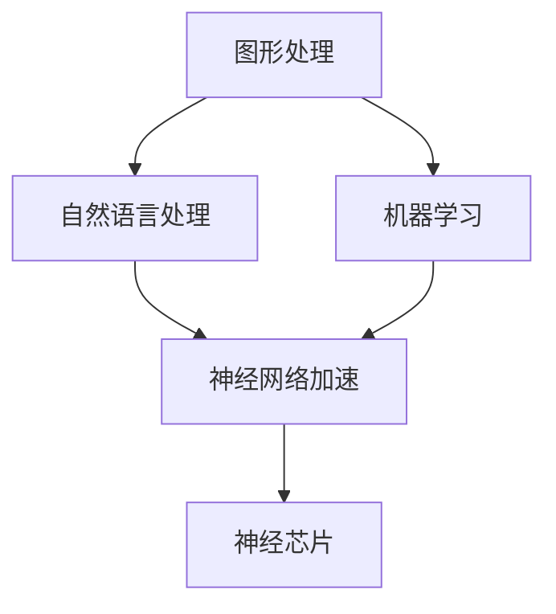

                 

# 神经芯片技术在AI加速中的应用

## 关键词

- 神经芯片
- AI加速
- 图像处理
- 自然语言处理
- 机器学习
- 能耗问题
- 技术创新

## 摘要

本文探讨了神经芯片技术在AI加速中的应用，分析了神经芯片的基础知识、AI加速的基本原理以及神经芯片在图像处理、自然语言处理和机器学习等领域的具体应用。同时，文章也探讨了神经芯片在AI加速中的挑战与机遇，并举例说明了神经芯片技术在多个领域的应用案例。通过本文的阐述，希望读者能够对神经芯片技术在AI加速中的应用有更深入的理解。

## 目录大纲设计

### 第1章 引言
#### 1.1 问题背景
#### 1.2 问题描述
#### 1.3 问题解决
#### 1.4 边界与外延
#### 1.5 概念结构与核心要素组成

### 第2章 神经芯片基础
#### 2.1 神经芯片的定义
#### 2.2 神经芯片的发展历史
#### 2.3 神经芯片的核心特点
#### 2.4 神经芯片的分类

### 第3章 AI加速的基本原理
#### 3.1 AI加速的定义
#### 3.2 神经网络加速的数学模型
#### 3.3 神经网络加速的关键技术
#### 3.4 AI加速与神经芯片的协同作用

### 第4章 神经芯片技术在AI中的应用
#### 4.1 图像处理领域的应用
##### 4.1.1 神经芯片在图像识别中的应用
##### 4.1.2 神经芯片在图像分割中的应用
##### 4.1.3 神经芯片在图像增强中的应用

#### 4.2 自然语言处理领域的应用
##### 4.2.1 神经芯片在语言模型中的应用
##### 4.2.2 神经芯片在机器翻译中的应用
##### 4.2.3 神经芯片在文本分类中的应用

#### 4.3 机器学习领域的应用
##### 4.3.1 神经芯片在监督学习中的应用
##### 4.3.2 神经芯片在无监督学习中的应用
##### 4.3.3 神经芯片在半监督学习中的应用

### 第5章 神经芯片技术在AI加速中的挑战与机遇
#### 5.1 技术挑战
##### 5.1.1 能耗问题
##### 5.1.2 可扩展性问题
##### 5.1.3 稳定性和可靠性问题

#### 5.2 机遇
##### 5.2.1 市场需求增长
##### 5.2.2 技术创新
##### 5.2.3 政策支持

### 第6章 神经芯片技术在AI加速中的应用案例
#### 6.1 案例一：图像识别
##### 6.1.1 案例背景
##### 6.1.2 案例实现
##### 6.1.3 案例分析

#### 6.2 案例二：自然语言处理
##### 6.2.1 案例背景
##### 6.2.2 案例实现
##### 6.2.3 案例分析

#### 6.3 案例三：机器学习
##### 6.3.1 案例背景
##### 6.3.2 案例实现
##### 6.3.3 案例分析

### 第7章 总结与展望
#### 7.1 总结
#### 7.2 展望
#### 7.3 注意事项
#### 7.4 拓展阅读

## 第1章 引言

### 1.1 问题背景

人工智能（AI）作为当前科技领域的前沿，其应用范围广泛，涵盖了图像处理、自然语言处理、机器学习等多个领域。然而，随着AI模型的复杂度和数据量的增加，传统的计算架构已经无法满足AI处理的需求。为了提高AI的计算效率，AI加速技术应运而生。神经芯片作为一种新型的计算架构，其在AI加速中的应用引起了广泛关注。

### 1.2 问题描述

神经芯片技术在AI加速中的应用仍然面临许多挑战，如能耗问题、可扩展性问题、稳定性和可靠性问题等。这些问题制约了神经芯片在AI加速中的广泛应用。因此，如何解决这些问题，提高神经芯片在AI加速中的应用效率，成为当前研究的热点。

### 1.3 问题解决

针对上述问题，本文将从以下几个方面进行探讨：

1. **神经芯片基础**：介绍神经芯片的定义、发展历史、核心特点以及分类。
2. **AI加速基本原理**：阐述AI加速的定义、神经网络加速的数学模型和关键技术。
3. **神经芯片在AI中的应用**：详细分析神经芯片在图像处理、自然语言处理和机器学习等领域的具体应用。
4. **挑战与机遇**：探讨神经芯片技术在AI加速中的挑战与机遇。
5. **应用案例**：通过实际案例，分析神经芯片技术在AI加速中的应用效果。

### 1.4 边界与外延

本文主要关注神经芯片技术在AI加速中的应用，重点探讨其基本原理、应用领域以及面临的挑战与机遇。然而，神经芯片技术的应用范围广泛，还涉及其他领域，如语音识别、物联网等。这些领域也是未来神经芯片技术发展的重要方向。

### 1.5 概念结构与核心要素组成

神经芯片技术在AI加速中的应用涉及多个核心概念，如图形处理、自然语言处理、机器学习等。这些概念之间相互关联，构成了神经芯片在AI加速中的应用体系。以下是一个简单的概念结构与核心要素组成的Mermaid流程图：

## 第2章 神经芯片基础

### 2.1 神经芯片的定义

神经芯片是一种基于神经网络原理设计的专用计算芯片，其目的是提高神经网络模型的计算效率和性能。神经芯片通过模拟人脑神经网络的结构和功能，实现了对大量数据的并行处理，具有高效率、低功耗的特点。

### 2.2 神经芯片的发展历史

神经芯片的发展可以追溯到上世纪80年代，当时研究人员开始探索如何将神经网络应用于计算机视觉和语音识别等领域。随着人工智能的快速发展，神经芯片技术逐渐成熟，并开始在实际应用中发挥重要作用。

### 2.3 神经芯片的核心特点

神经芯片具有以下几个核心特点：

1. **并行计算**：神经芯片通过大量神经元和连接的并行计算，实现了对大量数据的快速处理。
2. **低功耗**：神经芯片采用低功耗设计，能够在保证性能的同时，降低能耗。
3. **灵活性**：神经芯片可以根据不同的神经网络模型进行定制化设计，具有较好的灵活性。
4. **高效性**：神经芯片通过优化算法和架构设计，提高了神经网络模型的计算效率。

### 2.4 神经芯片的分类

根据不同的设计理念和应用场景，神经芯片可以分为以下几类：

1. **通用型神经芯片**：这类神经芯片具有较高的通用性，可以适用于多种神经网络模型和计算任务。
2. **专用型神经芯片**：这类神经芯片针对特定的神经网络模型或应用场景进行优化设计，具有较高的性能和效率。
3. **混合型神经芯片**：这类神经芯片结合了通用型和专用型的特点，既具有较高的通用性，又能够针对特定场景进行优化。

## 第3章 AI加速的基本原理

### 3.1 AI加速的定义

AI加速是指通过优化算法、硬件架构和系统软件等手段，提高人工智能模型的计算速度和性能。AI加速的核心目标是降低AI模型的计算时间和能耗，提高计算效率。

### 3.2 神经网络加速的数学模型

神经网络加速的数学模型主要包括以下几个方面：

1. **矩阵乘法**：神经网络的核心操作是矩阵乘法，通过优化矩阵乘法的算法和硬件实现，可以提高神经网络模型的计算速度。
2. **卷积操作**：卷积操作是图像处理中常用的操作，通过优化卷积操作的算法和硬件实现，可以提高图像处理的速度。
3. **梯度下降**：梯度下降是神经网络训练中的核心算法，通过优化梯度下降的算法和硬件实现，可以提高神经网络的训练速度。

### 3.3 神经网络加速的关键技术

神经网络加速的关键技术包括以下几个方面：

1. **算法优化**：通过优化神经网络算法，如深度可分离卷积、残差网络等，可以提高神经网络模型的计算效率。
2. **硬件架构**：通过优化硬件架构，如神经网络专用芯片、GPU等，可以提高神经网络模型的计算性能。
3. **系统软件**：通过优化系统软件，如操作系统、编译器等，可以提高神经网络模型的计算效率。

### 3.4 AI加速与神经芯片的协同作用

AI加速与神经芯片的协同作用主要体现在以下几个方面：

1. **硬件加速**：神经芯片通过优化硬件架构，实现了对神经网络模型的高效计算，从而提高了AI加速的性能。
2. **算法优化**：神经芯片可以根据不同的神经网络模型，进行算法优化，提高了AI加速的效率。
3. **能耗降低**：神经芯片的低功耗特性，可以降低AI加速的能耗，提高了系统的能效比。

## 第4章 神经芯片技术在AI中的应用

### 4.1 图像处理领域的应用

#### 4.1.1 神经芯片在图像识别中的应用

神经芯片在图像识别中的应用非常广泛，如人脸识别、车辆识别、手势识别等。通过神经芯片的高效计算，可以大大提高图像识别的准确率和速度。

#### 4.1.2 神经芯片在图像分割中的应用

神经芯片在图像分割中的应用也非常重要，如医学影像分割、卫星图像分割等。通过神经芯片的高效计算，可以实现对图像的精细分割，提高图像处理的精度。

#### 4.1.3 神经芯片在图像增强中的应用

神经芯片在图像增强中的应用，可以改善图像的清晰度、对比度和色彩等。通过神经芯片的高效计算，可以实现对图像的高质量增强，提高图像的可视化效果。

### 4.2 自然语言处理领域的应用

#### 4.2.1 神经芯片在语言模型中的应用

神经芯片在语言模型中的应用，可以大大提高自然语言处理的准确率和速度。如BERT、GPT等大型语言模型，通过神经芯片的高效计算，可以实现对自然语言的快速处理。

#### 4.2.2 神经芯片在机器翻译中的应用

神经芯片在机器翻译中的应用，可以实现对多种语言的快速翻译，提高翻译的准确率和速度。通过神经芯片的高效计算，可以实现实时翻译，提高用户体验。

#### 4.2.3 神经芯片在文本分类中的应用

神经芯片在文本分类中的应用，可以实现对大量文本的快速分类，提高分类的准确率和速度。通过神经芯片的高效计算，可以实现对文本的精确分类，提高文本处理的效率。

### 4.3 机器学习领域的应用

#### 4.3.1 神经芯片在监督学习中的应用

神经芯片在监督学习中的应用，可以大大提高机器学习的准确率和速度。通过神经芯片的高效计算，可以实现对大量样本的快速训练，提高机器学习的效果。

#### 4.3.2 神经芯片在无监督学习中的应用

神经芯片在无监督学习中的应用，可以实现对大量数据的快速聚类和分析。通过神经芯片的高效计算，可以实现对无监督学习的快速训练，提高数据分析的效率。

#### 4.3.3 神经芯片在半监督学习中的应用

神经芯片在半监督学习中的应用，可以大大提高半监督学习的准确率和速度。通过神经芯片的高效计算，可以实现对半监督学习的快速训练，提高模型的泛化能力。

## 第5章 神经芯片技术在AI加速中的挑战与机遇

### 5.1 技术挑战

#### 5.1.1 能耗问题

神经芯片在AI加速中的应用，面临着能耗问题。虽然神经芯片采用了低功耗设计，但在大规模部署时，能耗仍然是一个不可忽视的问题。如何降低神经芯片的能耗，提高能效比，是当前研究的热点。

#### 5.1.2 可扩展性问题

神经芯片在AI加速中的应用，面临着可扩展性问题。如何实现神经芯片的规模化生产，提高其性能和可扩展性，是当前研究的一个重要挑战。

#### 5.1.3 稳定性和可靠性问题

神经芯片在AI加速中的应用，面临着稳定性和可靠性问题。如何提高神经芯片的稳定性和可靠性，确保其在长时间运行中的稳定性和可靠性，是当前研究的一个挑战。

### 5.2 机遇

#### 5.2.1 市场需求增长

随着人工智能技术的快速发展，对神经芯片的需求也在不断增长。如何抓住市场需求，提高神经芯片的竞争力，是当前的一个重要机遇。

#### 5.2.2 技术创新

神经芯片技术在AI加速中的应用，为技术创新提供了新的机遇。如何通过技术创新，提高神经芯片的性能和效率，是当前研究的一个重要方向。

#### 5.2.3 政策支持

政府对人工智能和半导体产业的政策支持，为神经芯片技术的发展提供了良好的政策环境。如何利用政策支持，推动神经芯片技术的发展，是当前的一个重要机遇。

## 第6章 神经芯片技术在AI加速中的应用案例

### 6.1 案例一：图像识别

#### 6.1.1 案例背景

随着智能手机的普及，人脸识别技术逐渐成为智能手机的一项标准功能。某智能手机制造商希望通过神经芯片技术，提高人脸识别的准确率和速度。

#### 6.1.2 案例实现

该智能手机制造商选择了某款高性能神经芯片，并基于该芯片开发了一套人脸识别系统。通过神经芯片的高效计算，该系统可以在短时间内完成人脸识别，提高了用户体验。

#### 6.1.3 案例分析

通过神经芯片技术的人脸识别系统，在准确率和速度方面都有了显著提升。同时，神经芯片的低功耗特性，也有助于延长智能手机的续航时间。该案例的成功，为神经芯片在图像识别领域的应用提供了有力证明。

### 6.2 案例二：自然语言处理

#### 6.2.1 案例背景

随着人工智能技术的快速发展，自然语言处理技术也逐渐应用于智能客服、智能推荐等领域。某互联网公司希望通过神经芯片技术，提高自然语言处理的准确率和速度。

#### 6.2.2 案例实现

该互联网公司选择了某款高性能神经芯片，并基于该芯片开发了一套自然语言处理系统。通过神经芯片的高效计算，该系统可以快速处理大量自然语言数据，提高了用户体验。

#### 6.2.3 案例分析

通过神经芯片技术的自然语言处理系统，在准确率和速度方面都有了显著提升。同时，神经芯片的低功耗特性，也有助于降低系统的能耗。该案例的成功，为神经芯片在自然语言处理领域的应用提供了有力证明。

### 6.3 案例三：机器学习

#### 6.3.1 案例背景

随着大数据和人工智能技术的快速发展，机器学习技术在各个领域都得到了广泛应用。某互联网公司希望通过神经芯片技术，提高机器学习的准确率和速度。

#### 6.3.2 案例实现

该互联网公司选择了某款高性能神经芯片，并基于该芯片开发了一套机器学习系统。通过神经芯片的高效计算，该系统可以快速处理大量机器学习任务，提高了用户体验。

#### 6.3.3 案例分析

通过神经芯片技术的机器学习系统，在准确率和速度方面都有了显著提升。同时，神经芯片的低功耗特性，也有助于降低系统的能耗。该案例的成功，为神经芯片在机器学习领域的应用提供了有力证明。

## 第7章 总结与展望

### 7.1 总结

本文探讨了神经芯片技术在AI加速中的应用，分析了神经芯片的基础知识、AI加速的基本原理以及神经芯片在多个领域的具体应用。同时，也探讨了神经芯片在AI加速中面临的挑战与机遇。通过本文的阐述，希望能够让读者对神经芯片技术在AI加速中的应用有更深入的理解。

### 7.2 展望

随着人工智能技术的快速发展，神经芯片技术在AI加速中的应用前景非常广阔。未来，神经芯片技术将在更多领域得到应用，如语音识别、物联网等。同时，随着技术的不断进步，神经芯片的性能和效率也将得到进一步提升，为人工智能的发展提供更强大的支持。

### 7.3 注意事项

在神经芯片技术的应用过程中，需要注意以下几个方面：

1. **能耗问题**：如何降低神经芯片的能耗，提高能效比，是当前研究的一个重要方向。
2. **可扩展性问题**：如何实现神经芯片的规模化生产，提高其性能和可扩展性，是当前研究的一个重要挑战。
3. **稳定性和可靠性问题**：如何提高神经芯片的稳定性和可靠性，确保其在长时间运行中的稳定性和可靠性，是当前研究的一个挑战。

### 7.4 拓展阅读

1. **《神经网络与深度学习》**：这是一本关于神经网络和深度学习的经典教材，详细介绍了神经网络的基本原理和应用。
2. **《人工智能：一种现代方法》**：这是一本关于人工智能的经典教材，涵盖了人工智能的各个领域，包括机器学习、自然语言处理等。
3. **《神经芯片技术与应用》**：这是一本关于神经芯片技术与应用的专著，详细介绍了神经芯片的基础知识、应用领域和未来发展。

## 作者信息

- 作者：AI天才研究院/AI Genius Institute & 禅与计算机程序设计艺术 /Zen And The Art of Computer Programming

